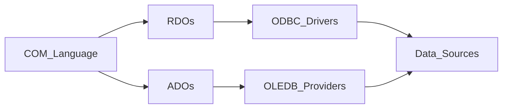

## MVC Question:

### Q. What is MVC?

---

- MVC stands for Model-View-Controller.It is an desine pattern. It is a way to organize an application into three main parts to make it easier to manage and understand.

---

### Q. How it works Model, View and Controller?

---

- **Controller:** Receives user input (like clicking a button or typing in a form) and decides what to do next. The Controller selects a View to display the data from the Model to the user in a clear and understandable format.
- **Model:** The Controller uses the Model to fetch, update and manuplate data performing any needed calculations or data processing.
- **View:** The View is responsible for showing the data to the user. It handles how the information is displayed but doesn’t include much logic for handling data. Use to present the information.

---

### Q. What is the diffrence bitween ASP.NET MVC and ASP.NET Core MVC?⭐

---

| **Feature**                 | **ASP.NET MVC**                                             | **ASP.NET Core MVC**                                                   |
| --------------------------- | ----------------------------------------------------------- | ---------------------------------------------------------------------- |
| **Platform**                | Runs only on Windows.                                       | Cross-platform (runs on Windows, Linux, macOS).                        |
| **Performance**             | Slower compared to Core MVC due to older framework design.  | Faster due to lightweight and modular design.                          |
| **Framework**               | Built on the .NET Framework.                                | Built on .NET Core, now part of the unified .NET platform.             |
| **Versioning**              | Separate versions from .NET Framework versions.             | Shares versioning with .NET Core.                                      |
| **Hosting**                 | Can only be hosted on IIS (Internet Information Services).  | Can be hosted on IIS, Kestrel, Docker, or self-hosted.                 |
| **Modularity**              | Less modular; has a large, monolithic framework.            | Highly modular; supports a small, optimized runtime.                   |
| **Dependency Injection**    | Supports Dependency Injection but with limited flexibility. | Has built-in, more flexible Dependency Injection support.              |
| **Updates and Maintenance** | Older, no longer actively developed or maintained.          | Actively developed with new features and updates.                      |
| **Configuration System**    | Uses XML-based configuration files like `web.config`.       | Uses a simple, code-based configuration (JSON, environment variables). |
| **Middleware**              | Limited middleware support.                                 | Rich middleware support to handle requests in a pipeline.              |

---

## **`ASP.NET MVC 5`**(ASP.NET Web Application (.NET Framework))

### Q. What is the last version of ASP.NET MVC on the .NET Framework, and what version came after it?

---

- The last version of ASP.NET MVC on the .NET Framework is ASP.NET MVC 5. The next version was initially named MVC 6, but it was later renamed to ASP.NET Core MVC and was built to run on the .NET Core platform, which is cross-platform and offers improved performance and modularity.

- **ASP.Net MVC**: December 2007 (ASP.NET MVC CTP) to June 2022 (ASP.Net MVC 5.2.9) last version.
- **ASP.Net Core MVC**: August 2016 (ASP.NET Cpre MVC 1.0) to November 2023 (ASP.Net Core MVC 8.0) last version.

- No Seperate version for ASP.Net core. it same as .Net Core version.

---

### Q. What is the MVC Project Structure?

---

MVC and Empty Project Structure

| **Type**   | **MVC Project**    | **Empty Project**  | **Description** |
| ---------- | ------------------ | ------------------ |-----------------|
| **Folder** | Connected Services | Connected Services | Used for integrating Microsoft Azure Service into Visual Studio, for easily host and manage our application to Azure Portal from Visual Studio it-self. |
| **Folder** | App_Data           |                    | Contains local Data Source files like “.mdf” files, “.xml” files, “Excel” files, etc. |
| **Folder** | App_Start          | App_Start          |  |
| **Folder** | Content            |                    | Contains static files like “.css” files, “image”, files, etc. |
| **Folder** | Controllers        | Controllers        |  |
| **Folder** | Models             | Models             |  |
| **Folder** | Scripts            |                    | Contains Java Script or jQuery files |
| **Folder** | Views              | Views              |  |
| **File**   | Global.asax        | Global.asax        |  |
| **File**   | Packages.config    | Packages.config    |  |
| **File**   | Web.config         | Web.config         |  |

In an **Empty Project**, the structure is usually more minimal.

1. **App_Start**: This folder contains a set of files which contains classes, and these classes get executed when the application starts execution. App_Start folder can contain following files in it:

    - **BundleConfig.cs:** Contains BundleConfig Class
    - **FilterConfig.cs:** Contains FilterConfig Class
    - **IdentityConfig.cs:** Contains IdentityConfig Class
    - **RouteConfig.cs:** Contains RouteConfig Class
    - **Startup.Auth.cs** Contains Startup Class
    - In an Empty Project Template, the "App_Start" folder contains only the "RouteConfig.cs" file. In an MVC Project Template, the "App_Start" folder includes `BundleConfig.cs`, `FilterConfig.cs`, and `RouteConfig.cs` files.

2. **Global.asax**:
    - Global.asax is a file that contains the Global class for application-level configuration. It includes methods such as:
    - **Application_Start:** Runs when the application starts.
    - **Application_End:** Runs when the application ends.
    - **Application_Error:** Handles application-level errors.
    - **Session_Start:** Runs when a session starts.
    - **Session_End:** Runs when a session ends.

3. **Packages.config**:
    - This contains information of packages that are used under this project, so that anyone can easily understand if there are any 3rd party packages consumed for the development of this application.

4. **Web.config**:
    - This is a configuration file for the whole application which contains configuration settings like “App Settings”, “Connection Strings”, “Network Settings”, “Compiler Settings”, etc.

---

### Q. What should be the parent class of all controllers in an MVC application? ⭐

---

- The parent class for all controllers should be the *`Controller`* class, which itself is a child of the *`ControllerBase`* class. Both these classes are defined in the System.Web.Mvc namespace.

---


### Q. Which namespace should you import when defining a controller manually? 

---

- You should import the "System.Web.Mvc" namespace when defining a controller manually.

---

### Q. How should you define a controller class with accetion method in ASP.NET MVC?

---

- A controller class should inherit from the Controller class.
  ```C#
    using System.Web.Mvc;

    namespace MyController.Controllers
    {
      public class TestController : Controller
      {
        public string Index()
        {
        return "Hello index page";
        }
        public string Show()
        {
        return "Hello index page";
        }
      }
    }
  ```

  Access the Index action method of the TestController class in the browser?
  - To access the Index action method, add /Test/Index to the default URL in the browser. 
  For example Index: http://localhost:port/Test/Index or http://localhost:port/Test or http://localhost:port/Test/Index.cshtml 
  For example show: http://localhost:port/Test/show or http://localhost:port/Test/show.cshtml 

---

### Q. What is an action method in an ASP.NET MVC controller? ⭐

---

- An action method is a public method in a controller class that handles incoming requests and returns a response. Each controller must have at least one action method.

---

### Q. Is it necessary for an action method to be public in a controller class?

---

- Yes, an action method must be public because only public methods can be accessed by the ASP.NET MVC framework to handle incoming HTTP requests. Private or protected methods cannot be access by HTTP requests.

---

### Q. Why is it important to have at least one action method in a controller class?

---

- It is important because a controller without any action methods cannot handle any requests, making it ineffective in responding to user interactions.

---

### Q. Why is required to run a web application under Visual Studio?

---

- A web server is required to run a web application. Visual Studio provides a built-in web server called "IIS Express" to run and test web applications during development.

---

### Q. What is IIS Express in Visual Studio?

---

- IIS Express is a built-in development web server in Visual Studio. It starts automatically when you run a web application, allowing you to test the application locally.

---

### Q. How does IIS Express assign addresses to web applications?

---

- IIS Express assigns a unique numeric logical address called a "Port" to each web application for identification. This port number varies between projects and machines.

---

### Q. How many ports are available for web applications, and what range do they cover?

---

- There are 65,536 available ports, ranging from 0 to 65,535, and IIS Express allocates one of these ports randomly to each web application.

---

### Q. What is the difference between IIS Express and IIS in production environments?

---

- IIS Express is used for local development and only allows access from the local computer, while IIS (Internet Information Services) is used in staging and production environments for remote access and runs independently, providing 24/7 availability.

---

### Q. How can you host a web application in IIS from Visual Studio?

---

- Open it in Administrator mode

- To host a web application in IIS from Visual Studio, open Solution Explorer, right-click on the project, and select Properties. In the Project Property Window, select Web from the left-hand side (LHS). Under the Servers section, change the dropdown value from IIS Express to Local IIS. Click on the Create Virtual Directory button to deploy the application in IIS, then save the changes.

---

### Q. What does the "Create Virtual Directory" button do?

---

- The Create Virtual Directory button deploys or hosts the web application in IIS, creating a virtual directory on the local server that maps to the application's folder.

---

### Q. How do you run the application after hosting it in IIS?

---

- After hosting the application in IIS, press F5 to run the project. This will launch the browser with the URL like **http://localhost/ProjectName** (ex: **http://localhost/MVCTestProject3**). To run specific action methods, add paths like /Test/Index or /Test/Show to the URL **http://localhost/ProjectName/ControllerName/ViewName** (ex: **http://localhost/MVCTestProject3/Test/Index**).

---

### Q. What is the role of IIS in running the web application after deployment?

---

- IIS (Internet Information Services) acts as a web server that hosts the deployed application, handling incoming HTTP requests and serving the appropriate responses, allowing the application to be accessed from the local machine or network.

---

### Q. What is the default controller & action method in an MVC application?

---

- The default action method for all controllers in an MVC application is the Index action method. If an action method name is not specified in the URL, the Index action method is executed by default.

- The default controller in an MVC application is the HomeController. When a specific controller is not mentioned in the URL, the HomeController is invoked by default.

---

### Q. Where is the information for the default controller “Home” and the default action method “Index” specified?

---

- The details for the default controller ("Home") and the default action method ("Index") are specified in the RouteConfig.cs file located in the App_Start folder. The configuration looks like this:

```C#
public class RouteConfig
{
    public static void RegisterRoutes(RouteCollection routes)
    {
        routes.IgnoreRoute("{resource}.axd/{*pathInfo}");
        routes.MapRoute(
            name: "Default",
            url: "{controller}/{action}/{id}",
            defaults: new { controller = "Home", action = "Index", id = UrlParameter.Optional }
        );
    }
}

```

---

### Q. What is a Route in ASP.NET?

---

- A route is a URL pattern that is mapped to a handler, which can be a class that processes the request, such as a controller in an MVC application. Routes are defined by creating an instance of the Route class, specifying the URL pattern, the handler, and optionally a name for the route. Routes are stored in the RouteCollection object, which is accessed through the static Routes property of the RouteTable class.

---

### Q. How does Routing work in ASP.NET?

---

- Routing works by defining URL patterns that map to request-handler files. It allows the use of placeholders in a URL pattern so that variable data can be passed to the request handler without requiring a query string. For example, with the route {controller}/{action}/{id}, the URL http://localhost:port/Products/Show/4 would parse Products as the controller, Show as the action, and 4 as the id.

---


### Q. How are routes typically defined in an MVC application?

---

- In an MVC application, routes are usually pre-configured and defined in the RouteConfig class, located in the RouteConfig.cs file. These routes are registered in the Application_Start method of the MVCApplication class, defined in the Global.asax file, by calling the RouteConfig.RegisterRoutes method.

---

### Q. What are URL Patterns, and how do they work with Routing

---

- URL patterns consist of literal values and variable placeholders (URL parameters) separated by the slash (/) character. Placeholders are enclosed in curly braces {} and are used to pass variable values to the request handler. For example, in the URL pattern `{controller}/{action}/{id}`, the placeholders controller, action, and id will be replaced by actual values from the URL during request handling.

---

### Q. Can multiple placeholders be used in a single segment of a URL pattern?

---

- Yes, multiple placeholders can be used in a single segment of a URL pattern, but they must be separated by a literal value. For example, {language}-{country}/{action} is a valid pattern, while {language}{country}/{action} is not because there is no literal value or delimiter between language and country.

---

### Q. Can we define multiple routes in the RouteConfig class?

---

- Yes, we can define multiple routes in the RouteConfig class. The MVC framework evaluates each route in the order they are defined. If the incoming URL does not match the pattern of the first route, it moves on to the next route, and so on.

---

### Q. How do we define multiple routes in the RouteConfig class?

---

- To define multiple routes, you add them to the RouteConfig.cs file before the default route. For example:

```C#
routes.MapRoute(
name: "Student",
url: "NIT/Students",
defaults: new { controller = "Student", action = "Index" }
);

routes.MapRoute(
    name: "Default",
    url: "{controller}/{action}/{id}",
    defaults: new { controller = "Home", action = "Index", id =    UrlParameter.Optional }
);

```

- In this case, the Student route will be evaluated first. If the request does not match this route, it will move to the Default route. But use default route in last.

---

### Q. What happens if we define the default route before other custom routes?

---

- If the default route is defined first, it will handle all incoming requests that match its pattern ({controller}/{action}/{id}), making it impossible for other custom routes to be evaluated. To prevent this, always define the default route last.

---


### Q. Can the parameter name in the action method differ from the route parameter name?

---

- No, the parameter name in the action method must match the name defined in the route configuration (like id in {controller}/{action}/{id}). If the parameter name does not match, the value passed through the route will not be mapped to the action method parameter. For example:
- public string Index4(int x) will not map the id value from the URL correctly because the parameter name x does not match id.

---

### Q. Is the id parameter type restricted in action methods?

---

- The id parameter is not restricted to a specific type. You can define it as any type in the action method. For example:
- public string Index6(string Id) allows Id to be a string.
  You can then pass different types of values (Hello, 600, true) to this action method.
- If action method need parameter as a integer then action method will not be invoked, and you'll typically get a 404 Not Found or an error page.

---

### Q. How can we pass multiple parameters to an action method?

---

- To pass multiple parameters, modify the route URL pattern in the RouteConfig class to include additional placeholders. For example:

```C#

url: "{controller}/{action}/{id}/{name}"
```

**This allows you to pass two parameters (id and name) to an action method.**

```C#
//Passing value to id is mandatory
public string Index1(int id)
{
return "The value of id is: " + id;
}

//Passing value to id is optional and if not passed value will be "0"
public string Index2(int id = 0)
{
return "The value of id is: " + id;
}

//Passing value to id is optional and if not passed value will be   "null"
public string Index3(int? id)
{
return "The value of id is: " + id;
}

//Passing value to Id is option because it is defined as type string & strings are by default Nullable (reference types)
public string Index6(string Id)
{
return "The value of id is: " + Id;
}

//Passing value to Id is mandatory and Name is optional
public string Index7(int Id, string Name)
{
return $"Value of Id is: {Id} and value of Name is: {Name}";
}
//Passing values to Id and Name are optional
public string Index8(int? Id, string Name)
{
return $"Value of Id is: {Id} and value of Name is: {Name}";
}

```
---

### Q. How to pass value in method using Query string?

---

```c#
public string Index9(int Pid, string Pname, double Price)
{
  return $"Pid: {Pid}; Pname: {Pname}; Price: {Price}";
}
```
---

### Q. Is that posible to pass pass value without defining the parameters to an action method wusing querystring? If yes then How?

---

```C#
public string Index10()
{
  int Pid = int.Parse(Request.QueryString["Pid"]);
  string Pname = Request.QueryString["Pname"];
  double Price = double.Parse(Request.QueryString["Price"]);
  return $"Pid: {Pid}; Pname: {Pname}; Price: {Price}";
}
```

In this case, this type of example is not related to `RouteConfig`, not mendatry to write parameter name or define parameter.

---

### Q. What is the diffrence bitween this three method?

```C#
public string Index10()
{
  int Pid = int.Parse(Request.QueryString["Pid"]);
  string Pname = Request.QueryString["Pname"];
  double Price = double.Parse(Request.QueryString["Price"]);
  return $"Pid: {Pid}; Pname: {Pname}; Price: {Price}";
}
```

```c#
public string Validate1()
{
  string Name = Request["Name"];
  string Pwd = Request["Pwd"];
  if (Name == "Raju" && Pwd == "Admin")
    return "Valid User";
  else
    return "Invalid User";
}

```

```c#
public string Validate2(string Name, string Pwd)
{
  if (Name == "Raju" && Pwd == "Admin")
    return "Valid User";
  else
    return "Invalid User";
}

```

---

**Index10() Method:**

- Uses Request.QueryString to fetch parameters (Pid, Pname, Price) exclusively from the URL `query string` (e.g., ?Pid=101&Pname=Shoes&Price=3500).
- Do not rely depend on the `RouteConfig` file since they extract data directly from the Request object. It's not depend for parameter on the `RouteConfig` file.

**Validate1() Method:**

- Uses Request["Name"] and Request["Pwd"] to `get data from either the query string or form data`.
- This is more flexible in terms of input sources since it can handle both URL query strings and form submissions.
- No parameters are passed directly to the method; it relies on Request to retrieve data.
- Do not rely depend on the `RouteConfig` file since they extract data directly from the Request object. It's not depend for parameter on the `RouteConfig` file.

**Validate2() Method:**

- Takes parameters directly (Name, Pwd) as method arguments, making it more explicit.
- Relies on Model Binding in ASP.NET MVC to pass parameters to the method.
- It is a cleaner way to handle input since it does not access Request directly.
- Fully Depends on the RouteConfig file for defining how URL segments map to its method parameters. It's fully depend for parameter on the `RouteConfig` file.

---

### Q. What happens if a route parameter is not provided for an action method that requires it?

---

- If a route parameter is not provided and the action method requires it, the behavior depends on how the parameter is defined:
  - **Mandatory Parameter:**If the parameter is required (e.g., public string Index1(int id)), it will result in an error if not provided (e.g., http://localhost:port/Params/Index1).
  - **Optional Parameter with Default Value:**If the parameter is optional with a default value (e.g., public string Index2(int id = 0)), it will use the default value when not provided (e.g., http://localhost:port/Params/Index2).
  - **Nullable Parameter:**If the parameter is nullable (e.g., public string Index3(int? id)), it will be null if not provided (e.g., http://localhost:port/Params/Index3).

---

### Q. Why do some URLs result in an "Invalid" response while others are "Valid"?

---

- URLs result in "Invalid" responses when the action method expects a parameter that is not provided or does not match the expected type. URLs are "Valid" when the provided parameters match the action method's requirements or default values.

---

### Q. What ia Action method?

---

The methods that we defined under the Controller class for performing user interactions are known as Action methods i.e., users will directly call these methods for performing actions.

---

### Q. What should you do if you encounter an error when accessing a URL with missing parameters?

---

- Check if the action method requires parameters and if they are provided in the URL. If a parameter is missing but required, you'll get an error. Make sure your action methods handle missing or optional parameters correctly. You can set default values or make parameters optional to avoid errors.

---

## **`Views`**

### Q. What are the rules follow for defining the action method?

---

1. Action methods must be public, so every public method in a Controller class is an Action method only.
2. Action methods cannot be static because behind the screen instance of the Controller class is used for calling
   the Action methods.
3. It is not suggested to overload Action methods, but if required we can still do that by decorating the method with “ActionName” attribute.

```C#
[ActionName("SayHello1")]
public string SayHello()
{
  return "Hello how are you?";
}
[ActionName("SayHello2")]
public string SayHello(string Name)
{
  return "Hello " + Name + " how are you?";
}

//Note: In the above case, we must call the method using the custom "ActionName" defined, not the original method name. To test this, define the methods inside the `ParamsController` class, and call them using the custom names provided.

//We can execute the above methods following:
http://localhost/MVCTestProject3/Params/SayHello1
http://localhost/MVCTestProject3/Params/SayHello2?Name=Raju

```

4. If we want to define any non-action methods in a controller class, make sure they are not public or else decorate them with “NonAction” attribute and in this case when we try to access those methods from browser we get “404 Not Found” error.

```c#
<private or internal or protected or private protected or protected internal> string Display()
{
  return "Non-Action Method";
}
//Or
[NonAction]
public string Display()
{
  return "Non-Action Method";
}
```

5. Action methods are generally value returning and very importantly in an MVC Application - Action Methods return type is an “ActionResult”, where “ActionResult” is a class type and under this class there are a set of child classes and we call all those classes as Action Result’s only, and we can use any of those child classes as a
   return type of our Action method.

**List of ActionResult child classes is:**

<ul>
<li>ActionResult
<ol>
<li>FileResult
  <ul>
    <li>FilePathResult</li>
    <li>FileStreamResult</li>
    <li>FileContentResult</li>
  </ul>
</li>
<li>JsonResult</li>
<li>ViewResult</li>
<li>EmptyResult</li>
<li>ContentResult</li>
<li>RedirectResult</li>
<li>JavaScriptResult</li>
<li>PartialViewResult</li>
<li>HttpStatusCodeResult</li>
<li>RedirectToRouteResult</li>
</ol>
</li>
</ul>

**General signature of an Action method will be as following:**

```C#
 public <ActionResult> <Name>( [<Parameter List>] )
 {
   -Implement all the required logic here
   -return an ActionResult
 }
 //Note: The main ActionResult of an action method is ViewResult. A  View in an MVC application is the UI containing the presentation  logic. Its file extension is .cshtml for C# and .vbhtml for VB.NET.

```

6. An Action method to return an “ActionResult”, we are provided with a set of methods known as “HelperMethods” and these helper methods are defined under Controller class, which is the parent or base class for
   all the controllers we define.

| **Helper Method**                  | **Action Result**     | **Description**                                                                                                          |
| ---------------------------------- | --------------------- | ------------------------------------------------------------------------------------------------------------------------ |
| File                               | FileResult            | Represents a class that is used to send file content as response.                                                        |
| Json                               | JsonResult            | Represents a class that is used to send JSON-Formatted content as response                                               |
| View                               | ViewResult            | Sends a view as response                                                                                                 |
| ---                                | EmptyResult           | Represents a result that does nothing, such as controller action method which returns void.                              |
| Content                            | ContentResult         | Represents a user-defined content type, which is sent as a response                                                      |
| Redirect                           | RedirectResult        | Controls the processing of application’s action method by redirecting to a specified URI.                                |
| JavaScript                         | JavaScriptResult      | Sends JavaScript content as a response (currently this is not supported by the modern browsers and removed in MVC Core). |
| PartialView                        | PartialViewResult     | Sends a partial view as response.                                                                                        |
| HttpNotFound                       | HttpStatusCodeResult  | Provides a way to return an action result with a specific HTTP Status Code and Description.                              |
| RedirectToRoute / RedirectToAction | RedirectToRouteResult | Represents a result that performs a redirection to an action method by using the specified route values dictionary       |

**Note:** The helper methods are defined in the under the Controller class (ie: `ParamsController.cs`). To view the pre-defined Controller class and its metadata, right-click on the Controller class in ParamsController.cs and select "Go to Definition."

---

### Q. What is the role of the "Views" folder in an MVC application?

---

- The View Folder contain Ui components for presenting data to users and accepting user input. Each controller has its own folder under "Views" to store its related views. For example, an EmployeeController will have a corresponding Employee folder under "Views" for its views.

- If a controller is added using scaffolding, the associated folder for its views is created automatically. For manually added controllers, you must create the folder yourself. Additionally, a "Shared" folder can be used for views that are common to multiple controllers.

---

### Q. What does a View contain in an ASP.NET MVC application?

---

A View contains presentation code that combines C# or VB with HTML, and can also include CSS and JavaScript. The View's logic is processed and converted into HTML through a process called "Rendering."

---

### Q. What is rendering in ASP.NET MVC?

---

Rendering is the process where the server-side logic is converted into HTML text, which is then sent to the client. This allows for consistent display of content across different devices and browsers.

---

### Q. What are the two View Engines available in ASP.NET MVC?

---

**The two View Engines are:**

1. **Web Forms Engine :**

- Introduced with MVC 2008.
- Uses .aspx.cs or .aspx.vb extensions.
- Coding style similar to ASP.NET Web Forms.
- Sample Web Form page with for loop:

```C#
<%
  for(int i=1;i<=10;i++)
  {%>
    <h3>Hello World</h3>
  <%
  }
%>
```

2. **Razor Engine**

- Introduced in MVC 3.0.
- Uses .cshtml or .vbhtml extensions.
- Recommended for its advanced features and easier syntax.
- Supports embedding HTML with C# or VB code.
- Sample Razor page with for loop:

```c#
@{
  for(int i=1;i<=10;i++)
  {
    <h3>Hello World</h3>
  }
}
```

Apart from the above 2 View Engines, ASP.NET MVC also supports many other third-party View Engines also like “NHaml”, “Brail”, “NDjango”, “Spark”, “Hasic”, etc.

---

### Q. How do you create and use Action methods and Views in an ASP.NET MVC application?

---

1. Creating Action Methods:

**Define:** Add controller class (ie: `HomeController.cs`) in controller folder. Define method and return type is `ViewResult`.

```C#
public ViewResult Index()
{
    return View();
}
public ViewResult Register()
{
    return View();
}

public ViewResult Login()
{
    return View();
}
```

- HomeController is bydefault controll wich run first according to you requirement you can change.

2. Adding Views:
   **Folder Structure:** Views are placed under the Views folder, with a subfolder for each Controller (e.g., Views/Home for HomeController).
   **Creating Views:** Right click on method name select Add View select MVC 5 View click on Add then Select Empty(without model) Template and uncheak all checkbox and click on Add. Or another way to create view Go to Home folder whic is in View folder write click > click Add > click view then create view. Use normal html to create view.

- `Index View`: Create `Index.cshtml` with links to other views =.
- `Register View`: Create `Register.cshtml` with a registration form.
- `Login View`: Create `Login.cshtml` with a login form.

Write this code inside the div:
`Index View`

```html
<h1 style="text-align:center;color:red;text-decoration:underline">
  Naresh I Technologies
</h1>
<h2>Click on the links below to navigate:</h2>
<h3>
  <a href="/Home/Register">Register</a> <br />
  <a href="/Home/Login">Login</a> <br />
  <a href="/Home/ForgotPassword">Forgot Password</a><br />
  <a href="/Home/ResetPassword">Reset Password</a><br />
  <a href="/Home/Contact">Contact Us</a><br />
  <a href="/Home/Mission">Mission</a><br />
  <a href="/Home/About">About Us</a><br />
</h3>
```

`Register View`

```html
<h1 style="text-align:center;color:red;text-decoration:underline">
  Naresh I Technologies
</h1>
<h3 style="text-align:center;text-decoration:underline">Registration Page</h3>
<table align="center">
  <tr>
    <td>Name:</td>
    <td><input type="text" id="txtName" name="txtName" /></td>
  </tr>
  <tr>
    <td>User Id:</td>
    <td><input type="text" id="txtUid" name="txtUid" /></td>
  </tr>
  <tr>
    <td>Password:</td>
    <td><input type="password" id="txtPwd" name="txtPwd" /></td>
  </tr>
  <tr>
    <td>Confirm Password:</td>
    <td><input type="password" id="txtCPwd" name="txtCPwd" /></td>
  </tr>
  <tr>
    <td>Mobile:</td>
    <td><input type="tel" id="txtMobile" name="txtMobile" /></td>
  </tr>
  <tr>
    <td>Email Id:</td>
    <td><input type="email" id="txtEmail" name="txtEmail" /></td>
  </tr>
  <tr>
    <td colspan="2" align="center">
      <input type="submit" id="btnRegister" value="Register" />
      <input type="reset" id="btnReset" value="Reset" />
    </td>
  </tr>
</table>
<h4 style="text-align:center;color:red">
  Click here to go to <a href="/Home/Index">Home Page.</a>
</h4>
```

`Login View`

```html
<h1 style="text-align:center;color:red;text-decoration:underline">
  Naresh I Technologies
</h1>
<h3 style="text-align:center;text-decoration:underline">Login Page</h3>
<table align="center">
  <tr>
    <td>User Id:</td>
    <td><input type="text" id="txtUid" name="txtUid" /></td>
  </tr>
  <tr>
    <td>Password:</td>
    <td><input type="password" id="txtPwd" name="txtPwd" /></td>
  </tr>
  <tr>
    <td colspan="2" align="center">
      <input type="submit" id="btnLogin" value="Login" />
      <input type="reset" id="btnReset" value="Reset" />
    </td>
  </tr>
</table>
<h4 style="text-align:center;color:red">
  Click here to go to <a href="/Home/Index">Home Page.</a>
</h4>
```

**Note:** While launching a View the Action method name and View name match, simply calling View() is sufficient. When they differ, specify the view name or path.

---

### Q. Can the Action method name and View name be different?

---

Yes, Action method name and View name can be different, and if they are different, we need to explicitly pass View name or path of that View as a parameter to the Helper method. To test this, add 2 new Views naming them as “ForgotPwd” and “ResetPwd”.

**Example:**

Create 2 View:
`ForgotPwd.cshtml`

```html
<h1 style="text-align:center;color:red;text-decoration:underline">
  Naresh I Technologies
</h1>
<div style="text-align:center;background-color:cyan">
  Forgot your password? Enter your registered Email Id, to receive a reset
  password link.
  <br />
  Email Id:
  <input type="email" id="txtEmail" name="txtEmail" />
  <input type="submit" id="btnSubmit" value="Submit" />
</div>
<h4 style="text-align:center;color:red">
  Click here to go to <a href="/Home/Index">Home Page.</a>
</h4>
```

`ResetPwd.cshtml`

```html
<h1 style="text-align:center;color:red;text-decoration:underline">
  Naresh I Technologies
</h1>
<div style="text-align:center;background-color:cyan">
  <h4>Reset Password</h4>
  <table align="center">
    <tr>
      <td>New Password:</td>
      <td><input type="password" id="txtPwd" name="txtPwd" /></td>
    </tr>
    <tr>
      <td>Confirm Password:</td>
      <td><input type="password" id="txtCPwd" name="txtCPwd" /></td>
    </tr>
    <tr>
      <td colspan="2" align="center">
        <input type="submit" id="btnSubmit" value="Submit" />
        <input type="reset" id="btnReset" value="Reset" />
      </td>
    </tr>
  </table>
</div>
<h4 style="text-align:center;color:red">
  Click here to go to <a href="/Home/Index">Home Page.</a>
</h4>
```

Create controller for this View:

```c#
public ViewResult ForgotPassword()
{
  return View("ForgotPwd");//Use direct name when View present in Share or representing controller view folder. Another wise not work you got error.
}
public ViewResult ResetPassword()
{
  return View("~/Views/Home/ResetPwd.cshtml");//Targert the view when view is any place.
}
```

**Note:** in the above case Action method names are not matching with View names so we are explicitly passing View name as parameter to the Action method and that can be done in any of the above 2 ways.

---

### Q. Is it mandatory to place the View exactly under the folder representing the Controller?

---

No, it is not mandatory. Views can also be placed in the "Shared" folder or representing Controller folder under the Views folder, which is a common folder for storing views that are shared across multiple controllers.
**Example:**

- Create a Contact.cshtml view in the Shared folder.
- The View Engine will first search for the view in the controller-specific folder (e.g., Views/Home), and if not found, it will look in the Shared folder.

```c#
public ViewResult Contact()
{
    return View();  // Will load Contact.cshtml from Shared folder if not found in Home folder
}
```

- If the view is placed in another folder (like Views/Test), you will need to explicitly specify the path in the Action method.

```c#
public ViewResult Mission()
{
    return View("~/Views/Test/Mission.cshtml");  // View path is explicitly given
}
```

This flexibility allows for better organization and sharing of views across controllers.

---

### Q: What is the default View Engine in an MVC 5 Application?

---

The default View Engine in an MVC5 Application is **Web Form Engine**. This means if a View page exists with both `.aspx` (Web Form) and `.cshtml` (Razor) extensions, the first preference is given to the `.aspx` View.

- **Testing this**: Add two Views into the `Home` folder named `About.aspx` and `About.cshtml`. By default, MVC will load the `.aspx` view first.
- **Important Note**: Starting from MVC5, Visual Studio removed direct support for adding "Web Form Views." To add one, you must manually add an **ASP.NET Web Form** and adjust it to function as a Web Form View Page.

Example of adding a Web Form (`About.aspx`):

1. **Create About.aspx**:

- Right-click on the `Home` folder under `Views`. Select **Add => New Item**, choose **Web Form**, and name it `About.aspx`. Write the following HTML inside the `<div>` tag:

```html
<h3 style="text-align: center">
  About page created using Web Form View Engine.
</h3>
```

2. **Change Inheritance**:

- Open `About.aspx.cs` (right-click `About.aspx` and select **View Code**).
- Change the class inheritance from `System.Web.UI.Page` to `System.Web.Mvc.ViewPage`.

3. **Create About.cshtml**:(Razor view)

- Add another view named `About.cshtml` in the same `Home` folder.Write the following HTML inside the `<div>` tag:

```html
<h3 style="text-align: center">About page created using Razor View Engine.</h3>
```

- Now go to HomeController class and add a new Action Methods in the class as following:

```c#
public ViewResult About()
{
    return View();
}
```

Now launch Index View and click on the “About Page” hyper link and this will launch “About.aspx” page because by default it will search for “.aspx” pages first, whereas if we want “About.cshtml” page to be launched we need to pass the path of “About.cshtml” file as parameter to Helper method and to test that re-write code in
“About” action method as following:

```c#
public ViewResult About()
{
    return View("~/Views/Home/About.cshtml");
}
```

---

### Q. How to remove `Web form engion` and use only `Razor View Engine`?

---

To do this, you need to either clear all View Engines and re-add the Razor View Engine or remove the Web Form View Engine. This ensures the Razor View Engine is the default.

Here’s how to configure it:

1. **Option 1: Clear all View Engines and add Razor View Engine**: In the Global.asax file, inside the Application_Start method, add this code:

```c#
ViewEngines.Engines.Clear();
ViewEngines.Engines.Add(new RazorViewEngine());
```

2. **Option 2: Remove only the Web Form View Engine**: Alternatively, if you just want to remove the Web Form View Engine (but keep any others), you can do this:

```c#
ViewEngines.Engines.Remove(ViewEngines.Engines.OfType<WebFormViewEngine>().FirstOrDefault());
```

This option need `using System.Web.Mvc;` namespace.

**Note:** After applying these configurations:

- Action method returns View();, it will launch the .cshtml view (e.g., About.cshtml).
- If you try to access a .aspx view explicitly by its path, it will result in an error because WebFormViewEngine has been removed.

---

### Q. What is MVC Action Selectors?

---

These are attributes that can be applied on an Action method, and they help the View Engine to select the correct Action Method to handle the request.

There are 3 Action Selectors:

1. ActionName
2. NonAction
3. ActionVerbs

---

### Q: What is the use of the `ActionName` attribute?

---

The `ActionName` attribute allows you to call an action method using a different name than its method name. It’s often used when you want to overload action methods or call them using a custom name.  
**Example:**

```csharp
[ActionName("Launch")]
public ViewResult LaunchViewPageLoadingDataFromDatabase()
```

---

### Q: What does the `NonAction` attribute do?

---

The `NonAction` attribute specifies that a public method in the controller is not an action method. It cannot be invoked via a URL.

**Example:**

```csharp
[NonAction]
public string SayHello()
```

---

### Q: What is the purpose of the `ActionVerbs` attribute?

---

The `ActionVerbs` attribute is used to handle different types of HTTP requests like `HttpGet`, `HttpPost`, `HttpPut`, etc. By default, methods handle `HttpGet` if no action verb is specified.

**Example:**

```csharp
[HttpGet]
public ViewResult Login()  // Handles GET requests

[HttpPost]
public ViewResult Login(string Name, string Password)  // Handles POST requests
```

---

## **`Razor Programming`**

### Q: What is Razor Engine, and when was it introduced?

---

Razor Engine is a view engine introduced by Microsoft from MVC 3.0 to create View Pages without using Web Forms. Razor View Pages are saved with the **“.cshtml”** extension, whereas Web Form View Pages are saved with the **“.aspx”** extension.

---

### Q: What is the major difference between Razor Pages and Web Form Pages?

---

Razor Pages provide only a **Source View** where HTML, JavaScript, CSS, and C# logic can be implemented directly. In contrast, Web Form Pages have **Design View, Source View, and Code View** and use ASP.NET server controls. Razor Pages are lightweight as they use only HTML controls and don’t maintain View State.

---

### Q: How do you write C# code in Razor Pages compared to Web Form Pages?

---

In Razor Pages, C# code is written using **`@{ ... }`** for blocks of code, whereas in Web Form Pages, C# code is written inside **`<% ... %>`** tags.

---

### Q: What are the three ways to write code in Razor?

---

The three ways to write code in Razor Pages are:

1. **Single Line Statements** – For declarations and initializations.

   ```csharp
   @{ int Count = 0; }
   ```

2. **In-Line Statements** – For printing or accessing member values.

   ```html
   <h3>Value of Count is: @Count</h3>
   ```

3. **Multi-Line Statements** – For writing multiple lines of C# or HTML code.
   ```csharp
   @{
      string Date = DateTime.Now.ToShortDateString();
      <h3>Today's Date is: @Date</h3>
   }
   ```

---

### Q: How do you include HTML code in a multi-line Razor block?

---

HTML code can be written directly inside the Razor block without quotes, but for static text, you must either prefix it with **`@:`** or enclose it in **`<text></text>`** tags.

```csharp
@{
   string Date = DateTime.Now.ToShortDateString();
   @:Today's Date is: @Date
   <text>Current Time is:</text> @Time
}
```

---

### Q: How do you write comments in Razor?

---

Razor comments are enclosed between **`@* Comment *@`**. C#-style single-line comments **`//`** can also be used in multi-line blocks.

---

### Q: How are single line statements written in Razor programming?

---

Single line statements in Razor are used for simple declarations or initializations of variables. They are written inside **`@{ ... }`** blocks.
Example:

```csharp
@{ int Count = 0; }
@{ Count += 100; }
```

---

### Q: How are in-line statements used in Razor?

---

In-line statements are used to print the values of variables or expressions directly within the HTML. They are preceded by an **`@`** symbol.
Example:

```html
Value of count is: @Count Value of str is: @str Obj is of type: @Obj.GetType()
```

---

### Q: How do you write multi-line statements in Razor?

---

Multi-line statements allow for multiple lines of C# or HTML code and are enclosed in **`@{ ... }`**. HTML can be written directly in the block, but static text must be either prefixed by **`@:`** or enclosed in **`<text></text>`**.
Example:

```csharp
@{
string Date = DateTime.Now.ToShortDateString();
string Time = DateTime.Now.ToShortTimeString();
<span>Today's Date is: @Date</span> <br>
@:Current Time is: @Time <br>
<text>Current Time is: @Time</text>
}
```

---

### Q: How do you implement conditions (if-else) in Razor?

---

```csharp
@{
int x = 131;
if (x % 2 == 0)
{
<span>@x is an even number.</span>
}
else
{
<span>@x is an odd number.</span>
}
}
```

---

### Q: How do you implement a `for` loop in Razor?

---

```html
<ol>
  @for (int i = 0; i < Colors.Length; i++) {
  <li>@Colors[i]</li>
  }
</ol>
```

Or:

```html
<ol>
  @{ for (int i = 0; i < Colors.Length; i++) {
  <li>@Colors[i]</li>
  } }
</ol>
```

---

### Q: How do you implement a `foreach` loop in Razor?

---

```html
<ul>
  @foreach (string color in Colors) {
  <li>@color</li>
  }
</ul>
```

Or:

```html
<ol>
  @{ foreach (string color in Colors) {
  <li>@color</li>
  } }
</ol>
```

---

## **`Passing values from Controller Action Methods to Views`**

### Q. What are the options for passing values from controller action methods to view?

---

- To pass values from a Controller’s Action method to a View we are provided with various options like:

1. ViewData:
2. ViewBag
3. TempData
4. Cookies
5. Session
6. Application
7. Anonymous Types
8. Models

- ViewData, ViewBag, TempData under the ControllerBase class which is granparent of all controller class.

---

### Q. How to modify the URL structure?

---

- **Old URL:** `{controller}/{action}/{id}`
- **New URL:** `{controller}/{action}/{id}/{name}/{price}`
- Now change the defaults also as following:

```c#
defaults: new
{
  controller = "Home", //If you change this then default controller load in browser change
  action = "Index", //If you change this then default controller action method load in browser change
  id = UrlParameter.Optional, name = UrlParameter.Optional, price =   UrlParameter.Optional //If you change this then Parameter of URL  change
}

```

- `UrlParameter.Optional`: Means paremeter is optional in URL

---

### Q. What is ViewData and how to use it?

---

ViewData is a dictionary object used to pass data from the Controller to the View. It stores data as key-value pairs and is accessible using string keys. Data persists for a single request (from Controller to View). Once the View is rendered, the data is discarded.

```c#
// Controller
public ActionResult Index()
{
    ViewData["Message"] = "Welcome to MVC!";
    return View();
}

// View (Index.cshtml)
<h2>@ViewData["Message"]</h2>
```

```c#
// Controller
public ActionResult Index()
{
    List<string> Colors = new List<string>() { "Red", "Blue", "Pink", "Black", "White", "Green", "Brown", "Purple" };
    ViewData["Colors"] = Colors;
    return View();
}

// View (Index.cshtml)
@foreach (string color in (List<String>)ViewData["Colors"])
{
  <li>@color</li>
}
```

---

### Q. What is ViewBag and how to use it?

---

ViewBag is a dynamic object that provides a more flexible way to pass data from the Controller to the View. It uses the dynamic keyword to store data. Data persists for a single request (Controller to View).

```c#
// Controller
public ActionResult Index()
{
    ViewBag.Message = "Welcome to MVC using ViewBag!";
    return View();
}

// View (Index.cshtml)
<h2>@ViewBag.Message</h2>
```

```c#
// Controller
public ActionResult Index()
{
  List<string> Colors = new List<string>() { "Red", "Blue", "Pink", "Black", "White", "Green", "Purple", "Yellow" };
  ViewBag.Colors = Colors;
  return View();
}

// View (Index.cshtml)
@foreach (string color in ViewBag.Colors)
{
  <li>@color</li>
}
```

---

### Q. What is the diffrence bitween ViewData & Viewbag?

---

- ViewData vs ViewBag
  | **Feature** | **ViewData** | **ViewBag** |
  |-------------|--------------|--------------|
  | **Type** | `Dictionary` (internally stored in ViewDataDictionary) | `Dynamic object` |
  | **Data Access** | String keys (e.g., ViewData["Key"]) | Properties (e.g., ViewBag.Key) |
  | **Compile-time checking** | No, because it's based on strings | No, because it's dynamic |
  | **Null checking** | Must handle potential null values | Must handle potential null values |
  | **Type Casting** | Need Un-boxing (e.g: `double Price = Convert.ToDouble(ViewData["Price"]);`) | No need Un-boxing because it's type safe |

**Key Difference:** ViewBag is easier to use because of dynamic properties, while ViewData uses a dictionary-style approach. Both are available only for a single request (Controller to View).

---

### Q. What is TempData and how to use it?

---

TempData is a dictionary used to pass data from one request to another (e.g., from one action to another or across redirects). It is stored in session until it's read or cleared. Data persists for the duration of a single subsequent request. TempData type safe.

- Both ViewData Dictionary & TempData Dictionary are child classes of `IDictionary` interface which is designed for storing data in [key-value] or [name-value] combination.

```c#
// Controller
public ActionResult Index()
{
    TempData["Message"] = "This is TempData!";
    return RedirectToAction("AnotherAction");//using this
}

public ActionResult AnotherAction()
{
    string message = TempData["Message"] as string;
    return View();
}

// View (AnotherAction.cshtml)
<h2>@TempData["Message"]</h2>
//Or
<h2>@TempData.Message</h2>

```

---

### Q. How to redirect to another controller action method from another controller action method?

---

```c#
public RedirectToRouteResult Index5(int? id, string name, double? price)
{
  TempData["Id"] = id;
  TempData["Name"] = name;
  TempData["Price"] = price;
  return RedirectToAction("Index1", "Test");//Action name, Controller name
}
```

- **RedirectToAction(string actionName)**: For same controller action method
- **RedirectToAction(string actionName, string controllerName)**: For diffrent controller action method

---

### Q. What is the difference between ViewData and TempData?

---

Both ViewData and TempData are used to pass data between controllers and views. However:

**ViewData** is used for transferring data between the controller and the current view during a single request.

**TempData** maintains data between multiple requests, but the data is cleared after it's accessed once.

---

### Q. What is the drawback of TempData?

---

Once data is accessed from TempData, it is immediately deleted and cannot be accessed in future requests. If you need to use the data across multiple requests, this can be problematic.

---

### Q. How can we retain TempData values across multiple requests?

---

**Use eithe:**

- Peek Method: Retains specific values after accessing.
  - Example: @TempData.Peek("Id")
- Keep Method: Retains all values in TempData after access.
  - Example: @{ TempData.Keep(); }

Use in View on top.

---

### Q. When to use Peek vs. Keep?

---

**Use eithe:**

- Peek: Use when you need to retain specific values.
- Keep: Use when you need to retain all values.

---

### Q. What is the diffrence bitween ViewData/ViewBag & TempData?

---

| Feature        | ViewBag/ViewData                            | TempData                                                        |
| -------------- | ------------------------------------------- | --------------------------------------------------------------- |
| Scope          | Single request (Controller to View)         | Data persists across multiple requests (e.g., across redirects) |
| Type           | ViewData: Dictionary, ViewBag: Dynamic      | Dictionary (TempDataDictionary)                                 |
| Data Retention | Lost after the View is rendered             | Retained until read in subsequent request                       |
| Usage Scenario | Temporary data used within the same request | Temporary data needed across requests (e.g., redirects)         |

**Key Difference:** TempData persists across multiple requests, making it suitable for passing data during redirects, while ViewBag and ViewData are for single-request scenarios.

---

### Q. What is a Cookie?

---

A cookie is a small piece of text stored by the browser on a user's device. It holds user-specific information, which can be read by a web application when the user revisits the site.

---

### Q. How does a web server send cookies to the client?

---

When a user requests a webpage, the web server can send a cookie along with the page. The browser stores the cookie and sends it back to the server with subsequent requests to the same site.

---

### Q. Where are cookies stored?

---

Cookies are stored in the browser's memory or a folder on the user's hard disk. Each website or web application has its own set of cookies stored separately by the browser.

**Location of Persistant Cookies:**

**Microsoft Edge:** C:\Users\&ltUser&gt\AppData\Local\Microsoft\Edge\User Data\Default

**Google Chrome:** C:\Users\&ltUser&gt\AppData\Local\Google\Chrome\User Data\Default

---

### Q. How do you write & Read a cookie on the client machine?

---

Use the HttpCookie class to create a cookie and add values to it like a dictionary. Then, add the cookie to the client's machine using the Response object:

```c#
HttpCookie cookie = new HttpCookie("LoginCookie");
cookie["User"] = "Raju";
cookie["Pwd"] = "Admin@123";
Response.Cookies.Add(cookie);

```

Use the Request object to access the cookie from the client machine:

```c#
HttpCookie cookie = Request.Cookies["LoginCookie"];
string User = cookie["User"];
string Pwd = cookie["Pwd"];

```

---

### Q. What are the two types of cookies?

---

1. In-Memory Cookies: These cookies are stored in the browser's memory and are deleted when the browser is closed. And by default every cookie is In-Memory only.

2. Persistent Cookies: These cookies are saved on the user's hard drive and have an expiration date, meaning they remain even after the browser is closed. And can be accessed next time we visit the site.

---

### Q. How do you make cookie as persistent?

---

To make a cookie as persistent we need to set “Expires” property of Cookie with a “DateTime” value. `cookie.Expires = <DateTime>;`

**Setting expires property of Cookie:**

```c#
public ViewResult Index6(int? Id, string Name, double? Price)
{
  HttpCookie cookie = new HttpCookie("ProductCookie");//cookie name is 'ProductCookie'
  cookie["Id"] = Id.ToString();
  cookie["Name"] = Name;
  cookie["Price"] = Price.ToString();
  cookie.Expires = DateTime.Now.AddDays(3);//Provide expiry time
  Response.Cookies.Add(cookie);
  return View();
}

```

Read the cookie:-

```c#
@{
HttpCookie cookie = Request.Cookies["ProductCookie"];
int Id = int.Parse(cookie["Id"]);
string Name = cookie["Name"];
double Price = double.Parse(cookie["Price"]);
}
```

---

### Q. What are the drawbacks of cookies?

---

1. We can create only 50 cookies for each website, so every new cookie from the site will override the old cookie once after reaching the limit.
2. A cookie can store only 4 K.B. of data that too of type string only.
3. Cookies are not secured because they are stored on client machines.
4. Because cookies are stored on client machines there is a problem like clients can either delete the cookies or even disable cookies.

---

### Q. How do you disable cookies in a browser?

---

1. Browser > Select Settings.
2. On the left-hand side (LHS), select Cookies and site permissions.
3. On the right-hand side (RHS), click on Manage and delete cookies and site data.
4. Switch off the toggle button Allow sites to save and read cookie data (recommended).

---

### Q. How do you delete cookies in a browser?

---

1. Press Ctrl + Shift + Delete to open the Clear browsing data window.
2. Select the checkbox for Cookies and other site data.
3. Click Clear now to delete all cookies.

You can also delete individual cookies by using the Manage and delete cookies and site data option.

---

### Q. What is a session in ASP.NET MVC?

---

A session in ASP.NET is a property that stores user-specific data across multiple requests. Each user has their own session that is not shared with other users. The data in a session can be accessed across actions, controllers, and views during a session's lifetime.

---

### Q. How do you store values in a session?

---

Use the Session property to store values as key-value pairs:

```c#
Session["Name"] = "Raju";
```

---

### Q. How do you retrieve values from a session?

---

You can access the session values using the key:

```c#
string Name = Session["Name"].ToString();
```

---

### Q. What is a session's scope?

---

Session data is specific to a single user and is accessible across all pages, controllers, and views in an application during the user's session lifetime. This makes session data "Single-User Global Data."

---

### Q. How is a session identified to which user it belongs to?

---

Each session is assigned a unique SessionId, which is stored in the client’s browser as an In-Memory Cookie. When the user makes subsequent requests, the server reads this SessionId from the cookie to associate the user with the correct session. This allows the same session to be accessed across different tabs of the same browser instance, but not in a new browser instance.

---

### Q. What happens to sessions if the client closes the browser?

---

Sessions have a default timeout of 20 minutes (sliding expiration), which means if the session is not accessed within 20 minutes, the server destroys it. This default can be changed in the Web.config file by setting the timeout attribute in the &ltsessionState&gt element:

```c#
<sessionState timeout="1" />
```

---

### Q. Can a session be explicitly destroyed?

---

Yes, a session can be explicitly destroyed by calling the Session.Abandon() method. This is commonly done during Sign Out or Log Out operations in web applications.

---

### Q. Where does the web server store session values?

---

The server can store session values in three locations:

1. **In-Proc:** Session data is stored in the memory of the web server.
2. **State Server:** A separate server manages session data.
3. **SQL Server:** Session data is stored in a SQL Server database, allowing for persistence across web server restarts or across multiple web servers.

---

### Q. What is In-Proc?

---

In-Proc: this is the default option used for storing Session values and in this case Session values are stored under the memory of “IIS Worker Process”. To understand about these, first host your application on “Local IIS”.

---

### Q. What is an IIS Worker Process?

---

The IIS Worker Process is a Windows process (named w3wp.exe) that runs web applications in IIS and handles incoming requests. It is tied to an Application Pool, which is a container for one or more web applications. The worker process is responsible for processing the requests and sending back responses to the client. All ASP.NET functionalities, such as session handling, run within the scope of this worker process.

---

### Q. What is an Application Pool?

---

An Application Pool is a container in IIS for one or more web applications. It isolates the applications for better security, reliability, and availability. By default, all applications run under the DefaultAppPool, but you can create separate application pools for each web app. This prevents issues in one application from affecting others.

---

### Q. What happens to sessions in In-Proc mode when IIS Worker Process recycles or stops?

---

In In-Proc mode, session data is stored in the memory of the IIS Worker Process. If the worker process recycles or is stopped (e.g., via Task Manager), all session data is lost. This means any session information (like user authentication) will be destroyed.

---

### Q. How do you change the Application Pool for a web application in IIS?

---

To change the Application Pool for a web app:

1. Open IIS Manager.
2. Under Sites, right-click on your web application.
3. Select Manage Applications → Advanced Settings.
4. In the window that opens, under Application Pool, click the dropdown and select the desired Application Pool (e.g., “MyPool”).
5. Click OK to apply the change.

---

### Q. How do you create a new Application Pool in IIS?

---

To create a new Application Pool:

1. In IIS Manager, under the Connections Panel, right-click on Application Pools.
2. Select Add Application Pool.
3. Enter a name for the new Application Pool (e.g., "MyPool") and click OK.
4. The new Application Pool will be created and can be assigned to any web application.

---

### Q. How can you view the IIS Worker Process for a specific Application Pool?

---

You can view the IIS Worker Process in the Task Manager:

1. Open Task Manager and go to the Details tab.
2. Look for the process named w3wp.exe.
3. In the Details section, it will show the Application Pool associated with that worker process, allowing you to identify which worker process is handling which web application.

---

### Q. What is the risk of using In-Proc session mode in IIS?

---

In In-Proc session mode, session data is stored in the IIS Worker Process memory. If the process recycles or is terminated, all session data is lost, which could result in users being logged out or losing other session-specific data. This makes In-Proc less suitable for high-availability environments or scenarios where session persistence is critical.

---

### Q. What is a State Server in ASP.NET?

---

State Server: this is separate software for storing “Session Values” which is installed when we install .NET Runtime on any machine, and it can be found in the “Services Window”.

To see that go to Control Panel => Administrative
Tools => Services and in that we find “ASP.NET State Service”.

---

### Q. How can I configure my application to use State Server for session management?

---

To configure State Server, follow these steps:

1. Start the State Service:

- Open Control Panel → Administrative Tools → Services.
- Find ASP.NET State Service, right-click, and select Start.

2. Update the Web.config file:

- Add the <sessionState> element with mode="StateServer" and the connection string to the service:

```xml
<sessionState mode="StateServer"  stateConnectionString="tcpip=localhost:42424" />
```

- Replace "localhost" with the machine name if the service runs on a remote machine. The default port is 42424.

---

### Q. What does the stateConnectionString attribute represent in the Web.config file?

---

The stateConnectionString specifies the server and port where the ASP.NET State Service is running.

- tcpip=localhost:42424: "localhost" refers to the machine running the service (can be replaced with a remote server name), and 42424 is the default port number for communication with the State Server.

---

### Q. What are the advantages of using State Server over In-Proc session storage?

---

State Server offers several advantages:

1. **Session Persistence:** Since session data is stored outside the IIS Worker Process, the data remains intact even if IIS recycles or crashes.
2. **Scalability:** It allows the session state to be shared across multiple servers (a Web Farm) by using a centralized state server.
3. **Isolation:** Session data is isolated from the web application memory, improving reliability.

---

### Q. Can the State Server run on a remote machine?

---

Yes, the State Server can run on a remote machine. To use a remote State Server, replace "localhost" in the stateConnectionString with the name of the remote machine, while ensuring the ASP.NET State Service is running on that machine and is accessible via the specified port.

---

### Q. What happens if the State Server service is stopped while the application is running?

---

If the State Server service is stopped, the application will no longer be able to store or retrieve session data from the service. This will result in session values being lost for active sessions, and users may encounter errors or be logged out of their sessions.

---

### Q. How do use SQL Server to store session data in an ASP.NET application?

---

If “Session Mode” is set as SQL Server then Session values are stored under SQL Server Database and to use that we need to create a Database, a set of Tables and Stored Procedures. Without creating all these objects manually, we are provided with a command line tool called as “aspnet_regsql” that should be used from “Visual
Studio Developer Command Prompt” as below:

1. Run the “aspnet_regsql” tool at “VS Developer Command Prompt”, so that the required Database, Tables and Stored Procedure for maintaining Sessions will be created under SQL Server.

**-S:** to specify SQL Server name.
**-U:** to specify User Id in case of SQL Authentication.
**-P:** to specify password in case of SQL Authentication.
**-E:** this must be used in case of Windows Authentication and in such case don't use -U and -P option again.
**-ssadd:** is to enable support for SQL Server Session State and this will create a Database on the server.

**Note:** If we want to remove the support for session state we need to use -ssremove in place -ssadd.

**-sstype:** is to specify the type of tables we want to use where “t” indicates temporary tables, “p” indicates
persisted tables and “c” indicates custom - but in this case we need to create our own Database to store Session
data, and to specify that Database name we need to use “-d <Database Name>” option in the last.

2. Run the command based on your authentication:

- For SQL Server Authentication:

```c#
aspnet_regsql -S <Server Name> -U <User Id> -P <Password> -ssadd -sstype t|p|c
//example: aspnet_regsql -S Server -U Sa -P 123 -ssadd -sstype t
```

- For Windows Authentication:

```c#
aspnet_regsql -S <Server Name> -E -ssadd -sstype t|p|c
//example: aspnet_regsql -S Server -E -ssadd -sstype t
```

- Here, "t" stands for temporary tables, "p" for persisted tables, and "c" for custom database storage.

**Note:** in the above case we are using temporary tables for storing Session State values, so a new Database is created on the Server with the name “ASPState” and under this Database it creates a set of Stored Procedures for managing the data and because we have asked for temporary tables, all the required tables gets created on “TempDB - System Database” and this Database will be re-created every time we re-start SQL Server, whereas if we ask for persisted tables then all the required tables also gets created on “ASPState” Database only, so even if we re-start SQL Server, then also tables and their values will be persisting.

3. Now open Web.config file and re-write the <sessionState> tag as below:

- Sql Server Authentication:

```C#
<sessionState mode="SQLServer" sqlConnectionString="Data Source=Server;User Id=Sa;Password=123" />
```

- Windows Authentication:

```c#
<sessionState mode="SQLServer" sqlConnectionString="Data Source=Server;Integrated Security=SSPI" />
```

**Testing the processes of using “aspnet_regsql” with permenant table support:**

- **For SQL Server Authentication:** aspnet_regsql -S Server -U Sa -P 123 -ssadd -sstype p
- **For Windows Authentication:** aspnet_regsql -S Server -E -ssadd -sstype p
  **Testing the processes of using “aspnet_regsql” with custom Database and permenant table support:**
- For SQL Server Authentication: aspnet_regsql -S Server -U Sa -P 123 -ssadd -sstype c -d MySessions
- For Windows Authentication: aspnet_regsql -S Server -E -ssadd -sstype c -d MySessions

In this case we are using Custom Database then we need to specify the Database name in our sqlConnectionString and also we need to use allowCustomSqlDatabase attribute with the value as true as below:

**Sql Server Authentication:**

```C#
<sessionState mode="SQLServer" allowCustomSqlDatabase="true"
sqlConnectionString="Data Source=Server;User Id=Sa;Password=123;Database=MySessions" />
```

**Windows Authentication:**

```C#
<sessionState mode="SQLServer" allowCustomSqlDatabase="true"
sqlConnectionString="Data Source=Server; Integrated Security=SSPI;Database=MySessions" />
```

---

### Q. How do you remove SQL Server session state support?

---

Run the following aspnet_regsql command to remove SQL Server session state support:

```C#
//For SQL Server Authentication:
aspnet_regsql -S Server -U sa -P 123 -ssremove
//For Windows Authentication:
aspnet_regsql -S Server -E -ssremove
```

---

### Q. When should you use State Server or SQL Server session modes over In-Proc?

---

Use State Server or SQL Server session modes in the following cases:

1. **Web Farm:** In this architecture, a Load Balancer distributes requests across multiple servers. In-Proc session storage cannot be used because each server holds its own session data. State Server or SQL Server provides centralized session storage accessible by all servers.
2. **Web Garden:** In this architecture, multiple worker processes run within the same Application Pool. Since different worker processes can handle requests, In-Proc session data may not persist across requests. State Server or SQL Server ensures that session data is shared across worker processes.

---

### Q. What is a Web Farm and why can't "In-Proc" session mode be used in this architecture?

---

A Web Farm is an approach of hosting a Web Application on multiple Web Servers to distribute the load. Client requests are directed to a Load Balancer, And Load Balancer which forwards the ckient to one of the available servers.
In case of a Web Farm architecture, In-Proc session mode cannot be used because if each request from the same client is re-directed to a different Web Servers, then Session Data of 1 Web Server is not accessible to other Web Servers.
**To overcome this, you can use:**

- **State Server:** Session data is stored on a dedicated server, and all web servers in the farm access the session data from this central server.
- **SQL Server:** Session data is stored in a SQL Server database, which all servers in the farm can access.

---

### Q. What is a Web Garden, and why might "In-Proc" session mode not work well here?

---

A Web Garden is an IIS configuration where a single application pool runs with multiple worker processes. Typically, each application pool runs with one worker process, but in a Web Garden, this number can be increased.
In an In-Proc session mode, session data is stored in the memory of a specific worker process. If a subsequent request is handled by a different worker process in the garden, that process won’t have access to the session data. To ensure session data is accessible across all processes, you can use:

- **State Server:** Session data is stored externally, accessible by all worker processes.
- **SQL Server:** Session data is stored in a central SQL Server database.

---

### Q. how do you configure Web Garden in IIS?

---

To configure a Web Garden:

1. Open IIS Manager.
2. Right-click the Application Pool running your application and select Advanced Settings.
3. Under the Process Model section, locate the Maximum Worker Processes setting.
4. Change its value from 1 (default) to a higher number.
   Click OK to apply the changes.

---

### Q. What is the diffrence bitween TempData & Session?

---

| **Feature**            | **TempData**                                           | **Session**                                          |
| ---------------------- | ------------------------------------------------------ | ---------------------------------------------------- |
| **Scope**              | Persists until the next request                        | Persists throughout the user session                 |
| **Data Storage**       | Stored in session (limited to the next request)        | Stored on the server for the entire session duration |
| **Use Case**           | Passing data between requests (e.g., across redirects) | Storing user-specific data for the entire session    |
| **Performance Impact** | Lower since data is discarded after the next request   | Higher because it persists until the session ends    |

**Key Difference:** TempData is used for short-lived data between requests, while Session is used for long-lived data throughout a user’s session.

---

### Q. What is the diffrence bitween TempData & Cookies?

---

| **Feature**      | **TempData**                                 | **Cookies**                               |
| ---------------- | -------------------------------------------- | ----------------------------------------- |
| **Scope**        | Server-side, persists until the next request | Client-side, persists based on expiration |
| **Security**     | More secure (server-side)                    | Less secure (stored on client-side)       |
| **Data Storage** | Limited to the next request                  | Can persist beyond a single session       |

**Key Difference:** TempData is used for short-lived server-side data, while Cookies can be used to store data on the client-side for longer periods.

---

### Q. What is the diffrence bitween Cookies & Session?

---

| **Feature**          | **Session**                                     | **Cookies**                                                                          |
| -------------------- | ----------------------------------------------- | ------------------------------------------------------------------------------------ |
| **Data Storage**     | Server-side                                     | Client-side (in browser)                                                             |
| **Data Persistence** | Lasts until the session expires                 | Can persist across multiple sessions based on expiration                             |
| **Security**         | More secure (server-side storage)               | Less secure (client-side storage)                                                    |
| **Size Limit**       | No significant limits, depends on server memory | Limited to 4KB                                                                       |
| **Use Case**         | Storing user-specific data across session       | Storing small pieces of user-specific data like preferences or authentication tokens |

**Key Difference**: Session is more secure and suitable for large, server-side data. Cookies store small pieces of data on the client side and can persist beyond the session.

---

### Q. What is Application and how to use it?

---

Application-State is a global storage mechanism in ASP.NET, used to store data shared among all users of a web application. It's faster than using a database since the data is stored in the web server's memory. Unlike Session-State, which is user-specific, Application-State is accessible to all users. Whereas Application is common for all users of the application.

```
                    Web Server
+-------------------------------------------------+
|   User 1   |   User 2   |   User 3   |  User 4  |
+-----|------------|------------|-----------|-----+
+-----V------------V------------V-----------V-----+
|               Application Memeory               |
+-------------------------------------------------+
```

Application data does not expire unless the server restarts or the worker process recycles. Data is stored in name/value pairs, similar to Session, ViewData, or TempData. However, Application-State is not thread-safe, so you must use Lock() and UnLock() methods to ensure safe data handling. It is managed using the Application property of the HttpContext class from the System.Web namespace.

**Storing values into Application:**

```c#
//Syntax
HttpContext.Application[string key] = value (object)
HttpContext.Application["Name"] = "Raju";
//Example
```

**Accessing values from Application:**

```c#
//Syntax
object value = HttpContext.Application[string key]
//Example
object value = HttpContext.Application["Name"];
string Name = value.ToString();
//or
string Name = HttpContext.Application["Name"].ToString();
```

---

### **Note**:

```c#
//1) If class & property is present then assign value(Explixitly create class and define property):-
public class Employee
{
public int Id { get; set; }
public string Name { get; set; }
public string Job { get; set; }
public double Salary { get; set; }
public bool Status { get; set; }
}
//Create instance and assign
Employee emp = new Employee();
emp.Id = 1;
emp.Name = "Mritunjay";
emp.Job = "Manager";
emp.Salary = 100000;
emp.Status = true;
//Or
Employee emp = new Employee{ Id = 1001, Name = "Raju", Job = "Manager", Salary = 50000.00, Status = true };

//2) If class & property are not present then assign value(Implixitly create class and define property by compiler):-
var Emp = new { Id = 1001, Name = "Raju", Job = "Manager", Salary = 50000.00, Status = true };
//Or
dynamic Emp = new { Id = 1001, Name = "Raju", Job = "Manager", Salary = 50000.00, Status = true };
```

### Q. What are anonymous types in C# and how can they be used to pass data between action methods or to views in ASP.NET MVC?

---

introduced in C# 3.0

Anonymous types in C# allow you to create an object without explicitly defining a class. This is useful when you need a temporary data structure with properties but don't want to create a full class.

Internally, the compiler automatically generates the new type for anonymous types. You can check that by
calling GetType() method on an anonymous type of instance which will return the following value: `<>f__AnonymousType05[System.Int32,System.String,System.String,System.Double,System.Boolean]`

Anonymous types are typically used in scenarios where you need to pass data between action methods or to views in an ASP.NET MVC application without defining a specific model. You can create an instance of an anonymous type using the new keyword and store it in a variable with either var or dynamic.

Example:

```C#
var product = new { Id = 105, Name = "Shoes", Price = 3500 };
```

This creates an anonymous type with properties Id, Name, and Price. These values can be passed to a view or another action method. ASP.NET MVC automatically stores the values in ViewData when passing them to the view, making them accessible using the ViewData.Eval method.

To pass data from one action method to another:

```C#
public RedirectToRouteResult Index14(int? id, string name, double? price)
{
    var product = new { Id = id, Name = name, Price = price };
    return RedirectToAction("Index5", "Test", product);
}

```

This passes the anonymous type as route parameters to the Index5 action in another controller.

Add a View to the above Action method and write the below code under its `<div>` tag:

```c#
@{
int? Id = Convert.ToInt32(ViewData.Eval("Id"));
string Name = ViewData.Eval("Name").ToString();
double? Price = ViewData.Eval("Price") as double?;
}
<table border="1" align="center" width="15%">
  <caption>Product Details</caption>
  <tr><td>Id:</td><td>@Id</td></tr>
  <tr><td>Name:</td><td>@Name</td></tr>
  <tr>
    <td>Price:</td>
    <td>
    @{
    Price = Price + (Price * 10 / 100);
    @Price
    }
  </td>
  </tr>
</table>

```

In the above case while accessing values from an anonymous type in the View, we need to first capture those values from ViewData i.e., even if we did not explicitly store the values in ViewData, they are implicitly stored into ViewData and accessible under the View.

While accessing the values from ViewData we require calling “Eval” method on ViewData, because the
values are stored in the form of an “instance or object (Complex type)” and under that instance or object we have
all the 3 values which should be separated first and then consumed.

The key points are:

- Anonymous types are temporary and do not need an explicit class definition.
- They are useful for passing data between controllers or views.
- Data is implicitly stored in ViewData when passed to a view.

---

### Q. What is Models?

---

This is another way how we can transfer data from Controller to the View, which provides “type safety” and “intellisense” support in Views, so by using this also we can transfer values from Action method to corresponding View or Action method to Action method of same Controller or other Controllers.

---

### Q. how to use Models?

---

1. To use Models create Model Objects(model class): To transfer data, you first create a model class that defines the data structure. In this case, you create a Product class:

```c#
public class Product
{
    public int? Id { get; set; }
    public string Name { get; set; }
    public double? Price { get; set; }
}
```

2. Defining the Action Method: In the any one controller (i.e: HomeController), you define an action method that uses the model (i.e: Product) to transfer data to the view:

```c#
public ViewResult Index15(int? id, string name, double? price)
{
    Product product = new Product { Id = id, Name = name, Price = price };
    return View(product);
}
```

This method initializes a Product object with the passed parameters and returns it to the view. You can also write it in more concise ways:

```c#
return View(new Product { Id = id, Name = name, Price = price });
//or
var product = new Product { Id = id, Name = name, Price = price };
return View(product);
//or
dynamic product = new Product { Id = id, Name = name, Price = price };
return View(product);
```

3. Creating the View:

- In the view for Index15, you declare the model at the top:

```C#
@model MVCDataTransfer.Models.Product

```

- Then, you can access its properties using the @Model property:

```html
<table border="1" align="center" width="15%">
  <caption>
    Product Details
  </caption>
  <tr>
    <td>Id:</td>
    <td>@Model.Id</td>
  </tr>
  <tr>
    <td>Name:</td>
    <td>@Model.Name</td>
  </tr>
  <tr>
    <td>Price:</td>
    <td>@{ double? Price = Model.Price + (Model.Price * 10 / 100); @Price }</td>
  </tr>
</table>
```

4. Executing the Action Method

**Or we can also Redirecting with Model Objects:**

- You can also redirect to another action while passing the model. For example, in HomeController, you can define:

```c#
public RedirectToRouteResult Index16(Product product)
{
    return RedirectToAction("Index6", "Test", product);
}
```

**Receiving the Model in Another Controller**
In the TestController, you receive the Product model in another action:

```C#
public ViewResult Index6(Product product)
{
    return View(product);
}
```

The view for this action will be similar to the previous one, accessing the Product model properties.

---

### Q. What is the diffrence bitween Anonymous Types & Model?

---

| **Feature**               | **Anonymous**                                         | **Types Models**                                              |
| ------------------------- | ----------------------------------------------------- | ------------------------------------------------------------- |
| **Type**                  | Anonymous, no strong typing                           | Strongly typed class                                          |
| **Compile-time checking** | No compile-time checking                              | Full compile-time checking and validation                     |
| **Use Case**              | Temporary and quick data passing for simple scenarios | Complex data passing, validation, and business logic handling |

**Key Difference:** Models offer a more structured approach for complex data handling, whereas anonymous types are useful for simple or temporary needs.

---

### Q. What is the diffrence bitween Application & Session?

---

| **Feature**          | **Application**                          | **Session**                          |
| -------------------- | ---------------------------------------- | ------------------------------------ |
| **Scope**            | Global (shared across all users)         | User-specific (one per user session) |
| **Data Persistence** | Persists as long as the application runs | Persists until the user session ends |
| **Data Storage**     | Server-side, global                      | Server-side, user-specific           |
|                      |

**Key Difference:** Application is used for global data shared across all users, while Session is user-specific, storing data separately for each user session.

---

## **`State Management`**

### Q. What is State Management?

---

State Management helps to maintain state between multiple requests in web applications, which are stateless by default. In ASP.NET, several techniques are used to maintain state across requests or sessions. Here’s a breakdown of each technique:

1. **Query String**:

- Query strings are values that are appended to the URL. Used to send small amounts of data from one page to another via the URL.

- Example: By Action Methor `return RedirectToAction("Index", new { id = 123, name = "Product" });` or by Url `http://localhost/Home/Index?id=123&name=Product`.

2. **Hidden Field**:

- Hidden fields are HTML input fields that are not visible to the user but store data for later use. Used to store values that need to be carried between form submissions.

- Example: `<input type="hidden" name="ProductId" value="123" />`.

3. **TempData**:
4. **Cookie**:
5. **Session**:
6. **Application**:

---

## **`UI Designing`**

### Q. What is Ui Designing?

---

We design user interfaces in any application for taking input from end users or displaying the results.

---

### Q. What are the different ways to design a user interface (UI) in ASP.NET MVC?

---

In ASP.NET MVC, we can design user interfaces (called Views) using the following approaches:

1. **Using HTML Controls**: Directly writing HTML controls in the view.
2. **Using HTML Helpers**: Using built-in ASP.NET MVC helper methods to generate HTML.
3. **Using Strongly Typed HTML Helpers**: Using helper methods with strongly typed models to ensure type safety and intellisense support.

---

**`1`**

### Q. How to desine a view using `html controls`?

---

1. Create Controller and three action method two is for get & post another one for display:

`DesineViewUsingHtmlControlsController.cs`

```c#
public ViewResult DisplayEmployee()
{
    return View();
}
[HttpGet]
public ViewResult AddEmployee()
{
    return View();
}
[HttpPost]
public ViewResult AddEmployee(int? id, String name)
{
    ViewData["Id"] = id;
    ViewData["Name"] = name;
    return View("DisplayEmployee");
}
```

2. Create two Views for both action method:
   `AddEmployee.cshtml`

```html
<table border="1" align="center">
  <caption>
    Employee Details
  </caption>
  <tr>
    <td>Employee Id:</td>
    <td>@ViewBag.Id</td>
  </tr>
  <tr>
    <td>Employee Name:</td>
    <td>@ViewBag.Name</td>
  </tr>
  <tr>
    <td colspan="2" align="center">
      <a href="/DesineViewUsingHtmlControls/AddEmployee">Add a new Employee</a>
    </td>
  </tr>
</table>
```

`DisplayEmployee.cshtml`

```html
<table border="1" align="center">
  <caption>
    Employee Details
  </caption>
  <tr>
    <td>Employee Id:</td>
    <td>@ViewBag.Id</td>
  </tr>
  <tr>
    <td>Employee Name:</td>
    <td>@ViewBag.Name</td>
  </tr>
  <tr>
    <td colspan="2" align="center">
      <a href="/DesineViewUsingHtmlControls/AddEmployee">Add a new Employee</a>
    </td>
  </tr>
</table>
```

**Flow of Control**: Call AddEmp ➡️ Invokes Get Action method of EmpController which will launch AddEmp View ➡️ on click of “Save” button it will invoke AddEmp Post Action method(because form send data as a post) and launches DisplayEmp1 View.

---

### Q. What is the drowback of to desine view using html controls and how to solve it?

---

Drobak is the `parameter name of action method` shood exactly `match with the View form input's name`. What happen when 40 of input are there then you nedd to match one by one if `bychance any mistacke` the error rise.

To over come this problom we need to use `FormCollection` in action method parameter to get all form value together.

---

### Q. How to use FormCollection in action method?

---

`DesineViewUsingFormControlsController.cs`

```c#
  public ViewResult DisplayEmployee()
  {
      //To redirecting to another controller action method need two parameter:
      //DesineViewUsingHtmlControls:- Controller name
      //DisplayEmployee:- Action method name
      return View("DesineViewUsingHtmlControl", "DisplayEmployee");
  }
  [HttpGet]
  public ViewResult AddEmployee()
  {
      return View("DesineViewUsingHtmlControls", "AddEmployee");
  }
  [HttpPost]
  public ViewResult AddEmployee(FormCollection fc)FormCollection
  {
      ViewData["Id"] = fc["id"];
      ViewData["Name"] = fc["name"];
      return View("DesineViewUsingHtmlControls", "DisplayEmployee");
  }
```

---

### Q. How is the drowback of FormCollection?

---

Drowback is not code cleaner, not provides type safety, and not supports intellisense in the view.

To overcome the problom we use `Model Binding`.

---

### Q. What is Model Binding?

---

Model Binding allows you to automatically capture all form values into a model object without manually reading each control. This makes the code cleaner, provides type safety, and supports intellisense in the view. It simplifies passing data between views and controllers.

---

### Q. How to use Model Binding?

---

Inyou project one `Model` folder is exist. Right click on Model folder and create a class and define property:

`Employee.cs`

```c#
  public class Employee
  {
    public int? Id { get; set; }
    public string Name { get; set; }
  }
```

Now go to controller create action method:

`DesineViewUsingModelBindingController.cs`

```c#
using System.Web.Mvc;
using UiDesigning.Models;

namespace UiDesigning.Controllers
{
    public class DesineViewUsingModelBindingController : Controller
    {
        public ViewResult DisplayEmployee()
        {
            return View("DesineViewUsingHtmlControls", "DisplayEmployee");
        }
        [HttpGet]
        public ViewResult AddEmployee()
        {
            return View("DesineViewUsingHtmlControls", "AddEmployee");
        }
        [HttpPost]
        public ViewResult AddEmployee(Employee emp)
        {
            return View("DesineViewUsingHtmlControls", "DisplayEmployee", emp);
        }
    }
}
```

`DisplayEmployee.cshtml`

```html
@model UiDesigning.Models.Employee //Import model

<table border="1" align="center">
  <caption>
    Employee Details
  </caption>
  <tr>
    <td>Employee Id:</td>
    <td>@Model.Id</td>
  </tr>
  <tr>
    <td>Employee Name:</td>
    <td>@Model.Name/td></td>
  </tr>
  <tr>
    <td colspan="2" align="center">
      <a href="/DesineViewUsingHtmlControls/AddEmployee">Add a new Employee</a>
    </td>
  </tr>
</table>
```

`AddEmployee.cshtml`

```html
<form method="post">
  Enter Employee Id:
  <input type="text" name="id" />
  <br />
  Enter Employee Name:
  <input type="text" name="name" />
  <br />
  <input type="submit" value="Save" />
</form>
```

**Flow of Control**: Call AddEmployee ➡️ Invokes Get Action method of EmpController which will launch AddEmployee View ➡️ on click of “Save” button it will invoke AddEmployee Post Action method before that Model class invoke and launches DisplayEmployee View.

---

### Q. What is the minning of `int? x` and diffrence bitween `String nmae & string name`?

---

- **int? x**: x shool not null.

- **String nmae**: Explicit class name is String because first character UperCase. This is also user define data type.

- **string name**: It is also class but inplicitly define and predefine data type.

---

**`2`**

### Q. What is `HTML Helpers` in ASP.NET MVC?

---

HTML Helpers are methods in ASP.NET MVC that simplify the creation of HTML elements in views. These methods return HTML as a string, which can be rendered in the browser. They are used to generate form elements, links, and other UI elements more efficiently compared to writing raw HTML.

They automate the generation of common HTML code such as form inputs, reducing the need for repetitive code and providing features like model binding and validation support.

---

### Q. How are HTML Helper methods similar to ASP.NET Web Forms server controls?

---

HTML Helpers in MVC are equivalent to server controls in Web Forms, but while Web Forms controls are more complex and use ViewState, HTML Helpers are lightweight and generate plain HTML. They are also stateless and rely on MVC's model binding for handling form data.

---

### Q. What is the syntax for using an HTML Helper method in MVC?

---

**Syntax**:

```c#
@Html.TextBox(string name)
```

**Example**:

```c#
@Html.TextBox("Id")
```

**Generate**:

```html
<input type="text" id="Id" name="Id" value="" />
```

---

### Q. What are some commonly used HTML Helper methods in ASP.NET MVC?

---

Some of the commonly used HTML Helper methods include:

1. **BeginForm**: Generates a form opening tag.
2. **EndForm**: Generates a form closing tag.
3. **ActionLink**: Creates a hyperlink (`<a> tag`) that links to a specified action.
   ```C#
   //Example:
   @Html.ActionLink("Go to Home", "Index", "Home")
   //Generate the `<a href="/Home/Index">Go to Home</a>`.
   ```
4. **CheckBox**: Renders a checkbox (`<input type="checkbox">`).
5. **DropDownList**: Generates a drop-down list (`<select>`).
   ```C#
   //Example:
   @Html.DropDownList("Colors", new List<SelectListItem>
   {
       new SelectListItem { Text = "Red", Value = "1" },
       new SelectListItem { Text = "Blue", Value = "2" },
       new SelectListItem { Text = "Green", Value = "3" }
   })
   //or
   List<int> li= new List<int>(){1,2,3,4,5,6,7,8,9,10};
   SelectList item = new SelectList(li);
   @Html.DropDownList("Class", item, "-Select class-")
   ```
6. **Hidden**: Creates a hidden input field (`<input type="hidden">`).
7. **ListBox**: Generates a list box (`<select multiple="multiple">`).
8. **Password**: Renders a password input field (`<input type="password">`).
9. **RadioButton**: Creates a radio button input (`<input type="radio">`).
10. **Label**: Generates a label (`<label>`).
11. **TextBox**: Creates a text input (`<input type="text">`).
12. **TextArea**: Renders a multi-line text input (`<textarea>`).
13. **Display**: Displays the value of a model property (Example: `@Html.DisplayFor(m => m.Name)`).
14. **Editor**: Generates the appropriate input for a model property based on its type (Example: `@Html.EditorFor(m => m.Name)`).

---

### Q. How do you create a form using HTML Helper methods in ASP.NET MVC?

---

```C#
@{
  Html.BeginForm();
    -Place all controls here
  Html.EndForm();
}
//Or
@using(Html.BeginForm())
{
  -Place all controls here
}
//Or
//Specify the action name, controller name, and form method:
@using(Html.BeginForm("ActionName", "ControllerName", FormMethod.Post))
{
    // Place your form controls here
}

```

---

### Q. What are the different overloads of the BeginForm() method?

---

1. **BeginForm()**- Opens a form with default action, controller, and method (POST).
2. **BeginForm(string actionname, string controllername)** - Specifies action and controller.
3. **BeginForm(string actionname, string controllername, object routevalues)** - Includes action, controller, and route values.
4. **BeginForm(string actionname, string controllername, FormMethod method)** - Adds the form method (GET or POST).
5. **BeginForm(string actionname, string controllername, object routevalues, FormMethod method)** - Combines all the parameters, including route values and form method.

---

### Q. How do you create a label using HTML Helpers?

---

1. **@Html.Label(string value)** - Creates a label with a specified value.
2. **@Html.Label(string name, string value)** - Creates a label with a for attribute matching the specified name and a label text.
3. **@Html.Label(string name, string value, object HtmlAttributes)** - Additionally allows setting HTML attributes for the label.

---

### Q. How do you create a TextBox using HTML Helpers?

---

1. **@Html.TextBox(string name)** - Creates a basic text box.
2. **@Html.TextBox(string name, object default)** - Adds a default value for the text box.
3. **@Html.TextBox(string name, object default, object HtmlAttributes)** - Additionally allows setting HTML attributes like class, id, style, etc.

---

### Q. How is form data passed from the view to the controller in this example?

---

Form data is passed to the controller through the Request object. The Validate() method retrieves the values of txtName and txtPwd from the form like this:

```c#
string Name = Request["txtName"];
string Password = Request["txtPwd"];
```

---

### Q. What is NuGet?

---

NuGet is a package manager for .NET projects. It allows developers to find, download, install, update, and configure software libraries and assemblies that they want to use in their projects. It simplifies the process of adding external libraries like Bootstrap, jQuery, and others to projects.

---

### Q. What is the NuGet Package Manager?

---

The NuGet Package Manager is a tool in Visual Studio that provides an interface to search for, install, and manage packages within your project. It helps you find libraries like Bootstrap, install them, and automatically configure the necessary files and references in your project. The process to use it involves:

1. Go to Tools Menu.
2. Select NuGet Package Manager.
3. Click on Manage NuGet Packages for Solution.
4. Browse and search for the library (e.g., Bootstrap), and click Install.

---

### Q. What is the Library Manager (LibMan)?

---

Library Manager (LibMan) is another tool introduced in Visual Studio 2017 for managing client-side libraries. Unlike NuGet, which is more general, LibMan is specifically designed for front-end libraries like Bootstrap and jQuery. It downloads the required files from a CDN (Content Delivery Network) and places them in your project. To use LibMan:

1. Right-click on the project in Solution Explorer.
2. Select Add → Client-Side Library.
3. Choose the provider (e.g., cdnjs), specify the library (e.g., Bootstrap), and choose the destination folder.

---

### Q. How do you install Bootstrap using NuGet?

---

To install Bootstrap via NuGet:

1. Open the NuGet Package Manager from the Tools menu.
2. Search for “Bootstrap” in the Browse tab.
3. Select the package provided by The Bootstrap Authors, Twitter Inc..
4. Click Install after selecting the project in the checkbox.
5. This action will add Bootstrap files into your project’s Content and Scripts folders.

---

### Q. How do you install Bootstrap using Library Manager (LibMan)?

---

To install Bootstrap using LibMan:

1. Right-click on the project in Solution Explorer and choose Add → Client-Side Library.
2. In the Provider field, select `cdnjs` (default).
3. In the Library field, enter `twitter-bootstrap@5.3.3`.
4. Set the Target Location (e.g., `Content/Bootstrap`).
5. Click Install. This will create a `libman.json` file that tracks the libraries installed.

---

### Q. How do you use Bootstrap in the view?

---

Once Bootstrap is installed, you can use it by adding a reference to the bootstrap.min.css file in the <head> section of your view:

```html
<link href="~/Content/bootstrap.min.css" rel="stylesheet" />
```

---

### Q. Create Student registration View and use bootstrap and HTML Helpers?

---

`Student.cs`

```C#
namespace UiDesigning.Models
{
    public class Student
    {
        public int? Sid { get; set; }
        public string Name { get; set; }
        public int? Class { get; set; }
        public string Gender { get; set; }
        public double? Fees { get; set; }
        public string Address { get; set; }
    }
}
```

`StudentRegistrationUsingHtmlHelperController.cs`

```c#
using System.Web.Mvc;
using UiDesigning.Models;

namespace UiDesigning.Controllers
{
    public class StudentRegistrationUsingHtmlHelperController : Controller
    {
        [HttpGet]
        public ViewResult AddStudent()
        {
            return View();
        }
        [HttpPost]
        public ViewResult AddStudent(Student st)
        {
            return View("ViewStudent",st);
        }

        public ViewResult ViewStudent()
        {
            return View();
        }
    }
}
```

`AddStudent.cshtml`

```cs
@using (Html.BeginForm())
{
    @Html.Label("Enter student Id")
    @Html.TextBox("Sid")// 'Sid' same as student model class property name
    <br />
    @Html.Label("Enter Name")
    @Html.TextBox("Name")// 'Name' same as student model class property name
    <br />
    @Html.Label("Enter Class")
    List<int> li = new List<int>() { 1, 2, 3, 4, 5, 6, 7, 8, 9, 10 };
    SelectList item = new SelectList(li);
    @Html.DropDownList("Class", item, "-Select class-")// 'Class' same as student model class property name
    <br />
    @Html.Label("Enter Gender")
    @Html.TextBox("Gender")// 'Gender' same as student model class property name
    <br />
    @Html.Label("Enter Fees")
    @Html.TextBox("Fees")// 'Fees' same as student model class property name
    <br />
    @Html.Label("Enter Address")
    @Html.TextBox("Address")// 'Address' same as student model class property name
    <br />
    <br />
    <input type="submit" value="Save" />
}
```

`ViewStudent.cshtml`

```html
@model UiDesigning.Models.Student
<!DOCTYPE html>
<html>
  <head>
    <meta name="viewport" content="width=device-width" />
    <title>ViewStudent</title>
    <link href="~/Content/css/bootstrap.min.css" rel="stylesheet" />
  </head>
  <body>
    <div>
      <ul>
        <li>Student id: @Model.Sid</li>
        <li>Student Name: @Model.Name</li>
        <li>Student Class: @Model.Class</li>
        <li>Student Gender: @Model.Gender</li>
        <li>Student Fees: @Model.Fees</li>
        <li>Student Address: @Model.Address</li>
      </ul>
    </div>
  </body>
</html>
```

---

### Q. What is the advantage of using HTML Helpers over plain HTML controls?

---

HTML Helpers simplify the creation of HTML elements in views and integrate better with the model binding in MVC. They also make code cleaner, provide support for model validation, and help maintain consistency. For example, instead of manually writing a `<input>` element, you can use @Html.TextBoxFor(m => m.Name), which binds directly to the model's Name property.

---

**`3`**

### Q. What problem do `Strongly Typed HTML Helpers` solve?

---

In traditional HTML Helpers, form control names need to exactly match the model’s property names. If there’s a mismatch, you won’t get a compile-time or runtime error, but the control's value won’t bind to the model property, and intellisense doesn’t help identify the property. Strongly Typed HTML Helpers solve this by tying form controls directly to model properties, `ensuring correct bindings and providing intellisense support`.

---

### Q. What is the difference between regular HTML Helpers and Strongly Typed HTML Helpers?

---

The key difference is that Strongly Typed HTML Helpers are suffixed with "For" (e.g., TextBoxFor, LabelFor) and they bind form controls directly to model properties. Regular HTML Helpers require manually naming controls, while Strongly Typed HTML Helpers take care of this by binding to the model.

---

### Q. What are some examples of Strongly Typed HTML Helpers?

---

| **HTML Helper**  | **Strongly Typed HTML Helper** | **Example of Strongly Typed HTML Helper**                       |
| ---------------- | ------------------------------ | --------------------------------------------------------------- |
| **Label**        | LabelFor                       | `@Html.LabelFor(S => S.Name)`                                   |
| **Hidden**       | HiddenFor                      | `@Html.HiddenFor(S => S.Id)`                                    |
| **ListBox**      | ListBoxFor                     | `@Html.ListBoxFor(S => S.SelectedItems, new SelectList(items))` |
| **TextBox**      | TextBoxFor                     | `@Html.TextBoxFor(S => S.Name)`                                 |
| **TextArea**     | TextAreaFor                    | `@Html.TextAreaFor(S => S.Description)`                         |
| **Password**     | PasswordFor                    | `@Html.PasswordFor(S => S.Password)`                            |
| **CheckBox**     | CheckBoxFor                    | `@Html.CheckBoxFor(S => S.IsActive)`                            |
| **RadioButton**  | RadioButtonFor                 | `@Html.RadioButtonFor(S => S.Gender, "Male")`                   |
| **DropDownList** | DropDownListFor                | `@Html.DropDownListFor(S => S.Class, new SelectList(items))`    |
| **Editor**       | EditorFor                      | `@Html.EditorFor(S => S.Details)`                               |
| **Display**      | DisplayFor                     | `@Html.DisplayFor(S => S.Name)`                                 |
| **DisplayName**  | DisplayNameFor                 | `@Html.DisplayNameFor(S => S.Name)`                             |

---

### Q. How do you create a form & display using Strongly Typed HTML Helpers?

---

To create a form using Strongly Typed Helpers, you bind each form control to a model property:

```c#
@model MVCUIDesigning.Models.Student

@using (Html.BeginForm())
{
    @Html.LabelFor(S => S.Sid) <br />
    @Html.TextBoxFor(S => S.Sid) <br />

    @Html.LabelFor(S => S.Name) <br />
    @Html.TextBoxFor(S => S.Name) <br />

    @Html.LabelFor(S => S.Class)
    List<int> li = new List<int>() { 1, 2, 3, 4, 5, 6, 7, 8, 9, 10 };
    SelectList items = new SelectList(li);
    @Html.DropDownListFor(S => S.Class, items, "-Select Class-") <br />

    @Html.LabelFor(S => S.Gender)
    @Html.RadioButtonFor(S => S.Gender, "Male")@:Male
    @Html.RadioButtonFor(S => S.Gender, "Female")@:Female
    @Html.RadioButtonFor(S => S.Gender, "Transgender")@:Transgender <br />

    @Html.LabelFor(S => S.Fees) <br />
    @Html.TextBoxFor(S => S.Fees) <br />

    @Html.LabelFor(S => S.Address) <br />
    @Html.TextAreaFor(S => S.Address, 3, 21) <br /><br />

    <input type="submit" value="Save" />
}

```

After submitting the form, you can display the student details using `DisplayNameFor` and `DisplayFor` helpers in the "ViewStudent" view:

```c#
@model MVCUIDesigning.Models.Student

<h4>Student Details</h4>
<ul>
    <li>@Html.DisplayNameFor(S => S.Sid): @Html.DisplayFor(S => S.Sid)</li>
    <li>@Html.DisplayNameFor(S => S.Name): @Html.DisplayFor(S => S.Name)</li>
    <li>@Html.DisplayNameFor(S => S.Class): @Html.DisplayFor(S => S.Class)</li>
    <li>@Html.DisplayNameFor(S => S.Gender): @Html.DisplayFor(S => S.Gender)</li>
    <li>@Html.DisplayNameFor(S => S.Fees): @Html.DisplayFor(S => S.Fees)</li>
    <li>@Html.DisplayNameFor(S => S.Address): @Html.DisplayFor(S => S.Address)</li>
</ul>

```

---

## **`Partial Views`**

### Q. What is a Partial View in MVC?

---

A Partial View is a reusable View that can be used within other Views. It doesn't contain any HTML tags like `<head> or <body>` by default and is generally stored in the "Shared" folder for easier reuse.

---

### Q. How do we create a Partial View?

---

To create a Partial View, right-click on the "Shared" folder in the "Views" directory, choose Add -> View, and check the “Create as a Partial View” checkbox.

---

### Q. Why should Partial Views be stored in the Shared folder?

---

Partial Views are often stored in the Shared folder so that multiple Views in the application can use them, ensuring reusability.

---

### Q. How do you name a Partial View?

---

It is a best practice (optional) to prefix Partial View names with an underscore (\_) to differentiate them from regular Views.

---

### Q. How can you consume a Partial View in another View?

---

- You can use three methods of the HtmlHelper class:

1. `@Html.Partial(string PartialViewName)`
2. `@{ Html.RenderPartial(string PartialViewName); }`
3. `@{ Html.RenderAction(string ActionMethodName); }`

---

### Q. What is the difference between Html.Partial and Html.RenderPartial?

---

- Html.Partial returns an MvcHtmlString, allowing manipulation of the output.
- Html.RenderPartial returns void and doesn't allow the modification of the Partial View's content.

---

### Q. What is Html.RenderAction?

---

Html.RenderAction doesn't directly call a Partial View. Instead, it calls an Action method that renders the Partial View. It cannot be modified in the calling View.

---

### Q. Example of manipulating a Partial View's content using Html.Partial:

---

```c#
@{
    String strHeader = Html.Partial("_Header").ToString();
    strHeader = strHeader.Replace("150", "200");
    strHeader = strHeader.Replace("azure", "pink");
    MvcHtmlString htmlString = new MvcHtmlString(strHeader);
    @htmlString
}

```

This code modifies the width and background color of the Partial View before rendering it.

---

### Q. Example of using Html.RenderPartial:

---

```c#
@{ Html.RenderPartial("_Header"); }
```

---

### Q. Example of using Html.RenderAction:

---

First, define an Action method in the controller:

```c#
@{ Html.RenderPartial("_Header"); }
```

Then, call this method in your View:

```c#
@{ Html.RenderAction("Header"); }
```

---

### Q. Give me the example of Partial View?

---

Create Model class:
`Customer.cs`

```c#
namespace PartialView_LayoutView.Models
{
  public class Customer
  {
    public int Id { get; set; }
    public string Name { get; set; }
    public string Email { get; set; }
    public double Balance { get; set; }
    public bool Status { get; set; }
    public string Image { get; set; }
  }
}
```

Create image folder and add seven photo in Image folder.
Create action method:
`CustomerForPartialController.cs`

```c#
using PartialView_LayoutView.Models;
using System.Collections.Generic;
using System.Web.Mvc;
namespace PartialView_LayoutView.Controllers
{
    public class CustomerForPartialController : Controller
    {
        public ViewResult DisplayCustomer()
        {
            Customer c1 = new Customer { Id = 1, Name="Jon", Email="abc@gmail.com", Balance= 1000, Image="/Images/1.jpg", Status=true };
            Customer c2 = new Customer { Id = 1, Name="Sunil", Email="abcd@gmail.com", Balance= 10000, Image="/Images/2.jpg", Status=true };
            Customer c3 = new Customer { Id = 1, Name="Dhoni", Email="abce@gmail.com", Balance= 1070, Image="/Images/3.jpg", Status=true };
            Customer c4 = new Customer { Id = 1, Name="Sachin", Email="abcf@gmail.com", Balance= 1500, Image="/Images/4.jpg", Status=true };
            Customer c5 = new Customer { Id = 1, Name="Pk", Email="abgc@gmail.com", Balance= 1600, Image="/Images/5.jpg", Status=true };
            Customer c6 = new Customer { Id = 1, Name="Samir", Email="abhc@gmail.com", Balance= 1200, Image="/Images/6.jpg", Status=true };
            Customer c7 = new Customer { Id = 1, Name="Priya", Email="abci@gmail.com", Balance= 1000, Image="/Images/7.jpg", Status=true };
            List<Customer> list = new List<Customer>() { c1, c2, c3, c4, c5, c6, c7 };
            return View(list);
        }
    }
}
```

Create View:
`DisplayCustomer.cshtml`

```html
@model IEnumerable<PartialView_LayoutView.Models.Customer>
  <!-- or
@model List<PartialView_LayoutView.Models.Customer> -->

  <!DOCTYPE html>
  <html>
    <head>
      <meta name="viewport" content="width=device-width" />
      <title>DisplayCustomer</title>
    </head>
    <body>
      <ul>
        @foreach (PartialView_LayoutView.Models.Customer cus in Model) {
        Html.RenderPartial("_CustomerPartialView", cus); }

        <!-- or you can use
          like that @foreach (var cus in Model) {
          Html.RenderPartial("_CustomerPartialView", cus); } -->
      </ul>
    </body>
  </html></PartialView_LayoutView.Models.Customer
>
```

Create partial view:
`_CustomerPartialView.cs`

```html
@model PartialView_LayoutView.Models.Customer
<li>Id: @Model.Id</li>
<li>Name: @Model.Name</li>
<li>Email: @Model.Email</li>
<li>Balance: @Model.Balance</li>
<li>Image: </li>
<li>Status: @Model.Status</li>
```

---

### Q. What is the difference between using `List<Customer>` and `IEnumerable<Customer>` in the model?

---

`List<Customer>` is a specific collection type that holds customer objects, while `IEnumerable<Customer>` is a more generic interface that can represent any collection of customer data. Using IEnumerable provides flexibility, allowing the code to work with various collection types like arrays, lists, etc.

---

## **`Layout View`**

### Q. What is a Layout View in ASP.NET MVC?

---

A Layout View in ASP.NET MVC is similar to a Master Page in ASP.NET Web Forms. It serves as a template for the entire application, defining a consistent structure such as a Header, Footer, Menu Bar, and Navigation Bar, which is applied to multiple Content Pages (Views).

---

### Q. How is the Layout View different from a regular View?

---

A Layout View provides the structure for multiple Content Pages, while a regular View contains the specific content that is displayed within that structure. The Layout View defines common elements like headers and footers, whereas a View fills in the unique content for each page.

---

### Q. What is the file extension for Layout Views in ASP.NET MVC?

---

The file extension for Layout Views is .cshtml, the same as for regular Views in ASP.NET MVC.

---

### Q. What is the purpose of the `RenderBody` method in a Layout View?

---

The RenderBody method is used to insert the content from the Content Pages into the Layout View. There can only be one RenderBody method in a Layout View, and it defines where the Content Pages will be displayed within the layout.

The RenderBody method is used to place the main content from other pages (Content Pages) into the Layout View. It shows where that content will appear in the layout. You can only have one RenderBody in a Layout View.

---

### Q. What is the `RenderSection` method used for in a Layout View?

---

The RenderSection method is used to include specific sections of content from the Content Pages into designated areas of the Layout View. Unlike RenderBody, which is required to display the main content, RenderSection allows more flexibility, and sections can be marked as mandatory or optional.

The RenderSection method lets you add specific sections of content (like sidebars or banners) from Content Pages into the Layout View. You can make these sections required or optional, giving more flexibility in layout design.

---

### Q. How do you make a section mandatory or optional in a Layout View?

---

You can specify whether a section is mandatory or optional by passing a boolean value to the `RenderSection` method. For example, `RenderSection("sectionName", true)` makes the section mandatory, while `RenderSection("sectionName", false)` makes it optional.

---

### Q. Can a Layout View have multiple RenderSection method calls?

---

Yes, a Layout View can have multiple RenderSection method calls, each with a unique name to define different sections of content that can be included from the Content Pages.

---

### Q. What happens if a Content Page does not provide a required section in the RenderSection call?

---

If a Content Page does not provide content for a required section (where RenderSection is set to true), it will result in an error, because the Layout View expects that section to be populated with content.

---

### Q. How do Layout Views improve code reuse and organization?

---

Layout Views improve code reuse by allowing developers to define a consistent structure (like headers, footers, etc.) in one place, avoiding the need to repeat this structure in every View. This keeps the code more organized, reduces duplication, and simplifies maintenance.

---

### Q. How to create it Layout View?

---

1. Create MVC empty project and install bootstrap.
2. Add new folder `Shared"` in View folder give the same name as it is. Because Partial and Layout view are generally available in `Shared` folder. When You create ant type of Partial and Layout view use prefixed with `_` Underscore character.
3. Add a Layout View and give name (i.e:`_SiteMaster.cshtml`), uncheck the all CheckBox and click on the Add button. This action will add a new View and if we observe the code in this View, we find a statement on the top of the file as following to specify a Layout for this View:

```c#
@{
  Layout = null;
}
```

4. Now under the `<title>` section write the following there:
   `@ViewBag.Title – NIT` so that we can send any value to this “Title” from the “Content Views”. Add `bootstrap.min.css` file from the content folder into the `<head>` section if you need.
5. Add `RenderBody()` and RenderSection (i.e:`RenderSection("S1", false)`)

```html
@{Layout = null;}
<!DOCTYPE html>
<html>
  <head>
    <meta name="viewport" content="width=device-width" />
    <title>@ViewBag.Tiyle</title>
    <link href="~/Content/css/bootstrap.min.css" rel="stylesheet" />
  </head>
  <body>
    <div>
      <nav class="navbar navbar-expand-lg navbar-light bg-light">
        <a class="navbar-brand" href="#">Navbar</a>
        <button
          class="navbar-toggler"
          type="button"
          data-toggle="collapse"
          data-target="#navbarNav"
          aria-controls="navbarNav"
          aria-expanded="false"
          aria-label="Toggle navigation"
        >
          <span class="navbar-toggler-icon"></span>
        </button>
        <div class="collapse navbar-collapse" id="navbarNav">
          <ul class="navbar-nav">
            <li class="nav-item active">
              @Html.ActionLink("Home", "Index", "CustomerForPartial", new {
              @class = "nav-link sr-only" })
            </li>
            <li class="nav-item">
              @Html.ActionLink("Features", "Features", "CustomerForPartial", new
              { @class = "nav-link sr-only" })
            </li>
            <li class="nav-item">
              @Html.ActionLink("Disabled", "DispalayStudent",
              "CustomerForPartial", new { @class = "nav-link disabled" })
            </li>
          </ul>
        </div>
      </nav>
      @RenderBody() @RenderSection("S1", false)
    </div>
  </body>
</html>
```

---

### Q. How to bind view in layout view?

---

If we want to apply any Layout to a View, we can do that in 2 different ways:

1. Page Level Binding,
2. Application-Level Binding,

---

### Q. What is Page Level Binding?

---

We can do this by writing the below code on the top of every View Page:

```c#
@{
Layout = "~/Views/Shared/_SiteMaster.cshtml";
}
```

When adding a new View, you can check the "Use a layout page" checkbox and choose your layout(i.e: `_SiteMaster.cshtml`). This method applies the layout to each View individually, but requires repeating this for every View.

---

### Q. What is Application-Level Binding?

---

You can set a default Layout for all Views by adding the layout code in the `_ViewStart.cshtml` file, because this View will execute before execution of any other View, and this is called implicitly by MVC Framework. This file should be in the root folder of “Views” :

1. Cretae `_ViewStart.cshtml` in directly under the `Views` folder. Let’s add this file in the Views folder and to do that right click on Views folder and select the option => Add => View, name the View as `_ViewStart.cshtml`, choose `Empty (Without model)` template and make sure `all the Checkboxes` are `un-checked` and click on the Add Button. Delete all the content present in the file and write the below code over there:

```c#
@{
    Layout = "~/Views/Shared/_SiteMaster.cshtml";//You Layout View
}
```

This code tells all views to use the layout from `_SiteMaster.cshtml` located in the `Views/Shared` folder.

This method automatically applies the Layout to all Views in the project `unless you override it with Page-Level Binding`. If the `_ViewStart.cshtml` file is placed in a specific Controller’s folder, the layout will only apply to that Controller's Views.

---

### Q. What happen when `_ViewStart.cshtml` created automatically?

---

If you don't create \_ViewStart.cshtml yourself. Then, when whenever you create want to create the new view you check the box that says "Use a layout page" but don't pick a specific layout, the system will automatically: Add a layout file named `_Layout.cshtml`

Default code:

```c#
@{
    Layout = "~/Views/Shared/_Layout.cshtml";
}
```

---

### Q. What happens if you create \_ViewStart.cshtml manually?

---

If you manually add `_ViewStart.cshtml` and specify `_SiteMaster.cshtml` as the layout, then:

- Any new views will automatically use this layout if you check "Use a layout page" but don't choose a specific one.

---

### Q. Wher the first preference goes?

---

- If \_ViewStart.cshtml is located in the root Views folder, it applies to all views in the project.

- If you have \_ViewStart.cshtml in both the root and controller-specific folders then first preference goes to local.

---

### Q. Give me Exampleof Using Layout View?

---

- Add a new Controller in Controllers folder naming it as “NareshITController”, delete the existing Action method in it and write the below code over there:

```c#
public ViewResult Home()
{
return View();
}
public ViewResult Register()
{
return View();
}
public ViewResult Login()
{
return View();
}
public ViewResult Courses()
{
return View();
}
public ViewResult About()
{
return View();
}
```

- Add Views to all the Action methods and while adding them check the CheckBox “Use a layout page”. Or if explicity you define the Application lavel `_ViewStart.cshtml` the specific layout (i.e:`_SiteMaster.cshtml`).

---

## **`Action Results in MVC`**

### Q. What are Action Results in MVC?

---

Action Results are the various types of responses an `Action Method` can return in an MVC application. The `ActionResult` class is the base class for all results, and it has several child classes that represent different types of responses.

---

### Q. What are the Action Results of Acrion method?

---

| **Helper Method**        | **Action Result**        |
| ------------------------ | ------------------------ |
| `File`                   | `FileResult`             |
| `Json`                   | `JsonResult`             |
| `View`                   | `ViewResult`             |
| ---                      | `EmptyResult`            |
| `Content`                | `ContentResult`          |
| `Redirect`               | `RedirectResult`         |
| `JavaScript`             | `JavaScriptResult`       |
| `PartialView`            | `PartialViewResult`      |
| `HttpNotFound`           | `HttpNotFoundResult`     |
| `HttpStatusCodeResult`   | `HttpStatusCodeResult`   |
| `HttpUnauthorizedResult` | `HttpUnauthorizedResult` |
| `RedirectToRoute`        | `RedirectToRouteResult`  |
| `RedirectToAction`       | `RedirectToRouteResult`  |

---

### Q. What is `ViewResult` and Give Example?

---

- **Returns a View** as a response **using View()**.
- ViewResult is used when you want to render and `send a View (HTML page)` as the response to the client.

**Example**:

```c#
public ViewResult AddEmployee(Employee emp)
{
    return View("DesineViewUsingHtmlControls", "DisplayEmployee", emp);
    //or
    return View("DisplayEmployee", emp);
    //or
    return View();
    //or so one
}
```

---

### Q. What is `JsonResult` and Give Example?

---

- **Returns JSON-formatted content** using `Json()`.
- `JsonResult` is used when you want to send a **JSON object** as the response to the client, often used in **AJAX** calls.

**Example**:

```c#
public JsonResult GetEmployeeDetails()
{
    Employee emp = new Employee { Id = 1, Name = "John", Position = "Manager" };
    return Json(emp, JsonRequestBehavior.AllowGet);
    //or one more example
    //Employee is a model
    Employee e1 = new Employee { Id = 101, Name = "Scott", Job = "CEO", Salary = 25000, Status = true };
    Employee e2 = new Employee { Id = 102, Name = "Smith", Job = "President", Salary = 22000, Status = true };
    Employee e3 = new Employee { Id = 103, Name = "Parker", Job = "Manager", Salary = 18000, Status = true };
    Employee e4 = new Employee { Id = 104, Name = "John", Job = "Salesman", Salary = 10000, Status = true };
    Employee e5 = new Employee { Id = 105, Name = "David", Job = "Clerk", Salary = 5000, Status = true };
    Employee e6 = new Employee { Id = 106, Name = "Maria", Job = "Analyst", Salary = 12000, Status = true };

    List<Employee> Emps = new List<Employee> { e1, e2, e3, e4, e5, e6 };

    return Json(Emps, JsonRequestBehavior.AllowGet);
}
```

---

### Q. What is FileResult and Give Example?

---

- **Returns a file as a response** using `File()`.
- `FileResult` is used when you want to send a **file** as the response, like a PDF, image, or any other file type.

**Example**:

```c#
public FileResult DownloadFile()
{
    string filePath = "~/Files/Report.pdf";
    string contentType = "application/pdf";
    return File(filePath, contentType, "Report.pdf");
}
public FileResult DownloadPdf()
{
return File("~/Downloads/Test.pdf", "application/pdf");
}
public FileResult DownloadWord()
{
return File("~/Downloads/Test.doc", "application/msword");
}
//etc
```

---

### Q. What is EmptyResult and Give Example?

---

- **Does nothing and returns no response** using `EmptyResult()`.
- `EmptyResult` is used when you don't want to return any data or response from an action.

**Example**:

```c#
public ActionResult DoNothing()
{
    // Some logic
    return new EmptyResult();
}
```

---

### Q. What is ContentResult and Give Example?

---

- **Returns plain content as a response** using `Content()`.
- `ContentResult` is used when you want to send a **plain text**, **HTML**, or other content types directly as the response.

**Example**:

```c#
//Normale way:-
public string SendDate1()
{
  return "Current Date: " + DateTime.Now;
  //Or
  return "नमस्ते आप कैसे हैं";
}
//Using Action return:-
public ContentResult ShowMessage()
{
  return Content("Hello, this is a simple message!", "text/plain");
  //Or
  return Content("Current Date: " + DateTime.Now.ToString());
  //Or
  return Content("नमस्ते आप कैसे हैं", "text/plain", Encoding.Unicode);
}

```

---

### Q. What is RedirectResult and Give Example?

---

- **Redirects to a specified URL** using `Redirect()`.
- `RedirectResult` is used to **redirect** the client to a different URL.

**Example**:

```c#
public RedirectResult GoToGoogle()
{
    return Redirect("https://www.google.com");
}
```

---

### Q. What is JavaScriptResult and Give Example?

---

- **Returns JavaScript code to be executed** using `JavaScript()`.
- `JavaScriptResult` is used when you want to send a **JavaScript** command as the response. However, this is deprecated in MVC Core.
- Not work this return type only print in screen, not support in my browser. In older versions of MVC, JavaScriptResult was used.
  **Example**:

```c#
public JavaScriptResult ShowAlert()
{
    return JavaScript("alert('This is a JavaScript alert!');");
}
```

---

### Q. What is PartialViewResult and Give Example?

---

- **Returns a partial view** using `PartialView()`.
- `PartialViewResult` is used when you want to **render** a portion of the page, typically for **partial updates**.

**Example**:

```c#
public PartialViewResult LoadEmployeeDetails(int id)
{
    Employee emp = GetEmployeeById(id);
    return PartialView("_EmployeeDetails", emp);
}
```

---

### Q. What is HttpStatusCodeResult and Give Example?

---

- provides a way to return an action result with a specific HTTP Status Code and Description.

---

### Q. What is RedirectToRouteResult and Give Example?

---

- **Redirects to a specified action or route** using `RedirectToRoute()`.
- `RedirectToRouteResult` is used when you want to redirect the user to an **action** or **route** within the application.

**Example**:

```c#
public RedirectToRouteResult RedirectToHome()
{
    return RedirectToRoute(new { controller = "Home", action = "Index" });
}
```

---

## **`Minification and Bundling`**

### Q. What is Minification?

---

Minification is the process of optimizing code (CSS or JavaScript) by removing unnecessary characters like spaces, comments, line breaks, and shortening variable names. This reduces the file size, improving page load times.

---

### Q. What is the purpose of Bundling?

---

By default, a separate request for CSS or JavaScript sends each file of CSS and JavaScript, but bundling, a technique to combine multiple CSS or JavaScript files into a single file, reduces the number of requests made to the server. This helps speed up the loading of web pages by minimizing the number of round-trips to the server.

---

### Q. How does Minification improve performance?

---

By reducing the size of files, minification reduces the amount of data that needs to be downloaded by the browser. This leads to faster page load times and reduces the overall bandwidth usage.

---

### Q. What are the key elements removed in Minification?

---

- White spaces
- Line breaks
- Comments
- Redundant characters
- It may also shorten variable names.

---

### Q. What is the difference between Bundling and Minification?

---

**Bundling groups** multiple files into one, reducing the number of HTTP requests.

**Minification** reduces the file size by removing unnecessary characters and optimizing the code.

---

### Q. Why is Minification important for modern web browsers?

---

Modern browsers limit simultaneous connections to a host (usually around 6). By reducing file sizes and bundling multiple files, Minification helps ensure that fewer requests are queued, improving overall page load performance.

---

### Q. What does the minified version of a JavaScript function look like?

---

- After minification, a JavaScript function:

```c#
function SayHello(name) {
   //This function wishes the user with his given name
   var msg = "Hello " + name;
   alert(msg);
}
```

- Will be transformed into:

```C#
function SayHello(n){var m="Hello "+n;alert(m);}
```

---

### Q. Can minification break code functionality?

---

If not done carefully, minification might break code, especially if variable names or function names are shortened incorrectly. However, modern tools are designed to prevent this, ensuring that the functionality remains intact.

---

### Q. What are the benefits of minification and bundling?

---

- **Reduced file size**: Minified files are much smaller.

- **Fewer HTTP requests**: Bundling combines files into one, reducing the number of requests.

- **Improved page load times**: Smaller file sizes and fewer requests mean quicker load times.

---

### Q. How bundling bundle and minification work with files?

---

Consider you have three separate JavaScript files (script1.js, script2.js, and script3.js). Using bundling, you combine them into one file, bundle.js. Then, minification reduces its size further by removing unnecessary characters.

---

### Q. How to Perform Minification?

---

1. To perform Minification of assets (CSS and JS files) we need to take the help of some tool and there are various tools available in the industry to do this. In our code we are going to use `Portable Smalify` tool which can be download from this location: [Portable-Smalify-Tool-Linq](https://www.softpedia.com/get/PORTABLE-SOFTWARE/System/File-management/Portable-Smalify.shtml)

2. After downloading, unzip the file into a folder and in that folder, we find “Smalify.exe”. Run it, which will open a User Interface, drag, and drop the `folder` in which we have placed the “.css” or “.js” files on the UI, which we want to minify and click on the `Minify now` button on the UI. Then add all those minfy file in the Project at same place.

---

### Q. What is `System.Web.Optimization`?

---

- To perform Bundling we need `Web Optimization Framework` library in our project. To `install`, go to `NuGet Package Manager` and browse and search for **`Web Optimization Framework`** that displays **`Microsoft.AspNet.Web.Optimization`**, select it and install it.

- This library we are provided with a set of classes under `System.Web.Optimization` namespace:

**StyleBundle**: Combines multiple CSS files into one bundle, reducing the number of requests for stylesheets.

**ScriptBundle**: Combines multiple JavaScript files into one bundle, minimizing the number of script requests.

**BundleCollection**: This represents a set of `StyleBundles` and `ScriptBundles`.

**BundleTable**: This is a holder class for the `BundleCollection`.

**Scripts**: This class is used for rendering the Script Bundles in our Web Pages i.e., “.cshtml” files and to do that we need to call a static method under the class i.e., Render to render the script files in ScriptBundles. Helps render the JavaScript bundles in .cshtml files by calling a method like `@Scripts.Render()` to include the script bundle in the webpage.

**Styles**: This class is used for rendering the Style Bundles in our Web Pages i.e., “.cshtml” files and to do that we need to call a static method under the class i.e., Render to render the style files in StyleBundles. Similar to Scripts, this helps render CSS bundles in .cshtml files using `@Styles.Render()`.

---

### Q. How to perform Bundling?

---

1. To perform bundling, add a `Code File` under `App_Start` folder with the name `BundleConfig.cs` and write the below code in the file:

```c#
using System.Web.Optimization;
namespace MinificationAndBundling
{
  public class BundleConfig
  {
    public static void RegisterBundles(BundleCollection bundles)
    {
      //Create a StyleBundle and include all the CSS files into it
      StyleBundle styleBundle = new StyleBundle("~/Content/   MyStyleBundle");
      styleBundle.Include("~/Content/Header.min.css", "~/Content/   Paragraph.min.css");
      bundles.Add(styleBundle);
      //Create a ScriptBundle and include all the Scripts files into  it (Example Code)
      //ScriptBundle scriptBundle = new ScriptBundle("~/Scripts/      MyScriptBundle");
      //scriptBundle.Include("~/Scripts/Test1.min.js", "~/Scripts/  Test2.  min.  js");
      //bundles.Add(scriptBundle); //Example Code
    }
  }
}
```

2. Now open the `Global.asax` file and call `RegisterBundles` method of `BundleConfig` class inside of `Application_Start` method by importing `System.Web.Optimization` namespace:

```c#
BundleConfig.RegisterBundles(BundleTable.Bundles);
```

3. Go to `View (i.e:“Index.cshtml”)` file import the namespace `System.Web.Optimization` as following on top of the file::

```c#
@using System.Web.Optimization;
```

4. Delete the 2 link `Paragraph.css, Header.css` and write `@Styles.Render("~/Content/NITStyleBundle")`.

5. Bundling is not posible in developming mode, bundling is performed only in the `Release or Production` mode but not in `Debug or Development` mode. If we want to test bundling at the time of `Application Development` we can achieve that in 2 different
   ways:

- Open `Web.config` file and under `<system.web>` tag we find `<compilation>` tag with a boolean attribute `debug` and its value will be `true` by default, change in to `false` and run View.
  ```c#
  <compilation debug="false" targetFramework="4.8" />
  ```
- Go to “BundleConfig.cs” and write the below statement in the end of `RegisterBundles` method and run `Index.cshtml` page again.
  ```c#
    BundleTable.EnableOptimizations = true;
  ```

---

### Q. Give me Steps to follow Minification and Bundling with example?

---

**Setup Minification**

1. Create project and add Content folder next add CSS and Javascript files in you project and write some in CSS and Javscript file (i.e: Write now i am creating only two css file `Header.css`,`Paragraph.css`)
2. Then Perform Minification with those foder where CSS and JS file available (When you convert the file name is: `Header.min.css`,`Paragraph.min.css`).
3. Create a action method with view. In View, inside the header drag and drop the min file (`<file_Name>.min.<css/js>`). And Add the code in view folder and use this css class or whatever.

- To see the request in browser: Inspect and go to network tab there are 3 requets `Index.cshtml`,`Header.min.css`,`Paragraph.min.css`.
  **Setup Bundling**

4. Install **`Microsoft.AspNet.Web.Optimization`**, form `NuGet Package Manager`.
5. Add the `BundleConfig.cs` and write the code for bundling.
6. Add `BundleConfig.RegisterBundles(BundleTable.Bundles);` in `GLobal.axpx`.
7. Inport `@using System.Web.Optimization;` and add `@Styles.Render("~/Content/<File_Name_which_is_you_give_in_BundleConfig.cs>")` in Views.
8. Convert in to Developer mode.
9. Run and cheak, inspact > Network tab.

---

## **`Areas`**

### Q. What are Areas in an MVC Application?

---

Areas in MVC are used to divide large applications into smaller, logical units. Each area can contain its own Controllers, Views, and Models, allowing better organization and separation of concerns. This makes it easier to develop, maintain, and manage different modules in an application.

---

### Q. Can you give an example of how Areas can be used in a real-world application?

---

- In a Hospital Management Application, areas can be used to separate different modules such as:

1. Patient Module (with its own Controllers, Views, Models)
2. Doctor Module
3. Billing Module
4. Insurance Module
5. HR Module
6. Medicine Module, etc. Each of these can be developed and maintained independently as separate areas.

---

### Q. How do you create an Area in an MVC application?

---

- To create an Area in an ASP.NET MVC project:

1. Right-click on the project in Solution Explorer.
2. Select Add > New Scaffolded Item.
3. Expand MVC Node and select Area.
4. Click Add, provide a name for the area (e.g., "Patient"), and click Add.
5. This will create an Areas folder in the project with sub-folders for Controllers, Views, and Models for that specific area.

---

### Q. What is the purpose of the AreaRegistration class in an MVC Area?

---

When You create Area (i.e: Patient) then automaticaly one `<Area_Name>AreaRegistration.cs` class created (i.e: `PatientAreaRegistration.cs`) in `Area` folder > `Area_Name` folder(i.e: Patient).

The AreaRegistration class is responsible for registering the routes specific to an area. The RegisterArea method inside this class maps the route for that area, allowing the application to correctly access controllers and actions within the area.

---

### Q. What does the RegisterArea method in an AreaRegistration class do?

---

The RegisterArea method maps the routes for the area. For example:

```c#
public override void RegisterArea(AreaRegistrationContext context)
{
    context.MapRoute(
        "Patient_default",
        "Patient/{controller}/{action}/{id}",
        new { action = "Index", id = UrlParameter.Optional }
    );
}
```

In this case, it defines a default route for accessing actions in the **Patient** area, with optional parameters for action and ID.

---

### Q. Can I create multiple Areas in one MVC project?

---

Yes, an MVC project you can create multiple areas. Each area can have its own set of Controllers, Views, and Models, and they are organized independently under the Areas folder.

---

### Q. What happens if there are Controllers with the same name in different Areas?

---

If two areas have Controllers with the same name, the route definitions in the `AreaRegistration` class ensure that the correct controller from the appropriate area is used based on the route specified in the URL (e.g., `Patient/ControllerName` vs. `Doctor/ControllerName`).

---

### Q. How do Areas affect routing in an MVC application?

---

Each area has its own routing setup defined in its AreaRegistration class, meaning that routes inside an area are independent from the rest of the application. This allows better control over navigation within each module.

---

### Q. What are the benefits of using Areas in a large MVC application?

---

**Modular Development**: Different teams can work on different areas independently.

**Better Organization**: Logical separation of concerns by grouping related Controllers, Views, and Models.

**Scalability**: Easier to manage and maintain larger applications with multiple functional modules.

---

### Q. How do you add multiple areas in an MVC project?

---

- To add more areas in an MVC project, follow these steps:

1. Right-click on the Areas folder in Solution Explorer.
2. Select Add > Area.
3. Choose MVC 5 Area, then name the new area (e.g., Doctor, Staff).
4. This will create a folder for the new area, each containing subfolders for Controllers, Views, Data, and an AreaRegistration class.

---

### Q. What should be done after adding areas like Doctor and Staff?

---

- For each area (e.g., Doctor, Staff, Patient):

1. Add a HomeController in the Controllers folder within each area.
2. Add an `Index.cshtml layout view` for the `Index action` in the Views folder of each area’s HomeController.
3. In the Index.cshtml, define a title and a link to navigate back to the site’s home page.

Example for Doctor's Index.cshtml:

```C#
@{
  ViewBag.Title = "Doctors - Index Page";
}
<h2>This is Home Page of Doctor's Area.</h2>
@Html.ActionLink("Back to site home page", "Index", "Home", new { area = "" }, null)
```

---

### Q. What needs to be done to make the root HomeController work properly?

---

Add a HomeController in the project’s root Controllers folder and create an Index.cshtml view for the Index action. Example for the root HomeController:

```C#
@{
    ViewBag.Title = "Site - Index";
}
<h2>This is the Home Page of Site.</h2>
@Html.ActionLink("Doctor Home Page", "Index", "Home", new { area = "Doctor" }, null)
<br />
@Html.ActionLink("Patient Home Page", "Index", "Home", new { area = "Patient" }, null)
<br />
@Html.ActionLink("Staff Home Page", "Index", "Home", new { area = "Staff" }, null)

```

---

### Q. Why does running the project initially cause an error?

---

The project may initially throw an error because there are multiple HomeControllers (one in the root and others in different areas). The system cannot determine which HomeController to use for the Index action.

---

### Q. How do you resolve the error caused by multiple HomeControllers?

---

- To resolve the error, you need to specify the namespace for the root HomeController in the RouteConfig.cs file:

```C#
routes.MapRoute(
    name: "Default",
    url: "{controller}/{action}/{id}",
    defaults: new { controller = "Home", action = "Index", id = UrlParameter.Optional },
    namespaces: new string[] { "MultipleDepartmentWiseSepretPannelUsingArea.Controllers" } // This is for the root HomeController
);
```

- `MultipleDepartmentWiseSepretPannelUsingArea`: Projct name.
- `namespaces: new string[] { "MultipleDepartmentWiseSepretPannelUsingArea.Controllers" }` specifies the namespace for the controller to use when resolving routes. In this case, it tells the routing system to use the HomeController located in the `MultipleDepartmentWiseSepretPannelUsingArea.Controllers` namespace (the `root controller`), rather than a HomeController from one of the areas. This helps avoid conflicts when multiple controllers with the same name (like HomeController) exist in different areas.

---

### Q. How do the URLs look after fixing the errors?

---

- Once the errors are fixed, the URLs should work as follows:
  - `http://localhost:port/Doctor` will launch the Doctor Home Page.
  - `http://localhost:port/Patient` will launch the Patient Home Page.
  - `http://localhost:port/Staff` will launch the Staff Home Page.
  - `http://localhost:port will` launch the Site Home Page.

---

### Q. What is the purpose of specifying namespaces in the RouteConfig file?

---

Specifying the namespace ensures that the correct HomeController from the root of the project is used when no area is specified in the route. This avoids conflicts when there are multiple HomeControllers in different areas.

---

### Q. How does the AreaRegistration class help in routing for areas?

---

The AreaRegistration class maps routes specific to each area. It helps define the URL structure and ensures the area’s controllers are accessed correctly. By updating the route in the AreaRegistration.cs file, you ensure the correct HomeController is used within each area.

---

## **`Data Annotations`**

### Q. What are Data Annotations?

---

Data Annotations are attributes used in ASP.NET MVC to validate models. They are similar to validation controls in ASP.NET Web Forms and help validate user input both on the client and server. They are applied to model properties and provide an easy way to enforce validation rules.

---

### Q. Where are Data Annotations defined?

---

They are defined in the `System.ComponentModel.DataAnnotations` namespace. Each Data Annotation is a class that inherits from the `Attribute` class.

---

### Q. What types of attributes can Data Annotations provide?

---

- Data Annotations can be divided into three categories:
  1. **Display Attributes**: Control how properties are displayed.
  2. **Validation Attributes**: Perform input validation (e.g., required fields, range checks).
  3. **Modeling Attributes**: Control model relationships and constraints in Entity Framework.

---

### Q. What are the common Data Annotation classes?

---

**Attribute**

- **DisplayAttribute**: Customizes how fields are displayed in the UI.
- **DisplayFormatAttribute**:
- **DisplayColumnAttribute**:
- **ValidationAttribute**:
  - **RequiredAttribute**: Specifies that a field is mandatory.
  - **DataTypeAttribute**: Specifies the type of data (e.g., email, phone number).
  - **CompareAttribute**: Compares two properties for equality (e.g., password confirmation).
  - **RangeAttribute**: Ensures that a value falls within a specified range.
  - **RegularExpressionAttribute**: Enforces a regular expression pattern.
  - **RemoteAttribute**: Validates data by sending an asynchronous request to a server-side action method (found in `System.Web.Mvc`).

---

### Q. How does validation work with Data Annotations?

---

Validation is performed both on the client and the server. First, validation happens on the client side. If the validation fails, the form submission is blocked. If the client disables JavaScript, the validation will also run on the server side, ensuring that validation is enforced regardless of client-side settings.

---

### Q. How do Data Annotations differ from Validation Controls in ASP.NET Web Forms?

---

Data Annotations in MVC are attributes directly applied to the model properties, while Validation Controls in Web Forms are separate controls that are placed in the view. Data Annotations are simpler and more flexible since they validate both on the client and server.

---

### Q. Why is it important to validate on both the client and server?

---

Client-side validation enhances user experience by providing immediate feedback and reducing server load. However, server-side validation is crucial because the client may have disabled JavaScript, or an attacker may bypass client-side validation. Server-side validation ensures that the data is always valid when it reaches the server.

---

### Q. What happens if client-side validation fails?

---

If client-side validation fails, the form submission is prevented, and the user is informed about the validation errors. This prevents the data from being sent to the server unless it passes validation.

---

### Q. What is the purpose of the RemoteAttribute?

---

The RemoteAttribute allows you to perform server-side validation by sending an asynchronous request to an action method in the controller. It's often used for scenarios like checking if a username or email is already taken.

---

### Q. How do Data Annotations integrate with Entity Framework?

---

Data Annotations can be used in Entity Framework to `enforce validation rules` for database models.

---

### Q. How does client-side validation work with Data Annotations?

---

Client-side validation using Data Annotations is automatically performed through jQuery and jQuery Validate libraries. These libraries check the form fields before submitting the data to the server, providing instant feedback if there are validation errors.

---

### Q. Which jQuery libraries are required for client-side validation with Data Annotations?

---

- To enable client-side validation, the following jQuery libraries must be included in your view:
  - `jquery-<version>.min.js`: The core jQuery library.
  - `jquery.validate.min.js`: The library that handles the validation logic.
  - `jquery.validate.unobtrusive.min.js`: This enables unobtrusive validation, allowing validation logic to be handled in the HTML markup without extra JavaScript.

---

### Q. Where do you include these libraries in the view?

---

The libraries are usually included in the layout page (shared by multiple views) or directly in the view pages themselves. The order of including these scripts is important; jQuery must be loaded before the validation libraries.

---

### Q. Example of including these libraries in a view page:

---

```html
<script src="~/Scripts/jquery-3.6.0.min.js"></script>
<script src="~/Scripts/jquery.validate.min.js"></script>
<script src="~/Scripts/jquery.validate.unobtrusive.min.js"></script>
```

---

### Q. Can client-side validation be bypassed?

---

Yes, client-side validation can be bypassed by disabling JavaScript in the browser. That's why it's important to also validate the data on the server side to ensure security.

---

### Q. What are the benefits of client-side validation?

---

Improved user experience, Reduced server load

---

### Q. What if the validation rules are not applying on the client-side?

---

If validation isn't working:

- Ensure the jQuery libraries are included in the correct order.
- Verify that the unobtrusive validation setting is enabled in Web.config:

```html
<appSettings>
  <add key="ClientValidationEnabled" value="true" />
  <add key="UnobtrusiveJavaScriptEnabled" value="true" />
</appSettings>
```

---

### Q. What is the purpose of the Display attribute?

---

The Display attribute allows you to specify a user-friendly name for a property, which will be used in the view, typically in form labels. For example:

```C#
[Display(Name = "First Name:")]
public string FirstName { get; set; }
```

---

### Q. How does the DisplayFormat attribute work?

---

The DisplayFormat attribute controls how data fields are displayed and formatted. It can format dates, numbers, and handle null values. Some examples:

- Currency format

```c#
[DisplayFormat(DataFormatString = "{0:c}")]
public double Salary { get; set; }
```

- Date Format (MM/dd/yyyy):

```C#
[DisplayFormat(DataFormatString = "{0:d}")]
public DateTime DOB { get; set; }
```

- Custom date format:

```C#
[DisplayFormat(DataFormatString = "{0:dd/MM/yyyy}")]
public DateTime DOB { get; set; }
```

- Specified Date & Time format (Time in 24 hour format):

```C#
[DisplayFormat(DataFormatString = "{0:dd/MM/yyyy HH:mm:ss}")]
public DateTime DOB { get; set; }
```

- Specified Date & Time format (Time in 12 hour format with AM/PM):

```C#
[DisplayFormat(DataFormatString = "{0:dd/MM/yyyy hh:mm:ss tt}")]
public DateTime DOB { get; set; }
```

- Handling null values:

```C#
[DisplayFormat(NullDisplayText = "Name not specified.")]
public string Name { get; set; }
```

---

### Q. What does the Required attribute do?

---

The Required attribute makes a property mandatory. It ensures that the user provides a value for the field, otherwise, an error message is shown. For example:

```C#
[Required(ErrorMessage = "Name field can't be left empty.")]
public string Name { get; set; }
```

---

### Q. How is the DataType attribute used?

---

The DataType attribute is used to specify the type of data expected, such as Password, Email, Date, etc. It helps with formatting and validation. For example:

```C#
[DataType(DataType.Password)]
public string Password { get; set; }
```

---

### Q. What is the purpose of the Compare attribute?

---

The Compare attribute is used to compare two properties of a model. It's often used to ensure that fields like password and confirm password match. For example:

```C#
[Compare("Password", ErrorMessage = "Confirm password should match with password.")]
public string ConfirmPassword { get; set; }
```

---

### Q. How is the Range attribute used?

---

The Range attribute ensures that a property’s value falls within a specified range. It's useful for numeric values like age. For example:

```C#
[Range(18, 60, ErrorMessage = "Age should be between 18 to 60 years.")]
public int Age { get; set; }
```

---

### Q. What does the RegularExpression attribute do?

---

The RegularExpression attribute validates a property’s value against a regular expression pattern. For example, to validate a mobile number:

```C#
[RegularExpression(@"[6-9]\d{9}", ErrorMessage = "Invalid mobile number.")]
public string Mobile { get; set; }
```

---

### Q. What is the Remote attribute?

---

The Remote attribute allows for server-side `validation without submitting the form`. It uses an `AJAX call` to validate the data asynchronously. For example:

```C#
[Remote("IsUsernameAvailable", "Account", ErrorMessage = "Username already taken.")]
public string Username { get; set; }
```

This will call the `IsUsernameAvailable method` in the `Account controller` to check if the username is already in use.

---

### Q. Give me example of using DataAnnotations?

---

Creatre mode class, action method, view:
`User.cs`

```c#
using System;
using System.ComponentModel.DataAnnotations;

namespace MVCAnnotations.Models
{
    public class User
    {
        [Display(Name="User name")]
        [Required(ErrorMessage ="User Name Required")]
        [RegularExpression(@"[A-Za-z\s]{3,}", ErrorMessage = "Name can have alphabets & spaces with min size of 3.")]
        public string Name { get; set; }

        [Required(ErrorMessage = "Password Required")]
        [DataType(DataType.Password)]
        [RegularExpression(@"(?=.*[0-9])(?=.*[a-z])(?=.*[A-Z])(?=.*[@#$_-])(?=\S+$).{8,16}", ErrorMessage = "PasswordFormat: <br />-No spaces.<br />-Minimum 1 numeric.<br />-Minimum 1 upper case & lower case alphabet.<br />-Minimum 1, any of these Special characters: -, _, @, #, $.<br />-Should be ranging between 8 - 16 chars.")]
        public string Password { get; set; }

        [Required(ErrorMessage = "Confirm Password Required")]
        [DataType(DataType.Password)]
        [Compare("Password",ErrorMessage ="Bothe password shood not same")]
        public string ConfirmPassword { get; set; }

        [Display(Name="Data of birth")]
        [Required(ErrorMessage = "DOB Required")]
        [DataType(DataType.Date)]
        [System.Web.Mvc.Remote("IsValidate", "Student", ErrorMessage = "User should attain 18 years age to register.")]
        public DateTime DOB { get; set; }

        [Required(ErrorMessage = "Mobile number Required")]
        [DataType(DataType.PhoneNumber)]
        public string Mobile { get; set; }

        [Required(ErrorMessage = "Email Required")]
        [DataType(DataType.EmailAddress)]
        public string Email { get; set; }

        [Required(ErrorMessage = "Address Required")]
        [DataType(DataType.MultilineText)]
        public string Address { get; set; }
    }
}
```

`StudentController.cs`

```c#
using MVCAnnotations.Models;
using System;
using System.Web.Mvc;

namespace MVCAnnotations.Controllers
{
    public class StudentController : Controller
    {
        [HttpGet]
        public ActionResult Index()
        {
            return View();
        }
        [HttpPost]
        public ActionResult Index(User user)
        {
            return View();
        }
        public JsonResult IsValidate(DateTime DOB)
        {
            bool Status;
            if (DOB > DateTime.Now.AddYears(-18))
            {
                Status = false;
            }
            else
            {
                Status = true;
            }
            return Json(Status, JsonRequestBehavior.AllowGet);
        }
    }
}
```

`Index.cs`

```c#
@model MVCAnnotations.Models.User
@{
    Layout = null;
}

<!DOCTYPE html>

<html>
<head>
    <meta name="viewport" content="width=device-width" />
    <title>Index</title>
    <link href="~/Content/bootstrap.min.css" rel="stylesheet" />
    <script src="~/Scripts/bootstrap.min.js"></script>
    <script src="~/Scripts/jquery-3.7.1.min.js"></script>
    <script src="~/Scripts/jquery.validate.min.js"></script>
    <script src="~/Scripts/jquery.validate.unobtrusive.min.js"></script>
</head>

<body>
    <div>
        @using (Html.BeginForm())
        {
            <div>
                @Html.LabelFor(S => S.Name)
                @Html.TextBoxFor(S => S.Name, null, new { @class = "form-control" })
                @Html.ValidationMessageFor(S=>S.Name)
            </div>
            <div>
                @Html.LabelFor(S => S.Password)
                @Html.TextBoxFor(S => S.Password, null, new { @class = "form-control" })
                @Html.ValidationMessageFor(S => S.Password)
            </div>
            <div>
                @Html.LabelFor(S => S.ConfirmPassword)
                @Html.TextBoxFor(S => S.ConfirmPassword, null, new { @class = "form-control" })
                @Html.ValidationMessageFor(S => S.ConfirmPassword)
            </div>
            <div>
                @Html.LabelFor(S => S.DOB)
                @Html.TextBoxFor(S => S.DOB, null, new { @class = "form-control" })
                @Html.ValidationMessageFor(S => S.DOB)
            </div>
            <div>
                @Html.LabelFor(S => S.Mobile)
                @Html.TextBoxFor(S => S.Mobile, null, new { @class = "form-control" })
                @Html.ValidationMessageFor(S => S.Mobile)
            </div>
            <div>
                @Html.LabelFor(S => S.Email)
                @Html.TextBoxFor(S => S.Email, null, new { @class = "form-control" })
                @Html.ValidationMessageFor(S => S.Email)
            </div>
            <div>
                @Html.LabelFor(S => S.Address)
                @Html.TextBoxFor(S => S.Address, null, new { @class = "form-control" })
                @Html.ValidationMessageFor(S => S.Address)
            </div>
            <input type="submit" value="Submit" class="btn btn-primary"/>
        }
    </div>
</body>
</html>
```

- `@Html.ValidationMessageFor()`: Use for print the message.

---

### Q.Is that mandatory to use only json return type in **[System.Web.Mvc.Remote("Action_Name", "Conroller_Name", ErrorMessage = "")]**?

---

- No, it is not mandatory to return only JSON in the Remote attribute validation method. However, when using the Remote attribute in ASP.NET MVC, the standard practice is to return a JSON result because the validation is typically performed asynchronously using AJAX (without a full page reload), and the client expects a JSON response to decide whether the input is valid or not.

You can use any type of return type:

```c#
public ActionResult MyAction(){return View();} // Could also return other types like Json(), Redirect(), etc.

public ViewResult Index(){return View();} // Returns a View to the client.

public RedirectResult RedirectToGoogle(){return Redirect("https://www.google.com");}

public RedirectToRouteResult GoToHome(){return RedirectToRoute(new { controller = "Home", action = "Index" });}

public PartialViewResult GetPartial(){return PartialView("_MyPartialView");}

public FileResult DownloadFile()
{
  byte[] fileBytes = System.IO.File.ReadAllBytes(@"path-to-file");
    return File(fileBytes, System.Net.Mime.MediaTypeNames.Application.Octet, "downloadedFile.pdf");
}

public ContentResult GetContent(){return Content("This is some plain text content.");}

public EmptyResult DoNothing(){return new EmptyResult();}

public HttpStatusCodeResult NotFound(){return new HttpStatusCodeResult(404, "Page not found");}

public FileContentResult DownloadImage()
{
    byte[] imageBytes = System.IO.File.ReadAllBytes(@"path-to-image");
    return new FileContentResult(imageBytes, "image/jpeg");
}

public FileStreamResult DownloadFileStream()
{
    var fileStream = new FileStream("path-to-file", FileMode.Open);
    return new FileStreamResult(fileStream, "application/pdf");
}

public FilePathResult DownloadFromPath(){return File("path-to-file", "application/pdf");}
```

---

### Q. How do Data Annotations work in ASP.NET MVC?

---

Data Annotations are used to apply validation rules to model properties. They work with strongly-typed HTML helpers like LabelFor, TextBoxFor, and EditorFor in views. If a user enters invalid data, the validation attributes trigger error messages, and the page will not be submitted to the server.

---

### Q. What happens if JavaScript is disabled on the client's browser?

---

If JavaScript is disabled, client-side validation will not work, and the form may still submit even with invalid data. To handle this, you can use server-side validation by checking the `ModelState.IsValid` property in the controller's action method. If the model is invalid, you can return the view with the entered data and validation messages.

```c#
if (ModelState.IsValid)
{
    return View(obj);
}
else
{
    return View("AddUser", obj);
}
```

---

### Q. What is the role of ValidationSummary?

---

ValidationSummary collects all error messages in one place and displays them at the top of the form. This is helpful when you want to show all validation errors in a single area instead of displaying them next to each form field.

```c#
<div>@Html.ValidationSummary("", new { @class = "alert alert-danger" })</div>
```

---

### Q. What is "Scaffolding" in ASP.NET MVC?

---

Scaffolding is a feature in ASP.NET MVC that automatically generates code for views based on the model class. For example, when you scaffold a view for the DisplayUser action, ASP.NET generates a form that displays user data. It uses HTML helpers like DisplayNameFor to show field names and DisplayFor to show field values in a `<dl>` (description list) format.

---

### Q. How do you generate automaticaly a view for an action method like DisplayUser?

---

To generate a view for an action method like DisplayUser, right-click on the method name, select Add View, choose Details from the Template dropdown, and select the model class (User). This will generate a view displaying the model's details.

---

### Q. What happens if ModelState.IsValid is false in server-side validation?

---

If ModelState.IsValid returns false, it means that one or more validation rules were violated. In that case, the view is re-rendered, and the validation messages will appear beside the fields with invalid input or in the ValidationSummary (if used).

---

## **`ASP.NET MVC Request Life Cycle`**

### Q. What is the ASP.NET MVC Request Life Cycle?

---


1. **Routing**:

- Routing is the first step in the MVC request cycle. When a user makes a request, ASP.NET MVC `matches the URL` against the `patterns registered` in the `Route Table`.
- When a `match` is found, the `request is forwarded` to the `IRouteHandler`, which `calls` the `MvcHandler`.
- If no match is found, a 404 HTTP status code is returned.
- `Route patterns` are `registered` in the `Global.asax` file when the application starts.

2. **MvcHandler**:

- The `MvcHandler` is `responsible` for starting the actual MVC processing.
- The `MvcHandler implements the IHttpHandler interface`.
- `MvcHandler use the ProcessRequest method to process the request`.
- The `request` is then `passed` to the `appropriate Controller by using a controller factory`.

3. **Controller**:

- The `controller` handles the request logic and is created by the `IControllerFactory` and it's `creates an instance of the controller class`.

- Once the controller is created, its Execute method is called to handle the request.

```C#
public class HomeController : Controller{}
```

4. **Action Execution**:

- The `controller's ActionInvoker` determines which action to `invoke based on the URL and parameters`.
- The action method is chosen by matching the method name to the action name in the URL.
- The ActionNameSelectorAttribute is used to select the correct action based on its name.
- The ActionMethodSelectorAttribute helps if multiple methods match the action name (e.g., for different HTTP verbs like GET or POST).

5. **Action Result**:

- After the action method is executed, it `returns an ActionResult that defines what happens next` (e.g., rendering a view or redirecting or any aother return by Action meyhod).

6. **View Engine**:

- The View Engine` is responsible for locating and rendering the correct view.
- `ASP.NET MVC uses IViewEngine` to `select` the `appropriate view engine`.
- By default, MVC supports Razor and Web Forms view engines and priority go to Web Forms view engines. You can also create and register custom view engines.

7. **View Rendering**:

- After selecting the appropriate view engine, the ViewResult renders the final HTML response and sends it to the user's browser.
- The view engine takes the model data passed from the controller and uses the view template to generate the HTML.
- The `rendered HTML is sent back to the browser`.

**Summary**:-

- `Routing`: Matches the URL to a route and forwards the request to MvcHandler.
- `MvcHandler`: Initializes the request and creates the controller.
- `Controller`: Handles the logic, calls the appropriate action method.
- `Action Execution`: The action method is executed based on the URL and parameters.
- `Action Result`: The action returns a result like a view, JSON, or a redirect.
- `View Engine`: Chooses the view engine (Razor or Web Forms) to render the view.
- `View Rendering`: Renders the HTML and sends the response back to the browser.

---

## **`handle Request by the Web Server`**

### Q. How to handle Request by the Web Server?

---


**Request Handling by the Web Server:**

- When a client sends a request for the first time to a page, the ASPNET_ISAPI.dll on the Web Server takes the request.

- The server generates a new class like ASP.hitcount_aspx that inherits from the class HitCount defined in the HitCount.aspx.cs and HitCount.aspx.designer.cs files.

- The server compiles this class and loads the compiled code into memory.

- For subsequent requests (postbacks), the compiled code in memory is used without recompiling the page, starting the page life cycle directly.

---

## **`Page Life Cycle of ASP.Net Web form`**

### Q. What is the Page Life Cycle of ASP.Net Web form?

---


2. **Page Life Cycle**:
   The page life cycle describes how a web page is processed on the server after a request from a browser.

   **Stages of the Page Life Cycle**:

   **Stage 1: Start**

   - **Page Properties Creation**: The request and response properties of the page are set.
   - **IsPostBack Check**: Determines if the request is a postback (returns `true`) or a new request (returns `false`).

   **Stage 2: Initialization**

   - **Control Creation**: All the controls on the page are created.
   - **Unique ID Assignment**: The `UniqueID` property of each control is assigned.

   **Stage 3: Load**

   - **Control Property Loading**: If the request is a postback, the control properties are loaded from the ViewState (or ControlState).

   **Stage 4: Validation**

   - **Server-Side Validation**: Server-side validations are performed, and the `IsValid` property of validator controls (and the page) is set.

   **Stage 5: Event Handling**

   - **Event Handlers Execution**: If it is a postback, the relevant event handlers for the controls and cached events are triggered.
     - In the first request (GET), only page events fire.
     - In a postback (POST), both page and control events fire.

   **Stage 6: Rendering**

   - **HTML Conversion**: The page is converted to HTML.
   - **ViewState Saving**: ViewState and ControlState are saved.
   - **Rendering Process**: Each control's `RenderControl` method is called, and its output is written to the output stream (`Response` property of the page).

   **Stage 7: Unload**

   - **Cleanup**: After rendering, the page is ready to discard. The `Unload` event is raised, and the request and response properties are destroyed, along with cleanup operations.

---

### Q. How to Handling Page Events with `AutoEventWireup` in Web form?

---

- **AutoEventWireup Attribute**: If this attribute in the `@Page` directive is set to `true` (default), ASP.NET automatically binds page events to their event handlers.
  - **Naming Convention**: Event handler names must follow a convention, such as `Page_Load` for the `Load` event.
  - **Manual Event Binding**: If `AutoEventWireup` is set to `false` or naming conventions are not followed, event handlers must be explicitly bound in the page’s constructor. For example:
    ```csharp
    public PageEvents()
    {
        this.Load += Page_Load;
    }
    ```

---

## **`Differences between ASP.Net WebForms and ASP.Net MVC`**

### Q. What are the differences between ASP.Net WebForms and ASP.Net MVC?

---

| **Aspect**                   | **ASP.NET WebForms**                                             | **ASP.NET MVC**                                       |
| ---------------------------- | ---------------------------------------------------------------- | ----------------------------------------------------- |
| **Controller Approach**      | Page Controller (code-behind for each page)                      | Front Controller (common controller for all requests) |
| **Postbacks**                | Lots of server-side interactions and postbacks                   | Minimal postbacks and server interactions             |
| **URL Structure**            | File-based URLs (requires physical existence)                    | Route-based URLs (based on controllers and actions)   |
| **Separation of Concerns**   | No clear separation (tight coupling between view and controller) | Clear separation between View, Model, and Controller  |
| **Testability**              | Difficult to test (due to tight coupling)                        | Easier to test (supports Test-Driven Development)     |
| **State Management**         | Uses ViewState (stateful behavior)                               | Stateless (no ViewState)                              |
| **ViewState Size**           | Large ViewState can increase page size                           | Clean output, no ViewState concept                    |
| **Syntax**                   | WebForms syntax                                                  | Supports both WebForms and Razor syntax               |
| **Page Life Cycle**          | Complex Page Life Cycle                                          | Simple request cycle                                  |
| **HTML & CSS Knowledge**     | Minimal knowledge required (uses server controls)                | Detailed knowledge of HTML and CSS required           |
| **Control Over HTML/JS/CSS** | Limited control                                                  | Full control over HTML, JavaScript, and CSS           |
| **Development Approach**     | RAD (Rapid Application Development)                              | Slower for beginners but better for large-scale apps  |
| **Best Suited For**          | Small applications, smaller teams                                | Large applications, with multiple teams               |
| **Response Type**            | HTML only (complex code needed for other types)                  | Supports multiple response types                      |

---

## **`Language Integrated Query`**

### Q. What is LINQ?

---

LINQ stands for Language Integrated Query. It is a querying syntax introduced in C# 3.0 that allows you to query various data sources (like objects, databases, and XML) in a manner similar to SQL.

---

### Q. What are the types of data sources LINQ can query?

---

**LINQ can query data from:**

- **`LINQ to Object`**: In-memory data, like arrays or collections.
- **`Relational Databases`**:
  - `LINQ to DataSets`: ADO.NET Data Tables.
  - `LINQ to SQL`: Microsoft SQL Server.
  - `LINQ to Entities`: Any relational database like SQL Server, Oracle, etc.
- **`LINQ to XML`**: XML sources.

---

### Q. What are some key advantages of LINQ?

---

- Provides a unified way to query over data, whether it’s from databases, XML, or collections.
- Compile-time syntax checking.
- Allows querying in the application’s native language (C#, VB, etc.).

---

### Q. What is the difference between LINQ to SQL and LINQ to Entities?

---

- LINQ to SQL is specific to querying Microsoft SQL Server databases.
- LINQ to Entities is more general and can be used to query any relational database (like SQL Server, Oracle, etc.).

---

### Q. How is LINQ similar to SQL?

---

LINQ uses a SQL-like syntax, making it familiar to developers who work with SQL. It provides similar query capabilities but is integrated into .NET languages like C#.

---

## **`LINQ to SQL`**

### Q. What is LINQ, and why is it important?

---

- LINQ (Language Integrated Query) is a feature of the .NET Framework that provides a way to integrate data queries directly into C# and other .NET languages. It offers a strongly-typed interface to data, allowing developers to work with data in a more natural way within their programming environment. LINQ makes data manipulation easier, allowing developers to query data from different sources like memory, databases, XML files, etc., without leaving the C# environment. This integration helps reduce errors and makes the code easier to debug and maintain.

---

### Q. What problems does LINQ solve for developers?

---

- LINQ addresses several issues that developers face when dealing with data:
- It removes the complexity of transitioning between the strongly-typed, object-oriented world of C# and the less structured data tier.
- It allows developers to write queries in a way that is fully integrated into their .NET language, using familiar syntax and tools.
- It improves type safety and reduces runtime errors because queries are checked at compile-time.
- It simplifies debugging, as LINQ queries are part of the code and can be debugged using Visual Studio’s debugging tools.

---

### Q. What is LINQ to SQL?

---

- LINQ to SQL is a specific implementation of LINQ that provides a strongly-typed interface for interacting with SQL Server databases. It allows developers to query, insert, update, and delete data using LINQ queries in C# or another .NET language. LINQ to SQL maps the SQL database structure (tables, views, stored procedures) to C# classes, making database operations more intuitive and easier to perform within the .NET environment.

---

### Q. How does LINQ to SQL integrate with Visual Studio?

---

Visual Studio provides a feature called the Object-Relational **Designer (OR Designer)** to facilitate working with LINQ to SQL. **`The OR Designer allows developers to create LINQ to SQL classes by visually mapping database tables, views, and stored procedures to C# objects.`** When you add a LINQ to SQL class to your project (e.g., MVCDB.dbml), Visual Studio automatically generates the necessary code (like DataContext classes) that connects to the database and enables CRUD (Create, Read, Update, Delete) operations.

---

### Q. What is Object Relational Mapping (ORM)?

---

**Object Relational Mapping (ORM)** is the process of converting data between relational databases and object-oriented programming languages. In LINQ to SQL, ORM is handled by the Object-Relational Designer (OR Designer), which automatically generates C# classes that map to database tables, columns, and relationships. This makes it easier to work with data as objects in the application.

---

### Q. How do you add a LINQ to SQL class in Visual Studio?

---

- To add a LINQ to SQL class in Visual Studio:
- Create a new ASP.NET Web Application project.
- In the Solution Explorer, right-click on the "Models" folder and select "Add New Item".
- In the left-hand side (LHS) of the window, select "Data".
- In the right-hand side (RHS), choose "LINQ to SQL Classes" and name the item (e.g., MVCDB.dbml).
- Click the "Add" button. Visual Studio will:
- Add a reference to System.Data.Linq.
- Create a .dbml file along with related files (MVCDB.dbml.layout and MVCDB.Designer.cs), which contain the code that maps database objects to C# objects.

---

### Q. What is the purpose of the DataContext class in LINQ to SQL?

---

- The DataContext class is a key component in LINQ to SQL that acts as a bridge between the application and the SQL Server database. It is responsible for:
- Managing the connection to the database using a connection string.
- Executing queries and commands against the database.
- Tracking changes to the objects (e.g., inserts, updates, deletes) so that the database can be updated accordingly.
- Providing methods like CreateDatabase, DeleteDatabase, GetTable, ExecuteQuery, and SubmitChanges to perform various database operations.

---

### Q. What are some common methods provided by the DataContext class in LINQ to SQL?

---

- The DataContext class includes several methods for interacting with the database:
  - CreateDatabase(): Creates a new database.
  - DeleteDatabase(): Deletes the existing database.
  - GetTable`<T>`(): Retrieves a table from the database.
  - ExecuteQuery`<T>`(): Executes a raw SQL query.
  - SubmitChanges(): Submits all the changes made to the DataContext back to the database.

---

### Q. What does the MVCDB.designer.cs file contain when using LINQ to SQL?

---

The `MVCDB.designer.cs` file is an auto-generated file created by the OR Designer. It contains:

- The MVCDBDataContext class, which inherits from the DataContext class.
- ORM code that maps the relational database objects (like tables and views) to C# classes.
- Constructors and methods to perform database operations, such as CreateDatabase, DeleteDatabase, and SubmitChanges.<li>

---

### Q. How do you perform CRUD operations using LINQ to SQL?

---

CRUD operations (Create, Read, Update, Delete) using LINQ to SQL are performed using the DataContext class:

- **Create**: Add new objects to the database by creating instances of the mapped classes and calling SubmitChanges().
- **Read**: Query data using LINQ syntax to retrieve objects from the database.
- **Update**: Modify the properties of the retrieved objects and call SubmitChanges() to save the changes.
- **Delete**: Remove objects from the database by calling the DeleteOnSubmit() method and then SubmitChanges().

---

### Q. How do you create the Student entity class for the Student table in LINQ to SQL?

---

To create the Student entity class:

- Open the "Server Explorer" in Visual Studio from the "View" menu.
- Right-click on "Data Connections" and select "Add Connection".
- Configure the connection to your SQL Server database (MVCDB) by entering the server name, selecting the authentication mode, and choosing the database.
- Once the database is connected, drag and drop the "Student" table onto the Object-Relational (O/R) Designer surface.
- This action automatically creates a Student class in the MVCDB.designer.cs file, with properties corresponding to the columns in the "Student" table (e.g., Sid, Name, Class, Fees, Photo, Status).

---

### Q. What happens when you drag and drop a table onto the O/R Designer in Visual Studio?

---

When you drag and drop a table onto the O/R Designer:

- A connection string is added to the Web.config file, targeting the database configured in the "Server Explorer".
- A default constructor is defined in the MVCDBDataContext class to connect to the database using the connection string from the Web.config file.
- A new class representing the table entity is created (e.g., Student for the Student table).
- Properties are defined in this entity class corresponding to the columns in the table.
- A property of type Table`<Entity>` is defined in the MVCDBDataContext class, referring to the table (Table`<Student>` for the "Student" entity).

---

### Q. What is the purpose of the Table`<Entity>` property in the MVCDBDataContext class?

---

The Table`<Entity>` property represents a table in the database and provides a strongly typed interface to perform CRUD operations on the entity. For example, Table`<Student>` represents the "Student" table, allowing you to perform operations like InsertOnSubmit, DeleteOnSubmit, SingleOrDefault, FirstOrDefault, etc., directly on the Student table.

---

### Q. What is the process to perform an Insert operation using LINQ to SQL?

---

The steps to perform an Insert operation are:

- Create an instance of the Student class, representing a record in the "Student" table.

```C#
Student newStudent = new Student();
```

- Assign values to its properties (e.g., Sid, Name, Class, etc.).

  ```C#
  newStudent.Sid = 1;             // Example ID
  newStudent.Name = "John Doe";   // Example Name
  newStudent.Class = 10;          // Example Class
  newStudent.Fees = 1500.00m;     // Example Fees
  newStudent.Photo = "john.jpg";  // Example Photo
  newStudent.Status = true;       // Example Status
  ```

- Call the InsertOnSubmit method on the Students table to add the record in a pending state (Use the InsertOnSubmit method of the Table`<Student>` class (defined in DataContext) to add the new Student object in a pending state:).

```C#
//Call the InsertOnSubmit Method:
MVCDBDataContext dbContext = new MVCDBDataContext(
ConfigurationManager.ConnectionStrings["Connection string"].ConnectionString); //Create

dbContext.Students.InsertOnSubmit(newStudent);// Add new student to Students table
```

- Call the SubmitChanges method on the DataContext object to save the changes to the SQL Server database.(Save the changes to the database by calling SubmitChanges on the DataContext object:)

```C#
//Call the SubmitChanges Method:
dbContext.SubmitChanges();
```

---

### Q. How do you perform an Update operation using LINQ to SQL?

---

The steps to perform an Update operation are:

- Retrieve the record to be updated by calling First, FirstOrDefault, SingleOrDefault, or Single method on the Students table.

**First():** The First method returns the first record that matches the specified condition. It throws an exception if no matching record is found.

```c#
// Step 1: Retrieve the record using the First method
Student studentToUpdate = dbContext.Students.First(s => s.Sid == 1); // Replace '1' with the actual ID to find

// Step 2: Modify the values of the properties
studentToUpdate.Name = "Jane Doe";   // New Name
studentToUpdate.Class = 11;          // Updated Class

// Step 3: Submit the changes to the database
dbContext.SubmitChanges();
```

**FirstOrDefault():** The FirstOrDefault method returns the first record that matches the specified condition or null if no record is found.

```c#
// Step 1: Retrieve the record using the FirstOrDefault method
Student studentToUpdate = dbContext.Students.FirstOrDefault(s => s.Sid == 1); // Replace '1' with the actual ID to find

if (studentToUpdate != null) // Check if a record was found
{
  // Step 2: Modify the values of the properties
  studentToUpdate.Name = "Jane Doe";   // New Name
  studentToUpdate.Class = 11;          // Updated Class

  // Step 3: Submit the changes to the database
  dbContext.SubmitChanges();
}
```

**Single():** The Single method returns the only record that matches the specified condition. It throws an exception if no records or more than one record is found.

```c#
// Step 1: Retrieve the record using the Single method
Student studentToUpdate = dbContext.Students.Single(s => s.Sid == 1); // Replace '1' with the actual ID to find

// Step 2: Modify the values of the properties
studentToUpdate.Name = "Jane Doe";   // New Name
studentToUpdate.Class = 11;          // Updated Class

// Step 3: Submit the changes to the database
dbContext.SubmitChanges();
```

**SingleOrDefault():** The SingleOrDefault method returns the only record that matches the specified condition or null if no record is found. It throws an exception if more than one record is found.

```c#
// Step 1: Retrieve the record using the SingleOrDefault method
Student studentToUpdate = dbContext.Students.SingleOrDefault(s => s.Sid == 1); // Replace '1' with the actual ID to find

if (studentToUpdate != null) // Check if a record was found
{
  // Step 2: Modify the values of the properties
  studentToUpdate.Name = "Jane Doe";   // New Name
  studentToUpdate.Class = 11;          // Updated Class

  // Step 3: Submit the changes to the database
  dbContext.SubmitChanges();
}
```

- Modify the values of the properties of the retrieved Student instance.
- Call the SubmitChanges method on the DataContext object to save the updated data to the SQL Server database.

- Use First or FirstOrDefault when you expect multiple records but want the first one.
- Use Single or SingleOrDefault when you expect exactly one matching record.
- SubmitChanges: Saves the modified data back to the SQL Server database.

```C#
using System;
using System.Configuration;
using System.Data.Linq;  // Namespace for LINQ to SQL

public class Program
{
    public static void Main()
    {
        // Step 1: Create the DataContext
        MVCDBDatadbContext context = new MVCDBDataContext(
ConfigurationManager.ConnectionStrings["Connection string"].ConnectionString); //Create


        // Step 1: Retrieve the record using the FirstOrDefault method
        Student studentToUpdate = dbContext.Students.FirstOrDefault(s => s.Sid == 1); // Replace '1' with the actual ID to find

        if (studentToUpdate != null) // Check if a record was found
        {
            // Step 2: Modify the values of the properties
            studentToUpdate.Name = "Jane Doe";   // New Name
            studentToUpdate.Class = 11;          // Updated Class

            // Step 3: Submit the changes to the database
            dbContext.SubmitChanges();
            Console.WriteLine("Student record updated successfully!");
        }
        else
        {
            Console.WriteLine("Student record not found.");
        }
    }
}
```

---

### Q. What are the steps to perform a Delete operation using LINQ to SQL?

---

The steps to perform a Delete operation are:

- Retrieve the record to be deleted by calling First, FirstOrDefault, SingleOrDefault, or Single method on the Students table.
- Call the DeleteOnSubmit method on the Students table to mark the record for deletion.
- Call the SubmitChanges method on the DataContext object to remove the record from the SQL Server database.

```c#
using System;
using System.Configuration;
using System.Data.Linq;  // Namespace for LINQ to SQL

public class Program
{
    public static void Main()
    {
        // Step 1: Create the DataContext
        MVCDBDatadbContext context = new MVCDBDataContext(
ConfigurationManager.ConnectionStrings["Connection string"].ConnectionString); //Create


        // Step 1: Retrieve the record using the FirstOrDefault method
        Student studentToDelete = dbContext.Students.FirstOrDefault(s => s.Sid == 1); // Replace '1' with the actual ID to find

        if (studentToDelete != null) // Check if a record was found
        {
            // Step 2: Mark the record for deletion
            dbContext.Students.DeleteOnSubmit(studentToDelete);

            // Step 3: Submit the changes to the database
            dbContext.SubmitChanges();
            Console.WriteLine("Student record deleted successfully!");
        }
        else
        {
            Console.WriteLine("Student record not found.");
        }
    }
}
```

---

### Q. What is the DataContext class, and how is it used in LINQ to SQL?

---

The `DataContext` class in LINQ to SQL is the main class that manages the connection to the database. It facilitates all CRUD operations on the entities. It contains methods like `InsertOnSubmit`, `DeleteOnSubmit`, `SubmitChanges`, etc., to manage database transactions and interact with the SQL Server database.

---

### Q. Why is it important to call SubmitChanges in LINQ to SQL?

---

The `SubmitChanges` method is important because it commits all pending changes (inserts, updates, deletes) to the database. Until `SubmitChanges` is called, no actual changes are made in the database. It ensures that all operations are executed in a single transaction, maintaining data consistency.

---

### Q. How can i Read all data from the Student model in this ASP.NET MVC application, ensuring the use of LINQ to interact with the database effectively?

---

**Step 1**: Configure LINQ to SQL

1. Open Visual Studio;
2. Create project name it `MVCWithLinq1` use MVC;
3. Select `Models` > `Add` > click on `New Item` > `Data` (LHS side) > `LINK to SQL Classes` > Name it and press `ok`.
4. Open `MVCDB.dbml` next Open `Server Explorer` Add new connection and select table and drag and drop the table into left side of `MVCDB.dbml`.
5. Create the Controllers name is `StudentController.cs`.

**Step 2**: Read all data from database

1. Create the `StudentDAL` class in Models class:

`StudentDAL.cs`:

```c#
using System.Collections.Generic;
using System.Linq;
using System.Configuration; //For MVCDBDataContext > ConfigurationManager

namespace MVCWithLinq1.Models
{
    public class StudentDAL
    {
        MVCDBDataContext db = new MVCDBDataContext(ConfigurationManager.ConnectionStrings["MVCDBConnectionString"].ConnectionString); //By using this instance of MVCDBDataContext class use to connect the database (ORM-> LINK to SQL)

        public List<Student> GetStudents(bool? status)
        {
            List<Student> students;

            if (status != null)
                students = (from s in db.Students where s.Status == status select s).ToList();
            else
                students = (from s in db.Students select s).ToList();
            return students;
        }
    }
}
```

2. Create `Student` controller with `ShowStudent` action method with View:

`StudentController.cs`:

```c#
using MVCWithLinq1.Models;
using System.Web.Mvc;

namespace MVCWithLinq1.Controllers
{
    public class StudentController : Controller
    {
        StudentDAL obj = new StudentDAL();
        public ViewResult ShowStudents()
        {
            return View(obj.GetStudents(true));
        }
    }
}
```

`ShowStudents.cshtml`:

```html
@model IEnumerable<MVCWithLinq1.Models.Student>
  @{ ViewBag.Title = "ShowStudents"; }

  <h2>ShowStudents</h2>

  <table class="table">
    <thead>
      <tr>
        <th>@Html.DisplayNameFor(S => S.Sid)</th>
        <th>@Html.DisplayNameFor(S => S.Name)</th>
        <th>@Html.DisplayNameFor(S => S.Fees)</th>
        <th>@Html.DisplayNameFor(S => S.Class)</th>
        <th>@Html.DisplayNameFor(S => S.Photo)</th>
        <th>Action's'</th>
      </tr>
    </thead>
    <tbody>
      @foreach(MVCWithLinq1.Models.Student student in Model) {
      <tr>
        <td>@Html.DisplayFor(S => student.Sid)</td>
        <td>@Html.DisplayFor(S => student.Name)</td>
        <td>@Html.DisplayFor(S => student.Fees)</td>
        <td>@Html.DisplayFor(S => student.Class)</td>
        <td>@Html.DisplayFor(S => student.Photo)</td>
        <td>
          @Html.ActionLink("View", "ShowStudent", new { Sid = student.Sid })
          <!-- Sid = student.Sid: Sid name same as parameter of method -->
        </td>
      </tr>
      }
    </tbody>
  </table></MVCWithLinq1.Models.Student
>
```

**Explain to Get data**:

1. `MVCDBDataContext db = new MVCDBDataContext(ConfigurationManager.ConnectionStrings["MVCDBConnectionString"].ConnectionString);`
   This line initializes a new instance of the `MVCDBDataContext` class, which represents the database context for connecting to the database.

- **`MVCDBDataContext`**: This is a class generated by LINQ to SQL or Entity Framework that handles the connection to the database and allows you to query and manage the data.
- **`ConfigurationManager.ConnectionStrings["MVCDBConnectionString"].ConnectionString`**: This retrieves the connection string named "MVCDBConnectionString" from the application's configuration file (`web.config`). The connection string contains the information needed to connect to the database, such as the server name, database name, and authentication details.

2. `List<Student> students;`
   This line declares a list of `Student` objects.

- **`List<Student>`**: This is a generic list that will hold objects of type `Student`. `List` is a collection type in C# that allows you to store and manage a list of objects.
- **`students`**: This is the variable name for the list. Later in the code, this list is populated with student records retrieved from the database.

3. `StudentDAL obj = new StudentDAL();`
   This line creates an instance of the `StudentDAL` class.

- **`StudentDAL`**: This is a Data Access Layer class that is used to interact with the database and fetch data related to the `Student` entity.
- **`obj`**: This is the variable name for the `StudentDAL` instance. It allows the controller to call methods from the `StudentDAL` class, like `GetStudents`.

4. `@model IEnumerable<MVCWithLinq1.Models.Student>`
   This line at the top of the Razor view specifies the model type that the view expects.

- **`@model`**: A directive used in ASP.NET MVC Razor views to define the type of the data (model) that the view will use.
- **`IEnumerable<MVCWithLinq1.Models.Student>`**: This means the view will work with a collection of `Student` objects (from the namespace `MVCWithLinq1.Models`). `IEnumerable` is a base interface for collections in .NET that allows simple iteration over a collection.

5. `@{ ViewBag.Title = "ShowStudents"; }`
   This line sets the title of the webpage.

- **`ViewBag.Title`**: `ViewBag` is a dynamic object in ASP.NET MVC used to pass data from the controller to the view. Here, it sets the page's title to "ShowStudents".

6. `@Html.DisplayNameFor(S => S.Sid)` (and similar lines for other fields)
   These lines are used to display the column headers in the HTML table.

- **`@Html.DisplayNameFor`**: A helper method in ASP.NET MVC that generates the display name (label) for a model property. It uses metadata or property names to generate the label.
- **`S => S.Sid`**: A lambda expression that specifies the property (`Sid`, `Name`, `Fees`, `Class`, `Photo`) of the `Student` model for which the display name should be generated.

7. `@foreach(MVCWithLinq1.Models.Student student in Model) { ... }`
   This loop iterates through the collection of `Student` objects passed to the view.

- **`@foreach`**: A Razor syntax to loop over each item in a collection.
- **`MVCWithLinq1.Models.Student student`**: This defines the loop variable `student` of type `Student` for each iteration. The `Model` keyword refers to the collection of `Student` objects passed to the view.

8. `MVCWithLinq1.Models.Student student in Model`
   This part of the `foreach` loop statement specifies the type and variable name for each item being iterated over.

- **`MVCWithLinq1.Models.Student`**: Specifies that each item in the collection (`Model`) is of type `Student` (from the namespace `MVCWithLinq1.Models`).
- **`student`**: The loop variable that represents the current `Student` object in each iteration.

9. `MVCWithLinq1.Models.Student student`
   This is a declaration of a variable named `student` of type `Student`.

- **`MVCWithLinq1.Models.Student`**: Indicates the type of the `student` variable, which is a `Student` object from the namespace `MVCWithLinq1.Models`.
- **`student`**: The variable name used to reference each individual student object in the loop.

**Summary**
The provided code defines a basic MVC structure that uses a Data Access Layer (`StudentDAL`) to fetch student data from a database, a controller (`StudentController`) to handle the logic, and a Razor view to display the student data in an HTML table.

Hear the answer: [Read_all_the_data](./MVCWithLinq1_project.md/#read-all-data-from-database)

---

### Q. What does MVCDBDataContext db = new MVCDBDataContext(ConfigurationManager.ConnectionStrings["MVCDBConnectionString"].ConnectionString); do?

---

MVCDBDataContext db = new MVCDBDataContext(): This is the object of MVCDBDataContext class whic is in LINQ to SQL (ORM).<br/>
This line creates an instance of `MVCDBDataContext`, which is a class used to interact with the database. It uses a connection string named "MVCDBConnectionString" from the configuration file (web.config) to establish a connection to the database.

---

### Q. What is List`<Student>` students;?

---

This line declares a list named students that will store objects of type Student. List`<Student>` is a collection that will hold multiple Student objects.

---

### Q. What does StudentDAL obj = new StudentDAL(); mean?

---

- This line creates an instance of the StudentDAL class, named obj. The StudentDAL class is responsible for accessing the database and retrieving student data.

---

### Q. What is @model IEnumerable`<MVCWithLinq1.Models.Student>`?

---

- This line in the Razor view specifies that the view expects a model of type IEnumerable<Student>, which is a collection of Student objects from the MVCWithLinq1.Models namespace. It tells the view that it will be working with a list of Student objects.

---

### Q. What does @{ ViewBag.Title = "ShowStudents"; } do?

---

- This line sets the title of the webpage to "ShowStudents". ViewBag is a dynamic object used to pass data from the controller to the view.

---

### Q. What do @Html.DisplayNameFor(S => S.Sid), @Html.DisplayNameFor(S => S.Name), etc., do?

---

- These lines use the DisplayNameFor helper method to generate the display names (column headers) for each property (Sid, Name, Fees, Class, Photo) of the Student model in the HTML table.

---

### Q. What does @foreach(MVCWithLinq1.Models.Student student in Model) { ... } mean?

---

- This line starts a loop that goes through each Student object in the Model, which is the collection of students passed to the view. For each student in the collection, it generates a row in the HTML table.

---

### Q. What does MVCWithLinq1.Models.Student student in Model signify?

---

- This part of the foreach loop specifies that each item being looped over is a Student object from the MVCWithLinq1.Models namespace, and student is the name of the variable that represents the current student in each iteration.

---

### Q. What is MVCWithLinq1.Models.Student student?

---

- This declares a variable named student of type Student, which is used to reference each individual Student object while looping through the collection.

---

### Q. How can I Read single data from the Student model in this ASP.NET MVC application, ensuring the use of LINQ to interact with the database effectively?

---

`StudentDAL.cs`:

```c#
using System.Collections.Generic;
using System.Linq;
using System.Configuration; //For MVCDBDataContext > ConfigurationManager

namespace MVCWithLinq1.Models
{
    public class StudentDAL
    {
        MVCDBDataContext db = new MVCDBDataContext(ConfigurationManager.ConnectionStrings["MVCDBConnectionString"].ConnectionString); //By using this instance of MVCDBDataContext class use to connect the database (ORM-> LINK to SQL)

        public Student GetStudent(int id, bool? status)
        {
            Student student;
            if (status == null)
                student = (from s in db.Students where s.Sid == id select s).Single();
            else
                student = (from s in db.Students where s.Sid == id && s.Status == status select s).Single();
            return student;
        }
    }
}
```

`StudentController.cs`:

```c#
using MVCWithLinq1.Models;
using System.Web.Mvc;

namespace MVCWithLinq1.Controllers
{
    public class StudentController : Controller
    {
        StudentDAL obj = new StudentDAL();
        public ViewResult ShowStudent(int Sid, bool? Status)
        {
            return View(obj.GetStudent(Sid, true));
        }
    }
}

```

`ShowStudent.cshtml`:

```html
@model MVCWithLinq1.Models.Student @{ ViewBag.Title = "ShowStudent"; }

<h2>ShowStudent</h2>

@Html.DisplayNameFor(S => S.Sid) @Html.DisplayFor(S => S.Sid)
<br />

@Html.DisplayNameFor(S => S.Name) @Html.DisplayFor(S => S.Name)
<br />

@Html.DisplayNameFor(S => S.Class) @Html.DisplayFor(S => S.Class)
<br />

@Html.DisplayNameFor(S => S.Fees) @Html.DisplayFor(S => S.Fees)
<br />

@Html.DisplayNameFor(S => S.Photo)

```

---

### Q. How can I Add data in Student model in this ASP.NET MVC application, ensuring the use of LINQ to interact with the database effectively?

---

```c#
using System.Collections.Generic;
using System.Linq;
using System.Configuration; //For MVCDBDataContext > ConfigurationManager

namespace MVCWithLinq1.Models
{
    public class StudentDAL
    {
        MVCDBDataContext db = new MVCDBDataContext(ConfigurationManager.ConnectionStrings["MVCDBConnectionString"].ConnectionString); //By using this instance of MVCDBDataContext class use to connect the database (ORM-> LINK to SQL)

        public void AddStudent(Student student)
        {
            db.Students.InsertOnSubmit(student);
            db.SubmitChanges();
        }
    }
}
```

`StudentController.cs`:

```c#
using MVCWithLinq1.Models;
using System.Web.Mvc;

namespace MVCWithLinq1.Controllers
{
    public class StudentController : Controller
    {
        StudentDAL obj = new StudentDAL();

        [HttpGet]
        public ViewResult AddStudent()
        {
            return View();
        }

        [HttpPost]
        public RedirectToRouteResult AddStudent(Student student, HttpPostedFileBase selectedFile)
        {
            if (selectedFile != null)
            {
                //Checking whether the folder "Uploads" is exists or not and creating it if not exists
                string PhysicalPath = Server.MapPath("~/Uploads/");
                if (!Directory.Exists(PhysicalPath))
                {
                    Directory.CreateDirectory(PhysicalPath);
                }
                selectedFile.SaveAs(PhysicalPath + selectedFile.FileName);
                student.Photo = selectedFile.FileName;
            }
            student.Status = true;
            obj.AddStudent(student);
            return RedirectToAction("ShowStudents");
        }
    }
}

```

`AddStudent.cshtml`:

```html
@model MVCWithLinq1.Models.Student @{ ViewBag.Title = "AddStudent"; }

<h2>AddStudent</h2>

@using (Html.BeginForm("AddStudent", "Student", FormMethod.Post, new { enctype =
"multipart/form-data" })) {
<div>@Html.LabelFor(S => S.Sid)<br />@Html.TextBoxFor(S => S.Sid)</div>
<div>@Html.LabelFor(S => S.Name)<br />@Html.TextBoxFor(S => S.Name)</div>
<div>@Html.LabelFor(S => S.Class)<br />@Html.TextBoxFor(S => S.Class)</div>
<div>@Html.LabelFor(S => S.Fees)<br />@Html.TextBoxFor(S => S.Fees)</div>
<div>
  @Html.LabelFor(S => S.Photo)<br /><input type="file" name="selectedFile" />
</div>
<div>
  <input type="submit" value="Save" />
</div>
} @Html.ActionLink("Back to Student Details", "DisplayStudents")
```

**Explain to add data**:

1. ``

- This is an HTML tag that displays an image.
- `src` specifies the source of the image file, which is located in the "Uploads" folder.
- `@student.Photo` dynamically inserts the filename stored in the `Photo` property of the `student` object.
- `width` and `height` set the dimensions of the displayed image.
- `alt` provides alternate text ("No Image") to be shown if the image cannot be loaded.

2. `@foreach (MVCWithLinq1.Models.Student student in Model)`

- This is a loop in Razor syntax (used in ASP.NET MVC views).
- `@foreach` iterates over each `Student` object in the `Model` collection.
- `Model` is expected to be an `IEnumerable<Student>` type, containing a list of students.
- For every iteration, it assigns a `Student` object to the variable `student`.

3. `Student student, HttpPostedFileBase selectedFile`

- These are parameters of the `[HttpPost]` method `AddStudent`.
- `Student student` is an object representing a student's details (like Name, Fees, Class, etc.).
- `HttpPostedFileBase selectedFile` represents the file uploaded by the user, such as an image or document.
- `HttpPostedFileBase` is used to handle file uploads in ASP.NET MVC.

4. `string PhysicalPath = Server.MapPath("~/Uploads/");`

- This line converts a relative virtual path (like `~/Uploads/`) to a physical file system path on the server.
- `Server.MapPath("~/Uploads/")` gets the absolute path to the "Uploads" directory on the server where the uploaded files will be stored.
- `PhysicalPath` stores this converted path.

5. `Directory.CreateDirectory(PhysicalPath);`

- This line checks if the directory specified by `PhysicalPath` exists.
- If the directory does not exist, it creates it.
- Ensures that the "Uploads" folder exists before trying to save a file into it.

6. `selectedFile.SaveAs(PhysicalPath + selectedFile.FileName);`

- This line saves the uploaded file to the "Uploads" folder on the server.
- `selectedFile.FileName` is the name of the uploaded file.
- `PhysicalPath + selectedFile.FileName` concatenates the directory path with the file name to get the full path where the file will be saved.

7. `student.Photo = selectedFile.FileName;`

- This assigns the file name of the uploaded image to the `Photo` property of the `student` object.
- This allows you to store just the file name in the database, rather than the full path.
- Later, this file name is used to display the image on the web page.

8. `student.Status = true;`

- Sets the `Status` property of the `student` object to `true`.
- This might indicate that the student record is active or valid.
- It's a flag to determine the student's status in the system.

9. `db.Students.InsertOnSubmit(student);`

- This line prepares the `student` object to be inserted into the `Students` table in the database.
- `InsertOnSubmit` is a method used in LINQ to SQL to mark the object for insertion when `SubmitChanges()` is called.

10. `db.SubmitChanges();`

- This method executes all pending changes to the database.
- In this case, it inserts the new `student` record into the `Students` table.
- `SubmitChanges()` is required to save the changes made by `InsertOnSubmit`.

**Summary of Workflow**:

- `Form Submission`: The user submits the form with student details and optionally uploads a file.
- `Folder Check and File Save`: The server checks if the "Uploads" folder exists and saves the uploaded file.
- `Student Object Update`: The `student` object is updated with the uploaded file name and status.
- `Database Insert`: The new `student` object is added to the database and changes are saved.
- `View Update`: The user is redirected to the "ShowStudents" view where the updated list of students, including the new one, is displayed.

---

### Q. What does `` do?

---

- This HTML tag displays an image from the "Uploads" folder.
- The src attribute points to the location of the image file, where @student.Photo dynamically includes the file name stored in the Photo property of the student object.
- width and height set the size of the displayed image.
- alt provides alternate text ("No Image") if the image cannot be loaded.

---

### Q. What is @foreach (MVCWithLinq1.Models.Student student in Model)?

---

- This is a loop in Razor syntax used in ASP.NET MVC views.
- @foreach iterates over each Student object in the Model, which is a collection of students.
- For each iteration, it assigns the current Student object to the variable student to be used in the loop body.

---

### Q. What do Student student, HttpPostedFileBase selectedFile represent in the [HttpPost] method?

---

- Student student is an object containing the details of a student (like Name, Fees, Class, etc.).
- HttpPostedFileBase selectedFile represents a file uploaded by the user, such as an image or document.
- It handles file uploads in ASP.NET MVC.

---

### Q. What does string PhysicalPath = Server.MapPath("~/Uploads/"); do?

---

- This line converts a relative virtual path (~/Uploads/) to a physical file system path on the server.
- Server.MapPath gets the full path where the "Uploads" folder is located on the server.
- PhysicalPath stores this absolute path for later use.

---

### Q. What is the purpose of Directory.CreateDirectory(PhysicalPath);?

---

- It checks if the "Uploads" directory exists on the server.
- If the directory does not exist, it creates it.
- This ensures there is a folder to save uploaded files into.

---

### Q. What does selectedFile.SaveAs(PhysicalPath + selectedFile.FileName); do?

---

- This line saves the uploaded file to the "Uploads" folder on the server.
- selectedFile.FileName is the name of the file being uploaded.
- PhysicalPath + selectedFile.FileName creates the full path where the file will be stored.

---

### Q. Why is student.Photo = selectedFile.FileName; used?

---

- This assigns the name of the uploaded file to the Photo property of the student object.
- The file name is saved in the database to reference the image later.
- The image can then be displayed using this file name.

---

### Q. What does student.Status = true; mean?

---

- It sets the Status property of the student object to true.
- This might indicate that the student is active or valid in the system.

---

### Q. How does db.Students.InsertOnSubmit(student); work?

---

- This line marks the student object to be inserted into the Students table in the database.
- InsertOnSubmit prepares the object for insertion when SubmitChanges() is called.

---

### Q. What are the workflow of this Adding student data?

---

- **User Submits Form**: The form is submitted with student details and an optional file upload.
- **Folder Handling**: The server checks for the "Uploads" folder and saves the uploaded file.
- **Student Object Updated**: The student object is updated with the uploaded file name and status.
- **Database Update**: The new student is added to the database and changes are saved.
- **View Refresh**: The user is redirected to the "ShowStudents" view with the updated list of students.
  </ol>

---

### Q. How can i delete data in Student model in this ASP.NET MVC application, ensuring the use of LINQ to interact with the database effectively?

---

`StudentDAL.cs`:

```c#
using System.Collections.Generic;
using System.Linq;
using System.Configuration; //For MVCDBDataContext > ConfigurationManager

namespace MVCWithLinq1.Models
{
    public class StudentDAL
    {
        MVCDBDataContext db = new MVCDBDataContext(ConfigurationManager.ConnectionStrings["MVCDBConnectionString"].ConnectionString); //By using this instance of MVCDBDataContext class use to connect the database (ORM-> LINK to SQL)

        public void DeleteStudent(int Sid, bool del)
        {
            Student oldValues = db.Students.First(S=>S.Sid == Sid);
            if (del == true)
                db.Students.DeleteOnSubmit(oldValues);
            else
                oldValues.Status = false;
            db.SubmitChanges();
        }
    }
}
```

`StudentController.cs`:

```c#
using MVCWithLinq1.Models;
using System.Web.Mvc;

namespace MVCWithLinq1.Controllers
{
    public class StudentController : Controller
    {
        StudentDAL obj = new StudentDAL();

        public RedirectToRouteResult RemoveStudent(int Sid, bool del)
        {
            obj.DeleteStudent(Sid, del);
            return RedirectToAction("ShowStudents");
        }
    }
}

```

`ShowStudents.cshtml`:

```html
@model IEnumerable<MVCWithLinq1.Models.Student>
  @{ ViewBag.Title = "ShowStudents"; }

  <h2>ShowStudents</h2>

  <table class="table">
    <thead>
      <tr>
        <th>@Html.DisplayNameFor(S => S.Sid)</th>
        <th>@Html.DisplayNameFor(S => S.Name)</th>
        <th>@Html.DisplayNameFor(S => S.Fees)</th>
        <th>@Html.DisplayNameFor(S => S.Class)</th>
        <th>@Html.DisplayNameFor(S => S.Photo)</th>
        <th>Action's'</th>
      </tr>
    </thead>
    <tbody>
      @foreach (MVCWithLinq1.Models.Student student in Model) {
      <tr>
        <td>@Html.DisplayFor(S => student.Sid)</td>
        <td>@Html.DisplayFor(S => student.Name)</td>
        <td>@Html.DisplayFor(S => student.Fees)</td>
        <td>@Html.DisplayFor(S => student.Class)</td>
        <th>
          
        </th>
        <td>
          @Html.ActionLink("View", "ShowStudent", new { Sid = student.Sid })
          @*Sid = student.Sid: Sid name same as parameter of method*@
          @Html.ActionLink("Temporary delete", "RemoveStudent", new { Sid =
          student.Sid, del = false }, new {onclick= "return confirm('Do you
          realy want to delete this student temporary?')" })
          @Html.ActionLink("Permanently delete", "RemoveStudent", new { Sid =
          student.Sid, del = true }, new { onclick = "return confirm('Do you
          realy want to delete this student permenantly?')" })
        </td>
      </tr>
      }
    </tbody>
  </table>
  @Html.ActionLink("Add Student's", "AddStudent")
</MVCWithLinq1.Models.Student>
```

**`Explain to Delete data`**:

1. **StudentDAL.cs** (Data Access Layer)

- **`Student oldValues = db.Students.First(S => S.Sid == Sid);`**

  - This line retrieves the first `Student` object from the `db.Students` collection where the `Sid` (Student ID) matches the `Sid` passed as a parameter to the `DeleteStudent` method.
  - The `First` method is a LINQ (Language Integrated Query) method that returns the first element that satisfies the given condition. If no student matches the ID, it will throw an exception.

- **`if (del == true) db.Students.DeleteOnSubmit(oldValues);`**

  - This `if` statement checks whether the `del` parameter is `true`.
  - If `del` is `true`, it calls `DeleteOnSubmit` on the `db.Students` table with `oldValues` (the `Student` object found earlier) as an argument.
  - This means the student will be **permanently removed** from the database when `SubmitChanges` is called.

- **`else oldValues.Status = false;`**
  - If `del` is `false`, instead of deleting the student, it sets the `Status` property of the `Student` object (`oldValues`) to `false`.
  - This is a way to **temporarily delete** or deactivate the student without removing their record from the database.
- **`db.SubmitChanges();`**
  - This line saves all the changes made to the database.
  - Whether the student is permanently deleted or just deactivated, this line is necessary to commit those changes to the database.

2. **`StudentController.cs`** (Controller)

- **`public RedirectToRouteResult RemoveStudent(int Sid, bool del)`**

  - This method is in the `StudentController` class and it handles the request to remove a student.
  - It takes two parameters: `Sid` (the student ID) and `del` (a boolean indicating whether the deletion is permanent).
  - Inside, it calls the `DeleteStudent` method from the `StudentDAL` class with these parameters.

- **`return RedirectToAction("ShowStudents");`**
  - After performing the delete or deactivate operation, this line redirects the user to the "ShowStudents" action, which displays the list of students.

3. **`ShowStudents.cshtml`** (View)

- **`@Html.ActionLink("Temporary delete", "RemoveStudent", new { Sid = student.Sid, del = false }, new { onclick = "return confirm('Do you really want to delete this student temporarily?')" })`**

  - This line creates an HTML link that allows the user to **temporarily delete** (deactivate) a student.
  - `@Html.ActionLink` is a helper method that generates a link to a specific action method in the controller.
  - `"Temporary delete"` is the text shown on the link.
  - `"RemoveStudent"` is the name of the action method in the `StudentController`.
  - `new { Sid = student.Sid, del = false }` creates a set of parameters to pass to the `RemoveStudent` action; `Sid` is the ID of the student, and `del` is set to `false` to indicate a temporary deletion.
  - `new { onclick = "return confirm('Do you really want to delete this student temporarily?')" }` adds an `onclick` event to the link that displays a confirmation dialog before proceeding with the action.

- `@Html.ActionLink("Permanently delete", "RemoveStudent", new { Sid = student.Sid, del = true }, new { onclick = "return confirm('Do you really want to delete this student permanently?')" })`
  - Similar to the "Temporary delete" link, this line creates an HTML link for **permanently deleting** a student.
  - `"Permanently delete"` is the text shown on the link.
  - `"RemoveStudent"` is the action method in the controller.
  - `new { Sid = student.Sid, del = true }` passes the parameters to the `RemoveStudent` action; `Sid` is the student's ID, and `del` is set to `true` for permanent deletion.
  - The `onclick` attribute adds a confirmation dialog to ensure the user wants to proceed with the permanent deletion.

4. **`Additional Important Points`**:

- **Data Access Layer (DAL):** The `StudentDAL` class acts as a bridge between the database and the controller, encapsulating all the logic required to interact with the `Students` table. It uses LINQ to SQL (`MVCDBDataContext`) for querying and modifying data.

- **Confirmation Messages in Views:** Using `onclick` for confirmation prompts in the view helps prevent accidental deletions by asking the user to confirm their actions before proceeding.

- **Using Redirect in Controller:** The `RedirectToAction("ShowStudents")` method call in the `RemoveStudent` action ensures that after any action is taken (temporary or permanent deletion), the user is redirected back to the list of students. This keeps the user experience consistent and provides immediate feedback on the action taken.

---

### Q. What does the line Student oldValues = db.Students.First(S => S.Sid == Sid); do?

---

This line retrieves the first Student object from the db.Students collection where the Sid (Student ID) matches the given Sid parameter. The First method is a LINQ query that returns the first student with the matching ID. If no student is found, it will throw an exception.

---

### Q. What happens when if (del == true) db.Students.DeleteOnSubmit(oldValues); is executed?

---

If the del parameter is true, this line calls the DeleteOnSubmit method on the db.Students table to permanently delete the Student object (oldValues) from the database when SubmitChanges is called.

---

### Q. What is the purpose of the else oldValues.Status = false; line?

---

If del is false, this line sets the Status property of the Student object (oldValues) to false. This is a way to temporarily delete or deactivate the student without removing the record from the database.

---

### Q. Why is db.SubmitChanges(); necessary in the DeleteStudent method?

---

The db.SubmitChanges(); line saves all changes made to the database. It is required to commit the deletion (permanent or temporary) to the database.

---

### Q. What does @Html.ActionLink("Temporary delete", "RemoveStudent", new { Sid = student.Sid, del = false }, new {onclick= "return confirm('Do you really want to delete this student temporarily?')" }) do?

---

This line creates an HTML link labeled "Temporary delete" that allows the user to temporarily delete a student. It links to the RemoveStudent action in the StudentController with the student's ID (Sid) and a del parameter set to false for temporary deletion. The onclick attribute shows a confirmation dialog asking if the user really wants to temporarily delete the student.

---

### Q. What does @Html.ActionLink("Permanently delete", "RemoveStudent", new { Sid = student.Sid, del = true }, new { onclick = "return confirm('Do you really want to delete this student permanently?')" }) do?

---

This line creates an HTML link labeled "Permanently delete" that allows the user to permanently delete a student. It links to the RemoveStudent action in the StudentController with the student's ID (Sid) and a del parameter set to true for permanent deletion. The onclick attribute shows a confirmation dialog asking if the user really wants to permanently delete the student.

---

### Q. What is the role of the StudentDAL class in the application?

---

The StudentDAL class serves as the Data Access Layer (DAL), acting as a bridge between the database and the controller. It encapsulates all the logic required to interact with the Students table using LINQ to SQL (MVCDBDataContext).

---

### Q. Why is RedirectToAction("ShowStudents") used in the RemoveStudent method?

---

The RedirectToAction("ShowStudents") method is used to redirect the user to the "ShowStudents" action after performing a delete or deactivate operation. This ensures that the user is redirected back to the list of students to provide immediate feedback on the action taken.

---

### Q. How can i edit or update data in Student model in this ASP.NET MVC application, ensuring the use of LINQ to interact with the database effectively?

---

`StudentDAL.cs`:

```c#
using System.Collections.Generic;
using System.Linq;
using System.Configuration; //For MVCDBDataContext > ConfigurationManager

namespace MVCWithLinq1.Models
{
    public class StudentDAL
    {
        MVCDBDataContext db = new MVCDBDataContext(ConfigurationManager.ConnectionStrings["MVCDBConnectionString"].ConnectionString); //By using this instance of MVCDBDataContext class use to connect the database (ORM-> LINK to SQL)

        public void EditStudent(Student student)
        {
            Student oldValues = db.Students.First(S => S.Sid == student.Sid);
            oldValues.Name = student.Name;
            oldValues.Fees = student.Fees;
            oldValues.Class = student.Class;
            oldValues.Photo = student.Photo;
            db.SubmitChanges();
        }
    }
}
```

`StudentController.cs`:

```c#
using MVCWithLinq1.Models;
using System.Web.Mvc;

namespace MVCWithLinq1.Controllers
{
    public class StudentController : Controller
    {
        StudentDAL obj = new StudentDAL();

        [HttpGet]
        public ViewResult UpdateStudent(int Sid)
        {
            Student student = obj.GetStudent(Sid, true);
            return View(student);
        }

        [HttpPost]
        public RedirectToRouteResult UpdateStudent(Student student, HttpPostedFileBase selectedFile)
        {
            if (selectedFile != null)
            {
                string PhysicalPath = Server.MapPath("~/Uploads/");

                if (!Directory.Exists(PhysicalPath))
                    Directory.CreateDirectory(PhysicalPath);

                selectedFile.SaveAs(PhysicalPath + selectedFile.FileName);
                student.Photo = selectedFile.FileName;
            }

            obj.EditStudent(student);
            return RedirectToAction("ShowStudents");
        }
    }
}

```

`UpdateStudent.cshtml`:

```html
@model MVCWithLinq1.Models.Student @{ ViewBag.Title = "UpdateStudent"; }

<h2>UpdateStudent</h2>

@using (Html.BeginForm("UpdateStudent", "Student", FormMethod.Post, new {
enctype ="multipart/form-data"})) {
<div>
  @Html.LabelFor(S => S.Sid)<br />@Html.TextBoxFor(S => S.Sid, new { @readOnly =
  true })
</div>
<div>@Html.LabelFor(S => S.Name)<br />@Html.TextBoxFor(S => S.Name)</div>
<div>@Html.LabelFor(S => S.Class)<br />@Html.TextBoxFor(S => S.Class)</div>
<div>@Html.LabelFor(S => S.Fees)<br />@Html.TextBoxFor(S => S.Fees)</div>
<div>
  @Html.LabelFor(S => S.Photo)<br />
  
  <input type="file" name="selectedFile" />
</div>
<div>
  <input type="submit" value="Update" />
</div>
} @Html.ActionLink("Back to Student Details", "DisplayStudents")
```

**Explain to Delete data**:

- `Student student = obj.GetStudent(Sid, true);`

  - Retrieves the Student object with the given Sid using the GetStudent method of the StudentDAL class.
  - The true parameter might indicate whether to include related data or perform additional operations, but it depends on the implementation of GetStudent (not provided in your code).

- `return View(student);`
  - Returns the UpdateStudent view with the Student object passed as the model.
  - This model will be used to populate the form fields with the existing data for the student.

---

### Q. How can I implement CRUD (Create, Read, Update, Delete) operations for the Student model in this ASP.NET MVC application, ensuring the use of LINQ to interact with the database effectively?

---

1. Create MVC Project in Visual Studio name it `MVCWithLinq1`.
2. Add MVCDB database and Student table in SQL.
3. In MVC Projectand add LINQ to SQL and name it `MVCDB`.
4. Create `Uploads` folder in `MVCWithLinq1` project.
5. Next create `StudentDAL.cs` in `Models` folder.

`StudentDAL.cs` :-

```C#
using System.Collections.Generic;
using System.Linq;
using System.Configuration;
using System.Data.OleDb;
using System.Security.Cryptography;

namespace MVCWithLinq1.Models
{
    public class StudentDAL
    {
        MVCDBDataContext db = new MVCDBDataContext(ConfigurationManager.ConnectionStrings["MVCDBConnectionString"].ConnectionString);

        public List<Student> GetStudents(bool? status)
        {
            List<Student> students;

            if (status != null)
                students = (from s in db.Students where s.Status == status select s).ToList();
            else
                students = (from s in db.Students select s).ToList();
            return students;
        }

        public Student GetStudent(int id, bool? status)
        {
            Student student;
            if (status == null)
                student = (from s in db.Students where s.Sid == id select s).Single();
            else
                student = (from s in db.Students where s.Sid == id && s.Status == status select s).Single();
            return student;
        }

        public void AddStudent(Student student)
        {
            db.Students.InsertOnSubmit(student);
            db.SubmitChanges();
        }

        public void DeleteStudent(int Sid, bool del)
        {
            Student oldValues = db.Students.First(S=>S.Sid == Sid);
            if (del == true)
                db.Students.DeleteOnSubmit(oldValues);
            else
                oldValues.Status = false;
            db.SubmitChanges();
        }

        public void EditStudent(Student student)
        {
            Student oldValues = db.Students.First(S => S.Sid == student.Sid);
            oldValues.Name = student.Name;
            oldValues.Fees = student.Fees;
            oldValues.Class = student.Class;
            oldValues.Photo = student.Photo;
            db.SubmitChanges();
        }
    }
}
```

6. And create the `StudentController.cs` in Controller folder and create all controller all code is below:

StudentController.cs :-

```C#
using MVCWithLinq1.Models;
using System.IO;
using System.Web;
using System.Web.Mvc;

namespace MVCWithLinq1.Controllers
{
    public class StudentController : Controller
    {
        StudentDAL obj = new StudentDAL();
        public ViewResult ShowStudents()
        {
            return View(obj.GetStudents(true));
        }

        public ViewResult ShowStudent(int Sid, bool? Status)
        {
            return View(obj.GetStudent(Sid, true));
        }

        [HttpGet]
        public ViewResult AddStudent()
        {
            return View();
        }

        [HttpPost]
        public RedirectToRouteResult AddStudent(Student student, HttpPostedFileBase selectedFile)
        {
            if (selectedFile != null)
            {
                string PhysicalPath = Server.MapPath("~/Uploads/");
                if (!Directory.Exists(PhysicalPath))
                {
                    Directory.CreateDirectory(PhysicalPath);
                }
                selectedFile.SaveAs(PhysicalPath + selectedFile.FileName);
                student.Photo = selectedFile.FileName;
            }

            student.Status = true;
            obj.AddStudent(student);
            return RedirectToAction("ShowStudents");
        }

        public RedirectToRouteResult RemoveStudent(int Sid, bool del)
        {
            obj.DeleteStudent(Sid, del);
            return RedirectToAction("ShowStudents");
        }

        [HttpGet]
        public ViewResult UpdateStudent(int Sid)
        {
            Student student = obj.GetStudent(Sid, true);
            return View(student);
        }

        [HttpPost]
        public RedirectToRouteResult UpdateStudent(Student student, HttpPostedFileBase selectedFile)
        {
            if (selectedFile != null)
            {
                string PhysicalPath = Server.MapPath("~/Uploads/");

                if (!Directory.Exists(PhysicalPath))
                    Directory.CreateDirectory(PhysicalPath);

                selectedFile.SaveAs(PhysicalPath + selectedFile.FileName);
                student.Photo = selectedFile.FileName;
            }

            obj.EditStudent(student);
            return RedirectToAction("ShowStudents");
        }
    }
}

```

7. Create `Layout page Views` :-

AddStudent.cshtml :-

```html
@model MVCWithLinq1.Models.Student @{ ViewBag.Title = "AddStudent"; }

<h2>AddStudent</h2>

@using (Html.BeginForm("AddStudent", "Student", FormMethod.Post, new { enctype =
"multipart/form-data" })) {
<div>@Html.LabelFor(S => S.Sid)<br />@Html.TextBoxFor(S => S.Sid)</div>
<div>@Html.LabelFor(S => S.Name)<br />@Html.TextBoxFor(S => S.Name)</div>
<div>@Html.LabelFor(S => S.Class)<br />@Html.TextBoxFor(S => S.Class)</div>
<div>@Html.LabelFor(S => S.Fees)<br />@Html.TextBoxFor(S => S.Fees)</div>
<div>
  @Html.LabelFor(S => S.Photo)<br /><input type="file" name="selectedFile" />
</div>
<div>
  <input type="submit" value="Save" />
</div>
} @Html.ActionLink("Back to Student Details", "DisplayStudents")
```

ShowStudent.cshtml:-

```html
@model MVCWithLinq1.Models.Student @{ ViewBag.Title = "ShowStudent"; }

<h2>ShowStudent</h2>

@Html.DisplayNameFor(S => S.Sid) @Html.DisplayFor(S => S.Sid)
<br />

@Html.DisplayNameFor(S => S.Name) @Html.DisplayFor(S => S.Name)
<br />

@Html.DisplayNameFor(S => S.Class) @Html.DisplayFor(S => S.Class)
<br />

@Html.DisplayNameFor(S => S.Fees) @Html.DisplayFor(S => S.Fees)
<br />

@Html.DisplayNameFor(S => S.Photo)

```

`ShowStudents.cshtml` :-

```sql
@model IEnumerable<MVCWithLinq1.Models.Student>

@{
    ViewBag.Title = "ShowStudents";
}

<h2>ShowStudents</h2>

<table class="table">
    <thead>
        <tr>
            <th>@Html.DisplayNameFor(S => S.Sid)</th>
            <th>@Html.DisplayNameFor(S => S.Name)</th>
            <th>@Html.DisplayNameFor(S => S.Fees)</th>
            <th>@Html.DisplayNameFor(S => S.Class)</th>
            <th>@Html.DisplayNameFor(S => S.Photo)</th>
            <th>Action's'</th>
        </tr>
    </thead>
    <tbody>
        @foreach (MVCWithLinq1.Models.Student student in Model)
        {
            <tr>
                <td>@Html.DisplayFor(S => student.Sid)</td>
                <td>@Html.DisplayFor(S => student.Name)</td>
                <td>@Html.DisplayFor(S => student.Fees)</td>
                <td>@Html.DisplayFor(S => student.Class)</td>
                <th></th>
                <td>
                    @Html.ActionLink("View", "ShowStudent", new { Sid = student.Sid }) @*Sid = student.Sid: Sid name same as parameter of method*@ |
                    @Html.ActionLink("Update", "UpdateStudent", new { Sid = student.Sid }) |
                    @Html.ActionLink("Temporary delete", "RemoveStudent", new { Sid = student.Sid, del = false }, new { onclick = "return confirm('Do you realy want to delete this student temporary?')" })  |
                    @Html.ActionLink("Permanently delete", "RemoveStudent", new { Sid = student.Sid, del = true }, new { onclick = "return confirm('Do you realy want to delete this student permenantly?')" })
                </td>
            </tr>
         }
    </tbody>
</table>
@Html.ActionLink("Add Student's", "AddStudent")

```

`UpdateStudents.cshtml`:-

```html
@model MVCWithLinq1.Models.Student @{ ViewBag.Title = "UpdateStudent"; }

<h2>UpdateStudent</h2>

@using (Html.BeginForm("UpdateStudent", "Student", FormMethod.Post, new {
enctype ="multipart/form-data"})) {
<div>
  @Html.LabelFor(S => S.Sid)<br />@Html.TextBoxFor(S => S.Sid, new { @readOnly =
  true })
</div>
<div>@Html.LabelFor(S => S.Name)<br />@Html.TextBoxFor(S => S.Name)</div>
<div>@Html.LabelFor(S => S.Class)<br />@Html.TextBoxFor(S => S.Class)</div>
<div>@Html.LabelFor(S => S.Fees)<br />@Html.TextBoxFor(S => S.Fees)</div>
<div>
  @Html.LabelFor(S => S.Photo)<br />
  
  <input type="file" name="selectedFile" />
</div>
<div>
  <input type="submit" value="Update" />
</div>
} @Html.ActionLink("Back to Student Details", "DisplayStudents")
```

---

## **`Calling Stored Procedures using LINQ`**

### Q. How can we call stored procedures using LINQ in an ASP.NET MVC application?

---

To call stored procedures using LINQ, you need to drag and drop the stored procedures from the "Server Explorer" onto the right-hand side (RHS) panel of the Object Relational Designer (OR-Designer). This converts them into methods under your DataContext class (e.g., MVCDBDataContext) with the same name as the stored procedures.

---

### Q. What happens to the parameters of a stored procedure when it is converted into a method in LINQ?

---

When a stored procedure is converted into a method:

- **Input parameters** of the stored procedure become input parameters of the method.
- **Output parameters** of the stored procedure become ref parameters of the method.

For example, if the stored procedure is defined as Create Procedure Add(@x int, @y int, @z int output), the generated method will be:

```C#
public int Add(int? x, int? y, ref int? z)
```

- In this example `x` & `y` is a `input`. And `z` i-s a output of this method.

---

### Q. What will be the return type of the method if the stored procedure performs a non-query operation (like INSERT, UPDATE, or DELETE)?

---

If the stored procedure performs a non-query operation, the return type of the method will be int. This integer represents the number of rows affected by the operation.

---

### Q. What will be the return type of the method if the stored procedure performs a query operation (like SELECT)?

---

If the stored procedure performs a query operation, the return type of the method will be `ISingleResult`<T>``, where `T`is a`class`that represents the`result`of the`query`. This class is automatically generated when the stored procedure is dragged and dropped onto the OR-Designer, and its name is the name of the stored procedure suffixed with "Result". For example, if the stored procedure is named Student_Select, the generated class will be Student_SelectResult.

---

### Q. How can you test calling stored procedures in an ASP.NET MVC application?

---

To test calling stored procedures:

- Create a new "ASP.NET Web Application" project named "MVCWithLinq2".
- Choose the "MVC Project Template" and click on the "Create" button.
- Open the "Solution Explorer", and under the Models folder, add an "OR Designer" by selecting "Add New Item".
- Choose "Linq to SQL Classes", name it "MVCDB.dbml", and click the "Add" button.
- Open the "Server Explorer" and configure the "MVCDB" database.
- Create the required stored procedures for performing CRUD operations on the "Student" table.
- To create a procedure, right-click on the "Stored Procedures" node under the database and select "Add New Stored Procedure".
- Write the procedure code in the opened window, then right-click on the document window and select "Execute" to create the procedure in the database.

---

### Q. What are the steps to create and configure an Object Relational Designer (OR Designer) for LINQ to SQL?

---

- Go to "Solution Explorer".
- Right-click on the "Models" folder and select "Add New Item".
- Choose "Linq to SQL Classes" from the list.
- Name the file (e.g., MVCDB.dbml) and click "Add".
- Use the "Server Explorer" to connect to the desired database.
- Drag and drop the tables, views, and stored procedures you want to use onto the OR-Designer.

---

### Q. How do you create a new stored procedure in SQL Server using Visual Studio's Server Explorer?

---

- Open "Server Explorer".
- Expand the desired database.
- Right-click on the "Stored Procedures" node.
- Select "Add New Stored Procedure".
- Write the procedure code in the opened editor window.
- Right-click on the editor window and select "Execute" to create the stored procedure in the database.

---

### Q. What is the purpose of the Student_Select stored procedure?

---

The Student_Select stored procedure is designed to retrieve student records from the Student table based on different filtering criteria:

- If both @Sid and @Status are NULL, it fetches all records.

  ```SQL
  CREATE Procedure Student_Select(@Sid Int=Null, @Status Bit=Null)
  As
  Begin
    If @Sid Is Null And @Status Is Null --Fetches all the records of table
      Select Sid, Name, Class, Fees, Photo From Student Order By Sid;
    Else If @Sid Is Null And @Status Is Not Null --Fetches records based on Status
      Select Sid, Name, Class, Fees, Photo From Student Where Status=@Status Order By Sid;
    Else If @Sid Is Not Null And @Status Is Null --Fetches a single record based on Sid
      Select Sid, Name, Class, Fees, Photo From Student Where Sid=@Sid;
    Else If @Sid Is Not Null And @Status Is Not Null --Fetches a single record based on Sid & Status
      Select Sid, Name, Class, Fees, Photo From Student Where Sid=@Sid And Status=@Status;
  End;
  ```

- If @Sid is NULL and @Status is not NULL, it fetches records filtered by Status.

  ```sql
  Create Procedure Student_Insert(@Sid int, @Name varchar(50), @Class int, @Fees money, @Photo varchar(100)=null)
  As
    Insert Into Student (Sid, Name, Class, Fees,Photo) Values (@Sid, @Name, @Class, @Fees, @Photo)
  ```

- If @Sid is not NULL and @Status is NULL, it fetches a single record based on the Sid.

  ```sql
  Create Procedure Student_Update(@Sid int, @Name varchar(50), @Class int, @Fees money, @Photo varchar(100)=Null)
  As
    Update Student Set Name=@Name, Class=@Class, Fees=@Fees, Photo=@Photo Where Sid=@Sid;
  ```

- If both @Sid and @Status are not NULL, it fetches a single record that matches both the Sid and Status.

  ```sql
  Create Procedure Student_Delete(@Sid Int)
  As
    Update Student Set Status=0 Where Sid=@Sid;
  ```

---

### Q. How does the Student_Select procedure work when no parameters are passed?

---

When no parameters are passed (i.e., both @Sid and @Status are NULL), the procedure executes the following query to fetch all records from the Student table:

```sql
SELECT Sid, Name, Class, Fees, Photo FROM Student ORDER BY Sid;
```

This query retrieves all student records ordered by Sid.

### Q. What does the Student_Insert stored procedure do?

---

The Student_Insert stored procedure inserts a new record into the Student table. It takes the following parameters:

- @Sid (int): The student's ID.
- @Name (varchar(50)): The student's name.
- @Class (int): The class of the student.
- @Fees (money): The fees for the student.
- @Photo (varchar(100), optional): The student's photo.

The procedure inserts these values into the corresponding columns in the Student table.

---

### Q. What happens if the @Photo parameter is not provided when calling Student_Insert?

---

If the @Photo parameter is not provided, it defaults to NULL. The insertion will still proceed, but the Photo column for that record will be set to NULL.

---

### Q. What is the purpose of the Student_Update stored procedure?

---

The Student_Update stored procedure updates an existing record in the Student table. It takes the following parameters:

- @Sid (int): The student's ID (used to identify which record to update).
- @Name (varchar(50)): The updated name of the student.
- @Class (int): The updated class of the student.
- @Fees (money): The updated fees for the student.
- @Photo (varchar(100), optional): The updated photo of the student.

The procedure updates the student's record with the new values provided for these fields.

---

### Q. What happens if the @Photo parameter is not provided when calling Student_Update?

---

If the @Photo parameter is not provided, it defaults to NULL. In this case, the Photo field in the Student table will be set to NULL for the specified student record.

---

### Q. What does the Student_Delete stored procedure do?

---

The Student_Delete stored procedure is designed to perform a logical deletion of a student's record. It takes the @Sid parameter (the student's ID) and sets the Status column to 0 for that student, effectively marking the record as "deleted" without actually removing it from the database.

---

### Q. Why does the Student_Delete procedure not remove the record from the database?

---

The Student_Delete procedure does not remove the record physically but performs a "soft delete" by setting the Status column to 0. This approach is often used to keep historical data for auditing, recovery, or reporting purposes, while the record is excluded from active or regular queries.

---

### Q. How do the different stored procedures (Select, Insert, Update, Delete) work together to perform CRUD operations?

---

These stored procedures collectively enable CRUD (Create, Read, Update, Delete) operations on the Student table:

- **Create**: The Student_Insert procedure adds new records.
- **Read**: The Student_Select procedure retrieves records based on various criteria.
- **Update**: The Student_Update procedure modifies existing records.
- **Delete**: The Student_Delete procedure marks records as deleted (soft delete).

  Each procedure is tailored to handle a specific type of database operation, ensuring that all necessary data manipulations are covered.

---

### Q. What is the purpose of the StudentController in ASP.NET MVC?

---

The StudentController is responsible for handling requests related to student data. It performs CRUD (Create, Read, Update, Delete) operations by calling stored procedures in the database. It retrieves data from the database, passes it to the views for display, and processes user input to update the database.

---

### Q. How do we connect to the database in the StudentController?

---

The connection to the database is made through an instance of MVCDBDataContext, which is created using a connection string defined in the web.config file. This connection string specifies the details needed to connect to the SQL Server database:

```c#
MVCDBDataContext context = new MVCDBDataContext(
ConfigurationManager.ConnectionStrings["MVCDBConnectionString"].ConnectionString);
```

---

### Q. How does the DisplayStudents method work?

---

The DisplayStudents method fetches all student records from the database by calling the Student_Select stored procedure. It converts the result into a list and passes it to the DisplayStudents view for rendering:

```c#
public ViewResult DisplayStudents()
{
    List<Student_SelectResult> students = context.Student_Select(null, true).ToList();
    return View(students);
}
```

---

### Q. What is the purpose of the AddStudent method?

---

- **[HttpGet] AddStudent()**: Displays an empty form for the user to fill in student details.
- **[HttpPost] AddStudent()**: Processes the form submission. It saves the uploaded photo (if provided) to the server, then calls the Student_Insert stored procedure to add the new student record to the database.
  </ol>

---

### Q. How does the EditStudent method function?

---

The EditStudent method is used to modify the details of an existing student:

- **[HttpGet] EditStudent(int Sid)**: Fetches the student's existing details based on their Sid and passes them to the EditStudent view.
- **[HttpPost] UpdateStudent()**: Handles the form submission for updates. It saves a new photo if provided, or retains the existing photo, and then calls the Student_Update stored procedure to update the student record in the database.

---

### Q. What happens when the DeleteStudent method is called?

---

The DeleteStudent method removes a student from the database. It calls the Student_Delete stored procedure, which sets the status of the student to inactive (0) instead of actually deleting the record:

```c#
public RedirectToRouteResult DeleteStudent(int Sid)
{
    context.Student_Delete(Sid);
    return RedirectToAction("DisplayStudents");
}
```

---

### Q. What is the function of the DisplayStudents.cshtml view?

---

The DisplayStudents.cshtml view displays a list of all students in a table format. Each row contains the student details and action links (View, Edit, Delete) for managing each student:

```c#
@model IEnumerable<MVCWithLinq2.Models.Student_SelectResult>
<h2 style="text-align:center;background-color:yellowgreen;color:orangered">Students Details</h2>
<table border="1" align="center" class="table-condensed">
  <tr>
      <th>@Html.DisplayNameFor(S => S.Sid)</th>
      <th>@Html.DisplayNameFor(S => S.Name)</th>
      <th>@Html.DisplayNameFor(S => S.Class)</th>
      <th>@Html.DisplayNameFor(S => S.Fees)</th>
      <th>@Html.DisplayNameFor(S => S.Photo)</th>
      <th>Actions</th>
  </tr>
  @foreach (MVCWithLinq2.Models.Student_SelectResult student in Model)
  {
    <tr>
        <td>@Html.DisplayFor(S => student.Sid)</td>
        <td>@Html.DisplayFor(S => student.Name)</td>
        <td>@Html.DisplayFor(S => student.Class)</td>
        <td>@Html.DisplayFor(S => student.Fees)</td>
        <td></td>

        <td>
            @Html.ActionLink("View", "DisplayStudent", new { Sid = student.Sid })
            @Html.ActionLink("Edit", "EditStudent", new { Sid = student.Sid })
            @Html.ActionLink("Delete", "DeleteStudent", new { Sid = student.Sid },
            new { onclick = "return confirm('Are you sure of deleting the record?')" })
        </td>
    </tr>
  }
  <tr><td colspan="6" align="center">@Html.ActionLink("Add New Student", "AddStudent")</td></tr>
</table>
```

---

### Q. How does the AddStudent.cshtml view function?

---

The AddStudent.cshtml view provides a form for adding a new student. It uses the Html.BeginForm helper to create a form that posts data to the AddStudent method in the StudentController. The user can fill in student details and upload a photo.

---

### Q. What is the role of HttpPostedFileBase in the controller?

---

HttpPostedFileBase is used to handle file uploads in ASP.NET MVC. In the AddStudent and UpdateStudent methods, it captures the uploaded file from the form, checks if a file is uploaded, and saves it to the server's Uploads directory.

---

### Q. What is TempData used for in the EditStudent method?

---

`TempData` is used to store temporary data that is needed only for the next request. In the `EditStudent` method, it temporarily holds the existing photo's filename so that if a new photo is not uploaded, the existing photo can be retained during the update.

---

#### CRUD operation with Store Procedure:

### Q. How to create store procedure in SQL Server?

---

- Create Database in SQL Server (i.e: MVCDB).
- Create table in MVCDB database (i.e: Sid int, Name varchar(50), Class int, Fees money, Photo Nvarchar(MAX), Status bit).
-     Create store procedure:-

  - **For fetches record**:

    ```sql
    CREATE Procedure Student_Select(@Sid Int=Null, @Status Bit=Null) As
    Begin
      If @Sid Is Null And @Status Is Null --Fetches all the records of table
        Select Sid, Name, Class, Fees, Photo From Student Order By Sid;
      Else If @Sid Is Null And @Status Is Not Null --Fetches records based on Status
        Select Sid, Name, Class, Fees, Photo From Student Where Status=@Status Order By Sid;
      Else If @Sid Is Not Null And @Status Is Null --Fetches a single record based on Sid
        Select Sid, Name, Class, Fees, Photo From Student Where Sid=@Sid;
      Else If @Sid Is Not Null And @Status Is Not Null --Fetches a single record based on Sid & Status
        Select Sid, Name, Class, Fees, Photo From Student Where Sid=@Sid And Status=@Status;
    End;
    ```

  - **For insert record**:

    ```sql
    Create Procedure Student_Insert(@Sid int, @Name varchar(50), @Class int, @Fees money, @Photo varchar(100)=null) As Insert Into Student (Sid, Name, Class, Fees,Photo) Values (@Sid, @Name, @Class, @Fees, @Photo)
    ```

  - **For update record**:

    ```sql
    Create Procedure Student_Update(@Sid int, @Name varchar(50), @Class int, @Fees money, @Photo varchar(100)=Null) As Update Student Set Name=@Name, Class=@Class, Fees=@Fees, Photo=@Photo Where Sid=@Sid;
    ```

  - **For delete temperory record**:

    ```sql
    Create Procedure Student_Delete(@Sid Int) As Update Student Set Status=0 Where Sid=@Sid;
    ```

    </ol>

---

### Q. Create CRUD Operation Using Store Procedures?

---

`Project_Formate`


`StudentController.cs`

```c#
using MVCWithLinq3.Models;
using System.Collections.Generic;
using System.Linq;
using System.Web;
using System.Web.Mvc;
using System.Configuration;
using System.IO;

namespace MVCWithLinq3.Controllers
{
    public class StudentController : Controller
    {
        MVCDBDataContext db = new MVCDBDataContext(ConfigurationManager.ConnectionStrings["MVCDBConnectionString"].ConnectionString);

        public ViewResult Students()
        {
            List<Student_SelectResult> students = db.Student_Select(null, true).ToList();
            return View(students);
        }

        public ViewResult DisplayStudent(int Sid)
        {
            Student_SelectResult student = db.Student_Select(Sid, true).ToList()[0];
            return View(student);
        }

        [HttpGet]
        public ViewResult AddStudent()
        {
            //Send empty object
            Student_SelectResult student = new Student_SelectResult();
            return View(student);
        }

        [HttpPost]
        public RedirectToRouteResult AddStudent(Student_SelectResult student, HttpPostedFileBase selectedFile)
        {
            if (selectedFile != null)
            {
                string folderPath = Server.MapPath("~/Uploads/");
                if (!Directory.Exists(folderPath))
                    Directory.CreateDirectory(folderPath);

                selectedFile.SaveAs(folderPath + selectedFile.FileName);
                student.Photo = selectedFile.FileName;
            }
            db.Student_Insert(student.Sid, student.Name, student.Class, student.Fees, student.Photo);
            return RedirectToAction("Students");
        }

        [HttpGet]
        public ViewResult Update(int Sid)
        {
            Student_SelectResult student = db.Student_Select(Sid, true).ToList()[0];
            TempData["Photo"] = student.Photo;
            return View(student);
        }

        [HttpPost]
        public RedirectToRouteResult Update(Student_SelectResult student, HttpPostedFileBase selectedFile)
        {
            if (selectedFile != null)
            {
                string folderPath = Server.MapPath("~/Uploads/");
                if (!Directory.Exists(folderPath))
                    Directory.CreateDirectory(folderPath);

                selectedFile.SaveAs(folderPath + selectedFile.FileName);
                student.Photo = selectedFile.FileName;
            }
            else if (TempData["Photo"] != null)
                student.Photo = TempData["Photo"].ToString();

            db.Student_Update(student.Sid, student.Name, student.Class, student.Fees, student.Photo);
            return RedirectToAction("Students");
        }

        public RedirectToRouteResult Delete(int Sid)
        {
            db.Student_Delete(Sid);
            return RedirectToAction("Students");
        }
    }
}
```

`AddStudent.cshtml`

```c#
@model MVCWithLinq3.Models.Student_SelectResult
@{
    ViewBag.Title = "AddStudent";
}

<h2>AddStudent</h2>

<h2 style="text-align:center;background-color:yellowgreen;color:orangered">Add New Student</h2>
@using (Html.BeginForm("AddStudent", "Student", FormMethod.Post, new { enctype = "multipart/form-data" }))
{
    <div>@Html.LabelFor(S => S.Sid)<br />@Html.TextBoxFor(S => S.Sid)</div>
    <div>@Html.LabelFor(S => S.Name)<br />@Html.TextBoxFor(S => S.Name)</div>
    <div>@Html.LabelFor(S => S.Class)<br />@Html.TextBoxFor(S => S.Class)</div>
    <div>@Html.LabelFor(S => S.Fees)<br />@Html.TextBoxFor(S => S.Fees)</div>
    <div>@Html.LabelFor(S => S.Photo)<br /><input type="file" name="selectedFile" /></div>
    <div>
        <input type="submit" value="Save" name="btnSave" />
        <input type="reset" value="Reset" name="btnReset" />
    </div>
}
@Html.ActionLink("Back to Student Details", "Students")

```

`Students.cshtml`

```c#
@model IEnumerable<MVCWithLinq3.Models.Student_SelectResult>
@{
    ViewBag.Title = "Students";
}

<h2>Students</h2>

<h2 style="text-align:center;background-color:yellowgreen;color:orangered">Students Details</h2>
<table border="1" align="center" class="table-condensed">
    <tr>
        <th>@Html.DisplayNameFor(S => S.Sid)</th>
        <th>@Html.DisplayNameFor(S => S.Name)</th>
        <th>@Html.DisplayNameFor(S => S.Class)</th>
        <th>@Html.DisplayNameFor(S => S.Fees)</th>
        <th>@Html.DisplayNameFor(S => S.Photo)</th>
        <th>Actions</th>
    </tr>
    @foreach (MVCWithLinq3.Models.Student_SelectResult student in Model)
    {
        <tr>
            <td>@Html.DisplayFor(S => student.Sid)</td>
            <td>@Html.DisplayFor(S => student.Name)</td>
            <td>@Html.DisplayFor(S => student.Class)</td>
            <td>@Html.DisplayFor(S => student.Fees)</td>
            <td></td>
            <td>
                @Html.ActionLink("View", "DisplayStudent", new { Sid = student.Sid })
                @Html.ActionLink("Edit", "Update", new { Sid = student.Sid })
                @Html.ActionLink("Delete", "Delete", new { Sid = student.Sid },
                new { onclick = "return confirm('Are you sure of deleting the record?')" })
            </td>
        </tr>
    }
    <tr><td colspan="6" align="center">@Html.ActionLink("Add New Student", "AddStudent")</td></tr>
</table>
```

`DisplayStudent.cshtml`

```c#
@model MVCWithLinq3.Models.Student_SelectResult
@{
    ViewBag.Title = "DisplayStudent";
}

<h2>DisplayStudent</h2>

<h2 style="text-align:center;background-color:yellowgreen;color:orangered">Student Details</h2>
<table border="1" align="center">
    <tr>
        <td rowspan=4></td>
        <td>Sid: @Model.Sid</td>
    </tr>
    <tr><td>Name: @Model.Name</td></tr>
    <tr><td>Class: @Model.Class</td></tr>
    <tr><td>Fees: @Model.Fees</td></tr>
    <tr><td colspan="2" align="center">@Html.ActionLink("Back to Student Details", "Students")</td></tr>
</table>
```

`Update.cshtml`

```c#
@model MVCWithLinq3.Models.Student_SelectResult
@{
    ViewBag.Title = "Update";
}

<h2>Update</h2>

<h2 style="text-align:center;background-color:yellowgreen;color:orangered">Edit Student Details</h2>
@using (Html.BeginForm("Update", "Student", FormMethod.Post, new { enctype = "multipart/form-data" }))
{
    <div>@Html.LabelFor(S => S.Sid)<br />@Html.TextBoxFor(S => S.Sid, new { @readonly = "true" })</div>
    <div>@Html.LabelFor(S => S.Name)<br />@Html.TextBoxFor(S => S.Name)</div>
    <div>@Html.LabelFor(S => S.Class)<br />@Html.TextBoxFor(S => S.Class)</div>
    <div>@Html.LabelFor(S => S.Fees)<br />@Html.TextBoxFor(S => S.Fees)</div>
    <div>
        @Html.LabelFor(S => S.Photo)
        <br />
        
        <input type="file" name="selectedFile" />
    </div>
    <div>
        <input type="submit" value="Update" name="btnUpdate" />
        @Html.ActionLink("Cancel", "Students")
    </div>
}
```

---

## **`Working with multiple tables using Linq to SQL`**

### Q. How can we work with multiple related tables in LINQ to SQL?

---

To work with multiple related tables in LINQ to SQL, we first define model classes representing the attributes of both entities. We create a new `.dbml` (LINQ to SQL Classes) file using the Object-Relational (OR) Designer in the Visual Studio, which allows us to visualize and define relationships between tables. We then drag and drop the related tables (like Department and Employee) from the database into the OR Designer, creating entity classes automatically. We also create a combined model class (e.g., EmpDept.cs) to represent the combined data from both tables.

---

### Q. What are the Department and Employee tables, and how are they related?

---

The Department and Employee tables represent two entities in the database with a relationship:

- **Department Table**: Contains information about departments, such as Did (Department ID), Dname (Department Name), and Location.
- **Employee Table**: Contains information about employees, such as Eid (Employee ID), Ename (Employee Name), Job, Salary, and Did (Foreign Key referencing the Department).

  The two tables are related by the Did column in the Employee table, which acts as a foreign key referencing the Did column in the Department table.

---

### Q. How do we create the Department and Employee tables and insert initial data?

---

The Department and Employee tables can be created using the following SQL commands:

```sql
-- Creating Department Table
Create Table Department (
    Did Int Constraint Did_PK Primary Key Identity(10, 10),
    Dname Varchar(50),
    Location Varchar(50)
);

-- Inserting Records into Department Table
Insert Into Department Values ('Marketing', 'Mumbai');
Insert Into Department Values ('Sales', 'Chennai');
Insert Into Department Values ('Accounting', 'Hyderabad');
Insert Into Department Values ('Finance', 'Delhi');

-- Creating Employee Table
Create Table Employee (
    Eid Int Constraint Eid_PK Primary Key Identity(1001, 1),
    Ename Varchar(50),
    Job Varchar(50),
    Salary Money,
    Did Int Constraint Did_FK References Department(Did),
    Status Bit Not Null Default 1
);
```

These commands create the two tables and insert initial records into the Department table.

### Q. What is the purpose of the EmpDept.cs class?

---

- The EmpDept.cs class is a combined model that brings together the properties of both Employee and Department entities. It helps in creating a unified representation of data from both tables, making it easier to work with and display combined data in views. The class looks like this:

```c#
using System.Web.Mvc;

public class EmpDept
{
    public int Eid { get; set; }
    public string Ename { get; set; }
    public string Job { get; set; }
    public decimal? Salary { get; set; }
    public int Did { get; set; }
    public string Dname { get; set; }
    public string Location { get; set; }
    public List<SelectListItem> Departments { get; set; }
}
```

---

### Q. What are the properties of the EmpDept class, and what do they represent?

---

The EmpDept class contains the following properties:

- Eid: Employee ID.
- Ename: Employee Name.
- Job: Job Title of the Employee.
- Salary: Employee's Salary (nullable).
- Did: Department ID (foreign key).
- Dname: Department Name.
- Location: Location of the Department.
- Departments: A list of departments (List`<SelectListItem>`) used to populate dropdowns in views for selecting departments.

---

### Q. How do we create a new ASP.NET MVC project to work with these tables?

---

To create a new ASP.NET MVC project:

- Create a new project named MVCWithLinq3 using the "ASP.NET Web Application" template.
- Choose the "MVC Project Template".
- Add an "OR Designer" file named MVCDB.dbml under the "Models" folder.
- Configure the MVCDB database under the "Server Explorer".
- Drag and drop the Department and Employee tables onto the OR Designer's panel.
- Add a new class named EmpDept.cs under the "Models" folder to combine the properties of the Employee and Department entities.

---

### Q. How do we use LINQ to SQL to query multiple tables?

---

Using LINQ to SQL, we can perform queries that join multiple tables by utilizing the relationships defined in the dbml file. For example, to get a list of all employees with their department names, we can write:

```c#
var employeeDetails = from emp in context.Employees
                join dept in context.Departments on emp.Did equals dept.Did
                select new EmpDept {Eid = emp.Eid, Ename = emp.Ename, Job = emp.Job, Salary = emp.Salary, Did = dept.Did, Dname = dept.Dname, Location = dept.Location };
```

This LINQ query joins the Employee and Department tables based on the Did column, and then selects the relevant properties into an EmpDept object.

### Q. What are SelectListItem and Departments in the EmpDept class?

---

SelectListItem is a class in ASP.NET MVC used to represent an item in a dropdown list. The Departments property is a list of SelectListItem objects that can be used in the view to create a dropdown for selecting a department:

```c#
public List<SelectListItem> Departments { get; set; }
```

This property is typically populated in the controller and passed to the view to allow users to select a department when adding or editing an employee.

---

### Q. How do we display data from multiple tables in a view?

---

- To display data from multiple tables, we create a view that uses a model combining the properties of both entities (like the EmpDept class). In the controller, we populate the model with data from both tables using LINQ to SQL queries and pass it to the view. The view then uses this model to display the combined data.

---

### Q. Give me example of using multiple table?

---

1. Create MVC project `ShowMultipleTableDataInView`.
2. SQL Work:

```sql
  --Create database
  Create database MVCDB

  --Use this database
  use MVCDB

  -- Creating Department Table
  Create Table Department (
      Did Int Constraint Did_PK Primary Key Identity(10, 10),
      Dname Varchar(50),
      Location Varchar(50)
  );

  -- Inserting Records into Department Table
  Insert Into Department Values
  ('Marketing', 'Mumbai'),('Sales', 'Chennai'),
  ('Accounting', 'Hyderabad'),('Finance', 'Delhi');

  -- Creating Employee Table
  Create Table Employee (
      Eid Int Constraint Eid_PK Primary Key Identity(1001, 1),
      Ename Varchar(50),
      Job Varchar(50),
      Salary Money,
      Did Int Constraint Did_FK References Department(Did),
      Status Bit Not Null Default 1
  );
```

3. Setup Linq to SQL (Drag and drop the Department and student table).
4. Create combo model class of both Database table `DepEmp.cs`

```C#
using System.Collections.Generic;

namespace ShowMultipleTableDataInView.Models
{
  public class DepEmp
  {
    public int Eid { get; set; }
    public string Ename { get; set; }
    public string Job { get; set; }
    public decimal? Salary { get; set; }
    public int Did { get; set; }
    public string Dname { get; set; }
    public string Location { get; set; }
    public List<System.Web.Mvc.SelectListItem> Departments { get; set; } //A list of departments (List<SelectListItem>) used to populate dropdowns in views for selecting departments.
  }
}
```

5. Add model Class(`EmployeeDAL.cs`) where you place all type of database comunication function. In that class, Create instance of `<DatabaseName>DataContext`(i.e: MVCDBDataContext) using the connection string defined in your configuration file, allowing you to interact with the database throughout Linq to Sql in your MVC application.

```c#
using System.Collections.Generic;
using System.Linq;

namespace ShowMultipleTableDataInView.Models
{
    public class EmployeeDAL
    {
        MVCDBDataContext db = new MVCDBDataContext(System.Configuration.ConfigurationManager.ConnectionStrings["MVCDBConnectionString"].ConnectionString);
    }
}
```

6. Write Code in model Class(`EmployeeDAL.cs`) for preform CRUD operation and Get all departments:-

```c#
//1) Get Generic list of all department name & value for show in dropdown
public List<System.Web.Mvc.SelectListItem> GetDepartment()
{
    List<System.Web.Mvc.SelectListItem> DepList = new List<System.Web.Mvc.SelectListItem>();//list of department
    foreach (var item in db.Departments)
    {
        System.Web.Mvc.SelectListItem d = new System.Web.Mvc.SelectListItem { Text = item.Dname, Value = item.Did.ToString() };
        DepList.Add(d);
    }
    return DepList;
}


//2) Return the employee on the basis of id and status then (filter data and inslize data in DepEmp and return the DepEmp).
//(bool? status:- status can be true, false, or null)
public DepEmp GetDepEmp(int Eid, bool? status)
{
    dynamic Record;
    if (status == null)
        Record = (from e in db.Employees join d in db.Departments on e.Did equals d.Did where e.Eid == Eid select new {e.Eid, e.Ename, e.Job, e.Salary, e.Did, d.Dname, d.Location}).Single();//based on id only
    else
        Record = (from e in db.Employees join d in db.Departments on e.Did equals d.Did where e.Eid == Eid && e.Status == status select new { e.Eid, e.Ename, e.Job, e.Salary, e.Did, d.Dname, d.Location }).Single(); //based on id & status
    //Instance of DepEmp
    DepEmp emp = new DepEmp{ Eid=Record.Eid, Ename = Record.Ename, Job = Record.Job, Salary = Record.Salary, Did = Record.Did, Dname = Record.Dname, Location = Record.Location };
    //return this instance
    return emp;
}

//3) return multiple in the form of list of employee
public List<DepEmp> GetDepEmps(bool? status)
{
    List<DepEmp> depEmps = new List<DepEmp>();
    dynamic Record;
    if (status != null)
        Record = (from e in db.Employees join d in db.Departments on e.Did equals d.Did where e.Status == status select new { e.Eid, e.Ename, e.Job, e.Salary, e.Did, d.Dname, d.Location }).ToList();
    else
        Record = (from e in db.Employees join d in db.Departments on e.Did equals d.Did select new { e.Eid, e.Ename, e.Job, e.Salary, e.Did, d.Dname, d.Location }).ToList();
    foreach (var item in Record)
    {
        DepEmp emp = new DepEmp { Eid = item.Eid, Ename = item.Ename, Job = item.Job, Salary = item.Salary, Did = item.Did, Dname = item.Dname, Location =  item.Location };
        depEmps.Add(emp);
    }
    return depEmps;
}

//4) Add Employee
public void AddEmp(DepEmp emp)
{
    Employee e = new Employee
    {
        Ename = emp.Ename,
        Job = emp.Job,
        Salary = emp.Salary,
        Did = emp.Did,
        Status = true,
    };
    db.Employees.InsertOnSubmit(e);
    db.SubmitChanges();
}

//5) Update Employee
public void UpdateEmp(DepEmp e)
{
    Employee emp =  db.Employees.Single(E=>E.Eid== e.Eid);
    emp.Ename = e.Ename;
    emp.Job = e.Job;
    emp.Salary = e.Salary;
    emp.Did = e.Did;
    db.SubmitChanges();
}

//6) Delete Employee(Only change status)
public void DeleteEmp(int Eid)
{
    Employee emp = db.Employees.Single(E => E.Eid == Eid);
    emp.Status = false;
    db.SubmitChanges();
}
```

7. Create controller for show to intract with mode and view(user):

```c#
using ShowMultipleTableDataInView.Models;
using System.Web.Mvc;

namespace ShowMultipleTableDataInView.Controllers
{
    public class HomeController : Controller
    {
        EmployeeDAL obj = new EmployeeDAL();//Create object

        //Display all employees:-
        public ActionResult Index()
        {
            return View(obj.GetDepEmps(true));
        }

        //Display Employee:-
        public ActionResult Employee(int id)
        {
            return View(obj.GetDepEmp(id, true));
        }

        //Add Employee:-
        [HttpGet]
        public ViewResult AddEmployee()
        {
            //Create instance of DepEmp and inslize all department name and value
            DepEmp emp = new DepEmp();
            emp.Departments = obj.GetDepartment();
            //Return it
            return View(emp);
        }

        [HttpPost]
        public RedirectToRouteResult AddEmployee(DepEmp de)
        {
            obj.AddEmp(de);
            return RedirectToAction("Index");
        }

        //Edit Employee:-
        public ViewResult EditEmployee(int id)
        {
            DepEmp emp = obj.GetDepEmp(id, true);
            emp.Departments = obj.GetDepartment();
            return View(emp);
        }
        [HttpPost]
        public RedirectToRouteResult EditEmployee(DepEmp de)
        {
            obj.UpdateEmp(de);
            return RedirectToAction("Index");
        }

        //Delete Employee:-
        public RedirectToRouteResult DeleteEmployee(int id)
        {
            obj.DeleteEmp(id);
            return RedirectToAction("Index");
        }
    }
}
```

8. Create view for all this action methods:-

```html
<!-- Index.cshtml -->
@model IEnumerable<ShowMultipleTableDataInView.Models.DepEmp>
  <p>@Html.ActionLink("Create New", "AddEmployee")</p>
  <table class="table">
    <tr>
      <th>@Html.DisplayNameFor(model => model.Eid)</th>
      <th>@Html.DisplayNameFor(model => model.Ename)</th>
      <th>@Html.DisplayNameFor(model => model.Job)</th>
      <th>@Html.DisplayNameFor(model => model.Salary)</th>
      <th>@Html.DisplayNameFor(model => model.Did)</th>
      <th>@Html.DisplayNameFor(model => model.Dname)</th>
      <th>@Html.DisplayNameFor(model => model.Location)</th>
      <th></th>
    </tr>
    @foreach (var item in Model) {
    <tr>
      <td>@Html.DisplayFor(modelItem => item.Eid)</td>
      <td>@Html.DisplayFor(modelItem => item.Ename)</td>
      <td>@Html.DisplayFor(modelItem => item.Job)</td>
      <td>@Html.DisplayFor(modelItem => item.Salary)</td>
      <td>@Html.DisplayFor(modelItem => item.Did)</td>
      <td>@Html.DisplayFor(modelItem => item.Dname)</td>
      <td>@Html.DisplayFor(modelItem => item.Location)</td>
      <td>
        @Html.ActionLink("View", "Employee", new { id = item.Eid }) |
        @Html.ActionLink("Edit", "EditEmployee", new { id = item.Eid }) |
        @Html.ActionLink("Delete", "DeleteEmployee", new { id = item.Eid })
      </td>
    </tr>
    }
  </table>
  <!-- EditEmployee.cshtml -->
  @model ShowMultipleTableDataInView.Models.DepEmp @using (Html.BeginForm()) {
  <div class="form-group">
    @Html.LabelFor(model => model.Eid, htmlAttributes: new { @class =
    "control-label col-md-2", @readOnly=true }) @Html.EditorFor(model =>
    model.Eid, new { htmlAttributes = new { @class = "form-control" } })
  </div>
  <div class="form-group">
    @Html.LabelFor(model => model.Ename, htmlAttributes: new { @class =
    "control-label col-md-2" }) @Html.EditorFor(model => model.Ename, new {
    htmlAttributes = new { @class = "form-control" } })
  </div>
  <div class="form-group">
    @Html.LabelFor(model => model.Job, htmlAttributes: new { @class =
    "control-label col-md-2" }) @Html.EditorFor(model => model.Job, new {
    htmlAttributes = new { @class = "form-control" } })
  </div>
  <div class="form-group">
    @Html.LabelFor(model => model.Salary, htmlAttributes: new { @class =
    "control-label col-md-2" }) @Html.EditorFor(model => model.Salary, new {
    htmlAttributes = new { @class = "form-control" } })
  </div>
  <div class="form-group">
    @Html.LabelFor(model => model.Did, htmlAttributes: new { @class =
    "control-label col-md-2" }) @Html.EditorFor(model => model.Did, new {
    htmlAttributes = new { @class = "form-control" } })
  </div>
  <div class="form-group">
    @Html.LabelFor(model => model.Dname, htmlAttributes: new { @class =
    "control-label col-md-2" }) @Html.EditorFor(model => model.Dname, new {
    htmlAttributes = new { @class = "form-control" } })
  </div>
  <div class="form-group">
    @Html.LabelFor(model => model.Location, htmlAttributes: new { @class =
    "control-label col-md-2" }) @Html.EditorFor(model => model.Location, new {
    htmlAttributes = new { @class = "form-control" } })
  </div>
  <input type="submit" value="Save" class="btn btn-default" />
  }
  <!-- AddEmployee.cshtml -->
  @model ShowMultipleTableDataInView.Models.DepEmp
  <div>
    @using (Html.BeginForm()) {
    <div>@Html.LabelFor(S => S.Ename) @Html.TextBoxFor(S => S.Ename)</div>
    <div>@Html.LabelFor(S => S.Job) @Html.TextBoxFor(S => S.Job)</div>
    <div>@Html.LabelFor(S => S.Salary) @Html.TextBoxFor(S => S.Salary)</div>
    <div>
      @Html.LabelFor(S => S.Did) @Html.DropDownListFor(S=>S.Did,
      Model.Departments, "-Select Department-")
    </div>
    <input type="submit" value="Submit" />
    }
  </div>
  <!-- Employee.cshtml -->
  @model ShowMultipleTableDataInView.Models.DepEmp
  <dl class="dl-horizontal">
    <dt>@Html.DisplayNameFor(model => model.Eid)</dt>
    <dd>@Html.DisplayFor(model => model.Eid)</dd>
    <dt>@Html.DisplayNameFor(model => model.Ename)</dt>
    <dd>@Html.DisplayFor(model => model.Ename)</dd>
    <dt>@Html.DisplayNameFor(model => model.Job)</dt>
    <dd>@Html.DisplayFor(model => model.Job)</dd>
    <dt>@Html.DisplayNameFor(model => model.Salary)</dt>
    <dd>@Html.DisplayFor(model => model.Salary)</dd>
    <dt>@Html.DisplayNameFor(model => model.Did)</dt>
    <dd>@Html.DisplayFor(model => model.Did)</dd>
    <dt>@Html.DisplayNameFor(model => model.Dname)</dt>
    <dd>@Html.DisplayFor(model => model.Dname)</dd>
    <dt>@Html.DisplayNameFor(model => model.Location)</dt>
    <dd>@Html.DisplayFor(model => model.Location)</dd>
  </dl>
  <p>
    @Html.ActionLink("Back to List", "Index")
  </p></ShowMultipleTableDataInView.Models.DepEmp
>
```

**Department and Employee how are they related**: The Department and Employee tables represent two entities in the database with a relationship:

- `Department Table`: Contains information about departments, such as Did (Department ID), Dname (Department Name), and Location.
- `Employee Table`: Contains information about employees, such as Eid (Employee ID), Ename (Employee Name), Job, Salary, and Did (Foreign Key referencing the Department).

The two tables are related by the Did column in the Employee table, which acts as a foreign key referencing the Did column in the Department table.

---

### Q. How are the Employee and Department tables related?

---

They are related by the Did column in the Employee table, which is a foreign key referencing the Did column in the Department table.

---

### Q. What is a foreign key?

---

A foreign key is a column or a set of columns in one table that refers to the primary key of another table, establishing a relationship between the two.

---

### Q. What role does the Did column play in the Employee table?

---

The Did column in the Employee table links each employee to their corresponding department in the Department table.

---

### Q. Why is the foreign key relationship important?

---

It ensures referential integrity, meaning each employee is assigned to a valid department, preventing orphan records.

---

### Q. What is the purpose of Model binding class like(i.e:`EmpDept.cs`)?

---

The EmpDept.cs class is a combined model that brings together the properties of both Employee and Department entities. It helps in creating a unified representation of data from both tables, making it easier to work with and display combined data in views

---

### Q. What are SelectListItem and Departments in the EmpDept class?

---

SelectListItem is a class in ASP.NET MVC used to represent an item in a dropdown list. The Departments property is a list of SelectListItem objects that can be used in the view to create a dropdown for selecting a department:

```c#
public List<SelectListItem> Departments { get; set; }
```

This property is typically populated in the controller and passed to the view to allow users to select a department when adding or editing an employee.

---

### Q. How do we display data from multiple tables in a view?

---

To display data from multiple tables, we create a view that uses a model combining the properties of both entities (like the EmpDept class). In the controller, we populate the model with data from both tables using LINQ to SQL queries and pass it to the view. The view then uses this model to display the combined data.

---

### Q. What is List&ltSelectListItem&gt Depts = new List&ltSelectListItem&gt();?

---

The line `List<SelectListItem> Depts = new List<SelectListItem>();` is creating a new list to store `SelectListItem` objects. Here's a breakdown of what each part does:

1. `List<SelectListItem>`: This defines a list that will hold multiple `SelectListItem` objects.

- `SelectListItem`: A class in ASP.NET MVC that represents an item in a dropdown list (or any other list-based HTML element). Each `SelectListItem` has properties like:
- `Text`: The text displayed to the user (e.g., "Marketing").
- `Value`: The value associated with the option (e.g., the department ID).
- `Selected`: Indicates if this item should be selected by default.

2. `Depts`: The name of the list being created. It will store the collection of `SelectListItem` objects that represent different departments.

3. `new List<SelectListItem>()`: This part is instantiating (creating) a new empty list of `SelectListItem` objects.

**Purpose**:

This line initializes an empty list that can be populated with `SelectListItem` objects. Later in the code, you might populate this list with department names and IDs so that it can be used to display a dropdown list in an ASP.NET MVC view.

**Example Usage**:

Here’s how this list might be used in context:

```csharp
List<SelectListItem> Depts = new List<SelectListItem>();

foreach (var item in context.Departments)
{
  SelectListItem li = new SelectListItem
  {
    Text = item.Dname,     // Department name
    Value = item.Did.ToString() // Department ID
  };
  Depts.Add(li); // Adding each department to the list
}

return Depts;
```

In this example, the `Depts` list is populated with `SelectListItem` objects, each representing a department. This list can then be passed to a view to render a dropdown menu for selecting a department.

---

### Q. What is List`<SelectListItem>` Depts = new List`<SelectListItem>`();?

---

The line `List<SelectListItem> Depts = new List<SelectListItem>();` is creating a new list to store `SelectListItem` objects. Here's a breakdown of what each part does:

1. **`List<SelectListItem>`**: This defines a list that will hold multiple `SelectListItem` objects.

- **`SelectListItem`**: A class in ASP.NET MVC that represents an item in a dropdown list (or any other list-based HTML element). Each `SelectListItem` has properties like:
- **`Text`**: The text displayed to the user (e.g., "Marketing").
- **`Value`**: The value associated with the option (e.g., the department ID).
- **`Selected`**: Indicates if this item should be selected by default.

2. **`Depts`**: The name of the list being created. It will store the collection of `SelectListItem` objects that represent different departments.

3. **`new List<SelectListItem>()`**: This part is instantiating (creating) a new empty list of `SelectListItem` objects.

### Purpose

This line initializes an empty list that can be populated with `SelectListItem` objects. Later in the code, you might populate this list with department names and IDs so that it can be used to display a dropdown list in an ASP.NET MVC view.

### Example Usage

Here’s how this list might be used in context:

```csharp
List<SelectListItem> Depts = new List<SelectListItem>();

foreach (var item in context.Departments)
{
  SelectListItem li = new SelectListItem
  {
    Text = item.Dname,     // Department name
    Value = item.Did.ToString() // Department ID
  };
  Depts.Add(li); // Adding each department to the list
}

return Depts;
```

In this example, the `Depts` list is populated with `SelectListItem` objects, each representing a department. This list can then be passed to a view to render a dropdown menu for selecting a department.

---

### Q. What is the diffence bitween **==** and **equals** in this code **var Record = (from E in dc.Employees join D in dc.Departments on E.Did equals D.Did where E.Eid == Eid select new { E.Eid, E.Ename, E.Job, E.Salary, D.Did, D.Dname, D.Location }).Single();**?

---

In the context of LINQ queries, `==` and `equals` are used to compare values, but they are applied in slightly different situations:

### 1. **`==` Operator**

- The `==` operator is a standard comparison operator in C# used to compare primitive types (like integers, strings) or objects that override the `==` operator.
- In LINQ, you use `==` to create conditions in the `where` clause.

- **Example in your code**:
  ```csharp
  where E.Eid == Eid
  ```
  - This is checking if the `Eid` property of an `Employee` object (`E.Eid`) matches the value of `Eid` (likely passed into the method as a parameter).
  - It compares values directly, so it is used for straightforward comparisons.

### 2. **`equals` Keyword**

- `equals` is a special keyword used in LINQ's `join` clause to specify how two sequences (tables, collections) should be joined.
- When using `join`, `equals` is required to match elements from the two collections based on a specific condition.
  - **Example in your code**:
  ```csharp
  join D in db.Departments on E.Did equals D.Did
  ```
- Here, `equals` specifies that the `join` operation should match `Employee.Did` with `Department.Did`. This tells LINQ to combine elements from `Employees` and `Departments` where their `Did` values are the same.

- **Difference from `==`**:
  - The `equals` keyword is specific to the `join` clause in LINQ and defines the key to match elements between two collections. It is used only within the `join` clause.
  - `==` is a general-purpose operator that can be used anywhere, including the `where` clause of LINQ queries, for comparisons.

### Summary

- **`==`**: General-purpose comparison operator used for evaluating equality in conditional statements, like in the `where` clause of a LINQ query.
- **`equals`**: Used specifically within a `join` clause in LINQ to specify how elements in two collections should be matched based on a condition.

---

### Q. Expalain this method?

    ```C#
    public ViewResult EditEmployee(int eid)
    {
      EmpDept Emp = obj.GetEmployee(eid, true);
      Emp.Departments = obj.GetDepartment();
    return View(Emp);
    }
    ```

---

This code retrieves an employee's details and populates a list of departments:

1. **`obj.GetEmployee(eid, true);`**: Calls a method to get details of an employee with the specified `eid` who has an active status (`true`).

2. **`Emp.Departments = obj.GetDepartment();`**: Populates the `Departments` list in the `Emp` object with all available departments from the database.

In short, it fetches an employee's details and fills a list of departments for use, possibly in a form dropdown.

---

## **`Entity Framework`**

189

### Q. What is Entity Framework?

---

Entity Framework (EF) is an Object-Relational Mapper (ORM) for .NET applications. It allows developers to work with databases using .NET objects, eliminating the need to write most of the data-access code. It provides a higher level of abstraction to simplify database interactions.

Prior to .NET 3.5.

Entity Framework is an open source “ORM Framework” for .NET Applications supported by Microsoft. It enables developers to work with data using objects of domain specific classes without focusing on the underlying Database or Tables and Columns where this data is stored. With Entity Framework, developers can work at a higher level of abstraction when they deal with data and can create and maintain data-oriented applications with less code compared with traditional applications.

---

### Q. What are the key differences between EF 6 and EF Core?

---

- EF 6:
  - Released in 2008 with .NET Framework 3.5 SP1.
  - Stable and feature-rich.
  - Windows-only support.
  - Works with .NET Framework 3.5+.
- EF Core:
  - Released in June 2016 with .NET Core 1.0.
  - New and evolving.
  - Cross-platform (Windows, Linux, OSX).
  - Works with .NET Framework 4.5+ and .NET Core.

---

### Q. What are the features of Entity Framework?

---

- **Cross-platform**: EF Core can run on Windows, Linux, and macOS.

- **Modelling**: EF (Entity Framework) creates an EDM (Entity Data Model) based on POCO (Plain Old CLR Object) entities with get/set properties of different data types. It uses this model when querying or saving entity data to the underlying Database.

- **Querying**: : EF allows us to use LINQ queries to retrieve data from the underlying database. The database provider will translate this LINQ queries to the database-specific query language (e.g., SQL for a relational database). EF also allows us to execute raw SQL queries directly to the database.

- **Change Tracking**: Tracks changes to entity properties for database updates.

- **Saving**: Executes database commands like INSERT, UPDATE, DELETE using SaveChanges().

- **Concurrency**: Uses Optimistic Concurrency by default to avoid data overwrites.

- **Transactions**: Provides automatic transaction management.

- **Caching**: Includes first-level caching to optimize querying. So, repeated querying will return data from the cache
  instead of hitting the Database.

- **Built-in Conventions**: EF follows conventions over the configuration programming pattern and includes a set of default rules which automatically configure the EF model.

- **Configurations**: EF follows conventions over the configuration programming pattern and includes a set of default rules which automatically configure the EF model.

- **Migrations**: EF provides a set of migration commands that can be executed on the NuGet Package Manager Console or the Command Line Interface to create or manage underlying database Schema.

---

### Q. What are the development approaches supported by Entity Framework?

---

1. **Database-First Approach**: in this approach we generate the context and entity classes (model classes) for an existing Database using EDM Wizard which is integrated into Visual Studio or executing EF commands.

- **Note**: EF 6 supports the database-first approach extensively whereas EF Core includes limited support for this.

2. **Code-First Approach**: in this approach we don’t have any existing Database for our application and in such case, we start writing our entities (model) and context classes first, and then generate the Database from these classes using migration commands. Developers who follow the “Domain-Driven Design (DDD)” principles, prefer to begin with coding their domain classes first and then generate the Database required to persist their data.
3. **Model-First Approach**: In this approach, you create entities, relationships, and inheritance hierarchies directly on the visual designer integrated in Visual Studio and then generate entities, context class, and the Database script from your visual model.

- **Note**: EF 6 includes limited support for this, and EF Core does not support this approach.

```mathematica
                      Context and Entity Classs
                                ^
                                |
    Design Database --------> Entity ---------> Tables
Modelon Visual Designer     Framework         (Database)
```

---

### Q. How Development Choosing Approach for our Application?

---

Use the following flow chart to decide which will be the
right approach to develop an application using Entity Framework:


---

### Q. What project template is used for creating an ASP.NET project in the Database First Approach?

---

Use the "ASP.NET Web Application" project template, name the project "MVCWithEFDBF1", and choose the "MVC Project Template".

---

### Q. What item should be added to the Models folder in Solution Explorer to integrate Entity Framework?

---

Right-click on the Models folder, choose Add => New Item, and select `ADO.NET Entity Data Model`. Name it ``TestEF.edmx`.

---

### Q. What option should be chosen in the wizard when adding the `ADO.NET Entity Data Model`?

---

Select the option "EF Designer from database".

---

### Q. What are the other option of the `wizard` when adding the `ADO.NET Entity Data Model` and when we use?

---

- **EF Designer from database**: Use when you have an existing database and want to work with a visual model (Database First approach).

- **Empty Model**: Use when you plan to manually design the model first and generate a database later (Model First).

- **Code First from database**: Use when you have an existing database but prefer working in code without a visual model (Code First with an existing database).

- **Code First (Empty)**: Use when you are starting from scratch and want to define your database schema purely in code (Code First without an existing database).

---

### Q. How do you configure a new database connection in this setup?

---

- Click "New Connection", enter the connection details for the database (i.e: "MVCDB"), and click "Ok".

- Select the option "Yes, include the sensitive data in the connection string."

---

### Q. How to configure other setting?

---

1. Select the option "Yes, include the sensitive data in the connection string."

2. Choose "Entity Framework 6.x".

3. Select the tables (i.e: "Department" and "Employee"). This generates all necessary classes to work with the tables and click Finish.

---

### Q. What files and classes are generated under the .edmx (i.e:TestEF.edmx) item in Solution Explorer?

---

- `TestEF.Context.tt` contains `TestEF.context.cs`.
- `TestEF.context.cs` contains the `MVCDBEntities` class, which inherits from `DbContext`.

---

### Q. What is the role of the MVCDBEntities class?

---

- The `MVCDBEntities` class is responsible for interacting with the database. It inherits from `DbContext`, enabling querying, change tracking, persisting data, caching, managing relationships, and object materialization.

---

### Q. How does the `MVCDBEntities` constructor look like?

---

```c#
public partial class MVCDBEntities : DbContext
{
    public MVCDBEntities() : base("name=MVCDBEntities")
    {
    }
    protected override void OnModelCreating(DbModelBuilder modelBuilder)
    {
        throw new UnintentionalCodeFirstException();
    }
    public virtual DbSet<Department> Departments { get; set; }
    public virtual DbSet<Employee> Employees { get; set; }
}

```

---

### Q. What is the responsablity of DbContext?

---

DbContext is the main class that is responsible for interacting with the Database and
it can perform the following activities:

- **Querying**: Converts “LINQ-to-Entities” Queries to SQL Queries and sends them to the Database.
- **Change Tracking**: Keeps track of changes that occurred on the entities after Querying from the Database.
- **Persisting Data**: Performs the Insert, Update and Delete operations to the Database, based on entity states.
- **Caching**: Provides first level caching by default. It stores the entities which have been retrieved during the life
  time of a context class.
- **Manage Relationship**: Manages relationships using CSDL, MSL and SSDL in Db-First or Model-First approach,
  and using fluent API configurations in Code-First approach.
- **Object Materialization**: Converts raw data from the Database into Entity Objects.

```mathematica
Domain class <------------> DbContext <--------------> Database
 (Entities)         (Querying, Change Tracking,
                     Persisting Data, Caching,
                     Manage Relationship,
                     Object Materialization)
```

---

### Q. How can we access data using the MVCDBEntities class?

---

Using `DbSet<TEntity>` (i.e:`DbSet<Department>` and `DbSet<Employee>`) properties provide access to the `Department` and `Employee` tables, allowing CRUD operations on these tables.

---

### Q. What files are generated for the Department and Employee classes?

---

- `Department.cs` represents the `Department` table.
- `Employee.cs` represents the `Employee` table and includes a navigation property to the `Department` class.

---

### Q. What is the relationship between the Department and Employee classes?

---

- `Department` has a **1-to-many** relationship with Employee.
- The `Department` class contains a `virtual ICollection<Employee> Employees` property to represent its employees.
- The `Employee` class has a `virtual Department` navigation property representing its department.

---

### Q. What is the structure of the Department class?

---

```c#
public partial class Department
{
    public Department() {
        this.Employees = new HashSet<Employee>();
    }
    public int Did { get; set; }
    public string Dname { get; set; }
    public string Location { get; set; }
    public virtual ICollection<Employee> Employees { get; set; }
}
```

---

### Q. What is the structure of the Employee class?

---

```c#
public partial class Employee
{
    public int Eid { get; set; }
    public string Ename { get; set; }
    public string Job { get; set; }
    public Nullable<decimal> Salary { get; set; }
    public Nullable<int> Did { get; set; }
    public bool Status { get; set; }
    public virtual Department Department { get; set; }
}
```

---

### Q. How do you generate controllers, action methods, and views using scaffolding in Entity Framework?

---

By using Scaffolding and to do that first build the project

Right-click on the Controllers folder, select Add => Controller, choose "MVC5 Controller with views, using Entity Framework", and click "Add".

- Select Model class as "Employee".
- Select Data context class as "MVCDBEntities".
- The controller will be named "EmployeesController" (or change it to "EmployeeController" if desired).

It generates the controller with all necessary action methods (for CRUD operations) and corresponding views.

Run the project and test the CRUD operations by interacting with the generated controller and views.

---

### Q. How do you create a new ASP.NET MVC project to perform CRUD operations manually without scaffolding?

---

1. Open Visual Studio and create a new "ASP.NET Web Application" project.
2. Name the project “MVCWithEFDBF2”.
3. Choose the "MVC Project Template".
4. Click the “Create” button.

---

### Q. What is the next step after creating the MVC project?

---

1. Open the **Solution Explorer**.
2. Right-click on the **Models** folder.
3. Select “Add New Item” and choose “ADO.NET Entity Data Model”.
4. Name the model as “TestEF.edmx” and click “OK”.
5. Select the option **"EF Designer from database"**.
6. Click “Next”.
7. In the wizard, click the **"New Connection"** button.
8. Enter the connection details for the **MVCDB** database.
9. Select the radio button **"Yes, include the sensitive data in the connection string."**.
10. Click “Next”.
11. Select **Entity Framework 6.x** in the wizard and click “Next”.
12. Once connected to the data source, select the **"Department"** and **"Employee"** tables.
13. Click "Finish" to generate the required classes.

---

### Q. What are the steps to create an EmployeeController manually?

---

1. Right-click on the **Controllers** folder and choose "Add Controller".
2. Name the controller as **EmployeeController.cs**.
3. Add the necessary action methods in the controller for CRUD operations.

---

### Q. How to connect this EmployeeController to the Entity (i.e:`MVCDBEntities`)?

---

```C#
using System.Data.Entity;
using MVCWithEFDBF2.Models;
public class EmployeeController : Controller
{
  MVCDBEntities dc = new MVCDBEntities();
}
```

---

### Q. What is the code to display all employees in the EmployeeController?

---

```csharp
public ViewResult DisplayEmployees()
{
    var Emps = dc.Employees.Where(E => E.Status == true);
    return View(Emps);
}
```

---

### Q. How do you display details of a specific employee?

---

```csharp
public ViewResult DisplayEmployee(int Eid)
{
    var Emp = dc.Employees.Find(Eid);
    return View(Emp);
}
```

---

### Q. How do you add a new employee in the EmployeeController?

---

```csharp
public ViewResult AddEmployee()
{
    ViewBag.Did = new SelectList(dc.Departments, "Did", "Dname");
    return View();
}

[HttpPost]
public RedirectToRouteResult AddEmployee(Employee Emp)
{
    Emp.Status = true;
    dc.Employees.Add(Emp);
    dc.SaveChanges();
    return RedirectToAction("DisplayEmployees");
}
```

---

### Q. How do you update an employee's details?

---

```csharp
public ViewResult EditEmployee(int Eid)
{
    Employee Emp = dc.Employees.Find(Eid);
    ViewBag.Did = new SelectList(dc.Departments, "Did", "Dname", Emp.Did);
    return View(Emp);
}

[HttpPost]
public RedirectToRouteResult UpdateEmployee(Employee Emp)
{
    Emp.Status = true;
    dc.Entry(Emp).State = EntityState.Modified;
    dc.SaveChanges();
    return RedirectToAction("DisplayEmployees");
}
```

---

### Q. How do you delete an employee in the EmployeeController?

---

```csharp
public ViewResult DeleteEmployee(int Eid)
{
    Employee Emp = dc.Employees.Find(Eid);
    return View(Emp);
}

[HttpPost]
public RedirectToRouteResult DeleteEmployee(Employee Emp)
{
    dc.Entry(Emp).State = EntityState.Modified;
    // To delete permanently, use this instead:
    // dc.Entry(Emp).State = EntityState.Deleted;
    dc.SaveChanges();
    return RedirectToAction("DisplayEmployees");
}
```

---

### Q. What is the view code for displaying employees?

---

```html
@model IEnumerable<MVCWithEFDBF2.Models.Employee>
  <h2 style="text-align:center;background-color:yellowgreen;color:orangered">
    Employee Details
  </h2>
  <table border="1" align="center">
    <tr>
      <th>@Html.DisplayNameFor(E => E.Eid)</th>
      <th>@Html.DisplayNameFor(E => E.Ename)</th>
      <th>@Html.DisplayNameFor(E => E.Job)</th>
      <th>@Html.DisplayNameFor(E => E.Salary)</th>
      <th>@Html.DisplayNameFor(E => E.Status)</th>
      <th>@Html.DisplayNameFor(E => E.Did)</th>
      <th>@Html.DisplayNameFor(E => E.Department.Dname)</th>
      <th>@Html.DisplayNameFor(E => E.Department.Location)</th>
      <th>Actions</th>
    </tr>
    @foreach (var Employee in Model) {
    <tr>
      <td>@Html.DisplayFor(E => Employee.Eid)</td>
      <td>@Html.DisplayFor(E => Employee.Ename)</td>
      <td>@Html.DisplayFor(E => Employee.Job)</td>
      <td align="right">@Html.DisplayFor(E => Employee.Salary)</td>
      <td align="center">@Html.DisplayFor(E => Employee.Status)</td>
      <td align="center">@Html.DisplayFor(E => Employee.Did)</td>
      <td>@Html.DisplayFor(E => Employee.Department.Dname)</td>
      <td>@Html.DisplayFor(E => Employee.Department.Location)</td>
      <td>
        @Html.ActionLink("View", "DisplayEmployee", new { Eid = Employee.Eid })
        @Html.ActionLink("Edit", "EditEmployee", new { Eid = Employee.Eid })
        @Html.ActionLink("Delete", "DeleteEmployee", new { Eid = Employee.Eid })
      </td>
    </tr>
    }
    <tr>
      <td colspan="9" align="center">
        @Html.ActionLink("Add New Employee", "AddEmployee")
      </td>
    </tr>
  </table></MVCWithEFDBF2.Models.Employee
>
```

---

### Q. How do you generate views for displaying employee details, adding, editing, and deleting employees?

---

1. **For DisplayEmployee**: Add a new empty view and choose **Employee** as the model class.

   - Use the following code:

   ```html
   <table border="1" align="center">
     <tr>
       <td>Eid:</td>
       <td>@Model.Eid</td>
     </tr>
     <tr>
       <td>Ename:</td>
       <td>@Model.Ename</td>
     </tr>
     <tr>
       <td>Job:</td>
       <td>@Model.Job</td>
     </tr>
     <tr>
       <td>Salary:</td>
       <td>@Model.Salary</td>
     </tr>
     <tr>
       <td>Status:</td>
       <td>@Html.DisplayFor(E => E.Status)</td>
     </tr>
     <tr>
       <td>Did:</td>
       <td>@Model.Did</td>
     </tr>
     <tr>
       <td>Dname:</td>
       <td>@Model.Department.Dname</td>
     </tr>
     <tr>
       <td>Location:</td>
       <td>@Model.Department.Location</td>
     </tr>
     <tr>
       <td colspan="2" align="center">
         @Html.ActionLink("Back to Employee Details", "DisplayEmployees")
       </td>
     </tr>
   </table>
   ```

2. **For AddEmployee**: Add a new empty view and choose **Employee** as the model class.

   - Use the following code:

   ```html
   @using (Html.BeginForm("AddEmployee", "Employee")) {
   <div>@Html.LabelFor(E => E.Ename)<br />@Html.TextBoxFor(E => E.Ename)</div>
   <div>@Html.LabelFor(E => E.Job)<br />@Html.TextBoxFor(E => E.Job)</div>
   <div>@Html.LabelFor(E => E.Salary)<br />@Html.TextBoxFor(E => E.Salary)</div>
   <div>
     <label>Department</label><br />@Html.DropDownList("Did", "-Select
     Department-")
   </div>
   <div>
     <input type="submit" value="Save" name="btnSave" /><input
       type="reset"
       value="Reset"
       name="btnReset"
     />
   </div>
   } @Html.ActionLink("Back to Employee Details", "DisplayEmployees")
   ```

3. **For EditEmployee**: Add a new empty view and choose **Employee** as the model class.
   - Use the following code:
   ```html
   @using (Html.BeginForm("UpdateEmployee", "Employee")) { @Html.HiddenFor(E =>
   E.Eid)
   <div>@Html.LabelFor(E => E.Ename)<br />@Html.TextBoxFor(E => E.Ename)</div>
   <div>@Html.LabelFor(E => E.Job)<br />@Html.TextBoxFor(E => E.Job)</div>
   <div>@Html.LabelFor(E => E.Salary)<br />@Html.TextBoxFor(E => E.Salary)</div>
   <div><label>Department</label><br />@Html.DropDownList("Did")</div>
   <div>
     <input
       type="submit"
       value="Update"
       name="btnUpdate"
     />@Html.ActionLink("Cancel", "DisplayEmployees")
   </div>
   }
   ```

---

### Q. What is Eager Loading in Entity Framework?

---

Eager loading is the process where a query for one type of entity also loads related entities as part of the query. This eliminates the need to execute separate queries for related entities. Eager loading is achieved using the **`Include()`** method.

---

### Q. How can we implement Eager Loading in the "DisplayEmployees" action method?

---

In our above project under the “`DisplayEmployees`” action method we have accessed data of Employee entity as following: `var Emps = dc.Employees.Where(E => E.Status == true);`

Default loading is lazy loading only and if we want to use eager loading then we need to first set “`<DbContextClass>.Configuration.LazyLoadingEnabled = false`”, and the above code should be replaced as below:

```c#
dc.Configuration.LazyLoadingEnabled = false; // Disable lazy loading
var Emps = dc.Employees.Where(E => E.Status == true).Include(E => E.Department); // Eager loading
```

---

### Q. What is Lazy Loading in Entity Framework?

---

Example of Lazy Loading with the Employee and Department entities:

```c#
MVCDBEntities dc = new MVCDBEntities();
List<Employee> Emps = dc.Employees.ToList(); // Loads Employee details only
Department Dept = Emps[0].Department; // Loads Department for a particular Employee only
```

---

### Q. How can we convert the Lazy Loading example to Eager Loading?

---

To convert the above Lazy Loading code to Eager Loading, you can rewrite it as follows:

```c#
MVCDBEntities dc = new MVCDBEntities();
dc.Configuration.LazyLoadingEnabled = false; // Disable lazy loading
List<Employee> Emps = dc.Employees.Include(E => E.Department).ToList(); // Eager loading
Department Dept = Emps[0].Department; // Now loads Department for the first Employee eagerly
```

---

### Q. What should be set to enable Eager Loading in Entity Framework?

---

To enable Eager Loading, you need to set the following configuration in your context:

```C#
dc.Configuration.LazyLoadingEnabled = false; // This disables lazy loading
```

This configuration allows you to explicitly load related entities using the Include() method in your queries.

---

### Q. How to work with Stored Procedures with Entity Data Model for the database connection?

---

1. Create `ASP.NET Web Application` project name it MVCWithEFDBF3.
2. Right click on `Models` folder > `Add` > `ADO.NET Entity Data Model` > name it as `TestEF.edmx`, and click Ok.
   - select `EF Designer from Database` and click `Next`.
   - Click `New Connection` and enter the database connection details for `MVCDB`.
   - Select `Yes, include the sensitive data in the connection string` and click `Next`.
   - In the next window, select `Entity Framework 6.x` and click Next.
   - Under `Stored Procedures`, `select Student_Select`, `Student_Insert`, `Student_Update`, and `Student_Delete`. Click `Finish`.
3.

---

### Q. How to handle stored procedure in Entity Framework?

---

When you map a stored procedure, Entity Framework will generate a method inside the `MVCDBEntities` class with the same name as the stored procedure. For the `Student_Select` procedure, the mapping generates a class named `Student_Select_Result` containing the columns returned by the stored procedure. The class contains properties corresponding to the columns, such as:

```c#
public partial class Student_Select_Result {
    public int Sid { get; set; }
    public string Name { get; set; }
    public Nullable<int> Class { get; set; }
    public Nullable<decimal> Fees { get; set; }
    public string Photo { get; set; }
}
```

**Note**: even if we are fetching all 6 columns of the table also, still it creates this class and in such cases we can delete
this class and map the results with original `Student` class.

---

### Q. How are methods generated for the stored procedures in Entity Framework?

---

When stored procedures are selected, methods are automatically mapped to those procedures under the `MVCDBEntities` class. These methods will have the same names as the procedures, e.g., `Student_Select`, `Student_Insert`, `Student_Update`, and `Student_Delete`.

---

### Q. What is the purpose of the Student_Select_Result class?

---

The `Student_Select_Result` class is generated to map the results of the `Student_Select` stored procedure. Since `Student_Select` fetches 5 out of 6 columns, this class contains 5 properties for those columns: `Sid`, `Name`, `Class`, `Fees`, and `Photo`.

---

### Q. Can the Student_Select_Result class be deleted?

---

Yes, if the stored procedure fetches all the columns of the table, you can delete this class and map the results to the original `Student` class.

---

### Q. How do you create the StudentController to handle CRUD operations?

---

Create a new controller named `StudentController.cs` and add the following methods:

- **DisplayStudents**: Fetches and displays a list of students using the `Student_Select` stored procedure.

```csharp
public ViewResult DisplayStudents() {
    return View(dc.Student_Select(null, true));
}
```

- **DisplayStudent**: Displays details of a single student.

```csharp
public ViewResult DisplayStudent(int sid) {
    return View(dc.Student_Select(sid, true).Single());
}

```

- **AddStudent** (GET and POST): Displays a form to add a student and handles form submission. If a file is uploaded, it is saved in the Uploads folder.

```csharp
public ViewResult AddStudent() {
    Student_Select_Result student = new Student_Select_Result();
    return View(student);
}

[HttpPost]
public RedirectToRouteResult AddStudent(Student_Select_Result student, HttpPostedFileBase selectedFile) {
    if (selectedFile != null) {
        string PhysicalPath = Server.MapPath("~/Uploads/");
        if (!Directory.Exists(PhysicalPath))
            Directory.CreateDirectory(PhysicalPath);
        selectedFile.SaveAs(PhysicalPath + selectedFile.FileName);
        student.Photo = selectedFile.FileName;
    }
    dc.Student_Insert(student.Sid, student.Name, student.Class, student.Fees, student.Photo);
    return RedirectToAction("DisplayStudents");
}

```

- **EditStudent (`GET and POST`)**: Displays a form to edit a student’s details and handles the update.

```csharp
public ViewResult EditStudent(int sid) {
    var student = dc.Student_Select(sid, true).Single();
    TempData["Photo"] = student.Photo;
    return View(student);
}

[HttpPost]
public RedirectToRouteResult UpdateStudent(Student_Select_Result student, HttpPostedFileBase selectedFile) {
    if (selectedFile != null) {
        string PhysicalPath = Server.MapPath("~/Uploads/");
        if (!Directory.Exists(PhysicalPath))
            Directory.CreateDirectory(PhysicalPath);
        selectedFile.SaveAs(PhysicalPath + selectedFile.FileName);
        student.Photo = selectedFile.FileName;
    } else if (TempData["Photo"] != null)
        student.Photo = TempData["Photo"].ToString();
    dc.Student_Update(student.Sid, student.Name, student.Class, student.Fees, student.Photo);
    return RedirectToAction("DisplayStudents");
}

```

- **DeleteStudent (`GET and POST`)**: Displays a form to confirm deletion of a student and handles the deletion.

```csharp
public ViewResult DeleteStudent(int sid) {
    return View(dc.Student_Select(sid, true).Single());
}

[HttpPost]
public RedirectToRouteResult DeleteStudent(Student_Select_Result student) {
    dc.Student_Delete(student.Sid);
    return RedirectToAction("DisplayStudents");
}

```

---

### Q. How do you create a view to display all students, single student, delete and update?

---

- Create a view named `DisplayStudents.cshtml` for the DisplayStudents method.
- Use the following code to display a table of students:

```html
@model IEnumerable<MVCWithEFDBF3.Models.Student_Select_Result>
  <h2 style="text-align:center;background-color:yellowgreen;color:orangered">
    Student Details
  </h2>
  <table border="1" align="center">
    <tr>
      <th>@Html.DisplayNameFor(S => S.Sid)</th>
      <th>@Html.DisplayNameFor(S => S.Name)</th>
      <th>@Html.DisplayNameFor(S => S.Class)</th>
      <th>@Html.DisplayNameFor(S => S.Fees)</th>
      <th>@Html.DisplayNameFor(S => S.Photo)</th>
      <th>Actions</th>
    </tr>
    @foreach (var Student in Model) {
    <tr>
      <td>@Html.DisplayFor(S => Student.Sid)</td>
      <td>@Html.DisplayFor(S => Student.Name)</td>
      <td>@Html.DisplayFor(S => Student.Class)</td>
      <td>@Html.DisplayFor(S => Student.Fees)</td>
      <td>
        
      </td>
      <td>
        @Html.ActionLink("View", "DisplayStudent", new { Sid = Student.Sid })
        @Html.ActionLink("Edit", "EditStudent", new { Sid = Student.Sid })
        @Html.ActionLink("Delete", "DeleteStudent", new { Sid = Student.Sid })
      </td>
    </tr>
    }
    <tr>
      <td colspan="6" align="center">
        @Html.ActionLink("Add New Student", "AddStudent")
      </td>
    </tr>
  </table></MVCWithEFDBF3.Models.Student_Select_Result
>
```

- **DisplayStudent**: Use this code to show a student's details.

```html
<h2 style="text-align:center;background-color:yellowgreen;color:orangered">
  Student Details
</h2>
<table border="1" align="center">
  <tr>
    <td rowspan="4">
      
    </td>
  </tr>
  <tr>
    <td>Sid: @Model.Sid</td>
  </tr>
  <tr>
    <td>Name: @Model.Name</td>
  </tr>
  <tr>
    <td>Class: @Model.Class</td>
  </tr>
  <tr>
    <td>Fees: @Model.Fees</td>
  </tr>
  <tr>
    <td colspan="2" align="center">
      @Html.ActionLink("Back to Student Details", "DisplayStudents")
    </td>
  </tr>
</table>
```

- **AddStudent**: Use this code to create a form for adding a new student.

```html
<h2 style="text-align:center;background-color:yellowgreen;color:orangered">
  Add New Student
</h2>
@using (Html.BeginForm("AddStudent", "Student", FormMethod.Post, new { enctype =
"multipart/form-data" })) {
<div>@Html.LabelFor(S => S.Sid)<br />@Html.TextBoxFor(S => S.Sid)</div>
<div>@Html.LabelFor(S => S.Name)<br />@Html.TextBoxFor(S => S.Name)</div>
<div>@Html.LabelFor(S => S.Class)<br />@Html.TextBoxFor(S => S.Class)</div>
<div>@Html.LabelFor(S => S.Fees)<br />@Html.TextBoxFor(S => S.Fees)</div>
<div>
  @Html.LabelFor(S => S.Photo)<br /><input type="file" name="selectedFile" />
</div>
<div>
  <input type="submit" value="Save" /><input type="reset" value="Reset" />
</div>
@Html.ActionLink("Back to Student Details", "DisplayStudents") }
```

- **EditStudent**: Use this code to create a form for editing a student's details.

```html
<h2 style="text-align:center;background-color:yellowgreen;color:orangered">
  Edit Student
</h2>
@using (Html.BeginForm("UpdateStudent","Student",FormMethod.Post, new { enctype
= "multipart/form-data"})) {
<div>
  @Html.LabelFor(S => S.Sid)<br />@Html.TextBoxFor(S => S.Sid, new { @readonly =
  true }) )
</div>
<div>@Html.LabelFor(S => S.Name)<br />@Html.TextBoxFor(S => S.Name)</div>
<div>@Html.LabelFor(S => S.Class)<br />@Html.TextBoxFor(S => S.Class)</div>
<div>@Html.LabelFor(S => S.Fees)<br />@Html.TextBoxFor(S => S.Fees)</div>
<div>
  @Html.LabelFor(S => S.Photo)<br />
  
  <input type="file" name="selectedFile" />
</div>
<div>
  <input type="submit" value="Update" name="btnUpdate" />
  @Html.ActionLink("Cancel", "DisplayStudents")
</div>
}
```

- **DeleteStudent**:

```html
<h2 style="text-align:center;background-color:yellowgreen;color:orangered">
  Delete Student
</h2>
@using (Html.BeginForm("DeleteStudent", "Student")) {
<table border="1">
  <caption>
    Student Details
  </caption>
  <tr>
    <td rowspan="4">
      
    </td>
    <td>Sid: @Model.Sid @Html.HiddenFor(S => S.Sid)</td>
  </tr>
  <tr>
    <td>Name: @Model.Name</td>
  </tr>
  <tr>
    <td>Class: @Model.Class</td>
  </tr>
  <tr>
    <td>Fees: @Model.Fees</td>
  </tr>
</table>
<font color="red">Are you sure of deleting the current record?</font>
<input type="submit" value="Yes" />
} @using (Html.BeginForm("DisplayStudents", "Student")) {
<text>Click</text> <input type="submit" value="No" /> @:for going back to
Student Details. }
```

---

### Q. What is the Code-First approach in Entity Framework?

---

- The Code-First approach in Entity Framework allows developers to focus on the domain of the application by creating C# or VB.NET classes (domain entities) first, rather than designing the database initially. Entity Framework will automatically create a database based on these domain classes and their configurations.

- The Code-First approach was introduced in Entity Framework 4.1.

---

### Q. The Code-First approach is particularly useful in Domain-Driven Design (DDD), as it allows developers to define their application domain entities first in the code, without needing to create a database schema manually. This simplifies the development process.

---

The Code-First approach is particularly useful in **`Domain-Driven Design (DDD)`**, as it allows developers to define their application domain entities first in the code, without needing to create a database schema manually. This simplifies the development process.

---

### Q. How does Entity Framework work with the Code-First approach?

---

In the Code-First approach, Entity Framework (EF) automatically generates the database schema based on the domain classes that developers define in the code. This includes the creation of tables, columns, and relationships as per the class structure.

---

### Q. Can you describe the Code-First Workflow?

---

The Code-First Workflow involves:

1. **`Create Classes`**: Start by creating domain classes in C# or VB.NET.
2. **`Configure Mappings`**: Optionally, configure class-to-table mappings using Data Annotations or Fluent API.
3. **`Database Creation`**: Entity Framework automatically generates the database based on these classes and mappings.

---

### Q. How do you start a new project for Code-First development in ASP.NET?

---

Create a new "ASP.NET Web Application" project named "MVCWithEFCF1". Choose "MVC Project Template" and click the "Create" button.

---

### Q. What is the first step to work with Entity Framework in the project?

---

Install Entity Framework by going to "NuGet Package Manager", selecting the Browse tab, searching for "`Entity Framework by Microsoft`", and installing it. This adds the necessary references to work with Entity Framework.

---

### Q. What domain classes need to be created in the Models folder?

---

Add the following three classes:

- Category.cs
- Product.cs
- StoreDbContext.cs

---

### Q. What is the code for the Category and Product classes?

---

```c#
public class Category
{
    public int CategoryId { get; set; }
    public string CategoryName { get; set; }
    public string Description { get; set; }
    public ICollection<Product> Products { get; set; }
}
```

```c#
public class Product
{
    public int Id { get; set; }
    public string ProductName { get; set; }
    public int CategoryId { get; set; }
    public decimal UnitPrice { get; set; }
    public byte[] ProductImage { get; set; }
    public string ProductImageName { get; set; }
    public bool Discontinued { get; set; }
    public Category Category { get; set; }
}
```

---

### Q. How should the StoreDbContext class be defined?

---

```c#
using System.Data.Entity;

public class StoreDbContext : DbContext
{
    public DbSet<Category> Categories { get; set; }
    public DbSet<Product> Products { get; set; }
}
```

---

### Q. How connection string should be added in the `Web.config` file?

---

- Add the following inside the `<configuration>` tag:

```xml
<connectionStrings>
    <add name="StoreDbContext" connectionString="Data Source=Server;User Id=Sa;Password=123;Database=StoreDB" providerName="System.Data.SqlClient" />
</connectionStrings>
```

---

### Q. How do you add links to Categories and Products in the \_Layout.cshtml file for display?

---

- Add these links under the "Contact" menu item:

```html
<li>@Html.ActionLink("Categories", "DisplayCategories", "Category")</li>
<li>@Html.ActionLink("Products", "DisplayProducts", "Product")</li>
```

---

### Q. How do you create the `CategoryController` and define action methods for CRUD operations?

---

- Create a controller named `CategoryController` and add the following actions:

```c#
using System.Data.Entity;
using MVCWithEFCF1.Models;

public class CategoryController : Controller
{
    StoreDbContext dc = new StoreDbContext();

    public ViewResult DisplayCategories() => View(dc.Categories);

    public ViewResult AddCategory() => View();

    [HttpPost]
    public RedirectToRouteResult AddCategory(Category category)
    {
        dc.Categories.Add(category);
        dc.SaveChanges();
        return RedirectToAction("DisplayCategories");
    }

    public ViewResult EditCategory(int CategoryId) => View(dc.Categories.Find(CategoryId));

    public RedirectToRouteResult UpdateCategory(Category category)
    {
        dc.Entry(category).State = EntityState.Modified;
        dc.SaveChanges();
        return RedirectToAction("DisplayCategories");
    }

    public RedirectToRouteResult DeleteCategory(int CategoryId)
    {
        var category = dc.Categories.Find(CategoryId);
        dc.Categories.Remove(category);
        dc.SaveChanges();
        return RedirectToAction("DisplayCategories");
    }
}
```

---

### Q. How do you create the `DisplayCategories.cshtml` view for displaying categories?

---

- Generate a view for the `DisplayCategories` action method and use the following code:

```html
@model IEnumerable<MVCWithEFCF1.Models.Category>
  @{ ViewBag.Title = "Display Categories"; }
  <h2 style="text-align:center;background-color:yellowgreen;color:orangered">
    Categories List
  </h2>
  <table border="1" align="center">
    <tr>
      <th>@Html.DisplayNameFor(C => C.CategoryId)</th>
      <th>@Html.DisplayNameFor(C => C.CategoryName)</th>
      <th>@Html.DisplayNameFor(C => C.Description)</th>
      <th>Actions</th>
    </tr>
    @foreach (var Category in Model) {
    <tr>
      <td>@Html.DisplayFor(C => Category.CategoryId)</td>
      <td>@Html.DisplayFor(C => Category.CategoryName)</td>
      <td>@Html.DisplayFor(C => Category.Description)</td>
      <td>
        @Html.ActionLink("Edit", "EditCategory", new { CategoryId =
        Category.CategoryId }) @Html.ActionLink("Delete", "DeleteCategory", new
        { CategoryId = Category.CategoryId }, new { onclick = "return
        confirm('Are you sure of deleting the record?')" })
      </td>
    </tr>
    }
    <tr>
      <td colspan="4" align="center">
        @Html.ActionLink("Add New Category", "AddCategory")
      </td>
    </tr>
  </table>
</MVCWithEFCF1.Models.Category>
```

---

### Q. How do you create the view for adding a category?

---

- Generate a view for `AddCategory` action method and add the following code:

```c#
<h2 style="text-align:center;background-color:yellowgreen;color:orangered">Add New Category</h2>

@using (Html.BeginForm("AddCategory", "Category"))
{
    <div>@Html.LabelFor(C => C.CategoryName)<br />@Html.TextBoxFor(C => C.CategoryName)</div>
    <div>@Html.LabelFor(C => C.Description)<br />@Html.TextAreaFor(C => C.Description)</div>
    <div>
        <input type="submit" value="Save" name="btnSave" />
        <input type="reset" value="Reset" name="btnReset" />
    </div>
}

@Html.ActionLink("Back to Category Details", "DisplayCategories")
```

---

### Q. How do you create the view for editing a category?

---

- Generate a view for `EditCategory` action method and add the following code:

```html
<h2 style="text-align:center;background-color:yellowgreen;color:orangered">
  Update Category
</h2>

@using (Html.BeginForm("UpdateCategory", "Category")) {
<div>
  @Html.LabelFor(C => C.CategoryId)<br />
  @Html.TextBoxFor(C => C.CategoryId, new { @readonly = "true" })
</div>
<div>
  @Html.LabelFor(C => C.CategoryName)<br />@Html.TextBoxFor(C => C.CategoryName)
</div>
<div>
  @Html.LabelFor(C => C.Description)<br />@Html.TextAreaFor(C => C.Description)
</div>
<div>
  <input type="submit" value="Save" name="btnSave" />
  @Html.ActionLink("Cancel", "DisplayCategories")
</div>
}
```

---

### Q. How do you create the `ProductController` and define actions for CRUD operations on products?

---

- Create a controller named `ProductController` and add the following actions:

```c#
using System.IO;
using System.Data.Entity;
using MVCWithEFCF1.Models;

public class ProductController : Controller
{
  StoreDbContext dc = new StoreDbContext();

  public ViewResult DisplayProducts()
  {
    dc.Configuration.LazyLoadingEnabled = false;
    var products = dc.Products.Include(P => P.Category).Where(P => P.Discontinued == false);
    return View(products);
  }

  public ViewResult DisplayProduct(int Id)
  {
    dc.Configuration.LazyLoadingEnabled = false;
    Product product = (dc.Products.Include(P => P.Category).Where(
    P => P.Id == Id && P.Discontinued == false)).Single();
    return View(product);
  }

  public ViewResult AddProduct()
  {
    ViewBag.CategoryId = new SelectList(dc.Categories, "CategoryId", "CategoryName");
    return View();
  }

  [HttpPost]
  public RedirectToRouteResult AddProduct(Product product, HttpPostedFileBase selectedFile)
  {
    if(selectedFile != null)
    {
      string DirectoryPath = Server.MapPath("~/Uploads/");
      if (!Directory.Exists(DirectoryPath))
      {
        Directory.CreateDirectory(DirectoryPath);
      }

      selectedFile.SaveAs(DirectoryPath + selectedFile.FileName);
      BinaryReader br = new BinaryReader(selectedFile.InputStream);
      product.ProductImage = br.ReadBytes(selectedFile.ContentLength);
      product.ProductImageName = selectedFile.FileName;
    }
    dc.Products.Add(product);
    dc.SaveChanges();
    return RedirectToAction("DisplayProducts");
  }

  public ViewResult EditProduct(int Id)
  {
    Product product = dc.Products.Find(Id);
    TempData["ProductImage"] = product.ProductImage;
    TempData["ProductImageName"] = product.ProductImageName;
    ViewBag.CategoryId = new SelectList(dc.Categories, "CategoryId", "CategoryName", product.CategoryId);
    return View(product);
  }

  public RedirectToRouteResult UpdateProduct(Product product, HttpPostedFileBase selectedFile)
  {
    if (selectedFile != null)
    {
      string DirectoryPath = Server.MapPath("~/Uploads/");

      if (!Directory.Exists(DirectoryPath))
      {
      Directory.CreateDirectory(DirectoryPath);
      }

      selectedFile.SaveAs(DirectoryPath + selectedFile.FileName);
      BinaryReader br = new BinaryReader(selectedFile.InputStream);
      product.ProductImage = br.ReadBytes(selectedFile.ContentLength);
      product.ProductImageName = selectedFile.FileName;
    }
    else if(TempData["ProductImage"] != null && TempData["ProductImageName"] != null) {
      product.ProductImage = (byte[])TempData["ProductImage"];
      product.ProductImageName = (string)TempData["ProductImageName"];
    }
    dc.Entry(product).State = EntityState.Modified;
    dc.SaveChanges();
    return RedirectToAction("DisplayProducts");
  }

  public RedirectToRouteResult DeleteProduct(int Id)
  {
    Product product = dc.Products.Find(Id);
    product.Discontinued = true;
    dc.Entry(product).State = EntityState.Modified;
    dc.SaveChanges();
    return RedirectToAction("DisplayProducts");
  }
}
```

---

### Q. How do you create the view for DisplayProducts, DisplayProduct, AddProduct, EditProduct & DeleteProduct a category?

---

- **DisplayProducts**

```html
@model IEnumerable
<MVCWithEFCF1.Models.Product>
  @{ ViewBag.Title = "Display Products"; }
  <h2 style="text-align:center;background-color:yellowgreen;color:orangered">
    Display Products
  </h2>
  <table border="1" align="center">
    <tr>
      <th>@Html.DisplayNameFor(P => P.Id)</th>
      <th>@Html.DisplayNameFor(P => P.ProductName)</th>
      <th>@Html.DisplayNameFor(P => P.UnitPrice)</th>
      <th>@Html.DisplayNameFor(P => P.ProductImage)</th>
      <th>@Html.DisplayNameFor(P => P.CategoryId)</th>
      <th>@Html.DisplayNameFor(P => P.Category.CategoryName)</th>
      <th>@Html.DisplayNameFor(P => P.Category.Description)</th>
      <th>Actions</th>
    </tr>
    @foreach (var Product in Model) {
    <tr>
      <td>@Html.DisplayFor(P => Product.Id)</td>
      <td>@Html.DisplayFor(P => Product.ProductName)</td>
      <td>@Html.DisplayFor(P => Product.UnitPrice)</td>
      <td>
        
      </td>
      <td>@Html.DisplayFor(P => Product.CategoryId)</td>
      <td>@Html.DisplayFor(P => Product.Category.CategoryName)</td>
      <td>@Html.DisplayFor(P => Product.Category.Description)</td>
      <td>
        @Html.ActionLink("View", "DisplayProduct", new { Id = Product.Id })
        @Html.ActionLink("Edit", "EditProduct", new { Id = Product.Id })
        @Html.ActionLink("Delete", "DeleteProduct", new { Id = Product.Id }, new
        { onclick = "return confirm('Are you sure of deleting the record?')" })
      </td>
    </tr>
    }
    <tr>
      <td colspan="9" align="center">
        @Html.ActionLink("Add New Product", "AddProduct")
      </td>
    </tr>
  </table>
</MVCWithEFCF1.Models.Product>
```

- **DisplayProduct**

```html
<h2 style="text-align:center;background-color:yellowgreen;color:orangered">
  Display Product
</h2>
<table border="1" align="center">
  <tr>
    <td rowspan="7">
      
    </td>
    <td>ProductId: @Model.Id</td>
  </tr>
  <tr>
    <td>ProductName: @Model.ProductName</td>
  </tr>
  <tr>
    <td>UnitPrice: @Model.UnitPrice</td>
  </tr>
  <tr>
    <td>CategoryId: @Model.CategoryId</td>
  </tr>
  <tr>
    <td>CategoryName: @Model.Category.CategoryName</td>
  </tr>
  <tr>
    <td>Description: @Model.Category.Description</td>
  </tr>
  <tr>
    <td colspan="2" align="center">
      @Html.ActionLink("Back to Product Details", "DisplayProducts")
    </td>
  </tr>
</table>
```

- **AddProduct**

```html
<h2 style="text-align:center;background-color:yellowgreen;color:orangered">
  Add New Product
</h2>
@using (Html.BeginForm("AddProduct", "Product", FormMethod.Post, new { enctype =
"multipart/form-data" })) {
<div>
  @Html.LabelFor(P => P.ProductName)<br />@Html.TextBoxFor(P => P.ProductName)
</div>
<div>
  @Html.LabelFor(P => P.UnitPrice)<br />@Html.TextBoxFor(P => P.UnitPrice)
</div>
<div>
  @Html.LabelFor(P => P.ProductImage)<br /><input
    type="file"
    name="selectedFile"
  />
</div>
<div>
  @Html.Label("Category Name")<br />@Html.DropDownList("CategoryId", "-Select
  Category-")
</div>
<div>
  <input type="submit" value="Save" name="btnSave" />
  <input type="reset" value="Reset" />
</div>
} @Html.ActionLink("Back to Product Details", "DisplayProducts")
```

- **EditProduct**

```html
<h2 style="text-align:center;background-color:yellowgreen;color:orangered">
  Update Product
</h2>
@using (Html.BeginForm("UpdateProduct", "Product", FormMethod.Post, new
{enctype="multipart/form-data" })) {
<div>
  @Html.LabelFor(P => P.Id)<br />@Html.TextBoxFor(P => P.Id, new { @readonly =
  "true" })
</div>
<div>
  @Html.LabelFor(P => P.ProductName)<br />@Html.TextBoxFor(P => P.ProductName)
</div>
<div>
  @Html.LabelFor(P => P.UnitPrice)<br />@Html.TextBoxFor(P => P.UnitPrice)
</div>
<div>
  @Html.LabelFor(P => P.ProductImage)<br />
  <br />
  <input type="file" name="selectedFile" />
</div>
<div>
  @Html.LabelFor(P => P.CategoryId)<br />@Html.DropDownList("CategoryId")
</div>
<div>
  <input type="submit" value="Update" name="btnUpdate" />
  @Html.ActionLink("Cancel", "DisplayProducts")
</div>
}
```

---

### Q. What is Migration in Entity Framework Code First?

---

- Migration is a feature of Entity Framework Code First that ensures the Domain Classes and the Database remain synchronized. It allows changes in the model to be reflected in the database schema.

- Now if we want the Database and Tables to be created on the Database Server, we need to perform Migrations. Migration is a feature “Entity Framework Code First” provides which is used to keep the “Domain
  Classes” and “Database” in sync with each other.

---

### Q. What happens when we run the application and click on the "Categories" link?

---

When we run the application and click on the "Categories" link, the database named "StoreDB" is created on the server if it doesn't already exist. The database contains "Categories" and "Products" tables, based on the `DbSet` properties in the `DbContext` class.

---

### Q. How is the database name specified?

---

- The database name is specified in the `Web.config` file through the connection string. In this case, the name "StoreDB" is used, and it matches the `DbContext` class name, so no additional code is needed to retrieve it.

- In our “Web.config” file we specified the name of “`Connection String`” as “`StoreDbContext`” and this name is the same name of our “DbContext” class, so we don’t require writing any code to read the “ConnectionString” into our application. If we want to give our own name for Connection String in “`Web.config`” without using the name “`StoreDbContext`”, we need to explicitly specify that name by defining a default constructor in “`StoreDbContext`” class and call its base class constructor using “`base`” keyword and pass the “`Connection String`” name as a parameter to it. For example, in “`Web.config`”, if we give the name of “`Connection String`” as “`ConStr`” but not “`StoreDbContext`”, then we need to define a constructor in our Context class as below:

```c#
public StoreDbContext() : base("ConStr")
{
}
```

---

### Q. How can we specify a custom connection string name?

---

- If a custom connection string name is used in the Web.config file (e.g., "`ConStr`" instead of "`StoreDbContext`"), a constructor must be defined in the DbContext class like this:

```c#
public StoreDbContext() : base("ConStr")
{
}
```

---

### Q. What are Database Initialization Strategies in Entity Framework?

---

Database Initialization Strategies determine how the database is created or recreated when the application runs. It means, right now, when we run the project for first time it will create the “Database and Tables” and from next time on wards it will use the same “Database and Tables” when we run the application. There are various options to decide for us whether we want to use the existing Database next time or re-create it every time, and that is based on Database Initialization Strategies. To handle this, we have to use one of the Database Initialization Strategies which should be specified in our Context class constructor as following: `Database.SetInitializer(new CreateDatabaseIfNotExists<ContextClassName>());`

**There are three strategies**:

1. **`CreateDatabaseIfNotExists` (default)**: `Creates the database if it doesn't already exist. However, "if the model changes, an exception is thrown"`. It means, this is the `default initializer`. As the name suggests, it will create the `Database` if none exists as per the configuration. However, if you change the model class and then run the application with this initializer, then it will throw an `Exception`.

2. **`DropCreateDatabaseIfModelChanges`**: `Drops and recreates the database "if the model classes have changed"`. It means, this initializer drops an existing `Database` and creates a new if your model classes (entity classes) have been changed. So, you don’t have to worry about maintaining your `Database` schema when your model classes change.

3. **`DropCreateDatabaseAlways`**: `Drops and recreates the database every time the application is run, regardless of changes`. It means, as the name suggests, this initializer drops an existing `Database` every time you run the application, irrespective of whether your `model` classes have changed or not.

---

### Q. How do you apply a Database Initialization Strategy in the `StoreDbContext` class?

---

The initialization strategy can be specified in the StoreDbContext class constructor like this:

```c#
Database.SetInitializer(new CreateDatabaseIfNotExists<StoreDbContext>());  // Default Strategy
Database.SetInitializer(new DropCreateDatabaseIfModelChanges<StoreDbContext>());
Database.SetInitializer(new DropCreateDatabaseAlways<StoreDbContext>());
```

---

### Q. How can we turn off the Database initializer?

---

- The Database initializer can be turned off, especially in a `production environment` to prevent data loss, by using:

```c#
Database.SetInitializer<StoreDbContext>(null);
```

## **`Code-First Conventions`**

---

### Q. What are EF 6 Code-First Conventions?

---

Conventions are a set of default rules which automatically configure a conceptual model based on our domain classes when working with the Code-First approach. As you have seen in the previous example, EF API configured Primary Keys, Foreign Keys, Relationships, and Column Data Types etc. from the domain classes without any additional configurations. This is because of the EF Code-First conventions. If they are followed in domain classes, then the Database schema will be configured based on the conventions. These EF 6.x Code-First conventions are defined in the “System.Data.Entity.ModelConfiguration.Conventions” namespace.

---

### Q. What are the default conventions?

---

| **Default Convention For**    | **Description**                                                                                                                                                                                                                                                                                                                                                                                                                                                               |
| ----------------------------- | ----------------------------------------------------------------------------------------------------------------------------------------------------------------------------------------------------------------------------------------------------------------------------------------------------------------------------------------------------------------------------------------------------------------------------------------------------------------------------- |
| **Schema**                    | By default, EF creates all the database objects in the `dbo` schema.                                                                                                                                                                                                                                                                                                                                                                                                          |
| **Table Name**                | EF will create a database table with the entity class name suffixed by 's'. For example, the `Student` class maps to `Students` table.                                                                                                                                                                                                                                                                                                                                        |
| **Primary Key Name**          | 1) A property named `Id`. <br> 2) `<Entity Class Name> + Id` (case-insensitive). <br/> EF will create a primary key column for the property named Id or <Entity Class Name> + “Id” (case in-sensitive).                                                                                                                                                                                                                                                                       |
| **Foreign Key Property Name** | By default, EF looks for the foreign key property with the same name as the principal entity’s primary key. If the `foreign key` property does not exist, then EF creates an `Forein Key` Column in the table with `<Dependent Navigation Property Name> + "_" + <Principal Entity Primary Key Property Name>`. For example, EF will create `Category_CategoryId` ” foreign key column in `Products` table if the `Product` entity does not contain a `foreign key` property. |
| **Null Column**               | EF creates a null column for all reference type properties and nullable value properties (e.g., `string`, `Nullable<int>` or `int?`), etc.                                                                                                                                                                                                                                                                                                                                    |
| **Not Null Column**           | EF creates Not Null columns for primary key properties and non-nullable value type properties (e.g., `int`, `float`, `bool`, `decimal`, `DateTime`).                                                                                                                                                                                                                                                                                                                          |
| **DB Columns Order**          | EF creates database columns in the same order as the properties in an entity class, but primary key columns are moved first.                                                                                                                                                                                                                                                                                                                                                  |
| **Properties Mapping to DB**  | By default, all properties map to the database. Use the `[NotMapped]` attribute to exclude a property or class from mapping.                                                                                                                                                                                                                                                                                                                                                  |
| **Cascade Delete & Update**   | Enabled by default for all types of relationships.                                                                                                                                                                                                                                                                                                                                                                                                                            |

---

## **`Data types mapped with SQL Server data types`**

### Q. How to list C# data types mapped with SQL Server data types

---

| **C# Data Type** | **Mapped SQL Server Data Type** |
| ---------------- | ------------------------------- |
| **int**          | Int                             |
| **string**       | nvarchar(Max)                   |
| **decimal**      | decimal(18,2)                   |
| **float**        | Real                            |
| **byte[]**       | varbinary(Max)                  |
| **datetime**     | Datetime                        |
| **bool**         | Bit                             |
| **byte**         | Tinyint                         |
| **short**        | Smallint                        |
| **long**         | Bigint                          |
| **double**       | float                           |
| **char**         | No Mapping (Throws Exception)   |
| **sbyte**        | No Mapping (Throws Exception)   |
| **object**       | No Mapping (Throws Exception)   |

---

## **`Data Annotations`**

### Q. What are Data Annotations in .NET?

---

Data Annotations are .NET attributes used to override default conventions in Entity Framework 6 and Entity Framework Core. They allow developers to define additional metadata for entity classes and properties.

---

### Q. In which namespaces are Data Annotations provided?

---

Data Annotations are provided in the following namespaces:

- `System.ComponentModel.DataAnnotations`
- `System.ComponentModel.DataAnnotations.Schema`

---

### Q. Where can Data Annotations be applied?

---

- Data Annotations can be applied to entity classes and their properties.

---

### Q. Can Data Annotations be used with ASP.NET MVC Data Controls?

---

- Yes, Data Annotations can be used with ASP.NET MVC Data Controls `to provide metadata for validation and formatting`.

---

### Q. What is the purpose of using Data Annotations in Entity Framework?

---

- The purpose of using Data Annotations in Entity Framework is to override default conventions such as column names, primary key definitions, relationships, and validation rules to customize how classes and properties are mapped to a database schema.

---

### Q. What are the attributs in `System.ComponentModel.DataAnnotations Attributes`?

---

| **Attribute**    | **Description**                                                                                                                               |
| ---------------- | --------------------------------------------------------------------------------------------------------------------------------------------- |
| **Key**          | Can be applied to a property to specify a key property in an entity and make the corresponding column a “Primary Key” column in the Database. |
| **Timestamp**    | Can be applied to a property to specify the data type of a corresponding column in the Database as “Row Version”.                             |
| **Required**     | Can be applied to a property to specify that the corresponding column is a “Not Null” column in the Database.                                 |
| **MinLength**    | Can be applied to a property to specify the minimum string length allowed in the corresponding column in the Database.                        |
| **MaxLength**    | Can be applied to a property to specify the maximum string length allowed in the corresponding column in the Database.                        |
| **StringLength** | Can be applied to a property to specify the maximum string length allowed in the corresponding column in the Database.                        |

---

### Q. What are the attributs in `System.ComponentModel.DataAnnotations.Schema Attributes`?

---

| **Attribute**         | **Description**                                                                                                                                                 |
| --------------------- | --------------------------------------------------------------------------------------------------------------------------------------------------------------- |
| **Table**             | Can be applied to an entity class to configure the corresponding table name and schema in the Database.                                                         |
| **Column**            | Can be applied to a property to configure the corresponding column name, order, and data type in the Database.                                                  |
| **Index**             | Can be applied to a property to configure that the corresponding column should have an Index in the Database. (EF 6.1 onwards only)                             |
| **ForeignKey**        | Can be applied to a property to mark it as a foreign key property.                                                                                              |
| **NotMapped**         | Can be applied to a property or entity class which should be excluded from the model and should not generate a corresponding column or table in the database.   |
| **DatabaseGenerated** | Can be applied to a property to configure how the underlying database should generate the value for the corresponding column e.g., identity, computed, or none. |
| **InverseProperty**   | Can be applied to a property to specify the inverse of a navigation property that represents the other end of the same relationship.                            |
| **ComplexType**       | Marks the class as complex type in EF 6. EF Core 2.0 does not support this attribute.                                                                           |

---

### Q. How to create an ASP.Net Web Application project to test overriding default Code-First Conventions with Data Annotations?

---

1. Create a new project with the name "MVCWithEFCF2" and choose the MVC Project Template.
2. Click "Create" to finish creating the project.
3. Install `Entity Framework` in the project using NuGet Package Manager.
4. Add three new classes in the Models folder named `Supplier.cs`, `Customer.cs`, and `CompanyDbContext.cs`.
5. Write the specified code in each class (as given in the provided steps).
6. `Web.config` file and write the connection string.

`Supplier.cs`:

```c#
using System.ComponentModel.DataAnnotations;
using System.ComponentModel.DataAnnotations.Schema;

[Table("Supplier")] //Specifying Name for the table being created in database.
public class Supplier
{
  [Key] //Setting this column as Primary Key column.
  [DatabaseGenerated(DatabaseGeneratedOption.None)] //Setting identity off, so will not autogenerate values.
  public int Sid { get; set; }
  [MaxLength(100)] //Setting MaxLength as 100 for this column.
  [Column("Sname", TypeName = "Varchar")] //Setting column name and data type of the column.
  public string SupplierName { get; set; }
  public ICollection<Customer> Customers { get; set; }
}
```

`Customer.cs`:

```c#
using System.ComponentModel.DataAnnotations;
using System.ComponentModel.DataAnnotations.Schema;

[Table("Customer")]
public class Customer
{
  [Column(TypeName = "Money")]
  public decimal? Balance { get; set; }
  [Index] //Setting Index attribute for this column in database.
  [Required] //Setting not null constraint for this column in database.
  [MaxLength(50)]
  [Column("Cname", TypeName = "Varchar")]
  public string CustomerName { get; set; }
  [StringLength(1000)]
  [Column(TypeName = "Varchar")]
  public string Address { get; set; }
  [Key]
  [DatabaseGenerated(DatabaseGeneratedOption.None)]
  public int Custid { get; set; }
  public int SupplierId { get; set; }
  [ForeignKey("SupplierId")] //Setting the foreign key column for the table.
  public Supplier Supplier { get; set; }
}
```

`CompanyDbContext.cs`:

```c#
using System.Data.Entity;
public class CompanyDbContext : DbContext
{
  public CompanyDbContext() : base("ConStr")
  {
  Database.SetInitializer(new DropCreateDatabaseAlways<CompanyDbContext>());
  }

  public DbSet<Supplier> Suppliers { get; set; }
  public DbSet<Customer> Customers { get; set; }
}
```

- The `[Table]` attribute is used to specify the table name for the entity being created in the database. In the example, `[Table("Supplier")]` maps the `Supplier` class to a table named `Supplier` in the database.

- The `[Key]` attribute is applied to the `Sid` property to mark it as the primary key in the `Supplier` class. The `DatabaseGenerated` attribute is set to `DatabaseGeneratedOption.None` to turn off the identity property for this key.

- The `[ForeignKey]` attribute specifies that the `SupplierId` property in the `Customer` class is a foreign key pointing to the primary key in the `Supplier` class.

- The connection string is provided in the `Web.config` file under the `<connectionStrings>` section with the name `"ConStr"`. In `CompanyDbContext`, the constructor calls the base constructor with `"ConStr"`, linking it to the specified connection string.

  ```xml
  <connectionStrings>
    <add name="ConStr" connectionString="Data Source=Server;Database=CompanyDB;User Id=Sa;Password=123" providerName="System.Data.SqlClient" />
  </connectionStrings>
  ```

---

### Q. How is the `CompanyDbContext` class initialized to drop and recreate the database each time?

---

The `CompanyDbContext` constructor sets the initializer using `Database.SetInitializer(new DropCreateDatabaseAlways<CompanyDbContext>());`, which drops and recreates the database on every run.

---

### Q. In previous, how wo show default data?

---

Add a controller naming it as SupplierController and write the below code under it by deleting existing code:

```c#
using MVCWithEFCF2.Models;
public class SupplierController : Controller
{
  CompanyDbContext dc = new CompanyDbContext();
  public ActionResult Index()
  {
    //Without seed data we use in previous project:
    Supplier s1 = new Supplier { Sid = 101, SupplierName = "Ashok Distributors." };
    Supplier s2 = new Supplier { Sid = 102, SupplierName = "Meghna Distributors." };
    Supplier s3 = new Supplier { Sid = 103, SupplierName = "Diamond Distributors." };
    Supplier s4 = new Supplier { Sid = 104, SupplierName = "Prasad Distributors." };
    dc.Suppliers.Add(s1); dc.Suppliers.Add(s2);
    dc.Suppliers.Add(s3); dc.Suppliers.Add(s4);
    dc.SaveChanges();
    return View(dc.Suppliers);
  }
}
```

Add a view to the `Index` action method and while adding the View, in “`Add View`” window choose “`Template:`” as “`List`”, “`Model class:`” as “`Supplier (MVCWithEFCF2.Models)`”, “`Data context class:`” as “`CompanyDbContext (MVCWithEFCF2.Models)`” and click on “`Add`” button. Run the view we have created which will create the Database and Tables under SQL Server.

**`But no need now in this project`**.

---

### Q. How is the default data seeded into the database tables?

---

A new custom initializer class `CompanyDBInitializer` is created by inheriting from `DropCreateDatabaseIfModelChanges<CompanyDbContext>`. The `Seed` method is overridden to insert default supplier data into the `Suppliers` table.

We can insert data into our Database tables during the Database initialization process. This will be important when we want to provide some “default - master data” for any table in the application, for example in our previous application if we want to insert default data into “Department” table then we need to use the concept of “Seed” and insert default data into the table. To seed data into any table, we need to implement the logic in “Seed” method of any 3 DBInitializer classes (“CreateDatabaseIfNotExists”, “DropCreateDatabaseAlways”, “DropCreateDatabaseIfModelChanges”) and to do that we have to define a custom “DBInitializer” class inheriting from any of the above 3 “DBInitializer” classes and then override the “Seed” method. To test this process, add a new class in Models folder of our previous project with the name “CompanyDBInitializer.cs” and write the below code in it:

```c#
using System.Data.Entity;
public class CompanyDBInitializer : DropCreateDatabaseIfModelChanges<CompanyDbContext>
{
  protected override void Seed(CompanyDbContext context)
  {
    Supplier s1 = new Supplier { Sid = 101, SupplierName = "Ashok Distributors." };
    Supplier s2 = new Supplier { Sid = 102, SupplierName = "Meghna Distributors." };
    Supplier s3 = new Supplier { Sid = 103, SupplierName = "Diamond Distributors." };
    Supplier s4 = new Supplier { Sid = 104, SupplierName = "Prasad Distributors." };
    context.Suppliers.Add(s1); context.Suppliers.Add(s2);
    context.Suppliers.Add(s3); context.Suppliers.Add(s4);
    context.SaveChanges();
  }
}

```

---

### Q. How do you change the `CompanyDbContext` class to use the new custom initializer?

---

Rewrite the constructor of `CompanyDbContext` as:

```csharp
public CompanyDbContext() : base("ConStr")
{
    Database.SetInitializer(new CompanyDBInitializer());
}
```

---

### Q. What code should be removed from the `SupplierController` class after using the `Seed` method in the initializer?

---

Remove the following code from the `Index` action method in `SupplierController`:

```csharp
Supplier s1 = new Supplier { Sid = 101, SupplierName = "Ashok Distributors." };
Supplier s2 = new Supplier { Sid = 102, SupplierName = "Meghna Distributors." };
Supplier s3 = new Supplier { Sid = 103, SupplierName = "Diamond Distributors." };
Supplier s4 = new Supplier { Sid = 104, SupplierName = "Prasad Distributors." };
dc.Suppliers.Add(s1); dc.Suppliers.Add(s2);
dc.Suppliers.Add(s3); dc.Suppliers.Add(s4);
```

---

### Q. What will happen when you run the application after making these changes?

---

When you run the application, it will automatically create the database and tables based on the `CompanyDbContext` and seed the default data in the `Suppliers` table using the `CompanyDBInitializer`. The seeded data will be displayed in the `Index` view.

---

## **`Migrations`**

### Q. What is the purpose of Entity Framework Code-First Migrations?

---

Entity Framework Code-First Migrations automatically updates the database schema whenever a model changes without losing existing data or other database objects (e.g., stored procedures, triggers, views).

It overcomes the limitations of traditional database initialization strategies like `CreateDatabaseIfNotExists`, `DropCreateDatabaseIfModelChanges`, and `DropCreateDatabaseAlways`, which either fail to update the database or drop the entire database and recreate it.

Entity Framework Code-First has different Database initialization strategies like “`CreateDatabaseIfNotExists`”, “`DropCreateDatabaseIfModelChanges`”, “`DropCreateDatabaseAlways`” however, there are `problems` with these strategies. In the first case `Model` changes will not be updated to the Database and also throws an error when we run the project, whereas in the second and third cases `Model` changes will be updated to the Database but if we already have data (other than seed data) or we created our own `Stored Procedures, Triggers`, Views etc. in our `Database` then these strategies will drop the entire `Database` and recreates it, so we will lose the Data and `Database Objects` also.

To overcome the above problems “`Entity Framework`” introduced “`Migrations`” that automatically updates the `Database` schema whenever our `model` changes without losing any existing `Data` or other `Database Objects`. To do that we need to use a new `Database Initializer` called “`MigrateDatabaseToLatestVersion`”.

---

### Q. What are the different types of migrations available in Entity Framework?

---

There are two types of migrations available:

- **Automated Migration:** Automatically applies changes to the database schema without manual intervention.

  - `Entity Framework` provides `automated migration` option so that you don’t have to process `Database` migration `manually` for each change you make in your domain classes. The `automated migrations` can be implemented by executing the “**`enable-migrations`**” command in the `Package Manager Console`.

- **Code-based Migration:** Allows more control over the schema changes using custom migration scripts.

  - Code-based migration provides more control on the `migration` and allows you to configure additional things such as setting a default value to a column, `change data type of a column, add not null constraints on a column, configure a computed column` etc.

---

### Q. How do you create a new project for testing automated migrations?

---

1. Create a new `ASP.NET Web Application project` named “`MVCWithEFCF3`” and choose the `MVC Project Template`.
2. Click "`Create`" to finish creating the project.
3. Install `Entity Framework` by microsoft in the project using NuGet Package Manager.
4. Add two new classes in the Models folder named `Student` and `SchoolDbContext`.
5. Write the specified code in each class.

---

### Q. How is the `Student` class defined in this project?

---

The `Student` class has two properties:

```csharp
public class Student
{
    public int StudentId { get; set; }
    public string Name { get; set; }
}
```

---

### Q. How is the database context defined in this project?

---

The `SchoolDbContext` class is defined as follows:

```csharp
public class SchoolDbContext : DbContext
{
    public SchoolDbContext() : base("ConStr")
    {
    }

    public DbSet<Student> Students { get; set; }
}
```

---

### Q. How do you configure the database connection in `Web.config`?

---

Add the following code between the `<configuration></configuration>` tags in `Web.config`:

```xml
<connectionStrings>
    <add name="ConStr" providerName="System.Data.SqlClient" connectionString="Data Source=DESKTOP-HOOMVQE\MSSQLSERVER02; Database=SchoolDB; User Id=mk; Password=123;"/>
</connectionStrings>
```

---

### Q. How do you add a controller to insert a record into the `Student` table?

---

1. Add a controller named `SchoolController`.
2. Write the following code inside it:

```csharp
using MVCWithEFCF3.Models;
public class StudentController : Controller
{
    SchoolDbContext dc = new SchoolDbContext();
    public ActionResult Index()
    {
        Student s = new Student { Name = "Raju" };
        dc.Students.Add(s);
        dc.SaveChanges();
        var students = dc.Students.ToList();
        return View(students);
    }
}
```

---

### Q. What problem occurs when making changes to the model class in the default initialization strategy?

---

If changes are made to the `Student` class, the project will throw an error because the default database initialization strategy (`CreateDatabaseIfNotExists`) does not support updating the database schema for existing databases. Other strategies like `DropCreateDatabaseIfModelChanges` or `DropCreateDatabaseAlways` would drop the existing database, leading to data loss.

---

### Q. How do you enable automatic migrations?

---

**Ensure Entity Framework is Installed**: Make sure that the Entity Framework NuGet package is installed in your project. You can check this in the _Package Manager Console_: `PM> Install-Package EntityFramework`

1. Open the Package Manager Console from `Tools Menu` → `Nuget Package Manager` → `Package Manager Console`.
2. Run the following command:

```powershell
PM> Enable-Migrations -EnableAutomaticMigration:$true
```

3. A `Migrations` folder will be added to the project containing a file `Configuration.cs`.

---

### Q. What changes are needed in the `Configuration` class for enabling automatic migrations?

---

The `Configuration` class should look like this:

```csharp
internal sealed class Configuration : DbMigrationsConfiguration<MVCWithEFCF3.Models.SchoolDbContext>
{
    public Configuration()
    {
        AutomaticMigrationsEnabled = true;
        ContextKey = "MVCWithEFCF3.Models.SchoolDbContext";
    }

    protected override void Seed(MVCWithEFCF3.Models.SchoolDbContext context)
    {
        // Code to seed data, if necessary.
    }
}
```

---

### Q. How do you set the initializer to use automatic migrations in the `SchoolDbContext` class?

---

Add the following line to the `SchoolDbContext` constructor:

```csharp
Database.SetInitializer(new MigrateDatabaseToLatestVersion<SchoolDbContext, Configuration>());
```

And import Migration folder:- `using MVCWithEFCF3.Migrations;`

---

### Q. What should you do if an error occurs due to data loss during a migration?

---

In the `Configuration` class constructor, set `AutomaticMigrationDataLossAllowed = true` to handle potential data loss scenarios:

```csharp
public Configuration()
{
    AutomaticMigrationsEnabled = true;
    AutomaticMigrationDataLossAllowed = true;
    ContextKey = "MVCWithEFCF3.Models.SchoolDbContext";
}
```

---

### Q. How can you test automatic migrations?

---

Make changes to the `Student` class (e.g., add new properties) or add new model classes. Run the project, and the changes should be reflected in the database automatically.

---

### Q. What is the advantage of Code-Based Migrations in Entity Framework?

---

- Code-Based Migrations provides more control over database `migrations` and allows for configurations like setting default values for columns, changing data types, adding NOT NULL constraints, and configuring computed columns.

---

### Q. What commands do you need to execute in the Package Manager Console to use Code-Based Migrations?

---

The commands to execute are:

- `Enable-Migrations`: Enables migrations and creates a Configuration class.

- `Add-Migration <Name>`: Creates a new migration class with specified name, containing `Up()` and `Down()` methods.

- `Update-Database`: Applies the last migration file created by the `Add-Migration` command to the database schema.

---

### Q. How do you create a new ASP.NET Web Application project to test Code-Based Migrations?

---

1. Create a new `ASP.NET Web Application` project named “MVCWithEFCF4” and choose the MVC Project Template.
2. Click "Create" to finish setting up the project.
3. Install `Entity Framework` in the project.
4. Add two classes in the Models folder named `Student` and `SchoolDbContext`.

---

### Q. How is the Student class defined in this project?

---

The `Student` class is defined as follows:

```c#
using System.ComponentModel.DataAnnotations;
using System.ComponentModel.DataAnnotations.Schema;

public class Student
{
    public int StudentId { get; set; }
    public string Name { get; set; }
    public int Class { get; set; }

    [MaxLength(1)]
    [Column(TypeName = "Varchar")]
    public string Section { get; set; }
}
```

---

### Q. How is the SchoolDbContext class defined?

---

The `SchoolDbContext` class is defined as follows:

```c#
using System.Data.Entity;

public class SchoolDbContext : DbContext
{
    public SchoolDbContext() : base("ConStr")
    {
    }
    public DbSet<Student> Students { get; set; }
}

```

---

### Q. How do you configure the database connection in Web.config?

---

Add the following code between the `<configuration></configuration>` tags in `Web.config`:

```xml
<connectionStrings>
    <add name="ConStr" providerName="System.Data.SqlClient" connectionString="Data Source=DESKTOP-HOOMVQE\MSSQLSERVER02; Database=SchoolDB; User Id=mk; Password=123;"/>
</connectionStrings>
```

---

### Q. How do you add a controller to insert records into the Student table?

---

- Add a controller named `SchoolController`.
- Write the following code inside it:

```c#
using MVCWithEFCF4.Models;

public class StudentController : Controller
{
    SchoolDbContext dc = new SchoolDbContext();

    public ActionResult Index()
    {
        Student s1 = new Student { Name = "Raju", Class = 10, Section = "A" };
        Student s2 = new Student { Name = "Venkat", Class = 10, Section = "B" };
        Student s3 = new Student { Name = "Srinivas", Class = 10, Section = "C" };

        dc.Students.Add(s1);
        dc.Students.Add(s2);
        dc.Students.Add(s3);
        dc.SaveChanges();

        return View();
    }
}
```

---

### Q. What happen when i add view and run this project?

---

Add a `View` to `Index` action method and run the project which will create “`SchoolDB`” Database on SQL `Server` and under that `Database`, “`Student`” Table is created with 4 `columns` in it.

---

### Q. After that how to Working with Code Based Migrations?

---

- Open the Package Manager Console from `Tools Menu` → `Nuget Package Manager` → `Package Manager Console`.

- To work with code-based migrations, first execute the “enable-migrations” command in the “Package Manager Console” and to do that go to Tools menu => Nuget Package Manager => Package Manager Console and run the below command over there: `PM>Enable-Migrations`

---

### Q. What should you do after enabling migrations in Code-Based Migrations?

---

- After executing `Enable-Migrations`, the `Configuration` class will be created with `AutomaticMigrationsEnabled = false` because we are using Code Based Migrations now, and this command also creates a `<timestamp>_InitialCreate.cs` will be generated with `Up()` and `Down()` methods.

```c#
public partial class InitialCreate : DbMigration
{
  public override void Up()
  {
    CreateTable("dbo.Students", c => new
    {
      StudentId = c.Int(nullable: false, identity: true),
      Name = c.String(),
      Class = c.Int(nullable: false),
      Section = c.String(maxLength: 1, unicode: false),
    }).PrimaryKey(t => t.StudentId);
  }
  public override void Down()
  {
    DropTable("dbo.Students");
  }
}
```

---

### Q. What do the `Up()` and `Down()` methods in the migration file do?

---

- **`Up()` method**: Contains code for creating database objects (e.g., tables, columns).

- **`Down()` method**: Contains code for dropping or deleting database objects.

---

### Q. How do you set the database initializer in the SchoolDbContext class?

---

In the SchoolDbContext constructor, add the following line:

```c#
Database.SetInitializer(new MigrateDatabaseToLatestVersion<SchoolDbContext, Configuration>());
```

---

### Q. How do you create a new migration class after making changes to the model?

---

- Use the `Add-Migration <Name>` command in the Package Manager Console. For example:

```powershell
PM> Add-Migration SchoolDB-V1
```

---

### Q. What happens when you create a new migration file?

---

- A new migration file named `<timestamp>_SchoolDB-V1.cs` will be created, which contains the migration code for the changes made to the model class.

---

### Q. How do you apply the migrations to the database?

---

- After creating a migration file, execute the following command in the Package Manager Console:

```powershell
PM> Update-Database
```

- To view the SQL statements being applied, use the -Verbose option:

```powershell
PM> Update-Database -Verbose
```

---

### Q. How do you check which migrations have been applied to the database?

---

- Use the `Get-Migrations` command in the Package Manager Console:

```powershell
PM> Get-Migrations
```

---

### Q. How do you roll back the database schema to a previous migration?

---

- Execute the `Update-Database` command with the `-TargetMigration` parameter to roll back to a specific migration. For example, to roll back to `SchoolDB-V1`, run:

```powershell
PM> Update-Database -TargetMigration:SchoolDB-V1
```

- This will execute the `Down()` method of the specified migration, reverting the changes without deleting the migration file.

---

### Q. How to test all this migration?

---

- Go to `Student` class and add a new property into the class as following: `public float? Fees { get; set; }`.
  - Open Package Manager Console (PMC) and create a new migration file by executing the following statement `PM> Add-Migration SchoolDB-V1`.
- After creating a migration file as above, we must execute the “`Update-Database`” command in the “`Package Manager Console`” and update the `Database` as below: `PM>Update-Database`
- Let’s now add another 2 properties in the “Student” class and to do that go to “Student.cs” file and write the below code in the class:
  ```C#
  public float Marks { get; set; }
  public string Address { get; set; }
  ```
  - Create another migration file at the Package Manager Console as following: `PM> Add-Migration SchoolDB-V2`. This action will create a new migration file with the name “`<timestamp>_SchoolDB-v2.cs`”
- Get Migrations: `PM>Get-Migrations`.
- Now let’s apply the 3rd migration file also to the Database i.e. “SchoolDB-V2” and to do that run the following statement at Package Manager Console: `PM>Update-Database -Verbose`.
- Rollback Migration: `PM>Update-Database -TargetMigration:SchoolDB-V1`.

---

## **`Model-First Approach in Entity Framework`**

### Q. What is the Model-First Approach in Entity Framework?

---

- In the Model-First approach, we create entities, relationships, and inheritance hierarchies using the Visual Designer in Visual Studio. It generates model classes, a context class, and the database script based on the visual model. Note that EF 6 has limited support for this approach, while EF Core does not support it at all.

---

### Q. How do you start a new project using the Model-First approach?

---

1. Create a new ASP.NET Web Application project named “MVCWithEFMF”.
2. Choose the MVC Project Template and click “Create”.

---

### Q. How do you add an Entity Data Model in the Model-First approach?

---

1. Open Solution Explorer, right-click on the Models folder, and select Add → New Item.
2. Select ADO.NET Entity Data Model, name it “TestEF”, and click on “Add”.
3. In the next window, select Empty EF Designer Model and click on “Finish”.
4. This action adds “TestEF.edmx” under the Models folder with “TestEF.Designer.cs” and “TestEF.edmx.diagram”.

---

### Q. How do you add a “Department” entity?

---

1. Right-click on **TestEF.edmx [Diagram1]** in the document window and choose **Add New → Entity**.
2. In the **Add Entity** window, enter the **Entity name** as “Department”.
3. The other details will be automatically filled, then click on “Ok” to add the “Department” entity with an “Id” attribute.

---

### Q. How do you add properties to the “Department” entity?

---

1. Right-click on the **Department** entity and choose **Add New → Scalar** Property.
2. Name the new property **Dname**.
3. Right-click on **Dname** and choose **Properties** to open the Property Window.
4. Set the following attribute values for **Dname**:

- **Type**: String
- **Max Length**: 50
- **Unicode**: False
- **Nullable**: False

5. Repeat the same steps to add another property named **Location** with the following attributes:

- **Type**: String
- **Max Length**: 50
- **Unicode**: False
- **Nullable**: True

---

### Q. How do you create an “Employee” entity?

---

1. Right-click on the document window and select **Add New → Entity**.
2. In the **Add Entity** window, enter the **Entity name** as “Employee”.
3. The other details will be filled automatically, so click on “Ok” to add the “Employee” entity with an “Id” attribute.

---

### Q. How do you add properties to the “Employee” entity?

---

Add the following properties with their respective attribute values:

- **Ename**:
  - **Type**: String
  - **Max Length**: 50
  - **Unicode**: False
  - **Nullable**: False
- **Job**:
  - **Type**: String
  - **Max Length**: 50
  - **Unicode**: False
  - **Nullable**: True
- **Salary**:
  - **Type**: Decimal
  - **Precision**: 9
  - **Scale**: 2
  - **Nullable**: True
- **Status**:
  - **Type**: Boolean
  - **Default Value**: True
  - **Nullable**: False

---

### Q. How do you add a relationship between the tables in the Model-First approach?

---

1. Right-click on the document window and select **Add New → Association**.
2. A window will open, displaying details of the association. Verify the details and adjust if needed.
3. Click on **Ok** to establish the relationship.

This action will add a **DepartmentId** column to the Employee entity and navigation properties in both entities, creating the relationship between the tables.

---

### Q. How do you generate database tables from the Visual Model?

---

1. Right-click on the document window and select **Generate Database from Model**.
2. Click on the **New Connection** button and enter the following details:

- `Server Name`
- `Authentication Details`
- In the **Select or enter a database name** field, enter “`CompanyDB`”.

3. If “CompanyDB” does not exist, it will prompt you to create it. Click `Yes` to create the database.
4. In the next window, select `Yes`, `include the sensitive data in the connection string`, and click `Next`.
5. Choose `Entity Framework version 6.x` and click `Next`.
6. A SQL script is generated, which will be saved as “`TestEF.edmx.sql`” in the `Models` folder.
7. Click Finish to complete the configuration. This will install Entity Framework in the project.

---

### Q. How do you create tables on the Database Server?

---

After all the above actions i.e., `Entity Framework` generating required `Context` and `Model Classes`, now we need to create the tables under our `Database` i.e., “`CompanyDB`” and to create the tables, inside of the `Model’s` folder we find a `SQL Script` file with name “`TestEF.edmx.sql`” which is generated by “`Entity Framework Code First`” which we need to execute and to do that, open the script file, right click on it in document window and select the option “`Execute`” which will open “`Connect`” window, in that expand the node “`Local`” and under that we find our “`Server Name`” `(Server in my case)` select it, and in the below specify the `Authentication Details` and choose the Database as “`CompanyDB`” under “`Database Name`” DropDownList and click connect which will create the tables on `Database`.

Now open “`Solution Explorer`” and watch the “`TestEF.edmx`” item under “`Models`” folder there we find new items added with the names “`TestEF.Context.tt`” and “`TestEF.tt`”. We find a “`Context`” class with the name “`TestEFContainer`” under the file “`TestEF.Context.cs`” which is present under “`TestEF.Context.tt`” item, and we also find `Model` classes under “`TestEF.tt`” item, which when expanded will show “`Department.cs`” and “`Employee.cs`” files containing “`Department`” and “`Employee`” classes.

**`Note`**: In the Context class i.e., “`TestEFContainer`” Constructor, we find a call to its base or parent class `Constructor` and under that we find the name of “`Connection String`” which is nothing but “`TestEFContainer`”, so in the “`Web.config`” file we will find the “`Connection String`” with this name. Even if it is not required to specify the name and call base class constructor because we have already learnt that if the “`Context`” class name and “`Connection String`” name are same no need to specify that explicitly, but “`Entity Framework Model First`” will include that code in `Constructor`.

**`Note`**: Now we can start working with those `Tables` and `Domain Classes` by creating the required `Controllers`, `Action Methods`, and `Views`.

1. Open the SQL script file named `TestEF.edmx.sql` in the `Models` folder.
2. Right-click on the script file and select Execute.
3. In the `Connect` window, expand `Local` and select your `Server Name`.
4. Specify the authentication details and select `CompanyDB` under the `Database Name` dropdown.
5. Click `Connect` to create the tables in the database.

---

### Q. What changes occur in the Solution Explorer after executing the SQL script?

---

- You will find two new items under `TestEF.edmx`:
  - `TestEF.Context.tt`
  - `TestEF.tt`
- `TestEF.Context.tt` contains a `Context` class named `TestEFContainer` in the `TestEF.Context.cs` file.
- `TestEF.tt` contains the generated model classes `Department.cs` and `Employee.cs`.

---

### Q. What is significant about the constructor of the Context class, “TestEFContainer”?

---

In the `TestEFContainer` constructor, there is a call to its base class constructor that includes the name of the connection string, which is “`TestEFContainer.`” In the `Web.config` file, the connection string will have the same name. Although specifying the name explicitly is not necessary if the context class and connection string names match, the Entity Framework Model-First approach includes it in the constructor by default.

---

### Q. What can you do after the tables and domain classes are generated?

---

You can start working with the tables and domain classes by creating the necessary controllers, action methods, and views.

---

## \*`ADO.NET`\*\*

### Q. What is a Data Source or Data Store?

---

A Data Source or Data Store is a location where data is stored, such as a file, database, address book, or indexing server.

---

### Q. Why can't programming languages communicate with Data Sources directly?

---

Each Data Source adopts a different protocol (set of rules) for communication, making direct interaction difficult.

---

### Q. What intermediate technologies did Microsoft introduce to bridge the gap between Applications and Data Sources?

---

Microsoft introduced intermediate technologies like ODBC (Open Database Connectivity) and Ole DB to act as a bridge between Applications and Data Sources.

---

### Q. What is ODBC?

---

- ODBC stands for **Open Database Connectivity**.
- It is a standard C programming language middleware API for accessing database management systems (DBMS).
- ODBC provides DBMS independence by using an ODBC driver as a translation layer between the application and the DBMS.
- An ODBC driver manager links the application to the DBMS by passing queries to the respective DBMS.

---

### Q. What does an ODBC-Compliant application mean?

---

An ODBC-Compliant application can access any DBMS for which an ODBC driver is installed.

---

### Q. Are there ODBC drivers available for different data sources?

---

Yes, ODBC drivers exist for all major DBMSs and other data sources like Microsoft Excel, Text files, and CSV files.

---

### Q. When was ODBC developed, and by whom?

---

ODBC was developed by Microsoft in 1992.

---

### Q. What are ODBC drivers, and what is their purpose?

---

- ODBC drivers are a collection of drivers that sit between Applications and Data Sources to enable communication.
- They require a separate driver for each data source.

---

### Q. Where can you find ODBC drivers in Windows OS?

---

ODBC drivers can be found in:
**Control Panel → Administrative Tools → ODBC Data Sources**

---

### Q. How do you consume ODBC drivers?

---

First, configure them with the data source by creating a **DSN** (Data Source Name).

---

### Q. Are ODBC drivers open source?

---

Yes, ODBC drivers are open source and available for all leading operating systems in the market.

---

### Q. What is a drawback of ODBC drivers?

---

ODBC drivers must be installed on every machine where the application is running. The application, driver, and data source need to be manually configured with each other.

---

### Q. Are ODBC drivers designed to communicate with all types of databases?

---

No, ODBC drivers are initially designed for communication with **relational databases only**.

---

### Q. What is OLE DB?

---

- Microsoft introduced OLE DB Providers around **1996**.
- **OLE DB** stands for **Object Linking and Embedding, Database**.
- It is an API designed by Microsoft to allow data access from various data sources in a uniform manner.
- It provides a set of interfaces implemented using **Component Object Model (COM)** and **SQL**.

---

### Q. Why did Microsoft introduce OLE DB?

---

Microsoft intended OLE DB as a **higher-level replacement** for ODBC, extending its feature set to support **non-relational databases** such as object databases and spreadsheets that do not necessarily implement SQL.
Microsoft originally intended OLE DB as a higher-level replacement for, and successor to, ODBC, extending its feature set to support a wider variety of non-relational databases, such as object databases and spreadsheets that do not necessarily implement SQL. OLE DB is conceptually divided into consumers and providers.

---

### Q. How is OLE DB conceptually divided?

---

OLE DB is conceptually divided into:

- **Consumers:** The applications that need access to the data.
- **Providers:** The software components that implement the interface and provide the data to the consumer.

The consumers are the applications that need access to the data, and the providers are the software components that implement the interface and thereby provide the data to the consumer.

---

### Q. What is an OLE DB Provider?

---

An OLE DB Provider is a software component enabling an OLE DB Consumer to interact with a data source, similar to how ODBC drivers work.

---

### Q. Can OLE DB Providers interact with non-relational data sources?

---

Yes, OLE DB Providers are designed to communicate with **relational and non-relational data sources**, providing support for a variety of data sources.

---

### Q. What data sources can OLE DB Providers interact with?

---

OLE DB Providers can access data from **text files, spreadsheets, complex databases (e.g., Oracle, SQL Server)**, and even **hierarchical data stores**.

---

### Q. Where do OLE DB Providers sit, and what advantage does this provide?

---

OLE DB Providers sit on the **server machine** and are already configured with the data source, aiding in the process of communication when connected to a data source.

---

### Q. How are OLE DB Providers developed?

---

OLE DB Providers are developed using **COM and SQL**, making them **un-managed**.

---

### Q. What was the purpose of introducing OLE DB for Windows Systems?

---

Microsoft introduced OLE DB as a **replacement for ODBC** in its Windows systems.

---

### Q. Does OLE DB work on all platforms?

---

No, OLE DB is a pure **Microsoft technology** and works **only on the Windows platform**.

---

### Q. Are ODBC and OLE DB managed or platform-independent?

---

No, ODBC and OLE DB are unmanaged and platform-dependent.

---

### Q. Can ODBC and OLE DB be consumed by any programming language?

---

Yes, ODBC and OLE DB can be consumed by any language, such as C, C++, Visual Basic, Visual C++, Java, C#, etc.

---

### Q. How can languages consume ODBC Drivers or OLE DB Providers?

---

Languages can consume ODBC Drivers or OLE DB Providers by using the built-in libraries of the language without writing complex code.

---

### Q. What did COM language use for data source communication without complex coding?

---

COM language used RDOs (Remote Data Objects) and ADOs (ActiveX Data Objects) for data source communication.



---

### Q. What is the .NET Framework Data Provider for SQL Server?

---

It is a provider that uses its own protocol to communicate directly with SQL Server, making it lightweight and high-performing without needing an OLE DB or ODBC layer. It supports SQL Server version 7.0 or later.

---

### Q. What does the .NET Framework Data Provider for Oracle (Oracle Client) do?

---

It enables data access to Oracle data sources through Oracle client connectivity software, supporting Oracle client software version 8.1.7 or later.

---

### Q. What is ADO.NET?

---

ADO.NET is a set of types that provide data access services to .NET programmers. It offers consistent access to data sources such as SQL Server, OLE DB, and XML. ADO.NET supports data access for relational data, XML, and application data.

---

### Q. What are the primary namespaces provided by ADO.NET for data source communication?

---

ADO.NET provides the following namespaces:

- System.Data
- System.Data.Odbc
- System.Data.Oledb
- System.Data.SqlClient
- System.Data.OracleClient

---

### Q. Which assemblies are the ADO.NET namespaces contained in?

---

- System.Data, System.Data.Odbc, System.Data.Oledb, and System.Data.SqlClient are in the System.Data.dll assembly.
- System.Data.OracleClient is in the System.Data.OracleClient.dll assembly.

---

### Q. What does the System.Data namespace provide?

---

The System.Data namespace provides classes for holding and managing data on client machines, such as DataSet, DataTable, DataRow, DataColumn, DataView, DataRelation, etc.

---

### Q. How do the types in System.Data.Odbc and System.Data.Oledb work?

---

- **System.Data.Odbc**: types of this namespace can communicate with any Relational Data Source using Un-Managed
  Odbc Drivers.

- **System.Data.Oledb**: types of this namespace can communicate with any Data Source using Oledb Providers
  (Un-Managed COM Providers).

- **System.Data.Odbc** communicates with relational data sources using unmanaged ODBC drivers.
- **System.Data.Oledb** communicates with data sources using OLEDB providers (unmanaged COM providers).

---

### Q. What is special about System.Data.SqlClient and System.Data.OracleClient?

---

- **System.Data.SqlClient** is designed to communicate purely with SQL Server using the SqlClient Provider (managed .NET Framework provider).
- **System.Data.OracleClient** is designed to communicate purely with Oracle using the OracleClient Provider (managed .NET Framework provider).

---

### Q. What are the main classes provided by each namespace?

---

Each namespace contains similar classes for connection, command, data reading, data adaptation, parameter handling, and command building. They are named with appropriate prefixes, such as:

- **Odbc**: OdbcConnection, OdbcCommand, OdbcDataReader, OdbcDataAdapter, OdbcCommandBuilder, OdbcParameter.
- **Oledb**: OledbConnection, OledbCommand, OledbDataReader, OledbDataAdapter, OledbCommandBuilder, OledbParameter.
- **Sql**: SqlConnection, SqlCommand, SqlDataReader, SqlDataAdapter, SqlCommandBuilder, SqlParameter.
- **Oracle**: OracleConnection, OracleCommand, OracleDataReader, OracleDataAdapter, OracleCommandBuilder, OracleParameter.

---

### Q. What are the three steps involved in performing operations on a data source?

---

- **Establishing a connection** with the data source.
- **Sending a request** to the data source using SQL.
- **Capturing the results** given by the data source.

---

### Q. What is the process of establishing a connection with a data source?

---

It involves opening a channel for communication between the application and the data source (either local or remote) using the Connection class.

---

### Q. What are the constructors of the Connection class?

---

- Connection()
- Connection(string ConnectionString)

---

### Q. What is a ConnectionString?

---

A ConnectionString is a collection of attributes required for connecting with a data source, such as:

- **`DSN`**: **DSN** is used to connect to a data source using **ODBC Drivers**. It specifies the **DSN Name**.
- **`Provider`**: The **Provider** attribute is used when connecting to a data source using **OLEDB Providers**. It specifies the **provider’s name**.
- **`Data Source`**: **Data Source** specifies the **server name** for a database or the **path** of a file, required in case of any provider communication.
- **`User Id and Password`**: These attributes are used to specify `credentials` for connecting with a database and are required in case of any provider communication.
- **`Integrated Security`**: `Integrated Security` is used while connecting to a SQL Server database using `Windows Authentication`, omitting the User Id and Password attributes.
- **`Database or Initial Catalog`**: hese attributes are used while connecting to a SQL Server database to specify the **name of the database**.
- **`Extended Properties`**: It is required only when connecting to **MS-Excel** using an **OLEDB Provider**.

---

### Q. How do you specify the Provider attribute for different data sources?

---

- **Oracle**: Msdaora or ORAOLEDB.ORACLE
- **SQL Server**: SqlOledb
- **MS-Access or MS-Excel**: Microsoft.Jet.Oledb.4.0
- **MS-Indexing Server**: Msidxs

---

### Q. What attributes are needed for different connection methods?

---

- **ODBC Driver**: DSN
- **OLEDB Provider**: Provider, Data Source, User Id and Password, Integrated Security, Database or Initial Catalog, Extended Properties
- **.NET Framework Provider**: Data Source, User Id and Password, Integrated Security, Database or Initial Catalog

---

### Q. Give me the List of attributes which are required in case of Odbc Drivers, Oledb and .Net Framework Providers.

---

| **Attribute**                      | **ODBC Driver** | **OLEDB Provider** | **.NET Framework Provider** |
| ---------------------------------- | --------------- | ------------------ | --------------------------- |
| **DSN**                            | Yes             | No                 | No                          |
| **Provider**                       | No              | Yes                | No                          |
| **Data Source**                    | No              | Yes                | Yes                         |
| **User Id and Password**           | No              | Yes                | Yes                         |
| **Integrated Security** \*         | No              | Yes                | Yes                         |
| **Database or Initial Catalog** \* | No              | Yes                | Yes                         |
| **Extended Properties** \*\*       | No              | Yes                | -                           |

\* Only for SQL Server  
\*\* Only for Microsoft Excel

---

### Q. Provide connection strings for SQL Server using different options.

---

- **ODBC Connection**: `OdbcConnection con = new OdbcConnection("Dsn=<Dsn Name>");`
- **OLEDB Connection**: `OledbConnection con = new OledbConnection("Provider=SqlOledb;Data Source=<Server Name>; Database=<DB Name>; User Id=<User Name>; Password=<Pwd>");`
- **SQL Server Connection**: `SqlConnection con = new SqlConnection("Data Source=<Server Name>; Database=<DB Name>; User Id=<User Name>; Password=<Pwd>");`
  For Windows Authentication, use **Integrated Security = SSPI**.

---

### Q. Provide connection strings for Oracle using different options.

---

- **ODBC Connection**: `OdbcConnection con = new OdbcConnection("Dsn=<Dsn Name>");`
- **OLEDB Connection**: `OledbConnection con = new OledbConnection("Provider=Msdaora or ORAOLEDB.ORACLE; Data Source=<Server Name>; User Id=<User Name>; Password=<Pwd>");`
- **Oracle Connection**: `OracleConnection con = new OracleConnection("Data Source=<Server Name>; User Id=<User Name>; Password=<Pwd>");`

---

### Q. Provide connection strings for MS-Excel using different options.

---

- **ODBC Connection**: `OdbcConnection con = new OdbcConnection("Dsn=<Dsn Name>");`
- **OLEDB Connection**: `OledbConnection con = new OledbConnection("Provider=Microsoft.Jet.Oledb.4.0; Data Source=<Path of Excel Document>; Extended Properties=Excel 8.0”);`

---

### Q. What are the main members of the Connection class?

---

- **Open()**: Opens a connection with the data source.
- **Close()**: Closes the open connection.
- **State**: An enumerated property used to get the status of the connection.
- **ConnectionString**: A property used to get or set the connection string associated with the connection object.

---

### Q. How can an object of the Connection class be created?

---

- `Connection con = new Connection();` followed by setting the `ConnectionString` property.
- `Connection con = new Connection("<connection string>");`

---

### Q. How do you send a request to a data source using SQL?

---

By using the _`Command`_ class to specify the SQL statement or stored procedure.

---

### Q. What are the constructors of the Command class?

---

- Command()
- Command(string CommandText, Connection con)

---

### Q. What are the properties of the Command class?

---

- **Connection**: Gets or sets the connection object associated with the command.
- **CommandText**: Gets or sets the SQL statement or stored procedure name associated with the command.
- **CommandType**: Specifies whether the command is configured to execute a SQL statement or stored procedure.

---

### Q. How can an object of the Command class be created?

---

- `Command cmd = new Command(); cmd.Connection = <con>; cmd.CommandText = "<SQL Stmt or SP Name>";`
- `Command cmd = new Command("<SQL Stmt or SP Name>", <con>);`

---

### Q. What are the methods of the Command class?

---

- **ExecuteReader()**: Returns a _DataReader_ object for executing a SELECT statement.
- **ExecuteScalar()**: Returns a single _object_ result for executing a SELECT statement returning a single value.
- **ExecuteNonQuery()**: Returns an _integer_ indicating the number of rows affected by executing an INSERT, UPDATE, or DELETE statement.

---

### Q. What is the purpose of the ExecuteReader(), ExecuteScalar() & ExecuteNonQuery() method?

---

- **`ExecuteReader()`**: It is used to execute a SELECT statement that returns **data as rows and columns**.
- **`ExecuteScalar()`**: It is used to execute a SELECT statement that returns a **single value** result.
- **`ExecuteNonQuery()`**: It is used to execute **SQL statements** like INSERT, UPDATE, or DELETE, returning the number of rows affected.

---

### Q. What is a DataReader class designed for?

---

The `DataReader` class is designed for holding data on client machines in the form of rows and columns.

---

### Q. What are the features of DataReader?

---

- It can hold multiple tables at a time. To load multiple tables, pass multiple select statements as “CommandText” separated by a semi-colon.
- It provides faster access to data because it is “Connection Oriented”.

---

### Q. What are the drawbacks of DataReader?

---

- It requires a continuous connection with the data source while accessing data, which may lead to performance issues if many clients are accessing it simultaneously.
- It allows only forward-only access to the data (you can only move to the next record or table).
- It is read-only, which means it does not allow changes to data.

---

### Q. How do you access data from a DataReader?

---

To access data from a DataReader, it provides the following members:

1. **GetName(int ColumnIndex)** `string`- Returns the name of the column at the specified index.
2. **Read()** `bool`- Moves the record pointer to the next row and returns a boolean indicating whether the row contains data (true if it does).
3. **GetValue(int ColumnIndex)** `object`- Retrieves the value from the specified column index.
4. **Indexer[int ColumnIndex]** `object`- Retrieves the value using a column index.
5. **Indexer[string ColumnName]** `object`- Retrieves the value using a column name.
6. **FieldCount** `int`- Returns the number of columns fetched into the DataReader.
7. **NextResult()** `bool`- Moves the record pointer from the current table to the next table and returns a boolean indicating whether there is a table.

---

### Q. What are the two different models for accessing data from Data Sources in ADO.NET?

---

The two models are:

1. **Connection Oriented Architecture** - Requires a continuous connection with the data source. In this case, the DataReader class is used for holding data on client machines.
2. **Disconnected Architecture** - Does not require a continuous connection. In this case, the DataSet class is used for holding data on client machines.

---

### Q. What is a DataSet class in ADO.NET?

---

The `DataSet` class, present in the `System.Data` namespace, is designed for holding and managing data on client machines, apart from DataReader. It provides a disconnected architecture for accessing data.

---

### Q. What are the features of DataSet?

---

- Can hold multiple tables from different data sources.
- Supports disconnected architecture (requires a connection only for loading data).
- Provides scrollable navigation to data, allowing movement in any direction.
- Updatable, enabling changes to be made and sent back to the database.
- Offers options for searching and sorting data.
- Allows establishing relationships between tables.

---

### Q. How do you load data into a DataSet?

---

Data loading into a DataSet is handled by the `DataAdapter` class, which acts as an intermediary between the DataSource and DataSet.

The class which is responsible for loading data into DataReader from a DataSource is Command, in the same way DataAdapter class is required for communication between DataSource and DataSet.

**`DataSource <= Command => DataReader`**
**`DataSource <=> DataAdapter <=> DataSet`**

---

### Q. What is the role of DataAdapter in ADO.NET?

---

The `DataAdapter` class facilitates communication between a DataSource and a DataSet. It consists of four commands:

1. SelectCommand
2. InsertCommand
3. UpdateCommand
4. DeleteCommand

These commands are instances of the `Command` class and perform their respective operations on a table.

---

### Q. What are the constructors of the DataAdapter class?

---

1. **`DataAdapter()`** - Default constructor.
2. **`DataAdapter(Command SelectCmd)`** - Takes a command instance.
3. **`DataAdapter(string SelectCommandText, Connection con)`** - Takes a select command string and a connection.
4. **`DataAdapter(string SelectCommandText, string ConnectionString)`** - Takes a select command string and a connection string.

**`Note`**: Select Command Text means it can be a Select Stmt or a Stored Procedure which contains a Select Stmt.

---

### Q. How can you create an instance of DataAdapter class?

---

You can create an instance in the following ways:

1.

```c#
  Connection con = new Connection("<Connection String>");
  Command cmd = new Command("<Select Stmt or SP Name>", con);
  DataAdapter da = new DataAdapter();
  da.SelectCommand = cmd;
```

2.

```c#
Connection con = new Connection("<Connection String>");
Command cmd = new Command("<Select Stmt or SP Name>", con);
DataAdapter da = new DataAdapter(cmd);
```

3.

```c#
Connection con = new Connection("<Connection String>");
DataAdapter da = new DataAdapter("<Select Stmt or SPName>", con);
```

4.

```c#
DataAdapter da = new DataAdapter("<Select Stmt or SPName>", "<Connection String>");
```

---

### Q. What are the properties of the DataAdapter class?

---

- SelectCommand
- InsertCommand
- UpdateCommand
- DeleteCommand

---

### Q. What are the methods of DataAdapter?

---

1. **`Fill(DataSet ds, string tableName)`** - Loads data from the DataSource into the DataSet.
2. **`Update(DataSet ds, string tableName)`** - Updates changes made in the DataSet back to the DataSource.

Fill method is used for loading data from DataSource into the DataSet and Update method is used for updating any changes made in the DataSet back to DataSource:
`Fill: DataSource => DataAdapter => DataSet`
`Update: DataSource <= DataAdapter <= DataSet`

---

### Q. How does the Fill method work in DataAdapter?

---

- The **`Fill`** method follows the process: DataSource ⇒ DataAdapter ⇒ DataSet.

---

### Q. How does the Update method work in DataAdapter?

---

- The **`Update`** method follows the process: DataSource ⇐ DataAdapter ⇐ DataSet.

---

### Q. What happens when the Fill method is called on the DataAdapter class?

---

When the Fill method is called, the following actions occur internally:

1. **DataAdapter opens a connection** with the Data Source.
2. Executes the **SelectCommand** on the Data Source and loads data from the table into the DataSet.
3. **Closes the connection** after loading the data.

---

### Q. How is data loade into the DataSet after calling the Fill method?

---

Once the execution of the Fill method is completed, data is loaded into the DataSet as a collection of tables, where each table is represented as a class called `DataTable`.

---

### Q. Is DataSet updatable, and if so, how can changes be made to the DataSet?

---

Yes, the DataSet is updatable. Changes such as adding, modifying, and deleting records can be made to the data in the DataSet.

---

### Q. What happens when the Update method is called on the DataAdapter class?

---

When the Update method is called, the following actions occur internally:

1. **DataAdapter** re-opens the connection with the Data Source.
2. Changes made to the DataSet are **sent back to the corresponding table** using the Insert, Update, and Delete commands of the DataAdapter.
3. **Closes the connection** once the changes are updated.

---

### Q. How is data in the DataSet reloaded after calling the Update method?

---

After executing the Update method, data gets re-loaded into the DataSet, including any unchanged rows.

---

### Q. How does DataReader access data versus DataSet?

---

- **DataReader** provides **pointer-based** access, which means data can be accessed in a sequential order only.
- **DataSet** provides **index-based** access, allowing random access to data from any location.

---

### Q. What is DataSet composed of, and how are its components represented?

---

DataSet is a collection of tables, where each table is represented as a class `DataTable`, identified by its index position or name. Every DataTable is further composed of rows and columns:

- Each row is represented as a class `DataRow` and identified by its index position.
- Each column is represented as a class `DataColumn` and identified by its index position or name.

---

### Q. How do you access a DataTable from a DataSet?

---

You can access a DataTable from a DataSet using:

`<dataset>.Tables[index] or <dataset>.Tables[name]`
**Example**: `ds.Tables[0] or ds.Tables["Employee"]`

---

### Q. How do you access a DataRow from a DataTable?

---

You can access a DataRow from a DataTable using:

`<datatable>.Rows[index]`
**Example**: `ds.Tables[0].Rows[0]`

---

### Q. How do you access a DataColumn from a DataTable?

---

You can access a DataColumn from a DataTable using:

`<datatable>.Columns[index] or <datatable>.Columns[name]`
**Example**: `ds.Tables[0].Columns[0] or ds.Tables[0].Columns["Eno"]`

---

### Q. How do you access a cell from a DataTable?

---

You can access a cell from a DataTable using:

`<datatable>.Rows[row][col]`
**Example**: `ds.Tables[0].Rows[0][0] or ds.Tables[0].Rows[0]["Eno"]`

---

### Q. Create a new ASP.NET Web Application project naming it as “MVCWithADO” using the ADO.Net?

---

1. Create `ASP.NET Web Application` project name it `MVCWithADO` use `MVC` Project Template.

2. Add class in Models folder to represent the `Student` entity:
   `Student.cs`

```c#
using System.ComponentModel.DataAnnotations;
public class Student
{
    [Display(Name = "Student Id")]
    public int Sid { get; set; }
    public string Name { get; set; }
    public int? Class { get; set; }
    public decimal? Fees { get; set; }
    public string Photo { get; set; }
}
```

3. Add connection string in web.config file:
   `web.config`

```xml
<connectionStrings>
      <add name="ConStr" providerName="System.Data.SqlClient" connectionString="Data Source=DESKTOP-HOOMVQE\MSSQLSERVER02; Database=MVCDB; User Id=mk; Password=123;"/>
</connectionStrings>
```

4. Add another class in Model’s folder with the name “`StudentDAL.cs`”
   The following code is written in `StudentDAL.cs`:

```c#
using System.Data;
using System.Configuration;
using System.Data.SqlClient;

public class StudentDAL
{
    SqlCommand cmd;
    SqlConnection con;

    public StudentDAL()
    {
        string ConStr = ConfigurationManager.ConnectionStrings["ConStr"].ConnectionString;
        con = new SqlConnection(ConStr);
        cmd = new SqlCommand();
        cmd.Connection = con;
        cmd.CommandType = CommandType.StoredProcedure;
    }

    public List<Student> SelectStudent(int? Sid, bool? Status)
    {
        List<Student> students = new List<Student>();
        try
        {
            cmd.Parameters.Clear();
            cmd.CommandText = "Student_Select";
            if (Sid != null && Status != null)
            {
                cmd.Parameters.AddWithValue("@Sid", Sid);
                cmd.Parameters.AddWithValue("@Status", Status);
            }
            else if (Sid != null && Status == null)
                cmd.Parameters.AddWithValue("@Sid", Sid);
            else if (Sid == null && Status != null)
                cmd.Parameters.AddWithValue("@Status", Status);
            con.Open();
            SqlDataReader dr = cmd.ExecuteReader();
            while (dr.Read())
            {
                Student student = new Student {
                    Sid = (int)dr["Sid"],
                    Name = (string)dr["Name"],
                    Class = (int)dr["Class"],
                    Fees = (decimal)dr["Fees"],
                    Photo = (string)dr["Photo"]
                };
                students.Add(student);
            }
        }
        catch(Exception ex)
        { throw ex; }
        finally
        { con.Close(); }
        return students;
    }

    public int InsertStudent(Student student)
    {
        int Count = 0;
        try
        {
            cmd.CommandText = "Student_Insert";
            cmd.Parameters.Clear();
            cmd.Parameters.AddWithValue("@Sid", student.Sid);
            cmd.Parameters.AddWithValue("@Name", student.Name);
            cmd.Parameters.AddWithValue("@Class", student.Class);
            cmd.Parameters.AddWithValue("@Fees", student.Fees);
            if (student.Photo != null && student.Photo.Length != 0)
                cmd.Parameters.AddWithValue("@Photo", student.Photo);
            con.Open();
            Count = cmd.ExecuteNonQuery();
        }
        catch (Exception ex)
        { throw ex; }
        finally
        { con.Close(); }
        return Count;
    }

    public int UpdateStudent(Student student)
    {
        int Count = 0;
        try
        {
            cmd.CommandText = "Student_Update";
            cmd.Parameters.Clear();
            cmd.Parameters.AddWithValue("@Sid", student.Sid);
            cmd.Parameters.AddWithValue("@Name", student.Name);
            cmd.Parameters.AddWithValue("@Class", student.Class);
            cmd.Parameters.AddWithValue("@Fees", student.Fees);
            if (student.Photo != null && student.Photo.Length != 0)
                cmd.Parameters.AddWithValue("@Photo", student.Photo);
            con.Open();
            Count = cmd.ExecuteNonQuery();
        }
        catch (Exception ex)
        { throw ex; }
        finally
        { con.Close(); }
        return Count;
    }

    public int DeleteStudent(int Sid)
    {
        int Count = 0;
        try
        {
            cmd.CommandText = "Student_Delete";
            cmd.Parameters.Clear();
            cmd.Parameters.AddWithValue("@Sid", Sid);
            con.Open();
            Count = cmd.ExecuteNonQuery();
        }
        catch (Exception ex)
        { throw ex; }
        finally
        { con.Close(); }
        return Count;
    }
}
```

5. Add a Controller under Controllers folder with the name “`StudentController`” and write the following code in i
   `StudentController.cs`

```c#
using System.IO;
using MVCWithADO.Models;

public class StudentController : Controller
{
    StudentDAL obj = new StudentDAL();

    public ViewResult DisplayStudents()
    {
        return View(obj.SelectStudent(null, true));
    }

    public ViewResult DisplayStudent(int Sid)
    {
        return View(obj.SelectStudent(Sid, true)[0]);
    }

    public ViewResult AddStudent()
    {
        return View();
    }

    [HttpPost]
    public RedirectToRouteResult AddStudent(Student student, HttpPostedFileBase selectedFile)
    {
        if (selectedFile != null)
        {
            string PhysicalPath = Server.MapPath("~/Uploads/");
            if (!Directory.Exists(PhysicalPath)) {
                Directory.CreateDirectory(PhysicalPath);
            }
            selectedFile.SaveAs(PhysicalPath + selectedFile.FileName);
            student.Photo = selectedFile.FileName;
        }
        obj.InsertStudent(student);
        return RedirectToAction("DisplayStudents");
    }

    public ViewResult EditStudent(int Sid)
    {
        Student student = obj.SelectStudent(Sid, true).Single();
        TempData["Photo"] = student.Photo;
        return View(student);
    }

    public RedirectToRouteResult UpdateStudent(Student student, HttpPostedFileBase selectedFile)
    {
        if (selectedFile != null)
        {
            string PhysicalPath = Server.MapPath("~/Uploads/");
            if (!Directory.Exists(PhysicalPath)) {
                Directory.CreateDirectory(PhysicalPath);
            }
            selectedFile.SaveAs(PhysicalPath + selectedFile.FileName);
            student.Photo = selectedFile.FileName;
        }
        else
        {
            student.Photo = TempData["Photo"].ToString();
        }
        obj.UpdateStudent(student);
        return RedirectToAction("DisplayStudents");
    }

    public RedirectToRouteResult DeleteStudent(int Sid)
    {
        obj.DeleteStudent(Sid);
        return RedirectToAction("DisplayStudents");
    }
}
```

6. **`Add a view's`**:

- `DisplayStudents.cshtml`: Selecting layout `Checkbox`.

```c#
@model IEnumerable<MVCWithADO.Models.Student>
<h2 style="text-align:center;background-color:yellowgreen;color:orangered">Student Details</h2>
<table border="1" align="center" class="table-condensed">
    <tr>
        <th>@Html.DisplayNameFor(S => S.Sid)</th>
        <th>@Html.DisplayNameFor(S => S.Name)</th>
        <th>@Html.DisplayNameFor(S => S.Class)</th>
        <th>@Html.DisplayNameFor(S => S.Fees)</th>
        <th>@Html.DisplayNameFor(S => S.Photo)</th>
        <th align="center">Actions</th>
    </tr>
    @foreach (MVCWithADO.Models.Student student in Model)
    {
        <tr>
            <td>@Html.DisplayFor(S => student.Sid)</td>
            <td>@Html.DisplayFor(S => student.Name)</td>
            <td>@Html.DisplayFor(S => student.Class)</td>
            <td>@Html.DisplayFor(S => student.Fees)</td>
            <td></td>
            <td>
                @Html.ActionLink("View", "DisplayStudent", new { Sid = student.Sid })
                @Html.ActionLink("Edit", "EditStudent", new { Sid = student.Sid })
                @Html.ActionLink("Delete", "DeleteStudent", new { Sid = student.Sid },
                new { onclick = "return confirm('Are you sure of deleting the record?')" })
            </td>
        </tr>
    }
    <tr><td colspan="6" align="center">@Html.ActionLink("Add New Student", "AddStudent")</td></tr>
</table>
```

- `DisplayStudent.cshtml`: Choose the `Template` as `Empty`, `Model Class` as `Student`, choose “`Use a layout page`” CheckBox in the “Add View” window

```c#
<h2 style="text-align:center;background-color:yellowgreen;color:orangered">Student Details</h2>
<table border="1" align="center">
  <tr>
    <td rowspan=4> </td>
    <td>Sid: @Model.Sid</td>
  </tr>
  <tr><td>Name: @Model.Name</td></tr>
  <tr><td>Class: @Model.Class</td></tr>
  <tr><td>Fees: @Model.Fees</td></tr>
  <tr><td colspan="2" align="center">@Html.ActionLink("Back to Student Details", "DisplayStudents")</td></tr>
</table>
```

- `AddStudent.cshtml`: Choose the Template as Empty, Model Class as Student, choose “Use a layout page” CheckBox in the “Add View” window

```c#
<h2 style="text-align:center;background-color:yellowgreen;color:orangered">Add New Student</h2>
@using (Html.BeginForm("AddStudent", "Student", FormMethod.Post, new { enctype = "multipart/form-data" }))
{
    <div>@Html.LabelFor(S => S.Sid)<br />@Html.TextBoxFor(S => S.Sid)</div>
    <div>@Html.LabelFor(S => S.Name)<br />@Html.TextBoxFor(S => S.Name)</div>
    <div>@Html.LabelFor(S => S.Class)<br />@Html.TextBoxFor(S => S.Class)</div>
    <div>@Html.LabelFor(S => S.Fees)<br />@Html.TextBoxFor(S => S.Fees)</div>
    <div>@Html.LabelFor(S => S.Photo)<br /><input type="file" name="selectedFile" /></div>
    <div>
        <input type="submit" value="Save" name="btnSave" />
        <input type="reset" value="Reset" name="btnReset" />
    </div>
}
@Html.ActionLink("Back to Student Details", "DisplayStudents")
```

- `EditStudent.cshtml`: Choose the Template as Empty, Model Class as Student, choose “Use a layout page” CheckBox in the “Add View” window

```c#
<h2 style="text-align:center;background-color:yellowgreen;color:orangered">Edit Student Details</h2>
@using (Html.BeginForm("UpdateStudent", "Student", FormMethod.Post, new { enctype = "multipart/form-data" }))
{
    <div>@Html.LabelFor(S => S.Sid)<br />@Html.TextBoxFor(S => S.Sid, new { @readonly = "true" })</div>
    <div>@Html.LabelFor(S => S.Name)<br />@Html.TextBoxFor(S => S.Name)</div>
    <div>@Html.LabelFor(S => S.Class)<br />@Html.TextBoxFor(S => S.Class)</div>
    <div>@Html.LabelFor(S => S.Fees)<br />@Html.TextBoxFor(S => S.Fees)</div>
    <div>
        @Html.LabelFor(S => S.Photo)<br />
        
        <input type="file" name="selectedFile" />
    </div>
    <div>
        <input type="submit" value="Update" name="btnUpdate" />
        @Html.ActionLink("Cancel", "DisplayStudents")
    </div>
}
```

---

## **`MVC Filters`**

### Q. What is MVC filter in ASP.NET?

---

In ASP.NET MVC, when a user makes a request, it is processed by a Controller and an Action Method. Sometimes, you may need to run some additional logic before or after the action method or its result is executed. For this, MVC provides Filters.

Filters are a way to add extra functionality, like logging, authorization, and error handling, at different points in the request pipeline. Here are the different types of filters in ASP.NET MVC and how they work.

---

### Q. What are the types of MVC Filter?

---

There are 4 different types of filters like Authorization Filters, Action Filters, Result Filters, and Exception Filters whereas Authentication Filters are introduced with ASP.NET MVC 5.

In MVC, filters are classes, and all those classes implement some interface.

| **Filter Types** | **Interface**           | **Description**                                                                                              |
| ---------------- | ----------------------- | ------------------------------------------------------------------------------------------------------------ |
| `Authentication` | `IAuthenticationFilter` | These filters run before any other filters run or action method executes.                                    |
| `Authorization`  | `IAuthorizationFilter`  | These filters run next of Authentication Filters and before any other filters run or action method executes. |
| `Action`         | `IActionFilter`         | These filters run before and after an action method executes.                                                |
| `Result`         | `IResultFilter`         | These filters run before and after the action result executes.                                               |
| `Exception`      | `IExceptionFilter`      | These filters run only if any filter or action method or action result throws an exception.                  |

---

### Q. What are Authentication Filters?

---

Authentication filter runs before any other filter or action method executes. Authentication confirms that you are a valid or invalid user, and these filters must implement the `IAuthenticationFilter` interface.

---

### Q. What are Authorization Filters?

---

Authorization filters check whether a user has permission to access specific resources or actions. They run after authentication and before action execution. These filters are implemented using the `IAuthorizationFilter`. An example is the Authorize attribute, which is used to apply access control at the controller or action level.

---

### Q. What are Action Filters?

---

Action filters allow logic to be executed before and after an action method runs. They implement the `IActionFilter` interface, which contains two methods:

- **`OnActionExecuting`**: Runs before the action method executes, and can be used to modify or cancel the action.

- **`OnActionExecuted`**: Runs after the action method has executed, and can be used to modify the result or handle post-action logic.

---

### Q. What are Result Filters?

---

Action filters allow logic to be executed before and after an action `method runs`. They implement the `IActionFilter` interface, which contains two methods:

- **`OnActionExecuting`**: Runs before the action method executes, and can be used to modify or cancel the action.

- **`OnActionExecuted`**: Runs after the action method has executed, and can be used to modify the result or handle post-action logic.

---

### Q. What are Result Filters?

---

Result filters allow logic to run before and after the `action result is processed`. They implement the `IResultFilter` interface and contain two methods:

- **`OnResultExecuting`**: Executes before the result (like a view) is processed.

- **`OnResultExecuted`**: Executes after the result is processed, allowing you to modify or log the output.

Example: `OutputCacheAttribute` is a result filter that caches the output of a result.

---

### Q. What are Exception Filters?

---

Exception filters handle errors that occur during the execution of action methods or results. They are implemented using the `IExceptionFilter` interface. Exception filters allow developers to provide custom error handling logic. An example of this is the `HandleError` attribute, which is used to capture and handle unhandled exceptions.

---

### Q. How are these filters applied in ASP.NET MVC?

---

Filters can be applied globally, at the controller level, or at the action method level:

- **`Globally`**: Filters can be applied to all controllers and actions by registering them in GlobalFilters in Global.asax.

- **`Controller Level`**: Filters can be applied to specific controllers by decorating the controller with the filter attribute.

- **`Action Level`**: Filters can be applied to individual action methods by decorating the method with the filter attribute.

---

## **`List of pre-defined filters provided by ASP.NET MVC`**

### Q. What is the purpose of the `ChildActionOnly` filter?

---

- The `ChildActionOnly` filter ensures that an action method can only be invoked as a child method from another action’s view. It prevents the direct invocation of the action method, and any attempt to call it directly will result in an error.

- This filter ensures that an action method can be called only as a child method from a view of another action method. We tend to use this filter to prevent action methods from being invoked directly and if we try to do that it will throw an error.

---

### Q. How does the `OutputCache` filter improve application performance?

---

- The `OutputCache` filter enhances application performance by enabling caching at either the action method level or the entire controller level. It helps to minimize server and database round trips, which improves response times and reduces server load.

- One of the best ways to improve the performance of an ASP.NET MVC Application is by caching. With the help of caching, we can reduce hosting server and database Server round trips. We can apply `OutputCache Action` Filter to achieve caching either on an `Action Method` or on the whole `Controller`. `OutputCache` filter has several properties like `CacheProfile`, `Duration`, `Location`, `VaryByParam`, `VaryByHeader`, `VaryByCustom` etc.

---

### Q. What are some key properties of the `OutputCache` filter, and their uses?

---

- `Duration`:

  - Specifies the cache duration in seconds.
  - Gets or sets the cache duration in seconds.

- `VaryByParam`:
  - Determines the parameters that should vary the cache output. Default is `none`.
  - Gets or sets the vary-by-param value and if not specified default value is non
- `VaryByCustom`:
  - Allows custom variations in caching.
  - Gets or sets the vary-by-custom value
- `Location`:
  - Specifies where the output should be cached. It can be `Server`, `Client`, `Downstream`, `ServerAndClient`, `Any`, or `None`. Default is `Any`.
  - Gets or sets the location value which is to specify where the output must be cached, it takes an Enum value which can be Server, Client, Downstream (Proxy Server), ServerAndClient, Any and None, default is Any
- `CacheProfile`:
  - References a cache profile defined in the `Web.config` file.
  - Gets or Sets the cache profile value from Web.config file

---

### Q. What is the purpose of the ValidateInput attribute in ASP.NET MVC?

---

- The `ValidateInput` attribute prevents cross-site scripting (CSS/XSS) attacks by disallowing HTML elements as form input. It prevents HTML or JavaScript code injection by default, but developers can explicitly control this behavior using `[ValidateInput(true/false)]`.

- Cross Site Scripting (CSS/XSS) attack is very common and is a well-known attack for web applications, for example a CSS/XSS attack is basically the result of poor form validation. How CSS/XSS attacks work is at first the hacker does inject some HTML code into a HTML input field and the data along with the HTML tag is saved to the database. Now, when there is a need to display the data in a user interface then we will get it from the Database and a legitimate browser will parse it as HTML code. If the hacker then injects a normal HTML string, then there is no problem at all but if they inject harmful Java Script code from an input field that might steal valuable information from the user’s computer, but we are very sure that we never want to allow a user to inject a HTML element through a form. In traditional Web Forms applications, we use a form validation script (in Java Script very often) to validate user’s input whereas in MVC the library has done all the job for us, so we need not validate or write lengthy code externally. In MVC by default it prevents the HTML element as form data, anyway we can use the ValidateInput attribute to prevent HTML explicitly in this way: [ValidateInput (true)] which can be used either on controller or action method.

---

### Q. Explain how the `ValidateAntiForgeryToken` attribute works to prevent CSRF attacks?

---

- The `ValidateAntiForgeryToken` attribute is used to prevent Cross-Site Request Forgery (CSRF) attacks. It ensures that form submissions come from the legitimate source by checking for a server-generated token on the client side. If the token does not match, the server rejects the request as a potential forgery attempt.

- This is a built-in functionality provided by `Microsoft` which developers often use in their applications for security purposes i.e., to stop `CSRF` (Cross Site Request Forgery) from hackers. Cross Site Request Forgery can be defined as, a forgery request, i.e., a `fraud` or `fake` request, which comes on an authenticated site from a cross site and is treated as an authenticated request. For avoiding this situation, Microsoft provides `ValidateAntiForgeryToken` functionality which we can use in our application so that no one can hack our site or `invade` some critical information.

---

### Q. What is the `HandleError` filter used for, and at what levels can it be applied?

---

- The `HandleError` filter is an exception filter used for handling errors in ASP.NET MVC applications. It can be applied at the action method level, the controller level, or globally. It provides properties to customize the error handling experience.

---

### Q. What does the `Authorize` attribute do in an MVC application?

---

- The Authorize attribute restricts access to controllers or action methods to only those users who meet the specified authorization criteria. It can be applied to individual action methods or entire controllers, ensuring only authenticated users can access them.

---

### Q. Can you apply the `Authorize` attribute to a base controller class?

---

- Yes, the `Authorize` attribute is inheritable, meaning it can be applied to a base controller class. All derived controller classes and their action methods will automatically inherit this authorization requirement.

---

### Q. When would you use the `AllowAnonymous` attribute in an MVC application?

---

- The `AllowAnonymous` attribute allows unauthenticated users to access specific action methods. This is particularly useful when the `Authorize` attribute is applied at the class level, but you want to allow free access to certain actions like login or registration methods.

---

### Q. What database table should be created for testing filters, and what are its columns?

---

- You should create a table named **Customer** with the following columns:
  - `Custid` (Primary Key, Int)
  - `Name` (Varchar(50))
  - `Balance` (Money)
  - `City` (Varchar(50))
  - `Status` (Bit, Default 1, Not Null)

---

### Q. What project template should be selected in the new ASP.NET project?

---

- Choose **“Empty Project Template”** and select the `empty` **“MVC”** checkbox while creating the new ASP.NET Web Application project named **“MVCFilters”**.

---

### Q. What data model should be added to the project?

---

- Add an **“ADO.NET Entity Data Model”** named **“TestEF”** under the `Model` folder. Choose **“EF Designer from Database”** (DB First approach), provide connection details to the **“MVCDB”** database, and select the **“Department”**, **“Employee”**, and **“Customer”** tables.

---

### Q. Add "Home" controller and apply filter on it to text the filter ?

---

- Add a controller named **“HomeController”** under the `Controller` folder. Delete the existing content within the class and implement the provided code:

```csharp
using System.Web.UI;
using MVCFilters.Models;
public class HomeController : Controller
{
    MVCDBEntities dc = new MVCDBEntities();

    #region 1)ChildActionOnly Filter
    public ViewResult DisplayDepts()
    {
        return View(dc.Departments);
    }

    public ViewResult DisplayEmpsByDept(int Did)
    {
        var Emps = from E in dc.Employees where E.Did == Did select E;
        return View(Emps);
    }
    #endregion

    #region 2)OutputCache Filter
    public ViewResult DisplayCustomers1()
    {
        return View(dc.Customers);
    }

    [OutputCache(Duration = 45, Location = OutputCacheLocation.Server)]
    public ViewResult DisplayCustomers2()
    {
        return View(dc.Customers);
    }

    [OutputCache(Duration = 45, Location = OutputCacheLocation.Server, VaryByParam = "City")]
    public ViewResult DisplayCustomers3(string City)
    {
        return View(from C in dc.Customers where C.City == City select C);
    }

    [OutputCache(Duration = 45, Location = OutputCacheLocation.Server, VaryByCustom = "browser")]
    public ViewResult DisplayCustomers4()
    {
        return View(dc.Customers);
    }

    public ViewResult DisplayCustomers5()
    {
        return View(dc.Customers);
    }
    #endregion

    #region 3)ValidateInput Filter
    public ViewResult GetComments()
    {
        return View();
    }

    [HttpPost]
    public string GetComments(string txtComments)
    {
        return txtComments;
    }
    #endregion

    #region 4)ValidateAntiForgeryToken Filter
    public ViewResult AddEmployee()
    {
        return View();
    }

    [HttpPost]
    public string AddEmployee(Employee Emp)
    {
        Emp.Status = true;
        dc.Employees.Add(Emp);
        dc.SaveChanges();
        return "Record Inserted";
    }
    #endregion

    #region 5)HandleError Filter
    public ViewResult DivideNums()
    {
        return View();
    }

    [HttpPost, HandleError]//"HandleError" Method level Exception hnadler
    public string DivideNums(int num1, int num2)
    {
        int result = num1 / num2;//if input come zero, non-integer values, or values beyond the size of an integer, an exception occurs. This is displayed as a "Yellow screen of death" (error details with code on the browser screen).
        return "Result is: " + result;
    }
    #endregion

}
```

---

### Q. Create views & update action method in home controller for test `ChildActionOnly` Filter?

---

1. Update `DisplayEmpsByDept` method:

```c#
[ChildActionOnly]
public ViewResult DisplayEmpsByDept(int Did)
{
    var Emps = from E in dc.Employees where E.Did == Did select E;
    return View(Emps);
}
```

2. **`[ChildActionOnly]` attribute be used**:

- `DisplayDepts.cshtml`:

```html
@model IEnumerable<MVCFilters.Models.Department>
  @{ ViewBag.Title = "Display Depts"; }
  <table border="1" align="center">
    <caption>
      Department Details
    </caption>
    <tr>
      <th>@Html.DisplayNameFor(D => D.Did)</th>
      <th>@Html.DisplayNameFor(D => D.Dname)</th>
      <th>@Html.DisplayNameFor(D => D.Location)</th>
      <th>Employees</th>
    </tr>
    @foreach (var Dept in Model) {
    <tr>
      <td>@Html.DisplayFor(D => Dept.Did)</td>
      <td>@Html.DisplayFor(D => Dept.Dname)</td>
      <td>@Html.DisplayFor(D => Dept.Location)</td>
      <!-- Hear i invoke "DisplayEmpsByDept" by link:  @Html.Action("DisplayEmpsByDept", new { Did = Dept.Did }) -->
      <td>@Html.Action("DisplayEmpsByDept", new { Did = Dept.Did })</td>
    </tr>
    }
  </table></MVCFilters.Models.Department
>
```

- `DisplayEmpsByDept.cshtml`:

```html
@model IEnumerable<MVCFilters.Models.Employee>
  @{ Layout = null; }
  <table align="center">
    <tr>
      <th>@Html.DisplayNameFor(E => E.Eid)</th>
      <th>@Html.DisplayNameFor(E => E.Ename)</th>
      <th>@Html.DisplayNameFor(E => E.Job)</th>
      <th>@Html.DisplayNameFor(E => E.Salary)</th>
      <th>@Html.DisplayNameFor(E => E.Status)</th>
    </tr>
    @foreach (var Emp in Model) {
    <tr>
      <td>@Html.DisplayFor(E => Emp.Eid)</td>
      <td>@Html.DisplayFor(E => Emp.Ename)</td>
      <td>@Html.DisplayFor(E => Emp.Job)</td>
      <td align="right">@Html.DisplayFor(E => Emp.Salary)</td>
      <td align="center">@Html.CheckBoxFor(E => Emp.Status)</td>
    </tr>
    }
  </table></MVCFilters.Models.Employee
>
```

3. **How does it work**

- The `[ChildActionOnly]` attribute is used to **restrict the action method from being directly accessed** through the browser. It ensures that the action method can only be called as a child action within a view, enhancing security and preventing unauthorized direct access.
- In the example, adding `[ChildActionOnly]` to the **`DisplayEmpsByDept`** method restricts it from being accessed directly. Instead, it can only be called internally within the **`DisplayDepts`** view.
- If you try to access **`DisplayEmpsByDept`** directly from the browser, such as through the URL `http://localhost/MVCFilters/Home/DisplayEmpsByDept/10`, you will receive an **error** indicating that the action is restricted to child actions only.
- To access it we need invoked by child method like in this example(i.e:`@Html.Action("DisplayEmpsByDept", new { Did = Dept.Did })`) or you can access by child action method another want.

---

### Q. Create views for test `OutputCache` Filter?

---

- `DisplayCustomers1.cshtml`:

```html
@model IEnumerable<MVCFilters.Models.Customer>
  @{ ViewBag.Title = "Display Customer"; }
  <table align="center" border="1">
    <tr>
      <td colspan="5">
        <h3 style="text-align:center">
          Request Processed Time: @DateTime.Now.ToString("T")
        </h3>
      </td>
    </tr>
    <tr>
      <th>@Html.DisplayNameFor(C => C.Custid)</th>
      <th>@Html.DisplayNameFor(C => C.Name)</th>
      <th>@Html.DisplayNameFor(C => C.Balance)</th>
      <th>@Html.DisplayNameFor(C => C.City)</th>
      <th>@Html.DisplayNameFor(C => C.Status)</th>
    </tr>
    @foreach (var Customer in Model) {
    <tr>
      <td>@Html.DisplayFor(C => Customer.Custid)</td>
      <td>@Html.DisplayFor(C => Customer.Name)</td>
      <td align="right">@Html.DisplayFor(C => Customer.Balance)</td>
      <td>@Html.DisplayFor(C => Customer.City)</td>
      @if (Customer.Status == true) {
      <td>Active</td>
      } else {
      <td>In-Active</td>
      }
    </tr>
    }
  </table></MVCFilters.Models.Customer
>
```

- Same as the above `create views for the remaining 4` “`DisplayCustomers`” action methods also with the same code.
- **`DisplayCustomers1.chhtml`** to create views for **`DisplayCustomers2`**, **`DisplayCustomers3`**, **`DisplayCustomers4`**, and **`DisplayCustomers5`**. Use the same code content provided above for all these views.

---

### Q. What is OutputCache?

---

**`OutputCache`** is an attribute in `ASP.NET MVC` `used` to `cache the output` of an `action method` to `improve performance`. It `stores a copy of the rendered page`, `reducing server processing on repeated requests`. You can `set` its `duration` and s`pecify conditions` for `caching`, like by `parameter` or `browser` type. This `helps deliver faster responses by avoiding unnecessary re-processing of data`.

- In short, `OutputCache saves and reuses the output to speed up your app`.

- **`OutputCache`** is an `ASP.NET MVC feature` that `helps improve performance` by `storing a copy of a page's result`. `When you use it, instead` of reprocessing the page every time it's requested, the `stored result (cache)` is shown `for a specific amount of time`. This `reduces the load on the server and database`.

- For example:
  - **Duration**: How long to store the cache.
  - **Location**: Where to store it (server, client, etc.).
    - `Location` attribute is used on “`DisplayCustomers2`” action method to specify the cache copy should be created on the server because the default value is “Any” and in this case server decides where to store the cache copy, but when changed to Server then cache copy will be stored on the `Server Machine only`.
  - **VaryByParam**: Store different versions based on parameter values.
    - `VaryByParam` attribute is used on “`DisplayCustomers3`” action method to specify that there should be a `separate cache copy created for each parameter value` that is sent to the “City” attribute.
    - `VaryByCustom` attribute is used on “`DisplayCustomers4`” action method to specify that there should be a `separate cache copy created for each type of browser` i.e., `1 copy for Edge` and `1 copy for IE`, etc.

---

### Q. How does the `OutputCache` filter work with the `DisplayCustomers` action methods?

---

- **`DisplayCustomers1`** is not cached, so each time you refresh the view, the **processed time** displayed at the top will change, indicating the page is being processed again.

- **`DisplayCustomers2`** is cached for **45 seconds** with the `Duration` property, which means that during this period, any request will display the cached result.
- **`DisplayCustomers3`** uses the **`VaryByParam`** property, specifying a different cache copy based on the **`City`** parameter. For example:
  - **`http://localhost/MVCFilters/Home/DisplayCustomers3?City=Bengaluru`**
  - **`http://localhost/MVCFilters/Home/DisplayCustomers3?City=Chennai`**
  - **`http://localhost/MVCFilters/Home/DisplayCustomers3?City=Delhi`**
- **`DisplayCustomers4`** uses the **`VaryByCustom`** property, creating separate cache copies based on the browser type.

---

### Q. How to use a cache profile from the `Web.config` file?

---

- In the **`Web.config`** file, under the **`<system.web>`** tag, add the following configuration:

```xml
<caching>
  <outputCacheSettings>
    <outputCacheProfiles>
      <add name="MyCacheProfile" duration="45" />
    </outputCacheProfiles>
  </outputCacheSettings>
</caching>
```

- Apply this cache profile to the **`DisplayCustomers5`** action method as follows:

```csharp
[OutputCache(CacheProfile = "MyCacheProfile")]
public ViewResult DisplayCustomers5()
{
    return View(dc.Customers);
}
```

---

### Q. Create views for test `ValidateInput` Filter?

---

1. Add a View to “`GetComments`” action method:

```c#
@using (Html.BeginForm())
{
    <div>
        @Html.Label("Comments:")<br />
        @Html.TextArea("txtComments")
    </div>
    <div>
        <input type="submit" value="Submit" name="btnComment" />
    </div>
}
```

- Run the above view, enter `some input into the TextArea` and click on the “`Submit`” button which will `display` the `output on browser`. Whereas if we `try to enter` the `comments` with `any Html tags`, for example “`<b>Hello World</b>`” we `get an error` as following: “A potentially dangerous Request.Form value was detected from the client (txtComments="`<b>Hello</b>`").”.
- Because by default “`ValidateInput`” filters value is “`true`” only which will `not allow` any `Html Elements`.

---

### Q. What can we do for allow Html Elements as input?

---

- If we want to allow Html Elements as input then set the “ValidateInput” filter value as “false” for “GetComments” Post action method as following:

```c#
[HttpPost, ValidateInput(false)]
public string GetComments(string txtComments){/*Your Code*/}
```

---

### Q. What is the problom without using `ValidateAntiForgeryToken` Filter and how to solve it using `ValidateAntiForgeryToken` filter?

---

- `AddEmployee.cshtml`

```c#
@model MVCFilters.Models.Employee
@using (Html.BeginForm())
{
    <div>@Html.LabelFor(E => E.Ename)<br />@Html.TextBoxFor(E => E.Ename)</div>
    <div>@Html.LabelFor(E => E.Job)<br />@Html.TextBoxFor(E => E.Job)</div>
    <div>@Html.LabelFor(E => E.Salary)<br />@Html.TextBoxFor(E => E.Salary)</div>
    <div>@Html.LabelFor(E => E.Did)<br />@Html.TextBoxFor(E => E.Did)</div>
    <div>
        <input type="submit" value="Save" name="btnSave" />
        <input type="reset" value="Reset" />
    </div>
}
```

**`Problem`**: If a user `copies the source code` of the `<form> tag`, `saves` it to a file in **`html`** formate like `AddEmployee.html`, and `changes` the `form action` to `http://localhost/MVCFilters/Home/AddEmployee`, they can `open this file using a physical path` and `add a new employee without restriction`, It's posible any one take the code and chage the action url and use it save bulk amout of data in database it geting problom.

**`Solution`**: To prevent this, use the [ValidateAntiForgeryToken] attribute in the `AddEmployee` action method and include `@Html.AntiForgeryToken()` in the view.

- Update the POST method for `AddEmployee` as follows:

  ```c#
  [HttpPost, ValidateAntiForgeryToken] //New line
  public string AddEmployee(Employee Emp){/*Your Code*/}
  ```

- update the view for `AddEmployee` to include the `AntiForgeryToken`:
  `AddEmployee.cshtml`
  ```C#
  @model MVCFilters.Models.Employee
  @using (Html.BeginForm())
  {
      @Html.AntiForgeryToken() //New line
      <div>@Html.LabelFor(E => E.Ename)<br />@Html.TextBoxFor(E => E.Ename)</div>
      <div>@Html.LabelFor(E => E.Job)<br />@Html.TextBoxFor(E => E.Job)</div>
      <div>@Html.LabelFor(E => E.Salary)<br />@Html.TextBoxFor(E => E.Salary)</div>
      <div>@Html.LabelFor(E => E.Did)<br />@Html.TextBoxFor(E => E.Did)</div>
      <div>
          <input type="submit" value="Save" name="btnSave" />
          <input type="reset" value="Reset" />
      </div>
  }
  ```

---

### Q. What is the problom with when server error come & when come?

---

- Create a view `DivideNums.cshtml`:

```c#
@using (Html.BeginForm())
{
    <div>@Html.Label("Enter 1st Number: ")<br />@Html.TextBox("num1")</div>
    <div>@Html.Label("Enter 2nd Number: ")<br />@Html.TextBox("num2")</div>
    <div>
        <input type="submit" value="Divide" name="btnDiv" />
        <input type="reset" value="Reset" />
    </div>
}
```

If invalid inputs are entered in the DivideNums form, it means if user enter `zero, non-integer` values or values `beyond the size of an integer`, an `exception occurs`. This is `displayed` as a "**`Yellow screen of death`**" (`error details with code on the browser screen`).

---

### Q. How to handle error to stop showing the `Yellow screen of death`?

---

1. Add a view named `Error.cshtml` in the `Shared` folder:

```html
<h1
  style="background-color:lightgoldenrodyellow;color:orangered;text-align:center;text-decoration:underline"
>
  Server Error Page
</h1>
<h3>
  An error occurred while processing your request. Re-check your input or
  contact customer support.
</h3>
```

- This view run when any error come like page not found & etc.

2. Go to the `Web.config` file and set `<customErrors mode="On" />` under the `<system.web>` tag.

- Now if we get any `Internal Server Errors (Exceptions)` in “`DivideNums`” methods, it will automatically redirect to “`Error.cshtml`”.

---

### Q. How to handle method level error?

---

- Add a new action method in `HomeController`:

```c#
[HandleError]
public ViewResult ShowView()
{
    return View();
}
```

---

### Q. How to handle client errors with appropriate HTTP status codes?

---

1. Create an `ErrorController` and define methods for handling various HTTP errors:

```c#
public class ErrorController : Controller
{
    public ActionResult BadRequest() { return View(); }
    public ActionResult Unauthorized() { return View(); }
    public ActionResult PaymentRequired() { return View(); }
    public ActionResult Forbidden() { return View(); }
    public ActionResult NotFound() { return View(); }
}
```

2. Add a view named `NotFound.cshtml` under the `Shared` folder without a layout and write the following code:

```c#
<h1 style="background-color:lightgoldenrodyellow;color:orangered;text-align:center;text-decoration:underline">
  Page Not Found
</h1>
<h3>The requested page is either not available, moved to a different location, or under maintenance.</h3>
```

- Add a view named `BadRequest.cshtml` under the `Shared` folder without a layout and write the following code:

```c#
<h1 style="background-color:lightgoldenrodyellow;color:orangered;text-align:center;text-decoration:underline">
  Bad Request
</h1>
<h3>The requested page is either not available, moved to a different location, or under maintenance.</h3>
```

3. Update the `Web.config` file to handle client errors:

```c#
<customErrors mode="On">
  <error statusCode="400" redirect="/Error/BadRequest"/>
  <error statusCode="401" redirect="/Error/Unauthorized"/>
  <error statusCode="402" redirect="/Error/PaymentRequired"/>
  <error statusCode="403" redirect="/Error/Forbidden"/>
  <error statusCode="404" redirect="/Error/NotFound"/>
</customErrors>
```

---

### Q. How to handle errors at the controller level using HandleError?

---

- Apply the `[HandleError]` attribute at the controller level instead of each action method. For example:
  ```c#
  [HandleError]
  public class HomeController : Controller
  {
      // Action methods here will be covered by HandleError
  }
  ```

---

### Q. How to handle errors globally in the application?

---

1. Add a code file named `FilterConfig.cs` under the `App_Start` folder and write the following code:

```c#
using System.Web.Mvc;
namespace MVCFilters
{
    public class FilterConfig
    {
        public static void RegisterGlobalFilters(GlobalFilterCollection filters)
        {
            filters.Add(new HandleErrorAttribute());
        }
    }
}
```

2. Go to `Global.asax.cs` and write the following statement in the `Application_Start` method:

```c#
FilterConfig.RegisterGlobalFilters(GlobalFilters.Filters);
```

---

### Q. What is Authentication?

---

- **Authentication** is the process of obtaining and validating user credentials (like **username** and **password**) against an authority. If credentials are valid, the user is considered **authenticated**.

- **`Authentication`** is the process of obtaining identification `credentials` such as `username` (Id) and `password` from a user and validating those `credentials` against some `authority`. If the `credentials` are valid, the user that submitted the `credentials` is considered an `authenticated` user and once the user has been `authenticated`, the `authorization` process determines whether that user has access to a resource or not.

---

### Q. What is Authorization?

---

- **`Authorization`** occurs after authentication. It determines whether an `authenticated user` has permission to access a particular `resource` or `action`.

---

### Q. What types of Authentication does ASP.NET support?

---

- ASP.NET supports the following types of authentication:
  - Anonymous Authentication
  - Windows Authentication
  - Forms Authentication
  - Open Authentication (OAuth)

---

### Q. What is Anonymous Authentication?

---

- **Anonymous Authentication** allows users to access public areas of the application without providing a username or password. By default, the **IUSR** account (introduced in IIS 7.0) is used to allow anonymous access.

---

### Q. How to check and edit Anonymous Authentication settings in IIS?

---

This gives users access to the public areas of our `Application` without asking them for a `username` or `password`. By default, the “`IUSR`” account, which was introduced in `IIS 7.0`, is used to allow anonymous access. By default, `IIS` uses `Anonymous` authentication for every `Application`. To test this, open “`IIS Manager`” and in the `LHS` we find “`Connections Panel`” and under that we find the “`Server Name`” (which will be same as our computer name), expand it and under that we find a node “`Sites`”, expand it and under that we find a node “`Default Web Site`”, expand it and under that we find our project “`MVCFilters`” (because we hosted it in `IIS` from our `Visual Studio` by creating a `Virtual Directory`), select it and then in the `RHS` we find “`Authentication`” icon, click on it which display the various authentication modes available and under that we can see “`Anonymous Authentication`” is `enabled`. Right click on the “`Anonymous Authentication`” and select “Edit” which display the user account i.e., “`IUSR`” which is used for “`Anonymous Authentication`” as below:

- ASP.NET supports the following types of authentication:
  - Anonymous Authentication
  - Windows Authentication
  - Forms Authentication
  - Open Authentication (OAuth)

---

### Q. What is Windows Authentication?

---

- **Windows Authentication** is used when an **IIS server** runs on a **corporate network** using **Microsoft Active Directory** or other Windows accounts to identify users. It is a secure form of authentication because it sends **hashed credentials** over the network.

- We use `Windows authentication` when our “`IIS Server`” runs on a corporate network that is using `Microsoft Active Directory` service domain identities or other `Windows` accounts to identify users. `Windows Authentication` is a secure form of `Authentication` because the `username` and `password` are hashed before being sent across the network. When you enable `Windows Authentication`, the client browser sends a strongly hashed version of the password in a `cryptographic exchange` to the `Web Server`. This `Authentication` mode is best suitable for `Intranet Applications` only.

---

### Q. How does Windows Authentication work?

---

- When `Windows Authentication` is enabled, the client browser sends a strongly `hashed version of the password` in a `cryptographic exchange` to the web server. This authentication method is best suited for `intranet applications`.

---

### Q. Which authentication type is suitable for public websites and why?

---

- **Anonymous Authentication** is suitable for public websites since it provides **open access** without requiring user credentials. It allows users to view content without logging in.

---

### Q. Which authentication type is most suitable for intranet applications?

---

- **Windows Authentication** is the most suitable for intranet applications because it works securely with **Microsoft Active Directory** or **Windows accounts** on a **corporate network**.

---

### Q. What are the key advantages of using Windows Authentication?

---

- Key advantages of Windows Authentication include:
  - **Security**: Credentials are securely hashed.
  - **Integration**: Works seamlessly with **Active Directory**.
  - **Convenience**: Suitable for **intranet applications** where users already have **Windows accounts**.

---

### Q. How to create a new ASP.NET project for implementing Windows Authentication?

---

1. Create a new **ASP.NET Web Application** project named **MVCAppWithWindowsAuth**.
2. Choose **Empty Project Template** and select **MVC Checkbox**.
3. Click on **Create** to create the project.
4. Host the project under **IIS** by creating a **Virtual Directory**.

- Run Visual Studio as an Administrator
- Right-Click on Project > `Properties` > `Web` Tab left sidebar.
- Change Server from `IIS Express` to `Local IIS` & `Create Virtual Directory`.
- Build and Run Your Project.

---

### Q. How to configure IIS for Windows Authentication?

---

- Open `IIS Manager` and select your project `MVCAppWithWindowsAuth` under `Default Web Site`.
- On the `right-hand side`, select `Authentication`.
- By default, `Anonymous Authentication` is enabled. Right-click on it and select `Disable`.
- Right-click on `Windows Authentication` and select `Enable`.

---

### Q. Create a HomeController, and add a view for the Index Action Method and also create ManagerController and StaffController with their action methods with view?

---

1. Add a **controller** named **HomeController**.
2. Add an **Index** action method in **HomeController** using a layout.
3. Write the **`Index.cshtml`** view:
   `Index.cshtml`

```C#
@{
    ViewBag.Title = "Site - Home Page";
}
<h2>Site Home Page</h2>
<h3>
    @Html.ActionLink("Manager Home Page", "Home", "Manager") <br />
    @Html.ActionLink("Manager Help Page", "Help", "Manager") <br />
    @Html.ActionLink("Staff Home Page", "Home", "Staff") <br />
    @Html.ActionLink("Staff Help Page", "Help", "Staff")
</h3>
```

4. Create two controllers named `ManagerController` and `StaffController`.

- In `ManagerController`, add action methods as follows:

```c#
public class ManagerController : Controller
{
    public ActionResult Home()
    {
        return View();
    }

    public ActionResult Help()
    {
        return View();
    }
}
```

`Home.cshtml`

```C#
@{
  ViewBag.Title = "Manager - Home Page";
}
<h2>Manager Home Page</h2>
<h3>This page is accessible only to Managers.</h3>
<h4>Current User: @HttpContext.Current.User.Identity.Name</h4>
<br />
Back to site @Html.ActionLink("home page", "Index", "Home")
```

`Help.cshtml`

```C#
@{
  ViewBag.Title = "Manager - Help Page";
}
<h2>Manager Help Page</h2>
<h3>This page is accessible to everyone.</h3>
<h4>Current User: @HttpContext.Current.User.Identity.Name</h4><br />
Back to site @Html.ActionLink("home page", "Index", "Home")

```

- In `StaffController`, add action methods as follows:

```c#
public class StaffController : Controller
{
    public ActionResult Home()
    {
        return View();
    }

    public ActionResult Help()
    {
        return View();
    }
}
```

`Home.cshtml`

```C#
@{
  ViewBag.Title = "Staff - Home Page";
}
<h2>Staff Home Page</h2>
<h3>This page is accessible only to Staff Members.</h3>
<h4>Current User: @HttpContext.Current.User.Identity.Name</h4><br />
Back to site @Html.ActionLink("home page", "Index", "Home")
```

`Help.cshtml`

```C#
@{
  ViewBag.Title = "Staff - Help Page";
}
<h2>Staff Help Page</h2>
<h3>This page is accessible to everyone.</h3>
<h4>Current User: @HttpContext.Current.User.Identity.Name</h4><br />
Back to site @Html.ActionLink("home page", "Index", "Home")
```

---

### Q. How to restrict access to Manager and Staff Home Pages using the Authorize filter?

---

1. Create user accounts on your machine using **Computer Management** under **Local Users** and **Groups**.

- Create accounts such as Manager1, Manager2, Staff1, Staff2, Staff3, Staff4, Staff5, Staff6.

2. In `ManagerController`, restrict the Home action method as follows:

```c#
[Authorize(Users = "Server\\Manager1, Server\\Manager2")]
public ActionResult Home()
{
    return View();
}
```

3. In `StaffController`, restrict the Home action method as follows

```c#
[Authorize(Users = "Server\\Staff1, Server\\Staff2, Server\\Staff3, Server\\Staff4, Server\\Staff5, Staff6")]
public ActionResult Home()
{
    return View();
}
```

---

### Q. How to apply the Authorize filter at the controller level?

---

1. Apply the `Authorize` filter to the **ManagerController class**:

```csharp
[Authorize(Users = "Server\\Manager1, Server\\Manager2")]
public class ManagerController : Controller
{
}
```

2. Apply the `Authorize` filter to the **StaffController** class:

```csharp
[Authorize(Users = "Server\\Staff1, Server\\Staff2, Server\\Staff3, Server\\Staff4, Server\\Staff5, Server\\Staff6")]
public class StaffController : Controller
{
}
```

---

### Q. How to allow anonymous access to specific action methods?

---

- Use the `AllowAnonymous` attribute for action methods that should be accessible without authentication.

```c#
[AllowAnonymous]
public ActionResult Help()
{
    return View();
}
```

---

### Q. What is Role-Based Authentication and why do we need it?

---

- `Role-Based Authentication` allows us to control access based on roles rather than specifying individual users. This is helpful when we have multiple users under the same role, like 5 Managers or 20 Staff Members, avoiding the need to list every user under the Authorize filter.

---

### Q. How to create user groups (roles) in Windows?

---

- Open `Computer Management` and expand `Local Users and Groups`.
- Select `Groups`, and right-click to choose `New Group`.
- In the `New Group window`, enter the group name, e.g., `ManagerGroup`.
- Click on `Add`, enter the username in the textbox (e.g., `Manager1`), and click `Check Names` to confirm.
- Repeat the process to add `Manager2` to `ManagerGroup`.
- Create another group called `StaffGroup` and add all 6 staff members to it.

---

### Q. How to apply role-based authorization in the controllers?

---

- Replace the `Users` property in the `Authorize` filter with the `Roles` property and specify the group name.

  ```c#
  [Authorize(Roles = "ManagerGroup")]
  public class ManagerController : Controller  {  }

  [Authorize(Roles = "StaffGroup")]
  public class StaffController : Controller{  }
  ```

---

### Q. What are custom filters in ASP.NET MVC?

---

- Custom Filters allow developers to inject custom logic at different stages of request processing. Filters can be used for activities like logging, handling errors, or implementing custom security logic.

- We are provided with various filters in MVC which we have used above and apart from that we can also create our own filters to implement logic at various levels and we call them as “Custom Filters”.

---

### Q. What are the types of filters and their execution sequence?

---

1. **`Authentication Filter`**: Runs first to authenticate the user.

- The Authentication filter runs before any other filter or action method.

2. **`Authorization Filter`**: Runs after the authentication filter to authorize the user.

- The Authorization filter runs after the Authentication filter and before any other filter or action method.

3. **`Action Filter`**: Runs before and after an action method.
4. **`Result Filter`**: Runs before and after an action result execution.
5. **`Exception Filter`**: Runs if any exception occurs in filters, action methods, or results.

- The Exception filter runs only if filters or action methods or action results throw an exception.

---

### Q. How to create a custom filter in ASP.NET MVC?

---

To create a custom filter, follow these steps:

1. **Define a class inheriting from `FilterAttribute`**:

```csharp
public class CustomLogFilter : FilterAttribute, IActionFilter
{
}
```

2. **Override methods of the chosen filter interface**:

```csharp
public class CustomLogFilter : FilterAttribute, IActionFilter
{
    public void OnActionExecuting(ActionExecutingContext filterContext)
    {
        // Logic before action executes (logging, validation, etc.)
    }

    public void OnActionExecuted(ActionExecutedContext filterContext)
    {
        // Logic after action executes (logging, tracking, etc.)
    }
}
```

3. **Apply the custom filter to controllers or action methods**:

```csharp
[CustomLogFilter]
public class HomeController : Controller
{
    public ActionResult Index()
    {
        return View();
    }
}
```

---

### Q. How to implement different filter interfaces based on requirements?

---

- If implementing an `Authentication Filter`, use the `IAuthenticationFilter` interface.
- If implementing an Authorization Filter, use the `IAuthorizationFilter` interface.
- Similarly, for action-level logic, use the `IActionFilter` interface, and for exception handling, use `IExceptionFilter`.

---

### Q. How do we start implementing Forms Authentication in an ASP.NET MVC project?

---

- Create a new ASP.NET Web Application project named "`MVCAppWithFormsAuth`". Select `Empty Project Template` and check `MVC`. Then, host the project on IIS by creating a Virtual Directory.

---

---

### Q. How do we create the HomeController?

---

- Add a `HomeController` in the `Controllers` folder. Then, add a view to the `Index` action method with the following code:

  ```html
  <h1 style="background-color:red;color:yellow;text-align:center">Home Page</h1>
  <h4>This is Home Page of the site.</h4>
  ```

---

### Q. How do we create the Users table?

---

- Create the Users table in the `MVCDB` database with this schema:

  ```c#
  Create Table Users (
    UserId Varchar(20) Primary Key,
    Name Varchar(50),
    Password Varchar(16),
    Email Varchar(50),
    Mobile Varchar(10),
    Status Bit Not Null Default 1
  )
  ```

---

### Q. How do we add ADO.NET Entity Data Model?

---

Add an `ADO.NET Entity Data Model` (DB First) in the `Models` folder and name it `TestEF`. Choose `EF Designer from database` and select the `Users` table. This will generate necessary classes, and the model class representing `Users` will be named `User`.

---

### Q. How do we design the Register and Login forms?

---

Add two classes in the **Models** folder named **RegisterModel.cs** and **LoginModel.cs**. Write the following code:
`RegisterModel.cs`:

```c#
using System.ComponentModel.DataAnnotations;
public class RegisterModel
{
  [Display(Name = "User Id")]
  [Required(ErrorMessage = "Can't leave the field empty.")]
  [RegularExpression("[A-Za-z0-9]{6,20}", ErrorMessage = "User Id value is invalid.")]
  public string UserId { get; set; }

  [Required(ErrorMessage = "Can't leave the field empty.")]
  [RegularExpression("[A-Za-z\\s]{3,50}", ErrorMessage = "Name value is invalid.")]
  public string Name { get; set; }

  [DataType(DataType.Password)]
  [Required(ErrorMessage = "Can't leave the field empty.")]
  [RegularExpression("[A-Z]{1}[a-z0-9@#$%_-]{7,15}", ErrorMessage = "Password is invalid.")]
  public string Password { get; set; }

  [Display(Name = "Confirm Password")]
  [DataType(DataType.Password)]
  [Compare("Password")]
  public string ConfirmPassword { get; set; }

  [Required(ErrorMessage = "Can't leave the field empty.")]
  [DataType(DataType.EmailAddress)]
  public string Email { get; set; }

  [Required(ErrorMessage = "Can't leave the field empty.")]
  [RegularExpression("[6-9]\\d{9}", ErrorMessage = "Phone is invalid.")]
  public string Mobile { get; set; }
}
```

`LoginModel.cs`

```c#
using System.ComponentModel.DataAnnotations;
public class LoginModel
{
  [Display(Name = "User Id")]
  [Required(ErrorMessage = "Can't leave the field empty.")]
  [RegularExpression("[A-Za-z0-9]{6,20}", ErrorMessage = "User Id value is invalid.")]
  public string UserId { get; set; }

  [DataType(DataType.Password)]
  [Required(ErrorMessage = "Can't leave the field empty.")]
  [RegularExpression("[A-Z]{1}[a-z0-9@#$%_-]{7,16}", ErrorMessage = "Password is invalid.")]
  public string Password { get; set; }
}
```

---

### Q. How do we create the AccountController?

---

Create an AccountController in the Controllers folder and write the following code:

```c#
using MVCAppWithFormsAuth.Models;
public class AccountController : Controller
{
  MVCDBEntities dc = new MVCDBEntities();

  public ViewResult Register()
  {
    return View();
  }

  [HttpPost, ValidateAntiForgeryToken]
  public ActionResult Register(RegisterModel model)
  {
    if (!ModelState.IsValid)
    {
      return View(model);
    }
    else
    {
      User user = new User
      {
        UserId = model.UserId,
        Name = model.Name,
        Password = model.Password,
        Email = model.Email,
        Mobile = model.Mobile,
        Status = true
      };
      dc.Users.Add(user);
      dc.SaveChanges();
      return RedirectToAction("Login");
    }
  }

  public ViewResult Login()
  {
    return View();
  }

  [HttpPost, ValidateAntiForgeryToken]
  public ActionResult Login(LoginModel model)
  {
    if (!ModelState.IsValid)
    {
      return View(model);
    }
    else
    {
      var user = from u in dc.Users
                 where u.UserId == model.UserId && u.Password == model.Password && u.Status == true
                 select u;

      if (user.Count() == 0)
      {
        ModelState.AddModelError("", "Invalid Credentials");
        return View(model);
      }
      else
      {
        Session["UserKey"] = Guid.NewGuid();
        return RedirectToAction("Index", "Home");
      }
    }
  }
}
```

---

### Q. How do we create the Register and Login views?

---

Add views for Register and Login action methods. For each view:

- Choose Create under the Template: dropdown.
- Choose the corresponding model class, i.e., RegisterModel or LoginModel.
- Uncheck all checkboxes and click on Add.

---

### Q. What scripts and libraries are needed?

---

Install `Bootstrap, jQuery, jQuery.Validation`, and `Microsoft.jQuery.Unobtrusive.Validation` via NuGet Package Manager. Drag and drop the following files into the `<head>` section of `Register.cshtml` and `Login.cshtml`:

- jquery-3.7.0.min.js
- jquery.validate.min.js
- jquery.validate.unobtrusive.min.js
- bootstrap.min.css

---

### Q. How do we create a custom authentication filter?

---

Add a folder named `Filters`. In it, add a class `AuthenticateFilter.cs` with this code:

```c#
using System.Web.Mvc;
using System.Web.Mvc.Filters;

public class AuthenticateFilter : FilterAttribute, IAuthenticationFilter
{
  public void OnAuthentication(AuthenticationContext filterContext)
  {
    if (string.IsNullOrEmpty(Convert.ToString(filterContext.HttpContext.Session["UserKey"])))
    {
      filterContext.Result = new HttpUnauthorizedResult();
    }
  }

  public void OnAuthenticationChallenge(AuthenticationChallengeContext filterContext)
  {
    if (filterContext.Result == null || filterContext.Result is HttpUnauthorizedResult)
    {
      filterContext.Result = new RedirectResult("~/Account/Login");
    }
  }
}
```

---

### Q. How do we apply the custom authentication filter?

---

In `HomeController.cs`, import `MVCAppWithFormsAuth.Filters` and apply the filter as follows:

```c#
[AuthenticateFilter]
public class HomeController : Controller
{
  // Existing code
}
```

---

### Q. How can we apply this behavior to other controllers?

---

To apply authentication across the project, add the `AuthenticateFilter` attribute to all controller classes, except the `AccountController`.

---

### Q: How do we handle user sessions after logging in?

---

Upon successful login, a unique **UserKey** is generated and stored in the session:

```csharp
Session["UserKey"] = Guid.NewGuid();
```

This key is checked in the **AuthenticateFilter** to determine if the user is logged in.

---

### Q: What should be done if the user wants to log out?

---

To implement a logout functionality:

1. **Add a Logout Action Method:** In the **AccountController**, add a method to clear the session and redirect to the login page.
   ```csharp
   public ActionResult Logout()
   {
       Session.Clear();
       return RedirectToAction("Login");
   }
   ```
2. Create a Logout Link: Add a logout link in the Layout or Index View that points to the Logout action method.

---

## **`Ajax and JQuery`**

### Q. What is Ajax?

---

Ajax stands for `Asynchronous JavaScript and XML`, and it's a web development technique that allows web pages to send and retrieve data from the server asynchronously without reloading the entire page.

---

### Q. How does Ajax work?

---

Ajax works by using the `XMLHttpRequest` object in JavaScript to exchange data between the client and server asynchronously. The data retrieved can be displayed dynamically on the web page without refreshing.

---

### Q. Is Ajax a new technology or a language?

---

No, Ajax is not a new technology or language. It is a combination of existing technologies like HTML, CSS, JavaScript, and XML (or JSON) used in a new way to create asynchronous web applications.

---

### Q. What formats are used to transfer data in Ajax?

---

Initially, XML was used as the main format for exchanging data in Ajax. However, JSON is now more commonly used because it's native to JavaScript and easier to work with.

---

### Q. What challenges exist with implementing Ajax in different browsers?

---

Different browsers implement Ajax differently, which can require writing different code for each browser to ensure cross-browser compatibility.

---

### Q. How does jQuery help with Ajax implementation?

---

jQuery simplifies Ajax implementation by handling browser compatibility issues. It provides easy-to-use methods like **`load(), $.get(), and $.post()`** for seamless Ajax requests across browsers.

---

### Q. Why is JSON preferred over XML in modern Ajax implementations?

---

JSON is preferred because it is `native to JavaScript`, making it easier to parse and handle within JavaScript code, unlike XML, which requires more complex handling.

---

### Q. What is the purpose of using Ajax in this project?

---

The purpose of using Ajax in this project is to dynamically retrieve and display the latest data (i.e:score) from an any datasource (i.e:XML file Score.xml) on the webpage without reloading or submitting the page to the server.

---

### Q. How do I install jQuery in my project?

---

You can install jQuery via NuGet Package Manager. Open it, search for `jQuery`(jQuery by jQuery Foundation), and install the latest version (e.g., 3.7.1). This will automatically add the jQuery files to your Scripts folder.

---

### Q. Give me the example of update only score without re-loading the whole page?

---

1. Install `JQuery` (JQuery by jQuery Foundation). 2. Create XML file in you project (i.e: Score.xml).

`Score.xml`

```xml
<?xml version="1.0" encoding="utf-8" ?>
<Match>
    <Score>Match Score: 0</Score>
</Match>
```

3. Create a action method and view.

`HomeControlle.cs`

```C#
using System.Web.Mvc;
using System.Xml.Linq;

namespace MVCAppUsingAjax.Controllers
{
  public class HomeController : Controller
  {
    public ActionResult Index()
    {
      return View();
    }
    //This method is access by JQuery from View to show particullar data withou reloading the whole page
    public string GetScore()
    {
        string smp = Server.MapPath("~/Match/Score.xml"); //Get Locates the Score.xml file on the server using Server.MapPath()
        var doc = XElement.Load(smp); //Loads the XML file into memory with XElement.Load().
        string score = doc.Element("Score").Value; //Retrieves the value inside the <Score> element from the XML.
        return score;
    }
  }
}
```

`Index.cshtml`

```html
<!DOCTYPE html>
<html>
  <head>
    <title>Index</title>
    <!-- Drag and drop JQuert -->
    <script src="~/Scripts/jquery-3.7.1.min.js"></script>
  </head>
  <body onload="ScoreShow()">
    <div class="TopHeader">Cricket Match Score</div>
    <marquee id="Score" behavior="alternate"></marquee>
    <div class="BottomHeader">Date & Time: @DateTime.Now.ToString()</div>
    <!-- Show date time  -->
    <script>
      function ScoreShow() {
        $.ajax({
          url: "/Home/GetScore",
          type: "get",
          cache: false,
          success: F1,
          error: F2,
        });
        window.setTimeout("ScoreShow()", 1000);
      }
      function F1(responseString) {
        $("#Score").html(responseString);
      }
      function F2() {
        windows.alert("Error in server");
      }
    </script>
  </body>
</html>
```

- **`$("#Score")`**: Use to select the Id like in javascript `document.GetElementById("Score")`.
- **`url: "/Home/GetScore"`**: Sends an Ajax request to the `GetScore()` method via `/Home/GetScore`. `Home` is a controller name and `GetScore` is a method.
- **`cache: false,`**: cache: false prevents the browser from caching the Ajax request, ensuring that a fresh request is sent to the server every time without using stored data.
- **`success: F1,`**: If ajax request is successfully then call the `F1` method and pass the argument which is respones or value get by ajax.
- **`error:F2`**: If ajax request is failed.
- **`$("#Score").html(responseString)`**: Set the value in html which is geten by respones (like: `document.GetElementById("Score").InnerHtml = responseString`).
- The function automatically calls itself every 1 second (1000ms) using setTimeout(), making the score update continuous without refreshing the page.

---

### Q. Give me example to show related data in search when i typing the TextBox like goofle search and also connect fron database use Entity?

---

1. Create MVC project (i.e:MVCAppUsingAjax). 2. Create database(i.e:`StudentDB.edmx`) and table (i.e:`Student`). 3. Add `ADO.NET Entity Data Model` item under Model’s folder, select table, Name the Entity `StudentDB.edmx`. 4. In project install liberary `JQuery`, `JQuery.UI.Combined` and `JQuery.UI.Theme.uidarkness`. 5. Create controller (i.e: `StudentController.cs`).

   ```c#
     using System;
     using System.Collections.Generic;
     using System.Linq;
     using System.Web;
     using System.Web.Mvc;
     using MVCAppUsingAjax.Models;

     namespace MVCAppUsingAjax.Controllers
     {
       public class StudentController : Controller
       {
         ADO_CrudEntities db = new ADO_CrudEntities(); //Create instance of Database entity

         public ViewResult DisplayStudent()
         {
             return View(db.Students); //Send Student table data
         }
         [HttpPost]
         public ViewResult SearchStudent(string SearchTerm)
         {
             List<Student> student;
             if(SearchTerm.Trim().Length == 0)
             {
                 student = db.Students.ToList();
             }
             else
             {
                 //You can implement the Query in any of the below 2 ways:
                 //Products = (from P in dc.Products where P.  ProductName.Contains(SearchTerm) select P).ToList();
                 //Or
                 student = db.Students.Where(P => P.UserName.Contains  (SearchTerm)).ToList();
             }
             return View("DisplayStudent", student);
         }
         public JsonResult GetProduct(string term)
         {
           List<string> Student = db.Students.Where(S=>S.UserName.StartsWith(term)).Select(s=>s.UserName).ToList();
           return Json(Student, JsonRequestBehavior.AllowGet);
         }
       }
     }

   ```

   - `term`: term is the input parameter that represents the search string entered by the user. It is used to match or filter records based on what the user is typing (autocomplete or search feature).
   - `StartsWith(term)`:

2. Crete view fro display `DisplayStudent.cshtml`: his method checks if the UserName field in the Students table starts with the value of term. It returns all usernames from the database that begin with the input string (term), making it useful for auto-suggestions or prefix-based searches.

```html
@model IEnumerable<MVCAppUsingAjax.Models.Student>
  <!DOCTYPE html>

  <html>
    <head>
      <meta name="viewport" content="width=device-width" />
      <title>DisplayStudent</title>
      <script src="~/Scripts/jquery-3.7.1.min.js"></script>
      <script src="~/Scripts/jquery-ui-1.13.3.min.js"></script>
      <link
        href="~/Content/themes/ui-darkness/jquery.ui.theme.css"
        rel="stylesheet"
      />
      <script>
        $(function () {
          $("#SearchTerm").autocomplete({
            source: '@Url.Action("GetProduct")',
          });
        });
      </script>
    </head>
    <body>
      <div>
        @using (Html.BeginForm("SearchStudent", "Student")) {
        <center>
          **Search** @Html.TextBox("SearchTerm")
          <input type="submit" id="btnSubmit" value="Search" />
        </center>
        }
        <table border="2">
          <tr>
            <th>#</th>
            <th>Firast Name</th>
            <th>Last Name</th>
            <th>User Name</th>
          </tr>

          @foreach (var item in Model) {
          <tr>
            <td>@Html.DisplayFor(S => item.ID)</td>
            <td>@Html.DisplayFor(S => item.FName)</td>
            <td>@Html.DisplayFor(S => item.LName)</td>
            <td>@Html.DisplayFor(S => item.UserName)</td>
          </tr>
          }
        </table>
      </div>
    </body>
  </html></MVCAppUsingAjax.Models.Student
>
```

**`.autocomplete({ source: '@Url.Action("GetProduct")' })`**:

- This **jQuery UI Autocomplete** function enables an autocomplete search feature for the **input field** with the ID `"SearchTerm"`.
- The **`source`** specifies where the autocomplete suggestions come from. Here, `@Url.Action("GetProduct")` dynamically generates a URL to the `GetProduct` action method in the `StudentController`.
- This action provides the list of possible suggestions (in this case, usernames starting with the search term). These suggestions are shown in a dropdown as the user types.

---

## **`ASP.NET Web API`**

### Q. What is ASP.NET Web API?

---

ASP.NET Web API is a framework for building HTTP-based services that can be accessed by different clients, such as browsers, desktops, and mobile devices. It is designed for creating RESTful applications using the .NET framework.

---

### Q. How does ASP.NET Web API differ from ASP.NET MVC?

---

ASP.NET Web API is similar to ASP.NET MVC but instead of returning views (UI), it returns data in formats like JSON or XML. Web API is used to build services, while MVC is used to build web applications with UI.

---

### Q. Can ASP.NET Web API be used with non-.NET clients?

---

Yes, ASP.NET Web API is platform-independent and can be accessed by any client that supports HTTP, including clients built with Java, Python, or other technologies.

---

### Q. What protocol does ASP.NET Web API support?

---

ASP.NET Web API supports the HTTP protocol for communication, making it ideal for web services.

---

### Q. How is ASP.NET Web API different from WCF Services?

---

Unlike WCF, which supports multiple protocols (HTTP, TCP, etc.), ASP.NET Web API only supports HTTP, making it simpler and more suitable for RESTful services.

---

### Q. Why is connectivity between applications important for business applications?

---

Connectivity is crucial because many applications, like mobile and single-page applications, rely on strong back-end services to fetch and manipulate data, especially for performing CRUD operations (Create, Read, Update, Delete).

---

### Q. What was the traditional approach to creating connected web applications?

---

Traditionally, SOAP (Simple Object Access Protocol) and XML were used in web services to create connected web applications. SOAP is a protocol that uses XML to transfer messages between applications over HTTP.

---

### Q. What are the benefits of SOAP-based web services?

---

SOAP is technology, platform, and language-independent, making it highly flexible for creating web services across different environments. ASP.NET Web Services provided an easy way to build SOAP-based services.

---

### Q. What were the problems with SOAP-based web services?

---

One major issue with SOAP was the extra metadata that traveled with each request and response, making the payload heavier than necessary. Additionally, SOAP-based web services required clients to create a proxy, which could become outdated if the service was updated, leading to potential communication issues.

---

### Q. Why was SOAP's extra metadata considered a problem?

---

The extra metadata increased the size of the payload for each request and response. This added overhead was inefficient, especially for small data transfers, as it included information about the service's capabilities and other metadata that wasn't always needed.

---

### Q. What does REST stand for, and what is its primary purpose?

---

REST stands for Representational State Transfer. Its primary purpose is to provide a protocol for exchanging data over a distributed environment using simple HTTP protocols.

---

### Q. What is the main philosophy of REST when dealing with resources?

---

REST treats services as resources and maps CRUD operations (Create, Retrieve, Update, Delete) to HTTP protocols, allowing clients to perform these operations using standard HTTP methods.

---

### Q. How are CRUD operations mapped to HTTP protocols in REST?

---

- GET: Maps to the "Retrieve" operation (Read), used to fetch data from a resource.

- POST: Maps to the "Create" operation (Insert), used to send new data to the server.

- PUT: Maps to the "Update" operation, used to update existing data on the server.

- DELETE: Maps to the "Delete" operation, used to remove data from the server.

---

### Q. Can you give an example of a REST API to retrieve a list of movies?

---

To retrieve a list of movies, the client can send a GET request to: `www.moviewebsite.com/api/movies`

To retrieve a specific movie by its ID (e.g., movie with ID 123), the client would send a GET request to: `www.moviewebsite.com/api/movies/123`

---

### Q. What are the benefits of using REST over SOAP?

---

- **Less overhead**: Only the data is exchanged between the client and server, as the service capabilities are mapped to URIs and HTTP protocols, unlike SOAP which includes extra metadata in the request and response.
- **No client-side proxy required**: In REST, the application can directly receive and process data without needing to generate a proxy for communication, making it simpler and lighter.

---

### Q. What is WCF (Windows Communication Foundation), and why was it created?

---

WCF is a framework designed to create secure and advanced services, supporting multiple protocols such as HTTP, TCP, IPC, and even message queues. It was developed to overcome the limitations of traditional web services, providing more control over security, reliability, and duplex communication.

---

### Q. What makes WCF suitable for advanced scenarios?

---

WCF is ideal for scenarios that require special features like one-way messaging, message queues, or duplex communication. It is highly configurable, allowing developers to support various protocols and comply with WS\* (Web Services) specifications.

---

### Q. What are WCF REST Services, and what is their limitation?

---

WCF REST Services are a RESTful service implementation using WCF. However, to create a RESTful service with WCF, developers need to perform extensive configuration, which makes it more complex compared to other frameworks like ASP.NET Web API.

---

### Q. What is the main difference between WCF and ASP.NET Web API when building RESTful services?

---

WCF supports a wide range of communication protocols, but it is complex to configure for RESTful services.
`ASP.NET Web API`, on the other hand, was specifically designed for building RESTful services easily, using HTTP protocols directly without complex configurations.

---

### Q. What is the purpose of ASP.NET Web API, and how does it differ from WCF REST Services?

---

ASP.NET Web API is a framework built to simplify the creation of RESTful services for a broad range of clients like desktops, browsers, and mobile devices. It differs from WCF REST services by offering a simpler and more direct way to build resource-oriented services using HTTP methods.

---

### Q. What are some key characteristics of ASP.NET Web API?

---

- It is built on top of ASP.NET and supports the ASP.NET request/response pipeline.
- It maps HTTP verbs (GET, POST, PUT, DELETE) to method names.
- It supports multiple response data formats, including JSON, XML, and BSON.
- It can be hosted in IIS, self-hosted, or other servers that support .NET 4.0+.
- It provides the HTTPClient class for communicating with Web API services from various types of applications.

---

### Q. How do you create a Web API project in Visual Studio?

---

1. Create a new `ASP.Net Web Application` project and name it(i.e: "WebApiService"). 2. Select `Empty Project Template` and check the `Web API` checkbox to add necessary folders and references. 3. This creates a folder structure similar to an MVC project but without a "Views" folder.

---

### Q. How do you add a Web API controller in ASP.NET Web API?

---

- Right-click on the "Controllers" folder, select Add => Controller, choose "Web API" on the left, and "Web API 2 Controller - Empty" on the right.
  - Name the controller (e.g., "TestController"). This creates a controller class that inherits from `ApiController` (from the `System.Web.Http`) namespace.

---

### Q. What is the parent class of `ApiController` use in Web Api controller and `Controller` use MVC controller

---

- `Controller` inherits from `ControllerBase` class & `ControllerBase` inherits from `IController` interface.

- `ApiController` inherits `HttpController`.

---

### Q. Give me Example to use Simple Get all, Get by id, Post, put, Delete?

---

- Create WebApi project (i.e: `WebApiService`)

- Open the the VS as a admistator mode and run this project in a `Local IIS`.

- For Update and Delete in api add the in `web.config` inside the `system.webServer`. If modules is alwarady ther then only add the `<remove name="WebDAVModule"/>` inside the modules.

```html
<modules>
  <remove name="WebDAVModule" />
</modules>
```

- Create the Web Api controller to do that right click on Controller folder > Add > Controller > In left hand side select Web API > MVC 5 Controller Empty > Add > give the name (i.e: TestController.cs).

- Add this code to preform CRUD in API:

  ```c#
  using System;
  using System.Collections.Generic;
  using System.Web.Http;
  namespace WebApiService.Controllers
  {
    public class TestController : ApiController
    {
      static List<string> color = new List<string>() { "Green","Yellow", "Black" };
      public IEnumerable<string> GET()
      {
        return color;
      }
      public string GET(int id)
      {
          return color[id];
      }
      public void POST([FromBody] string c)
      {
          color.Add(c);
      }
      public void PUT(int id, [FromBody] string s)
      {
          color[id] = s;
      }
      public void DELETE(int id)
      {
          color.RemoveAt(id);
      }
    }
  }
  ```

  - Run the project & download the postman chaek the api:
  - Open postman and hit this all 4 URL: 1. Select GET (Get all value): `http://localhost/WebApiService/api/Test`:`WebApiService` is a project name, `Test` is a controller name, `api` is a constant in url which is available in `WebApiConfig.cs` App_Start folder `routeTemplate: "api/{controller}/{id}"`. 2. Select GET (Get single value): `http://localhost/WebApiService/api/Test/2`: `2` is a id you can select any id to get particullar value. 3. Select POST (Add value): `http://localhost/WebApiService/api/Test` go to the Body, row, Json and add the vsalue in double quot (i.e: "Pink"). 4. Select PUT: `http://localhost/WebApiService/api/Test/2` go to the Body, row, Json and add the vsalue in double quot (i.e: "DarkGreen"). 5. Select DELETE: `http://localhost/WebApiService/api/Test/1`.

  - Why Only Use It with string, why Not Use [FromBody] for int id?: In that case, `[FromBody]` string is used because the POST and PUT requests expect the data (new or updated color value) to be sent in the body of the request, typically in formats like JSON, XML, etc. For the id parameter, you're not using [FromBody] because it's typically part of the URL (e.g., api/colors/1). By default, Web API looks for parameters in the URL, so you don't need to explicitly specify [FromBody] for int id.

---

### Q. When we use [FromBody]?

---

In HTTP communication, data can be sent to the server in different parts of an HTTP request:

1. Query string or URL: Data is passed in the URL, like api/colors?id=1 (typically for GET requests).

2. Body: Data is passed in the body of the HTTP request (often for POST, PUT, or DELETE requests).

   - [FromBody] specifies that the parameter value should be read from the body of the HTTP request, rather than from the query string or URL.

---

### Q. Give me the example of use Database to preform CRUD with WebApi?

---

- Create Database(i.e: ADO_Crud) and table(i.e:Student) in SQL Server.

```sql
Create table Student(
  ID int primary key,
  FName Varchar(50),
  LName Varchar(50),
  Age int,
  Gender char(1),
  JoinDate Date,
  UserName Nvarchar(40),
  Password Nvarchar(40),
  Status int
);
```

- Right click on model folder > Add new item > Select `Ado.Net Entity Data Model` and git it name (i.e: CRUD_db) > Select `EF Designer from database` > Next > Configure the database > Select the database(i.e:ADO_Crud) and table (i.e: Student) . Now you can see in model folder `.edml` (i.e. CRUD_db.edmx) file is created.

- Build the project(i.e:WebApiWithDB).

- Create the Web Api conroller(i.e: StudentController.cs).

` StudentController.cs`

```c#
using System;
using System.Collections.Generic;
using System.Linq;
using System.Net;
using System.Net.Http;
using System.Web.Http;
using WebApiWithDB.Models;

namespace WebApiWithDB.Controllers
{
    public class StudentController : ApiController
    {
        ADO_CrudEntities db = new ADO_CrudEntities();
        public List<Student> get()
        {
            return db.Students.ToList();
        }
        public  Student get(int Id)
        {
            return db.Students.Find(Id);
        }
        public HttpResponseMessage Post(Student s)
        {
            try
            {
                s.Status = 1;
                db.Students.Add(s);
                db.SaveChanges();
                return new HttpResponseMessage(HttpStatusCode.Created);
            }
            catch (Exception)
            {
                return new HttpResponseMessage(HttpStatusCode.InternalServerError);
            }

        }
        public HttpResponseMessage put(Student s)
        {
            try
            {
                Student std = db.Students.Find(s.ID);
                std.FName = s.FName;
                std.LName = s.LName;
                std.Age = s.Age;
                std.Gender = s.Gender;
                std.JoinDate = s.JoinDate;
                std.UserName = s.UserName;
                std.Password = s.Password;
                db.SaveChanges();
                return new HttpResponseMessage(HttpStatusCode.OK);
            }
            catch (Exception)
            {
                return new HttpResponseMessage (HttpStatusCode.InternalServerError);
            }
        }

        public HttpResponseMessage Delete(int Id)
        {
            try
            {
                Student s = db.Students.Find(Id);
                s.Status = 0;
                return new HttpResponseMessage(HttpStatusCode.OK);
            }
            catch (Exception)
            {
                return new HttpResponseMessage(HttpStatusCode.InternalServerError);
            }
        }
    }
}
```

- Open VS code as a Admistator mode, and Change in to Local IIS.
- Go to postman Hit this URL:-

  - Get all data (GET):`curl --location 'http://localhost:50376/api/Student'`.

  - Get single data (GET):`curl --location 'http://localhost:50376/api/Student/2'`.

  - Add single data (POST):

  ```cUrl
  curl --location 'http://localhost:50376/api/Student' \
  --header 'Content-Type: application/json' \
  --data-raw '{
    "ID": 11,
    "FName": "Awnish",
    "LName": "Kumar",
    "Age": 25,
    "Gender": "M",
    "JoinDate": "2024-09-02T00:00:00",
    "UserName": "Awnish",
    "Password": "Awnish@2023"
  }'
  ```

  - Update Single Data(Put):

  ```cURL
  curl --location --request PUT 'http://localhost:50376/api/Student' \
  --header 'Content-Type: application/json' \
  --data '{
      "ID": 11,
      "Age": 29
  }'
  ```

  - Delete Single data (DELETE):` curl --location --request DELETE 'http://localhost:50376/api/Student/11'`

    ***

### Q. Create WEB Api project and connect to database and write code for CRUD using API After the in same project add MVC feature and create a single view to Preform CRUD operation without reloading page? Use JQuery

---

1. **I Use previous Example.**

2. Add MVC Controller (i.e: `HomeController.cs`), it's take more time as accepted. When you do the VS provide Readme.md file it's give you sagession. And You also get multiple error becaue at the time of creating project not select the MVC you select Empty and Web Api.

```C#
using System.Web.Mvc;
namespace WebApiWithDB.Controllers
{
    public class HomeController : Controller
    {
        public ActionResult Index()
        {
            return View();
        }
    }
}
```

3. In this project setup/Add the MVC:

   - Install `Microsoft.AspNet.MVC` and `Microsoft.AspNet.Web.Optimization` from Nuget. When you install this yor error will be resolve.

   - After installing both package you need to call `RegisterRoutes` method of `RouteConfig` class for Routing, to do that open the `Global.asax.cs` and write this `RouteConfig.RegisterRoutes(RouteTable.Routes);` statement under `Application_Start` method in the last line.

4. Install JQuery for Work in same page without reloading the page

5. Add View's for all this CRUD operation's.

- Create View and using JQuery call the Student Web Api which is same project.

#### StudentIndexView

`Index.cshtml`

```html
<!DOCTYPE html>
<html>
  <head>
    <meta name="viewport" content="width=device-width" />
    <title>Index</title>
    <script src="~/Scripts/jquery-3.7.1.min.js"></script>
    <!-- jQuery CDN link -->
    <script src="https://code.jquery.com/jquery-3.7.1.min.js"></script>

    <script>
      function GetStudents() {
        $.ajax({
          url: "http://localhost/WebApiWithDB1/api/Student",
          type: "get",
          datatype: "json",
          success: BuildTable,
          error: DisplayError,
        });
      }

      function BuildTable(Students) {
        $("#tblStudents tbody").empty();
        $.each(Students, function (Index, Student) {
          $("#tblStudents tbody").append(`
                            <tr>
                                <td>${Student.ID}</td>
                                <td>${Student.FName}</td>
                                <td>${Student.LName}</td>
                                <td>${Student.Age}</td>
                                <td>${Student.Gender}</td>
                                <td>${Student.JoinDate}</td>
                                <td>${Student.UserName}</td>
                                <td>${Student.Password}</td>
                            </tr>
                        `);
        });
      }

      function GetStudent() {
        $.ajax({
          //url: 'http://localhost/WebApiWithDB1/api/Student' + id,
          //or
          url: "http://localhost/WebApiWithDB1/api/Student",
          type: "get",
          datatype: "json",
          data: {
            ID: $("#ID").val(),
          },
          success: (Student) => {
            if (Student == null) {
              window.alert("No Student exists with the given id.");
              $("form").trigger("reset");
              $("#ID").focus();
            } else {
              $("#FName").val(Student.FName);
              $("#LName").val(Student.LName);
              $("#Age").val(Student.Age);
              $("#Gender").val(Student.Gender);
              $("#JoinDate").val(new Date(Student.JoinDate));
              $("#UserName").val(Student.UserName);
              $("#Password").val(Student.Password);
            }
          },
          error: DisplayError,
        });
      }

      function AddStudent() {
        $.ajax({
          url: "http://localhost/WebApiWithDB1/api/Student",
          type: "post",
          datatype: "json",
          data: $("form").serialize(),
          success: ClearAndLoad,
          error: DisplayError,
        });
      }

      function UpdateStudent() {
        $.ajax({
          url: "http://localhost/WebApiWithDB1/api/Student",
          type: "put",
          datatype: "json",
          data: $("form").serialize(),
          success: ClearAndLoad,
          error: DisplayError,
        });
      }

      function DeleteStudent() {
        var Status = confirm("Are you sure of deleting the current record?");
        if (Status) {
          $.ajax({
            url: "http://localhost/WebApiWithDB1/api/Student/" + $("#ID").val(),
            type: "delete",
            datatype: "json",
            success: ClearAndLoad,
            error: DisplayError,
          });
        }
      }

      function ClearAndLoad() {
        $("form").trigger("reset");
        GetStudents();
        $("#ID").focus();
      }

      function DisplayError() {
        window.alert("Error on the server, could not load the data.");
      }
    </script>
  </head>
  <body onload="GetStudents()">
    <div>
      <table width="100%">
        <tr>
          <td valign="top">
            <table id="tblStudents" align="center" border="1">
              <caption>
                Student Table
              </caption>
              <thead>
                <tr>
                  <th>#</th>
                  <th>First Name</th>
                  <th>Last Name</th>
                  <th>Age</th>
                  <th>Gender</th>
                  <th>Join Date</th>
                  <th>Username</th>
                  <th>Password</th>
                </tr>
              </thead>
              <tbody></tbody>
            </table>
          </td>
          <td valign="top">
            <form>
              <table>
                <tr>
                  <td>ID</td>
                  <td><input type="number" id="ID" name="ID" /></td>
                  <td>
                    <input
                      type="button"
                      id="btnSearch"
                      name="btnSearch"
                      value="..."
                      onclick="GetStudent()"
                    />
                  </td>
                </tr>
                <tr>
                  <td>First Name</td>
                  <td><input id="FName" name="FName" type="text" /></td>
                </tr>
                <tr>
                  <td>Last Name</td>
                  <td><input id="LName" name="LName" type="text" /></td>
                </tr>
                <tr>
                  <td>Age</td>
                  <td><input id="Age" name="Age" type="number" min="1" /></td>
                </tr>
                <tr>
                  <td>Gender</td>
                  <td>
                    <input
                      id="Gender"
                      name="Gender"
                      type="text"
                      placeholder="M/F"
                    />
                  </td>
                </tr>
                <tr>
                  <td>Join Date</td>
                  <td>
                    <input
                      id="JoinDate"
                      name="JoinDate"
                      type="text"
                      placeholder="dd-mm-yy"
                    />
                  </td>
                </tr>
                <tr>
                  <td>Username</td>
                  <td><input id="UserName" name="UserName" type="text" /></td>
                </tr>
                <tr>
                  <td>Password</td>
                  <td>
                    <input id="Password" name="Password" type="password" />
                  </td>
                </tr>
                <tr>
                  <td colspan="2" align="center">
                    <input
                      type="button"
                      id="btnAdd"
                      name="btnAdd"
                      value="Insert"
                      onclick="AddStudent()"
                    />
                    <input
                      type="button"
                      id="btnUpdate"
                      name="btnUpdate"
                      value="Update"
                      onclick="UpdateStudent()"
                    />
                    <input
                      type="button"
                      id="btnDelete"
                      name="btnDelete"
                      value="Delete"
                      onclick="DeleteStudent()"
                    />
                    <input
                      type="reset"
                      id="btnReset"
                      name="btnReset"
                      value="Clear"
                    />
                  </td>
                </tr>
              </table>
            </form>
          </td>
        </tr>
      </table>
    </div>
  </body>
</html>
```

- Change into Local IIS and run it.

---

### Q. How to consume Web api in another MVC Application using `JQuery`, if Web Api is in another server?

---

1. I am using same project(i.e:WebApiWithDB) for Web Api(i.e: StudentController.cs).

2. Create new project(i.e:WebApiConsumer1) use Empty & MVC Project / MVC Project.

3. Create a student controller in `WebApiConsumer`:
   `StudentController.cs`

   ```C#
   using System.Web.Mvc;
   namespace WebApiConsumer.Controllers
   {
       public class StudentController : Controller
       {
           public ActionResult Index()
           {
               return View();
           }
       }
   }
   ```

   4. Create View for `Index.cshtml`( Just copy and pest the this code: [Index.cshtml](#studentindexview) which is in `WebApiWithDB` project or previous project. ).

   5. Handle CORS Error:

   - Instal `Microsoft.AspNet.WebApi.Cors` in Web Api project `WebApiWithDB`.

   - In `WebApiWithDB`, controller `StudentController.cs` import `System.Web.Http.Cors` and use `[EnableCors("*", "*", "*") ]` in controller lavel:

   ```C#
   using System.Web.Http.Cors;

   [EnableCors("*", "*", "*")]
   public class StudentController : ApiController
   {
       //Code
   }
   ```

   - Now go to `WebApiConfig.cs` file which is present under `App_Start` folder and write the following code in the end of Register method which is present inside the class `WebApiConfig`: `config.EnableCors();`.

   ```C#
   using System.Web.Http;

   namespace WebApiWithDB1
   {
       public static class WebApiConfig
       {
           public static void Register(HttpConfiguration config)
           {
               // Web API configuration and services

               // Web API routes
               config.MapHttpAttributeRoutes();

               config.Routes.MapHttpRoute(
                   name: "DefaultApi",
                   routeTemplate: "api/{controller}/{id}",
                   defaults: new { id = RouteParameter.Optional }
               );
               config.EnableCors();
           }
       }
   }

   ```

---

### Q. What is CORS?

---

- CORS stande for Cross Origin Resource Sharing, By default for security reasons, browsers `restrict` Cross-Origin HTTP Requests initiated thru Scripts (JQuery, React, Angular, etc), and to resolve this problem we need to enable `CORS` policy in our “WebApiService” project so that it lets a Web Application running at one origin (domain) to access resources from an application at a different origin (domain).

---

### Q. How to enable CORS in project?

---

- To enable CORS in our `WebApiService` project we need to first install a `Nuget Package` i.e., `Microsoft.AspNet.WebApi.Cors`, so open the Nuget Package Manager and install the package. After installing the packing, we can enable CORS either for the whole Project or to a particular “Web Api” Controller class also.

**To enable CORS for a particular Web API Controller class, do the following:**

- To enable CORS for a particular Api Controller class go to CustomerController.cs file and add [EnableCors] attribute to CustomerController class by importing the namespace “System.Web.Http.Cors” as following:

```c#
[EnableCors("*", "*", "*") ]
public class CustomerController : ApiController
```

- Now go to “WebApiConfig.cs” file which is present under “App_Start” folder and write the following code in the end of Register method which is present inside the class “WebApiConfig”:

```c#
config.EnableCors();
```

**To enable CORS for the whole project do the following:**

- To enable CORS for the whole project, without adding `[EnableCors]` attribute to each Web Api Controller class, directly go to `WebApiConfig.cs` file which is present under “App_Start” folder and write the below code in the end of Register method which is present inside of the class `WebApiConfig` by importing the namespace `System.Web.Http.Cors`:

```c#
EnableCorsAttribute obj = new EnableCorsAttribute("*", "*", "*");
config.EnableCors(obj);
```

---

### Q. What is the minning of `[EnableCors("*", "*", "*") ]`?

---

**EnableCors attribute expects 3 parameters and those are:**

- Origins, which should be a comma separated list of origins that are allowed to access the resource or use “\*” to allow all.

- Headers, which should be a comma separated list of headers that are supported by the resource or use “\*” to allow all or use “null” or empty string to allow none.

- Methods, which should be a comma separated list of methods that are supported by the resource or use “\*” to allow all or use “null” or empty string to allow none.

---

### Q. Consume Api using C# code? Use image in api?

---

**Create Web Api Project**: - Create Web Api Project(i.e:`WebApiCreate_ConsumeUsingCSharp`) select Empty > check Web Api > go to next.

- Create database(i.e:ADO_Crud) and table(i.e:Students):

```C#
Create Table Students (Id Int Primary Key, Name Varchar(50), Photo VarBinary(max), Status Bit Not Null Default 1);
```

- Create `ADB.NET Entity Data Model` name it `StudentDB` & `Select EF Desine from data..` & establish the Database connection with(i.e:`ADO_Crud`) and chose table(i.e:`Students`).

- Create Web Api controller `StudentController.cs`.

```c#
  using System;
  using System.Collections.Generic;
  using System.Linq;
  using System.Net;
  using System.Net.Http;
  using System.Web.Http;
  using WebApiCreate_ConsumeUsingCSharp.Models;

  namespace WebApiCreate_ConsumeUsingCSharp.Controllers
  {
      public class StudentController : ApiController
      {
          ADO_CrudEntities db = new ADO_CrudEntities();
          public List<Student> Get()
          {
              return db.Students.Where(S=>S.Status==true).ToList();
          }
          public Student Get(int id)
          {
              return db.Students.Find(id);
          }
          public HttpResponseMessage Post(Student student)
          {
              try
              {
                  student.Status = true;
                  db.Students.Add(student);
                  db.SaveChanges();
                  return new HttpResponseMessage(HttpStatusCode.Created);
              }
              catch (Exception)
              {
                  return new HttpResponseMessage(HttpStatusCode.InternalServerError);
              }
          }
          public HttpResponseMessage Put(Student student)
          {
              try
              {
                  Student s = db.Students.Find(student.Id);
                  s.Status = true;
                  s.Name = student.Name;
                  s.Photo = student.Photo;
                  db.SaveChanges();
                  return new HttpResponseMessage(HttpStatusCode.OK);
              }
              catch (Exception)
              {
                  return new HttpResponseMessage(HttpStatusCode.NotFound);
              }
          }
          public HttpResponseMessage Delete(int Id)
          {
              try
              {
                  Student obj = db.Students.Find(Id);
                  if (obj == null)
                  {
                      return new HttpResponseMessage(HttpStatusCode.NotFound);
                  }
                  else
                  {
                      obj.Status = false;
                      db.SaveChanges();
                      return new HttpResponseMessage(HttpStatusCode.OK);
                  }
              }
              catch (Exception)
              {
                  throw new HttpResponseException(HttpStatusCode.InternalServerError);
              }
          }
      }
  }
```

**Create MVC Project**:

- Create MVC Project(i.e:`WebApiCreate_ConsumeUsingCSharp1`) and add Student model class.

```c#
namespace WebApiCreate_ConsumeUsingCSharp1.Models
{
    public class Student
    {
        public int Id { get; set; }
        public string Name { get; set; }
        public byte[] Photo { get; set; }
    }
}
```

- Create controller (i.e:`StudentController.cs`) in same project (i.e:`WebApiConsumer`).

```C#
  using System;
  using System.Collections.Generic;
  using System.Configuration;
  using System.IO;
  using System.Net.Http;
  using System.Threading.Tasks;
  using System.Web;
  using System.Web.Mvc;
  using WebApiCreate_ConsumeUsingCSharp1.Models;

  namespace WebApiCreate_ConsumeUsingCSharp1.Controllers
  {
      public class StudentController : Controller
      {

          HttpClient db = new HttpClient();

          string serviceUrl = ConfigurationManager.AppSettings.Get("WebApiUrl");
          public ActionResult DisplayStudents()
          {
              db.BaseAddress = new Uri(serviceUrl);
              Task<HttpResponseMessage> getTask = db.GetAsync("Student");//`GetAsync` For call Get method api
              getTask.Wait();
              HttpResponseMessage message = getTask.Result;
              List<Student> students = message.Content.ReadAsAsync<List<Student>>().Result;
              return View(students);
          }
          public ActionResult DisplayStudent(int Id)
          {
              db.BaseAddress = new Uri(serviceUrl);
              Task<HttpResponseMessage> getTask = db.GetAsync("Student/"+Id);
              getTask.Wait();
              HttpResponseMessage message = getTask.Result;
              Student student = message.Content.ReadAsAsync<Student>().Result;

              return View(student);
          }
          [HttpGet]
          public ActionResult AddStudent()
          {

              return View();
          }
          [HttpPost]
          public ActionResult AddStudent(Student student, HttpPostedFileBase selectedFile)
          {
              if (selectedFile != null)
              {
                  BinaryReader br = new BinaryReader(selectedFile.InputStream);
                  student.Photo = br.ReadBytes(selectedFile.ContentLength);
              }
              db.BaseAddress = new Uri(serviceUrl);
              Task<HttpResponseMessage> postTask = db.PostAsJsonAsync("Student", student);//`PostAsJsonAsync` For call Post method api
              postTask.Wait();
              HttpResponseMessage message = postTask.Result;
              if (message.IsSuccessStatusCode)
              {
                  return RedirectToAction("DisplayStudents");
              }
              else
              {
                  return View();
              }
          }

          public ActionResult EditStudent(int Id)
          {
              db.BaseAddress = new Uri(serviceUrl);
              Task<HttpResponseMessage> getTask = db.GetAsync("Student/" + Id);//`GetAsync` For call Get method api
              getTask.Wait();
              HttpResponseMessage message = getTask.Result;
              Student student = message.Content.ReadAsAsync<Student>().Result;
              if(student.Photo != null)
              {
                  TempData["Photo"] = student.Photo;
              }
              return View(student);
          }
          public RedirectToRouteResult UpdateStudent(Student s, HttpPostedFileBase selectedFile)
          {
              if (selectedFile != null)
              {
                  BinaryReader br = new BinaryReader(selectedFile.InputStream);
                  s.Photo = br.ReadBytes(selectedFile.ContentLength);
              }
              else if(TempData["Photo"] != null)
              {
                  s.Photo = (byte[])TempData["Photo"];
              }
              db.BaseAddress = new Uri(serviceUrl);
              Task<HttpResponseMessage> updateTask = db.PutAsJsonAsync("Student", s);//`PutAsJsonAsync` For call PUT method api
              updateTask.Wait();
              HttpResponseMessage message = updateTask.Result;
              if (message.IsSuccessStatusCode)
                  return RedirectToAction("DisplayStudents");
              else
                  return RedirectToAction("EditStudent", s.Id);
          }
          public ActionResult DeleteStudent(int Id)
          {
              db.BaseAddress = new Uri(serviceUrl);
              Task<HttpResponseMessage> deleteTask = db.DeleteAsync("Student/"+Id);//`DeleteAsync` For call Delete method api
              deleteTask.Wait();
              HttpResponseMessage message = deleteTask.Result;
              return RedirectToAction("DisplayStudents");
          }
      }
  }
```

`.cshtml file`

```html
<!-- DisplayStudents.cshtml -->
@model IEnumerable<WebApiCreate_ConsumeUsingCSharp1.Models.Student>
  @{ Layout = null; } @Html.ActionLink("Create New", "AddStudent")
  <table class="table" border="1">
    <tr>
      <th>@Html.DisplayNameFor(model => model.Id)</th>
      <th>@Html.DisplayNameFor(model => model.Name)</th>
      <th>@Html.DisplayNameFor(model => model.Photo)</th>
      <th>Action</th>
    </tr>

    @foreach (var item in Model) {
    <tr>
      <td>@Html.DisplayFor(modelItem => item.Id)</td>
      <td>@Html.DisplayFor(modelItem => item.Name)</td>
      <td>
        @{ string imgSrc = ""; if(item.Photo != null) { var base64 =
        Convert.ToBase64String(item.Photo); imgSrc =
        String.Format("data:image/jpeg;base64,{0}", base64); } }
        
      </td>
      <td>
        @Html.ActionLink("Edit", "EditStudent", new { id = item.Id }) |
        @Html.ActionLink("Details", "DisplayStudent", new { id = item.Id }) |
        @Html.ActionLink("Delete", "DeleteStudent", new { id = item.Id })
      </td>
    </tr>
    }
  </table>

  <!-- DisplayStudent.cshtml -->
  @model WebApiCreate_ConsumeUsingCSharp1.Models.Student @{ Layout = null; } -
  @Html.DisplayNameFor(S => S.Id) : @Html.DisplayFor(S => S.Id) -
  @Html.DisplayNameFor(S => S.Name) : @Html.DisplayFor(S => S.Name) -
  @Html.DisplayNameFor(S => S.Photo) : @{ string imgSrc = ""; if(Model.Photo !=
  null) { var base64 = Convert.ToBase64String(Model.Photo); imgSrc =
  String.Format("data:image/jpeg;base64,{0}", base64); } }
  

  @Html.ActionLink("Go back", "DisplayStudents");

  <!-- EditStudent.cshtml -->
  @model WebApiCreate_ConsumeUsingCSharp1.Models.Student @{ Layout = null; }
  @using (Html.BeginForm("UpdateStudent", "Student", FormMethod.Post, new {
  enctype = "multipart/form-data" })) { string imgSrc = ""; if (Model.Photo !=
  null) { var base64 = Convert.ToBase64String(Model.Photo); imgSrc =
  String.Format("data:image/jpeg;base64,{0}", base64); } @Html.DisplayNameFor(S
  => S.Id)<br />@Html.TextBoxFor(S => S.Id, new { @readOnly = true })
  <br />
  @Html.DisplayNameFor(S => S.Name)<br />@Html.TextBoxFor(S => S.Name)
  <br />
  @Html.DisplayNameFor(S => S.Photo)
  
  <input type="file" name="selectedFile" />
  <br />
  <input type="submit" value="Submit" />
  } @Html.ActionLink("Back to List",
  "DisplayStudents")</WebApiCreate_ConsumeUsingCSharp1.Models.Student
>
```

**Explain**:-

- **HttpClient db = new HttpClient();**:- This creates an instance of HttpClient, which is used to send HTTP requests (like GET, POST) and receive responses from web services.

- **db.BaseAddress = new Uri(serviceUrl);**: This sets the base URL for all HTTP requests sent by db. serviceUrl contains the base URL (e.g., http://api.example.com/).

- **`Task<HttpResponseMessage> getTask = db.GetAsync("Student");`**: This starts an asynchronous GET request to the "Student" endpoint (relative to the BaseAddress) to retrieve data. It returns a Task that will complete when the response is received.

- **getTask.Wait();**: This forces the program to wait for the asynchronous GET request to complete before moving to the next line.

- **`Task<T>`:** This is a type in C# used to handle operations that run asynchronously, meaning they can run in the background without blocking the main program. The T is the type of result that the operation will return when it finishes.

- **HttpResponseMessage**: This is a class that represents the response from an HTTP request. It contains details like the `status code`, `headers`, and the content of the response.

- **`ReadAsAsync<T>()`**: This is an extension method from the `System.Net.Http` namespace, used to read the content of an HTTP response and convert it (`deserialize` it) into a specified type (T). The type `T` is usually a class or a collection of objects that represent the data returned by the web API.

- **`List<Student>`**: This specifies that the content should be read and converted into a list of Student objects, where Student is a custom class representing each student's data.

- `Deserialize` means converting data (like JSON or XML) into a format that your program can understand, like turning it into objects or classes.

---

### Q. How to convert image selectedFile into binary to store in databse?

---

```c#
if (selectedFile != null)
{
  BinaryReader br = new BinaryReader(selectedFile.InputStream);
        var photo = br.ReadBytes(selectedFile.ContentLength);
}
```

---

### Q. How to convert binary to image and show in image?

---

```C#
string imgSrc = "";
if (Model.Photo != null)
{
  var base64 = Convert.ToBase64String(Model.Photo);
  imgSrc = String.Format("data:image/jpeg;base64,{0}", base64);
}

```

---

## **`ASP.NET Core`**

### Q. How ASP.NET, ASP.NET Core, and the .NET Framework are structured, and which components belong under each category?

---

Breakdown with clarity on how **ASP.NET**, **ASP.NET Core**, **.NET Framework**, and **.NET** are related, along with their sub-technologies:

---

**`ASP.NET (2002)`**
ASP.NET is a web application framework developed by Microsoft. It was released in 2002 and is based on the **.NET Framework**. It allows developers to build dynamic websites, web applications, and web services. The key sub-technologies under ASP.NET are:

- **Web Forms**:

  - Introduced with ASP.NET, it is an event-driven web development model, primarily focused on building form-based UIs. It abstracts HTML, JavaScript, and HTTP requests, making development easier but less flexible.

- **MVC5 (ASP.NET MVC)**:

  - Introduced later, it follows the **Model-View-Controller** architectural pattern. This allows for more control over the HTML and JavaScript and gives developers flexibility in building clean, testable, and scalable web applications.

- **Web API**:

  - A framework for building **HTTP-based services** (RESTful services). It is primarily designed to support building RESTful APIs that can be consumed by different clients, like browsers, mobile apps, etc.

- **Others**:
  - **SignalR** (for real-time web functionality like WebSockets), **Web Pages**, **Dynamic Data**.

**`ASP.NET Core (2016)`**
ASP.NET Core is a complete re-write of ASP.NET. It was released in 2016 and is **cross-platform** (runs on Windows, Linux, and macOS). It runs on top of **.NET Core** but is also backward compatible with **.NET Framework** for ASP.NET Core 1.x and 2.x. The key components are:

- **ASP.NET Core Web Apps**:

  - General term for web applications built on ASP.NET Core, which could be either MVC or Razor Pages-based apps.

- **MVC Core**:

  - A continuation of ASP.NET MVC, but streamlined and modular. It is built on ASP.NET Core and is cross-platform, lightweight, and high-performance.

- **Web API Core**:

  - ASP.NET Core’s version of Web API, optimized for building modern, cross-platform APIs. Like MVC Core, it is also built on ASP. NET Core and is designed for **RESTful APIs**.

- **Razor Pages**:
  - A new feature in ASP.NET Core, Razor Pages is a simplified page-based coding model, introduced to make it easier to build web apps.

**`.NET Framework (2002 - Windows only)`**

- **.NET Framework** is the original full-featured development platform for building Windows-based applications, including Windows Forms, WPF (Windows Presentation Foundation), and ASP.NET. ASP.NET is a part of the .NET Framework, and everything runs only on **Windows**.

**`.NET (2020 - Cross-platform)`**

- **.NET (formerly known as .NET Core)** is a cross-platform, open-source framework designed to replace the **.NET Framework**. From version **.NET 5.0** onwards, the "Core" branding was dropped, and it is simply referred to as **.NET**. ASP.NET Core runs on .NET and is used for building web apps, services, IoT, cloud applications, etc.

- .NET is cross-platform (Windows, macOS, Linux) and includes:
  - **.NET Core** (now known as just .NET)
  - **ASP.NET Core** for web applications and services
  - **Xamarin** for mobile apps
  - **Blazor** for interactive web UIs using C# instead of JavaScript.

---

**`Summarizing the Structure`**:

1. **ASP.NET (2002) [Part of .NET Framework]**

- `Web Forms`: For building form-based web apps.
- `MVC5 (ASP.NET MVC)`: Follows MVC pattern for web apps.
- `Web API`: For building RESTful APIs.
- `SignalR`: Real-time communication between server and clients.

2. **ASP.NET Core (2016) [Part of .NET, Cross-Platform]**

- `Web Apps`: General term for web apps using MVC Core or Razor Pages.
- `MVC Core`: Modern, cross-platform MVC pattern-based web development.
- `Web API Core`: For building RESTful APIs on top of .NET.
- `Razor Pages`: Simplified page-based web development model.

3. **.NET Framework (2002 - Windows only)**

- Full Windows-based framework with ASP.NET (Web Forms, MVC5, Web API) and desktop app support (Windows Forms, WPF).

4. **.NET (Cross-Platform from 2020)**

- Modern, cross-platform successor to .NET Framework. Runs on Windows, macOS, and Linux. Includes ASP.NET Core, Xamarin, Blazor, and more.

---

**`Corrected Overview`**:

1. **ASP.NET (2002) [Windows-only]**

   - **Web Forms** (2002)
   - **MVC5** (2009 - ASP.NET MVC)
   - **Web API** (2012)
   - SignalR, Dynamic Data, etc.

2. **ASP.NET Core (2016) [Cross-Platform]**

   - **Web Apps** (general web apps, built with Razor Pages or MVC Core)
   - **MVC Core** (2016)
   - **Web API Core** (2016)
   - Razor Pages, Blazor, etc.

3. **.NET Framework (2002) [Windows-only]**

   - Full Windows-based framework that includes ASP.NET (Web Forms, MVC5, Web API) and desktop apps (Windows Forms, WPF).

4. **.NET (2020 - Cross-Platform)**
   - Cross-platform successor to the .NET Framework (includes ASP.NET Core for web development, Xamarin for mobile, Blazor, etc.).

---

---

### Q. What is ASP.NET Core?

---

ASP.NET Core is a free, open-source, cross-platform, high-performance framework designed by Microsoft. It is used for building cloud-based applications like Web Apps, IoT Apps, and Mobile Apps. ASP.NET Core runs on both .NET Core and .NET Framework (for older versions) but is primarily targeted for .NET Core, which makes it lighter, modular, and cross-platform.

---

### Q. How is ASP.NET Core different from ASP.NET 4.x Framework?

---

ASP.NET Core is not just an extension of ASP.NET 4.x Framework; it is a complete re-write. Key differences include:

- ASP.NET Core is smaller and more modular.

- It doesn’t use `System.Web.dll`, reducing request pipelines and improving performance.

- ASP.NET Core runs on multiple platforms (Windows, Linux, Mac), whereas ASP.NET 4.x was Windows-only.

- It uses middleware for request handling instead of the older HTTP handlers and modules.

- Lacks Global.asax, Web.config, and Packages.config files that existed in ASP.NET 4.x.

---

### Q. Why is ASP.NET Core considered revolutionary?

---

ASP.NET Core is considered revolutionary because:

- Cross-platform: Runs on Windows, Linux, and Mac, enabling developers to build one application for multiple platforms.

- Modular: It’s designed with minimum overhead, and advanced features can be added as needed via NuGet packages.

- Performance: It’s more lightweight and faster compared to ASP.NET 4.x due to not relying on System.Web.dll.

---

### Q. How does ASP.NET Core differ from .NET Core?

---

ASP.NET Core is a `web application framework` used for building Web, IoT, and Mobile Apps. It runs on top of .NET Core. In contrast, .NET Core is a runtime and platform for building a variety of applications (Web, Desktop, Mobile, Cloud, Machine Learning, etc.). .NET Core is the underlying platform that ASP.NET Core leverages to run web applications.

---

### Q. What applications can be built with ASP.NET Core?

---

ASP.NET Core is ideal for building:

- Web Apps
- IoT Apps
- Mobile Apps
- Cloud-based applications

---

### Q. What are the main reasons developers prefer ASP.NET Core?

---

ASP.NET Core is popular because:

- Open Source: Full source code available for free, allowing developers to modify or contribute to the framework.

- Cross-Platform: Develop and deploy on Windows, Linux, or Mac.

- Fast and Lightweight: Reduced overhead and smaller deployment size improve performance.

- CLI Support: Full support for creating, running, and publishing apps via the Command Line Interface.

- Unified MVC and Web API: A single programming model for building both Web Apps and APIs.

- Built-in IoC (Inversion of Control): Supports dependency injection natively, making applications more maintainable and testable.

- Integration with Modern UI Frameworks: Easily integrates with Angular, React, and Bootstrap.

---

### Q. How does ASP.NET Core handle request and response pipelines?

---

ASP.NET Core uses Middleware components to handle request and response pipelines. Unlike ASP.NET 4.x which used Handlers and Modules, ASP.NET Core processes HTTP requests by chaining middleware components. Developers can use built-in middleware or create custom middleware to control how requests are processed.

---

### Q. How does ASP.NET Core handle dependency injection?

---

ASP.NET Core has built-in support for `Dependency Injection (DI)`, a design pattern that allows the injection of dependencies into classes rather than having them instantiate their own dependencies. ASP.NET Core uses an IoC (Inversion of Control) container to manage DI, making the application easier to maintain and test.

---

### Q. How can ASP.NET Core applications be hosted?

---

ASP.NET Core applications can be hosted on various platforms, including:

- IIS (Windows)

- Apache (Linux)

- Nginx (Linux)

- Docker (cross-platform)

- Self-hosted deployment (using Kestrel or other servers)

This flexibility is an advantage over ASP.NET 4.x, which could only be hosted on IIS.

---

### Q. What is ASP.NET Core designed for?

---

ASP.NET Core is designed to run on both the cloud and on-premises environments. It can be used to build modern web applications and services that are high-performance, require less memory, and have smaller deployment sizes.

---

### Q. What is the modular architecture of ASP.NET Core?

---

ASP.NET Core is built with a modular architecture, meaning only the essential components are included by default. Additional features can be added as needed through NuGet packages. This reduces overhead, resulting in faster performance and easier maintenance.

---

### Q. Which ASP.NET Core versions run on .NET Core only?

---

ASP.NET Core 3.x and above (including 5.0, 6.0, 7.0, and 8.0) are designed to run exclusively on .NET Core, which is cross-platform.

---

### Q. Can ASP.NET Core 3.x and above run on .NET Framework?

---

No, ASP.NET Core 3.x and above (including 5.0, 6.0, 7.0, and 8.0) are designed to run only on .NET Core. They cannot run on the .NET Framework, as .NET Core is cross-platform and designed for modern development.

---

### Q. Can ASP.NET Core 1.x and 2.x run on both .NET Core and .NET Framework?

---

Yes, ASP.NET Core 1.x and 2.x can be developed and run on both .NET Core (cross-platform) and the .NET Framework (Windows-only). This gave developers the flexibility to choose between the two runtimes.

---

### Q. What was ASP.NET Core originally called?

---

ASP.NET Core was initially launched as ASP.NET 5, but it was later renamed to ASP.NET Core to avoid confusion with the existing ASP.NET 4.x Framework, highlighting that it is a completely new and modern framework.

---

### Q. Why did Microsoft rename ASP.NET 5 to ASP.NET Core?

---

Microsoft renamed ASP.NET 5 to ASP.NET Core to emphasize that it is a fundamental redesign of the ASP.NET Framework, introducing new features like cross-platform support, lightweight architecture, and modular design.

---

### Q. How does ASP.NET Core handle request and response pipelines?

---

- ASP.NET Core uses Middleware components to handle request and response pipelines.

- In earlier ASP.NET 4.x we generally use Handlers and Modules to handle the Request and Response pipeline.

- The ASP.NET Core Framework provides lot of built-in Middleware Components and we can use those Components to handle the request and response pipeline.

- Developers can use built-in middleware or create custom middleware to control how requests are processed.

---

### Q. How can ASP.NET Core applications be hosted?

---

- ASP.NET Core applications can be hosted on various platforms, including:

  - IIS (Windows)

  - Apache (Linux)

  - Nginx (Linux)

  - Docker (cross-platform)

  - Self-hosted deployment (using Kestrel or other servers)

- This flexibility is an advantage over ASP.NET 4.x, which could only be hosted on IIS.

---

### Q. What is "Side-by-Side Application Versioning" in ASP.NET Core?

---

ASP.NET Core applications, when running on .NET Core, support side-by-side versioning. This means multiple versions of .NET Core and ASP.NET Core can run on the same server without interfering with each other. Different applications can use different versions of the framework simultaneously.

---

### Q. What is the Similarity and Sidiffrence between “ASP.NET Core” and “.NET Core”?

---

- `ASP.NET Core` and `.NET Core` are not the same. They are different, just like `ASP.NET` and `.NET Framework` are different.

- To understand, .NET Core is a fast, lightweight, modular, and open-source framework for creating Web Applications, Desktop Applications (CUI, GUI), Mobile Applications, Micro services, Cloud, Machine Learning, Game Development, and Internet of Things (IOT) that can run on Windows, Linux, and Mac OS, whereas ASP.NET Core is a Web Application Framework under .NET Core for building Web Applications only. So, .NET Core is a Software Platform on which ASP.NET Core Applications run.

| **.NET Core**                                                                                  | **ASP.NET Core**                                                                                                                |
| ---------------------------------------------------------------------------------------------- | ------------------------------------------------------------------------------------------------------------------------------- |
| .NET Core is Open-Source and Cross-Platform.                                                   | ASP.NET Core is Open-Source and Cross-Platform.                                                                                 |
| .NET Core is a Runtime to execute applications which are built on it.                          | ASP.NET Core is a Web Framework to build Web, IoT and Mobile App’s on the top of .NET Core.                                     |
| Install .NET Core Runtime to run applications and install .NET Core SDK to build applications. | There is no separate runtime and SDK available for ASP.NET Core. .NET Core runtime and SDK includes ASP.NET Core libraries also |
| .NET Core 8.0 - latest version.                                                                | ASP.NET Core 8.0 - latest version                                                                                               |

- There is no separate versioning for ASP.NET Core. It is the same as the .NET Core versions.

---

### Q. What are the missing features in ASP.NET Core compared to ASP.NET 4.x?

---

Developers coming from ASP.NET 4.x will notice the following features are not available in ASP.NET Core:

- Global.asax: Used in ASP.NET 4.x for application-level event handling.

- Web.config: Previously used for configuration in ASP.NET 4.x.

- Packages.config: Used for managing NuGet packages in ASP.NET 4.x.

- HTTP Handlers and HTTP Modules: Replaced by middleware in ASP.NET Core.

---

### Q. What editors can be used to develop ASP.NET Core applications?

---

ASP.NET Core supports multiple development environments:

- Visual Studio: Full IDE for Windows and Mac.

- Visual Studio Code: A lightweight, cross-platform code editor.

- Third-party editors: You can also use other editors as per personal preference.

---

### Q. What versions of ASP.NET Core run on .NET Core and .NET Framework?

---

- `ASP.NET Core 8.0, 7.0, 6.0, 5.0, and 3.x` Run only on .NET Core (cross-platform).

- `ASP.NET Core 1.x and 2.x` Can run on both .NET Core (cross-platform) and .NET Framework (Windows-only).

---

### Q. What is the latest version of ASP.NET Core and .NET Core?

---

Both ASP.NET Core and .NET Core follow the same version numbering. The latest version is 8.0.

---

### Q. How do you create a new ASP.NET Core web application in Visual Studio 2022?

---

Open Visual Studio 2022, click on "Create a new project", select ASP.NET Core Empty template, configure the project name, location, and target framework (e.g., .NET 5.0 or .NET 8.0), and click Create to generate the project.

`ASP.Net.Core 5.0` folder structure:

- Connected Services

- Dependencies

- Properties

  - launchSettings.json

- appsettings.json

  - appsettings.Development.json

- Program.cs

- Startup.cs

`ASP.Net.Core 8.0` folder structure:

- Connected Services

- Dependencies

- Properties

  - launchSettings.json

- appsettings.json

  - appsettings.Development.json

- Program.cs

---

### Q. What are the main differences between ASP.NET Core 5.0 and ASP.NET Core 8.0 project structure?

---

- ASP.NET Core 5.0 has a Startup.cs file that configures the application.

- ASP.NET Core 6.0+ no longer includes the Startup.cs file. The configuration code is moved to the Program.cs file.

---

### Q. How do the output methods differ between ASP.NET Core 5.0 and ASP.NET Core 8.0?

---

- In ASP.NET Core 5.0, the output comes from the `Configure` method in Startup.cs, using await context.Response.WriteAsync("Hello World!");.

- In ASP.NET Core 8.0, the output comes from Program.cs, using app.MapGet("/", () => "Hello World!");.

---

### Q. How can you modify the output in an ASP.NET Core application?

---

You can modify the output string in either the WriteAsync method (for ASP.NET Core 5.0) or the MapGet method (for ASP.NET Core 8.0) to display a custom message. For example:

- **ASP.NET Core 5.0**: `await context.Response.WriteAsync(".NET Core Empty Web Application created using ASP.NET Core 5.0");`

- **ASP.NET Core 8.0**: `app.MapGet("/", () => ".NET Core Empty Web Application created using ASP.NET Core 8.0");`

---

### Q. What happens when you run the ASP.NET Core application after modifying the message?

---

The browser will display the updated message you added, such as ".NET Core Empty Web Application created using ASP.NET Core 8.0" instead of "Hello World!".

---

### Q. What does the ASP.NET Core Web App (Model-View-Controller) template contain?

---

The template includes folders for Models, Views, and Controllers. It also provides essential web components such as JavaScript, CSS, layout files, and other necessary web-specific files.

---

### Q. How do you create an MVC application in Visual Studio?

---

1. Open Visual Studio and click `Create a new project`.

2. Select `ASP.NET Core Web App (Model-View-Controller)` template.

3. Name the project (e.g., "CoreMVCProject5") and choose a target framework like .NET 5.0.

4. Ensure that Configure for HTTPS is selected and click Create to generate the project.

---

### Q. What is the folder structure of a newly created `ASP.NET Core MVC`(5.0 version) project? Explain each folder and items?

---

The folder structure typically includes:

- **Connected Services**: It helps connect your project to external services like Azure Storage, automating necessary steps.

- **Dependencies**: : This element of your project structure contains information of all packages and projects on which our project depends. There are four main parts inside this node:

  - **Analyzers**: Checks code quality by applying rules and tools to check your code at `compile-time` for errors and warnings, ensuring cleaner and better code.

  - **Frameworks**: : This contains a list of frameworks your project depends on. This information is important if you publish your web application to a Server (as opposed to a self-contained one). In this case, all the frameworks listed here must be installed on the Server where you will run your app.

  - **Packages**: This is the main item which lists all the Nuget packages you added to your project. If any of those packages depend on other packages, they will be installed automatically and listed as sub-nodes of the root-level packages. You can remove each installed package here (right-click => Remove).

  - **Projects**: This is the list of other projects our project depends on in the current solution. You can reference other projects by using the “Add Project Reference” command from the right-click menu.

- **Properties**: The Properties node in Solution Explorer mainly impacts the compile-time and debug-time behavior of your project. The key item here is the `launchSettings.json` file, which contains launch profiles. These profiles define how to run the project, browser options, ports, and environment variables. By default, there are two profiles: IIS Express and Kestrol(i.e:`CoreMVCProject5`).

- **wwwroot (for static files like CSS, JavaScript, etc.)**: The wwwroot folder in ASP.NET Core contains static files like CSS, JavaScript, HTML, and images. For example, if you add an image under wwwroot/images/Autumn.jpg, you can access it via a URL like https://localhost:<port>/images/Autumn.jpg.

- **Controllers**: Alwarady you know, this folder contains all the Controller classes we define in our project..

- **Models**: Alwarady you know, this folder contains Model classes i.e., Classes representing the Entities and Properties representing the attributes of Entities as well as all the Methods to manipulate the data.

- **Views**: Alwarady you know, this folder contains all the View files that are required for this application and the extension of these files will be “.cshtml” and we call these files as “Razor Pages”.

- **appsettings.json**: Stores configuration data like connection strings and app-specific settings in JSON format, similar to Web.config in older ASP.NET versions.

- **Environment-specific settings`appsettings.Development.json`**: Use appsettings.Development.json, appsettings.Production.json, or appsettings.Staging.json for different environments.

- **Program.cs**: The entry point of the ASP.NET Core app, containing the Main method. Code creates and configures the app’s host, which manages logging, DI, and other services:

- **Startup.cs (only for ASP.NET Core 5.0 or below)**: The Startup class has three main purposes:

  - `Initialization`: Handles application-wide constants and settings.

  - `Dependency Injection (DI)`: Registers services via the DI container.

  - `Middleware Pipeline`: Defines the middleware pipeline for request handling.

  ***

### Q. What is the work of Properties folde?

---

The Properties node contains various settings that affect the compile-time and debug-time behavior of your project. The key file in this node is the `launchSettings.json`, which defines how the project is run.

---

### Q. What is launchSettings.json File?

---

This file contains launch profiles, which define:

- How the application is launched.

- Whether the browser should be opened when the app starts.

- Which port and environment variables to use during runtime.

---

### Q. What is the default lounch profiles of IIS Express and Kestrol?

---

**IIS Express:**
`c#
    "IIS Express": {
      "commandName": "IISExpress",
      "launchBrowser": true,
      "environmentVariables": {
        "ASPNETCORE_ENVIRONMENT": "Development"
      }
    }
    `

- Command to launch via IIS Express.
- Sets ASPNETCORE_ENVIRONMENT to Development.

**ProjectName(Kestrol)**

```c#
"CoreMVCProject5": {
"commandName": "Project",
"dotnetRunMessages": true,
"launchBrowser": true,
"applicationUrl": "https://localhost:5001;http://localhost:5000",
"environmentVariables": {
    "ASPNETCORE_ENVIRONMENT": "Development"
  }
}
```

- Command to launch as a project.
- Shows dotnet run messages.
- Uses both HTTP and HTTPS URLs.

---

### Q. What is IISSetting in launchSetting.json?

---

These settings are crucial when running the app on IIS Express, specifying how users authenticate and which ports are used for HTTP and HTTPS access.

```C#
"iisSettings": {
  "windowsAuthentication": false,
  "anonymousAuthentication": true,
  "iisExpress": {
    "applicationUrl": "http://localhost:53245", //Port will different for you
    "sslPort": 44375 //Port will different for you
  }
},
```

- `windowsAuthentication`: This setting determines whether Windows Authentication is enabled or not.
- `anonymousAuthentication`: This setting controls whether anonymous authentication is enabled.
- `iisExpress`: This section is specific to IIS Express, the lightweight web server included with Visual Studio. - `applicationUrl`: Defines the HTTP URL where the application will be available when run via IIS Express. The port number (53245 in this example) will be different for each project. - `sslPort`: Defines the SSL (HTTPS) port for secure connections when running the app. This port (44375 here) also varies between projects.

---

### Q. What is the purpose of the wwwroot folder?

---

The wwwroot folder serves as the web root and holds all static files like CSS, JavaScript, HTML, and image files. It is the root folder for the web application and allows access to these files over HTTP.

---

### Q. How do I access a static file, like an image, in the browser?

---

If you add an image (e.g., Autumn.jpg) in a folder (e.g., images) within wwwroot, you can access it through the URL path /images/Autumn.jpg. For example, `https://localhost:<port>/images/Autumn.jpg` when running the application.

---

### Q. Can I serve static files from folders other than wwwroot?

---

No, in ASP.NET Core, only files in wwwroot are served by default. All other files are blocked unless manually configured.

---

### Q. How do I organize files in the wwwroot folder?

---

Generally, you organize static files into separate folders such as js, css, images, and lib to keep them structured.

---

### Q. Can I rename the wwwroot folder?

---

Yes, you can rename the wwwroot folder then you need to register the new name in the Program.cs file. For example, if renamed to myroot, you can modify the CreateHostBuilder method in Program.cs as follows:

```c#
public static IHostBuilder CreateHostBuilder(string[] args) =>
Host.CreateDefaultBuilder(args)
.ConfigureWebHostDefaults(webBuilder =>
{
    webBuilder.UseStartup<Startup>().UseWebRoot("myroot");
});
```

---

### Q. What is the difference between serving static files in ASP.NET Framework and ASP.NET Core?

---

In ASP.NET Framework, static files could be served from the root folder or other folders. In ASP.NET Core, static files must reside in the wwwroot folder unless configured otherwise.

---

### Q. What is appsettings.json used for?

---

It is used to store configuration settings such as connection strings, logging levels, or other application-specific settings in JSON format. It plays a similar role to the Web.config file in traditional ASP.NET applications.

---

### Q. What does the default appsettings.json contain?

---

It contains settings related to logging levels and allowed hosts:

```C#
{
  "Logging": {
    "LogLevel": {
      "Default": "Information",
      "Microsoft": "Warning",
      "Microsoft.Hosting.Lifetime": "Information"
    }
  },
  "AllowedHosts": "*"
}
```

---

### Q. How can i add my own value in appsettings.json file?

---

Like i want to add connection string just like when i add in web.config file.
`C#
    {
      "Logging": {
        "LogLevel": {
          "Default": "Information",
          "Microsoft": "Warning",
          "Microsoft.Hosting.Lifetime": "Information"
        }
      },
      "AllowedHosts": "*",
      //Use own value(connection string)
      "ConnectionStrings": {
        "DefaultConnection": "Server=your_server_name;Database=your_database_name;User Id=your_username;Password=your_password;",
        //If you want more connection add it
        "SQLConnection": "data sourc: etc data"
      }
    }
    `

---

### Q. How do you access values in appsettings.json?

---

You can access settings using the Configuration object. For example:

```c#
var Data1 = Configuration.GetValue<string>("Logging:LogLevel:Default");
var Data2 = Configuration.GetValue<string>("Logging:LogLevel:Microsoft");
//or
var connectionString = Configuration.GetConnectionString("DefaultConnection");

```

---

### Q. What are environment-specific settings files?

---

`appsettings.json` provides specific-environment settings files for project:

- `appsettings.Development.json`: Loaded when in the Development environment. Provides specific-environment settings Development.

- `appsettings.Production.json`: Loaded when in the Production environment. Provides specific-environment settings Production

These allow you to define different settings for each environment, ensuring the appropriate configurations are used.

You can also add new environment file as you requirement. To add it right click on you project add add json file name it `appsettings.<EnviromentName>.json`. It's automaticaly add it into `appsettings.json`.

When you want to change the enviroment from one to another like Development to production. You need to change the `ASPNETCORE_ENVIRONMENT` value which is in `launchSettings.json`. `"ASPNETCORE_ENVIRONMENT": "Development"` to `"ASPNETCORE_ENVIRONMENT": "Production"`.

---

### Q. Which priority is high `appsettings.json` or inside the `appsettings.json` files like `appsettings.`<Enviroment>`.json`?

---

The priority go to local mins priority gose to inside the `appsettings.json` files like `appsettings.`<Enviroment>`.json`.

---

### Q. How are environment settings used?

---

ASP.NET Core automatically loads the environment-specific appsettings file based on the environment (e.g., Development, Production). For instance, when running in Development, the settings from appsettings.Development.json will override those in appsettings.json.

---

### Q. What is the Program class in an ASP.NET Core application?

---

The Program class is the entry point of an ASP.NET Core application, similar to how console or Windows apps start. It defines the host and passes control to the Startup class to configure and run the application.

---

### Q. What is the purpose of the Main method in Program.cs?

---

The Main method is the starting point of the application. It invokes the CreateHostBuilder method to configure the web host, builds the host, and then runs the application.

- If a project contain only one entry point mins only one main method the no need to write class and main method directly write the code whic you want to write inside the main method.

---

### Q. What does the CreateHostBuilder method do?

---

The CreateHostBuilder method creates and configures a web host using Host.CreateDefaultBuilder. It configures web defaults and passes the control to the Startup class, where the middleware and services are defined.

---

### Q. What is a Host in ASP.NET Core?

---

A Host is an object that encapsulates an app's resources, such as logging, dependency injection (DI), configuration, and hosted services. It manages the application's lifetime and handles requests.

---

### Q. What does CreateHostBuilder(args).Build().Run(); do?

---

**CreateHostBuilder(args)**: 1. Loading lounch settings from `launchSettings.json`. 2. Loading app settings from `appsettings.json`. 3. Loading `Startup.cs` if it's available 4. Host it on server.

**CreateHostBuilder(args).Build()**: When the hosting is complit then build it on server.

**CreateHostBuilder(args).Build().Run()**: After building it run.

---

### Q. What does Host.CreateDefaultBuilder() do?

---

Host.CreateDefaultBuilder() creates an instance of IHostBuilder with pre-configured defaults, such as:

- Loading `launchSettings.json`, `appsettings.json` & `Startup.cs` if it's available.
- Configuring logging.
- Adding environment-based settings like Development, Production, etc.

---

### Q. What is IHostBuilder?

---

IHostBuilder is an interface for configuring and building a host. It provides methods for setting up the application's services, logging, configuration, and middleware.

---

### Q. What is the purpose of .ConfigureWebHostDefaults?

---

The .ConfigureWebHostDefaults method provides default configuration for web applications, including setting up the Kestrel web server, routing, and handling requests. It ensures that essential web-related services are configured correctly.

---

### Q. What does the UseStartup`<Startup>`() line do?

---

`UseStartup<Startup>()` specifies the Startup class to be used for configuring services and defining the HTTP request pipeline (middleware). It tells the application which class contains the configuration logic.

---

### Q. How can I modify the Program.cs file?

---

You can customize Program.cs by modifying the CreateHostBuilder method to add custom configurations like additional logging, different web servers, or custom DI services. You can also replace the Startup class if needed.

---

### Q. What is the role of the Startup class in relation to Program.cs?

---

The Startup class is referenced from Program.cs and is responsible for configuring the services (in ConfigureServices) and setting up the middleware pipeline (in Configure). While Program.cs starts the app and creates the host, the Startup class defines how the app behaves.

---

### Q. What is the purpose of the Startup.cs file?

---

- The Startup.cs file configures services and defines the middleware pipeline in ASP.NET Core applications, traditionally split between ConfigureServices (service registration) and Configure (middleware configuration).

It serves three main purposes:

- Performs initialization tasks like setting application-wide constants.
- Registers services using Dependency Injection (DI).
- Defines the middleware pipeline of the web application.

---

### Q. Does ASP.NET Core 6.0 still use Startup.cs by default?

---

- No, starting with ASP.NET Core 6.0, the Startup.cs file is not required by default. Instead, all configurations can be done in the Program.cs file, thanks to the new minimal hosting model.

---

### Q. Why was Startup.cs removed in ASP.NET Core 6.0?

---

1. To simplify the hosting model and reduce boilerplate code. 2. To support Minimal APIs, which allow creating lightweight APIs with less code. 3. To unify service registration and configuration setup into one file (Program.cs), making the project structure easier to understand.

---

### Q. Can we still use Startup.cs in ASP.NET Core 6.0?

---

- Yes, even though it’s not required, you can still add a Startup.cs class manually if you prefer to keep service registration and middleware setup separate.

---

### Q. How does the new Program.cs look without Startup.cs?

---

- All service configuration and middleware setup are done in the Program.cs file. It uses a WebApplicationBuilder to configure services and build the application.

---

### Q. What are the key advantages to removing Startup.cs?

---

- Simplified project setup, reduced code duplication, and better support for Minimal APIs. All configuration in one file improves the clarity and simplicity of applications.

---

### Q. What is the main purpose of Startup.cs?

---

- This file contains a class in it with the name “Startup” and it will serve three main purposes

- It performs all initialization tasks like setting, application-wide constants.

- It registers all the services that are injected in this project thru the DI (Dependency Injection) container.

- It defines the middleware pipeline of your web-application.

This class initially contains lot of code (as per the project i.e., Empty or Web App or MVC or Web API, which has just been created) from the very beginning and will become even bigger when you start adding new features to your application.

---

### Q. What are the main parts of the Startup.cs file in an ASP.NET Core MVC application?

---

1. Constructor:
   - The Constructor, where you can initialize variables, set some configuration settings, or performs application-wide initializations. By default, the ASP.NET Core project template contains 1 line of code in the constructor which initializes the in-class property Configurations with the configuration object passed by the Dependency Injection container, so we can use it in other methods and right now the code in the constructor is as below:

```c#
public IConfiguration Configuration { get; }
public Startup(IConfiguration configuration)
{
    Configuration = configuration;
}
```

2. ConfigureServices method:

- Execute only one time.
- The ConfigureServices method, where we register all necessary services like “Authentication/Authorization Service”, “MVC or Razor Page or Web Api Services”, “Service for working with Database”, as well as we register different “Application Services to DI (Dependency Injection) Container” here and by default in an ASP.NET Core MVC Application the method contains below code in it:

```c#
public void ConfigureServices(IServiceCollection services)
{
  services.AddControllersWithViews();
}
```

- the order of the services you register in “ConfigureServices” method is not important and this method is executed only once upon application start and this method contains calls such as “services.AddDbContext”, “services.AddRazorPages”, “services.AddControllersWithViews”, and “services.AddControllers”, etc. All these methods are extension methods

3. Configure method:

- Execute on each request.
- The Configure method is the place where we can set up the Middleware Pipeline for our ASP.NET Core Web Application project. Unlike the services registered in the ConfigureServices (remember, their order is not important), the order of all Middleware’s defined in Configure method has crucial significance.

---

### Q. Is the order of services in the ConfigureServices method important?

---

- No, the order is not important in ConfigureServices.

---

### Q. Is the order of middleware in the Configure method important?

---

- Yes, the order of middleware in Configure is crucial because it defines the request handling flow.

---

### Q. What are some common services registered in the ConfigureServices method?

---

- Services like AddDbContext, AddRazorPages, AddControllersWithViews, and AddControllers are commonly registered using extension methods.

---

### Q. How does Startup.cs grow over time?

---

- As you add more features, Startup.cs will contain additional service registrations and middleware setup, making it larger and more complex.

---

### Q. What is Middleware in ASP.NET Core?

---

- Middleware is a class that gets executed on every request in an ASP.NET Core application. Each request passes through a series of middleware components, which can either be framework-provided (via NuGet) or custom-built. Middleware can modify the HTTP request and response, and then pass control to the next middleware component in the pipeline.

---

### Q. How does Middleware work in ASP.NET Core?

---

- Middleware is executed in sequence in a pipeline. Each middleware component can process, modify, or handle a request and then either pass control to the next component or terminate the pipeline (like logging or authentication).

---

### Q. What kind of Middleware can be used?

---

Middleware can be either: - `Framework-provided Middleware`: Installed through NuGet packages, such as for authentication or static file handling.

- `Custom Middleware`: Written by the developer for custom tasks.-

---

### Q. How is Middleware ordered in ASP.NET Core?

---

- The order of middleware execution is important and is explicitly set in the `Configure` method. Middleware at the beginning of the pipeline typically handles auxiliary tasks (e.g., logging, authentication) and passes the request down the chain.

By default, in an ASP.NET Core MVC Application the method contains below code in it:

```C#
public void Configure(IApplicationBuilder app, IWebHostEnvironment env)
{
  if (env.IsDevelopment())
  {
    app.UseDeveloperExceptionPage();
  }
  else
  {
    app.UseExceptionHandler("/Home/Error");
    // The default HSTS value is 30 days. You may want to change this for production scenarios, see https://aka.ms/aspnetcore-hsts.
    app.UseHsts();
  }
  app.UseHttpsRedirection();
  app.UseStaticFiles();
  app.UseRouting();
  app.UseAuthorization();
  app.UseEndpoints(endpoints =>
  {
    endpoints.MapControllerRoute(
    name: "default",
    pattern: "{controller=Home}/{action=Index}/{id?}");
  });
}
```

---

### Q. What does app.UseDeveloperExceptionPage() do?

---

- It sets up exception handling middleware that shows detailed error information during development, including the exception message and stack trace.

---

### Q. How does exception handling Middleware work in production?

---

- In production (app.UseExceptionHandler()), errors are caught and redirected to a specific path like "/Home/Error", without revealing sensitive details to the user.

---

### Q. What does app.UseStaticFiles() middleware do?

---

- It handles requests for static files (e.g., .js, .css, images) by looking for files in the wwwroot folder. If the file exists, it's returned; otherwise, a 404 Not Found response is sent.

---

### Q. What does app.UseRouting() and app.UseEndpoints() middleware do?

---

These middlewares are responsible for request routing: - UseRouting matches incoming requests to the correct route. - UseEndpoints specifies how the application responds to matched routes, defining which controller or action to invoke based on the request.

---

### Q. What is the significance of the order of middleware in the pipeline?

---

- The order is crucial, as some middleware (like static file handling or routing) needs to be executed before others (like authorization or response handling).

---

### Q. What are some default middleware components found in an ASP.NET Core MVC application?

---

- UseDeveloperExceptionPage() for exception handling in development.

- UseHttpsRedirection() for enforcing HTTPS.

- UseStaticFiles() for serving static files.

- UseRouting() and UseEndpoints() for request routing.

- UseAuthorization() for applying authorization policies.

---

### Q. What does UseHttpsRedirection() middleware do?

---

The `UseHttpsRedirection()` middleware forces the application to use HTTPS. When the application receives an HTTP request, this middleware redirects the request to HTTPS automatically. Starting with ASP.NET Core 6.0, you can also configure Kestrel to serve both HTTP and HTTPS simultaneously. However, to enforce HTTPS in your project, make sure to check the "Enable HTTPS" option when creating the project.

---

### Q. What is the purpose of enabling HTTPS at the time of creting project?

---

- Enabling HTTPS ensures that data sent between the client and the server is encrypted and secure, which protects sensitive information from being intercepted by unauthorized parties. It is essential for securing user credentials, personal information, and other confidential data.

---

### Q. Can you configure both HTTP and HTTPS in ASP.NET Core?

---

- Yes, starting with ASP.NET Core 6.0, Kestrel can be configured to serve both HTTP and HTTPS endpoints simultaneously. This allows developers to use HTTP for local development while securing production traffic with HTTPS.

---

### Q. How do you enable HTTPS when creating an ASP.NET Core project?

---

- When creating a new ASP.NET Core project, make sure to check the "Enable HTTPS" checkbox in the project creation dialog. This ensures that your project is configured to use HTTPS by default.

---

### Q. What happens if you send an HTTP request to a server with `UseHttpsRedirection()` enabled?

---

- When an HTTP request is sent to a server with `UseHttpsRedirection()` enabled, the server responds with a redirect to the HTTPS version of the same URL, ensuring that the connection is secured.

---

### Q. Is `UseHttpsRedirection()` mandatory for securing an ASP.NET Core application?

---

- While not mandatory, `UseHttpsRedirection()` is highly recommended for securing an ASP.NET Core application, especially when handling sensitive data. Without it, the application may accept insecure HTTP requests, exposing data to potential security risks.

---

### Q. How does the UseRouting and UseEndpoints middleware work or exactly work in ASP.NET Core?

---

- In the Configure method first we call “app.UseRouting()” middleware to add the “Endpoint Routing” middleware to our pipeline and after that, we need to call “app.UseEndpoints()” middleware to add “Endpoint” middleware to the pipeline and define the endpoints. Each endpoint is an object that contains (as mentioned above) a delegate (so, a piece of code) that handles the request. We can use such extension methods as MapGet, MapPost, and others to add an endpoint that matches a particular request path or a path template. For example, the following pattern “/something/{path}”, will be matched for all requests started with “/something/”. To test this, change the pattern in the code as following:

```c#
pattern: "NIT/{controller=Home}/{action=Index}/{id?}";
```

Now all the requests should contain the word "NIT" before the controller’s name, as following:

http://localhost:port/NIT/Controller_Name/Action_Name => http://localhost:port/NIT/Home/Index

---

### Q. What happens when a request is received in the pipeline?

---

When a request is made: 1. It bypasses middleware defined before UseRouting. 2. The Endpoint Routing Middleware matches the request to an endpoint. 3. Middleware placed after UseRouting and before UseEndpoints can access the selected endpoint and make modifications (e.g., applying authorization). 4. The Endpoint Middleware executes the endpoint's delegate, handling the request.

When the web application gets a new request, it’s not processed by any middleware defined before “UseRouting” middleware and then the Endpoint Routing Middleware matches it to some endpoint. Then Endpoint Middleware calls the endpoint’s delegate to handle the request. All other middleware’s that are added after app.UseRouting() and before app.UseEndpoints() can see which endpoint was selected by EndpointRouting Middleware and they can change something (e.g., apply an authorization policy) before EndpointMiddleware dispatches to the selected endpoint.

---

### Q. How do you modify the routing pattern in the app.MapControllerRoute method?

---

To modify the routing pattern, you can adjust the pattern parameter. For instance, changing the pattern to `NIT/{controller=Home}/{action=Index}/{id?}` will require all requests to contain the word "NIT" before the controller name. Example:

- http://localhost:port/NIT/Controller_Name/Action_Name

- http://localhost:port/NIT/Home/Index

---

### Q. How does the Authorization (UseAuthorization) middleware work?

---

this middleware is added for authorizing a user if the current request is anonymous, but the selected endpoint requires authorization.

Both “ConfigureServices” and “Configure” methods are called implicitly while the application starts. You just only need to define the services and middleware’s here correspondingly.

- The app.UseAuthorization() middleware checks if the request needs authorization. If the endpoint requires authorization and the request is anonymous, it will enforce authorization rules before the request reaches the endpoint delegate.

---

### Q. What is the purpose of `ConfigureServices` and `Configure` methods in ASP.NET Core?

---

- The ConfigureServices method registers services like authentication, MVC, or custom services. The Configure method sets up the middleware pipeline, defining the order in which middleware is executed.

---

### Q. How is the Startup class handled in .NET 6 and above?

---

- Starting with .NET 6, the Startup class is no longer required. The configuration, which was previously split between the Startup class and Program.cs, is now written directly inside Program.cs using top-level statements.

```c#
var builder = WebApplication.CreateBuilder(args);
// Add services to the container.
builder.Services.AddControllersWithViews();
var app = builder.Build();

// Configure the HTTP request pipeline.
if (!app.Environment.IsDevelopment())
{
  app.UseExceptionHandler("/Home/Error");
  app.UseHsts();
}

app.UseHttpsRedirection();
app.UseStaticFiles();
app.UseRouting();
app.UseAuthorization();

app.MapControllerRoute(
    name: "default",
    pattern: "{controller=Home}/{action=Index}/{id?}");

app.Run();

```

---

### Q. How do you create a project without top-level statements in .NET 6 or later?

---

- When creating a new project, select the checkbox “Do not use top-level statements” during the setup. This will generate a Program class with an explicit Main method and allow you to write the application code in a traditional format with the option to define methods like ConfigureServices and Configure.

---

### Q. What should be the structure of code in Program.cs without Startup.cs in .NET 6?

---

When Startup.cs is omitted, the following guidelines apply:

- Code that would go in ConfigureServices should be placed before var app = builder.Build();.

- Code that would go in Configure should be placed after var app = builder.Build();.

---

### Q. Can you still use Startup.cs in .NET 6 and later?

---

- Yes, if you prefer the traditional model, you can manually add a Startup class, but it’s optional since the default approach encourages configuring services and middleware directly in Program.cs.

---

### Q. What are top-level statements in .NET 6 and C# 10?

---

- Top-level statements allow you to write a simple and minimalistic program without the need to define a Main method or a class explicitly. This reduces boilerplate code, especially for small projects or minimal APIs.

---

### Q. How can you create a new MVC project without using top-level statements in .NET 6 or above?

---

1. When creating a new MVC project, after selecting the Framework version (e.g., .NET 8.0 (LTS)):

   - Check the box labeled "Do not use top-level statements".

   - Also, check the box for "Configure for HTTPS" if you want HTTPS support.

2. This will generate a project where code is structured traditionally with a Program class and an explicit Main method. There will still be no Startup class by default in .NET 6 and above. Instead, all the service registration and middleware setup happens in the Program class.

---

### Q. What does the structure of the Program.cs file look like when not using top-level statements in .NET 6+?

---

- When you opt not to use top-level statements, your Program.cs file will include a Program class with a Main method. The code for setting up services and middleware will look like this:

```c#
namespace CoreMVCProject8
  {
      public class Program
      {
          public static void Main(string[] args)
          {
              var builder = WebApplication.CreateBuilder(args);

              // Add services to the container
              builder.Services.AddControllersWithViews();

              var app = builder.Build();

              // Configure the HTTP request pipeline
              if (!app.Environment.IsDevelopment())
              {
                  app.UseExceptionHandler("/Home/Error");
                  app.UseHsts();
              }

              app.UseHttpsRedirection();
              app.UseStaticFiles();
              app.UseRouting();
              app.UseAuthorization();

              app.MapControllerRoute(
                  name: "default",
                  pattern: "{controller=Home}/{action=Index}/{id?}");

              app.Run();
          }
      }
  }
```

---

### Q. Why do we need to follow guidelines for writing code in the Program class in .NET 6 and above?

---

- In .NET 6 and later, the Startup class is replaced by top-level statements in the Program.cs file. This means that all the configurations for services and middleware must be organized properly to ensure the application runs correctly. The guidelines ensure that service registration happens before the application is built and that middleware configurations occur afterward.

---

### Q. What code should be implemented before var app = builder.Build();?

---

- You should implement all code related to the ConfigureServices method of the Startup class before the line var app = builder.Build();. This includes registering services like MVC, Razor Pages, database contexts, and other application services to the Dependency Injection container.

---

### Q. What code should be implemented after var app = builder.Build();?

---

- All code related to the Configure method of the Startup class should be implemented after the line var app = builder.Build();. This includes setting up middleware components such as exception handling, HTTPS redirection, static file serving, routing, and authorization.

---

### Q. What happens if you don’t follow these guidelines of middleware?

---

- If you don’t follow these guidelines, your application might not function correctly. For example, if you try to configure middleware before building the app, those middleware components won't be recognized, leading to potential runtime errors or missing functionality.

---

### Q. Can you give an example of how to structure the code according to these guidelines?

---

- Program.cs file should be structured:

```c#
var builder = WebApplication.CreateBuilder(args);

// Register services (ConfigureServices equivalent)
builder.Services.AddControllersWithViews();

var app = builder.Build(); // Build the application

// Configure middleware (Configure equivalent)
if (!app.Environment.IsDevelopment())
{
app.UseExceptionHandler("/Home/Error");
app.UseHsts();
}
app.UseHttpsRedirection();
app.UseStaticFiles();
app.UseRouting();
app.UseAuthorization();
app.MapControllerRoute(
name: "default",
pattern: "{controller=Home}/{action=Index}/{id?}"
);
app.Run(); // Run the application

```

This structure ensures that all service registrations occur before the application is built, and all middleware configurations follow after the application has been built.

---

### Q. Why do we need a Main method in an ASP.NET Core application?

---

- The Main method serves as the entry point for an ASP.NET Core application. Since ASP.NET Core applications initially start as console applications, the Main method is where the execution begins. It is responsible for configuring and starting the ASP.NET Core application, transitioning it from a console app to a web application.

---

### Q. What does the Main method do?

---

The Main method typically calls the `CreateHostBuilder(args).Build().Run();` method chain. This sequence:

- Calls `CreateHostBuilder` to set up the host.

- Builds the web host using the `Build` method.

- Starts the web application with the `Run` method, which listens for incoming HTTP requests.

---

### Q. What is the purpose of the CreateHostBuilder method?

---

- The CreateHostBuilder method returns an object that implements the IHostBuilder interface. It is responsible for creating and configuring the web host. This method uses Host.CreateDefaultBuilder(args), which sets up the necessary configurations, including web server settings and logging.

---

### Q. What configurations are set up by CreateDefaultBuilder?

---

The `CreateDefaultBuilder` method handles several key configurations: - **Web Server Setup**: It configures the internal web server (Kestrel) and integrates with IIS if needed. - **Application Configuration Loading**: It loads configuration settings from various sources, such as environment variables and configuration files. - **Logging Configuration**: It sets up logging for the application, allowing for better diagnostics and error tracking.

---

### Q. Can you provide a brief example of how the Main method is structured?

---

- Example of the Main method and the CreateHostBuilder method:

```c#
public static void Main(string[] args)
{
  CreateHostBuilder(args).Build().Run(); // Start the application
}

public static IHostBuilder CreateHostBuilder(string[] args) =>
Host.CreateDefaultBuilder(args)
.ConfigureWebHostDefaults(webBuilder =>
{
webBuilder.UseStartup<Startup>(); // Specify the startup class
});

```

---

### Q. What happens when the Run method is called?

---

- When the Run method is called on the web host, it starts the web server and begins listening for incoming HTTP requests. The application will process requests and send responses as configured in the middleware pipeline.

---

### Q. Where to use Authentication and Authorization middleware in the Program.cs file,? and Why?

---

```c#
// Configure the HTTP request pipeline.
app.UseHttpsRedirection();
app.UseStaticFiles();

app.UseAuthentication();// Use Authentication middleware here
app.UseRouting();
app.UseAuthorization(); // Use Authorization middleware here

app.MapControllerRoute(
name: "default",
pattern: "{controller=Home}/{action=Index}/{id?}");
app.Run();

```

- Authentication Middleware (`app.UseAuthentication()`): This should be placed before `app.UseAuthorization()` in the middleware pipeline. It checks the incoming requests for authentication tokens or credentials and establishes the identity of the user.

- Authorization Middleware (`app.UseAuthorization()`): This should be placed after `app.UseAuthentication()`. It checks whether the authenticated user has the right permissions to access the requested resource.

- Authentication must occur before Authorization to ensure that the user is authenticated before their access rights are checked. If you place `app.UseAuthorization()` before `app.UseAuthentication()`, the authorization checks will not have a valid user identity to verify against, potentially leading to unauthorized access or errors.---

---

### Q. What web servers can ASP.NET Core applications be hosted on?

---

- ASP.NET Core Web Applications can be hosted on the following web servers:

- IIS Express

- Local IIS

- Kestrel

  - https

  - http

  ***

### Q. What are the two hosting models supported by ASP.NET Core?

---

- SP.NET Core supports two different hosting models:

- In-Process Hosting

- Out-of-Process Hosting

---

### Q. What is the default hosting model for new ASP.NET Core MVC Applications?

---

By default, a new ASP.NET Core MVC Application is created with the In-Process hosting model for hosting in Local IIS, IIS Express, or Kestrel.

---

### Q. How can you verify the hosting model in a new ASP.NET Core MVC Application?

---

To verify the hosting model:

- Open the Project Properties window.

- On the left-hand side (LHS), select Debug.

- On the right, click on the Open debug launch profiles UI link.

- In the window that opens, select Local IIS Express on the LHS, and on the right, check the Hosting Model option, which will show the default value as In Process.

---

### Q. What happens when the `CreateDefaultBuilder` method detects an In-Process hosting model?

---

- By default is In-Process hosting model.

- When the CreateDefaultBuilder method sees the value as In-Process, it hosts the application inside the Web Server’s Worker Process, such as:

  - `iisexpress.exe` for `IIS Express`,

  - `w3wp.exe` for `Local IIS`,

  - `<ProjectName>.exe` in the case of `Kestrel`.

  ***

### Q. What web server does Visual Studio use by default for running ASP.NET Core applications?

---

Visual Studio uses:

- IIS Express to run web applications up to ASP.NET Core 5.0.

- Kestrel to run web applications starting from ASP.NET Core 6.0.

---

### Q. What is IIS Express?

---

IIS Express is a lightweight, self-contained version of Local IIS designed for Web Application Development. The key point to remember is that IIS Express is used only in development environments. For production or staging, the full Local IIS is typically used.

---

### Q. What is IIS Web Server?

---

Internet Information Services (Local IIS) is a flexible, secure, and manageable Web Server for hosting web applications. It is commonly used for hosting ASP.NET Core Web Applications in production and staging environments.

---

### Q. How can you run an ASP.NET Core Web Application in Local IIS Web Server?

---

To host an ASP.NET Core Web Application on Local IIS Web Server, follow these steps:

1. Open Visual Studio in Administrator Mode.

2. Navigate to Project Properties.

3. Select the Debug tab on the left-hand side (LHS).

4. On the right, click on Open debug launch profiles UI.

5. In the window, click on Create a new profile (LHS-Top) and choose the option Local IIS.

6. Rename the new profile from Profile1 to Local IIS.

7. Fill in the following details:

   - Under Environment Variables, enter: ASPNETCORE_ENVIRONMENT=Development.
   - Check the Launch Browser option.
   - Under App URL, enter the appropriate value (e.g., http://localhost/CoreMVCProject5 for CoreMVCProject5).

8. Leave the remaining options unchanged and close the window.

9. In the Standard Toolbar, switch the Debug Target DropDownList from IIS Express (up to ASP.NET Core 5.0) or Project Name (Kestrel) (from ASP.NET Core 6.0) to Local IIS.

10. Run the project and observe the URL in the address bar.

---

### Q. What changes are made to launchSettings.json when running an ASP.NET Core project on Local IIS?

---

- Under `iisSettings`, a new Name-Value item is added:

```c#
"iis": {
"applicationUrl": "http://localhost/CoreMVCProject",
"sslPort": 0
}

```

- A new Local IIS Profile is created at the bottom of the file

```c#
"IIS": {
  "commandName": "IIS",
  "launchBrowser": true,
  "environmentVariables": {
    "ASPNETCORE_ENVIRONMENT": "Development"
  }
}

```

This configuration allows the application to run in Local IIS.

---

### Q. What is Kestrel Web Server?

---

Kestrel is a cross-platform web server used in ASP.NET Core applications, designed to support multiple operating systems like Windows, Linux, and macOS. It is the default internal web server included in ASP.NET Core applications. Kestrel is often used as an edge server, meaning it directly handles incoming HTTP requests from clients and serves web applications on the internet.

---

### Q. How to run an ASP.NET Core Web Application in Kestrel Web Server?

---

To run an ASP.NET Core web application in Kestrel Web Server, follow these steps:

1. Check the profiles in launchSettings.json:

   - In the launchSettings.json file, under the profiles section, the profile for Kestrel will look like this:

```c#
"CoreMVCProject5": {
  "commandName": "Project",
  "launchBrowser": true,
  "environmentVariables": {
    "ASPNETCORE_ENVIRONMENT": "Development"
  },
  "applicationUrl": "https://localhost:5001;http://localhost:5000",
  "dotnetRunMessages": true
}

```

2. Switching to Kestrel in Visual Studio:

- In Visual Studio, by default, the Debug Target DropDownList shows IIS Express. To run the project using Kestrel, switch the profile from "IIS Express" to the project name (for example, "CoreMVCProject5").

- When you run the project (hit F5), Kestrel will listen on ports i.e:5000 (for HTTP) and i.e:5001 (for HTTPS).

- You’ll also notice a command window indicating that Kestrel is running.

- You can also see you project runing on Task Manager > Details with the name of `<Project name>.exe`.

3. Running from the command line using .NET Core CLI:

- Open the Developer Command Prompt for Visual Studio.

- Navigate to your project directory:

```bash
cd <Drive>:\<Personal_Folder>\CoreMVCProject5\CoreMVCProject5
```

- Run the project using the dotnet run command:

```bash
dotnet run
```

- The application will build and run, showing output like:

```c#
Now listening on: http://localhost:<port>
Now listening on: https://localhost:<port>
```

- Open a browser and navigate to http://localhost:5000 or https://localhost:5001 to see your application.

4. In-Process Hosting:

- Whether running on IIS Express, Local IIS, or Kestrel, the application is using In-Process Hosting.

---

### Q. What is Out-of-Process Hosting in ASP.NET Core?

---

Out-of-Process Hosting refers to hosting an ASP.NET Core application outside the Local IIS process. In this model, Loval IIS acts as a reverse proxy and forwards requests to the Kestrel Web Server, which runs the application in a separate process.

- If you run IIS Express or Local IIS then automaticaly Kestrel server is run. But when you run on only Kestrel then only one server work kestrel.

In ASP.NET Core Out-of-Process Hosting, two web servers are involved:

1. **Internal Web Server**: The Kestrel Web Server.

2. **External Web Server**: This could be IIS Express, IIS, Apache, Nginx, or Tomcat.

In this model, the `Kestrel Web Server` serves as the `internal web server`, and an `external web server` may be used as a `reverse proxy`, depending on how the application is run.

---

### Q. What is reverse proxy?

---

A reverse proxy is a server that sits between the internet and your internal server (like Kestrel). It receives incoming client requests, forwards them to your internal server, and then returns the server's response back to the client.

In short, it acts as a middleman that:

1. Receives client requests.

2. Forwards them to the internal server.

3. Returns the server's response to the client.

For example, in ASP.NET Core, IIS or Nginx can act as a reverse proxy, forwarding requests to Kestrel.

---

### Q. How can you configure Out-of-Process Hosting in an ASP.NET Core application?

---

There are two options to configure Out-of-Process Hosting:

**Option 1: Configuring in the Project File**

- In Solution Explorer, right-click the project and select Edit Project File.

- In the .csproj file (e.g., CoreMVCProject5.csproj), add the following line inside the `<PropertyGroup>` tag:

```c#
<AspNetCoreHostingModel>OutOfProcess</AspNetCoreHostingModel>
```

- Save the file and rebuild the project.

**Option 2: Configuring in Project Properties Window**

1. Open Project Properties.

2. On the left-hand side, select the Debug tab.

3. On the right, click Open debug launch profiles UI.

4. In the Hosting Model DropDownList, select Out of Process.

- After configuring the hosting model, the application will run in Out-of-Process mode, using IIS as a reverse proxy and Kestrel to serve the application.

- You can also see 2 server running in you Task Manager > Details with the name of `<Project name>.exe` & `iisexpress.exe`.

---

### Q. How does Kestrel work in Out-of-Process Hosting?

---

**Option 1: Kestrel as the Internet-Facing Web Server**

- Kestrel processes incoming HTTP requests directly, without any external web server involved. and in this scenario only Kestrel Web Server is used, and external Web Server is not going to be used at all.

- So, when we run the application using the `.NET Core CLI` then Kestrel is the only Web Server that is going to be used to handle and process all the incoming HTTP Requests.

**Example:**

- Running the application via the CLI (dotnet run) will make Kestrel the only server handling the requests.

- The application will be accessible through URLs like http://localhost:5000 and https://localhost:5001.

**Diagram:**

```rust
Internet  <-- HTTP --> Kestrel <-- HttpContext --> Application Code
```

**Option 2: Kestrel with Reverse Proxy**

- Kestrel works in conjunction with an external web server (e.g., IIS, Nginx, Apache) acting as a reverse proxy.

- The external server forwards incoming HTTP requests to Kestrel, which processes the requests and sends the response back via the proxy.

**Example**

- When running the application in IIS or IIS Express, Kestrel serves the app internally, while IIS acts as the proxy, directing requests to Kestrel.

**Diagram**

```rust
Internet  <-- HTTP --> IIS/IIS Express (Reverse Proxy) <-- HTTP --> Kestrel <-- HttpContext --> Application Code
```

---

### Q. How can you test whether Kestrel is handling requests directly?

---

To test this go to “Startup.cs” file in our project, import the namespace “Microsoft.AspNetCore.Http” and then in the “Configure” method we find “app.UseEndPoints” method call and we need to change the code of it.

**By default, the code in it will be as following:**

```c#
 app.UseEndpoints(endpoints =>
 {
 endpoints.MapControllerRoute(
 name: "default",
 pattern: "{controller=Home}/{action=Index}/{id?}");
 });
```

**Re-write the code in the method as below:**

```c#
app.UseEndpoints(endpoints =>
{
endpoints.MapGet("/", async context =>
  {
  await context.Response.WriteAsync(System.Diagnostics.Process.GetCurrentProcess().ProcessName);
 });
});
```

- Run the application using the Kestrel profile.

- The output will display the process name (e.g., CoreMVCProject5), indicating that Kestrel is handling requests directly in Task manager.

---

### Q. Why do we need a reverse proxy server if Kestrel can handle HTTP requests on its own?

---

While Kestrel can serve as a stand-alone web server and handle incoming HTTP requests directly, using a reverse proxy server like IIS, Nginx, or Apache offers several advantages:

1. Security: A reverse proxy server provides an additional layer of security by filtering and forwarding requests. Kestrel lacks the advanced security features of more robust servers like IIS.

2. Load Balancing: The reverse proxy can distribute requests across multiple instances of the application, improving scalability and ensuring efficient use of resources.

3. Handling of Long-Running Requests: Reverse proxy servers are better equipped to handle and manage long-running requests, especially in environments with high traffic.

4. TLS Termination: The reverse proxy can manage SSL/TLS certificates, offloading that responsibility from Kestrel.

In essence, the reverse proxy receives the HTTP requests from clients, forwards them to Kestrel for processing, and then sends the responses back to the clients. This combination of Kestrel and a reverse proxy leverages the benefits of both servers: Kestrel's high-performance and cross-platform capabilities, and the security and configuration options provided by the reverse proxy server.

---

### Q. How to configure an Empty ASP.NET Core project as an MVC Application?

---

1. Create a New Project:

- Name it (i.e:CoreTestProject) and choose a .NET version (e.g., .NET 6.0, .NET 7.0, or .NET 8.0).

- Select "Configure for HTTPS" and "Do not use top-level statements" options. And Click Create.

2. Modify the Project to act as an MVC Application:

- For ASP.NET Core 5.0:

  - Open Startup.cs and add this line inside ConfigureServices:

  ```C#
  services.AddControllersWithViews();
  ```

  - In the Configure method, enable static files and routing:

  ```c#
  app.UseStaticFiles();
  app.UseRouting();
  app.UseEndpoints(endpoints =>
  {
      endpoints.MapControllerRoute(
          name: "default",
          pattern: "{controller=Home}/{action=Index}/{id?}");
  });
  ```

- For ASP.NET Core 6.0 and above:

  - Open Program.cs and add this line before var app = builder.Build();:

  ```C#
  builder.Services.AddControllersWithViews(); //For MVC project Articture.
  ```

  - Add static files and routing and remove this `app.MapGet("/", () => "Hello World!");` is it's available:

  ```c#
  app.UseStaticFiles(); //For Static file(wwwroot file)

  app.MapControllerRoute(
      name: "default",
      pattern: "{controller=Home}/{action=Index}/{id?}");//For routing
  ```

3. Add Folders:

- In Solution Explorer, add the following folders:

  - wwwroot, Controllers, Models, and Views.

4. Create an Index View for HomeController:

   - Right-click on the Index action method inside the HomeController.

   - Select "Add View" and choose Razor View - Empty.

   - A folder named Home will be created under Views, and Index.cshtml will be added to it.

   - Add the following code to Index.cshtml:

5. Run the Project:

- Hit F5 to run the project. If you selected HTTPS during project creation, it will prompt for installing an SSL certificate.

- Once confirmed, the browser will launch with HTTPS.

---

### Q. How to change the web server profile in ASP.NET Core?

---

You can change the web server (e.g., from Kestrel to IIS Express) by selecting a different profile in the Debug Target Dropdown in the Visual Studio toolbar.

---

### Q. What is the services method for other two Web Api,

---

**For MVC Applications**: This method adds services required for both MVC controllers and views, allowing you to create a full MVC application.

```C#
builder.Services.AddControllersWithViews(); // For MVC projects
```

**For Web Api Application**: This method registers the services required for API controllers only, which typically don’t return views, just data.

```C#
builder.Services.AddControllers(); // For Web API projects
```

---

### Q. What is Routing in ASP.NET Core MVC?

---

Routing is the process of matching incoming HTTP requests to the appropriate endpoints (controller actions, APIs, etc.). It enables applications to extract values from the URL and use them in request processing. ASP.NET Core supports two main types of routing:

1. **Conventional Routing**: A pattern-based routing system.

2. **Attribute Routing**: Routing defined by attributes on controllers and actions.

---

### Q. How does Conventional Routing work?

---

- Conventional routing is configured by defining patterns that map URLs to controllers and actions.

- In ASP.NET Core MVC, you define routes using the MapControllerRoute method.

  - For ASP.NET Core 5.0, this is done in the Startup.cs file.

  - For ASP.NET Core 6.0 and above, it is configured in the Program.cs file.

`Example`:

```C#
// For ASP.NET Core 5.0 (Startup.cs)
app.UseEndpoints(endpoints =>
{
    endpoints.MapControllerRoute(
        name: "default",
        pattern: "{controller=Home}/{action=Index}/{id?}");
});

// For ASP.NET Core 6.0 and above (Program.cs)
app.MapControllerRoute(
    name: "default",
    pattern: "{controller=Home}/{action=Index}/{id?}");

```

---

### Q. How does Attribute Routing work?

---

- Attribute routing allows routes to be defined directly on the controller and action methods using attributes.

- This routing method is more flexible and eliminates the need for route configurations in a central file.

`Example:`

```C#
// Attribute Routing Example in HomeController
[Route("")] // Matches: https://localhost:Port
[Route("Home")] // Matches: https://localhost:Port/Home
[Route("Home/Index")] // Matches: https://localhost:Port/Home/Index
public IActionResult Index()
{
    return View();
}
```

---

### Q. How do you set up Attribute Routing in ASP.NET Core MVC?

---

- To enable attribute routing:

- For ASP.NET Core 5.0, use MapControllers in the Startup.cs file.

- For ASP.NET Core 6.0 and above, use app.MapControllers() in the Program.cs file.

      ```C#
      // For ASP.NET Core 5.0 (Startup.cs)
      app.UseEndpoints(endpoints =>
      {
          endpoints.MapControllers();
      });

      // For ASP.NET Core 6.0 and above (Program.cs)
      app.MapControllers();
      ```

---

### Q. What happens if there are no route patterns defined?

---

If there are no route patterns, trying to access views will result in a 404 – Page Not Found error.

---

### Q. Can you hide the original controller and action method names using Attribute Routing?

---

Yes, you can use alias names in attribute routing to hide the original names of controllers and action methods.

`Example`

```C#
// Alias for HomeController
[Route("Test")]
public class HomeController : Controller
{
    [Route("/")]
    [Route("")]
    [Route("Demo")] // https://localhost:Port/Test/Demo
    public IActionResult Index()
    {
        return View();
    }
}
```

---

### Q. What is Token Replacements in ASP.NET Core MVC routing?

---

Token replacements allow you to define routes without hard coding controller or action method names. Instead, you use tokens that are replaced with the actual names at runtime.

---

### Q. How do you define a route for a controller using token replacements?

---

You can use the token [controller] to automatically use the controller's name in the route.

```c#
[Route("[controller]")]
public class HomeController : Controller
{
    // This will match: https://localhost:Port/Home
}
```

---

### Q. How do you define a route for an action method using token replacements?

---

You can use the token [action] to automatically use the action method's name in the route.

Example:-

```c#
[Route("/")] // Matches: https://localhost:Port
[Route("")] // Matches: https://localhost:Port/Home
[Route("[action]")] // Matches: https://localhost:Port/Home/Index
public IActionResult Index()
{
    return View();
}
```

---

### Q. Can you combine tokens for a controller and an action method?

---

Yes, you can combine the tokens [controller] and [action] in your route definition.

```C#
[Route("[controller]/[action]")]
public class HomeController : Controller
{
    [Route("/")] // Matches: https://localhost:Port
    [Route("/Home")] // Matches: https://localhost:Port/Home
    [Route("")] // Matches: https://localhost:Port/Home/Index
    public IActionResult Index()
    {
        return View();
    }
}
```

---

### Q. What does using token replacements help with?

---

Using token replacements makes your code more flexible and easier to maintain. If you ever change the controller or action method names, the routes will still work without needing to update hard-coded strings.

---

### Q. What are Route Constraints in ASP.NET Core MVC?

---

Route constraints restrict the requests that match a particular route. You can use them to ensure that the values passed in the URL meet specific criteria, such as data types or value ranges.

---

### Q. What are some common route constraints you can use?

---

| **Constraint** | **Description**                              | **Example**                               |
| -------------- | -------------------------------------------- | ----------------------------------------- |
| **alpha**      | Accepts only alphabets (Upper or Lower Case) | `{x:alpha}`                               |
| **bool**       | Accepts only boolean values                  | `{x:bool}`                                |
| **datetime**   | Accepts only DateTime values                 | `{x:datetime}`                            |
| **decimal**    | Accepts only decimal values                  | `{x:decimal}`                             |
| **double**     | Accepts a 64-bit floating-point value        | `{x:double}`                              |
| **float**      | Accepts a 32-bit floating-point value        | `{x:float}`                               |
| **int**        | Accepts a 32-bit integer value               | `{x:int}`                                 |
| **long**       | Accepts a 64-bit integer value               | `{x:long}`                                |
| **max**        | Accepts a numeric value up to a maximum      | `{x:max(10)}`                             |
| **min**        | Accepts a numeric value up to a minimum      | `{x:min(5)}`                              |
| **range**      | Accepts a numeric value within a given range | `{x:range(10,50)}`                        |
| **length**     | Accepts a string with a specific length      | `{x:length(6)}`                           |
| **length**     | Accepts a string within a specified range    | `{x:length(1,9)}`                         |
| **maxlength**  | Accepts a string with a maximum length       | `{x:maxlength(9)}`                        |
| **minlength**  | Accepts a string with a minimum length       | `{x:minlength(5)}`                        |
| **regex**      | Matches a value with a regular expression    | `{x:regex(^\\d{{4}}-\\d{{4}}-\\d{{4}}$)}` |

---

### Q. How do you create a route with an optional parameter?

---

You can use the question mark (?) to make a route parameter optional.

Example:

```c#
[Route("Display1/{id?}")]
public string Display1(int id)
{
    return "Value of id is: " + id;
}

//Out:
https://localhost:port/Home/Display1       //Valid
https://localhost:port/Home/Display1/10    //Valid
https://localhost:port/Home/Display1/A     //Valid
https://localhost:port/Home/Display1/false //Valid
https://localhost:port/Home/Display1/Hello //Valid
https://localhost:port/Home/Display1/34.56 //Valid
```

- "{id?}" as a route parameter and it is optional so if we do not pass a value to id or if we pass a value of different data types, it will not raise any error but id value will be "0", whereas if we want the parameter value to be an integer, or any other particular data type or if we want to apply any other restrictions on the action method parameters, we should use route constraints.

- If you call `Display1` without an id: If you don't pass an id, the value will default to 0 because it is an integer.

---

### Q. How do you restrict a parameter to accept only integers?

---

You can use the {x:int} constraint in the route.

```c#
[Route("Display2/{id:int}")]
public string Display2(int id)
{
    return "Value of id is: " + id;
}
```

- If you call Display2 with a non-integer value then it will throw an error because only integers are accepted.

---

### Q. How can you make an integer parameter nullable?

---

You can use int? instead of int to allow null values.

```c#
[Route("Display3/{id:int?}")]
public string Display3(int id)
{
    return "Value of id is: " + id;
}

//Out:-
https://localhost:port/Home/Display2/10    //Valid
https://localhost:port/Home/Display2       //Error
https://localhost:port/Home/Display2/Hello //Error
https://localhost:port/Home/Display2/34.56 //Error
https://localhost:port/Home/Display2/false //Error
https://localhost:port/Home/Display2/A     //Error
```

---

### Q. How to use a double parameter nullable?

---

```C#
    [Route("Display3/{id:double?}")]
    public string Display3(double id)
    {
    return "Value of id is: " + id;
    }

//Out:-
https://localhost:port/Home/Display3 //Valid
https://localhost:port/Home/Display3/10 //Valid
https://localhost:port/Home/Display3/34.56 //Valid
https://localhost:port/Home/Display3/A //Error
https://localhost:port/Home/Display3/Hello //Error
https://localhost:port/Home/Display3/false //Error

```

---

### Q. How do you use a minimum value?

---

You can use the {x:min(value)} constraint.

```c#
[Route("Display4/{id:min(50)}")]
public string Display4(int id)
{
    return "Value of id is: " + id;
}

//Out:-
https://localhost:port/Home/Display4 //Error
https://localhost:port/Home/Display4/-10 //Error
https://localhost:port/Home/Display4/49 //Error
https://localhost:port/Home/Display4/50 //Valid
https://localhost:port/Home/Display4/51 //Valid
```

---

### Q. How do you use a maximum for route constraints

---

You can use the {x:max(value)} constraint.

```c#
[Route("Display5/{id:max(100)}")]
public string Display5(int id)
{
    return "Value of id is: " + id;
}

//Out:-
https://localhost:port/Home/Display5     //Error
https://localhost:port/Home/Display5/-10 //Error
https://localhost:port/Home/Display5/49  //Error
https://localhost:port/Home/Display5/50  //Valid
https://localhost:port/Home/Display5/51  //Valid
```

---

### Q. How do you use a range for route constraints

---

```C#
    [Route("Display6/{id:range(51, 100)}")]
    public string Display6(int id)
    {
    return "Value of id is: " + id;
    }

//Out:-
http://localhost:port/Home/Display6 //Error
http://localhost:port/Home/Display6/50 //Error
http://localhost:port/Home/Display6/51 //Valid
http://localhost:port/Home/Display6/100 //Valid
http://localhost:port/Home/Display6/101 //Error

```

---

### Q. How do you use a length for route constraints

---

```C#
    [Route("Display7/{name:length(5)}")]
    public string Display7(string name)
    {
    return "Name of the user is: " + name;
    }

//Out:-
http://localhost:port/Home/Display7 //Error
http://localhost:port/Home/Display7/Abcd //Error
http://localhost:port/Home/Display7/Abcde //Valid
http://localhost:port/Home/Display7/Abcdef //Error
http://localhost:port/Home/Display7/false //Valid
http://localhost:port/Home/Display7/12345 //Valid

```

---

### Q. How do you use a length bitween for route constraints

---

```c#
    [Route("Display8/{name:length(3, 10)}")]
    public string Display8(string name)
    {
    return "Name of the user is: " + name;
    }

//Out:-
http://localhost:port/Home/Display8 //Error
http://localhost:port/Home/Display8/AB //Error
http://localhost:port/Home/Display8/Sai //Valid
http://localhost:port/Home/Display8/Venkat //Valid
http://localhost:port/Home/Display8/Bangarraju //Valid
http://localhost:port/Home/Display8/DavidWarner //Error

```

---

### Q. How do you use a minlength for route constraints

---

```C#
    [Route("Display9/{name:minlength(3)}")]
    public string Display9(string name)
    {
    return "Name of the user is: " + name;
    }
    //Out:
    http://localhost:port/Home/Display9             //Error
    http://localhost:port/Home/Display9/AB          //Error
    http://localhost:port/Home/Display9/Sai         //Valid
    http://localhost:port/Home/Display9/Bangarraju  //Valid
    http://localhost:port/Home/Display9/DavidWarner //Valid
```

---

### Q. How do you use a maxlength for route constraints

---

```C#
    [Route("Display10/{name:maxlength(10)}")]
    public string Display10(string name)
    {
    return "Name of the user is: " + name;
    }
    //Out:
    http://localhost:port/Home/Display10             //Error
    http://localhost:port/Home/Display10/AB          //Valid
    http://localhost:port/Home/Display10/Sai         //Valid
    http://localhost:port/Home/Display10/Bangarraju  //Valid
    http://localhost:port/Home/Display10/DavidWarner //Error
```

---

### Q. How do you use a alpha for route constraints

---

```C#
    [Route("Display11/{name:alpha}")]
    public string Display11(string name)
    {
    return "Name of the user is: " + name;
    }

//Out:
http://localhost:port/Home/Display11 //Error
http://localhost:port/Home/Display11/Raju //Valid
http://localhost:port/Home/Display11/1234 //Error
http://localhost:port/Home/Display11/34.56 //Error
http://localhost:port/Home/Display11/false //Valid

```

---

### Q. How do you use a float for route constraints

---

```C#
    [Route("Display12/{flag:bool}")]
    public string Display12(bool flag)
    {
    if (flag)
    return "Hello India!";
    else
    return "Hello World!";
    }

//Out:
http://localhost:port/Home/Display12 //Error
http://localhost:port/Home/Display12/true //Valid
http://localhost:port/Home/Display12/Hello //Error
http://localhost:port/Home/Display12/34.56 //Error
http://localhost:port/Home/Display12/false //Valid

```

---

### Q. How do you use a regular expression for route constraints?

---

You can use the {x:regex(pattern)} constraint to match a value with a regular expression.

```C#
[Route("Display13/{aadhar:regex(^\\d{{4}}-\\d{{4}}-\\d{{4}}$)}")]
public string Display13(string aadhar)
{
    return "Aadhar Id of the user is: " + aadhar;
}


//Out:
http://localhost:port/Home/Display13                 //Error
http://localhost:port/Home/Display13/1234-1234-1234  //Valid
http://localhost:port/Home/Display13/1234-1234-123   //Error
http://localhost:port/Home/Display13/1234-1234-12345 //Error
http://localhost:port/Home/Display13/1234-1234=1234  //Error
```

---

### Q. Can you have multiple parameters in a route?

---

Yes, you can define multiple parameters in a route.

```c#
[Route("Display14/{id}/{name}")]
public string Display14(int id, string name)
{
    return "Id of the user is: " + id + " and name of the user is: " + name;
}

//Out:-
http://localhost:50293/Home/Display14                //Error
http://localhost:50293/Home/Display14/101            //Error
http://localhost:50293/Home/Display14/101/Raju       //Valid
http://localhost:50293/Home/Display14/101/Raju/50.56 //Error
```

---

### Q. How do I create a new “ASP.NET Core Empty” project?

---

1. Open Visual Studio and select Create a new project. 2. Choose ASP.NET Core Empty as the project template. 3. Name the project as MVCCoreTagHelpers. 4. Choose the Target Framework as .NET 5.0, .NET 6.0, .NET 7.0, or .NET 8.0. 5. Click Create to set up the project.

---

### Q. How do I configure the empty project to work as an MVC application?

---

1. Add the necessary MVC packages to the project by modifying the Startup.cs (or Program.cs in .NET 6/7/8) to include the MVC services and middleware.

2. Add the following code:

   - For .NET 5.0/6.0

   ```c#
   public void ConfigureServices(IServiceCollection services)
   {
       services.AddControllersWithViews();
   }
   public void Configure(IApplicationBuilder app, IWebHostEnvironment env)
   {
       if (env.IsDevelopment())
       {
           app.UseDeveloperExceptionPage();
       }
       app.UseRouting();
       app.UseEndpoints(endpoints =>
       {
           endpoints.MapControllerRoute(
               name: "default",
               pattern: "{controller=Home}/{action=Index}/{id?}");
       });
   }

   ```

   - For .NET 7.0/8.0:

   ```c#
   builder.Services.AddControllersWithViews();//add this bitween the `var builder = WebApplication.CreateBuilder(args);` & `var app = builder.Build();`.

   app.UseRouting();
   app.MapControllerRoute(
   name: "default",
   pattern: "{controller=Home}/{action=Index}/{id?}");
   ```

3. Add folder wwwroot, Models, Controllers, Views.

---

### Q. How do I add a Login Model in the project?

---

1. Right-click on the project name and select Add > New Folder. Name the folder as Models. 2. Inside the Models folder, add a new class named LoginModel. 3. Add the following code:

```c#
using System.ComponentModel.DataAnnotations; //for validating [EmailAddress], [DataType(DataType.Password)]

public class LoginModel
{
    [EmailAddress]
    public string Email { get; set; }

    [DataType(DataType.Password)]
    public string Password { get; set; }

    public bool RememberMe { get; set; }
}

```

---

### Q. How do I add a Login action method in the controller?

---

1. Right-click on the project name and select Add > New Folder. Name the folder as Controllers. 2. Inside the Controllers folder, add a new Controller class named AccountController. 3. Write the following code inside the AccountController:

```c#
public class AccountController : Controller
{
    public ViewResult Login()
    {
        return View();
    }
}

```

---

### Q. How do I add a Login View for the Login action method?

---

1. In the Login action method in AccountController, right-click on Login() and select Add View. 2. In the window that opens, choose Razor View-Empty, and click Add. 3. Name the view as Login.cshtml and click Add.

---

### Q. How do I import the LoginModel in the Login.cshtml view?

---

```c#
    @model MVCCoreTagHelpers.Models.LoginModel
    //Or
    @using MVCCoreTagHelpers.Models
    @model LoginModel
```

- MVCCoreTagHelpers: Project name
- LoginModel: Model name

---

### Q. How can I reduce typing the namespace in each view using `_ViewImports.cshtml`?

---

1. Since the Empty project template does not provide \_ViewImports.cshtml by default, you need to create it manually. 2. Right-click on the Views folder, select Add > View. 3. In the window that opens, select Razor View-Empty and click Add. 4. In the next window, choose Razor View Imports. The file name will be \_ViewImports.cshtml. 5. Inside the file, write the following code to import the Models namespace globally:

```c#
@using MVCCoreTagHelpers.Models
```

---

### Q. How do I simplify the model declaration in Login.cshtml after adding \_ViewImports.cshtml?

---

Once \_ViewImports.cshtml is set up with the necessary imports, you no longer need to prefix the namespace for the model. You can now simply write:

```c#
@model LoginModel
```

---

### Q. How do I install Bootstrap in my ASP.NET Core project using the Library Manager?

---

1. Right-click on the project name in Solution Explorer. 2. Select Add > Client-Side Library. This will open the Add Client-Side Library dialog. 3. Fill in the following details:
   - Provider: cdnjs (default).
   - Library: twitter-bootstrap@5.3.3.
   - Select: "Include all library files".
   - Target Location: wwwroot/lib/bootstrap.
   4. Click Install. This will install Bootstrap in the project and add it to the wwwroot/lib/bootstrap folder.
   5. A libman.json file will be created, listing all the client-side libraries installed.

---

### Q. How do I design a Login Form using HtmlHelpers in the Login.cshtml file?

---

After linking Bootstrap, use the following code to design the login form using HtmlHelpers:

```html
<!DOCTYPE html>
<html>
  <head>
    <title>Login Form</title>
    <link href="~/lib/bootstrap/css/bootstrap.min.css" rel="stylesheet" />
  </head>
  <body>
    <h1>Login Form</h1>
    <section>
      @using (Html.BeginForm("Login", "Account", FormMethod.Post, new { @class =
      "form-horizontal", role = "form" })) { @Html.AntiForgeryToken()
      <hr />
      <div class="form-group">
        @Html.LabelFor(m => m.Email, new { @class = "col-md-2 control-label" })
        @Html.TextBoxFor(m => m.Email, new { @class = "col-md-4 form-control" })
      </div>
      <div class="form-group">
        @Html.LabelFor(m => m.Password, new { @class = "col-md-2 control-label"
        }) @Html.PasswordFor(m => m.Password, new { @class = "col-md-4
        form-control" })
      </div>
      <div class="form-group">
        @Html.CheckBoxFor(m => m.RememberMe) @Html.LabelFor(m => m.RememberMe)
      </div>
      <div class="form-group">
        <input type="submit" value="Log In" class="btn btn-primary" />
        <input type="reset" value="Reset" class="btn btn-primary" />
      </div>
      }
    </section>
  </body>
</html>
```

---

### Q. How do I enable and use Tag Helpers in my ASP.NET Core project?

---

1. To use Tag Helpers, first ensure they are imported in the \_ViewImports.cshtml file. 2. If you are working on an ASP.NET Core Empty project, add the following directive in \_ViewImports.cshtml:
   ```c#
   @addTagHelper *, Microsoft.AspNetCore.Mvc.TagHelpers
   ```
   If you are using the ASP.NET Core Web App (Model-View-Controller) template, this should be included by default.

---

### Q. How do I convert the login form to use Tag Helpers instead of HtmlHelpers?

---

Delete the content inside the `<section> tags` in the Login.cshtml file and replace it with the following Tag Helpers code:

```html
<form asp-controller="Account" asp-action="Login">
  <hr />
  <div class="form-group">
    <label asp-for="Email"></label>
    <input asp-for="Email" class="col-md-4 form-control" />
  </div>
  <div class="form-group">
    <label asp-for="Password"></label>
    <input asp-for="Password" class="col-md-4 form-control" />
  </div>
  <div class="form-group">
    <input asp-for="RememberMe" />
    <label asp-for="RememberMe"></label>
  </div>
  <div class="form-group">
    <input type="submit" value="Log In" class="btn btn-primary" />
    <input type="reset" value="Reset" class="btn btn-primary" />
  </div>
</form>
```

---

### Q. What is the advantage of using Tag Helpers over HtmlHelpers?

---

- Tag Helpers provide a more natural and readable HTML-like syntax in Razor views.
  - Tag Helpers integrate better with standard HTML and make the code cleaner, while HtmlHelpers require a more verbose syntax with embedded C# code.

---

### Q. What are Tag Helpers in ASP.NET Core MVC?

---

Tag Helpers are C# classes that enable server-side code to participate in generating and rendering HTML elements in Razor Views. They provide a more HTML-friendly development experience, allowing front-end designers who are familiar with HTML/CSS/JavaScript to edit Razor views without needing to learn C# syntax.

---

### Q. What advantages do Tag Helpers offer over traditional HTML Helpers?

---

- HTML-friendly syntax: Tag Helpers look like standard HTML, making them easier to read and understand.
  - Productivity: They help developers produce more robust and maintainable code while using server-side information.
  - Automatic features: For instance, the built-in ImageTagHelper automatically appends a version number to image names to ensure clients always get the latest version without manual updates.
  - Less error-prone: They reduce the labor involved in changing references across the application.

---

### Q. How do Tag Helpers work with HTML elements?

---

Tag Helpers are attached to standard HTML elements and run server-side code based on the attributes defined. For example, the `<input>` element uses the asp-for attribute to bind it to a specified model property, ensuring the correct name and value are rendered in the HTML.

---

### Q. Can you give an example of how to use the Form Tag Helper?

---

To create a form using the Form Tag Helper, you can write:

```html
<form asp-controller="Home" asp-action="Index">
  <!-- Input and Submit elements -->
</form>
```

This will render the following HTML:

```html
<form method="post" action="/Home/Index">
  <!-- Input and Submit elements -->
  <input
    name="__RequestVerificationToken"
    type="hidden"
    value="<generated value>"
  />
</form>
```

The form will automatically include a hidden Request Verification Token to prevent cross-site request forgery (CSRF), which adds an extra layer of security.

---

### Q. How does the Form Tag Helper enhance security?

---

The Form Tag Helper automatically generates a hidden Request Verification Token when used with the [ValidateAntiForgeryToken] attribute in the HTTP Post action method. This token helps protect against CSRF attacks, ensuring that forms submitted to the server are legitimate.

---

### Q. What types of built-in Tag Helpers are available in ASP.NET Core MVC?

---

Some examples of built-in Tag Helpers include: - **AnchorTagHelper**: Used for creating links. - **FormTagHelper**: Used for creating form elements. - **ImageTagHelper**: Used for managing image paths and versions. - **EnvironmentTagHelper**: Used to include or exclude content based on the hosting environment.

---

### Q. Can we create custom Tag Helpers?

---

Yes, developers can create their own custom Tag Helpers in ASP.NET Core. This allows for extending the functionality of Tag Helpers to suit specific application needs while following the same principles and practices as the built-in ones.

---

### Q. How many way to write HTML in MVC?

---

In ASP.NET MVC, there are four main ways to write HTML in views, especially for forms and inputs: 1. Standard HTML Elements 2. HTML Helpers 3. Strongly Typed HTML Helpers 4. Tag Helpers

1. **Standard HTML Elements**: Raw HTML inside your Razor views

- You must ensure input names match the model properties when using POST.

```html
<form method="post" action="/Account/Login">
  <label>Email:</label>
  <input type="email" name="Email" />

  <label>Password:</label>
  <input type="password" name="Password" />

  <input type="checkbox" name="RememberMe" />
  <label>Remember Me</label>

  <button type="submit">Login</button>
</form>
```

2. **HTML Helpers**: HTML Helper methods that allow you to generate HTML elements.

```html
@using (Html.BeginForm("Login", "Account", FormMethod.Post)) {
<div>
  @Html.Label("Email") @Html.TextBox("Email", null, new { @type = "email" })
</div>

<div>@Html.Label("Password") @Html.Password("Password")</div>

<div>@Html.CheckBox("RememberMe") @Html.Label("Remember Me")</div>

<button type="submit">Login</button>
}
```

3. **Strongly Typed HTML Helpers**: Used when you want to bind the form directly to a model and avoid potential errors with names.

- This ensures compile-time checking of property names.

```html
@model MVCCoreTagHelpers.Models.LoginModel @using (Html.BeginForm("Login",
"Account", FormMethod. Post)) {
<div>@Html.LabelFor(m => m.Email) @Html.TextBoxFor(m => m.Email)</div>

<div>@Html.LabelFor(m => m.Password) @Html.PasswordFor(m => m.Password)</div>

<div>
  @Html.CheckBoxFor(m => m.RememberMe) @Html.LabelFor(m => m.RememberMe,
  "Remember Me")
</div>

<button type="submit">Login</button>
}
```

4. **Tag Helpers**: Tag Helpers are a modern way to generate HTML in ASP.NET Core. They provide an easier, more readable syntax and integrate well with HTML. UI developer also understande.

- Uses the asp- prefix to integrate Razor features with HTML tags.

- Provides a clean and readable syntax, often preferred in newer ASP.NET Core applications.

- Tag Helpers(asp-for, asp-action, asp-controller) automatically map input elements to the model properties, reducing the chances of mistakes.

```html
@model MVCCoreTagHelpers.Models.LoginModel

<form asp-action="Login" asp-controller="Account" method="post">
  <div>
    <label asp-for="Email"></label>
    <input asp-for="Email" type="email" />
  </div>

  <div>
    <label asp-for="Password"></label>
    <input asp-for="Password" type="password" />
  </div>

  <div>
    <input asp-for="RememberMe" type="checkbox" />
    <label asp-for="RememberMe">Remember Me</label>
  </div>

  <button type="submit">Login</button>
</form>
```

---

### Q. What is the class of each Tag Helper & parent class of all Tag Helpers?

---

**Class of each Tag Helper**:

- `input` tag → `InputTagHelper`
- `label` tag → `LabelTagHelper`
- `form` tag → `FormTagHelper`
- `checkbox` tag → `CheckboxTagHelper`
- etc.

**Parent class of all Tag Helpers**: `TagHelper`

**Base class of all Tag Helpers**: `Microsoft.AspNetCore.Razor.TagHelpers.TagHelper`

---

### Q. What is the default form method of all 5 ways to write forms in views (GET or POST)?---

1. **HTML Form** → `GET` (default if `method` attribute is not specified)
2. **Web Form** → `POST`
3. **HTML Helpers Form** → `POST`
4. **Strongly Typed HTML Helpers Form** → `POST`
5. **Tag Helpers Form** → `POST`

---

Using a named route
320

### Q. What is the purpose of using the asp-route Tag Helper?

---

The asp-route Tag Helper generates a form’s action attribute by referencing a named route in an ASP.NET Core MVC application. This tag helper is useful when you have defined routes using route attributes in your controller. It allows you to generate URLs based on those named routes.

**\*Example**:

```html
<form asp-route="RegisterRoute">
  <!-- Input and Submit elements -->
</form>
```

In this example, the form’s action attribute is generated based on the route named "RegisterRoute". This will point to the `/Account/Register` URL as defined in the controller hear `Account` is a controller name and `Register` is Action method.

---

### Q. What does the `asp-route` Tag Helper generate in the final HTML?

---

When you use the `asp-route` Tag Helper, it renders the form’s action attribute with the corresponding URL that matches the route defined in the controller.

**Example**

```html
<form method="post" action="/Account/Register">
  <!-- Input and Submit elements -->
  <input
    name="__RequestVerificationToken"
    type="hidden"
    value="<generated value>"
  />
</form>
```

In this case, the form’s action attribute is set to `/Account/Register`, and the hidden token for anti-forgery protection is added automatically.

---

### Q. How can you use the `asp-route` Tag Helper with a `named route` in the controller?

---

To use the asp-route Tag Helper, you need to define named routes using the [Route] attribute in your controller. You can specify a name for each route, and then use asp-route in your form to refer to that route.

**Controller Example**

```c#
public class AccountController : Controller
{
    [Route("/Account/Register", Name = "RegisterRoute")]
    public ActionResult Registration()
    {
        return "This is a Registration Page.";
    }
}
```

**Form Example** To target the Registration action method

```c#
<form asp-route="RegisterRoute">
<!-- Input and Submit elements -->
</form>
```

Here, the asp-route="RegisterRoute" generates a form action pointing to the route /Account/Register.

---

### Q. How does the Form Action Tag Helper work?

---

The Form Action Tag Helper generates the action attribute for the form based on the `controller action method` or a `specific named route`. It binds to elements like `<button>` or `<input>` of type image and generates the form action link for the element.

---

### Q. How do you submit to a `controller’s action method` using the `Form Action Tag Helper`?

---

You can use the asp-controller and asp-action Tag Helpers to submit the form to a specific controller action method.

**Example**

```html
<form method="post">
  <!-- Place controls for Login -->
  <button asp-controller="Account" asp-action="Login">Login</button>
  <!-- Place controls for Register -->
  <button asp-controller="Account" asp-action="Register">Register</button>
</form>
```

This example generates a form that submits to the Login and Register actions of the AccountController.

---

### Q. How do you submit to a `named route` using the `Form Action Tag Helper`? What does the controller look like with named routes for Login and Register?

---

**Submit to a `named route` using the `Form Action Tag Helper`**

You can submit a form to a named route using the asp-route Tag Helper, which refers to routes defined by name in the controller.

**Example**

```html
<form method="post">
  <!-- Place controls for Login -->
  <button asp-route="LoginRoute">Login</button>
  <!-- Place controls for Register -->
  <button asp-route="RegisterRoute">Register</button>
</form>
```

This generates buttons that will submit the form to the named routes "LoginRoute" and "RegisterRoute".

**controller look like with named routes for Login and Register**

The controller defines the routes using the [Route] attribute along with the Name property to provide a unique name for each route.

**Controller Example:**

```c#
public class AccountController : Controller
{
    [Route("/Account/Login", Name = "LoginRoute")]
    public string Login()
    {
        return "This is a Login Page.";
    }

    [Route("/Account/Register", Name = "RegisterRoute")]
    public string Register()
    {
        return "This is a Registration Page.";
    }
}
```

---

### Q. How can you use the asp-route Tag Helper to generate a form action that points to a specific named route defined in the controller?

---

- **asp-route** Tag Helper generates form action attributes based on named routes.

- Named routes are defined in the controller using `[Route]` with a `Name` parameter.

- **Form Action Tag Helper** allows you to submit forms to specific controller actions or named routes.

- You can submit forms using `asp-controller`/`asp-action` for direct controller actions or `asp-route` for named routes.

---

### Q. GIve me one clear exampe related to routing?

---

**Example:01**

```c#
[HttpGet]
public IActionResult Index()
{
    return View();
}
[HttpPost]
public IActionResult Index(string myName)//Hear come value
{
    ViewBag.MyName = myName;
    return View();
}
```

```html
<form method="post">
  <input type="text" name="myName" />
  <input type="submit" value="Submit" />
</form>
```

**Example:02**

```c#
[HttpGet]
public IActionResult Index()
{
    return View();
}
[HttpPost]
public IActionResult Index(string myName)
{
    ViewBag.MyName = myName;
    return View();
}
[HttpPost]
public IActionResult Show(string myName) //Hear come value
{
    ViewBag.MyName = myName;
    return View();
}
```

```html
<form method="post" asp-controller="Home" asp-action="Show">
  <input type="text" name="myName" />
  <input type="submit" value="Submit" />
</form>
```

**Example:02**

```c#
[HttpGet]
public IActionResult Index()
{
    return View();
}
[HttpPost]
public IActionResult Login(string myName)
{
    ViewBag.MyName = myName;
    return View();
}
[HttpPost]
public IActionResult Register(string myName) //Hear come value
{
    ViewBag.MyName = myName;
    return View();
}
```

```html
<form method="post">
  <input type="text" name="myName" />
  <!-- target any cotroller any action method -->
  <button asp-controller="Account" asp-action="Login">Login</button>
  <button asp-controller="Account" asp-action="Login">Register</button>
</form>
```

**Example:03** Named routing

```c#
[HttpGet]
public IActionResult Index()
{
    return View();
}
[Route("/Home/Login", Name = "LoginRout")]
public IActionResult Login(string myName)
{
    ViewBag.MyName = myName;
    return View();
}
[Route("/Home/Register", Name = "RegisterRoute")]
public IActionResult Register(string myName) //Hear come value
{
    ViewBag.MyName = myName;
    return View();
}
[Route("/Home/Forgot", Name = "Forgot")]
public IActionResult Forgot(string myName) //Hear come value
{
    ViewBag.MyName = myName;
    return View();
}
```

```html
<form method="post">
  <!-- Same controller diffrent method -->
  <button asp-route="Login">Login</button>
  <button asp-route="RegisterRoute">Register</button>
  <button asp-route="Forgot">Register</button>
</form>
```

**Example:04** Named routing

```c#
[HttpGet]
public IActionResult Index()
{
    return View();
}
[Route("/Home/Login", Name = "LoginRout")]
public IActionResult Login(string myName)
{
    ViewBag.MyName = myName;
    return View();
}
[Route("/Home/Register", Name = "RegisterRoute")]
public IActionResult Register(string myName) //Hear come value
{
    ViewBag.MyName = myName;
    return View();
}
```

```html
<form method="post">
  <!-- Same controller diffrent method -->
  <button asp-route="Login">Login</button>
  <button asp-route="RegisterRoute">Register</button>
  <button asp-route="Forgot">Register</button>
</form>
```

**Example:05** Named routing

```c#
[HttpGet]
public IActionResult Index()
{
    return View();
}

[Route("/Home/Login", Name = "Login")]
public IActionResult Login(string myName)
{
    ViewBag.MyName = myName;
    return View();
}
```

```html
<form method="post" action="/Home/Login">
  <input type="text" name="myName" />
  <button>Login</button>
</form>
```

---

Here is the corrected version of the Q&A:

---

### Q. What is the Input Tag Helper in ASP.NET Core?

---

- The Input Tag Helper in ASP.NET Core renders an HTML `<input>` element in Razor views. It simplifies form input creation by automatically generating the correct HTML type based on the model property type.

- The Input Tag Helper also automatically sets the `type` attribute of the HTML `<input>` based on the .NET type of the property it is bound to.

---

### Q. How do you use the Input Tag Helper in a Razor view?

---

- To use the Input Tag Helper by including the `asp-for` attribute in the `<input>` tag, which binds the input to a specific property of your model. The syntax is as follows:

```html
<input asp-for="PropertyName" />
```

Replace `PropertyName` with the actual property from your model.

---

### Q. How does the Input Tag Helper determine the type attribute for an HTML input element?

---

- The Input Tag Helper automatically sets the HTML `type` attribute based on the .NET type of the model property it is bound to. This ensures that the input behaves appropriately for the type of data it is intended to capture.

---

### Q. What are some common .NET types and their corresponding HTML input types generated by the Input Tag Helper?

---

Here’s a table mapping common .NET types to their corresponding HTML input types:

| **.NET Type**                 | **Input Type**        |
| ----------------------------- | --------------------- |
| `bool`                        | type="checkbox"       |
| `string`                      | type="text"           |
| `DateTime`                    | type="datetime-local" |
| `Byte`, `int`, `double`, etc. | type="number"         |

---

### Q. How do data annotations attributes affect the HTML input type generated by the Input Tag Helper?

---

- Data annotation attributes provide metadata about the model property and influence the type of HTML input element generated. The Input Tag Helper uses these attributes to create more appropriate HTML inputs.

Here are some examples of how data annotations map to input types:

| **Attribute**                   | **Input Type**  |
| ------------------------------- | --------------- |
| `[EmailAddress]`                | type="email"    |
| `[Url]`                         | type="url"      |
| `[HiddenInput]`                 | type="hidden"   |
| `[Phone]`                       | type="tel"      |
| `[DataType(DataType.Password)]` | type="password" |
| `[DataType(DataType.Date)]`     | type="date"     |

---

### Q. What is the Select Tag Helper?

---

- The Select Tag Helper in ASP.NET Core generates HTML `<select>` elements along with `<option>` elements based on model properties. It simplifies the creation of dropdown lists by binding them to model data.

---

### Q. How do you use the Select Tag Helper in a Razor view?

---

- You use the Select Tag Helper by including both the `asp-for` and `asp-items` attributes in the `<select>` tag. The `asp-for` attribute specifies the model property bound to the `<select>` element, and `asp-items` provides the list of options.

Example:

```csharp
public class CountryModel
{
    public string City { get; set; }
    public List<SelectListItem> Cities { get; } = new List<SelectListItem>
    {
        new SelectListItem { Value = "C1", Text = "Delhi" },
        new SelectListItem { Value = "C2", Text = "Kolkata" },
        new SelectListItem { Value = "C3", Text = "Mumbai" },
        new SelectListItem { Value = "C4", Text = "Chennai" },
        new SelectListItem { Value = "C5", Text = "Bengaluru" },
        new SelectListItem { Value = "C6", Text = "Hyderabad" }
    };
}
```

The `asp-items="Model.Cities"` in the `<select>` tag requires a list of items from the Test model. Create an instance of the Test model in the Index action method and pass it to the view. Here's the corrected controller code:

```c#
using MVC_Core.Models;

public IActionResult Index()
{
    Test model = new Test(); // Create an instance of the Test model
  return View(model);//Pass the instance
}

```

In the Razor view:

```html
<select asp-for="City" asp-items="Model.Cities"></select>
```

---

### Q. How does the Select Tag Helper handle multiple selections?

---

- Allowing users to select multiple options.
- If the model property specified in the `asp-for` attribute is an `IEnumerable`, the Select Tag Helper automatically adds the `multiple="multiple"` attribute, enabling the selection of multiple options.

Example:

```csharp
public class CountryModel
{
    public IEnumerable<string> City { get; set; }
    public List<SelectListItem> Cities { get; } = new List<SelectListItem>
    {
        new SelectListItem { Value = "C1", Text = "Delhi" },
        new SelectListItem { Value = "C2", Text = "Kolkata" },
        new SelectListItem { Value = "C3", Text = "Mumbai" },
        new SelectListItem { Value = "C4", Text = "Chennai" },
        new SelectListItem { Value = "C5", Text = "Bengaluru" },
        new SelectListItem { Value = "C6", Text = "Hyderabad" }
    };
}
```

The `asp-items="Model.Cities"` in the `<select>` tag requires a list of items from the Test model. Create an instance of the Test model in the Index action method and pass it to the view. Here's the corrected controller code:

```c#
using MVC_Core.Models;

public IActionResult Index()
{
    Test model = new Test(); // Create an instance of the Test model
  return View(model);//Pass the instance
}

```

In the Razor view:

```html
<select asp-for="City" asp-items="Model.Cities" multiple="multiple"></select>
```

---

### Q. What model property types enable the Select Tag Helper to render multiple selections?

---

- To render a multi-select dropdown, the model property bound using `asp-for` should be a collection type such as `IEnumerable<string>`, `List<int>`, or similar.

---

### Q. What is the purpose of the asp-for and asp-items attributes in the Select Tag Helper?

---

- `asp-for`: Specifies the model property the `<select>` element is bound to.
- `asp-items`: Specifies the list of `SelectListItem` objects that will be rendered as `<option>` elements inside the `<select>`.

---

### Q. What happens when the property specified in the asp-for attribute is not an IEnumerable?

---

- If the property in `asp-for` is not an `IEnumerable` (e.g., `string`), the Select Tag Helper will generate a single-selection dropdown without the `multiple="multiple"` attribute.

---

### Q. Can you customize the options in the Select Tag Helper?

---

- Yes, you can customize the options by defining a list of `SelectListItem` objects in the model, where each `SelectListItem` has a `Value` (the internal value) and `Text` (the display text for the user).

---

### Q. How does the Select Tag Helper ensure the correct item is selected based on the model?

---

- The Select Tag Helper automatically selects the `<option>` that matches the value of the model property specified in the `asp-for` attribute.

---

### Q. Can you provide an example of using the Select Tag Helper for a multi-select list?

---

Model example:

```csharp
public class CountryModel
{
    public IEnumerable<string> Cities { get; set; }
    public List<SelectListItem> AvailableCities { get; } = new List<SelectListItem>
    {
        new SelectListItem { Value = "C1", Text = "Delhi" },
        new SelectListItem { Value = "C2", Text = "Kolkata" },
        new SelectListItem { Value = "C3", Text = "Mumbai" },
        new SelectListItem { Value = "C4", Text = "Chennai" },
        new SelectListItem { Value = "C5", Text = "Bengaluru" },
        new SelectListItem { Value = "C6", Text = "Hyderabad" }
    };
}
```

In the Razor view:

```html
<select
  asp-for="Cities"
  asp-items="Model.AvailableCities"
  multiple="multiple"
></select>
```

---

### Q. What happens if the model is null or empty in a Razor view using Tag Helpers?

---

- If the model is null or empty, the Tag Helpers will render the corresponding HTML elements without any data. For instance, an empty `<select>` will have no `<option>` elements, and an `<input>` will be rendered without any value.

---

### Q. How does the Input Tag Helper handle validation attributes?

---

- The Input Tag Helper automatically applies HTML5 validation attributes based on data annotations in the model. For example, if a property is marked with `[Required]`, the generated `<input>` element will include the `required` attribute, enabling client-side validation.

---

### Q. Can Tag Helpers be customized or extended in ASP.NET?

---

Yes, you can create custom Tag Helpers in ASP.NET Core to extend or modify the behavior of existing HTML elements. This allows you to encapsulate reusable functionality or tailor the rendering process for your needs.

---

### Q. What is the Anchor Tag Helper in ASP.NET Core?

---

The Anchor Tag Helper enhances the standard HTML `<a>` (anchor) tag by adding attributes that allow for more dynamic and easy-to-manage links in Razor views. It is particularly useful for generating links to controller actions or routes in ASP.NET Core applications.

---

### Q. How do you use the Anchor Tag Helper to link to a controller action?

---

You can use the Anchor Tag Helper by specifying the controller and action you want to link to using the asp-controller and asp-action attributes. For example:

```html
<a asp-controller="Student" asp-action="GetStudent">Display all Students</a>
```

In this case, it will link to the GetStudent action method of the StudentController.

---

### Q. How do you link to a named route using the Anchor Tag Helper?

---

To link to a named route, you can use the asp-route attribute and provide the name of the route. For example, if you have a named route StudentGet in your controller:

```c#
[Route("/Home/StudentShow",Name = "StudentGet")]
public IActionResult Students()
{
    return View();
}
```

```html
<a asp-route="StudentGet">Student</a>
```

This will generate a URL based on the named route defined in your controller.

---

### Q. What is the Image Tag Helper in ASP.NET Core?

---

The Image Tag Helper enhances the standard HTML `` tag by adding features such as `cache-busting` for static image files.

---

### Q. What are the problom we face without using `cache-busting`?

---

When you use show the image in browser from webserver the image is stored in browser cache memory and when you reload the browser then browser show the cache memory image, not webserver image.

But the problom is that when you change the image in webserver with same name of image (same name of image, because if this image use in many place, then it's truble to change the image name all place in project) and when browser load the page it's showing cache memory image because alwarady image is available when first time load.

To resolve the issu we adding features such as `cache-busting` for static image files.

---

### Q. What is `cache-busting`?

---

The Image Tag Helper enhances the standard HTML `` tag by adding features such as `cache-busting` for static image files. The `asp-append-version` attribute appends a `unique hash value` to the `image URL`, ensuring the `browser reloads` the image from the server when the file changes, even if the name remains the same.

---

### Q. How do you use the Image Tag Helper to apply cache-busting?

---

To apply cache-busting with the Image Tag Helper, add the `asp-append-version="true"` attribute to the `` tag. For example:

```html

```

This will append a unique hash value to the image URL based on its content, forcing the browser to load the new version of the image from the server if the content changes.

---

### Q. How does the Image Tag Helper improve performance with static assets?

---

The Image Tag Helper helps to prevent browsers from loading outdated cached versions of images when the file content changes but the filename stays the same. By appending a unique hash to the image URL (based on the file's content), it ensures that any updates to the image are reflected immediately in the browser without relying on cache.

---

### Q. How do you use the Environment Tag Helper in ASP.NET Core?

---

The Environment Tag Helper conditionally renders its content based on the hosting environment (e.g., Development, Production). It uses the include and exclude attributes to specify a comma-separated list of environments.

---

### Q. What is the syntax for using the Environment Tag Helper to load different CSS files for different environments?

---

```c#
<environment include="Development">
    <link href="~/lib/bootstrap/css/bootstrap.css" rel="stylesheet" />
</environment>
<environment exclude="Development">
    <link rel="stylesheet" href="https://cdnjs.cloudflare.com/ajax/libs/bootstrap/5.1.1/css/bootstrap.min.css"
        crossorigin="anonymous" referrerpolicy="no-referrer"
        integrity="sha512-6KY5s6UI5J7SVYuZB4S/CZMyPylqyyNZco376NM2Z8Sb8OxEdp02e1jkKk/wZxIEmjQ6DRCEBhni+gpr9c4tvA==" />
</environment>

```

- All http, https, IIS Express are in Development enviroment

```json
"profiles": {
  "http": {
    "commandName": "Project",
    "dotnetRunMessages": true,
    "launchBrowser": true,
    "applicationUrl": "http://localhost:5238",
    "environmentVariables": {
      "ASPNETCORE_ENVIRONMENT": "Development"
    }
  },
  "https": {
    "commandName": "Project",
    "dotnetRunMessages": true,
    "launchBrowser": true,
    "applicationUrl": "https://localhost:7055;http://localhost:5238",
    "environmentVariables": {
      "ASPNETCORE_ENVIRONMENT": "Development"
    }
  },
  "IIS Express": {
    "commandName": "IISExpress",
    "launchBrowser": true,
    "environmentVariables": {
      "ASPNETCORE_ENVIRONMENT": "Development"
    }
  }
}
```

In this example, the local CSS file is used during development, while a CDN-based file is loaded in production.

---

### Q. How do you verify that the Environment Tag Helper is working correctly?

---

You can check that the Environment Tag Helper is working by running the application and viewing the page source in your browser. For example, if the application is running in the Development environment, you will see the local CSS file being loaded. If you switch to the Production environment (by modifying the ASPNETCORE_ENVIRONMENT variable in the launchSettings.json file), you will see the CDN CSS being loaded instead.

---

### Q. How do you switch between environments in ASP.NET Core?

---

You can switch between environments by modifying the ASPNETCORE_ENVIRONMENT variable in the launchSettings.json file under the Properties folder. For example, to switch from Development to Production:

```json
"ASPNETCORE_ENVIRONMENT": "Production"
```

After making this change, the application will run in the Production environment when restarted.

---

### Q. What are Custom Tag Helpers in ASP.NET Core?

---

Custom Tag Helpers in ASP.NET Core are special classes that allow developers to extend the functionality of HTML elements in Razor views. By creating custom Tag Helpers, developers can introduce new tags or enhance existing ones, making their Razor views more dynamic and reusable. These helpers allow for encapsulation of server-side logic while maintaining clean, readable Razor markup.

---

### Q. How do you create a Custom Tag Helper in ASP.NET Core?

---

To create a Custom Tag Helper, follow these steps:

- **Step 1**: Add a new folder to your project and name it "TagHelpers".

- **Step 2**: Create a class in the "TagHelpers" folder. This class should inherit from the TagHelper class provided by the `Microsoft.AspNetCore.Razor.TagHelpers` namespace(i.e:`public class EmailTagHelper : TagHelper{}`). The class name should match the tag you're creating, suffixed with "TagHelper" (i.e: `EmailTagHelper`).

- **Step 3**: Define properties within the class that will be used in the tag i.e:

  ```c#
  public string MailTo { get; set; }
  public string InnerHtml { get; set; }
  public string DomainName { get; set; }
  public string TargetAddress { get; set; }
  ```

- **Step 4**: Override the Process method of the TagHelper class to implement the logic for rendering the tag (i.e:`public override void Process(TagHelperContext context, TagHelperOutput output){}`).

- **Step 5**: Add the namespace of your custom Tag Helper to the \_ViewImports.cshtml file to make it available in your views(i.e:`@addTagHelper *, <ProjectName>`).

- **Step 6**: Use the custom Tag Helper in your Razor views.

---

### Q. Can you give an example of a simple Custom Tag Helper?

---

**Example:**
This example creates a custom `<email>` tag that renders an `<a>` tag with an email address.

- **Step 1**: Add a new folder "TagHelpers" and create a class "EmailTagHelper.cs" within that folder.

- **Step 2**: Define the `EmailTagHelper` class inheriting from the `TagHelper` class.

```c#
using Microsoft.AspNetCore.Razor.TagHelpers;

public class EmailTagHelper : TagHelper
{
    public string MailTo { get; set; }
    public string InnerHtml { get; set; }
    public string DomainName { get; set; }
    public string TargetAddress { get; set; }

    public override void Process(TagHelperContext context, TagHelperOutput output)
    {
        output.TagName = "a"; // Replaces the <email> tag with <a>

        if (!string.IsNullOrEmpty(TargetAddress))
        {
            output.Attributes.SetAttribute("href", $"mailto:{TargetAddress}");
        }
        else
        {
            output.Attributes.SetAttribute("href", $"mailto:{MailTo}@{DomainName}");
        }

        if (!string.IsNullOrEmpty(InnerHtml))
        {
            output.Content.SetContent(InnerHtml);
        }
        else if (!string.IsNullOrEmpty(TargetAddress))
        {
            output.Content.SetContent(TargetAddress);
        }
        else
        {
            output.Content.SetContent($"{MailTo}@{DomainName}");
        }
    }
}
```

- **Step 3**: Go to the `_ViewImports.cshtml` file and add the project namespace to make the Tag Helper available in your views:

```c#
@addTagHelper *, YourProjectNamespace
```

- **Step 4**: Use the custom `<email>` tag in your Razor views, such as in the Index.cshtml file:

```html
<h3>Click to navigate:</h3>
<a class="btn btn-primary" href="/Home/Login">Login</a>
@Html.ActionLink("Register", "Register", "Home", null, new { @class="btn
btn-primary" })
<a class="btn btn-primary" asp-controller="Home" asp-action="About">About</a>

<br /><br />

<strong>Support:</strong>
<email target-address="support@nareshit.com"></email><br />

<strong>Marketing:</strong>
<email mail-to="marketing" domain-name="nareshit.com"></email><br />

<strong>Sales:</strong>
<email mail-to="sales" domain-name="nareshit.com" inner-html="Contact"></email>
```

**Note**:

- See the property name and attribute name syntax is diffrence.

---

### Q. What is the purpose of the Process method in a Custom Tag Helper?

---

The Process method in a Custom Tag Helper is where you implement the logic that defines how the HTML element is rendered. This method allows you to modify the element’s attributes, content, and tag name. It gets called automatically when Razor processes your view. For example, in the EmailTagHelper, the Process method is used to convert the `<email>` tag to an `<a>` tag with proper href attributes.

---

### Q. How does the Custom Tag Helper handle dynamic rendering of HTML elements?

---

The Custom Tag Helper dynamically renders HTML elements by overriding the Process method. This method allows you to set attributes, change the tag name, and insert content. For example, in the EmailTagHelper, the `<email>` tag is dynamically converted to an `<a>` tag with the email address as the href attribute. If the TargetAddress is provided, it is used directly; otherwise, it constructs the email using MailTo and DomainName.

---

### Q. How do you register a Custom Tag Helper in a Razor view?

---

To register a Custom Tag Helper in a Razor view, you need to:

1. Import the namespace of the custom Tag Helper in the \_ViewImports.cshtml file using the following syntax:

```c#
@addTagHelper *, YourProjectNamespace
```

This makes all the Tag Helpers in your project available in the Razor views.

---

### Q. What happens when you run the project and view the page source after using a Custom Tag Helper?

---

When you run the project and view the page source, you will see that the custom tags (such as `<email>`) are replaced with standard HTML tags (like `<a>`) based on the logic defined in the Process method. For example, `<email>` tags will be converted into `<a>` tags with href attributes for email links.

---

### Q. How do you create a new ASP.NET Core Web Application for managing data with XML?

---

1. First, create an ASP.NET Core Web App (Model-View-Controller) and name it (i.e"MVCDHProject").

2. Choose the target framework as ".NET 8.0 (Long Term Support)" and click "Create".

3. Add a new XML file named it (i.e: Customer.xml) in the project. This file contains the customer data structured like this:

```xml
<Customers>
    <Customer>
        <Custid>101</Custid>
        <Name>Scott</Name>
        <Balance>25000</Balance>
        <City>Hyderabad</City>
        <Status>True</Status>
    </Customer>
    <!-- Add more customers similarly -->
</Customers>
```

4.  In the Models folder, create a Customer class that represents the structure of customer data from the XML file:

```c#
public class Customer
{
    public int Custid { get; set; }
    public string? Name { get; set; }
    public decimal? Balance { get; set; }
    public string? City { get; set; }
    public bool Status { get; set; }
}
```

5. Create another class in the Models folder named it (i.e:`CustomerXmlDAL`). This class handles reading from and writing to the `Customer.xml` file using the DataSet class. It includes methods for selecting, inserting, updating, and deleting customers.

And Create 5 methods:

- `Customers_Select()` to fetch all customers.
- `Customer_Select(int Custid)` to fetch a single customer by ID.
- `Customer_Insert(Customer customer)` to add a new customer.
- `Customer_Update(Customer customer)` to update an existing customer.
- `Customer_Delete(int Custid)` to remove a customer.

```C#
using System.Data; //We use DataSet that way we import this liberary

public class CustomerXmlDAL
{

  DataSet ds; //Declare DataSet

  public CustomerXmlDAL()//Declare constructor
  {
    ds = new DataSet();// Inslize the DataSet by constructor

    ds.ReadXml("Customer.xml"); //Directly read the data fro xml file by DataSet.

    ds.Tables[0].PrimaryKey = new DataColumn[] { ds.Tables[0].Columns["Custid"] }; //Adding Primary Key on Custid of DataTable (we use array of DataColumn "new DataColumn[];" because if multiple primary key i want to add the i add it "{ ds.Tables[0].Columns["Custid"], ds.Table[<TableIndex>].Columns["ColoumName"] };")
  }

  public List<Customer> Customers_Select()
  {
    List<Customer> customers = new List<Customer>(); //Create list of Coustomer

    foreach (DataRow dr in ds.Tables[0].Rows)
    {

      Customer obj = new Customer
      {
        Custid = Convert.ToInt32(dr["Custid"]),
        Name = (string)dr["Name"],
        Balance = Convert.ToDecimal(dr["Balance"]),
        City = (string)dr["City"],
        Status = Convert.ToBoolean(dr["Status"])
      }; //Create instance of Customer

      customers.Add(obj); //Add Customer in Customers list
    }

    return customers;
  }

  public Customer Customer_Select(int Custid)
  {
    DataRow dr = ds.Tables[0].Rows.Find(Custid); //Finding a DataRow based on its Primary Key value, if you nnot use primary key then Find() method not work.

    Customer customer = new Customer
    {
      Custid = Convert.ToInt32(dr["Custid"])
      Name = Convert.ToString(dr["Name"]),
      Balance = Convert.ToDecimal(dr["Balance"]),
      City = Convert.ToString(dr["City"]),
      Status = Convert.ToBoolean(dr["Status"])
    };

    return customer;
  }

  public void Customer_Insert(Customer customer)
  {
    DataRow dr = ds.Tables[0].NewRow(); //Creating a new DataRow based on the DataTable structure

    //Assigning values to each Column of the DataRow
    dr["Custid"] = customer.Custid;
    dr["Name"]= customer.Name;
    dr["Balance"] = customer.Balance;
    dr["City"] = customer.City;
    dr["Status"] = customer.Status;

    ds.Tables[0].Rows.Add(dr); //Adding the new DataRow to DataTable

    ds.WriteXml("Customer.xml"); //Saving data back to XML file
  }

  public void Customer_Update(Customer customer)
  {
    DataRow dr = ds.Tables[0].Rows.Find(customer.Custid); //Finding a DataRow based on its Primary Key value

    int Index = ds.Tables[0].Rows.IndexOf(dr); //Finding the Index of DataRow by calling IndexOf method

    //Overriding the old values in DataRow with new values based on the Index
    ds.Tables[0].Rows[Index]["Name"] = customer.Name;
    ds.Tables[0].Rows[Index]["Balance"] = customer.Balance;
    ds.Tables[0].Rows[Index]["City"] = customer.City;

    ds.WriteXml("Customer.xml"); //Saving data back to XML file
  }

  public void Customer_Delete(int Custid)
  {
    DataRow dr = ds.Tables[0].Rows.Find(Custid); //Finding a DataRow based on its Primary Key value

    int Index = ds.Tables[0].Rows.IndexOf(dr); //Finding the Index of DataRow by calling IndexOf method

    ds.Tables[0].Rows[Index].Delete(); //Deleting the DataRow from DataTable by using Index

    ds.WriteXml("Customer.xml"); //Saving data back to XML file
  }
}
```

6. Create Controller

```C#
using MVCDHProject.Models;

public class CustomerController : Controller
{

  CustomerXmlDAL obj = new CustomerXmlDAL();

  public ViewResult DisplayCustomers()
  {
    return View(obj.Customers_Select());
  }

  public ViewResult DisplayCustomer(int Custid)
  {
    return View(obj.Customer_Select(Custid));
  }

  public ViewResult AddCustomer()
  {
    return View();
  }
  [HttpPost]

  public RedirectToActionResult AddCustomer(Customer customer)
  {
    obj.Customer_Insert(customer);
    return RedirectToAction("DisplayCustomers");
  }

  public ViewResult EditCustomer(int Custid)
  {
    return View(obj.Customer_Select(Custid));
  }

  public RedirectToActionResult UpdateCustomer(Customer customer)
  {
    obj.Customer_Update(customer);
    return RedirectToAction("DisplayCustomers");
  }

  public RedirectToActionResult DeleteCustomer(int Custid)
  {
    obj.Customer_Delete(Custid);
    return RedirectToAction("DisplayCustomers");
  }
}
```

7. Onthe basis of that create View's.

```html
<!-- DisplayCustomers.cshtml -->
@model IEnumerable<Customer>
  <h2>Customer Details</h2>
  <table>
    <tr>
      <th>@Html.DisplayNameFor(c => c.Custid)</th>
      <th>@Html.DisplayNameFor(c => c.Name)</th>
      <th>@Html.DisplayNameFor(c => c.Balance)</th>
      <th>@Html.DisplayNameFor(c => c.City)</th>
      <th>@Html.DisplayNameFor(c => c.Status)</th>
      <th>Actions</th>
    </tr>
    @foreach (var customer in Model) {
    <tr>
      <td>@Html.DisplayFor(c => customer.Custid)</td>
      <td>@Html.DisplayFor(c => customer.Name)</td>
      <td>@Html.DisplayFor(c => customer.Balance)</td>
      <td>@Html.DisplayFor(c => customer.City)</td>
      <td>@Html.DisplayFor(c => customer.Status)</td>
      <td>
        <a asp-action="DisplayCustomer" asp-route-Custid="@customer.Custid"
          >View</a
        >
        <a asp-action="EditCustomer" asp-route-Custid="@customer.Custid"
          >Edit</a
        >
        <a
          asp-action="DeleteCustomer"
          asp-route-Custid="@customer.Custid"
          onclick="return confirm('Are you sure?')"
          >Delete</a
        >
      </td>
    </tr>
    }
    <tr>
      <td colspan="6"><a asp-action="AddCustomer">Add New Customer</a></td>
    </tr>
  </table>
  <!-- DisplayCustomer.cshtml -->
  @model Customer
  <h2>Customer Details</h2>
  <table>
    <tr>
      <td>Custid:</td>
      <td>@Model.Custid</td>
    </tr>
    <tr>
      <td>Name:</td>
      <td>@Model.Name</td>
    </tr>
    <tr>
      <td>Balance:</td>
      <td>@Model.Balance</td>
    </tr>
    <tr>
      <td>City:</td>
      <td>@Model.City</td>
    </tr>
    <tr>
      <td>Status:</td>
      <td>@Model.Status</td>
    </tr>
  </table>
  <a asp-action="DisplayCustomers">Back to Customers</a>
  <!-- AddCustomer.cshtml -->
  @model Customer
  <form asp-action="AddCustomer">
    <div><label asp-for="Custid"></label><input asp-for="Custid" /></div>
    <div><label asp-for="Name"></label><input asp-for="Name" /></div>
    <div><label asp-for="Balance"></label><input asp-for="Balance" /></div>
    <div><label asp-for="City"></label><input asp-for="City" /></div>
    <div><label asp-for="Status"></label><input asp-for="Status" /></div>
    <input type="submit" value="Save" />
  </form>
  <a asp-action="DisplayCustomers">Back to Customers</a>
  <!-- EditCustomer.cshtml -->
  @model Customer
  <form asp-action="UpdateCustomer">
    <div>
      <label asp-for="Custid"></label><input asp-for="Custid" readonly />
    </div>
    <div><label asp-for="Name"></label><input asp-for="Name" /></div>
    <div><label asp-for="Balance"></label><input asp-for="Balance" /></div>
    <div><label asp-for="City"></label><input asp-for="City" /></div>
    <input type="submit" value="Update" />
  </form>
  <a asp-action="DisplayCustomers">Cancel</a>
</Customer>
```

---

### Q. What does the `CustomerXmlDAL` constructor do?

---

The constructor initializes the DataSet, reads the Customer.xml file into memory, and sets the primary key on the Custid column to ensure efficient data lookups and updates.

Customer.xml Behave like a database.

---

### Q. What is the problem in the initial implementation?

---

The problem with the previous implementation is the `tight coupling` between the Controller(i.e:`CustomerController`) and the DAL(i.e:`CustomerXmlDAL`) classes. In this implementation, we `directly create an instance of CustomerXmlDAL within the controller`. If the DAL (Data Access Layer) class changes or `multiple implementations of the DAL` are required in the future, changes would need to be made in every controller class where CustomerXmlDAL is used. This `tight coupling` makes it hard to maintain or extend the application.

---

### Q. How can the resolve the problem tight coupling between the Controller and DAL?

---

**Use Dependency Injection (DI) Design Pattern**:

To overcome this problem or resolved the tight coupling problem we can using the `Dependency Injection (DI) Design Pattern`. DI allows us to `inject the required dependency (like the DAL) into the controller without having to create an instance of it directly within the controller`. This ensures **`loose coupling`**, meaning that changes in one class don’t require changes in another, making the application more maintainable and `helps make the code more flexible and maintainable`.

---

### Q. What are the components of Dependency Injection Pattern?

---

Dependency Injection is a process in which an instance of a class is injected into another class that depends on it. This `removes the direct creation of the dependency` within the dependent class and promotes `loose coupling`. DI is widely used today to manage dependencies between objects in a flexible way.

**Components of DI:**

- `Client Class`: The class that depends on another class to perform its work (i.e: "CustomerController.cs").
- `Service Class`: The class that provides the functionality needed by the client class (i.e: "CustomerXmlDAL.cs").
- `Injector Class`: The class responsible for injecting the instance of the service class into the client class (i.e: "The built-in IoC container in the Startup or Program class serves as the Injector").

---

### Q. What are the advantages of Dependency Injection in ASP.NET Core?

---

**Loosely Coupled Components**: It allows developing loosely coupled components, making the code easier to maintain and extend.

**Easily Swappable Implementations**: DI enables the replacement of one service implementation with another (e.g., `switching from XML-based DAL to SQL-based DAL or another data source`).

**More testable** code.

---

### Q. What types of services does ASP.NET Core Dependency Injection provide?

---

- **Framework Services**: These are the `built-in services` provided by the ASP.NET Core framework itself. Examples include `IApplicationBuilder`, `IConfiguration`, `ILoggerFactory`, and other core services that are necessary for the framework to function.

- **Application Services**: These are the `custom services` created by developers specifically for their applications. You register them in the DI container so that they can be injected and managed by ASP.NET Core. For example, a custom data access service like `ICustomerDAL`.

**Note**: To let the `IoC` container automatically inject our Application Services, we first need to register them with
the `IoC` container whereas Framework Services are already registered which can be directly injected

---

### Q. How do you register a service with the ASP.NET Core Dependency Injection container?

---

In ASP.NET Core 6.0 or later, services are registered in the Program.cs class (previously in Startup.cs up to .NET 5).

For ASP.NET Core 5.0 and below (in Startup.cs):

```c#
services.AddScoped<ICustomerDAL, CustomerXmlDAL>();
```

For ASP.NET Core 6.0+ (in Program.cs):

```c#
var builder = WebApplication.CreateBuilder(args);
builder.Services.AddScoped<ICustomerDAL, CustomerXmlDAL>();
var app = builder.Build();
```

The lifetime of the service determines how long the instance should be kept alive. ASP.NET Core offers three lifetimes for service registration:

1. **Singleton**: A single instance of the service is created and shared throughout the entire application’s lifetime.

- **`AddSingleton<Interface, Class>()`**: Registers a service as Singleton.

- Example: `services.AddSingleton<ICustomerDAL, CustomerXmlDAL>();`

2. **Scoped**: A new instance is created for each HTTP request and shared within that request.

- **`AddScoped<Interface, Class>()`**: Registers a service as Scoped.

- Example: `services.AddScoped<ICustomerDAL, CustomerXmlDAL>();`

3. **Transient**: A new instance is created every time it is requested.

- **`AddTransient<Interface, Class>()`**: Registers a service as Transient.

- Example: `services.AddTransient<ICustomerDAL, CustomerXmlDAL>();`

The choice of method depends on the nature of the service and the desired lifetime of the instance.

You can you any of them:-

| **Generic Version**              | **Non-Generic Version**                  |
| -------------------------------- | ---------------------------------------- |
| AddSingleton<Interface, Class>() | AddSingleton(type Interface, type Class) |
| AddScoped<Interface, Class>()    | AddScoped(type Interface, type Class)    |
|                                  |
| AddTransient<Interface, Class>() | AddTransient(type Interface, type Class) |

**Note**: The built-in “IoC” container manages the lifetime of a registered service i.e., it automatically disposes the service instance based on the specified lifetime.

---

### Q. When to use Singleton, Scoped and Transient each method?

---

- **Singleton**: When we use this method to register a service, then it will create a singleton service which means a single instance of that service is created and shared among all the components of the application that require it. This instance is created when the first request comes to the service (one instance for all users).

- **Scoped**: Best for services that need to be reused within a single request, such as database contexts (e.g., Entity Framework). when we use this method to register a service, then it will create a scoped service i.e., an instance of the service is created once per each HTTP Request and uses that instance in other calls of the same request (one
  instance for each request).

- **Transient**: Suitable for lightweight services where a new instance is required every time, especially when parallel operations are involved. when we use this method to register a service, then it will create a transient service. It means a new instance of the specified service is created each time when it is requested, and they are never shared (one instance for each method call in a request).

---

### Q. How does ASP.NET Core support Dependency Injection?

---

ASP.NET Core is designed from scratch with in-built support for Dependency Injection. The ASP.NET Core Framework uses an Inversion of Control (IoC) container to manage and inject dependencies into classes through:

- Constructor injection.
- Method injection.
- Property injection.
- Manually injection

---

### Q. How do you implement Dependency Injection in the MVC Core Project?

---

- **Step 1: Define an Interface**

  In the Models folder, create an interface (i.e:ICustomerDAL).

  ```C#
  public interface ICustomerDAL
  {
      List<Customer> Customers_Select();
      Customer Customer_Select(int Custid);
      void Customer_Insert(Customer customer);
      void Customer_Update(Customer customer);
      void Customer_Delete(int Custid);
  }
  ```

- **Step 2: Implement the Interface in DAL Class (i.e:`CustomerXmlDAL`)**

  ```C#
  public class CustomerXmlDAL : ICustomerDAL
  {
      // Implementation here...
  }

  ```

- **Step 3: Register the DAL Class (i.e:`CustomerXmlDAL`) service**
  In `Program.cs` (ASP.NET Core 6.0+):

  ```C#
  var builder = WebApplication.CreateBuilder(args);
  builder.Services.AddScoped<ICustomerDAL, CustomerXmlDAL>();
  var app = builder.Build();

  ```

  **Note**: for this application what we have been developing, “AddScoped” will be the best option because in Insert, Update and Delete we have multiple methods getting executed in each request.

- **Step 4: Modify Controller class(i.e`CustomerController`) to use DI**
  Inject the service into the controller using constructor injection.

  ```C#
  public class CustomerController : Controller
  {
      private readonly ICustomerDAL obj; // declare object of ICustomerDAL interface

      public CustomerController(ICustomerDAL obj)
      {
          this.obj = obj; //Inslize the dependency object
      }

      public ViewResult DisplayCustomers()
      {
          return View(obj.Customers_Select());
      }
  }
  ```

---

### Q. What are the types of Dependency Injection in .NET Core?

---

`Injector` class can `inject` the dependency objects (service class) into a client class in 4 different ways, those are

1. **Constructor Injection**: Inject the dependency through the constructor. The most common type, where the dependency is injected the constructor of the client class.

When the `Injector` - `injects` the dependency object (i.e., service class object/instance) through the `client class constructor`, then it is called `Constructor Injection`.

```c#
public class CustomerController
{
    private readonly ICustomerDAL _customerDAL;

    public CustomerController(ICustomerDAL customerDAL)
    {
        _customerDAL = customerDAL;
    }
}
```

2. **Property Injection**: Inject the dependency through a public property. The dependency is injected via a public property of the client class.

When the `Injector injects` the dependency object (i.e., service class object/instance) through the `public property of client class`, then it is called as `Property Injection or Setter Injection`.

```c#
public ICustomerDAL CustomerDAL { get; set; }
```

3. **Method Injection**: Inject the dependency through a method parameter. The dependency is injected via a public method of the client class.

When the `Injector injects` the dependency object (i.e., service class object/instance) through a `public method of the client class`, then it is called as `Method Injection`.

```c#
public void SetCustomerDAL(ICustomerDAL customerDAL)
{
    _customerDAL = customerDAL;
}
```

4. **Manually Injection**: We can also manually `inject` dependency object i.e. service into client class by implementing the below code:

```c#
var services = HttpContext.RequestServices;
var obj = (<Interface_Name>)services.GetService(typeof(<Interface_Name>));
```

---

### Q. What are the Step's follow to establish the Dependency Injection (DI) in Project?

---

1.  Define an interface under Model’s folder with the name (i.e:`ICustomerDAL`) and write the below code in it.
    Example:

```c#
public interface ICustomerDAL
{
  //This are the method with return type, You used in previous example when you creating the DAL class (i.e:`CustomerXmlDAL`). By default all are public.
  List<Customer> Customers_Select();
  Customer Customer_Select(int Custid);
  void Customer_Insert(Customer customer);
  void Customer_Update(Customer customer);
  void Customer_Delete(int Custid);
}
```

2. `Create diffrent DAL Class s and make “ICustomerDAL” interface as its parent as following` for switching database with Diffrent data source like XML, Sql Server, Oracal and etc as per you client need.

```c#
public class CustomerXmlDAL : ICustomerDAL{}
public class CustomerSqlServerDAL : ICustomerDAL{}
public class CustomerMySqlDAL : ICustomerDAL{}
public class CustomerOracalDAL : ICustomerDAL{}
public class CustomerExcelDAL : ICustomerDAL{}
```

3. Register the “Service Class” for “Dependency Injection” upto “Startup class for ASP.NET Core 5.0” or “Program class for ASP.NET Core 6.0 and above” by calling any of the 3 register methods => “AddSingleton” or “AddTransient” or “AddScoped” based on your requirement, importing “MVCDHProject.Models” namespace:

- **ASP.NET Core 5.0**: Write the below code in “Startup” Class under “ConfigureServices” Method:

```c#
services.AddSingleton<ICustomerDAL, CustomerXmlDAL>();
//Or
services.AddScoped<ICustomerDAL, CustomerXmlDAL>();
//Or
services.AddTransient<ICustomerDAL, CustomerXmlDAL>();
```

- **ASP.NET Core 6.0**: Write the below code in “Program” class just above the statement => `var app = builder.Build();`

```c#
builder.Services.AddSingleton<ICustomerDAL, CustomerXmlDAL>();
//Or
builder.Services.AddScoped<ICustomerDAL, CustomerXmlDAL>();
//Or
builder.Services.AddTransient<ICustomerDAL, CustomerXmlDAL>();
```

4. Now go to `CustomerController` class and in `top` of the `class` we have created `instance` of `CustomerXmlDAL` class, delete it and write the below code over there:

```c#
private readonly ICustomerDAL obj;
public CustomerController(ICustomerDAL obj)
{
this.obj = obj;
}
```

- `CustomerXmlDAL obj = new CustomerXmlDAL();` is Sepret DAL class for only Xml Data source, replace with this code.

**Note**: After doing all the above changes run the Project again and check the output of all the Action Methods which executes as is. Now we can start implementing the DAL Class logic targeting different Data Sources like create another SQlServer DAL Class and inherit the `ICustomeDAL` Class and implement those method, make suore when change the DAL data sorce Class hear `builder.Services.AddScoped<ICustomerDAL, CustomerXmlDAL>();`.

---

### Q. What is Entity Framework Core (EF Core)?

---

Entity Framework Core (EF Core) is an Object/Relational Mapping (O/RM) framework that allows developers to interact with databases using domain objects instead of SQL queries. It is the newer version of Entity Framework come after EF 6.x. EF Core simplifies database access by generating and managing SQL queries behind the scenes.

- It is open-source, lightweight, extensible and cross-platform version of Entity Framework data access technology.

- It is an enhancement to older ADO.NET that gives developers an automated mechanism for accessing and storing the data in Database.

- EF Core is intended to be used with .NET Core applications. However, it can also be used with standard .NET 4.5+ Framework-based applications.

---

### Q. What are the two development approaches in EF Core?

---

EF Core supports two main development approaches:

1. **Code-First Approach**: Developers define domain classes (C# code) and EF Core generates the database schema based on these classes. Migrations are used to create and modify the database schema.

2. **Database-First Approach**: Developers start with an existing database, and EF Core generates domain and context classes based on the database schema. This approach has limited support in EF Core compared to Code-First, as there is no graphical designer.

- EF Core mainly targets Code-First approach and provides very limited support for Database-First approach because the visual designer for DB Modeling is not supported.

- In Code-First approach, EF Core API creates Database and Tables using migrations, based on the conventions and configuration provided in our domain classes. This approach is useful in Domain Driven Design (DDD).

- In Database-First approach, EF Core API creates Domain and Context classes based on our existing Database using EF Core commands. This has limited support in EF Core as it doesn’t have Visual Designer or Wizard.

---

### Q. What is the difference between EF Core and EF 6?

---

EF Core is a completely new version of Entity Framework (EF 6). It has several advantages but also some limitations compared to EF 6.

**Advantages of EF Core:**

- `Better Performance:` EF Core is faster and more efficient.
- `Cross-Platform Support:` It works on different operating systems, not just Windows.
- `Easy Relationship Configuration:` Setting up relationships between tables is simpler.
- `Batch Operations:` You can do multiple database actions (like INSERT, UPDATE, DELETE) at once, improving efficiency.
- `In-Memory Provider:` Great for testing without a real database.
- `Support for IoC:` Works well with Dependency Injection (IoC), making it easier to manage dependencies in your code.
- `Global Query Filters:` You can set filters that apply to all queries, making it easier to manage data access.
- `Alternate Keys:` Allows the use of multiple keys for identifying records.

**Limitations of EF Core (compared to EF 6):**

- `No EDMX/Graphical Visualization:` There is no visual model designer for creating database models.
- `No Automated Migrations:` You need to manage migrations manually instead of automatically.
- `Limited Inheritance Support:` It has less support for certain inheritance strategies (like Table per Type and Table per Concrete Class).
- `No Many-to-Many Relationships Without a Join Entity:` You need to use a join table for many-to-many relationships.

---

### Q. What are some new features in EF Core that are not present in EF 6?

---

- Batch INSERT, UPDATE, and DELETE operations.
- Easy configuration of relationships.
- In-memory provider for unit testing.
- Support for IoC (Inversion of Control) for dependency injection.
- Shadow properties, alternate keys, and global query filters.
- Field mapping and DbContext pooling.

---

### Q. How does EF Core handle database providers?

---

EF Core uses a provider model to interact with various types of databases. For each supported database (e.g., SQL Server, MySQL, Oracle), there is a specific Database Provider that must be installed as a NuGet package. For SQL Server, the required packages are:

- **Microsoft.EntityFrameworkCore.SqlServer**: Contains the SQL Server-specific features.
- **Microsoft.EntityFrameworkCore.Tools**: Provides tools for scaffolding and migrations.
- **Microsoft.EntityFrameworkCore.Design**: Shared design-time components for EF Core tools.

Other database providers are available, and the full list can be found at the EF Core [Providers Documentation](https://learn.microsoft.com/en-us/ef/core/providers/?tabs=dotnet-core-cli).

---

### Q. How do you set up EF Core in an ASP.NET Core application targeting SQL Server?

---

1. **Install EF Core Packages**: From NuGet, install the following packages:

- `Microsoft.EntityFrameworkCore.SqlServer`
- `Microsoft.EntityFrameworkCore.Tools`

2. **Modify the Customer.cs Model:** Go to `Customer.cs` file in model folder and apply `Data Annotations` on it by importing the required namespaces:

```c#
using System.ComponentModel.DataAnnotations;
using System.ComponentModel.DataAnnotations.Schema;
public class Customer
{
  [Key]
  [DatabaseGenerated(DatabaseGeneratedOption.None)]
  public int Custid { get; set; }

  [MaxLength(100)]
  [Column(TypeName = "Varchar")]
  public string Name { get; set; }

  [Column(TypeName = "Money")]
  public decimal? Balance { get; set; }

  [MaxLength(100)]
  [Column(TypeName = "Varchar")]
  public string City { get; set; }
  public bool Status { get; set; }
}
```

3. **Configure appsettings.json for Connection String** Open `appSettings.json` file and write the “ConnectionString” for connecting to SQL Server just below the (“AllowedHosts”: “\*”) statement, that should now look as following:

```c#
{
"Logging": {
  "LogLevel": {
  "Default": "Information",
  "Microsoft.AspNetCore": "Warning"
  }
},
"AllowedHosts": "*",
"ConnectionStrings": {
  "ConStr": "Data Source=DESKTOP-HOOMVQE\\MSSQLSERVER02; Initial Catalog=ADO_Crud; User Id=mk; Password=123"
  }
}
```

4. **Define the DbContext** Now add a new class in to the Models folder with the name it(i.e:AppDbContext) and inherit the “DbContext” and pass the paramer in DbContext parametrize constructor, i.e: **Define the `DbContext`**: Create a class that inherits from `DbContext` and defines `DbSet<T>` properties for each entity.

```c#
using Microsoft.EntityFrameworkCore;

public class AppDbContext : DbContext
{
  public AppDbContext(DbContextOptions options) : base(options){}

  public DbSet<Customer> Customers { get; set; } // Add other DbSet properties as needed
}
```

- The class `AppDbContext` is an essential part of Entity Framework (EF) Core, and it is used to manage the connection between your application and the database.

- The DbContext class in Entity Framework (EF) Core is generic and can be used for any database, whether it's SQL Server, Oracle, MySQL, PostgreSQL, or others.

- The key difference for each database is the database provider you use, which is defined when you configure the DbContext class. The provider tells EF Core how to communicate with the specific type of database.

- When working with Entity Framework Core, you create a class that inherits from DbContext, and this class serves as the bridge between your application and the database.

**Works for different databases**

- For SQL Server, you use UseSqlServer() to configure your DbContext to work with SQL Server.

- For Oracle, you use UseOracle() (with the Oracle provider package installed).

- For MySQL, you use UseMySql(), and so on.

**setting up DbContext for different databases** point no 5.

**Note**: the above class “MVCCoreDbContext” is not specifically configured to work with SQL Server Database, but was designed generic to work with any Relational Database, so this is also loosely coupled with the Database we want to work with. We need to inject the information of Database we want to work with, thru the Injector class i.e., either Startup upto ASP.NET Core 5.0 or Program from ASP.NET Core 6.0.

5. **Configure DbContext** in `Program.cs` or `Startup.cs`: In ASP.NET Core 6.0+:

Because “MVCCoreDbContext” class is loosely coupled we need to register this class in Startup Class upto ASP.NET Core 5.0 and Program Class from ASP.NET Core 6.0, to tell whether it has to connect with SQL Server or SQL Lite or My SQL or Oracle or Postgre SQL or Cosmos Database’s, so that the Dependency Injection Container will tell “MVCCoreDbContext” class to which Database it has to connect with, in runtime. To register the Context class, we need to use “AddDbContext” method and to do that write the below code:

```c#
var builder = WebApplication.CreateBuilder(args);

builder.Services.AddDbContext<AppDbContext>(options =>
  options.UseSqlServer(builder.Configuration.GetConnectionString("ConStr")));

var app = builder.Build();
```

- In ASP.NET Core 5.0 or below (in `Startup.cs`):

```c#
public void ConfigureServices(IServiceCollection services)
{
  services.AddDbContext<AppDbContext>(options =>
      options.UseSqlServer(Configuration.GetConnectionString("ConStr")));
}
```

**Example of setting up DbContext for different databases:**

```c#
//SQL Server:
builder.Services.AddDbContext<AppDbContext>(options =>
    options.UseSqlServer(builder.Configuration.GetConnectionString("ConStr")));
//Oracle:
builder.Services.AddDbContext<AppDbContext>(options =>
    options.UseOracle(builder.Configuration.GetConnectionString("ConStr")));
//MySQL
builder.Services.AddDbContext<AppDbContext>(options =>
    options.UseMySql(builder.Configuration.GetConnectionString("ConStr"),
        ServerVersion.AutoDetect(builder.Configuration.GetConnectionString("ConStr"))));
```

- `AppDbContext` is just a name given to the class that inherits from DbContext. It represents the database context for your application. This class is where you define your database connection and the DbSet properties, which represent the tables in your database.

**Note**: “UseSqlServer” is an extension method under “DbContextOptionsBuilder” class which is added on install of “Microsoft.EntityFrameworkCore.SqlServer” package; same as this when we install the “Oracle Provider” package it will add another extension method with the name “UseOracle” and so on for other Databases.

6. **Implement SQL-based CustomerSqlDAL Class** Add a class in Model’s folder naming it “CustomerSqlDAL” and implement the interface “ICustomerDAL” and provide implementation to all the abstract methods of interface, targeting SQL Server Database.

```c#
public class CustomerSqlDAL : ICustomerDAL
{
  private readonly MVCCoreDbContext context;
  public CustomerSqlDAL(MVCCoreDbContext context)
  {
    this.context = context;
  }
  public List<Customer> Customers_Select()
  {
    var customers = context.Customers.Where(C => C.Status == true).ToList();
    return customers;
  }
  public Customer Customer_Select(int Custid)
  {
    return context.Customers.Find(Custid);
  }
  public void Customer_Insert(Customer customer)
  {
    context.Customers.Add(customer);
    context.SaveChanges();
  }
  public void Customer_Update(Customer customer)
  {
    customer.Status = true;
    context.Update(customer);
    context.SaveChanges();
  }
  public void Customer_Delete(int Custid)
  {
    Customer customer = context.Customers.Find(Custid);
    customer.Status = false;
    context.SaveChanges();
  }
}
```

**Note**: in the above class we are using Dependency Injection to inject the Context class object thru the Constructor.

7. **Run EF Core Migrations** We are using the Code First Approach in our application and we are not provided with `Automatic Migrations` in EF Core, so we need to run few Scaffolding Commands to create the Database and Tables and to do that open “Package Manager Console”(Tools > NuGet Package Manager > Package Manager Console) and run the below commands 1 after the other.

```C#
PM> Add-Migration InitialMigration
```

The above command will create a folder under the project with the name “Migrations” and in the folder it will create a file with the name “TimeStamp_InitialMigration.cs” and in this file we find “Create Table” and other SQL Statements which must be executed on the Database, and to execute them run the below command:

```c#
PM> Update-Database //This command will create the Database and Table on SQL Server.
```

8. **Update Service Registration in Program.cs or Startup.cs**Now go to Startup Class for ASP.NET Core 5.0 or Program Class for ASP.NET Core 6.0 and above, and change the “Service Class Name” in the method where we registered the interface i.e., Service Class Name “CustomerXmlDAL” should be changed to “CustomerSqlDAL”, as below:

```c#
//ASP.NET Core 5.0:
services.AddSingleton<ICustomerDAL, CustomerSqlDAL>();
//Or
services.AddTransient<ICustomerDAL, CustomerSqlDAL>();
//Or
services.AddScoped<ICustomerDAL, CustomerSqlDAL>(); //Preferred

//ASP.NET Core 6.0:
builder.services.AddSingleton<ICustomerDAL, CustomerSqlDAL>();
//Or
builder.services.AddTransient<ICustomerDAL, CustomerSqlDAL>();
//Or
builder.services.AddScoped<ICustomerDAL, CustomerSqlDAL>(); //Preferre
```

For our application “AddScoped” is the right option because we are dealing with Database Connections.Now run the “CustomerController” and invoke the Action Methods to perform CRUD Operations, and the advantage here is the same Controller and Views can be used now also without re-writing them again.

---

Migration in Entity Framework Core: 339

### Q. What is Migration in Entity Framework Core?

---

**Definition**: Migration is a feature that `keeps the database schema in sync with our entity classes while preserving data`. It allows you to create or update the database schema based on changes made to the domain (entity) classes while preserving the data. EF Core builds the EF Core model from the domain (entity) classes, and migrations create or update the database schema based on this model. Whenever we change the domain classes, we need to run migrations to keep the database schema up to date. EF Core migrations can be executed using the "NuGet Package Manager Console" or the ".NET Command Line Interface."

| **PMC Command**                | **Dotnet CLI Command**                    |
| ------------------------------ | ----------------------------------------- |
| Add-Migration <migration name> | dotnet ef migrations add <migration name> |
| Remove-Migration               | dotnet ef migrations remove               |
| Update-Database                | dotnet ef database update                 |
| Script-Migration               | dotnet ef migrations script               |

Migrations are essential for keeping your database aligned with your application’s entity classes, ensuring data integrity and schema consistency.` Means automatically create the data and all table by the help of model class.`

---

### Q. How does Entity Framework Core Migration work??

---

Entity Framework Core API builds the EF Core model from your domain (entity) classes. When you change the domain classes, migrations are used to apply those changes to the database schema. These migration commands can be executed in the NuGet Package Manager Console (PMC) or using the .NET CLI.

---

### Q. How to Adding a Migration?

---

When you define your initial domain classes and there is no database for your application, you need to create your first migration to create the database. Whenever you change your domain classes, you must create a new migration to update the database.

- Package Manager Console `PM> Add-Migration <MigrationName>`. Example: `PM> Add-Migration <InitialMigration>`
- .NET CLI: `dotnet ef migrations add InitialMigration`

**Note**: The above command will create a folder named “Migrations” containing two files:

1. `<timestamp>_InitialMigration.cs`: This file includes migration operations in the `Up()` and `Down()` methods. The `Up()` method contains code for creating database objects, while the `Down()` method contains code for dropping them.
2. `<contextclassname>ModelSnapshot.cs`: This is a snapshot of your current model, which helps determine what has changed when creating the next migration.

---

### Q. How to Create and Update database Schema based on migration?

---

Use this command to create or update the database schema based on the migration you created:

- Package Manager Console: `PM> Update-Database`
- .NET CLI: `dotnet ef database update`

**Note**: This command will create the database (if it does not exist) based on the context, domain classes, and migration snapshot created using the “add-migration” or “add” commands. If this is the first migration, it will also create a table named “\_\_EFMigrationsHistory,” which stores the names of all migrations executed so far.

---

### Q. How to Removing a Migration?

---

You can remove the last migration if it has not been applied to the database. Use the following commands to remove the last created migration files and revert the model snapshot:

- Package Manager Console: `PM> Remove-Migration`
- .NET CLI: `dotnet ef migrations remove`

**Note**: If the migration has already been applied to the database, an exception will be thrown with the following message:

- The migration `<Migration Name>` has already been applied to the database. Revert it and try again. If the migration has been applied to other databases, consider reverting its changes using a new migration instead.

---

### Q. How to Reverting a Migration?

---

If you want to revert the database to a previous state after changing domain classes and creating a second migration, you can use the `Update-Database` command to revert to the specified migration snapshot.

- Package Manager Console: `PM> Update-Database <MigrationName>`. example: `PM> Update-Database InitialMigration`
- .NET CLI: `dotnet ef database update <MigrationName>`

This command will revert the database to the specified migration named (i.e:`InitialMigration`) removing all changes applied by the second migration named `NewMigration1.` This will also remove the entry from the `__EFMigrationsHistory` table, but it will not remove the migration file related to `NewMigration1` so you will need to use the remove command to delete it from the project.

---

### Q. How to Generating a SQL Script?

---

To generate a SQL script for the database, use the following commands:

- Package Manager Console `PM> Script-Migration`

- .NET CLI `dotnet ef migrations script`

By default, this command includes a script for all migrations. You can also specify a range of migrations using the “-to” and “-from” options.

---

### Q. How to get all Help Commands?

---

The Package Manager Console provides a command called Get-Help that gives information about any required topic.

- Package Manager Console: `PM> Get-Help EntityFramework`

You can also use Get-Help on specific EF Core commands:

- Package Manager Console: `PM> Get-Help Add-Migration`

---

### Q. Give me the step by step for Migration Management examole?

---

1. **Add a New Property**: Go to the Customer model class and add a new property: `public string State { get; set; }`

2. **Create a New Migration**:

- **Package Manager Console**: `PM> Add-Migration Update1`
- This action will create a new migration file in the “Migrations” folder named `<timestamp>_Update1.cs>`, containing an Up method for adding the new column and a Down method for dropping it.

3. **Add Another Property**: `public string Country { get; set; }`

4. **Create Another Migration**:

- **Package Manager Console**:`PM> Add-Migration Update2`

5. **Remove the Last Migration**:

- **Package Manager Console**: `PM> Remove-Migration`

6. **Apply the First Update Migration**:

- **Package Manager Console**:`PM> Update-Database`

7. **Re-add a Property and Create a New Migration**:

- **Package Manager Console**: `PM> Add-Migration Update2`

8. **Add Yet Another Property**: `public string Continent { get; set; }`

9. **Create a New Migration**: `PM> Add-Migration Update3`

10. **Update the Database**: `PM> Update-Database`

**Note**: If you try to use the “Remove-Migration” command after applying all migrations to the database, an error will occur, indicating that all migrations are already updated.

---

### Q. How to Rollback Migration?

---

If you want to revert your database schema to any previous state (i.e., to any of the applied migrations), use the `Update-Database` command with the migration name. You can find the migration names in the “\_\_EFMigrationsHistory” table.

`PM> Update-Database <timestamp>_InitialMigration`

This action will roll back to “InitialMigration” and update the “\_\_EFMigrationsHistory” table, but it will not remove the migration files under the project. To remove them, you need to use the “Remove-Migration” command three times since each time it only removes one migration.

**Note**: These actions will not automatically remove the properties you added in your `Customer` class, so you will need to delete them explicitly.

---

### Q. What are the commands used for managing migrations in PMC and .NET CLI?

---

-Add Migration:

- PMC: `Add-Migration <migration name>`
- CLI: `dotnet ef migrations add <migration name>`

- Remove Migration:

  - PMC: `Remove-Migration`
  - CLI: `dotnet ef migrations remove`

- Update Database:

  - PMC: `Update-Database`
  - CLI: `dotnet ef database update`

- Script Migration:
  - PMC: `Script-Migration`
  - CLI: `dotnet ef migrations script`

---

### Q. How do you add a migration to update the database schema?

---

To add a migration, use the following steps:

1. Change your domain classes (for example, adding a new property to a class).
2. Open the Package Manager Console and run the command:

- `Add-Migration <MigrationName>`
  This creates a migration file with the necessary changes in the Up() and Down() methods.

---

### Q. How do you apply a migration to the database?

---

After creating a migration, you can apply it to the database using the `Update-Database` command:

- PMC: `Update-Database`
- CLI: `dotnet ef database update`
  This updates the database schema based on the most recent migration snapshot.

---

### Q. How do you remove the last migration?

---

If a migration has not been applied to the database, you can remove it using:

- PMC: `Remove-Migration`
- CLI:`dotnet ef migrations remove`

## Note: If the migration is already applied to the database, an exception will be thrown.

### Q. How do you revert to a previous migration?

---

To revert to a previous migration, use the Update-Database `<migration name>` command:

- PMC: `Update-Database InitialMigration`
- CLI: `dotnet ef database update InitialMigration`

This command rolls back the database to the specified migration state.

---

### Q. What is Data Seeding in EF Core?

---

Data seeding is the process of populating database tables with initial data. This can be done by overriding the `OnModelCreating` method in the DbContext class. Seed data is typically added when the database is first created (in the initial migration).

---

### Q. How do you perform data seeding in EF Core?

---

1. Override the `OnModelCreating` method in your DbContext class and define the seed data:

```c#
protected override void OnModelCreating(ModelBuilder modelBuilder)
{
    modelBuilder.Entity<Customer>().HasData(
        new Customer { Custid = 101, Name = "Sai", Balance = 50000.00m, City = "Delhi", Status = true },
        new Customer { Custid = 102, Name = "Sonia", Balance = 40000.00m, City = "Mumbai", Status = true },
        new Customer { Custid = 103, Name = "Pankaj", Balance = 30000.00m, City = "Chennai", Status = true },
        new Customer { Custid = 104, Name = "Samuels", Balance = 25000.00m, City = "Bengaluru", Status = true }
    );
}
```

2. Add a new migration to include the seed data:`PMC: Add-Migration SeedData`
3. Update the database to apply the seed data:`PMC: Update-Database`

**Note**: This action will update the migration “SeedData” to the Database and inserts the 4 records into Table but before updating the migration, go to the Database and delete if there are any existing records in the table.

---

### Q. What are the two main types of errors in Web Applications?

---

- **Http Status Code Based Errors (4XX)**: `Client-side errors` where the request contains bad syntax or cannot be fulfilled.

- **Exceptions (5XX)**: `Server-side errors` caused by the server's inability to process the request.

---

### Q. What are some examples of Http Status Code Based Errors (4XX)?

---

- 404: Not Found
- 400: Bad Request
- 401: Unauthorized
- 403: Forbidden
  These errors indicate that the client is responsible for the request issues.

---

### Q. What are the middleware options does ASP.NET Core MVC provide for handling Handling Client Errors with Status Code Based Errors?

---

- **UseStatusCodePages**: Adds a simple status code page showing the Status Code and Status Message.

- **UseStatusCodePagesWithRedirects**: Redirects to a URL based on the Status Code (uses placeholders like `{0}` for the status code). Client-side redirect (similar to `Response.Redirect` in WebForms).

```C#
app.UseStatusCodePagesWithRedirects("/Home/Error/{0}");
```

- **UseStatusCodePagesWithReExecute**: Re-executes the pipeline with the original URL and status code. `Server-side redirect` (similar to Server.Transfer in WebForms).

```C#
app.UseStatusCodePagesWithReExecute("/Home/Error/{0}");
```

- {0} represents the status code.

---

### Q. How to test exception handline properly at development time?

---

Change the “ASPNETCORE_ENVIRONMENT” setting to “Production”, to properly test error handling mechanisms like status code pages. In the development environment, detailed error information is shown, which is different from how errors are handled in production.

---

344

### Q. How do you use UseStatusCodePages middleware in ASP.NET Core?

---

- For ASP.NET Core 5.0 and below, modify the Startup.cs file under the Configure method:
  **Old Code**:

```c#
if (env.IsDevelopment()) {
    app.UseDeveloperExceptionPage();
}
else {
    app.UseExceptionHandler("/Home/Error");
    app.UseHsts();
}
```

**New Code**:

```c#
if (env.IsDevelopment()) {
    app.UseDeveloperExceptionPage();
}
else {
    app.UseStatusCodePages();
    app.UseExceptionHandler("/Home/Error");
    app.UseHsts();
}
```

- For ASP.NET Core 6.0 and above, modify the Program.cs file:
  **Old Code**

```c#
if (!app.Environment.IsDevelopment()) {
    app.UseExceptionHandler("/Home/Error");
    app.UseHsts();
}
```

**New Code**

```c#
if (!app.Environment.IsDevelopment()) {
    app.UseStatusCodePages();
    app.UseExceptionHandler("/Home/Error");
    app.UseHsts();
}
```

- `app.UseExceptionHandler("/Home/Error");`: This middleware is used to handle server-side exceptions (5XX errors) that occur during the execution of requests. `Ensures that users see a friendly error page for unhandled server errors`.

- `app.UseHsts()`: This middleware adds the HSTS (HTTP Strict Transport Security) header to the response, which tells browsers that the site should only be accessed via HTTPS for a specified period. `Enforces strict HTTPS usage to protect the application from security vulnerabilities.`

---

### Q. What will happen when you access a non-existent page with UseStatusCodePages?

---

You will see a page displaying the status code and message like:
`Status Code: 404; Not Found`

---

### Q. How does UseStatusCodePagesWithRedirects work?

---

his middleware redirects to a specified URL template that can include a status code placeholder (`{0}`). The redirect response code is 302, indicating a temporary redirection.

---

### Q. How do you implement UseStatusCodePagesWithRedirects?

---

1. Add an ErrorController in your project with the following code:

```c#
[Route("ClientError/{StatusCode}")]
public IActionResult ClientErrorHandler(int StatusCode) {
    switch(StatusCode) {
        case 400:
            ViewBag.ErrorTitle = "Bad Request";
            ViewBag.ErrorMessage = "The server can’t return a response due to an error on the client’s end.";
            break;
        case 401:
            ViewBag.ErrorTitle = "Unauthorized or Authorization Required";
            ViewBag.ErrorMessage = "Returned by server when the target resource lacks authentication credentials.";
            break;
        case 402:
            ViewBag.ErrorTitle = "Payment Required";
            ViewBag.ErrorMessage = "Processing the request is not possible due to lack of required funds.";
            break;
        case 403:
            ViewBag.ErrorTitle = "Forbidden";
            ViewBag.ErrorMessage = "You are attempting to access the resource that you don’t have permission to view.";
            break;
        case 404:
            ViewBag.ErrorTitle = "Not Found";
            ViewBag.ErrorMessage = "The requested resource does not exist, and the server does not know if it ever existed.";
            break;
        case 405:
            ViewBag.ErrorTitle = "Method Not Allowed";
            ViewBag.ErrorMessage = "Hosting server supports the method received, but the target resource doesn’t.";
            break;
        default:
            ViewBag.ErrorTitle = "Client Error Occurred";
            ViewBag.ErrorMessage = "There is a Client-Error in the page, re-check the input you supplied.";
            break;
    }
    return View("ClientErrorView");
}

```

2. Create a new view called `ClientErrorView.cshtml` in the Shared folder with the following code:

```html
<h2 class="alert-danger">Client Error Page - @ViewBag.ErrorTitle</h2>
<p style="text-align:justify; font-size:large">@ViewBag.ErrorMessage</p>
```

3. Modify Startup.cs or Program.cs to use UseStatusCodePagesWithRedirects:

- Old Code:`app.UseStatusCodePages();`
- New Code::`app.UseStatusCodePagesWithRedirects("/ClientError/{0}");`

**Run on IIS Express**

---

### Q. What happens when you access a non-existent page with `UseStatusCodePagesWithRedirects`?

---

The application will redirect to the `ErrorController` and invoke the `ClientErrorHandler` method, which then loads the `ClientErrorView`. The URL in the browser will change to `/ClientError/404` (or any relevant status code).

---

### Q. What is the drawback of `UseStatusCodePagesWithRedirects`?

---

There is an `extra round trip between the browser and the web server` because the browser first receives a 302 Redirect response and then sends a new request to the ClientError route.

---

### Q. What is `UseStatusCodePagesWithReExecute`?

---

UseStatusCodePagesWithReExecute is middleware that handles status code errors by re-executing the request pipeline using an alternate path. It uses a placeholder ({0}) for the status code, and it does not redirect the user, keeping the original URL intact in the browser's address bar.

---

### Q. How does `UseStatusCodePagesWithReExecute` differ from `UseStatusCodePagesWithRedirects`?

---

**No Redirection**: Unlike `UseStatusCodePagesWithRedirects`, which sends a 302 redirect response and updates the browser URL, `UseStatusCodePagesWithReExecute` executes the error page on the server without updating the browser's URL. This avoids an extra round trip between the browser and the server.

---

### Q. How do you configure UseStatusCodePagesWithReExecute?

---

To configure this middleware, modify the `Startup.cs` (ASP.NET Core 5.0 and below) or Program.cs (ASP.NET Core 6.0 and above) file. Comment out the `UseStatusCodePagesWithRedirects` and replace it with `UseStatusCodePagesWithReExecute`:

```c#
app.UseStatusCodePagesWithReExecute("/ClientError/{0}");
```

This will transfer the control to the error page without changing the original URL.

---

### Q. How are server errors (5XX) handled in ASP.NET Core MVC?

---

Server errors (5XX) are handled using the `UseExceptionHandler` middleware, which specifies where to redirect when a server error occurs.

---

### Q. What is the default configuration for handling server errors in MVC Projects?

---

By default, the UseExceptionHandler middleware is already configured in the Startup.cs (ASP.NET Core 5.0) or Program.cs (ASP.NET Core 6.0) files:

```c#
app.UseExceptionHandler("/Home/Error");
```

This redirects to the Error action method in the **HomeController**.

---

### Q. How do you test server errors in an MVC application?

---

You can trigger a server error by modifying a method like `Customer_Select` in the `CustomerSqlDAL` class:

```c#
public Customer Customer_Select(int Custid) {
    Customer customer = context.Customers.Find(Custid);
    if (customer == null) {
        throw new Exception("No customer exists with given Custid.");
    }
    return customer;
}
```

Request a non-existent customer ID (e.g.,`https://localhost:port/Customer/DisplayCustomer?Custid=110`) to trigger a server error, which will be handled by the default Error action method.

---

### Q. How do you customize server error handling in ASP.NET Core?

---

To handle server errors without using the default HomeController's Error action, follow these steps:

1.  Change the `UseExceptionHandler` method in `Startup.cs` or `Program.cs` to redirect to a custom action: `app.UseExceptionHandler("/ServerError");`

2.  In the `ErrorController`, add the `ServerErrorHandler` method:

```c#
[Route("ServerError")]
public IActionResult ServerErrorHandler() {
    var ExceptionDetails = HttpContext.Features.Get<IExceptionHandlerPathFeature>();
    ViewBag.ErrorTitle = ExceptionDetails.Error.GetType().Name;
    ViewBag.Path = ExceptionDetails.Path;
    ViewBag.ErrorMessage = ExceptionDetails.Error.Message;
    return View("ServerErrorView");
}
```

This method extracts the exception details and passes them to the view using `ViewBag`.

3. Create a new view called `ServerErrorView.cshtml` in the Shared folder with the following code:

```html
<h2 class="align-content-xl-center alert-danger">
  Server Error Page - @ViewBag.ErrorTitle
</h2>
<h4>There is an error at @ViewBag.Path, and the details of the error are:</h4>
<p style="text-align:justify;font-size:large;color:red">
  @ViewBag.ErrorMessage
</p>
```

---

### Q. What happens when a server error occurs after configuring `UseExceptionHandler("/ServerError")`?

---

When a server error occurs, it invokes the `ServerErrorHandler` action method in the ErrorController. This method retrieves the error details (error type, path, and message) and passes them to the `ServerErrorView`, where the error information is displayed without redirecting to the HomeController.

---

### Q. What is ASP.NET Core Identity Framework?

---

It is an API that supports UI Login functionality by managing users, passwords, profile data, roles, tokens, email confirmation, and more. Users can create accounts stored in Identity or use external login providers like Facebook, Google, Microsoft, and Twitter.

---

### Q. Where is login information stored?

---

Typically in an SQL Server Database or other persistent stores like Azure Table Storage or they can use external login providers that include Facebook, Google, Microsoft, and Twitter Accounts

---

### Q. What is the first step to work with ASP.NET Core Identity?

---

Install the `Microsoft.AspNetCore.Identity.EntityFrameworkCore` package using NuGet Package Manager.

---

### Q. What should be changed in the Context(`MVCCoreDbContext` previous example) class to use Identity?

---

Change the import of parent class `DbContext` to `IdentityDbContext` by importing the `Microsoft.AspNetCore.Identity.EntityFrameworkCore` namespace in `MVCCoreDbContext` .

---

### Q. Why do we call `base.OnModelCreating(modelBuilder)`?

---

To ensure that the `OnModelCreating` method of `IdentityDbContext` is also executed, as it contains logic for setting the key property of the `IdentityUserLogin` model.

By calling `base.OnModelCreating(modelBuilder)`, you are not only ensuring that `IdentityDbContext`'s logic is executed, but also the logic from `DbContext` (since `IdentityDbContext` itself inherits from `DbContext`).

**When you call `base.OnModelCreating(modelBuilder)`**, you are making sure that:

- The `DbContext` configuration (which handles general database setup) is applied.

- The `IdentityDbContext` configuration (which handles user login, roles, etc.) is also applied.

**Example**:

```c#
using Microsoft.EntityFrameworkCore;
using Microsoft.AspNetCore.Identity.EntityFrameworkCore;

namespace MVC_Core.Models
{
    public class MVCCoreDbContext : IdentityDbContext
    {
        public MVCCoreDbContext(DbContextOptions options) : base(options) { }
        public DbSet<Customer> Customers { get; set; }

        protected override void OnModelCreating(ModelBuilder modelBuilder)
        {
            // Call the base method to ensure Identity-related configuration is applied
            base.OnModelCreating(modelBuilder);

            // Add your custom configuration for the Customer entity
            modelBuilder.Entity<Customer>().HasData(
                new Customer { Custid = 101, Name = "Sai", Balance = 50000.00m, City = "Delhi", Status = true },
                new Customer { Custid = 102, Name = "Sonia", Balance = 40000.00m, City = "Mumbai", Status = true },
            );
        }
    }
}
```

---

### Q. How is `IdentityFramework` registered in the application?

---

By using the `services.AddIdentity<IdentityUser, IdentityRole>().AddEntityFrameworkStores<MVCCoreDbContext>();` method.

**Upto ASP.NET Core 5.0**: Go to `Startup.cs` file, and write the below code under `ConfigureServices` method:

```c#
services.AddIdentity<IdentityUser, IdentityRole>().AddEntityFrameworkStores<MVCCoreDbContext>();
```

**From ASP.NET Core 6.0**: Go to `Program.cs` file, and write the below code just above the statement:
`var app = builder.Build();`

```c#
builder.Services.AddIdentity<IdentityUser, IdentityRole>().AddEntityFrameworkStores<MVCCoreDbContext>();
```

---

### Q. What middleware should be added to the request pipeline for authentication?

---

Add `app.UseAuthentication();` between `UseRouting` and `UseAuthorization`.

If `UseRouting` is not therethen add it doun side of:

```c#
app.UseStaticFiles();

if (!app.Environment.IsDevelopment())
{
    app.UseStatusCodePagesWithReExecute("/ClientError/{0}");
    app.UseExceptionHandler("/ServerError");
    app.UseHsts();
}

app.UseRouting();
```

---

### Q. What commands are used to add and update Identity tables in the database?

---

Add `app.UseAuthentication();` between `UseRouting` and `UseAuthorization`.

---

### Q. What commands are used to add and update Identity tables in the database?

---

Create a new migration: `PM> Add-Migration AddIdentity`

Update the database: `PM> Update-Database`

---

### Q. What classes should be defined under the Models folder for Identity framework?

---

- Registration mode class (i.e:`UserModel`) for user registration with fields like Name, Password, ConfirmPassword, Email, and Mobile.

```c#
using System.ComponentModel.DataAnnotations;
public class UserModel
{
  [Required]
  public string Name { get; set; }

  [Required]
  [DataType(DataType.Password)]
  public string Password { get; set; }

  [DataType(DataType.Password)]
  [Display(Name = "Confirm Password")]
  [Compare("Password", ErrorMessage = "Confirm password should match with password.")]
  public string ConfirmPassword { get; set; }

  [Required]
  [EmailAddress]
  [Display(Name = "Email Id")]
  public string Email { get; set; }

  [Required]
  [RegularExpression("[6-9]\\d{9}", ErrorMessage = "Mobile No. Is Invalid")]
  public string Mobile { get; set; }

}

```

- Login mode class (i.e:`LoginModel`) for login with fields like Name, Password, and RememberMe.

```c#
using System.ComponentModel.DataAnnotations;
public class LoginModel
{
  [Required]
  public string Name { get; set; }
  [Required]
  [DataType(DataType.Password)]
  public string Password { get; set; }
  [Display(Name = "Remember Me")]
  public bool RememberMe { get; set; }
}
```

---

### Q. What services are injected into the User Account handler controller(i.e:`AccountController`)? And whar is code? Give me the whold code of User Account handler controller? Explain it?

---

- `UserManager<IdentityUser>` for managing users: Contail lots of method to preform operation with user table in database like `ResetPasswordAsync`, `FindByIdAsync`, `GeneratePasswordResetTokenAsync`, `IsEmailConfirmedAsync`, `FindByNameAsync`, `ConfirmEmailAsync`, `CheckPasswordAsync`, and etc.
- `SignInManager<IdentityUser>` for managing sign-in operations.

```c#
using MVCDHProject.Models;
using Microsoft.AspNetCore.Identity;
public class AccountController : Controller
{
  private readonly UserManager<IdentityUser> userManager;
  private readonly SignInManager<IdentityUser> signInManager;
  public AccountController(UserManager<IdentityUser> userManager, SignInManager<IdentityUser> signInManager)
  {
    this.userManager = userManager;
    this.signInManager = signInManager;
  }
  public IActionResult Register()
  {
    return View();
  }
  [HttpPost]
  public async Task<IActionResult> Register(UserModel userModel)
  {
    if (ModelState.IsValid)
    {
      //IdentityUser represents a new user with a given set of attributes
      IdentityUser identityUser = new IdentityUser { UserName = userModel.Name, Email = userModel.Email, PhoneNumber = userModel.Mobile };

      //Creates a new user and returns a result which tells about success or failure
      var result = await userManager.CreateAsync(identityUser, userModel.Password);
      if (result.Succeeded)
      {
        //Performing a Sign-In into the appliction
        await signInManager.SignInAsync(identityUser, false);
        return RedirectToAction("Index", "Home");
      }
      else
      {
        foreach (var Error in result.Errors)
        {
          //Displaying error details to the user
          ModelState.AddModelError("", Error.Description);
        }
      }
    }
  return View(userModel);
  }
}
```

- The reason we assign `UserManager<IdentityUser>` and `SignInManager<IdentityUser>` to fields in the constructor is due to **dependency injection** in ASP.NET Core. This approach:

  1. **Injects dependencies**: Services like UserManager and SignInManager are injected via the constructor, making them available to the controller.
  2. **Enhances testability**: Assigning services to fields allows for easier unit testing by enabling the use of mock services.
  3. **Provides access throughout the controller**: The fields make the services accessible in all methods of the controller, ensuring clean, maintainable code.

  This pattern ensures that dependencies are managed efficiently and consistently.

  - UserManager class provides options for managing users in a persistence store.

- **Why read-only**: Once it’s assigned through the constructor, its value cannot be changed. This ensures that the instance of UserManager remains consistent throughout the controller's lifetime. It is assigned via the constructor and should not be altered after.

- **`UserManager<IdentityUser> userManager`**: This declares a read-only field for `UserManager<IdentityUser>`, which is used to manage user-related operations, such as creating users, managing passwords, roles, etc.

- **`SignInManager<IdentityUser> signInManager`**: This declares a read-only field for `SignInManager<IdentityUser>`, which is used for handling user sign-in, sign-out, and checking sign-in status.

- **`AccountController(UserManager<IdentityUser> userManager, SignInManager<IdentityUser> signInManager)`** Constructor: This is the constructor for the AccountController. It uses **dependency injection** to provide instances of `UserManager<IdentityUser>` and `SignInManager<IdentityUser>` from the ASP.NET Core's service container.

  - When you make a request to `AccountController`, ASP.NET Core automatically provides `UserManager` and `SignInManager` from the service container, so you can use them in the controller without worrying about how they are created or managed.
  - **Dependency Injection**: In ASP.NET Core, services like `UserManager` and `SignInManager` are automatically provided (injected) by the framework. When the controller is created, the framework automatically passes instances of `UserManager` and `SignInManager` to the constructor.

- `IdentityUser identityUser = new IdentityUser { UserName = userModel.Name, Email = userModel.Email, PhoneNumber = userModel.Mobile };`: This creates a new `IdentityUser` object, which represents a user in the ASP.NET Core Identity system. `IdentityUser` is the class that ASP.NET Core Identity uses to store user information in the database.

- `var result = await userManager.CreateAsync(identityUser, userModel.Password);`: This calls the `CreateAsync` method of `UserManager` to create a new user with the `identityUser` object and the password provided in `userModel`. `CreateAsync` returns a result indicating whether the user creation was successful or if there were errors, such as a duplicate `username` or an invalid `password`.

- `await signInManager.SignInAsync(identityUser, false);`: This signs the user in immediately after registration using the `SignInManager`. Once the user has been successfully created, the user is logged in automatically (so the user doesn't have to manually log in after registering).

  - `false`: The second parameter specifies whether the user should remain logged in even after closing the browser (persistent login). In this case, it's set to `false`, meaning the login is not persistent.

- `ModelState.AddModelError("", Error.Description);`: This adds any errors that occurred during user creation (such as invalid username or password) to the ModelState, which can then be displayed in the view. `ModelState` is used to display validation messages to the user if the registration fails. Error.Description contains the error message returned by UserManager.

- `UserManager` manages user creation, while `SignInManager` handles sign-ins. If the user is created successfully, they are logged in immediately. If there are any errors, they are added to the `ModelState`, and the user is shown these errors on the registration form.

---

### Q. How do you create a Register action and view in user account handler controller(i.e:`AccountController`)?

---

- The `Register` method takes a `UserModel`, validates it, creates an `IdentityUser`, and calls `signInManager.SignInAsync` upon success.

- To add the `Register view`, right-click on the `Register` action method, select "Add View," and choose Razor View.(i.e: right click on the Register action method in the “AccountController” class, select “AddView”, in the window opened select “Razor View”, click “Add” button, in the window opened, select Template as “Create”, Model Class as “UserModel (MVCDHProject.Models)” and click on the “Add” button which will create a View with the name “Register.cshtml”. After the View is created, make any changes in the design (if required) and then run the view to register new users.)

---

### Q. What are `UserOptions` and `PasswordOptions`?

---

When we want to create a new `user-account` a set of rules are pre-defined on `Username` and `Password`, under 2 classes: `UserOptions` and `PasswordOptions`.

- `UserOptions` define allowed username characters and require unique email options.

- `PasswordOptions` set password rules like length, required digits, and case sensitivity.

**UserOptions** class defines options for `user validations` and in this class, there is a property `AllowedUserNameCharacters` which contains the list of `allowed characters` for the `Username` and in this the code is as following:

```c#
public class UserOptions
{
  public string AllowedUserNameCharacters { get; set; } = "abcdefghijklmnopqrstuvwxyzABCDEFGHIJKLMNOPQRSTUVWXYZ0123456789-._@+";
  public bool RequireUniqueEmail { get; set; }
}
```

**PasswordOptions** class defines options for `password validations` and in this class, there are properties like `RequiredLength, RequiredDigit, RequiredLowerCase, RequiredUpperCase,` etc. to validate the `password`, and in this class the code is as following:

```c#
public class PasswordOptions
{
  public int RequiredLength { get; set; } = 6;
  public int RequiredUniqueChars { get; set; } = 1;
  public bool RequireNonAlphanumeric { get; set; } = true;
  public bool RequireLowercase { get; set; } = true;
  public bool RequireUppercase { get; set; } = true;
  public bool RequireDigit { get; set; } = true;
}
```

You should write the `UserOptions` and `PasswordOptions` inside the **Identity configuration block** of your application, specifically in the `Program.cs` file (for ASP.NET Core 6.0 and above) or `Startup.cs` (for ASP.NET Core 5.0 and below).

---

### Q. How do you override password validation options in ASP.NET Core 6.0?

---

In `Program.cs`, modify `builder.Services.AddIdentity<IdentityUser, IdentityRole>(options => {...})` to set new validation rules.

---

### Q. How you can implement custom rules for UserOptions and PasswordOptions?

---

**`ASP.NET Core 6.0 and Above (in Program.cs)`**

1. _Location to write `UserOptions` and `PasswordOptions`_:

- In the `Program.cs` file, within the Identity configuration section (inside `builder.Services.AddIdentity`), you can set the custom options.

Example of code for Program.cs:

```c#
var builder = WebApplication.CreateBuilder(args);

// Add services to the container, including Identity with custom options.
builder.Services.AddIdentity<IdentityUser, IdentityRole>(options =>
{
    // Custom User options
    options.User.AllowedUserNameCharacters = "abcdefghijklmnopqrstuvwxyzABCDEFGHIJKLMNOPQRSTUVWXYZ0123456789-._@+";
    options.User.RequireUniqueEmail = true; // Ensure email is unique for every user

    // Custom Password options
    options.Password.RequiredLength = 8; // Password must be at least 8 characters
    options.Password.RequireDigit = false; // No digit required
    options.Password.RequireLowercase = true; // Lowercase is required
    options.Password.RequireUppercase = true; // Uppercase is required
    options.Password.RequireNonAlphanumeric = false; // Special characters not required
})
.AddEntityFrameworkStores<MVCCoreDbContext>()
.AddDefaultTokenProviders();

var app = builder.Build();

// Middleware pipeline configuration...

```

**`ASP.NET Core 5.0 and Below (in Startup.cs)`**:

1. _Location to write `UserOptions` and `PasswordOptions`_:

- In the `Startup.cs` file, inside the `ConfigureServices` method, where `Identity` is configured.

- Example Code for `Startup.cs`:

  ```c#

  public void ConfigureServices(IServiceCollection services)
  {
      // Add Identity with custom options
      services.AddIdentity<IdentityUser, IdentityRole>(options =>
      {
          // Custom User options
          options.User.AllowedUserNameCharacters = "abcdefghijklmnopqrstuvwxyzABCDEFGHIJKLMNOPQRSTUVWXYZ0123456789-._@+";
          options.User.RequireUniqueEmail = true; // Ensure email is unique for every user

          // Custom Password options
          options.Password.RequiredLength = 8; // Password must be at least 8 characters
          options.Password.RequireDigit = false; // No digit required
          options.Password.RequireLowercase = true; // Lowercase is required
          options.Password.RequireUppercase = true; // Uppercase is required
          options.Password.RequireNonAlphanumeric = false; // Special characters not required
      })
      .AddEntityFrameworkStores<MVCCoreDbContext>()
      .AddDefaultTokenProviders();

      // Other service configurations...
  }

  ```

**Nots**: Also you can make seperate class and use thei it like that :

```c#
//Define class in model folder:
public class PasswordOptions
{
  public int RequiredLength { get; set; } = 6;
}

//Define object:
PasswordOptions customPasswordOptions = new PasswordOptions;{
  RequiredLength = 6,
  ....
}

//Consume it:
services.AddIdentity<IdentityUser, IdentityRole>(options =>{
options.Password.RequiredLength = customPasswordOptions.RequiredLength;
....
})
```

- `UserOptions`: Allows you to define custom rules for usernames, such as allowed characters and whether the email needs to be unique.

- `PasswordOptions`: Enables you to specify custom rules for password validation, including minimum length, required characters (like digits, uppercase, etc.).

---

### Q. How is the Login functionality implemented?

---

Create the `Login` action in `AccountController` with methods for rendering the login page and processing the login form using `signInManager.PasswordSignInAsync`.

**Action Method**:

```c#
public IActionResult Login()
{
  return View();
}

[HttpPost]
public async Task<IActionResult> Login(LoginModel loginModel)
{
  if(ModelState.IsValid)
  {
    var result = await signInManager.PasswordSignInAsync(loginModel.Name, loginModel.Password, loginModel.RememberMe, false);

    if (result.Succeeded)
    {
      return RedirectToAction("Index", "Home");
    }
    else
    {
      ModelState.AddModelError("", "Invalid login credentials.");
    }
  }

  return View(loginModel);
}
```

Add a `View` to `Login Action` method and to do that, right click on `Login` method in the `Controller` class, select `Add View`, in the window opened select `Razor View`, click on `Add` button, in the window opened select Template as `Create`, Model Class as `LoginModel (MVCDHProject.Models)` and click on the `Add` button which will create a View with the name `Login.cshtml`. Make any necessary changes to the View (if required) and run it to Login into the application with the user accounts you have registered.

---

### Q. How do you provide Login, Register, and Logout links in the layout?

---

Provide links for `Login` and `Register` if the user is not `signed-in` and if `signed-in`, lets display `Username` and `Logout` links on the top of every page and to do that do the following:

1. Open `_ViewImports.cshtml` file that is present in `Views` folder and write this statement in it:`@using Microsoft.AspNetCore.Identity`

2. Open `_Layout.cshtml` file that is present in the `Shared` folder of `Views` folder and write this statement on top of the file to inject `SignInManager`: `@inject SignInManager<IdentityUser> signInManager`

3. In `_Layout.cshtml` file, we find a `<div>` tag with an un-ordered list containing links for `Home` and `Privacy`
   Views and with-in that `<ul>` add 1 more `<li>` to the existing 2 `<li>'s` to display a link for Managing Customers:

```html
<li class="nav-item">
  <a
    class="nav-link text-dark"
    asp-controller="Customer"
    asp-action="DisplayCustomers"
    >Customers</a
  >
</li>
```

4. Now after the `</ul>` tag with-in the same `<div>` tag write the below code to add Login, Logout and
   Register links on the RHS:

```html
<ul class="navbar-nav ml-auto">
  @if (signInManager.IsSignedIn(User)) {
  <li class="nav-item">
    <a class="nav-link text-dark">@User.Identity.Name</a>
  </li>
  <li class="nav-item">
    <a class="nav-link text-dark" asp-controller="Account" asp-action="Logout"
      >Logout</a
    >
  </li>
  } else {
  <li class="nav-item">
    <a class="nav-link text-dark" asp-controller="Account" asp-action="Register"
      >Register</a
    >
  </li>
  <li class="nav-item">
    <a class="nav-link text-dark" asp-controller="Account" asp-action="Login"
      >Login</a
    >
  </li>
  }
</ul>
```

---

### Q. How do you implement Logout?

---

Add the `Logout` action in `AccountController` that calls `signInManager.SignOutAsync()` and redirects to the Login page.

```c#
public async Task<IActionResult> Logout()
{
  await signInManager.SignOutAsync();
  return RedirectToAction("Login");
}
```

---

### Q. What is the difference between Authentication and Authorization?

---

Authentication is the process of determining who a user is, while Authorization determines what a user can do after being authenticated. For example, in a library management application, authentication ensures the user is legitimate, while authorization determines whether that user can edit or just view documents.

1. **Authorization vs. Authentication**:

- **Authentication**: Verifies the identity of the user (who they are).

- **Authorization**: Defines what the user is allowed to do (e.g., editing or deleting a record).

2. **Authorize Attribute**:

- This attribute restricts access to specific action methods or entire controllers to only authorized users.

- It's applied to action methods or controller classes.

- If a method or controller is marked with `[Authorize]`, unauthorized users will be redirected to the login page when they try to access it.

3. **AllowAnonymous Attribute**:

- This attribute allows unauthenticated users to access specific action methods or controllers, bypassing the [Authorize] restriction.

---

### Q. How to implementing Authorization Controller-Level, Method-Level, Global-Level?

---

- **Controller-Level Authorization**: Apply the [Authorize] attribute at the controller level to restrict access to all action methods in that controller. Example:

```c#
[Authorize]
public class CustomerController : Controller
```

- **Method-Level AllowAnonymous**: Use [AllowAnonymous] on specific action methods to allow unrestricted access to those methods. Example:

```c#
[AllowAnonymous]
public ViewResult DisplayCustomers() { }

[AllowAnonymous]
public ViewResult DisplayCustomer(int Custid) { }
```

- **Global-Level Authorization**
  - **Global Authorization in ASP.NET Core 5.0 `(Startup.cs)`**: Modify `services.AddControllersWithViews()` in the `ConfigureServices` method:
    ```c#
    services.AddControllersWithViews(configure =>
    {
        var policy = new AuthorizationPolicyBuilder().RequireAuthenticatedUser().Build();
        configure.Filters.Add(new AuthorizeFilter(policy));
    });
    ```
  - **Global Authorization in ASP.NET Core 6.0 and above `(Program.cs)`**: Modify `builder.Services.AddControllersWithViews()`:
    ```c#
    builder.Services.AddControllersWithViews(configure =>
    {
        var policy = new AuthorizationPolicyBuilder().RequireAuthenticatedUser().Build();
        configure.Filters.Add(new AuthorizeFilter(policy));
    });
    ```

**Note**: When using global authorization, you'll need to add [AllowAnonymous] to the controllers that should remain accessible (e.g., HomeController, ErrorController, AccountController).

---

### Q. How can you restrict access to certain actions in ASP.NET using the Authorize attribute?

---

You can apply the [Authorize] attribute to any action method or controller to restrict access to authorized (logged-in) users:

- For example, on the `AddCustomer` method:

  ```c#
  [Authorize]
  public ViewResult AddCustomer() { ... }
  ```

- Similarly, for `EditCustomer` and `DeleteCustomer`, this ensures only logged-in users can access these actions.

---

### Q. What happens when an unauthorized user tries to access a protected resource?

---

If an unauthorized user tries to access a protected resource (such as AddCustomer), they will be redirected to the login page. After logging in successfully, they will be redirected to the original page they were trying to access.

---

### Q. What is the AllowAnonymous attribute?

---

The [AllowAnonymous] attribute bypasses any authorization requirements, allowing the action method to be accessible to any user, even if the [Authorize] attribute is applied at the controller level.

```c#
[AllowAnonymous]
public ViewResult DisplayCustomer(int Custid) { ... }
```

---

### Q. How do you enforce authentication globally across all controllers in ASP.NET Core 5.0 and 6.0+?

---

Instead of adding the [Authorize] attribute to every controller/action, you can configure it globally in Startup.cs (ASP.NET Core 5.0) or Program.cs (ASP.NET Core 6.0+):

**ASP.NET Core 5.0 (Startup.cs):**

```c#
services.AddControllersWithViews(configure =>
{
    var policy = new AuthorizationPolicyBuilder().RequireAuthenticatedUser().Build();
    configure.Filters.Add(new AuthorizeFilter(policy));
});
```

**ASP.NET Core 6.0+ (Program.cs):**

```c#
builder.Services.AddControllersWithViews(configure =>
{
    var policy = new AuthorizationPolicyBuilder().RequireAuthenticatedUser().Build();
    configure.Filters.Add(new AuthorizeFilter(policy));
});
```

- This ensures that all controllers and actions require authentication unless specifically overridden with [AllowAnonymous].

---

### Q. Why would HomeController, ErrorController, and AccountController stop working after applying global authorization?

---

After applying global authorization, all controllers will require authentication, including HomeController, ErrorController, and AccountController. These controllers are generally accessible without authentication, so to allow them, you must explicitly mark them with [AllowAnonymous]:

```c#
[AllowAnonymous]
public class HomeController : Controller { ... }
```

---

### Q. What is ReturnUrl and why is it important?

---

When a user tries to access a protected resource without being logged in, they are redirected to the login page. After successful login, the application should take them back to the original page they wanted to access, not just the home page. This is achieved using a ReturnUrl query string that stores the original URL. It means after bringing Authentication into picture if we try to open any of the secured resource it will first openm Login View to Login, but after the Login process is completed it will take us to Index action of Home controller butm not to the View we have selected and to overcome this problem, when we are being re-directed to Login Page fromm any secure resource then the “URL” will contain the address of the page to where it has to be redirected afterm Login, and we find it with the Key-Name “ReturnUrl”, so we can use this “Return-URL” for redirecting back to them original View we requested after a successful Login:

---

### Q. How do you implement ReturnUrl in the login flow?

---

To implement ReturnUrl, follow these steps:

1. Go to `LoginModel.cs` and add a new property in `LoginModel` class to read the Return-URL as below:

```c#
public string ReturnUrl { get; set; } = "";
```

2. Go to `Login.cshtml` and read the `ReturnUrl` which is present in the form of `Query String`(i.e:`https://localhost:44397/Account/Login?ReturnUrl=%2FCustomer%2FEditCustomer%3FCustid%3D102`) and to do that, do the following change on the top of the page:

```c#
@
{
  ViewData["Title"] = "Login";
  var returnUrl = Context.Request.Query["ReturnUrl"];
}
```

3.  Now pass the `returnUrl` value to Login’s Post Action Method as a route and to that, change the code of `<form>` tag as following:

```html
<form asp-action="Login" asp-route-ReturnUrl="@returnUrl"></form>
```

4.  In the Login’s Post Action Method of Account Controller change the code under `Succeeded` condition as below:

```c#
if (result.Succeeded)
{
  if (string.IsNullOrEmpty(loginModel.ReturnUrl))
    return RedirectToAction("Index", "Home");
  else
    return LocalRedirect(loginModel.ReturnUrl);
}
else
{
  ModelState.AddModelError("", "Invalid login credentials.");
}
```

- **return LocalRedirect(loginModel.ReturnUrl);**: This line redirects the user to the URL specified in loginModel.ReturnUrl after a successful login. It ensures the user is sent to a safe, local page within the application (i.e., not an external website).

---

### Q. Why is email confirmation important?

---

Email confirmation ensures that the registered user owns the provided email address. It prevents cases where one user accidentally registers with another person's email, leading to potential login and security issues. For instance, if someone mistypes their email address, someone else could potentially take over their account by resetting the password.

- 6 step to add funcanality.

---

### Q. How do you add a view to display messages to users?

---

**Step 1**: Add a new View named it (i.e:`DisplayMessages.cshtml`) under the `Shared` folder. The code should display a title and a message using TempData:

```html
<h1 class="bg-info text-white">@TempData["Title"]</h1>
<div class="container">
  <p class="text-justify text-primary">@TempData["Message"]</p>
</div>
```

---

### Q. How do you modify the registration process to include sending an email confirmation?

---

**Step 2**: Modify the `Register Post Action Method` in the AccountController. Instead of signing the user in automatically, generate a token and send an email confirmation link:

```c#
if (result.Succeeded)
{
//Implementing logic for sending a mail to confirm the Email
var token = await userManager.GenerateEmailConfirmationTokenAsync(identityUser);
var confirmationUrlLink = Url.Action("ConfirmEmail", "Account", new { UserId = identityUser.Id, Token = token }, Request.Scheme);

//Passing the information to SendMail method to send the Mail
SendMail(identityUser, confirmationUrlLink, "Email Confirmation Link");
TempData["Title"] = "Email Confirmation Link";
TempData["Message"] = "A confirm email link has been sent to your registered mail, click on it to confirm.";
return View("DisplayMessages");
}
```

- The line `await userManager.GenerateEmailConfirmationTokenAsync(identityUser);` generates a unique token for the given user (identityUser) that will be used to confirm their email address. The await keyword ensures that the application waits for this process to complete before moving to the next step.

- `var confirmationUrlLink = Url.Action("ConfirmEmail", "Account", new { UserId = identityUser.Id, Token = token }, Request.Scheme);`: This line generates a URL (confirmation link) that the user will click to confirm their email. It creates a link to the ConfirmEmail action method in the Account controller, passing the user's ID (identityUser.Id) and the generated token as parameters. The Request.Scheme ensures that the link uses the correct HTTP or HTTPS protocol.
  - `ConfirmEmail`: Action method name for redirec to the user when click on link.
  - `Account`: Controller name for redirec to the user when click on link.
  - `Request.Scheme`: Automaticaly detact the your project run on which protocal and on the basis of that send the generate link i.e: if you run you project in `http` then link generate `http://<ControllerName>/<ActionName>?UserId=<UserId>&Token=<Token>`

---

### Q. How do you send the confirmation email?

---

**Step 3**: Install the `MailKit` package and add the following method in the **AccountController** to send an email:

```c#
public void SendMail(IdentityUser identityUser, string requestLink, string subject)
{
    StringBuilder mailBody = new StringBuilder();
    mailBody.Append($"Hello {identityUser.UserName} <br/><br/>");

    if (subject == "Email Confirmation Link")
    {
        mailBody.Append("Click on the link below to confirm your email:");
    }
    else if (subject == "Change Password Link")
    {
        mailBody.Append("Click on the link below to reset your password:");
    }

    mailBody.Append("Click on the link below to confirm your email:<br />");
    mailBody.Append(requestLink);
    mailBody.Append("<br /><br />Regards, Customer Support.");

    BodyBuilder bodyBuilder = new BodyBuilder();
    bodyBuilder.HtmlBody = mailBody.ToString();

    MailboxAddress formAddress = new MailboxAddress("Customer Support", "mritunjay7541005457@gmail.com");
    MailboxAddress toAddress = new MailboxAddress(identityUser.UserName, identityUser.Email);

    MimeMessage mailMessage = new MimeMessage();
    mailMessage.From.Add(formAddress);
    mailMessage.To.Add(toAddress);
    mailMessage.Subject = subject;
    mailMessage.Body = bodyBuilder.ToMessageBody();

    SmtpClient smtpClient = new SmtpClient();
    smtpClient.Connect("smtp.gmail.com", 465, true);
    smtpClient.Authenticate("mritunjay7541005457@gmail.com", "sjef ekxm mizp ojeu");//Register in Google

    smtpClient.Send(mailMessage);
}
```

1. **BodyBuilder bodyBuilder = new BodyBuilder();**

   - This initializes a new instance of BodyBuilder. The BodyBuilder class is used to construct different parts of an email message, like the HTML body (for rich-text emails) or plain text body.
   - This creates an instance of the BodyBuilder class, which is used to construct the content (body) of the email, allowing us to define both HTML and plain text versions.
   - In an email, the body can contain text in different formats (HTML or plain text). BodyBuilder helps us structure that content.

2. **bodyBuilder.HtmlBody = mailBody.ToString();**

   - The HtmlBody property is assigned the string content of mailBody. mailBody contains the HTML-formatted email content (e.g., the email confirmation link). ToString() converts the StringBuilder object (mailBody) into a plain string, which is then used as the email body.
   - Assigns the content of the email body in HTML format by converting the mailBody (which is a StringBuilder) to a string.
   - The email content is written in HTML (so it can support styling like bold, links, etc.). This line sets the HTML content for the email.

3. **MailboxAddress fromAddress = new MailboxAddress("Customer Support", "`<Use your Email Id here>`");**

   - Defines the "from" email address (who the email is from), using the provided email.

4. **MailboxAddress toAddress = new MailboxAddress(identityUser.UserName, identityUser.Email);**

   - Defines the "to" email address (who the email is sent to), using the user's email.

5. **MimeMessage mailMessage = new MimeMessage();**

   - A new instance of the MimeMessage class is created. This class represents an entire email message, including the sender, recipient, subject, and body..
   - The MimeMessage holds all the components of an email (from, to, subject, body) and is used to send it via an SMTP client.

6. **mailMessage.From.Add(fromAddress);**

   - Adds the previously defined fromAddress (the sender’s email) to the From field of the email message.
   - The From field of the email message is set by adding the fromAddress created earlier. This defines the sender's email address and display name.
   - This ensures the email knows who is sending it. It sets the "from" field that will appear in the recipient’s inbox.

7. **mailMessage.To.Add(toAddress);**

   - Adds the toAddress (the recipient’s email) to the To field of the email message.
   - The To field is populated by adding the toAddress created earlier. This sets the recipient’s email address for the message.
   - Specifies who the email is being sent to. The recipient’s email is added here.

8. **mailMessage.Subject = subject;**

   - Sets the Subject field of the email, which is the title or subject line that appears when the recipient views the email in their inbox..
   - The subject of the email is set. The subject is a string that determines the topic of the email (for example, "Email Confirmation Link" or "Password Reset").
   - This is the subject line of the email, such as "Email Confirmation Link" or "Password Reset Link," and tells the recipient what the email is about.

9. **mailMessage.Body = bodyBuilder.ToMessageBody();**

   - This assigns the body content of the email, which was constructed using BodyBuilder. ToMessageBody() converts the email body (HTML content) into the format the MimeMessage object can use.
   - Uses the BodyBuilder instance to convert the HTML content into a format that can be included in the email body (as a MimeEntity).
   - Sets the actual body of the email, which is the message content the recipient sees when they open the email. This could include text, links, and formatting in HTML.

10. **SmtpClient smtpClient = new SmtpClient();**

    - A new SmtpClient object is created. This client is responsible for sending the email through an SMTP (Simple Mail Transfer Protocol) server.
    - Creates an instance of the SmtpClient class, which is used to send emails via SMTP (Simple Mail Transfer Protocol). This object will handle the connection to the mail server and send the email.
    - SmtpClient provides the functionality to communicate with an SMTP server to send the email.

11. **smtpClient.Connect("smtp.gmail.com", 465, true);**

    - Connects to Gmail's SMTP server on port 465 with SSL enabled.
    - The SMTP client connects to Gmail's SMTP server (smtp.gmail.com) using port 465, which is the standard port for SMTP with SSL (Secure Sockets Layer) encryption. The true flag ensures SSL is used to secure the connection.
    - Authenticates the sender using the specified email address and app-specific password. The `<Use your Email Id here>` should be replaced with the actual sender’s email, and `<App Password>` should be the app-specific password generated by Google (if using Gmail).
    - Authenticates the user to the Gmail SMTP server, proving that the sender has the correct credentials to send emails from the account. Gmail requires an app-specific password for security purposes (instead of the regular account password).

12. **smtpClient.Authenticate("`<Use your Email Id here>`", "`<App Password>`");**: Register the email id in google

    - The Authenticate method is called to log in to the SMTP server using the provided email and app-specific password. Gmail requires app-specific passwords when two-factor authentication (2FA) is enabled. You'll need to generate this password from your Google account security settings.
    - Authenticates the sender using the specified email address and app-specific password. The `<Use your Email Id here>` should be replaced with the actual sender’s email, and `<App Password>` should be the app-specific password generated by Google (if using Gmail).
    - Authenticates the user to the Gmail SMTP server, proving that the sender has the correct credentials to send emails from the account. Gmail requires an app-specific password for security purposes (instead of the regular account password).

13. **smtpClient.Send(mailMessage);**
    - Finally, the Send method sends the constructed mailMessage (which contains the from, to, subject, and body) through the connected SMTP client, delivering it to the recipient.
    - Sends the email (mailMessage) through the SMTP server.
    - This executes the action of actually sending the email to the recipient via the SMTP server.

---

### Q. How to generate App Password?

---

First you need to go to “Manage your Google Account” => Select “Security” tab => scroll down to “Signing in to Google” => under that set the “2-Step Verification” property value as “On” and configure it. Now click on “App passwords” option => in the “Select app” Dropdown List, choose => Other (Custom name) and enter some name in the TextBox over there for example “TestApp” and click on Generate button which displays a “16-character Password”, use this password in your application as password for the Email.

---

### Q. How do you enable token providers for email confirmation?

---

**Step 4**: Enable token providers by modifying the services.AddIdentity method:

- In ASP.NET Core 5.0 (Startup.cs):

  ```c#
    services.AddIdentity<IdentityUser, IdentityRole>(options =>
    {
        options.Password.RequiredLength = 8;
        options.Password.RequireDigit = false;
    }).AddEntityFrameworkStores<MVCCoreDbContext>().AddDefaultTokenProviders();

  ```

- In ASP.NET Core 6.0 and above (Program.cs):

  ```c#
    builder.Services.AddIdentity<IdentityUser, IdentityRole>(options =>
    {
      options.Password.RequiredLength = 8;
      options.Password.RequireDigit = false;
    }).AddEntityFrameworkStores<MVCCoreDbContext>().AddDefaultTokenProviders();

  ```

---

### Q. How do you prevent login without email confirmation?

---

**Step 5**: In the Login Post Action Method of `AccountController`, add the following check to ensure the email is confirmed:

- with-out confirming the email a user should not be allowed to login into the application and to that, go to Post Action of Login Method which is present in “AccountController” class and add the below code in top of the if condition i.e., inside “if (ModelState.IsValid)” condition:

```c#
var user = await userManager.FindByNameAsync(loginModel.Name);
if (user != null && (await userManager.CheckPasswordAsync(user, loginModel.Password)) &&
    user.EmailConfirmed == false)
{
    ModelState.AddModelError("", "Your email is not confirmed.");
    return View(loginModel);
}
```

---

### Q. How do you confirm the email when the user clicks the link?

---

**Step 6**: Add the ConfirmEmail action method to handle the email confirmation process:

```c#
public async Task<IActionResult> ConfirmEmail(string userId, string token)
{
    if (userId != null && token != null)
    {
        var user = await userManager.FindByIdAsync(userId);
        if (user != null)
        {
            var result = await userManager.ConfirmEmailAsync(user, token);
            if (result.Succeeded)
            {
                TempData["Title"] = "Email Confirmation Success";
                TempData["Message"] = "Email confirmation is completed. You can now log in.";
                return View("DisplayMessages");
            }
            else
            {
                TempData["Title"] = "Email Confirmation Failure";
                TempData["Message"] = string.Join(". ", result.Errors.Select(e => e.Description));
                return View("DisplayMessages");
            }
        }
        else
        {
            TempData["Title"] = "Invalid User Id";
            TempData["Message"] = "The user ID in the confirmation link is invalid.";
            return View("DisplayMessages");
        }
    }
    TempData["Title"] = "Invalid Email Confirmation Link";
    TempData["Message"] = "Email confirmation link is invalid, missing User ID or Token.";
    return View("DisplayMessages");
}

```

---

### Q. How do you add funcanality Forgot Password?

---

1. Go to `Login.cshtml` and add the following code just above the `</form>` tag:

```html
<div class="form-group">
  New user? <a asp-action="Register">Click</a> to register? <br />
  Forgot password? - <a asp-action="ForgotPassword">Click</a> to reset.
</div>
```

2. Create a new class `ChangePasswordModel.cs` in the Models folder with the following code:

```c#
using System.ComponentModel.DataAnnotations;
public class ChangePasswordModel
{
    [Required]
    [Display(Name = "User Name")]
    [RegularExpression("[A-Za-z0-9-._@+]*")]
    public string Name { get; set; }
}
```

3. Add a `ForgotPassword` action method `AccountController` class for GET:

```c#
[HttpGet]
public IActionResult ForgotPassword()
{
    return View();
}
```

4. Add the ForgotPassword action method for POST:

```c#
[HttpPost]
public async Task<IActionResult> ForgotPassword(ChangePasswordModel model)
{
    if (ModelState.IsValid)
    {
        var User = await userManager.FindByNameAsync(model.Name);//Find by user by name
        if (User != null && await userManager.IsEmailConfirmedAsync(User))
        {
            var token = await userManager.GeneratePasswordResetTokenAsync(User);
            var confirmationUrlLink = Url.Action("ChangePassword", "Account", new { UserId = User.Id, Token = token }, Request.Scheme);
            SendMail(User, confirmationUrlLink, "Change Password Link");
            TempData["Title"] = "Change Password Link";
            TempData["Message"] = "Change password link has been sent to your mail, click on it and change password.";
            return View("DisplayMessages");
        }
        else
        {
            TempData["Title"] = "Change Password Mail Generation Failed.";
            TempData["Message"] = "Either the Username you have entered is invalid or your email is not confirmed.";
            return View("DisplayMessages");
        }
    }
    return View(model);
}
```

5. Add a view for the ForgotPassword action method:

- Right-click the ForgotPassword action method and choose "Add View".

- Choose Razor View in Scaffold Page.

- Select the "Create" template.

- Select `ChangePasswordModel` as the Model class.

- Click "`Add`" to generate the view.

6. Create a new class `ResetPasswordModel.cs` in the Models folder with the following code:

```c#
using System.ComponentModel.DataAnnotations;
public class ResetPasswordModel
{
    [Required]
    public string UserId { get; set; }

    [Required]
    public string Token { get; set; }

    [Required]
    [DataType(DataType.Password)]
    public string Password { get; set; }

    [Display(Name = "Confirm Password")]
    [DataType(DataType.Password)]
    [Compare("Password", ErrorMessage = "Confirm password should match with password.")]
    public string ConfirmPassword { get; set; }
}
```

7. Add the `ChangePassword` action method in `AccountController` for GET & POST:

```c#
[HttpGet]
public IActionResult ChangePassword()
{
    return View();
}

[HttpPost]
public async Task<IActionResult> ChangePassword(ResetPasswordModel model)
{
    if (ModelState.IsValid)
    {
        var User = await userManager.FindByIdAsync(model.UserId);
        if (User != null)
        {
            var result = await userManager.ResetPasswordAsync(User, model.Token, model.Password);
            if (result.Succeeded)
            {
                TempData["Title"] = "Reset Password Success";
                TempData["Message"] = "Your password has been reset successfully.";
                return View("DisplayMessages");
            }
            else
            {
                foreach (var Error in result.Errors)
                    ModelState.AddModelError("", Error.Description);
            }
        }
        else
        {
            TempData["Title"] = "Invalid User";
            TempData["Message"] = "No user exists with the given User Id.";
            return View("DisplayMessages");
        }
    }
    return View(model);
}
```

8. Add a view for the `ChangePassword` action method?

- Right-click the `ChangePassword` action method and choose "Add View".

- Choose Razor View in Scaffold Page.

- Select the "Create" template.

- Select `ResetPasswordModel` as the Model class.

- Click "Add" to generate the view.

9. Handle `UserId` and `Token` as route values for `ResetPassword` view because userId and Toke come from link from email link:

- Update the top of the view with the following code to read `UserId` and `Token` from the query string:

```c#
@{
  ViewData["Title"] = "ResetPassword";
  var UserId = Context.Request.Query["UserId"];
  var Token = Context.Request.Query["Token"];
}
```

- Delete the `<div> tags` for `UserId` and `Token` `input fields` since they are now passed through the query string.
- Update the `<form> tag` as follows to include the route values for `UserId` and `Token` to send the value in action method:

```html
<form
  asp-action="ResetPassword"
  asp-route-userId="@UserId"
  asp-route-token="@Token"
></form>
```

---

### Q. What is Open Authentication?

---

Open Authentication(OAuth) allows users to authenticate using external providers like Google, Facebook, Microsoft, and Twitter instead of traditional username/password login.

---

### Q. What needs to be changed in the "Login.cshtml" file for Open Authentication?

---

The "Login.cshtml" file is updated to include two additional login options: Google and Facebook. The form for external logins is as follows:

```html
<form asp-action="ExternalLogin" asp-route-returnUrl="@returnUrl">
  <input type="submit" name="Provider" value="Google" class="btn btn-primary" />
  <input
    type="submit"
    name="Provider"
    value="Facebook"
    class="btn btn-primary"
  />
</form>
```

This allows users to log in with Google or Facebook credentials.

---

### Q. How do you register the application with Google for authentication?

---

To register the application with Google:

1. Open [Google Cloud Console](https://console.cloud.google.com/).
2. Click on `Google map api.`
3. Click on `new project` named it (i.e:`NIT Customer Management`) and Click `CREATE` button.
4. Now go to `Navigation Menu` which is present in LHS, on the top and select `APIs and Services` => `Library`.
5. Search for “`Google+ Api`” which opens a new window, in that click on “Google+ Api” and then click on `Enable` button.
6. Now in the `LHS` top we find “Google+ API” and above it we find “`APIs and Services`” click on it which displays the options below, select “`OAuth consent screen`” in `RHS` and click on `Create` button.
7. Enter the project name as (i.e:“`NIT Customer Management`”), Enter the Support Email Id: “`<enter your email id here>`”, scroll down and enter `Developer contact information` also with your email id and click on “`Save and Continue`” button.
8. Now click on `Credentials` in the `LHS` and click on “`Create Credentials`” on the top and select “`OAuth Client Id`” in the provided list, and then choose “`Application Type`” as “`Web Application`”, give a name to it, for example: “`NIT Client`”, and then under “`Authorized Java Script Origins`”, click on “`+Add URI`” option and specify the `URI` for the `home page` of our site(i.e: http://localhost:port). Now scroll down to `Authorized redirect URIs` option click on “`+Add URI`” option and specify the redirect URI as shown: “`YourSiteURI/signin-google`” for example: `https://localhost:YourPortNo/signin-google` and click on the `Create` button.
9. Now opens a window and in that it will display `Client ID` and `Client Secret`, `copy` and `save`, because we need to use those values in our Web Application.

Client ID: `1038240376107-50jlb6o7l2ofn433upa1lnqp040te6pf.apps.googleusercontent.com`

Client secret: `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`

**Note**: Now click on “`OAuth consent screen`” in `LHS` and on the right `scoll down` to `Test Users option` and click on “`ADD USERS`” button and add a list of `email id’s` which you can you in `Test Environment`.

366: Note

---

### Q. How do you register the application with Facebook for authentication?

---

To register the application with Facebook:

1. Open [Facebook for Developers](https://developers.facebook.com) and log in.
2. Now in the `RHS` top, click on `MyApps or AllApps` Menu, which opens a window click on the button `Create App`, which opens another window `Which business portfolio do you want to connect to this app?` click `Next` button.
3. Next window `What do you want your app to do?` Select `Other` Radio Button and click `Next`, select the App Type as `Consumer` and click `Next`, enter `Display Name` for App, as (i.e:`NIT Customer Management`), enter App `Contact Email`, click on `Create App` button which will create the app and opens App Dashboard.
4. Choose "`Facebook Login`", Under "`Facebook Login`" choose "`Web`" and enter the site URL as `https://localhost:<YourPortNo>/signin-facebook` and click on `Save`.
5. Now click on `Facebook Login` in `LHS` and under that `choose Settings`, now on the `RHS` select the option to configure the client `OAuth Login`, if is already selected `Yes`, so leave the same and under `Valid OAuth Redirect URL’s` enter the `URL` as “`YourSiteURL/signin-facebook`” and click on `Save Changes` Button.
6. Now in the `LHS` on the top we find `App Settings` option, expand it and under it choose `Basic` which will display “`App Id`” and “`App Secret`” in `RHS`, copy and save because we need to use them in our application.

App Id: `1342369543407251`

App Secret: `5ead694eb4b17369eaf7a3d0551d0c08`

---

### Q. Whic application is good for generate `privacy policy` and etc fro site?

---

**[Termsfeed](https://www.termsfeed.com)**: Login into the site by creating an account, in the window opened select `Private Policy Generator` which opens a window in that choose `Website` and click on Next Step button and fill in the following details:

1. Website URL: `https://localhost:YourPortNo/`
2. Website Name: `NIT Customer Management`
3. Entity Type: `Individual`
4. Country: `India`
5. State: `Telangana`

Click on `Next Step` button and choose the required options (select all the free options), click on Generate a `Privacy Policy URL`, then click on `download` button which displays an `URL copy` it. Now come back to `Facebook`, under the “`Basic`” Settings paste the `URL` in “`Privacy Policy URL`” TextBox and click on `Save Changes` button.

[Privacy Policy URL](https://www.termsfeed.com/live/23864e71-1395-4a6c-8624-3e92736db7b1)

---

### Q. What NuGet packages are needed for Open Authentication with Google and Facebook?

---

Install the following NuGet packages:

1.` Microsoft.AspNetCore.Authentication.Google`

2. `Microsoft.AspNetCore.Authentication.Facebook`

---

### Q. How do you configure Google and Facebook authentication in ASP.NET Core 5.0?

---

In ASP.NET Core 5.0, add the following code in the `ConfigureServices` method of the `Startup` class:

```c#
services.AddAuthentication()
    .AddGoogle(options =>
    {
        options.ClientId = "<Specify Client Id>";
        options.ClientSecret = "<Enter Client Secret>";
    })
    .AddFacebook(options =>
    {
        options.AppId = "<Specify App Id>";
        options.AppSecret = "<Specify App Secret>";
    });
```

---

### Q. How do you configure Google and Facebook authentication in ASP.NET Core 6.0 and above?

---

In ASP.NET Core 6.0 and above, add the following code in the Program.cs file just above the statement var app = builder.Build();:

```c#
builder.Services.AddAuthentication()
    .AddGoogle(options =>
    {
        options.ClientId = "<Specify Client Id>";
        options.ClientSecret = "<Enter Client Secret>";
    })
    .AddFacebook(options =>
    {
        options.AppId = "<Specify App Id>";
        options.AppSecret = "<Specify App Secret>";
    });

```

---

### Q. How do you implement the ExternalLogin action in the AccountController class?

---

**`The ExternalLogin action is implemented as follows`**:

- You need to allow users to choose an external login provider like Google or Facebook. Add a form with buttons that trigger external logins:

  ```html
  @{ ViewData["Title"] = "<PageName
    >"; var returnUrl = Context.Request.Query["ReturnUrl"];<!--Get the Query--->
    }

    <form asp-action="ExternalLogin" asp-route-returnUrl="@returnUrl">
      <input
        type="submit"
        name="Provider"
        value="Google"
        class="btn btn-danger"
      />
      <input
        type="submit"
        name="Provider"
        value="Facebook"
        class="btn btn-primary"
      /></form
  ></PageName>
  ```

  - **`returnUrl`**: This ensures that once the login process is complete, the user is redirected to the original page they were trying to access.
  - **`Buttons`**: Trigger external login actions using Google or Facebook.

- Add Action method in `AccountController`:

  - The `ExternalLogin` action in `AccountController` handles the initial login request to an external provider like Google or Facebook.

  ```c#
  public IActionResult ExternalLogin(string returnUrl, string Provider)
  {
      var url = Url.Action("CallBack", "Account", new { ReturnUrl = returnUrl });
      var properties = signInManager.ConfigureExternalAuthenticationProperties(Provider, url);
      return new ChallengeResult(Provider, properties);
  }
  ```

  - **returnUrl**: This is the URL where the user should be redirected after successfully logging in.
  - **Provider**: The external login provider chosen by the user (e.g., "Google" or "Facebook").
  - **Url.Action**: This method generates the `URL for the callback method (the CallBack action)`. It's used to `redirect the user after authenticating` via the external provider.
  - **signInManager.ConfigureExternalAuthenticationProperties(Provider, url)**: This method generates the authentication properties needed to redirect the user to the external provider (Google/Facebook). It includes the chosen provider and the return URL.
  - **ChallengeResult**: This returns a challenge to the selected provider (Google or Facebook). This triggers the `redirection to the provider's login page`. `Once the user authenticates with the provider, they will be redirected back to the CallBack action`.

**`Implement the CallBack action in the AccountController class`**:

- The `CallBack` action is called after the external provider (e.g., Google/Facebook) authenticates the user and redirects them back to the application.

```c#
public async Task<IActionResult> CallBack(string returnUrl)
{
    // Ensure returnUrl is not empty, default to the home page if it empty
    if (string.IsNullOrEmpty(returnUrl))
    {
        returnUrl = "~/"; //Set it to the default (`homepage`)
    }

    // Get external login info from the provider (Google/Facebook)
    var info = await signInManager.GetExternalLoginInfoAsync();
    if (info == null)
    {
        ModelState.AddModelError("", "Error loading external login information.");
        return View("Login");
    }

    // Attempt/Try to SignIn/Login the user, "with the external login info (Google/Facebook)"
    var signInResult = await signInManager.ExternalLoginSignInAsync(info.LoginProvider, info.ProviderKey, false, true);
    // If the login is successful, redirect to the return URL
    if (signInResult.Succeeded)
    {
        return LocalRedirect(returnUrl);
    }
    // If login failed (e.g., user does not exist), proceed with user creation
    else
    {
        // Try to get the email from the external provider's login information
        var email = info.Principal.FindFirstValue(ClaimTypes.Email);

        //If no email is provided by the external login service, the user cannot be created.
        if (email != null)
        {
            var user = await userManager.FindByEmailAsync(email);
            if (user == null)
            {
               //If no user is found in the database with the given email, the system creates a new user account.
               //Create a new user with the email and other info provided by the external provider
                user = new IdentityUser
                {
                    UserName = info.Principal.FindFirstValue(ClaimTypes.Email),
                    Email = info.Principal.FindFirstValue(ClaimTypes.Email),
                    PhoneNumber = info.Principal.FindFirstValue(ClaimTypes.MobilePhone),
                };
                //Create the new user in the database
                var identityResult = await userManager.CreateAsync(user);//saves the new user to the AspNetUsers table.
            }
            await userManager.AddLoginAsync(user, info);
            await signInManager.SignInAsync(user, false);
            return LocalRedirect(returnUrl);
        }
        TempData["Title"] = "Error";
        TempData["Message"] = "Email claim not received from third party provided.";
        return RedirectToAction("DisplayMessages");
    }
}
```

- `returnUrl`: If empty, defaults to the home page.

- `signInManager.GetExternalLoginInfoAsync()`: Retrieves the external login info from the provider, such as login provider (Google/Facebook), the provider key (unique identifier), and user claims.

- `signInManager.ExternalLoginSignInAsync()`: Attempts to sign in the user using the information from **AspNetUserLogins** (Google/Facebook login mappings). If a matching record is found, the user is signed in.

  - `info.LoginProvider`: The external login provider (e.g., Google/Facebook).
  - `info.ProviderKey`: The unique identifier provided by the login provider for this user.
  - `false`: This indicates that the login should not create a persistent (remember me) cookie.
  - `true`: This enables checking if the user account is locked.

- `if (signInResult.Succeeded)`: If login is successful, the user is redirected to the `returnUrl`.
- `info.Principal.FindFirstValue(ClaimTypes.Email)`: This line extracts the user's email address from the external login information (Google or Facebook). The system `tries to get the email` provided by the external service. This line extracts the email from the external login provider's authentication token or claims. The email is retrieved from the external provider's data, not from your application's database.
- `userManager.FindByEmailAsync(email)`: This method checks the **AspNetUsers** table to see if there is already a user registered with this email address.
- `userManager.AddLoginAsync(user, info)`: This method adds an entry to the **AspNetUserLogins** table, linking the external login details (e.g., Google ID) to the `newly created user account` or an `existing user in AspNetUsers who doesn't yet have an entry in AspNetUserLogins`. This allows the user to log in with Google/Facebook in the `future`.
- `await signInManager.SignInAsync(user, false);`:
  - After creating the user and linking the external login, the system signs in the user.
  - This signs the user into the system, but without creating a persistent cookie (i.e., the "`Remember Me`" option is not enabled).
- `new IdentityUser`: A new user is created with the email, username, and phone number (if provided) from the external provider's information.
  - `UserName`: This is set to the email address because it's a unique identifier.
  - `Email`: The user's email address from the external provider.
  - `PhoneNumber`: If the external provider gives a phone number, it's added to the user profile.
- `userManager.CreateAsync(user)`: This line saves the new user to the AspNetUsers table.
- `LocalRedirect(returnUrl)`: This redirects the user to the original page they were trying to access before the login process started.

**`Summary`**:
**External Login Action**:

- Initiates the external login process by redirecting the user to Google/Facebook.
  **CallBack Action**:
- Processes the result of the external login, handles successful sign-ins, and creates new users if necessary.
  **Database Tables Involved**:

1. **AspNetUserLogins**:

   - Stores mappings between users and their external login providers (e.g., Google, Facebook).
   - **Contains**:
     - `LoginProvider`: The name of the external provider (e.g., Google).
     - `ProviderKey`: The provider's unique identifier for the user.
     - `UserId`: The user’s ID in AspNetUsers.

2. **AspNetUsers**:

- Stores the main user data (username, email, etc.).
- Linked to external logins through AspNetUserLogins.

---

### Q. How to create URL?

---

```c#
//Syntax:
Url.Action("<ActionMethodName>", "<ControllerName>", "<RoughtValue>");
//Example:
Url.Action("CallBack", "Account", new { ReturnUrl = returnUrl });
```

---

### Q. What is Entity Framework Core DB First, and how does it differ from EF 6?

---

This was available in Entity Framework Core also but with a very limited support.

In EF Core we don’t have any designer support for creating DB First project just like what we have in EF 6. So here we need to use Scaffolding commands to generate Model and Context classes.

---

### Q. How do you create a new project for DB First in EF Core?

---

1. Create a new ASP.NET Core Web App (Model-View-Controller) project.
2. Name the project, e.g., MVCCoreDBF.
3. Choose .NET 8.0 (Long Term Support).
4. Select the checkbox for Configure for HTTPS.
5. Select the checkbox for Do not use top-level statements.
6. Click the Create button.

**Summary**: To work with DB First, create a new “ASP.NET Core Web App (Model-View-Controller)” Project, naming it as “MVCCoreDBF”, choose “.NET 8.0 (Long Term Support)”, Select the Checkbox “Configure for HTTPS”, Select the Checkbox “Do not use top-level statements” and click on “Create” button.

---

### Q. How do you generate the model and context classes using scaffolding in EF Core?

---

1. Open **NuGet Package Manager** and install:

   - `Microsoft.EntityFrameworkCore.SqlServer`
   - `Microsoft.EntityFrameworkCore.Tools`

2. Open **Package Manager Console (PMC)** and run the following command:

```c#
PM> Scaffold-DbContext "Data Source=DESKTOP-HOOMVQE\MSSQLSERVER02; Initial Catalog=MVCDB; User Id=mk; Password=123; TrustServerCertificate=True" Microsoft.EntityFrameworkCore.SqlServer -OutputDir Models -Tables Student
```

This command generates the Student model and MVCDBContext context classes.

---

### Q. What if you don’t specify the -Tables option in the scaffold command?

---

If you omit the -Tables option, EF Core will generate models for all tables in the database.

---

### Q. Can you give me example of model class which is represent the database table when you run the "Scaffold-DbContext" Command?

---

```c#
public partial class Student
{
    public int Sid { get; set; }
    public string Name { get; set; }
    public int? Class { get; set; }
    public decimal? Fees { get; set; }
    public string Photo { get; set; }
    public bool? Status { get; set; }
}
```

---

### Q. What is the purpose of the `<DataBaseName>Context` class whic is created when you run the "Scaffold-DbContext" Command?

---

`<DataBaseName>Context` is the DbContext class responsible for managing the database connection and interacting with the Student table. It includes configurations for the table and its fields.

Example: `MvcdbContext.cs`

---

### Q. Which package is use to enable Razor runtime compilation in an ASP.NET Core project?

---

To enable Razor runtime compilation in an ASP.NET Core project, you need to install the `Microsoft.AspNetCore.Mvc.Razor.RuntimeCompilation` NuGet package.

1. **Install the NuGet Package Manager Console**: `Microsoft.AspNetCore.Mvc.Razor.RuntimeCompilation`.

2. **Enable Razor Runtime Compilation in `Program.cs`**

- After installing the package, you need to configure the runtime compilation in the `Program.cs` file (for ASP.NET Core 6.0 and above).

- In the `Program.cs` file, modify the `AddControllersWithViews` call to include **Razor runtime compilation** as follows:

```c#
builder.Services.AddControllersWithViews()
  .AddRazorRuntimeCompilation();
```

3. Rebuild the Project

---

### Q. How do you create a Controller and Views using scaffolding in an MVC project?

---

1. Right-click the **Controllers** folder.
2. Select **Add > Controller**.
3. Choose **MVC Controller with views, using Entity Framework**.
4. Select the **Model class as `Student`**.
5. Select the **Data context class as `MVCDBContext (MVCCoreDBF.Models)`**.
6. Click **Add** to generate the controller and views.

---

### Q. How do you register `<DatabaseName>Context` (i.e:`MVCDBContext`) in the Program class?

---

In ASP.NET Core 6.0 and above, add the following statement in the `Program` class before the line var `app = builder.Build();`:

Syntax:

```bash
builder.Services.AddDbContext<DatabaseNameContext>();
```

```c#
//Example:
builder.Services.AddDbContext<MVCDBContext>();
```

---

### Q. How do you handle image uploads for the Photo field in Views like Create, Edit, and Display?

---

1. Create an `images` folder under `wwwroot`.
2. Copy image files of students into this folder.
3. Update the following views to handle image upload and display:

- **Index View**: Use `` tag to display images.
  Go to “`Index.cshtml`” and replace the code of Photo property with new code as following:

  - Add `enctype="multipart/form-data"` in form tag.

  ```html
  <!-- Old Code: -->
  @Html.DisplayFor(modelItem => item.Photo)
  <!-- New Code: -->
  
  ```

- **Details View**: Display image using `` tag with larger size.
  Go to “`Details.cshtml`” and replace the code of Photo property with new code as following:
  ```html
  <!-- Old Code:  -->
  @Html.DisplayFor(model => model.Photo)
  <!-- New Code:  -->
  
  ```
- **Create View**: Use an `<input type="file">` for file upload.
  Go to “`Create.cshtml`” and replace the code of Photo property with new code as following:

  - Add `enctype="multipart/form-data"` in form tag.

  ```html
  <!-- Old Code:  -->
  <input asp-for="Photo" class="form-control" />
  <!-- New Code:  -->
  <input type="file" name="selectedFile" />
  ```

- **Edit View**: Use `` tag for existing images and an `<input type="file">` for updating the image.
  Go to “`Edit.cshtml`” and replace the code of Photo property with new code as following:

  - Add `enctype="multipart/form-data"` in form tag.

  ```html
  <!-- Old Code:  -->
  <input asp-for="Photo" class="form-control" />
  <!-- New Code:  -->
  

  <input type="file" name="selectedFile" />
  ```

  **Note**: in “`Create.cshtml`” and “`Edit.cshtml`”, add “`enctype`” attribute to “`<form>`” tag which should look as below:

  ```html
  <!-- Old Code:  -->
  @Html.DisplayFor(model => model.Photo)
  <!-- New Code:  -->
  
  ```

8. Ensure `Create.cshtml` and `Edit.cshtml` forms include the `enctype="multipart/form-data"` attribute for file uploads.

---

### Q. How to target the folder path(like:`images` folder in `wwwroot`) in Core by using C#?

---

To target the folder path we need to create property and type is `IWebHostEnvironment` and inslize it.

**Example**:

```c#
public class StudentsController : Controller
{
  //Declare:
  private readonly IWebHostEnvironment _environment;

  public StudentsController(IWebHostEnvironment environment)
  {
      _environment = environment;//Inslize
  }

  public IActionResult Create(IFormFile selectedFile)
  {
    if(selectedFile != null)
    {
      //Consume
      string FolderPath = _environment.WebRootPath + "\\images";
    }
  }
}
```

---

### Q. How to create `Directory`?

---

```c#
public class StudentsController : Controller
{
  //Declare:
  private readonly IWebHostEnvironment _environment;

  public StudentsController(IWebHostEnvironment environment)
  {
      _environment = environment;//Inslize
  }

  public IActionResult Create(IFormFile selectedFile)
  {
    if(selectedFile != null)
    {
      //Consume
      string FolderPath = _environment.WebRootPath + "\\images";

      //Cheak Folder is exist or not
      if (!Directory.Exists(FolderPath))
      {
        Directory.CreateDirectory(FolderPath);
      }
    }
  }
}
```

---

### Q. How to `map` folder path with file name, creates a new file and uploaded/Save file in project?

---

```c#
public class StudentsController : Controller
{
  //Declare:
  private readonly IWebHostEnvironment _environment;

  public StudentsController(IWebHostEnvironment environment)
  {
      _environment = environment;//Inslize
  }

  public IActionResult Create(IFormFile selectedFile)
  {
    if(selectedFile != null)
    {
      //Consume
      string FolderPath = _environment.WebRootPath + "\\images";

      //Map the folder and file
      string FilePath = FolderPath + "\\" + selectedFile.Name;

      //Creates a new file at the location specified by FilePath
      FileStream fs = new FileStream(FilePath, FileMode.Create);

      //Uploaded file to the server's file system
      selectedFile.CopyTo(fs);
    }
  }
}
```

- This code creates the full path to save the uploaded file. It combines the folder path (FolderPath) where files will be stored and the name of the uploaded file (selectedFile.FileName), separating them with a backslash (\), which is the directory separator in Windows.
  `string FilePath = FolderPath + "\\" + selectedFile.FileName;`

  So, it results in something like:`...\Images\uploadedFile.jpg`

- This creates a new file at the location specified by FilePath. If the file already exists, it will be overwritten. The FileMode.Create ensures that the file is created if it doesn't exist or replaced if it does. The FileStream (fs) object is used to write the file's content later.
  `FileStream fs = new FileStream(FilePath, FileMode.Create);`

- This copies the content of the selectedFile (the file uploaded by the user) to the fs (FileStream) object, which writes it to the specified location on the server. In short, it saves the uploaded file to the server's file system.
  `selectedFile.CopyTo(fs);`

---

### Q. How do you handle image processing in Controller (i.e:`StudentsController`)?

---

1. Inject `IWebHostEnvironment` into the controller to **`manage file paths`**.

```c#
private readonly IWebHostEnvironment _environment;
public StudentsController(MVCDBContext context, IWebHostEnvironment environment) {
    _context = context;
    _environment = environment;
}
```

2. **For Create**:

- Check if a file is uploaded and save it to the `images` folder.
- Set the `student.Photo` property to the uploaded file's name.

**Example**:

```c#
public async Task<IActionResult> Create([Bind("Sid,Name,Class,Fees,Photo,Status")] Student student,
IFormFile selectedFile)
{
  if (ModelState.IsValid)
  {
    if (selectedFile != null)
    {
      string FolderPath = _environment.WebRootPath + "\\images";

      if (!Directory.Exists(FolderPath))
      {
        Directory.CreateDirectory(FolderPath);
      }

      string FilePath = FolderPath + "\\" + selectedFile.FileName;
      FileStream fs = new FileStream(FilePath, FileMode.Create);
      selectedFile.CopyTo(fs);
      student.Photo = selectedFile.FileName;
    }

    student.Status = true;
    _context.Add(student);
    await _context.SaveChangesAsync();

    return RedirectToAction(nameof(Index));
  }
  return View(student);
}
```

3. **For Edit**:

- If a new image is uploaded, replace the existing one.
- If no new image is uploaded, keep the old image using `TempData`.

**Example**:

```c#
public async Task<IActionResult> Edit(int id, [Bind("Sid,Name,Class,Fees,Photo,Status")] Student student,
IFormFile selectedFile)
{
  if (id != student.Sid)
  {
      return NotFound();
  }
  if (ModelState.IsValid || (ModelState.ErrorCount == 1 && ModelState["selectedFile"].ValidationState == ModelValidationState.Invalid))
  {
      try
      {
          if (selectedFile != null)
          {
              string FolderPath = Path.Combine(_environment.WebRootPath, "images");
              if (!Directory.Exists(FolderPath))
              {
                  Directory.CreateDirectory(FolderPath);
              }
              string ImagePath = Path.Combine(FolderPath, selectedFile.FileName);
              FileStream fs = new FileStream(ImagePath, FileMode.Create);
              selectedFile.CopyTo(fs);
              student.Photo = selectedFile.FileName;
          }
          else if (TempData["Photo"] != null)
          {
              student.Photo = TempData["Photo"].ToString();
          }
          _context.Update(student);
          await _context.SaveChangesAsync();
      }
      catch (DbUpdateConcurrencyException)
      {
          if (!StudentExists(student.Sid))
          {
              return NotFound();
          }
          else
          {
              throw;
          }
      }
      return RedirectToAction(nameof(Index));
  }
  return View(student);
}

// GET: Students/Delete/5
public async Task<IActionResult> Delete(int? id)
{
  if (id == null)
  {
      return NotFound();
  }

  var student = await _context.Students.FirstOrDefaultAsync(m => m.Sid == id);
  if (student == null)
  {
      return NotFound();
  }
  return View(student);
}
```

---

### Q. What other changes are required in the `Edit` and `Delete` methods?

---

- In the **Edit** method, handle both new image uploads and existing images using `TempData` to store the old image.
- In the **Delete** method, ensure the image is properly displayed before confirming deletion.

---

### Q. What namespaces are needed for handling file uploads in the controller?

---

Ensure you import these namespaces:

```c#
using Microsoft.AspNetCore.Http;
using Microsoft.AspNetCore.Mvc.ModelBinding;
```

---

## **`Web API Core`**

### Q. Which project name is select for creating Web API Core?

---

ASP.NET Core Web API

---

### Q. How to create `ASP.NET Core Web API`?

---

Create a new project of type “`ASP.NET Core Web API`”, name the project as `CoreWebApiService`, choose Target Framework as “`.NET 8.0 (Long-Term support)`” and check these Checkbox’s “`Configure for HTTPS`”, “`Use controllers (uncheck to use minimal APIs)`”, “`Enable Open API Support(No need to test the api on Post man directly test on same web server using Swagger)`” and “`Do not use top-level statements`”.

---

### Q. How to create an API Service that uses XML as Data Source?

---

1. add an XML File in the project naming it as “`Customer.xml`” and write the below code in it:

```xml
<Customers>
  <Customer>
    <Custid>101</Custid>
    <Name>Scott</Name>
    <Balance>25000</Balance>
    <City>Hyderabad</City>
    <Status>True</Status>
  </Customer>
  <Customer>
    <Custid>102</Custid>
    <Name>Smith</Name>
    <Balance>35000</Balance>
    <City>Kolkata</City>
    <Status>True</Status>
  </Customer>
  <Customer>
    <Custid>103</Custid>
    <Name>David</Name>
    <Balance>45000</Balance>
    <City>Bengaluru</City>
    <Status>True</Status>
  </Customer>
  <Customer>
    <Custid>104</Custid>
    <Name>Sofia</Name>
    <Balance>55000</Balance>
    <City>Mumbai</City>
    <Status>True</Status>
  </Customer>
</Customers>
```

2. Add a new folder under the project naming it as “`Models`” and then under the folder add a `class` naming it as “`Customer`” and write the below code in it:

```c#
public class Customer
{
  public int Custid { get; set; }
  public string Name { get; set; }
  public decimal? Balance { get; set; }
  public string City { get; set; }
  public bool Status { get; set; }
}
```

3. Add an `interface` in the `Models` folder naming it as “`ICustomerDAL`” so that `DAL Class` implementation can use `Dependency Injection Pattern`, and write the below code in the `interface`. This is for in future we can use diffrent type of DataSource.

```c#
public interface ICustomerDAL
{
    List<Customer> Customers_Select();
    Customer Customer_Select(int Custid);
    void Customer_Insert(Customer customer);
    void Customer_Update(Customer customer);
    void Customer_Delete(int Custid);
}
```

4. Add a class in the Models folder naming it as “`CustomerXmlDAL`”, and right now we are `implementing the DAL class logic` to work with `XML Data Source`, and to do that write the below code in the class:

```c#
using System.Data;
public class CustomerXmlDAL : ICustomerDAL
{
  DataSet ds;

  public CustomerXmlDAL()
  {
    ds = new DataSet();
    ds.ReadXml("Customer.xml");
    ds.Tables[0].PrimaryKey = new DataColumn[] { ds.Tables[0].Columns ["Custid"] };
  }

  public List<Customer> Customers_Select()
  {
    List<Customer> Customers = new List<Customer>();
    foreach (DataRow dr in ds.Tables[0].Rows)
    {
      Customer obj = new Customer
      {
        Custid = Convert.ToInt32(dr["Custid"]),
        Name = (string)dr["Name"],
        Balance = Convert.ToDecimal(dr["Balance"]),
        City = (string)dr["City"],
        Status = Convert.ToBoolean(dr["Status"])
      };
      Customers.Add(obj);
    }
    return Customers;
  }

  public Customer Customer_Select(int Custid)
  {
    DataRow dr = ds.Tables[0].Rows.Find(Custid);
    if (dr != null)
    {
      Customer obj = new Customer
      {
        Custid = Convert.ToInt32(dr["Custid"]),
        Name = (string)dr["Name"],
        Balance = Convert.ToDecimal(dr["Balance"]),
        City = (string)dr["City"],
        Status = Convert.ToBoolean(dr["Status"])
      };
      return obj;
    }
    return null;
  }

  public void Customer_Insert(Customer customer)
  {
    DataRow dr = ds.Tables[0].NewRow();
    dr[0] = customer.Custid;
    dr[1] = customer.Name;
    dr[2] = customer.Balance;
    dr[3] = customer.City;
    dr[4] = customer.Status;
    ds.Tables[0].Rows.Add(dr);
    ds.WriteXml("Customer.xml");
  }

  public void Customer_Update(Customer customer)
  {
    DataRow dr = ds.Tables[0].Rows.Find(customer.Custid);
    int Index = ds.Tables[0].Rows.IndexOf(dr);
    ds.Tables[0].Rows[Index]["Name"] = customer.Name;
    ds.Tables[0].Rows[Index]["Balance"] = customer.Balance;
    ds.Tables[0].Rows[Index]["City"] = customer.City;
    ds.Tables[0].Rows[Index]["Status"] = customer.Status;
    ds.WriteXml("Customer.xml");
  }

  public void Customer_Delete(int Custid)
  {
    DataRow dr = ds.Tables[0].Rows.Find(Custid);
    int Index = ds.Tables[0].Rows.IndexOf(dr);
    ds.Tables[0].Rows[Index].Delete();
    ds.WriteXml("Customer.xml");
  }
}
```

5. Go to “`Startup.cs`” file in case `ASP.Net Core 5.0` and `Program.cs` file in case of `ASP.NET Core 6.0` and write the
   below statement by importing “`CoreWebApiService.Models`” namespace:

**ASP.NET Core 5.0**: Go to ConfigureServices method in `Startup` class and write the below statement over there:

```c#
builder.Services.AddScoped(typeof(ICustomerDAL), typeof(CustomerXmlDAL));
```

**ASP.NET Core 6.0 and above**: Go to Main method in `Program` class and write the below statement just above the
statement “`var app = builder.Build();`”:

```C#
builder.Services.AddScoped(typeof(ICustomerDAL), typeof(CustomerXmlDAL));
//Or
builder.Services.AddScoped<ICustomerDAL, CustomerXmlDAL>();
```

- This is simply a shorthand for the same registration. Both forms are valid, but the second form is more concise and commonly used when registering types with a corresponding interface. It tells the dependency injection system that `ICustomerDAL` should be resolved with an instance of `CustomerXmlDAL` whenever it is requested.

6. : Add an “`ApiController`” in the `Controllers` folder and to do that right click on the “`Controllers`” folder, select `Add` => `Controller`, in the window opened select `API` in `LHS` and then on the `RHS` select “`API Controller` - `Empty`”, click `Add` button, name the class as “`CustomerController`” and write the below code in the `class`:

```c#
using CoreWebApiService.Models;
using Microsoft.AspNetCore.Mvc;
using System.Net;

namespace CoreWebApiService.Controllers
{
    [Route("api/[controller]")]
    [ApiController]
    public class CustomerController : Controller
    {
        private readonly ICustomerDAL dal;
        public CustomerController(ICustomerDAL dal)
        {
            this.dal = dal;
        }
        [HttpGet]
        public List<Customer> Index()
        {
            return dal.Customers_Select();
        }
        [HttpGet("{Custid}")]
        public Customer GetCustomer(int Custid)
        {
            return dal.Customer_Select(Custid);
        }
        [HttpPost]
        public HttpResponseMessage Post(Customer c)
        {
            dal.Customer_Insert(c);
            return new HttpResponseMessage(HttpStatusCode.Created);
        }
        [HttpPut]
        public HttpResponseMessage Put(Customer c)
        {
            Customer customer = dal.Customer_Select(c.Custid);
            if (customer != null)
            {
                dal.Customer_Update(c);
                return new HttpResponseMessage(HttpStatusCode.OK);
            }
            else
            {
                return new HttpResponseMessage(HttpStatusCode.NotFound);
            }
        }
        [HttpDelete("{Custid}")]
        public HttpResponseMessage Delete(int Custid)
        {
            Customer customer = dal.Customer_Select(Custid);
            if (customer != null)
            {
                dal.Customer_Delete(Custid);
                return new HttpResponseMessage(HttpStatusCode.OK);
            }
            else
            {
                return new HttpResponseMessage(HttpStatusCode.NotFound);
            }
        }
    }
}
```

To test `Web API Core`, we are provided with a built-in tool known as “`Swagger`”, so we don’t require using
any web debugging tools like `Postman` or `Fiddler` etc. Run the “`APIController`” we have defined and test all the
functionalities by using Swagger.

---

### Q. How to Consuming our Core API Service in an MVC Controller using JQuery-Ajax with-in the Same Project

---

Add a new Controller in the current project and it should be an “`MVC Controller`”, naming it as “`HomeController`” and add a `View` to the default `Index` action method and write the below code in it:

```html
<html xmlns="http://www.w3.org/1999/xhtml">
  <head>
    <title>Web Api Core</title>
    <script
      src="https://code.jquery.com/jquery-3.7.0.min.js"
      integrity="sha256-2Pmvv0kuTBOenSvLm6bvfBSSHrUJ+3A7x6P5Ebd07/g="
      crossorigin="anonymous"
    ></script>
    <script>
      $(document).ready(() => {
        getCustomers();
      });

      const getCustomers = () => {
        $.ajax({
          url: "http://localhost/CoreWebApiService/api/Customer",
          type: "GET",
          dataType: "json",
          success: (Customers) => {
            $("#tblCustomers tbody").empty();
            $("#tblCustomers").append(
              "<tr><td><input id='custid' type='text' style='width: 50px'/></td><td><input id = 'name' type = 'text' /> </td><td><input id='balance' type='text' / > </td><td><input id='city' type='text' / > </td><td align = 'center' > <input id='status' type = 'checkbox' /> </td><td align='center'><input type='button' id='insert' value = 'Insert' onclick = 'AddCustomer()' /> </td></tr > "
            );
            $.each(Customers, function (index, Customer) {
              $("#tblCustomers").append(BuildCustomerRow(Customer));
            });
          },
          error: function (request) {
            HandleException(request);
          },
        });
      };

      function BuildCustomerRow() {
        var NewRow =
          "<tr>" +
          "<td align='center'>" +
          Customer.custid +
          "</td>" +
          "<td><input type='text' class='input-name' value='" +
          Customer.name +
          "'/></td>" +
          "<td><input type='text' class='input-balance' value='" +
          Customer.balance +
          "'/></td>" +
          "<td><input type='text' class='input-city' value='" +
          Customer.city +
          "'/></td>";
        if (Customer.status == true)
          NewRow +=
            "<td align='center'><input class='input-status' type = 'checkbox' checked /></td>";
        else
          NewRow +=
            "<td align='center'><input class='input-status' type = 'checkbox' /></td>";
        NewRow +=
          "<td><button type='button' onclick='UpdateCustomer(this);' data-custid='" +
          Customer.custid +
          "'>Update</button>";
        NewRow +=
          "<button type='button' onclick='DeleteCustomer(this);' data-custid='" +
          Customer.custid +
          "'>Delete</button>";
        NewRow += "</td></tr>";
        return NewRow;
      }

      const HandleException = (request) => {
        var msg = "";
        msg += "Code: " + request.status + "\n";
        msg += "Text: " + request.statusText + "\n";
        if (request.responseJSON != null) {
          msg += "Message" + request.responseJSON.Message + "\n";
        }
        alert(msg);
      };

      var Customer = {
        custid: 0,
        name: "",
        balance: 0,
        city: "",
        status: false,
      };

      function AddCustomer() {
        var obj = Customer;
        obj.custid = $("#custid").val();
        obj.name = $("#name").val();
        obj.balance = $("#balance").val();
        obj.city = $("#city").val();
        obj.status = $("#status").is(":checked");

        var options = {};
        options.url = "http://localhost/CoreWebApiService/api/Customer";
        options.type = "POST";
        options.contentType = "application/json";
        options.dataType = "json";
        options.data = JSON.stringify(obj);
        options.success = function () {
          GetCustomers();
          $("#divMsgs").html("Insert operations is successful.");
        };
        options.error = function () {
          $("#divMsgs").html("Error while performing insert operation!");
        };

        $.ajax(options);
      }

      function UpdateCustomer(button) {
        var obj = Customer;
        obj.custid = $(button).data("custid");
        obj.name = $(".input-name", $(button).parent().parent()).val();
        obj.balance = $(".input-balance", $(button).parent().parent()).val();
        obj.city = $(".input-city", $(button).parent().parent()).val();
        obj.status = $(".input-status", $(button).parent().parent()).is(
          ":checked"
        );

        var options = {};
        options.url = "http://localhost/CoreWebApiService/api/customer";
        options.type = "PUT";
        options.contentType = "application/json";
        options.dataType = "json";
        options.data = JSON.stringify(obj);
        options.success = function () {
          GetCustomers();
          $("#divMsgs").html("Update operations is successful.");
        };
        options.error = function () {
          $("#divMsgs").html("Error while performing update operation!");
        };

        $.ajax(options);
      }

      function DeleteCustomer(button) {
        $.ajax({
          url:
            "http://localhost/CoreWebApiService/api/customer/" +
            $(button).data("custid"),
          type: "DELETE",
          dataType: "json",
          success: function () {
            GetCustomers();
            $("#divMsgs").html("Delete operations is successful.");
          },
          error: function () {
            $("#divMsgs").html("Error while performing delete operation!");
          },
        });
      }
    </script>
  </head>
  <body>
    <form>
      <table align="center" id="tblCustomers" border="1">
        <thead>
          <tr>
            <th>Custid</th>
            <th>Name</th>
            <th>Balance</th>
            <th>City</th>
            <th>Status</th>
            <th>Actions</th>
          </tr>
        </thead>
        <tbody></tbody>
      </table>
      <br />
      <div id="divMsgs" style="color:red"></div>
    </form>
  </body>
</html>
```

Right now, our project is a “`WebApiProject`” so we can run only “`ApiControllers`” whereas if we want to run our “`MVCController`” we need some step:

1. Go to “Startup.cs” file upto ASP.NET Core 5.0 or “Program.cs” file from ASP.Net Core 6.0 and change the
   method call “AddControllers” as “AddControllersWithViews” as below:

**ASP.NET Core 5.0**: go to `ConfigureServices` method in `Startup` class and do the below `change`:
`Old Code` => services.AddControllers();
`New Code` => services.AddControllersWithViews();

**ASP.NET Core 6.0 and above**: go to `Program` class and do the below change:
`Old Code` => builder.Services.AddControllers();
`New Code` => builder.Services.AddControllersWithViews();

2. Change the “`EndPoint`” configuration code as below:

**ASP.NET Core 5.0:**

`Old Code`:

```C#
  app.UseEndpoints(endpoints =>
  {
  endpoints.MapControllers();
  });
```

`New Code`:

```c#
  app.UseEndpoints(endpoints =>
  {
    endpoints.MapControllerRoute(
      name: "default",
      pattern: "{controller=Home}/{action=Index}/{id?}"
    );
    endpoints.MapControllers();
  });
```

**ASP.NET Core 6.0 and above**: add this code just above the method call “`app.MapControllers();`”:

```c#
  app.MapControllerRoute(
  name: "default",
  pattern: "{controller=Home}/{action=Index}/{id?}");
```

3. We need `Web.config` file in `ASP.NET Core 6.0 and above`, to get the `Web.cofig` file run you projrct in `IIS Web Server`.

- Steps follow to run in `IIS Web Server`.

  - Run the Visual Studio as a `Administrator` mode.
  - Right click on Project & click on `Property`, Go to `Debug`.
  - Click on `Open debug lounch profiles URL`.
  - Click on `Create a new profile` icon which located on top-left cornor and select **`IIS`**(not IIS Express) in dropdown to create a new `IIS` profile. You show `Profile 1` is created in `Lounch Profile`.
  - Click on `Profile 1` and click on `Rename icon` whic is locaten in top-left side and name it `Local IIS`.
  - **App URL**: Set the URL where your application will be hosted. Typically for local development, you can use http://localhost/[YourAppName] (i.e: http://localhost/CoreWebApiService).
  - Click on `Launch Browser`(If you want the browser to open automatically when you run the application, you can enable this option and specify the URL (same as the App URL)).
  - Fille the Environment Variables i.e: `ASPNETCORE_ENVIRONMENT=Development`
  - One more option is showing `Local IIS` in project run place, select `Local IIS` and run it which generate automaticaly `web.config` file.

- Go to “`Web.config`” file in the project and there we find a node “`<system.webServer>`” and under that we find “`<handlers>`” node, write the below statement inside of that `<handlers>` node: `<remove name="WebDAV" />`
  - Now under “`<system.webServer>`” node if you find “`<modules>`” node, add the below statement inside of it: `<remove name="WebDAVModule" />`
  - If you don’t find “`<modules>`” node, then write the below statements: `<modules><remove name="WebDAVModule" /></modules>`

4. Host the “`API Service on IIS`” and then run the project using “`IIS Web Server`”(Local IIS) `http://localhost/CoreWebApiService1/api/Customer`.

---

### Q. How to install Web API Core? and why we need?

---

We need to install `Web API Core` seperatly only in `.Net core`. No need to install speratly in .Net.

- Launch `Visual Studio Installer` > `Modify` > `ASP.NET and web development` > Cheak the `Development time IIS support` > Install it.

---

### Q. How do we create an MVC Controller to consume our Web API Core using JQuery-Ajax within the same project?

---

- Add a new `HomeController` in the current project & add a View to the default `Index` action method and write the below code in it:

```c#
<!DOCTYPE html>
<html xmlns="http://www.w3.org/1999/xhtml">
<head>
    <title>Web Api Core</title>
    <script src="https://code.jquery.com/jquery-3.7.0.min.js"
            integrity="sha256-2Pmvv0kuTBOenSvLm6bvfBSSHrUJ+3A7x6P5Ebd07/g="
            crossorigin="anonymous"></script>
    <script>
        $(document).ready(function () {
            GetCustomers();
        });
        function GetCustomers() {
        $.ajax({
            url: 'http://localhost/CoreWebApiService/api/Customer',
            type: 'GET',
            dataType: 'json',
            success: function (Customers) {
                $("#tblCustomers tbody").empty();
                $("#tblCustomers").append("<tr><td><input id='custid' type='text' style='width: 50px'/></td><td><input id='name' type='text' /></td><td><input id='balance' type='text' /></td><td><input id='city' type='text' /></td><td align='center'><input id='status' type='checkbox' /></td><td align='center'><input type='button' id='insert' value='Insert' onclick='AddCustomer()' /></td></tr>");
                    $.each(Customers, function (index, Customer) {
                        $("#tblCustomers").append(BuildCustomerRow(Customer));
                    });
                },
            error: function (request) {
                HandleException(request);
            }
            });
        }

        function BuildCustomerRow(Customer) {
            var NewRow = "<tr>" + "<td align='center'>" + Customer.custid + "</td>" +
            "<td><input type='text' class='input-name' value='" + Customer.name + "'/></td>" +
            "<td><input type='text' class='input-balance' value='" + Customer.balance + "'/></td>" +
            "<td><input type='text' class='input-city' value='" + Customer.city + "'/></td>";
            if (Customer.status == true)
                NewRow += "<td align='center'><input class='input-status' type = 'checkbox' checked /></td>";
            else
                NewRow += "<td align='center'><input class='input-status' type = 'checkbox' /></td>";

            NewRow += "<td><button type='button' onclick='UpdateCustomer(this);' data-custid='" +
            Customer.custid + "'>Update</button>";
            NewRow += "<button type='button' onclick='DeleteCustomer(this);' data-custid='" +
            Customer.custid + "'>Delete</button>";
            NewRow += "</td></tr>";

            return NewRow;
        }

        function HandleException(request) {
            var msg = "";
            msg += "Code: " + request.status + "\n";
            msg += "Text: " + request.statusText + "\n";

            if (request.responseJSON != null) {
                msg += "Message" + request.responseJSON.Message + "\n";
            }

            alert(msg);
        }

        var Customer = {
            custid: 0,
            name: "",
            balance: 0,
            city: "",
            status: false
        }

        function AddCustomer() {
            var obj = Customer;
            obj.custid = $("#custid").val();
            obj.name = $("#name").val();
            obj.balance = $("#balance").val();
            obj.city = $("#city").val();
            obj.status = $("#status").is(":checked");

            var options = {};
            options.url = "http://localhost/CoreWebApiService/api/Customer";
            options.type = "POST";
            options.contentType = "application/json";
            options.dataType = "json";
            options.data = JSON.stringify(obj);
            options.success = function () {
                GetCustomers();
                $("#divMsgs").html("Insert operations is successful.");
            }
            options.error = function () {
                $("#divMsgs").html("Error while performing insert operation!");
            }
            $.ajax(options);
        }

        function UpdateCustomer(button) {
            var obj = Customer;
            obj.custid = $(button).data("custid");
            obj.name = $(".input-name", $(button).parent().parent()).val();
            obj.balance = $(".input-balance", $(button).parent().parent()).val();
            obj.city = $(".input-city", $(button).parent().parent()).val();
            obj.status = $(".input-status", $(button).parent().parent()).is(":checked");

            var options = {};
            options.url = "http://localhost/CoreWebApiService/api/customer";
            options.type = "PUT";
            options.contentType = "application/json";
            options.dataType = "json";
            options.data = JSON.stringify(obj);
            options.success = function () {
                GetCustomers();
                $("#divMsgs").html("Update operations is successful.");
            }
            options.error = function () {
                $("#divMsgs").html("Error while performing update operation!");
            }
            $.ajax(options);
        }

        function DeleteCustomer(button) {
            $.ajax({
                url: 'http://localhost/CoreWebApiService/api/customer/' + $(button).data("custid"),
                type: 'DELETE',
                dataType: 'json',
                success: function () {
                    GetCustomers();
                    $("#divMsgs").html("Delete operations is successful.");
                },
                error: function () {
                    $("#divMsgs").html("Error while performing delete operation!");
                }
            });
        }
    </script>
</head>
<body style="background-color:cornflowerblue">
    <form>
        <table align="center" id="tblCustomers" border="1">
            <thead>
                <tr>
                    <th>Custid</th>
                    <th>Name</th>
                    <th>Balance</th>
                    <th>City</th>
                    <th>Status</th>
                    <th>Actions</th>
                </tr>
            </thead>
            <tbody></tbody>
        </table>
        <br />
        <div id="divMsgs" style="color:red"></div>
    </form>
</body>
</html>
```

---

### Q. How do we configure the project to support both API and MVC controllers?

---

Update the **Startup.cs** or **Program.cs** file based on the version of ASP.NET Core:

- Replace this `builder.Services.AddControllers();` with `builder.Services.AddControllersWithViews();`

1. **ASP.NET Core 5.0**:

- In **ConfigureServices** method of **Startup.cs**, replace `services.AddControllers();` with `services.AddControllersWithViews();`.
- In **Configure** method of **Startup.cs**, update the **Endpoint Configuration**:

```csharp
app.UseEndpoints(endpoints =>
{
    endpoints.MapControllerRoute(
        name: "default",
        pattern: "{controller=Home}/{action=Index}/{id?}");
    endpoints.MapControllers();
});
```

2. **ASP.NET Core 6.0 and above**:

- In **Program.cs**, replace `builder.Services.AddControllers();` with `builder.Services.AddControllersWithViews();`.
- Just above `app.MapControllers();` in `Program.cs`, add:

```csharp
app.MapControllerRoute(
    name: "default",
    pattern: "{controller=Home}/{action=Index}/{id?}");
```

---

### Q. How do we handle WebDAV in the Web.config file?

---

Modify **Web.config** to disable WebDAV:

1. Under the `<system.webServer>` node, find `<handlers>` and add:

```xml
<remove name="WebDAV" />
```

2.

- If you find a `<modules>` node, add:

```xml
<remove name="WebDAVModule" />
```

- If the `<modules>` node doesn’t exist, add:

```xml
<modules><remove name="WebDAVModule" /></modules>
```

---

### Q. How do we host the Web API service on IIS(Local IIS) and run the project?

---

- Host the “`API Service on IIS`” and then run the project using “`IIS Web Server`”. It means, host the API Service on IIS using the project’s publishing settings. Then, run the project using IIS Web Server.

---

### Q. How do we enable CORS to consume our API service from another project?

---

- Create any project MVC project and create any view and `copy past` the `previour Index.cshtml` which `consume the api in same project with api`.

Add `CORS` support in the Web API Core project:

- **ASP.NET Core 5.0**:

  - In `ConfigureServices` method of `Startup.cs`, add `services.AddCors();`.
  - In `Configure` method of `Startup.cs`, add `app.UseCors(options => { options.AllowAnyOrigin().AllowAnyMethod().AllowAnyHeader(); });` just after `app.UseRouting();`.

- **ASP.NET Core 6.0 and above**:
  - In `Program.cs`, add` builder.Services.AddCors();` before `var app = builder.Build();`.
  - After `var app = builder.Build();`, add `app.UseCors(options => { options.AllowAnyOrigin().AllowAnyMethod().AllowAnyHeader(); });`.

---

### Q. How to consume a Web API Core service from an MVC Controller using C# code?

---

1. **Create a New Project**:

- Create a new project using **ASP.NET Core Web App (Model-View-Controller)** and name it **CoreWebApiConsumer2**.

2. **Add a Customer Model**:

- Add a class in the **Models** folder named `Customer` and write the following code:

  ```csharp
  public class Customer
  {
      public int Custid { get; set; }
      public string Name { get; set; }
      public decimal? Balance { get; set; }
      public string City { get; set; }
      public bool Status { get; set; }
  }
  ```

3. **Install Required Library**:

- Install `Microsoft.AspNet.WebApi.Client` library using **NuGet Package Manager**.

4. **Add a TestApiController**:

- Add a new controller named `TestApiController`. Delete all the existing code in it and replace it with the following code:

  ```csharp
  using Newtonsoft.Json;
  using CoreWebApiConsumer2.Models;
  using System.Net.Http;
  using System.Threading.Tasks;

  public class TestApiController : Controller
  {
      HttpClient client = new HttpClient();
      String serviceUri = "http://localhost/CoreWebApiService/api/";

      public async Task<IActionResult> DisplayCustomers()
      {
          List<Customer> customers = new List<Customer>();
          client.BaseAddress = new Uri(serviceUri);
          HttpResponseMessage response = await client.GetAsync("Customer");

          if (response.IsSuccessStatusCode)
          {
              string result = response.Content.ReadAsStringAsync().Result;
              customers = JsonConvert.DeserializeObject<List<Customer>>(result);
          }
          return View(customers);
      }

      public async Task<IActionResult> DisplayCustomer(int Custid)
      {
          Customer customer = new Customer();
          client.BaseAddress = new Uri(serviceUri);
          HttpResponseMessage response = await client.GetAsync("Customer/" + Custid);

          if (response.IsSuccessStatusCode)
          {
              string result = response.Content.ReadAsStringAsync().Result;
              customer = JsonConvert.DeserializeObject<Customer>(result);
          }
          return View(customer);
      }

      public IActionResult AddCustomer()
      {
          return View();
      }

      [HttpPost]
      public async Task<IActionResult> AddCustomer(Customer customer)
      {
          client.BaseAddress = new Uri(serviceUri);
          HttpResponseMessage response = await client.PostAsJsonAsync("Customer", customer);

          if (response.IsSuccessStatusCode)
              return RedirectToAction("DisplayCustomers");
          else
              return View();
      }

      public async Task<IActionResult> EditCustomer(int Custid)
      {
          Customer customer = new Customer();
          client.BaseAddress = new Uri(serviceUri);
          HttpResponseMessage response = await client.GetAsync("Customer/" + Custid);

          if (response.IsSuccessStatusCode)
          {
              string result = response.Content.ReadAsStringAsync().Result;
              customer = JsonConvert.DeserializeObject<Customer>(result);
          }
          return View(customer);
      }

      public async Task<IActionResult> UpdateCustomer(Customer customer)
      {
          client.BaseAddress = new Uri(serviceUri);
          HttpResponseMessage response = await client.PutAsJsonAsync("Customer", customer);

          if (response.IsSuccessStatusCode)
              return RedirectToAction("DisplayCustomers");
          else
              return View("EditCustomer");
      }

      public async Task<IActionResult> DeleteCustomer(int Custid)
      {
          client.BaseAddress = new Uri(serviceUri);
          HttpResponseMessage response = await client.DeleteAsync("Customer/" + Custid);

          if (!response.IsSuccessStatusCode)
              ModelState.AddModelError("", "Delete action resulted in an error");

          return RedirectToAction("DisplayCustomers");
      }
  }
  ```

5. **Create Views for Action Methods**:

- Add Views for the following action methods

  - **DisplayCustomers.cshtml**:

    ```html
    @model IEnumerable<Customer>
      <h2 style="text-align:center;background-color:yellowgreen;color:red">
        Customer Details
      </h2>
      <table border="1" align="center" class="table-condensed">
        <tr>
          <th>@Html.DisplayNameFor(C => C.Custid)</th>
          <th>@Html.DisplayNameFor(C => C.Name)</th>
          <th>@Html.DisplayNameFor(C => C.Balance)</th>
          <th>@Html.DisplayNameFor(C => C.City)</th>
          <th>@Html.DisplayNameFor(C => C.Status)</th>
          <th>Actions</th>
        </tr>
        @foreach (Customer customer in Model) {
        <tr>
          <td align="center">@Html.DisplayFor(C => customer.Custid)</td>
          <td>@Html.DisplayFor(C => customer.Name)</td>
          <td>@Html.DisplayFor(C => customer.Balance)</td>
          <td>@Html.DisplayFor(C => customer.City)</td>
          <td align="center">@Html.DisplayFor(C => customer.Status)</td>
          <td>
            <a asp-action="DisplayCustomer" asp-route-Custid="@customer.Custid"
              >View</a
            >
            &nbsp;
            <a asp-action="EditCustomer" asp-route-Custid="@customer.Custid"
              >Edit</a
            >
            &nbsp;
            <a
              asp-action="DeleteCustomer"
              asp-route-Custid="@customer.Custid"
              onclick="return confirm('Are you sure of deleting the record?')"
              >Delete</a
            >
          </td>
        </tr>
        }
        <tr>
          <td colspan="6" align="center">
            <a asp-action="AddCustomer">Add New Customer</a>
          </td>
        </tr>
      </table></Customer
    >
    ```

  - **DisplayCustomer.cshtml**:

    ```html
    @model Customer
    <h2 style="text-align:center;background-color:yellowgreen;color:red">
      Customer Details
    </h2>
    <table border="1" align="center">
      <tr>
        <td>Custid:</td>
        <td>@Model.Custid</td>
      </tr>
      <tr>
        <td>Name:</td>
        <td>@Model.Name</td>
      </tr>
      <tr>
        <td>Balance:</td>
        <td>@Model.Balance</td>
      </tr>
      <tr>
        <td>City:</td>
        <td>@Model.City</td>
      </tr>
      <tr>
        <td>Status:</td>
        <td>@Model.Status</td>
      </tr>
    </table>
    <div style="text-align:center">
      <a asp-action="DisplayCustomers" align="center"
        >Back to Customer Details</a
      >
    </div>
    ```

  - **AddCustomer.cshtml**:

    ```html
    @model Customer
    <form asp-controller="TestApi" asp-action="AddCustomer" method="post">
      <div>
        <label asp-for="Custid"></label><br /><input asp-for="Custid" />
      </div>
      <div><label asp-for="Name"></label><br /><input asp-for="Name" /></div>
      <div>
        <label asp-for="Balance"></label><br /><input asp-for="Balance" />
      </div>
      <div><label asp-for="City"></label><br /><input asp-for="City" /></div>
      <div>
        <label asp-for="Status"></label><br /><input asp-for="Status" />
      </div>
      <div>
        <input type="submit" value="Save" />
        <input type="reset" value="Reset" />
      </div>
    </form>
    <div>
      <a asp-action="DisplayCustomers" align="center"
        >Back to Customer Details</a
      >
    </div>
    ```

  - **EditCustomer.cshtml**:
    ```html
    @model Customer
    <form asp-controller="TestApi" asp-action="UpdateCustomer" method="post">
      <div>
        <label asp-for="Custid"></label><br /><input
          asp-for="Custid"
          readonly
        />
      </div>
      <div><label asp-for="Name"></label><br /><input asp-for="Name" /></div>
      <div>
        <label asp-for="Balance"></label><br /><input asp-for="Balance" />
      </div>
      <div><label asp-for="City"></label><br /><input asp-for="City" /></div>
      <div>
        <label asp-for="Status"></label><br /><input asp-for="Status" />
      </div>
      <div>
        <input type="submit" value="Update" />
        <input type="reset" value="Reset" />
      </div>
    </form>
    <div>
      <a asp-action="DisplayCustomers" align="center"
        >Back to Customer Details</a
      >
    </div>
    ```

---

### Q. How does consuming Web API service from MVC Controller using C# differ from using JQuery AJAX?\*\*

---

- In the above example, C# code uses an **HttpClient** to interact with the Web API. It sends HTTP requests and processes the response data directly within the controller’s methods.
- Using **JQuery AJAX** interacts with the API on the client-side (browser) by sending HTTP requests through Javascript and processing the response asynchronously in the client browser.

---

## **`ASP.NET Razor Pages (Web Apps.)`**

### Q. What is Razor Pages in ASP.NET Core?

---

- Razor Pages is a lightweight and flexible server-side framework that provides developers with full control over rendered HTML. It is part of ASP.NET Core and is focused on building dynamic, data-driven websites with a page-centric approach.

- Each page having own single model & controller like if a Razor page name if `Index.cshtml` the single Controll and model in same page name is `Index.cshtml.cs`. No seperate controller and model.

- Simler to ASP.Net Web Form, but it's work on cross platfrom.

- Razor Pages in ASP.NET Core is use for `small scale web aplication`.

- For each operation/work you need seperate page. Imaging 1 Crud operation then 5 Page with seperate model class.

- The PageModel is the only this which is access throo the view page.

---

### Q. What is the purpose of Razor Pages?

---

Razor Pages enables building dynamic, data-driven websites while maintaining a clean separation of concerns. It is designed for cross-platform server-side HTML generation.

---

### Q. Who should use Razor Pages?

---

Razor Pages is suitable for all kinds of developers, from beginners to enterprise-level professionals. It provides a simple learning curve for beginners while supporting advanced features for large, scalable projects.

---

### Q. When was Razor Pages introduced, and which .NET Core version includes it?

---

Razor Pages was introduced in .NET Core 2.0. It is available as part of the .NET Core framework, which can be downloaded as an SDK or runtime.

---

### Q. How does Razor Pages support cross-platform development?

---

Razor Pages supports cross-platform development and can be deployed on Windows, UNIX, and macOS operating systems. It is part of ASP.NET Core, which is designed for cross-platform compatibility.

---

### Q. Why is Razor Pages recommended for dynamic websites?

---

Razor Pages is recommended for dynamic websites due to its clean, page-centric development model, flexibility, and support for dynamic, data-driven content using C# and Razor syntax.

---

### Q. What are the advantages of using Razor Pages for beginners?

---

Razor Pages is easy for beginners to learn, supports C# programming, and uses the simple Razor templating syntax. It provides a robust framework with advanced features and cross-platform deployment options.

---

### Q. What options are available for building a dynamic website?

---

You can use a Content Management System (CMS) like WordPress, Umbraco, Joomla, Drupal, or Orchard CMS. Alternatively, you can build your own site using frameworks like ASP.NET Core with Razor Pages or hire someone to build it for you.

---

### Q. Can developers still use ASP.NET Core MVC for web applications?

---

Yes, developers can still use ASP.NET Core MVC. If porting an existing MVC5 or earlier application to .NET Core, sticking with MVC might be easier. However, Razor Pages offers a simpler and more maintainable experience by reducing unnecessary complexity.

---

### Q. What is the key difference between Razor Pages and ASP.NET Core MVC?

---

Razor Pages implements the Page Controller pattern, while ASP.NET Core MVC follows the Front Controller pattern. This difference leads to a simpler and more maintainable development experience in Razor Pages.

---

### Q. How do you create a Razor Pages project in Visual Studio?

---

To create a Razor Pages project in Visual Studio:

1. Open Visual Studio and create a new project.
2. Select the “`ASP.NET Core Web App`” project template.
3. Name the project as “`CoreRazorPagesDemo`”.
4. Choose “.NET 8.0 (Long Term Support)” as the framework.
5. Select the checkboxes “Configure for HTTPS” and “Do not use top-level statements”.
6. Click the “Create” button.

**Project structure**:-

- CoreRazorPagesDemo
  - Connected Services
  - Dependencies
  - Properties
  - wwwroot
  - Pages
    - Shared
      - Layout.cshtml
      - \_ValidationScriptsPartial.cshtml
    - Viewlmports.cshtml
    - ViewStart.cshtml
    - Error.cshtml
      - C# Error.cshtml.cs
    - Index.cshtml
      - C# Index.cshtml.cs
    - Privacy.cshtml
      - C# Privacy.cshtml.cs
  - appsettings.json
  - C# Program.cs

---

### Q. What difference do you find in the folder structure of a Razor Pages project compared to an ASP.NET Core MVC project?

---

In a Razor Pages project, you won’t find “Controllers”, “Models”, and “Views” folders. Instead, you’ll find a “Pages” folder where all the Razor Pages are stored. The rest of the folders and files are similar to an ASP.NET Core MVC project.

---

### Q. What code is used to enable Razor Pages in the “Program.cs” file?

---

The code in the “Program.cs” file to enable Razor Pages is:

```c#
builder.Services.AddRazorPages(); //Use top of the var app = builder.Build();
app.MapRazorPages(); //Use top of the app.Run();
```

- `AddRazorPages` adds services for Razor Pages to the application.
- `MapRazorPages` adds endpoints for Razor Pages to the `IEndpointRouteBuilder`.

---

### Q. What does the @page directive do in a Razor Page?

---

The `@page` directive turns the Razor file into an MVC action. This means it can handle requests directly without needing a controller. The `@page` directive must be the first Razor directive on a page.

---

### Q. What files are associated with a Razor Page?

---

Each Razor Page has two associated files:

- The Razor Page file (e.g., `Index.cshtml`)
- The Page Model file (e.g., `Index.cshtml.cs`)

---

### Q. What is a PageModel class in Razor Pages?

---

A PageModel class is associated with each Razor Page and allows for the separation of page logic from its presentation. It inherits from the `PageModel` class defined in the `Microsoft.AspNetCore.Mvc.RazorPages` namespace. The class name follows the `<PageName>Model` convention.

---

### Q. What code does the Page Model class for “Index” contain by default?

---

The `Index.cshtml.cs` file contains

```C#
using Microsoft.AspNetCore.Mvc;
using Microsoft.AspNetCore.Mvc.RazorPages;

namespace CoreRazorPagesDemo.Pages
{
    public class IndexModel : PageModel
    {
        private readonly ILogger<IndexModel> _logger;

        public IndexModel(ILogger<IndexModel> logger)
        {
            _logger = logger;
        }

        public void OnGet()
        {
        }
    }
}
```

---

### Q. What does the OnGet method do in a Razor Page?

---

The OnGet method initializes the state needed for the page and displays the Razor Page when a GET request is received. It is used to process and handle GET requests.

Means whenpage load the OnGet method will call. And any request come back to the OnPost method run.

---

### Q. How are form submissions handled in Razor Pages?

---

Form submissions are handled using the `OnPost` or `OnPostAsync` methods. These methods are executed when a user submits a form with a POST request. The “Async” suffix is optional but is used by convention for asynchronous functions.

- OnGet to initialize state needed for the page. The OnGet method displays the Index.cshtml Razor Page.
- `OnPost` or `OnPostAsync` to handle form submissions. The Async naming suffix is optional but is often used by convention for asynchronous functions.

---

### Q. What similarities do OnPost/OnPostAsync methods share with ASP.NET MVC action methods?

---

The `OnPost` and `OnPostAsync` methods in Razor Pages are similar to controller action methods in ASP.NET MVC. They `support most of the same primitives such as model binding, validation, and action results`.

---

### Q. Preform Crud operation by ASP.NET Razor Pages (Web Apps) ?

---

1. To use Scaffold Commands and Entity Framework Core for SQL Server you need to install the following packages using NuGet Package Manager:

- `Microsoft.EntityFrameworkCore.Tools`
- `Microsoft.EntityFrameworkCore.SqlServer`

2. This command generates a Customer model class and a MvcdbContext context class within a "Models" folder.

```shell
PM> Scaffold-DbContext "Data Source=DESKTOP-HOOMVQE\MSSQLSERVER02;User Id=mk;Password=123;Database=MVCDB; TrustServerCertificate=True" Microsoft.EntityFrameworkCore.SqlServer -OutputDir Models -Tables Customer
```

- The above statement will add `Models` folder in the project and generate a `Model` class with the name “`Customer`” and also a Context class with the name “`MvcdbContext`”.

3. Register the `MvcdbContext` class in the project:

- **`For ASP.NET Core 5.0`**: Add the following code under the `ConfigureServices` method of the `Startup` class:

```c#
services.AddDbContext<MvcdbContext>();
```

- **`For ASP.NET Core 6.0 and above`**: Add the following code in the `Program` class, just above `var app = builder.Build();`:

```c#
builder.Services.AddDbContext<MvcdbContext>();
```

---

### Q. How do you create the Razor Page to preform all CRUD operation with customers?

---

1. Displat all customer:

- In `Index.cshtml.cs` (code-behind for `Index.cshtml`):
  ```c#
  using CoreRazorPagesDemo.Models;
  public class IndexModel : PageModel
  {
      private readonly MvcdbContext context;
      public IndexModel(MvcdbContext context)
      {
          this.context = context;
      }
      public List<Customer>? Customers { get; set; }
      public void OnGet()
      {
          Customers = context.Customers.Where(C => C.Status == true).ToList();
      }
  }
  ```
- In `Index.cshtml` (Razor Page):

```c#
@page
@model IndexModel
@{
    ViewData["Title"] = "Display Customers";
}
<h2 style="text-align:center;background-color:yellowgreen;color:red">Customer Details</h2>
<table border="1" class="table table-bordered">
    <tr>
        <th>Custid</th>
        <th>Name</th>
        <th>Balance</th>
        <th>City</th>
        <th>Status</th>
        <th>Actions</th>
    </tr>
    @foreach (var customer in Model.Customers)
    {
        <tr>
            <td align="center">@customer.Custid</td>
            <td>@customer.Name</td>
            <td>@customer.Balance</td>
            <td>@customer.City</td>
            <td align="center"><input type="checkbox" asp-for="@customer.Status" disabled/></td>
            <td>
                <a asp-page="DisplayCustomer" asp-route-Custid="@customer.Custid">View</a> &nbsp;
                <a asp-page="EditCustomer" asp-route-Custid="@customer.Custid">Edit</a> &nbsp;
                <a asp-page="DeleteCustomer" asp-route-Custid="@customer.Custid">Delete</a>
            </td>
        </tr>
    }
    <tr>
        <td colspan="6" align="center">
            <a asp-page="AddCustomer">Add New Customer</a>
        </td>
    </tr>
</table>
```

2. Display Customer

- In `DisplayCustomer.cshtml.cs`:

```c#
using CoreRazorPagesDemo.Models;

public class DisplayCustomerModel : PageModel
{
    public Customer Customer { get; set; }
    private readonly MvcdbContext context;
    public DisplayCustomerModel(MvcdbContext context)
    {
        this.context = context;
    }
    public void OnGet(int Custid)
    {
        Customer = context.Customers.Find(Custid);
    }
}
```

- In `DisplayCustomer.cshtml`:

```c#
@page "{Custid}"
@model CoreRazorPagesDemo.Pages.DisplayCustomerModel
@{
    ViewData["Title"] = "Display Customer";
}
<h2 style="text-align:center;background-color:yellowgreen;color:red">Customer Details</h2>
<table border="1" align="center" class="table-condensed">
    <tr><td>Custid:</td><td>@Model.Customer.Custid</td></tr>
    <tr><td>Name:</td><td>@Model.Customer.Name</td></tr>
    <tr><td>Balance:</td><td>@Model.Customer.Balance</td></tr>
    <tr><td>City:</td><td>@Model.Customer.City</td></tr>
    <tr><td>Status:</td><td><input type="checkbox" asp-for="@Model.Customer.Status" disabled/></td></tr>
    <tr><td colspan="2" align="center">
        <a asp-page="Index">Back to Customer Details</a>
    </td></tr>
</table>
```

3. Add Customer

- In `AddCustomer.cshtml.cs`:

```c#
using CoreRazorPagesDemo.Models;

public class AddCustomerModel : PageModel
{
    public Customer Customer { get; set; }
    private readonly MvcdbContext context;
    public AddCustomerModel(MvcdbContext context)
    {
        this.context = context;
    }
    public RedirectResult OnPost(Customer customer)
    {
        context.Customers.Add(customer);
        context.SaveChanges();
        return Redirect("Index");
    }
}
```

- In `AddCustomer.cshtml`:

```c#
@page
@model CoreRazorPagesDemo.Pages.AddCustomerModel
@{
    ViewData["Title"] = "Add Customer";
}
<h2 style="text-align:center;background-color:yellowgreen;color:red">Customer Details</h2>
<form method="post">
    <div><label>Custid:</label><br /><input asp-for="@Model.Customer.Custid" /></div>
    <div><label>Name:</label><br /><input asp-for="@Model.Customer.Name" /></div>
    <div><label>Balance:</label><br /><input asp-for="@Model.Customer.Balance" /></div>
    <div><label>City:</label><br /><input asp-for="@Model.Customer.City" /></div>
    <div><label>Status:</label><br /><input asp-for="@Model.Customer.Status" /></div>
    <div><input type="submit" value="Save" /><input type="reset" value="Reset" /></div>
    <div><a asp-page="Index" align="center">Back to Customer Details</a></div>
</form>
```

4. Edit Customer

- In `EditCustomer.cshtml.cs`:

```c#
using CoreRazorPagesDemo.Models;

public class EditCustomerModel : PageModel
{
    public Customer Customer { get; set; }
    private readonly MvcdbContext context;
    public EditCustomerModel(MvcdbContext context)
    {
        this.context = context;
    }
    public void OnGet(int Custid)
    {
        Customer = context.Customers.Find(Custid);
    }
    public RedirectResult OnPost(Customer customer)
    {
        customer.Status = true;
        context.Customers.Update(customer);
        context.SaveChanges();
        return Redirect("Index");
    }
}
```

- `EditCustomer.cshtml`:

```c#
@page "{Custid}"
@model CoreRazorPagesDemo.Pages.EditCustomerModel
@{
    ViewData["Title"] = "Edit Customer";
}
<h2 style="text-align:center;background-color:yellowgreen;color:red">Customer Details</h2>
<form method="post">
    <div><label>Custid:</label><br /><input asp-for="@Model.Customer.Custid" readonly /></div>
    <div><label>Name:</label><br /><input asp-for="@Model.Customer.Name" /></div>
    <div><label>Balance:</label><br /><input asp-for="@Model.Customer.Balance" /></div>
    <div><label>City:</label><br /><input asp-for="@Model.Customer.City" /></div>
    <div><label>Status:</label><br /><input asp-for="@Model.Customer.Status" disabled /></div>
    <div><input type="submit" value="Update" /><a asp-page="Index" align="center">Cancel</a></div>
</form>
```

5. Deleting customer

-

```c#
public class DeleteCustomerModel : PageModel
{
  public Customer Customer { get; set; }
  private readonly MvcdbContext context;

  public DeleteCustomerModel(MvcdbContext context)
  {
    this.context = context;
  }
  public void OnGet(int Custid)
  {
    Customer = context.Customers.Find(Custid);
  }
  public RedirectResult OnPost(Customer customer)
  {
    context.Customers.Update(customer);
    context.SaveChanges();
    return Redirect("Index");
}
}
```

-

```c#
@page "{Custid}"
@model CoreRazorPagesDemo.Pages.DeleteCustomerModel
@{
  ViewData["Title"] = "Delete Customer";
}
<form method="post">
  <div>
    <label>Custid:</label><br />
    <input asp-for="@Model.Customer.Custid" readonly />
  </div>
  <div>
    <label>Name:</label><br />
    <input asp-for="@Model.Customer.Name" readonly />
  </div>
  <div>
    <label>Balance:</label><br />
    <input asp-for="@Model.Customer.Balance" readonly />
  </div>
  <div>
    <label>City:</label><br />
    <input asp-for="@Model.Customer.City" readonly />
  </div>
  <div>
    <label>Status:</label><br />
    <input asp-for="@Model.Customer.Status" disabled />
  </div>
  <div>
    <input type="submit" value="Delete" />
    <a asp-page="Index" align="center">Cancel</a>
  </div>
</form>
```

**`Note`**:

- **`public Customer Customer { get; set; }`**: It allows you to **store** and **access** information about a customer in this page model.
- All class inherit the **`PageModel`**, `PageModel` is a class in ASP.NET Core `Razor Pages` that acts as a code-behind file for a Razor Page. It inherits from the `PageModel` class, which provides methods for handling HTTP requests (`OnGet`, `OnPost`, etc.).
- `private readonly MvcdbContext context;`: This line defines a private field called `context` of type `MvcdbContext`. The `readonly` keyword ensures that the value of `context` can't be changed after it’s set in the constructor. to create a private field that holds an instance of the `MvcdbContext` class. This allows the class to interact with the database using Entity Framework Core.
- `public ConstructorName(MvcdbContext context){this.context = context;}`: . It takes an instance of `MvcdbContext` (named `context`) as a parameter and assigns it to the private `context` field. This is done to allow database access in other methods of this class.
- `PageModel`: Is a Model of Page and also it's Controller.
  - Like when you call the customer 1st it go to PageModel then inside page model Customer Model class is call.

---

### Q. Realtion bitween ASP.Net & .Net CORE?

---

- Web Form => Razor Pages(Web App's)
- MVC 5 => MVC Core
- Web Api => Web Api Core

---

### Q. What is PageModel and How it's work?

---

- `PageModel` is a class provided by ASP.NET Core Razor Pages that serves as the base class for the model associated with a Razor Page. It contains properties and methods that allow you to handle page-specific data and logic.
- `PageModel` is a base class for Razor Pages that helps manage data and handle requests.
- It supports data binding, request handling, and dependency injection.
- By using `PageModel`, you achieve a clear separation between business logic and presentation.
- Only `PageModel` will intract with View, not like a MVC web application View also intract with controller & Model.
- If you want to access any thing in you page you need to define Property in that `PageModel`. That way extra work come.
- View shood never access directly model withou creating property in PageModel.
- You can use every thing like Entity framework but problome is you need to add property in all pages.
- Razor Pages not sutable of bige project.
- Razor Pages and Web Form almost same.

**How Does `PageModel` Work**:

1. **Inherit from `PageModel`:**
   When you create a Razor Page, you typically have two files: the `.cshtml` file (the view) and the `.cshtml.cs` file (the model). The model file contains a class that inherits from `PageModel`.

   ```csharp
   public class IndexModel : PageModel
   {
       // Properties and methods go here
   }
   ```

2. **Binding Data:**
   You can define properties in your `PageModel` class to hold data that you want to display on the page. For example, if you have a `Customer` model, you might have a property to hold a list of customers.

   ```csharp
   public List<Customer> Customers { get; set; }
   ```

3. **Handling Requests:**
   The `PageModel` class provides methods (called handler methods) to respond to HTTP requests. Commonly used methods include:

   - `OnGet()`: Executes when a GET request is made to the page.
   - `OnPost()`: Executes when a POST request is made (like form submissions).

   Example:

   ```csharp
   public void OnGet()
   {
       // Code to fetch data when the page is accessed
   }

   public RedirectResult OnPost(Customer customer)
   {
       // Code to handle form submission
   }
   ```

4. **Dependency Injection:**
   You can inject services (like a database context) into the `PageModel` via the constructor. This allows you to perform database operations within your page model.

   ```csharp
   public class IndexModel : PageModel
   {
       private readonly MvcdbContext _context;

       public IndexModel(MvcdbContext context)
       {
           _context = context;
       }
   }
   ```

5. **Separation of Concerns:**
   The `PageModel` separates the logic (C# code) from the presentation (HTML/Razor). This makes your code cleaner and easier to manage.

---
