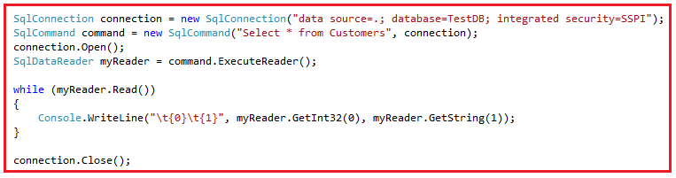
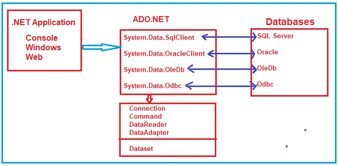

# ADO.NET And Web Form Question:

## Web Form:
- <details>
    <summary>What is a Data Source or Data Store?</summary>
    <hr/>
    A Data Source or Data Store is a location where data is stored. It can be a file, database, address book, or indexing server, among other things.
    <hr/>
  </details>

## ADO.NET:
- <details>
    <summary>What is a Data Source or Data Store?</summary>
    <hr/>
    A Data Source or Data Store is a location where data is stored. It can be a file, database, address book, or indexing server, among other things.
    <hr/>
  </details>
- <details>
    <summary>Why can't programming languages communicate directly with Data Sources?</summary>
    <hr/>
    Programming languages cannot directly communicate with Data Sources because each Data Source uses a `different protocol` (a set of rules) for communication.
    <hr/>
  </details>

- <details>
    <summary>What is ADO.NET?</summary>
    <hr/>
    ADO stands for Microsoft ActiveX Data Objects. ADO.NET is a data access technology in the .NET framework that allows applications to connect to data sources like SQL Server, Oracle, MySQL, and XML. It provides a set of classes to perform CRUD operations. ADO.NET is essential for building data-driven applications and works by managing connections, executing queries, and handling data from databases. It mainly uses the `System.Data.dll` and `System.Xml.dll` libraries.

  Ado.Net Powerfull and flexible framework for data access in .Net application.
    <hr/>
  </details>
- <details>
    <summary>What Types of Applications Use ADO.NET?</summary>
    <hr/>
    - ASP.NET Web Form Applications
    - Windows Applications
    - ASP.NET MVC Application
    - Console Applications
    - ASP.NET Web API Applications
    - ASP.NET Core Applications
    <hr/>
  </details>
- <details>
    <summary>What is components in ADO.NET?</summary>
    <hr/>
    Components are designed for data manipulation and faster data access. `Connection`, `Command`, `DataReader`, `DataAdapter`, `DataSet`, and `DataView` are the components of ADO.NET that are used to perform database operations.
    <hr/>
  </details>
- <details>
    <summary>What are the main components/Key features of ADO.NET?</summary>
    <hr/>
    **The key components of ADO.NET include**:

  **Data Provider Model**: Models to connect the Database. Each data base have it's own provider like for SQL Servr we use SqlClient, Oracal we use OracalClient, OleDb we use OleDb and so one. They contains Connection, Command and etc.

  - **Connection**: Manages the connection to the data source.
  - **Command**: Executes SQL queries or stored procedures.
  - **DataReader**: Reads data in a fast from data source, forward-only, read-only manner. Useful for retrieving large datasets. Reading data with a DataReader is fast and memory-efficient.
  - **DataAdapter**: Fills a DataSet with data and updates the database.
  - **DataSet**: An in-memory representation of data, useful for disconnected scenarios.
  - **DataTable**: Represents a single table of data within a DataSet.
  - **DataView**: Provides sorting, filtering, and navigating of data within a DataTable.
  - **Transaction**: Manages multiple data operations as a single unit.
  - **Connection String**: Holds the necessary details for connecting to the data source.
    <hr/>
  </details>

- <details>
    <summary>ADO.Net Artctiture?</summary>
    <hr/>

    

    <hr/>
  </details>

- <details>
    <summary>What is the difference between DataSet and DataReader?</summary>
    <hr/>
    - DataSet is an in-memory representation of data that can hold multiple tables and allows for disconnected data manipulation. 
    - DataReader, on the other hand, is used to read data directly from the data source in a forward-only, read-only manner, making it faster but less flexible.
    <hr/>
  </details>
- <details>
    <summary>What role does the DataAdapter play?</summary>
    <hr/>
    - The `DataAdapter` acts as a `bridge` between the `DataSet` and the `data source`. It fills the DataSet with data from the source and also allows updates from the DataSet to be applied back to the database.
    <hr/>
  </details>
- <details>
    <summary>What is a Connection String?</summary>
    <hr/>
     A Connection String is a configuration string that provides the information needed to connect to a data source, such as the server name, database name, and login credentials.
    <hr/>
  </details>
- <details>
    <summary>What are the two main components of ADO.NET?</summary>
    <hr/>
    The two main components of ADO.NET are:

  - **Data Provider**: This is responsible for connecting to the database, executing commands, and retrieving data. It includes classes like Connection, Command, DataReader, and DataAdapter.
  - **DataSet**: This is an in-memory representation of data that allows for disconnected data manipulation, meaning you can work with data without maintaining a continuous connection to the database.
    <hr/>
  </details>

- <details>
    <summary>What does the Data Provider component include?</summary>
    <hr/>
    The Data Provider component includes:

  - **Connection**: Establishes a connection to the data source.
  - **Command**: Executes SQL commands or stored procedures.
  - **DataReader**: Retrieves data in a fast, read-only, forward-only manner.
  - **DataAdapter**: Transfers data between the data source and a DataSet.
    <hr/>
  </details>

- <details>
    <summary>What is the role of the DataSet in ADO.NET?</summary>
    <hr/>
     The DataSet is an in-memory cache that holds data from the data source. It can contain multiple DataTables and supports data relationships and constraints, allowing for disconnected operations where data is manipulated without a direct connection to the source.
    <hr/>
  </details>
- <details>
    <summary>How do Data Provider and DataSet differ?</summary>
    <hr/>
    The Data Provider works with live, connected data operations (like retrieving and updating data directly from the database), while the DataSet allows for disconnected operations by storing data in memory, enabling you to manipulate it offline before reconnecting to the data source to save changes.
    <hr/>
  </details>
- <details>
    <summary>What are ADO.NET Data Providers?</summary>
    <hr/>
    ADO.NET Data Providers are a set of classes that allow .NET applications to connect to a database, execute SQL commands, and retrieve or manipulate data. These providers handle all the necessary operations for communicating with the database, such as establishing connections, executing commands, and retrieving results.
    <hr/>
  </details>
- <details>
    <summary>Why do we need ADO.NET Data Providers?</summary>
    <hr/>
    Databases only understand SQL, not C# code. ADO.NET Data Providers bridge this gap by allowing .NET applications to:
    1. Connect to the database.
    2. Prepare and execute SQL commands.
    3. Retrieve and manipulate data from the database.
    <hr/>
  </details>
- <details>
    <summary>What are some common .NET Data Provider classes?</summary>
    <hr/>
    Common ADO.NET Data Provider classes include:
    1. **SqlConnection**: Manages the connection to a SQL Server database.
    2. **SqlCommand**: Executes SQL queries and stored procedures.
    3. **SqlDataReader**: Retrieves data from the database in a forward-only, read-only manner.
    <hr/>
  </details>
- <details>
    <summary>What is the namespace for SQL Server Data Provider classes?</summary>
    <hr/>
    The classes for interacting with SQL Server are found in the System.Data.SqlClient namespace.
    <hr/>
  </details>
- <details>
    <summary>What is an example of a Data Provider for SQL Server?</summary>
    <hr/>
    The System.Data.SqlClient is the ADO.NET data provider specifically for SQL Server, with classes like SqlConnection, SqlCommand, and SqlDataReader designed to handle SQL Server database operations.

  

  

    <hr/>
  </details>

- <details>
    <summary>When should you use ADO.NET?</summary>
    <hr/>
    ADO.NET is a suitable choice in several scenarios where you need more control over data access. Here are some situations in which using ADO.NET might be appropriate:
    1. Performance Optimization
    2. Direct Interaction with the Database
    3. Data Source Variety
    4. Ad Hoc Queries and Reports
    5. Low-Level Data Manipulation
    <hr/>
  </details>
- <details>
    <summary>How to Establish a Connection to the SQL Server database and create a table using ADO.NET.</summary>
    <hr/>
    1. Create Database in SQL Server(i.e: AdoAndWebForm).
    2. In VS Write this code to Establish a Connection to the SQL Server database and create a table using ADO.NET.
      - Add the this code in `web.config` inside the configuration:
      ```c#
      <connectionStrings>
        <add name="DatabaseCon" providerName="System.Data.SqlClient" connectionString="data source = DESKTOP-HOOMVQE\MSSQLSERVER02;  database = AdoAndWebForm; integrated security = true"/>
      </connectionStrings>
      ```
      - Create form `EstablishConnectionAndCreateTable.aspx`:
      ```c#
      using System;
      using System.Configuration;
      using System.Data.SqlClient;

      namespace AdoConnection_PreformSqlCommands
      {
        public partial class EstablishConnectionAndCreateTable : System.Web.UI.Page
        {
          SqlConnection con = null;
          protected void Page_Load(object sender, EventArgs e)
          {
            SqlCommand cmd = null;
            try
            {
                //con = new SqlConnection(ConfigurationManager.ConnectionStrings["DatabaseCon"].ConnectionString);//Use web.config file connection. If you use this the use 'using System.Configuration;'

                //or use Hard code connection
                con = new SqlConnection("data source=DESKTOP-HOOMVQE\\MSSQLSERVER02; database=AdoAndWebForm; integrated security=true"); //Another way to connection
                cmd = new SqlCommand("Create table Student(Id int not null, FullName Varchar(Max), Address Varchar(Max), Age int, Gender char(1));", con);
                con.Open();
                cmd.ExecuteNonQuery();//Sql query execute
                Response.Write("Table created");
            }
            catch (Exception ex)
            {
                Response.Write(ex.Message);
            }
            finally
            {
                con.Close();
            }
          }
        }
      }
      ```

  **Nots**

  - `SqlCommand("You can use any sql command", con);`.
    <hr/>
  </details>

- <details>
    <summary>What are the SQL Query Executer and Data retriver method in Ado.Net & when to use and hot to use?</summary>
    <hr/>
    In ADO.NET, the following three methods are commonly used to execute SQL commands and retrieve data in different ways:
    - Name space to preform this method:
    ```c#
    //Import Required Namespaces:
    using System;
    using System.Data;
    using System.Data.SqlClient;
    //and when you use connection from web.config
    using System.Configuration;
    ```

    - Establish a Connection to preform this method:
    ```c#
    SqlCommand cmd = new SqlConnection("data source=DESKTOP-HOOMVQE\\MSSQLSERVER02; database=AdoAndWebForm; integrated security=true");
    ```

  1. **ExecuteNonQuery()**:

  - `Purpose`: This method is used to execute SQL statements that do not return any data. It is typically used for INSERT, UPDATE, or DELETE operations, or for executing SQL commands like creating tables or altering data without retrieving any results.

  - `Return Value`: It returns an `int` representing the number of rows affected by the query.

  `Example Use`

  ```c#
  //Execute Queries:
  SqlCommand cm = new SqlCommand("create table student(id int not null, name varchar(100), email varchar(50), join_date date)", con);
  //Or
  SqlCommand cm = new SqlCommand("insert into student (id, name, email, join_date) values ('101', 'Ronald Trump', 'ronald@example.com', '1/12/2017')", con);
  //Or
  SqlCommand cm = new SqlCommand("delete from student where id = '101'", con);

  con.Open();

  int rowsAffected = cm.ExecuteNonQuery();
  //You utlyze code
  con.Close();
  ```

  - `Example Operations`: INSERT, UPDATE, DELETE, CREATE TABLE.

  2. **ExecuteScalar()**:

  - `Purpose`: This method is used to execute a SQL query that returns a single value (the first column of the first row in the result set). It is often used for aggregate queries like counting rows or summing column values.
  - `Return Value`: It returns an object representing the single value returned by the query.

  `Example Use`:

  ```c#
  //Execute Queries:
  SqlCommand cm = new SqlCommand("Select * from student", con);
  //Or
  SqlCommand cm = new SqlCommand("Select name from student where id=5", con);
  //Or
  SqlCommand cm = new SqlCommand("SELECT COUNT(*) FROM TableName, SELECT MAX(Salary) FROM Employees", con);

  con.Open();
  object result = cm.ExecuteScalar();
  //Use result
  con.Close();
  ```

  3. **ExecuteReader()**:

  - `Purpose`: This method is used to execute SQL queries that return multiple rows of data. It returns a DataReader object, which can be used to read data row by row.
  - `Return Value`: It returns a DataReader object that provides forward-only access to the result set.

  `Example Use:`

  ```c#
  //Execute Queries:
  SqlCommand cm = new SqlCommand("Select * from student", con);

  con.Open();
  SqlDataReader reader = command.ExecuteReader();
  while (reader.Read())
  {
      // Access each row's columns
      //Ex:
      Console.WriteLine(reader["id"] + " " + reader["name"] + " " + reader["email"]);
  }
  //use result
  con.Close();
  ```

    <hr/>
  </details>

- <details>
    <summary>How to Use Transactions with SQL Server?</summary>
    <hr/>
    - Use SqlTransaction class.
    ```c#
    SqlTransaction transaction = con.BeginTransaction();
    try
    {
          // Perform data operations within the transaction
          transaction.Commit();
    }
    catch (Exception ex)
    {
          transaction.Rollback();
    }
    ```
    - You can manage transactions using the SqlTransaction class. Transactions ensure that a group of operations is completed entirely or rolled back if an error occurs.
    <hr/>
  </details>
- <details>
    <summary>What is SqlConnection?</summary>
    <hr/>
    1. SqlConnection class inherited from the DbConnection class and implements the ICloneable interface.

    2. Syntax to establish the connection:
    ```c#
    SqlConnection con = new SqlConnection("data source=; database=; integrated security=");
    //or
    SqlConnection con = new SqlConnection();
    con.ConnectionString = "data source=; database=; integrated security=";
    //or
    SqlConnection con = new SqlConnection("data source=; database=; user id=; password=");
    //or
    SqlConnection con = new SqlConnection();
    con.ConnectionString = "data source=; database=; user id=; password=";
    //or: Establish an open connection when the Open method is called on the connection object.
    string ConnectionString = "data source=; database=; user id=; password=";
    using(SqlConnection con = new SqlConnection(ConnectionString))
    {
      try{
        con.Open();// Execute commands and perform operations
      }
      catch(SqlException e){}
      finally{}//No need
    }
    ```
    **Note**: Here, we are using the using block to `close the connection automatically`. If you are using the using block, then you are not required to call the close() method explicitly to close the connection. It is always recommended to close the database connection using the “using block” in C#.
    <hr/>
  </details>
- <details>
    <summary>How many SqlConnection constructor have?</summary>
    <hr/>
    **SqlConnectionhave 3 constructors:**
    -  `SqlConnection()`:It initializes a new instance of the System.Data.SqlClient.SqlConnection class.
    - `SqlConnection(String connectionString)`: This constructor is used to initialize a new instance of the System.Data.SqlClient.SqlConnection class when given a string that contains the connection string.
    - `SqlConnection(String connectionString, SqlCredential credential)`: It is used to initialize a new instance of the System.Data.SqlClient.SqlConnection class given a connection string that does not use Integrated Security = true and a System.Data.SqlClient.SqlCredential object that contains the user ID and password.
    <hr/>
  </details>
  - <details>
    <summary>What are the method available in SqlConnection?</summary>
    <hr/>
    **SqlConnection method:**
    - `BeginTransaction()`: Initiates a database transaction.
    - `ChangeDatabase(string database)`: Changes the current database for an open connection.
    - `ChangePassword(string connectionString, string newPassword)`: Changes the SQL Server password for the user defined in the connection string.
    - `Close()`: Closes the connection to the database.
    - `CreateCommand()`: Creates a `SqlCommand` object tied to this SqlConnection.
    - `GetSchema()`: Returns schema information for the data source.
    - `Open()`: Opens the connection to the database.
    <hr/>
  </details>
- <details>
    <summary>What is SqlCommand?</summary>
    <hr/>
    1. SqlCommand class in C# stores and executes the SQL statement against the SQL Server database.
    2. SqlCommand is a sealed class and it is inherited from the DbCommand class and implements the ICloneable interface.
    <hr/>
  </details>
- <details>
    <summary>How many SqlCommand constructor have?</summary>
    <hr/>
    SqlCommand sealed class have 5 constructor.(all this constructor initialize a new instance of the System.Data.SqlClient.SqlCommand class):

    - `SqlCommand()`: Initialize a new instance of the System.Data.SqlClient.SqlCommand class.
    - `SqlCommand(string cmdText)`:  Initialize a new instance of the System.Data.SqlClient.SqlCommand class with the text of the query
    - `SqlCommand(string cmdText, SqlConnection connection)`: Initializes a `SqlCommand` with query text(Command Text) and an SQL connection(connection object).
    - `SqlCommand(string cmdText, SqlConnection connection, SqlTransaction transaction)`: Initializes a `SqlCommand` with query text, SQL connection, and a transaction.
    - `SqlCommand(string cmdText, SqlConnection connection, SqlTransaction transaction, SqlCommandColumnEncryptionSetting columnEncryptionSetting)`: Initializes a `SqlCommand` with query text, connection, transaction, and column encryption settings.
    <hr/>
  </details>
- <details>
    <summary>What are the method available in SqlCommand?</summary>
    <hr/>
    1. `BeginExecuteNonQuery()`: This method initiates the asynchronous execution of the Transact-SQL statement or stored procedure that is described by this System.Data.SqlClient.SqlCommand.
    2. `Cancel()`: This method tries to cancel the execution of a System.Data.SqlClient.SqlCommand.
    3. `Clone()`: This method creates a new System.Data.SqlClient.SqlCommand object is a copy of the current instance.
    4. `CreateParameter()`: This method creates a new instance of a System.Data.SqlClient.SqlParameter object.
    5. `ExecuteReader()`.
    6. `ExecuteScalar()`.
    7. `ExecuteNonQuery()`.
    8. `Prepare()`: This method creates a prepared version of the command on an instance of SQL Server.
    9. `ResetCommandTimeout()`: This method resets the CommandTimeout property to its default value.
    <hr/>
  </details>
- <details>
    <summary>How to use Stored Procedures with SqlCommand? Give me example?</summary>
    <hr/>
    `Syntax`:
    ```c#
    SqlCommand com = new SqlCommand("StoredProcedureName", con);

    //1
    com.CommandType = CommandType.StoredProcedure;
    SqlParameter parameter = new SqlParameter("@ParameterName", SqlDbType.VarChar);
    parameter.Value = "ParameterValue";
    com.Parameters.Add(parameter);

    //2
    paramCommand.Parameters.AddWithValue("@ParameterName", "Value");

    // Execute the stored procedure
    SqlDataReader read = com.ExecuteReader();
    ```

    - `com.CommandType = CommandType.StoredProcedure;`: CommandType property of the SqlCommand object to StoredProcedure.  It will execute a stored procedure rather than a regular SQL query execute.

    - `SqlParameter parameter = new SqlParameter("@ParameterName", SqlDbType.VarChar);` : creates a new SqlParameter object to represent a parameter for the stored procedure. The first argument (@ParameterName) is the name of the parameter expected by the stored procedure, and the second argument (SqlDbType.VarChar) specifies the data type of the parameter (in this case, a variable-length character string).

    - `parameter.Value = "ParameterValue";`: Sets the actual value for the parameter, replacing the placeholder (@ParameterName) with "ParameterValue".

    - `com.Parameters.Add(parameter);` : Adds the parameter (with its value) to the SqlCommand object's Parameters collection, which is used during execution.

    - `paramCommand.Parameters.AddWithValue("@ParameterName", "Value");`: This is an alternative and shorter way to add a parameter and assign its value directly in one step.

    `Example`:
    - create storeprocedure in sql server:
    ```sql
    CREATE PROCEDURE GetEmployeeDetails
    @EmployeeID INT,
    --multiple parameters pass,
    AS
    BEGIN
      SELECT * FROM Employees WHERE EmployeeID = @EmployeeID;
    END

    --Or
    CREATE PROCEDURE GetEmployeeDetails
    AS
    BEGIN
     SELECT Id, Name, Email, Mobile FROM Student
    END
    ```

    `Ger storeprocuder`:
    ```c#
    using(System.Data.SqlClient)
      {
          using(SqlConnection con = new SqlConnection     ("YourConnectionString"))
          {
              con.Open();

              SqlCommand com = new SqlCommand("GetEmployeeDetails", con);

              // Specify that the command is a stored procedure
              com.CommandType = CommandType.StoredProcedure;

              // Add input parameter to the command
              com.Parameters.AddWithValue("@EmployeeID", 1);  // Assuming you want details for EmployeeID 1

              // Execute the stored procedure
              SqlDataReader reader = com.ExecuteReader();

              // Read and process the result
              while (reader.Read())
              {
                  Console.WriteLine("ID: " + reader["EmployeeID"]);
                  Console.WriteLine("Name: " + reader["FirstName"] + " " + reader["LastName"]);
                  Console.WriteLine("Department: " + reader["Department"]);
              }
          }
      }
    ```
    <hr/>
  </details>
- <details>
    <summary>What is SqlDataReader Class?</summary>
    <hr/>
    1.  Used to read data from the SQL Server database in the most efficient manner. 
    2. SqlDataReader is Read-Only, And in SqlDataReader explicitly open and close the connection.
    3. `Forward-Only`: The SqlDataReader works forwardly, meaning it can only read data in one direction – from the first to the last.
    4. `Signature`: SqlDataReader class is inherited from the DbDataReader class and implements the IDisposable interface.
    <hr/>
  </details>
- <details>
    <summary>What are the property of SqlDataReader Class?</summary>
    <hr/>

    **`Properties:`**
    1. **Connection**: Gets the `SqlConnection` used by the `SqlDataReader`.
    2. **Depth**: Tells how deep the current row is nested (for hierarchical data).
    3. **FieldCount**: Shows how many columns are in the current row.
    4. **HasRows**: Returns `true` if there are rows to read, `false` otherwise.
    5. **IsClosed**: Tells if the `SqlDataReader` is closed.
    6. **RecordsAffected**: Shows how many rows were changed, inserted, or deleted.
    7. **VisibleFieldCount**: Tells how many non-hidden fields are available.
    8. **Item[string]**: Gets the value of a column by its name.
    9. **Item[int]**: Gets the value of a column by its index.
    <hr/>
  </details>
- <details>
    <summary>What are the Methods of SqlDataReader Class?</summary>
    <hr/>

    **`Methods:`**
    1. **Close()**: Closes the `SqlDataReader`.
    2. **GetBoolean(int i)**: Retrieves a column’s value as a `Boolean` (true/false).
    3. **GetByte(int i)**: Retrieves a column’s value as a `byte` (8-bit number).
    4. **GetChar(int i)**: Retrieves a column’s value as a single character (`char`).
    5. **GetDateTime(int i)**: Retrieves a column’s value as a `DateTime`.
    6. **GetDecimal(int i)**: Retrieves a column’s value as a `Decimal`.
    7. **GetDouble(int i)**: Retrieves a column’s value as a `double` (floating-point number).
    8. **GetFloat(int i)**: Retrieves a column’s value as a `float` (single-precision).
    9. **GetName(int i)**: Gets the column name by its index.
    10. **GetSchemaTable()**: Returns metadata about the columns in a `DataTable`.
    11. **GetValue(int i)**: Retrieves the value of a column in its native type.
    12. **GetValues(object[] values)**: Copies all column values of the current row into an array.
    13. **NextResult()**: Moves to the next result set (for multiple result sets).
    14. **Read()**: Moves to the next row, returning `true` if more rows exist.

    This class is mainly used to **read data** from a database in a forward-only manner.
    <hr/>
  </details>
- <details>
    <summary>How do you create an instance of the SqlDataReader class?</summary>
    <hr/>
    ```c#
    SqlCommand com = new SqlCommand("Select * from student", con);
    con.Open();
    SqlDataReader sdr = com.ExecuteReader();
    //con.Close(); //Give error
    //Looping through each record
    while (sdr.Read())
    {
        Console.WriteLine(sdr["Name"] + ",  " + sdr["Email"] + ",  " + sdr["Mobile"]);
    }
    con.Close();
    ```
    - `com.ExecuteReader()`: return the SqlDataReader instance;
    <hr/>
  </details>
- <details>
    <summary>How to Access Multiple Result Sets Using DataReader?</summary>
    <hr/>
    ```c#
    SqlCommand com = new SqlCommand("Select * from Student; Select * from Staff", con);
    con.Open();
    SqlDataReader sdr = com.ExecuteReader();
    //con.Close(); //Give error

    //First result Loop 
    while (sdr.Read())
    {
        Console.WriteLine(sdr["Name"] + ",  " + sdr["Email"] + ",  " + sdr["Mobile"]);
    }
    //Second result
    while (sdr.NextResult())
    {
      //Loop second result
      while (sdr.Read())
      {
        Console.WriteLine(sdr[0] + ",  " + sdr[1] + ",  " + sdr[2]);
      }
    }
    con.Close();
    ```
    <hr/>
  </details>
- <details>
    <summary>When to SqlDataReader Class?</summary>
    <hr/>
    1. `High-Performance Data Reading`: Use SqlDataReader when performance is critical. It is optimized for fast, efficient data reading and faster than other methods like DataTable or DataSet because it does not load all data into memory at once.
    2. `Read-Only Data Access`: If you only need to read data from the database and don’t need to perform any updates, inserts, or deletes, SqlDataReader is a suitable choice.
    3. `Large Volume Data Processing`: For processing large volumes of data, SqlDataReader is ideal because it reads data row-by-row, which means it uses less memory and can handle large datasets more efficiently.
    4. `Sequential Data Access`: When you need to access data sequentially, SqlDataReader is the way to go. It’s a forward-only reader, meaning you can only read data in the order it is received from the database.
    5. `Data Binding in Web Applications`: In web applications, SqlDataReader can be used for simple data binding scenarios where the data is displayed in data-bound controls and no manipulation or updates are required.
    6. `Real-Time Data Display`: For scenarios where data needs to be fetched and displayed in real-time, like in dashboards or reporting tools, SqlDataReader provides an efficient way to retrieve and present data quickly.
    7. `Minimizing Memory Footprint`: If you want to minimize the memory footprint of your application, SqlDataReader is a good choice as it does not store the entire dataset in memory.
    8. `Streaming Data`: SqlDataReader is suitable for streaming data scenarios, where you process data as it’s read without waiting for the entire set of data to be loaded.
    <hr/>
  </details>
- <details>
    <summary>What is the best practice for use to write ADO code?</summary>
    <hr/>
    - `Using` Statement in SqlDataReader and SqlConnection.
    - `Exception Handling`.
    - `Performance Considerations`: Ensure the database connection is not kept open longer than necessary.
    <hr/>
  </details>
- <details>
    <summary>What is SqlDataAdapter in C#?</summary>
    <hr/>
    1. It's bridges a DataSet or DataTable and a Data Source (SQL Server Database) to retrieve data. The SqlDataAdapter is a class that represents a set of SQL commands and a database connection. It is used to fill the DataSet or DataTable and update the data source as well.
    2. `Signature`: SqlDataAdapter class is a sealed class, so it cannot be inherited. Again, it is inherited from the DbDataAdapter class and implements the IDbDataAdapter, IDataAdapter, and ICloneable interface.
    <hr/>
  </details>
- <details>
    <summary>What are the constructor in SqlDataAdapter?</summary>
    <hr/>
    1. `SqlDataAdapter()`: Creates a new instance of the SqlDataAdapter class with no command or connection.
    2. `SqlDataAdapter(SqlCommand selectCommand)`: Initializes with a specified SqlCommand (can be a SQL SELECT or stored procedure).
    3. `SqlDataAdapter(string selectCommandText, string selectConnectionString)`: Initializes with a SELECT command and a connection string.
    4. `SqlDataAdapter(string selectCommandText, SqlConnection selectConnection)`: Initializes with a SELECT command and a SqlConnection object.
    <hr/>
  </details>
- <details>
    <summary>What are the method in SqlDataAdapter?</summary>
    <hr/>
    1. `CloneInternals()`: Copies the DataAdapter instance.
    2. `Dispose(Boolean)`: Frees up resources used by DataAdapter.
    3. `Fill(DataSet)`: Loads rows into a DataSet from the data source.
    4. `FillSchema(DataSet, SchemaType, String, IDataReader)`: Adds a DataTable to a DataSet with a schema from the data source.
    5. `GetFillParameters()`: Retrieves parameters used in the SELECT statement.
    6. `ResetFillLoadOption()`: Resets the FillLoadOption to its default setting.
    7. `ShouldSerializeAcceptChangesDuringFill()`: Checks if AcceptChangesDuringFill should be serialized.
    8. `ShouldSerializeFillLoadOption()`: Checks if FillLoadOption should be persisted.
    9. `ShouldSerializeTableMappings()`: Checks if DataTableMapping objects exist.
    10. `Update(DataSet)`: Applies changes (INSERT, UPDATE, DELETE) from the DataSet to the database.
    <hr/>
  </details>
- <details>
    <summary>Create instance of DataAdapter?</summary>
    <hr/>
    ```c#
    SqlDataAdapter da = new SqlDataAdapter("Sql query", con)
    ```
    <hr/>
  </details>
- <details>
    <summary>Give me example of using DataAdapter?</summary>
    <hr/>
    ```c#
    SqlDataAdapter da = new SqlDataAdapter("select * from student", connection);

    //1) using DataTable
    DataTable dt = new DataTable();
    da.Fill(dt); //Fill/Store the Retrieve Result in the Data table.

    foreach(DataRow row in dt.Rows)
    {
        Response.Write(row["Name"] + ",  " + row["Email"] + ",  " + row["Mobile"]);
    }

    //2) using DataSet
    Dataset ds = new DataSet();
    da.Fill(ds, "student") ////Here, the datatable student will be stored in Index position 0

    foreach(DataRow row in ds.Table["student"].Rows)
    {
        Response.Write(row["Name"] + ",  " + row["Email"] + ",  " + row["Mobile"]);
    }

    ```

    **Explanation**:
    - We create an instance of the `SqlDataAdapter` class using the constructor, which takes two parameters. Then, we create an instance of `DataSet and Datatable` object. DataSet and DataTable are `in-memory data stores that can store tables like a database`.

    - We call the `Fill()` method of the DataAdapter class. This method does most of the work behind us. It opens the connection to the database, executes the SQL command, fills the dataset and data tables with the data, and closes the connection. This method automatically handles the Opening and Closing of the database connections. The connection is kept open only as long as it is needed. That means once the Fill method completes its execution, then the connection closes automatically. 
    
    - We are using DataRow to loop through each record and print the data on the console. 

    <hr/>
  </details>
- <details>
    <summary>How to call store procedure using SqlDataAdapter?With Example.</summary>
    <hr/>
    ```c#
    SqlDataAdapter da = new SqlDataAdapter("GetStudent", con);
    da.SelectCommand.CommandType = CommandType.StoreProcedure;

    DataTable dt = new DataTable();
    da.Fill(dt);

    foreach(DataRow row in dt.Rows){
      Response.Write(row["Name"] +",  " + row["Email"] + ",  " + row["Mobile"]);
    }
    ```
    <hr/>
  </details>
- <details>
    <summary>When to use SqlDataAdaptor?</summary>
    <hr/>
    1. **Disconnected Data**: Use when you need to work with data offline, allowing changes without a constant database connection.
   
    2. **Batch Updates**: Efficient for making multiple changes (inserts, updates, deletes) and then committing them all at once.

    3. **Data Binding**: Simplifies binding data to UI controls like grids or forms, making it easy to display and edit data.

    4. **Caching and Offline Access**: Fetch data once, store it locally, and work offline, syncing changes when reconnected.

    5. **Complex Data Manipulation**: Ideal for applications requiring more than simple queries, like updating multiple rows.

    6. **Concurrency Control**: Helps handle concurrency issues, ensuring data integrity when multiple users update the database.

    7. **Performance**: Reduces database round-trips by loading and working with a bulk of data locally.

    **Limitations**: 
    - Not memory-efficient for large datasets compared to `SqlDataReader`.
    - Better suited for smaller data sets. 

    Use `SqlDataAdapter` when you need **offline data work**, **batch updates**, or **data binding** in a disconnected environment.

    <hr/>
  </details>
- <details>
    <summary>What is DataTable?</summary>
    <hr/>
    - The DataTable is similar to the Tables in SQL. Temporart data.
    
    - The **DataTable** represents the data in a tabular form (rows and columns) stored in memory. 

    - When we create an instance of DataTable, by default, a new DataTable has no schema (no columns or constraints). You must define the schema by adding columns and constraints before adding rows.
    
    - The DataTable used independently or with other objects like DataSet and DataView. 
    
    - To use DataTable, include the `System.Data` namespace.
    <hr/>
  </details>
- <details>
    <summary>How many constructor have DataTable?</summary>
    <hr/>
    The `DataTable` constructors:

    1. **DataTable()**: Initializes a new `DataTable` instance with no arguments.

    2. **DataTable(string tableName)**: Initializes a new `DataTable` with the specified table name. If `tableName` is null or empty, a default name is assigned when added to a `DataTableCollection`.

    3. **DataTable(SerializationInfo info, StreamingContext context)**: Initializes a new `DataTable` with serialization info and streaming context for serialization/deserialization.

    4. **DataTable(string tableName, string tableNamespace)**: Initializes a new `DataTable` with the specified table name and namespace. If `tableName` is null or empty, a default name is assigned when added to a `DataTableCollection`.

    <hr/>
  </details>
- <details>
    <summary>What are the DataTable property?</summary>
    <hr/>
    Sure! Here's a concise summary of the properties of the ADO.NET `DataTable` class in C#:

    - **Columns**: Collection of columns in the table.

    - **Constraints**: Get the collection of constraints maintained by this table.

    - **DataSet**: The DataSet to which the table belongs.

    - **DefaultView**: Customized view of the table, including filtered views.

    - **HasErrors**: Get a value indicating whether there are errors in any of the rows in the table of the DataSet.

    - **MinimumCapacity**: Get or set the initial starting size for this table.

    - **PrimaryKey**: Get or set an array of columns that function as primary keys for the data table.

    - **Rows**: Collection of rows in the table.

    - **TableName**: Name of the DataTable.

    <hr/>
  </details>
- <details>
    <summary>What are the Methods in DataTable?</summary>
    <hr/>
    Methods in DataTable class:

    - **AcceptChanges()**: Commits all changes made to the table.

    - **Clear()**: Clears all data from the table.

    - **Clone()**: Clones the structure of the table.

    - **Copy()**: Copies both structure and data.

    - **CreateDataReader()**: It returns a DataTableReader corresponding to the data within this DataTable.

    - **CreateInstance()**: Creates a new DataTable instance.

    - **GetRowType()**: Gets the row type.

    - **GetSchema()**: Gets the table schema.

    - **ImportRow(DataRow)**: Copies a DataRow into the DataTable.

    - **Load(IDataReader)**: Fills the DataTable with data from a data source using the supplied IDataReader.

    - **Merge(DataTable, Boolean)**: Merges another DataTable with the current DataTable.

    - **NewRow()**: Creates a new DataRow with the same schema as the table.

    - **Select()**: Gets an array of all DataRow objects.

    - **WriteXml(String)**: Write the current contents of the DataTable as XML using the specified file.

    <hr/>
  </details>
- <details>
    <summary>How to create DataTable? Give me example?</summary>
    <hr/>
    <p></p>
    <hr/>
  </details>
- <details>
    <summary></summary>
    <hr/>
    <p></p>
    <hr/>
  </details>
- <details>
    <summary></summary>
    <hr/>
    <p></p>
    <hr/>
  </details>
- <details>
    <summary></summary>
    <hr/>
    <p></p>
    <hr/>
  </details>
  20/sep/24
- <details>
    <summary>How to Bind data in GridView and Dispaly data in Gridview?</summary>
    <hr/>
    There are two ways to display data in Gridview from any data source like SQL Server, Oracle, MySQL etc.
    <ol>
    <li>Through Wizard (step by step process)</li>
    <li>Programmatically loading data</li>
    </ol>
    <hr/>
  </details>
- <details>
    <summary>How to load data by Programmatically  in GridView using ?</summary>
    <hr/>
    To do that:
    **Steps for load data by Programmatically  in GridView:**
    - Create Empty Web form Project name it(i.e: `LoadDataFromGridView`).
    - Create Web form name is (ie: `LodingDataGridView.aspx`).
    - Add the `GridView` and `button` in form.
    - `LodingDataGridView.aspx`

  ```C#

  using System;
  using System.Configuration;
  using System.Data.SqlClient;

  namespace LoadDataFromGridView
  {
    public partial class LodingDataGridView : System.Web.UI.Page
    {
      SqlConnection db = new SqlConnection(ConfigurationManager.    ConnectionStrings["DataDB"].ConnectionString);//Database connection
      protected void Page_Load(object sender, EventArgs e){}

      protected void Button1_Click(object sender, EventArgs e)
      {
        try
        {
          db.Open();
          SqlCommand cm = new SqlCommand    ("AllStudentStoreProcedure", db);
          cm.CommandType = System.Data.CommandType.   StoredProcedure; //Use to get data from StoreProcedure
          SqlDataReader dr = cm.ExecuteReader();
          if (dr.HasRows)
          {
            GridView1.DataSource = dr;
            GridView1.DataBind();
          }
          else
          {
              Response.Write("<h1>Data not available</h1>");
          }
          cm.Clone();
        }
        catch (SqlException ex)
        {
            Response.Write("<h1>" + ex.Message + "</hr>");
        }
        finally
        {
            db.Close();
        }
      }

      protected void Button2_Click(object sender, EventArgs e)
      {
          GridView1.DataSource = null;
          GridView1.DataBind();
      }
    }
  }

  ```

    <ol>

  - `AllStudentStoreProcedure`: This is the name of a stored procedure in the database. Stored procedures are precompiled SQL commands stored in the database that can perform complex operations like querying or modifying data.

  - `cm.CommandType = System.Data.CommandType.StoredProcedure;`: This line specifies that the SqlCommand (cm) is executing a stored procedure rather than a regular SQL query. By setting the CommandType to StoredProcedure, the code knows to look for a stored procedure named AllStudentStoreProcedure.

  - `SqlDataReader dr = cm.ExecuteReader();`: The ExecuteReader() method runs the stored procedure (cm command) and retrieves the result set from the database, returning it in the form of a SqlDataReader object, which is used to read rows of data one at a time.

  - `GridView1.DataSource = dr;`: This sets the data source for the GridView (a table-like structure on the webpage) to the result set (dr) returned by the stored procedure.

  - `GridView1.DataBind();`: This command binds the data from the SqlDataReader (result set) to the GridView, which will display the data in a structured tabular format on the webpage.

    </ol>

  - `Web.config`

  ```c#

  	<connectionStrings>
  	    <add name="DataDB" providerName="System.Data.SqlClient" connectionString="Data Source=DESKTOP-HOOMVQE\MSSQLSERVER02; Initial Catalog=ADO_Crud; Integrated Security=True;Encrypt=True;TrustServerCertificate=True"/>
    </connectionStrings>

  ```

    </ol>
    <hr/>
  </details>

- <details>
    <summary>What is DataTable and how to use it?</summary>
    <hr/>

  - It is used to create a virtual table in memory in ADO .Net.

  - To Create table, we need to use a class called DataTable.

  - DataTable is a collection of DataRows.

  - DataRow is a collection DataColumns.

  - `GridViewDataTable.aspx.cs`

  ```c#

  using System;
  using System.Data;
  using System.Data.SqlClient;

  namespace LoadDataFromGridView
  {
    public partial class GridViewDataTable : System.Web.UI.Page
    {
      protected void Page_Load(object sender, EventArgs e)
      {}

      protected void Button1_Click(object sender, EventArgs e)
      {
        try
        {
          //Create Datatable:
          DataTable dt = new DataTable();

          //Add columns in table:
          dt.Columns.Add("ProductId", typeof(int));
          dt.Columns.Add("Name", typeof(String));
          dt.Columns.Add("Price", typeof(double));

          //Add rows to table:
          dt.Rows.Add(101, "Chocklet", 80);
          dt.Rows.Add(102, "Biscuit", 40);
          dt.Rows.Add(103, "Icecream", 120);
          dt.Rows.Add(104, "Jam", 200);

          GridView1.DataSource = dt;
          GridView1.DataBind();
        }
        catch (SqlException ex)
        {
            Response.Write("<h1>" + ex.Message + "</h1>");
        }
      }
    }
  }

  ```

  <hr/>
  </details>

- <details>
    <summary>How to Loading data into GridView from database table (products) by using DataTable and Adapter.</summary>
    <hr/>

  - Create form `LoadDatfromDatabaseInDataTable.aspx`. and add GridView and button.

  - Code in

  ```c#
  using System;
  using System.Configuration;
  using System.Data;
  using System.Data.SqlClient;

  namespace LoadDataFromGridView
  {
    public partial class LoadDatfromDatabaseInDataTable : System.Web.UI.Page
    {
      SqlConnection con = new SqlConnection(ConfigurationManager.ConnectionStrings["DataDB"].ConnectionString);
      protected void Page_Load(object sender, EventArgs e)
      {}

      protected void Button1_Click(object sender, EventArgs e)
        {
          try
          {
              con.Open();
              SqlDataAdapter da = new SqlDataAdapter("Select * from Student", con);

              //Create empty data table
              DataTable dt = new DataTable();

              //Filling data into Datatable from Adaptor
              da.Fill(dt);

              //binding data table to Gridview
              GridView1.DataSource = dt;
              GridView1.DataBind();
          }
          catch (Exception ex)
          {
              Response.Write("<h1>"+ex.Message+"</h1>");
          }
          finally
          {
              con.Close();
          }
        }
    }
  }

  ```

  <hr/>
  </details>

- <details>
    <summary>How to creating an XML file and display the XML file data into GridView using DataSet?</summary>
    <hr/>

  - We can use a method called ReadXML(). It is used to convert xml file into table format.

  - Creating XML file: `Student.xml`

  ```xml

  <?xml version="1.0" encoding="utf-8" ?>
  <StudentData>
    <Student>
      <RollNo>1</RollNo>
      <Name>Ram</Name>
      <Course>ASP .Net</Course>
    </Student>
    <Student>
      <RollNo>2</RollNo>
      <Name>Krish</Name>
      <Course>C#</Course>
    </Student>
  </StudentData>

  ```

  - `StudentDataFromXML.aspx`

  ```c#

  using System;
  using System.Data;

  namespace LoadDataFromGridView
  {
    public partial class StudentDataFromXML : System.Web.UI.Page
    {
      protected void Page_Load(object sender, EventArgs e)
      {}
      protected void Button1_Click(object sender, EventArgs e)
      {
          //Load data from XML file and display in GridView
          DataSet ds = new DataSet();//Create empty dataset
          ds.ReadXml(Server.MapPath("~/Student.xml"));
          GridView1.DataSource = ds.Tables[0];
          GridView1.DataBind();
      }
    }
  }

  ```

  - `DataSet ds = new DataSet();`: This creates an empty DataSet, which is an in-memory representation of data, capable of holding multiple tables. It’s commonly used for handling data from a database or other sources like XML files.

  - `ds.Tables[0]`: The DataSet can contain multiple tables. ds.Tables[0] refers to the first table (index 0) in the DataSet, which contains the data from the Student.xml file.

  <hr/>
  </details>

- <details>
    <summary></summary>
    <hr/>
    <p></p>
    <hr/>
  </details>
- <details>
    <summary></summary>
    <hr/>
    <p></p>
    <hr/>
  </details>
- <details>
    <summary></summary>
    <hr/>
    <p></p>
    <hr/>
  </details>
- <details>
    <summary></summary>
    <hr/>
    <p></p>
    <hr/>
  </details>
- <details>
    <summary></summary>
    <hr/>
    <p></p>
    <hr/>
  </details>
- <details>
    <summary></summary>
    <hr/>
    <p></p>
    <hr/>
  </details>
- <details>
    <summary></summary>
    <hr/>
    <p></p>
    <hr/>
  </details>
- <details>
    <summary></summary>
    <hr/>
    <p></p>
    <hr/>
  </details>
- <details>
    <summary></summary>
    <hr/>
    <p></p>
    <hr/>
  </details>
- <details>
    <summary></summary>
    <hr/>
    <p></p>
    <hr/>
  </details>
- <details>
    <summary></summary>
    <hr/>
    <p></p>
    <hr/>
  </details>
- <details>
    <summary></summary>
    <hr/>
    <p></p>
    <hr/>
  </details>
- <details>
    <summary></summary>
    <hr/>
    <p></p>
    <hr/>
  </details>
- <details>
    <summary></summary>
    <hr/>
    <p></p>
    <hr/>
  </details>
- <details>
    <summary></summary>
    <hr/>
    <p></p>
    <hr/>
  </details>
- <details>
    <summary></summary>
    <hr/>
    <p></p>
    <hr/>
  </details>
- <details>
    <summary></summary>
    <hr/>
    <p></p>
    <hr/>
  </details>
- <details>
    <summary></summary>
    <hr/>
    <p></p>
    <hr/>
  </details>
- <details>
    <summary></summary>
    <hr/>
    <p></p>
    <hr/>
  </details>
- <details>
    <summary></summary>
    <hr/>
    <p></p>
    <hr/>
  </details>
- <details>
    <summary></summary>
    <hr/>
    <p></p>
    <hr/>
  </details>
- <details>
    <summary></summary>
    <hr/>
    <p></p>
    <hr/>
  </details>
- <details>
    <summary></summary>
    <hr/>
    <p></p>
    <hr/>
  </details>
- <details>
    <summary></summary>
    <hr/>
    <p></p>
    <hr/>
  </details>
- <details>
    <summary></summary>
    <hr/>
    <p></p>
    <hr/>
  </details>
- <details>
    <summary></summary>
    <hr/>
    <p></p>
    <hr/>
  </details>
- <details>
    <summary></summary>
    <hr/>
    <p></p>
    <hr/>
  </details>
- <details>
    <summary></summary>
    <hr/>
    <p></p>
    <hr/>
  </details>
- <details>
    <summary></summary>
    <hr/>
    <p></p>
    <hr/>
  </details>
- <details>
    <summary></summary>
    <hr/>
    <p></p>
    <hr/>
  </details>
- <details>
    <summary></summary>
    <hr/>
    <p></p>
    <hr/>
  </details>
- <details>
    <summary></summary>
    <hr/>
    <p></p>
    <hr/>
  </details>
- <details>
    <summary></summary>
    <hr/>
    <p></p>
    <hr/>
  </details>
- <details>
    <summary></summary>
    <hr/>
    <p></p>
    <hr/>
  </details>
- <details>
    <summary></summary>
