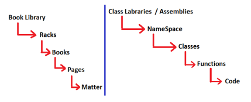
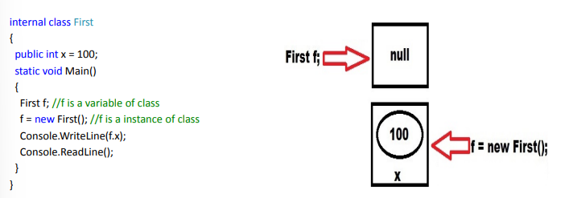
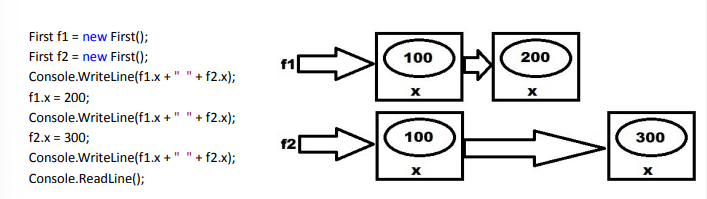
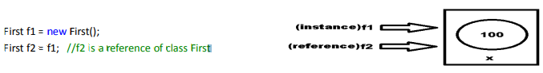

# CSharp Question:

## 01: Compilation, History, Articture

- <details>
    <summary>What is .NET?</summary>
    <hr/>
    <p>
    It's a Framework, it is a product of Microsoft launched in the year 2002, which can be used for building various kinds of Applications like: Web, Mobile, Desktop, Micro services, Cloud, Machine Learning, Game Development and IoT (Internet of Things).
    </p>
    <hr/>
  </details>
- <details>
    <summary>How to develope various kinds of application by using .NET?</summary>
    <hr/>
    <p>To develop the above applications, .NET provides with a set of Programming Languages, Technologies & Servers using which we can build any kind of Application.</p>
    <hr/>
  </details>
- <details>
    <summary>What are the Programming Languages, .NET provides to us?</summary>
    <hr/>
    <p>In 2002 .NET give 30+ programming languages like CSharp(C#), VB.NET, Python.NET, J#.NET and etc are available for a developer to build applications and programmers have a chance of choosing any 1 language from the list. </p>
    <hr/>
  </details>
- <details>
    <summary>As of todady, how many language usege in .NET?</summary>
    <hr/>
    <p>
    5 language: C#, VB.NET, F#.NET, Iron Python and ML.NET<br/>C# is the most popular language.<br/> And this language is run in the .NET Framework
    </p>
    <hr/>
  </details>
- <details>
    <summary>What are the two important features in .Net?</summary>
    <hr/>
    <p>
    1. Language Independent<br/>
    2. Platform Independent
    </p>
    <hr/>
  </details>
- <details>
    <summary>What is Framework?⭐ </summary>
    <hr/>
    <p>Framework is a runtime environment which provides many features & will allow to run multiple programming language code.</p>
    <hr/>
  </details>
- <details>
    <summary>What is the output code generated after .NET compilation, and who compiles .NET code?</summary>
    <hr/>
    <p>The output code generated after compiling a program written in a .NET language is called CIL (Common Intermediate Language) or MSIL (Microsoft Intermediate Language).</p>
    <hr/>
  </details>
- <details>
    <summary>If any 2 languages want to communicate or interoperate with each other they need?</summary>
    <hr/>
    <p>1. Not mismatch compile code.</p>
    <p>2. Not mismatch data type.</p>
    <hr/>
  </details>
- <details>
    <summary>How does .NET solve the problem of communication between languages?⭐</summary>
    <hr/>
    <p>.NET solves the problem of communication between different programming languages by making sure that all languages compile down to the same kind of code called CIL or MSIL. It also avoids problems with different data types by using the 'Common Type System' (CTS), <mark><b>CTS makes sure that similar data types are the same size and work the same way across all .NET languages.</mark></b></p>
    <hr/>
  </details>
- <details>
    <summary>How to execute C language code?</summary>
    <hr/>
    <p>The program we write in C is called source code.</p>
    <p>The C compiler compiles the source code and generates native code. Usually, this native code can only run on the machine where it was generated, and the operating system executes the code.</p>
    <p>C language Source code > C compiler > Native code > Execute the code</p>
    <p>When a language compiler compiles the source code, it considers two factors:<br/>
      1. Operating System (OS) Architecture<br/>
      2. Processor Architecture
    </p>
    <p>Native code is created so it can be understood by the current processor and the operating system where the code is compiled.</p>
    <hr/>
  </details>

#### Nots

```HTML
C++ Source Code => Compiled by using C++ Compiler => Generates Object Code => Which can be consumed from another C++ Program.


Java Source Code => Compiled by using Java Compiler => Generates Byte Code => Which can be consumed from another Java Program.


C# Source Code => Compiled by using C# Compiler => Generates CIL Code => Which can be consumed from any .NET Language Program.


F# Source Code => Compiled by using F# Compiler => Generates CIL Code => Which can be consumed from any .NET Language Program.


VB Source Code => Compiled by using VB Compiler => Generates CIL Code => Which can be consumed from any .NET Language Program.

```

```
.NET Language means all dotnet language(C#, F#.NET, VB.NET, Iron Python and ML.NET).
```

- <details>
    <summary>What is Platform Independent?</summary>
    <hr/>
    <p>It is a way to run an application developed on one platform on <mark>other</mark> platforms.</p>
    <p>Platform Independent also multi-platform software or cross-platform software</p>
    <hr/>
  </details>
- <details>
    <summary>What is Platform?</summary>
    <hr/>
    <p>A platform is an environment where an application runs. It includes two main components: microprocessor and operating system.</p>
    <hr/>
  </details>
- <details>
    <summary>What is a platform dependency?</summary>
    <hr/>
    <p>The code created by the language compiler cannot run on a different processor or operating system. This is called platform dependency.</p>
    <hr/>
  </details>
- <details>
    <summary>Explain about the code execution process in .Net?</summary>
    <hr/>
    <p> In .Net source code will be compiled by the respective language compiler & an Intermediate code is generated known as MSIL (MicroSoft Intermediate Language)</p>
    <p>This MSIL code is then converted into native code using CLR (Common Language Runtime) finally code will be executed by the operating system with the help of CLR (or) CLR will run the code with the help of operating system</p>

  

    <hr/>
  </details>

- <details>
    <summary>What happens to the code when you compile a .NET application, and what is the outcome?</summary>
    <hr/>
    <p>When you compile a .NET application using any .NET language, the code is turned into "CIL" (Common Intermediate Language) code. This intermediate code is the result of the compilation process, no matter which .NET language you used to create the application.</p>
    <p></p>
    <hr/>
  </details>
- <details>
    <summary>How to run CIL code on client machines?</summary>
    <hr/>
    <p>To run CIL code on client machines, you need to install the <mark><b>.NET Runtime</b></mark> software. This runtime includes the CLR (Common Language Runtime), which converts CIL code into native machine code that the computer can execute.</p>
    <hr/>
  </details>
- <details>
    <summary>How did .NET expand to support operating systems other than Windows?</summary>
    <hr/>
    <p>When .NET was first launched by Microsoft in 2002, the .NET Runtime was only available for Windows. However, Microsoft made the specifications for developing the runtime open, allowing third-party companies to create runtimes for other operating systems. This led to the development of the ".NET Framework," starting with version 1.0 and ending with version 4.8.
    </p>
    <hr/>
  </details>
- <details>
    <summary>What is the role of the CLR in the .NET Framework?</summary>
    <hr/>
    <p>The CLR (Common Language Runtime) is a key component of the .NET Runtime that converts CIL (Common Intermediate Language) code into native machine code. This conversion allows the compiled .NET application to run on the client machine.</p>
    <hr/>
  </details>
- <details>
    <summary>What was a major criticism of the .NET Framework before 2016?</summary>
    <hr/>
    <p>The .NET Framework was criticized for not being fully platform-independent because Microsoft initially provided it only for Windows. This limited the ability of developers to create cross-platform applications.</p>
    <hr/>
  </details>
- <details>
    <summary>What significant change did Microsoft introduce with .NET Core in 2016?</summary>
    <hr/>
    <p>In 2016, Microsoft introduced .NET Core, a new runtime designed to work on <mark><b>multiple platforms</b></mark>. Unlike the original .NET Framework, .NET Core was available for Windows, Linux, and Mac, allowing developers to build and run applications on different operating systems.</p>
    <hr/>
  </details>
- <details>
    <summary>What is the significance of the .NET 5.0 release in 2020?</summary>
    <hr/>
    <p>On November 10, 2020, Microsoft released .NET Core 5.0". .NET Framework" and ".NET Core" were merged into a single platform, and it's a continuation of `.NET Core`, not both.</b> This new version, starting from .NET Core 5.0, continues the evolution of .NET Core and is now simply called “.NET”. As of November 2021, the latest version is .NET 6.0.</p>
    <hr/>
  </details>
- <details>
    <summary>How did Microsoft simplify the naming of its runtime frameworks in 2020?</summary>
    <hr/>
    <p>Microsoft made the naming simpler by combining .NET Framework and .NET Core into one platform called ".NET." Starting with version 5.0, this unified platform continues from .NET Core but is <mark><b> no longer called .NET Core or .NET Framework separately.</mark></b></p>
    <hr/>
  </details>
- <details>
    <summary>What is Distributed application?</summary>
    <hr/>
    <p>A distributed application is software that <mark><b> runs related code across multiple machines </mark></b>. For example, in an application like <mark><b> Gmail </mark></b>, the code may run on different machines: one on the user's device (e.g., a <mark><b> browser </mark></b>), <mark><b>another on a server,</mark></b> and a <mark><b> third on a database server </mark></b>. This setup, where different components of the application run on different machines, defines a distributed application.</p>
    <hr/>
  </details>
- <details>
    <summary>When the program comes to a running state?</summary>
    <hr/>
    <p>When we double-click the .exe file of the program, it is moved from secondary memory to primary memory, and then the program starts running.</p>
    <p>Memory allocation always happens in primary memory.</p>
    <p>Saving the program always happens in secondary memory.</p>
    <hr/>
  </details>
- <details>
      <summary>What is a .NET Runtime?</summary>
      <hr/>
      <p>It's software that must be installed on the client's machine to run .NET applications. It sits on top of the OS and executes the CIL code while hiding the OS's functionalities.</p>
      <hr/>
  </details>
- <details>
    <summary>What is Managed and Un-Managed App's?</summary>
    <hr/>
    <p>Applications that run directly under the operating system are called Unmanaged Apps, while those that run under the .NET Runtime are called Managed Apps.</p>
    <hr/>
  </details>
- <details>
    <summary>What is Managed code?</summary>
    <hr/>
    <p>Managed code is MSIL code, which the CLR can understand and manage.</p>
    <p>The CLR provides all .NET features and services (like garbage collection, type safety, and security) for managed code.</p>
    <p>Examples of managed code include C#, VB.NET, and other programming languages supported by .NET.</p>
    <hr/>
  </details>
- <details>
    <summary>What is Un-managed code?</summary>
    <hr/>
    <p>Unmanaged code is not in MSIL code and is not managed by the CLR but can still be used in a .NET environment.</p>
    <p>The CLR does not provide .NET features (like garbage collection or security) for unmanaged code.</p>
    <p>Examples of unmanaged code include COM components, Win32 APIs, and ActiveX controls.</p>
    <p>Managed code generally runs faster and more securely, while unmanaged code can be slower and less safe due to the lack of CLR management.</p>
    <hr/>
  </details>
- <details>
    <summary>When Application run under the `Runtime` then what are the features provided by Runtime?</summary>
    <hr/>
    <p>1. Platform Independent or Portable<br/> 2. Secured<br/>3. Automatic Memory Management</p>
    <hr/>
  </details>
- <details>
    <summary>What are the two main components are in .NET Compiler?</summary>
    <hr/>
    <p>The two main components are CLR (Common Language Runtime) and BCL (Base Class Libraries).</p>
    <hr/>
  </details>
- <details>
    <summary>What are the task/rules preformed by CLR?</summary>
    <hr/>
    <p>The CLR preformed several action like CLS(Common language specification), CTS (Common Type System), GS (Garbage Collector) & JIT (Just In Time).</p>
    <hr/>
  </details>
- <details>
    <summary>How does the CLR (Common Language Runtime) allow different programming languages to work together in .NET, even though each language has its own data types?</summary>
    <hr/>
    <p>One programming language cannot understand another language, but all these languages are executed by the CLR. This is because the CLR does not understand any language's data types; it has its own data type system for MSIL.</p>
    <p>Each language's data types are converted into the CLR's data type system by their respective compilers, so the CLR understands its own data type system.</p>
    <hr/>
  </details>
- <details>
    <summary>What is CLS and what does it do?</summary>
    <hr/>
    <p>CLS stands for Common Language Specification. It is a set of rules(like Syntactically) that all .NET languages follow to ensure they can work together. When a language compiler compiles source code, it generates MSIL according to these rules. This allows different programming languages supported by .NET to be compatible with each other, <mark><b>providing language interoperability</b></mark>.</p>
    <hr/>
  </details>
- <details>
    <summary>What is Language specification?</summary>
    <hr/>
    <p>This rule we follow to write code in any programming language is known as language specification.</p>
    <hr/>
  </details>
- <details>
    <summary>What is Language Interoperability?</summary>
    <hr/>
    <p>Language interoperability means allowing code written in one programming language to run within another programming language. And .Net support language Interoperability.</p>
    <hr/>
  </details>
- <details>
    <summary>What is CTS(Common Type System)?</summary>
    <hr/>
    <p>In C#, we use the int keyword to create an integer variable, while in VB .NET, we use the Integer keyword for the same purpose. Each programming language has its own data type system, and one language cannot understand another's data types. However, all these languages are executed by the CLR. This is because the CLR does not understand any specific programming language's data types; instead, it has its own data type system for MSIL.</p>
    <p>This data type system of CLR is shared by all programming languages supported by .Net, so it is called CTS.</p>
    <hr/>
  </details>

  ```
  Note: Thanks to CLS and CTS, all .NET languages can work together and communicate with each other.
  ```

- <details>
    <summary>What is VES (Virtual Execution System)?</summary>
    <hr/>
    <p>This is nothing but CLR or Common Language Runtime.</p>
    <hr/>
  </details>
- <details>
    <summary>What are the 2 main parts present in CLR?</summary>
    <hr/>
    <p>The runtime software has two main parts: "Libraries" and an "Execution Engine".</p>
    <p>Libraries part: FCL (Framework Class Libraries) in .NET Framework, CORE FX in .NET Core and .NET </p>
    <p>Execution Engine part: CLR (Common Language Runtime) in .NET Framework, CORE CLR in .NET Core and .NET.</p>
    <hr/>
  </details>
- <details>
    <summary>What is Libraries?</summary>
    <hr/>
    <p>Libraries: A library is a set of reusable functions. Every programming language has built-in libraries, like Header Files in C and C++, and Packages in Java. Similarly, .NET languages have built-in libraries called “FCL (Framework Class Libraries)” in the .NET Framework and "Core FX” in .NET Core and .NET.</p>
    <hr/>
  </details>
- <details>
    <summary>Execution Engine?</summary>
    <hr/>
    <p>Execution Engine: As mentioned earlier, .NET applications do not run directly on the OS but within the Runtime. In this Runtime, there is an Execution Engine responsible for running applications. This is called CLR in the .NET Framework and “CORE CLR” in .NET Core and .NET.</p>
    <p>CLR and Core CLR are the execution engines of the .NET Runtime, where all .NET applications run under their supervision. They contain various components to manage different tasks, such as:</p>

  

    <hr/>
  </details>

- <details>
    <summary>What is Security Engine?</summary>
    <hr/>
    <p>This is responsible for the security of our applications. It ensures that applications don't directly interact with the OS, and the OS doesn't directly interact with the applications.</p>
    <hr/>
  </details>
- <details>
    <summary>What is JIT Compiler?</summary>
    <hr/>
    <p>The Just-In-Time (JIT) compiler is responsible for converting Common Intermediate Language (CIL) code into native machine code based on the specific platform where the application is being executed. This process is known as JIT compilation, where the conversion happens gradually as the program runs.</p>
    <p>This conversion happens at runtime, just before the code is executed, ensuring that the application can run efficiently on different hardware. If the code has been compiled before, the JIT compiler reuses the previously compiled native code instead of recompiling it. However, if the code is new, the JIT compiler compiles it and then executes it.</p>
    <hr/>
  </details>
- <details>
    <summary>What is Native code?</summary>
    <hr/>
    <p>Native code understand by OS. Native code is the code that is compiled to run on a specific processor and operating system</p>
    <hr/>
  </details>
- <details>
    <summary>What is Machine code?</summary>
    <hr/>
    <p>Machine code understand by CPU. Machine code is the binary instructions that the CPU runs directly.</p>
    <hr/>
  </details>
- <details>
    <summary>What is Garbage Collector?</summary>
    <hr/>
    <p>It is responsible for "Automatic Memory Management," which is the process of allocating and de-allocating memory needed for a program to run. There are two types of memory management:<br/>1. Manual or Explicit(by programmers)<br/>2. Automatic or Implicit(by compiler)</p>
    <hr/>
  </details>
- <details>
    <summary>What is automatic memory management, Explain?</summary>
    <hr/>
    <p>The automatic memory management process is handled by the Garbage Collector. The Garbage Collector provides automatic memory management only for Managed code, not for Unmanaged code.</p>
    <hr/>
  </details>

---

#### Diffrence bitween value type and refrence type:

1. <details>
     <summary>Who allocate memory for Value type and where it's placed?</summary>
     <hr/>
     <p>Usually, memory allocation for value types is done using static memory allocation, and these data types are placed in stack memory.</p>
     <hr/>
   </details>
2. <details>
     <summary>Who allocate memory for refrence type and where it's placed?</summary>
     <hr/>
     <p>Memory allocation for reference types is done using dynamic memory allocation, and these are placed in heap memory.</p>
     <hr/>
   </details>
3. <details>
     <summary>How is data stored for value types and reference types in memory?</summary>
     <hr/>
     <p>Value types store data directly in their memory location, whereas reference types store a reference to another memory location where the data is stored.</p>
     <hr/>
   </details>
4. <details>
     <summary>When is memory allocated for value types compared to reference types?</summary>
     <hr/>
     <p>Memory allocated for value types is at compile time, while for reference types allocated the memory at runtime.</p>
     <hr/>
   </details>
5. <details>
     <summary>Where are value types and reference types stored in memory?</summary>
     <hr/>
     <p>Value types are stored in stack memory, while reference types are stored in heap memory.</p>
     <hr/>
   </details>
6. <details>
     <summary>How does memory allocation differ between value types and reference types?</summary>
     <hr/>
     <p>Memory allocation for value types occurs in <mark><b> contiguous memory locations in the stack </b></mark>, whereas for reference types, it occurs in <mark><b> non-contiguous (random) memory locations in the heap </b></mark>.</p>
     <hr/>
   </details>
7. <details>
     <summary>How does the CLR handle memory management for value types versus reference types?</summary>
     <hr/>
     <p>The CLR does not provide automatic memory management for value types, whereas it does provide automatic memory management ( such as garbage collection ) for reference types.</p>
     <hr/>
   </details>
8. <details>
     <summary>How does the amount of memory occupied by value types compare to reference types?</summary>
     <hr/>
     <p>Value types generally occupy less memory, whereas reference types can occupy more memory, with a single reference type variable potentially using up to 2GB.</p>
     <hr/>
   </details>
9. <details>
     <summary>What happens if a value type or reference type variable is not initialized?</summary>
     <hr/>
     <p>If a value type variable is not initialized, it stores a default value (e.g., int a; defaults to 0). If a reference type variable is not initialized, it stores a null reference (e.g., string s; defaults to null).</p>
     <hr/>
   </details>
10. <details>
      <summary>Can you provide examples of value types and reference types in C#?</summary>
      <hr/>
      <p>Examples of value types: int, double, and enum, while examples of reference types: string, object, and class.</p>
      <hr/>
  </details>

<hr/>

| **Serial Number** | **Value Type**                                                                         | **Reference Type**                                                                                   |
| ----------------- | -------------------------------------------------------------------------------------- | ---------------------------------------------------------------------------------------------------- |
| 1                 | Store the data directly into their memory location.                                    | Do not store the data directly; instead, they refer to another memory location where data is stored. |
| 2                 | Memory is allocated at compile time.                                                   | Memory is allocated at runtime.                                                                      |
| 3                 | Memory is allocated by stack memory allocation.                                        | Memory is allocated by dynamic memory allocation.                                                    |
| 4                 | Memory allocation is made within the stack, i.e., in a contiguous memory location.     | Memory allocation is made within the heap, i.e., in a random memory location.                        |
| 5                 | CLR does not provide automatic memory management.                                      | CLR provides automatic memory management.                                                            |
| 6                 | Occupies less memory.                                                                  | Occupies more memory; a single reference type variable can occupy a maximum of up to 2GB.            |
| 7                 | If data is not initialized, stores the default value in the variable (e.g., `int a;`). | If data is not initialized, stores a null reference in the variable (e.g., `string S;`).             |
| 8                 | Examples of value types: `int`, `double`, `enum`, etc.                                 | Examples of reference types: `string`, `object`, `class`, etc.                                       |

<hr/>

- <details>
    <summary>How many times is code compiled in .NET?</summary>
    <hr/>
    2 Times:<br/>
    <p>1: The first compilation (from source code to Intermediate Language - IL) happens at build time and is relatively slow.</p>
    <p>2: The second compilation (from IL to machine code) happens at runtime via the Just-In-Time (JIT) compiler, which is faster for later runs.</p>
    <hr/>
  </details>
- <details>
    <summary>How many times is code compiled in Java and Python?</summary>
    <hr/>
    1 Time:<br/>
    <p>Java code is compiled once from source code to bytecode, which the Java Virtual Machine (JVM) then interprets or compiles to machine code during execution. Python code is compiled once to bytecode and then interpreted by the Python interpreter at runtime.</p>
    <hr/>
  </details>
- <details>
    <summary> What is the role of the Garbage Collector (GC) in .NET?</summary>
    <hr/>
    <p>The Garbage Collector is responsible for <mark><b>providing automatic memory management for managed code.</mark></b> It helps in automatically allocating and freeing memory, which <mark><b>reduces the risk of memory leaks and improves application performance</mark></b>. However, it does <mark><b>not provide automatic memory management for unmanaged code.</mark></b></p>
    <hr/>
  </details>
- <details>
    <summary>What is the managed heap, and how is it structured?</summary>
    <hr/>
    <p>The managed heap is a region of memory where objects created by managed code are stored. It is divided into three parts called generations: Generation 0, Generation 1, and Generation 2. These generations are arranged in increasing order of memory size, with Generation 0 having the smallest size and Generation 2 having the largest.</p>
    <hr/>
  </details>
- <details>
    <summary>Why are there different generations in the managed heap, and what is their purpose?</summary>
    <hr/>
    <p>The generations (Generation 0, Generation 1, and Generation 2) are <mark><b>used to optimize memory management</mark></b>. <mark><b>Newly created objects are placed in Generation 0. As objects continue to exist after several rounds of garbage collection, they are moved to higher levels (Generation 1, then Generation 2). This approach improves performance by making garbage collection less frequent and less costly.</mark></b></p>
    <hr/>
  </details>
- <details>
    <summary>Where does the Garbage Collector place newly created objects, and why?</summary>
    <hr/>
    <p>The Garbage Collector places all newly created objects in Generation 0. This is because Generation 0 is the <mark><b>smallest</mark></b> and is collected most frequently, which <mark><b>helps quickly remove short-lived objects and free memory.</mark></b></p>
    <hr/>
  </details>
- <details>
    <summary>What happens when Generation 0 is completely filled, and a new object needs to be created?</summary>
    <hr/>
    <p>When Generation 0 is completely filled, the <mark><b>Garbage Collector performs a process called "collection." This process has two phases:</mark></b><br/>
    <ul>
    <li><mark><b>Marking Phase: </mark></b>The GC examines all objects in Generation 0, identifies reachable (in use) and unreachable (not in use or idle) objects, and maintains separate flags for them.</li>
    <li><mark><b>Compact Phase: </mark></b>The GC destroys the unreachable objects, promotes the reachable objects to Generation 1, and places the newly created object in Generation 0.</li>
    </ul>
    </p>
    <hr/>
  </details>
- <details>
    <summary>What happens if both Generation 0 and Generation 1 are completely filled and a new object needs to be created?</summary>
    <hr/>
    <p>If both Generation 0 and Generation 1 are filled, the GC performs a collection of both generations:</p>
    <ul>
    <li>Marking Phase: The GC examines all objects in both generations and identifies reachable and unreachable objects.</li>
    <li>Compact Phase: The GC destroys the unreachable objects, promotes reachable objects to Generation 2, and places the newly created object in Generation 0.</li>
    </ul>
    <hr/>
  </details>
- <details>
    <summary>What does the Garbage Collector do if all three generations (Generation 0, Generation 1, and Generation 2) are filled?</summary>
    <hr/>
    <p>If all three generations are filled, the Garbage Collector will perform a collection for all three generations (Generation 0, Generation 1, and Generation 2). This process includes marking the objects, destroying unreachable ones, and freeing up space for new objects.</p>
    <hr/>
  </details>
- <details>
    <summary>What are the two main phases of the Garbage Collection process?</summary>
    <hr/>
    <p>The two main phases of the Garbage Collection process are:</p>
    <ul>
    <li>Marking Phase: The GC identifies which objects are reachable and which are unreachable.</li>
    <li>Compact Phase: The GC removes the unreachable objects and compacts the memory by promoting reachable objects to the next generation.</li>
    </ul>
    <hr/>
  </details>
- <details>
    <summary>What is the "thumb rule" for placing new objects in the managed heap?</summary>
    <hr/>
    <p>The "thumb rule" for the Garbage Collector is that all newly created objects should be placed in Generation 0. The GC has no right to place newly created objects directly into Generation 1 or Generation 2.</p>
    <hr/>
  </details>
- <details>
    <summary>Why does the Garbage Collector promote objects to higher generations?</summary>
    <hr/>
    <p>The Garbage Collector promotes objects to higher generations to <mark><b>improve performance.</mark></b> Objects that survive multiple collections are likely to <mark><b>live longer</mark></b>, so promoting them to less frequently collected generations <mark><b>reduces the cost of garbage collection.</mark></b></p>
    <hr/>
  </details>
- <details>
    <summary>What is Application Software?</summary>
    <hr/>
    <p><mark><b> Application software refers to programs designed for end-users to perform specific tasks. </b></mark> This includes individual applications like Notepad, Microsoft Word, Excel, or web browsers. Essentially, any program you use on a computer, <mark><b>other than the operating system, is considered application software.</b></mark> Over time, the term has expanded to include mobile apps and complex software environments, highlighting the role of these programs in modern computing.</p>
    <hr/>
  </details>
- <details>
    <summary>How to develop Application software?</summary>
    <hr/>
    <p>Software development is split into Applications Development, which focuses on making user-friendly programs like apps and games, and Systems Development, which involves creating and maintaining operating systems. Programming languages, written in either imperative or declarative forms, are crucial for both types of development.</p>
    <hr/>
  </details>
- <details>
    <summary>What is a class library in .NET?</summary>
    <hr/>
    <p>A class library is a collection of classes with predefined functions that help developers write code more efficiently.</p>
    <hr/>
  </details>
- <details>
    <summary>What is another name for a class library in .NET?</summary>
    <hr/>
    <p>Assembly</p>
    <hr/>
  </details>
- <details>
    <summary>How does Microsoft organize class libraries in .NET?</summary>
    <hr/>
    <p>Using a hierarchy: Class Libraries/Assemblies > Namespaces > Classes > Functions > Code.</p>
    <hr/>
  </details>
- <details>
    <summary>What does the hierarchy of class libraries help us?</summary>
    <hr/>
    <p>Provides easy access to predefined functions and avoids duplicate naming problems.</p>
    <hr/>
  </details>
- <details>
    <summary>How can you access a function from a class library in .NET?</summary>
    <hr/>
    <p>Using the format: AssemblyName.NamespaceName.ClassName.FunctionName.</p>
    <hr/>
  </details>
- <details>
    <summary>What are the file formats used for class libraries or assemblies in .NET?</summary>
    <hr/>
    <p>DLL (Dynamic Link Libraries) or EXE files.</p>
    <hr/>
  </details>
- <details>
    <summary>Is creating an assembly in .NET required?</summary>
    <hr/>
    <p>Yes, creating an assembly is required.</p>
    <hr/>
  </details>
- <details>
    <summary>Is creating a namespace in .NET compulsory?</summary>
    <hr/>
    <p>No, creating a namespace is optional.</p>
    <hr/>
  </details>
- <details>
    <summary>In .Net class libraries are divided into how many categories?</summary>
    <hr/>
    <p>Base class libraries</p>
    <p>User defined class libraries</p>
    <hr/>
  </details>
- <details>
    <summary>What is a Base Class Library (BCL)?</summary>
    <hr/>
    <p>Libraries created by Microsoft that are installed with the .NET Framework on a computer. The BCL in .NET is a collection of basic building blocks, like ready-made classes and methods, that help you perform common tasks such as working with files, data, and input/output. It provides the core tools needed to create .NET applications.</p>
    <hr/>
  </details>
- <details>
    <summary>When are Base Class Libraries installed on a computer?</summary>
    <hr/>
    <p>These are installed on our computer when we install the .NET framework. Usually, the .NET framework is installed along with the operating system.</p>
    <hr/>
  </details>
- <details>
    <summary>What is the purpose of User-Defined Class Libraries?</summary>
    <hr/>
    <p>To allow developers to create reusable code that can be shared within their own projects or across multiple projects.</p>
    <hr/>
  </details>
- <details>
    <summary>What is `.dll` file?</summary>
    <hr/>
    `.dll` file is DLL file.
    <br/>
    A `.dll` (Dynamic Link Library) file contains code and data that can be used by multiple programs simultaneously.
    <hr/>
  </details>
- <details>
    <summary>What is `.exe` file?</summary>
    <hr/>
    <p>And the .exe (Executable) file is a standalone application that can be directly run by the operating system.</p>
    <hr/>
  </details>
- <details>
    <summary>Is that posible to run directly run .dll file?</summary>
    <hr/>
    .dll file cannot be directly run, it must be called by an executable (.exe) or another program that uses its functions.
    <hr/>
  </details>
- <details>
    <summary>What is CLI (Common Language Infrastructure)?</summary>
    <hr/>
    
    <p>The Common Language Infrastructure (CLI) is a set of rules that define an environment for running code, allowing different high-level languages to work on various platforms without changes. It includes:</p>
    <ul>
    <li>Common Language Specification (CLS): Defines the basic language features that all .NET languages must support.</li>
    <li>Common Type System (CTS): Standardizes data types and objects to ensure consistency across languages.</li>
    <li>Metadata: Provides data about the types, methods, and other elements in the code.</li>
    <li>Virtual Execution System (VES): Manages code execution and provides services like garbage collection.</li>
    </ul>
    <hr/>
  </details>
- <details>
    <summary>What is the diffrence bitweeb CLR and CLI?</summary>
    <hr/>
    Difference between CLR and CLI:
    <ol>
    <li>CLR (Common Language Runtime):
    <ul>
    <li>CLR is a part of Microsoft's .NET Framework.</li>
    <li>It provides a runtime environment for executing .NET applications.</li>
    <li>CLR manages memory, handles exceptions, performs garbage collection, ensures type safety, and provides security and other services needed for running managed code.</li>
    <li>In essence, CLR is the execution engine of the .NET Framework where the code is executed.</li>
    </ul>
    </li>
    <li>CLI (Common Language Infrastructure):
    <ul>
    <li>CLI is a specification developed by Microsoft that describes the runtime environment needed to run programs written in any language that targets the .NET platform.</li>
    <li>It includes specifications for various aspects like metadata, type systems, and libraries that are necessary to execute code across different programming languages.</li>
    <li>CLI is a standard that defines how different programming languages can interoperate and run on different platforms. It forms the foundation upon which the .NET Framework (including CLR) is built.</li>
    </ul>
    </li>
    </ol>
    Summary:
    <li>CLR is the implementation of the CLI specification in the .NET Framework.</li>
    <li>CLR is a runtime environment specifically for .NET applications, whereas CLI is a broader standard that allows multiple languages and platforms to work together.</li>
    <hr/>
  </details>
- <details>
    <summary>What is the relationship between CLR, CLI, CIL, IL, MSIL, CTS, CLS and GS in the context of .NET?</summary>
    <hr/>
    <ol>
    <li>CLR (Common Language Runtime):
      <ul>
      <li>Definition: The CLR is the runtime environment of the .NETFramework.</li>
      <li>Role: It manages the execution of .NET programs byproviding services like memory management, type safety,exception handling, garbage collection, security, and more.<li>
      <li>Relationship: CLR is an implementation of the CLIstandard, designed to provide a common runtime for all .NETlanguages.</li>
      </ul>
    </li>
    <li>
       CLI (Common Language Infrastructure):
       <ul>
       <li>Definition: The CLI is an open standard developed by Microsoft, which specifies the execution environment for code written in multiple programming languages.</li>
       <li>Role: It defines the rules and structures for code execution, interoperability between languages, and services like exception handling and garbage collection.</li>
       <li>Relationship: The CLI provides the blueprint for the CLR. It is the foundation upon which the .NET runtime (CLR) is built.</li>
       </ul>
    </li>
    <li>
    CIL (Common Intermediate Language), IL (Intermediate Language), and MSIL (Microsoft Intermediate Language):
    <ul>
    <li>Definition: All three refer to the same concept but with slight naming differences:
    <ul>
    <li>CIL: Common Intermediate Language — the standardized intermediate language as per the CLI specification.</li>
    <li>IL: Intermediate Language — a general term for the low-level, platform-independent code that .NET languages compile into.</li>
    <li>MSIL: Microsoft Intermediate Language — the implementation of IL by Microsoft as part of the .NET Framework.</li>
    </ul>
    </li>
    <li>Role: CIL/IL/MSIL is the intermediate language to which high-level .NET languages (like C# or VB.NET) are compiled. This IL code is then executed by the CLR.</li>
    <li>Relationship: CIL/IL/MSIL is the code format that is executed by the CLR.</li>
    </ul>
    </li>
    <li>CTS (Common Type System):
    <ul>
    <li>Definition: CTS is a specification that defines how types are declared, used, and managed in the CLI environment.</li>
    <li>Role: It ensures that objects written in different .NET languages can interact with each other by defining a common set of data types.</li>
    <li>Relationship: CTS is part of the CLI specification. CLR enforces CTS rules to provide language interoperability, ensuring that all .NET languages use a common type system.</li>
    </ul>
    </li>
    <li>CLS (Common Language Specification):
    <ul>
    <li>Definition: CLS is a subset of the CTS, which defines a set of rules that all .NET languages must follow to be compliant with the .NET Framework.</li>
    <li>Role: It ensures that code written in one .NET language can be used by any other .NET language.</li>
    <li>Relationship: CLS is a guideline that all .NET languages should adhere to for cross-language interoperability. It builds upon CTS by defining a common standard for .NET languages.</li>
    </ul>
    </li>
    <li>GS (Garbage Collection):
    <ul>
    <li>Definition: GS refers to Garbage Collection, a feature of the CLR that automatically manages memory by reclaiming objects that are no longer in use.</li>
    <li>Role: It prevents memory leaks and optimizes the usage of memory resources by cleaning up unused objects.</li>
    <li>Relationship: GS is an essential service provided by the CLR to manage memory effectively during the execution of .NET applications.</li>
    </ul>
    </li>
    </ol>
    Summary of Relationships:
    <li>CLR is the runtime that executes .NET programs and is based on the CLI specification.</li>
    <li>CIL (IL or MSIL) is the intermediate code format to which all .NET languages compile, and which the CLR executes.</li>
    <li>CTS defines a standard type system that all .NET languages use, ensuring cross-language compatibility.</li>
    <li>CLS is a subset of CTS that further defines rules for cross-language interoperability.</li>
    <li>GS (Garbage Collection) is a memory management feature of the CLR.</li>
    <hr/>
  </details>
- <details>
    <summary>What is .NET Framework and .NET Core?</summary>
    <hr/>
    <p>NET Framework: The original .NET implementation for building and running applications on Windows, including websites, services, and desktop apps.</p>
    <p>.NET Core: A cross-platform version of .NET for running applications on Windows, Linux, and macOS. It is now succeeded by .NET 5+.</p>
    <p>Xamarin/Mono: Implements .NET for mobile platforms, such as iOS and Android.</p>
    <hr/>
  </details>
- <details>
    <summary>What is the architecture of the .NET Framework CLR?</summary>
    <hr/>
    <p>.NET applications can be written in various .NET languages such as C#, F#, or Visual Basic. The source code written in these languages is compiled into a language-agnostic Common Intermediate Language (CIL). This compiled code is stored in assemblies, which are files with a .dll or .exe extension.</p>
    <p>When you run a .NET application, the Common Language Runtime (CLR) takes the assemblies and uses a Just-In-Time (JIT) compiler to convert the CIL code into machine code. This machine code is then executed on the specific hardware architecture of the computer.</p>
    <hr/>
  </details>
- <details>
    <summary>What is meant by developing applications using multiple languages?</summary>
    <hr/>
    <p>In .NET, developing applications using multiple languages means that different programming languages can be used together to build software. All .NET languages compile to a common intermediate language called Common Intermediate Language (CIL). This CIL code is then executed by the Common Language Runtime (CLR) through Just-In-Time (JIT) compilation, which converts it to machine code suitable for the specific computer architecture.</p>
    <hr/>
  </details>
- <details>
    <summary>Where is MSIL used, and where is CIL used?</summary>
    <hr/>
    <p>MSIL is used in Microsoft's .NET Framework, while CIL is used in the wider Common Language Infrastructure (CLI).</p>
    <hr/>
  </details>
- <details>
    <summary>Are MSIL and CIL interchangeable?</summary>
    <hr/>
    <p>Yes, they are different names for the same intermediate language.</p>
    <hr/>
  </details>
- <details>
    <summary>Which term describes the intermediate language in the overall .NET ecosystem?</summary>
    <hr/>
    <p>CIL (Common Intermediate Language) is used in the .NET ecosystem.</p>
    <hr/>
  </details>
- <details>
    <summary>What is .NET Framework used for?</summary>
    <hr/>
    <p>.NET Framework is used to create and run software applications on Windows. It provides the environment for running .NET apps.</p>
    <hr/>
  </details>
- <details>
    <summary>Who uses .NET Framework?</summary>
    <hr/>
    <p><b>Users:</b> Need .NET Framework to run applications built with it. It is often pre-installed with Windows but can be downloaded if needed.<br/>
    <b>Developers:</b> Use .NET Framework to build various applications, such as websites, services, and desktop apps, using tools like Visual Studio.</p>
    <hr/>
  </details>
- <details>
    <summary>How does .NET Framework work?</summary>
    <hr/>
    <p>.NET Framework applications are written in languages like C#, F#, or Visual Basic and are compiled to Common Intermediate Language (CIL). The Common Language Runtime (CLR) converts CIL to machine code and runs the application.</p>
    <hr/>
  </details>
- <details>
    <summary>What are the main components/features of .NET Framework?</summary>
    <hr/>
    <p><b>Common Language Runtime (CLR):</b> Manages the execution of applications.<br/>
    <b>.NET Framework Class Library:</b> Provides a set of APIs and types for common functionality.
    </p>
    <hr/>
  </details>
- <details>
    <summary>How many versions of .NET Framework are there?</summary>
    <hr/>
    <p>There are 16 versions of .NET Framework, ranging from 1.0 to 4.8.</p>
    <hr/>
  </details>
- <details>
    <summary>Can you have multiple .NET Frameworks installed?</summary>
    <hr/>
    <p>Yes, some versions can be installed side-by-side, while others may update existing installations.<br/><br/>.NET Framework Version and CLR Version:<br/><br/>.NET Framework 4.x: CLR 4.0<br/>.NET Framework 2.x and 3.x: CLR 2.0<br/>.NET Framework 1.1: CLR 1.1<br/>.NET Framework 1.0: CLR 1.0</p>
    <hr/>
  </details>
- <details>
    <summary>What is the architecture of .NET Core and what are the two main components of .NET Core,</summary>
    <hr/>
    <p>The two main components of .NET Core are CoreCLR and CoreFX. CoreCLR is comparable to the Common Language Runtime (CLR) in the .NET Framework, while CoreFX is comparable to the Framework Class Library (FCL).</p>
    <hr/>
  </details>
- <details>
    <summary>What is CoreFX in .NET Core?</summary>
    <hr/>
    <p>CoreFX is the set of basic class libraries in .NET Core. It includes types for collections, file systems, console, JSON, XML, and other common functions. It is known as the Unified Base Class Library and includes the System.* namespaces (and some Microsoft.* namespaces).</p>
    <hr/>
  </details>
- <details>
    <summary>What is CoreCLR, and what functions does it perform?</summary>
    <hr/>
    <p>CoreCLR is the .NET execution engine in .NET Core, which is a complete runtime and virtual machine for managed execution of .NET programs. It performs functions such as garbage collection and compilation to machine code using the RyuJIT just-in-time compiler.</p>
    <hr/>

  

  </details>

- <details>
    <summary>How does CoreCLR relate to the .NET Framework CLR?</summary>
    <hr/>
    <p>CoreCLR is built from the same code base as the CLR in the .NET Framework. However, it is optimized for .NET Core, providing a lightweight, modular, and cross-platform execution engine.</p>
    <hr/>
  </details>
- <details>
    <summary>Is there a separate CLR version for each .NET Core release?</summary>
    <hr/>
    <p>No, .NET Core releases have a single product version. There is no separate version for the CLR.</p>
    <hr/>
  </details>
- <details>
    <summary>What is Roslyn in the context of .NET development?</summary>
    <hr/>
    <p>Roslyn is the open-source compiler platform for C# and Visual Basic.NET. It is cross-platform and provides rich code analysis APIs, enabling developers to write powerful code analysis and refactoring tools.</p>
    <hr/>
  </details>
- <details>
    <summary>What are the main features of Roslyn?</summary>
    <hr/>
    <p>Roslyn provides a compiler-as-a-service API for C# and VB.NET, offering capabilities such as syntax analysis, semantic analysis, code generation, and refactoring. It allows developers to access and manipulate code in a more powerful way than traditional compilers.</p>
    <hr/>
  </details>
- <details>
    <summary>What is the just-in-time compiler used in CoreCLR, and what is its purpose?</summary>
    <hr/>
    <p>The just-in-time compiler used in CoreCLR is called RyuJIT. Its purpose is to compile Intermediate Language (IL) code into machine code that the processor can execute, allowing for optimized runtime performance.</p>
    <hr/>
  </details>
- <details>
    <summary>How does CoreFX benefit developers in .NET Core?</summary>
    <hr/>
    <p>CoreFX offers a consistent API across all platforms supported by .NET Core.  This allows developers to write code that can run on different operating systems (Windows, Linux, macOS) without needing to modify the code for platform-specific libraries.</p>
    <hr/>
  </details>
- <details>
    <summary>Why did they rewrite the C# compiler in C# for Roslyn?</summary>
    <hr/>
    <p>Rewriting the C# compiler in C# was motivated by the need for better code analysis and tooling support. It also followed a common practice where a language is used to implement its compiler to improve maintainability and to "eat your own dog food," ensuring that the language creators are also programming in the language they are developing.</p>
    <hr/>
  </details>
- <details>
    <summary>What is .NET Core?</summary>
    <hr/>
    <p>.NET Core is a modern, cross-platform, open-source framework designed for building applications that run on Windows, macOS, and Linux. It consists of a runtime built from the same codebase as the .NET Framework CLR and a set of refactored base class libraries (BCL). .NET Core supports various technologies, including ASP.NET Core and Entity Framework Core.</p>
    <hr/>
  </details>
- <details>
    <summary>What are the major components of .NET Core?</summary>
    <hr/>
    The two major components of .NET Core are:
    <p><b>Runtime:</b> The .NET Core runtime, which includes the Garbage Collector (GC) and Just-In-Time (JIT) compiler (RyuJIT), but lacks features like Application Domains and Code Access Security (CAS).</p>
    <p><b>Base Class Libraries (BCL):</b> A set of libraries derived from the .NET Framework class libraries, refactored to allow for modular deployment.</p>
    <hr/>
  </details>
- <details>
    <summary>What are the characteristics of .NET Core?</summary>
    <hr/>
    The key characteristics of .NET Core are:
    <ul>
    <li>Cross-Platform: Runs on Windows, macOS, and Linux.</li>
    <li>Open Source: Available under MIT and Apache 2 licenses.</li>
    <li>Modern: Supports asynchronous programming, no-copy patterns using structs, and resource governance.</li>
    <li>Performance: High performance with features like hardware intrinsics and tiered compilation.</li>
    <li>Consistent Across Environments: Uniform behavior across different OS and architectures.</li>
    <li>Command-Line Tools: Provides easy-to-use CLI tools for development and CI/CD.
    </li>
    <li>Flexible Deployment: Can be installed side-by-side or embedded in apps; compatible with Docker.
    </li>
    </ul>
    <hr/>
  </details>
- <details>
    <summary>What is the composition of .NET Core?</summary>
    <hr/>
    .NET Core is composed of the following parts:
    <ul>
    <li><b>.NET Core Runtime: </b>Provides a type system, assembly loading, garbage collection, native interoperability, and other basic services.</li>
    <li><b>ASP.NET Core Runtime: </b>Framework for building cloud-based and internet-connected applications like web apps, IoT apps, and mobile backends.</li>
    <li><b>.NET Core SDK and Language Compilers: </b>Includes compilers (e.g., Roslyn for C# and F#) and tools for development.</li>
    <li><b>dotnet Command: </b>A CLI tool used to run .NET Core apps, manage runtime selection, and launch apps and tools.</li>
    </ul>
    <hr/>
  </details>
- <details>
    <summary>What is the dotnet command used for in .NET Core?</summary>
    <hr/>
    <p>The dotnet command is a command-line interface (CLI) tool used to run .NET Core applications, execute CLI commands, manage runtime selection, provide assembly loading policies, and launch tools and applications.</p>
    <hr/>
  </details>
- <details>
    <summary>Why is .NET Core considered modern?</summary>
    <hr/>
    <p>.NET Core is considered modern because it uses current software development practices like asynchronous programming, no-copy patterns with structs, and resource management for container environments. It also aims for high performance and works across different platforms.</p>
    <hr/>
  </details>
- <details>
    <summary>What is RyuJIT in the context of .NET Core?</summary>
    <hr/>
    <p>RyuJIT is the just-in-time (JIT) compiler used in the .NET Core runtime. It turns Intermediate Language (IL) code into machine code, making .NET applications run faster.</p>
    <hr/>
  </details>
- <details>
    <summary>What is the .NET Core SDK?</summary>
    <hr/>
    <p>The .NET Core SDK (Software Development Kit) includes all the tools and libraries needed to build and run .NET Core applications. It provides:</p>
    <ul>
    <li><b>The .NET Core CLI: </b>Command-line tools for managing and running .NET Core applications.</li>
    <li><b>.NET Core Libraries and Runtime: </b>Essential libraries and the runtime required to execute .NET Core applications.</li>
    <li><b>The dotnet Command: </b>A driver for executing .NET Core commands and managing applications.</li>
    </ul>
    <hr/>
  </details>
- <details>
    <summary>What is the .NET Core Runtime?</summary>
    <hr/>
    <p>The .NET Core Runtime includes the components necessary to run a .NET Core application. It is also included as part of the SDK. When publishing an app, the runtime can be bundled with it. If not included, users must install the runtime separately. The .NET Core Runtime has three variations:</p>
    <ul>
    <li>ASP.NET Core Runtime: Runs ASP.NET Core apps and includes the .NET Core Runtime.</li>
    <li>Desktop Runtime: Runs .NET Core WPF and Windows Forms desktop apps and includes the .NET Core Runtime.</li>
    <li>.NET Core Runtime: The basic runtime, without additional components. Installing both the ASP.NET Core Runtime and Desktop Runtime is recommended for better compatibility.</li>
    </ul>

  ```
  WPF stands for Windows Presentation Foundation. It is a graphical subsystem for rendering user interfaces in Windows-based applications.
  ```

    <hr/>
  </details>

- <details>
    <summary>What's the difference between the SDK and Runtime in .NET Core?</summary>
    <hr/>
    <p>The SDK provides all the tools required for development, including the CLI and compilers. The Runtime is the environment where the application runs, handling the execution of the code and abstracting interaction with the base operating system.</p>
    <hr/>
  </details>
- <details>
    <summary>What is the difference between .NET Core and .NET Framework?</summary>
    <hr/>
    <p>The key differences between .NET Core and .NET Framework are:</p>
    <ul>
    <li><b>Cross-Platform: </b>.NET Core runs on Windows, macOS, and Linux, while .NET Framework is Windows-only.</li>
    <li><b>Open Source: </b>.NET Core is open source with community contributions; .NET Framework is not open to direct community contributions.</li>
    <li><b>Innovation: </b>Most .NET innovation happens in .NET Core.</li>
    <li><b>Deployment: </b>.NET Framework is included in Windows and updated via Windows Update; .NET Core is shipped independently.</li>
    </ul>
    <hr/>
  </details>
- <details>
    <summary>What is the difference between .NET Core and Mono?</summary>
    <hr/>
    <p>Mono is a third-party implementation of the .NET Framework designed to run on Linux, Android, and iOS. .NET Core is Microsoft's own implementation designed to be cross-platform, running on Windows, macOS, and Linux.</p>
    <hr/>
  </details>
- <details>
    <summary>What's the difference between .NET Core, .NET Framework, and Xamarin?</summary>
    <hr/>
    <ul>
    <li><b>.NET Framework: </b>The traditional .NET implementation for Windows, used for desktop and UWP apps, and older ASP.NET applications.</li>
    <li><b>.NET Core: </b>A cross-platform version of .NET for building applications that run on Windows, macOS, and Linux, including Docker containers.</li>
    <li><b>Xamarin: </b>A framework for building mobile apps that run on iOS, Android, and Windows Phone devices.</li>
    </ul>
    <hr/>
  </details>
- <details>
    <summary>What is included in the .NET Core SDK?</summary>
    <hr/>
    <p>The .NET Core SDK includes the .NET Core CLI, essential libraries, runtime, and the dotnet command for building and running .NET Core applications. </p>
    <hr/>
  </details>
- <details>
    <summary>What components are part of the .NET Core Runtime?</summary>
    <hr/>
    <p>The .NET Core Runtime includes the core runtime necessary to run .NET Core applications. Variations include the ASP.NET Core Runtime, Desktop Runtime, and the basic .NET Core Runtime.</p>
    <hr/>
  </details>
- <details>
    <summary>How does the .NET Core SDK differ from the .NET Core Runtime?</summary>
    <hr/>
    <p>The SDK provides development tools like the CLI and compilers, while the Runtime provides the environment for running applications.</p>
    <hr/>
  </details>
- <details>
    <summary>What makes .NET Core different from .NET Framework?</summary>
    <hr/>
    <p>.NET Core is cross-platform, open source, and more innovative, while .NET Framework is Windows-only, not open to direct contributions, and is updated via Windows Update.</p>
    <hr/>
  </details>
- <details>
    <summary>In what scenarios would you use .NET Core, .NET Framework, or Xamarin?</summary>
    <hr/>
    <p>Use .NET Framework for traditional Windows desktop or UWP apps; use .NET Core for cross-platform console or web apps; use Xamarin for building mobile apps for iOS, Android, or Windows Phone.</p>

  

    <hr/>
  </details>

- <details>
    <summary>What is the release schedule for .NET Core?</summary>
    <hr/>
    <p>NET Core 2.1 and .NET Core 3.1 are the current LTS releases made available on August 2018 and December 2019, respectively. After .NET Core 3.1, the product will be renamed to .NET and LTS releases will be made available every other year in November. So, the next LTS release will be .NET 6, which will ship in November 2021. This will help customers plan upgrades more effectively. </p>
    <hr/>
  </details>

```js
EOL (end of life) releases have reached end of life, meaning it is no longer supported and recommended moving to a supported version.

LTS (long-term support) releases have an extended support period. Use this if you need to stay supported on the same version of .NET Core for longer.
```

- <details>
    <summary>Which .NET Core versions are no longer supported?</summary>
    <hr/>
    <p>Versions like .NET Core 3.0, 2.2, 2.0, 1.1, and 1.0 have reached their end of life (EOL) and are no longer supported. It's advisable to move to a supported LTS version like .NET Core 3.1 or later.</p>
    <hr/>
  </details>
- <details>
    <summary>When was .NET Core 3.1 released, and when did its support end?</summary>
    <hr/>
    <p>.NET Core 3.1 was released on December 3, 2019, and its support ended on December 3, 2022. It was an LTS (Long-Term Support) release.</p>
    <hr/>
  </details>
- <details>
    <summary>What is the difference between LTS and EOL versions of .NET Core?</summary>
    <hr/>
    <p> LTS (Long-Term Support) versions have a longer support period and are suitable for production environments. EOL (End of Life) versions have reached their end of support and are no longer maintained. It is recommended to upgrade to a supported version if you are using an EOL version.</p>
    <hr/>
  </details>
- <details>
    <summary>Why is it important to use an LTS version of .NET Core?</summary>
    <hr/>
    <p>LTS versions offer extended support periods, ensuring stability and long-term maintenance, which is critical for production applications that require consistent performance and security updates.</p>
    <hr/>
  </details>
- <details>
    <summary>What is .NET 5, and why is it significant?</summary>
    <hr/>
    <p>.NET 5 is the next major version of the .NET platform, unifying .NET Core, .NET Framework, Xamarin, and Mono into a single platform. It provides a consistent runtime, API, and language capabilities across all types of applications, simplifying development and improving compatibility. The release marks a significant step towards having a single .NET runtime and framework for all types of development.</p>
    <hr/>
  </details>
- <details>
    <summary>Why did Microsoft skip the version number 4 for .NET 5?</summary>
    <hr/>
    <p>Microsoft skipped version 4 to avoid confusion with the existing .NET Framework, which has been using the 4.x series for a long time. They also wanted to communicate clearly that .NET 5 represents the future of the .NET platform and to simplify the naming by dropping “Core” from the name.</p>
    <hr/>
  </details>
- <details>
    <summary>What are the key goals of the .NET 5 project?</summary>
    <hr/>
    <p>To produce a single .NET runtime and framework that can be used everywhere with uniform runtime behaviors and developer experiences.</p><br/>
    <p>To expand the capabilities of .NET by incorporating the best features of .NET Core, .NET Framework, Xamarin, and Mono.</p><br/>
    <p>To build the product from a single code base that Microsoft and the community can collaboratively develop, improving all use cases.</p>
    <hr/>
  </details>
- <details>
    <summary>What benefits does .NET 5 offer to developers?</summary>
    <hr/>
    <p>.NET 5 offers a unified platform that ensures consistency across different types of applications. It provides a single runtime, consistent API, and language capabilities, simplifying the development process. Developers benefit from uniform behaviors, improved performance, and the ability to leverage a single code base for different platforms.</p>
    <hr/>
  </details>
- <details>
    <summary>How does .NET 5 improve upon previous versions like .NET Core and .NET Framework?</summary>
    <hr/>
    <p>.NET 5 integrates the best features of .NET Core, .NET Framework, Xamarin, and Mono into a single platform. This unification provides uniform runtime behaviors and developer experiences across all application types, simplifies naming, and expands capabilities. It also allows developers to work with a single, consistent framework, reducing the complexity of developing for multiple platforms.</p>
    <hr/>
  </details>
- <details>
    <summary>What does it mean that .NET 5 is built out of a single code base?</summary>
    <hr/>
    <p>Building .NET 5 from a single code base means that both Microsoft and the community can contribute to the development of the platform, enhancing all scenarios and use cases. This approach promotes collaboration and ensures that improvements benefit the entire .NET ecosystem.</p>
    <hr/>
  </details>
- <details>
    <summary>Can developers still use the name “.NET Core” with .NET 5?</summary>
    <hr/>
    <p>Yes, developers can continue to use the name “.NET Core” if they prefer. However, the official name has been simplified to “.NET” to reflect the unification of the platform and to avoid the need for a clarifying term like "Core."</p>
    <hr/>
  </details>
- <details>
    <summary>How does the unification of .NET 5 affect cross-platform development?</summary>
    <hr/>
    <p>The unification of .NET 5 makes cross-platform development easier by providing a single runtime and framework that works consistently across different platforms. This reduces the need for developers to learn multiple frameworks and simplifies code sharing and reuse.</p>
    <hr/>
  </details>
- <details>
    <summary>What is Mono, and what is its primary purpose in the .NET ecosystem?</summary>
    <hr/>
    <p>Mono is the original cross-platform implementation of .NET, initially developed as an open-source alternative to the .NET Framework. Over time, it evolved to target mobile devices, particularly iOS and Android, as part of the Xamarin platform. Mono allows developers to build cross-platform applications for mobile and other non-Windows platforms.</p>
    <hr/>
  </details>
- <details>
    <summary>What is Core CLR, and what types of applications is it designed to support?</summary>
    <hr/>
    <p>Core CLR is the runtime used as part of .NET Core. It is primarily targeted at supporting cloud applications, including Microsoft's largest services. Core CLR is also used for developing applications in other domains such as Windows desktop, Internet of Things (IoT), and machine learning applications. It is designed to be efficient, high-performance, and suitable for modern, scalable applications.</p>
    <hr/>
  </details>
- <details>
    <summary>How are Mono and Core CLR similar, and what is the future goal for these runtimes?</summary>
    <hr/>
    <p>Mono and Core CLR are both .NET runtimes, and they share many similarities, such as supporting managed code execution and various .NET libraries. However, each runtime has unique capabilities tailored to different platforms and use cases (e.g., Mono for mobile and Core CLR for cloud and desktop). The future goal is to make Mono and Core CLR interchangeable, allowing developers to easily switch between them using a build option, depending on the specific needs of their applications.</p>
    <hr/>
  </details>
- <details>
    <summary>What is the main difference between Mono and Core CLR?</summary>
    <hr/>
    <p>While both are .NET runtimes, Mono was originally designed for cross-platform compatibility and mobile devices, while Core CLR was designed for cloud applications and has expanded to other uses like desktop and IoT. Mono is part of Xamarin, while Core CLR is the default runtime for .NET Core.</p>
    <hr/>
  </details>
- <details>
    <summary>Why does it make sense to have Mono and Core CLR as interchangeable runtimes?</summary>
    <hr/>
    <p>Both runtimes have similar capabilities but also offer unique features. Making them interchangeable allows developers to pick the runtime that best suits their needs, whether for mobile, cloud, or other application types.</p>
    <hr/>
  </details>
- <details>
    <summary>What are the generations in automatic memory management?</summary>
    <hr/>
    <p>Generations are named as Generations - 0, Generations - 1 & Generations - 2</p>
    <hr/>
  </details>
- <details>
    <summary>How many generations are maintained by the Garbage Collector?</summary>
    <hr/>
    <p>3 (three) generations are maintained by the Garbage Collector</p>
    <hr/>
  </details>
- <details>
      <summary>How are Generations arranged in automatic memory management?</summary>
      <hr/>
      <p>Generations are arranged in the increasing order of their memory sizes, That is Generations - 0 memory
    size is less than Generations - 1 memory size & Generations - 1   memory size smaller than Generation - 2
    memory size</p>
      <hr/>
  </details>
- <details>
      <summary>What are reachable & unreachable objects?</summary>
      <hr/>
      <p>Reachable objects are objects currently in use by the application.<br/>
      Unreachable objects are objects that are no longer in use or are idle.
      </p>
      <hr/>
  </details>
- <details>
    <summary>What is a collection in the context of the Garbage Collector?</summary>
    <hr/>
    <p>A collection is the process the Garbage Collector uses to free memory. It involves two phases:</p>
    <ol>
    <li>Marking Phase: Identifies reachable (in use) and unreachable (not in use) objects in Generations 0 and 1.</li>
    <li>Compact Phase: Removes unreachable objects, promotes reachable objects to Generation 2, and places newly created objects in Generation 0.</li>
    </ol>
    <hr/>
  </details>
- <details>
    <summary>What phases are involved in the collection process?</summary>
    <hr/>
     Garbage Collector will perform collection of both Generations - 0 & Generation - 1
    <p>The collection process has two phases:</p>
    <ol>
    <li>Marking Phase</li>
    <li>Compact Phase</li>
    </ol>
    <hr/>
  </details>
- <details>
      <summary>Explain the marking phase in the collection process.</summary>
      <hr/>
      <p> In marking phase Garbage collector will perform following tasks
  </p>
      <ol>
      <li>Examize all the objects of both Generation - 0 & Generation - 1,</li>
      <li>Identifies which objects are reachable and which are not.</li>
      <li>maintain separate flag for Reachable & Unreachable objects</li>
      </ol>
      <hr/>
  </details>
- <details>
    <summary>Explain the compact phase in the collection process.</summary>
    <hr/>
    <p>In Compact phase Garbage Collector will perform following tasks:</p>
    <ul>
    <li>Destroy unreachable objects from Generations 0 and 1.</li>
    <li>Reachable objects are promoted to next Generation ie. Generation - 2</li>
    <li>Newly created object is placed in Generation - 0</li>
    </ul>
    <hr/>
  </details>
- <details>
    <summary>How long does the Garbage Collector take for a collection?</summary>
    <hr/>
    <p>The Garbage Collector takes approximately 1/10th of a nanosecond to perform a collection of Generation 0.</p>
    <hr/>
  </details>
- <details>
    <summary>Why there are only 3 Generations maintained?</summary>
    <hr/>
    <ul>
    <li>It has been absorbed that in total application lifetime 95% (or) more collections will perform with generation - 0 only</li>
    <li>4 to 5% of collections will be performed with Generation - 0 & Generation - 1</li>
    <li>0 to 1% of collections will be performed with Generation - 0, Generation - 1 & Generation - 2</li>
    </ul>
    <p>Three generations are enough to efficiently manage memory for most applications.</p>
    <hr/>
  </details>
- <details>
    <summary>Why are generations arranged in the increasing order of their memory sizes?</summary>
    <hr/>
    <ul>
    <li>Most collections (95%) happen in Generation 0, which has the smallest size.</li>
    <li>Fewer collections are needed for Generations 1 and 2, which have larger sizes.</li>
    </ul>
    <p>So they are arranged in increasing order</p>
    <hr/>
  </details>
- <details>
    <summary>Is it possible to trigger garbage collection manually?</summary>
    <hr/>
    <p>Yes, you can trigger garbage collection manually using the GC.Collect() method in .NET.</p>
    <hr/>
  </details>
- <details>
    <summary>Why does the Garbage Collector manage memory for reference types only, not value types?</summary>
    <hr/>
    <p>The Common Language Runtime (CLR) provides automatic memory management only for reference types. Value types are managed directly on the stack and do not require garbage collection.</p>
    <hr/>
  </details>
- <details>
    <summary>What is a JIT (Just In Time) compiler & explain its role?</summary>
    <hr/>
    <p>The JIT compiler compiles Microsoft Intermediate Language (MSIL) code into native machine code.<br/>
    In .NET, code is compiled twice:
    <ul>
    <li>First Compilation: Source code is compiled to MSIL.</li>
    <li>Second Compilation: JIT compiles MSIL to native code, which is faster because it doesn't re-check syntax.</li>
    </ul>
    </p>
    <hr/>
  </details>
- <details>
    <summary>What is Ngen.exe, and what does it do?</summary>
    <hr/>
    <ul>
    <li>Ngen.exe (Native Image Generator) compiles MSIL code to native code and stores it on the computer.</li>
    <li>It compiles the entire assembly at once, which can improve startup performance.</li>
    </ul>
    <hr/>
  </details>
- <details>
    <summary>When should you use the JIT compiler versus Ngen.exe?</summary>
    <hr/>
    <ul>
    <li>Use the JIT compiler for runtime compilation of MSIL code to native code</li>
    <li>Use Ngen.exe to compile entire assemblies ahead of time for improved startup performance.</li>
    </ul>
    <hr/>
  </details>
- <details>
    <summary>Which is faster: managed code or unmanaged code execution, and why?</summary>
    <hr/>
    <p>Managed code execution is generally faster because the CLR provides optimization and services like memory management.</p>
    <hr/>
  </details>
- <details>
    <summary>What is a class library or assembly in .NET?</summary>
    <hr/>
    <p>A class library is a collection of classes with predefined functions. In .NET, this is also known as an assembly.</p>
    <hr/>
  </details>
- <details>
    <summary>What is a namespace in .NET?</summary>
    <hr/>
    <p>A namespace is a logical grouping of related classes to avoid naming conflicts.</p>
    <hr/>
  </details>
- <details>
    <summary>What is the difference between an assembly and a namespace?</summary>
    <hr/>
    <ul>
    <li>Assembly: A physical collection of related classes (exists as DLL or EXE).</li>
    <li>Namespace: A logical grouping of classes (does not physically contain assemblies).<li>
    </ul>
    <hr/>
  </details>
- <details>
    <summary>What does an assembly contain?</summary>
    <hr/>
    <p>An assembly contains one or more namespaces.</p>
    <hr/>
  </details>
- <details>
    <summary>Can a namespace contain assemblies?</summary>
    <hr/>
    <p>No, a namespace cannot contain assemblies.</p>
    <hr/>
  </details>
- <details>
    <summary>In what form do assemblies exist in .NET?</summary>
    <hr/>
    <p>Assemblies exist in the form of DLL or EXE files.</p>
    <hr/>
  </details>
- <details>
    <summary>What is the hierarchy of an assembly, and what is its purpose?</summary>
    <hr/>
    <p>The assembly hierarchy (e.g., System.Collections) provides easy access to predefined functions and helps avoid naming conflicts.</p>
    <hr/>
  </details>
- <details>
    <summary>What is the Base Class Library (BCL)?</summary>
    <hr/>
    <p>The Base Class Library consists of class libraries created by Microsoft, installed with the .NET Framework, and provides core functionality like collections, file I/O, etc.</p>
    <hr/>
  </details>
- <details>
    <summary>What are user-defined class libraries?</summary>
    <hr/>
    <p>User-defined class libraries are libraries created by developers to be reused within applications or projects.</p>
    <hr/>
  </details>
- <details>
    <summary>What is C# and why was it named so?</summary>
    <hr/>
    <p>C# is a general-purpose programming language developed by Microsoft as part of its .NET initiative. The name "C#" was inspired by the musical notation sharp (♯), indicating that the language is an increment or improvement over C++.</p>
    <hr/>
  </details>
- <details>
    <summary>Can you explain the history and evolution of C#?</summary>
    <hr/>
    <p>C# was developed around 2000 by Microsoft, with Anders Hejlsberg as the principal designer. It was initially known as "COOL" before being renamed to C#. It has evolved through several versions, with the most recent being C# 12.</p>
    <hr/>
  </details>
- <details>
    <summary>What is the difference between Procedural Programming and Object-Oriented Programming?</summary>
    <hr/>
    <p>Procedural Programming focuses on functions and procedures, with the main program being the entry point. Object-Oriented Programming uses classes and objects to encapsulate data and methods, providing better security and reusability.</p>
    <hr/>
  </details>
- <details>
    <summary>How does a class differ from a structure in programming?</summary>
    <hr/>
    <p>A class is a user-defined type that can contain both variables and methods, whereas a structure (in C) can only contain variables. Classes support object-oriented features like inheritance and polymorphism, while structures are simpler and generally used for lightweight data.</p>
    <hr/>
  </details>
- <details>
    <summary>What is a class in Object-Oriented Programming?</summary>
    <hr/>
    <p>A class is a blueprint for creating objects. It defines a type that can contain both data (variables) and methods to operate on that data.</p>
    <hr/>
  </details>
- <details>
    <summary>What is the main purpose of the static keyword in Java and C#?</summary>
    <hr/>
    <p>The static keyword is used to define class-level members that can be accessed without creating an instance of the class. For example, the Main method in Java and C# is declared static so that it can be executed without needing to instantiate the class.</p>
    <hr/>
  </details>
- <details>
    <summary>How does Java handle the main method differently from C++ and C#?</summary>
    <hr/>
    <p>In Java, the main method is declared static and can be inside the class, allowing it to run without creating an instance of the class. In contrast, C++ typically places the main function outside of classes to avoid circular dependency issues.</p>
    <hr/>
  </details>
- <details>
    <summary>What is a web application ?</summary>
    <hr/>
    The data which is changing in one system but the modification is done in all other system is called web application.
    <hr/>
  </details>
- <details>
    <summary>What is a desktop application ?</summary>
    <hr/>
    The data which is changing in one system but not affected in other system is called desktop application.
    <hr/>
  </details>

## 02: Basic:-

- <details>
    <summary>What are the features that are not available in Java but available in C#?</summary>
    <hr/>
    <ul>The feature that are available in C# but not available in java are: <li>Language Interoperablity</li><li>Pointer,</li><li> Structures,</li><li> Indexes,</li><li> Auto Implemented properties,</li><li> Code access security,</li><li> Explicit interface implementation,</li><li> Multiple Inheritance in C# is more efficient then Java </li><li> Access Modifier are only 4 in jave but in C# 7 access modifiers are avaliable</li></ul>
    <hr/>
  </details>
- <details>
    <summary>What are the standards followed when writing programs by using C# Language?</summary>
    <hr/>
    <ol>
      <li>
      It's a case sensitive language so we need to follow the below rules and conventions:
      <ul>
      <li>All keywords in the language must be in lower case (rule)</li>
      <li>While consuming the libraries, names will be in Pascal Case (rule). E.g.: WriteLine, ReadLine</li>
      <li>While defining our own classes and members to name them we can follow any casing pattern, but Pascal case is suggested (convention)</li>
      </ul>
      </li>
      <li>A C# program should be saved with “.cs” extension</li>
      <li>We can use any name as a file name under which we write the program, but class name is suggested to be used as file name also</li>
      <li>To write programs in C# we use an IDE (Integrated Development Environment) known as Visual Studio but we can also write them by using any text editor like Notepad also.</li>
    </ol>
    <hr/>
  </details>
- <details>
    <summary>What is the syntax to define a class in C#?</summary>
    <hr/>
    
    ```c#
    [<modifiers>] class <Name>
    {
       // Define Members here
    }
    ```

    <ul>
    <li><b>modifiers</b>:  Optional keywords like public, internal, static.</li>
    <li><b>class</b>: Keyword to define a class.</li>
    <li><b>&ltName&gt</b>: The name of the class.</li>
    </ul>
    <hr/>
  </details>

- <details>
    <summary>How do you define the Main method in a C# program?</summary>
    <hr/>
    
    ```c#
    static void Main([string[] args])
    {
       // Statements
    }

  ```

  <ul>
  <li><b>static</b>: Indicates that the method can be called without creating an instance of the class.</li>
  <li><b>void</b>: Means the method does not return a value.</li>
  <li><b>Main</b>: The entry point of the program; its name must be in Pascal Case.</li>
  </ul>
  <hr/>
  </details>
  ```

- <details>
    <summary>How do you compile a C# program using the command prompt?</summary>
    <hr/>
    Use the C# compiler (csc) from the Developer Command Prompt. The syntax is:

  Syntax:

  ```bash
  csc <FileName>.cs
  ```

    <br/>
    Once the program is compiled successfully it generates an output file with the name First.exethat contains “CIL (Common Intermediate Language) or MSIL (Microsoft Intermediate Language) Code” in it which we need to execute.
    <hr/>
  </details>

- <details>
    <summary>How do you run a compiled C# program from the command prompt?</summary>
    <hr/>
    After compiling, run the generated .exe file using:

  ```bash
  <drive>:\CSharp> First
  ```

    <hr/>
  </details>

- <details>
    <summary>What is the purpose of System.Console.WriteLine in C#?</summary>
    <hr/>
    Console.WriteLine is a method of the Console class used to display output on the console screen. Since Console belongs to the System namespace, we write it as System.Console.WriteLine.
    <hr/>
  </details>
- <details>
    <summary>What is the use of the using directive in C#?</summary>
    <hr/>
    The using directive allows you to import a namespace so that you don’t need to prefix the namespace every time you use a type. For example: `using System;`.<br/>
    After importing, you can directly use Console.WriteLine instead of System.Console.WriteLine.
    <hr/>
  </details>
- <details>
    <summary>Why do we declare the Main method as static?</summary>
    <hr/>
    The Main method is declared as static so that it can be called without creating an instance of the class. This is necessary because Main serves as the program's entry point.
    <hr/>
  </details>
- <details>
    <summary>What are the advantages of using namespaces in C#?</summary>
    <hr/>
    <ul>
    <li><b>Grouping related types</b>: Similar types (classes, structures, interfaces) are grouped under a namespace for easier access and identification.</li>
    <li><b>Avoiding naming conflicts</b>: Namespaces help avoid name collisions by allowing similar names to coexist in separate namespaces.</li>
    </ul>
    <hr/>
  </details>
- <details>
    <summary>What is a directive in C#?</summary>
    <hr/>
    A directive is an instruction given to the compiler that it must follow. For example, importing a namespace `using` the using directive tells the compiler where the types used in the program come from.
    <hr/>
  </details>
- <details>
    <summary>What does the using directive do?</summary>
    <hr/>
    The `using` directive imports a namespace, allowing the program to use the types defined in that namespace without needing to prefix them with the namespace name every time.
    <hr/>
  </details>
- <details>
    <summary>How do you handle types with the same name from different namespaces?</summary>
    <hr/>
    When there are types with the same name in different namespaces, you must refer to each type by prefixing it with the namespace, like NSP1.First or NSP2.First.
    <hr/>
  </details>
- <details>
    <summary>What is the using static directive, and why is it used?</summary>
    <hr/>
      The using static directive allows you to import a type and use all of its static members without needing to prefix them with the type name. This was introduced in C# 6.0.
      <br/><br/>
      Use the using static directive when you want to access static members of a class frequently in your code, which can make your code cleaner and easier to read.
    <hr/>
  </details>
- <details>
    <summary>Can you provide an example of the using static directive?</summary>

    <hr/>
      
      ```C#
      using static System.Console;

      class Example
      {
          static void Main()
          {
              WriteLine("Using static directive.");
          }
      }

      ```

      In this example, we imported System.Console using the using static directive, allowing us to call WriteLine directly without prefixing it with Console.

    <hr/>
  </details>

- <details>
    <summary>What is the purpose of the semicolon (;) in C#?</summary>
    <hr/>
    <p>The semicolon (;) is called a Terminator in technical language. It indicates the end of a statement in C#.</p>
    <hr/>
  </details>
- <details>
    <summary>How do you change the Startup Object in Visual Studio?</summary>
    <hr/>
    <p>Go to Solution Explorer> Right-click on it and select Properties > Click on Application from the left side window > Go to the Startup Object option > Select the desired class file (e.g., Class_Programs.Program_2) > Save the application and close the properties window. > Click on the Run button.</p>
    <hr/>
  </details>
- <details>
    <summary>How do you print variables using the concatenation operator in C#?</summary>
    <hr/>
    <p>To print variables using the concatenation operator (+), you can concatenate them directly with strings:</p>

  ```C#
  int a = 10;
  Console.WriteLine("Value of a is = " + a); //Out: Value of a is = 10
  ```

    <hr/>
  </details>

- <details>
    <summary>What are the steps for the compilation of a program in Visual Studio?</summary>
    <hr/>
    <ol>
    <li>Click on Build from the top menu.</li>
    <li>Click on Build Solution (Shortcut key: Ctrl + Shift + B).
    <ul>
    <li>At this step, the solution code will be compiled by the C# compiler, and Microsoft Intermediate Language (MSIL) code will be generated.</li>
    </ul>
    </li>
    </ol>
    <hr/>
  </details>
- <details>
    <summary>What are the steps for the second compilation and running of the code in Visual Studio?</summary>
    <hr/>
    <ul>
    <li>Click on Debug from the top menu.</li>
    <li>Click on Start Debug (Shortcut key: F5).
    <ul>
    <li>This step will convert the MSIL code to native machine code and execute the program.</li>
    </ul>
    </li>
    </ul>
    <hr/>
  </details>
- <details>
    <summary>What are the three methods available in C# to read data from the user?</summary>
    <hr/>
    <ol>
    <li><b>Read() -</b> Reads the character from the input stream and returns its ASCII value as an integer.</li>
    <li><b>ReadLine() -</b> Reads a line of characters from the input stream and returns it as a string.</li>
    <li><b>ReadKey() -</b> Captures and displays a single key press.</li>
    </ol>
    <hr/>
  </details>
- <details>
    <summary>What is the return type of ReadLine() in C#?</summary>
    <hr/>
    <p>The return type of ReadLine() is string. It reads a line of text from the input stream as a string.</p>
    <hr/>
  </details>
- <details>
    <summary>What are the steps to follow for basic programming in C#?</summary>
    <hr/>
    <ol>
    <li>Identify and Declare the variables.</li>
    <li>Accept the required data from the user.</li>
    <li>Perform the required calculation.</li>
    <li>Print the required data to the user.</li>
    </ol>
    <hr/>
  </details>
- <details>
    <summary>Write a C# program to calculate the area and perimeter of a rectangle.</summary>
    <hr/>

  ```C#
  int Length, Breadth, Area, Perimeter;
  Console.Write("Enter the Length & Breadth = ");
  Length = Convert.ToInt32(Console.ReadLine());
  Breadth = Convert.ToInt32(Console.ReadLine());
  Area = Length * Breadth;
  Perimeter = 2 * (Length + Breadth);
  Console.WriteLine("Area is = " + Area);
  Console.WriteLine("Perimeter is = " + Perimeter);
  Console.ReadLine();
  ```

    <hr/>
  </details>

- <details>
    <summary>How do you swap two numbers in C# using a third variable?</summary>
    <hr/>

  ```C#
  int a, b, c;
  Console.Write("Enter the Two numbers = ");
  a = Convert.ToInt32(Console.ReadLine());
  b = Convert.ToInt32(Console.ReadLine());
  c = a;
  a = b;
  b = c;
  Console.WriteLine("The values of a and b after swapping are = {0}, {1}    ", a, b);
  Console.Read();
  ```

    <hr/>
  </details>

- <details>
    <summary>How do you swap two numbers in C# without using a third variable?</summary>
    <hr/>

  ```C#
  int a, b;
  Console.Write("Enter the Two numbers = ");
  a = Convert.ToInt32(Console.ReadLine());
  b = Convert.ToInt32(Console.ReadLine());
  a = a + b;
  b = a - b;
  a = a - b;
  Console.WriteLine("The values of a and b after swapping are = {0},  {1} ", a, b);
  Console.Read();

  ```

    <hr/>
  </details>

- <details>
    <summary>How do you swap two numbers in C# without using a third variable and +, - operator?</summary>
    <hr/>
    
    ```C#
    int a = 5, b = 10;

  a = a \* b; // a becomes 50
  b = a / b; // b becomes 5
  a = a / b; // a becomes 10

  ```

  <hr/>
  </details>

  ```

- <details>
    <summary>How do you swap two numbers in C# without using a third variable and +, -, *, / operator?</summary>
    <hr/>
    
    ```C#
    int a = 5, b = 10;
    
    a = a ^ b;  // a becomes 15 (binary: 0101 ^ 1010 = 1111)
    b = a ^ b;  // b becomes 5  (binary: 1111 ^ 1010 = 0101)
    a = a ^ b;  // a becomes 10 (binary: 1111 ^ 0101 = 1010)
    ```

    <hr/>
  </details>

- <details>
    <summary>How do you swap two numbers in C# without using a third variable and +, -, *, /, bitwise operator?</summary>
    <hr/>
    <hr/>
    
    ```C#
    int a = 5, b = 10;
    (a, b) = (b, a); // Swap using tuple assignment
    ```

  <hr/>
  <hr/>
  </details>

- <details>
    <summary>What is the difference between Read() and ReadLine() in C#?</summary>
    <hr/>

  | Feature         | `Read()    `                                    | `ReadLine()   `                                   |
  | --------------- | ----------------------------------------------- | ------------------------------------------------- |
  | **Function**    | Reads a single character from the input stream. | Reads a line of characters from the input stream. |
  | **Returns**     | ASCII value of the character.                   | The input as a string.                            |
  | **Return Type** | `int`                                           | `string`                                          |
  | **Example**     | int x; x = Console.Read();                      | string inp; inp = Console.ReadLine();             |

    <hr/>
  </details>

- <details>
    <summary>What is output stream arguments?</summary>
    <hr/>
    <p>They are called output stream arguments. They are used in string formatting to insert values into a formatted string. Ex: 
    
    ```C#
    Console.WriteLine("The values of a and b are after swapping = {0}, {1}", a, b)
    ```
    
    </p>
    <hr/>
  </details>
- <details>
    <summary>What data types can output stream arguments be used with?</summary>
    <hr/>
    <p>Output stream arguments can be used with numeric data types (e.g., int, float, double).</p>
    <hr/>
  </details>
- <details>
      <summary>What are the benefits of using output stream arguments in C#?</summary>
      <hr/>
      <li>Memory Efficiency: Using output stream arguments can save space in memory.</li>
      <li>Reduced Memory Cost: This method reduces the cost of memory by avoiding the need to create multiple string concatenations.</li>
      <hr/>
  </details>
- <details>
    <summary>Datatype?</summary>
    <hr/>

  

    <hr/>
  </details>

- <details>
    <summary>What are the equivalent data types of C# to CTS (Common Type System)?</summary>
    <hr/>
    <ol>
      <li>Integer:
      <ul>
      <li>byte → Byte</li>
      <li>sbyte → SByte</li>
      <li>short → Int16</li>
      <li>int → Int32</li>
      <li>long → Int64</li>
      <li>ushort → UInt16</li>
      <li>uint → UInt32</li>
      <li>ulong → UInt64</li>
      </ul>
      </li>
      <li>Floating Point:
      <ul>
      <li>float → Single</li>
      <li>double → Double</li>
      <li>decimal → Decimal</li>
      </ul>
      </li>
      <li>Logical:
      <ul>
      <li>bool → Boolean</li>
      </ul>
      </li>
      <li>Other:
      <ul>
      <li>char → Char</li>
      <li>IntPtr → IntPtr</li>
      <li>UIntPtr → UIntPtr</li>
      </ul>
      </li>
      <li>Class Objects::
      <ul>
      <li>object → Object</li>
      <li>string → String</li>
      </ul>
      </li>
    </ol>
    <hr/>
  </details>
- <details>
    <summary>What are the ranges and sizes of different C# data types?</summary>
    <hr/>
    <ul>
    <li>sbyte: -128 to 127, Signed 8-bit integer</li>
    <li>byte: 0 to 255, Unsigned 8-bit integer</li>
    <li>char: 0 to 65,535, Unicode 16-bit character</li>
    <li>short: -32,768 to 32,767, Signed 16-bit integer</li>
    <li>ushort: 0 to 65,535, Unsigned 16-bit integer</li>
    <li>int: -2,147,483,648 to 2,147,483,647, Signed 32-bit integer</li>
    <li>uint: 0 to 4,294,967,295, Unsigned 32-bit integer</li>
    <li>long: -9,223,372,036,854,775,808 to 9,223,372,036,854,775,807, Signed 64-bit integer</li>
    <li>ulong: 0 to 18,446,744,073,709,551,615, Unsigned 64-bit integer</li>
    <li>float: ±1.5 × 10^−45 to ±3.4 × 10^38, 32-bit, 7-digit precision</li>
    <li>double: ±5.0 × 10^−324 to ±1.7 × 10^308, 64-bit, 15-digit precision</li>
    <li>decimal: ±1.0 × 10^−28 to ±7.9 × 10^28, 128-bit, 28-digit precision</li>
    </ul>
    <hr/>
  </details>
- <details>
    <summary>What are the different types of operators in C#?</summary>
    <hr/>
    <b>Arithmetic Operators: </b> `+`, `-`, `*`, `/` , `%` <br/>
    <b>Comparison Operators: </b> `<`, `>`, `<=`, `>=`, `==`, `!=`, Type comparison: `is` <br/>
    <b>Assignment Operators: </b> `=`, `+=`, `-=`, `*=`, `/=`, `/=`, `%=` <br/>
    <b>Unary Operators: </b> `++`, `--` <br/>
    <b>Logical Operators: </b> AND: `&&`, OR: `||`, NOT: `!`<br/>
    <hr/>
  </details>
- <details>
    <summary>Which is faster: a = a + 5;, a += 5;, or a++;?</summary>
    <hr/>
    <ul>
    <li>a = a + 5; → Slow, because it involves 5 push & 5 pop operations internally.</li>
    <li>a += 5; → Faster, because it involves 3 push & 3 pop operations internally.</li>
    <li>a++; → Fastest, because it directly increments the value with minimal operations.</li>
    </ul>
    <hr/>
  </details>
- <details>
    <summary>How does the is operator differ from C language comparison operators?</summary>
    <hr/>
    <p>The is operator in C# checks if an object is of a specific type or derived from that type. This feature is not available in C. In C, you would use type casting or manual checks, but there is no direct equivalent to the is operator.</p>

  ```C#
  if (myObject is string) { Console.WriteLine("myObject is a string"); }
  ```

  In this example, myObject is checked to see if it is of type string.
    <hr/>
  </details>

- <details>
    <summary>What are the common programming constructs in C#?</summary>
    <hr/>
    <li><b>Operators: </b>`Operators`</li>
    <li><b>Selections: </b>`if`, `if-else`, `Nested if`, `Multiple ifs`, `if-else ladder` and `switch case`</li>
    <li><b>Iterations: </b>`for loop`, `while loop`,`do-while loop` and `foreach loop`,</li>
    <hr/>
  </details>
- <details>
    <summary>Write a C# program to find the given number is even (or) Odd using switch case?</summary>
    <hr/>
    This program is correct:

  ```C#
  switch (Number % 2)
  {
  case 0: Console.WriteLine("The entered number is Even = " + Number);    break;
  default: Console.WriteLine("The entered number is Odd = " + Number);    break;
  }
  ```

    <hr/>
  </details>

- <details>
    <summary>Find 12% discount of total amount?</summary>
    <hr/>
    This program is correct:

  ```C#
  int Discount_Amount = 0.12 * Bill_Amount;
  int Total = Bill_Amount - Discount_Amount;
  ```

    <hr/>
  </details>

- <details>
    <summary>Find the factorial of a number using a for loop?</summary>
    <hr/>
    (factorial: 5! = 5 * 4 * 3 * 2 * 1 = 120.)
    This program is wrong try you self:

  ```C#
  int Number, Count;
  int Factorial_Value = 1;
  Console.Write("Enter any number = ");
  Number = Convert.ToInt32(Console.ReadLine());

  for (Count = 1; Count <= Number; Count++)
  {
      Factorial_Value *= Count;
  }
  Console.WriteLine("The Factorial of the entered number is = " + Factorial_Value);
  Console.ReadKey();
  ```

    <hr/>
  </details>

- <details>
    <summary>Find the factors of a number using a for loop?</summary>
    <hr/>
    (factors: 16 = 1, 2, 4, 8) Those number(1,2,4,8) divide the number(16)
    This program is wrong try you self:

  ```C#
  int Number = Convert.ToInt32(Console.ReadLine());
  for (int Count = 1; Count <= Math.Sqrt(Number); Count++)
  {
      if (Number % Count == 0)
      {
          if (Count != Number / Count)
          {
            Console.Write(Count + " " + Number / Count + " ");
          }
          else
          {
            Console.Write(Count + " ");
          }
      }
  }
  ```

    <hr/>
  </details>

- <details>
    <summary>Write a C# program to determine if a number is prime or not using a for loop?</summary>
    <hr/>
    (Prime number is called when number is dividing by 1 and itself)
    This program is wrong try you self:

  ```C#
  int Number, Count;
  bool IsPrime = true;

  Console.Write("Enter any number = ");
  Number = Convert.ToInt32(Console.ReadLine());

  for (Count = 2; Count <= Math.Sqrt(Number); Count++)
  {
    if (Number % Count == 0)
      {
        IsPrime = false;
        break;
      }
  }

  if (IsPrime && Number > 1)
  {
    Console.WriteLine("The number entered is a prime number");
  }
  else
  {
    Console.WriteLine("The number entered is not a prime number");
  }
  ```

    <hr/>
  </details>

- <details>
    <summary>Reverse a number using a C# program with a for loop?</summary>
    <hr/>
    This program is wrong try you self:

  ```C#
  int Number, rev = 0;

  Console.Write("Enter any number = ");
  Number = Convert.ToInt32(Console.ReadLine());

  while (Number > 0)
  {
      int rem = Number % 10;
      rev = rev * 10 + rem;
      Number /= 10;
  }

  Console.WriteLine("The Reverse of the Number is = " + rev);
  ```

    <hr/>
  </details>

- <details>
    <summary>Check if a number is an Armstrong number using a C# program?</summary>
    <hr/>
    An Armstrong number is a number that is equal to the sum of its digits, each raised to the power of the number of digits in the number.
    (0 => 0^1 = 0)
    (1 => 1^1 = 1)
    (153 => 1^3 + 5^3 + 3^3 = 1 + 125 + 27 = 153)
    (1634 => 1^4 + 6^4 + 3^4 + 4^4 = 1634)
    This program is wrong try you self:

  ```C#
  int Number, Sum = 0, Count_Digits = 0;

  Console.Write("Enter any number = ");
  Number = Convert.ToInt32(Console.ReadLine());

  // Count the number of digits
  int temp = Number;
  while (temp > 0)
  {
      Count_Digits++;
      temp /= 10;
  }

  // Calculate the Armstrong number sum
  temp = Number;
  while (temp > 0)
  {
      int R = temp % 10;
      Sum += (int)Math.Pow(R, Count_Digits);
      temp /= 10;
  }

  if (Sum == Number)
  {
      Console.WriteLine("Number is an Armstrong number");
  }
  else
  {
      Console.WriteLine("Number is not an Armstrong number");
  }
  ```

    <hr/>
  </details>

- <details>
    <summary>What are functions in programming?</summary>
    <hr/>
    <p>Functions are reusable blocks of code that perform specific tasks. They allow you to write code once and call it whenever needed, promoting code reuse and organization.</p>
    <hr/>
  </details>
- <details>
    <summary>What are the four types of functions in C#?</summary>
    <hr/>
    <ol>
    <li>Function without parameters and without return value

      ```C#
      void Main()
      {
          Add();//Function Calling
          Console.ReadKey();
      }

      //Defination and Implementation of function's
      void Add()
      {
          int Number_1 = 50, Number_2 = 60;
          int Sum = Number_1 + Number_2;
          Console.WriteLine("Sum is " + Sum);
      }

      ```

    </li>
    <li>Function without parameters and with return value

      ```C#
      void Main()
      {
          int S = Add();
          Console.WriteLine("Sum is = " + S);
          Console.ReadKey();
      }

      int Add()
      {
          int Number_1 = 50, Number_2 = 60;
          int Sum = Number_1 + Number_2;
          return Sum;
      }

      ```

    </li>
    <li>Function with parameters and without return value
    
      ```C#
      void Main()
      {
          Add(50, 40);// Pass arguments 50 and 40
          Console.ReadKey();
      }

      void Add(int x, int y) //x and y is Parameters
      {
        int Sum = x + y;
        Console.WriteLine("Sum is = " + Sum);
      }
      ```

  </li>
  <li>Function with parameters and with return value

  ```C#
  void Main()
  {
      int S = Add(50, 40);// Pass arguments 50 and 40
      Console.WriteLine("Sum is = " + S);
      Console.ReadKey();
  }

  int Add(int x, int y) //x and y is Parameters
  {
      int Sum = x + y;
      return Sum;
  }

  ```

    </li>
    </ol>
    <hr/>
  </details>

- <details>
    <summary>Write program to find Prime number (or) not using Functions?</summary>
    <hr/>
    
    ```C#
    static void Main()
    {
      int Number;
      Console.Write("Enter any number = ");
      Number = Convert.ToInt32(Console.ReadLine());

      if (CheckPrime(Number))
      {
        Console.WriteLine("Number is Prime");
      }
      else
      {
        Console.WriteLine("Number is Not Prime");
      }

      Console.ReadKey();

  }

  static bool CheckPrime(int N)
  {
  // A number less than or equal to 1 is not prime
  if (N <= 1) return false;

      // Check for factors from 2 to sqrt(N)
      for (int Count = 2; Count <= Math.Sqrt(N); Count++)
      {
          if (N % Count == 0)
          {
              return false;
          }
      }

      return true;

  }

  ```

  <hr/>
  </details>
  ```

- <details>
    <summary>What is an array in C#?</summary>
    <hr/>
    <p>An array is a user-defined data type used to store same type of multiple values under a single name. It makes it easier for developers to write code, as each element in the array can be accessed using an index. Arrays in C# start with an index of 0 (the lower bound) and end with Size-1 (the upper bound).</p>
    <hr/>
  </details>
- <details>
    <summary>What are the types of arrays in C#?</summary>
    <hr/>
    There are three types of arrays available in C#:
    <ol>
    <li>Single Dimensional Array:
    <ul>
    <li>Stores data in a linear form, like a list.</li>
    <li>Example: int[] numbers = new int[5];</li>
    </ul>
    </li>
    <li>Multi-Dimensional Array:
    <ul>
    <li>Stores data in a table-like format with rows and columns (2D) or even more dimensions.</li>
    <li>Example: int[,] matrix = new int[3, 3]; (2D array with 3 rows and 3 columns).</li>
    </ul>
    </li>
    <li>Jagged Arrays:
    <ul>
    <li>An array of arrays, where each inner array can have a different size.</li>
    <li>Example: int[][] jaggedArray = new int[3][]; (Each sub-array can have different lengths).</li>
    </ul>
    </li>
    </ol>
    <hr/>
  </details>
- <details>
    <summary>What is a single-dimensional array in C#?</summary>
    <hr/>
    <p>A single-dimensional array is an array that contains either a single row or a single column of elements. It is a linear structure where all elements are stored in a contiguous block of memory.</p>
    <hr/>
  </details>
- <details>
    <summary> What are the three methods to declare a single-dimensional array in C#?</summary>
    <hr/>
    <ol>
    <li>Method 1:

      ```C#
      DataType[] ArrayName = new DataType[size];
      ```

      Example:

      ```C#
      int[] A = new int[6];
      A[0] = 40; A[1] = 80; A[2] = 60; A[3] = 10; A[4] = 90; A[5] = 30;
      ```

    </li>
    <li>Method 2:

      ```C#
      DataType[] ArrayName = new DataType[size] {Initialising elements};
      ```

      Example:

      ```C#
      int[] A = new int[6] { 40, 80, 60, 10, 90, 30 };
      ```

    </li>
    <li>Method 3:

      ```C#
      DataType[] ArrayName = new DataType[] {Initialising elements};
      ```

      Example:

      ```C#
      int[] A = new int[] { 40, 80, 60, 10, 90, 30 };
      ```

    </li>
    <li>Method 4:

      **Syntax**:
      ```C#
      <type>[] <array_name> = new <type>[length|size]
      ```

      **Example**:

      ```C#
      int[] arr = new int[5]; //Declaration and Initialization with default values

      //Or

      int[] arr; //Declaration
      arr = new int[5]; //Initialization with default values

      //Or

      int[] arr = { <list of values> }; //Declaration and Initialization with given set of values
      ```

    </li>
    </ol>
    <hr/>
  </details>

- <details>
    <summary>How to create a C# program that initializes an array with a user-defined size, accepts elements from the user, and prints the elements?</summary>
    <hr/>
    
    ```C#
    int Size, Index;
    Console.Write("Enter the size of an array = ");
    Size = Convert.ToInt32(Console.ReadLine());
    int[] Array = new int[Size];
    Console.WriteLine("Enter the " + Size + " elements toarray = ");
    for (Index = 0; Index < Size; Index++)
    {
        Array[Index] = Convert.ToInt32(Console.ReadLine());
    }
    Console.WriteLine("Elements of the array = ");
    for (Index = 0; Index < Size; Index++)
    {
        Console.Write(Array[Index] + " ");
    }
    ```

    <hr/>
  </details>

- <details>
    <summary>How to create a C# program that initializes an array with a user-defined size, accepts elements from the user, and prints the elements in reverse order?</summary>
    <hr/>
    
    ```C#
    int Size, Index_1, Index_2, Temporary;
    Console.WriteLine("Enter the size of an Array = ");
    Size = Convert.ToInt32(Console.ReadLine());
    int[] Array = new int[Size];
    Console.WriteLine("Enter the " + Size + " elements to an array = ");
    for (Index_1 = 0; Index_1 < Size; Index_1++)
    {
        Array[Index_1] = Convert.ToInt32(Console.ReadLine());
    }
    Console.WriteLine("Elements of array before reverse order = ");
    for (Index_1 = 0; Index_1 < Size; Index_1++)
    {
        Console.Write(Array[Index_1] + " ");
    }
    for (Index_1 = 0, Index_2 = Size - 1; Index_1 < Size / 2; Index_1++, Index_2--)
    {
        Temporary = Array[Index_1];
        Array[Index_1] = Array[Index_2];
        Array[Index_2] = Temporary;
    }
    Console.WriteLine("\nElements of the Array after Reveorder = ");
    for (Index_1 = 0; Index_1 < Size; Index_1++)
    {
        Console.Write(Array[Index_1] + " ");
    }
    ```

    <hr/>
  </details>

- <details>
    <summary>Write a C# program to create an array with a user-defined size, accept elements from the user, find the missing element from the array, and print it to the user.</summary>
    <hr/>

  ```C#
  int Size, Index, Number;
  Console.Write("Enter the size of an array = ");
  Size = Convert.ToInt32(Console.ReadLine());
  int[] Array = new int[Size];
  Console.Write("Enter any Number = ");
  Number = Convert.ToInt32(Console.ReadLine());
  Console.WriteLine("Enter the " + (Size - 1) + " multiples of " + Number);

  // Accept array elements from the user
  for (Index = 0; Index < Size - 1; Index++)
  {
      Array[Index] = Convert.ToInt32(Console.ReadLine());
  }

  // Find and print the missing element
  for (Index = 0; Index < Size - 1; Index++)
  {
    if (Array[Index] != Number * (Index + 1))
    {
      Console.WriteLine("Missing element is = " + Number * (Index + 1));
      break;
    }
  }
  ```

    <hr/>
  </details>

- <details>
    <summary>Write a C# program to create an array with a user-defined size, accept elements from the user, and print the array elements in sorted order.</summary>
    <hr/>

  ```C#
  static void Main(string[] args)
  {
    int size, index;
    Console.Write("Enter the size of an array: ");
    size = Convert.ToInt32(Console.ReadLine());
    int[] A = new int[size];
    Console.WriteLine("Enter " + size + " elements of the array:");

    // Accept array elements from the user
    for (index = 0; index < size; index++)
    {
        A[index] = Convert.ToInt32(Console.ReadLine());
    }

    // Print the array elements before sorting
    Console.WriteLine("\nBefore sorting the elements in the array:");
    foreach (int i in A)
    {
        Console.Write(i + " ");
    }

    // Sort the array using Bubble Sort
    for (int round = 1; round <= size - 1; round++)
    {
        for (int sindex = 0; sindex < size - round; sindex++)
        {
            if (A[sindex] > A[sindex + 1])
            {
                int temp = A[sindex];
                A[sindex] = A[sindex + 1];
                A[sindex + 1] = temp;
            }
        }
    }

    // Print the array elements after sorting
    Console.WriteLine("\nAfter sorting the elements in the array:");
    foreach (int i in A)
    {
        Console.Write(i + " ");
    }
    Console.ReadKey();
  }
  ```

    <hr/>
  </details>

- <details>
    <summary>What is a foreach loop in C#?</summary>
    <hr/>
    <p>A foreach loop in C# is used to iterate over the elements of a collection or an array. It is especially useful when the number of elements is not known, or when we want to refer directly to each element without using an index.</p>
    <hr/>
  </details>
- <details>
    <summary>What are the limitations of a foreach loop in C#?</summary>
    <hr/>
    <ul>
    <li>It cannot be used to input elements into the data source.</li>
    <li>It cannot be used to access a specific element by index.</li>
    <li>It cannot iterate through the elements in reverse order.</li>
    </ul>
    <hr/>
  </details>
- <details>
    <summary>When should a foreach loop be used?</summary>
    <hr/>
    <ul>
    <li>The count of elements in the data source is not exactly known, or elements keep changing.</li>
    <li>You want to refer to elements directly without needing their index.</li>
    </ul>
    <hr/>
  </details>
- <details>
    <summary>D/F for and foreach?</summary>
    <hr/>

  | **Feature**              | **`for` Loop**                                                                                 | **`foreach` Loop**                                                |
  | ------------------------ | ---------------------------------------------------------------------------------------------- | ----------------------------------------------------------------- |
  | **Syntax**               | `for (initialization; condition;    iteration{ ... }`                                          | `foreach (DataType variable in    collection) { ... }`            |
  | **Use Case**             | Used when the number of iterations is knownor when accessing elements by index.                | Used to iterate over all elements of a collection or array.       |
  | **Index Access**         | Provides access to the index of elements.                                                      | Does not provide access to the index directly.                    |
  | **Modifying Collection** | Allows modification of the elementin the collection.                                           | Modifying the collection while iterating is not recommended.      |
  | **Performance**          | Slightly faster if the size of the collection is known and indexing is needed.                 | Generally slowethan `for` when indexing is required.              |
  | **Flexibility**          | More flexible as it can iterate in any order or direction (forward, backward, specific steps). | Less flexible, only iterates from start to end in order.          |
  | **Ease of Use**          | More complex syntax, especially with nesteloops.                                               | Easier to read and write for simple iterations.                   |
  | **Error-Prone**          | Higher risk of errors such as off-by-onerrors or infinite loops.                               | Lower risk of such errors, as ihandles iteration automatically.   |
  | **Ideal Scenario**       | When you need to know the index or perform complex operations based on the index.              | When you jusneed to iterate through all elements in a collection. |

    <hr/>
  </details>

- <details>
    <summary>What is the difference in syntax between a for loop and a foreach loop?</summary>
    <hr/>
    <ul>
    <li>for Loop: "for (initialization; condition; iteration) { ... }"</li>
    <li>foreach Loop: "foreach (DataType variable in collection) { ... }"</li>
    </ul>
    <hr/>
  </details>
- <details>
    <summary>Can you access the index of items in both loops?</summary>
    <hr/>
    <p>for Loop: Yes, you can access the index.</p>
    <p>foreach Loop: No, it does not give direct access to the index.</p>
    <hr/>
  </details>
- <details>
    <summary>Can you modify the collection while iterating with both loops?</summary>
    <hr/>
    <p>for Loop: Allows modification of the elements in the collection.</p>
    <p>foreach Loop: Modifying the collection while iterating is not recommended.</p>
    <hr/>
  </details>
- <details>
    <summary>Which loop performs better/faster, and when?</summary>
    <hr/>
    <p>for Loop: Slightly faster when the size of the collection is known, and indexing is needed.</p>
    <p>foreach Loop: Generally slower than for when indexing is required.</p>
    <hr/>
  </details>
- <details>
    <summary>Which loop is more flexible in terms of iteration order?</summary>
    <hr/>
    <p>for Loop: More flexible; you can loop forwards, backwards, or skip steps.</p>
    <p>foreach Loop: Less flexible, only iterates from start to end in order.</p>
    <hr/>
  </details>
- <details>
    <summary>Which loop is easier to write and understand?</summary>
    <hr/>
    <p>for Loop: More complex, especially with nested loops.</p>
    <p>foreach Loop: Easier to read and write for simple loops.</p>
    <hr/>
  </details>
- <details>
    <summary>Which loop is more likely to cause errors, and why?</summary>
    <hr/>
    <p>for Loop: Higher chance of mistakes, like looping too many or too few times.</p>
    <p>foreach Loop: Fewer errors, as it handles the looping automatically.</p>
    <hr/>
  </details>
- <details>
    <summary>When is each loop best to use?</summary>
    <hr/>
    <p>for Loop: Best when you need the index or do complex actions.</p>
    <p>foreach Loop: Best when you just need to go through all items in order.</p>
    <hr/>
  </details>
- <details>
    <summary>What is Bubble Sort?</summary>
    <hr/>
    <p>Bubble Sort is a simple sorting algorithm that repeatedly steps through the list, compares adjacent elements, and swaps them if they are in the wrong order. This process continues until the list is sorted.</p>
    <hr/>
  </details>
- <details>
    <summary>How does the Bubble Sort algorithm work?</summary>
    <hr/>
    <ul>
    <li>Compare Adjacent Items: In each pass (or round), compare each pair of adjacent items in the array.</li>
    <li>Swap if Necessary: Swap them if they are in the wrong order.</li>
    <li>Repeat: Continue this process for each item in the array. After each pass, the largest unsorted item moves to its correct position.</li>
    <li>Reduce Comparisons: After each pass, the number of items to compare decreases, because the last items are already sorted.</li>
    </ul>

  

    <hr/>
  </details>

- <details>
    <summary>How is the bubble sort impliment in C#?</summary>
    <hr/>
    
    ```C#
    static void Main()
    {
      int Size, Index;
      Console.WriteLine("Enter the size of an Array = ");
      Size = Convert.ToInt32(Console.ReadLine());
      int[] Array = new int[Size];
      Console.WriteLine("Enter the " + Size + " elements to an array = ");
      for (Index = 0; Index < Size; Index++)
      {
        Array[Index] = Convert.ToInt32(Console.ReadLine());
      }
      Console.WriteLine("Elements of array Before sorting = ");
      foreach (int X in Array)
      {
        Console.Write(X + " ");
      }

      // Bubble sort code
      for (int Round = 1; Round <= Size - 1; Round++)
      {
        for (int Start_Index = 0; Start_Index < Size - Round; Start_Index++)
        {
          if (Array[Start_Index] > Array[Start_Index + 1])
          {
            int Temporary = Array[Start_Index];
            Array[Start_Index] = Array[Start_Index + 1];
            Array[Start_Index + 1] = Temporary;
          }
        }
      }

      Console.WriteLine("\nElements of array After sorting = ");
      foreach (int X in Array)
      {
        Console.Write(X + " ");
      }
      Console.ReadKey();

  }

  ```

  <hr/>
  </details>
  ```

- <details>
    <summary> What are the advantages and disadvantages of Bubble Sort?</summary>
    <hr/>
    <p>Advantages: Easy to understand and implement.</p>
    <p>Disadvantages: Inefficient for large datasets due to its O(n²) time complexity.</p>
    <hr/>
  </details>
- <details>
    <summary> How does the code sort the array?</summary>
    <hr/>
    <li>Input: The code first takes the size of the array and its elements from the user.</li>
    <li>Sorting: It then applies Bubble Sort: repeatedly compares and swaps adjacent elements until the array is sorted.</li>
    <li>Output: Finally, it prints the array before and after sorting.</li>
    <hr/>
  </details>
- <details>
    <summary>What is Linear Search?</summary>
    <hr/>
    <p>Linear Search is a simple search algorithm that checks each element of the list sequentially until the desired element is found or the end of the list is reached.</p>
    <hr/>
  </details>
- <details>
    <summary>How does Linear Search work?</summary>
    <hr/>
    <p>Start from the Beginning > Compare Each Element > If the element matches the target, return its position. If not, move to the next element. > End of List</p>
    <hr/>
  </details>
- <details>
    <summary>How is the Linear Search impliment in C#?</summary>
    <hr/>
    
    ```C#
    static void Main()
    {
      int Size, Index;

      Console.WriteLine("Enter the size of an Array   = ");
      Size = Convert.ToInt32(Console.ReadLine());

      int[] Array = new int[Size];

      Console.WriteLine("Enter the " + Size + "   elements    to an array = ");

      for (Index = 0; Index < Size; Index++)
      {
        Array[Index] = Convert.ToInt32(Console. ReadLine());
      }
      Console.WriteLine("Elements of array = ");
      foreach (int X in Array)
      {
        Console.Write(X + " ");
      }
      Console.WriteLine("\nEnter search value = ");
      int Search_Value = Convert.ToInt32(Console. ReadLine   ());
      for(Index = 0; Index < Size; Index++)
      {
        if(Search_Value == Array[Index])
        {
        break;
        }
      }
      if(Index < Size)
      {
        Console.WriteLine("Element found at " +   Index + " Index");
      }
      else
      {
        Console.WriteLine("Element Not Found");
      }
      Console.ReadKey();

  }

  ```

  <hr/>
  </details>
  ```

- <details>
    <summary>What is Binary Search?</summary>
    <hr/>
    <p> Binary Search is a more efficient search algorithm that works on sorted lists by repeatedly dividing the search interval in half.</p>
    <hr/>
  </details>
- <details>
    <summary>How does Binary Search work?</summary>
    <hr/>
    <ul>
    <li><b>Find the Middle: </b>Determine the middle element of the sorted list.</li>
    <li><b>Compare: </b>Compare the middle element with the target value.</li>
    <li><b>Narrow Down: </b>
    <li>If the middle element is the target, return its position.</li>
    <li>If the target is less than the middle element, repeat the search in the left half.</li>
    <li>If the target is greater than the middle element, repeat the search in the right half.</li>
    </li>
    <li><b>Repeat: </b>Continue until the target is found or the search interval is empty.</li>
    </ul>
    <hr/>
  </details>
- <details>
      <summary>How is the Biary Search impliment in C#?</summary>
      <hr/>
      
      ```C#
      static void Main()
      {
        int Size, Index, Left_Index, Mid_Index,Right_Index; 
        bool Found = false;

        Console.WriteLine("Enter the size of an Array = ");
        Size = Convert.ToInt32(Console.ReadLine());

        int[] Array = new int[Size];

        Console.WriteLine("Enter the " + Size + "   elements to an array = ");

        for (Index = 0; Index < Size; Index++)
        {
          Array[Index] = Convert.ToInt32(Console. ReadLine ());
        }
        Console.WriteLine("Elements of array = ");
        foreach (int X in Array)
        {
          Console.Write(X + " ");
        }
        Console.WriteLine("\nEnter search value = ");
        int Search_Value = Convert.ToInt32(Console. ReadLine   ());
        Left_Index = 0; Right_Index = Size - 1;
        while(Left_Index < Right_Index)
        {
          Mid_Index = (Left_Index + Right_Index) / 2;
          if(Search_Value == Array[Mid_Index])
          {
            Found = true;
            break;
          }
          else if(Search_Value > Array[Mid_Index])
          {
            Left_Index = Mid_Index + 1;
          }
          else if(Search_Value < Array[Mid_Index])
          {
            Right_Index = Mid_Index - 1;
          }
        }
        if (Found)
        {
          Console.WriteLine("Element found");
        }
        else
        {
          Console.WriteLine("Element not found");
        }
        Console.ReadKey();
      }
      ```

      <hr/>

  </details>

- <details>
    <summary>What is an Array Object in C#?</summary>
    <hr/>
    <p> An Array Object is a variable that holds a collection of values. It is created using a specific data type and size. For example, int[] A = new int[6]; creates an array of integers with 6 elements.</p>
    <hr/>
  </details>
- <details>
    <summary>What are some methods available for an Array Object?</summary>
    <hr/>
    <ol>
    <li>CopyTo(ArrayName, int Index)</li>
    <li>GetLength(int Dimension)</li>
    <li>GetValue(int Index)</li>
    </ol>
    <hr/>
  </details>
- <details>
    <summary>How to copy elements from one array to another array?</summary>
    <hr/>
    <h3>Use this method: CopyTo(ArrayName, int Index)</h3>
    <p>`A.CopyTo(B, 0);` copies elements from A to B starting at index 0.</p>
    <hr/>
  </details>
- <details>
    <summary>Hot to finde the length of array in a given dimension?</summary>
    <hr/>
    <h3>Method: GetLength(int Dimension)</h3>
    <p>A.GetLength(0); returns the number of elements in array A.</p>
    <hr/>
  </details>
- <details>
    <summary>How to Retrieves the value at a specified index in the array?</summary>
    <hr/>
    <h3>GetValue(int Index)</h3>
    <p>A.GetValue(2); returns the value at index 2 of array A.</p>
    <hr/>
  </details>
- <details>
    <summary>What are some properties available for an Array Object?</summary>
    <hr/>
    <p>Length and Rank</p>
    <hr/>
  </details>
- <details>
    <summary>What is the use of `Length` property which is available in Array Object?</summary>
    <hr/>
    <p>Returns the total number of elements in the array.</p>
    <p>Example: A.Length; returns the size of array A.</p>
    <hr/>
  </details>
- <details>
    <summary>What is the use of `Rank` property which is available in Array Object?</summary>
    <hr/>
    <p>Returns the number of dimensions in the array.</p>
    <p>Example: A.Rank; returns the number of dimensions of array A.</p>
    <hr/>
  </details>
- <details>
    <summary>What is the Array Class in C#?</summary>
    <hr/>
    <p>The Array Class provides static methods for manipulating arrays, such as copying, sorting, and searching.</p>
    <hr/>
  </details>
- <details>
    <summary>What are some methods available in the Array Class?</summary>
    <hr/>
    <ul>
    <li>Copy(Source_array, int Source_Index, Destination_array, int Destination_Index, int length)</li>
    <li>BinarySearch(Array, int Index, int Length, Object_value)</li>
    <li>Clear(Array, int Index, int Length)</li>
    <li>IndexOf(Array, Object_value)</li>
    <li>LastIndexOf(Array, Object_value)</li>
    <li>Reverse(array)</li>
    </ul>
    <hr/>
  </details>
- <details>
    <summary>What is the use of Copy() method which is availabe in the Array Class? Give me syntax, example, use?</summary>
    <hr/>
    <ul>
    <li>Copies a specified number of elements from one array to another.</li>
    <li>Syntax: Copy(Source_array, int Source_Index, Destination_array, int Destination_Index, int length)</li>
    <li>Example: Array.Copy(A, 0, B, 4, 7); copies 7 elements from array A to array B starting at index 4.</li>
    </ul>

  ```C#
    int[] A = new int[7] { 40, 90, 60, 20, 10, 30, 50 };
    int[] B = new int[13];
    A.CopyTo(B, 0);
  ```

    <hr/>
  </details>

- <details>
    <summary>What is the use of BinarySearch() method which is availabe in the Array Class? Give me example, use?</summary>
    <hr/>
    <ul>
    <li>Searches for a value in a sorted array and returns its index.</li>
    <li>Syntax: BinarySearch(Array, int Index, int Length, Object_value)</li>
    <li>Example: Array.BinarySearch(A, Search_Value); finds the index of Search_Value in array A.</li>
    </ul>

  ```C#
    int index = Array.BinarySearch(A, 30);
  ```

    <hr/>
  </details>

- <details>
    <summary>What is the use of Clear() method which is availabe in the Array Class? Give me example, use?</summary>
    <hr/>
    <ul>
    <li>Clears a range of elements in an array by setting them to their default values.</li>
    <li>Syntax: Clear(Array, int Index, int Length)</li>
    <li>Example: Array.Clear(B, 4, 7); clears elements from index 4 to 10 in array B.</li>
    </ul>

  ```C#
    Array.Clear(B, 4, 7);
  ```

    <hr/>
  </details>

- <details>
    <summary>What is the use of IndexOf() method which is availabe in the Array Class? Give me example, use?</summary>
    <hr/>
    <ul>
    <li>Returns the index of the first occurrence of a specified value in the array.</li>
    <li>Syntax: IndexOf(Array, Object_value)</li>
    <li>Example: Array.IndexOf(A, 30); finds the first index of the value 30 in array A.</li>
    </ul>
    <hr/>
  </details>
- <details>
    <summary>What is the use of LastIndexOf() method which is availabe in the Array Class? Give me example, use?</summary>
    <hr/>
    <ul>
    <li>Returns the index of the last occurrence of a specified value in the array.</li>
    <li>Syntax: LastIndexOf(Array, Object_value)</li>
    <li>Example: Array.LastIndexOf(A, 30); finds the last index of the value 30 in array A.</li>
    </ul>
    <hr/>
  </details>
- <details>
    <summary>What is the use of Reverse() method which is availabe in the Array Class? Give me example, use?</summary>
    <hr/>
    <ul>
    <li>Reverses the order of elements in an array.</li>
    <li>Syntax: Reverse(array)</li>
    <li>Example: Array.Reverse(A); reverses the elements in array A.</li>
    </ul>

  ```C#
    Array.Reverse(A);
  ```

    <hr/>
  </details>

- <details>
    <summary>What is the use of Short() method which is availabe in the Array Class? Give me example, use?</summary>
    <hr/>
    <ul>
    <li>Sorts the elements of an array in ascending order.</li>
    <li>Syntax: Sort(Array)</li>
    <li>Example: Array.Sort(A); sorts the elements of array A.</li>
    </ul>
    ```C#
      Array.Sort(A);
    ```
    <hr/>
  </details>
- <details>
    <summary>What is Array Object?</summary>
    <hr/>
    <p>Array Object refers to the instance of an array with its properties and methods.</p>
    <hr/>
  </details>
- <details>
    <summary>How to use length, Rank, CopyTo, GetLength() & GetValue()?</summary>
    <hr/>

  ```C#
  static void Main()
  {
    int[] A = new int[7] { 40, 90, 60, 20, 10, 30, 50 };
    int[] B = new int[13];
    Console.Write("Elements of A = ");
    foreach(int i in A)
    {
        Console.Write(i + " ");
    }

    // Copy elements of A to B
    A.CopyTo(B, 0);
    Console.Write("\nElements of B = ");
    foreach (int i in B)
    {
        Console.Write(i + " ");
    }
    // Display Array properties
    Console.Write("\nLength of array A = " + A.GetLength(0));
    Console.Write("\nValue at 2nd index = " + A.GetValue(2));
    Console.Write("\nSize of Array A = " + A.Length);
    Console.Write("\nRank of Array A = " + A.Rank);
    Console.ReadKey();
  }
  ```

    <hr/>
  </details>

- <details>
    <summary>How to use Copy(), Reverse(), Sort(), Clear() & BinarySearch()?</summary>
    <hr/>
    
    ```C#
    static void Main()
    {
      int[] A = new int[7] { 40, 90, 60, 20, 10, 30, 50 };
      int[] B = new int[13];
      Console.WriteLine("Elements of array A = ");
      foreach(int i in A)
      {
          Console.Write(i + " ");
      }
      Array.Copy(A, 0, B, 4, 7); // Copy elements of A to B
      Console.WriteLine("\nElements of Array B after Copying =");
      foreach (int i in B)
      {
          Console.Write(i + " ");
      }
      Array.Reverse(A); // Reverse array A
      Console.WriteLine("\nElements of Array A after Reversing =");
      foreach (int i in A)
      {
          Console.Write(i + " ");
      }
      Array.Sort(A); // Sort array A
      Console.WriteLine("\nElements of Array A after Sorting =");
      foreach (int i in A)
      {
          Console.Write(i + " ");
      }
      // Search for a value using Binary Search
      Console.WriteLine("\nEnter the Search value: ");
      int Search_Value = Convert.ToInt32(Console.ReadLine());
      int Index = Array.BinarySearch(A, Search_Value);
      if (Index >= 0)
      {
          Console.WriteLine("Element found at index: " + Index);
      }*
      else
      {
          Console.WriteLine("Element Not found");
      }
      // IndexOf and LastIndexOf
      Console.WriteLine("\nIndex of the element 30 is at = "+Array.IndexOf(A, 30));
      Array.Clear(B, 4, 7); // Clear elements in B
      Console.WriteLine("\nElements of array B after clearing:");
      foreach (int i in B)
      {
          Console.Write(i + " ");
      }
      Console.ReadKey();
    }
    ```

    <hr/>
  </details>

- <details>
    <summary>How many type of Arrays?</summary>
    <hr/>
    <ul>
    <li>[ ] → One Dimensional array</li>
    <li>[ , ] → Two Dimensional array</li>
    <li>[ , , ] → Three Dimensional arrayli>
    <li>[ , , , …. n ] → N+1 Dimensional array</li>
    <li>[ ][ ] →  Jagged array-</li>
    </ul>
    <hr/>
  </details>
- <details>
    <summary>What is 2 dimension Arrays?</summary>
    <hr/>
    -  These arrays will store data in the form of rows & columns, and are declared as following:

  **Syntax**:

  ```c#
    <type>[,] <array_name> = new <type>[rows, columns]
  ```

  **Example**:

  ```c#
  int[,] arr = new int[4,5]; //Declaration and Initialization with default values

  //or

  int[,] arr; //Declaration
  arr = new int[4,5]; //Initialization with default values

  //or

  int[,] arr = { <list of values> }; //Declaration and Initialization with given set of values
  ```

  **Example**:

  ```c#
  using System;
  class TDArray
  {
    static void Main()
    {
      int x = 0; int[,] arr = new int[4, 5];

      //Accessing values of TD Array by using foreach loop
      foreach(int i in arr)
      Console.Write(i + " ");
      Console.WriteLine();

      //Assigning values to TD Array by using nested for loop
      for(int i=0;i<arr.GetLength(0);i++) {
        for(int j=0;j<arr.GetLength(1);j++) {
          x += 5; arr[i,j] = x;
        }
      }
      //Accessing values of TD Array by using nested for loop
      for(int i=0;i<arr.GetLength(0);i++) {
        for(int j=0;j<arr.GetLength(1);j++)
          Console.Write(arr[i,j] + " ");
        Console.WriteLine();
      }
    }
  }

  //Out:-
  int[,] arr = {
    { 11, 12, 13, 14, 15 },
    { 21, 22, 23, 24, 25 },
    { 31, 32, 33, 34, 35 },
    { 41, 42, 43, 44, 45 }
  };

  ```

    <hr/>
  </details>

- <details>
    <summary>How many ways to inslize value in 2 dimension array?</summary>
    <hr/>
    <ol>
    <li><b>Method 1:- </b>
    
    ```c#
    //Syntax Declare array:
    DataType[ , ] ArrayName = new DataType [RowSize, ColumnSize];

  //Example:
  Int[ , ] A = new int[3, 4];
  A[0, 0] = 60; A[0, 1] = 35; A[0, 2] = 90; A[0, 3] = 15;
  A[1, 0] = 50; A[1, 1] = 80; A[1, 2] = 25; A[1, 3] = 70;
  A[2, 0] = 40; A[2, 1] = 65; A[2, 2] = 20; A[2, 3] = 10;

  ````

  

  </li>
  <li><b>Method 2:- </b>

  ```c#
  //Syntax Declare array:
  DataType[ , ] ArrayName = new DataType [RowSize, ColumnSize]{{Row1_elements},{Row2_elements},............};

  //Example:
  Int[ , ] A = new int[3, 4] { { 60, 35, 90, 15 },{ 50, 80, 25, 70 },{ 40, 65, 20, 10 } }
  ````

  

    </li>
    <li><b>Method 3:- </b>

  ```c#
  //Syntax Declare:
  DataType[ , ] ArrayName = new DataType [ , ]{{Row1_elements},{Row2_elements},............};

  //Example:
  Int[ , ] A = new int[ , ] { { 60, 35, 90, 15 },{ 50, 80, 25, 70 },{ 40, 65, 20, 10 } };
  ```

  

    </li>
    
    </ol>
    <hr/>
  </details>

- <details>
    <summary>Example to print the array elements by taking inputs from the user & print on the screen</summary>
    <hr/>
    
    ```c#
    using System;
    using System.Collections.Generic;
    using System.Linq;
    using System.Text;
    using System.Threading.Tasks;
    namespace Class_Programs
    {
      class Program_41
      {
        static void Main()
        {
          int Row_Size, Column_Size;
          Console.Write("Enter the Row size = ");
          Row_Size = Convert.ToInt32(Console.ReadLine());
          Console.Write("Enter the Row size = ");
          Column_Size = Convert.ToInt32(Console.ReadLine  ());
          int[,] Array = new int[Row_Size, Column_Size];
          Console.WriteLine("Enter the {0} elements = ",Row_Size * Column_Size);
          int Total_Elements = Row_Size * Column_Size;
          for (int Row = 0; Row < Row_Size; Row++)
          {
            for(int Column = 0; Column < Column_Size;   Column++)
            {
              Array[Row, Column] = Convert.ToInt32  (Console.   ReadLine());
            }
          }
          Console.WriteLine("Elements of 2D array are = ");
          for (int R = 0; R < Row_Size; R++)
          {
            for (int C = 0; C < Column_Size; C++)
            {
              Console.Write(Array[R, C] + " ");
            }
            Console.WriteLine();
          }
          Console.ReadKey();
        }
      }
    }
    ```

    <hr/>
  </details>

- <details>
    <summary>Write a C# program to identify the given matrix is identity matrix (or) not</summary>
    <hr/>
    <b>Identity matrix =</b> when leading diagonal elements / Principle diagonal elements should be same then it is called as Identity matrix
    
    ```c#
    using System;
    using System.Collections.Generic;
    using System.Linq;
    using System.Text;
    using System.Threading.Tasks;
    namespace Class_Programs
    {
      class Program_44
      {
        static void Main()
        {
          int Row_Size, Column_Size;
          bool Identity = true;
          Console.Write("Enter the Row size & Column Size = \n");
          Row_Size = Convert.ToInt32(Console.ReadLine());
          Column_Size = Convert.ToInt32(Console.ReadLine());

          if (Row_Size != Column_Size)
          {
            Console.WriteLine("Enter the Equal Row size & Column size");
            Console.ReadKey();
            return;
          }

          int[,] Array = new int[Row_Size, Column_Size];
          Console.WriteLine("Enter the {0} elements into the array = ", (Row_Size * Column_Size));
          for (int R = 0; R < Row_Size; R++)
          {
            for (int C = 0; C < Column_Size; C++)
            {
              Array[R, C] = Convert.ToInt32(Console.ReadLine());
            }
          }
          Console.WriteLine("Elements of 2D array are = ");
          for (int R = 0; R < Row_Size; R++)
          {
            for (int C = 0; C < Column_Size; C++)
            {
              Console.Write(Array[R, C] + " ");
            }
            Console.WriteLine();
          }
          for (int R = 0; R < Row_Size; R++)
          {
            for (int C = 0; C < Column_Size; C++)
            {
              if (R == C && Array[R, C] != 1)
              {
                Identity = false;
                return;
              }
              if (R != C && Array[R, C] != 0)
              {
                Identity = false;
                return;
              }
            }
          }
          if (Identity)
          {
            Console.WriteLine("The matrix is Identity matrix");
          }
          else
          {
            Console.WriteLine("The matrix is Not Identity matrix");
          }
          Console.ReadLine();
        }
      }

  }

  ```

  <hr/>
  </details>

  ```

- <details>
    <summary>How many way to inslize Jagged array?</summary>
    <hr/>
    <ol>
    <li><b>Method-1</b><br/>
    Syntax: DataType[Main Array Notation][Inner Array Notation]<br/>Example: ArrayName = new DataType[Main Array Size][inner Array Notation];

  

  ```c#
  int[][] A = new int[3][];
  A[0] = new int[6];
  A[1] = new int[5];
  A[2] = new int[8];

  A[0][0] = 60; A[0][1] = 15; A[0][2] = 30; A[0][3] = 80; A[0][4] = 20; A[0][5] = 70;
  A[1][0] = 25; A[1][1] = 45; A[1][2] = 15; A[1][3] = 85; A[1][4] = 55;
  A[2][0] = 20; A[2][1] = 80; A[2][2] = 65; A[2][3] = 75; A[2][4] = 35; A[2][5] = 30;
  A[2][6] = 80; A[2][7] = 10;
  ```

    </li>
    <li><b>Method-2</b><br/>
    Syntax: DataType[Main Array Notation][Inner Array Notation]<br/>
    ArrayName = new DataType[Main Array Size][inner Array Notation];

  

  ```C#
  int[][] A = new int[3][];
  A[0] = new int[6] { 60, 15, 30, 80, 20, 70 };
  A[1] = new int[5] { 25, 45, 15, 85, 55 };
  A[2] = new int[8] { 20, 80, 65, 75, 35, 30, 80, 10 };
  ```

    </li>
    <li><b>Method-3</b><br/>
    Syntax: DataType[Main Array Notation][Inner Array Notation]<br/>
    ArrayName = new DataType[Main Array Size][inner Array Notation];

  

  ```C#
  int[][] A = new int[][]
  {
      new int[] { 60, 15, 30, 80, 20, 70 },
      new int[] { 25, 45, 15, 85, 55 },
      new int[] { 20, 80, 65, 75, 35, 30, 80, 10 }
  };

  ```

    </li>
    </ol>
    <hr/>
  </details>

- <details>
    <summary>Give me example of using Jagger array?</summary>
    <hr/>
    
    ```C#
    using System;
    using System.Collections.Generic;
    using System.Linq;
    using System.Text;
    using System.Threading.Tasks;
    namespace Class_Programs
    {
      class Program_48
      {
        static void Main()
        {
          int[][] A = new int[3][];
          A[0] = new int[6] { 60, 15, 30, 80, 20, 70 };
          A[1] = new int[5] { 25, 45, 15, 85, 55 };
          A[2] = new int[8] { 20, 80, 65, 75, 35, 30, 80, 10 };
          for(int R = 0; R < A.Length; R++)
          {
            for(int C = 0; C < A[R].Length; C++)
            {
              Console.Write(A[R][C] + " ");
            }
            Console.WriteLine();
          }
          Console.ReadKey();
        }
      }
    }
    ```

    <hr/>
  </details>

- <details>
    <summary>Give me example of jagged array using foreach loop?</summary>
    <hr/>
    
    ```C#
    using System;
    using System.Collections.Generic;
    using System.Linq;
    using System.Text;
    using System.Threading.Tasks;
    namespace Class_Programs
    {
      class Program_49
      {
        static void Main()
        {
          int[][] A = new int[3][];
          A[0] = new int[6] { 60, 15, 30, 80, 20, 70 };
          A[1] = new int[5] { 25, 45, 15, 85, 55 };
          A[2] = new int[8] { 20, 80, 65, 75, 35, 30, 80, 10 };
          foreach(int[] X in A)
          {
            foreach(int Y in X)
            {
              Console.Write(Y + " ");
            }
            Console.WriteLine();
          }
          Console.ReadKey();
        }
      }
    }
    ```

  → In Real time Jagged array used in Card games & Maximally used in Gaming application.<br/>
  → When Inner array size is changing then we use Jagged array
    <hr/>
  </details>

- <details>
    <summary>Write a C# program to merge any size of 2 arrays (Different size of arrays) & storing in 3rd array, print the 3rd array element by sorting</summary>
    <hr/>
    
    ```c#
    using System;
    using System.Collections.Generic;
    using System.Linq;
    using System.Text;
    using System.Threading.Tasks;
    namespace Class_Programs
    {
     class Program_45
     {
      static void Main()
      {
        int Size_1, Size_2, Index;
        Console.WriteLine("Enter the Size for A-Array = ");
        Size_1 = Convert.ToInt32(Console.ReadLine());
        Console.WriteLine("Enter the Size for B-Array = ");
        Size_2 = Convert.ToInt32(Console.ReadLine());
        int[] A = new int[Size_1];
        int[] B = new int[Size_2];
        Console.WriteLine("Enter the " + Size_1 + " elements into the array A = ");
        for(Index = 0; Index < Size_1; Index++)
        {
          A[Index] = Convert.ToInt32(Console.ReadLine());
        }
        Console.WriteLine("Enter the " + Size_2 + " elements into the array A = ");

        for (Index = 0; Index < Size_2; Index++)
        {
          B[Index] = Convert.ToInt32(Console.ReadLine());
        }
        int[] C = new int[Size_1 + Size_2];
        for(int i = 0; i < Size_1; i++)
        {
          C[i] = A[i];
        }
        for (int i = Size_1; i < Size_1 + Size_2; i++)
        {
          C[i] = B[i-Size_1];
        }
        for(int Round = 1; Round < Size_1 + Size_2; Round++)
        {
          for(int i = 0; i < (Size_1 + Size_2) - Round; i++)
          {
            if(C[i] > C[i+1])
            {
              int Temp = C[i];
              C[i] = C[i + 1];
              C[i + 1] = Temp;
            }
          }
        }
        Console.WriteLine("Elements of merged array = ");
        foreach(int X in C)
        {
          Console.Write(X + " ");
        }
        Console.ReadKey();
      }

  }
  }

  ```

  <hr/>
  </details>

  ```

- <details>
      <summary>Write A C# program to find the transpose of a Matrix</summary>
      <hr/>
      
      ```c#
      using System;
      using System.Collections.Generic;
      using System.Linq;
      using System.Text;
      using System.Threading.Tasks;
      namespace Class_Programs
      {
        class Program_50
        {
          static void Main(string[] args)
          {
            int Row_Size, Column_Size;
            Console.WriteLine("Enter the Row Size = ");
            Row_Size = Convert.ToInt32(Console.ReadLine());
            Console.WriteLine("Enter the Column Size = ");
            Column_Size = Convert.ToInt32(Console.ReadLine());
            int[,] A1 = new int[Row_Size, Column_Size];
            Console.WriteLine("Enter the 2d array elements = ");
            for (int R = 0; R < Row_Size; R++)
            {
              for (int C = 0; C < Column_Size; C++)
              {
                A1[R, C] = Convert.ToInt32(Console.ReadLine());
              }
            }
            Console.WriteLine("Array elements = ");
            for (int R = 0; R < Row_Size; R++)
            {
              for (int C = 0; C < Column_Size; C++)
              {
                Console.Write(A1[C, R] + " ");
              }
              Console.WriteLine();
            }
            Console.ReadKey();
          }
        }
      }
      ```

    <hr/>
  </details>

#### type casting

- <details>
    <summary>What is type casting in C#?</summary>
    <hr/>
    <p> Type casting (or type conversion) in C# is the process of converting a variable from one data type to another.</p>
    <hr/>
  </details>
- <details>
    <summary>What are the two types of type casting supported in C#?</summary>
    <hr/>
    C# supports:
    <li>Data Type Widening</li>
    <li>Data Type Shortening</li>
    <hr/>
  </details>
- <details>
    <summary>What is data type widening?</summary>
    <hr/>
    <p>Data type widening is converting a variable from a lower type to a higher type. In this process:</p>
    <ol>
    <li>The memory size of the variable increases.</li>
    <li>The value range that the variable can store also increases.</li>
    </ol>
    <hr/>
  </details>
- <details>
    <summary>What is an example of data type widening in C#?</summary>
    <hr/>
    
    ```c#
    short a = 20;
    int b = a;        // Implicit Conversion
    int c = (int)a;   // Explicit Conversion
    ```

  In type widening, both implicit and explicit conversions are possible.
    <hr/>
  </details>

- <details>
    <summary>What is data type shortening?</summary>
    <hr/>
    Data type shortening is converting a variable from a higher type to a lower type. In this process:
    <ol>
    <li>The memory size of the variable decreases.</li>
    <li>The value range that the variable can store also decreases.</li>
    <ol>
    <hr/>
  </details>
- <details>
    <summary>What is an example of data type shortening in C#?</summary>
    <hr/>
    
    ```c#
    int a = 20;
    short b = a;         // Implicit Conversion not possible
    short c = (short)a;  // Explicit Conversion is possible
    ```

  In type shortening, only explicit conversion is possible.
    <hr/>
  </details>

- <details>
    <summary>Why is implicit conversion not possible in type shortening?</summary>
    <hr/>
    Implicit conversion is not possible in type shortening because the runtime must know how much memory and value size should be reduced. The developer must specify this explicitly using explicit casting to ensure safe conversion.
    <hr/>
  </details>
- <details>
    <summary>What is the object type in C#?</summary>
    <hr/>
    In C#, object is a reference type that can store any kind of data—whether it's an integer, a float, a string, or a boolean. Every data type in C# derives from the object class.
    <hr/>
  </details>
- <details>
    <summary>Can you give examples of different data stored in an object?</summary>
    <hr/>
    
    ```C#
    object a = 10;         // Storing an integer
    object b = 20.5;       // Storing a double
    object c = "Welcome";  // Storing a string
    object d = true;       // Storing a boolean
    ```

    <hr/>
  </details>

- <details>
    <summary>What is the difference between storing data in an object type versus a specific type like int?</summary>
    <hr/>
    <p>When you store data in an object type:</p>
    <li>The actual data type is not known until runtime.</li>
    <li>You need to explicitly convert it back to its original data type if you want to perform operations on it.</li><br/>
    When you store data in a specific type like int, you can directly perform arithmetic or other operations without needing any conversion.
    <hr/>
  </details>
- <details>
    <summary>Can you perform operations directly on data stored in an object type?</summary>
    <hr/>
    <p>No, you cannot directly perform operations on data stored in an object type. To do so, you must first convert it to its original data type using type conversion.</p>
    <hr/>
  </details>
- <details>
    <summary>How do you perform operations on data stored in an object?</summary>
    <hr/>
    You need to convert the object data to its actual type before performing operations. Here's an example:

  ```c#
  object x = 10, y = 20;
  object z = Convert.ToSingle(x) + Convert.ToSingle(y);
  Console.WriteLine(z);
  ```

  In this example, we use Convert.ToSingle() to convert the object variables x and y to float before adding them.
    <hr/>
  </details>

- <details>
    <summary>Why is type conversion necessary for object types when performing operations?</summary>
    <hr/>
    Type conversion is necessary because the object type can store any kind of data, and the compiler does not know the actual data type at compile time. To ensure safe operations, you must explicitly convert it to the correct type at runtime.
    <hr/>
  </details>
- <details>
    <summary>What is Boxing in C#?</summary>
    <hr/>
    Boxing is the process of converting a value type (e.g., int, float, char) to a reference type (specifically, an object). For example:

  ```c#
  int a = 10;
  object O = a;    // Implicit Boxing
  object X = (object)a;    //Explicit Boxing
  ```

    <hr/>
  </details>

- <details>
    <summary>What is Unboxing in C#?</summary>
    <hr/>
    Unboxing is the process of converting a boxed variable (stored as an object) back to its original value type. For example:

  ```c#
  object O = 10;
  int b = (int)O;  // Explicit Unboxing
  ```

    <hr/>
  </details>

- <details>
    <summary>What is the difference between Implicit and Explicit Boxing?</summary>
    <hr/>
    Implicit Boxing happens automatically when you assign a value type to an object. Example:

  ```c#
  int a = 10;
  object O = a;  // Implicit Boxing
  ```

  Explicit Boxing is when you manually cast a value type to an object. Example:

  ```c#
  int a = 10;
  object O = (object)a;  // Explicit Boxing
  ```

    <hr/>
  </details>

- <details>
    <summary>What type of conversion is supported by Unboxing?</summary>
    <hr/>
    Unboxing supports only explicit conversion. You need to explicitly cast the object to the desired value type:

  ```c#
  object O = 10;
  int b = (int)O;  // Explicit Unboxing
  ```

    <hr/>
  </details>

- <details>
    <summary>What are the internal steps performed during Boxing?</summary>
    <hr/>
    <ol>
    <li>The value type data is searched in the stack.</li>
    <li>A copy of this data is made in the heap.</li>
    <li>The address of this copied data is stored in the reference type (object variable).</li>
    </ol>
    <hr/>
  </details>
- <details>
    <summary>What happens internally during Unboxing?</summary>
    <hr/>
    <ol>
    <li>The reference type data is searched in the heap.</li>
    <li>A copy of this data is made in the stack.</li>
    </ol>
    <hr/>
  </details>
- <details>
    <summary>Why is Boxing & Unboxing considered more costly than normal initialization?</summary>
    <hr/>
    Boxing is costly because it involves copying the value from the stack to the heap, which takes more time and memory. It is said to be 20 times costlier than normal initialization.<br/><br/>
    Unboxing is 4 times costlier than normal initialization because it involves copying the value from the heap back to the stack.
    <hr/>
  </details>
- <details>
    <summary>When should you use Boxing and Unboxing?</summary>
    <hr/>
    Use Boxing and Unboxing only when necessary. They might be suitable in scenarios where other operations (like fetching data from a database or over a network) are even costlier. In general, avoid boxing and unboxing to maintain performance.
    <hr/>
  </details>
- <details>
    <summary>What is the key difference between Boxing and Unboxing?</summary>
    <hr/>
    
    | **Boxing** | **Unboxing** |
    |------------|--------------|
    | Converts a value type to a reference type. | Converts a reference type (boxed variable) back to a value type. |
    | Supports both implicit and explicit boxing. | Supports only explicit unboxing. |
    | 20 times costlier than normal initialization.	| 4 times costlier than normal initialization.|

    <hr/>
  </details>

- <details>
    <summary>What is the nullable data type ?</summary>
    <hr/>
    For example if we want to store the null value in `int` then it will raise the compilation error, so to avoid the compilation error we use `?` postfix with data type (ex: int? a = null;).
    <br/><br/>
    If you use `?` it means this us nullable.
    <hr/>
  </details>
- <details>
    <summary>What is Difference ToString() and Convert.ToString() ?</summary>
    <hr/>
    <p><b>ToString()</b> ⇒ It is one of the predefined method() which can be <mark>written within the class</mark>, return type is string</p>
    <p><b>Convert.ToString()</b> ⇒ Which is used to convert from one / any other data type to string data type</p>
    <hr/>
  </details>
- <details>
    <summary>What is the Difference Between Console.Write() and Console.WriteLine() ?</summary>
    <hr/>
    <p><b>Console.Write()</b>: Which is used to print the output & in console window after printing the line the cursor will remain in the same line</p>
    <p><b>Console.WriteLine()</b>: Which is used to print the output & in console window after printing the line the cursor will move to next line</p>
    <hr/>
  </details>
- <details>
    <summary>What is the Difference Between Console.Read() and Console.ReadLine() and Console.ReadKey()?</summary>
    <hr/>
    <p><b>Console.Read()</b>: Which is used to read the single character from the console window in the form of character</p>
    <p><b>Console.ReadLine()</b>: Which is used to read the multiple character from the console window in the form of string</p>
    <p><b>Console.ReadKey()</b>: Which is used to stop console window / Output window until press the any key from the keyboard</p>
    <hr/>
  </details>
- <details>
    <summary>What is Implicit Type Casting?</summary>
    <hr/>
    The Developer need not to mention the Data type to convert from one data type to another data type (or) target data type.
    <hr/>
  </details>
- <details>
    <summary>What is Explicit Type Casting ?</summary>
    <hr/>
    The Developer must mention the Data type to convert from one data type to another data type (or) target data type.
    <hr/>
  </details>
- <details>
    <summary>What is BCL ?</summary>
    <hr/>
    <ul>
    <li>A class library is collection of classes where every class will contain so many predefined functions which are helpful to write the code</li>
    <li>A class library in .Net can also be called as assembly</li>
    <li>Microsoft maintains a specific hierarchy for the class library like</li>
    </ul>
    
    

    <ol>
    <b>This hierarchy will help us in following</b>
    <li>To provide easy access to the predefined function</li>
    <li>To avoid duplicate naming problems</li>
    </ol>

    <ul>
    <li>We can access any function like: <mark>AssemblyName.NameSpaceName.ClassName.FuntionName</mark></li>
    <li>A class library / Assembly in .Net always will exists in the form DLL / Exe</li>
    </ul>
    <hr/>
  </details>

#### OOP's

- <details>
    <summary> What are the two main programming approaches used in the industry?</summary>
    <hr/>
    <p>Procedural Programming Approach</p>
    <p>Object-Oriented Programming (OOP) Approach</p>
    <hr/>
  </details>
- <details>
    <summary>What is Procedural Programming Approach?</summary>
    <hr/>
    <p>Procedural Programming is a traditional approach used in the industry until the 1970s. Examples include COBOL, Pascal, FORTRAN, and C. In this approach, a program is a collection of members such as variables and functions, and these members are called explicitly for execution from the main function, which is the entry point of any program.</p>
    <hr/>
  </details>
- <details>
    <summary>What are the drawbacks of Procedural Programming?</summary>
    <hr/>
    <p>Lack of security: It does not provide mechanisms to protect data.</p>
    <p>Lack of reusability: It does not support code reuse effectively.</p>
    <hr/>
  </details>
- <details>
    <summary>What issue in Procedure-Oriented Programming does Object-Oriented Programming solve?</summary>
    <hr/>

  **OOP** solves the lack of reusability in **Procedure-Oriented Programming** by introducing classes and objects, allowing for better code organization, data encapsulation, and reuse across programs.

    <hr/>
  </details>

- <details>
    <summary>What is OOP's?</summary>
    <hr/>
     <p>OOP is a paradigm/methodology/way of programming/approach of creating real-world applications, providing security, and building business applications.</p>
    <hr/>
  </details>
- <details>
    <summary> What is Object-Oriented Programming (OOP) Approach?</summary>
    <hr/>
    <p>Object-Oriented Programming (OOP) emerged in the late 1970s to overcome the limitations of procedural programming. Examples include C++, Python, Java, and C#. In OOP, a program is also a collection of variables and functions, but they are encapsulated within a class to provide security and reusability.</p>
    <hr/>
  </details>
- <details>
    <summary>How does Object-Oriented Programming differ from Procedural Programming?</summary>
    <hr/>
    <p>The key difference between OOP and procedural programming is that OOP introduces the concept of classes to encapsulate variables and functions. This provides:</p>
    <li><b>Security</b>: Data members are protected within a class.</li>
    <li><b>Reusability</b>: Code can be reused through objects and inheritance.</li>
    <hr/>
  </details>
- <details>
    <summary>What are the key components of Object-Oriented Programming in C#?</summary>
    <hr/>

  - **Classes**: Act as containers for variables and functions.

  - **Objects**: Instances of classes that encapsulate data and behavior.
    <hr/>
  </details>

- <details>
    <summary>What are the four fundamental features of Object-Oriented Programming (OOP)?Expline it.</summary>
    <hr/>

  1. **`Abstraction`** is the process of `hiding implementation details while providing the service or result`. It allows users to interact with the functionality without needing to know the internal workings.

     Abstraction simplifies complex systems by hiding unnecessary details and exposing only the essential features of an object. It allows a class to expose only relevant data and methods, making the interface simpler to understand and use.

     There are two types:

     - **Data Abstraction** focuses more on hiding internal data(`fields or properties implementation details of a class`) and exposing only relevant parts, often achieved through encapsulation.

     - **Functional Abstraction** : `Abstract Class and Interface` are primarily tools for achieving functional abstraction by allowing you to `define methods without implementations` (in the case of `abstract methods`) or providing contracts (in the case of interfaces).

  2. **`Encapsulation`** is the practice of binding the features (variables) and behaviors (methods) of a class into a single entity. It ensures that data and methods are packaged together in a class, protecting data from unauthorized access. Encapsulation ensures that the internal data and operations of a class are not directly exposed, providing security, flexibility, and maintainability.

  3. **`Polymorphism`** means having many forms. In programming, it refers to the `ability of methods to behave differently based on different inputs`. There are two types:

     - **Static Polymorphism** (Compile-time polymorphism or Early binding)

     - **Dynamic Polymorphism** (Runtime polymorphism or Late binding)

  4. **`Inheritance`** is the process of creating a new class from an existing class. The existing class is referred to as the base class, parent class, or super class, while the newly created class is called the derived class, child class, or sub class. In inheritance, the child class inherits all the features of the parent class and can also provide additional features or enhancements. The primary purpose of inheritance is to promote reusability, allowing code to be reused and extended without modification. It also facilitates making necessary enhancements and modifications in a structured and efficient way.

     - Single Inheritance

     - Multi-Level Inheritance

     - Multiple Inheritance (acchive through interfaces)

     - Hierarchical Inheritance

     - Hybrid Inheritance (acchive through interfaces)

    <hr/>
  </details>

- <details>
    <summary>Under encapsulation, what are the following key things are involved?</summary>
    <hr/>

  - **Fields** (private variables)
  - **Properties** (getters/setters)
  - **Methods** (public or private)
  - **Access** Modifiers (private, public, etc.)
  - **Constructors** (to initialize fields)
  - **Encapsulated Behavior** (hiding internal logic)

    <hr/>
  </details>

- <details>
    <summary>Under encapsulation, what are the following key things are involved?</summary>
    <hr/>

  1. **Abstract Classes**: Classes that cannot be instantiated and can contain abstract methods (without implementation) and concrete methods (with implementation).

  2. **Interfaces**: Contracts that define methods and properties without implementation. Classes that implement an interface must provide the body for the defined members.

  3. **Abstract Methods**: Methods declared in an abstract class that must be implemented by derived classes, allowing polymorphic behavior.

  4. **Access Modifiers**: Used to control visibility. Abstraction often utilizes public and protected modifiers to expose only essential features.

  5. **Derived Classes**: Classes that inherit from abstract classes or implement interfaces, providing specific implementations of the abstract members.

  6. **Hide Complexity**: Abstraction allows the user to interact with an object while hiding complex underlying logic and implementation details.

    <hr/>
  </details>

- <details>
    <summary>Under Polymorphism, what are the following key things are involved?</summary>
    <hr/>

  **`Static Polymorphism`**

  - **Method Overloading**: Defining multiple methods with the same name in the same class, differentiated by parameters (type, number, or both).

  - **Operator Overloading**: Defining custom behavior for standard operators (like +, -, \*) for user-defined types.

  - **Compile-Time Binding**: The method to be executed is determined at compile time, allowing for performance optimizations.

  **`Dynamic Polymorphism`**

  - **Method Overriding**: Redefining a base class method in a derived class, allowing runtime behavior changes.

  - **Interface Implementation**: Using interfaces to ensure different classes can be treated as the same type, enabling method implementation across various classes.

  - **Dynamic Binding**: Linking method calls to the code to be executed at runtime, allowing for flexibility and adaptability in method execution.

  - **Abstract Classes**: Defining abstract classes with abstract methods that must be implemented in derived classes, enabling polymorphic behavior.

  - **Casting**: Converting an object from one type to another, which is essential for achieving polymorphism. This can be done explicitly (using cast operators) or implicitly (where allowed). Casting is crucial in dynamic polymorphism to invoke overridden methods.

    <hr/>
  </details>

- <details>
    <summary>C is which type of language?</summary>
    <hr/>
    <p>Structured Programming Language</p>
    <p>Procedural Oriented programming Language</p>
    <hr/>
  </details>
- <details>
    <summary>What are the bulding block of OOP's?</summary>
    <hr/>
    <p>Class and Object</p>
    <hr/>
  </details>
- <details>
     <summary>What are the 6 pillars of OOP's?</summary>
     <br/>
     <ul>
       <li>Encapsulation</li>
       <li>Abstraction</li>
       <li>Inheritance</li>
       <li>Polymorphism</li>
     </ul>
    <br/>
   </details>
- <details>
    <summary>What is class?</summary>
    <hr/>

  - Bluepring/Template (Every thing which in class all are templates like `int x = 10`).

  - A class is a blueprint used to represent a group that shares common features and behavior. It defines what is required to be developed, but a class does not exist physically. It serves as a template for creating objects.

  - It is a user-defined type, by using these we can define new types,
    <hr/>
  </details>

- <details>
    <summary>What is the syntax & Example to create a class in C#?</summary>
    <hr/>

  - Syntax:

  ```c#
  AccessModifier class ClassName
  {
      // Code
  }
  ```

  - Example:

  ```C#
  class Employee
  {
      int Id;
      string Name, Job;
      float Salary;
      // Functions can be defined here as well
  };
  ```

    <hr/>
  </details>

- <details>
    <summary>What is Objects?</summary>
    <hr/>

  - Instance of class

  - Real world entity

  - Take memory

  - An object is the physical representation of a class. Without the object it is impossible to represent the class. It is used to instantiate the class, allowing the class to be used in a real-world context.

  - For example, if "Student" is a class, "Raju" is an object of the "Student" class.

    <hr/>
  </details>

- <details>
    <summary>What is the difference between Object and Instance?</summary>
    <hr/>
    <ul>
      <li><b>Object: </b>Object is a realworld thing which is an instance of a class in programming world.</li>
      <li><b>Instance: </b>Instance is a memory creation for storing an Object and represent object as a physical.</li>
      <li><b>Main points: </b> Object not create the space, instance create the space. When you create an object it mins you create instance. By the help of Instance object getting physically.</li>
    </ul>

  **Syntax**:

  ```c#
  <AccessModifier> <ClassName> <ObjectName> = new <ClassName>([<parameters value,...>]);
  ```

  **Example**:

  ```C#
  public Employee emp = new Employee();
  ```

    <hr/>
  </details>

- <details>
    <summary>What is Instance variable?</summary>
    <hr/>
    Non static variable or Field area called Instance variable.
    
    ```c#
      public class Car
      {
          // Instance variables (fields)
          public string Make;
          public string Model;
          public int Year;
      }
    ```

    <hr/>
  </details>

- <details>
    <summary>What is instance and Refrence "Car car1 = new Car();"?</summary>
    <hr/>
    <ul>
      <li><b>Reference Variable: </b>`car1` is a reference variable of type `Car`. It holds the address of the `Car` instance.
      </li>
      <li>
        <b>Instance: </b>The object created by `new Car()` is the instance. This instance has its own state and behavior defined by the `Car` class.
      </li>
    <ul>
    <hr/>
  </details>
- <details>
    <summary>How is a class represented in C#?</summary>
    <hr/>
    In C#, a class is usually represented as a rectangle divided into three parts:

  1. Class Name (top section)

  2. Attributes (middle section)

  3. Methods (bottom section)

    <hr/>
  </details>

- <details>
    <summary>What is Constructor</summary>
    <hr/>
    It is a spacel type of method which have same name as class name, It is use to inslize the variable inside the class and also use to create instance of class. This method dod't have any return type. Implicitly/default constructor is invoked as soon as an object of the class is created. We can pass parameters to a constructors. We can also give access modifier (public).
    <pre>
      class MyClass
      {
        int i; string s;  bool b;
        public MyClass  () 
        {
            i = 0; s = null; b = false; 
        }
      }
    </pre>
    <hr/>
  </details>
- <details>
    <summary>What is the by default access modifier of class?</summary>
    <hr/>
    By default, the access modifier for a class in C# is <b>internal</b> if no access modifier is specified.
    <hr/>
  </details>
- <details>
    <summary>What is the by default access modifier of default/implicitly constructor?</summary>
    <hr/>
    The access modifier for a implicitly constructor is same as class access modifier. But if not specified the access modifier of class then implicitly constructor access modifier is <b>internal</b> because default access modifier for a class is  <b>internal</b>.
    <hr/>
  </details>
- <details>
    <summary>What is the by default access modifier class member?</summary>
    <hr/>
    In C#, the default access modifier for class members (such as fields, properties, and methods) is private.
    <hr/>
  </details>
- <details>
    <summary>What is Implicit/default constructor and Explicit constructor?</summary>
    <hr/>
    <b>Implicit :</b>Parameter less construtor and provided by the compiler if no constructors are defined by the user. Access level matches the class.
    <br/>
    <b>Explicit :</b>Defined by the user with specific parameters and can have different access levels.
    <br/>
    <br/>
    <b>Calling a Constructor always explicit: </b>You use the new keyword followed by the constructor, e.g., new Program();.
    <hr/>
  </details>
- <details>
    <summary>What is Static</summary>
    <hr/>
    Keyword which is use to create space in memory and it's class member variable. If you want to get access the class member variable without creating object you need declare static member.</br>
    A static class is a class that cannot be instantiated, meaning you cannot create an object of a static class. All members of a static class must also be static.
    <hr/>
  </details>
- <details>
    <summary>One static class and in side the static class `non-static` member are available. Is that posible to access the static member?</summary>
    <hr/>
    No, First things you can't create the static member in static class and you can't create the instance of static class.<br/>
    <hr/>
  </details>
- <details>
    <summary>How many type of constructor?</summary>
    <hr/>
    Default or Parameter less<br/>
    Parmetrized Constructor<br/>
    Copy<br/>
    Static<br/>
    Private Constructor<br/>
    <hr/>
  </details>
- <details>
    <summary>What is Default or Parameter less constructor ?</summary>
    <hr/>
    Also called Implicit Constructor or Default Constructor or Parameter less Constructor. If you define the constructor like that public MyClass(); in side the class.
    <hr/>
  </details>
- <details>
    <summary>What is `this` keyword?</summary>
    <hr/>
    > Refers to the current instance of the class.  It acts as a reference to the current object, allowing access to the object's members (fields, properties, methods) and constructors.<br/><br/>
    > It is used to differentiate between instance variables and parameters or local variables with the same name.<br/><br/>
    > `this` used to return the current object from a method.
    
    More Explanation: [Link](https://codecomponents.hashnode.dev/advance-c-sharp-proggramming-language?t=1721797919621#heading-this-keyword)
    <hr/>
  </details>
- <details>
    <summary>What is constructor chaining?</summary>
    <hr/>
    <p> Using the 'this' keyword, you can call another constructor within the same class by matching the number and types of parameters are called constructor chaining.</p>
    <pre>
    class A
    {
       public A() : this("mritunjay"){ }
       public A(string nam)
       {
           Console.WriteLine(nam);
       }
    }
    </pre>
    <p></p>
    <hr/>
  </details>

```md
## Key Points ot 'this' keyword:-

Scope: The this keyword can only be used within non-static methods and constructors, as it refers to an instance of the class.
Static methods do not have an instance context and therefore cannot use this.

Contextual Clarity: Using this is not mandatory when referring to instance
members unless there is a naming conflict with parameters or local variables.
However, some developers prefer using this consistently for clarity.
```

- <details>
    <summary>What is copy constructor?</summary>
    <hr/>
    <p>Create multiple instances with the same value</p>
    <p>In a copy constructor the constructor take the same class as a parameter to it.</p>
    <p>The copy constructor is used to create a new instance by copying the values from an existing instance.</p>
    <pre>
    class Program
    {
      int x;
      public Program(int i) // Parametrize Constructor
      {
        x=i;
        Console.WriteLine("parametrize constructor "+ i);
      }
      public Program(Program other)// Copy constructor: 'Program' is class name and 'other' is refrence
      {
        x = other.x;
        Console.WriteLine("Copy constructor " + other.x);
      }
      static void Main()
      {
        // Calls parameterized constructor
        Program pc = new Program(15);
        Program pc1 = new Program(pc);
        pc.Display(); //Output is :- Vale of x is: 15
        pc1.Display(); //Output is :- Vale of x is: 15
      }
    }
    </pre>

  - other.x refers to the x field of the existing instance (the one being copied).

  - Using other.x allows you to access the value of x from the existing instance and assign it to the new instance.

  - Create an instance like Program pc1 = new Program(pc);. This makes a new instance (pc1) by copying the value of x from the existing instance (pc).

  - The line x = other.x; ensures that pc1.x gets the same value as pc.x.
    <hr/>
  </details>

- <details>
    <summary>What is Static Constructor?</summary>
    <hr/>
    <p>Static constructor are responsible in initializing static variable and these constructors are never called explicitly they are implicitly called and more over these constructor are first to execute under any class.</p>

    <pre>
    class Program
    {
      static int x;
      static Program() //StaticConstructor
      {
        x=i;
      }
      static void Main(){}
    }
    </pre>

    <p>Main method runs first, but just before it runs, the static constructor is executed automatically.</p>
    <hr/>
  </details>

- <details>
    <summary>Is that posible to overloading the Static constructors?</summary>
    <hr/>
    <p>Static constructors cannot be parameterized, so overloading static constructors (passing parameters in a static constructor) is not possible.</p>
    <hr/>
  </details>
- <details>
    <summary>Why is an explicit constructor required in the program? And what is the need for defining a constructor explicitly again?</summary>
    <hr/>
    <p> We require an explicit constructor because if we do not define a constructor, the compiler creates an implicit constructor and initializes default values in variables which is declear in class. That's why we need the explicit constructor to initialize our own values or pass parameters to change the values by creating an instance of the class and also make multiple instance of class (reusability approach apply) .</p>
    <hr/>
  </details>
- <details>
    <summary>Way we need constructor to inslize own value.</summary>
    <hr/>
    <p>Generaly every class requires some value for execution and the value that are required for a class to execute are always sent to that class by using the constructor only.
    </p>
    <p>
    
    
    
    </p>
    <hr/>
  </details>
- <details>
    <summary>What is Private Constructor?</summary>
    <hr/>
    A private constructor is a special type of constructor that can't be accessed from outside the class. This means you can't create instances of the class directly from outside. Also, you can't inherit a class that has a private constructor. Private constructors are usually used to Prevent Instantiation ( Stop the creation of objects from a class) and Implement Singleton Pattern (Make sure only one instance of a class is created). 
    <hr/>
  </details>
- <details>
    <summary>What is Prevent Instantiation and Singleton Pattern? </summary>
    <hr/>
    In object-oriented programming, constructors are special methods used to initialize new objects. The constructors are allowing other classes to create instances of the class.
    <br/>
    <br/>
    <b>Preventing Instantiation: </b>When a <b><mark>class has a private constructor and no public or internal constructor</mark></b>, it prevents the creation of instances of that class from outside the class itself. This means that no code outside the class can directly create an instance of the class. (It means The primary goal is to stop external code from creating instances. This does not inherently involve the creation of a single instance; rather, it may mean no instances are created at all if the class is purely static or utility-based.)
    <br/>
    <br/>
    <b>Singleton Pattern: </b>The Singleton pattern <b><mark>uses a private constructor as part of its design to ensure that only one instance of the class can exist</b></mark>. In this pattern, a static field holds the single instance of the class, and a public static method or property provides access to this instance. The private constructor prevents the creation of additional instances. (It means specifically designed to ensure a single, globally accessible instance of a class, typically using a private constructor, a static field to hold the instance, and a public method to provide access to it.)
    Prevent instantiation is way to stop creating the object(instance) outside the class itself. This is typically done by making the class constructor private or protected.
    <br/>

  ```C#
    public class Utility
    {
        // Private constructor prevents instantiation
        private Utility(){}
        // Static method
        public static void PrintMessage()
        {
            Console.WriteLine("Utility method called.");
        }
    }
    // Usage
    Utility.PrintMessage(); // This is valid (class name + Method/Property name)
    // Utility u = new Utility(); // This will cause a compile-time error
  ```

  One more example:-

  ```C#
  class School
  {
      // This field holds the single instance of the School class
      private static School instance;

      // Private constructor prevents instantiation from other classes
      private School(){}

      // Public property to provide access to the single instance of the class
      public static School Instance
      {
          get
          {
              // If no instance exists, create one
              if (instance == null) //If instance is null then create instance
              {
                  instance = new School(); //Give access to create only one instance
              }
              return instance; //If is not null then return previous instance.
          }
      }
      // Method to demonstrate functionality
      public void ShowMessage()
      {
          Console.WriteLine("School instance");
      }
  }

  class Program2
  {
      static void Main()
      {
          School s1 = School.Instance;
          School s2 = School.Instance;
          s1.ShowMessage(); // Output: Singleton instance
          // Verify both instances are the same
          Console.WriteLine(s1 == s2); // Output: True
      }
  }
  ```

  - **_School:_** In inside the School class the 'school' keyword specifies the type of the instance field. In this case, instance is a field of type School, meaning it will hold references to School objects.

  - **_instance:_** In inside the School class the 'instance' keyword is the name of the field. It holds the reference to the single instance of the School class that the Singleton pattern is managing. Initially, this field is null, meaning no instance of School has been created yet.

  - Utility or Helper for unnecessary object creation.
    <hr/>
  </details>

- <details>
    <summary>Those constructor which is declared using the static modifier are called what?</summary>
    <hr/>
    - Static constructor.
    <hr/>
  </details>
- <details>
    <summary>Who initializing the Static or Non-Static Variable/Fields?</summary>
    <hr/>
    <p>Constructors are responsible for initializing fields/variables of a class, so static fields are initialized by static constructors and non-static fields are initialized by non-static constructors.</p>

  ```C#
   class Program2
   {
    static int x;
    int y = 20;
    static Program2()
    {
        x = 10;
    }
    Program2()
    {
        y = 20;
    }
   }
  ```

    <hr/>
  </details>

- <details>
    <summary>Who Called the Static and Non-Static constructor?</summary>
    <hr/>
    <p>Static constructors are called implicitly by the .NET runtime when the class is first accessed, whereas non-static constructors are called explicitly when an instance of the class is created.</p>
    <br/>
    <p><b>Static Constructors: </b>These are implicitly called by the .NET runtime. A static constructor is automatically called when the class is first accessed, either when an instance of the class is created or when a static member of the class is referenced. You do not call a static constructor directly, and it is only called once per type..</p>
    </hr>
    <p><b>Non-Static Constructors: </b>These are explicitly called when you create an instance of the class using the new keyword. For example, MyClass obj = new MyClass(); explicitly calls the non-static constructor of MyClass.</p>
    </hr>
  </details>
- <details>
    <summary>Which Constructors execute first Static or `non-static` constructors?</summary>
    <hr/>
    <p>Static constructors execute immediately once the execution of a class starts and, moreover, they are the first block of code to run in a class. Non-static constructors, on the other hand, execute only after creating an instance of the class and every time an instance of the class is created.</p>
    <hr/>
  </details>

```md
Life cycle means from the starting of execution to the end of execution.
```

- <details>
    <summary>How many time execute static and non-static constructor?</summary>
    <hr/>
    <p>In the life cycle of class, the static constructor executes only once, whereas the non-static constructor executes zero times if no instances are created and 'n' times if 'n' instances are created.</p>
    <hr/>
  </details>
- <details>
    <summary>Can Static and non-static members are access directly?</summary>
    <hr/>
    <p>Static members can be accessed directly, whereas non-static members cannot be accessed directly.</p></br>
    <p>Because static members instances are shared among all of a class. While non-static members belong to individual instances. </p>
    </br>
    <p>Only one copy of the static members.</p>
    <hr/>
  </details>

- <details>
    <summary>Can be static constructor parametrized?</summary>
    <hr/>
    <p>Non-static constructor can be parametrized but static constructor can't have parametrized. Because of static constrctor is implicitly call & wo will pass the parameter. Remember static constructor is a 1st block of code to run the class.</p>
    <hr/>
  </details>

- <details>
    <summary>Is that posible to overloade the static constructor?</summary>
    <hr/>
    <p>Non static constructor can be overloaded where as static constructor can't be overloaded.</p>
    <hr/>
  </details>

- <details>
    <summary>When Constructor is Implicitly call?</summary>
    <hr/>
    <p>Every class contains an implicit constructor if not defined explicitly constructor.</p>
    </br>
    <p>You can't create an instance of static class. They can't have instance constructors, whether implicit or explicit. However, they can have static constructors to initialize static members.</p>
    <hr/>
  </details>

- <details>
    <summary>When Static constructor implicitly defined by compiler?</summary>
    <hr/>
    <p>Static constructors are implicitly defined only if that class contains any static members or else that constructor will be present at all.</p>
    <hr/>
  </details>

- <details>
    <summary>What is destructor?</summary>
    <hr/>
    <p>Special method used to clean up an object before the garbage collector reclaims it.</p>
    <p>It runs automatically when the object is no longer needed.</p>
    <p>Destructor's name is the same as the class name, but with a tilde (~) at the beginning.</p>

  ```C#

    ~SampleClass()
    {
        Console.WriteLine("Destructor: Cleaning up object.  ");
    }

  ```

    <hr/>
  </details>

- <details>
    <summary>Destructors have any access modifiers?</summary>
    <hr/>
    <p>No, destructors do not have access modifiers and are implicitly private.</p>
    <hr/>
  </details>

- <details>
    <summary>Destructors take any Parameters?</summary>
    <hr/>
    <p>No, destructors cannot take parameters.</p>
    <hr/>
  </details>

- <details>
    <summary>Can it posible destructor overloading? </summary>
    <hr/>
    <p>Not posible, a class can only have one destructor.</p>
    <hr/>
  </details>

- <details>
    <summary>Who and when called the destructor?</summary>
    <hr/>
    <p>Destructors are called automatically by the garbage collector when an object is no longer needed.</p>
    <hr/>
  </details>

- <details>
    <summary>Explain the relationship between classes and data types. How can a class, whether predefined or user-defined, be considered a data type?</summary>
    <hr/>

  https://codecomponents.hashnode.dev/advance-c-sharp-proggramming-language#heading-variable-instance-amp-refrence-of-class

    <hr/>
  </details>

- <details>
    <summary>If I inherit a class and both classes have constructors, which class constructor is called first?</summary>
    <hr/>
    <p>The parent class constructor is called first, then the child class constructor. This is because the child class constructor implicitly calls the parent class constructor before executing its own code.</p>
    <hr/>
  </details>
- <details>
    <summary>If I inherit a class and both classes have the same method, which class method is called first?</summary>
    <hr/>
    <p>The child class method is called first because the object is created the child class. If an object is created the parent class, then the parent class method is called.</p>
    <hr/>
  </details>
- <details>
    <summary>Why is the main function outside the class in C++?</summary>
    <hr/>
    In C++, the main function is outside the class to avoid circular dependency. If the main function were inside the class, it would require an object of that class to execute, and objects can only be created after the main function has started. This would create a situation where the execution cannot begin, leading to a circular dependency.
    <hr/>
  </details>
- <details>
    <summary>How does Java handle the main method differently from C++?</summary>
    <hr/>
    Java was designed to avoid criticisms of not being fully object-oriented. In Java, the main method is defined inside the class but is declared as static, allowing it to execute without needing to create an instance of the class. Members of a class are divided into:

  - Non-static Members: Require an instance to access.

  - Static Members: Do not require an instance for access.

  ```java
  class Test
  {
      int x = 100; // Non-Static Member
      static int y = 200; // Static Member
  }
  ```

    <hr/>
  </details>

- <details>
    <summary>How does C# mirror Java's approach to the main method?</summary>
    <hr/>
    C# also defines the Main method inside the class as static, similar to Java. This allows the Main method to be executed without creating an instance of the class.

  ```c#
  class Example
  {
      // Collection of Members (Static & Non-Static)
      static void Main()
      {
          // Create the instance of the class
          // Call non-static members using the created instance
          // Call static members by prefixing the class name
      }
  }
  ```

    <hr/>
  </details>

- <details>
    <summary>Can a class with only the main method run without an instance?</summary>
    <hr/>
    Yes, in Java or C#, if a class contains only the Main method, you do not need to create an object or instance of that class to run it. The Main method can be executed directly because it is declared as static.
    <hr/>
  </details>
- <details>
    <summary>How to write programs using C#? </summary>
    <hr/>
    C# is a case sensitive language so we need to follow the below rules and conventions:

  1. **C# Rules & Conventions**:

  - Case-sensitive language:

    - Keywords: Lowercase (rule).

    - Library names: PascalCase (rule, e.g., WriteLine).

    - Custom class/member names: PascalCase recommended (convention).

  2.  **File**: Save C# programs with a ".cs" extension. It's recommended to match the class name to the file name.

  3.  **IDE**: Use Visual Studio or any text editor like Notepad.

  4.  **Define class Syntax**:

      ```c#
      [<modifiers>] class<Name>{/*Define Members here*/ }
      ```

      - Modifiers include public, static, etc.

      - Class is defined using the class keyword.

  5.  **Define Main Method Syntax**:

      ```C#
      static void Main([string[] args]) { /*Statements*/ }
      ```

      - static allows calling the method without class instances.

      - void means no return value.

      - Main is the method name (PascalCase).

      - `Optional`: pass a string[] args parameter.

  6.  **Write Code** Open Notepad:

          ```c#
          class First {
            static void Main() {
              System.Console.Clear();
              System.Console.WriteLine("My first C# program using Notepad.");
            }
          }
          ```

            <hr/>

  </details>

- <details>
    <summary>What happens when an object to the class is created?</summary>
    <hr/>
    
    When an object of a class is created, the following tasks happen internally:

      1. **Memory Allocation**: Memory is allocated for the class’s data fields (variables) on the heap.

      2. **Default Values Assigned**: Each field is initialized with default values:

        - int, float, double: 0

        - bool: false

        - string and reference types: null

      3. **Constructor Invocation**: If a constructor is defined, it gets called to initialize the object.

      4. **Object Reference**: A reference (or pointer) to the newly created object is returned and stored in the variable representing the object.

    <hr/>
  </details>

- <details>
    <summary>What is WriteLine, Write, Read, ReadLine, ReadKey & Clear methods?</summary>
    <hr/>
    
    - This all method belongs to pre-define `Console` class & `Console` class present in `System` namespace.

  - This are the `static method`, so we need to call by using Class name (prefixing with `System.Console`), hear the syntax with example & some point's:

  - **WriteLine**: `System.Console.WriteLine()`

    - Displays output with a newline at the end (Take whole single line space).

  - **Write**: `System.Console.Write()`

    - Displays output without a newline (Take ony required space in a line).

  - **Read**: `System.Console.Read()`

    - Reads a single character from the input.`char c = (char)Console.Read();`

  - **ReadLine**: `System.Console.ReadLine()`

    - Reads an entire line of input as a string.

  - **ReadKey**: `System.Console.ReadKey()`

    - Reads a single key press from the keyboard. It returns the key information, like which key was pressed.

  - **Clear**: `System.Console.Clear()`

    - Clears the console screen, removing all previous outputs.

    - Bu using This method we can preform `Input output (IO)` operations on the standard `IO` devices.

        <hr/>

  </details>

- <details>
    <summary>What is a Namespace?</summary>
    <hr/>
    - A namespace is a logical container that groups related types (like classes, structures, interfaces, enums, and delegates) in C#. It helps organize code and avoid naming conflicts in large projects.

    - Example: `System` is a predefined namespace in C# that contains many classes and types, including `Console`, `String`, `Math`, etc.

    <hr/>
  </details>

- <details>
    <summary>What are the two reason for using Namespace?</summary>
    <hr/>
    
    1. **Grouping Related Types**

      - **Purpose**: To organize and access related types easily.

      - **Example**:

        - The `System` namespace includes types for fundamental operations (e.g., input/output operations, string manipulation, basic math functions).

        - The `System.IO` namespace contains classes for handling file input/output.

      These related types are grouped under the same namespace, making it easy to find them and logically organize large codebases.

  2. **Preventing Naming Collisions**

     - **Purpose**: To avoid conflicts when two or more types have the same name in different parts of a project.

     - **Example**:

       - In a large application, you might have two classes named `Logger`. One could be in `Namespace1`, and the other in `Namespace2`. Without namespaces, there would be confusion or errors.

       ```c#
       Namespace1.Logger myLogger1 = new Namespace1.Logger();
       Namespace2.Logger myLogger2 = new Namespace2.Logger();
       ```

     Here, using namespaces avoids conflicts between `Logger` types from different parts of the project.

    <hr/>
  </details>

- <details>
    <summary>How to solve preventing naming collisions problome?</summary>
    <hr/>

  Every predefined type, such as `Console`, `String`, `List`, etc., is part of some `namespace` in the C# libraries.

      - Example: `System.Console`, `System.String`, `System.Collections.Generic.List<T>`.

  When using these types, you can either fully qualify them with their namespace (e.g., `System.Console`) or import the namespace using a **using directive**.

    <hr/>
  </details>

- <details>
    <summary>How to Use Namespaces in Code?</summary>
    <hr/>
    1. **Prefixing a Namespace**

      - If a type (like `Console`) is part of a namespace (like `System`), you must prefix the type with the namespace name when calling it. Example `System.Console.WriteLine("Hello, World!");`

      - Here, System is the namespace, and Console is the class.

  2. **Using Directives to Simplify Code**

     - To avoid prefixing the namespace every time, you can **import** the namespace at the beginning of your file using the **using directive**.

     - **Syntax**: `using <namespace>;`

     - **Example**:

     ```c#
     using System;  // Imports the System namespace
     Console.WriteLine("Hello, World!");  // No need to prefix "System"
     ```

     - Once a namespace is imported, all types inside it can be used directly without the full prefix. For example, after `using System;`, you can just write `Console.WriteLine()` instead of `System.Console.WriteLine()`.

  3. **Multiple Imports**:

     - You can import as many namespaces as needed, but each import must be written as a separate `using` statement.

     **Example**:

     ```c#
     using System;
     using Microsoft.VisualBasic;  // Imports another namespace
     ```

    <hr/>
  </details>

- <details>
    <summary>What Happens When Two Namespaces Contain the Same Type?</summary>
    <hr/>
    If two namespaces have types with the same name (e.g., `System.Drawing.Image` and `MyApp.Image`), you’ll need to either:

  ```c#
  //Fully qualify the type when using it, like this:
  System.Drawing.Image myImage = new System.Drawing.Image();
  MyApp.Image customImage = new MyApp.Image();

  //Or use an alias to differentiate them:
  using MyImage = System.Drawing.Image;
  using CustomImage = MyApp.Image;

  //Then, you can use the alias names:
  MyImage img1 = new MyImage();
  CustomImage img2 = new CustomImage();
  ```

    <hr/>
  </details>

- <details>
    <summary>What is the Code of User-Define Namespace?</summary>
    <hr/>
    - You can create your own namespaces to organize your types in large projects.

  **Example**

  ```c#
  namespace MyApp.Utilities
  {
      class Logger
      {
          public void Log(string message) {
              Console.WriteLine(message);
          }
      }
  }
  ```

  Syntax: `Syntax: using <namespace>;`

  This `Logger` class is defined inside the `MyApp.Utilities` namespace.
    <hr/>
  </details>

- <details>
    <summary>What is a directive?</summary>
    <hr/>
    A directive in C# is an instruction given to the compiler that it must follow while processing the code. Directives help configure how code is interpreted, imported, or executed. One of the most common directives in C# is the using directive. It tells the compiler where to find specific types (like classes) so they can be used in the program without fully qualifying them every time.
    <hr/>
  </details>
- <details>
    <summary>How many type of Directives in C#?</summary>
    <hr/>

  1. **Using Directive**

     - When you import a namespace `using` the using directive, the compiler knows where to look for the types you are using in your program. This eliminates the need to type the full namespace every time.

     - **Purpose**: It imports a namespace into the program, making all types within that namespace available without needing to prefix them with the full namespace name each time.

     - **How it works**: When you write using System;, you are telling the compiler to include the System namespace, which contains types like Console, String, etc.

     **Example**:

     ```c#
     //With the using directive:
     using System;
     class MyClass {
         static void Main() {
             Console.WriteLine("Hello, World!");
         }
     }
     //Without the using directive:
     System.Console.WriteLine("Hello, World!");
     ```

     Without the using System; directive, you'd have to write System.Console.WriteLine every time you wanted to use Console.

  2. **Using Static Directive**

     - Introduced in C# 6.0, the using static directive allows you to import a specific type (class) and access its static members directly without needing to prefix the class name.

     - The using static directive simplifies the use of static members of a class. Normally, to use static methods of a class, you'd need to prefix them with the class name, but with using static, this becomes unnecessary.

     - **How it works**: Normally, when using a static member (e.g., a method like `Console.WriteLin`e), you need to write `Console.WriteLine()`. However, with the `using static directive`, you can access `WriteLine()` directly.

     **Syntax**:

     ```c#
     using static <namespace.type>;
     ```

     **Example**:

     ```c#
     //Before using static directive:
     Console.WriteLine("Hello!");
     Console.Clear();

     //With using static directive:
     using static System.Console;
     class MyClass {
         static void Main() {
             WriteLine("Hello, World!");  // No need to write Console.WriteLine
             Clear();  // Clears the console, no need to prefix Console.
         }
     }
     ```

     - Here, both `WriteLine` and `Clear` are accessed without prefixing `Console` because of the `using static` directive.

    <hr/>
  </details>

- <details>
    <summary>What are the primitive/pre-defined Data type?</summary>
    <hr/>

  | **C# Type**                | **CIL Type**      | **Size/Capacity**           | **Default Value**                    |
  | -------------------------- | ----------------- | --------------------------- | ------------------------------------ |
  | **Integer Types**          |
  | `byte`                     | `System.Byte`     | 1 byte (0 - 255)            | 0                                    |
  | `short`                    | `System.Int16`    | 2 bytes (-2^15 to 2^15 - 1) | 0                                    |
  | `int`                      | `System.Int32`    | 4 bytes (-2^31 to 2^31 - 1) | 0                                    |
  | `long`                     | `System.Int64`    | 8 bytes (-2^63 to 2^63 - 1) | 0                                    |
  | `sbyte`                    | `System.SByte`    | 1 byte (-128 to 127)        | 0                                    |
  | `ushort`                   | `System.UInt16`   | 2 bytes (0 to 2^16 - 1)     | 0                                    |
  | `uint`                     | `System.UInt32`   | 4 bytes (0 to 2^32 - 1)     | 0                                    |
  | `ulong`                    | `System.UInt64`   | 8 bytes (0 to 2^64 - 1)     | 0                                    |
  | **Decimal Types**          |
  | `float`                    | `System.Single`   | 4 bytes                     | 0                                    |
  | `double`                   | `System.Double`   | 8 bytes                     | 0                                    |
  | `decimal`                  | `System.Decimal`  | 16 bytes                    | 0                                    |
  | **Boolean Type**           |
  | `bool`                     | `System.Boolean`  | 1 byte                      | False                                |
  | **DateTime Type**          |
  | `DateTime`                 | `System.DateTime` | 8 bytes                     | 01/01/0001 00:00:00                  |
  | **Unique Identifier Type** |
  | `Guid`                     | `System.Guid`     | 32 bytes                    | 00000000-0000-0000-0000-000000000000 |
  | **Character Types**        |
  | `char`                     | `System.Char`     | 2 bytes                     | \0                                   |
  | `string`                   | `System.String`   | -                           | Null                                 |
  | **Base Type**              |
  | `object`                   | `System.Object`   | -                           | Null                                 |

  - All the above types are known as `primitive/pre-defined` types i.e., they are defined under the libraries of our language which can be consumed from anywhere.

    <hr/>
  </details>

- <details>
    <summary>Where all the primitive/pre-defined datatype define?</summary>
    <hr/>
     They are defined under the libraries of our language which can be consumed from anywhere
    <hr/>
  </details>
- <details>
    <summary>What happens to C# types after compilation?</summary>
    <hr/>

  - After compiling C# source code, all C# types are converted into CIL (Common Intermediate Language) types.

  - In CIL, these types are either classes or structures defined under the "System" namespace.

  - Example: `String` and `Object` are classes, while the rest of the 15 types (like `int`, `float`) are structures.

    <hr/>
  </details>

- <details>
    <summary> What’s the difference between signed and unsigned integer types?</summary>
    <hr/>
    
    - **Signed integer types** (e.g., short, int, long, sbyte) can store both positive and negative values.

  - **Unsigned integer types** (e.g., ushort, uint, ulong, byte) can only store positive values.

    <hr/>
  </details>

- <details>
    <summary>What is the Guid type used for?</summary>
    <hr/>
    
    - Guid (Globally Unique Identifier) is used to store `unique identifier values`, often loaded from `SQL Server databases`.

  - It is a `32-byte alphanumeric string` that holds a unique identifier in the format: `00000000-0000-0000-0000-000000000000`.

    <hr/>
  </details>

- <details>
    <summary>What is Unicode and how does it differ from ASCII?</summary>
    <hr/>
    
    - **ASCII**:  is a system used for encoding English characters, where each character has a **numeric value**. We are aware that every English language character has a numeric value representation known as ASCI

  - **Unicode** is a similar system but is designed for languages beyond English. characters of languages other than English also have that numeric value representation and we call it as Unicode.

  ```txt
  char ch = 'A'; => ASCII => Binary
  char ch = 'अ'; => Unicode => Binary
  ```

  - The main difference: **ASCII uses 1 byte** for storage, while **Unicode uses 2 bytes**.
    <hr/>
  </details>

- <details>
    <summary>What is special about the string type?</summary>
    <hr/>

  - string is a variable-length type, meaning its size adjusts based on the value assigned to it.

  - It has no fixed size.

    <hr/>
  </details>

- <details>
    <summary>What is special about the `object` type?</summary>
    <hr/>

  - `object` is the parent type of all other types in C#.

  - It can store any type of value and is also a variable-length type.

    <hr/>
  </details>

- <details>
    <summary>How do we declare fields and variables in C#?</summary>
    <hr/>

  - **Syntax**: `[<modifiers>] [const] [readonly] <type> <name> [= default value] [,...n]`

  - **Example**:

  ```c#
  int x;   // Field (Global scope)
  int y = 100; // Variable (Local scope)
  ```

  - `<type>` refers to any of the 17 types like int, float, bool, string, etc.

  - `<name>` refers to the name of the field or variable and must be unique within its scope.

    <hr/>
  </details>

- <details>
    <summary>What are modifiers, const, and readonly keywords?</summary>
    <hr/>
    - **Modifiers** define the scope of a field (e.g., public, private, protected).

  - `const`: Declares a constant value that cannot be modified after its declaration.

  ```c#
  const float pi = 3.14f;
  ```

  - `readonly`: Declares a readonly field that can only be assigned once, typically in a constructor.

  ```c#
  readonly float pi;
  pi = 3.14f;  // Can be assigned here but not modified later.
  ```

    <hr/>
  </details>

- <details>
    <summary> Why do we use suffixes like f and m for float and decimal values?</summary>
    <hr/>

  - By default, **decimal** values are treated as double by the compiler.

  - To use them as float, we append an `f`. To use them as decimal, we append an `m`.

  - Example:

  ```c#
  float pi = 3.14f;
  decimal pi = 3.14m;
  ```

    <hr/>
  </details>

- <details>
    <summary>What does the GetType method do?</summary>
    <hr/>
    - `GetType` is a predefined method that returns the CIL format type of a field, variable, or instance.

  **Example Code to Test Types:**

  ```c#
  using System;
  class TypesDemo
  {
      static int x; // Field
      static void Main()
      {
          Console.Clear();
          Console.WriteLine("Field x value is: " + x + " and it's type is: " + x.GetType());
          int y = 10; // Variable
          Console.WriteLine("Variable y value is: " + y + " and it's type is: " + y.GetType());
          float f = 3.14f; // Variable
          Console.WriteLine("Variable f value is: " + f + " and it's type is: " + f.GetType());
          double d = 3.14; // Variable
          Console.WriteLine("Variable d value is: " + d + " and it's type is: " + d.GetType());
          decimal de = 3.14m; // Variable
          Console.WriteLine("Variable de value is: " + de + " and it's type is: " + de.GetType());
          bool b = true; // Variable
          Console.WriteLine("Variable b value is: " + b + " and it's type is: " + b.GetType());
          Char ch = 'A'; // Variable
          Console.WriteLine("Variable ch value is: " + ch + " and it's type is: " + ch.GetType());
      }
  }

  ```

    <hr/>
  </details>

- <details>
    <summary>What is Literals?</summary>
    <hr/>
    
    - **Literals** are the fixed values in a program.

  - Types of literals include **integer, floating-point, character, string, boolean, and null**.

  - You can use various **suffixes** to specify the type of a literal (e.g., f for float, m for decimal).

  - **Verbatim string literals** (using `@`) allow easy formatting of strings with escape characters.

    <hr/>
  </details>

- <details>
    <summary>How many type of data type?</summary>
    <hr/>
    1. **Value Type**
    2. **Refrence Type**
    <hr/>
  </details>
- <details>
    <summary>What is Value types?</summary>
    <hr/>
    
    - **Definition**: Value types are types that directly hold their values. All fixed-length types fall under this category. Examples include integer types, decimal types, `bool`, `char`, `DateTime`, and `Guid`.

  - **Memory Storage**:

    - Value types store their values on the `Stack`.

    - The `Stack` is a data structure that follows the principle of `First In, Last Out (FILO)` or `Last In, First Out (LIFO)`.

    - Every program gets its own stack when it starts executing, and the stack is destroyed when the program ends. No two programs share the same stack.

    - The stack memory is controlled by the `Operating System`, and its size is fixed once allocated. It cannot be increased or decreased dynamically.

  - **Example**:

        - **x = 100**: The integer value `100` is stored directly on the stack.

        - **ch = 'A'**: The character `A` is also stored directly on the stack.

        - **d = 45.83**: The double value `45.83` is stored directly on the stack.

      <hr/>
  </details>

- <details>
    <summary>What is Reference Types?</summary>
    <hr/>

  - **Definition**: Reference types store references (addresses) to their data instead of the actual data itself. Examples include `String` and `Object` types.

  - **Memory Storage**:

    - Reference types store the actual values on the `Heap`, while their `address` or `reference` is stored on the `Stack`.

    - `Heap` memory is dynamically managed and does not have the fixed-size limitation that the stack does.

    - Unlike the `stack`, which is isolated to individual programs, all programs in execution can share the `Heap` memory.

    - In modern programming languages like `C#`, `Garbage Collector` manages heap memory. Therefore, heap memory is called `Managed Heap` in C# and .NET, meaning the developer doesn't manually handle memory allocation and deallocation, unlike languages like C/C++.

  - **Example**:

    - **s = "Hello"**: The string "Hello" is stored in the Managed Heap, and the reference (or address) pointing to "Hello" is stored on the Stack.

      <hr/>
  </details>

- <details>
    <summary>What is Nullable value type?</summary>
    <hr/>

  - **Nullable value types** were introduced in C# 2.0 to allow value types to store null values.

  - By default, **value types** (like `int`, `decimal`) cannot store `null` values, whereas **reference types** (like `string`, `object`) can store `null`.

  Example:

  ```c#
  string str = null;  // Valid
  object obj = null;  // Valid
  int i = null;       // Invalid (for regular int)
  decimal d = null;   // Invalid (for regular decimal)
  ```

  - To make a value type nullable, suffix the type with a `?` symbol:

  ```c#
  int? i = null;     // Valid
  decimal? d = null; // Valid
  ```

    <hr/>
  </details>

- <details>
    <summary>What are implicitly typed variables?</summary>
    <hr/>

  - Implicitly typed variables were introduced in **C# 3.0** using the `var` keyword.

  - which allows declaring variables by using “var” keyword, so that the type of that variable is identified based on the value that is assigned to it, for example:

    ```c#
    var i = 100; //i is of type int
    var f = 3.14f; //f is of type float
    var b = true; //b is of type bool
    var s = "Hello"; //s is of type string
    ```

  **Note**: While using implicitly typed variables we have 2 restrictions:

      1. We can’t declare these variables with-out initialization E.g.

      ```C#
      var x; //Invalid
      ```

      2. We can use `var` only on variables but not on fields.

      3. Changing the type after declaration is not possible E.g.:

      ```c#
      var i = 100; //Valid
      i = 34.56; //Invalid
      ```

    <hr/>
  </details>

- <details>
    <summary>What is Dynamic type?</summary>
    <hr/>
    
    This is a new type introduced in C# 4.0, which is very similar to implicitly typed variables we discussed above, but here in place of “var” keyword we use “dynamic”.

    <hr/>
  </details>

- <details>
    <summary>What is the diffrence bitween Var and Dunamic type?</summary>
    <hr/>
    
    | **Feature**                              | **var**                                                                                         | **dynamic**                                                                                       |
    |------------------------------------------|-------------------------------------------------------------------------------------------------|---------------------------------------------------------------------------------------------------|
    | **Type identification**                  | Performed at **compilation time**.                                                              | Performed at **runtime**.                                                                          |
    | **Type flexibility**                     | Once the type is identified, it **cannot be changed** to a new type.                             | The type can be **changed** to a new type with every statement.                                    |
    | **Example of type change**               | `var v = 100;  // v is of type int`                           | ` dynamic d = 100;  // d is of type int `      |
    |                                          | `v = 34.56; // Invalid`                                       | `d = 34.56; // d is of type double (Valid)`    |
    | **Initialization requirement**           | Must be initialized at the time of declaration.                                                 | Initialization at declaration is **optional**.                                                     |
    | **Example of initialization**            | ` var v;  // Invalid`                                                                           | ` dynamic d;  // Valid `                                     |
    |                                          |                                                                                                 | ` d = 100; // d is of type int`                                     |
    | **Type flexibility (Multiple changes)**  | The type cannot change once assigned.                                                           | Can change to a different type with each new value.                                                |
    | **Use cases**                            | Can only be used for **variables**.                                                             | Can be used for **variables** and **fields**.                                                      |
    | **Example of multiple type changes**     | N/A                                                                                             | `d = false; // d is of type bool                                                                 ` |
    |                                          |                                                                                                 | `d = "Hello"; // d is of type string` |
    |                                          |                                                                                                 | `d = 34.56; // double` |

    <hr/>
  </details>

- <details>
    <summary>Give me the example of Var and dynamic type?</summary>
    <hr/>
    
    ```c#
    using System;
    class VarDynamic
    {
      static void Main()
      {
        var i = 100;
        Console.WriteLine(i.GetType());
        var c = 'A';
        Console.WriteLine(c.GetType());
        var f = 45.67f;
        Console.WriteLine(f.GetType());
        var b = true;
        Console.WriteLine(b.GetType());
        var s = "Hello";
        Console.WriteLine(s.GetType());

        Console.WriteLine("----------------------------------------------------------------------------------------------------------");

        dynamic d;
        d = 100;
        Console.WriteLine(d.GetType());
        d = 'Z';
        Console.WriteLine(d.GetType());
        d = 34.56;
        Console.WriteLine(d.GetType());
        d = false;
        Console.WriteLine(d.GetType());
        d = "Hello";
        Console.WriteLine(d.GetType());
      }

  }

  ```
  <hr/>
  </details>
  ```

- <details>
    <summary>What is Boxing and Un-Bixing?</summary>
    <hr/>
    
    **Boxing** is a process of converting `values types` into `reference types`:

      ```c#
      int i = 100;
      object obj = i; //Boxing
      ```

  **Unboxing** is a process of converting a `reference type` which is created from a `value type` back into `value type`, but `un-boxing` requires an `explicit conversion`:

      ```c#
      int j = Convert.ToInt32(obj);  //Un-Boxing
      ```

      ```cs
      Value Type => Reference Type //Boxing
      Value Type => Reference Type => Value Type //UnBoxing
      Reference Type => Value Type //Invalid
      ```

  **Note**: `Convert` is a predefined class in `System` namespace and `ToInt32` is a static method under that class, and this class also provides other methods for conversion like `ToDouble`, `ToSingle`, `ToDecimal`, `ToBoolean`, etc, to convert into different types.

    <hr/>
  </details>

- <details>
    <summary>How can we take input from users in a C# program?</summary>
    <hr/>
    We use the `Console.ReadLine()` method to take input from users. It reads input from the command line and returns it as a string.
    <hr/>
  </details>
- <details>
    <summary>What are the 3 actions performed by `Console.ReadLine()`?</summary>
    <hr/>
    
    
    1. **Waits** at the command prompt for the user to enter a value.
    
    2. **Reads** the user finishes entering his value, immediately the value will be read into the program.
    
    3. **Returns** the value as string by performing boxing because return type of the method is string.

    <hr/>
  </details>

- <details>
    <summary>Why do we need to convert the input from `Console.ReadLine()`?</summary>
    <hr/>
    Since the input is returned as a string, we need to convert it to the original data type (e.g., `int`, `double`, `bool`) by performing *unboxing*.
    <hr/>
  </details>
- <details>
    <summary>How do we convert the string input to other types?</summary>
    <hr/>

  Two methods can be used for converting

  - `Convert.ToDouble()`:

    ```c#
    double d1 = Convert.ToDouble(Console.ReadLine());
    ```

    etc...

  - `double.Parse()`:

        ```c#
        double d2 = double.Parse(Console.ReadLine());
        ```

        etc...

      <hr/>
  </details>

- <details>
    <summary>What is the Parse() method used for?</summary>
    <hr/>

  - The `Parse()` method is used to convert the string representation of a value to its equivalent **data type.**

  - Example conversions:

        ```c#
        string s1 = "100";
        int i = int.Parse(s1);   // Converts to int

        string s2 = "34.56";
        double d = double.Parse(s2);   // Converts to double

        string s3 = "true";
        bool b = bool.Parse(s3);   // Converts to bool

        ```

      <hr/>
  </details>

- <details>
    <summary>What is string interpolation?</summary>
    <hr/>
    
    - **String interpolation** is a way to create **formatted strings** in a more readable and convenient manner.

  - Interpolated strings start with `$` and can include expressions inside `{}` that are replaced with the string representation of the result.

  - Example:

    ```c#
    double d1 = 10.5, d2 = 20.3, d3 = d1 + d2;
    Console.WriteLine($"Sum of {d1} & {d2} is: {d3}");
    ```

  - This feature was introduced in **C# 6.0**.
    <hr/>
  </details>

- <details>
    <summary>What are the different ways to format strings in C#?</summary>
    <hr/>
    
    1. **Concatenation**:

  ```c#
  Console.WriteLine("Sum of " + d1 + " & " + d2 + " is: " + d3);
  ```

  2. **String composite formatting**:

  ```c#
  Console.WriteLine("Sum of {0} & {1} is: {2}", d1, d2, d3);
  ```

  3. **String interpolation (introduced in C# 6.0)**:

  ```c#
  Console.WriteLine($"Sum of {d1} & {d2} is: {d3}");
  ```

    <hr/>
  </details>

- <details>
    <summary>What is an operator in C#?</summary>
    <hr/>
    An **operator** is a special symbol that tells the compiler to perform a specific mathematical or logical operation between a set of operands.
    <hr/>
  </details>
- <details>
    <summary>What are the different types of operators in C#?</summary>
    <hr/>

  - C# provides a rich set of built-in operators, such as:

    1. **Arithmetic Operators**: `+`, `-`, `*`, `/`, `%`
    2. **Assignment Operators**: `=`, `+=`, `-=`, `*=`, `/=`, `%=`
    3. **Relational Operators**: `==`, `!=`, `<`, `<=`, `>`, `>=`
    4. **Logical Operators**: `&&`, `||`, `!`
    5. **Unary Operators**: `++`, `--`
    6. **Miscellaneous Operators**: `sizeof()`, `typeof()`, `is`, `as`, `?: (Ternary)`, `?? (Coalesce)`

      <hr/>
  </details>

- <details>
    <summary>What does the `sizeof()` operator do?</summary>
    <hr/>
    The sizeof() operator returns the size of a data type in bytes. `Console.WriteLine(sizeof(double));  // Output: 8 (bytes)`
    <hr/>
  </details>
- <details>
    <summary>What is the typeof() operator?</summary>
    <hr/>
    The typeof() operator returns the type of a class or a data type.`Console.WriteLine(typeof(float));  // Output: System.Single`
    <hr/>
  </details>
- <details>
    <summary>What does the `is` operator do?</summary>
    <hr/>
    The `is` operator checks if an object is of a specified type.
    ```c#
    object obj1 = 34.56;
    if (obj1 is double)
        Console.WriteLine("d is of type System.Double");  // Output: d is of type System.Double
    ```
    <hr/>
  </details>
- <details>
    <summary>What is the as operator?</summary>
    <hr/>
    The `as` operator attempts to **cast** an object to a specific **type** and returns `null` if the cast is not valid, instead of throwing an exception.

  ```c#
  object obj2 = "Hello World";
  string str3 = obj2 as string;  // Output: str3 is "Hello World"
  ```

    <hr/>
  </details>

- <details>
    <summary>What are the different ways of converting an object to a string?</summary>
    <hr/>
    
    There are three common ways:

  1. Explicit cast: `string str2 = (string)obj2;`
  2. Using the as operator:: `string str3 = obj2 as string;`
  3. Using ToString() method: `string str4 = obj2.ToString();`
    <hr/>
  </details>

- <details>
    <summary>What is the null-coalescing (??) operator?</summary>
    <hr/>
    The null-coalescing operator (??) returns the left-hand operand if it's not null; otherwise, it returns the right-hand operand.

  ```c#
  string Country1 = null;
  string Country2 = null;
  Console.WriteLine(Country1 ?? Country2);  // Output: null

  Country2 = "India";
  Console.WriteLine(Country1 ?? Country2);  // Output: India

  Country1 = "America";
  Console.WriteLine(Country1 ?? Country2);  // Output: America

  ```

    <hr/>
  </details>

- <details>
    <summary>Can you change the type of a variable after declaration in C#?</summary>
    <hr/>
    No, once a variable's type is declared, it cannot be changed.
    <hr/>
  </details>
- <details>
    <summary>Differences between for loop and foreach loop in accessing values of an array or collection?</summary>
    <hr/>

  - In case of a “for loop”, the loop variable refers to index of the array whereas in case of a “foreach loop”, the loop variable refers to values of the array.

  - By using a “for loop” we can either access or assign values to an array whereas by using a “foreach loop” we can only access the values from an array

  - In case of a “for loop”, the data type of loop variable is always int only irrespective of the type of values in the array, whereas in case of a “foreach loop”, the data type of loop variable will be same as the type of values in the array.

    <hr/>
  </details>

- <details>
    <summary>What are the some Arry Class and Properties?</summary>
    <hr/>

  This is a pre-defined class under the “System” namespace which provides with a set of members in it to perform actions on an array, those are:

  ```c#
  // Initialize a one-dimensional array
  int[] numbers = { 5, 3, 8, 2, 6 };

  // Display the original array
  Console.WriteLine("Original Array: " + string.Join(", ", numbers)); // Original Array: 5, 3, 8, 2, 6
  ```

  1. **`Sort(Array arr)`** => void

     - This method is used to sort the elements in a one-dimensional array.

     ```c#
     // Sort the array
     Array.Sort(numbers);
     Console.WriteLine("Sorted Array: " + string.Join(", ", numbers)); //Sorted Array: 2, 3, 5, 6, 8
     ```

  2. **`Reverse(Array arr)`** => void

     - This method is used to reverse the sequence of elements in a one-dimensional array.

     ```c#
     // Reverse the array
     Array.Reverse(numbers);
     Console.WriteLine("Reversed Array: " + string.Join(", ", numbers)); //Reversed Array: 8, 6, 5, 3, 2
     ```

  3. **`Copy(Array source, Array target, int n)`** => void

     - This method is used to `copy the first` `n` `elements` from the `source array` to the `target array`.

     ```c#
     // Copy the first 3 elements into a new array
     int[] copiedArray = new int[3];
     Array.Copy(numbers, copiedArray, 3);
     Console.WriteLine("Copied Array (First 3 elements): " + string.Join(", ", copiedArray)); // Copied Array: 8, 6, 5
     ```

  4. **`Clone()`** => Object

     - This method is used to create a shallow copy of the array.

     ```c#
     // Clone the array
     int[] clonedArray = (int[])numbers.Clone();
     Console.WriteLine("Cloned Array: " + string.Join(", ", clonedArray)); // Cloned Array: 8, 6, 5, 3, 2

     ```

  5. **`GetLength(int dimension)`** => int

     - This method is used to get the number of elements in the specified dimension of the array.

     ```c#
     // Get the length of the array
     Console.WriteLine("Array Length: " + numbers.GetLength(0)); // Array Length: 5
     ```

  6. **`Length`** => int

     - This property returns the total number of elements in all dimensions of the array.

     ```c#
     // Get the total length of the array
     Console.WriteLine("Total Array Length: " + numbers.Length); // Total Array Length: 5
     ```

  7. **`IndexOf(Array array, Object value)`** => int

     - This method is used to search for an object and returns the index of its first occurrence in a one-dimensional array.

     ```c#
     // Find the index of an element
     int index = Array.IndexOf(numbers, 8);
     Console.WriteLine("Index of 8: " + index); // Index of 8: 0
     ```

    <hr/>
  </details>

- <details>
    <summary>How to convert string to character array and char array to string?</summary>
    <hr/>

  ```c#
    string str = "Mritunjay Kumar";

    //convert string into char arrat
    char[] c = str.ToCharArray();//{'M','r','i','t','u','n','j',}

    //Convert char array into string
    string newStr = new string(c);
  ```

    <hr/>
  </details>

- <details>
    <summary>What are command line arguments in C#?</summary>
    <hr/>
    Command line arguments are values passed by the user or programmer to the Main method of a C# program when it is executed. These values are provided via the command prompt and can be used within the program.
    <hr/>
  </details>
- <details>
    <summary> How does the Main method accept command line arguments?</summary>
    <hr/>
    The Main method accepts an array of strings as command line arguments, which is defined as string[] args. Each argument passed to the program is stored as an element of this array.

  ```c#
  static void Main(string[] args)
  ```

    <hr/>
  </details>

- <details>
    <summary>Can you give an example of passing command line arguments to a program?</summary>
    <hr/>
    
    - Suppose you have the following program:

  ```c#
  using System;
  class Params
  {
      static void Main(string[] args)
      {
          foreach (string str in args)
          {
              Console.WriteLine(str);
          }
      }
  }
  ```

  - If the program is executed in the command prompt as:

  ```cmd
  <drive>:\CSharp> Params 100 Hello 34.56 A true ⏎
  ```

  - The arguments `100`, `Hello`, `34.56`, `A`, and true are captured in the args array and printed on the console.
    <hr/>
  </details>

- <details>
    <summary>Can we pass different types of values (int, double, string) as command line arguments?</summary>
    <hr/>
    
    - Yes, you can pass any type of values (e.g., int, double, string, bool) as arguments, but they will be stored in the program as strings. You'll need to convert them into their respective types inside the program.

    <hr/>
  </details>

- <details>
    <summary>What is the length of the args array if no command line arguments are passed?</summary>
    <hr/>
    If no command line arguments are passed, the `args` array is empty, and its length is `0`.
    <hr/>
  </details>
- <details>
    <summary>How do you loop through all command line arguments in the args array?</summary>
    <hr/>
    - You can loop through the args array using a foreach loop:

      ```c#
      foreach (string str in args)
      {
          Console.WriteLine(str);
      }

      ```

  - This loop prints each argument passed to the program.

    <hr/>
  </details>

- <details>
    <summary>Can you give an example of adding numbers passed as command line arguments?</summary>
    <hr/>
    
    **Example**:
    ```C#
    using System;
    class AddParams
    {
        static void Main(string[] args)
        {
            double Sum = 0;
            foreach (string str in args)
            {
                Sum += double.Parse(str);
            }
            Console.WriteLine("Sum of given {0} no's is: {1}", args.Length, Sum);
        }
    }
    ```

  - If you run the program as: `<drive>:\CSharp> AddParams 10 20 30 ⏎`

  - Sum of given 3 no's is: 60

  ```perl
  Sum of given 3 no's is: 60
  ```

    <hr/>
  </details>

- <details>
    <summary>Can we pass multiple command line arguments?</summary>
    <hr/>
    Yes, you can pass multiple arguments, separated by spaces, when running the program. The number of arguments is stored in args.Length.
    <hr/>
  </details>
- <details>
    <summary>What is the issue if multiple classes have Main methods in a C# project?</summary>
    <hr/>
    When there are multiple Main methods in different classes within a project, the compiler does not know which one to use as the `entry point`, leading to an error that there are multiple entry points.
    <hr/>
  </details>
- <details>
    <summary> How can we resolve the "multiple entry points" error?</summary>
    <hr/>
    The solution is to set a `Startup Object` in the project settings, which specifies the class containing the Main method that should be used as the entry point.

  After specifying the StartupObject, the compiler will use the Main method in the specified class as the entry point for the program. You can run the program without encountering the "multiple entry points" error.
    <hr/>
  </details>

- <details>
    <summary>How do you set the `Startup Object` property in Visual Studio?</summary>
    <hr/>

  - To set the Startup Object property:

    1. Open `Solution Explorer`.

    2. Right-click on the project.

    3. Select `Edit Project File`, which opens an XML file(`.cspoj` ex.`ProjectName.cspoj`).

    4. Modify the `<PropertyGroup>` to include the StartupObject element.

    ```xml
    <Project Sdk="Microsoft.NET.Sdk">
      <PropertyGroup>
          <OutputType>Exe</OutputType>
          <TargetFramework>net8.0</TargetFramework>
          <ImplicitUsings>enable</ImplicitUsings>
          <Nullable>enable</Nullable>
          <StartupObject>ProjectName.ClassName</StartupObject>
          <!-- ex: <StartupObject>Test.Class1</StartupObject>-->
      </PropertyGroup>
    </Project>
    ```

      <hr/>
  </details>

- <details>
    <summary>What if we don't want to set the StartupObject manually?</summary>
    <hr/>
    If you don't want to set it manually in the `.csproj` file, you can right-click the project in Solution Explorer, go to Properties, and set the **Startup Object** from the **Application** tab. This provides a graphical interface to choose the class.
    <hr/>
  </details>
- <details>
    <summary>What is the purpose of the .csproj file in a C# project?</summary>
    <hr/>
    The .csproj file (C# project file) defines the project’s configuration, including:

      - Target framework

      - Output type

      - Reference management

      - Build settings

    <hr/>
  </details>

- <details>
    <summary>How to use consume another class method?</summary>
    <hr/>

  ```c#

  public class Car
  {
    public void Start()
    {
        Console.WriteLine("The car has started.");
    }
  }
  class Program
  {
    static void Main(string[] args)
    {
        Car myCar = new Car();//Create object
        myCar.Start(); //Consume Start method
    }
  }

  ```

    <hr/>
  </details>

- <details>
    <summary>What is member object operators?</summary>
    <hr/>
    `myCar.Start();` in this example the `dot (.)` between `myCar` and `Start()` is called the member object operator.  It connects the object (myCar) to its method (Start()), allowing you to access or invoke the method of the object.
    <hr/>
  </details>
- <details>
    <summary>How can you consume a type in programming?</summary>
    <hr/>
    Types cannot be consumed directly because they do not have memory allocation. For example, int = 100; is invalid. To consume a type, you must first create a copy of it:

  ```C#
  int i = 100; // Valid
  ```

  In this case, i is a copy of the predefined type int, and memory is allocated for it. This rule applies to both predefined and user-defined types.
    <hr/>
  </details>

- <details>
    <summary>What is the difference between variables and objects?</summary>
    <hr/>
    Variables are copies of scalar types (like int, float, char, and bool), while objects are copies of complex types that you define, such as Student and Employee. For example:

  - `int i`; is a copy of the predefined type int (variable).
  - `Student ss`; is a copy of the user-defined type Student (object).
    <hr/>
  </details>

- <details>
    <summary>What is the conclusion regarding consuming classes or structures?</summary>
    <hr/>
    After defining a class or structure, you must first create a copy (object or instance) to consume them. This allocation of memory allows you to call the members defined within that class or structure.
    <hr/>
  </details>
- <details>
    <summary>What are the user-defined type "members" in a "class" in C#?</summary>
    <hr/>

  - Fields

  - Methods

  - Constructors

  - Finalizers

  - Properties

  - Indexers

  - Events

  - De-constructors (Introduced in C# 7.0)

    <hr/>
  </details>

- <details>
    <summary>What is a method?</summary>
    <hr/>
    A method is a named block of code that performs a specific action when called and After completion of that action, it may or may not return a result.
    <hr/>
  </details>
- <details>
    <summary>What are the categori of method?</summary>
    <hr/>
    1. **Value-returning method (Function)**: A method that returns a value.

  2. **Non-value-returning method (Sub-routine)**: A method that doesn’t return any value.
    <hr/>
  </details>

- <details>
    <summary>What is the syntax to define a method?</summary>
    <hr/>
    ```c#
    [<modifiers>] void|type <Name>([<Parameter List>]) 
    {
        // Statements or logic (optional)
    }
    ```

  - **modifiers**: Optional keywords like `public`, `internal`, `protected`, `static`, etc.

  - **void|type**: Indicates whether the method returns a value (`type`) or not (v`oid).

  - **Name**: The method identifier (`name`). The Name is the unique identifier used to call or reference the method.

  - **Parameter List**: Optional parameters passed to the method to influence its action. Parameters allow passing values to the method to perform actions dynamically. They make the method adaptable to different inputs.
    <hr/>
  </details>

- <details>
    <summary>Give me the example of value-returning and non-value returning methods?</summary>
    <hr/>
    **Non-value returning methods**
    - `public static void Clear()`

  - `public static void WriteLine(<type> var)`

  **value-returning method**

  - `public static string ReadLine()`
    <hr/>
  </details>

- <details>
    <summary> What are the possible return types for a method?</summary>
    <hr/>
    **Predefined types** like `int`, `float`, `char`, `bool`, `DateTime`, `Guid`, `string`, `object`, etc.

  **User-defined types** (like classes or structs) can also be return types.

    <hr/>
  </details>

- <details>
    <summary>What is the syntax to pass parameters to a method?</summary>
    <hr/>
    ```c#
    [ref|out] [params] <type> <var> [=default value] [, ... n]
    ```

  - **ref|out**: Optional modifiers that specify how parameters are passed.

  - **params**: Used to pass a variable number of arguments.

  - **type**: The data type of the parameter.

  - **var**: The variable name of the parameter.

  - **=default value**: Optional default value for the parameter.
    <hr/>
  </details>

- <details>
    <summary>Where should we define methods?</summary>
    <hr/>
    Methods should be defined inside a class, following the principle of encapsulation.
    <hr/>
  </details>
- <details>
    <summary> How do you execute a method defined in a class?</summary>
    <hr/>

  Methods defined in a class must be explicitly called for execution, except for the Main method, which is called implicitly when the program starts.

    <hr/>
  </details>

- <details>
    <summary>How do you call a method defined in a class?</summary>
    <hr/>

  Methods can be classified into two types:

  1. **Non-Static methods**: These require an instance of the class to be called.

  2. **Static methods**: These can be called directly using the class name without creating an instance. Syntax:`<ClassName>.<MethodName>`

  **Note**: By default, methods in a class are non-static unless the static modifier is explicitly added, as in the Main method.

    <hr/>
  </details>

- <details>
    <summary>How do you create an instance of a class?</summary>
    <hr/>

  The syntax to create an instance of a class is:

  ```c#
  <class_name> <instance_name> = new <class_name>([<List of values>]);
  ```

  **Example**:

  ```c#
  Program p = new Program(); // Declaration and Initialization
  // or
  Program p; // Declaration
  p = new Program(); // Initialization
  ```

  **Note**: In C# and .NET languages, the new keyword is necessary to create an instance of a class.

    <hr/>
  </details>

- <details>
    <summary>Where should an instance of a class be created?</summary>
    <hr/>

  An instance of a class can be created:

  - **Within the same class**: Typically, this is done inside a static block or the Main method.

  - **In another class**: An instance can be created in any block of the new class, whether static or non-static.

  When creating an instance in the Main method, it is preferred due to:

      1. It being the entry point of the program.

      2. It being a static context.

    <hr/>
  </details>

- <details>
    <summary>Can you provide an example code that demonstrates method definitions and instantiation of a class & characteristics of the methods?</summary>
    <hr/>
    
    Console Application project named `OOPSProject`:

  ```c#
  namespace OOPSProject
  {
      internal class Program
      {
          // Non-value returning method without parameters
          public void Test1() // Static in behavior
          {
              int x = 5;
              for (int i = 1; i <= 10; i++)
              {
                  Console.WriteLine($"{x} * {i} = {x * i}");
              }
          }

          // Non-value returning method with parameters
          public void Test2(int x, int ub) // Dynamic in behavior
          {
              for (int i = 1; i <= ub; i++)
              {
                  Console.WriteLine($"{x} * {i} = {x * i}");
              }
          }

          // Value returning method without parameters
          public string Test3() // Static in behavior
          {
              string str = "hello world";
              str = str.ToUpper();
              return str;
          }

          // Value returning method with parameters
          public string Test4(string str) // Dynamic in behavior
          {
              str = str.ToUpper();
              return str;
          }

          static void Main()
          {
              Program p = new Program();
              // Calling non-value returning methods
              p.Test1();
              Console.WriteLine();

              p.Test2(8, 15);
              Console.WriteLine();

              // Calling value returning methods
              string s1 = p.Test3();
              Console.WriteLine(s1);
              string s2 = p.Test4("hello india");
              Console.WriteLine(s2);
              Console.ReadLine();
          }
      }
  }

  ```

  Characteristics of the methods:

  1. **Test1**: Non-value returning method without parameters; prints multiplication table of 5.

  2. **Test2**: Non-value returning method with parameters; prints a multiplication table based on given values.

  3. **Test3**: Value returning method without parameters; returns the string "HELLO WORLD".

  4. **Test4**: Value returning method with parameters; converts input string to uppercase.

    <hr/>
  </details>

- <details>
    <summary>What are the main way te consumed from other classes in C#?</summary>
    <hr/>
    **Primarily these are two ways to consume another class**:

  1. **Inheritance**: A derived class can inherit members from a base class.

  2. **Creating an Instance**: An instance of the class can be created to access its members.

  **More comprehensive ways to consume another class like**:

  1. **Composition**: This is when a class contains an instance of another class as a member. This is often preferred over inheritance as it provides more flexibility.

  2. **Interfaces**: A class can implement one or more interfaces. An interface defines a contract that the implementing class must fulfill, allowing for polymorphism.

  3. **Static Classes**: A class can contain static members that can be accessed without creating an instance of the class. This is often used for utility or helper functions.

  4. **Extension Methods**: These allow you to add new methods to existing types without modifying them. You can "extend" a class with new functionality.
    <hr/>
  </details>

- <details>
    <summary>Can you provide an example of consuming a class by creating an instance?</summary>
    <hr/>

  ```c#
  internal class TestProgram
  {
      public void CallMethods()
      {
      Program p = new Program(); // Creating an instance of Program
      p.Test1(); // Calling non-value returning method without parameters
      Console.WriteLine();

      p.Test2(9, 12); // Calling non-value returning method with parameters
      Console.WriteLine();

      Console.WriteLine(p.Test3()); // Calling value returning method without parameters
      Console.WriteLine(p.Test4("hello america")); // Calling value returning method with parameters
      }

      static void Main()
      {
      new TestProgram().CallMethods(); // Un-named instance calling CallMethods
      Console.ReadLine();
      }
  }

  ```

  **Note**: Un-named instances are useful for calling a single member of a class or when the instance is used only once.

    <hr/>
  </details>

- <details>
    <summary>Can multiple classes be defined in a single .cs file?</summary>
    <hr/>
    Yes, multiple classes can be defined within a single .cs file. However, the Main method can only be defined in one class. Although it’s not mandatory, it's advisable to name the file after the class containing the Main method for clarity.
    <hr/>
  </details>
- <details>
    <summary>It is posible to execute have scenario like "multiple main method in diffrent class but in same `.cs` file one main method calling another main method because of static"? </summary>
    <hr/>
    Yes, but make suore other main method shood be public:

  ```c#
  namespace Test1
  {
      class Program1
      {
          public static void Main()
          {
              Console.WriteLine("Main method of Program1 class");
          }
      }

      class Class1
      {
          static void Main(string[] args)
          {
              Console.WriteLine("Hello, World 2");
              Program1.Main();
          }
      }
  }

  ```

  The method is accessible from any other class. if you remove it then you need to execute explicityl because it's not accessable.

    <hr/>
  </details>

- <details>
    <summary>Give me the example of a user-defined return type in a method?</summary>
    <hr/>
     The return type of a method is not necessary have to be a predefined type. It can also be a user-defined type, which represents a complex data structure.

  ```c#
  namespace OOPSProject
   {
       class Emp // User-defined class
       {
           public int? Id; // Nullable int
           public string? Name; // Nullable string
           public string? Job; // Nullable string
           public double? Salary; // Nullable double
           public bool? Status; // Nullable bool
       }

       class UserDefinedTypes
       {
           public Emp GetEmpDetails(int Id) // Method returning a user-defined type
           {
               Emp emp = new Emp(); // Creating an instance of Emp
               emp.Id = Id;
               emp.Name = "Raju";
               emp.Job = "Manager";
               emp.Salary = 50000.00;
               emp.Status = true;
               return emp; // Returning the user-defined type
           }

           static void Main()
           {
               UserDefinedTypes udt = new UserDefinedTypes(); // Creating an instance of UserDefinedTypes

               Emp obj = udt.GetEmpDetails(1001); // Calling GetEmpDetails
               Console.WriteLine(obj.Id + " " + obj.Name + " " + obj.Job       + " " + obj.Salary + " " + obj.Status);
               Console.ReadLine();
           }
       }
   }

  ```

  - **Emp** is a user-defined class that encapsulates employee details.

  - The `GetEmpDetails` method returns an instance of the Emp class, demonstrating the use of a user-defined return type.
    <hr/>
  </details>

- <details>
    <summary> Why do we define parameters for methods?</summary>
    <hr/>
    Parameters are defined in methods to make actions dynamic. They allow methods to accept values for execution, enhancing their flexibility.
    <hr/>
  </details>
- <details>
    <summary>What is the syntax for defining parameters in a method?</summary>
    <hr/>
    
    ```c#
    [ref | out] [params] <type> <parameter_name> [ = default value] [, ..n]
    ```
    <hr/>
  </details>
- <details>
    <summary>What are the classifications of method parameters?</summary>
    <hr/>
    Method parameters are classified into three types:

      1. **Input Parameters**: Bring values into the method for execution.

      2. **Output Parameters**: Carry results out of the method after execution.

      3. **InOut Parameters**: Combine both input and output; they bring a value in for execution and return a result out.

    <hr/>
  </details>

- <details>
    <summary>How are input, output, and InOut parameters declared?</summary>
    <hr/>
    
    - By default, every parameter is an input parameter.

  - To declare an output parameter, prefix it with the out keyword.

  - To declare an InOut parameter, prefix it with the ref keyword.

  ```c#
    public void Test(int a, out int b, ref int c)
  ```

    <hr/>
  </details>

- <details>
    <summary>What is `ref` Parameters? Give example.</summary>
    <hr/>
    ```c#
    using System;

  namespace Practice
  {
  internal class Program
  {
  //Create method:-
  static void CallByValueRefrence(ref int x)
  {
  x = 100;
  Console.WriteLine("InSide methof value of x is:-"+x); //100
  }
  static void Main(string[] args)
  {
  int a = 10;
  Console.WriteLine("value a before calling method: "+a);//10
  CallByValueRefrence(ref a);
  //Affact the `a` value in hear.
  Console.WriteLine("value a after calling method: "+a);//100
  }
  }
  }

  ```

  - When we use the `ref` keyword in an argument and parameter, it affects the original value. This is because `ref` passes a reference to the value, so any changes to x in `CallByValueReference` will affect the original value.

  <hr/>
  </details>
  ```

- <details>
    <summary>What is `out` Parameters? Give example.</summary>
    <hr/>
    By using out, you can effectively return multiple values from a method, leveraging both the method's return value and the out parameters.

  ```c#
  internal class OutPutParameters
  {
      public void Math1(int a, int b, out int c, out int d)
      {
          c = a + b; // Output parameter for sum
          d = a * b; // Output parameter for product
      }

      // Introduced in C# 7.0: Tuples
      public (int, int) Math2(int a, int b)
      {
          int c = a + b;
          int d = a * b;
          return (c, d);
      }

      static void Main()
      {
          OutPutParameters p = new OutPutParameters();
          int Sum1, Product1;

          p.Math1(100, 25, out Sum1, out Product1);
          Console.WriteLine("Sum of the given numbers is: " + Sum1);
          Console.WriteLine("Product of the given numbers is: " + Product1 + "\n");

          p.Math1(100, 25, out int Sum2, out int Product2); // C# 7.0 feature
          Console.WriteLine("Sum of the given numbers is: " + Sum2);
          Console.WriteLine("Product of the given numbers is: " + Product2 + "\n");

          (int Sum3, int Product3) = p.Math2(100, 25);
          Console.WriteLine("Sum of the given numbers is: " + Sum3);
          Console.WriteLine("Product of the given numbers is: " + Product3 + "\n");

          var (Sum4, Product4) = p.Math2(100, 25);
          Console.WriteLine("Sum of the given numbers is: " + Sum4);
          Console.WriteLine("Product of the given numbers is: " + Product4 + "\n");
          Console.ReadLine();
      }
  }

  ```

  The out keyword is used to pass a reference to a variable and wait for the method to assign a value to it. If you want to use out, you must use the out keyword in both the argument and the parameter. Additionally, the out parameter must be assigned a value before the method returns.

    <hr/>
  </details>

- <details>
    <summary>What are tuples in C#?</summary>
    <hr/>
    A tuple is a data structure used to return multiple values from a method. It was introduced in C# 7.0 and can hold a set of values.
    <hr/>
  </details>
- <details>
    <summary>Can you provide an example of `InOut` parameters?</summary>
    <hr/>
    ```c#
    internal class InOutParameters
    {
        public void Factorial(ref uint a)
        {
            if (a == 0 || a == 1)
            {
                a = 1;
            }
            else
            {
                uint result = 1;
                for (uint i = 2; i <= a; i++)
                {
                    result *= i;
                }
                a = result; // Set a to the calculated factorial
            }
        }

        static void Main()
        {
            InOutParameters obj = new InOutParameters();
            uint f = 5;
            Console.WriteLine("Value of f before execution of the method: " + f);
            obj.Factorial(ref f);
            Console.WriteLine("Value of f after execution of the method: " + f);
            Console.ReadLine();
        }

  }

  ```
  <hr/>
  </details>
  ```

- <details>
    <summary>What does the `params` keyword do in a method?</summary>
    <hr/>
    The `params` keyword allows a method to accept a variable number of arguments. You can call the method without explicitly creating an array and pass a comma-separated list of values.

  The params keyword lets a method take a variable number of arguments. You can pass a list of arguments to the method, and they will be treated as an array inside the method. This is helpful when you don't know in advance how many arguments you will pass.

  **Example**:

  ```c#
  public void AddParams(params double[] args)
  ```

  **Usage of `WriteLine` method**:

  ```c#
  Console.WriteLine("{0} * {1} = {2}", x, i, x * i);
  ```

  - A method can have only one params parameter, and it must be the last parameter in the method signature.

  ```c#
  using System;

  namespace Practice
  {
      internal class Program
      {
          // Create method using `params` keyword
          static void PrintNumbers(params int[] numbers)
          {
              Console.WriteLine("Inside method, printing numbers:");
              foreach (int number in numbers)
              {
                  Console.WriteLine(number);
              }
          }

          static void Main(string[] args)
          {
              // Calling the method with a variable number of arguments
              PrintNumbers(1, 2, 3, 4); // Output: 1, 2, 3, 4
              PrintNumbers(10, 20); // Output: 10, 20
              PrintNumbers(); // No output as no arguments were passed
          }
      }
  }

  ```

  **Note**: When using the `params` keyword:

  1. It can only be used on one parameter of the method.
  2. It must be the last parameter of that method.
    <hr/>
  </details>

- <details>
    <summary>In method signature which position use params? </summary>
    <hr/>
    When we use the params keyword in a method parameter, it allows the method to accept a variable number of arguments. This means you can pass multiple arguments to the method, and they will be treated as an array inside the method. If you want to use params, it must be the last parameter in the method signature, and you can only have one params parameter per method.

  In params parameter, when you pass the argument and you want to send diffrent type of.

  ```c#
  // 01: Example: Correct way to use
  static void PrintNumbers(string s2, params int[] numbers)
  {}
  static void Main(string[] args)
  {
      PrintNumbers("string",1, 2, 3, 4);
  }
  // 02: Example: Correct way to use
  static void PrintNumbers(int i, params int[] numbers)
  {}
  static void Main(string[] args)
  {
      PrintNumbers(100, 1, 2, 3, 4);
  }

  // 02: Example: Wrong way to use
  static void PrintNumbers(params int[] numbers, string s2,)
  {}
  static void Main(string[] args)
  {
      PrintNumbers(1, 2, 3, 4,"string");
  }
  // 03: Example: Wrong way to use
  static void PrintNumbers(params int[] numbers, int i,)
  {}
  static void Main(string[] args)
  {
      PrintNumbers(1, 2, 3, 4, 100);
  }

  ```

    <hr/>
  </details>

- <details>
    <summary>What is the diffrence bitween ref and out parameter?</summary>
    <hr/>
    Here is the difference between `ref` and `out` parameters in a table format:

  | **Feature**                    | **ref Parameter**                                                                           | **out Parameter**                                                                       |
  | ------------------------------ | ------------------------------------------------------------------------------------------- | --------------------------------------------------------------------------------------- |
  | **Initialization before call** | The variable **must** be initialized before being passed.                                   | The variable **does not need** to be initialized before being passed.                   |
  | **Reading initial value**      | The method **can read** the initial value of the parameter.                                 | The method **cannot read** the initial value because it is assumed to be uninitialized. |
  | **Assigning a value**          | The method **can modify** the existing value, but it is not required to assign a new value. | The method **must assign** a value to the parameter before returning.                   |
  | **Typical Use**                | Used when the method needs to read and modify the value passed in.                          | Used when the method is expected to return a value, without needing an initial value.   |

  **Example: `ref`**

  ```csharp
  static void Main()
  {
      int number = 10; // Must be initialized
      Console.WriteLine("Before calling ModifyRef: " + number); // Outputs 10
      ModifyRef(ref number);
      Console.WriteLine("After calling ModifyRef: " + number); // Outputs 20
  }

  static void ModifyRef(ref int x)
  {
      x = x + 10; // Modifies the original value
  }
  ```

  **Example: `out`**

  ```csharp
  static void Main()
  {
      int number; // No need to initialize
      Console.WriteLine("Before calling AssignOut: uninitialized");
      AssignOut(out number);
      Console.WriteLine("After calling AssignOut: " + number); // Outputs 30
  }

  static void AssignOut(out int x)
  {
      x = 30; // Must assign a value before returning
  }
  ```

    <hr/>
  </details>

- <details>
    <summary>How can default values be assigned to method parameters?</summary>
    <hr/>
    Default values can be assigned to parameters when defining a method, making those parameters optional. If not passed during the method call, the default value is used.

  **Example**:

  ```c#
  public void AddNums(int x, int y = 50, int z = 25)
  ```

  **Note**: In this case, x is mandatory, while y and z are optional parameters. Mandatory parameters should always be listed first.

    <hr/>
  </details>

- <details>
    <summary>What is a variable of a class?</summary>
    <hr/>
    A variable of a class is a copy of the class that is declared but not initialized. It doesn’t have memory allocation, and thus, cannot be used to access the members of the class.

  

    <hr/>
  </details>

- <details>
    <summary>Can a variable of a class, call own members of the class?</summary>
    <hr/>
    No. A variable of a class is not initialized, so it does not have any memory allocation and cannot call or access the members of the class.
    <hr/>
  </details>
- <details>
    <summary>What is an instance of a class?</summary>
    <hr/>
    An instance of a class is a copy of the class that is initialized using the new keyword. This instance has memory allocated and can be used to access or modify the members of the class.
    <hr/>
  </details>
- <details>
    <summary>How do you create an instance of a class?</summary>
    <hr/>
    You create an instance of a class by using the `new` keyword. For example:

  ```c#
  First f = new First();
  ```

    <hr/>
  </details>

- <details>
    <summary>What happens when you assign `null` to an instance?</summary>
    <hr/>
    When you assign `null` to an instance, the memory allocated to that instance becomes unused but is not immediately deallocated. The Garbage Collector will eventually free this memory. If you try to access members of a class using a null instance, it will cause a runtime error.
    <hr/>
  </details>
- <details>
    <summary>Can multiple instances of a class affect each other's members?</summary>
    <hr/>
    No. Each instance has its own separate memory allocation, so changes made to one instance's members do not affect the members of another instance. For example:

  ```c#
  First f1 = new First();
  First f2 = new First();
  f1.x = 200;  // Changes to f1 do not affect f2
  ```

  
    <hr/>
  </details>

- <details>
    <summary>What are the steps that happen internally when an instance of a class is created?</summary>
    <hr/>
    1. The system reads the class to identify its members.

  2. The constructors of the class are invoked.

  3. Memory is allocated to store the instance's members for execution.
    <hr/>
  </details>

- <details>
    <summary>What is a reference of a class?</summary>
    <hr/>
    A reference of a class is initialized using an existing instance of that class. It points to the memory of the instance it refers to, without allocating its own memory. Changes made via the reference will affect the instance, and vice versa.

  

    <hr/>
  </details>

- <details>
    <summary>What happens when a reference is used to access class members?</summary>
    <hr/>
    Since a reference points to an existing instance’s memory, any changes made through the reference or the instance are reflected in both. For example:

  ```c#
  First f1 = new First();
  First f2 = f1;  // f2 is a reference to f1
  f1.x = 200;
  Console.WriteLine(f2.x);  // Output will be 200
  ```

    <hr/>
  </details>

- <details>
    <summary>What is de-referencing an instance?</summary>
    <hr/>
    De-referencing occurs when you assign `null` to an instance. After de-referencing, the instance cannot be used to access class members. For example:

  ```c#
  First f = new First();
  f = null;  // De-referencing the instance
  ```

    <hr/>
  </details>

- <details>
    <summary>What happens when null is assigned to a reference?</summary>
    <hr/>
    When `null` is assigned to a reference, it loses access to the memory it was pointing to. However, if the instance still exists, it can be accessed using other references. For example:

  ```c#
  First f1 = new First();
  First f2 = f1;
  f1 = null;  // f1 is now null, but f2 still accesses the instance
  Console.WriteLine(f2.x);  // Valid, prints the value of x
  ```

    <hr/>
  </details>

- <details>
    <summary>What is the diffrence bitween Variable of class, Instance of class and Reference of a class?</summary>
    <hr/>

  Difference between a **variable**, **instance**, and **reference** of a class in table format:

  | **Aspect**            | **Variable of a Class**                                   | **Instance of a Class**                                                | **Reference of a Class**                                                                      |
  | --------------------- | --------------------------------------------------------- | ---------------------------------------------------------------------- | --------------------------------------------------------------------------------------------- |
  | **Definition**        | A copy of the class that is declared but not initialized. | A copy of the class that is initialized using `new`.                   | A pointer to an existing instance of a class.                                                 |
  | **Memory Allocation** | No memory is allocated.                                   | Memory is allocated when the instance is created.                      | Does not allocate memory, uses the instance's memory.                                         |
  | **Usage**             | Cannot be used to access class members.                   | Can be used to access and modify class members.                        | Can be used to access and modify class members.                                               |
  | **Initialization**    | Declared, but not initialized. Example: `First f;`        | Initialized using `new`. Example: `First f = new First();`             | Initialized by pointing to an instance. Example: `First f2 = f1;`                             |
  | **Effect on Members** | Cannot affect members since it's uninitialized.           | Each instance has its own memory, changes in one do not affect others. | Changes made through a reference affect the original instance, and vice versa.                |
  | **De-referencing**    | Not applicable (no memory to de-reference).               | Can be de-referenced by assigning `null`, making it unusable.          | If `null` is assigned, the reference can't be used, but the original instance remains intact. |
  | **Example**           | `First f;`                                                | `First f = new First();`                                               | `First f2 = f1;`                                                                              |

    <hr/>
  </details>

- <details>
    <summary>What is a constructor?</summary>
    <hr/>
    A constructor is a special method in a class responsible for initializing the class’s data members (fields). It is called automatically when an instance of the class is created. The constructor has the same name as the class and does not return any value.
    <hr/>
  </details>
- <details>
    <summary>When is a constructor called?</summary>
    <hr/>
    A constructor is called automatically when we create an instance of the class using the new keyword.
    <hr/>
  </details>
- <details>
    <summary>What is the purpose of a constructor?</summary>
    <hr/>
    The main purpose of a constructor is to initialize the fields of a class when an instance is created.
    <hr/>
  </details>
- <details>
    <summary>Can we create an instance of a class without a constructor?</summary>
    <hr/>
    No. Every class must have a constructor to create its instance. If the developer does not explicitly define a constructor, an implicit (default) constructor is provided by the compiler.
    <hr/>
  </details>
- <details>
    <summary>What happens if we don't define a constructor explicitly?</summary>
    <hr/>
    If a developer does not define a constructor explicitly, the compiler automatically creates an implicit constructor. This constructor initializes the fields with their default values or the values provided during field declaration.
    <hr/>
  </details>
- <details>
    <summary>What does an implicit constructor look like?</summary>
    <hr/>
    An implicit constructor is public and looks like this:

  ```c#
  public Test()
  {
      i = 10;  // If a value is assigned to the field, the constructor uses that value
      s = null; // If no value is assigned, the default value is used
      b = false;
  }
  ```

    <hr/>
  </details>

- <details>
    <summary>How does the implicit constructor initialize fields?</summary>
    <hr/>
    If a value is assigned during field declaration, the implicit constructor uses that value. Otherwise, it initializes the field with the default value of the field's type (e.g., `null` for reference types, `0` for integers, `false` for booleans).
    <hr/>
  </details>
- <details>
    <summary>Can we define our own constructors?</summary>
    <hr/>
    Yes. Developers can define their own constructors explicitly. If a developer defines a constructor, the implicit constructor will not be created.
    <hr/>
  </details>
- <details>
    <summary>What happens when we define an explicit constructor?</summary>
    <hr/>
    When we define an explicit constructor, the implicit constructor is not created. The explicit constructor will be responsible for initializing the fields.
    <hr/>
  </details>
- <details>
    <summary>What is the syntax to define an explicit constructor?</summary>
    <hr/>
    The syntax to define a constructor explicitly is as follows:

  ```c#
  [<modifiers>] <Class_Name>( [<Parameter List>] )
  {
      // Statements to execute
  }
  ```

  **Example**:

  ```c#
  public ConDemo()  // Explicit constructor
  {
      Console.WriteLine("Constructor is called.");
  }
  ```

    <hr/>
  </details>

- <details>
    <summary> How do we call a constructor?</summary>
    <hr/>
    The constructor is called when we create an instance of the class. For example:

  ```c#
  new ConDemo();  // Constructor is called when creating an instance
  ConDemo obj = new ConDemo();  // Constructor is called when creating an instance
  ```

  </details>

- <details>
    <summary> What is the difference between an instance and a reference in terms of constructor calling?</summary>
    <hr/>
    An instance calls the constructor explicitly, which leads to memory allocation. However, a reference to a class does not call the constructor and does not have memory allocation of its own—it shares the memory of the instance it references.
    <hr/>
  </details>
- <details>
    <summary>When constructors must be called explicitly or called implicitly?</summary>
    <hr/>
    When you create instance of class the implicitly/Default/Parameter-less constructor called. But if the constructor is parametrized then it's called explicitly.
    <hr/>
  </details>
- <details>
    <summary>What are the types of constructors?</summary>
    <hr/>
    There are two types of constructors:

  1. **Default or Parameter-less Constructor**: A constructor without parameters.
  2. **Parameterized Constructor**: A constructor defined with parameters.

    <hr/>
  </details>

- <details>
    <summary>What is the difference between a default and parameterized constructor?</summary>
    <hr/>

  **Default Constructor**: It `doesn’t take any parameters`. It can be `defined explicitly by the developer or implicitly by the system if no constructor is defined`. Implicit constructors are always `parameter-less` and initialize class fields with default values.

  **Parameterized Constructor**: It `takes parameters`. This type `must be defined explicitly` and `allows the developer to pass values at the time of object creation`.
    <hr/>
  </details>

- <details>
    <summary>Why should constructors be defined `explicitly` in a class?</summary>
    <hr/>
    Explicit constructors are defined for the following reasons:

  1. **Customization**: Implicit constructors are parameter-less and initialize the class fields with fixed or default values. Explicit (parameterized) constructors allow passing different values every time a new object is created. This adds flexibility and allows different object instances to hold different values.

  2. **Dynamic Behavior**: Parameters in a constructor make a class dynamic, just as parameters in methods make them dynamic. By passing values to a constructor, you can control how the class behaves or what data it holds when it is instantiated.

  3. **Initialization**: Every class may need values to operate, and a constructor can be used to pass those values during object creation.

    <hr/>
  </details>

- <details>
    <summary>What is the significance of the `this` keyword in a constructor?</summary>
    <hr/>
    The this keyword refers to the current instance of the class. It is used to differentiate between class fields and constructor parameters when they have the same name. For example:

  ```c#
  public Second(int x)
  {
      this.x = x;
  }
  ```

  Here, `this.x` refers to the class field `x`, while `x` refers to the parameter passed to the constructor.
    <hr/>
  </details>

- <details>
    <summary>Give me the example of `Parameterized Constructors`?</summary>
    <hr/>
    ```c#
    internal class ParamConDemo
    {
        public ParamConDemo(int i)
        {
            Console.WriteLine($"Parameterized constructor is called: {i}");
        }

        static void Main()
        {
            ParamConDemo cd1 = new ParamConDemo(100);
            ParamConDemo cd2 = new ParamConDemo(200);
            ParamConDemo cd3 = new ParamConDemo(300);
            Console.ReadLine();
        }

  }

  ```
  <hr/>
  </details>
  ```

- <details>
    <summary>Give me example of Explicit Constructor for Dynamic Initialization?</summary>
    <hr/>
    ```c#
    internal class Second
    {
        public int x; // Field

        public Second(int x) // Constructor with parameter
        {
            this.x = x;
        }

  }

  ```
  This allows each instance of `Second` to hold a different value of `x` based on the parameter passed.
  <hr/>
  </details>
  ```

- <details>
    <summary>Why is dynamic initialization important?</summary>
    <hr/>
    Dynamic initialization is important because it allows each object instance to hold unique data, making the class versatile and adaptable.
    <hr/>
  </details>
- <details>
    <summary>What is the static modifier in C#?</summary>
    <hr/>
    The `static` modifier is a keyword used to declare a class or its members as `static`. When a class or member is marked as `static`, it means that they belong to the type itself rather than to instances of the class. By default, classes and their members are non-static unless the `static` keyword is used.
    <hr/>
  </details>
- <details>
    <summary>What are the two categories of class members?</summary>
    <hr/>
    Class members are divided into two categories:

  1. **Non-Static or Instance Members**: These members require an instance of the class for initialization and execution.

  2. **Static Members**: These members do not require an instance of the class for initialization and execution; they belong to the class itself.

    <hr/>
  </details>

- <details>
    <summary>How is a non-static field different from a static field?</summary>
    <hr/>
    **Non-Static Field**: Requires an instance of the class for initialization. Every time a new instance is created, a non-static field is initialized.

  **Static Field**: Declared with the `static` keyword and does not need an instance of the class. It is initialized once when the class is loaded and is shared across all instances of the class.

  example:

  ```c#
  class Test
  {
      int x = 100; // Non-Static Field
      static int y = 200; // Static Field

      static void Main()
      {
          int z = 300; // Static variable inside the Main method
      }
  }
  ```

    <hr/>
  </details>

- <details>
    <summary>When are static fields and non-static fields initialized?</summary>
    <hr/>
    - **Static Fields**: They are initialized when the class is first loaded into memory, and only once during the class's lifetime.

  - **Non-Static Fields**: They are initialized every time a new instance of the class is created.
    <hr/>
  </details>

- <details>
    <summary>How many times do static and non-static fields get initialized?</summary>
    <hr/>
    - **Static Field**: It gets initialized only once when the class is loaded. It retains its value for the entire life of the class.

  - **Non-Static Field**: It is initialized zero times if no instances of the class are created. If n instances are created, it is initialized n times.

    <hr/>
  </details>

- <details>
    <summary>What is the best place to initialize non-static fields?</summary>
    <hr/>
    The best place to initialize non-static fields is inside the **constructor** of the class, since the constructor is called when an instance is created.
    <hr/>
  </details>
- <details>
    <summary>Can static fields be initialized through a constructor?</summary>
    <hr/>
    Yes, `static` fields `can` be initialized through a constructor, but this is generally avoided. Static fields are shared among all instances of the class, and each new instance would overwrite the old value if initialized through the constructor.
    <hr/>
  </details>
- <details>
    <summary>How does static block initialization work?</summary>
    <hr/>
    Variables declared inside static blocks are also considered static and are initialized when the class is loaded. They belong to the class itself and are shared across all instances.
    <hr/>
  </details>
- <details>
    <summary>What is a constant field in C#?</summary>
    <hr/>
    A `constant` field is a field declared using the `const keyword`. It `must be initialized` at the time of `declaration` because it cannot be modified afterward. Constant fields are similar to static fields—they are initialized immediately when the class is executed and maintain a single value throughout the class's lifecycle. However, unlike static fields, they cannot be modified.

  Example:

  ```c#
  const float pi = 3.14f;
  ```

    <hr/>
  </details>

- <details>
    <summary>What is a readonly field, and how is it different from a constant field?</summary>
    <hr/>
    A **readonly field** is declared using the `readonly` keyword and can be initialized either at the time of declaration or within a constructor. `Once initialized, it cannot be modified`. Unlike constants, readonly fields can have different values for each instance of a class. In contrast, constant fields hold a fixed value for the entire class.

  Example:

  ```c#
  readonly bool flag; // Declaration
  public Fields(int x, bool flag)
  {
      this.flag = flag; // Initialized in constructor
  }
  ```

    <hr/>
  </details>

- <details>
    <summary>What is the Difference bitween Constant & Readonly fields?</summary>
    <hr/>
    - **Constant fields**: Single fixed value for the whole class.

  - **Readonly fields**: Value can vary each instance but cannot be changed after initialization.

  The difference between constant and readonly fields is constant is a single fixed value for the whole class whereas readonly is a fixed value specific to each instance of the class.

    <hr/>
  </details>

- <details>
    <summary>When are static, constant, non-static, and readonly fields initialized?</summary>
    <hr/>
    
    - **Static fields**: Initialized once when the class is first loaded, and they maintain a single copy throughout the class's lifecycle. They are modifiable.
    
    - **Constant fields**: Initialized once when the class is first loaded, but they are not modifiable.
    
    - **Non-static fields**: Initialized each time an instance of the class is created, and they are modifiable.
    
    - **Readonly fields**: Initialized either at declaration or in a constructor, and they maintain a separate copy for each instance but cannot be modified after initialization.

  **Note**: While accessing fields of a class from other classes use class name for accessing static and constant fields whereas use instance of class for accessing non-static and readonly fields

    <hr/>
  </details>

- <details>
    <summary>How can you access static, constant, and non-static fields in or outside of the class?</summary>
    <hr/>

  - **Static fields**: Accessed using the class name directly (inside or outside the class).

  - **Constant fields**: Accessed using the class name directly (inside or outside the class).

  - **Non-static fields**: Accessed using an instance of the class (inside or outside the class).
    <hr/>
  </details>

- <details>
    <summary>What is the difference between non-static and static methods in C#?</summary>
    <hr/>
    - **Non-static methods**: Non-static methods are tied to an instance of the class, and they can access both static and non-static members directly within the class. You need to create an instance of the class to call these methods.

  - **Static methods**: Static methods belong to the class itself and can only access static members directly. If you need to access non-static members inside a static method, you must first create an instance of the class.

  Example:

  ```c#
  public void Add() // Non-static method
  {
      Console.WriteLine(x + y); // Can directly access both non-static (x) and static (y) members.
  }

  public static void Sub() // Static method
  {
      Methods m = new Methods(); // Create instance to access non-static members
      Console.WriteLine(m.x - y); // Accessing non-static (x) via instance
  }

  ```

    <hr/>
  </details>

- <details>
    <summary>What is a static constructor, and how is it different from a non-static constructor?</summary>
    <hr/>
    - **Static constructor**: Declared using the `static` keyword. It is `called automatically` when the `class is first loaded`, and it `initializes static and constant fields`. A static constructor `cannot be parameterized because it is called implicitly by the runtime`.

  - **Non-static constructor**: `Initializes non-static and readonly fields` and is `called explicitly when an instance of the class is created`. It can be `parameterized`.
    <hr/>
  </details>

- <details>
    <summary>What is the diffrence bitwee static & non-static Constructor?</summary>
    <hr/>
    - **Static constructor**: Called once when the class is loaded; cannot have parameters.

  - **Non-static constructor**: Called each time an instance is created; can have parameters.

  | **Feature**                                       | **Non-Static Constructor**                        | **Static Constructor**                                    |
  | ------------------------------------------------- | ------------------------------------------------- | --------------------------------------------------------- |
  | **Declaration**                                   | Regular constructor, no `static` keyword          | Declared with the `static` keyword                        |
  | **Call Type**                                     | Called explicitly when creating an instance       | Called implicitly, no need to create an instance          |
  | **Purpose**                                       | Initializes non-static and readonly fields        | Initializes static and constant fields                    |
  | **Execution Timing**                              | Executed when an instance of the class is created | Executed once when the class is first accessed            |
  | **Execution Frequency**                           | Called every time a new instance is created       | Called only once during the class's lifecycle             |
  | **Parameterized**                                 | Can have parameters                               | Cannot be parameterized                                   |
  | **Execution Order**                               | Executed after the static constructor (if any)    | First block of code to execute in the class               |
  | **Presence in Class with No Constructor Defined** | Automatically added by the compiler unless static | Only added by the compiler if the class has static fields |
  | **Use Case Example**                              | `Constructors()`                                  | `static Constructors()`                                   |

  **`Example Scenarios`**:

  1. **Case 1: No Fields**

     ```csharp
     class Test {}
     ```

     _After compilation_: A non-static constructor will be added.

  2. **Case 2: Non-Static Field**

     ```csharp
     class Test { int i = 10; }
     ```

     _After compilation_: A non-static constructor will be added.

  3. **Case 3: Static Field**

     ```csharp
     class Test { static int i = 100; }
     ```

     _After compilation_: Both static and non-static constructors will be added.

  4. **Case 4: Static Class with No Fields**

     ```csharp
     static class Test {}
     ```

     _After compilation_: No constructor will be added.

  5. **Case 5: Static Class with Static Field**
     ```csharp
     static class Test { static int i = 100; }
     ```
     _After compilation_: A static constructor will be added.

    <hr/>
  </details>

- <details>
    <summary>Can you modify static and constant fields in C#?</summary>
    <hr/>
    - **Static fields**: Yes, they can be modified after initialization.

  - **Constant fields**: No, they cannot be modified once initialized.
    <hr/>
  </details>

- <details>
    <summary>What is a static class in C#, and how does it work?</summary>
    <hr/>
    A static class is a class `declared` with the `static` keyword. It can only `contain static members`, and you `cannot create an instance` of a static class. Static classes are `not required to have instances because all their members belong to the class itself`. The `Console` class is a well-known example of a `static class`.

  Example:

  ```c#
  static class Class1
  {
      // Static members only
  }
  ```

  **Note**: `Console` is a static class in our `Libraries` so every member of `Console` class is a `static` member only and to check that, right click on `Console` class in `Visual Studio` and choose the option “`Go to definition`” which will open `“Metadata”` or `“Source Code”` of that class.

    <hr/>
  </details>

- <details>
    <summary>When are implicit constructors defined in a class?</summary>
    <hr/>
    - A **non-static implicit constructor** is defined for any class unless you explicitly define one.
    - A **static implicit constructor** is only defined if the class contains static fields.
    - A **static class** never contains a non-static constructor.

  **Examples**:

  1. For a class without constructors: After compilation, a **non-static constructor** is added.

  2. For a class with only static fields: After compilation, **both static and non-static constructors** are added.
    <hr/>
  </details>

- <details>
    <summary>What is an entity in the context of application development?</summary>
    <hr/>
    An entity is any living or non-living object that has a set of attributes associated with it. Entities are fundamental components in application development, and they represent real-world objects in the application. Each entity can be a student, teacher, customer, employee, etc., depending on the application. Entities are managed and handled during application development.

  **Example**:

  - In a **School Application**, entities could include: `Student`, `Teacher`, and `Book`.
  - In a **Retail Business Application**, entities could include: `Customer`, `Employee`, `Product`, and `Supplier`.

    <hr/>
  </details>

- <details>
    <summary>How do you identify the attributes of an entity?</summary>
    <hr/>
    The attributes of an entity are the characteristics or properties associated with that entity. For each identified entity, you list out the specific attributes. These attributes become the fields (columns) in a database table.

  Example:-

  - **Student** entity attributes: `Id`, `Name`, `Address`, `Phone`, `Class`, `Section`, `Fees`, `Marks`, `Grade`.
  - **Teacher** entity attributes: `Id`, `Name`, `Address`, `Phone`, `Qualification`, `Subject`, `Salary`, `Designation`.
  - **Customer** entity attributes: `Id`, `Name`, `Address`, `Phone`, `Balance`, `Account Type`, `EmailId`, `PanCard`, `Aadhar`.
    <hr/>
  </details>

- <details>
    <summary>How do you design a database for an entity-based application?</summary>
    <hr/>
    To design a database for an application, follow these steps:

  1. **Create a table** for each entity in the application.
  2. Each `column` in the table should represent an attribute of the entity.
  3. Each `record` (row) in the table should represent a unique instance of the entity.

  **Example**: For the **Student** entity, you would create a table named `Student` with columns like `Id`, `Name`, `Address`, `Phone`, `Class`, `Section`, `Fees`, `Marks`, and `Grade`.
    <hr/>
  </details>

- <details>
    <summary>How do you design an application to manage entities and their attributes?</summary>
    <hr/>
    To design an application that manages entities and attributes, follow these steps:

  1. **Define a class** for each entity.
  2. Each **property** in the class should represent an attribute of the entity.
  3. Each **instance** of the class should represent a unique instance of the entity.

  **Example**: For the `Student` entity, you would define a class like this:

  ```c#
  class Student
  {
      public int Id { get; set; }
      public string Name { get; set; }
      public string Address { get; set; }
      public string Phone { get; set; }
      public string Class { get; set; }
      public string Section { get; set; }
      public decimal Fees { get; set; }
      public int Marks { get; set; }
      public string Grade { get; set; }
  }
  ```

    <hr/>
  </details>

- <details>
    <summary>What is inheritance in C#?</summary>
    <hr/>
     `Inheritance` is the process where a class (child class) can access and use the members (fields, methods, etc.) of another class (parent class). The child class inherits the behavior and properties of the parent class, except for private members like constructors and finalizers. Inheritance establishes a parent-child relationship between classes.

  **Syntax**:

  ```c#
   class ChildClass : ParentClass
   {
       // Child class inherits members from ParentClass
   }
  ```

    <hr/>
  </details>

- <details>
    <summary>Can a child class access the private members of its parent class?</summary>
    <hr/>
    **No**, a child class cannot access the **private members** of its parent class. This includes private fields, constructors, and finalizers.
    <hr/>
  </details>
- <details>
    <summary>How do you define and test inheritance in C#?</summary>
    <hr/>
    <p></p>
    <hr/>
  </details>
- <details>
    <summary>How do you define and test inheritance in C#?</summary>
    <hr/>
    To define inheritance, you create a child class that extends the parent class using the colon **`:`** symbol. The child class can then consume the public or protected members of the parent class.

  Example:

  ```c#
  internal class Class1
  {
      public Class1()
      {
          Console.WriteLine("Class1 constructor is called.");
      }

      public void Test1()
      {
          Console.WriteLine("Method 1");
      }

      public void Test2()
      {
          Console.WriteLine("Method 2");
      }
  }

  internal class Class2 : Class1
  {
      public Class2()
      {
          Console.WriteLine("Class2 constructor is called.");
      }

      public void Test3()
      {
          Console.WriteLine("Method 3");
      }

      public void Test4()
      {
          Console.WriteLine("Method 4");
      }

      static void Main()
      {
          Class2 c = new Class2();
          c.Test1(); // Inherited from Class1
          c.Test2(); // Inherited from Class1
          c.Test3(); // Defined in Class2
          c.Test4(); // Defined in Class2
          Console.ReadLine();
      }
  }

  /*Output:
  Class1 constructor is called.
  Class2 constructor is called.
  Method 1
  Method 2
  Method 3
  Method 4
  */
  ```

    <hr/>
  </details>

- <details>
    <summary>What are the key points to remember when testing inheritance in C#?</summary>
    <hr/>
    - The **child class** can consume public and protected members of the parent class.

  - The child class cannot access the **private members** of the parent class.

  - Constructors in both the parent and child classes are called in a specific order: the parent class constructor is called before the child class constructor.

  - The child class can add its own members in addition to the inherited ones.

    <hr/>
  </details>

- <details>
    <summary>What is the 1 rule of inheritance related to constructors?</summary>
    <hr/>
    The first rule states that the `parent class constructor must be accessible` to the child class, or inheritance will not be possible. When a `child class instance is created`, the `child class constructor automatically calls the parent class constructor`. This is because the `parent class members need to be initialized before the child class can consume them`. However, constructors are never inherited; each class has its own constructor for initializing its members.
    <hr/>
  </details>
- <details>
    <summary>Why does the child class constructor call the parent class constructor?</summary>
    <hr/>
    The child class constructor calls the parent class constructor to initialize the members of the parent class, which are inherited by the child class. The parent class's members must be initialized first to allow the child class to use them.
    <hr/>
  </details>
- <details>
    <summary>Are constructors inherited in C#?</summary>
    <hr/>
    No, constructors are not inherited. Each class has its own constructor, and the parent class constructor is called by the child class constructor to initialize the parent’s members.
    <hr/>
  </details>
- <details>
    <summary>What is the 2 rule, Can a parent class access members of the child class?</summary>
    <hr/>
     No, a parent class cannot access members defined in the child class. A parent class only knows about its own members. However, the child class can access and use members of the parent class.
    <hr/>
  </details>
- <details>
    <summary>How can we test that a parent class cannot access child class members?</summary>
    <hr/>
    We can test this by creating an instance of the parent class and trying to call methods from the child class. For example:

  ```c#
  Class1 p = new Class1();
  p.Test1(); // Valid
  p.Test2(); // Valid
  //p.Test3(); // Invalid
  //p.Test4(); // Invalid
  ```

  In this code, methods `Test3()` and `Test4()` are specific to the child class, so they cannot be accessed by the parent class.
    <hr/>
  </details>

- <details>
    <summary>What is the 3 rule,Can a child class instance be assigned to a parent class reference?</summary>
    <hr/>
    Yes, a **child class instance can be assigned to a parent class reference**. In this case, both the parent class reference and the child class instance will share the same memory, but the parent class reference cannot access members that are specific to the child class.

  **Example**:

  ```c#
  Class2 c = new Class2();
  Class1 p = c;  // Parent class reference using child class instance
  p.Test1();     // Valid (inherited from Class1)
  p.Test2();     // Valid (inherited from Class1)
  //p.Test3();   // Invalid
  //p.Test4();   // Invalid
  ```

  - Class2 is the child class.

  - Class1 is the parent class.
    <hr/>
  </details>

- <details>
    <summary>Can a child class variable be initialized by a parent class instance?</summary>
    <hr/>
    No, a **child class variable cannot be initialized by a parent class instance** either implicitly or explicitly. Doing so results in a compile-time or runtime error.

  Example:

  ```c#
  Class1 p = new Class1(); // Parent class instance
  //Class2 c = p;          // Invalid (Implicit conversion)
  //Class2 c = (Class2)p;  // Invalid (Explicit conversion)
  ```

    <hr/>
  </details>

- <details>
    <summary>How can we initialize a child class variable using a parent class reference?</summary>
    <hr/>
    You can initialize a child class variable by first using a parent class reference that was created with a child class instance. This requires **explicit conversion**.

  Example:

  ```C#
  Class2 c = new Class2();  // Child class instance
  Class1 p = c;             // Parent class reference
  Class2 obj = (Class2)p;   // Valid explicit conversion
  // Or
  Class2 obj = p as Class2; // Valid explicit conversion using 'as' keyword
  ```

  In both cases, the `obj` reference now points to the same memory as `c` and can access both the parent and child class members.

    <hr/>
  </details>

- <details>
    <summary>What is the 4 rule, What is the default parent class of every class in .NET?</summary>
    <hr/>
    Every class in .NET, whether predefined or user-defined, has a default parent class, which is the `Object` **class** from the `System` namespace. This class provides basic methods like `Equals()`, `GetHashCode()`, `GetType()`, and `ToString()`.

  **Example**:

  ```c#
  Object obj = new Object();
  Console.WriteLine(obj.GetType() + "\n");
  Class1 p = new Class1();
  Console.WriteLine(p.GetType() + "\n");
  Class2 c = new Class2();
  Console.WriteLine(c.GetType());
  Console.ReadLine();
  ```

    <hr/>
  </details>

- <details>
    <summary>What are the types of inheritance in Object-Oriented Programming (OOP)?</summary>
    <hr/>
    The five types of inheritance in OOP are:
    1. **Single Inheritance** - One child class inherits from one parent class.
    2. **Multi-Level Inheritance** - A child class inherits from a parent class, which in turn inherits from another class.
    3. **Hierarchical Inheritance** - Multiple child classes inherit from one parent class.
    4. **Multiple Inheritance** - One child class inherits from multiple parent classes. (Not supported in C# and Java)
    5. **Hybrid Inheritance** - A combination of two or more types of inheritance. (Not supported in C# and Java)
    <hr/>
  </details>
- <details>
    <summary>What is the 5 rule, Do .NET and Java support multiple and hybrid inheritance?</summary>
    <hr/>
    No, **.NET and Java do not support multiple or hybrid inheritance** through classes due to ambiguity problems. They only support **single, multi-level, and hierarchical inheritance**. Multiple inheritance is allowed in languages like C++.
    <hr/>
  </details>
- <details>
    <summary>What is the 6 rule,How can a child class call a parent class constructor with parameters?</summary>
    <hr/>
    If the parent class has a **parameterized constructor**, the child class cannot call it implicitly. The child class must explicitly call the parent class constructor using the **`base`** keyword and pass the required parameters.

  Example:

  ```C#
  public class Class1
  {
      public Class1(int i)
      {
          Console.WriteLine("Class1 constructor called: " + i);
      }
  }

  public class Class2 : Class1
  {
      public Class2(int x) : base(x)
      {
          Console.WriteLine("Class2 constructor called.");
      }
  }

  static void Main()
  {
      Class2 c = new Class2(50);  // Passes value 50 to parent constructor
  }

  ```

    <hr/>
  </details>

- <details>
    <summary>How is inheritance used in application development?</summary>
    <hr/>
    Inheritance is used in application development to bring **reusability** and establish relationships between different entities. The steps are:

  1. **Identify the entities** in the application (e.g., `Student`, `Teaching Staff`, `Non-Teaching Staff`).
  2. **Identify common attributes** among these entities and place them in a hierarchical order.
  3. **Define classes** based on this hierarchy to implement inheritance.

  Example:-

  ```c#
  public class Person
  {
      public int Id;
      public string Name, Phone, Address;
  }

  public class Student : Person
  {
      int Class;
      char Section;
      float Marks, Fees;
  }

  public class Staff : Person
  {
      public double Salary;
      public string Designation;
  }

  public class Teaching : Staff
  {
      string Subject, Qualification;
  }

  public class NonTeaching : Staff
  {
      int MgrId;
      string Dname;
  }
  ```

    <hr/> 
  </details>

- <details>
    <summary>What is Polymorphism?</summary>
    <hr/>
    Polymorphism refers to the ability of a method to behave differently based on the input provided. This concept allows objects to respond to the **`same method call in different ways depending on the input or the context`**. It can be implemented in three ways:

  - Overloading
  - Overriding
  - Hiding/Shadowing
    <hr/>
  </details>

- <details>
    <summary>What is Method Overloading?</summary>
    <hr/>
    **Method Overloading** is the process of defining multiple methods with the same name but with different parameters in a class. It allows multiple behaviors for the same method name based on:

  1. Number of parameters
  2. Type of parameters
  3. Order of parameters

  **Examples of method overloading**:

  - `public void Show()`
  - `public void Show(int i)`
  - `public void Show(string s)`
  - `public void Show(int i, string s)`
  - `public void Show(string s, int i)`

  ```c#
  internal class OverloadMethods
  {
      public void Show() { Console.WriteLine(1); }
      public void Show(int i) { Console.WriteLine(2); }
      public void Show(string s) { Console.WriteLine(3); }
      public void Show(int i, string s) { Console.WriteLine(4); }
      public void Show(string s, int i) { Console.WriteLine(5); }

      static void Main()
      {
          OverloadMethods obj = new OverloadMethods();
          obj.Show();
          obj.Show(10);
          obj.Show("Hello");
          obj.Show(10, "Hello");
          obj.Show("Hello", 10);
          Console.ReadLine();
      }
  }
  ```

  **Key Points**:

  - Changing only the return type without changing parameters is **`not considered valid overloading`**.

  - Example: `public string Show()` would cause an error if there's already `public void Show()`.
    <hr/>
  </details>

- <details>
    <summary>What is Method Overriding?</summary>
    <hr/>
    **Method Overriding** involves re-implementing a parent class's method in the child class, using the same method name and signature. For overriding to work:

  - The parent class method must be declared virtual.

  - The child class method must use the override keyword.

  **Example**:

  ```c#
  internal class LoadParent
  {
      public virtual void Show() { Console.WriteLine("Parent Class Show Method Is Called."); }
  }

  internal class LoadChild : LoadParent
  {
      public override void Show() { Console.WriteLine("Child Class Show Method Is Called."); }

      static void Main()
      {
          LoadChild c = new LoadChild();
          c.Show(); // Executes the child class's Show method
          Console.ReadLine();
      }
  }
  ```

  Here, the `Show` method in the child class overrides the `Show` method from the parent class.
    <hr/>
  </details>

- <details>
    <summary>Diffrence bitween Method Overloading vs Method Overriding</summary>
    <hr/>

  | **Aspect**              | **Method Overloading**                                         | **Method Overriding**                                                                 |
  | ----------------------- | -------------------------------------------------------------- | ------------------------------------------------------------------------------------- |
  | **Definition**          | Multiple methods with the same name but different parameters   | A child class re-implements a parent class's method with the same name and parameters |
  | **Where performed**     | Can be performed within a class or across parent-child classes | Only between parent-child classes                                                     |
  | **Permission required** | No permission from parent class needed                         | Parent class must declare the method as `virtual` for overriding                      |
  | **Behavior**            | Provides multiple behaviors for a method                       | Changes the behavior of a method defined in the parent class                          |

    <hr/>
  </details>

- <details>
    <summary>How inheritance work based on Overloading?</summary>
    <hr/>
    A child class can overload methods from the parent class without any special permission. For example:
    ```c#
    internal class LoadParent
    {
        public void Test() { Console.WriteLine("Parent Class Test Method Is Called."); }
    }

  internal class LoadChild : LoadParent
  {
  public void Test(int i) { Console.WriteLine("Child Class Test Method Is Called."); }

        static void Main()
        {
            LoadChild c = new LoadChild();
            c.Test(); // Calls parent class method
            c.Test(10); // Calls child class method
            c.Test(); // Calls parent class method

            Console.WriteLine("---------------------");
            LoadParent p = new LoadParent();
            p.Test(); // Calls parent class method
            //p.Test(10); // Error

            Console.WriteLine("---------------------");
            LoadParent pc = new LoadChild();
            p.Test(); // Calls parent class method
            //p.Test(10); // Error

            Console.WriteLine("---------------------");
            //LoadChild cp = new LoadParent();//Error: Cannot implicitly convert type 'LoadParent' to 'LoadChild'.
            //LoadChild cp = (LoadChild)new LoadParent();//Error
            //cp.Test(); // Calls parent class method
            //cp.Test(10); // Error
            Console.ReadLine();
        }

  }

  ```
  <hr/>
  </details>
  ```

- <details>
    <summary>Give me Example of Inheritance-Based Overloading and Overriding:</summary>
    <hr/>
    ```c#
    internal class LoadParent
    {
        public void Test() { Console.WriteLine("Parent Class Test Method Is Called."); }
        public virtual void Show() { Console.WriteLine("Parent Class Show Method Is Called."); }
    }

  internal class LoadChild : LoadParent
  {
  // Overloading parent's Test method
  public void Test(int i) { Console.WriteLine("Child Class Test Method Is Called."); }

        // Overriding parent's Show method
        public override void Show() { Console.WriteLine("Child Class Show Method Is Called."); }

        static void Main()
        {
            LoadChild c = new LoadChild();
            c.Test(); // Calls parent class Test method
            c.Test(10); // Calls child class Test method
            c.Show(); // Calls child class Show method (override)
            Console.ReadLine();
        }

  }

  ```

  In this example:

  - **Overloading**: `Test(int i)` in the child class does not affect `Test()` in the parent class.
  - **Overriding**: `Show()` is re-implemented in the child class, and it overrides the parent class method.

  <hr/>
  </details>
  ```

- <details>
    <summary>Can we override any parent classes’ methods under child classes without declaring them as virtual?</summary>
    <hr/>
    No, we cannot override a parent class method unless it is declared as `virtual`.
    <hr/>
  </details>
- <details>
    <summary>Can we re-implement any parent classes’ methods under the child classes without declaring them as virtual?</summary>
    <hr/>
    Yes, this can be done through:

  - **Overriding** (requires the method to be virtual)

  - **Hiding/Shadowing** (works even if the parent method is not virtual)
    <hr/>
  </details>

- <details>
    <summary>What is Method Hiding/Shadowing?</summary>
    <hr/>
    Method Hiding/Shadowing is a way to re-implement a parent class's method in a child class with the same name and parameters. Unlike overriding, the parent method does not need to be virtual. The child class can define a method with the **`new`** keyword to explicitly hide the parent's method.

  Example:

  ```c#
  Class1 =>
  public void Display()

  Class2 : Class1 =>
  public new void Display() // Hiding/Shadowing
  ```

  If the `new` keyword is not used, the compiler will generate a warning that the new method hides the parent's method.
    <hr/>
  </details>

- <details>
    <summary>How can we test Hiding/Shadowing in C#?</summary>
    <hr/>
    In the LoadChild class, define the method as follows:
    ```c#
    public new void Display()
    {
        Console.WriteLine("Child Class Display Method Is Called.");
    }
    ```
    Initially, running `LoadChild` without this method will call the parent’s `Display` method. After adding the new method, the child class's Display method will be executed instead.
    <hr/>
  </details>
- <details>
    <summary>What approaches are available to call parent class methods from the child class after re-implementing them?</summary>
    <hr/>
    **There are two ways**:
      1. `Create a parent class instance`:
        You can call parent methods directly.
        ```c#
        LoadParent p = new LoadParent();
        p.Show();    // Calls parent class Show method
        p.Display(); // Calls parent class Display method
        ```
      
      2. **Use the base keyword**:
        The `base` keyword allows the child class to call methods from the parent class.
        ```c#
        public void PShow()
        {
            base.Show(); // Calls parent class Show method
        }
        
        public void PDisplay()
        {
            base.Display(); // Calls parent class Display method
        }
        ```

  **Note**: - **LoadParent** - `public void Test()` - `public virtual void Show()` - `public void Display()`

      - **LoadChild : LoadParent**
        - `public void Test(int i)` => Overloading
        - `public override void Show()` => Overriding
        - `public new void Display()` => Hiding/Shadowing

      - Earlier in the 3rd rule of inheritance we have learnt that parent class reference even if created by using child class instance can’t access any members of the child class which are purely defined under child class but we have an exemption for that rule, that is, parent’s reference can call or access overridden members of the child class because overridden members are not considered as pure child class members because they have been re-implemented with permission from the parent class.

    <hr/>
  </details>

- <details>
    <summary>Can a parent class reference access methods purely defined in a child class?</summary>
    <hr/>
    No, a parent class reference cannot access members that are purely defined in the child class. However, overridden methods can be accessed because they are re-implemented with permission from the parent.
    ```c#
    class Parent
    {
        public void Show()
        {
            Console.WriteLine("Parent Show Method");
        }
    }

  class Child : Parent
  {
  public void Display()
  {
  Console.WriteLine("Child Display Method");
  }
  }

  class Program
  {
  static void Main()
  {
  Parent parentRef = new Child();
  parentRef.Show(); // Valid: Calls Parent method
  // parentRef.Display(); // Invalid: Error - 'Parent' does not contain a definition for 'Display'
  }
  }

  ```
  <hr/>
  </details>
  ```

- <details>
    <summary>How many type of Polymorphism?</summary>
    <hr/>
    **Polymorphism is divided into 2 types**:

  1. Static or Compile-time Polymorphism (Early Binding)

  2. Dynamic or Run-time Polymorphism (Late Binding)
    <hr/>
  </details>

- <details>
    <summary>What is Static or Compile-time Polymorphism?</summary>
    <hr/>
    *Static or Compile-time Polymorphism* (also known as Early Binding) occurs at compile-time and is achieved through **Method Overloading**. The compiler determines which overloaded method to call based on the method's parameters.
    <hr/>
  </details>
- <details>
    <summary>What is Dynamic or Run-time Polymorphism?</summary>
    <hr/>
    *Dynamic or Run-time Polymorphism* (also known as Late Binding) occurs at runtime and is achieved through **Method Overriding**. The method to be executed is determined based on the actual instance referred to by the parent class reference.
    <hr/>
  </details>
- <details>
    <summary>What are the differences between Static and Dynamic Polymorphism?</summary>
    <hr/>

  | **Static Polymorphism**             | **Dynamic Polymorphism**                               |
  | ----------------------------------- | ------------------------------------------------------ |
  | Occurs at compile-time              | Occurs at runtime                                      |
  | Achieved through method overloading | Achieved through method overriding                     |
  | Inheritance is not required         | Inheritance is required                                |
  | Happens within the same class       | Happens between parent-child classes                   |
  | Does not require reference creation | Requires parent class reference through child instance |

    <hr/>
  </details>

- <details>
    <summary>What is Operator Overloading?</summary>
    <hr/>
    Operator Overloading is an approach that allows defining multiple behaviors for an operator based on the types of operands. For example, the `+` operator behaves as:

  - **Addition** for numeric types: `Number + Number`

  - **Concatenation** for strings: `String + String`

    <hr/>
  </details>

- <details>
    <summary>How is the behavior for an operator defined?</summary>
    <hr/>
    The behavior for an operator is pre-defined in the language's libraries using special methods known as **Operator Methods**.
    <hr/>
  </details>
- <details>
    <summary>What is the syntax of an Operator Method?</summary>
    <hr/>
    The syntax for defining an Operator Method is:

  ```c#
  [<modifiers>] static <type> operator <opt>(<operand types>)
  {
      // Logic
  }
  ```

  - **Modifiers**: Optional access modifiers (e.g., public, internal).
  - **Static**: Operator methods must be static.
  - **Type**: Return type of the method.
  - **Operator**: The operator symbol (e.g., +, -, ==).
  - **Operand types**: The types of operands for the operator.
    <hr/>
  </details>

- <details>
    <summary>Can you give examples of pre-defined operator methods in C#?</summary>
    <hr/>
    
    ```c#
    public static int operator +(int a, int b)
    public static int operator -(int a, int b)
    public static string operator +(string a, string b)
    public static string operator +(string a, int b)
    public static bool operator >(int a, int b)
    public static float operator +(int a, float b)
    public static decimal operator +(double a, decimal b)
    public static bool operator ==(string a, string b)
    public static bool operator !=(string a, string b)
    ```

    <hr/>
  </details>

- <details>
    <summary>How can you test Operator Overloading in a class?</summary>
    <hr/>
    You can create a class, such as `Matrix`, and define operator methods for arithmetic operations. Here’s an example of how to implement operator overloading:

  ```c#
  internal class Matrix
  {
    //Declaring attributes for a 2 * 2 Matrix
    int a, b, c, d;

    //Initializing attributes of the Matrix in constructor
    public Matrix(int a, int b, int c, int d)
    {
      this.a = a; this.b = b; this.c = c; this.d = d;
    }

    //Overriding the ToString() method inherited from Object class to return values of the Matrix in 2 * 2 format
    public override string ToString()
    {
      return a + " " + b + "\n" + c + " " + d + "\n";
    }

    //Implementing the + operator so that it can be used between 2 Matrix operands
    public static Matrix operator +(Matrix obj1, Matrix obj2)
    {
      Matrix obj = new Matrix(obj1.a + obj2.a, obj1.b + obj2.b, obj1.c + obj2.c, obj1.d + obj2.d);
      return obj;
    }

    //Implementing the - operator so that it can be used between 2 Matrix operands
    public static Matrix operator -(Matrix obj1, Matrix obj2)
    {
      Matrix obj = new Matrix(obj1.a - obj2.a, obj1.b - obj2.b, obj1.c - obj2.c, obj1.d - obj2.d);
      return obj;
    }

    //Re-Implementing the == operator using Hiding/Shadowing so that it can be used between 2 Matrix’s to perform values equal comparison because original implementation is reference equal comparison
    public static bool operator ==(Matrix obj1, Matrix obj2)
    {
      if (obj1.a == obj2.a && obj1.b == obj2.b && obj1.c == obj2.c && obj1.d == obj2.d)
        return true;
      else
        return false;
    }

    //Re-Implementing the != operator using Hiding/Shadowing so that it can be used between 2 Matrix’s to perform values not equal comparison because original implementation is reference not equal comparison
    public static bool operator !=(Matrix obj2, Matrix obj1)
    {
      if (obj1.a != obj2.a || obj1.b != obj2.b || obj1.c != obj2.c || obj1.d != obj2.d)
        return true;
      else
        return false;
    }
  }
  internal class TestMatrix
  {
    static void Main()
    {
      //Creating 4 instances of Matrix class with different values
      Matrix m1 = new Matrix(20, 19, 18, 17);
      Matrix m2 = new Matrix(15, 14, 13, 12);
      Matrix m3 = new Matrix(10, 9, 8, 7);
      Matrix m4 = new Matrix(5, 4, 3, 2);

      //Performing Matrix Arithmatic
      Matrix m5 = m1 + m2 + m3 + m4;
      Matrix m6 = m1 - m2 - m3 - m4;

      //Printing values of each Matrix:
      Console.WriteLine(m1);
      Console.WriteLine(m2);
      Console.WriteLine(m3);
      Console.WriteLine(m4);
      Console.WriteLine(m5);
      Console.WriteLine(m6);

      //Performing Matrix equal comparision
      if (m1 == m2)
        Console.WriteLine("Yes, m1 is equal to m2.");
      else
        Console.WriteLine("No, m1 is not equal to m2.");

      //Performing Matrix not equal comparision
      if (m1 != m2)
        Console.WriteLine("Yes, m1 is not equal to m2.");
      else
        Console.WriteLine("No, m1 is equal to m2.");

      Console.ReadLine();
    }
  }

  ```

  - **Purpose of overriding the ToString() method** is overridden to provide a meaningful string representation of the Matrix instance. By default, it returns the type name; in this case, it returns the matrix values in a 2x2 format.

  - **The == and != operators implemented in the Matrix class**: The == and != operators are re-implemented to compare the values of the matrix instead of their references. This is done using Hiding/Shadowing since these operators are not virtual in the base class Object.

  - **When you call Console.WriteLine() with a Matrix instance**, it invokes the overloaded WriteLine method, which takes Object as a parameter. This method, in turn, calls the ToString() method of the Matrix instance, printing its values in a 2x2 matrix format.

  - **Significance of Dynamic Polymorphism in this context**: Dynamic Polymorphism allows the correct method (e.g., ToString()) to be called based on the actual object instance at runtime, enabling behaviors like method overriding to provide specific functionality in derived classes like Matrix.

    <hr/>
  </details>

- <details>
    <summary>What is the significance of Dynamic Polymorphism in this context?</summary>
    <hr/>
    Dynamic Polymorphism allows the correct method (e.g., ToString()) to be called based on the actual object instance at runtime, enabling behaviors like method overriding to provide specific functionality in derived classes like Matrix.
    <hr/>
  </details>
- <details>
    <summary>What is Constructor Overloading?</summary>
    <hr/>
    Constructor Overloading is the concept of defining multiple constructors within a class with different sets of parameters. These constructors can initialize the attributes of the class in various ways. It allows the creation of an object by calling different constructors based on the parameters provided. It's just like a method Overloading.

    Example:-
    ```c#
    internal class OverloadCons
    {
      int i; bool b;

      public OverloadCons()
      {
        //Initializes i & b with default values
      }

      public OverloadCons(int i)
      {
        //Initializes b with default value and i with given value
        this.i = i;
      }

      public OverloadCons(bool b)
      {
        //Initializes i with default value and b with given value
        this.b = b;
      }

      public OverloadCons(int i, bool b)
      {
        //Initializes both i & b with given values
        this.i = i;
        this.b = b;
      }
      public void Display()
      {
      Console.WriteLine($"Value of i is: {i} and value of b is: {b}");
      }
    }
    internal class TestOverloadCons
    {
      static void Main()
      {
        OverloadCons c1 = new OverloadCons();//Calls the default constructor.
        c1.Display();

        OverloadCons c2 = new OverloadCons(10);//Calls the constructor with an int parameter.
        c2.Display();

        OverloadCons c3 = new OverloadCons(true);//Calls the constructor with a bool parameter.
        c3.Display();

        OverloadCons c4 = new OverloadCons(10, true);//Calls the constructor with both int and bool parameters.
        c4.Display();

      }
    }

    ```
    <hr/>
  </details>
- <details>
    <summary>How does Constructor Overloading work?</summary>
    <hr/>
    Constructor Overloading works by defining multiple constructors with different parameter lists. When creating an instance of the class, the appropriate constructor is called based on the arguments passed. If no arguments are passed, the default (parameter-less) constructor is called.

    In the provided example:

    - A constructor with no parameters initializes all fields (i and b) to their default values.

    - A constructor with an int parameter initializes i with the given value and b with its default value.

    - A constructor with a bool parameter initializes b with the given value and i with its default value.

    - A constructor with both int and bool parameters initializes both i and b with the given values.

    <hr/>
  </details>
- <details>
    <summary> What are the ways to initialize the fields in the Overloading Constructor class?</summary>
    <hr/>
    There are 3 ways to initialize the fields of the Overloading Constructor class:

    1. Using the default constructor (parameter-less), which initializes all fields with default values.

    2. Using a parameterized constructor to initialize all fields with given values.

    3. Using a parameterized constructor to initialize some fields with given values and others with default values.
    <hr/>
  </details>
- <details>
    <summary>What is the purpose of using this keyword in the constructors?</summary>
    <hr/>
     The this keyword is used to refer to the current instance of the class. In the constructors, it is used to assign the value of the constructor parameter to the class field. For example, this.i = i; assigns the value of the constructor parameter i to the instance field i.
    <hr/>
  </details>
- <details>
    <summary>Why is Constructor Overloading useful?</summary>
    <hr/>
    Constructor Overloading is useful because it provides flexibility in object creation. It allows different ways to initialize the fields of a class depending on the context or available information. Instead of having only one way to create an instance, the class can provide multiple ways, which makes the code more adaptable and easier to work with.
    <hr/>
  </details>
- <details>
    <summary>How can Constructor Overloading reduce code duplication?</summary>
    <hr/>
    Constructor Overloading reduces code duplication by allowing multiple initialization scenarios without repeating the same initialization code. Instead of writing separate initialization methods, we can define multiple constructors, each handling a specific combination of parameters. This keeps the code cleaner and more organized.
    <hr/>
  </details>
- <details>
    <summary>What would happen if no constructor was defined in the class?</summary>
    <hr/>
     If no constructor is defined in the class, the compiler provides a default constructor that initializes all fields with their default values (e.g., `0` for `int`, `false` for `bool`). However, if you define any constructor (even one), the compiler no longer provides the default constructor, and you must explicitly define a parameter-less constructor if you want to initialize fields with default values.
    <hr/>
  </details>
- <details>
    <summary></summary>
    <hr/>
    It is a constructor using which we can create a new instance of the class with the help of an existing instance of the same class, which copies the attribute values from the existing instance into the new instance and the main purpose of this constructor is to initialize a new instance with the values from an existing instance. The “Formal Parameter Type” of a copy constructor will be the same “Class Type” in which it is defined.
    <hr/>
  </details>
- <details>
    <summary>How is the Copy Constructor defined?</summary>
    <hr/>
    ```c#
    internal class CopyConDemo
    {
     int Id;
     string Name;
     double Balance;

     public CopyConDemo(int Id)
     {
      this.Id = Id;
      Name = "Vijay";
      Balance = 5000.00;
     }

     public CopyConDemo(CopyConDemo cd)
     {
      this.Id = cd.Id;
      this.Name = cd.Name;
      this.Balance = cd.Balance;
     }

     public void Display()
     {
      Console.WriteLine($"Id: {Id}; Name: {Name}; Balance: {Balance}");
     }

     static void Main()
     {
     CopyConDemo cd1 = new CopyConDemo(1005);
     cd1.Display();// Id: 1005; Name: Vijay; Balance: 5000

     CopyConDemo cd2 = new CopyConDemo(cd1);
     cd2.Display();// Id: 1005; Name: Vijay; Balance: 5000

     cd1.Balance = 10000;
     cd1.Display();// Id: 1005; Name: Vijay; Balance: 10000
     cd2.Display();// Id: 1005; Name: Vijay; Balance: 5000

     cd2.Balance = 20000;
     cd1.Display();// Id: 1005; Name: Vijay; Balance: 10000
     cd2.Display();// Id: 1005; Name: Vijay; Balance: 20000
     }
    }
    ```

    This constructor copies the Id, Name, and Balance fields from the existing instance cd into the new instance.

    **Copy Constructor work in the example**:
    1. `CopyConDemo cd1 = new CopyConDemo(1005);` - Creates the first instance cd1 and initializes it with `Id = 1005`, `Name = "Vijay"`, and `Balance = 5000.00`.
    2. `CopyConDemo cd2 = new CopyConDemo(cd1);` - Creates the second instance `cd2` by copying the values from `cd1`.

    Changes to one instance’s members (like updating Balance for cd1 or cd2) will not affect the other instance because they have separate memory.

    When values in either cd1 or cd2 are changed, the changes do not affect the other instance. For example:

    - After `cd1.Balance = 10000;`, `cd2` still retains its original balance of `5000.00`.

    - Similarly, after `cd2.Balance = 20000;`, `cd1` still retains its balance of 10000.

    This shows that `both` `cd1` and `cd2` have their `own separate memory`, and changes to one do not reflect in the other.
    <hr/>
  </details>
- <details>
    <summary>What is the main feature of a Copy Constructor that distinguishes it from creating a reference?</summary>
    <hr/>
    The Copy Constructor creates a new instance with its own memory space, so changes to one instance do not affect the other. This is unlike a reference, where multiple references point to the same object in memory, and changes via one reference affect all references.
    <hr/>
  </details>
- <details>
    <summary>Can a Copy Constructor be implicitly provided by the compiler?</summary>
    <hr/>
    No, a Copy Constructor is not implicitly provided by the compiler. It must be explicitly defined by the programmer.
    <hr/>
  </details>
- <details>
    <summary> Why are Static Constructors not parameterized or overloaded?</summary>
    <hr/>
    Static Constructors cannot be parameterized or overloaded because they are called automatically before any instance is created or any static members are accessed. Since they are called implicitly by the runtime, there is no opportunity to pass parameters to them, and there can only be one static constructor in a class.
    <hr/>
  </details>
- <details>
    <summary>What are the 5 types of constructors, and what do they do?</summary>
    <hr/>

    1. **`Default Constructor`**:

    - **Definition**: A constructor without any parameters.

    - **Purpose**: Initializes the fields of a class with default values.

    - **Implicit/Explicit**: If no constructor is defined in the class, the compiler provides an implicit default constructor.

    2. **`Parameterized Constructor`**:

    - **Definition**: A constructor that takes one or more parameters.

    - **Purpose**: Initializes fields with specific values provided during object creation.

    - **Implicit/Explicit**: These constructors are always explicitly defined by the programmer and not provided by the compiler.

    
    3. **`Copy Constructor`**:

    - **Definition**: A constructor that takes an object of the same class as its parameter.

    - **Purpose**: Copies the field values from an existing instance to a new instance.

    - **Behavior**: It creates a new instance with its own memory, so changes to the original instance do not affect the new instance and vice versa.

    
    4. **`Static Constructor`**:

    - **Definition**: A constructor declared with the static modifier.

    - **Purpose**: Initializes static fields of a class and is executed only once when the class is first loaded.

    - **Implicit/Explicit**: It is called implicitly before any instance is created or any static members are accessed. It cannot be overloaded or parameterized.

    
    5. **`Private Constructor`**:

    - **Definition**: A constructor declared with the private modifier.

    - **Purpose**: Prevents other classes from creating instances of the class.

    - **Use Case**: Typically used in singleton classes where only one instance of the class is allowed.

    <hr/>
  </details>
- <details>
    <summary></summary>
    <hr/>
    <p></p>
    <hr/>
  </details>
- <details>
    <summary></summary>
    <hr/>
    <p></p>
    <hr/>
  </details>
- <details>
    <summary></summary>
    <hr/>
    <p></p>
    <hr/>
  </details>
- <details>
    <summary></summary>
    <hr/>
    <p></p>
    <hr/>
  </details>
- <details>
    <summary></summary>
    <hr/>
    <p></p>
    <hr/>
  </details>
- <details>
    <summary></summary>
    <hr/>
    <p></p>
    <hr/>
  </details>
- <details>
    <summary></summary>
    <hr/>
    <p></p>
    <hr/>
  </details>
- <details>
    <summary></summary>
    <hr/>
    <p></p>
    <hr/>
  </details>
- <details>
    <summary></summary>
    <hr/>
    <p></p>
    <hr/>
  </details>
  Constructor Overloading   100
- <details>
    <summary></summary>
    <hr/>
    <p></p>
    <hr/>
  </details>
- <details>
    <summary></summary>
    <hr/>
    <p></p>
    <hr/>
  </details>
- <details>
    <summary></summary>
    <hr/>
    <p></p>
    <hr/>
  </details>
- <details>
    <summary></summary>
    <hr/>
    <p></p>
    <hr/>
  </details>
- <details>
    <summary></summary>
    <hr/>
    <p></p>
    <hr/>
  </details>
- <details>
    <summary></summary>
    <hr/>
    <p></p>
    <hr/>
  </details>
- <details>
    <summary></summary>
    <hr/>
    <p></p>
    <hr/>
  </details>
- <details>
    <summary></summary>
    <hr/>
    <p></p>
    <hr/>
  </details>
- <details>
    <summary></summary>
    <hr/>
    <p></p>
    <hr/>
  </details>
- <details>
    <summary></summary>
    <hr/>
    <p></p>
    <hr/>
  </details>
- <details>
    <summary></summary>
    <hr/>
    <p></p>
    <hr/>
  </details>
- <details>
    <summary></summary>
    <hr/>
    <p></p>
    <hr/>
  </details>
- <details>
    <summary></summary>
    <hr/>
    <p></p>
    <hr/>
  </details>
- <details>
    <summary></summary>
    <hr/>
    <p></p>
    <hr/>
  </details>
- <details>
    <summary></summary>
    <hr/>
    <p></p>
    <hr/>
  </details>
- <details>
    <summary></summary>
    <hr/>
    <p></p>
    <hr/>
  </details>
- <details>
    <summary></summary>
    <hr/>
    <p></p>
    <hr/>
  </details>
- <details>
    <summary></summary>
    <hr/>
    <p></p>
    <hr/>
  </details>
- <details>
    <summary></summary>
    <hr/>
    <p></p>
    <hr/>
  </details>
- <details>
    <summary></summary>
    <hr/>
    <p></p>
    <hr/>
  </details>
- <details>
    <summary></summary>
    <hr/>
    <p></p>
    <hr/>
  </details>
- <details>
    <summary></summary>
    <hr/>
    <p></p>
    <hr/>
  </details>
- <details>
    <summary></summary>
    <hr/>
    <p></p>
    <hr/>
  </details>
- <details>
    <summary></summary>
    <hr/>
    <p></p>
    <hr/>
  </details>
- <details>
    <summary></summary>
    <hr/>
    <p></p>
    <hr/>
  </details>
- <details>
    <summary></summary>
    <hr/>
    <p></p>
    <hr/>
  </details>
- <details>
    <summary></summary>
    <hr/>
    <p></p>
    <hr/>
  </details>
- <details>
    <summary></summary>
    <hr/>
    <p></p>
    <hr/>
  </details>
- <details>
    <summary></summary>
    <hr/>
    <p></p>
    <hr/>
  </details>
- <details>
    <summary></summary>
    <hr/>
    <p></p>
    <hr/>
  </details>
- <details>
    <summary></summary>
    <hr/>
    <p></p>
    <hr/>
  </details>
- <details>
    <summary></summary>
    <hr/>
    <p></p>
    <hr/>
  </details>
- <details>
    <summary></summary>
    <hr/>
    <p></p>
    <hr/>
  </details>
- <details>
    <summary></summary>
    <hr/>
    <p></p>
    <hr/>
  </details>
- <details>
    <summary></summary>
    <hr/>
    <p></p>
    <hr/>
  </details>
- <details>
    <summary></summary>
    <hr/>
    <p></p>
    <hr/>
  </details>
- <details>
    <summary></summary>
    <hr/>
    <p></p>
    <hr/>
  </details>
- <details>
    <summary></summary>
    <hr/>
    <p></p>
    <hr/>
  </details>
- <details>
    <summary></summary>
    <hr/>
    <p></p>
    <hr/>
  </details>
- <details>
    <summary></summary>
    <hr/>
    <p></p>
    <hr/>
  </details>
- <details>
    <summary></summary>
    <hr/>
    <p></p>
    <hr/>
  </details>
- <details>
    <summary></summary>
    <hr/>
    <p></p>
    <hr/>
  </details>
- <details>
    <summary></summary>
    <hr/>
    <p></p>
    <hr/>
  </details>
- <details>
    <summary></summary>
    <hr/>
    <p></p>
    <hr/>
  </details>
- <details>
    <summary></summary>
    <hr/>
    <p></p>
    <hr/>
  </details>
- <details>
    <summary></summary>
    <hr/>
    <p></p>
    <hr/>
  </details>
- <details>
    <summary></summary>
    <hr/>
    <p></p>
    <hr/>
  </details>
- <details>
    <summary></summary>
    <hr/>
    <p></p>
    <hr/>
  </details>
- <details>
    <summary></summary>
    <hr/>
    <p></p>
    <hr/>
  </details>
- <details>
    <summary></summary>
    <hr/>
    <p></p>
    <hr/>
  </details>
- <details>
    <summary></summary>
    <hr/>
    <p></p>
    <hr/>
  </details>
- <details>
    <summary></summary>
    <hr/>
    <p></p>
    <hr/>
  </details>
- <details>
    <summary></summary>
    <hr/>
    <p></p>
    <hr/>
  </details>
- <details>
    <summary></summary>
    <hr/>
    <p></p>
    <hr/>
  </details>
- <details>
    <summary></summary>
    <hr/>
    <p></p>
    <hr/>
  </details>
- <details>
    <summary></summary>
    <hr/>
    <p></p>
    <hr/>
  </details>
- <details>
    <summary></summary>
    <hr/>
    <p></p>
    <hr/>
  </details>
- <details>
    <summary></summary>
    <hr/>
    <p></p>
    <hr/>
  </details>
- <details>
    <summary></summary>
    <hr/>
    <p></p>
    <hr/>
  </details>
- <details>
    <summary></summary>
    <hr/>
    <p></p>
    <hr/>
  </details>
- <details>
    <summary></summary>
    <hr/>
    <p></p>
    <hr/>
  </details>
- <details>
    <summary></summary>
    <hr/>
    <p></p>
    <hr/>
  </details>
- <details>
    <summary></summary>
    <hr/>
    <p></p>
    <hr/>
  </details>
- <details>
    <summary></summary>
    <hr/>
    <p></p>
    <hr/>
  </details>
- <details>
    <summary></summary>
    <hr/>
    <p></p>
    <hr/>
  </details>
- <details>
    <summary></summary>
    <hr/>
    <p></p>
    <hr/>
  </details>
- <details>
    <summary></summary>
    <hr/>
    <p></p>
    <hr/>
  </details>
- <details>
    <summary></summary>
    <hr/>
    <p></p>
    <hr/>
  </details>
- <details>
    <summary></summary>
    <hr/>
    <p></p>
    <hr/>
  </details>
- <details>
    <summary></summary>
    <hr/>
    <p></p>
    <hr/>
  </details>
- <details>
    <summary></summary>
    <hr/>
    <p></p>
    <hr/>
  </details>
- <details>
    <summary></summary>
    <hr/>
    <p></p>
    <hr/>
  </details>
- <details>
    <summary></summary>
    <hr/>
    <p></p>
    <hr/>
  </details>
- <details>
    <summary></summary>
    <hr/>
    <p></p>
    <hr/>
  </details>
- <details>
    <summary></summary>
    <hr/>
    <p></p>
    <hr/>
  </details>
- <details>
    <summary></summary>
    <hr/>
    <p></p>
    <hr/>
  </details>
- <details>
    <summary></summary>
    <hr/>
    <p></p>
    <hr/>
  </details>
- <details>
    <summary></summary>
    <hr/>
    <p></p>
    <hr/>
  </details>
- <details>
    <summary></summary>
    <hr/>
    <p></p>
    <hr/>
  </details>
- <details>
    <summary></summary>
    <hr/>
    <p></p>
    <hr/>
  </details>
- <details>
    <summary></summary>
    <hr/>
    <p></p>
    <hr/>
  </details>
- <details>
    <summary></summary>
    <hr/>
    <p></p>
    <hr/>
  </details>
- <details>
    <summary></summary>
    <hr/>
    <p></p>
    <hr/>
  </details>
- <details>
    <summary></summary>
    <hr/>
    <p></p>
    <hr/>
  </details>
- <details>
    <summary></summary>
    <hr/>
    <p></p>
    <hr/>
  </details>
- <details>
    <summary></summary>
    <hr/>
    <p></p>
    <hr/>
  </details>
- <details>
    <summary></summary>
    <hr/>
    <p></p>
    <hr/>
  </details>
- <details>
    <summary></summary>
    <hr/>
    <p></p>
    <hr/>
  </details>
- <details>
    <summary></summary>
    <hr/>
    <p></p>
    <hr/>
  </details>
- <details>
    <summary></summary>
    <hr/>
    <p></p>
    <hr/>
  </details>
- <details>
    <summary></summary>
    <hr/>
    <p></p>
    <hr/>
  </details>
- <details>
    <summary></summary>
    <hr/>
    <p></p>
    <hr/>
  </details>
- <details>
    <summary></summary>
    <hr/>
    <p></p>
    <hr/>
  </details>
- <details>
    <summary></summary>
    <hr/>
    <p></p>
    <hr/>
  </details>
- <details>
    <summary></summary>
    <hr/>
    <p></p>
    <hr/>
  </details>
- <details>
    <summary></summary>
    <hr/>
    <p></p>
    <hr/>
  </details>
- <details>
    <summary></summary>
    <hr/>
    <p></p>
    <hr/>
  </details>
- <details>
    <summary></summary>
    <hr/>
    <p></p>
    <hr/>
  </details>
- <details>
    <summary></summary>
    <hr/>
    <p></p>
    <hr/>
  </details>
- <details>
    <summary></summary>
    <hr/>
    <p></p>
    <hr/>
  </details>
- <details>
    <summary></summary>
    <hr/>
    <p></p>
    <hr/>
  </details>
- <details>
    <summary></summary>
    <hr/>
    <p></p>
    <hr/>
  </details>
- <details>
    <summary></summary>
    <hr/>
    <p></p>
    <hr/>
  </details>
- <details>
    <summary></summary>
    <hr/>
    <p></p>
    <hr/>
  </details>
- <details>
    <summary></summary>
    <hr/>
    <p></p>
    <hr/>
  </details>
- <details>
    <summary></summary>
    <hr/>
    <p></p>
    <hr/>
  </details>
- <details>
    <summary></summary>
    <hr/>
    <p></p>
    <hr/>
  </details>
- <details>
    <summary></summary>
    <hr/>
    <p></p>
    <hr/>
  </details>
- <details>
    <summary></summary>
    <hr/>
    <p></p>
    <hr/>
  </details>
- <details>
    <summary></summary>
    <hr/>
    <p></p>
    <hr/>
  </details>
- <details>
    <summary></summary>
    <hr/>
    <p></p>
    <hr/>
  </details>
- <details>
    <summary></summary>
    <hr/>
    <p></p>
    <hr/>
  </details>
- <details>
    <summary></summary>
    <hr/>
    <p></p>
    <hr/>
  </details>
- <details>
    <summary></summary>
    <hr/>
    <p></p>
    <hr/>
  </details>
- <details>
    <summary></summary>
    <hr/>
    <p></p>
    <hr/>
  </details>
- <details>
    <summary></summary>
    <hr/>
    <p></p>
    <hr/>
  </details>
- <details>
    <summary></summary>
    <hr/>
    <p></p>
    <hr/>
  </details>
- <details>
    <summary></summary>
    <hr/>
    <p></p>
    <hr/>
  </details>
- <details>
    <summary></summary>
    <hr/>
    <p></p>
    <hr/>
  </details>
- <details>
    <summary></summary>
    <hr/>
    <p></p>
    <hr/>
  </details>
- <details>
    <summary></summary>
    <hr/>
    <p></p>
    <hr/>
  </details>
- <details>
    <summary></summary>
    <hr/>
    <p></p>
    <hr/>
  </details>
- <details>
    <summary></summary>
    <hr/>
    <p></p>
    <hr/>
  </details>
- <details>
    <summary></summary>
    <hr/>
    <p></p>
    <hr/>
  </details>
- <details>
    <summary></summary>
    <hr/>
    <p></p>
    <hr/>
  </details>
- <details>
    <summary></summary>
    <hr/>
    <p></p>
    <hr/>
  </details>
- <details>
    <summary></summary>
    <hr/>
    <p></p>
    <hr/>
  </details>
- <details>
    <summary></summary>
    <hr/>
    <p></p>
    <hr/>
  </details>
- <details>
    <summary></summary>
    <hr/>
    <p></p>
    <hr/>
  </details>
- <details>
    <summary></summary>
    <hr/>
    <p></p>
    <hr/>
  </details>
- <details>
    <summary></summary>
    <hr/>
    <p></p>
    <hr/>
  </details>
- <details>
    <summary></summary>
    <hr/>
    <p></p>
    <hr/>
  </details>
- <details>
    <summary></summary>
    <hr/>
    <p></p>
    <hr/>
  </details>
- <details>
    <summary></summary>
    <hr/>
    <p></p>
    <hr/>
  </details>
- <details>
    <summary></summary>
    <hr/>
    <p></p>
    <hr/>
  </details>
- <details>
    <summary></summary>
    <hr/>
    <p></p>
    <hr/>
  </details>
- <details>
    <summary></summary>
    <hr/>
    <p></p>
    <hr/>
  </details>
- <details>
    <summary></summary>
    <hr/>
    <p></p>
    <hr/>
  </details>
- <details>
    <summary></summary>
    <hr/>
    <p></p>
    <hr/>
  </details>
- <details>
    <summary></summary>
    <hr/>
    <p></p>
    <hr/>
  </details>
- <details>
    <summary></summary>
    <hr/>
    <p></p>
    <hr/>
  </details>
- <details>
    <summary></summary>
    <hr/>
    <p></p>
    <hr/>
  </details>
- <details>
    <summary></summary>
    <hr/>
    <p></p>
    <hr/>
  </details>
- <details>
    <summary></summary>
    <hr/>
    <p></p>
    <hr/>
  </details>
- <details>
    <summary></summary>
    <hr/>
    <p></p>
    <hr/>
  </details>
- <details>
    <summary></summary>
    <hr/>
    <p></p>
    <hr/>
  </details>
- <details>
    <summary></summary>
    <hr/>
    <p></p>
    <hr/>
  </details>
- <details>
    <summary></summary>
    <hr/>
    <p></p>
    <hr/>
  </details>
- <details>
    <summary></summary>
    <hr/>
    <p></p>
    <hr/>
  </details>
- <details>
    <summary></summary>
    <hr/>
    <p></p>
    <hr/>
  </details>
- <details>
    <summary></summary>
    <hr/>
    <p></p>
    <hr/>
  </details>
- <details>
    <summary></summary>
    <hr/>
    <p></p>
    <hr/>
  </details>
- <details>
    <summary></summary>
    <hr/>
    <p></p>
    <hr/>
  </details>
- <details>
    <summary></summary>
    <hr/>
    <p></p>
    <hr/>
  </details>
- <details>
    <summary></summary>
    <hr/>
    <p></p>
    <hr/>
  </details>
- <details>
    <summary></summary>
    <hr/>
    <p></p>
    <hr/>
  </details>
- <details>
    <summary></summary>
    <hr/>
    <p></p>
    <hr/>
  </details>
- <details>
    <summary></summary>
    <hr/>
    <p></p>
    <hr/>
  </details>
- <details>
    <summary></summary>
    <hr/>
    <p></p>
    <hr/>
  </details>
- <details>
    <summary></summary>
    <hr/>
    <p></p>
    <hr/>
  </details>
- <details>
    <summary></summary>
    <hr/>
    <p></p>
    <hr/>
  </details>
- <details>
    <summary></summary>
    <hr/>
    <p></p>
    <hr/>
  </details>
- <details>
    <summary></summary>
    <hr/>
    <p></p>
    <hr/>
  </details>
- <details>
    <summary></summary>
    <hr/>
    <p></p>
    <hr/>
  </details>
- <details>
    <summary></summary>
    <hr/>
    <p></p>
    <hr/>
  </details>
- <details>
    <summary></summary>
    <hr/>
    <p></p>
    <hr/>
  </details>
- <details>
    <summary></summary>
    <hr/>
    <p></p>
    <hr/>
  </details>
- <details>
    <summary></summary>
    <hr/>
    <p></p>
    <hr/>
  </details>
- <details>
    <summary></summary>
    <hr/>
    <p></p>
    <hr/>
  </details>
- <details>
    <summary></summary>
    <hr/>
    <p></p>
    <hr/>
  </details>
- <details>
    <summary></summary>
    <hr/>
    <p></p>
    <hr/>
  </details>
- <details>
    <summary></summary>
    <hr/>
    <p></p>
    <hr/>
  </details>
- <details>
    <summary></summary>
    <hr/>
    <p></p>
    <hr/>
  </details>
- <details>
    <summary></summary>
    <hr/>
    <p></p>
    <hr/>
  </details>
- <details>
    <summary></summary>
    <hr/>
    <p></p>
    <hr/>
  </details>
- <details>
    <summary></summary>
    <hr/>
    <p></p>
    <hr/>
  </details>
- <details>
    <summary></summary>
    <hr/>
    <p></p>
    <hr/>
  </details>
- <details>
    <summary></summary>
    <hr/>
    <p></p>
    <hr/>
  </details>
- <details>
    <summary></summary>
    <hr/>
    <p></p>
    <hr/>
  </details>
- <details>
    <summary></summary>
    <hr/>
    <p></p>
    <hr/>
  </details>
- <details>
    <summary></summary>
    <hr/>
    <p></p>
    <hr/>
  </details>
- <details>
    <summary></summary>
    <hr/>
    <p></p>
    <hr/>
  </details>
- <details>
    <summary></summary>
    <hr/>
    <p></p>
    <hr/>
  </details>
- <details>
    <summary></summary>
    <hr/>
    <p></p>
    <hr/>
  </details>
- <details>
    <summary></summary>
    <hr/>
    <p></p>
    <hr/>
  </details>
- <details>
    <summary></summary>
    <hr/>
    <p></p>
    <hr/>
  </details>
- <details>
    <summary></summary>
    <hr/>
    <p></p>
    <hr/>
  </details>
- <details>
    <summary></summary>
    <hr/>
    <p></p>
    <hr/>
  </details>
- <details>
    <summary></summary>
    <hr/>
    <p></p>
    <hr/>
  </details>
- <details>
    <summary></summary>
    <hr/>
    <p></p>
    <hr/>
  </details>
- <details>
    <summary></summary>
    <hr/>
    <p></p>
    <hr/>
  </details>
- <details>
    <summary></summary>
    <hr/>
    <p></p>
    <hr/>
  </details>
- <details>
    <summary></summary>
    <hr/>
    <p></p>
    <hr/>
  </details>
- <details>
    <summary></summary>
    <hr/>
    <p></p>
    <hr/>
  </details>
- <details>
    <summary></summary>
    <hr/>
    <p></p>
    <hr/>
  </details>
- <details>
    <summary></summary>
    <hr/>
    <p></p>
    <hr/>
  </details>
- <details>
    <summary></summary>
    <hr/>
    <p></p>
    <hr/>
  </details>
- <details>
    <summary></summary>
    <hr/>
    <p></p>
    <hr/>
  </details>
- <details>
    <summary></summary>
    <hr/>
    <p></p>
    <hr/>
  </details>
- <details>
    <summary></summary>
    <hr/>
    <p></p>
    <hr/>
  </details>
- <details>
    <summary></summary>
    <hr/>
    <p></p>
    <hr/>
  </details>
- <details>
    <summary></summary>
    <hr/>
    <p></p>
    <hr/>
  </details>
- <details>
    <summary></summary>
    <hr/>
    <p></p>
    <hr/>
  </details>
- <details>
    <summary></summary>
    <hr/>
    <p></p>
    <hr/>
  </details>
- <details>
    <summary></summary>
    <hr/>
    <p></p>
    <hr/>
  </details>
- <details>
    <summary></summary>
    <hr/>
    <p></p>
    <hr/>
  </details>
- <details>
    <summary></summary>
    <hr/>
    <p></p>
    <hr/>
  </details>
- <details>
    <summary></summary>
    <hr/>
    <p></p>
    <hr/>
  </details>
- <details>
    <summary></summary>
    <hr/>
    <p></p>
    <hr/>
  </details>
- <details>
    <summary></summary>
    <hr/>
    <p></p>
    <hr/>
  </details>
- <details>
    <summary></summary>
    <hr/>
    <p></p>
    <hr/>
  </details>
- <details>
    <summary></summary>
    <hr/>
    <p></p>
    <hr/>
  </details>
- <details>
    <summary></summary>
    <hr/>
    <p></p>
    <hr/>
  </details>
- <details>
    <summary></summary>
    <hr/>
    <p></p>
    <hr/>
  </details>
- <details>
    <summary></summary>
    <hr/>
    <p></p>
    <hr/>
  </details>
- <details>
    <summary></summary>
    <hr/>
    <p></p>
    <hr/>
  </details>
- <details>
    <summary></summary>
    <hr/>
    <p></p>
    <hr/>
  </details>
- <details>
    <summary></summary>
    <hr/>
    <p></p>
    <hr/>
  </details>
- <details>
    <summary></summary>
    <hr/>
    <p></p>
    <hr/>
  </details>
- <details>
    <summary></summary>
    <hr/>
    <p></p>
    <hr/>
  </details>
- <details>
    <summary></summary>
    <hr/>
    <p></p>
    <hr/>
  </details>
- <details>
    <summary></summary>
    <hr/>
    <p></p>
    <hr/>
  </details>
- <details>
    <summary></summary>
    <hr/>
    <p></p>
    <hr/>
  </details>
- <details>
    <summary></summary>
    <hr/>
    <p></p>
    <hr/>
  </details>
- <details>
    <summary></summary>
    <hr/>
    <p></p>
    <hr/>
  </details>
- <details>
    <summary></summary>
    <hr/>
    <p></p>
    <hr/>
  </details>
- <details>
    <summary></summary>
    <hr/>
    <p></p>
    <hr/>
  </details>
- <details>
    <summary></summary>
    <hr/>
    <p></p>
    <hr/>
  </details>
- <details>
    <summary></summary>
    <hr/>
    <p></p>
    <hr/>
  </details>
- <details>
    <summary></summary>
    <hr/>
    <p></p>
    <hr/>
  </details>
- <details>
    <summary></summary>
    <hr/>
    <p></p>
    <hr/>
  </details>
- <details>
    <summary></summary>
    <hr/>
    <p></p>
    <hr/>
  </details>
- <details>
    <summary></summary>
    <hr/>
    <p></p>
    <hr/>
  </details>
- <details>
    <summary></summary>
    <hr/>
    <p></p>
    <hr/>
  </details>
- <details>
    <summary></summary>
    <hr/>
    <p></p>
    <hr/>
  </details>
- <details>
    <summary></summary>
    <hr/>
    <p></p>
    <hr/>
  </details>
- <details>
    <summary></summary>
    <hr/>
    <p></p>
    <hr/>
  </details>
- <details>
    <summary></summary>
    <hr/>
    <p></p>
    <hr/>
  </details>
- <details>
    <summary></summary>
    <hr/>
    <p></p>
    <hr/>
  </details>
- <details>
    <summary></summary>
    <hr/>
    <p></p>
    <hr/>
  </details>
- <details>
    <summary></summary>
    <hr/>
    <p></p>
    <hr/>
  </details>
- <details>
    <summary></summary>
    <hr/>
    <p></p>
    <hr/>
  </details>
- <details>
    <summary></summary>
    <hr/>
    <p></p>
    <hr/>
  </details>
- <details>
    <summary></summary>
    <hr/>
    <p></p>
    <hr/>
  </details>
- <details>
    <summary></summary>
    <hr/>
    <p></p>
    <hr/>
  </details>
- <details>
    <summary></summary>
    <hr/>
    <p></p>
    <hr/>
  </details>
- <details>
    <summary></summary>
    <hr/>
    <p></p>
    <hr/>
  </details>
- <details>
    <summary></summary>
    <hr/>
    <p></p>
    <hr/>
  </details>
- <details>
    <summary></summary>
    <hr/>
    <p></p>
    <hr/>
  </details>
- <details>
    <summary></summary>
    <hr/>
    <p></p>
    <hr/>
  </details>
- <details>
    <summary></summary>
    <hr/>
    <p></p>
    <hr/>
  </details>
- <details>
    <summary></summary>
    <hr/>
    <p></p>
    <hr/>
  </details>
- <details>
    <summary></summary>
    <hr/>
    <p></p>
    <hr/>
  </details>
- <details>
    <summary></summary>
    <hr/>
    <p></p>
    <hr/>
  </details>
- <details>
    <summary></summary>
    <hr/>
    <p></p>
    <hr/>
  </details>
- <details>
    <summary></summary>
    <hr/>
    <p></p>
    <hr/>
  </details>
- <details>
    <summary></summary>
    <hr/>
    <p></p>
    <hr/>
  </details>
- <details>
    <summary></summary>
    <hr/>
    <p></p>
    <hr/>
  </details>
- <details>
    <summary></summary>
    <hr/>
    <p></p>
    <hr/>
  </details>
- <details>
    <summary></summary>
    <hr/>
    <p></p>
    <hr/>
  </details>
- <details>
    <summary></summary>
    <hr/>
    <p></p>
    <hr/>
  </details>
- <details>
    <summary></summary>
    <hr/>
    <p></p>
    <hr/>
  </details>
- <details>
    <summary></summary>
    <hr/>
    <p></p>
    <hr/>
  </details>
- <details>
    <summary></summary>
    <hr/>
    <p></p>
    <hr/>
  </details>
- <details>
    <summary></summary>
    <hr/>
    <p></p>
    <hr/>
  </details>
- <details>
    <summary></summary>
    <hr/>
    <p></p>
    <hr/>
  </details>
- <details>
    <summary></summary>
    <hr/>
    <p></p>
    <hr/>
  </details>
- <details>
    <summary></summary>
    <hr/>
    <p></p>
    <hr/>
  </details>
- <details>
    <summary></summary>
    <hr/>
    <p></p>
    <hr/>
  </details>
- <details>
    <summary></summary>
    <hr/>
    <p></p>
    <hr/>
  </details>
- <details>
    <summary></summary>
    <hr/>
    <p></p>
    <hr/>
  </details>
- <details>
    <summary></summary>
    <hr/>
    <p></p>
    <hr/>
  </details>
- <details>
    <summary></summary>
    <hr/>
    <p></p>
    <hr/>
  </details>
- <details>
    <summary>Is that posible to create object of abstract class?</summary>
    <hr/>
    <p>No, it is not possible to create an object (or instance) of an abstract class directly in C#. Abstract classes are designed to be base classes that provide a common definition of a base class that derived classes can share. They can include abstract methods, which must be implemented by non-abstract derived classes, as well as methods with actual implementation.</p>
    <hr/>
  </details>
- <details>
    <summary>How to call abstract class Constructor?</summary>
    <hr/>
    <p>You cannot directly instantiate an abstract class, but you can call its constructor from a derived class. The abstract class's constructor is called implicitly when an instance of a derived class is created.</p>
    <br/>

  ```C#

  //Abstract class
  public abstract class Mrk
  {
    // Protected constructor so it can be calledby     derived classes
    protected Mrk()
    {
        Console.WriteLine("Hello baby");
    }
  }

  //Derived class
  class Go : Mrk
  {
    // Protected constructor that calls the baseclass     constructor
    protected Go() : base()
    {
        Console.WriteLine("Go class...");
    }
  }

  class Constructor
  {
        static void Main()
        {
            // Creating an instance of the derivedclass
            Go og = new Go();
        }
  }

  ```

  <hr/>
  </details>

- <details>
    <summary></summary>
    <hr/>
    <p></p>
    <hr/>
  </details>
- <details>
    <summary></summary>
    <hr/>
    <p></p>
    <hr/>
  </details>
- <details>
    <summary></summary>
    <hr/>
    <p></p>
    <hr/>
  </details>
- <details>
    <summary></summary>
    <hr/>
    <p></p>
    <hr/>
  </details>
- <details>
    <summary></summary>
    <hr/>
    <p></p>
    <hr/>
  </details>
- <details>
    <summary></summary>
    <hr/>
    <p></p>
    <hr/>
  </details>
- <details>
    <summary></summary>
    <hr/>
    <p></p>
    <hr/>
  </details>
- <details>
    <summary></summary>
    <hr/>
    <p></p>
    <hr/>
  </details>
- <details>
    <summary></summary>
    <hr/>
    <p></p>
    <hr/>
  </details>
- <details>
    <summary></summary>
    <hr/>
    <p></p>
    <hr/>
  </details>
- <details>
    <summary></summary>
    <hr/>
    <p></p>
    <hr/>
  </details>
- <details>
    <summary></summary>
    <hr/>
    <p></p>
    <hr/>
  </details>
- <details>
    <summary></summary>
    <hr/>
    <p></p>
    <hr/>
  </details>
- <details>
    <summary></summary>
    <hr/>
    <p></p>
    <hr/>
  </details>
- <details>
    <summary></summary>
    <hr/>
    <p></p>
    <hr/>
  </details>
- <details>
    <summary></summary>
    <hr/>
    <p></p>
    <hr/>
  </details>
- <details>
    <summary></summary>
    <hr/>
    <p></p>
    <hr/>
  </details>
- <details>
    <summary></summary>
    <hr/>
    <p></p>
    <hr/>
  </details>
- <details>
    <summary></summary>
    <hr/>
    <p></p>
    <hr/>
  </details>
- <details>
    <summary></summary>
    <hr/>
    <p></p>
    <hr/>
  </details>
- <details>
    <summary></summary>
    <hr/>
    <p></p>
    <hr/>
  </details>
- <details>
    <summary></summary>
    <hr/>
    <p></p>
    <hr/>
  </details>
- <details>
    <summary></summary>
    <hr/>
    <p></p>
    <hr/>
  </details>
- <details>
    <summary></summary>
    <hr/>
    <p></p>
    <hr/>
  </details>
- <details>
    <summary></summary>
    <hr/>
    <p></p>
    <hr/>
  </details>
- <details>
    <summary></summary>
    <hr/>
    <p></p>
    <hr/>
  </details>
- <details>
    <summary></summary>
    <hr/>
    <p></p>
    <hr/>
  </details>
- <details>
    <summary></summary>
    <hr/>
    <p></p>
    <hr/>
  </details>
- <details>
    <summary></summary>
    <hr/>
    <p></p>
    <hr/>
  </details>
- <details>
    <summary></summary>
    <hr/>
    <p></p>
    <hr/>
  </details>
- <details>
    <summary></summary>
    <hr/>
    <p></p>
    <hr/>
  </details>
- <details>
    <summary></summary>
    <hr/>
    <p></p>
    <hr/>
  </details>
- <details>
    <summary></summary>
    <hr/>
    <p></p>
    <hr/>
  </details>
- <details>
    <summary></summary>
    <hr/>
    <p></p>
    <hr/>
  </details>
- <details>
    <summary></summary>
    <hr/>
    <p></p>
    <hr/>
  </details>
- <details>
    <summary></summary>
    <hr/>
    <p></p>
    <hr/>
  </details>
- <details>
    <summary></summary>
    <hr/>
    <p></p>
    <hr/>
  </details>
- <details>
    <summary></summary>
    <hr/>
    <p></p>
    <hr/>
  </details>
- <details>
    <summary></summary>
    <hr/>
    <p></p>
    <hr/>
  </details>
- <details>
    <summary></summary>
    <hr/>
    <p></p>
    <hr/>
  </details>
- <details>
    <summary></summary>
    <hr/>
    <p></p>
    <hr/>
  </details>
- <details>
    <summary></summary>
    <hr/>
    <p></p>
    <hr/>
  </details>
- <details>
    <summary></summary>
    <hr/>
    <p></p>
    <hr/>
  </details>
- <details>
    <summary></summary>
    <hr/>
    <p></p>
    <hr/>
  </details>
- <details>
    <summary></summary>
    <hr/>
    <p></p>
    <hr/>
  </details>
- <details>
    <summary></summary>
    <hr/>
    <p></p>
    <hr/>
  </details>
- <details>
    <summary></summary>
    <hr/>
    <p></p>
    <hr/>
  </details>
- <details>
    <summary></summary>
    <hr/>
    <p></p>
    <hr/>
  </details>
- <details>
    <summary></summary>
    <hr/>
    <p></p>
    <hr/>
  </details>
- <details>
    <summary></summary>
    <hr/>
    <p></p>
    <hr/>
  </details>
- <details>
    <summary></summary>
    <hr/>
    <p></p>
    <hr/>
  </details>
- <details>
    <summary></summary>
    <hr/>
    <p></p>
    <hr/>
  </details>
- <details>
    <summary></summary>
    <hr/>
    <p></p>
    <hr/>
  </details>
- <details>
    <summary></summary>
    <hr/>
    <p></p>
    <hr/>
  </details>
- <details>
    <summary></summary>
    <hr/>
    <p></p>
    <hr/>
  </details>
- <details>
    <summary></summary>
    <hr/>
    <p></p>
    <hr/>
  </details>
- <details>
    <summary></summary>
    <hr/>
    <p></p>
    <hr/>
  </details>
- <details>
    <summary></summary>
    <hr/>
    <p></p>
    <hr/>
  </details>
- <details>
    <summary></summary>
    <hr/>
    <p></p>
    <hr/>
  </details>
- <details>
    <summary></summary>
    <hr/>
    <p></p>
    <hr/>
  </details>
- <details>
    <summary></summary>
    <hr/>
    <p></p>
    <hr/>
  </details>
- <details>
    <summary></summary>
    <hr/>
    <p></p>
    <hr/>
  </details>
- <details>
    <summary></summary>
    <hr/>
    <p></p>
    <hr/>
  </details>
- <details>
    <summary></summary>
    <hr/>
    <p></p>
    <hr/>
  </details>
- <details>
    <summary></summary>
    <hr/>
    <p></p>
    <hr/>
  </details>
- <details>
    <summary></summary>
    <hr/>
    <p></p>
    <hr/>
  </details>
- <details>
    <summary></summary>
    <hr/>
    <p></p>
    <hr/>
  </details>
- <details>
    <summary></summary>
    <hr/>
    <p></p>
    <hr/>
  </details>
- <details>
    <summary></summary>
    <hr/>
    <p></p>
    <hr/>
  </details>
- <details>
    <summary></summary>
    <hr/>
    <p></p>
    <hr/>
  </details>
- <details>
    <summary></summary>
    <hr/>
    <p></p>
    <hr/>
  </details>
- <details>
    <summary></summary>
    <hr/>
    <p></p>
    <hr/>
  </details>
- <details>
    <summary></summary>
    <hr/>
    <p></p>
    <hr/>
  </details>
- <details>
    <summary></summary>
    <hr/>
    <p></p>
    <hr/>
  </details>
- <details>
    <summary></summary>
    <hr/>
    <p></p>
    <hr/>
  </details>
- <details>
    <summary></summary>
    <hr/>
    <p></p>
    <hr/>
  </details>
- <details>
    <summary></summary>
    <hr/>
    <p></p>
    <hr/>
  </details>
- <details>
    <summary></summary>
    <hr/>
    <p></p>
    <hr/>
  </details>
- <details>
    <summary></summary>
    <hr/>
    <p></p>
    <hr/>
  </details>
- <details>
    <summary></summary>
    <hr/>
    <p></p>
    <hr/>
  </details>
- <details>
    <summary></summary>
    <hr/>
    <p></p>
    <hr/>
  </details>
- <details>
    <summary></summary>
    <hr/>
    <p></p>
    <hr/>
  </details>
- <details>
    <summary></summary>
    <hr/>
    <p></p>
    <hr/>
  </details>
- <details>
    <summary></summary>
    <hr/>
    <p></p>
    <hr/>
  </details>
- <details>
    <summary></summary>
    <hr/>
    <p></p>
    <hr/>
  </details>
- <details>
    <summary></summary>
    <hr/>
    <p></p>
    <hr/>
  </details>
- <details>
    <summary></summary>
    <hr/>
    <p></p>
    <hr/>
  </details>
- <details>
    <summary></summary>
    <hr/>
    <p></p>
    <hr/>
  </details>
- <details>
    <summary></summary>
    <hr/>
    <p></p>
    <hr/>
  </details>
- <details>
    <summary></summary>
    <hr/>
    <p></p>
    <hr/>
  </details>
- <details>
    <summary></summary>
    <hr/>
    <p></p>
    <hr/>
  </details>
- <details>
    <summary></summary>
    <hr/>
    <p></p>
    <hr/>
  </details>
- <details>
    <summary></summary>
    <hr/>
    <p></p>
    <hr/>
  </details>
- <details>
    <summary></summary>
    <hr/>
    <p></p>
    <hr/>
  </details>
- <details>
    <summary></summary>
    <hr/>
    <p></p>
    <hr/>
  </details>
- <details>
    <summary></summary>
    <hr/>
    <p></p>
    <hr/>
  </details>
- <details>
    <summary></summary>
    <hr/>
    <p></p>
    <hr/>
  </details>
- <details>
    <summary></summary>
    <hr/>
    <p></p>
    <hr/>
  </details>
- <details>
    <summary></summary>
    <hr/>
    <p></p>
    <hr/>
  </details>
- <details>
    <summary></summary>
    <hr/>
    <p></p>
    <hr/>
  </details>
- <details>
    <summary></summary>
    <hr/>
    <p></p>
    <hr/>
  </details>
- <details>
    <summary></summary>
    <hr/>
    <p></p>
    <hr/>
  </details>
- <details>
    <summary></summary>
    <hr/>
    <p></p>
    <hr/>
  </details>
- <details>
    <summary></summary>
    <hr/>
    <p></p>
    <hr/>
  </details>
- <details>
    <summary></summary>
    <hr/>
    <p></p>
    <hr/>
  </details>
- <details>
    <summary></summary>
    <hr/>
    <p></p>
    <hr/>
  </details>
- <details>
    <summary></summary>
    <hr/>
    <p></p>
    <hr/>
  </details>
- <details>
    <summary></summary>
    <hr/>
    <p></p>
    <hr/>
  </details>
- <details>
    <summary></summary>
    <hr/>
    <p></p>
    <hr/>
  </details>
- <details>
    <summary></summary>
    <hr/>
    <p></p>
    <hr/>
  </details>
- <details>
    <summary></summary>
    <hr/>
    <p></p>
    <hr/>
  </details>
- <details>
    <summary></summary>
    <hr/>
    <p></p>
    <hr/>
  </details>
- <details>
    <summary></summary>
    <hr/>
    <p></p>
    <hr/>
  </details>
- <details>
    <summary></summary>
    <hr/>
    <p></p>
    <hr/>
  </details>
- <details>
    <summary></summary>
    <hr/>
    <p></p>
    <hr/>
  </details>
- <details>
    <summary></summary>
    <hr/>
    <p></p>
    <hr/>
  </details>
- <details>
    <summary></summary>
    <hr/>
    <p></p>
    <hr/>
  </details>
- <details>
    <summary></summary>
    <hr/>
    <p></p>
    <hr/>
  </details>
- <details>
    <summary></summary>
    <hr/>
    <p></p>
    <hr/>
  </details>
- <details>
    <summary></summary>
    <hr/>
    <p></p>
    <hr/>
  </details>
- <details>
    <summary></summary>
    <hr/>
    <p></p>
    <hr/>
  </details>
- <details>
    <summary></summary>
    <hr/>
    <p></p>
    <hr/>
  </details>
- <details>
    <summary></summary>
    <hr/>
    <p></p>
    <hr/>
  </details>
- <details>
    <summary></summary>
    <hr/>
    <p></p>
    <hr/>
  </details>
- <details>
    <summary></summary>
    <hr/>
    <p></p>
    <hr/>
  </details>
- <details>
    <summary></summary>
    <hr/>
    <p></p>
    <hr/>
  </details>
- <details>
    <summary></summary>
    <hr/>
    <p></p>
    <hr/>
  </details>
- <details>
    <summary></summary>
    <hr/>
    <p></p>
    <hr/>
  </details>
- <details>
    <summary></summary>
    <hr/>
    <p></p>
    <hr/>
  </details>
- <details>
    <summary></summary>
    <hr/>
    <p></p>
    <hr/>
  </details>
- <details>
    <summary></summary>
    <hr/>
    <p></p>
    <hr/>
  </details>
- <details>
    <summary></summary>
    <hr/>
    <p></p>
    <hr/>
  </details>
- <details>
    <summary></summary>
    <hr/>
    <p></p>
    <hr/>
  </details>
- <details>
    <summary></summary>
    <hr/>
    <p></p>
    <hr/>
  </details>
- <details>
    <summary></summary>
    <hr/>
    <p></p>
    <hr/>
  </details>
- <details>
    <summary></summary>
    <hr/>
    <p></p>
    <hr/>
  </details>
- <details>
    <summary></summary>
    <hr/>
    <p></p>
    <hr/>
  </details>
- <details>
    <summary></summary>
    <hr/>
    <p></p>
    <hr/>
  </details>
- <details>
    <summary></summary>
    <hr/>
    <p></p>
    <hr/>
  </details>
- <details>
    <summary></summary>
    <hr/>
    <p></p>
    <hr/>
  </details>
- <details>
    <summary></summary>
    <hr/>
    <p></p>
    <hr/>
  </details>
- <details>
    <summary></summary>
    <hr/>
    <p></p>
    <hr/>
  </details>
- <details>
    <summary></summary>
    <hr/>
    <p></p>
    <hr/>
  </details>
- <details>
    <summary></summary>
    <hr/>
    <p></p>
    <hr/>
  </details>
- <details>
    <summary></summary>
    <hr/>
    <p></p>
    <hr/>
  </details>
- <details>
    <summary></summary>
    <hr/>
    <p></p>
    <hr/>
  </details>
- <details>
    <summary></summary>
    <hr/>
    <p></p>
    <hr/>
  </details>
- <details>
    <summary></summary>
    <hr/>
    <p></p>
    <hr/>
  </details>
- <details>
    <summary></summary>
    <hr/>
    <p></p>
    <hr/>
  </details>
- <details>
    <summary></summary>
    <hr/>
    <p></p>
    <hr/>
  </details>
- <details>
    <summary></summary>
    <hr/>
    <p></p>
    <hr/>
  </details>
- <details>
    <summary></summary>
    <hr/>
    <p></p>
    <hr/>
  </details>
- <details>
    <summary></summary>
    <hr/>
    <p></p>
    <hr/>
  </details>
- <details>
    <summary></summary>
    <hr/>
    <p></p>
    <hr/>
  </details>
- <details>
    <summary></summary>
    <hr/>
    <p></p>
    <hr/>
  </details>
- <details>
    <summary></summary>
    <hr/>
    <p></p>
    <hr/>
  </details>
- <details>
    <summary></summary>
    <hr/>
    <p></p>
    <hr/>
  </details>
- <details>
    <summary></summary>
    <hr/>
    <p></p>
    <hr/>
  </details>
- <details>
    <summary></summary>
    <hr/>
    <p></p>
    <hr/>
  </details>
- <details>
    <summary></summary>
    <hr/>
    <p></p>
    <hr/>
  </details>
- <details>
    <summary></summary>
    <hr/>
    <p></p>
    <hr/>
  </details>
- <details>
    <summary></summary>
    <hr/>
    <p></p>
    <hr/>
  </details>
- <details>
    <summary></summary>
    <hr/>
    <p></p>
    <hr/>
  </details>
- <details>
    <summary></summary>
    <hr/>
    <p></p>
    <hr/>
  </details>
- <details>
    <summary></summary>
    <hr/>
    <p></p>
    <hr/>
  </details>
- <details>
    <summary></summary>
    <hr/>
    <p></p>
    <hr/>
  </details>
- <details>
    <summary></summary>
    <hr/>
    <p></p>
    <hr/>
  </details>
- <details>
    <summary></summary>
    <hr/>
    <p></p>
    <hr/>
  </details>
- <details>
    <summary></summary>
    <hr/>
    <p></p>
    <hr/>
  </details>
- <details>
    <summary></summary>
    <hr/>
    <p></p>
    <hr/>
  </details>
- <details>
    <summary></summary>
    <hr/>
    <p></p>
    <hr/>
  </details>
- <details>
    <summary></summary>
    <hr/>
    <p></p>
    <hr/>
  </details>
- <details>
    <summary></summary>
    <hr/>
    <p></p>
    <hr/>
  </details>
- <details>
    <summary></summary>
    <hr/>
    <p></p>
    <hr/>
  </details>
- <details>
    <summary></summary>
    <hr/>
    <p></p>
    <hr/>
  </details>
- <details>
    <summary></summary>
    <hr/>
    <p></p>
    <hr/>
  </details>
- <details>
    <summary></summary>
    <hr/>
    <p></p>
    <hr/>
  </details>
- <details>
    <summary></summary>
    <hr/>
    <p></p>
    <hr/>
  </details>
- <details>
    <summary></summary>
    <hr/>
    <p></p>
    <hr/>
  </details>
- <details>
    <summary></summary>
    <hr/>
    <p></p>
    <hr/>
  </details>
- <details>
    <summary></summary>
    <hr/>
    <p></p>
    <hr/>
  </details>
- <details>
    <summary></summary>
    <hr/>
    <p></p>
    <hr/>
  </details>
- <details>
    <summary></summary>
    <hr/>
    <p></p>
    <hr/>
  </details>
- <details>
    <summary></summary>
    <hr/>
    <p></p>
    <hr/>
  </details>
- <details>
    <summary></summary>
    <hr/>
    <p></p>
    <hr/>
  </details>
- <details>
    <summary></summary>
    <hr/>
    <p></p>
    <hr/>
  </details>
- <details>
    <summary></summary>
    <hr/>
    <p></p>
    <hr/>
  </details>
- <details>
    <summary></summary>
    <hr/>
    <p></p>
    <hr/>
  </details>
- <details>
    <summary></summary>
    <hr/>
    <p></p>
    <hr/>
  </details>
- <details>
    <summary></summary>
    <hr/>
    <p></p>
    <hr/>
  </details>
- <details>
    <summary></summary>
    <hr/>
    <p></p>
    <hr/>
  </details>
- <details>
    <summary></summary>
    <hr/>
    <p></p>
    <hr/>
  </details>
- <details>
    <summary></summary>
    <hr/>
    <p></p>
    <hr/>
  </details>
- <details>
    <summary></summary>
    <hr/>
    <p></p>
    <hr/>
  </details>
- <details>
    <summary></summary>
    <hr/>
    <p></p>
    <hr/>
  </details>
- <details>
    <summary></summary>
    <hr/>
    <p></p>
    <hr/>
  </details>
- <details>
    <summary></summary>
    <hr/>
    <p></p>
    <hr/>
  </details>
- <details>
    <summary></summary>
    <hr/>
    <p></p>
    <hr/>
  </details>
- <details>
    <summary></summary>
    <hr/>
    <p></p>
    <hr/>
  </details>
- <details>
    <summary></summary>
    <hr/>
    <p></p>
    <hr/>
  </details>
- <details>
    <summary></summary>
    <hr/>
    <p></p>
    <hr/>
  </details>
- <details>
    <summary></summary>
    <hr/>
    <p></p>
    <hr/>
  </details>
- <details>
    <summary></summary>
    <hr/>
    <p></p>
    <hr/>
  </details>
- <details>
    <summary></summary>
    <hr/>
    <p></p>
    <hr/>
  </details>
- <details>
    <summary></summary>
    <hr/>
    <p></p>
    <hr/>
  </details>
- <details>
    <summary></summary>
    <hr/>
    <p></p>
    <hr/>
  </details>
- <details>
    <summary></summary>
    <hr/>
    <p></p>
    <hr/>
  </details>
- <details>
    <summary></summary>
    <hr/>
    <p></p>
    <hr/>
  </details>
- <details>
    <summary></summary>
    <hr/>
    <p></p>
    <hr/>
  </details>
- <details>
    <summary></summary>
    <hr/>
    <p></p>
    <hr/>
  </details>
- <details>
    <summary></summary>
    <hr/>
    <p></p>
    <hr/>
  </details>
- <details>
    <summary></summary>
    <hr/>
    <p></p>
    <hr/>
  </details>
- <details>
    <summary></summary>
    <hr/>
    <p></p>
    <hr/>
  </details>
- <details>
    <summary></summary>
    <hr/>
    <p></p>
    <hr/>
  </details>
- <details>
    <summary></summary>
    <hr/>
    <p></p>
    <hr/>
  </details>
- <details>
    <summary></summary>
    <hr/>
    <p></p>
    <hr/>
  </details>
- <details>
    <summary></summary>
    <hr/>
    <p></p>
    <hr/>
  </details>
- <details>
    <summary></summary>
    <hr/>
    <p></p>
    <hr/>
  </details>
- <details>
    <summary></summary>
    <hr/>
    <p></p>
    <hr/>
  </details>
- <details>
    <summary></summary>
    <hr/>
    <p></p>
    <hr/>
  </details>
- <details>
    <summary></summary>
    <hr/>
    <p></p>
    <hr/>
  </details>
- <details>
    <summary></summary>
    <hr/>
    <p></p>
    <hr/>
  </details>
- <details>
    <summary></summary>
    <hr/>
    <p></p>
    <hr/>
  </details>
- <details>
    <summary></summary>
    <hr/>
    <p></p>
    <hr/>
  </details>
- <details>
    <summary></summary>
    <hr/>
    <p></p>
    <hr/>
  </details>
- <details>
    <summary></summary>
    <hr/>
    <p></p>
    <hr/>
  </details>
- <details>
    <summary></summary>
    <hr/>
    <p></p>
    <hr/>
  </details>
- <details>
    <summary></summary>
    <hr/>
    <p></p>
    <hr/>
  </details>
- <details>
    <summary></summary>
    <hr/>
    <p></p>
    <hr/>
  </details>
- <details>
    <summary></summary>
    <hr/>
    <p></p>
    <hr/>
  </details>
- <details>
    <summary></summary>
    <hr/>
    <p></p>
    <hr/>
  </details>
- <details>
    <summary></summary>
    <hr/>
    <p></p>
    <hr/>
  </details>
- <details>
    <summary></summary>
    <hr/>
    <p></p>
    <hr/>
  </details>
- <details>
    <summary></summary>
    <hr/>
    <p></p>
    <hr/>
  </details>
- <details>
    <summary></summary>
    <hr/>
    <p></p>
    <hr/>
  </details>
- <details>
    <summary></summary>
    <hr/>
    <p></p>
    <hr/>
  </details>
- <details>
    <summary></summary>
    <hr/>
    <p></p>
    <hr/>
  </details>
- <details>
    <summary></summary>
    <hr/>
    <p></p>
    <hr/>
  </details>
- <details>
    <summary></summary>
    <hr/>
    <p></p>
    <hr/>
  </details>
- <details>
    <summary></summary>
    <hr/>
    <p></p>
    <hr/>
  </details>
- <details>
    <summary></summary>
    <hr/>
    <p></p>
    <hr/>
  </details>
- <details>
    <summary></summary>
    <hr/>
    <p></p>
    <hr/>
  </details>
- <details>
    <summary></summary>
    <hr/>
    <p></p>
    <hr/>
  </details>
- <details>
    <summary></summary>
    <hr/>
    <p></p>
    <hr/>
  </details>
- <details>
    <summary></summary>
    <hr/>
    <p></p>
    <hr/>
  </details>
- <details>
    <summary></summary>
    <hr/>
    <p></p>
    <hr/>
  </details>
- <details>
    <summary></summary>
    <hr/>
    <p></p>
    <hr/>
  </details>
- <details>
    <summary></summary>
    <hr/>
    <p></p>
    <hr/>
  </details>
- <details>
    <summary></summary>
    <hr/>
    <p></p>
    <hr/>
  </details>
- <details>
    <summary></summary>
    <hr/>
    <p></p>
    <hr/>
  </details>
- <details>
    <summary></summary>
    <hr/>
    <p></p>
    <hr/>
  </details>
- <details>
    <summary></summary>
    <hr/>
    <p></p>
    <hr/>
  </details>
- <details>
    <summary></summary>
    <hr/>
    <p></p>
    <hr/>
  </details>
- <details>
    <summary></summary>
    <hr/>
    <p></p>
    <hr/>
  </details>
- <details>
    <summary></summary>
    <hr/>
    <p></p>
    <hr/>
  </details>
- <details>
    <summary></summary>
    <hr/>
    <p></p>
    <hr/>
  </details>
- <details>
    <summary></summary>
    <hr/>
    <p></p>
    <hr/>
  </details>
- <details>
    <summary></summary>
    <hr/>
    <p></p>
    <hr/>
  </details>
- <details>
    <summary></summary>
    <hr/>
    <p></p>
    <hr/>
  </details>
- <details>
    <summary></summary>
    <hr/>
    <p></p>
    <hr/>
  </details>
- <details>
    <summary></summary>
    <hr/>
    <p></p>
    <hr/>
  </details>
- <details>
    <summary></summary>
    <hr/>
    <p></p>
    <hr/>
  </details>
- <details>
    <summary></summary>
    <hr/>
    <p></p>
    <hr/>
  </details>
- <details>
    <summary></summary>
    <hr/>
    <p></p>
    <hr/>
  </details>
- <details>
    <summary></summary>
    <hr/>
    <p></p>
    <hr/>
  </details>
- <details>
    <summary></summary>
    <hr/>
    <p></p>
    <hr/>
  </details>
- <details>
    <summary></summary>
    <hr/>
    <p></p>
    <hr/>
  </details>
- <details>
    <summary></summary>
    <hr/>
    <p></p>
    <hr/>
  </details>
- <details>
    <summary></summary>
    <hr/>
    <p></p>
    <hr/>
  </details>
- <details>
    <summary></summary>
    <hr/>
    <p></p>
    <hr/>
  </details>
- <details>
    <summary></summary>
    <hr/>
    <p></p>
    <hr/>
  </details>
- <details>
    <summary></summary>
    <hr/>
    <p></p>
    <hr/>
  </details>
- <details>
    <summary></summary>
    <hr/>
    <p></p>
    <hr/>
  </details>
- <details>
    <summary></summary>
    <hr/>
    <p></p>
    <hr/>
  </details>
- <details>
    <summary></summary>
    <hr/>
    <p></p>
    <hr/>
  </details>
- <details>
    <summary></summary>
    <hr/>
    <p></p>
    <hr/>
  </details>
- <details>
    <summary></summary>
    <hr/>
    <p></p>
    <hr/>
  </details>
- <details>
    <summary></summary>
    <hr/>
    <p></p>
    <hr/>
  </details>
- <details>
    <summary></summary>
    <hr/>
    <p></p>
    <hr/>
  </details>
- <details>
    <summary></summary>
    <hr/>
    <p></p>
    <hr/>
  </details>
- <details>
    <summary></summary>
    <hr/>
    <p></p>
    <hr/>
  </details>
- <details>
    <summary></summary>
    <hr/>
    <p></p>
    <hr/>
  </details>
- <details>
    <summary></summary>
    <hr/>
    <p></p>
    <hr/>
  </details>
- <details>
    <summary></summary>
    <hr/>
    <p></p>
    <hr/>
  </details>
- <details>
    <summary></summary>
    <hr/>
    <p></p>
    <hr/>
  </details>
- <details>
    <summary></summary>
    <hr/>
    <p></p>
    <hr/>
  </details>
- <details>
    <summary></summary>
    <hr/>
    <p></p>
    <hr/>
  </details>
- <details>
    <summary></summary>
    <hr/>
    <p></p>
    <hr/>
  </details>
- <details>
    <summary></summary>
    <hr/>
    <p></p>
    <hr/>
  </details>
- <details>
    <summary></summary>
    <hr/>
    <p></p>
    <hr/>
  </details>
- <details>
    <summary></summary>
    <hr/>
    <p></p>
    <hr/>
  </details>
- <details>
    <summary></summary>
    <hr/>
    <p></p>
    <hr/>
  </details>
- <details>
    <summary></summary>
    <hr/>
    <p></p>
    <hr/>
  </details>
- <details>
    <summary></summary>
    <hr/>
    <p></p>
    <hr/>
  </details>
- <details>
    <summary></summary>
    <hr/>
    <p></p>
    <hr/>
  </details>
- <details>
    <summary></summary>
    <hr/>
    <p></p>
    <hr/>
  </details>
- <details>
    <summary></summary>
    <hr/>
    <p></p>
    <hr/>
  </details>
- <details>
    <summary></summary>
    <hr/>
    <p></p>
    <hr/>
  </details>
- <details>
    <summary></summary>
    <hr/>
    <p></p>
    <hr/>
  </details>
- <details>
    <summary></summary>
    <hr/>
    <p></p>
    <hr/>
  </details>
- <details>
    <summary></summary>
    <hr/>
    <p></p>
    <hr/>
  </details>
- <details>
    <summary></summary>
    <hr/>
    <p></p>
    <hr/>
  </details>
- <details>
    <summary></summary>
    <hr/>
    <p></p>
    <hr/>
  </details>
- <details>
    <summary></summary>
    <hr/>
    <p></p>
    <hr/>
  </details>
- <details>
    <summary></summary>
    <hr/>
    <p></p>
    <hr/>
  </details>
- <details>
    <summary></summary>
    <hr/>
    <p></p>
    <hr/>
  </details>
- <details>
    <summary></summary>
    <hr/>
    <p></p>
    <hr/>
  </details>
- <details>
    <summary></summary>
    <hr/>
    <p></p>
    <hr/>
  </details>
- <details>
    <summary></summary>
    <hr/>
    <p></p>
    <hr/>
  </details>
- <details>
    <summary></summary>
    <hr/>
    <p></p>
    <hr/>
  </details>
- <details>
    <summary></summary>
    <hr/>
    <p></p>
    <hr/>
  </details>
- <details>
    <summary></summary>
    <hr/>
    <p></p>
    <hr/>
  </details>
- <details>
    <summary></summary>
    <hr/>
    <p></p>
    <hr/>
  </details>
- <details>
    <summary></summary>
    <hr/>
    <p></p>
    <hr/>
  </details>
- <details>
    <summary></summary>
    <hr/>
    <p></p>
    <hr/>
  </details>
- <details>
    <summary></summary>
    <hr/>
    <p></p>
    <hr/>
  </details>
- <details>
    <summary></summary>
    <hr/>
    <p></p>
    <hr/>
  </details>
- <details>
    <summary></summary>
    <hr/>
    <p></p>
    <hr/>
  </details>
- <details>
    <summary></summary>
    <hr/>
    <p></p>
    <hr/>
  </details>
- <details>
    <summary></summary>
    <hr/>
    <p></p>
    <hr/>
  </details>
- <details>
    <summary></summary>
    <hr/>
    <p></p>
    <hr/>
  </details>
- <details>
    <summary></summary>
    <hr/>
    <p></p>
    <hr/>
  </details>
- <details>
    <summary></summary>
    <hr/>
    <p></p>
    <hr/>
  </details>
- <details>
    <summary></summary>
    <hr/>
    <p></p>
    <hr/>
  </details>
- <details>
    <summary></summary>
    <hr/>
    <p></p>
    <hr/>
  </details>
- <details>
    <summary></summary>
    <hr/>
    <p></p>
    <hr/>
  </details>
- <details>
    <summary></summary>
    <hr/>
    <p></p>
    <hr/>
  </details>
- <details>
    <summary></summary>
    <hr/>
    <p></p>
    <hr/>
  </details>
- <details>
    <summary></summary>
    <hr/>
    <p></p>
    <hr/>
  </details>
- <details>
    <summary></summary>
    <hr/>
    <p></p>
    <hr/>
  </details>
- <details>
    <summary></summary>
    <hr/>
    <p></p>
    <hr/>
  </details>
- <details>
    <summary></summary>
    <hr/>
    <p></p>
    <hr/>
  </details>
- <details>
    <summary></summary>
    <hr/>
    <p></p>
    <hr/>
  </details>
- <details>
    <summary></summary>
    <hr/>
    <p></p>
    <hr/>
  </details>
- <details>
    <summary></summary>
    <hr/>
    <p></p>
    <hr/>
  </details>
- <details>
    <summary></summary>
    <hr/>
    <p></p>
    <hr/>
  </details>
- <details>
    <summary></summary>
    <hr/>
    <p></p>
    <hr/>
  </details>
- <details>
    <summary></summary>
    <hr/>
    <p></p>
    <hr/>
  </details>
- <details>
    <summary></summary>
    <hr/>
    <p></p>
    <hr/>
  </details>
- <details>
    <summary></summary>
    <hr/>
    <p></p>
    <hr/>
  </details>
- <details>
    <summary></summary>
    <hr/>
    <p></p>
    <hr/>
  </details>
- <details>
    <summary></summary>
    <hr/>
    <p></p>
    <hr/>
  </details>
- <details>
    <summary></summary>
    <hr/>
    <p></p>
    <hr/>
  </details>
- <details>
    <summary></summary>
    <hr/>
    <p></p>
    <hr/>
  </details>
- <details>
    <summary></summary>
    <hr/>
    <p></p>
    <hr/>
  </details>
- <details>
    <summary></summary>
    <hr/>
    <p></p>
    <hr/>
  </details>
- <details>
    <summary></summary>
    <hr/>
    <p></p>
    <hr/>
  </details>
- <details>
    <summary></summary>
    <hr/>
    <p></p>
    <hr/>
  </details>
- <details>
    <summary></summary>
    <hr/>
    <p></p>
    <hr/>
  </details>
- <details>
    <summary></summary>
    <hr/>
    <p></p>
    <hr/>
  </details>
- <details>
    <summary></summary>
    <hr/>
    <p></p>
    <hr/>
  </details>
- <details>
    <summary></summary>
    <hr/>
    <p></p>
    <hr/>
  </details>
- <details>
    <summary></summary>
    <hr/>
    <p></p>
    <hr/>
  </details>
- <details>
    <summary></summary>
    <hr/>
    <p></p>
    <hr/>
  </details>
- <details>
    <summary></summary>
    <hr/>
    <p></p>
    <hr/>
  </details>
- <details>
    <summary></summary>
    <hr/>
    <p></p>
    <hr/>
  </details>
- <details>
    <summary></summary>
    <hr/>
    <p></p>
    <hr/>
  </details>
- <details>
    <summary></summary>
    <hr/>
    <p></p>
    <hr/>
  </details>
- <details>
    <summary></summary>
    <hr/>
    <p></p>
    <hr/>
  </details>
- <details>
    <summary></summary>
    <hr/>
    <p></p>
    <hr/>
  </details>
- <details>
    <summary></summary>
    <hr/>
    <p></p>
    <hr/>
  </details>
- <details>
    <summary></summary>
    <hr/>
    <p></p>
    <hr/>
  </details>
- <details>
    <summary></summary>
    <hr/>
    <p></p>
    <hr/>
  </details>
- <details>
    <summary></summary>
    <hr/>
    <p></p>
    <hr/>
  </details>
- <details>
    <summary></summary>
    <hr/>
    <p></p>
    <hr/>
  </details>
- <details>
    <summary></summary>
    <hr/>
    <p></p>
    <hr/>
  </details>
- <details>
    <summary></summary>
    <hr/>
    <p></p>
    <hr/>
  </details>
- <details>
    <summary></summary>
    <hr/>
    <p></p>
    <hr/>
  </details>
- <details>
    <summary></summary>
    <hr/>
    <p></p>
    <hr/>
  </details>
- <details>
    <summary></summary>
    <hr/>
    <p></p>
    <hr/>
  </details>
- <details>
    <summary></summary>
    <hr/>
    <p></p>
    <hr/>
  </details>
- <details>
    <summary></summary>
    <hr/>
    <p></p>
    <hr/>
  </details>
- <details>
    <summary></summary>
    <hr/>
    <p></p>
    <hr/>
  </details>
- <details>
    <summary></summary>
    <hr/>
    <p></p>
    <hr/>
  </details>
- <details>
    <summary></summary>
    <hr/>
    <p></p>
    <hr/>
  </details>
- <details>
    <summary></summary>
    <hr/>
    <p></p>
    <hr/>
  </details>
- <details>
    <summary></summary>
    <hr/>
    <p></p>
    <hr/>
  </details>
- <details>
    <summary></summary>
    <hr/>
    <p></p>
    <hr/>
  </details>
- <details>
    <summary></summary>
    <hr/>
    <p></p>
    <hr/>
  </details>
- <details>
    <summary></summary>
    <hr/>
    <p></p>
    <hr/>
  </details>
- <details>
    <summary></summary>
    <hr/>
    <p></p>
    <hr/>
  </details>
- <details>
    <summary></summary>
    <hr/>
    <p></p>
    <hr/>
  </details>
- <details>
    <summary></summary>
    <hr/>
    <p></p>
    <hr/>
  </details>
- <details>
    <summary></summary>
    <hr/>
    <p></p>
    <hr/>
  </details>
- <details>
    <summary></summary>
    <hr/>
    <p></p>
    <hr/>
  </details>
- <details>
    <summary></summary>
    <hr/>
    <p></p>
    <hr/>
  </details>
- <details>
    <summary></summary>
    <hr/>
    <p></p>
    <hr/>
  </details>
- <details>
    <summary></summary>
    <hr/>
    <p></p>
    <hr/>
  </details>
- <details>
    <summary></summary>
    <hr/>
    <p></p>
    <hr/>
  </details>
- <details>
    <summary></summary>
    <hr/>
    <p></p>
    <hr/>
  </details>
- <details>
    <summary></summary>
    <hr/>
    <p></p>
    <hr/>
  </details>
- <details>
    <summary></summary>
    <hr/>
    <p></p>
    <hr/>
  </details>
- <details>
    <summary></summary>
    <hr/>
    <p></p>
    <hr/>
  </details>
- <details>
    <summary></summary>
    <hr/>
    <p></p>
    <hr/>
  </details>
- <details>
    <summary></summary>
    <hr/>
    <p></p>
    <hr/>
  </details>
- <details>
    <summary></summary>
    <hr/>
    <p></p>
    <hr/>
  </details>
- <details>
    <summary></summary>
    <hr/>
    <p></p>
    <hr/>
  </details>
- <details>
    <summary></summary>
    <hr/>
    <p></p>
    <hr/>
  </details>
- <details>
    <summary></summary>
    <hr/>
    <p></p>
    <hr/>
  </details>
- <details>
    <summary></summary>
    <hr/>
    <p></p>
    <hr/>
  </details>
- <details>
    <summary></summary>
    <hr/>
    <p></p>
    <hr/>
  </details>
- <details>
    <summary></summary>
    <hr/>
    <p></p>
    <hr/>
  </details>
- <details>
    <summary></summary>
    <hr/>
    <p></p>
    <hr/>
  </details>
- <details>
    <summary></summary>
    <hr/>
    <p></p>
    <hr/>
  </details>
- <details>
    <summary></summary>
    <hr/>
    <p></p>
    <hr/>
  </details>
- <details>
    <summary></summary>
    <hr/>
    <p></p>
    <hr/>
  </details>
- <details>
    <summary></summary>
    <hr/>
    <p></p>
    <hr/>
  </details>
- <details>
    <summary></summary>
    <hr/>
    <p></p>
    <hr/>
  </details>
- <details>
    <summary></summary>
    <hr/>
    <p></p>
    <hr/>
  </details>
- <details>
    <summary></summary>
    <hr/>
    <p></p>
    <hr/>
  </details>
- <details>
    <summary></summary>
    <hr/>
    <p></p>
    <hr/>
  </details>
- <details>
    <summary></summary>
    <hr/>
    <p></p>
    <hr/>
  </details>
- <details>
    <summary></summary>
    <hr/>
    <p></p>
    <hr/>
  </details>
- <details>
    <summary></summary>
    <hr/>
    <p></p>
    <hr/>
  </details>
- <details>
    <summary></summary>
    <hr/>
    <p></p>
    <hr/>
  </details>
- <details>
    <summary></summary>
    <hr/>
    <p></p>
    <hr/>
  </details>
- <details>
    <summary></summary>
    <hr/>
    <p></p>
    <hr/>
  </details>
- <details>
    <summary></summary>
    <hr/>
    <p></p>
    <hr/>
  </details>
- <details>
    <summary></summary>
    <hr/>
    <p></p>
    <hr/>
  </details>
- <details>
    <summary></summary>
    <hr/>
    <p></p>
    <hr/>
  </details>
- <details>
    <summary></summary>
    <hr/>
    <p></p>
    <hr/>
  </details>
- <details>
    <summary></summary>
    <hr/>
    <p></p>
    <hr/>
  </details>
- <details>
    <summary></summary>
    <hr/>
    <p></p>
    <hr/>
  </details>
- <details>
    <summary></summary>
    <hr/>
    <p></p>
    <hr/>
  </details>
- <details>
    <summary></summary>
    <hr/>
    <p></p>
    <hr/>
  </details>
- <details>
    <summary></summary>
    <hr/>
    <p></p>
    <hr/>
  </details>
- <details>
    <summary></summary>
    <hr/>
    <p></p>
    <hr/>
  </details>
- <details>
    <summary></summary>
    <hr/>
    <p></p>
    <hr/>
  </details>
- <details>
    <summary></summary>
    <hr/>
    <p></p>
    <hr/>
  </details>
- <details>
    <summary></summary>
    <hr/>
    <p></p>
    <hr/>
  </details>
- <details>
    <summary></summary>
    <hr/>
    <p></p>
    <hr/>
  </details>
- <details>
    <summary></summary>
    <hr/>
    <p></p>
    <hr/>
  </details>
- <details>
    <summary></summary>
    <hr/>
    <p></p>
    <hr/>
  </details>
- <details>
    <summary></summary>
    <hr/>
    <p></p>
    <hr/>
  </details>
- <details>
    <summary></summary>
    <hr/>
    <p></p>
    <hr/>
  </details>
- <details>
    <summary></summary>
    <hr/>
    <p></p>
    <hr/>
  </details>
- <details>
    <summary></summary>
    <hr/>
    <p></p>
    <hr/>
  </details>
- <details>
    <summary></summary>
    <hr/>
    <p></p>
    <hr/>
  </details>
- <details>
    <summary></summary>
    <hr/>
    <p></p>
    <hr/>
  </details>
- <details>
    <summary></summary>
    <hr/>
    <p></p>
    <hr/>
  </details>
- <details>
    <summary></summary>
    <hr/>
    <p></p>
    <hr/>
  </details>
- <details>
    <summary></summary>
    <hr/>
    <p></p>
    <hr/>
  </details>
- <details>
    <summary></summary>
    <hr/>
    <p></p>
    <hr/>
  </details>
- <details>
    <summary></summary>
    <hr/>
    <p></p>
    <hr/>
  </details>
- <details>
    <summary></summary>
    <hr/>
    <p></p>
    <hr/>
  </details>
- <details>
    <summary></summary>
    <hr/>
    <p></p>
    <hr/>
  </details>
- <details>
    <summary></summary>
    <hr/>
    <p></p>
    <hr/>
  </details>
- <details>
    <summary></summary>
    <hr/>
    <p></p>
    <hr/>
  </details>
- <details>
    <summary></summary>
    <hr/>
    <p></p>
    <hr/>
  </details>
- <details>
    <summary></summary>
    <hr/>
    <p></p>
    <hr/>
  </details>
- <details>
    <summary></summary>
    <hr/>
    <p></p>
    <hr/>
  </details>
- <details>
    <summary></summary>
    <hr/>
    <p></p>
    <hr/>
  </details>
- <details>
    <summary></summary>
    <hr/>
    <p></p>
    <hr/>
  </details>
- <details>
    <summary></summary>
    <hr/>
    <p></p>
    <hr/>
  </details>
- <details>
    <summary></summary>
    <hr/>
    <p></p>
    <hr/>
  </details>
- <details>
    <summary></summary>
    <hr/>
    <p></p>
    <hr/>
  </details>
- <details>
    <summary></summary>
    <hr/>
    <p></p>
    <hr/>
  </details>
- <details>
    <summary></summary>
    <hr/>
    <p></p>
    <hr/>
  </details>
- <details>
    <summary></summary>
    <hr/>
    <p></p>
    <hr/>
  </details>
- <details>
    <summary></summary>
    <hr/>
    <p></p>
    <hr/>
  </details>
- <details>
    <summary></summary>
    <hr/>
    <p></p>
    <hr/>
  </details>
- <details>
    <summary></summary>
    <hr/>
    <p></p>
    <hr/>
  </details>
- <details>
    <summary></summary>
    <hr/>
    <p></p>
    <hr/>
  </details>
- <details>
    <summary></summary>
    <hr/>
    <p></p>
    <hr/>
  </details>
- <details>
    <summary></summary>
    <hr/>
    <p></p>
    <hr/>
  </details>
- <details>
    <summary></summary>
    <hr/>
    <p></p>
    <hr/>
  </details>
- <details>
    <summary></summary>
    <hr/>
    <p></p>
    <hr/>
  </details>
- <details>
    <summary></summary>
    <hr/>
    <p></p>
    <hr/>
  </details>
- <details>
    <summary></summary>
    <hr/>
    <p></p>
    <hr/>
  </details>
- <details>
    <summary></summary>
    <hr/>
    <p></p>
    <hr/>
  </details>
- <details>
    <summary></summary>
    <hr/>
    <p></p>
    <hr/>
  </details>
- <details>
    <summary></summary>
    <hr/>
    <p></p>
    <hr/>
  </details>
- <details>
    <summary></summary>
    <hr/>
    <p></p>
    <hr/>
  </details>
- <details>
    <summary></summary>
    <hr/>
    <p></p>
    <hr/>
  </details>
- <details>
    <summary></summary>
    <hr/>
    <p></p>
    <hr/>
  </details>
- <details>
    <summary></summary>
    <hr/>
    <p></p>
    <hr/>
  </details>
- <details>
    <summary></summary>
    <hr/>
    <p></p>
    <hr/>
  </details>
- <details>
    <summary></summary>
    <hr/>
    <p></p>
    <hr/>
  </details>
- <details>
    <summary></summary>
    <hr/>
    <p></p>
    <hr/>
  </details>
- <details>
    <summary></summary>
    <hr/>
    <p></p>
    <hr/>
  </details>
- <details>
    <summary></summary>
    <hr/>
    <p></p>
    <hr/>
  </details>
- <details>
    <summary></summary>
    <hr/>
    <p></p>
    <hr/>
  </details>
- <details>
    <summary></summary>
    <hr/>
    <p></p>
    <hr/>
  </details>
- <details>
    <summary></summary>
    <hr/>
    <p></p>
    <hr/>
  </details>
- <details>
    <summary></summary>
    <hr/>
    <p></p>
    <hr/>
  </details>
- <details>
    <summary></summary>
    <hr/>
    <p></p>
    <hr/>
  </details>
- <details>
    <summary></summary>
    <hr/>
    <p></p>
    <hr/>
  </details>
- <details>
    <summary></summary>
    <hr/>
    <p></p>
    <hr/>
  </details>
- <details>
    <summary></summary>
    <hr/>
    <p></p>
    <hr/>
  </details>
- <details>
    <summary></summary>
    <hr/>
    <p></p>
    <hr/>
  </details>
- <details>
    <summary></summary>
    <hr/>
    <p></p>
    <hr/>
  </details>
- <details>
    <summary></summary>
    <hr/>
    <p></p>
    <hr/>
  </details>
- <details>
    <summary></summary>
    <hr/>
    <p></p>
    <hr/>
  </details>
- <details>
    <summary></summary>
    <hr/>
    <p></p>
    <hr/>
  </details>
- <details>
    <summary></summary>
    <hr/>
    <p></p>
    <hr/>
  </details>
- <details>
    <summary></summary>
    <hr/>
    <p></p>
    <hr/>
  </details>
- <details>
    <summary></summary>
    <hr/>
    <p></p>
    <hr/>
  </details>
- <details>
    <summary></summary>
    <hr/>
    <p></p>
    <hr/>
  </details>
- <details>
    <summary></summary>
    <hr/>
    <p></p>
    <hr/>
  </details>
- <details>
    <summary></summary>
    <hr/>
    <p></p>
    <hr/>
  </details>
- <details>
    <summary></summary>
    <hr/>
    <p></p>
    <hr/>
  </details>
- <details>
    <summary></summary>
    <hr/>
    <p></p>
    <hr/>
  </details>
- <details>
    <summary></summary>
    <hr/>
    <p></p>
    <hr/>
  </details>
- <details>
    <summary></summary>
    <hr/>
    <p></p>
    <hr/>
  </details>
- <details>
    <summary></summary>
    <hr/>
    <p></p>
    <hr/>
  </details>
- <details>
    <summary></summary>
    <hr/>
    <p></p>
    <hr/>
  </details>
- <details>
    <summary></summary>
    <hr/>
    <p></p>
    <hr/>
  </details>
- <details>
    <summary></summary>
    <hr/>
    <p></p>
    <hr/>
  </details>
- <details>
    <summary></summary>
    <hr/>
    <p></p>
    <hr/>
  </details>
- <details>
    <summary></summary>
    <hr/>
    <p></p>
    <hr/>
  </details>
- <details>
    <summary></summary>
    <hr/>
    <p></p>
    <hr/>
  </details>
- <details>
    <summary></summary>
    <hr/>
    <p></p>
    <hr/>
  </details>
- <details>
    <summary></summary>
    <hr/>
    <p></p>
    <hr/>
  </details>
- <details>
    <summary></summary>
    <hr/>
    <p></p>
    <hr/>
  </details>
- <details>
    <summary></summary>
    <hr/>
    <p></p>
    <hr/>
  </details>
- <details>
    <summary></summary>
    <hr/>
    <p></p>
    <hr/>
  </details>
- <details>
    <summary></summary>
    <hr/>
    <p></p>
    <hr/>
  </details>
- <details>
    <summary></summary>
    <hr/>
    <p></p>
    <hr/>
  </details>
- <details>
    <summary></summary>
    <hr/>
    <p></p>
    <hr/>
  </details>
- <details>
    <summary></summary>
    <hr/>
    <p></p>
    <hr/>
  </details>
- <details>
    <summary></summary>
    <hr/>
    <p></p>
    <hr/>
  </details>
- <details>
    <summary></summary>
    <hr/>
    <p></p>
    <hr/>
  </details>
- <details>
    <summary></summary>
    <hr/>
    <p></p>
    <hr/>
  </details>
- <details>
    <summary></summary>
    <hr/>
    <p></p>
    <hr/>
  </details>
- <details>
    <summary></summary>
    <hr/>
    <p></p>
    <hr/>
  </details>
- <details>
    <summary></summary>
    <hr/>
    <p></p>
    <hr/>
  </details>
- <details>
    <summary></summary>
    <hr/>
    <p></p>
    <hr/>
  </details>
- <details>
    <summary></summary>
    <hr/>
    <p></p>
    <hr/>
  </details>
- <details>
    <summary></summary>
    <hr/>
    <p></p>
    <hr/>
  </details>
- <details>
    <summary></summary>
    <hr/>
    <p></p>
    <hr/>
  </details>
- <details>
    <summary></summary>
    <hr/>
    <p></p>
    <hr/>
  </details>
- <details>
    <summary></summary>
    <hr/>
    <p></p>
    <hr/>
  </details>
- <details>
    <summary></summary>
    <hr/>
    <p></p>
    <hr/>
  </details>
- <details>
    <summary></summary>
    <hr/>
    <p></p>
    <hr/>
  </details>
- <details>
    <summary></summary>
    <hr/>
    <p></p>
    <hr/>
  </details>
- <details>
    <summary></summary>
    <hr/>
    <p></p>
    <hr/>
  </details>
- <details>
    <summary></summary>
    <hr/>
    <p></p>
    <hr/>
  </details>
- <details>
    <summary></summary>
    <hr/>
    <p></p>
    <hr/>
  </details>
- <details>
    <summary></summary>
    <hr/>
    <p></p>
    <hr/>
  </details>
- <details>
    <summary></summary>
    <hr/>
    <p></p>
    <hr/>
  </details>
- <details>
    <summary></summary>
    <hr/>
    <p></p>
    <hr/>
  </details>
- <details>
    <summary></summary>
    <hr/>
    <p></p>
    <hr/>
  </details>
- <details>
    <summary></summary>
    <hr/>
    <p></p>
    <hr/>
  </details>
- <details>
    <summary></summary>
    <hr/>
    <p></p>
    <hr/>
  </details>
- <details>
    <summary></summary>
    <hr/>
    <p></p>
    <hr/>
  </details>
- <details>
    <summary></summary>
    <hr/>
    <p></p>
    <hr/>
  </details>
- <details>
    <summary></summary>
    <hr/>
    <p></p>
    <hr/>
  </details>
- <details>
    <summary></summary>
    <hr/>
    <p></p>
    <hr/>
  </details>
- <details>
    <summary></summary>
    <hr/>
    <p></p>
    <hr/>
  </details>
- <details>
    <summary></summary>
    <hr/>
    <p></p>
    <hr/>
  </details>
- <details>
    <summary></summary>
    <hr/>
    <p></p>
    <hr/>
  </details>
- <details>
    <summary></summary>
    <hr/>
    <p></p>
    <hr/>
  </details>
- <details>
    <summary></summary>
    <hr/>
    <p></p>
    <hr/>
  </details>
- <details>
    <summary></summary>
    <hr/>
    <p></p>
    <hr/>
  </details>
- <details>
    <summary></summary>
    <hr/>
    <p></p>
    <hr/>
  </details>
- <details>
    <summary></summary>
    <hr/>
    <p></p>
    <hr/>
  </details>
- <details>
    <summary></summary>
    <hr/>
    <p></p>
    <hr/>
  </details>
- <details>
    <summary></summary>
    <hr/>
    <p></p>
    <hr/>
  </details>
- <details>
    <summary></summary>
    <hr/>
    <p></p>
    <hr/>
  </details>
- <details>
    <summary></summary>
    <hr/>
    <p></p>
    <hr/>
  </details>
- <details>
    <summary></summary>
    <hr/>
    <p></p>
    <hr/>
  </details>
- <details>
    <summary></summary>
    <hr/>
    <p></p>
    <hr/>
  </details>
- <details>
    <summary></summary>
    <hr/>
    <p></p>
    <hr/>
  </details>
- <details>
    <summary></summary>
    <hr/>
    <p></p>
    <hr/>
  </details>
- <details>
    <summary></summary>
    <hr/>
    <p></p>
    <hr/>
  </details>
- <details>
    <summary></summary>
    <hr/>
    <p></p>
    <hr/>
  </details>
- <details>
    <summary></summary>
    <hr/>
    <p></p>
    <hr/>
  </details>
- <details>
    <summary></summary>
    <hr/>
    <p></p>
    <hr/>
  </details>
- <details>
    <summary></summary>
    <hr/>
    <p></p>
    <hr/>
  </details>
- <details>
    <summary></summary>
    <hr/>
    <p></p>
    <hr/>
  </details>
- <details>
    <summary></summary>
    <hr/>
    <p></p>
    <hr/>
  </details>
- <details>
    <summary></summary>
    <hr/>
    <p></p>
    <hr/>
  </details>
- <details>
    <summary></summary>
    <hr/>
    <p></p>
    <hr/>
  </details>
- <details>
    <summary></summary>
    <hr/>
    <p></p>
    <hr/>
  </details>
- <details>
    <summary></summary>
    <hr/>
    <p></p>
    <hr/>
  </details>
- <details>
    <summary></summary>
    <hr/>
    <p></p>
    <hr/>
  </details>
- <details>
    <summary></summary>
    <hr/>
    <p></p>
    <hr/>
  </details>
- <details>
    <summary></summary>
    <hr/>
    <p></p>
    <hr/>
  </details>
- <details>
    <summary></summary>
    <hr/>
    <p></p>
    <hr/>
  </details>
- <details>
    <summary></summary>
    <hr/>
    <p></p>
    <hr/>
  </details>
- <details>
    <summary></summary>
    <hr/>
    <p></p>
    <hr/>
  </details>
- <details>
    <summary></summary>
    <hr/>
    <p></p>
    <hr/>
  </details>
- <details>
    <summary></summary>
    <hr/>
    <p></p>
    <hr/>
  </details>
- <details>
    <summary></summary>
    <hr/>
    <p></p>
    <hr/>
  </details>
- <details>
    <summary></summary>
    <hr/>
    <p></p>
    <hr/>
  </details>
- <details>
    <summary></summary>
    <hr/>
    <p></p>
    <hr/>
  </details>
- <details>
    <summary></summary>
    <hr/>
    <p></p>
    <hr/>
  </details>
- <details>
    <summary></summary>
    <hr/>
    <p></p>
    <hr/>
  </details>
- <details>
    <summary></summary>
    <hr/>
    <p></p>
    <hr/>
  </details>
- <details>
    <summary></summary>
    <hr/>
    <p></p>
    <hr/>
  </details>
- <details>
    <summary></summary>
    <hr/>
    <p></p>
    <hr/>
  </details>
- <details>
    <summary></summary>
    <hr/>
    <p></p>
    <hr/>
  </details>
- <details>
    <summary></summary>
    <hr/>
    <p></p>
    <hr/>
  </details>
- <details>
    <summary></summary>
    <hr/>
    <p></p>
    <hr/>
  </details>
- <details>
    <summary></summary>
    <hr/>
    <p></p>
    <hr/>
  </details>
- <details>
    <summary></summary>
    <hr/>
    <p></p>
    <hr/>
  </details>
- <details>
    <summary></summary>
    <hr/>
    <p></p>
    <hr/>
  </details>
- <details>
    <summary></summary>
    <hr/>
    <p></p>
    <hr/>
  </details>
- <details>
    <summary></summary>
    <hr/>
    <p></p>
    <hr/>
  </details>
- <details>
    <summary></summary>
    <hr/>
    <p></p>
    <hr/>
  </details>
- <details>
    <summary></summary>
    <hr/>
    <p></p>
    <hr/>
  </details>
- <details>
    <summary></summary>
    <hr/>
    <p></p>
    <hr/>
  </details>
- <details>
    <summary></summary>
    <hr/>
    <p></p>
    <hr/>
  </details>
- <details>
    <summary></summary>
    <hr/>
    <p></p>
    <hr/>
  </details>
- <details>
    <summary></summary>
    <hr/>
    <p></p>
    <hr/>
  </details>
- <details>
    <summary></summary>
    <hr/>
    <p></p>
    <hr/>
  </details>
- <details>
    <summary></summary>
    <hr/>
    <p></p>
    <hr/>
  </details>
- <details>
    <summary></summary>
    <hr/>
    <p></p>
    <hr/>
  </details>
- <details>
    <summary></summary>
    <hr/>
    <p></p>
    <hr/>
  </details>
- <details>
    <summary></summary>
    <hr/>
    <p></p>
    <hr/>
  </details>
- <details>
    <summary></summary>
    <hr/>
    <p></p>
    <hr/>
  </details>
- <details>
    <summary></summary>
    <hr/>
    <p></p>
    <hr/>
  </details>
- <details>
    <summary></summary>
    <hr/>
    <p></p>
    <hr/>
  </details>
- <details>
    <summary></summary>
    <hr/>
    <p></p>
    <hr/>
  </details>
- <details>
    <summary></summary>
    <hr/>
    <p></p>
    <hr/>
  </details>
- <details>
    <summary></summary>
    <hr/>
    <p></p>
    <hr/>
  </details>
- <details>
    <summary></summary>
    <hr/>
    <p></p>
    <hr/>
  </details>
- <details>
    <summary></summary>
    <hr/>
    <p></p>
    <hr/>
  </details>
- <details>
    <summary></summary>
    <hr/>
    <p></p>
    <hr/>
  </details>
- <details>
    <summary></summary>
    <hr/>
    <p></p>
    <hr/>
  </details>
- <details>
    <summary></summary>
    <hr/>
    <p></p>
    <hr/>
  </details>
- <details>
    <summary></summary>
    <hr/>
    <p></p>
    <hr/>
  </details>
- <details>
    <summary></summary>
    <hr/>
    <p></p>
    <hr/>
  </details>
- <details>
    <summary></summary>
    <hr/>
    <p></p>
    <hr/>
  </details>
- <details>
    <summary></summary>
    <hr/>
    <p></p>
    <hr/>
  </details>
- <details>
    <summary></summary>
    <hr/>
    <p></p>
    <hr/>
  </details>
- <details>
    <summary></summary>
    <hr/>
    <p></p>
    <hr/>
  </details>
- <details>
    <summary></summary>
    <hr/>
    <p></p>
    <hr/>
  </details>
- <details>
    <summary></summary>
    <hr/>
    <p></p>
    <hr/>
  </details>
- <details>
    <summary></summary>
    <hr/>
    <p></p>
    <hr/>
  </details>
- <details>
    <summary></summary>
    <hr/>
    <p></p>
    <hr/>
  </details>
- <details>
    <summary></summary>
    <hr/>
    <p></p>
    <hr/>
  </details>
- <details>
    <summary></summary>
    <hr/>
    <p></p>
    <hr/>
  </details>
- <details>
    <summary></summary>
    <hr/>
    <p></p>
    <hr/>
  </details>
- <details>
    <summary></summary>
    <hr/>
    <p></p>
    <hr/>
  </details>
- <details>
    <summary></summary>
    <hr/>
    <p></p>
    <hr/>
  </details>
- <details>
    <summary></summary>
    <hr/>
    <p></p>
    <hr/>
  </details>
- <details>
    <summary></summary>
    <hr/>
    <p></p>
    <hr/>
  </details>
- <details>
    <summary></summary>
    <hr/>
    <p></p>
    <hr/>
  </details>
- <details>
    <summary></summary>
    <hr/>
    <p></p>
    <hr/>
  </details>
- <details>
    <summary></summary>
    <hr/>
    <p></p>
    <hr/>
  </details>
- <details>
    <summary></summary>
    <hr/>
    <p></p>
    <hr/>
  </details>
- <details>
    <summary></summary>
    <hr/>
    <p></p>
    <hr/>
  </details>
- <details>
    <summary></summary>
    <hr/>
    <p></p>
    <hr/>
  </details>
- <details>
    <summary></summary>
    <hr/>
    <p></p>
    <hr/>
  </details>
- <details>
    <summary></summary>
    <hr/>
    <p></p>
    <hr/>
  </details>
- <details>
    <summary></summary>
    <hr/>
    <p></p>
    <hr/>
  </details>

What is Association, Composition, hasA and useA? understand it clearly.

OOPs 60B 79M
Collection 160B 183M
