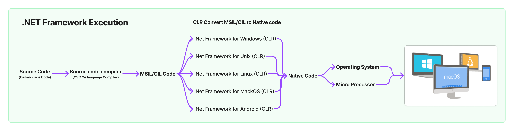
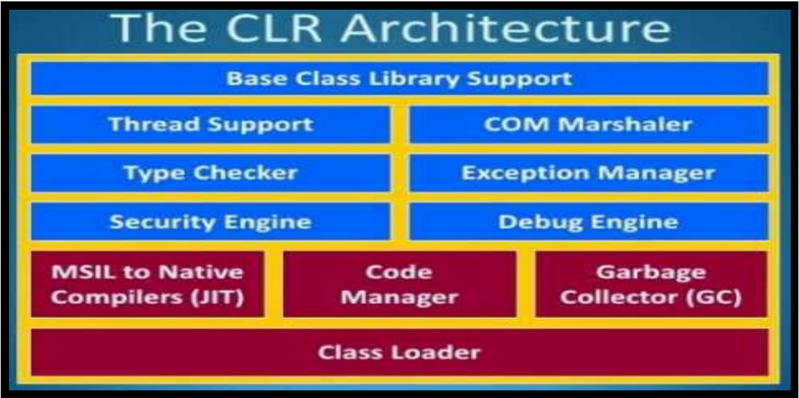
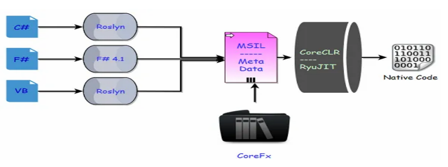
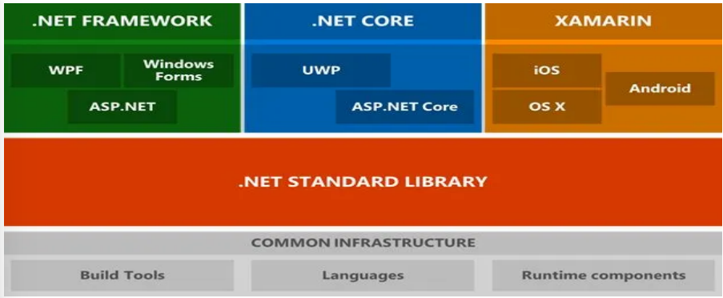
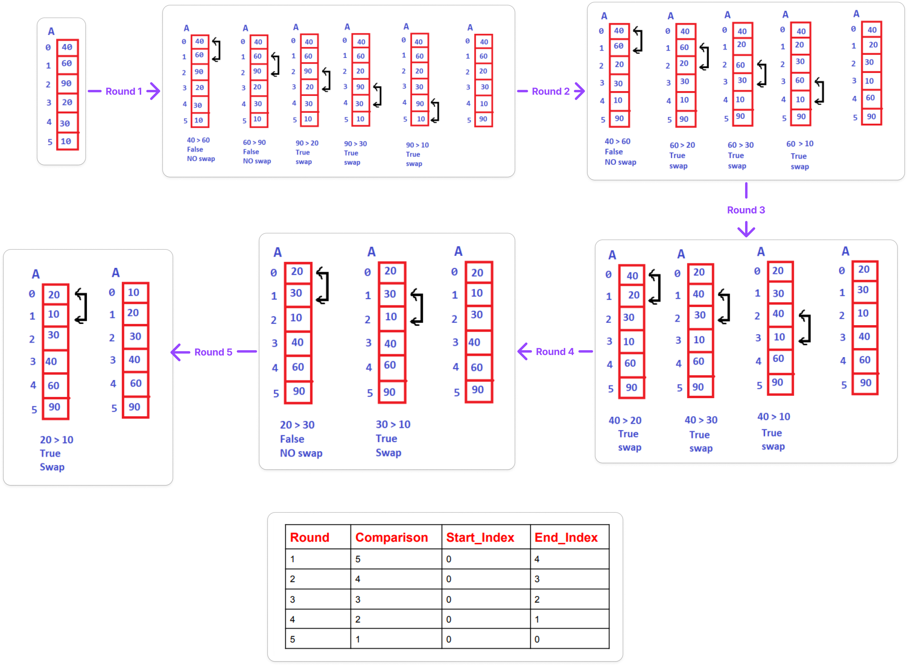

## CSharp Question:

## 01: Compilation, History, Articture

- <details>
    <summary>What is .NET?</summary>
    <hr/>
    <p>
    It's a Framework, it is a product of Microsoft launched in the year 2002, which can be used for building various kinds of Applications like: Web, Mobile, Desktop, Micro services, Cloud, Machine Learning, Game Development and IoT (Internet of Things).
    </p>
    <hr/>
  </details>
- <details>
    <summary>How to develope various kinds of application by using .NET?</summary>
    <hr/>
    <p>To develop the above applications, .NET provides with a set of Programming Languages, Technologies & Servers using which we can build any kind of Application.</p>
    <hr/>
  </details>
- <details>
    <summary>What are the Programming Languages, .NET provides to us?</summary>
    <hr/>
    <p>In 2002 .NET give 30+ programming languages like CSharp(C#), VB.NET, Python.NET, J#.NET and etc are available for a developer to build applications and programmers have a chance of choosing any 1 language from the list. </p>
    <hr/>
  </details>
- <details>
    <summary>As of todady, how many language usege in .NET?</summary>
    <hr/>
    <p>
    5 language: C#, VB.NET, F#.NET, Iron Python and ML.NET<br/>C# is the most popular language.<br/> And this language is run in the .NET Framework
    </p>
    <hr/>
  </details>
- <details>
    <summary>What are the two important features in .Net?</summary>
    <hr/>
    <p>
    1. Language Independent<br/>
    2. Platform Independent
    </p>
    <hr/>
  </details>
- <details>
    <summary>What is Framework?</summary>
    <hr/>
    <p>Framework is a runtime environment which provides many features & will allow to run multiple programming language code.</p>
    <hr/>
  </details>
- <details>
    <summary>What is the output code generated after .NET compilation, and who compiles .NET code?</summary>
    <hr/>
    <p>The output code generated after compiling a program written in a .NET language is called CIL (Common Intermediate Language) or MSIL (Microsoft Intermediate Language).</p>
    <hr/>
  </details>
- <details>
    <summary>If any 2 languages want to communicate or interoperate with each other they need?</summary>
    <hr/>
    <p>1. Not mismatch compile code.</p>
    <p>2. Not mismatch data type.</p>
    <hr/>
  </details>
- <details>
    <summary>How does .NET solve the problem of communication between languages?</summary>
    <hr/>
    <p>.NET solves the problem of communication between different programming languages by making sure that all languages compile down to the same kind of code called CIL or MSIL. It also avoids problems with different data types by using the 'Common Type System' (CTS), which makes sure that similar data types are the same size and work the same way across all .NET languages.</p>
    <hr/>
  </details>
- <details>
    <summary>How to execute C language code?</summary>
    <hr/>
    <p>The program we write in C is called source code.</p>
    <p>The C compiler compiles the source code and generates native code. Usually, this native code can only run on the machine where it was generated, and the operating system executes the code.</p>
    <p>C language Source code > C compiler > Native code > Execute the code</p>
    <p>When a language compiler compiles the source code, it considers two factors:<br/>
      1. Operating System (OS) Architecture<br/>
      2. Processor Architecture
    </p>
    <p>Native code is created so it can be understood by the current processor and the operating system where the code is compiled.</p>
    <hr/>
  </details>

#### Nots

```HTML
C++ Source Code => Compiled by using C++ Compiler => Generates Object Code => Which can be consumed from another C++ Program.


Java Source Code => Compiled by using Java Compiler => Generates Byte Code => Which can be consumed from another Java Program.


C# Source Code => Compiled by using C# Compiler => Generates CIL Code => Which can be consumed from any .NET Language Program.


F# Source Code => Compiled by using F# Compiler => Generates CIL Code => Which can be consumed from any .NET Language Program.


VB Source Code => Compiled by using VB Compiler => Generates CIL Code => Which can be consumed from any .NET Language Program.

```

```
.NET Language means all dotnet language(C#, F#.NET, VB.NET, Iron Python and ML.NET).
```

- <details>
    <summary>What is Platform Independent?</summary>
    <hr/>
    <p>It is a way to run an application developed on one platform on <mark>other</mark> platforms.</p>
    <p>Platform Independent also multi-platform software or cross-platform software</p>
    <hr/>
  </details>
- <details>
    <summary>What is Platform?</summary>
    <hr/>
    <p>A platform is an environment where an application runs. It includes two main components: microprocessor and operating system.</p>
    <hr/>
  </details>
- <details>
    <summary>What is a platform dependency?</summary>
    <hr/>
    <p>The code created by the language compiler cannot run on a different processor or operating system. This is called platform dependency.</p>
    <hr/>
  </details>
- <details>
    <summary>Explain about the code execution process in .Net?</summary>
    <hr/>
    <p> In .Net source code will be compiled by the respective language compiler & an Intermediate code is generated known as MSIL (MicroSoft Intermediate Language)</p>
    <p>This MSIL code is then converted into native code using CLR (Common Language Runtime) finally code will be executed by the operating system with the help of CLR (or) CLR will run the code with the help of operating system</p>

  

    <hr/>
  </details>

- <details>
    <summary>What happens to the code when you compile a .NET application, and what is the outcome?</summary>
    <hr/>
    <p>When you compile a .NET application using any .NET language, the code is turned into "CIL" (Common Intermediate Language) code. This intermediate code is the result of the compilation process, no matter which .NET language you used to create the application.</p>
    <p></p>
    <hr/>
  </details>
- <details>
    <summary>How to run CIL code on client machines?</summary>
    <hr/>
    <p>To run CIL code on client machines, you need to install the <mark><b>.NET Runtime</b></mark> software. This runtime includes the CLR (Common Language Runtime), which converts CIL code into native machine code that the computer can execute.</p>
    <hr/>
  </details>
- <details>
    <summary>How did .NET expand to support operating systems other than Windows?</summary>
    <hr/>
    <p>When .NET was first launched by Microsoft in 2002, the .NET Runtime was only available for Windows. However, Microsoft made the specifications for developing the runtime open, allowing third-party companies to create runtimes for other operating systems. This led to the development of the ".NET Framework," starting with version 1.0 and ending with version 4.8.</p>
    <hr/>
  </details>
- <details>
    <summary>What is the role of the CLR in the .NET Framework?</summary>
    <hr/>
    <p>The CLR (Common Language Runtime) is a key component of the .NET Runtime that converts CIL (Common Intermediate Language) code into native machine code. This conversion allows the compiled .NET application to run on the client machine.</p>
    <hr/>
  </details>
- <details>
    <summary>What was a major criticism of the .NET Framework before 2016?</summary>
    <hr/>
    <p>The .NET Framework was criticized for not being fully platform-independent because Microsoft initially provided it only for Windows. This limited the ability of developers to create cross-platform applications.</p>
    <hr/>
  </details>
- <details>
    <summary>What significant change did Microsoft introduce with .NET Core in 2016?</summary>
    <hr/>
    <p>In 2016, Microsoft introduced .NET Core, a new runtime designed to work on <mark><b>multiple platforms</b></mark>. Unlike the original .NET Framework, .NET Core was available for Windows, Linux, and Mac, allowing developers to build and run applications on different operating systems.</p>
    <hr/>
  </details>
- <details>
    <summary>What is the significance of the .NET 5.0 release in 2020?</summary>
    <hr/>
    <p>On November 10, 2020, Microsoft released .NET 5.0, which <mark><b>merged the .NET Framework and .NET Core into one platform</b></mark>. This new .NET, starting from version 5.0, is a continuation of .NET Core but is now <mark><b> just called “.NET.” </b></mark> The latest version, as of November 2021, is .NET 6.0.</p>
    <hr/>
  </details>
- <details>
    <summary>How did Microsoft simplify the naming of its runtime frameworks in 2020?</summary>
    <hr/>
    <p>Microsoft made the naming simpler by combining .NET Framework and .NET Core into one platform called ".NET." Starting with version 5.0, this unified platform continues from .NET Core but is <mark><b> no longer called .NET Core or .NET Framework separately.</mark></b></p>
    <hr/>
  </details>
- <details>
    <summary>What is Distributed application?</summary>
    <hr/>
    <p>A distributed application is software that <mark><b> runs related code across multiple machines </mark></b>. For example, in an application like <mark><b> Gmail </mark></b>, the code may run on different machines: one on the user's device (e.g., a <mark><b> browser </mark></b>), <mark><b>another on a server,</mark></b> and a <mark><b> third on a database server </mark></b>. This setup, where different components of the application run on different machines, defines a distributed application.</p>
    <hr/>
  </details>
- <details>
    <summary>When the program comes to a running state?</summary>
    <hr/>
    <p>When we double-click the .exe file of the program, it is moved from secondary memory to primary memory, and then the program starts running.</p>
    <p>Memory allocation always happens in primary memory.</p>
    <p>Saving the program always happens in secondary memory.</p>
    <hr/>
  </details>
- <details>
      <summary>What is a .NET Runtime?</summary>
      <hr/>
      <p>It's software that must be installed on the client's machine to run .NET applications. It sits on top of the OS and executes the CIL code while hiding the OS's functionalities.</p>
      <hr/>
    </details>
- <details>
    <summary>What is Managed and Un-Managed App's?</summary>
    <hr/>
    <p>Applications that run directly under the operating system are called Unmanaged Apps, while those that run under the .NET Runtime are called Managed Apps.</p>
    <hr/>
  </details>
- <details>
    <summary>What is Managed code?</summary>
    <hr/>
    <p>Managed code is MSIL code, which the CLR can understand and manage.</p>
    <p>The CLR provides all .NET features and services (like garbage collection, type safety, and security) for managed code.</p>
    <p>Examples of managed code include C#, VB.NET, and other programming languages supported by .NET.</p>
    <hr/>
  </details>
- <details>
    <summary>What is Un-managed code?</summary>
    <hr/>
    <p>Unmanaged code is not in MSIL code and is not managed by the CLR but can still be used in a .NET environment.</p>
    <p>The CLR does not provide .NET features (like garbage collection or security) for unmanaged code.</p>
    <p>Examples of unmanaged code include COM components, Win32 APIs, and ActiveX controls.</p>
    <p>Managed code generally runs faster and more securely, while unmanaged code can be slower and less safe due to the lack of CLR management.</p>
    <hr/>
  </details>
- <details>
    <summary>When Application run under the `Runtime` then what are the features provided by Runtime?</summary>
    <hr/>
    <p>1. Platform Independent or Portable<br/> 2. Secured<br/>3. Automatic Memory Management</p>
    <hr/>
  </details>
- <details>
    <summary>What are the two main components are in .NET Compiler?</summary>
    <hr/>
    <p>The two main components are CLR (Common Language Runtime) and BCL (Base Class Libraries).</p>
    <hr/>
  </details>
- <details>
    <summary>What are the task/rules preformed by CLR?</summary>
    <hr/>
    <p>The CLR preformed several action like CLS(Common language specification), CTS (Common Type System), GS (Garbage Collector) & JIT (Just In Time).</p>
    <hr/>
  </details>
- <details>
    <summary>How does the CLR (Common Language Runtime) allow different programming languages to work together in .NET, even though each language has its own data types?</summary>
    <hr/>
    <p>One programming language cannot understand another language, but all these languages are executed by the CLR. This is because the CLR does not understand any language's data types; it has its own data type system for MSIL.</p>
    <p>Each language's data types are converted into the CLR's data type system by their respective compilers, so the CLR understands its own data type system.</p>
    <hr/>
  </details>
- <details>
    <summary>What is CLS and what does it do?</summary>
    <hr/>
    <p>CLS stands for Common Language Specification. It is a set of rules(like Syntactically) that all .NET languages follow to ensure they can work together. When a language compiler compiles source code, it generates MSIL according to these rules. This allows different programming languages supported by .NET to be compatible with each other, <mark><b>providing language interoperability</b></mark>.</p>
    <hr/>
  </details>
- <details>
    <summary>What is Language specification?</summary>
    <hr/>
    <p>This rule we follow to write code in any programming language is known as language specification.</p>
    <hr/>
  </details>
- <details>
    <summary>What is Language Interoperability?</summary>
    <hr/>
    <p>Language interoperability means allowing code written in one programming language to run within another programming language. And .Net support language Interoperability.</p>
    <hr/>
  </details>
- <details>
    <summary>What is CTS(Common Type System)?</summary>
    <hr/>
    <p>In C#, we use the int keyword to create an integer variable, while in VB .NET, we use the Integer keyword for the same purpose. Each programming language has its own data type system, and one language cannot understand another's data types. However, all these languages are executed by the CLR. This is because the CLR does not understand any specific programming language's data types; instead, it has its own data type system for MSIL.</p>
    <p>This data type system of CLR is shared by all programming languages supported by .Net, so it is called CTS.</p>
    <hr/>
  </details>

  ```
  Note: Thanks to CLS and CTS, all .NET languages can work together and communicate with each other.
  ```

- <details>
    <summary>What is VES (Virtual Execution System)?</summary>
    <hr/>
    <p>This is nothing but CLR or Common Language Runtime.</p>
    <hr/>
  </details>
- <details>
    <summary>What are the 2 main parts present in CLR?</summary>
    <hr/>
    <p>The runtime software has two main parts: "Libraries" and an "Execution Engine".</p>
    <p>Libraries part: FCL (Framework Class Libraries) in .NET Framework, CORE FX in .NET Core and .NET </p>
    <p>Execution Engine part: CLR (Common Language Runtime) in .NET Framework, CORE CLR in .NET Core and .NET.</p>
    <hr/>
  </details>
- <details>
    <summary>What is Libraries?</summary>
    <hr/>
    <p>Libraries: A library is a set of reusable functions. Every programming language has built-in libraries, like Header Files in C and C++, and Packages in Java. Similarly, .NET languages have built-in libraries called “FCL (Framework Class Libraries)” in the .NET Framework and "Core FX” in .NET Core and .NET.</p>
    <hr/>
  </details>
- <details>
    <summary>Execution Engine?</summary>
    <hr/>
    <p>Execution Engine: As mentioned earlier, .NET applications do not run directly on the OS but within the Runtime. In this Runtime, there is an Execution Engine responsible for running applications. This is called CLR in the .NET Framework and “CORE CLR” in .NET Core and .NET.</p>
    <p>CLR and Core CLR are the execution engines of the .NET Runtime, where all .NET applications run under their supervision. They contain various components to manage different tasks, such as:</p>

  

    <hr/>
  </details>

- <details>
    <summary>What is Security Engine?</summary>
    <hr/>
    <p>This is responsible for the security of our applications. It ensures that applications don't directly interact with the OS, and the OS doesn't directly interact with the applications.</p>
    <hr/>
  </details>
- <details>
    <summary>What is JIT Compiler?</summary>
    <hr/>
    <p>The Just-In-Time (JIT) compiler is responsible for converting Common Intermediate Language (CIL) code into native machine code based on the specific platform where the application is being executed. This process is known as JIT compilation, where the conversion happens gradually as the program runs.</p>
    <p>This conversion happens at runtime, just before the code is executed, ensuring that the application can run efficiently on different hardware. If the code has been compiled before, the JIT compiler reuses the previously compiled native code instead of recompiling it. However, if the code is new, the JIT compiler compiles it and then executes it.</p>
    <hr/>
  </details>
- <details>
    <summary>What is Native code?</summary>
    <hr/>
    <p>Native code understand by OS. Native code is the code that is compiled to run on a specific processor and operating system</p>
    <hr/>
  </details>
- <details>
    <summary>What is Machine code?</summary>
    <hr/>
    <p>Machine code understand by CPU. Machine code is the binary instructions that the CPU runs directly.</p>
    <hr/>
  </details>
- <details>
    <summary>What is Garbage Collector?</summary>
    <hr/>
    <p>It is responsible for "Automatic Memory Management," which is the process of allocating and de-allocating memory needed for a program to run. There are two types of memory management:<br/>1. Manual or Explicit(by programmers)<br/>2. Automatic or Implicit(by compiler)</p>
    <hr/>
  </details>
- <details>
    <summary>What is automatic memory management, Explain?</summary>
    <hr/>
    <p>The automatic memory management process is handled by the Garbage Collector. The Garbage Collector provides automatic memory management only for Managed code, not for Unmanaged code.</p>
    <hr/>
  </details>

---

#### Diffrence bitween value type and refrence type:

1. <details>
     <summary>Who allocate memory for Value type and where it's placed?</summary>
     <hr/>
     <p>Usually, memory allocation for value types is done using static memory allocation, and these data types are placed in stack memory.</p>
     <hr/>
   </details>
2. <details>
     <summary>Who allocate memory for refrence type and where it's placed?</summary>
     <hr/>
     <p>Memory allocation for reference types is done using dynamic memory allocation, and these are placed in heap memory.</p>
     <hr/>
   </details>
3. <details>
     <summary>How is data stored for value types and reference types in memory?</summary>
     <hr/>
     <p>Value types store data directly in their memory location, whereas reference types store a reference to another memory location where the data is stored.</p>
     <hr/>
   </details>
4. <details>
     <summary>When is memory allocated for value types compared to reference types?</summary>
     <hr/>
     <p>Memory allocated for value types is at compile time, while for reference types allocated the memory at runtime.</p>
     <hr/>
   </details>
5. <details>
     <summary>Where are value types and reference types stored in memory?</summary>
     <hr/>
     <p>Value types are stored in stack memory, while reference types are stored in heap memory.</p>
     <hr/>
   </details>
6. <details>
     <summary>How does memory allocation differ between value types and reference types?</summary>
     <hr/>
     <p>Memory allocation for value types occurs in <mark><b> contiguous memory locations in the stack </b></mark>, whereas for reference types, it occurs in <mark><b> non-contiguous (random) memory locations in the heap </b></mark>.</p>
     <hr/>
   </details>
7. <details>
     <summary>How does the CLR handle memory management for value types versus reference types?</summary>
     <hr/>
     <p>The CLR does not provide automatic memory management for value types, whereas it does provide automatic memory management ( such as garbage collection ) for reference types.</p>
     <hr/>
   </details>
8. <details>
     <summary>How does the amount of memory occupied by value types compare to reference types?</summary>
     <hr/>
     <p>Value types generally occupy less memory, whereas reference types can occupy more memory, with a single reference type variable potentially using up to 2GB.</p>
     <hr/>
   </details>
9. <details>
     <summary>What happens if a value type or reference type variable is not initialized?</summary>
     <hr/>
     <p>If a value type variable is not initialized, it stores a default value (e.g., int a; defaults to 0). If a reference type variable is not initialized, it stores a null reference (e.g., string s; defaults to null).</p>
     <hr/>
   </details>
10. <details>
      <summary>Can you provide examples of value types and reference types in C#?</summary>
      <hr/>
      <p>Examples of value types: int, double, and enum, while examples of reference types: string, object, and class.</p>
      <hr/>
    </details>

<hr/>

| **Serial Number** | **Value Type**                                                                         | **Reference Type**                                                                                   |
| ----------------- | -------------------------------------------------------------------------------------- | ---------------------------------------------------------------------------------------------------- |
| 1                 | Store the data directly into their memory location.                                    | Do not store the data directly; instead, they refer to another memory location where data is stored. |
| 2                 | Memory is allocated at compile time.                                                   | Memory is allocated at runtime.                                                                      |
| 3                 | Memory is allocated by stack memory allocation.                                        | Memory is allocated by dynamic memory allocation.                                                    |
| 4                 | Memory allocation is made within the stack, i.e., in a contiguous memory location.     | Memory allocation is made within the heap, i.e., in a random memory location.                        |
| 5                 | CLR does not provide automatic memory management.                                      | CLR provides automatic memory management.                                                            |
| 6                 | Occupies less memory.                                                                  | Occupies more memory; a single reference type variable can occupy a maximum of up to 2GB.            |
| 7                 | If data is not initialized, stores the default value in the variable (e.g., `int a;`). | If data is not initialized, stores a null reference in the variable (e.g., `string S;`).             |
| 8                 | Examples of value types: `int`, `double`, `enum`, etc.                                 | Examples of reference types: `string`, `object`, `class`, etc.                                       |

<hr/>

- <details>
    <summary>How many times is code compiled in .NET?</summary>
    <hr/>
    2 Times:<br/>
    <p>1: The first compilation (from source code to Intermediate Language - IL) happens at build time and is relatively slow.</p>
    <p>2: The second compilation (from IL to machine code) happens at runtime via the Just-In-Time (JIT) compiler, which is faster for later runs.</p>
    <hr/>
  </details>
- <details>
    <summary>How many times is code compiled in Java and Python?</summary>
    <hr/>
    1 Time:<br/>
    <p>Java code is compiled once from source code to bytecode, which the Java Virtual Machine (JVM) then interprets or compiles to machine code during execution. Python code is compiled once to bytecode and then interpreted by the Python interpreter at runtime.</p>
    <hr/>
  </details>
- <details>
    <summary> What is the role of the Garbage Collector (GC) in .NET?</summary>
    <hr/>
    <p>The Garbage Collector is responsible for <mark><b>providing automatic memory management for managed code.</mark></b> It helps in automatically allocating and freeing memory, which <mark><b>reduces the risk of memory leaks and improves application performance</mark></b>. However, it does <mark><b>not provide automatic memory management for unmanaged code.</mark></b></p>
    <hr/>
  </details>
- <details>
    <summary>What is the managed heap, and how is it structured?</summary>
    <hr/>
    <p>The managed heap is a region of memory where objects created by managed code are stored. It is divided into three parts called generations: Generation 0, Generation 1, and Generation 2. These generations are arranged in increasing order of memory size, with Generation 0 having the smallest size and Generation 2 having the largest.</p>
    <hr/>
  </details>
- <details>
    <summary>Why are there different generations in the managed heap, and what is their purpose?</summary>
    <hr/>
    <p>The generations (Generation 0, Generation 1, and Generation 2) are <mark><b>used to optimize memory management</mark></b>. <mark><b>Newly created objects are placed in Generation 0. As objects continue to exist after several rounds of garbage collection, they are moved to higher levels (Generation 1, then Generation 2). This approach improves performance by making garbage collection less frequent and less costly.</mark></b></p>
    <hr/>
  </details>
- <details>
    <summary>Where does the Garbage Collector place newly created objects, and why?</summary>
    <hr/>
    <p>The Garbage Collector places all newly created objects in Generation 0. This is because Generation 0 is the <mark><b>smallest</mark></b> and is collected most frequently, which <mark><b>helps quickly remove short-lived objects and free memory.</mark></b></p>
    <hr/>
  </details>
- <details>
    <summary>What happens when Generation 0 is completely filled, and a new object needs to be created?</summary>
    <hr/>
    <p>When Generation 0 is completely filled, the <mark><b>Garbage Collector performs a process called "collection." This process has two phases:</mark></b><br/>
    <ul>
    <li><mark><b>Marking Phase: </mark></b>The GC examines all objects in Generation 0, identifies reachable (in use) and unreachable (not in use or idle) objects, and maintains separate flags for them.</li>
    <li><mark><b>Compact Phase: </mark></b>The GC destroys the unreachable objects, promotes the reachable objects to Generation 1, and places the newly created object in Generation 0.</li>
    </ul>
    </p>
    <hr/>
  </details>
- <details>
    <summary>What happens if both Generation 0 and Generation 1 are completely filled and a new object needs to be created?</summary>
    <hr/>
    <p>If both Generation 0 and Generation 1 are filled, the GC performs a collection of both generations:</p>
    <ul>
    <li>Marking Phase: The GC examines all objects in both generations and identifies reachable and unreachable objects.</li>
    <li>Compact Phase: The GC destroys the unreachable objects, promotes reachable objects to Generation 2, and places the newly created object in Generation 0.</li>
    </ul>
    <hr/>
  </details>
- <details>
    <summary>What does the Garbage Collector do if all three generations (Generation 0, Generation 1, and Generation 2) are filled?</summary>
    <hr/>
    <p>If all three generations are filled, the Garbage Collector will perform a collection for all three generations (Generation 0, Generation 1, and Generation 2). This process includes marking the objects, destroying unreachable ones, and freeing up space for new objects.</p>
    <hr/>
  </details>
- <details>
    <summary>What are the two main phases of the Garbage Collection process?</summary>
    <hr/>
    <p>The two main phases of the Garbage Collection process are:</p>
    <ul>
    <li>Marking Phase: The GC identifies which objects are reachable and which are unreachable.</li>
    <li>Compact Phase: The GC removes the unreachable objects and compacts the memory by promoting reachable objects to the next generation.</li>
    </ul>
    <hr/>
  </details>
- <details>
    <summary>What is the "thumb rule" for placing new objects in the managed heap?</summary>
    <hr/>
    <p>The "thumb rule" for the Garbage Collector is that all newly created objects should be placed in Generation 0. The GC has no right to place newly created objects directly into Generation 1 or Generation 2.</p>
    <hr/>
  </details>
- <details>
    <summary>Why does the Garbage Collector promote objects to higher generations?</summary>
    <hr/>
    <p>The Garbage Collector promotes objects to higher generations to <mark><b>improve performance.</mark></b> Objects that survive multiple collections are likely to <mark><b>live longer</mark></b>, so promoting them to less frequently collected generations <mark><b>reduces the cost of garbage collection.</mark></b></p>
    <hr/>
  </details>
- <details>
    <summary>What is Application Software?</summary>
    <hr/>
    <p><mark><b> Application software refers to programs designed for end-users to perform specific tasks. </b></mark> This includes individual applications like Notepad, Microsoft Word, Excel, or web browsers. Essentially, any program you use on a computer, <mark><b>other than the operating system, is considered application software.</b></mark> Over time, the term has expanded to include mobile apps and complex software environments, highlighting the role of these programs in modern computing.</p>
    <hr/>
  </details>
- <details>
    <summary>How to develop Application software?</summary>
    <hr/>
    <p>Software development is split into Applications Development, which focuses on making user-friendly programs like apps and games, and Systems Development, which involves creating and maintaining operating systems. Programming languages, written in either imperative or declarative forms, are crucial for both types of development.</p>
    <hr/>
  </details>
- <details>
    <summary>What is a class library in .NET?</summary>
    <hr/>
    <p>A class library is a collection of classes with predefined functions that help developers write code more efficiently.</p>
    <hr/>
  </details>
- <details>
    <summary>What is another name for a class library in .NET?</summary>
    <hr/>
    <p>Assembly</p>
    <hr/>
  </details>
- <details>
    <summary>How does Microsoft organize class libraries in .NET?</summary>
    <hr/>
    <p>Using a hierarchy: Class Libraries/Assemblies > Namespaces > Classes > Functions > Code.</p>
    <hr/>
  </details>
- <details>
    <summary>What does the hierarchy of class libraries help us?</summary>
    <hr/>
    <p>Provides easy access to predefined functions and avoids duplicate naming problems.</p>
    <hr/>
  </details>
- <details>
    <summary>How can you access a function from a class library in .NET?</summary>
    <hr/>
    <p>Using the format: AssemblyName.NamespaceName.ClassName.FunctionName.</p>
    <hr/>
  </details>
- <details>
    <summary>What are the file formats used for class libraries or assemblies in .NET?</summary>
    <hr/>
    <p>DLL (Dynamic Link Libraries) or EXE files.</p>
    <hr/>
  </details>
- <details>
    <summary>Is creating an assembly in .NET required?</summary>
    <hr/>
    <p>Yes, creating an assembly is required.</p>
    <hr/>
  </details>
- <details>
    <summary>Is creating a namespace in .NET compulsory?</summary>
    <hr/>
    <p>No, creating a namespace is optional.</p>
    <hr/>
  </details>
- <details>
    <summary>In .Net class libraries are divided into how many categories?</summary>
    <hr/>
    <p>Base class libraries</p>
    <p>User defined class libraries</p>
    <hr/>
  </details>
- <details>
    <summary>What is a Base Class Library (BCL)?</summary>
    <hr/>
    <p>Libraries created by Microsoft that are installed with the .NET Framework on a computer. The BCL in .NET is a collection of basic building blocks, like ready-made classes and methods, that help you perform common tasks such as working with files, data, and input/output. It provides the core tools needed to create .NET applications.</p>
    <hr/>
  </details>
- <details>
    <summary>When are Base Class Libraries installed on a computer?</summary>
    <hr/>
    <p>These are installed on our computer when we install the .NET framework. Usually, the .NET framework is installed along with the operating system.</p>
    <hr/>
  </details>
- <details>
    <summary>What is the purpose of User-Defined Class Libraries?</summary>
    <hr/>
    <p>To allow developers to create reusable code that can be shared within their own projects or across multiple projects.</p>
    <hr/>
  </details>
- <details>
    <summary>What is `.dll` file?</summary>
    <hr/>
    `.dll` file is DLL file.
    <br/>
    A `.dll` (Dynamic Link Library) file contains code and data that can be used by multiple programs simultaneously.
    <hr/>
  </details>
- <details>
    <summary>What is `.exe` file?</summary>
    <hr/>
    <p>And the .exe (Executable) file is a standalone application that can be directly run by the operating system.</p>
    <hr/>
  </details>
- <details>
    <summary>Is that posible to run directly run .dll file?</summary>
    <hr/>
    .dll file cannot be directly run, it must be called by an executable (.exe) or another program that uses its functions.
    <hr/>
  </details>
- <details>
    <summary>What is CLI (Common Language Infrastructure)?</summary>
    <hr/>
    
    <p>The Common Language Infrastructure (CLI) is a set of rules that define an environment for running code, allowing different high-level languages to work on various platforms without changes. It includes:</p>
    <ul>
    <li>Common Language Specification (CLS): Defines the basic language features that all .NET languages must support.</li>
    <li>Common Type System (CTS): Standardizes data types and objects to ensure consistency across languages.</li>
    <li>Metadata: Provides data about the types, methods, and other elements in the code.</li>
    <li>Virtual Execution System (VES): Manages code execution and provides services like garbage collection.</li>
    </ul>
    <hr/>
  </details>
- <details>
    <summary>What is the diffrence bitweeb CLR and CLI?</summary>
    <hr/>
    Difference between CLR and CLI:
    <ol>
    <li>CLR (Common Language Runtime):
    <ul>
    <li>CLR is a part of Microsoft's .NET Framework.</li>
    <li>It provides a runtime environment for executing .NET applications.</li>
    <li>CLR manages memory, handles exceptions, performs garbage collection, ensures type safety, and provides security and other services needed for running managed code.</li>
    <li>In essence, CLR is the execution engine of the .NET Framework where the code is executed.</li>
    </ul>
    </li>
    <li>CLI (Common Language Infrastructure):
    <ul>
    <li>CLI is a specification developed by Microsoft that describes the runtime environment needed to run programs written in any language that targets the .NET platform.</li>
    <li>It includes specifications for various aspects like metadata, type systems, and libraries that are necessary to execute code across different programming languages.</li>
    <li>CLI is a standard that defines how different programming languages can interoperate and run on different platforms. It forms the foundation upon which the .NET Framework (including CLR) is built.</li>
    </ul>
    </li>
    </ol>
    Summary:
    <li>CLR is the implementation of the CLI specification in the .NET Framework.</li>
    <li>CLR is a runtime environment specifically for .NET applications, whereas CLI is a broader standard that allows multiple languages and platforms to work together.</li>
    <hr/>
  </details>
- <details>
    <summary>What is the relationship between CLR, CLI, CIL, IL, MSIL, CTS, CLS and GS in the context of .NET?</summary>
    <hr/>
    <ol>
    <li>CLR (Common Language Runtime):
      <ul>
      <li>Definition: The CLR is the runtime environment of the .NETFramework.</li>
      <li>Role: It manages the execution of .NET programs byproviding services like memory management, type safety,exception handling, garbage collection, security, and more.<li>
      <li>Relationship: CLR is an implementation of the CLIstandard, designed to provide a common runtime for all .NETlanguages.</li>
      </ul>
    </li>
    <li>
       CLI (Common Language Infrastructure):
       <ul>
       <li>Definition: The CLI is an open standard developed by Microsoft, which specifies the execution environment for code written in multiple programming languages.</li>
       <li>Role: It defines the rules and structures for code execution, interoperability between languages, and services like exception handling and garbage collection.</li>
       <li>Relationship: The CLI provides the blueprint for the CLR. It is the foundation upon which the .NET runtime (CLR) is built.</li>
       </ul>
    </li>
    <li>
    CIL (Common Intermediate Language), IL (Intermediate Language), and MSIL (Microsoft Intermediate Language):
    <ul>
    <li>Definition: All three refer to the same concept but with slight naming differences:
    <ul>
    <li>CIL: Common Intermediate Language — the standardized intermediate language as per the CLI specification.</li>
    <li>IL: Intermediate Language — a general term for the low-level, platform-independent code that .NET languages compile into.</li>
    <li>MSIL: Microsoft Intermediate Language — the implementation of IL by Microsoft as part of the .NET Framework.</li>
    </ul>
    </li>
    <li>Role: CIL/IL/MSIL is the intermediate language to which high-level .NET languages (like C# or VB.NET) are compiled. This IL code is then executed by the CLR.</li>
    <li>Relationship: CIL/IL/MSIL is the code format that is executed by the CLR.</li>
    </ul>
    </li>
    <li>CTS (Common Type System):
    <ul>
    <li>Definition: CTS is a specification that defines how types are declared, used, and managed in the CLI environment.</li>
    <li>Role: It ensures that objects written in different .NET languages can interact with each other by defining a common set of data types.</li>
    <li>Relationship: CTS is part of the CLI specification. CLR enforces CTS rules to provide language interoperability, ensuring that all .NET languages use a common type system.</li>
    </ul>
    </li>
    <li>CLS (Common Language Specification):
    <ul>
    <li>Definition: CLS is a subset of the CTS, which defines a set of rules that all .NET languages must follow to be compliant with the .NET Framework.</li>
    <li>Role: It ensures that code written in one .NET language can be used by any other .NET language.</li>
    <li>Relationship: CLS is a guideline that all .NET languages should adhere to for cross-language interoperability. It builds upon CTS by defining a common standard for .NET languages.</li>
    </ul>
    </li>
    <li>GS (Garbage Collection):
    <ul>
    <li>Definition: GS refers to Garbage Collection, a feature of the CLR that automatically manages memory by reclaiming objects that are no longer in use.</li>
    <li>Role: It prevents memory leaks and optimizes the usage of memory resources by cleaning up unused objects.</li>
    <li>Relationship: GS is an essential service provided by the CLR to manage memory effectively during the execution of .NET applications.</li>
    </ul>
    </li>
    </ol>
    Summary of Relationships:
    <li>CLR is the runtime that executes .NET programs and is based on the CLI specification.</li>
    <li>CIL (IL or MSIL) is the intermediate code format to which all .NET languages compile, and which the CLR executes.</li>
    <li>CTS defines a standard type system that all .NET languages use, ensuring cross-language compatibility.</li>
    <li>CLS is a subset of CTS that further defines rules for cross-language interoperability.</li>
    <li>GS (Garbage Collection) is a memory management feature of the CLR.</li>
    <hr/>
  </details>
- <details>
    <summary>What is .NET Framework and .NET Core?</summary>
    <hr/>
    <p>NET Framework: The original .NET implementation for building and running applications on Windows, including websites, services, and desktop apps.</p>
    <p>.NET Core: A cross-platform version of .NET for running applications on Windows, Linux, and macOS. It is now succeeded by .NET 5+.</p>
    <p>Xamarin/Mono: Implements .NET for mobile platforms, such as iOS and Android.</p>
    <hr/>
  </details>
- <details>
    <summary>What is the architecture of the .NET Framework CLR?</summary>
    <hr/>
    <p>.NET applications can be written in various .NET languages such as C#, F#, or Visual Basic. The source code written in these languages is compiled into a language-agnostic Common Intermediate Language (CIL). This compiled code is stored in assemblies, which are files with a .dll or .exe extension.</p>
    <p>When you run a .NET application, the Common Language Runtime (CLR) takes the assemblies and uses a Just-In-Time (JIT) compiler to convert the CIL code into machine code. This machine code is then executed on the specific hardware architecture of the computer.</p>
    <hr/>
  </details>
- <details>
    <summary>What is meant by developing applications using multiple languages?</summary>
    <hr/>
    <p>In .NET, developing applications using multiple languages means that different programming languages can be used together to build software. All .NET languages compile to a common intermediate language called Common Intermediate Language (CIL). This CIL code is then executed by the Common Language Runtime (CLR) through Just-In-Time (JIT) compilation, which converts it to machine code suitable for the specific computer architecture.</p>
    <hr/>
  </details>
- <details>
    <summary>Where is MSIL used, and where is CIL used?</summary>
    <hr/>
    <p>MSIL is used in Microsoft's .NET Framework, while CIL is used in the wider Common Language Infrastructure (CLI).</p>
    <hr/>
  </details>
- <details>
    <summary>Are MSIL and CIL interchangeable?</summary>
    <hr/>
    <p>Yes, they are different names for the same intermediate language.</p>
    <hr/>
  </details>
- <details>
    <summary>Which term describes the intermediate language in the overall .NET ecosystem?</summary>
    <hr/>
    <p>CIL (Common Intermediate Language) is used in the .NET ecosystem.</p>
    <hr/>
  </details>
- <details>
    <summary>What is .NET Framework used for?</summary>
    <hr/>
    <p>.NET Framework is used to create and run software applications on Windows. It provides the environment for running .NET apps.</p>
    <hr/>
  </details>
- <details>
    <summary>Who uses .NET Framework?</summary>
    <hr/>
    <p><b>Users:</b> Need .NET Framework to run applications built with it. It is often pre-installed with Windows but can be downloaded if needed.<br/>
    <b>Developers:</b> Use .NET Framework to build various applications, such as websites, services, and desktop apps, using tools like Visual Studio.</p>
    <hr/>
  </details>
- <details>
    <summary>How does .NET Framework work?</summary>
    <hr/>
    <p>.NET Framework applications are written in languages like C#, F#, or Visual Basic and are compiled to Common Intermediate Language (CIL). The Common Language Runtime (CLR) converts CIL to machine code and runs the application.</p>
    <hr/>
  </details>
- <details>
    <summary>What are the main components/features of .NET Framework?</summary>
    <hr/>
    <p><b>Common Language Runtime (CLR):</b> Manages the execution of applications.<br/>
    <b>.NET Framework Class Library:</b> Provides a set of APIs and types for common functionality.
    </p>
    <hr/>
  </details>
- <details>
    <summary>How many versions of .NET Framework are there?</summary>
    <hr/>
    <p>There are 16 versions of .NET Framework, ranging from 1.0 to 4.8.</p>
    <hr/>
  </details>
- <details>
    <summary>Can you have multiple .NET Frameworks installed?</summary>
    <hr/>
    <p>Yes, some versions can be installed side-by-side, while others may update existing installations.<br/><br/>.NET Framework Version and CLR Version:<br/><br/>.NET Framework 4.x: CLR 4.0<br/>.NET Framework 2.x and 3.x: CLR 2.0<br/>.NET Framework 1.1: CLR 1.1<br/>.NET Framework 1.0: CLR 1.0</p>
    <hr/>
  </details>
- <details>
    <summary>What is the architecture of .NET Core and what are the two main components of .NET Core,</summary>
    <hr/>
    <p>The two main components of .NET Core are CoreCLR and CoreFX. CoreCLR is comparable to the Common Language Runtime (CLR) in the .NET Framework, while CoreFX is comparable to the Framework Class Library (FCL).</p>
    <hr/>
  </details>
- <details>
    <summary>What is CoreFX in .NET Core?</summary>
    <hr/>
    <p>CoreFX is the set of basic class libraries in .NET Core. It includes types for collections, file systems, console, JSON, XML, and other common functions. It is known as the Unified Base Class Library and includes the System.* namespaces (and some Microsoft.* namespaces).</p>
    <hr/>
  </details>
- <details>
    <summary>What is CoreCLR, and what functions does it perform?</summary>
    <hr/>
    <p>CoreCLR is the .NET execution engine in .NET Core, which is a complete runtime and virtual machine for managed execution of .NET programs. It performs functions such as garbage collection and compilation to machine code using the RyuJIT just-in-time compiler.</p>
    <hr/>

  

  </details>

- <details>
    <summary>How does CoreCLR relate to the .NET Framework CLR?</summary>
    <hr/>
    <p>CoreCLR is built from the same code base as the CLR in the .NET Framework. However, it is optimized for .NET Core, providing a lightweight, modular, and cross-platform execution engine.</p>
    <hr/>
  </details>
- <details>
    <summary>Is there a separate CLR version for each .NET Core release?</summary>
    <hr/>
    <p>No, .NET Core releases have a single product version. There is no separate version for the CLR.</p>
    <hr/>
  </details>
- <details>
    <summary>What is Roslyn in the context of .NET development?</summary>
    <hr/>
    <p>Roslyn is the open-source compiler platform for C# and Visual Basic.NET. It is cross-platform and provides rich code analysis APIs, enabling developers to write powerful code analysis and refactoring tools.</p>
    <hr/>
  </details>
- <details>
    <summary>What are the main features of Roslyn?</summary>
    <hr/>
    <p>Roslyn provides a compiler-as-a-service API for C# and VB.NET, offering capabilities such as syntax analysis, semantic analysis, code generation, and refactoring. It allows developers to access and manipulate code in a more powerful way than traditional compilers.</p>
    <hr/>
  </details>
- <details>
    <summary>What is the just-in-time compiler used in CoreCLR, and what is its purpose?</summary>
    <hr/>
    <p>The just-in-time compiler used in CoreCLR is called RyuJIT. Its purpose is to compile Intermediate Language (IL) code into machine code that the processor can execute, allowing for optimized runtime performance.</p>
    <hr/>
  </details>
- <details>
    <summary>How does CoreFX benefit developers in .NET Core?</summary>
    <hr/>
    <p>CoreFX offers a consistent API across all platforms supported by .NET Core.  This allows developers to write code that can run on different operating systems (Windows, Linux, macOS) without needing to modify the code for platform-specific libraries.</p>
    <hr/>
  </details>
- <details>
    <summary>Why did they rewrite the C# compiler in C# for Roslyn?</summary>
    <hr/>
    <p>Rewriting the C# compiler in C# was motivated by the need for better code analysis and tooling support. It also followed a common practice where a language is used to implement its compiler to improve maintainability and to "eat your own dog food," ensuring that the language creators are also programming in the language they are developing.</p>
    <hr/>
  </details>
- <details>
    <summary>What is .NET Core?</summary>
    <hr/>
    <p>.NET Core is a modern, cross-platform, open-source framework designed for building applications that run on Windows, macOS, and Linux. It consists of a runtime built from the same codebase as the .NET Framework CLR and a set of refactored base class libraries (BCL). .NET Core supports various technologies, including ASP.NET Core and Entity Framework Core.</p>
    <hr/>
  </details>
- <details>
    <summary>What are the major components of .NET Core?</summary>
    <hr/>
    The two major components of .NET Core are:
    <p><b>Runtime:</b> The .NET Core runtime, which includes the Garbage Collector (GC) and Just-In-Time (JIT) compiler (RyuJIT), but lacks features like Application Domains and Code Access Security (CAS).</p>
    <p><b>Base Class Libraries (BCL):</b> A set of libraries derived from the .NET Framework class libraries, refactored to allow for modular deployment.</p>
    <hr/>
  </details>
- <details>
    <summary>What are the characteristics of .NET Core?</summary>
    <hr/>
    The key characteristics of .NET Core are:
    <ul>
    <li>Cross-Platform: Runs on Windows, macOS, and Linux.</li>
    <li>Open Source: Available under MIT and Apache 2 licenses.</li>
    <li>Modern: Supports asynchronous programming, no-copy patterns using structs, and resource governance.</li>
    <li>Performance: High performance with features like hardware intrinsics and tiered compilation.</li>
    <li>Consistent Across Environments: Uniform behavior across different OS and architectures.</li>
    <li>Command-Line Tools: Provides easy-to-use CLI tools for development and CI/CD.
    </li>
    <li>Flexible Deployment: Can be installed side-by-side or embedded in apps; compatible with Docker.
    </li>
    </ul>
    <hr/>
  </details>
- <details>
    <summary>What is the composition of .NET Core?</summary>
    <hr/>
    .NET Core is composed of the following parts:
    <ul>
    <li><b>.NET Core Runtime: </b>Provides a type system, assembly loading, garbage collection, native interoperability, and other basic services.</li>
    <li><b>ASP.NET Core Runtime: </b>Framework for building cloud-based and internet-connected applications like web apps, IoT apps, and mobile backends.</li>
    <li><b>.NET Core SDK and Language Compilers: </b>Includes compilers (e.g., Roslyn for C# and F#) and tools for development.</li>
    <li><b>dotnet Command: </b>A CLI tool used to run .NET Core apps, manage runtime selection, and launch apps and tools.</li>
    </ul>
    <hr/>
  </details>
- <details>
    <summary>What is the dotnet command used for in .NET Core?</summary>
    <hr/>
    <p>The dotnet command is a command-line interface (CLI) tool used to run .NET Core applications, execute CLI commands, manage runtime selection, provide assembly loading policies, and launch tools and applications.</p>
    <hr/>
  </details>
- <details>
    <summary>Why is .NET Core considered modern?</summary>
    <hr/>
    <p>.NET Core is considered modern because it uses current software development practices like asynchronous programming, no-copy patterns with structs, and resource management for container environments. It also aims for high performance and works across different platforms.</p>
    <hr/>
  </details>
- <details>
    <summary>What is RyuJIT in the context of .NET Core?</summary>
    <hr/>
    <p>RyuJIT is the just-in-time (JIT) compiler used in the .NET Core runtime. It turns Intermediate Language (IL) code into machine code, making .NET applications run faster.</p>
    <hr/>
  </details>
- <details>
    <summary>What is the .NET Core SDK?</summary>
    <hr/>
    <p>The .NET Core SDK (Software Development Kit) includes all the tools and libraries needed to build and run .NET Core applications. It provides:</p>
    <ul>
    <li><b>The .NET Core CLI: </b>Command-line tools for managing and running .NET Core applications.</li>
    <li><b>.NET Core Libraries and Runtime: </b>Essential libraries and the runtime required to execute .NET Core applications.</li>
    <li><b>The dotnet Command: </b>A driver for executing .NET Core commands and managing applications.</li>
    </ul>
    <hr/>
  </details>
- <details>
    <summary>What is the .NET Core Runtime?</summary>
    <hr/>
    <p>The .NET Core Runtime includes the components necessary to run a .NET Core application. It is also included as part of the SDK. When publishing an app, the runtime can be bundled with it. If not included, users must install the runtime separately. The .NET Core Runtime has three variations:</p>
    <ul>
    <li>ASP.NET Core Runtime: Runs ASP.NET Core apps and includes the .NET Core Runtime.</li>
    <li>Desktop Runtime: Runs .NET Core WPF and Windows Forms desktop apps and includes the .NET Core Runtime.</li>
    <li>.NET Core Runtime: The basic runtime, without additional components. Installing both the ASP.NET Core Runtime and Desktop Runtime is recommended for better compatibility.</li>
    </ul>

  ```
  WPF stands for Windows Presentation Foundation. It is a graphical subsystem for rendering user interfaces in Windows-based applications.
  ```

    <hr/>
  </details>

- <details>
    <summary>What's the difference between the SDK and Runtime in .NET Core?</summary>
    <hr/>
    <p>The SDK provides all the tools required for development, including the CLI and compilers. The Runtime is the environment where the application runs, handling the execution of the code and abstracting interaction with the base operating system.</p>
    <hr/>
  </details>
- <details>
    <summary>What is the difference between .NET Core and .NET Framework?</summary>
    <hr/>
    <p>The key differences between .NET Core and .NET Framework are:</p>
    <ul>
    <li><b>Cross-Platform: </b>.NET Core runs on Windows, macOS, and Linux, while .NET Framework is Windows-only.</li>
    <li><b>Open Source: </b>.NET Core is open source with community contributions; .NET Framework is not open to direct community contributions.</li>
    <li><b>Innovation: </b>Most .NET innovation happens in .NET Core.</li>
    <li><b>Deployment: </b>.NET Framework is included in Windows and updated via Windows Update; .NET Core is shipped independently.</li>
    </ul>
    <hr/>
  </details>
- <details>
    <summary>What is the difference between .NET Core and Mono?</summary>
    <hr/>
    <p>Mono is a third-party implementation of the .NET Framework designed to run on Linux, Android, and iOS. .NET Core is Microsoft's own implementation designed to be cross-platform, running on Windows, macOS, and Linux.</p>
    <hr/>
  </details>
- <details>
    <summary>What's the difference between .NET Core, .NET Framework, and Xamarin?</summary>
    <hr/>
    <ul>
    <li><b>.NET Framework: </b>The traditional .NET implementation for Windows, used for desktop and UWP apps, and older ASP.NET applications.</li>
    <li><b>.NET Core: </b>A cross-platform version of .NET for building applications that run on Windows, macOS, and Linux, including Docker containers.</li>
    <li><b>Xamarin: </b>A framework for building mobile apps that run on iOS, Android, and Windows Phone devices.</li>
    </ul>
    <hr/>
  </details>
- <details>
    <summary>What is included in the .NET Core SDK?</summary>
    <hr/>
    <p>The .NET Core SDK includes the .NET Core CLI, essential libraries, runtime, and the dotnet command for building and running .NET Core applications. </p>
    <hr/>
  </details>
- <details>
    <summary>What components are part of the .NET Core Runtime?</summary>
    <hr/>
    <p>The .NET Core Runtime includes the core runtime necessary to run .NET Core applications. Variations include the ASP.NET Core Runtime, Desktop Runtime, and the basic .NET Core Runtime.</p>
    <hr/>
  </details>
- <details>
    <summary>How does the .NET Core SDK differ from the .NET Core Runtime?</summary>
    <hr/>
    <p>The SDK provides development tools like the CLI and compilers, while the Runtime provides the environment for running applications.</p>
    <hr/>
  </details>
- <details>
    <summary>What makes .NET Core different from .NET Framework?</summary>
    <hr/>
    <p>.NET Core is cross-platform, open source, and more innovative, while .NET Framework is Windows-only, not open to direct contributions, and is updated via Windows Update.</p>
    <hr/>
  </details>
- <details>
    <summary>In what scenarios would you use .NET Core, .NET Framework, or Xamarin?</summary>
    <hr/>
    <p>Use .NET Framework for traditional Windows desktop or UWP apps; use .NET Core for cross-platform console or web apps; use Xamarin for building mobile apps for iOS, Android, or Windows Phone.</p>

  

    <hr/>
  </details>

- <details>
    <summary>What is the release schedule for .NET Core?</summary>
    <hr/>
    <p>NET Core 2.1 and .NET Core 3.1 are the current LTS releases made available on August 2018 and December 2019, respectively. After .NET Core 3.1, the product will be renamed to .NET and LTS releases will be made available every other year in November. So, the next LTS release will be .NET 6, which will ship in November 2021. This will help customers plan upgrades more effectively. </p>
    <hr/>
  </details>

```js
EOL (end of life) releases have reached end of life, meaning it is no longer supported and recommended moving to a supported version.

LTS (long-term support) releases have an extended support period. Use this if you need to stay supported on the same version of .NET Core for longer.
```

- <details>
    <summary>Which .NET Core versions are no longer supported?</summary>
    <hr/>
    <p>Versions like .NET Core 3.0, 2.2, 2.0, 1.1, and 1.0 have reached their end of life (EOL) and are no longer supported. It's advisable to move to a supported LTS version like .NET Core 3.1 or later.</p>
    <hr/>
  </details>
- <details>
    <summary>When was .NET Core 3.1 released, and when did its support end?</summary>
    <hr/>
    <p>.NET Core 3.1 was released on December 3, 2019, and its support ended on December 3, 2022. It was an LTS (Long-Term Support) release.</p>
    <hr/>
  </details>
- <details>
    <summary>What is the difference between LTS and EOL versions of .NET Core?</summary>
    <hr/>
    <p> LTS (Long-Term Support) versions have a longer support period and are suitable for production environments. EOL (End of Life) versions have reached their end of support and are no longer maintained. It is recommended to upgrade to a supported version if you are using an EOL version.</p>
    <hr/>
  </details>
- <details>
    <summary>Why is it important to use an LTS version of .NET Core?</summary>
    <hr/>
    <p>LTS versions offer extended support periods, ensuring stability and long-term maintenance, which is critical for production applications that require consistent performance and security updates.</p>
    <hr/>
  </details>
- <details>
    <summary>What is .NET 5, and why is it significant?</summary>
    <hr/>
    <p>.NET 5 is the next major version of the .NET platform, unifying .NET Core, .NET Framework, Xamarin, and Mono into a single platform. It provides a consistent runtime, API, and language capabilities across all types of applications, simplifying development and improving compatibility. The release marks a significant step towards having a single .NET runtime and framework for all types of development.</p>
    <hr/>
  </details>
- <details>
    <summary>Why did Microsoft skip the version number 4 for .NET 5?</summary>
    <hr/>
    <p>Microsoft skipped version 4 to avoid confusion with the existing .NET Framework, which has been using the 4.x series for a long time. They also wanted to communicate clearly that .NET 5 represents the future of the .NET platform and to simplify the naming by dropping “Core” from the name.</p>
    <hr/>
  </details>
- <details>
    <summary>What are the key goals of the .NET 5 project?</summary>
    <hr/>
    <p>To produce a single .NET runtime and framework that can be used everywhere with uniform runtime behaviors and developer experiences.</p><br/>
    <p>To expand the capabilities of .NET by incorporating the best features of .NET Core, .NET Framework, Xamarin, and Mono.</p><br/>
    <p>To build the product from a single code base that Microsoft and the community can collaboratively develop, improving all use cases.</p>
    <hr/>
  </details>
- <details>
    <summary>What benefits does .NET 5 offer to developers?</summary>
    <hr/>
    <p>.NET 5 offers a unified platform that ensures consistency across different types of applications. It provides a single runtime, consistent API, and language capabilities, simplifying the development process. Developers benefit from uniform behaviors, improved performance, and the ability to leverage a single code base for different platforms.</p>
    <hr/>
  </details>
- <details>
    <summary>How does .NET 5 improve upon previous versions like .NET Core and .NET Framework?</summary>
    <hr/>
    <p>.NET 5 integrates the best features of .NET Core, .NET Framework, Xamarin, and Mono into a single platform. This unification provides uniform runtime behaviors and developer experiences across all application types, simplifies naming, and expands capabilities. It also allows developers to work with a single, consistent framework, reducing the complexity of developing for multiple platforms.</p>
    <hr/>
  </details>
- <details>
    <summary>What does it mean that .NET 5 is built out of a single code base?</summary>
    <hr/>
    <p>Building .NET 5 from a single code base means that both Microsoft and the community can contribute to the development of the platform, enhancing all scenarios and use cases. This approach promotes collaboration and ensures that improvements benefit the entire .NET ecosystem.</p>
    <hr/>
  </details>
- <details>
    <summary>Can developers still use the name “.NET Core” with .NET 5?</summary>
    <hr/>
    <p>Yes, developers can continue to use the name “.NET Core” if they prefer. However, the official name has been simplified to “.NET” to reflect the unification of the platform and to avoid the need for a clarifying term like "Core."</p>
    <hr/>
  </details>
- <details>
    <summary>How does the unification of .NET 5 affect cross-platform development?</summary>
    <hr/>
    <p>The unification of .NET 5 makes cross-platform development easier by providing a single runtime and framework that works consistently across different platforms. This reduces the need for developers to learn multiple frameworks and simplifies code sharing and reuse.</p>
    <hr/>
  </details>
- <details>
    <summary>What is Mono, and what is its primary purpose in the .NET ecosystem?</summary>
    <hr/>
    <p>Mono is the original cross-platform implementation of .NET, initially developed as an open-source alternative to the .NET Framework. Over time, it evolved to target mobile devices, particularly iOS and Android, as part of the Xamarin platform. Mono allows developers to build cross-platform applications for mobile and other non-Windows platforms.</p>
    <hr/>
  </details>
- <details>
    <summary>What is Core CLR, and what types of applications is it designed to support?</summary>
    <hr/>
    <p>Core CLR is the runtime used as part of .NET Core. It is primarily targeted at supporting cloud applications, including Microsoft's largest services. Core CLR is also used for developing applications in other domains such as Windows desktop, Internet of Things (IoT), and machine learning applications. It is designed to be efficient, high-performance, and suitable for modern, scalable applications.</p>
    <hr/>
  </details>
- <details>
    <summary>How are Mono and Core CLR similar, and what is the future goal for these runtimes?</summary>
    <hr/>
    <p>Mono and Core CLR are both .NET runtimes, and they share many similarities, such as supporting managed code execution and various .NET libraries. However, each runtime has unique capabilities tailored to different platforms and use cases (e.g., Mono for mobile and Core CLR for cloud and desktop). The future goal is to make Mono and Core CLR interchangeable, allowing developers to easily switch between them using a build option, depending on the specific needs of their applications.</p>
    <hr/>
  </details>
- <details>
    <summary>What is the main difference between Mono and Core CLR?</summary>
    <hr/>
    <p>While both are .NET runtimes, Mono was originally designed for cross-platform compatibility and mobile devices, while Core CLR was designed for cloud applications and has expanded to other uses like desktop and IoT. Mono is part of Xamarin, while Core CLR is the default runtime for .NET Core.</p>
    <hr/>
  </details>
- <details>
    <summary>Why does it make sense to have Mono and Core CLR as interchangeable runtimes?</summary>
    <hr/>
    <p>Both runtimes have similar capabilities but also offer unique features. Making them interchangeable allows developers to pick the runtime that best suits their needs, whether for mobile, cloud, or other application types.</p>
    <hr/>
  </details>
- <details>
    <summary>What are the generations in automatic memory management?</summary>
    <hr/>
    <p>Generations are named as Generations - 0, Generations - 1 & Generations - 2</p>
    <hr/>
  </details>
- <details>
    <summary>How many generations are maintained by the Garbage Collector?</summary>
    <hr/>
    <p>3 (three) generations are maintained by the Garbage Collector</p>
    <hr/>
  </details>
- <details>
      <summary>How are Generations arranged in automatic memory management?</summary>
      <hr/>
      <p>Generations are arranged in the increasing order of their memory sizes, That is Generations - 0 memory
    size is less than Generations - 1 memory size & Generations - 1   memory size smaller than Generation - 2
    memory size</p>
      <hr/>
    </details>
- <details>
      <summary>What are reachable & unreachable objects?</summary>
      <hr/>
      <p>Reachable objects are objects currently in use by the application.<br/>
      Unreachable objects are objects that are no longer in use or are idle.
      </p>
      <hr/>
    </details>
- <details>
    <summary>What is a collection in the context of the Garbage Collector?</summary>
    <hr/>
    <p>A collection is the process the Garbage Collector uses to free memory. It involves two phases:</p>
    <ol>
    <li>Marking Phase: Identifies reachable (in use) and unreachable (not in use) objects in Generations 0 and 1.</li>
    <li>Compact Phase: Removes unreachable objects, promotes reachable objects to Generation 2, and places newly created objects in Generation 0.</li>
    </ol>
    <hr/>
  </details>
- <details>
    <summary>What phases are involved in the collection process?</summary>
    <hr/>
     Garbage Collector will perform collection of both Generations - 0 & Generation - 1
    <p>The collection process has two phases:</p>
    <ol>
    <li>Marking Phase</li>
    <li>Compact Phase</li>
    </ol>
    <hr/>
  </details>
- <details>
      <summary>Explain the marking phase in the collection process.</summary>
      <hr/>
      <p> In marking phase Garbage collector will perform following tasks
  </p>
      <ol>
      <li>Examize all the objects of both Generation - 0 & Generation - 1,</li>
      <li>Identifies which objects are reachable and which are not.</li>
      <li>maintain separate flag for Reachable & Unreachable objects</li>
      </ol>
      <hr/>
    </details>
- <details>
    <summary>Explain the compact phase in the collection process.</summary>
    <hr/>
    <p>In Compact phase Garbage Collector will perform following tasks:</p>
    <ul>
    <li>Destroy unreachable objects from Generations 0 and 1.</li>
    <li>Reachable objects are promoted to next Generation ie. Generation - 2</li>
    <li>Newly created object is placed in Generation - 0</li>
    </ul>
    <hr/>
  </details>
- <details>
    <summary>How long does the Garbage Collector take for a collection?</summary>
    <hr/>
    <p>The Garbage Collector takes approximately 1/10th of a nanosecond to perform a collection of Generation 0.</p>
    <hr/>
  </details>
- <details>
    <summary>Why there are only 3 Generations maintained?</summary>
    <hr/>
    <ul>
    <li>It has been absorbed that in total application lifetime 95% (or) more collections will perform with generation - 0 only</li>
    <li>4 to 5% of collections will be performed with Generation - 0 & Generation - 1</li>
    <li>0 to 1% of collections will be performed with Generation - 0, Generation - 1 & Generation - 2</li>
    </ul>
    <p>Three generations are enough to efficiently manage memory for most applications.</p>
    <hr/>
  </details>
- <details>
    <summary>Why are generations arranged in the increasing order of their memory sizes?</summary>
    <hr/>
    <ul>
    <li>Most collections (95%) happen in Generation 0, which has the smallest size.</li>
    <li>Fewer collections are needed for Generations 1 and 2, which have larger sizes.</li>
    </ul>
    <p>So they are arranged in increasing order</p>
    <hr/>
  </details>
- <details>
    <summary>Is it possible to trigger garbage collection manually?</summary>
    <hr/>
    <p>Yes, you can trigger garbage collection manually using the GC.Collect() method in .NET.</p>
    <hr/>
  </details>
- <details>
    <summary>Why does the Garbage Collector manage memory for reference types only, not value types?</summary>
    <hr/>
    <p>The Common Language Runtime (CLR) provides automatic memory management only for reference types. Value types are managed directly on the stack and do not require garbage collection.</p>
    <hr/>
  </details>
- <details>
    <summary>What is a JIT (Just In Time) compiler & explain its role?</summary>
    <hr/>
    <p>The JIT compiler compiles Microsoft Intermediate Language (MSIL) code into native machine code.<br/>
    In .NET, code is compiled twice:
    <ul>
    <li>First Compilation: Source code is compiled to MSIL.</li>
    <li>Second Compilation: JIT compiles MSIL to native code, which is faster because it doesn't re-check syntax.</li>
    </ul>
    </p>
    <hr/>
  </details>
- <details>
    <summary>What is Ngen.exe, and what does it do?</summary>
    <hr/>
    <ul>
    <li>Ngen.exe (Native Image Generator) compiles MSIL code to native code and stores it on the computer.</li>
    <li>It compiles the entire assembly at once, which can improve startup performance.</li>
    </ul>
    <hr/>
  </details>
- <details>
    <summary>When should you use the JIT compiler versus Ngen.exe?</summary>
    <hr/>
    <ul>
    <li>Use the JIT compiler for runtime compilation of MSIL code to native code</li>
    <li>Use Ngen.exe to compile entire assemblies ahead of time for improved startup performance.</li>
    </ul>
    <hr/>
  </details>
- <details>
    <summary>Which is faster: managed code or unmanaged code execution, and why?</summary>
    <hr/>
    <p>Managed code execution is generally faster because the CLR provides optimization and services like memory management.</p>
    <hr/>
  </details>
- <details>
    <summary>What is a class library or assembly in .NET?</summary>
    <hr/>
    <p>A class library is a collection of classes with predefined functions. In .NET, this is also known as an assembly.</p>
    <hr/>
  </details>
- <details>
    <summary>What is a namespace in .NET?</summary>
    <hr/>
    <p>A namespace is a logical grouping of related classes to avoid naming conflicts.</p>
    <hr/>
  </details>
- <details>
    <summary>What is the difference between an assembly and a namespace?</summary>
    <hr/>
    <ul>
    <li>Assembly: A physical collection of related classes (exists as DLL or EXE).</li>
    <li>Namespace: A logical grouping of classes (does not physically contain assemblies).<li>
    </ul>
    <hr/>
  </details>
- <details>
    <summary>What does an assembly contain?</summary>
    <hr/>
    <p>An assembly contains one or more namespaces.</p>
    <hr/>
  </details>
- <details>
    <summary>Can a namespace contain assemblies?</summary>
    <hr/>
    <p>No, a namespace cannot contain assemblies.</p>
    <hr/>
  </details>
- <details>
    <summary>In what form do assemblies exist in .NET?</summary>
    <hr/>
    <p>Assemblies exist in the form of DLL or EXE files.</p>
    <hr/>
  </details>
- <details>
    <summary>What is the hierarchy of an assembly, and what is its purpose?</summary>
    <hr/>
    <p>The assembly hierarchy (e.g., System.Collections) provides easy access to predefined functions and helps avoid naming conflicts.</p>
    <hr/>
  </details>
- <details>
    <summary>What is the Base Class Library (BCL)?</summary>
    <hr/>
    <p>The Base Class Library consists of class libraries created by Microsoft, installed with the .NET Framework, and provides core functionality like collections, file I/O, etc.</p>
    <hr/>
  </details>
- <details>
    <summary>What are user-defined class libraries?</summary>
    <hr/>
    <p>User-defined class libraries are libraries created by developers to be reused within applications or projects.</p>
    <hr/>
  </details>
- <details>
    <summary>What is C# and why was it named so?</summary>
    <hr/>
    <p>C# is a general-purpose programming language developed by Microsoft as part of its .NET initiative. The name "C#" was inspired by the musical notation sharp (♯), indicating that the language is an increment or improvement over C++.</p>
    <hr/>
  </details>
- <details>
    <summary>Can you explain the history and evolution of C#?</summary>
    <hr/>
    <p>C# was developed around 2000 by Microsoft, with Anders Hejlsberg as the principal designer. It was initially known as "COOL" before being renamed to C#. It has evolved through several versions, with the most recent being C# 12.</p>
    <hr/>
  </details>
- <details>
    <summary>What is the difference between Procedural Programming and Object-Oriented Programming?</summary>
    <hr/>
    <p>Procedural Programming focuses on functions and procedures, with the main program being the entry point. Object-Oriented Programming uses classes and objects to encapsulate data and methods, providing better security and reusability.</p>
    <hr/>
  </details>
- <details>
    <summary>How does a class differ from a structure in programming?</summary>
    <hr/>
    <p>A class is a user-defined type that can contain both variables and methods, whereas a structure (in C) can only contain variables. Classes support object-oriented features like inheritance and polymorphism, while structures are simpler and generally used for lightweight data.</p>
    <hr/>
  </details>
- <details>
    <summary>What is a class in Object-Oriented Programming?</summary>
    <hr/>
    <p>A class is a blueprint for creating objects. It defines a type that can contain both data (variables) and methods to operate on that data.</p>
    <hr/>
  </details>
- <details>
    <summary>What is the main purpose of the static keyword in Java and C#?</summary>
    <hr/>
    <p>The static keyword is used to define class-level members that can be accessed without creating an instance of the class. For example, the Main method in Java and C# is declared static so that it can be executed without needing to instantiate the class.</p>
    <hr/>
  </details>
- <details>
    <summary>How does Java handle the main method differently from C++ and C#?</summary>
    <hr/>
    <p>In Java, the main method is declared static and can be inside the class, allowing it to run without creating an instance of the class. In contrast, C++ typically places the main function outside of classes to avoid circular dependency issues.</p>
    <hr/>
  </details>

## 02: Basic:-

- <details>
    <summary>What are the features that are not available in Java but available in C#?</summary>
    <hr/>
    <ul>The feature that are available in C# but not available in java are: <li>Language Interoperablity</li><li>Pointer,</li><li> Structures,</li><li> Indexes,</li><li> Auto Implemented properties,</li><li> Code access security,</li><li> Explicit interface implementation,</li><li> Multiple Inheritance in C# is more efficient then Java </li><li> Access Modifier are only 4 in jave but in C# 7 access modifiers are avaliable</li></ul>
    <hr/>
  </details>
- <details>
    <summary>What is the purpose of the semicolon (;) in C#?</summary>
    <hr/>
    <p>The semicolon (;) is called a Terminator in technical language. It indicates the end of a statement in C#.</p>
    <hr/>
  </details>
- <details>
    <summary>How do you change the Startup Object in Visual Studio?</summary>
    <hr/>
    <p>Go to Solution Explorer> Right-click on it and select Properties > Click on Application from the left side window > Go to the Startup Object option > Select the desired class file (e.g., Class_Programs.Program_2) > Save the application and close the properties window. > Click on the Run button.</p>
    <hr/>
  </details>
- <details>
    <summary>How do you print variables using the concatenation operator in C#?</summary>
    <hr/>
    <p>To print variables using the concatenation operator (+), you can concatenate them directly with strings:</p>

  ```C#
  int a = 10;
  Console.WriteLine("Value of a is = " + a); //Out: Value of a is = 10
  ```

    <hr/>
  </details>

- <details>
    <summary>What are the steps for the compilation of a program in Visual Studio?</summary>
    <hr/>
    <ol>
    <li>Click on Build from the top menu.</li>
    <li>Click on Build Solution (Shortcut key: Ctrl + Shift + B).
    <ul>
    <li>At this step, the solution code will be compiled by the C# compiler, and Microsoft Intermediate Language (MSIL) code will be generated.</li>
    </ul>
    </li>
    </ol>
    <hr/>
  </details>
- <details>
    <summary>What are the steps for the second compilation and running of the code in Visual Studio?</summary>
    <hr/>
    <ul>
    <li>Click on Debug from the top menu.</li>
    <li>Click on Start Debug (Shortcut key: F5).
    <ul>
    <li>This step will convert the MSIL code to native machine code and execute the program.</li>
    </ul>
    </li>
    </ul>
    <hr/>
  </details>
- <details>
    <summary>What are the three methods available in C# to read data from the user?</summary>
    <hr/>
    <ol>
    <li><b>Read() -</b> Reads the character from the input stream and returns its ASCII value as an integer.</li>
    <li><b>ReadLine() -</b> Reads a line of characters from the input stream and returns it as a string.</li>
    <li><b>ReadKey() -</b> Captures and displays a single key press.</li>
    </ol>
    <hr/>
  </details>
- <details>
    <summary>What is the return type of ReadLine() in C#?</summary>
    <hr/>
    <p>The return type of ReadLine() is string. It reads a line of text from the input stream as a string.</p>
    <hr/>
  </details>
- <details>
    <summary>What are the steps to follow for basic programming in C#?</summary>
    <hr/>
    <ol>
    <li>Identify and Declare the variables.</li>
    <li>Accept the required data from the user.</li>
    <li>Perform the required calculation.</li>
    <li>Print the required data to the user.</li>
    </ol>
    <hr/>
  </details>
- <details>
    <summary>Write a C# program to calculate the area and perimeter of a rectangle.</summary>
    <hr/>

  ```C#
  int Length, Breadth, Area, Perimeter;
  Console.Write("Enter the Length & Breadth = ");
  Length = Convert.ToInt32(Console.ReadLine());
  Breadth = Convert.ToInt32(Console.ReadLine());
  Area = Length * Breadth;
  Perimeter = 2 * (Length + Breadth);
  Console.WriteLine("Area is = " + Area);
  Console.WriteLine("Perimeter is = " + Perimeter);
  Console.ReadLine();
  ```

    <hr/>
  </details>

- <details>
    <summary>How do you swap two numbers in C# using a third variable?</summary>
    <hr/>

  ```C#
  int a, b, c;
  Console.Write("Enter the Two numbers = ");
  a = Convert.ToInt32(Console.ReadLine());
  b = Convert.ToInt32(Console.ReadLine());
  c = a;
  a = b;
  b = c;
  Console.WriteLine("The values of a and b after swapping are = {0}, {1}    ", a, b);
  Console.Read();
  ```

    <hr/>
  </details>

- <details>
    <summary>How do you swap two numbers in C# without using a third variable?</summary>
    <hr/>

  ```C#
  int a, b;
  Console.Write("Enter the Two numbers = ");
  a = Convert.ToInt32(Console.ReadLine());
  b = Convert.ToInt32(Console.ReadLine());
  a = a + b;
  b = a - b;
  a = a - b;
  Console.WriteLine("The values of a and b after swapping are = {0}, {1}    ", a, b);
  Console.Read();

  ```

    <hr/>
  </details>

- <details>
    <summary>How do you swap two numbers in C# without using a third variable and +, - operator?</summary>
    <hr/>
    
    ```C#
    int a = 5, b = 10;

  a = a \* b; // a becomes 50
  b = a / b; // b becomes 5
  a = a / b; // a becomes 10

  ```

  <hr/>
  </details>
  ```

- <details>
    <summary>How do you swap two numbers in C# without using a third variable and +, -, *, / operator?</summary>
    <hr/>
    
    ```C#
    int a = 5, b = 10;
    
    a = a ^ b;  // a becomes 15 (binary: 0101 ^ 1010 = 1111)
    b = a ^ b;  // b becomes 5  (binary: 1111 ^ 1010 = 0101)
    a = a ^ b;  // a becomes 10 (binary: 1111 ^ 0101 = 1010)
    ```

    <hr/>
  </details>

- <details>
    <summary>How do you swap two numbers in C# without using a third variable and +, -, *, /, bitwise operator?</summary>
    <hr/>
    <hr/>
    
    ```C#
    int a = 5, b = 10;

  (a, b) = (b, a); // Swap using tuple assignment

  ```

  <hr/>
  <hr/>
  </details>
  ```

- <details>
    <summary>What is the difference between Read() and ReadLine() in C#?</summary>
    <hr/>

  | Feature         | `Read()    `                                    | `ReadLine()   `                                   |
  | --------------- | ----------------------------------------------- | ------------------------------------------------- |
  | **Function**    | Reads a single character from the input stream. | Reads a line of characters from the input stream. |
  | **Returns**     | ASCII value of the character.                   | The input as a string.                            |
  | **Return Type** | `int`                                           | `string`                                          |
  | **Example**     | int x; x = Console.Read();                      | string inp; inp = Console.ReadLine();             |

    <hr/>
  </details>

- <details>
    <summary>What is output stream arguments?</summary>
    <hr/>
    <p>They are called output stream arguments. They are used in string formatting to insert values into a formatted string. Ex: 
    
    ```C#
    Console.WriteLine("The values of a and b are after swapping = {0}, {1}", a, b)
    ```
    
    </p>
    <hr/>
  </details>
- <details>
    <summary>What data types can output stream arguments be used with?</summary>
    <hr/>
    <p>Output stream arguments can be used with numeric data types (e.g., int, float, double).</p>
    <hr/>
  </details>
- <details>
      <summary>What are the benefits of using output stream arguments in C#?</summary>
      <hr/>
      <li>Memory Efficiency: Using output stream arguments can save space in memory.</li>
      <li>Reduced Memory Cost: This method reduces the cost of memory by avoiding the need to create multiple string concatenations.</li>
      <hr/>
  </details>
- <details>
    <summary>Datatype?</summary>
    <hr/>

  

    <hr/>
  </details>

- <details>
    <summary>What are the equivalent data types of C# to CTS (Common Type System)?</summary>
    <hr/>
    <ol>
      <li>Integer:
      <ul>
      <li>byte → Byte</li>
      <li>sbyte → SByte</li>
      <li>short → Int16</li>
      <li>int → Int32</li>
      <li>long → Int64</li>
      <li>ushort → UInt16</li>
      <li>uint → UInt32</li>
      <li>ulong → UInt64</li>
      </ul>
      </li>
      <li>Floating Point:
      <ul>
      <li>float → Single</li>
      <li>double → Double</li>
      <li>decimal → Decimal</li>
      </ul>
      </li>
      <li>Logical:
      <ul>
      <li>bool → Boolean</li>
      </ul>
      </li>
      <li>Other:
      <ul>
      <li>char → Char</li>
      <li>IntPtr → IntPtr</li>
      <li>UIntPtr → UIntPtr</li>
      </ul>
      </li>
      <li>Class Objects::
      <ul>
      <li>object → Object</li>
      <li>string → String</li>
      </ul>
      </li>
    </ol>
    <hr/>
  </details>
- <details>
    <summary>What are the ranges and sizes of different C# data types?</summary>
    <hr/>
    <ul>
    <li>sbyte: -128 to 127, Signed 8-bit integer</li>
    <li>byte: 0 to 255, Unsigned 8-bit integer</li>
    <li>char: 0 to 65,535, Unicode 16-bit character</li>
    <li>short: -32,768 to 32,767, Signed 16-bit integer</li>
    <li>ushort: 0 to 65,535, Unsigned 16-bit integer</li>
    <li>int: -2,147,483,648 to 2,147,483,647, Signed 32-bit integer</li>
    <li>uint: 0 to 4,294,967,295, Unsigned 32-bit integer</li>
    <li>long: -9,223,372,036,854,775,808 to 9,223,372,036,854,775,807, Signed 64-bit integer</li>
    <li>ulong: 0 to 18,446,744,073,709,551,615, Unsigned 64-bit integer</li>
    <li>float: ±1.5 × 10^−45 to ±3.4 × 10^38, 32-bit, 7-digit precision</li>
    <li>double: ±5.0 × 10^−324 to ±1.7 × 10^308, 64-bit, 15-digit precision</li>
    <li>decimal: ±1.0 × 10^−28 to ±7.9 × 10^28, 128-bit, 28-digit precision</li>
    </ul>
    <hr/>
  </details>
- <details>
    <summary>What are the different types of operators in C#?</summary>
    <hr/>
    <b>Arithmetic Operators: </b> `+`, `-`, `*`, `/` , `%` <br/>
    <b>Comparison Operators: </b> `<`, `>`, `<=`, `>=`, `==`, `!=`, Type comparison: `is` <br/>
    <b>Assignment Operators: </b> `=`, `+=`, `-=`, `*=`, `/=`, `/=`, `%=` <br/>
    <b>Unary Operators: </b> `++`, `--` <br/>
    <b>Logical Operators: </b> AND: `&&`, OR: `||`, NOT: `!`<br/>
    <hr/>
  </details>
- <details>
    <summary>Which is faster: a = a + 5;, a += 5;, or a++;?</summary>
    <hr/>
    <ul>
    <li>a = a + 5; → Slow, because it involves 5 push & 5 pop operations internally.</li>
    <li>a += 5; → Faster, because it involves 3 push & 3 pop operations internally.</li>
    <li>a++; → Fastest, because it directly increments the value with minimal operations.</li>
    </ul>
    <hr/>
  </details>
- <details>
    <summary>How does the is operator differ from C language comparison operators?</summary>
    <hr/>
    <p>The is operator in C# checks if an object is of a specific type or derived from that type. This feature is not available in C. In C, you would use type casting or manual checks, but there is no direct equivalent to the is operator.</p>

  ```C#
  if (myObject is string) { Console.WriteLine("myObject is a string"); }
  ```

  In this example, myObject is checked to see if it is of type string.
    <hr/>
  </details>

- <details>
    <summary>What are the common programming constructs in C#?</summary>
    <hr/>
    <li><b>Operators: </b>`Operators`</li>
    <li><b>Selections: </b>`if`, `if-else`, `Nested if`, `Multiple ifs`, `if-else ladder` and `switch case`</li>
    <li><b>Iterations: </b>`for loop`, `while loop`,`do-while loop` and `foreach loop`,</li>
    <hr/>
  </details>
- <details>
    <summary>Write a C# program to find the given number is even (or) Odd using switch case?</summary>
    <hr/>
    This program is correct:

  ```C#
  switch (Number % 2)
  {
  case 0: Console.WriteLine("The entered number is Even = " + Number);    break;
  default: Console.WriteLine("The entered number is Odd = " + Number);    break;
  }
  ```

    <hr/>
  </details>

- <details>
    <summary>Find 12% discount of total amount?</summary>
    <hr/>
    This program is correct:

  ```C#
  int Discount_Amount = 0.12 * Bill_Amount;
  int Total = Bill_Amount - Discount_Amount;
  ```

    <hr/>
  </details>

- <details>
    <summary>Find the factorial of a number using a for loop?</summary>
    <hr/>
    (factorial: 5! = 5 * 4 * 3 * 2 * 1 = 120.)
    This program is wrong try you self:

  ```C#
  int Number, Count;
  int Factorial_Value = 1;
  Console.Write("Enter any number = ");
  Number = Convert.ToInt32(Console.ReadLine());

  for (Count = 1; Count <= Number; Count++)
  {
      Factorial_Value *= Count;
  }
  Console.WriteLine("The Factorial of the entered number is = " + Factorial_Value);
  Console.ReadKey();
  ```

    <hr/>
  </details>

- <details>
    <summary>Find the factors of a number using a for loop?</summary>
    <hr/>
    (factors: 16 = 1, 2, 4, 8) Those number(1,2,4,8) divide the number(16)
    This program is wrong try you self:

  ```C#
  int Number = Convert.ToInt32(Console.ReadLine());
  for (int Count = 1; Count <= Math.Sqrt(Number); Count++)
  {
      if (Number % Count == 0)
      {
          if (Count != Number / Count)
          {
            Console.Write(Count + " " + Number / Count + " ");
          }
          else
          {
            Console.Write(Count + " ");
          }
      }
  }
  ```

    <hr/>
  </details>

- <details>
    <summary>Write a C# program to determine if a number is prime or not using a for loop?</summary>
    <hr/>
    (Prime number is called when number is dividing by 1 and itself)
    This program is wrong try you self:

  ```C#
  int Number, Count;
  bool IsPrime = true;

  Console.Write("Enter any number = ");
  Number = Convert.ToInt32(Console.ReadLine());

  for (Count = 2; Count <= Math.Sqrt(Number); Count++)
  {
    if (Number % Count == 0)
      {
        IsPrime = false;
        break;
      }
  }

  if (IsPrime && Number > 1)
  {
    Console.WriteLine("The number entered is a prime number");
  }
  else
  {
    Console.WriteLine("The number entered is not a prime number");
  }
  ```

    <hr/>
  </details>

- <details>
    <summary>Reverse a number using a C# program with a for loop?</summary>
    <hr/>
    This program is wrong try you self:

  ```C#
  int Number, rev = 0;

  Console.Write("Enter any number = ");
  Number = Convert.ToInt32(Console.ReadLine());

  while (Number > 0)
  {
      int rem = Number % 10;
      rev = rev * 10 + rem;
      Number /= 10;
  }

  Console.WriteLine("The Reverse of the Number is = " + rev);
  ```

    <hr/>
  </details>

- <details>
    <summary>Check if a number is an Armstrong number using a C# program?</summary>
    <hr/>
    An Armstrong number is a number that is equal to the sum of its digits, each raised to the power of the number of digits in the number.
    (0 => 0^1 = 0)
    (1 => 1^1 = 1)
    (153 => 1^3 + 5^3 + 3^3 = 1 + 125 + 27 = 153)
    (1634 => 1^4 + 6^4 + 3^4 + 4^4 = 1634)
    This program is wrong try you self:

  ```C#
  int Number, Sum = 0, Count_Digits = 0;

  Console.Write("Enter any number = ");
  Number = Convert.ToInt32(Console.ReadLine());

  // Count the number of digits
  int temp = Number;
  while (temp > 0)
  {
      Count_Digits++;
      temp /= 10;
  }

  // Calculate the Armstrong number sum
  temp = Number;
  while (temp > 0)
  {
      int R = temp % 10;
      Sum += (int)Math.Pow(R, Count_Digits);
      temp /= 10;
  }

  if (Sum == Number)
  {
      Console.WriteLine("Number is an Armstrong number");
  }
  else
  {
      Console.WriteLine("Number is not an Armstrong number");
  }
  ```

    <hr/>
  </details>

- <details>
    <summary>What are functions in programming?</summary>
    <hr/>
    <p>Functions are reusable blocks of code that perform specific tasks. They allow you to write code once and call it whenever needed, promoting code reuse and organization.</p>
    <hr/>
  </details>
- <details>
    <summary>What are the four types of functions in C#?</summary>
    <hr/>
    <ol>
    <li>Function without parameters and without return value

  ```C#
  void Main()
  {
      Add();//Function Calling
      Console.ReadKey();
  }

  //Defination and Implementation of function's
  void Add()
  {
      int Number_1 = 50, Number_2 = 60;
      int Sum = Number_1 + Number_2;
      Console.WriteLine("Sum is " + Sum);
  }

  ```

    </li>
    <li>Function without parameters and with return value

  ```C#
  void Main()
  {
      int S = Add();
      Console.WriteLine("Sum is = " + S);
      Console.ReadKey();
  }

  int Add()
  {
      int Number_1 = 50, Number_2 = 60;
      int Sum = Number_1 + Number_2;
      return Sum;
  }

  ```

    </li>
    <li>Function with parameters and without return value
    
    ```C#
    void Main()
    {
        Add(50, 40);// Pass arguments 50 and 40
        Console.ReadKey();
    }

  void Add(int x, int y) //x and y is Parameters
  {
  int Sum = x + y;
  Console.WriteLine("Sum is = " + Sum);
  }

  ````

  </li>
  <li>Function with parameters and with return value

  ```C#
  void Main()
  {
      int S = Add(50, 40);// Pass arguments 50 and 40
      Console.WriteLine("Sum is = " + S);
      Console.ReadKey();
  }

  int Add(int x, int y) //x and y is Parameters
  {
      int Sum = x + y;
      return Sum;
  }

  ````

    </li>
    </ol>
    <hr/>
  </details>

- <details>
    <summary>Write program to find Prime number (or) not using Functions?</summary>
    <hr/>
    
    ```C#
    static void Main()
    {
      int Number;
      Console.Write("Enter any number = ");
      Number = Convert.ToInt32(Console.ReadLine());

      if (CheckPrime(Number))
      {
        Console.WriteLine("Number is Prime");
      }
      else
      {
        Console.WriteLine("Number is Not Prime");
      }

      Console.ReadKey();

  }

  static bool CheckPrime(int N)
  {
  // A number less than or equal to 1 is not prime
  if (N <= 1) return false;

      // Check for factors from 2 to sqrt(N)
      for (int Count = 2; Count <= Math.Sqrt(N); Count++)
      {
          if (N % Count == 0)
          {
              return false;
          }
      }

      return true;

  }

  ```

  <hr/>
  </details>
  ```

- <details>
    <summary>What is an array in C#?</summary>
    <hr/>
    <p>An array is a user-defined data type used to store same type of multiple values under a single name. It makes it easier for developers to write code, as each element in the array can be accessed using an index. Arrays in C# start with an index of 0 (the lower bound) and end with Size-1 (the upper bound).</p>
    <hr/>
  </details>
- <details>
    <summary>What are the types of arrays in C#?</summary>
    <hr/>
    There are three types of arrays available in C#:
    <ol>
    <li>Single Dimensional Array:
    <ul>
    <li>Stores data in a linear form, like a list.</li>
    <li>Example: int[] numbers = new int[5];</li>
    </ul>
    </li>
    <li>Multi-Dimensional Array:
    <ul>
    <li>Stores data in a table-like format with rows and columns (2D) or even more dimensions.</li>
    <li>Example: int[,] matrix = new int[3, 3]; (2D array with 3 rows and 3 columns).</li>
    </ul>
    </li>
    <li>Jagged Arrays:
    <ul>
    <li>An array of arrays, where each inner array can have a different size.</li>
    <li>Example: int[][] jaggedArray = new int[3][]; (Each sub-array can have different lengths).</li>
    </ul>
    </li>
    </ol>
    <hr/>
  </details>
- <details>
    <summary>What is a single-dimensional array in C#?</summary>
    <hr/>
    <p>A single-dimensional array is an array that contains either a single row or a single column of elements. It is a linear structure where all elements are stored in a contiguous block of memory.</p>
    <hr/>
  </details>
- <details>
    <summary> What are the three methods to declare a single-dimensional array in C#?</summary>
    <hr/>
    <ol>
    <li>Method 1:

  ```C#
  DataType[] ArrayName = new DataType[size];
  ```

  Example:

  ```C#
  int[] A = new int[6];
  A[0] = 40; A[1] = 80; A[2] = 60; A[3] = 10; A[4] = 90; A[5] = 30;
  ```

    </li>
    <li>Method 2:

  ```C#
  DataType[] ArrayName = new DataType[size] {Initialising elements};
  ```

  Example:

  ```C#
  int[] A = new int[6] { 40, 80, 60, 10, 90, 30 };
  ```

    </li>
    <li>Method 3:

  ```C#
  DataType[] ArrayName = new DataType[] {Initialising elements};
  ```

  Example:

  ```C#
  int[] A = new int[] { 40, 80, 60, 10, 90, 30 };
  ```

    </li>
    </ol>
    <hr/>
  </details>

- <details>
    <summary>How to create a C# program that initializes an array with a user-defined size, accepts elements from the user, and prints the elements?</summary>
    <hr/>
    
    ```C#
    int Size, Index;
    Console.Write("Enter the size of an array = ");
    Size = Convert.ToInt32(Console.ReadLine());
    int[] Array = new int[Size];
    Console.WriteLine("Enter the " + Size + " elements toarray = ");
    for (Index = 0; Index < Size; Index++)
    {
        Array[Index] = Convert.ToInt32(Console.ReadLine());
    }
    Console.WriteLine("Elements of the array = ");
    for (Index = 0; Index < Size; Index++)
    {
        Console.Write(Array[Index] + " ");
    }
    ```

    <hr/>
  </details>

- <details>
    <summary>How to create a C# program that initializes an array with a user-defined size, accepts elements from the user, and prints the elements in reverse order?</summary>
    <hr/>
    
    ```C#
    int Size, Index_1, Index_2, Temporary;
    Console.WriteLine("Enter the size of an Array = ");
    Size = Convert.ToInt32(Console.ReadLine());
    int[] Array = new int[Size];
    Console.WriteLine("Enter the " + Size + " elements to an array = ");
    for (Index_1 = 0; Index_1 < Size; Index_1++)
    {
        Array[Index_1] = Convert.ToInt32(Console.ReadLine());
    }
    Console.WriteLine("Elements of array before reverse order = ");
    for (Index_1 = 0; Index_1 < Size; Index_1++)
    {
        Console.Write(Array[Index_1] + " ");
    }
    for (Index_1 = 0, Index_2 = Size - 1; Index_1 < Size / 2; Index_1++, Index_2--)
    {
        Temporary = Array[Index_1];
        Array[Index_1] = Array[Index_2];
        Array[Index_2] = Temporary;
    }
    Console.WriteLine("\nElements of the Array after Reveorder = ");
    for (Index_1 = 0; Index_1 < Size; Index_1++)
    {
        Console.Write(Array[Index_1] + " ");
    }
    ```

    <hr/>
  </details>

- <details>
    <summary>Write a C# program to create an array with a user-defined size, accept elements from the user, find the missing element from the array, and print it to the user.</summary>
    <hr/>

  ```C#
  int Size, Index, Number;
  Console.Write("Enter the size of an array = ");
  Size = Convert.ToInt32(Console.ReadLine());
  int[] Array = new int[Size];
  Console.Write("Enter any Number = ");
  Number = Convert.ToInt32(Console.ReadLine());
  Console.WriteLine("Enter the " + (Size - 1) + " multiples of " + Number);

  // Accept array elements from the user
  for (Index = 0; Index < Size - 1; Index++)
  {
      Array[Index] = Convert.ToInt32(Console.ReadLine());
  }

  // Find and print the missing element
  for (Index = 0; Index < Size - 1; Index++)
  {
    if (Array[Index] != Number * (Index + 1))
    {
      Console.WriteLine("Missing element is = " + Number * (Index + 1));
      break;
    }
  }
  ```

    <hr/>
  </details>

- <details>
    <summary>Write a C# program to create an array with a user-defined size, accept elements from the user, and print the array elements in sorted order.</summary>
    <hr/>

  ```C#
  static void Main(string[] args)
  {
    int size, index;
    Console.Write("Enter the size of an array: ");
    size = Convert.ToInt32(Console.ReadLine());
    int[] A = new int[size];
    Console.WriteLine("Enter " + size + " elements of the array:");

    // Accept array elements from the user
    for (index = 0; index < size; index++)
    {
        A[index] = Convert.ToInt32(Console.ReadLine());
    }

    // Print the array elements before sorting
    Console.WriteLine("\nBefore sorting the elements in the array:");
    foreach (int i in A)
    {
        Console.Write(i + " ");
    }

    // Sort the array using Bubble Sort
    for (int round = 1; round <= size - 1; round++)
    {
        for (int sindex = 0; sindex < size - round; sindex++)
        {
            if (A[sindex] > A[sindex + 1])
            {
                int temp = A[sindex];
                A[sindex] = A[sindex + 1];
                A[sindex + 1] = temp;
            }
        }
    }

    // Print the array elements after sorting
    Console.WriteLine("\nAfter sorting the elements in the array:");
    foreach (int i in A)
    {
        Console.Write(i + " ");
    }
    Console.ReadKey();
  }
  ```

    <hr/>
  </details>

- <details>
    <summary>What is a foreach loop in C#?</summary>
    <hr/>
    <p>A foreach loop in C# is used to iterate over the elements of a collection or an array. It is especially useful when the number of elements is not known, or when we want to refer directly to each element without using an index.</p>
    <hr/>
  </details>
- <details>
    <summary>What are the limitations of a foreach loop in C#?</summary>
    <hr/>
    <ul>
    <li>It cannot be used to input elements into the data source.</li>
    <li>It cannot be used to access a specific element by index.</li>
    <li>It cannot iterate through the elements in reverse order.</li>
    </ul>
    <hr/>
  </details>
- <details>
    <summary>When should a foreach loop be used?</summary>
    <hr/>
    <ul>
    <li>The count of elements in the data source is not exactly known, or elements keep changing.</li>
    <li>You want to refer to elements directly without needing their index.</li>
    </ul>
    <hr/>
  </details>
- <details>
    <summary>D/F for and foreach?</summary>
    <hr/>

  | **Feature**              | **`for` Loop**                                                                                 | **`foreach` Loop**                                                |
  | ------------------------ | ---------------------------------------------------------------------------------------------- | ----------------------------------------------------------------- |
  | **Syntax**               | `for (initialization; condition;    iteration{ ... }`                                          | `foreach (DataType variable in    collection) { ... }`            |
  | **Use Case**             | Used when the number of iterations is knownor when accessing elements by index.                | Used to iterate over all elements of a collection or array.       |
  | **Index Access**         | Provides access to the index of elements.                                                      | Does not provide access to the index directly.                    |
  | **Modifying Collection** | Allows modification of the elementin the collection.                                           | Modifying the collection while iterating is not recommended.      |
  | **Performance**          | Slightly faster if the size of the collection is known and indexing is needed.                 | Generally slowethan `for` when indexing is required.              |
  | **Flexibility**          | More flexible as it can iterate in any order or direction (forward, backward, specific steps). | Less flexible, only iterates from start to end in order.          |
  | **Ease of Use**          | More complex syntax, especially with nesteloops.                                               | Easier to read and write for simple iterations.                   |
  | **Error-Prone**          | Higher risk of errors such as off-by-onerrors or infinite loops.                               | Lower risk of such errors, as ihandles iteration automatically.   |
  | **Ideal Scenario**       | When you need to know the index or perform complex operations based on the index.              | When you jusneed to iterate through all elements in a collection. |

    <hr/>
  </details>

- <details>
    <summary>What is the difference in syntax between a for loop and a foreach loop?</summary>
    <hr/>
    <ul>
    <li>for Loop: "for (initialization; condition; iteration) { ... }"</li>
    <li>foreach Loop: "foreach (DataType variable in collection) { ... }"</li>
    </ul>
    <hr/>
  </details>
- <details>
    <summary>Can you access the index of items in both loops?</summary>
    <hr/>
    <p>for Loop: Yes, you can access the index.</p>
    <p>foreach Loop: No, it does not give direct access to the index.</p>
    <hr/>
  </details>
- <details>
    <summary>Can you modify the collection while iterating with both loops?</summary>
    <hr/>
    <p>for Loop: Allows modification of the elements in the collection.</p>
    <p>foreach Loop: Modifying the collection while iterating is not recommended.</p>
    <hr/>
  </details>
- <details>
    <summary>Which loop performs better/faster, and when?</summary>
    <hr/>
    <p>for Loop: Slightly faster when the size of the collection is known, and indexing is needed.</p>
    <p>foreach Loop: Generally slower than for when indexing is required.</p>
    <hr/>
  </details>
- <details>
    <summary>Which loop is more flexible in terms of iteration order?</summary>
    <hr/>
    <p>for Loop: More flexible; you can loop forwards, backwards, or skip steps.</p>
    <p>foreach Loop: Less flexible, only iterates from start to end in order.</p>
    <hr/>
  </details>
- <details>
    <summary>Which loop is easier to write and understand?</summary>
    <hr/>
    <p>for Loop: More complex, especially with nested loops.</p>
    <p>foreach Loop: Easier to read and write for simple loops.</p>
    <hr/>
  </details>
- <details>
    <summary>Which loop is more likely to cause errors, and why?</summary>
    <hr/>
    <p>for Loop: Higher chance of mistakes, like looping too many or too few times.</p>
    <p>foreach Loop: Fewer errors, as it handles the looping automatically.</p>
    <hr/>
  </details>
- <details>
    <summary>When is each loop best to use?</summary>
    <hr/>
    <p>for Loop: Best when you need the index or do complex actions.</p>
    <p>foreach Loop: Best when you just need to go through all items in order.</p>
    <hr/>
  </details>
- <details>
    <summary>What is Bubble Sort?</summary>
    <hr/>
    <p>Bubble Sort is a simple sorting algorithm that repeatedly steps through the list, compares adjacent elements, and swaps them if they are in the wrong order. This process continues until the list is sorted.</p>
    <hr/>
  </details>
- <details>
    <summary>How does the Bubble Sort algorithm work?</summary>
    <hr/>
    <ul>
    <li>Compare Adjacent Items: In each pass (or round), compare each pair of adjacent items in the array.</li>
    <li>Swap if Necessary: Swap them if they are in the wrong order.</li>
    <li>Repeat: Continue this process for each item in the array. After each pass, the largest unsorted item moves to its correct position.</li>
    <li>Reduce Comparisons: After each pass, the number of items to compare decreases, because the last items are already sorted.</li>
    </ul>

  

    <hr/>
  </details>

- <details>
    <summary>How is the bubble sort impliment in C#?</summary>
    <hr/>
    
    ```C#
    static void Main()
    {
      int Size, Index;
      Console.WriteLine("Enter the size of an Array = ");
      Size = Convert.ToInt32(Console.ReadLine());
      int[] Array = new int[Size];
      Console.WriteLine("Enter the " + Size + " elements to an array = ");
      for (Index = 0; Index < Size; Index++)
      {
        Array[Index] = Convert.ToInt32(Console.ReadLine());
      }
      Console.WriteLine("Elements of array Before sorting = ");
      foreach (int X in Array)
      {
        Console.Write(X + " ");
      }

      // Bubble sort code
      for (int Round = 1; Round <= Size - 1; Round++)
      {
        for (int Start_Index = 0; Start_Index < Size - Round; Start_Index++)
        {
          if (Array[Start_Index] > Array[Start_Index + 1])
          {
            int Temporary = Array[Start_Index];
            Array[Start_Index] = Array[Start_Index + 1];
            Array[Start_Index + 1] = Temporary;
          }
        }
      }

      Console.WriteLine("\nElements of array After sorting = ");
      foreach (int X in Array)
      {
        Console.Write(X + " ");
      }
      Console.ReadKey();

  }

  ```

  <hr/>
  </details>
  ```

- <details>
    <summary> What are the advantages and disadvantages of Bubble Sort?</summary>
    <hr/>
    <p>Advantages: Easy to understand and implement.</p>
    <p>Disadvantages: Inefficient for large datasets due to its O(n²) time complexity.</p>
    <hr/>
  </details>
- <details>
    <summary> How does the code sort the array?</summary>
    <hr/>
    <li>Input: The code first takes the size of the array and its elements from the user.</li>
    <li>Sorting: It then applies Bubble Sort: repeatedly compares and swaps adjacent elements until the array is sorted.</li>
    <li>Output: Finally, it prints the array before and after sorting.</li>
    <hr/>
  </details>
- <details>
    <summary>What is Linear Search?</summary>
    <hr/>
    <p>Linear Search is a simple search algorithm that checks each element of the list sequentially until the desired element is found or the end of the list is reached.</p>
    <hr/>
  </details>
- <details>
    <summary>How does Linear Search work?</summary>
    <hr/>
    <p>Start from the Beginning > Compare Each Element > If the element matches the target, return its position. If not, move to the next element. > End of List</p>
    <hr/>
  </details>
- <details>
    <summary>How is the Linear Search impliment in C#?</summary>
    <hr/>
    
    ```C#
    static void Main()
    {
      int Size, Index;

      Console.WriteLine("Enter the size of an Array   = ");
      Size = Convert.ToInt32(Console.ReadLine());

      int[] Array = new int[Size];

      Console.WriteLine("Enter the " + Size + "   elements    to an array = ");

      for (Index = 0; Index < Size; Index++)
      {
        Array[Index] = Convert.ToInt32(Console. ReadLine());
      }
      Console.WriteLine("Elements of array = ");
      foreach (int X in Array)
      {
        Console.Write(X + " ");
      }
      Console.WriteLine("\nEnter search value = ");
      int Search_Value = Convert.ToInt32(Console. ReadLine   ());
      for(Index = 0; Index < Size; Index++)
      {
        if(Search_Value == Array[Index])
        {
        break;
        }
      }
      if(Index < Size)
      {
        Console.WriteLine("Element found at " +   Index + " Index");
      }
      else
      {
        Console.WriteLine("Element Not Found");
      }
      Console.ReadKey();

  }

  ```

  <hr/>
  </details>
  ```

- <details>
    <summary>What is Binary Search?</summary>
    <hr/>
    <p> Binary Search is a more efficient search algorithm that works on sorted lists by repeatedly dividing the search interval in half.</p>
    <hr/>
  </details>
- <details>
    <summary>How does Binary Search work?</summary>
    <hr/>
    <ul>
    <li><b>Find the Middle: </b>Determine the middle element of the sorted list.</li>
    <li><b>Compare: </b>Compare the middle element with the target value.</li>
    <li><b>Narrow Down: </b>
    <li>If the middle element is the target, return its position.</li>
    <li>If the target is less than the middle element, repeat the search in the left half.</li>
    <li>If the target is greater than the middle element, repeat the search in the right half.</li>
    </li>
    <li><b>Repeat: </b>Continue until the target is found or the search interval is empty.</li>
    </ul>
    <hr/>
  </details>
- <details>
      <summary>How is the Biary Search impliment in C#?</summary>
      <hr/>
      
      ```C#
      static void Main()
      {
        int Size, Index, Left_Index, Mid_Index,Right_Index; 
        bool Found = false;

        Console.WriteLine("Enter the size of an Array = ");
        Size = Convert.ToInt32(Console.ReadLine());

        int[] Array = new int[Size];

        Console.WriteLine("Enter the " + Size + "   elements to an array = ");

        for (Index = 0; Index < Size; Index++)
        {
          Array[Index] = Convert.ToInt32(Console. ReadLine ());
        }
        Console.WriteLine("Elements of array = ");
        foreach (int X in Array)
        {
          Console.Write(X + " ");
        }
        Console.WriteLine("\nEnter search value = ");
        int Search_Value = Convert.ToInt32(Console. ReadLine   ());
        Left_Index = 0; Right_Index = Size - 1;
        while(Left_Index < Right_Index)
        {
          Mid_Index = (Left_Index + Right_Index) / 2;
          if(Search_Value == Array[Mid_Index])
          {
            Found = true;
            break;
          }
          else if(Search_Value > Array[Mid_Index])
          {
            Left_Index = Mid_Index + 1;
          }
          else if(Search_Value < Array[Mid_Index])
          {
            Right_Index = Mid_Index - 1;
          }
        }
        if (Found)
        {
          Console.WriteLine("Element found");
        }
        else
        {
          Console.WriteLine("Element not found");
        }
        Console.ReadKey();
      }
      ```

      <hr/>

    </details>

- <details>
    <summary>What is an Array Object in C#?</summary>
    <hr/>
    <p> An Array Object is a variable that holds a collection of values. It is created using a specific data type and size. For example, int[] A = new int[6]; creates an array of integers with 6 elements.</p>
    <hr/>
  </details>
- <details>
    <summary>What are some methods available for an Array Object?</summary>
    <hr/>
    <ol>
    <li>CopyTo(ArrayName, int Index)</li>
    <li>GetLength(int Dimension)</li>
    <li>GetValue(int Index)</li>
    </ol>
    <hr/>
  </details>
- <details>
    <summary>How to copy elements from one array to another array?</summary>
    <hr/>
    <h3>Use this method: CopyTo(ArrayName, int Index)</h3>
    <p>`A.CopyTo(B, 0);` copies elements from A to B starting at index 0.</p>
    <hr/>
  </details>
- <details>
    <summary>Hot to finde the length of array in a given dimension?</summary>
    <hr/>
    <h3>Method: GetLength(int Dimension)</h3>
    <p>A.GetLength(0); returns the number of elements in array A.</p>
    <hr/>
  </details>
- <details>
    <summary>How to Retrieves the value at a specified index in the array?</summary>
    <hr/>
    <h3>GetValue(int Index)</h3>
    <p>A.GetValue(2); returns the value at index 2 of array A.</p>
    <hr/>
  </details>
- <details>
    <summary>What are some properties available for an Array Object?</summary>
    <hr/>
    <p>Length and Rank</p>
    <hr/>
  </details>
- <details>
    <summary>What is the use of `Length` property which is available in Array Object?</summary>
    <hr/>
    <p>Returns the total number of elements in the array.</p>
    <p>Example: A.Length; returns the size of array A.</p>
    <hr/>
  </details>
- <details>
    <summary>What is the use of `Rank` property which is available in Array Object?</summary>
    <hr/>
    <p>Returns the number of dimensions in the array.</p>
    <p>Example: A.Rank; returns the number of dimensions of array A.</p>
    <hr/>
  </details>
- <details>
    <summary>What is the Array Class in C#?</summary>
    <hr/>
    <p>The Array Class provides static methods for manipulating arrays, such as copying, sorting, and searching.</p>
    <hr/>
  </details>
- <details>
    <summary>What are some methods available in the Array Class?</summary>
    <hr/>
    <ul>
    <li>Copy(Source_array, int Source_Index, Destination_array, int Destination_Index, int length)</li>
    <li>BinarySearch(Array, int Index, int Length, Object_value)</li>
    <li>Clear(Array, int Index, int Length)</li>
    <li>IndexOf(Array, Object_value)</li>
    <li>LastIndexOf(Array, Object_value)</li>
    <li>Reverse(array)</li>
    </ul>
    <hr/>
  </details>
- <details>
    <summary>What is the use of Copy() method which is availabe in the Array Class? Give me syntax, example, use?</summary>
    <hr/>
    <ul>
    <li>Copies a specified number of elements from one array to another.</li>
    <li>Syntax: Copy(Source_array, int Source_Index, Destination_array, int Destination_Index, int length)</li>
    <li>Example: Array.Copy(A, 0, B, 4, 7); copies 7 elements from array A to array B starting at index 4.</li>
    </ul>

  ```C#
    int[] A = new int[7] { 40, 90, 60, 20, 10, 30, 50 };
    int[] B = new int[13];
    A.CopyTo(B, 0);
  ```

    <hr/>
  </details>

- <details>
    <summary>What is the use of BinarySearch() method which is availabe in the Array Class? Give me example, use?</summary>
    <hr/>
    <ul>
    <li>Searches for a value in a sorted array and returns its index.</li>
    <li>Syntax: BinarySearch(Array, int Index, int Length, Object_value)</li>
    <li>Example: Array.BinarySearch(A, Search_Value); finds the index of Search_Value in array A.</li>
    </ul>

  ```C#
    int index = Array.BinarySearch(A, 30);
  ```

    <hr/>
  </details>

- <details>
    <summary>What is the use of Clear() method which is availabe in the Array Class? Give me example, use?</summary>
    <hr/>
    <ul>
    <li>Clears a range of elements in an array by setting them to their default values.</li>
    <li>Syntax: Clear(Array, int Index, int Length)</li>
    <li>Example: Array.Clear(B, 4, 7); clears elements from index 4 to 10 in array B.</li>
    </ul>

  ```C#
    Array.Clear(B, 4, 7);
  ```

    <hr/>
  </details>

- <details>
    <summary>What is the use of IndexOf() method which is availabe in the Array Class? Give me example, use?</summary>
    <hr/>
    <ul>
    <li>Returns the index of the first occurrence of a specified value in the array.</li>
    <li>Syntax: IndexOf(Array, Object_value)</li>
    <li>Example: Array.IndexOf(A, 30); finds the first index of the value 30 in array A.</li>
    </ul>
    <hr/>
  </details>
- <details>
    <summary>What is the use of LastIndexOf() method which is availabe in the Array Class? Give me example, use?</summary>
    <hr/>
    <ul>
    <li>Returns the index of the last occurrence of a specified value in the array.</li>
    <li>Syntax: LastIndexOf(Array, Object_value)</li>
    <li>Example: Array.LastIndexOf(A, 30); finds the last index of the value 30 in array A.</li>
    </ul>
    <hr/>
  </details>
- <details>
    <summary>What is the use of Reverse() method which is availabe in the Array Class? Give me example, use?</summary>
    <hr/>
    <ul>
    <li>Reverses the order of elements in an array.</li>
    <li>Syntax: Reverse(array)</li>
    <li>Example: Array.Reverse(A); reverses the elements in array A.</li>
    </ul>

  ```C#
    Array.Reverse(A);
  ```

    <hr/>
  </details>

- <details>
    <summary>What is the use of Short() method which is availabe in the Array Class? Give me example, use?</summary>
    <hr/>
    <ul>
    <li>Sorts the elements of an array in ascending order.</li>
    <li>Syntax: Sort(Array)</li>
    <li>Example: Array.Sort(A); sorts the elements of array A.</li>
    </ul>
    ```C#
      Array.Sort(A);
    ```
    <hr/>
  </details>
- <details>
    <summary>What is Array Object?</summary>
    <hr/>
    <p>Array Object refers to the instance of an array with its properties and methods.</p>
    <hr/>
  </details>
- <details>
    <summary>What is Class?</summary>
    <hr/>
    <p>Array Class provides static methods to work with arrays, such as copying, searching, and sorting.</p>
    <hr/>
  </details>
- <details>
    <summary>How to use length, Rank, CopyTo, GetLength() & GetValue()?</summary>
    <hr/>

  ```C#
  static void Main()
  {
    int[] A = new int[7] { 40, 90, 60, 20, 10, 30, 50 };
    int[] B = new int[13];
    Console.Write("Elements of A = ");
    foreach(int i in A)
    {
        Console.Write(i + " ");
    }

    // Copy elements of A to B
    A.CopyTo(B, 0);
    Console.Write("\nElements of B = ");
    foreach (int i in B)
    {
        Console.Write(i + " ");
    }
    // Display Array properties
    Console.Write("\nLength of array A = " + A.GetLength(0));
    Console.Write("\nValue at 2nd index = " + A.GetValue(2));
    Console.Write("\nSize of Array A = " + A.Length);
    Console.Write("\nRank of Array A = " + A.Rank);
    Console.ReadKey();
  }
  ```

    <hr/>
  </details>

- <details>
    <summary>How to use Copy(), Reverse(), Sort(), Clear() & BinarySearch()?</summary>
    <hr/>
    
    ```C#
    static void Main()
    {
      int[] A = new int[7] { 40, 90, 60, 20, 10, 30, 50 };
      int[] B = new int[13];
      Console.WriteLine("Elements of array A = ");
      foreach(int i in A)
      {
          Console.Write(i + " ");
      }
      Array.Copy(A, 0, B, 4, 7); // Copy elements of A to B
      Console.WriteLine("\nElements of Array B after Copying =");
      foreach (int i in B)
      {
          Console.Write(i + " ");
      }
      Array.Reverse(A); // Reverse array A
      Console.WriteLine("\nElements of Array A after Reversing =");
      foreach (int i in A)
      {
          Console.Write(i + " ");
      }
      Array.Sort(A); // Sort array A
      Console.WriteLine("\nElements of Array A after Sorting =");
      foreach (int i in A)
      {
          Console.Write(i + " ");
      }
      // Search for a value using Binary Search
      Console.WriteLine("\nEnter the Search value: ");
      int Search_Value = Convert.ToInt32(Console.ReadLine());
      int Index = Array.BinarySearch(A, Search_Value);
      if (Index >= 0)
      {
          Console.WriteLine("Element found at index: " + Index);
      }
      else
      {
          Console.WriteLine("Element Not found");
      }
      // IndexOf and LastIndexOf
      Console.WriteLine("\nIndex of the element 30 is at = "+Array.IndexOf(A, 30));
      Array.Clear(B, 4, 7); // Clear elements in B
      Console.WriteLine("\nElements of array B after clearing:");
      foreach (int i in B)
      {
          Console.Write(i + " ");
      }
      Console.ReadKey();
    }
    ```

    <hr/>
  </details>
  Working with 2 Dimensional Array in C# :: 59

- <details>
    <summary></summary>
    <hr/>
    <p></p>
    <hr/>
  </details>
- <details>
    <summary></summary>
    <hr/>
    <p></p>
    <hr/>
  </details>
- <details>
    <summary></summary>
    <hr/>
    <p></p>
    <hr/>
  </details>
- <details>
    <summary></summary>
    <hr/>
    <p></p>
    <hr/>
  </details>
- <details>
    <summary></summary>
    <hr/>
    <p></p>
    <hr/>
  </details>
- <details>
    <summary></summary>
    <hr/>
    <p></p>
    <hr/>
  </details>
- <details>
    <summary></summary>
    <hr/>
    <p></p>
    <hr/>
  </details>
- <details>
    <summary></summary>
    <hr/>
    <p></p>
    <hr/>
  </details>
- <details>
    <summary></summary>
    <hr/>
    <p></p>
    <hr/>
  </details>
- <details>
    <summary></summary>
    <hr/>
    <p></p>
    <hr/>
  </details>
- <details>
    <summary></summary>
    <hr/>
    <p></p>
    <hr/>
  </details>
- <details>
    <summary></summary>
    <hr/>
    <p></p>
    <hr/>
  </details>
- <details>
    <summary></summary>
    <hr/>
    <p></p>
    <hr/>
  </details>
- <details>
    <summary></summary>
    <hr/>
    <p></p>
    <hr/>
  </details>
- <details>
    <summary></summary>
    <hr/>
    <p></p>
    <hr/>
  </details>
- <details>
    <summary></summary>
    <hr/>
    <p></p>
    <hr/>
  </details>
- <details>
    <summary></summary>
    <hr/>
    <p></p>
    <hr/>
  </details>
- <details>
    <summary></summary>
    <hr/>
    <p></p>
    <hr/>
  </details>
- <details>
    <summary></summary>
    <hr/>
    <p></p>
    <hr/>
  </details>
- <details>
    <summary></summary>
    <hr/>
    <p></p>
    <hr/>
  </details>
- <details>
    <summary></summary>
    <hr/>
    <p></p>
    <hr/>
  </details>
- <details>
    <summary></summary>
    <hr/>
    <p></p>
    <hr/>
  </details>
- <details>
    <summary></summary>
    <hr/>
    <p></p>
    <hr/>
  </details>
- <details>
    <summary></summary>
    <hr/>
    <p></p>
    <hr/>
  </details>
- <details>
    <summary></summary>
    <hr/>
    <p></p>
    <hr/>
  </details>
- <details>
    <summary></summary>
    <hr/>
    <p></p>
    <hr/>
  </details>
- <details>
    <summary></summary>
    <hr/>
    <p></p>
    <hr/>
  </details>
- <details>
    <summary></summary>
    <hr/>
    <p></p>
    <hr/>
  </details>
- <details>
    <summary></summary>
    <hr/>
    <p></p>
    <hr/>
  </details>
- <details>
    <summary></summary>
    <hr/>
    <p></p>
    <hr/>
  </details>
- <details>
    <summary></summary>
    <hr/>
    <p></p>
    <hr/>
  </details>
- <details>
    <summary></summary>
    <hr/>
    <p></p>
    <hr/>
  </details>
- <details>
    <summary></summary>
    <hr/>
    <p></p>
    <hr/>
  </details>
- <details>
    <summary></summary>
    <hr/>
    <p></p>
    <hr/>
  </details>
- <details>
    <summary></summary>
    <hr/>
    <p></p>
    <hr/>
  </details>
- <details>
    <summary></summary>
    <hr/>
    <p></p>
    <hr/>
  </details>
- <details>
    <summary></summary>
    <hr/>
    <p></p>
    <hr/>
  </details>
- <details>
    <summary></summary>
    <hr/>
    <p></p>
    <hr/>
  </details>
- <details>
    <summary></summary>
    <hr/>
    <p></p>
    <hr/>
  </details>
- <details>
    <summary></summary>
    <hr/>
    <p></p>
    <hr/>
  </details>
- <details>
    <summary></summary>
    <hr/>
    <p></p>
    <hr/>
  </details>
- <details>
    <summary></summary>
    <hr/>
    <p></p>
    <hr/>
  </details>
- <details>
    <summary></summary>
    <hr/>
    <p></p>
    <hr/>
  </details>
- <details>
    <summary></summary>
    <hr/>
    <p></p>
    <hr/>
  </details>
- <details>
    <summary></summary>
    <hr/>
    <p></p>
    <hr/>
  </details>
- <details>
    <summary></summary>
    <hr/>
    <p></p>
    <hr/>
  </details>
- <details>
    <summary></summary>
    <hr/>
    <p></p>
    <hr/>
  </details>
- <details>
    <summary></summary>
    <hr/>
    <p></p>
    <hr/>
  </details>
- <details>
    <summary></summary>
    <hr/>
    <p></p>
    <hr/>
  </details>
- <details>
    <summary></summary>
    <hr/>
    <p></p>
    <hr/>
  </details>
- <details>
    <summary></summary>
    <hr/>
    <p></p>
    <hr/>
  </details>

- <details>
    <summary>What is OOP's?</summary>
    <hr/>
     <p>OOP is a paradigm/methodology/way of programming, a way of creating real-world applications, providing security, and building business applications.</p>
    <hr/>
  </details>
- <details>
    <summary>C is which type of language?</summary>
    <hr/>
    <p>Structured Programming Language</p>
    <p>Procedural Oriented programming Language</p>
    <hr/>
  </details>
- <details>
    <summary>What are the bulding block of OOP's?</summary>
    <hr/>
    <p>Class and Object</p>
    <hr/>
  </details>
- <details>
     <summary>What are the 6 pillars of OOP's?</summary>
     <br/>
     <ul>
       <li>Class & Objects</li>
       <li>Methods</li>
       <li>Encapsulation</li>
       <li>Abstraction</li>
       <li>Inheritance</li>
       <li>Polymorphism</li>
     </ul>
    <br/>
   </details>
- <details>
    <summary>What is class?</summary>
    <hr/>
    Bluepring/Template (Every thing which in class all are templates like `int x = 10`).
    <hr/>
  </details>
- <details>
    <summary>What is Objects?</summary>
    <hr/>
    <ul>
      <li>Instance of class</li>
      <li>Real world entity</li>
      <li>Take memory<li>
    </ul>
    <hr/>
  </details>
- <details>
    <summary>What is the difference between Object and Instance?</summary>
    <hr/>
    <ul>
      <li><b>Object: </b>Object is a realworld thing which is an instance of a class in programming world.</li>
      <li><b>Instance: </b>Instance is a memory creation for storing an Object and represent object as a physical.</li>
      <li><b>Main points: </b> Object not create the space, instance create the space. When you create an object it mins you create instance. By the help of Instance object getting physically.</li>
    </ul>
    <hr/>
  </details>
- <details>
    <summary>What is Instance variable?</summary>
    <hr/>
    Non static variable or Field area called Instance variable.
    <pre>
      public class Car
      {
          // Instance variables (fields)
          public string Make;
          public string Model;
          public int Year;
      }
    </pre>
    <hr/>
  </details>
- <details>
    <summary>Car car1 = new Car();</summary>
    <hr/>
    <ul>
      <li><b>Reference Variable: </b>`car1` is a reference variable of type `Car`. It holds the address of the `Car` instance.
      </li>
      <li>
        <b>Instance: </b>The object created by `new Car()` is the instance. This instance has its own state and behavior defined by the `Car` class.
      </li>
    <ul>
    <hr/>
  </details>
- <details>
    <summary>What is Constructor</summary>
    <hr/>
    It is a spacel type of method which have same name as class name, It is use to inslize the variable inside the class and also use to create instance of class. This method dod't have any return type. Implicitly/default constructor is invoked as soon as an object of the class is created. We can pass parameters to a constructors. We can also give access modifier (public).
    <pre>
      class MyClass
      {
        int i; string s;  bool b;
        public MyClass  () 
        {
            i = 0; s = null; b = false; 
        }
      }
    </pre>
    <hr/>
  </details>
- <details>
    <summary>What is the by default access modifier of class?</summary>
    <hr/>
    By default, the access modifier for a class in C# is <b>internal</b> if no access modifier is specified.
    <hr/>
  </details>
- <details>
    <summary>What is the by default access modifier of default/implicitly constructor?</summary>
    <hr/>
    The access modifier for a implicitly constructor is same as class access modifier. But if not specified the access modifier of class then implicitly constructor access modifier is <b>internal</b> because default access modifier for a class is  <b>internal</b>.
    <hr/>
  </details>
- <details>
    <summary>What is the by default access modifier class member?</summary>
    <hr/>
    In C#, the default access modifier for class members (such as fields, properties, and methods) is private.
    <hr/>
  </details>
- <details>
    <summary>What is Implicit/default constructor and Explicit constructor?</summary>
    <hr/>
    <b>Implicit :</b>Parameter less construtor and provided by the compiler if no constructors are defined by the user. Access level matches the class.
    <br/>
    <b>Explicit :</b>Defined by the user with specific parameters and can have different access levels.
    <br/>
    <br/>
    <b>Calling a Constructor always explicit: </b>You use the new keyword followed by the constructor, e.g., new Program();.
    <hr/>
  </details>
- <details>
    <summary>What is Static</summary>
    <hr/>
    Keyword which is use to create space in memory and it's class member variable. If you want to get access the class member variable without creating object you need declare static member.</br>
    A static class is a class that cannot be instantiated, meaning you cannot create an object of a static class. All members of a static class must also be static.
    <hr/>
  </details>
- <details>
    <summary>One static class and in side the static class `non-static` member are available. Is that posible to access the static member?</summary>
    <hr/>
    No, First things you can't create the static member in static class and you can't create the instance of static class.<br/>
    <hr/>
  </details>
- <details>
    <summary>How many type of constructor?</summary>
    <hr/>
    Default or Parameter less<br/>
    Parmetrized Constructor<br/>
    Copy<br/>
    Static<br/>
    Private Constructor<br/>
    <hr/>
  </details>
- <details>
    <summary>What is Default or Parameter less constructor ?</summary>
    <hr/>
    Also called Implicit Constructor or Default Constructor or Parameter less Constructor. If you define the constructor like that public MyClass(); in side the class.
    <hr/>
  </details>
- <details>
    <summary>What is `this` keyword?</summary>
    <hr/>
    > Refers to the current instance of the class.  It acts as a reference to the current object, allowing access to the object's members (fields, properties, methods) and constructors.<br/><br/>
    > It is used to differentiate between instance variables and parameters or local variables with the same name.<br/><br/>
    > `this` used to return the current object from a method.
    
    More Explanation: [Link](https://codecomponents.hashnode.dev/advance-c-sharp-proggramming-language?t=1721797919621#heading-this-keyword)
    <hr/>
  </details>
- <details>
    <summary>What is constructor chaining?</summary>
    <hr/>
    <p> Using the 'this' keyword, you can call another constructor within the same class by matching the number and types of parameters are called constructor chaining.</p>
    <pre>
    class A
    {
       public A() : this("mritunjay"){ }
       public A(string nam)
       {
           Console.WriteLine(nam);
       }
    }
    </pre>
    <p></p>
    <hr/>
  </details>

```md
## Key Points ot 'this' keyword:-

Scope: The this keyword can only be used within non-static methods and constructors, as it refers to an instance of the class.
Static methods do not have an instance context and therefore cannot use this.

Contextual Clarity: Using this is not mandatory when referring to instance
members unless there is a naming conflict with parameters or local variables.
However, some developers prefer using this consistently for clarity.
```

- <details>
    <summary>What is copy constructor?</summary>
    <hr/>
    <p>Create multiple instances with the same value</p>
    <p>In a copy constructor the constructor take the same class as a parameter to it.</p>
    <p>The copy constructor is used to create a new instance by copying the values from an existing instance.</p>
    <pre>
    class Program
    {
      int x;
      public Program(int i) // Parametrize Constructor
      {
        x=i;
        Console.WriteLine("parametrize constructor "+ i);
      }
      public Program(Program other)// Copy constructor: 'Program' is class name and 'other' is refrence
      {
        x = other.x;
        Console.WriteLine("Copy constructor " + other.x);
      }
      static void Main()
      {
        // Calls parameterized constructor
        Program pc = new Program(15);
        Program pc1 = new Program(pc);
        pc.Display(); //Output is :- Vale of x is: 15
        pc1.Display(); //Output is :- Vale of x is: 15
      }
    }
    </pre>

  - other.x refers to the x field of the existing instance (the one being copied).

  - Using other.x allows you to access the value of x from the existing instance and assign it to the new instance.

  - Create an instance like Program pc1 = new Program(pc);. This makes a new instance (pc1) by copying the value of x from the existing instance (pc).

  - The line x = other.x; ensures that pc1.x gets the same value as pc.x.
    <hr/>
  </details>

- <details>
    <summary>What is Static Constructor?</summary>
    <hr/>
    <p>Static constructor are responsible in initializing static variable and these constructors are never called explicitly they are implicitly called and more over these constructor are first to execute under any class.</p>

    <pre>
    class Program
    {
      static int x;
      static Program() //StaticConstructor
      {
        x=i;
      }
      static void Main(){}
    }
    </pre>

    <p>Main method runs first, but just before it runs, the static constructor is executed automatically.</p>
    <hr/>
  </details>

- <details>
    <summary>Is that posible to overloading the Static constructors?</summary>
    <hr/>
    <p>Static constructors cannot be parameterized, so overloading static constructors (passing parameters in a static constructor) is not possible.</p>
    <hr/>
  </details>
- <details>
    <summary>Why is an explicit constructor required in the program? And what is the need for defining a constructor explicitly again?</summary>
    <hr/>
    <p> We require an explicit constructor because if we do not define a constructor, the compiler creates an implicit constructor and initializes default values in variables which is declear in class. That's why we need the explicit constructor to initialize our own values or pass parameters to change the values by creating an instance of the class and also make multiple instance of class (reusability approach apply) .</p>
    <hr/>
  </details>
- <details>
    <summary>Way we need constructor to inslize own value.</summary>
    <hr/>
    <p>Generaly every class requires some value for execution and the value that are required for a class to execute are always sent to that class by using the constructor only.
    </p>
    <p>
    
    
    
    </p>
    <hr/>
  </details>
- <details>
    <summary>What is Private Constructor?</summary>
    <hr/>
    A private constructor is a special type of constructor that can't be accessed from outside the class. This means you can't create instances of the class directly from outside. Also, you can't inherit a class that has a private constructor. Private constructors are usually used to Prevent Instantiation ( Stop the creation of objects from a class) and Implement Singleton Pattern (Make sure only one instance of a class is created). 
    <hr/>
  </details>
- <details>
    <summary>What is Prevent Instantiation and Singleton Pattern? </summary>
    <hr/>
    In object-oriented programming, constructors are special methods used to initialize new objects. The constructors are allowing other classes to create instances of the class.
    <br/>
    <br/>
    <b>Preventing Instantiation: </b>When a <b><mark>class has a private constructor and no public or internal constructor</mark></b>, it prevents the creation of instances of that class from outside the class itself. This means that no code outside the class can directly create an instance of the class. (It means The primary goal is to stop external code from creating instances. This does not inherently involve the creation of a single instance; rather, it may mean no instances are created at all if the class is purely static or utility-based.)
    <br/>
    <br/>
    <b>Singleton Pattern: </b>The Singleton pattern <b><mark>uses a private constructor as part of its design to ensure that only one instance of the class can exist</b></mark>. In this pattern, a static field holds the single instance of the class, and a public static method or property provides access to this instance. The private constructor prevents the creation of additional instances. (It means specifically designed to ensure a single, globally accessible instance of a class, typically using a private constructor, a static field to hold the instance, and a public method to provide access to it.)
    Prevent instantiation is way to stop creating the object(instance) outside the class itself. This is typically done by making the class constructor private or protected.
    <br/>

  ```C#
    public class Utility
    {
        // Private constructor prevents instantiation
        private Utility(){}
        // Static method
        public static void PrintMessage()
        {
            Console.WriteLine("Utility method called.");
        }
    }
    // Usage
    Utility.PrintMessage(); // This is valid (class name + Method/Property name)
    // Utility u = new Utility(); // This will cause a compile-time error
  ```

  One more example:-

  ```C#
  class School
  {
      // This field holds the single instance of the School class
      private static School instance;

      // Private constructor prevents instantiation from other classes
      private School(){}

      // Public property to provide access to the single instance of the class
      public static School Instance
      {
          get
          {
              // If no instance exists, create one
              if (instance == null) //If instance is null then create instance
              {
                  instance = new School(); //Give access to create only one instance
              }
              return instance; //If is not null then return previous instance.
          }
      }
      // Method to demonstrate functionality
      public void ShowMessage()
      {
          Console.WriteLine("School instance");
      }
  }

  class Program2
  {
      static void Main()
      {
          School s1 = School.Instance;
          School s2 = School.Instance;
          s1.ShowMessage(); // Output: Singleton instance
          // Verify both instances are the same
          Console.WriteLine(s1 == s2); // Output: True
      }
  }
  ```

  - **_School:_** In inside the School class the 'school' keyword specifies the type of the instance field. In this case, instance is a field of type School, meaning it will hold references to School objects.

  - **_instance:_** In inside the School class the 'instance' keyword is the name of the field. It holds the reference to the single instance of the School class that the Singleton pattern is managing. Initially, this field is null, meaning no instance of School has been created yet.

  - Utility or Helper for unnecessary object creation.
    <hr/>
  </details>

- <details>
    <summary>Those constructor which is declared using the static modifier are called what?</summary>
    <hr/>
    - Static constructor.
    <hr/>
  </details>
- <details>
    <summary>Who initializing the Static or Non-Static Variable/Fields?</summary>
    <hr/>
    <p>Constructors are responsible for initializing fields/variables of a class, so static fields are initialized by static constructors and non-static fields are initialized by non-static constructors.</p>

  ```C#
   class Program2
   {
    static int x;
    int y = 20;
    static Program2()
    {
        x = 10;
    }
    Program2()
    {
        y = 20;
    }
   }
  ```

    <hr/>
  </details>

- <details>
    <summary>Who Called the Static and Non-Static constructor?</summary>
    <hr/>
    <p>Static constructors are called implicitly by the .NET runtime when the class is first accessed, whereas non-static constructors are called explicitly when an instance of the class is created.</p>
    <br/>
    <p><b>Static Constructors: </b>These are implicitly called by the .NET runtime. A static constructor is automatically called when the class is first accessed, either when an instance of the class is created or when a static member of the class is referenced. You do not call a static constructor directly, and it is only called once per type..</p>
    </hr>
    <p><b>Non-Static Constructors: </b>These are explicitly called when you create an instance of the class using the new keyword. For example, MyClass obj = new MyClass(); explicitly calls the non-static constructor of MyClass.</p>
    </hr>
  </details>
- <details>
    <summary>Which Constructors execute first Static or `non-static` constructors?</summary>
    <hr/>
    <p>Static constructors execute immediately once the execution of a class starts and, moreover, they are the first block of code to run in a class. Non-static constructors, on the other hand, execute only after creating an instance of the class and every time an instance of the class is created.</p>
    <hr/>
  </details>

```md
Life cycle means from the starting of execution to the end of execution.
```

- <details>
    <summary>How many time execute static and non-static constructor?</summary>
    <hr/>
    <p>In the life cycle of class, the static constructor executes only once, whereas the non-static constructor executes zero times if no instances are created and 'n' times if 'n' instances are created.</p>
    <hr/>
  </details>
- <details>
    <summary>Can Static and non-static members are access directly?</summary>
    <hr/>
    <p>Static members can be accessed directly, whereas non-static members cannot be accessed directly.</p></br>
    <p>Because static members instances are shared among all of a class. While non-static members belong to individual instances. </p>
    </br>
    <p>Only one copy of the static members.</p>
    <hr/>
  </details>

- <details>
    <summary>Can be static constructor parametrized?</summary>
    <hr/>
    <p>Non-static constructor can be parametrized but static constructor can't have parametrized. Because of static constrctor is implicitly call & wo will pass the parameter. Remember static constructor is a 1st block of code to run the class.</p>
    <hr/>
  </details>

- <details>
    <summary>Is that posible to overloade the static constructor?</summary>
    <hr/>
    <p>Non static constructor can be overloaded where as static constructor can't be overloaded.</p>
    <hr/>
  </details>

- <details>
    <summary>When Constructor is Implicitly call?</summary>
    <hr/>
    <p>Every class contains an implicit constructor if not defined explicitly constructor.</p>
    </br>
    <p>You can't create an instance of static class. They can't have instance constructors, whether implicit or explicit. However, they can have static constructors to initialize static members.</p>
    <hr/>
  </details>

- <details>
    <summary>When Static constructor implicitly defined by compiler?</summary>
    <hr/>
    <p>Static constructors are implicitly defined only if that class contains any static members or else that constructor will be present at all.</p>
    <hr/>
  </details>

- <details>
    <summary>What is destructor?</summary>
    <hr/>
    <p>Special method used to clean up an object before the garbage collector reclaims it.</p>
    <p>It runs automatically when the object is no longer needed.</p>
    <p>Destructor's name is the same as the class name, but with a tilde (~) at the beginning.</p>

  ```C#

    ~SampleClass()
    {
        Console.WriteLine("Destructor: Cleaning up object.  ");
    }

  ```

    <hr/>
  </details>

- <details>
    <summary>Destructors have any access modifiers?</summary>
    <hr/>
    <p>No, destructors do not have access modifiers and are implicitly private.</p>
    <hr/>
  </details>

- <details>
    <summary>Destructors take any Parameters?</summary>
    <hr/>
    <p>No, destructors cannot take parameters.</p>
    <hr/>
  </details>

- <details>
    <summary>Can it posible destructor overloading? </summary>
    <hr/>
    <p>Not posible, a class can only have one destructor.</p>
    <hr/>
  </details>

- <details>
    <summary>Who and when called the destructor?</summary>
    <hr/>
    <p>Destructors are called automatically by the garbage collector when an object is no longer needed.</p>
    <hr/>
  </details>

- <details>
    <summary>Explain the relationship between classes and data types. How can a class, whether predefined or user-defined, be considered a data type?</summary>
    <hr/>
    <p>https://codecomponents.hashnode.dev/advance-c-sharp-proggramming-language#heading-variable-instance-amp-refrence-of-class</p>
    <hr/>
  </details>

- <details>
    <summary>If I inherit a class and both classes have constructors, which class constructor is called first?</summary>
    <hr/>
    <p>The parent class constructor is called first, then the child class constructor. This is because the child class constructor implicitly calls the parent class constructor before executing its own code.</p>
    <hr/>
  </details>
- <details>
    <summary>If I inherit a class and both classes have the same method, which class method is called first?</summary>
    <hr/>
    <p>The child class method is called first because the object is created the child class. If an object is created the parent class, then the parent class method is called.</p>
    <hr/>
  </details>
- <details>
    <summary></summary>
    <hr/>
    <p></p>
    <hr/>
  </details>
- <details>
    <summary></summary>
    <hr/>
    <p></p>
    <hr/>
  </details>
- <details>
    <summary></summary>
    <hr/>
    <p></p>
    <hr/>
  </details>
- <details>
    <summary></summary>
    <hr/>
    <p></p>
    <hr/>
  </details>
- <details>
    <summary></summary>
    <hr/>
    <p></p>
    <hr/>
  </details>
- <details>
    <summary></summary>
    <hr/>
    <p></p>
    <hr/>
  </details>
- <details>
    <summary></summary>
    <hr/>
    <p></p>
    <hr/>
  </details>
- <details>
    <summary></summary>
    <hr/>
    <p></p>
    <hr/>
  </details>
- <details>
    <summary></summary>
    <hr/>
    <p></p>
    <hr/>
  </details>
- <details>
    <summary></summary>
    <hr/>
    <p></p>
    <hr/>
  </details>
- <details>
    <summary></summary>
    <hr/>
    <p></p>
    <hr/>
  </details>
- <details>
    <summary></summary>
    <hr/>
    <p></p>
    <hr/>
  </details>
- <details>
    <summary></summary>
    <hr/>
    <p></p>
    <hr/>
  </details>
- <details>
    <summary></summary>
    <hr/>
    <p></p>
    <hr/>
  </details>
- <details>
    <summary></summary>
    <hr/>
    <p></p>
    <hr/>
  </details>
- <details>
    <summary></summary>
    <hr/>
    <p></p>
    <hr/>
  </details>
- <details>
    <summary></summary>
    <hr/>
    <p></p>
    <hr/>
  </details>
- <details>
    <summary></summary>
    <hr/>
    <p></p>
    <hr/>
  </details>
- <details>
    <summary></summary>
    <hr/>
    <p></p>
    <hr/>
  </details>
- <details>
    <summary></summary>
    <hr/>
    <p></p>
    <hr/>
  </details>
- <details>
    <summary></summary>
    <hr/>
    <p></p>
    <hr/>
  </details>
- <details>
    <summary></summary>
    <hr/>
    <p></p>
    <hr/>
  </details>
- <details>
    <summary></summary>
    <hr/>
    <p></p>
    <hr/>
  </details>
- <details>
    <summary>Is that posible to create object of abstract class?</summary>
    <hr/>
    <p>No, it is not possible to create an object (or instance) of an abstract class directly in C#. Abstract classes are designed to be base classes that provide a common definition of a base class that derived classes can share. They can include abstract methods, which must be implemented by non-abstract derived classes, as well as methods with actual implementation.</p>
    <hr/>
  </details>
- <details>
    <summary>How to call abstract class Constructor?</summary>
    <hr/>
    <p>You cannot directly instantiate an abstract class, but you can call its constructor from a derived class. The abstract class's constructor is called implicitly when an instance of a derived class is created.</p>
    <br/>

  ```C#

  //Abstract class
  public abstract class Mrk
  {
    // Protected constructor so it can be calledby     derived classes
    protected Mrk()
    {
        Console.WriteLine("Hello baby");
    }
  }

  //Derived class
  class Go : Mrk
  {
    // Protected constructor that calls the baseclass     constructor
    protected Go() : base()
    {
        Console.WriteLine("Go class...");
    }
  }

  class Constructor
  {
        static void Main()
        {
            // Creating an instance of the derivedclass
            Go og = new Go();
        }
  }

  ```

  <hr/>
  </details>

- <details>
    <summary></summary>
    <hr/>
    <p></p>
    <hr/>
  </details>
- <details>
    <summary></summary>
    <hr/>
    <p></p>
    <hr/>
  </details>

<!-- <details>
<summary>How do I dropdown?</summary>
<br>
This is how you dropdown.
<br><br>
<pre>
&lt;details&gt;
&lt;summary&gt;How do I dropdown?&lt;&#47;summary&gt;
&lt;br&gt;
This is how you dropdown.
&lt;&#47;details&gt;
</pre>
</details> -->

- <details>
    <summary></summary>
    <hr/>
    <p></p>
    <hr/>
  </details>
- <details>
    <summary></summary>
    <hr/>
    <p></p>
    <hr/>
  </details>
- <details>
    <summary></summary>
    <hr/>
    <p></p>
    <hr/>
  </details>
- <details>
    <summary></summary>
    <hr/>
    <p></p>
    <hr/>
  </details>
- <details>
    <summary></summary>
    <hr/>
    <p></p>
    <hr/>
  </details>
- <details>
    <summary></summary>
    <hr/>
    <p></p>
    <hr/>
  </details>
- <details>
    <summary></summary>
    <hr/>
    <p></p>
    <hr/>
  </details>
- <details>
    <summary></summary>
    <hr/>
    <p></p>
    <hr/>
  </details>
- <details>
    <summary></summary>
    <hr/>
    <p></p>
    <hr/>
  </details>
- <details>
    <summary></summary>
    <hr/>
    <p></p>
    <hr/>
  </details>
- <details>
    <summary></summary>
    <hr/>
    <p></p>
    <hr/>
  </details>
- <details>
    <summary></summary>
    <hr/>
    <p></p>
    <hr/>
  </details>
- <details>
    <summary></summary>
    <hr/>
    <p></p>
    <hr/>
  </details>
- <details>
    <summary></summary>
    <hr/>
    <p></p>
    <hr/>
  </details>
- <details>
    <summary></summary>
    <hr/>
    <p></p>
    <hr/>
  </details>
- <details>
    <summary></summary>
    <hr/>
    <p></p>
    <hr/>
  </details>
- <details>
    <summary></summary>
    <hr/>
    <p></p>
    <hr/>
  </details>
- <details>
    <summary></summary>
    <hr/>
    <p></p>
    <hr/>
  </details>
- <details>
    <summary></summary>
    <hr/>
    <p></p>
    <hr/>
  </details>
- <details>
    <summary></summary>
    <hr/>
    <p></p>
    <hr/>
  </details>
- <details>
    <summary></summary>
    <hr/>
    <p></p>
    <hr/>
  </details>
- <details>
    <summary></summary>
    <hr/>
    <p></p>
    <hr/>
  </details>
- <details>
    <summary></summary>
    <hr/>
    <p></p>
    <hr/>
  </details>
- <details>
    <summary></summary>
    <hr/>
    <p></p>
    <hr/>
  </details>
- <details>
    <summary></summary>
    <hr/>
    <p></p>
    <hr/>
  </details>
- <details>
    <summary></summary>
    <hr/>
    <p></p>
    <hr/>
  </details>
- <details>
    <summary></summary>
    <hr/>
    <p></p>
    <hr/>
  </details>
- <details>
    <summary></summary>
    <hr/>
    <p></p>
    <hr/>
  </details>
- <details>
    <summary></summary>
    <hr/>
    <p></p>
    <hr/>
  </details>
- <details>
    <summary></summary>
    <hr/>
    <p></p>
    <hr/>
  </details>
- <details>
    <summary></summary>
    <hr/>
    <p></p>
    <hr/>
  </details>
- <details>
    <summary></summary>
    <hr/>
    <p></p>
    <hr/>
  </details>
- <details>
    <summary></summary>
    <hr/>
    <p></p>
    <hr/>
  </details>
- <details>
    <summary></summary>
    <hr/>
    <p></p>
    <hr/>
  </details>
- <details>
    <summary></summary>
    <hr/>
    <p></p>
    <hr/>
  </details>
- <details>
    <summary></summary>
    <hr/>
    <p></p>
    <hr/>
  </details>
- <details>
    <summary></summary>
    <hr/>
    <p></p>
    <hr/>
  </details>
- <details>
    <summary></summary>
    <hr/>
    <p></p>
    <hr/>
  </details>
- <details>
    <summary></summary>
    <hr/>
    <p></p>
    <hr/>
  </details>
- <details>
    <summary></summary>
    <hr/>
    <p></p>
    <hr/>
  </details>
- <details>
    <summary></summary>
    <hr/>
    <p></p>
    <hr/>
  </details>
- <details>
    <summary></summary>
    <hr/>
    <p></p>
    <hr/>
  </details>
- <details>
    <summary></summary>
    <hr/>
    <p></p>
    <hr/>
  </details>
- <details>
    <summary></summary>
    <hr/>
    <p></p>
    <hr/>
  </details>
- <details>
    <summary></summary>
    <hr/>
    <p></p>
    <hr/>
  </details>
- <details>
    <summary></summary>
    <hr/>
    <p></p>
    <hr/>
  </details>
- <details>
    <summary></summary>
    <hr/>
    <p></p>
    <hr/>
  </details>
- <details>
    <summary></summary>
    <hr/>
    <p></p>
    <hr/>
  </details>
- <details>
    <summary></summary>
    <hr/>
    <p></p>
    <hr/>
  </details>
- <details>
    <summary></summary>
    <hr/>
    <p></p>
    <hr/>
  </details>
- <details>
    <summary></summary>
    <hr/>
    <p></p>
    <hr/>
  </details>
- <details>
    <summary></summary>
    <hr/>
    <p></p>
    <hr/>
  </details>
- <details>
    <summary></summary>
    <hr/>
    <p></p>
    <hr/>
  </details>
- <details>
    <summary></summary>
    <hr/>
    <p></p>
    <hr/>
  </details>
- <details>
    <summary></summary>
    <hr/>
    <p></p>
    <hr/>
  </details>
- <details>
    <summary></summary>
    <hr/>
    <p></p>
    <hr/>
  </details>
- <details>
    <summary></summary>
    <hr/>
    <p></p>
    <hr/>
  </details>
- <details>
    <summary></summary>
    <hr/>
    <p></p>
    <hr/>
  </details>
- <details>
    <summary></summary>
    <hr/>
    <p></p>
    <hr/>
  </details>
- <details>
    <summary></summary>
    <hr/>
    <p></p>
    <hr/>
  </details>
- <details>
    <summary></summary>
    <hr/>
    <p></p>
    <hr/>
  </details>
- <details>
    <summary></summary>
    <hr/>
    <p></p>
    <hr/>
  </details>
- <details>
    <summary></summary>
    <hr/>
    <p></p>
    <hr/>
  </details>
- <details>
    <summary></summary>
    <hr/>
    <p></p>
    <hr/>
  </details>
- <details>
    <summary></summary>
    <hr/>
    <p></p>
    <hr/>
  </details>
- <details>
    <summary></summary>
    <hr/>
    <p></p>
    <hr/>
  </details>
- <details>
    <summary></summary>
    <hr/>
    <p></p>
    <hr/>
  </details>
- <details>
    <summary></summary>
    <hr/>
    <p></p>
    <hr/>
  </details>
- <details>
    <summary></summary>
    <hr/>
    <p></p>
    <hr/>
  </details>
- <details>
    <summary></summary>
    <hr/>
    <p></p>
    <hr/>
  </details>
- <details>
    <summary></summary>
    <hr/>
    <p></p>
    <hr/>
  </details>
- <details>
    <summary></summary>
    <hr/>
    <p></p>
    <hr/>
  </details>
- <details>
    <summary></summary>
    <hr/>
    <p></p>
    <hr/>
  </details>
- <details>
    <summary></summary>
    <hr/>
    <p></p>
    <hr/>
  </details>
- <details>
    <summary></summary>
    <hr/>
    <p></p>
    <hr/>
  </details>
- <details>
    <summary></summary>
    <hr/>
    <p></p>
    <hr/>
  </details>
- <details>
    <summary></summary>
    <hr/>
    <p></p>
    <hr/>
  </details>
- <details>
    <summary></summary>
    <hr/>
    <p></p>
    <hr/>
  </details>
- <details>
    <summary></summary>
    <hr/>
    <p></p>
    <hr/>
  </details>
- <details>
    <summary></summary>
    <hr/>
    <p></p>
    <hr/>
  </details>
- <details>
    <summary></summary>
    <hr/>
    <p></p>
    <hr/>
  </details>
- <details>
    <summary></summary>
    <hr/>
    <p></p>
    <hr/>
  </details>
- <details>
    <summary></summary>
    <hr/>
    <p></p>
    <hr/>
  </details>
- <details>
    <summary></summary>
    <hr/>
    <p></p>
    <hr/>
  </details>
- <details>
    <summary></summary>
    <hr/>
    <p></p>
    <hr/>
  </details>
- <details>
    <summary></summary>
    <hr/>
    <p></p>
    <hr/>
  </details>
- <details>
    <summary></summary>
    <hr/>
    <p></p>
    <hr/>
  </details>
- <details>
    <summary></summary>
    <hr/>
    <p></p>
    <hr/>
  </details>
- <details>
    <summary></summary>
    <hr/>
    <p></p>
    <hr/>
  </details>
- <details>
    <summary></summary>
    <hr/>
    <p></p>
    <hr/>
  </details>
- <details>
    <summary></summary>
    <hr/>
    <p></p>
    <hr/>
  </details>
- <details>
    <summary></summary>
    <hr/>
    <p></p>
    <hr/>
  </details>
- <details>
    <summary></summary>
    <hr/>
    <p></p>
    <hr/>
  </details>
- <details>
    <summary></summary>
    <hr/>
    <p></p>
    <hr/>
  </details>
- <details>
    <summary></summary>
    <hr/>
    <p></p>
    <hr/>
  </details>
- <details>
    <summary></summary>
    <hr/>
    <p></p>
    <hr/>
  </details>
- <details>
    <summary></summary>
    <hr/>
    <p></p>
    <hr/>
  </details>
- <details>
    <summary></summary>
    <hr/>
    <p></p>
    <hr/>
  </details>
- <details>
    <summary></summary>
    <hr/>
    <p></p>
    <hr/>
  </details>
- <details>
    <summary></summary>
    <hr/>
    <p></p>
    <hr/>
  </details>
- <details>
    <summary></summary>
    <hr/>
    <p></p>
    <hr/>
  </details>
- <details>
    <summary></summary>
    <hr/>
    <p></p>
    <hr/>
  </details>
- <details>
    <summary></summary>
    <hr/>
    <p></p>
    <hr/>
  </details>
- <details>
    <summary></summary>
    <hr/>
    <p></p>
    <hr/>
  </details>
- <details>
    <summary></summary>
    <hr/>
    <p></p>
    <hr/>
  </details>
- <details>
    <summary></summary>
    <hr/>
    <p></p>
    <hr/>
  </details>
- <details>
    <summary></summary>
    <hr/>
    <p></p>
    <hr/>
  </details>
- <details>
    <summary></summary>
    <hr/>
    <p></p>
    <hr/>
  </details>
- <details>
    <summary></summary>
    <hr/>
    <p></p>
    <hr/>
  </details>
- <details>
    <summary></summary>
    <hr/>
    <p></p>
    <hr/>
  </details>
- <details>
    <summary></summary>
    <hr/>
    <p></p>
    <hr/>
  </details>
- <details>
    <summary></summary>
    <hr/>
    <p></p>
    <hr/>
  </details>
- <details>
    <summary></summary>
    <hr/>
    <p></p>
    <hr/>
  </details>
- <details>
    <summary></summary>
    <hr/>
    <p></p>
    <hr/>
  </details>
- <details>
    <summary></summary>
    <hr/>
    <p></p>
    <hr/>
  </details>
- <details>
    <summary></summary>
    <hr/>
    <p></p>
    <hr/>
  </details>
- <details>
    <summary></summary>
    <hr/>
    <p></p>
    <hr/>
  </details>
- <details>
    <summary></summary>
    <hr/>
    <p></p>
    <hr/>
  </details>
- <details>
    <summary></summary>
    <hr/>
    <p></p>
    <hr/>
  </details>
- <details>
    <summary></summary>
    <hr/>
    <p></p>
    <hr/>
  </details>
- <details>
    <summary></summary>
    <hr/>
    <p></p>
    <hr/>
  </details>
- <details>
    <summary></summary>
    <hr/>
    <p></p>
    <hr/>
  </details>
- <details>
    <summary></summary>
    <hr/>
    <p></p>
    <hr/>
  </details>
- <details>
    <summary></summary>
    <hr/>
    <p></p>
    <hr/>
  </details>
- <details>
    <summary></summary>
    <hr/>
    <p></p>
    <hr/>
  </details>
- <details>
    <summary></summary>
    <hr/>
    <p></p>
    <hr/>
  </details>
- <details>
    <summary></summary>
    <hr/>
    <p></p>
    <hr/>
  </details>
- <details>
    <summary></summary>
    <hr/>
    <p></p>
    <hr/>
  </details>
- <details>
    <summary></summary>
    <hr/>
    <p></p>
    <hr/>
  </details>
- <details>
    <summary></summary>
    <hr/>
    <p></p>
    <hr/>
  </details>
- <details>
    <summary></summary>
    <hr/>
    <p></p>
    <hr/>
  </details>
- <details>
    <summary></summary>
    <hr/>
    <p></p>
    <hr/>
  </details>
- <details>
    <summary></summary>
    <hr/>
    <p></p>
    <hr/>
  </details>
- <details>
    <summary></summary>
    <hr/>
    <p></p>
    <hr/>
  </details>
- <details>
    <summary></summary>
    <hr/>
    <p></p>
    <hr/>
  </details>
- <details>
    <summary></summary>
    <hr/>
    <p></p>
    <hr/>
  </details>
- <details>
    <summary></summary>
    <hr/>
    <p></p>
    <hr/>
  </details>
- <details>
    <summary></summary>
    <hr/>
    <p></p>
    <hr/>
  </details>
- <details>
    <summary></summary>
    <hr/>
    <p></p>
    <hr/>
  </details>
- <details>
    <summary></summary>
    <hr/>
    <p></p>
    <hr/>
  </details>
- <details>
    <summary></summary>
    <hr/>
    <p></p>
    <hr/>
  </details>
- <details>
    <summary></summary>
    <hr/>
    <p></p>
    <hr/>
  </details>
- <details>
    <summary></summary>
    <hr/>
    <p></p>
    <hr/>
  </details>
- <details>
    <summary></summary>
    <hr/>
    <p></p>
    <hr/>
  </details>
- <details>
    <summary></summary>
    <hr/>
    <p></p>
    <hr/>
  </details>
- <details>
    <summary></summary>
    <hr/>
    <p></p>
    <hr/>
  </details>
- <details>
    <summary></summary>
    <hr/>
    <p></p>
    <hr/>
  </details>
- <details>
    <summary></summary>
    <hr/>
    <p></p>
    <hr/>
  </details>
- <details>
    <summary></summary>
    <hr/>
    <p></p>
    <hr/>
  </details>
- <details>
    <summary></summary>
    <hr/>
    <p></p>
    <hr/>
  </details>
- <details>
    <summary></summary>
    <hr/>
    <p></p>
    <hr/>
  </details>
- <details>
    <summary></summary>
    <hr/>
    <p></p>
    <hr/>
  </details>
- <details>
    <summary></summary>
    <hr/>
    <p></p>
    <hr/>
  </details>
- <details>
    <summary></summary>
    <hr/>
    <p></p>
    <hr/>
  </details>
- <details>
    <summary></summary>
    <hr/>
    <p></p>
    <hr/>
  </details>
- <details>
    <summary></summary>
    <hr/>
    <p></p>
    <hr/>
  </details>
- <details>
    <summary></summary>
    <hr/>
    <p></p>
    <hr/>
  </details>
- <details>
    <summary></summary>
    <hr/>
    <p></p>
    <hr/>
  </details>
- <details>
    <summary></summary>
    <hr/>
    <p></p>
    <hr/>
  </details>
- <details>
    <summary></summary>
    <hr/>
    <p></p>
    <hr/>
  </details>
- <details>
    <summary></summary>
    <hr/>
    <p></p>
    <hr/>
  </details>
- <details>
    <summary></summary>
    <hr/>
    <p></p>
    <hr/>
  </details>
- <details>
    <summary></summary>
    <hr/>
    <p></p>
    <hr/>
  </details>
- <details>
    <summary></summary>
    <hr/>
    <p></p>
    <hr/>
  </details>
- <details>
    <summary></summary>
    <hr/>
    <p></p>
    <hr/>
  </details>
- <details>
    <summary></summary>
    <hr/>
    <p></p>
    <hr/>
  </details>
- <details>
    <summary></summary>
    <hr/>
    <p></p>
    <hr/>
  </details>
- <details>
    <summary></summary>
    <hr/>
    <p></p>
    <hr/>
  </details>
- <details>
    <summary></summary>
    <hr/>
    <p></p>
    <hr/>
  </details>
- <details>
    <summary></summary>
    <hr/>
    <p></p>
    <hr/>
  </details>
- <details>
    <summary></summary>
    <hr/>
    <p></p>
    <hr/>
  </details>
- <details>
    <summary></summary>
    <hr/>
    <p></p>
    <hr/>
  </details>
- <details>
    <summary></summary>
    <hr/>
    <p></p>
    <hr/>
  </details>
- <details>
    <summary></summary>
    <hr/>
    <p></p>
    <hr/>
  </details>
- <details>
    <summary></summary>
    <hr/>
    <p></p>
    <hr/>
  </details>
- <details>
    <summary></summary>
    <hr/>
    <p></p>
    <hr/>
  </details>
- <details>
    <summary></summary>
    <hr/>
    <p></p>
    <hr/>
  </details>
- <details>
    <summary></summary>
    <hr/>
    <p></p>
    <hr/>
  </details>
- <details>
    <summary></summary>
    <hr/>
    <p></p>
    <hr/>
  </details>
- <details>
    <summary></summary>
    <hr/>
    <p></p>
    <hr/>
  </details>
- <details>
    <summary></summary>
    <hr/>
    <p></p>
    <hr/>
  </details>
- <details>
    <summary></summary>
    <hr/>
    <p></p>
    <hr/>
  </details>
- <details>
    <summary></summary>
    <hr/>
    <p></p>
    <hr/>
  </details>
- <details>
    <summary></summary>
    <hr/>
    <p></p>
    <hr/>
  </details>
- <details>
    <summary></summary>
    <hr/>
    <p></p>
    <hr/>
  </details>
- <details>
    <summary></summary>
    <hr/>
    <p></p>
    <hr/>
  </details>
- <details>
    <summary></summary>
    <hr/>
    <p></p>
    <hr/>
  </details>
- <details>
    <summary></summary>
    <hr/>
    <p></p>
    <hr/>
  </details>
- <details>
    <summary></summary>
    <hr/>
    <p></p>
    <hr/>
  </details>
- <details>
    <summary></summary>
    <hr/>
    <p></p>
    <hr/>
  </details>
- <details>
    <summary></summary>
    <hr/>
    <p></p>
    <hr/>
  </details>
- <details>
    <summary></summary>
    <hr/>
    <p></p>
    <hr/>
  </details>
- <details>
    <summary></summary>
    <hr/>
    <p></p>
    <hr/>
  </details>
- <details>
    <summary></summary>
    <hr/>
    <p></p>
    <hr/>
  </details>
- <details>
    <summary></summary>
    <hr/>
    <p></p>
    <hr/>
  </details>
- <details>
    <summary></summary>
    <hr/>
    <p></p>
    <hr/>
  </details>
- <details>
    <summary></summary>
    <hr/>
    <p></p>
    <hr/>
  </details>
- <details>
    <summary></summary>
    <hr/>
    <p></p>
    <hr/>
  </details>
- <details>
    <summary></summary>
    <hr/>
    <p></p>
    <hr/>
  </details>
- <details>
    <summary></summary>
    <hr/>
    <p></p>
    <hr/>
  </details>
- <details>
    <summary></summary>
    <hr/>
    <p></p>
    <hr/>
  </details>
- <details>
    <summary></summary>
    <hr/>
    <p></p>
    <hr/>
  </details>
- <details>
    <summary></summary>
    <hr/>
    <p></p>
    <hr/>
  </details>
- <details>
    <summary></summary>
    <hr/>
    <p></p>
    <hr/>
  </details>
- <details>
    <summary></summary>
    <hr/>
    <p></p>
    <hr/>
  </details>
- <details>
    <summary></summary>
    <hr/>
    <p></p>
    <hr/>
  </details>
- <details>
    <summary></summary>
    <hr/>
    <p></p>
    <hr/>
  </details>
- <details>
    <summary></summary>
    <hr/>
    <p></p>
    <hr/>
  </details>
- <details>
    <summary></summary>
    <hr/>
    <p></p>
    <hr/>
  </details>
- <details>
    <summary></summary>
    <hr/>
    <p></p>
    <hr/>
  </details>
- <details>
    <summary></summary>
    <hr/>
    <p></p>
    <hr/>
  </details>
- <details>
    <summary></summary>
    <hr/>
    <p></p>
    <hr/>
  </details>
- <details>
    <summary></summary>
    <hr/>
    <p></p>
    <hr/>
  </details>
- <details>
    <summary></summary>
    <hr/>
    <p></p>
    <hr/>
  </details>
- <details>
    <summary></summary>
    <hr/>
    <p></p>
    <hr/>
  </details>
- <details>
    <summary></summary>
    <hr/>
    <p></p>
    <hr/>
  </details>
- <details>
    <summary></summary>
    <hr/>
    <p></p>
    <hr/>
  </details>
- <details>
    <summary></summary>
    <hr/>
    <p></p>
    <hr/>
  </details>
- <details>
    <summary></summary>
    <hr/>
    <p></p>
    <hr/>
  </details>
- <details>
    <summary></summary>
    <hr/>
    <p></p>
    <hr/>
  </details>
- <details>
    <summary></summary>
    <hr/>
    <p></p>
    <hr/>
  </details>
- <details>
    <summary></summary>
    <hr/>
    <p></p>
    <hr/>
  </details>
- <details>
    <summary></summary>
    <hr/>
    <p></p>
    <hr/>
  </details>
- <details>
    <summary></summary>
    <hr/>
    <p></p>
    <hr/>
  </details>
- <details>
    <summary></summary>
    <hr/>
    <p></p>
    <hr/>
  </details>
- <details>
    <summary></summary>
    <hr/>
    <p></p>
    <hr/>
  </details>
- <details>
    <summary></summary>
    <hr/>
    <p></p>
    <hr/>
  </details>
- <details>
    <summary></summary>
    <hr/>
    <p></p>
    <hr/>
  </details>
- <details>
    <summary></summary>
    <hr/>
    <p></p>
    <hr/>
  </details>
- <details>
    <summary></summary>
    <hr/>
    <p></p>
    <hr/>
  </details>
- <details>
    <summary></summary>
    <hr/>
    <p></p>
    <hr/>
  </details>
- <details>
    <summary></summary>
    <hr/>
    <p></p>
    <hr/>
  </details>
- <details>
    <summary></summary>
    <hr/>
    <p></p>
    <hr/>
  </details>
- <details>
    <summary></summary>
    <hr/>
    <p></p>
    <hr/>
  </details>
- <details>
    <summary></summary>
    <hr/>
    <p></p>
    <hr/>
  </details>
- <details>
    <summary></summary>
    <hr/>
    <p></p>
    <hr/>
  </details>
- <details>
    <summary></summary>
    <hr/>
    <p></p>
    <hr/>
  </details>
- <details>
    <summary></summary>
    <hr/>
    <p></p>
    <hr/>
  </details>
- <details>
    <summary></summary>
    <hr/>
    <p></p>
    <hr/>
  </details>
- <details>
    <summary></summary>
    <hr/>
    <p></p>
    <hr/>
  </details>
- <details>
    <summary></summary>
    <hr/>
    <p></p>
    <hr/>
  </details>
- <details>
    <summary></summary>
    <hr/>
    <p></p>
    <hr/>
  </details>
- <details>
    <summary></summary>
    <hr/>
    <p></p>
    <hr/>
  </details>
- <details>
    <summary></summary>
    <hr/>
    <p></p>
    <hr/>
  </details>
- <details>
    <summary></summary>
    <hr/>
    <p></p>
    <hr/>
  </details>
- <details>
    <summary></summary>
    <hr/>
    <p></p>
    <hr/>
  </details>
- <details>
    <summary></summary>
    <hr/>
    <p></p>
    <hr/>
  </details>
- <details>
    <summary></summary>
    <hr/>
    <p></p>
    <hr/>
  </details>
- <details>
    <summary></summary>
    <hr/>
    <p></p>
    <hr/>
  </details>
- <details>
    <summary></summary>
    <hr/>
    <p></p>
    <hr/>
  </details>
- <details>
    <summary></summary>
    <hr/>
    <p></p>
    <hr/>
  </details>
- <details>
    <summary></summary>
    <hr/>
    <p></p>
    <hr/>
  </details>
- <details>
    <summary></summary>
    <hr/>
    <p></p>
    <hr/>
  </details>
- <details>
    <summary></summary>
    <hr/>
    <p></p>
    <hr/>
  </details>
- <details>
    <summary></summary>
    <hr/>
    <p></p>
    <hr/>
  </details>
- <details>
    <summary></summary>
    <hr/>
    <p></p>
    <hr/>
  </details>
- <details>
    <summary></summary>
    <hr/>
    <p></p>
    <hr/>
  </details>
- <details>
    <summary></summary>
    <hr/>
    <p></p>
    <hr/>
  </details>
- <details>
    <summary></summary>
    <hr/>
    <p></p>
    <hr/>
  </details>
- <details>
    <summary></summary>
    <hr/>
    <p></p>
    <hr/>
  </details>
- <details>
    <summary></summary>
    <hr/>
    <p></p>
    <hr/>
  </details>
- <details>
    <summary></summary>
    <hr/>
    <p></p>
    <hr/>
  </details>
- <details>
    <summary></summary>
    <hr/>
    <p></p>
    <hr/>
  </details>
- <details>
    <summary></summary>
    <hr/>
    <p></p>
    <hr/>
  </details>
- <details>
    <summary></summary>
    <hr/>
    <p></p>
    <hr/>
  </details>
- <details>
    <summary></summary>
    <hr/>
    <p></p>
    <hr/>
  </details>
- <details>
    <summary></summary>
    <hr/>
    <p></p>
    <hr/>
  </details>
- <details>
    <summary></summary>
    <hr/>
    <p></p>
    <hr/>
  </details>
- <details>
    <summary></summary>
    <hr/>
    <p></p>
    <hr/>
  </details>
- <details>
    <summary></summary>
    <hr/>
    <p></p>
    <hr/>
  </details>
- <details>
    <summary></summary>
    <hr/>
    <p></p>
    <hr/>
  </details>
- <details>
    <summary></summary>
    <hr/>
    <p></p>
    <hr/>
  </details>
- <details>
    <summary></summary>
    <hr/>
    <p></p>
    <hr/>
  </details>
- <details>
    <summary></summary>
    <hr/>
    <p></p>
    <hr/>
  </details>
- <details>
    <summary></summary>
    <hr/>
    <p></p>
    <hr/>
  </details>
- <details>
    <summary></summary>
    <hr/>
    <p></p>
    <hr/>
  </details>
- <details>
    <summary></summary>
    <hr/>
    <p></p>
    <hr/>
  </details>
- <details>
    <summary></summary>
    <hr/>
    <p></p>
    <hr/>
  </details>
- <details>
    <summary></summary>
    <hr/>
    <p></p>
    <hr/>
  </details>
- <details>
    <summary></summary>
    <hr/>
    <p></p>
    <hr/>
  </details>
- <details>
    <summary></summary>
    <hr/>
    <p></p>
    <hr/>
  </details>
- <details>
    <summary></summary>
    <hr/>
    <p></p>
    <hr/>
  </details>
- <details>
    <summary></summary>
    <hr/>
    <p></p>
    <hr/>
  </details>
- <details>
    <summary></summary>
    <hr/>
    <p></p>
    <hr/>
  </details>
- <details>
    <summary></summary>
    <hr/>
    <p></p>
    <hr/>
  </details>
- <details>
    <summary></summary>
    <hr/>
    <p></p>
    <hr/>
  </details>
- <details>
    <summary></summary>
    <hr/>
    <p></p>
    <hr/>
  </details>
- <details>
    <summary></summary>
    <hr/>
    <p></p>
    <hr/>
  </details>
- <details>
    <summary></summary>
    <hr/>
    <p></p>
    <hr/>
  </details>
- <details>
    <summary></summary>
    <hr/>
    <p></p>
    <hr/>
  </details>
- <details>
    <summary></summary>
    <hr/>
    <p></p>
    <hr/>
  </details>
- <details>
    <summary></summary>
    <hr/>
    <p></p>
    <hr/>
  </details>
- <details>
    <summary></summary>
    <hr/>
    <p></p>
    <hr/>
  </details>
- <details>
    <summary></summary>
    <hr/>
    <p></p>
    <hr/>
  </details>
- <details>
    <summary></summary>
    <hr/>
    <p></p>
    <hr/>
  </details>
- <details>
    <summary></summary>
    <hr/>
    <p></p>
    <hr/>
  </details>
- <details>
    <summary></summary>
    <hr/>
    <p></p>
    <hr/>
  </details>
- <details>
    <summary></summary>
    <hr/>
    <p></p>
    <hr/>
  </details>
- <details>
    <summary></summary>
    <hr/>
    <p></p>
    <hr/>
  </details>
- <details>
    <summary></summary>
    <hr/>
    <p></p>
    <hr/>
  </details>
- <details>
    <summary></summary>
    <hr/>
    <p></p>
    <hr/>
  </details>
- <details>
    <summary></summary>
    <hr/>
    <p></p>
    <hr/>
  </details>
- <details>
    <summary></summary>
    <hr/>
    <p></p>
    <hr/>
  </details>
- <details>
    <summary></summary>
    <hr/>
    <p></p>
    <hr/>
  </details>
- <details>
    <summary></summary>
    <hr/>
    <p></p>
    <hr/>
  </details>
- <details>
    <summary></summary>
    <hr/>
    <p></p>
    <hr/>
  </details>
- <details>
    <summary></summary>
    <hr/>
    <p></p>
    <hr/>
  </details>
- <details>
    <summary></summary>
    <hr/>
    <p></p>
    <hr/>
  </details>
- <details>
    <summary></summary>
    <hr/>
    <p></p>
    <hr/>
  </details>
- <details>
    <summary></summary>
    <hr/>
    <p></p>
    <hr/>
  </details>
- <details>
    <summary></summary>
    <hr/>
    <p></p>
    <hr/>
  </details>
- <details>
    <summary></summary>
    <hr/>
    <p></p>
    <hr/>
  </details>
- <details>
    <summary></summary>
    <hr/>
    <p></p>
    <hr/>
  </details>
- <details>
    <summary></summary>
    <hr/>
    <p></p>
    <hr/>
  </details>
- <details>
    <summary></summary>
    <hr/>
    <p></p>
    <hr/>
  </details>
- <details>
    <summary></summary>
    <hr/>
    <p></p>
    <hr/>
  </details>
- <details>
    <summary></summary>
    <hr/>
    <p></p>
    <hr/>
  </details>
- <details>
    <summary></summary>
    <hr/>
    <p></p>
    <hr/>
  </details>
- <details>
    <summary></summary>
    <hr/>
    <p></p>
    <hr/>
  </details>
- <details>
    <summary></summary>
    <hr/>
    <p></p>
    <hr/>
  </details>
- <details>
    <summary></summary>
    <hr/>
    <p></p>
    <hr/>
  </details>
- <details>
    <summary></summary>
    <hr/>
    <p></p>
    <hr/>
  </details>
- <details>
    <summary></summary>
    <hr/>
    <p></p>
    <hr/>
  </details>
- <details>
    <summary></summary>
    <hr/>
    <p></p>
    <hr/>
  </details>
- <details>
    <summary></summary>
    <hr/>
    <p></p>
    <hr/>
  </details>
- <details>
    <summary></summary>
    <hr/>
    <p></p>
    <hr/>
  </details>
- <details>
    <summary></summary>
    <hr/>
    <p></p>
    <hr/>
  </details>
- <details>
    <summary></summary>
    <hr/>
    <p></p>
    <hr/>
  </details>
- <details>
    <summary></summary>
    <hr/>
    <p></p>
    <hr/>
  </details>
- <details>
    <summary></summary>
    <hr/>
    <p></p>
    <hr/>
  </details>
- <details>
    <summary></summary>
    <hr/>
    <p></p>
    <hr/>
  </details>
- <details>
    <summary></summary>
    <hr/>
    <p></p>
    <hr/>
  </details>
- <details>
    <summary></summary>
    <hr/>
    <p></p>
    <hr/>
  </details>
- <details>
    <summary></summary>
    <hr/>
    <p></p>
    <hr/>
  </details>
- <details>
    <summary></summary>
    <hr/>
    <p></p>
    <hr/>
  </details>
- <details>
    <summary></summary>
    <hr/>
    <p></p>
    <hr/>
  </details>
- <details>
    <summary></summary>
    <hr/>
    <p></p>
    <hr/>
  </details>
- <details>
    <summary></summary>
    <hr/>
    <p></p>
    <hr/>
  </details>
- <details>
    <summary></summary>
    <hr/>
    <p></p>
    <hr/>
  </details>
- <details>
    <summary></summary>
    <hr/>
    <p></p>
    <hr/>
  </details>
- <details>
    <summary></summary>
    <hr/>
    <p></p>
    <hr/>
  </details>
- <details>
    <summary></summary>
    <hr/>
    <p></p>
    <hr/>
  </details>
- <details>
    <summary></summary>
    <hr/>
    <p></p>
    <hr/>
  </details>
- <details>
    <summary></summary>
    <hr/>
    <p></p>
    <hr/>
  </details>
- <details>
    <summary></summary>
    <hr/>
    <p></p>
    <hr/>
  </details>
- <details>
    <summary></summary>
    <hr/>
    <p></p>
    <hr/>
  </details>
- <details>
    <summary></summary>
    <hr/>
    <p></p>
    <hr/>
  </details>
- <details>
    <summary></summary>
    <hr/>
    <p></p>
    <hr/>
  </details>
- <details>
    <summary></summary>
    <hr/>
    <p></p>
    <hr/>
  </details>
- <details>
    <summary></summary>
    <hr/>
    <p></p>
    <hr/>
  </details>
- <details>
    <summary></summary>
    <hr/>
    <p></p>
    <hr/>
  </details>
- <details>
    <summary></summary>
    <hr/>
    <p></p>
    <hr/>
  </details>
- <details>
    <summary></summary>
    <hr/>
    <p></p>
    <hr/>
  </details>
- <details>
    <summary></summary>
    <hr/>
    <p></p>
    <hr/>
  </details>
- <details>
    <summary></summary>
    <hr/>
    <p></p>
    <hr/>
  </details>
- <details>
    <summary></summary>
    <hr/>
    <p></p>
    <hr/>
  </details>
- <details>
    <summary></summary>
    <hr/>
    <p></p>
    <hr/>
  </details>
- <details>
    <summary></summary>
    <hr/>
    <p></p>
    <hr/>
  </details>
- <details>
    <summary></summary>
    <hr/>
    <p></p>
    <hr/>
  </details>
- <details>
    <summary></summary>
    <hr/>
    <p></p>
    <hr/>
  </details>
- <details>
    <summary></summary>
    <hr/>
    <p></p>
    <hr/>
  </details>
- <details>
    <summary></summary>
    <hr/>
    <p></p>
    <hr/>
  </details>
- <details>
    <summary></summary>
    <hr/>
    <p></p>
    <hr/>
  </details>
- <details>
    <summary></summary>
    <hr/>
    <p></p>
    <hr/>
  </details>
- <details>
    <summary></summary>
    <hr/>
    <p></p>
    <hr/>
  </details>
- <details>
    <summary></summary>
    <hr/>
    <p></p>
    <hr/>
  </details>
- <details>
    <summary></summary>
    <hr/>
    <p></p>
    <hr/>
  </details>
- <details>
    <summary></summary>
    <hr/>
    <p></p>
    <hr/>
  </details>
- <details>
    <summary></summary>
    <hr/>
    <p></p>
    <hr/>
  </details>
- <details>
    <summary></summary>
    <hr/>
    <p></p>
    <hr/>
  </details>
- <details>
    <summary></summary>
    <hr/>
    <p></p>
    <hr/>
  </details>
- <details>
    <summary></summary>
    <hr/>
    <p></p>
    <hr/>
  </details>
- <details>
    <summary></summary>
    <hr/>
    <p></p>
    <hr/>
  </details>
- <details>
    <summary></summary>
    <hr/>
    <p></p>
    <hr/>
  </details>
- <details>
    <summary></summary>
    <hr/>
    <p></p>
    <hr/>
  </details>
- <details>
    <summary></summary>
    <hr/>
    <p></p>
    <hr/>
  </details>
- <details>
    <summary></summary>
    <hr/>
    <p></p>
    <hr/>
  </details>
- <details>
    <summary></summary>
    <hr/>
    <p></p>
    <hr/>
  </details>
- <details>
    <summary></summary>
    <hr/>
    <p></p>
    <hr/>
  </details>
- <details>
    <summary></summary>
    <hr/>
    <p></p>
    <hr/>
  </details>
- <details>
    <summary></summary>
    <hr/>
    <p></p>
    <hr/>
  </details>
- <details>
    <summary></summary>
    <hr/>
    <p></p>
    <hr/>
  </details>
- <details>
    <summary></summary>
    <hr/>
    <p></p>
    <hr/>
  </details>
- <details>
    <summary></summary>
    <hr/>
    <p></p>
    <hr/>
  </details>
- <details>
    <summary></summary>
    <hr/>
    <p></p>
    <hr/>
  </details>
- <details>
    <summary></summary>
    <hr/>
    <p></p>
    <hr/>
  </details>
- <details>
    <summary></summary>
    <hr/>
    <p></p>
    <hr/>
  </details>
- <details>
    <summary></summary>
    <hr/>
    <p></p>
    <hr/>
  </details>
- <details>
    <summary></summary>
    <hr/>
    <p></p>
    <hr/>
  </details>
- <details>
    <summary></summary>
    <hr/>
    <p></p>
    <hr/>
  </details>
- <details>
    <summary></summary>
    <hr/>
    <p></p>
    <hr/>
  </details>
- <details>
    <summary></summary>
    <hr/>
    <p></p>
    <hr/>
  </details>
- <details>
    <summary></summary>
    <hr/>
    <p></p>
    <hr/>
  </details>
- <details>
    <summary></summary>
    <hr/>
    <p></p>
    <hr/>
  </details>
- <details>
    <summary></summary>
    <hr/>
    <p></p>
    <hr/>
  </details>
- <details>
    <summary></summary>
    <hr/>
    <p></p>
    <hr/>
  </details>
- <details>
    <summary></summary>
    <hr/>
    <p></p>
    <hr/>
  </details>
- <details>
    <summary></summary>
    <hr/>
    <p></p>
    <hr/>
  </details>
- <details>
    <summary></summary>
    <hr/>
    <p></p>
    <hr/>
  </details>
- <details>
    <summary></summary>
    <hr/>
    <p></p>
    <hr/>
  </details>
- <details>
    <summary></summary>
    <hr/>
    <p></p>
    <hr/>
  </details>
- <details>
    <summary></summary>
    <hr/>
    <p></p>
    <hr/>
  </details>
- <details>
    <summary></summary>
    <hr/>
    <p></p>
    <hr/>
  </details>
- <details>
    <summary></summary>
    <hr/>
    <p></p>
    <hr/>
  </details>
- <details>
    <summary></summary>
    <hr/>
    <p></p>
    <hr/>
  </details>
- <details>
    <summary></summary>
    <hr/>
    <p></p>
    <hr/>
  </details>
- <details>
    <summary></summary>
    <hr/>
    <p></p>
    <hr/>
  </details>
- <details>
    <summary></summary>
    <hr/>
    <p></p>
    <hr/>
  </details>
- <details>
    <summary></summary>
    <hr/>
    <p></p>
    <hr/>
  </details>
- <details>
    <summary></summary>
    <hr/>
    <p></p>
    <hr/>
  </details>
- <details>
    <summary></summary>
    <hr/>
    <p></p>
    <hr/>
  </details>
- <details>
    <summary></summary>
    <hr/>
    <p></p>
    <hr/>
  </details>
- <details>
    <summary></summary>
    <hr/>
    <p></p>
    <hr/>
  </details>
- <details>
    <summary></summary>
    <hr/>
    <p></p>
    <hr/>
  </details>
- <details>
    <summary></summary>
    <hr/>
    <p></p>
    <hr/>
  </details>
- <details>
    <summary></summary>
    <hr/>
    <p></p>
    <hr/>
  </details>
- <details>
    <summary></summary>
    <hr/>
    <p></p>
    <hr/>
  </details>
- <details>
    <summary></summary>
    <hr/>
    <p></p>
    <hr/>
  </details>
- <details>
    <summary></summary>
    <hr/>
    <p></p>
    <hr/>
  </details>
- <details>
    <summary></summary>
    <hr/>
    <p></p>
    <hr/>
  </details>
- <details>
    <summary></summary>
    <hr/>
    <p></p>
    <hr/>
  </details>
- <details>
    <summary></summary>
    <hr/>
    <p></p>
    <hr/>
  </details>
- <details>
    <summary></summary>
    <hr/>
    <p></p>
    <hr/>
  </details>
- <details>
    <summary></summary>
    <hr/>
    <p></p>
    <hr/>
  </details>
- <details>
    <summary></summary>
    <hr/>
    <p></p>
    <hr/>
  </details>
- <details>
    <summary></summary>
    <hr/>
    <p></p>
    <hr/>
  </details>
- <details>
    <summary></summary>
    <hr/>
    <p></p>
    <hr/>
  </details>
- <details>
    <summary></summary>
    <hr/>
    <p></p>
    <hr/>
  </details>
- <details>
    <summary></summary>
    <hr/>
    <p></p>
    <hr/>
  </details>
- <details>
    <summary></summary>
    <hr/>
    <p></p>
    <hr/>
  </details>
- <details>
    <summary></summary>
    <hr/>
    <p></p>
    <hr/>
  </details>
- <details>
    <summary></summary>
    <hr/>
    <p></p>
    <hr/>
  </details>
- <details>
    <summary></summary>
    <hr/>
    <p></p>
    <hr/>
  </details>
- <details>
    <summary></summary>
    <hr/>
    <p></p>
    <hr/>
  </details>
- <details>
    <summary></summary>
    <hr/>
    <p></p>
    <hr/>
  </details>
- <details>
    <summary></summary>
    <hr/>
    <p></p>
    <hr/>
  </details>
- <details>
    <summary></summary>
    <hr/>
    <p></p>
    <hr/>
  </details>
- <details>
    <summary></summary>
    <hr/>
    <p></p>
    <hr/>
  </details>
- <details>
    <summary></summary>
    <hr/>
    <p></p>
    <hr/>
  </details>
- <details>
    <summary></summary>
    <hr/>
    <p></p>
    <hr/>
  </details>
- <details>
    <summary></summary>
    <hr/>
    <p></p>
    <hr/>
  </details>
- <details>
    <summary></summary>
    <hr/>
    <p></p>
    <hr/>
  </details>
- <details>
    <summary></summary>
    <hr/>
    <p></p>
    <hr/>
  </details>
- <details>
    <summary></summary>
    <hr/>
    <p></p>
    <hr/>
  </details>
- <details>
    <summary></summary>
    <hr/>
    <p></p>
    <hr/>
  </details>
- <details>
    <summary></summary>
    <hr/>
    <p></p>
    <hr/>
  </details>
- <details>
    <summary></summary>
    <hr/>
    <p></p>
    <hr/>
  </details>
- <details>
    <summary></summary>
    <hr/>
    <p></p>
    <hr/>
  </details>
- <details>
    <summary></summary>
    <hr/>
    <p></p>
    <hr/>
  </details>
- <details>
    <summary></summary>
    <hr/>
    <p></p>
    <hr/>
  </details>
- <details>
    <summary></summary>
    <hr/>
    <p></p>
    <hr/>
  </details>
- <details>
    <summary></summary>
    <hr/>
    <p></p>
    <hr/>
  </details>
- <details>
    <summary></summary>
    <hr/>
    <p></p>
    <hr/>
  </details>
- <details>
    <summary></summary>
    <hr/>
    <p></p>
    <hr/>
  </details>
- <details>
    <summary></summary>
    <hr/>
    <p></p>
    <hr/>
  </details>
- <details>
    <summary></summary>
    <hr/>
    <p></p>
    <hr/>
  </details>
- <details>
    <summary></summary>
    <hr/>
    <p></p>
    <hr/>
  </details>
- <details>
    <summary></summary>
    <hr/>
    <p></p>
    <hr/>
  </details>
- <details>
    <summary></summary>
    <hr/>
    <p></p>
    <hr/>
  </details>
- <details>
    <summary></summary>
    <hr/>
    <p></p>
    <hr/>
  </details>
- <details>
    <summary></summary>
    <hr/>
    <p></p>
    <hr/>
  </details>
- <details>
    <summary></summary>
    <hr/>
    <p></p>
    <hr/>
  </details>
- <details>
    <summary></summary>
    <hr/>
    <p></p>
    <hr/>
  </details>
- <details>
    <summary></summary>
    <hr/>
    <p></p>
    <hr/>
  </details>
- <details>
    <summary></summary>
    <hr/>
    <p></p>
    <hr/>
  </details>
- <details>
    <summary></summary>
    <hr/>
    <p></p>
    <hr/>
  </details>
- <details>
    <summary></summary>
    <hr/>
    <p></p>
    <hr/>
  </details>
- <details>
    <summary></summary>
    <hr/>
    <p></p>
    <hr/>
  </details>
- <details>
    <summary></summary>
    <hr/>
    <p></p>
    <hr/>
  </details>
- <details>
    <summary></summary>
    <hr/>
    <p></p>
    <hr/>
  </details>
- <details>
    <summary></summary>
    <hr/>
    <p></p>
    <hr/>
  </details>
- <details>
    <summary></summary>
    <hr/>
    <p></p>
    <hr/>
  </details>
- <details>
    <summary></summary>
    <hr/>
    <p></p>
    <hr/>
  </details>
- <details>
    <summary></summary>
    <hr/>
    <p></p>
    <hr/>
  </details>
- <details>
    <summary></summary>
    <hr/>
    <p></p>
    <hr/>
  </details>
- <details>
    <summary></summary>
    <hr/>
    <p></p>
    <hr/>
  </details>
- <details>
    <summary></summary>
    <hr/>
    <p></p>
    <hr/>
  </details>
- <details>
    <summary></summary>
    <hr/>
    <p></p>
    <hr/>
  </details>
- <details>
    <summary></summary>
    <hr/>
    <p></p>
    <hr/>
  </details>
- <details>
    <summary></summary>
    <hr/>
    <p></p>
    <hr/>
  </details>
- <details>
    <summary></summary>
    <hr/>
    <p></p>
    <hr/>
  </details>
- <details>
    <summary></summary>
    <hr/>
    <p></p>
    <hr/>
  </details>
- <details>
    <summary></summary>
    <hr/>
    <p></p>
    <hr/>
  </details>
- <details>
    <summary></summary>
    <hr/>
    <p></p>
    <hr/>
  </details>
- <details>
    <summary></summary>
    <hr/>
    <p></p>
    <hr/>
  </details>
- <details>
    <summary></summary>
    <hr/>
    <p></p>
    <hr/>
  </details>
- <details>
    <summary></summary>
    <hr/>
    <p></p>
    <hr/>
  </details>
- <details>
    <summary></summary>
    <hr/>
    <p></p>
    <hr/>
  </details>
- <details>
    <summary></summary>
    <hr/>
    <p></p>
    <hr/>
  </details>
- <details>
    <summary></summary>
    <hr/>
    <p></p>
    <hr/>
  </details>
- <details>
    <summary></summary>
    <hr/>
    <p></p>
    <hr/>
  </details>
- <details>
    <summary></summary>
    <hr/>
    <p></p>
    <hr/>
  </details>
- <details>
    <summary></summary>
    <hr/>
    <p></p>
    <hr/>
  </details>
- <details>
    <summary></summary>
    <hr/>
    <p></p>
    <hr/>
  </details>
- <details>
    <summary></summary>
    <hr/>
    <p></p>
    <hr/>
  </details>
- <details>
    <summary></summary>
    <hr/>
    <p></p>
    <hr/>
  </details>
- <details>
    <summary></summary>
    <hr/>
    <p></p>
    <hr/>
  </details>
- <details>
    <summary></summary>
    <hr/>
    <p></p>
    <hr/>
  </details>
- <details>
    <summary></summary>
    <hr/>
    <p></p>
    <hr/>
  </details>
- <details>
    <summary></summary>
    <hr/>
    <p></p>
    <hr/>
  </details>
- <details>
    <summary></summary>
    <hr/>
    <p></p>
    <hr/>
  </details>
- <details>
    <summary></summary>
    <hr/>
    <p></p>
    <hr/>
  </details>
- <details>
    <summary></summary>
    <hr/>
    <p></p>
    <hr/>
  </details>
- <details>
    <summary></summary>
    <hr/>
    <p></p>
    <hr/>
  </details>
- <details>
    <summary></summary>
    <hr/>
    <p></p>
    <hr/>
  </details>
- <details>
    <summary></summary>
    <hr/>
    <p></p>
    <hr/>
  </details>
- <details>
    <summary></summary>
    <hr/>
    <p></p>
    <hr/>
  </details>
- <details>
    <summary></summary>
    <hr/>
    <p></p>
    <hr/>
  </details>
- <details>
    <summary></summary>
    <hr/>
    <p></p>
    <hr/>
  </details>
- <details>
    <summary></summary>
    <hr/>
    <p></p>
    <hr/>
  </details>
- <details>
    <summary></summary>
    <hr/>
    <p></p>
    <hr/>
  </details>
- <details>
    <summary></summary>
    <hr/>
    <p></p>
    <hr/>
  </details>
- <details>
    <summary></summary>
    <hr/>
    <p></p>
    <hr/>
  </details>
- <details>
    <summary></summary>
    <hr/>
    <p></p>
    <hr/>
  </details>
- <details>
    <summary></summary>
    <hr/>
    <p></p>
    <hr/>
  </details>
- <details>
    <summary></summary>
    <hr/>
    <p></p>
    <hr/>
  </details>
- <details>
    <summary></summary>
    <hr/>
    <p></p>
    <hr/>
  </details>
- <details>
    <summary></summary>
    <hr/>
    <p></p>
    <hr/>
  </details>
- <details>
    <summary></summary>
    <hr/>
    <p></p>
    <hr/>
  </details>
- <details>
    <summary></summary>
    <hr/>
    <p></p>
    <hr/>
  </details>
- <details>
    <summary></summary>
    <hr/>
    <p></p>
    <hr/>
  </details>
- <details>
    <summary></summary>
    <hr/>
    <p></p>
    <hr/>
  </details>
- <details>
    <summary></summary>
    <hr/>
    <p></p>
    <hr/>
  </details>
- <details>
    <summary></summary>
    <hr/>
    <p></p>
    <hr/>
  </details>
- <details>
    <summary></summary>
    <hr/>
    <p></p>
    <hr/>
  </details>
- <details>
    <summary></summary>
    <hr/>
    <p></p>
    <hr/>
  </details>
- <details>
    <summary></summary>
    <hr/>
    <p></p>
    <hr/>
  </details>
- <details>
    <summary></summary>
    <hr/>
    <p></p>
    <hr/>
  </details>
- <details>
    <summary></summary>
    <hr/>
    <p></p>
    <hr/>
  </details>
- <details>
    <summary></summary>
    <hr/>
    <p></p>
    <hr/>
  </details>
- <details>
    <summary></summary>
    <hr/>
    <p></p>
    <hr/>
  </details>
- <details>
    <summary></summary>
    <hr/>
    <p></p>
    <hr/>
  </details>
- <details>
    <summary></summary>
    <hr/>
    <p></p>
    <hr/>
  </details>
- <details>
    <summary></summary>
    <hr/>
    <p></p>
    <hr/>
  </details>
- <details>
    <summary></summary>
    <hr/>
    <p></p>
    <hr/>
  </details>
- <details>
    <summary></summary>
    <hr/>
    <p></p>
    <hr/>
  </details>
- <details>
    <summary></summary>
    <hr/>
    <p></p>
    <hr/>
  </details>
- <details>
    <summary></summary>
    <hr/>
    <p></p>
    <hr/>
  </details>
- <details>
    <summary></summary>
    <hr/>
    <p></p>
    <hr/>
  </details>
- <details>
    <summary></summary>
    <hr/>
    <p></p>
    <hr/>
  </details>
- <details>
    <summary></summary>
    <hr/>
    <p></p>
    <hr/>
  </details>
- <details>
    <summary></summary>
    <hr/>
    <p></p>
    <hr/>
  </details>
- <details>
    <summary></summary>
    <hr/>
    <p></p>
    <hr/>
  </details>
- <details>
    <summary></summary>
    <hr/>
    <p></p>
    <hr/>
  </details>
- <details>
    <summary></summary>
    <hr/>
    <p></p>
    <hr/>
  </details>
- <details>
    <summary></summary>
    <hr/>
    <p></p>
    <hr/>
  </details>
- <details>
    <summary></summary>
    <hr/>
    <p></p>
    <hr/>
  </details>
- <details>
    <summary></summary>
    <hr/>
    <p></p>
    <hr/>
  </details>
- <details>
    <summary></summary>
    <hr/>
    <p></p>
    <hr/>
  </details>
- <details>
    <summary></summary>
    <hr/>
    <p></p>
    <hr/>
  </details>
- <details>
    <summary></summary>
    <hr/>
    <p></p>
    <hr/>
  </details>
- <details>
    <summary></summary>
    <hr/>
    <p></p>
    <hr/>
  </details>
- <details>
    <summary></summary>
    <hr/>
    <p></p>
    <hr/>
  </details>
- <details>
    <summary></summary>
    <hr/>
    <p></p>
    <hr/>
  </details>
- <details>
    <summary></summary>
    <hr/>
    <p></p>
    <hr/>
  </details>
- <details>
    <summary></summary>
    <hr/>
    <p></p>
    <hr/>
  </details>
- <details>
    <summary></summary>
    <hr/>
    <p></p>
    <hr/>
  </details>
- <details>
    <summary></summary>
    <hr/>
    <p></p>
    <hr/>
  </details>
- <details>
    <summary></summary>
    <hr/>
    <p></p>
    <hr/>
  </details>
- <details>
    <summary></summary>
    <hr/>
    <p></p>
    <hr/>
  </details>
- <details>
    <summary></summary>
    <hr/>
    <p></p>
    <hr/>
  </details>
- <details>
    <summary></summary>
    <hr/>
    <p></p>
    <hr/>
  </details>
- <details>
    <summary></summary>
    <hr/>
    <p></p>
    <hr/>
  </details>
- <details>
    <summary></summary>
    <hr/>
    <p></p>
    <hr/>
  </details>
- <details>
    <summary></summary>
    <hr/>
    <p></p>
    <hr/>
  </details>
- <details>
    <summary></summary>
    <hr/>
    <p></p>
    <hr/>
  </details>
- <details>
    <summary></summary>
    <hr/>
    <p></p>
    <hr/>
  </details>
- <details>
    <summary></summary>
    <hr/>
    <p></p>
    <hr/>
  </details>
- <details>
    <summary></summary>
    <hr/>
    <p></p>
    <hr/>
  </details>
- <details>
    <summary></summary>
    <hr/>
    <p></p>
    <hr/>
  </details>
- <details>
    <summary></summary>
    <hr/>
    <p></p>
    <hr/>
  </details>
- <details>
    <summary></summary>
    <hr/>
    <p></p>
    <hr/>
  </details>
- <details>
    <summary></summary>
    <hr/>
    <p></p>
    <hr/>
  </details>
- <details>
    <summary></summary>
    <hr/>
    <p></p>
    <hr/>
  </details>
- <details>
    <summary></summary>
    <hr/>
    <p></p>
    <hr/>
  </details>
- <details>
    <summary></summary>
    <hr/>
    <p></p>
    <hr/>
  </details>
- <details>
    <summary></summary>
    <hr/>
    <p></p>
    <hr/>
  </details>
- <details>
    <summary></summary>
    <hr/>
    <p></p>
    <hr/>
  </details>
- <details>
    <summary></summary>
    <hr/>
    <p></p>
    <hr/>
  </details>
- <details>
    <summary></summary>
    <hr/>
    <p></p>
    <hr/>
  </details>
- <details>
    <summary></summary>
    <hr/>
    <p></p>
    <hr/>
  </details>
- <details>
    <summary></summary>
    <hr/>
    <p></p>
    <hr/>
  </details>
- <details>
    <summary></summary>
    <hr/>
    <p></p>
    <hr/>
  </details>
- <details>
    <summary></summary>
    <hr/>
    <p></p>
    <hr/>
  </details>
- <details>
    <summary></summary>
    <hr/>
    <p></p>
    <hr/>
  </details>
- <details>
    <summary></summary>
    <hr/>
    <p></p>
    <hr/>
  </details>
- <details>
    <summary></summary>
    <hr/>
    <p></p>
    <hr/>
  </details>
- <details>
    <summary></summary>
    <hr/>
    <p></p>
    <hr/>
  </details>
- <details>
    <summary></summary>
    <hr/>
    <p></p>
    <hr/>
  </details>
- <details>
    <summary></summary>
    <hr/>
    <p></p>
    <hr/>
  </details>
- <details>
    <summary></summary>
    <hr/>
    <p></p>
    <hr/>
  </details>
- <details>
    <summary></summary>
    <hr/>
    <p></p>
    <hr/>
  </details>
- <details>
    <summary></summary>
    <hr/>
    <p></p>
    <hr/>
  </details>
- <details>
    <summary></summary>
    <hr/>
    <p></p>
    <hr/>
  </details>
- <details>
    <summary></summary>
    <hr/>
    <p></p>
    <hr/>
  </details>
- <details>
    <summary></summary>
    <hr/>
    <p></p>
    <hr/>
  </details>
- <details>
    <summary></summary>
    <hr/>
    <p></p>
    <hr/>
  </details>
- <details>
    <summary></summary>
    <hr/>
    <p></p>
    <hr/>
  </details>
- <details>
    <summary></summary>
    <hr/>
    <p></p>
    <hr/>
  </details>
- <details>
    <summary></summary>
    <hr/>
    <p></p>
    <hr/>
  </details>
- <details>
    <summary></summary>
    <hr/>
    <p></p>
    <hr/>
  </details>
- <details>
    <summary></summary>
    <hr/>
    <p></p>
    <hr/>
  </details>
- <details>
    <summary></summary>
    <hr/>
    <p></p>
    <hr/>
  </details>
- <details>
    <summary></summary>
    <hr/>
    <p></p>
    <hr/>
  </details>
- <details>
    <summary></summary>
    <hr/>
    <p></p>
    <hr/>
  </details>
- <details>
    <summary></summary>
    <hr/>
    <p></p>
    <hr/>
  </details>
- <details>
    <summary></summary>
    <hr/>
    <p></p>
    <hr/>
  </details>
- <details>
    <summary></summary>
    <hr/>
    <p></p>
    <hr/>
  </details>
- <details>
    <summary></summary>
    <hr/>
    <p></p>
    <hr/>
  </details>
- <details>
    <summary></summary>
    <hr/>
    <p></p>
    <hr/>
  </details>
- <details>
    <summary></summary>
    <hr/>
    <p></p>
    <hr/>
  </details>
- <details>
    <summary></summary>
    <hr/>
    <p></p>
    <hr/>
  </details>
- <details>
    <summary></summary>
    <hr/>
    <p></p>
    <hr/>
  </details>
- <details>
    <summary></summary>
    <hr/>
    <p></p>
    <hr/>
  </details>
- <details>
    <summary></summary>
    <hr/>
    <p></p>
    <hr/>
  </details>
- <details>
    <summary></summary>
    <hr/>
    <p></p>
    <hr/>
  </details>
- <details>
    <summary></summary>
    <hr/>
    <p></p>
    <hr/>
  </details>
- <details>
    <summary></summary>
    <hr/>
    <p></p>
    <hr/>
  </details>
- <details>
    <summary></summary>
    <hr/>
    <p></p>
    <hr/>
  </details>
- <details>
    <summary></summary>
    <hr/>
    <p></p>
    <hr/>
  </details>
- <details>
    <summary></summary>
    <hr/>
    <p></p>
    <hr/>
  </details>
- <details>
    <summary></summary>
    <hr/>
    <p></p>
    <hr/>
  </details>
- <details>
    <summary></summary>
    <hr/>
    <p></p>
    <hr/>
  </details>
- <details>
    <summary></summary>
    <hr/>
    <p></p>
    <hr/>
  </details>
- <details>
    <summary></summary>
    <hr/>
    <p></p>
    <hr/>
  </details>
- <details>
    <summary></summary>
    <hr/>
    <p></p>
    <hr/>
  </details>
- <details>
    <summary></summary>
    <hr/>
    <p></p>
    <hr/>
  </details>
- <details>
    <summary></summary>
    <hr/>
    <p></p>
    <hr/>
  </details>
- <details>
    <summary></summary>
    <hr/>
    <p></p>
    <hr/>
  </details>
- <details>
    <summary></summary>
    <hr/>
    <p></p>
    <hr/>
  </details>
- <details>
    <summary></summary>
    <hr/>
    <p></p>
    <hr/>
  </details>
- <details>
    <summary></summary>
    <hr/>
    <p></p>
    <hr/>
  </details>
- <details>
    <summary></summary>
    <hr/>
    <p></p>
    <hr/>
  </details>
- <details>
    <summary></summary>
    <hr/>
    <p></p>
    <hr/>
  </details>
- <details>
    <summary></summary>
    <hr/>
    <p></p>
    <hr/>
  </details>
- <details>
    <summary></summary>
    <hr/>
    <p></p>
    <hr/>
  </details>
- <details>
    <summary></summary>
    <hr/>
    <p></p>
    <hr/>
  </details>
- <details>
    <summary></summary>
    <hr/>
    <p></p>
    <hr/>
  </details>
- <details>
    <summary></summary>
    <hr/>
    <p></p>
    <hr/>
  </details>
- <details>
    <summary></summary>
    <hr/>
    <p></p>
    <hr/>
  </details>
- <details>
    <summary></summary>
    <hr/>
    <p></p>
    <hr/>
  </details>
- <details>
    <summary></summary>
    <hr/>
    <p></p>
    <hr/>
  </details>
- <details>
    <summary></summary>
    <hr/>
    <p></p>
    <hr/>
  </details>
- <details>
    <summary></summary>
    <hr/>
    <p></p>
    <hr/>
  </details>
- <details>
    <summary></summary>
    <hr/>
    <p></p>
    <hr/>
  </details>
- <details>
    <summary></summary>
    <hr/>
    <p></p>
    <hr/>
  </details>
- <details>
    <summary></summary>
    <hr/>
    <p></p>
    <hr/>
  </details>
- <details>
    <summary></summary>
    <hr/>
    <p></p>
    <hr/>
  </details>
- <details>
    <summary></summary>
    <hr/>
    <p></p>
    <hr/>
  </details>
- <details>
    <summary></summary>
    <hr/>
    <p></p>
    <hr/>
  </details>
- <details>
    <summary></summary>
    <hr/>
    <p></p>
    <hr/>
  </details>
- <details>
    <summary></summary>
    <hr/>
    <p></p>
    <hr/>
  </details>
- <details>
    <summary></summary>
    <hr/>
    <p></p>
    <hr/>
  </details>
- <details>
    <summary></summary>
    <hr/>
    <p></p>
    <hr/>
  </details>
- <details>
    <summary></summary>
    <hr/>
    <p></p>
    <hr/>
  </details>
- <details>
    <summary></summary>
    <hr/>
    <p></p>
    <hr/>
  </details>
- <details>
    <summary></summary>
    <hr/>
    <p></p>
    <hr/>
  </details>
- <details>
    <summary></summary>
    <hr/>
    <p></p>
    <hr/>
  </details>
- <details>
    <summary></summary>
    <hr/>
    <p></p>
    <hr/>
  </details>
- <details>
    <summary></summary>
    <hr/>
    <p></p>
    <hr/>
  </details>
- <details>
    <summary></summary>
    <hr/>
    <p></p>
    <hr/>
  </details>
- <details>
    <summary></summary>
    <hr/>
    <p></p>
    <hr/>
  </details>
- <details>
    <summary></summary>
    <hr/>
    <p></p>
    <hr/>
  </details>
- <details>
    <summary></summary>
    <hr/>
    <p></p>
    <hr/>
  </details>
- <details>
    <summary></summary>
    <hr/>
    <p></p>
    <hr/>
  </details>
- <details>
    <summary></summary>
    <hr/>
    <p></p>
    <hr/>
  </details>
- <details>
    <summary></summary>
    <hr/>
    <p></p>
    <hr/>
  </details>
- <details>
    <summary></summary>
    <hr/>
    <p></p>
    <hr/>
  </details>
- <details>
    <summary></summary>
    <hr/>
    <p></p>
    <hr/>
  </details>
- <details>
    <summary></summary>
    <hr/>
    <p></p>
    <hr/>
  </details>
- <details>
    <summary></summary>
    <hr/>
    <p></p>
    <hr/>
  </details>
- <details>
    <summary></summary>
    <hr/>
    <p></p>
    <hr/>
  </details>
- <details>
    <summary></summary>
    <hr/>
    <p></p>
    <hr/>
  </details>
- <details>
    <summary></summary>
    <hr/>
    <p></p>
    <hr/>
  </details>
- <details>
    <summary></summary>
    <hr/>
    <p></p>
    <hr/>
  </details>
- <details>
    <summary></summary>
    <hr/>
    <p></p>
    <hr/>
  </details>
- <details>
    <summary></summary>
    <hr/>
    <p></p>
    <hr/>
  </details>
- <details>
    <summary></summary>
    <hr/>
    <p></p>
    <hr/>
  </details>
- <details>
    <summary></summary>
    <hr/>
    <p></p>
    <hr/>
  </details>
- <details>
    <summary></summary>
    <hr/>
    <p></p>
    <hr/>
  </details>
