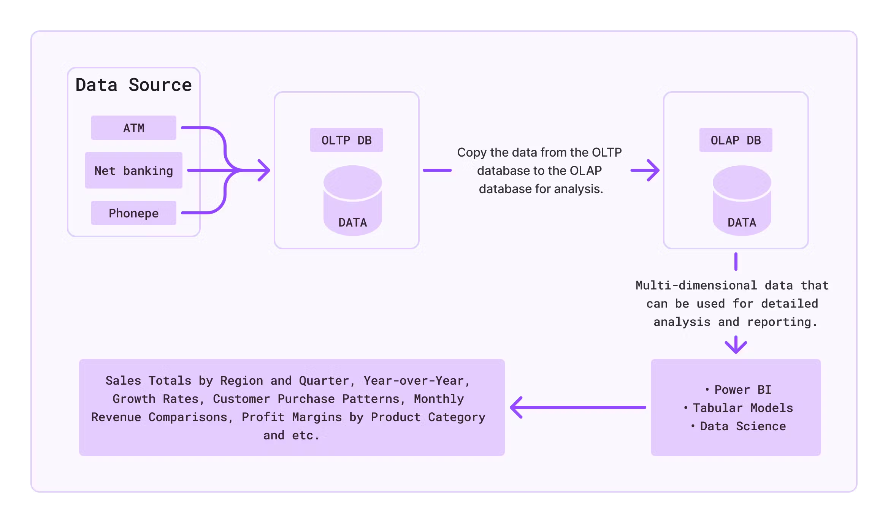
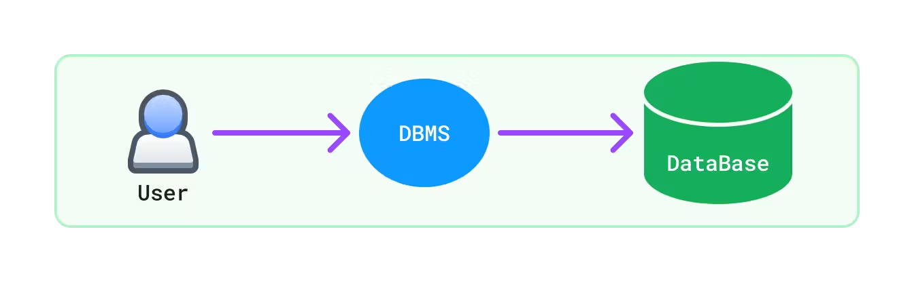
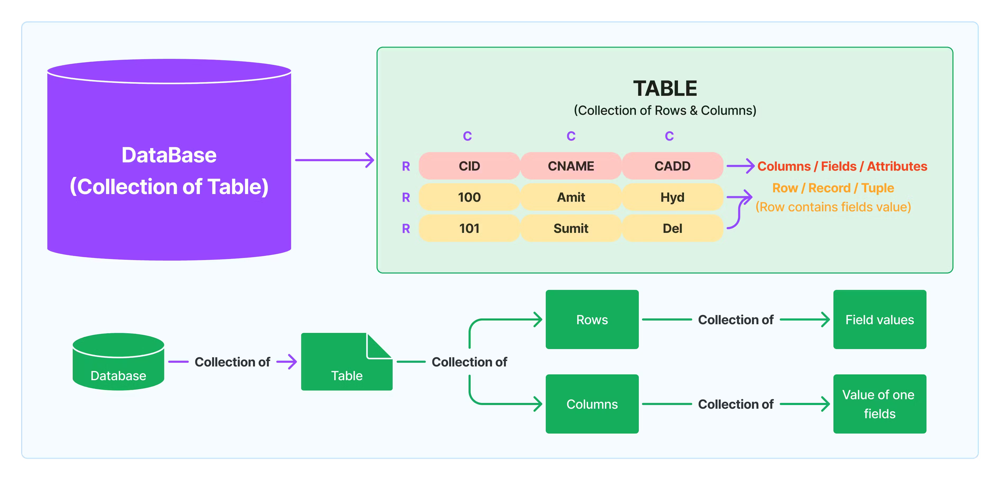
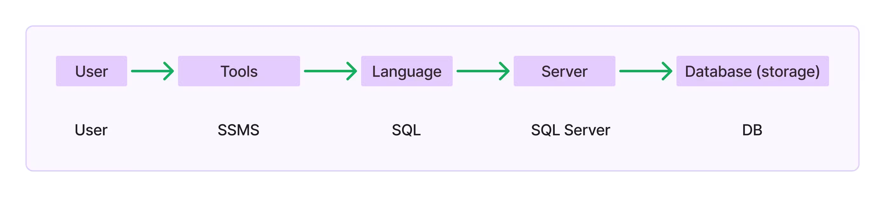
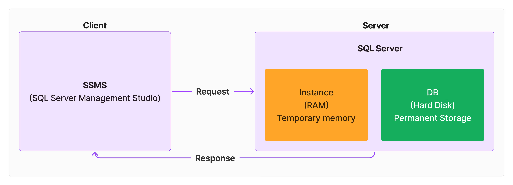
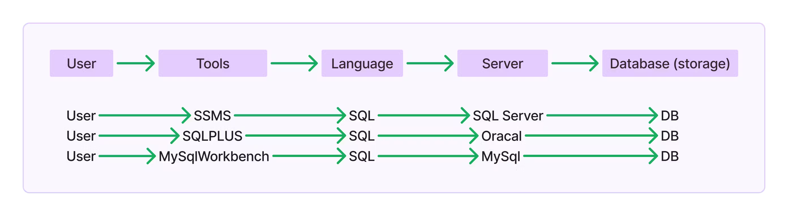
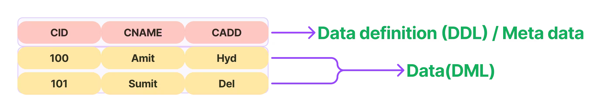
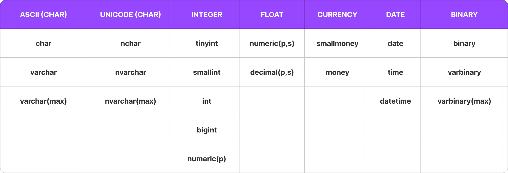

## SQL Server Question:

## 01: Basic

- <details>
    <summary>What is SQL Server?</summary>
    <hr/>
    <p>SQL Server is a database management system developed by Microsoft. It is used to store and retrieve data as requested by other software applications, either on the same computer or across a network.</p>
    <hr/>
  </details>
- <details>
    <summary>What is Database (DB)</summary>
    <hr/>
    <p>A database is a collection of related data. It can store information on different topics, like a university database that includes data on students, courses, and faculty, or a bank database containing data on customers, accounts, loans, and employees.</p>
    <hr/>
  </details>

#### Types of Databases

- <details>
    <summary>What are the two main types of databases?</summary>
    <hr/>
    <p>The two main types of databases are:</p>
    <ol>
    <li><b>OLTP (Online Transaction Processing) Databases - </b>These databases handle day-to-day transactional data and support operations like Create, Read, Update, and Delete (CRUD).</li>
    <li><b>OLAP (Online Analytical Processing) Databases - </b>These databases are used for analyzing large datasets to gain insights and make strategic decisions through complex queries and aggregations.</li>
    </ol>
    <hr/>
  </details>
- <details>
    <summary> What is the key difference between OLTP and OLAP databases?</summary>
    <hr/>
    <ul>
    <li><b>OLTP Databases: </b>Handle operational tasks, managing daily transactions with fast CRUD operations and high data integrity.</li>
    <li><b>OLAP Databases: </b>Support analytical tasks by processing and analyzing large volumes of historical data with complex queries for decision-making.</li>
    </ul>
    <hr/>
  </details>
- <details>
    <summary>What are the basic day-to-day operations on a database?</summary>
    <hr/>
    <p>The basic operations are CRUD:</p>
    <ul>
    <li><b>C - Create: </b>Adding new data to the database.</li>
    <li><b>R - Read: </b>Retrieving existing data from the database.</li>
    <li><b>U - Update: </b>Modifying existing data in the database.</li>
    <li><b>D - Delete: </b>Removing data from the database.</li>
    </ul>
    <hr/>
  </details>
- <details>
    <summary>How do organizations use OLTP and OLAP databases?</summary>
    <hr/>
    <ul>
    <li><b>OLTP Systems: </b>Used for managing daily business operations by storing and processing day-to-day transactions.</li>
    <li><b>OLAP Systems: </b>Used to analyze business data to support decision-making and strategic planning.</li>
    </ul>
    <hr/>
  </details>

#### Difference between OLTP and OLAP Databases

- <details>
    <summary>Diagram?</summary>
    <hr/>

  

    <hr/>
  </details>

- <details>
    <summary>What is the main purpose of OLTP and OLAP databases?</summary>
    <hr/>
    <ul>
    <li><b>OLTP (Online Transaction Processing): </b>Manages day-to-day transactions.</li>
    <li><b>OLAP (Online Analytical Processing): </b>Supports complex data analysis.</li>
    </ul>
    <hr/>
  </details>
- <details>
    <summary>How do OLTP and OLAP databases differ in their data operations?</summary>
    <hr/>
    <ul>
    <li><b>OLTP: </b>Performs CRUD operations (Create, Read, Update, Delete).</li>
    <li><b>OLAP: </b>Focuses on read-heavy operations with complex queries.</li>
    </ul>
    <hr/>
  </details>
- <details>
    <summary>What type of data volume do OLTP and OLAP databases handle?</summary>
    <hr/>
    <ul>
    <li><b>OLTP</b>Handles a large volume of small transactions.</li>
    <li><b>OLAP</b>Handles a large volume of historical data.</li>
    </ul>
    <hr/>
  </details>
- <details>
    <summary>What is the difference in data structure between OLTP and OLAP databases?</summary>
    <hr/>
    <ul>
    <li><b>OLTP: </b>Uses a highly normalized data structure to reduce redundancy.</li>
    <li><b>OLAP: </b>Uses a denormalized structure with multi-dimensional schemas for faster analysis.</li>
    </ul>
    <hr/>
  </details>
- <details>
    <summary>What types of queries are used in OLTP and OLAP databases?</summary>
    <hr/>
    <ul>
    <li><b>OLTP: </b>Executes simple, short queries.</li>
    <li><b>OLAP: </b>Executes complex queries for data analysis.</li>
    </ul>
    <hr/>
  </details>
- <details>
    <summary>How is performance optimized in OLTP and OLAP databases?</summary>
    <hr/>
    <ul>
    <li><b>OLTP: </b>Optimized for transaction speed.</li>
    <li><b>OLAP: </b>Optimized for query performance.</li>
    </ul>
    <hr/>
  </details>
- <details>
    <summary>Can you give examples of OLTP and OLAP databases?</summary>
    <hr/>
    <ul>
    <li><b>OLTP: </b>Used in banking systems, order entry systems.</li>
    <li><b>OLAP: </b>Used in data warehouses, business intelligence tools.</li>
    </ul>
    <hr/>
  </details>
- <details>
    <summary>Who are the typical users of OLTP and OLAP databases?</summary>
    <hr/>
    <ul>
    <li><b>OLTP: </b>Clerks, front-line workers.</li>
    <li><b>OLAP: </b>Analysts, managers, executives.</li>
    </ul>
    <hr/>
  </details>
- <details>
    <summary>What is the nature of transactions in OLTP and OLAP databases?</summary>
    <hr/>
    <ul>
    <li><b>OLTP: </b>Transactions are short and frequent.</li>
    <li><b>OLAP: </b>Transactions are long and less frequent.</li>
    </ul>
    <hr/>
  </details>
- <details>
    <summary>How critical is data integrity in OLTP and OLAP databases?</summary>
    <hr/>
    <ul>
    <li><b>OLTP: </b>Data integrity is critical.</li>
    <li><b>OLAP: </b>Data integrity is less critical compared to OLTP.</li>
    </ul>
    <hr/>
  </details>
- <details>
    <summary>What is the typical response time for OLTP and OLAP databases?</summary>
    <hr/>
    <ul>
    <li><b>OLTP: </b>Response time ranges from milliseconds to seconds.</li>
    <li><b>OLAP: </b>Response time ranges from seconds to minutes.</li>
    </ul>
    <hr/>
  </details>

#### Database Management Systems (DBMS)

- <details>
    <summary>What is a Database Management System (DBMS)?</summary>
    <hr/>
    <p>A DBMS is software used to create, manage, and manipulate databases. It provides an interface between the user and the database, allowing users to perform operations like Create, Read, Update, and Delete (CRUD).</p>
    <hr/>
  </details>
- <details>
    <summary>Digram?</summary>
    <hr/>
    
    

    <hr/>
  </details>

- <details>
    <summary>What are the main types of DBMS?</summary>
    <hr/>
    <ol>
    <li><b>HDBMS (Hierarchical DBMS)</b>: Organizes data in a tree-like, hierarchical structure.</li>
    <li><b>NDBMS (Network DBMS)</b>: Uses a flexible, graph-like structure to organize data.</li>
    <li><b>RDBMS (Relational DBMS)</b>: Uses tables to store and manage data, supports complex queries.</li>
    <li><b>ORDBMS (Object Relational DBMS)</b>: Combines RDBMS with object-oriented features.</li>
    </ol>
    <hr/>
  </details>
- <details>
    <summary>What is RDBMS (Relational Database Management System)?</summary>
    <hr/>
    <p>An RDBMS is a type of DBMS that uses tables (rows and columns) to store and manage data. It supports data integrity, data sharing, and transactions (ACID properties).</p>
    <hr/>
  </details>
- <details>
    <summary>Give some important rules of 12 Codd's rules of an RDBMS</summary>
    <hr/>
    <ul>
    <li><b>Information Rule</b>: All data must be stored in tables.</li>
    <li><b>Guaranteed Access Rule</b>: Each piece of data must be easily accessible.</li>
    <li><b>Systematic Treatment of Null Values</b>: Null values must be treated consistently.</li>
    <li><b>High-Level Insert, Update, and Delete</b>: Must support set-based operations.</li>
    etc
    </ul>
    <hr/>
  </details>
- <details>
    <summary>Diagram?</summary>
    <hr/>

  

    <hr/>
  </details>

- <details>
    <summary>What are the key features of an RDBMS?</summary>
    <hr/>
    <ul>
    <li>Easy to access and manipulate data.</li>
    <li>Reduces data redundancy.</li>
    <li>Ensures data security and integrity.</li>
    <li>Supports data sharing and transactions (ACID properties).</li>
    </ul>
    <hr/>
  </details>
- <details>
    <summary>What are the ACID properties in RDBMS?</summary>
    <hr/>
    <ol>
    <li><b>Atomicity</b>: Ensures all operations in a transaction either complete successfully or none do.</li>
    <li><b>Consistency</b>: Guarantees that transactions move the database from one valid state to another.</li>
    <li><b>Isolation</b>:Ensures that transactions do not affect each other.</li>
    <li><b>Durability</b>: Ensures that committed transactions are permanently saved, even if the system fails.</li>
    </ol>
    <hr/>
  </details>
- <details>
    <summary>What are some examples of RDBMS software?</summary>
    <hr/>
    <ul>
    <li>Oracle (Vendor: Oracle Corporation)</li>
    <li>MySQL (Vendor: Oracle Corporation)</li>
    <li>SQL Server (Vendor: Microsoft)</li>
    <li>PostgreSQL (Vendor: PostgreSQL Global Development Group)</li>
    <li>RDS (Relational Database Service) (Vendor: Amazon Web Services)</li>
    </ul>
    <hr/>
  </details>
- <details>
    <summary>What are NoSQL databases?</summary>
    <hr/>
    <p>NoSQL databases store data in an unstructured format. Examples include MongoDB and Cassandra.</p>
    <hr/>
  </details>
- <details>
    <summary> What is ORDBMS (Object Relational Database Management System)?</summary>
    <hr/>
    <p>ORDBMS combines RDBMS with object-oriented programming (OOP) features, improving RDBMS by adding reusability, security, and user-defined types (UDTs).</p>
    <hr/>
  </details>
- <details>
    <summary>What is SQL Server?</summary>
    <hr/>
    <p>SQL Server is an RDBMS software from Microsoft that also supports ORDBMS features. It is used to create and manage databases.</p>
    <hr/>
  </details>
- <details>
    <summary>What are some examples of databases?</summary>
    <hr/>
    <p>SQL Server, MongoDB, Oracle, MySQL are examples of databases.</p>
    <hr/>
  </details>

#### Database Development Life Cycle and SQL Server

- <details>
    <summary>What is the Database Development Life Cycle?</summary>
    <hr/>
    The Database Development Life Cycle involves several stages for creating and maintaining a database:
    <ol>
    <li><b>Analyze</b>: Requirements gathering and feasibility study.</li>
    <li><b>Design</b>: Conceptual design using data modeling techniques like the ER Model(Entity-Relationship Model) and Normalization.</li>
    <li><b>Develop</b>: Creation of the database by developers and DBAs(Database Admin).</li>
    <li><b>Test</b>: Testing the database by the QA(Quality Assurance) team.</li>
    <li><b>Deploy/Implement</b>: Moving the database from the development server to the production server.</li>
    <li><b>Maintenance</b>: Ongoing support and optimization of the database system.</li>
    </ol>
    <hr/>
  </details>
- <details>
    <summary>What are the roles of a Developer and a DBA in the database development process?</summary>
    <hr/>
    <p><b>Developer Role: </b>Creating tables, views, synonyms, sequences, indexes, procedures, functions, triggers, and queries.</p>
    <p><b>DBA (Database Administrator) Role: </b>Installation of SQL Server, creating databases, managing logins, database backup and restore, export and import of databases, database upgrades, migration, and performance testing.</p>
    <hr/>
  </details>
- <details>
    <summary>DBA's or Developer, who can Access, Read and update?</summary>
    <hr/>
    
    

    <hr/>
  </details>

- <details>
    <summary>What are the different versions of SQL Server?</summary>
    <hr/>
    <ul>
    <li>SQL Server 1.0 (1989)</li>
    <li>SQL Server 2017 (2017)</li>
    <li>SQL Server 2019 (2019)</li>
    <li>SQL Server 2022 (2022)</li>
    </ul>
    <hr/>
  </details>
- <details>
    <summary>What is the Client-Server Architecture in SQL Server?</summary>
    <hr/>
    <ul>
    <li><b>Server</b>: A system where SQL Server is installed, managing databases (DB) and instances.
    <ul>
    <li><b>Database (DB)</b>: Permanent storage created on the hard disk.</li>
    <li><b>Instance</b>: Temporary storage in RAM for processing and caching data.</li>
    </ul>
    </li>
    <li><b>Client</b>: A system used to connect to the server, submit requests, and receive responses. Uses tools like SSMS (SQL Server Management Studio).</li>
    </ul>

  

    <hr/>
  </details>

- <details>
    <summary>Diagram?</summary>
    <hr/>

  

    <hr/>
  </details>

- <details>
    <summary>What is SQL (Structured Query Language)?</summary>
    <hr/>
    SQL is a language used to communicate with SQL Server and other RDBMS. It allows users to send commands called queries to perform various operations on the database.
    <hr/>

  

  </details>

- <details>
    <summary>What are the sub-languages of SQL and their purposes?</summary>
    <hr/>
    <ol>
    <li><b>DDL (Data Definition Language)</b>: Manages database structures (e.g., CREATE, ALTER, DROP, TRUNCATE).</li>
    <li><b>DML (Data Manipulation Language)</b>: Manipulates data within the database (e.g., INSERT, UPDATE, DELETE, MERGE).</li>
    <li><b>DQL (Data Query Language)</b>: Retrieves data from the database (e.g., SELECT).</li>
    <li><b>TCL (Transaction Control Language)</b>: Manages transactions (e.g., COMMIT, ROLLBACK, SAVEPOINT).</li>
    <li><b>DCL (Data Control Language)</b>: Controls access to data (e.g., GRANT, REVOKE).</li>
    </ol>
    <hr/>
  </details>
- <details>
    <summary>What are the components of SQL Server?</summary>
    <hr/>
    <ol>
    <li><b>SQL Server</b>: Manages databases and instances.</li>
    <li><b>Database (DB)</b>: Permanent storage created on the hard disk.</li>
    <li><b>Instance</b>: Runs in RAM, acts as temporary storage for processing and caching data.</li>
    </ol>
    <hr/>
  </details>
- <details>
    <summary>What is SQL Server Management Studio (SSMS)?</summary>
    <hr/>
    SSMS (SQL Server Management Studio) is a client tool used to connect to SQL Server, allowing users to manage databases, run queries, and perform administrative tasks.
    <hr/>
  </details>
- <details>
    <summary>What is the origin and commonality of SQL?</summary>
    <hr/>
    SQL was first created by IBM and originally named "SEQUEL" (Structured English Query Language), later renamed to SQL (Structured Query Language). It is the standard language used by all relational database management systems (RDBMS).
    <hr/>
  </details>
- <details>
    <summary>what is data and data defination?</summary>
    <hr/>
    Data refers to meaningful information stored in a database, while data definition involves specifying the structure and organization of this data.
    <hr/>

  

  </details>

#### SQL Server Database Creation, Data Types, and Table Management

- <details>
    <summary>How can you create a new database in SQL Server using SQL Server Management Studio (SSMS)?</summary>
    <hr/>
    <ol>
    <li><b>Method 1</b>: In the Object Explorer, right-click on "Databases," select "New Database," enter the desired name, select the path, and press OK.</li>
    <li><b>Method 2</b>: In the Object Explorer, navigate to "Databases" → "System Databases," right-click on "master," and select "New Database."</li>
    <li><b>Method 3</b>: In the top of navigation , click "New-Query" or press "ctrl + n" → in dropdown select "master" → write query for Creating database and execute it.</li>
    </ol>
    <hr/>
  </details>
- <details>
    <summary>How can you create a new database using a SQL query?</summary>
    <hr/>
    
    ```sql
    --Syntax: 
    CREATE DATABASE <database_name>;

  --Example:
  CREATE DATABASE <Company>;

  ```

  <hr/>
  </details>
  ```

- <details>
    <summary>What are the database file?</summary>
    <hr/>
    <p>When you create a database, two files are automatically created: a DATA file (MDF) and a LOG file (LDF).</p>
    <hr/>
  </details>
- <details>
    <summary>Datatype Diagram?</summary>
    <hr/>
    
    

    <hr/>
  </details>

- <details>
    <summary>What is the difference between CHAR, VARCHAR, and VARCHAR(MAX)?</summary>
    <hr/>
    <ol>
    <li><b>CHAR(size)</b>: 
    <ul>
    <li><b>Length</b>: Fixed-length.</li>
    <li><b>Maximum Length</b>: Up to 8000 characters.</li>
    <li><b>Storage</b>: Fixed; always uses the specified size. If the data is shorter, the remaining space is padded with spaces.</li>
    <li><b>Usage</b>: Best for fixed-length data (e.g., gender: CHAR(1) storing 'M' or 'F').</li>
    <li><b>Performance</b>: Efficient for storing fixed-length data.   </li>
    <li><b>Memory Waste</b>: Yes, if the actual data length is less than the specified size.</li>
    <li><b>Syntax</b>: CHAR(n) where n is the size.</li>
    <li><b>Example</b>: panno CHAR(10) – Fixed length of 10 characters, space-padded if less.</li>
    </ul>
    </li>
    <li><b>VARCHAR(size)</b>: 
    <ul>
    <li><b>Length</b>: Variable-length.</li>
    <li><b>Maximum Length</b>: Up to 8000 characters.</li>
    <li><b>Storage</b>: Variable; uses only the required space.</li>
    <li><b>Usage</b>: Suitable for variable-length fields (e.g., names or addresses).</li>
    <li><b>Performance</b>: Efficient for variable-length data.</li>
    <li><b>Memory Waste</b>: No</li>
    <li><b>Syntax</b>: VARCHAR(n) where n is the maximum length.</li>
    <li><b>Example</b>: emailid VARCHAR(20) – Variable length up to 20 characters.</li>
    </ul>
    </li>
    <li><b>VARCHAR(MAX)</b>:
    <ul>
    <li><b>Length</b>: Variable-length.</li>
    <li><b>Maximum Length</b>: approx. 2 GB.</li>
    <li><b>Storage</b>: Variable; designed for storing very large data.</li>
    <li><b>Usage</b>: Ideal for storing very large text data.</li>
    <li><b>Performance</b>: Optimized for large data; less efficient for small texts.</li>
    <li><b>Memory Waste</b>: No.</li>
    <li><b>Syntax</b>: VARCHAR(MAX).</li>
    <li><b>Example</b>: about VARCHAR(MAX) – Variable length, suitable for large text data up to 2 GB.</li>
    </ul> 
    </li>
    </ol>
    <hr/>
  </details>
- <details>
    <summary>What types of characters can CHAR, VARCHAR, and VARCHAR(MAX) store?</summary>
    <hr/>
    <p>They can store standard ASCII characters (such as letters a-z, A-Z, numbers 0-9, and basic special characters) and Extended ASCII characters (like accented letters and more special symbols).</p>
    <hr/>
  </details>
- <details>
    <summary>Can CHAR, VARCHAR, and VARCHAR(MAX) store characters from all languages?</summary>
    <hr/>
    <p>No, they cannot store all characters from different languages (like Chinese or Arabic) because they do not fully support Unicode. To store characters from many languages, you should use NCHAR, NVARCHAR, or NVARCHAR(MAX).</p>
    <hr/>
  </details>
- <details>
    <summary>What is the difference between NCHAR(size), NVARCHAR(size), and NVARCHAR(MAX) in SQL Server?</summary>
    <hr/>
    <ol>
    <li><b>NCHAR(size)</b>:
    <ul>
    <li><b>Length</b>: Fixed-length Unicode string.</li>
    <li><b>Maximum Length</b>: Up to 4000 characters.</li>
    <li><b>Storage</b>: 2 bytes per character (fixed).</li>
    <li><b>Usage</b>: Best for fixed-length Unicode data (e.g., codes or identifiers in different languages).</li>
    <li><b>Performance</b>: Efficient for storing fixed-length Unicode data.</li>
    <li><b>Syntax</b>: NCHAR(n) where n is the size</li>
    </ul> 
    </li>
    <li><b>NVARCHAR(size)</b>:
    <ul>
    <li><b>Length</b>: Variable-length Unicode string.</li>
    <li><b>Maximum Length</b>: Up to 4000 characters.</li>
    <li><b>Storage</b>: 2 bytes per character (variable).</li>
    <li><b>Usage</b>: Suitable for variable-length Unicode data (e.g., names, addresses in different languages).</li>
    <li><b>Performance</b>: Efficient for smaller variable-length Unicode data.</li>
    <li><b>Syntax</b>: NVARCHAR(n) where n is the maximum length</li>
    </ul> 
    </li>
    <li><b>NVARCHAR(MAX)</b>:
    <ul>
    <li><b>Length</b>: Variable-length large Unicode string.</li>
    <li><b>Maximum Length</b>: approx. 2 GB</li>
    <li><b>Storage</b>: 2 bytes per character (variable).</li>
    <li><b>Usage</b>: Ideal for storing very large Unicode text data.</li>
    <li><b>Performance</b>: Suitable for large text storage; less efficient for small texts.</li>
    <li><b>Syntax</b>: NVARCHAR(MAX)</li>
    </ul> 
    </li>
    </ol>
    <hr/>
  </details>
- <details>
      <summary>What are the differences between TINYINT, SMALLINT, INT, and BIGINT in SQL Server?</summary>
      <hr/>
      <ol>
      <li><b>TINYINT</b>:
      <ul>
      <li><b>Use Case</b>: Small numbers, counters, flags(Binary indicators representing true/false or present/absent states.).</li>
      <li><b>Storage Size</b>: 1 byte.</li>
      <li><b>Range</b>: 0 to 255.</li>
      <li><b>Example</b>: AgeGroup TINYINT – Represents age groups with values like 0 (children), 1 (teenagers), 2 (adults), 3 (seniors).</li>
      </ul>  
      </li>
      <li><b>SMALLINT</b>:
      <ul>
      <li><b>Use Case</b>: Small-range integers, such as age or scores.</li>
      <li><b>Storage Size</b>: 2 bytes.</li>
      <li><b>Range</b>: −2<sup>15</sup> to 2 <sup>15</sup>.</li>
      <li><b>Example</b>: QuantityOnHand SMALLINT – Represents quantities ranging from 0 to 32,767.</li>
      </ul>  
      </li>
      <li><b>INT</b>:
      <ul>
      <li><b>Use Case</b>: General-purpose integers, like primary keys.</li>
      <li><b>Storage Size</b>: 4 bytes.</li>
      <li><b>Range</b>: −2<sup>31</sup> to 2<sup>31</sup>
     </li>
      <li><b>Example</b>: EmployeeID INT – Suitable for IDs.</li>
      </ul> 
      </li>
      <li><b>BIGINT</b>:
      <ul>
      <li><b>Use Case</b>: Very large integers, such as large counters or large monetary values.</li>
      <li><b>Storage Size</b>: 8 bytes</li>
      <li><b>Range</b>: −2<sup>63</sup> to 2<sup>63</sup>.</li>
      <li><b>Example</b>: TransactionID BIGINT – Large unique identifier for each transaction.</li>
      </ul>  
      </li>
      <li><b>NUMERIC(p)</b>:
      <ul>
      <li><b>Use Case</b>: Exact numeric data, such as monetary values or scientific calculations.</li>
      <li><b>Storage Size</b>: 5 to 17 bytes, varies based on precision (p).</li>
      <li><b>Range</b>: Varies based on precision (p).</li>
      <li><b>Example</b>: empid NUMERIC(4) – Allows up to 4 digits (e.g., 10, 100, 1000 are valid, but 10,000 is not).</li>
      </ul> 
      </li>
      </ol>
      <hr/>
    </details>
- <details>
    <summary>What is the FLOAT data type in SQL Server?</summary>
    <hr/>
    <p>FLOAT is a data type used to store approximate numeric values with floating decimal points. It allows for the storage of numbers with a wide range of values, including very large or very small numbers. The precision of the FLOAT type depends on the number of bits used to store it.</p>
    <hr/>
  </details>
- <details>
    <summary>What is the NUMERIC(p) or DECIMAL(p) data type in SQL Server?</summary>
    <hr/>
    <p>NUMERIC(p) or DECIMAL(p) is a data type used to store exact numeric values without decimals (integers) up to 38 digits. The precision p defines the maximum total number of digits that can be stored.</p>

  ```sql
  empid NUMERIC(4)   -- 4 is the number of digits
  -- Valid values:
  -- 10 - ok
  -- 100 - ok
  -- 1000 - ok
  -- 10000 - not ok (exceeds 4 digits)

  phone NUMERIC(10)
  aadharno NUMERIC(12)

  ```

    <hr/>
  </details>

- <details>
    <summary>What is the difference between NUMERIC(p, s) and DECIMAL(p, s)?</summary>
    <hr/>
    <p>There is no difference between NUMERIC(p, s) and DECIMAL(p, s) in SQL Server. Both are used to store exact numeric values with decimals.</p>
    <p>They are interchangeable and part of the SQL standard.</p>
    <ul>
    <li>p (precision): Total number of digits allowed.</li>
    <li>s (scale): Number of digits allowed after the decimal point.</li>
    </ul>

  ```sql
  salary NUMERIC(7,2); -- Total number of digits is 7, with 2 digits after the decimal point.
  salary DECIMAL(7,2);

  -- Valid values:
  -- 5000 - ok
  -- 5000.55 - ok
  -- 50000.55 - ok
  -- 500000.55 - not ok (exceeds 7 digits in total)
  -- 5000.5689 - ok because it's rounded to 5000.57

  ```

    <hr/>
  </details>

- <details>
    <summary>What are the key features of NUMERIC(p, s) or DECIMAL(p, s)?</summary>
    <hr/>
    <ul>
    <li><b>Definition</b>: Fixed-point number</li>
    <li><b>Precision (p)</b>: Total number of digits</li>
    <li><b>Scale (s)</b>: Number of digits to the right of the decimal point</li>
    <li><b>Functionality</b>: Identical to DECIMAL(p, s)</li>
    <li><b>Storage and Performance</b>: Identical to DECIMAL(p, s)</li>
    <li><b>Usage</b>: Interchangeable with DECIMAL(p, s)</li>
    <li><b>Common Use Case</b>: Financial and quantitative data</li>
    <li><b>SQL Standard</b>: Part of SQL standard</li>
    <li><b>Example Usage</b>: NUMERIC(10, 2)</li>
    </ul> 
    <hr/>
  </details>
- <details>
    <summary>What are SMALLMONEY and MONEY data types in SQL Server?</summary>
    <hr/>
    <p>SMALLMONEY and MONEY are data types used for fields related to monetary values. Both types have a fixed precision of 4 decimal places, but they differ in storage size and range.</p>
    <hr/>
  </details>
- <details> 
    <summary>What is the difference between SMALLMONEY and MONEY in SQL Server?</summary> 
    <hr/> 
    <table> <tr> <th>Aspect</th> <th>SMALLMONEY</th> <th>MONEY</th>     </tr> <tr> <td><strong>Storage Size</strong></td> <td>4 bytes</td>     <td>8 bytes</td> </tr> <tr> <td><strong>Range</strong></td> <td>−2.15     x 10<sup>5</sup> to 2.15 x 10<sup>5</sup></td> <td>−9.22 x 10<sup>15</sup> to 9.22 x 10<sup>15</sup></td> </tr> <tr> <td><strong>Precision</strong></td> <td>Fixed, 4 decimal places</td> <td>Fixed, 4 decimal     places</td> </tr> <tr> <td><strong>Usage</strong></td> <td>Suitable     for small monetary values</td> <td>Suitable for large monetary values</td> </tr> <tr> <td><strong>Performance</strong></td> <td>More     efficient due to smaller storage size</td> <td>Less efficient compared     to SMALLMONEY due to larger storage size</td> </tr> <tr>     <td><strong>Example</strong></td> <td>SmallAmount SMALLMONEY</td>     <td>LargeAmount MONEY</td> </tr> <tr> <td><strong>Use Case</strong></td> <td>Storing prices of everyday items (e.g., groceries)</td>     <td>Storing large financial values (e.g., bank balances)</td> </tr> </table> 
    <hr/> 
    Example:

  ```sql
  salary SMALLMONEY   -- Add when creating table
  balance MONEY       -- Add when creating table
  ```

  </details>

- <details>
    <summary>What are the DATE, TIME, and DATETIME data types in SQL Server?</summary>
    <hr/>
    <p>These data types are used to store date and time values in SQL Server:</p>
    <ul>
    <li><b>DATE</b>: Stores only date values.</li>
    <li><b>TIME</b>: Stores only time values.</li>
    <li><b>DATETIME</b>: Stores both date and time values.</li>
    </ul>
    <hr/>
  </details>
- <details>
    <summary>What are the default formats for DATE and TIME in SQL Server?</summary>
    <hr/>
    <p>Default date format: yyyy-mm-dd</p>
    <p>Default time format: hh:mi:ss</p>

  ```sql
  dob DATE  -- Add when creating table, e.g., '2003-03-10' is the format.
  login TIME -- Add when creating table, e.g., '09:30:00' is the format.
  signup DATETIME -- Add when creating table, e.g., '2023-09-13 10:00:00' is the format.
  ```

    <hr/>
  </details>

#### Command's:-

- <details>
    <summary>What is the SQL command to create the `Company` database?🌟</summary>
    <hr/>

  ```sql
  --Syntax:
  CREATE DATABASE <Database_Name>;

  --Example:
  CREATE DATABASE Company;
  ```

    <hr/>
  </details>

- <details>
    <summary>How do you create a table in SQL Server?🌟</summary>
    <hr/>
    <hr/>

  ```sql
  --Syntax:
  CREATE TABLE <Table_Name>(
    <Field_Name> <DataType_Size>,
    <Field_Name> <DataType_Size>,
    ...
  );
  --Example:
  CREATE TABLE emp (
      Gender CHAR(1),
      FullName VARCHAR(100),
      AboutUs VARCHAR(MAX),
      FirstName NCHAR(50),
      LastName NCHAR(50),
      ProductName NVARCHAR(100),
      AboutProduct NVARCHAR(MAX),
      AgeGroup TINYINT,
      QuantityOnHand SMALLINT,
      EmployeeID INT,
      TransactionID BIGINT,
      MonthlySalary NUMERIC(7, 2),
      Incentive SMALLMONEY,
      Package MONEY,
      JoiningDate DATE,
      OfficeComingTime TIME,
      DOB DATETIME
  );
  ```

    <hr/>
    <hr/>
  </details>

- <details>
    <summary>Create a propper employee table for Company?</summary>
    <hr/>

  ```sql
  Create Table Employee
  (
  	Id int,
  	FirstName Varchar(30),
  	LastName Varchar(30),
  	FullName NVARCHAR(100),
  	Address NVARCHAR(MAX),
  	DOB DATETIME,
  	Gender CHAR,
  	Salary NUMERIC(7,2),
  	Incentive SMALLMONEY,
  	JoinDate DATE,
  );
  ```

    <hr/>
  </details>

- <details>
    <summary>What are the rules for naming tables in SQL Server?</summary>
    <hr/>
    <ul>
    <li>The name must start with an alphabet.</li>
    <li>The name cannot contain spaces or special characters, but it can include _, #, and $.</li>
    <li>The name can be up to 128 characters long.</li>
    <li>A table can have up to 1024 columns.</li>
    <li>The number of rows is unlimited.</li>
    </ul> 
    <hr/>
  </details>
- <details>
    <summary>What is the SP_HELP command in SQL Server?🌟</summary>
    <hr/>
    SP_HELP is a system stored procedure that provides information about the structure of a specified table, including its columns, data types, and other details.

  ```sql
  --Syntax:-
  SP_HELP <tablename>
  --Example:-
  SP_HELP emp;
  ```

  Output:-
    <p>Column Name: The name of each column in the table.</p>
    <p>Data Type: The data type of each column (e.g., tinyint, varchar, smallmoney).</p>
    <p>Length: The maximum storage size for that column.</p>
    <p>Nullable: Indicates if the column can contain a NULL value (Yes or No).</p>
    <hr/>
  </details>

- <details>
    <summary>How do you insert data into a table in SQL Server?🌟</summary>
    <hr/>
    For single rows:

  ```sql
  INSERT INTO Employee VALUES (1, 'John', 'Doe', 'N John Doe', '123 Elm Street, Springfield', '1985-06-15', 'M', 5000.50, 200.00, '2010-03-01');
  ```

  For multiple rows with data function's:

  ```sql
  INSERT INTO Employee VALUES
  (2, 'Jane', 'Smith', 'N Jane Smith', 'N 456 Maple Avenue, Riverdale', DATEADD(YEAR, -33, GETDATE()), 'M', 4200.75, 150.00, DATEADD(YEAR, -8, GETDATE())),
  (3, 'Michael', 'Johnson', 'N Michael Johnson', 'N 789 Oak Lane, Brookfield', DATEADD(YEAR, -35, GETDATE()), 'F', 5500.00, 300.00, DATEADD(YEAR, -12, GETDATE())),
  (4, 'Emily', 'Clark', 'N Emily Clark', 'N 321 Pine Street, Lakeview', DATEADD(YEAR, -30, GETDATE()), 'F', 4700.25, 180.00, DATEADD(YEAR, -6, GETDATE()));
  ```

    <hr/>
  </details>

- <details>
    <summary>How to insert NULL values into the table?🌟</summary>
    <hr/>

  ```sql
  INSERT INTO Employee VALUES (5, 'Olivia', 'Brown', NULL, '202 Birch Street, Springfield', NULL, 'M', 54000.00, NULL, DATEADD(YEAR, -6, GETDATE()));
  -- OR
  INSERT INTO Employee(Id, FirstName, FullName, Address, Gender, Incentive, JoinDate) VALUES (6, 'Liam', 'Liam Jones', '303 Cedar Drive, Springfield', 'F', 220.00, '2020-11-30'); -- And other value shood automaticly be null

  ```

    <hr/>
  </details>

- <details>
    <summary>How to display all data?</summary>
    <hr/>

  ```sql
  SELECT * FROM Employee;
  ```

  - means all columns.
    <hr/>
  </details>

- <details>
    <summary>How to display specific columns (FullName, Address, and Salary)?</summary>
    <hr/>

  ```sql
  SELECT FullName, Address, Salary FROM Employee;
  ```

    <hr/>
  </details>

- <details>
      <summary>What are arithmetic operators in SQL Server?</summary>
      <hr/>
      (+. -, *, / , %)
      <hr/>
  </details>
- <details>
    <summary>What are relational operators in SQL Server?</summary>
    <hr/>
    (>, >=, <, <=, =, <> )
    <br/>
    Equal to (=): Checks if two values are equal.
    <br/>
    Not equal to (<>): Checks if two values are not equal
    <hr/>
  </details>
- <details>
    <summary>What are logical operators in SQL Server?</summary>
    <hr/>
    (AND, OR, NOT)
    <hr/>
  </details>
- <details>
    <summary>What are special operators in SQL Server?</summary>
    <hr/>
    Special operators are used for specific types of comparisons and operations.
    <ol>
    <li><b>BETWEEN</b>: Checks if a value is within a range. <br/><i>SELECT * FROM Products WHERE Price BETWEEN 10 AND 20;</i><br/><br/></li>
    <li><b>IN</b>: Checks if a value matches any value in a list. <br/><i>SELECT * FROM Employees WHERE Department IN ('HR', 'IT');</i><br/><br/></li>
    <li><b>LIKE</b>: Searches for a specified pattern in a column. <br/><i>SELECT * FROM Customers WHERE Name LIKE 'John%';</i><br/><br/></li>
    <li><b>IS</b>: Checks for NULL values. <br/><i>SELECT * FROM Orders WHERE DeliveryDate IS NULL;</i><br/><br/></li>
    <li><b>ANY</b>: Compares a value to any value in a subquery. <br/><i>SELECT * FROM Products WHERE Price > ANY (SELECT Price FROM Discounts);</i><br/><br/></li>
    <li><b>ALL</b>: Compares a value to all values in a subquery. <br/><i>SELECT * FROM Products WHERE Price > ALL (SELECT Price FROM Discounts);</i><br/><br/></li>
    <li><b>EXISTS</b>: Checks if a subquery returns any rows. <br/><i>SELECT * FROM Customers WHERE EXISTS (SELECT * FROM Orders WHERE Customers.CustomerID = Orders.CustomerID);</i><br/><br/></li>
    <li><b>PIVOT</b>: Transforms rows into columns for reporting purposes. <br/><i>SELECT * FROM (SELECT Year, Amount FROM Sales) AS SourceTable PIVOT (SUM(Amount) FOR Year IN ([2022], [2023])) AS PivotTable;</i><br/><br/></li>
    </ol>
    <hr/>
  </details>
- <details>
    <summary>What are set operators in SQL Server?</summary>
    <hr/>
    Set operators are used to combine results from multiple queries.
    <ol>
    <li><b>UNION</b>: Combines results from two queries, removing duplicates.<br/><i>SELECT City FROM Customers UNION SELECT City FROM Suppliers;</i><br/><br/></li>
    <li><b>UNION ALL</b>: Combines results from two queries, including duplicates.<br/><i>SELECT City FROM Customers UNION ALL SELECT City FROM Suppliers;</i><br/><br/></li>
    <li><b>INTERSECT</b>: Returns common rows from two queries.<br/><i>SELECT City FROM Customers INTERSECT SELECT City FROM Suppliers;</i><br/><br/></li>
    <li><b>EXCEPT</b>: Returns rows from the first query that are not in the second query.<br/><i>SELECT City FROM Customers EXCEPT SELECT City FROM Suppliers;</i><br/><br/></li>
    </ol>
    <hr/>
  </details>
- <details>
    <summary>What are the Clause in SQL?</summary>
      <hr/>
      In SQL, clauses are components of a SQL query that define specific conditions or actions to be performed. Here are some common SQL clauses:
      <ol>
      <li><b>SELECT Clause</b>: Specifies the columns to be retrieved from a table.<br/><i>SELECT column1, column2 FROM table_name;</i><br/><br/></li>
      <li><b>WHERE Clause</b>: Filters records based on specified conditions.<br/><i>SELECT column1, column2 FROM table_name WHERE condition;</i><br/><br/></li>
      <li><b>GROUP BY Clause</b>: Groups rows that have the same values into summary rows, often used with aggregate functions.<br/><i>SELECT column1, COUNT(*) FROM table_name GROUP BY column1;</i><br/><br/></li>
      <li><b>HAVING Clause</b>: Filters groups based on a specified condition, typically used with the GROUP BY clause.<br/><i>SELECT column1, COUNT(*) FROM table_name GROUP BY column1 HAVING COUNT(*) > 5;</i><br/><br/></li>
      <li><b>ORDER BY Clause</b>: Sorts the result set by one or more columns.<br/><i>SELECT column1, column2 FROM table_name ORDER BY column1 ASC, column2 DESC;</i><br/><br/></li>
      <li><b>JOIN Clause</b>: Combines rows from two or more tables based on a related column.<br/>
      <ul>
      <li><b>INNER JOIN</b>: Returns records with matching values in both tables<br/><i>SELECT column1, column2 FROM table1 INNER JOIN table2 ON table1.id = table2.id;</i><br/><br/></li>
      <li><b>LEFT JOIN (or LEFT OUTER JOIN)</b>: Returns all records from the left table and matched records from the right table.<br/><i>SELECT column1, column2 FROM table1 LEFT JOIN table2 ON table1.id = table2.id;</i><br/><br/></li>
      <li><b>RIGHT JOIN (or RIGHT OUTER JOIN)</b>: Returns all records from the right table and matched records from the left table.<br/><i>SELECT column1, column2 FROM table1 RIGHT JOIN table2 ON table1.id = table2.id;</i><br/><br/></li>
      <li><b>FULL JOIN (or FULL OUTER JOIN)</b>: Returns records when there is a match in one of the tables.<br/><i>SELECT column1, column2 FROM table1 FULL JOIN table2 ON table1.id = table2.id;</i><br/><br/></li>
      </ul>
      </li>
      <li><b>UNION Clause</b>: Combines the results of two or more SELECT statements, removing duplicates.<br/><i>SELECT column1 FROM table1 UNION SELECT column1 FROM table2; </i><br/><br/></li>
      <li><b>UNION ALL Clause</b>: : Combines the results of two or more SELECT statements, including duplicates.<br/><i>SELECT column1 FROM table1 UNION ALL SELECT column1 FROM table2; </i><br/><br/></li>
      <li><b>INTERSECT Clause</b>: Returns the common rows from two SELECT statements.<br/><i>SELECT column1 FROM table1 INTERSECT SELECT column1 FROM table2; </i><br/><br/></li>
      <li><b>EXCEPT Clause</b>: Returns rows from the first SELECT statement that are not in the second SELECT statement.<br/><i>SELECT column1 FROM table1 EXCEPT SELECT column1 FROM table2; </i><br/><br/></li>
      <li><b>AS Clause</b>: Renames a column or table for the duration of the query.<br/><i>SELECT column1 AS alias_name FROM table_name;</i><br/><br/></li>
      <li><b>DISTINCT Clause</b>: Removes duplicate values from the result set.<br/><i>SELECT DISTINCT column1 FROM table_name;</i><br/><br/></li>
      <li><b>LIMIT/OFFSET Clause (SQL Server uses TOP)</b>: Limits the number of rows returned by the query.<br/>
      <ul>
      <li><b>MySQL/PostgreSQL:</b>: <br/><i>SELECT column1 FROM table_name LIMIT 5 OFFSET 10;</i><br/><br/></li>
      <li><b>SQL Server:</b>: <br/><i>SELECT TOP 5 column1 FROM table_name;</i><br/><br/></li>
      </ul>
      </li>
      </ol>
    <hr/>
  </details>
- <details>
    <summary>What is the purpose of the WHERE clause in SQL Server?🌟</summary>
    <hr/>
    The WHERE clause is used to filter records in a SQL query based on specific conditions. It allows you to select rows from a table that meet certain criteria.

  ```sql
  SELECT columns
  FROM tabname
  WHERE <condition>;
  ```

    <hr/>
  </details>

- <details>
    <summary>How do you structure a condition in a WHERE clause?🌟</summary>
    <hr/>
    A condition in a WHERE clause typically follows this format:

  ```sql
  COLNAME OP VALUE
  ```

  - **COLNAME:** The column name to apply the condition to.
  - **OP:** A relational operator (e.g., >, >=, <, <=, =, <>).
  - **VALUE:** The value to compare against.

    <hr/>
  </details>

- <details>
    <summary>Can you provide examples of using the WHERE clause?</summary>
    <hr/>

  1. Display employee details where Id = 3:

     ```sql
     SELECT *
     FROM Employee
     WHERE Id = 3;
     ```

  2. Display employee details where FullName = 'N Emily Clark':

     ```sql
     SELECT *
     FROM Employee
     WHERE FullName = 'N Emily Clark';
     ```

  3. Display employee details earning more than 5000:

  ```sql
  SELECT *
  FROM Employee
  WHERE Salary > 5000;
  ```

  4. Display employees who joined after 2020:

  ```sql
  SELECT *
  FROM Employee
  WHERE JoinDate > '2020-01-01'
  ```

  5. Display employees who joined before 2020:

  ```sql
  SELECT *
  FROM Employee
  WHERE JoinDate < '2020-01-01'
  ```

    <hr/>
  </details>

- <details>
    <summary>What is a compound condition in a WHERE clause?🌟</summary>
    <hr/>
    A compound condition involves combining multiple conditions using the AND and OR operators.
    <hr/>
  </details>
- <details>
    <summary>Can you provide examples of compound conditions?🌟</summary>
    <hr/>
    1. Employees working as clerk or manager:

  ```sql
  SELECT *
  FROM Employee
  WHERE Working = 'clerk' OR Working = 'Manager';
  ```

  2. Employees whose id is 100 or 103:

  ```sql
  SELECT *
  FROM Employee
  WHERE Id = 100 OR Id = 103;
  ```

  3. Display male employees older than 30:

  ```sql
  SELECT *
  FROM Employee
  WHERE Gender = 'F' AND AGE > 30;
  ```

  4. Employees who joined in the year 2020:

  ```sql
  SELECT *
  FROM Employee
  WHERE JoinDate > '2020-01-01' AND JoinDate < '2020-12-31';
  ```

  5. Employees earning more than 5000 and less than 10000:

  ```sql
  SELECT *
  FROM Employee
  WHERE Salary > 5000 AND Salary < 10000;
  ```

    <hr/>
  </details>

- <details>
    <summary>What is the IN operator in SQL Server?🌟</summary>
    <hr/>
    The IN operator is used for list comparisons. It provides a way to compair multiple values in a WHERE clause, making the query simpler and easier to read.

  - Invalid syntax using = for multiple values:

  ```sql
  WHERE COLNAME = V1, V2, V3; -- INVALID👎
  ```

  - Valid syntax using IN for multiple values:

  ```sql
  WHERE COLNAME IN (V1, V2, V3, ...); --VALID👍
  ```

    <hr/>
  </details>

- <details>
    <summary>Could you provide the Example of IN operator with Where close?🌟</summary>
    <hr/>
    1. Employees whose id is 100, 103, or 105:

  ```sql
  SELECT *
  FROM Employee
  WHERE Id IN (100, 103, 105);
  ```

  2. Employees working as a clerk, manager, or analyst:

  ```sql
  SELECT *
  FROM Employee
  WHERE Working IN ('clerk', 'manager' , 'analyst');
  ```

  3. Employees not working as a clerk or manager:

  ```sql
  SELECT *
  FROM Employee
  WHERE Working NOT IN ('clerk', 'manager');
  ```

    <hr/>
  </details>

- <details>
    <summary>What is the BETWEEN operator in SQL?🌟</summary>
    <hr/>
    The BETWEEN operator is used to filter the result set within a range. It selects values within a specified range.
    
    **Note:** Use the BETWEEN operator with the lower value first and the upper value second to ensure correct results.

  Syntax:

  ```sql
  WHERE COLNAME BETWEEN V1 AND V2;
  ```

    <hr/>
  </details>

- <details>
    <summary>Could you provide the example of bitween operators with wgere cloase?🌟</summary>
    <hr/>
    1. Employees earning between 5000 and 10000:

  ```sql
  SELECT *
  FROM EMP
  WHERE SAL BETWEEN 5000 AND 10000;
  ```

    <hr/>
  </details>

- <details>
    <summary>What happens when you use BETWEEN with the range in reverse?

  ```sql
  SELECT *
  FROM EMP
  WHERE SAL BETWEEN 10000 AND 5000;
  ```

  **Options:**<br/>
  **A:** ERROR<br/>
  **B:** RETURNS ROWS<br/>
  **C:** RETURNS NO ROWS<br/>
  **D:** NONE
  🌟</summary>
    <hr/>
    The correct answer is C: RETURNS NO ROWS because BETWEEN 10000 AND 5000 is logically equivalent to (SAL >= 10000 AND SAL <= 5000), which does not match any rows.

  **Note:** Use the BETWEEN operator with the lower value first and the upper value second to ensure correct results.
    <hr/>
  </details>

- <details>
    <summary>What are some practical examples of using these operators together?🌟</summary>
    <hr/>
    1. Employees working as a clerk or manager, earning between 5000 and 10000, joined in 2023, and gender must be male:

  ```sql
  SELECT *
  FROM Employee
  WHERE Working IN ('clerk', 'manager')
        AND Salary BETWEEN 5000 AND 10000
        AND JoinDate BETWEEN '2023-01-01' AND '2023-12-31'
        AND Gender = 'M';
  ```

  1. List of Samsung and Realme mobile phones priced between 10000 and 20000:

  ```sql
  SELECT *
  FROM PRODUCTS
  WHERE BRAND IN ('SAMSUNG', 'REALME')
    AND CATEGORY = 'MOBILES'
    AND PRICE BETWEEN 10000 AND 20000;
  ```

    <hr/>
  </details>

- <details>
    <summary>What is the LIKE operator in SQL?🌟</summary>
    <hr/>
    The LIKE operator is used for pattern matching in SQL. It allows you to search for a specified pattern in a column.

  **Wildcard Characters:**

  - **%** : Represents zero or more characters.
  - **\_** : Represents a single character.

    <hr/>
  </details>

- <details>
    <summary>Can you provide examples of using the LIKE operator?🌟</summary>
    <hr/>
    1. Employees whose name starts with 's':

  ```sql
  SELECT *
  FROM Employee
  WHERE FullName LIKE 's%';
  ```

  2. Employees whose names end with 'd':

  ```sql
  SELECT *
  FROM Employee
  WHERE FullName LIKE '%d';
  ```

  3. Employees whose name contains 'a':

  ```sql
  SELECT *
  FROM Employee
  WHERE FullName LIKE '%a%';
  ```

  4. Employees where 'a' is the 2nd character in their name:

  ```sql
  SELECT *
  FROM Employee
  WHERE FullName LIKE '_a%';
  ```

  5. 'a' is the 3rd character from the last:

  ```sql
  SELECT *
  FROM Employee
  WHERE FullName LIKE '%s__';
  ```

  6. Names containing exactly 4 characters:

  ```sql
  SELECT *
  FROM Employee
  WHERE FullName LIKE '____';
  ```

  7. Names starting with 'a', 'r', or 'v':

  ```sql
  SELECT *
  FROM Employee
  WHERE FullName LIKE '[arv]%';
  ```

  8. Names starting between 'a' and 'p':

  ```sql
  SELECT *
  FROM Employee
  WHERE FullName LIKE '[a-p]%';
  ```

  9. Employees who joined in October (yyyy-mm-dd):

  ```sql
  SELECT *
  FROM Employee
  WHERE FullName LIKE '_____10___';
  ```

  10. Employees who joined in the year 2020:

  ```sql
  SELECT *
  FROM Employee
  WHERE FullName LIKE '2020%';
  ```

  11. Names containing an underscore (\_):

  ```sql
  SELECT *
  FROM Employee
  WHERE FullName LIKE '%_%';
  ```

  12. Names containing a literal underscore (\_), using escape character:

  ```sql
  SELECT *
  FROM Employee
  WHERE FullName LIKE '%\_%' ESCAPE '\';
  ```

  13. Names containing a percent sign (%), using escape character:

  ```sql
  SELECT *
  FROM Employee
  WHERE FullName LIKE '%\%%';
  ```

  14. Names containing two underscores (\_\_), using escape character:

  ```sql
  SELECT *
  FROM Employee
  WHERE FullName LIKE '%\_%\_%';
  ```

    <hr/>
  </details>

- <details>
    <summary>What is the IS operator in SQL Server?🌟</summary>
    <hr/>
    The IS operator is used to compare a column's value with NULL. It is used to check if a column is NULL or not NULL.

  - To find rows where a column has no value (NULL), use IS NULL.
    Example: Find employees who are not earning a salary:

  ```sql
  SELECT *
  FROM EMP
  WHERE SAL IS NULL;
  ```

  - To find rows where a column has a value (is not NULL), use IS NOT NULL.
    Example: Find employees who are earning a salary:

  ```sql
  SELECT *
  FROM EMP
  WHERE SAL IS NOT NULL;
  ```

    <hr/>
  </details>

- <details>
    <summary>What is an alias in SQL?🌟</summary>
    <hr/>
    An alias is a temporary or alternative name given to a column or table in an SQL query. It is used to change the column heading in the query result or make the column name easier to understand.
    <hr/>
  </details>

- <details>
    <summary>What is the syntax for using an alias?🌟</summary>
    <hr/>
    ```sql
    SELECT column_name AS alias_name FROM table_name;
    ```

  - **column_name:** The original name of the column or expression.
  - **alias_name:** The new name for the column in the query results.

  Example: Displaying Employee Names and Annual Salaries

  ```sql
  SELECT ENAME, SAL * 12 AS ANNSAL FROM EMP;
  ```

  Example with Spaces or Special Characters in Alias:
  Aliases can be enclosed in double quotes if they contain spaces or special characters:

  ```sql
  SELECT ENAME, SAL * 12 AS "ANNUAL SAL" FROM EMP;
  ```

    <hr/>
  </details>

- <details>
    <summary>Can you use an alias in the WHERE clause?🌟</summary>
    <hr/>
    No, you cannot use an alias directly in the WHERE clause because the WHERE clause is processed before the alias is assigned. However, you can use the calculated column directly in the WHERE clause for filtering.

  Example: Filtering Using Calculated Column:

  ```sql
  SELECT *, SAL * 12 AS ANNSAL
  FROM EMP
  WHERE SAL * 12 > 60000;
  ```

    <hr/>
  </details>

- <details>
    <summary>How can you calculate and display multiple columns with aliases?🌟</summary>
    <hr/>
    We can use aliases to calculate and display multiple columns in a single query.
    Example: Calculating House Rent Allowance, Dearness Allowance, Tax, and Total Salary:

  ```sql
  SELECT ENAME, SAL,
         SAL * 0.2 AS HRA,   -- House Rent Allowance (20% of SAL)
         SAL * 0.3 AS DA,    -- Dearness Allowance (30% of SAL)
         SAL * 0.1 AS TAX,   -- Tax (10% of SAL)
         SAL + (SAL * 0.2) + (SAL * 0.3) - (SAL * 0.1) AS TOTSAL --Total Salary
  FROM EMP;
  ```

    <hr/>
  </details>

- <details>
    <summary>How do you handle NULL values in calculations in SQL?🌟</summary>
    <hr/>
    Ther are two way's to handel NULL value:
    <ul>
    <li>ISNULL</li>
    <li>COALESCE</li>
    </ul>
    <hr/>
  </details>

- <details>
    <summary>What is the use of ISNULL and COALESCE and how to use it?🌟</summary>
    <hr/>
    Ther are two way's to handel NULL value:
    1. ISNULL: ISNULL is a SQL Server function that takes two arguments. If the first argument is NULL, it returns the second argument; otherwise, it returns the first argument (To replace NULL values in the COMM (commission) column with 0:).

  Example: Handling NULL Values Using ISNULL

  ```sql
  SELECT ISNULL(Salary, 0) FROM Employee;
  --With coloum name:
  SELECT ISNULL(Salary, 0) AS NewSalary FROM Employee;
  ```

  This query ensures that `if Salary is NULL`, it will be treated as `0` during the calculation of TOTSAL.

  2. COALESCE: COALESCE is another function available in SQL Server that returns the first non-NULL value from a list of arguments (To replace NULL values in the Incentive column with 0).

  Example: Handling NULL Values Using COALESCE

  ```sql
  SELECT Id, FullName, Address, DOB, Gender,Salary,
   COALESCE(Incentive, 0) AS TotalPay
  FROM Employee;
  ```

    <hr/>
  </details>

- <details>
    <summary>Diffrence bitween ISNULL and COALESCE?🌟</summary>
    <hr/>
    - ISNULL takes exactly two arguments: the value to check and the replacement value.
    <br/>
    - COALESCE can take multiple arguments and returns the first non-NULL value in the list.

  ```sql
  SELECT FullName, Address, DOB, Gender, Salary,
    COALESCE(
      CONVERT(VARCHAR, DOB),
      CONVERT(VARCHAR, Salary),
        'No Contact Available')
    AS FirstAvailableContact
  FROM Employee;
  ```

  **Explanation:**

  - CONVERT(VARCHAR, DOB): Converts the DOB (Date of Birth) to a VARCHAR type.
  - CONVERT(VARCHAR, Salary): Converts the Salary to a VARCHAR type.
  - 'No Contact Available': A default string value if both DOB and Salary are NULL.
    <hr/>
  </details>

- <details>
    <summary>How do you display total and average scores using aliases?🌟</summary>
    <hr/>
    We can use aliases to calculate and display total and average scores in a query.

  Example: Displaying Total and Average Scores for Students:

  ```sql
  SELECT SID,
     S1 + S2 + S3 AS TOTAL,  -- Total score
     (S1 + S2 + S3) / 3 AS AVG -- Average score
  FROM STUDENT;
  ```

  **Key Takeaways**

  - Aliases provide a way to give temporary names to columns or tables in SQL queries for better readability.
  - The NVL function helps handle NULL values by replacing them with a specified value.
  - Using aliases allows you to perform complex calculations and display meaningful names in query results.
    <hr/>
  </details>

- <details>
    <summary>What is the purpose of the ORDER BY clause in SQL?🌟</summary>
    <hr/>
    The `ORDER BY` clause is used to sort the query results based on one or more columns, either in ascending (`ASC`) or descending (`DESC`) order. By default, the sorting is in ascending order if not specified.
    <hr/>
  </details>
- <details>
    <summary>What is the syntax for using the ORDER BY clause?</summary>
    <hr/>
    The syntax for using the ORDER BY clause is:

  ```sql
  SELECT columns
  FROM table_name
  [WHERE condition]
  ORDER BY column1 [ASC|DESC], column2 [ASC|DESC], ...;
  ```

  - column1: The column used for the first level of sorting.
  - column1: The column used for the first level of sorting.

  **Note**

  - First Level of Sorting (DEPTNO ASC): Sorts all employees by the DEPTNO column in ascending order.

  - Second Level of Sorting (SAL DESC): Within each department (group of rows with the same DEPTNO), sorts the rows by the SAL column in descending order.

    <hr/>
  </details>

- <details>
    <summary>Can you provide examples of using the ORDER BY clause?🌟</summary>
    <hr/>
    1. Arranging Employees by Name in Ascending Order:

  ```sql
  SELECT * FROM EMP
  ORDER BY ENAME ASC;
  ```

  2. Arranging Employees by Salary in Descending Order:

  ```sql
  SELECT * FROM EMP
  ORDER BY ENAME ASC;
  ```

  3. Arranging Employees by Department (Ascending) and Within Department by Salary (Descending):

  ```sql
  SELECT EMPNO, ENAME, SAL, DEPTNO
  FROM EMP
  ORDER BY DEPTNO ASC, SAL DESC;
  ```

    <hr/>
  </details>

- <details>
    <summary>How does the sorting process work in multiple column sorting?🌟</summary>
    <hr/>
    When multiple columns are specified in the ORDER BY clause:

  1. **First Level of Sorting:** The database sorts the results by the first column.

  2. **Subsequent Levels of Sorting:** For rows where the values in the first column are identical, it sorts by the next specified column, and so on.

  Example: Arranging Employees by Department and Hire Date:

  ```sql
  SELECT EMPNO, ENAME, HIREDATE, DEPTNO
  FROM EMP
  ORDER BY DEPTNO ASC, HIREDATE ASC;
  ```

  - First, it sorts by DEPTNO in ascending order.
  - Within each department, it sorts by HIREDATE in ascending order.
    <hr/>
  </details>

- <details>
    <summary>How do you arrange students by average score in descending order and then by marks in specific subjects?</summary>
    <hr/>
    You can sort by a calculated column (like average score) and then by other columns.
    <hr/>
  </details>
- <details>
    <summary>Can you example: Arranging Students by Average Score, Marks in Math (Mth), and Physics (Phy)?</summary>
    <hr/>

  ```sql
  SELECT SNO, SNAME, Mth, Phy, Che, (Mth + Phy + Che) / 3 AS AVG
  FROM STUDENT
  ORDER BY AVG DESC, Mth DESC, Phy DESC;
  ```

  **Explanation:**

  - Sorts students by their average score (AVG) in descending order.

  - If two students have the same average score, sorts them by marks in Math (Mth) in descending order.

  - If two students have the same marks in Math, sorts them by marks in Physics (Phy) in descending order.

    <hr/>
  </details>

- <details>
    <summary>How can you arrange employees working as a 'Clerk' or 'Manager' by salary in descending order?🌟</summary>
    <hr/>
    You can use the WHERE clause to filter specific jobs and then use ORDER BY to sort.

  ```sql
  SELECT EMPNO, ENAME, JOB, SAL
  FROM EMP
  WHERE JOB IN ('CLERK', 'MANAGER')
  ORDER BY SAL DESC;
  ```

    <hr/>
  </details>

- <details>
    <summary>What are the key points to remember about the ORDER BY clause?</summary>
    <hr/>

    <ol>
    <li><b>Multiple Columns for Sorting</b>: You can include multiple columns for sorting. The order of columns determines the priority of sorting.</li>
    <li><b>Case-Sensitivity</b>: Sorting in SQL can be case-sensitive, depending on the database's collation settings.</li>
    <li><b>Execution Order</b>: 
    <ul>
    <li><b>Aliases in WHERE Clause</b>: Aliases in ORDER BY Clause</li>
    <li><b>Aliases in ORDER BY Clause</b>: Aliases can be used in the ORDER BY clause because it is executed after SELECT.</li>
    </ul>
    </li>
    </ol>
    <hr/>
  </details>

- <details>
    <summary>Can aliases be used in the ORDER BY clause?🌟</summary>
    <hr/>
    Yes, aliases can be used in the ORDER BY clause because the ORDER BY is executed after the SELECT statement, which means the alias is already assigned when the ORDER BY clause is processed.

  ```sql
  SELECT Salary, Salary * 0.20 AS TotalSalary  -- Alias for a calculated column
  FROM Employee
  ORDER BY Incentive ASC;-- Using the alias in ORDER BY
  ```

    <hr/>
  </details>

- <details>
    <summary>What is the purpose of the DISTINCT clause in SQL?🌟</summary>
    <hr/>
    The DISTINCT clause is used in a SELECT statement to **remove duplicate rows** from the result set, ensuring that each returned row is unique based on the specified columns.
    <hr/>
  </details>
- <details>
    <summary>What is the syntax for using the DISTINCT clause?🌟</summary>
    <hr/>
    The syntax for using the `DISTINCT` clause is:

  ```sql
  SELECT DISTINCT column1, column2, ...
  FROM table_name;
  ```

  - `column1, column2, ...`: The columns for which you want to ensure unique values.
    <hr/>
  </details>

- <details>
    <summary>Can you provide some examples of using the DISTINCT clause?</summary>
    <hr/>
    Selecting Distinct Job Titles from the Employee Table:

  ```sql
  SELECT DISTINCT JOB
  FROM EMP;
  ```

  **Result**
  |**JOB**|
  |-------|
  |ANALYST|
  |CLERK|
  |MANAGER|
  |PRESIDENT|
  |SALESMAN|

  This query returns all unique job titles from the EMP table, removing any duplicates.
    <hr/>
  </details>

- <details>
    <summary>Selecting Distinct Department Numbers from the Employee Table:</summary>
    <hr/>

  ```sql
  SELECT DISTINCT DEPTNO
  FROM EMP;
  ```

  This query retrieves all unique department numbers (DEPTNO) from the EMP table.
    <hr/>
  </details>

- <details>
    <summary>Selecting Distinct Combinations of Department Number and Job Title?🌟</summary>
    <hr/>

  ```sql
  SELECT DISTINCT DEPTNO, JOB
  FROM EMP;
  ```

  **Result**
  |**DEPTNO**|**JOB**|
  |----------|-------|
  | 10 | CLERK |
  | 10 | MANAGER |
  | 10 | PRESIDENT |
  | 20 | SALESMAN |
  | 20 | ANALYST |
  | 20 | CLERK |
  | 30 | ANALYST |
  | 30 | CLERK |
  | 30 | SALESMAN |

  This query returns all unique combinations of department numbers (DEPTNO) and job titles (JOB) from the EMP table.
    <hr/>
  </details>

- <details>
    <summary>How does the DISTINCT clause handle multiple columns?🌟</summary>
    <hr/>
    When multiple columns are specified with `DISTINCT`, it treats each unique combination of values in the specified columns as a separate entry. All columns in the SELECT statement are considered together to determine which rows are unique.

  ```sql
  SELECT DISTINCT DEPTNO, JOB
  FROM EMP;
  ```

  This query returns only rows where the combination of `DEPTNO` and `JOB` is unique.
    <hr/>
  </details>

- <details>
    <summary>Are there any performance considerations when using the DISTINCT clause?🌟</summary>
    <hr/>
    Yes, using DISTINCT can slow down queries on large datasets. This is because the database needs to sort and compare rows to remove duplicates, which can be time-consuming, especially with a large number of records or complex queries.
    <hr/>
  </details>
- <details>
    <summary>Can DISTINCT be used with other SQL clauses like ORDER BY or GROUP BY?🌟</summary>
    <hr/>
    Yes, `DISTINCT` can be used with other SQL clauses:

  - `ORDER BY:` You can use ORDER BY to sort the unique results.

  ```sql
  SELECT DISTINCT JOB
  FROM EMP
  ORDER BY JOB ASC;
  ```

  - `GROUP BY:` You can use DISTINCT along with GROUP BY for more complex data grouping.

  ```sql
  SELECT DISTINCT DEPTNO, COUNT(*)
  FROM EMP
  GROUP BY DEPTNO;
  ```

    <hr/>
  </details>

- <details>
    <summary>What happens if you use DISTINCT with all columns?🌟</summary>
    <hr/>
    Using DISTINCT with all columns in the table will remove duplicate rows across the entire table, resulting in a list where every row is unique across all specified columns.

  ```sql
  SELECT DISTINCT *
  FROM EMP;
  ```

  This query returns all unique rows in the EMP table, considering all columns.

    <hr/>
  </details>

- <details>
    <summary>What is the purpose of the TOP clause in SQL?🌟</summary>
    <hr/>
    The TOP clause is used to fetch a specified number of records from a table based on a specific order. It is helpful when you want to limit the result set to a certain number of rows.
    <hr/>
  </details>
- <details>
    <summary>What is the syntax for using the TOP clause?🌟</summary>
    <hr/>
    The syntax for the TOP clause is:

  ```sql
  SELECT TOP n *
  FROM table_name
  ORDER BY column_name;
  ```

  - `n:` The number of rows to return.
  - `column_name:` The column used to order the data.
    <hr/>
  </details>

- <details>
    <summary>Can you provide examples of using the TOP clause?🌟</summary>
    <hr/>
    1. Display the First 3 Rows from the Employee Table:

  ```sql
  SELECT TOP 3 *
  FROM EMP;
  ```

  This query returns the first 3 rows from the `EMP` table based on the default order of rows in the table.

  2. Display the Top 3 Highest Paid Employees:

  ```sql
  SELECT TOP 3 *
  FROM EMP
  ORDER BY SAL DESC;
  ```

  This query returns the top 3 employees with the highest salaries by sorting the rows in descending order based on the SAL (salary) column.

  3. Display the Top 3 Employees Based on Experience:

  ```sql
  SELECT TOP 3 *
  FROM EMP
  ORDER BY HIREDATE ASC;
  ```

  This query returns the top 3 employees based on their hire date, sorted in ascending order. This effectively shows the employees who have been with the company the longest.

  4. Display the Top 4 Maximum Salaries:

  ```sql
  SELECT DISTINCT TOP 4 SAL
  FROM EMP
  ORDER BY SAL DESC;
  ```

  This query returns the top 4 unique highest salaries from the `EMP` table.

    <hr/>
  </details>

- <details>
    <summary>Is the TOP clause supported by all SQL databases?🌟</summary>
    <hr/>
    No, the TOP clause is specific to certain SQL dialects like SQL Server. Other databases have their own syntax:

  - MySQL: Use LIMIT instead.

  ```sql
  SELECT * FROM EMP ORDER BY SAL DESC LIMIT 3;
  ```

  - Oracle: Use ROWNUM or FETCH FIRST

  ```sql
  SELECT * FROM EMP WHERE ROWNUM <= 3 ORDER BY SAL DESC;
  ```

    <hr/>
  </details>

- <details>
    <summary>How does the TOP clause work with the ORDER BY clause?🌟</summary>
    <hr/>
    When used with `ORDER BY`, the `TOP` clause retrieves the highest or lowest values according to the specified order. The data is sorted first by the column specified in the `ORDER BY` clause, and then the `TOP` clause limits the number of rows returned.
    <hr/>
  </details>
- <details>
    <summary>Can the TOP clause be combined with other SQL clauses?🌟</summary>
    <hr/>
    Yes, the TOP clause can be combined with other SQL clauses like WHERE, GROUP BY, and JOIN.

  ```sql
  SELECT TOP 2 ENAME, SAL
  FROM EMP
  WHERE DEPTNO = 10
  ORDER BY SAL DESC;
  ```

  This query returns the top 2 highest-paid employees from department number 10.
    <hr/>
  </details>

- <details>
    <summary>What happens if the TOP clause is used without ORDER BY?</summary>
    <hr/>
     If the TOP clause is used without an ORDER BY clause, it will return the first n rows in an undefined order. The returned rows will depend on the database's default sorting, which may not be predictable.
    <hr/>
  </details>
- <details>
    <summary>Can you use TOP with percentages?🌟</summary>
    <hr/>
    Yes, in SQL Server, you can use the TOP clause with a percentage to return a percentage of rows.

  ```sql
  SELECT TOP 10 PERCENT *
  FROM EMP
  ORDER BY SAL DESC;
  ```

  This query returns the top 10% of rows from the EMP table sorted by salary in descending order.
    <hr/>
  </details>

- <details>
    <summary>Display employee names and their annual salaries using aliases?</summary>
    <hr/>

  ```sql
  Select FullName, Salary * 12 as AnualSalary  from Employee;
  ```

    <hr/>
  </details>

- <details>
    <summary>Write a SQL query to show employee names along with their total salary (base salary plus 20% bonus) and use aliases to label the calculated columns.🌟</summary>
    <hr/>

  ```sql
  select FullName, (Salary * 12) * 0.2 as TotalSalary from Employee;
  ```

    <hr/>
  </details>
  </details>

- <details>
    <summary>Write a query to display employee names and their experience (calculated as the difference between the current date and the hire date), using an alias for the calculated column.🌟</summary>
    <hr/>

  ```sql
  Select FullName as EmployeeName, DATEDIFF(YEAR, JoinDate, GETDATE()) AS Experience from Employee;
  ```

    <hr/>
  </details>

- <details>
    <summary>Display all employee details sorted by their salaries in descending order.</summary>
    <hr/>

  ```sql
  Select * from Employee Order by Salary DESC;
  ```

    <hr/>
  </details>

- <details>
    <summary>Write a SQL query to sort employee records first by department in ascending order and then by hire date in descending order within each department.🌟</summary>
    <hr/>

  ```sql
  Select * From Employee
  Order By Dep ASC JoinDate DESC;
  ```

  <hr/>
  </details>

- <details>
    <summary>Retrieve employee details ordered by job title in ascending order and then by salary in descending order.🌟</summary>
    <hr/>

  ```sql
  Select * From Employee
  Order by Job ASC Salary DESC;
  ```

  <hr/>
  </details>

- <details>
    <summary>Show a list of employees ordered by their names in alphabetical order, and then by hire date in descending order if names are the same.🌟</summary>
    <hr/>

  ```sql
  SELECT * FROM Employee
  ORDER BY Name ASC, HireDate DESC;
  ```

  <hr/>
  </details>

- <details>
    <summary>Work flow of Order By on String?🌟</summary>
    <hr/>
    When using the `ORDER BY` clause on a column of string data type (such as `VARCHAR` or `CHAR`), SQL sorts the records based on the following rules:

  **Workflow of `ORDER BY` on String Data**

  1. Character-by-Character Comparison:

  - SQL sorts strings character by character from left to right.
  - It compares the first character of each string; if those are the same, it moves to the second character, and so on, until a difference is found or the end of the string is reached.

  2. Lexicographical (Dictionary) Order:

  - The default sorting is done in lexicographical or dictionary order, which is based on the character encoding set of the database (like ASCII or Unicode).
  - For example, 'A' comes before 'B', 'B' before 'C', and so on. Lowercase letters ('a', 'b', 'c') typically have higher ASCII or Unicode values than uppercase letters ('A', 'B', 'C'), so 'Apple' comes before 'banana' if case sensitivity is enabled.

  3. Case Sensitivity:

  - Sorting can be case-sensitive or case-insensitive, depending on the collation settings of the database.
  - In case-sensitive sorting, 'A' and 'a' are considered different, and uppercase letters are sorted before lowercase ones.
  - In case-insensitive sorting, 'A' and 'a' are considered equal.

  4. Whitespace Handling:

  - Spaces and other whitespace characters are considered significant and are sorted before letters or digits.
  - For example, ' Apple' (with leading spaces) would come before 'Apple'.

  5. Null Values:

  - If the column contains `NULL` values, they are handled based on the database system.
  - Typically, `NULL` values appear first when sorted in ascending order and last when sorted in descending order. However, this behavior can be modified using `NULLS FIRST` or `NULLS LAST`.

  6. Numeric Strings:

  - Strings containing numeric values are sorted as strings, not numbers.
  - For example, '10' comes before '2' because '1' is compared with '2' first, so the order is '1', '10', '2' (lexicographical order).

  **Example of `ORDER BY` on String Column**

  Given a table named `Employee` with a `Name` column, the following query:

  ```sql
  SELECT Name FROM Employee ORDER BY Name;
  ```

  **Will perform the following steps:**

  - **Step 1**: Compare the first character of each name string in the column.
  - **Step 2**: If the first characters are the same, compare the second characters, and continue until it finds a difference.
  - **Step 3**: Sort the names in ascending order based on lexicographical (dictionary) order.
  - **Step 4**: Consider any collation settings for case sensitivity, whitespace, or special characters.

  **Summary**

  - **Order By on Strings** sorts based on character encoding values in a lexicographical order.
  - **Case sensitivity** and **collation settings** can affect the final output.
  - **Whitespace and NULL handling** play a role in determining the sort order.
  <hr/>
  </details>

- <details>
    <summary>Write a query to list all unique job titles from the employee table.🌟</summary>
    <hr/>

  ```sql
  Select DISTINCT Job from Employee;
  ```

    <hr/>
  </details>

- <details>
    <summary>Create a query to find distinct department numbers from the employee table.🌟</summary>
    <hr/>

  ```sql
  SELECT DISTINCT Did FROM Employee;
  ```

    <hr/>
  </details>

- <details>
    <summary>Generate a query to show unique combinations of job title and department number.🌟</summary>
    <hr/>

  ```sql
  SELECT DISTINCT Job, Did FROM Employee;
  ```

    <hr/>
  </details>

- <details>
    <summary>Retrieve the top 5 highest-paid employees from the employee table.🌟</summary>
    <hr/>

  ```sql
  Select TOP 5 * from Employee Order by Salary DESC;
  ```

    <hr/>
  </details>

- <details>
    <summary>Show the top 10 employees based on their years of experience (sorted from most experienced to least experienced).🌟</summary>
    <hr/>

  ```sql
  SELECT TOP 10 Eid, Ename, HireDate,  DATEDIFF(YEAR, HireDate, GETDATE()) AS YearsOfExperience
  FROM Employee
  ORDER BY YearsOfExperience DESC;
  ```

    <hr/>
  </details>

- <details>
    <summary>Write a query to get the top 3 employees with the lowest salaries.🌟</summary>
    <hr/>

  ```sql
  SELECT TOP 3 Eid, Ename, Salary
  FROM Employee
  ORDER BY Salary ASC;
  ```

    <hr/>
  </details>

- <details>
    <summary>Display the top 4 employees who joined the company most recently.🌟</summary>
    <hr/>

  ```sql
  Select Top 4 * from Employee Order by JoinDate ASC
  ```

    <hr/>
  </details>

- <details>
    <summary>What is the purpose of using an alias in SQL? Can you provide an example where it improves the readability of a query?🌟</summary>
    <hr/>

  ```sql
  SELECT Employee.FirstName + ' ' + Employee.LastName AS FullName, AVG(Employee.Salary) AS AverageSalary
  FROM Employee
  GROUP BY Employee.FirstName, Employee.LastName;
  ```

    <hr/>
  </details>

- <details>
    <summary>How does using an alias for a column differ from using an alias for a table? Provide an example of each.</summary>
    <hr/>

  ```sql
  SELECT FirstName + ' ' + LastName AS FullName,  -- Column alias
  Salary * 1.10 AS SalaryAfterRaise        -- Column alias
  FROM Employee;
  ```

    <hr/>
  </details>

- <details>
    <summary>How does the ORDER BY clause affect the result set of a query? Can you explain the difference between ascending and descending order?🌟</summary>
    <hr/>

  1. Sorting in Ascending Order

  ```sql
  SELECT * FROM Employees
  ORDER BY Salary ASC;
  ```

  This query retrieves all employees and sorts them by their salary from the lowest to the highest.

  2. Sorting in Descending Order

  ```sql
  SELECT * FROM Employees
  ORDER BY Salary DESC;
  ```

  This query retrieves all employees and sorts them by their salary from the highest to the lowest.

  3. Sorting by Multiple Columns

  ```sql
  SELECT * FROM Employees
  ORDER BY Department ASC, HireDate DESC;
  ```

  This query first sorts the employees by department in ascending order. Within each department, employees are sorted by their hire date in descending order.

    <hr/>
  </details>

- <details>
    <summary>If you need to sort a result set by multiple columns, how do you specify the sorting order for each column? Can you provide an example query?</summary>
    <hr/>

  ```sql
  SELECT * FROM Employee
  ORDER BY FirstName ASC, LastName ASC, FullName DESC, Address DESC, DOB ASC, Gender ASC, Incentive DESC, JoinDate ASC;
  ```

    <hr/>
  </details>

- <details>
    <summary>Explain how the ORDER BY clause can be used in conjunction with other SQL clauses like LIMIT or OFFSET for pagination.🌟</summary>
    <hr/>

  ```sql
    Select * From Employee Where Salary > 4000 Order by JoinDate DESC;
    --or
    Select * From Employee Where Salary > 4000 AND Salary < 5000 Order by JoinDate DESC;
  ```

    <hr/>
  </details>

- <details>
    <summary>Can you explain a scenario where DISTINCT might be used incorrectly, and what the consequences would be?🌟</summary>
    <hr/>

  Certainly! One common scenario where `DISTINCT` might be used incorrectly is when it’s applied to a query that includes multiple columns, leading to unexpected results.

  ### Incorrect Use of `DISTINCT`

  Suppose you have an `EMP` table with the following columns: `EmployeeID`, `FirstName`, `LastName`, and `DepartmentNumber`. You want to find unique `DepartmentNumber` values but accidentally include other columns in the `SELECT` statement:

  ```sql
  SELECT DISTINCT EmployeeID, DepartmentNumber FROM EMP;
  ```

  ### Explanation

  In this query, `DISTINCT` is applied to both `EmployeeID` and `DepartmentNumber`. This means it returns unique combinations of `EmployeeID` and `DepartmentNumber`. If multiple employees belong to the same department, the query still lists each unique employee ID, even though the department numbers might repeat.

  ### Consequences

  - **Incorrect Result Set**: You may end up with more rows than expected, as the query is now filtering distinct pairs of `EmployeeID` and `DepartmentNumber`, not just unique department numbers.
  - **Performance Issues**: Using `DISTINCT` with multiple columns in large tables can slow down query performance, as it requires more data processing.

  ### Correct Usage

  If the goal is to get unique `DepartmentNumber` values, the query should be:

  ```sql
  SELECT DISTINCT DepartmentNumber FROM EMP;
  ```

  ### Summary

  Using `DISTINCT` incorrectly, such as on unnecessary columns, can lead to misleading results, more rows than intended, and potentially increased query execution time. Always ensure `DISTINCT` is applied to only those columns for which unique values are genuinely required.

    <hr/>
  </details>

- <details>
    <summary>Explain how to combine the TOP clause with the ORDER BY clause to get the top N rows based on a specific sorting criterion.🌟</summary>
    <hr/>

  ```sql
    Select TOP 5 * from Employee Order by DOB ASC;
  ```

  **Explanation**

  - `Order by DOB ASC`: The rows are sorted first by DOB in descending order.
  - `TOP (5)`: The database then selects the first 5 rows from this sorted list, which will be the top 5 highest salaries.

    <hr/>
  </details>

- <details>
    <summary>What is DML (Data Manipulation Language)?🌟</summary>
    <hr/>
    DML stands for Data Manipulation Language. It includes SQL commands that allow you to manipulate data stored in database tables. Common DML commands are INSERT, UPDATE, DELETE, and MERGE.

  There are 4 DML commands:
    <ol>
    <li><b>INSERT</b></li>
    <li><b>UPDATE</b></li>
    <li><b>DELETE</b></li>
    <li><b>MARGE</b></li>
    </ol>
    <hr/>
  </details>

- <details>
    <summary>What is the UPDATE Command Used For?</summary>
    <hr/>
    The UPDATE command is used to modify existing data in a table. It can be used to update all rows or specific rows, and can target one or multiple columns.
    <hr/>
  </details>
- <details>
    <summary>What is the Syntax for the UPDATE Command?</summary>
    <hr/>

  ```sql
  UPDATE table_name
  SET column_name = value, column_name = value, ...
  [WHERE condition];
  ```

  - The WHERE clause is optional and is used to specify which rows to update.

    <hr/>
  </details>

- <details>
    <summary>Can You Provide Some Examples of the UPDATE Command?</summary>
    <hr/>
    <ol>
    <li><b>Update All Rows</b>: 
    Set all employees' commission to 500. `UPDATE EMP SET COMM = 500;`</li>
    <li><b>Update Specific Rows</b>: 
    Set commission to 500 where it is NULL `UPDATE EMP SET COMM = 500 WHERE COMM IS NULL;`</li>
    <li><b>Update Multiple Columns</b>: 
    Set salary to 2000 and commission to 800 for the employee with employee number 7369. `UPDATE EMP SET SAL = 2000, COMM = 800 WHERE EMPNO = 7369;`</li>
    <li><b>Conditional Updates</b>: 
    Increase salary by 20% and commission by 10% for salesmen hired in 1981. `UPDATE EMP SET SAL = SAL * 1.2, COMM = COMM * 1.1 WHERE JOB = 'SALESMAN' AND HIREDATE LIKE '1981%';`</li>
    </ol>
    <hr/>
  </details>
- <details>
    <summary>When DELETE Command Used?</summary>
    <hr/>
    The `DELETE` command is used to remove one or more rows from a table.
    <hr/>
  </details>
- <details>
    <summary>What is the Syntax for the DELETE Command?</summary>
    <hr/>

  ```sql
  DELETE FROM table_name [WHERE condition];
  ```

  - The WHERE clause is optional. Without it, all rows in the table will be deleted.

    <hr/>
  </details>

- <details>
    <summary>Can You Provide Some Examples of the DELETE Command?</summary>
    <hr/>
    <ol>
    <li><b>Delete All Rows</b>: Remove all records from the EMP table.
    `DELETE FROM EMP;`</li>
    <li><b>Delete Specific Rows</b>: 
    Remove employees who joined in the 2nd quarter of 1981. `DELETE FROM EMP WHERE HIREDATE BETWEEN '1981-04-01' AND '1981-06-30';`
    </li>
    </ol>
    <hr/>
  </details>
- <details>
    <summary>Why Should You Use a WHERE Clause with the DELETE Command?</summary>
    <hr/>
    The WHERE clause specifies which rows to delete. Without a WHERE clause, the DELETE command removes all rows in the table, which can lead to unintended data loss. Always use a WHERE clause to prevent accidental deletions.
    <hr/>
  </details>
- <details>
    <summary>How to update all employees' commission to 500?</summary>
    <hr/>

  ```sql
   UPDATE EMP SET COMM = 500;
  ```

    <hr/>
  </details>

- <details>
    <summary>How to update employees' commission to 500 where commission is NULL?</summary>
    <hr/>

  ```sql
  UPDATE EMP
  SET COMM = 500
  WHERE COMM IS NULL;
  ```

    <hr/>
  </details>

- <details>
    <summary>How to update employees' commission to NULL where commission is not NULL?</summary>
    <hr/>

  ```sql
   UPDATE EMP
   SET COMM = NULL
   WHERE COMM IS NOT NULL;
  ```

    <hr/>
  </details>

- <details>
    <summary>How to update salary to 2000 and commission to 800 where employee number is 7369?</summary>
    <hr/>

  ```sql
  UPDATE EMP
  SET SAL = 2000 COMM = 800
  WHERE EMPNO = 7369;
  ```

    <hr/>
  </details>

```sql
CREATE TABLE Employee
(
    Eid INT PRIMARY KEY,
    Ename VARCHAR(255),
    Job VARCHAR(255),
    Salary DECIMAL(10,2),
    Status BIT,
    Did INT,
    Dname VARCHAR(255),
    Location NVARCHAR(255)
);

INSERT INTO Employee VALUES (101, 'John Doe', 'Manager', 75000.00, 1, 1, 'Human Resources', 'New York');
INSERT INTO Employee VALUES (102, 'Jane Smith', 'Accountant', 68000.00, 1, 2, 'Finance', 'Chicago');
INSERT INTO Employee VALUES (103, 'Michael Brown', 'Sales Executive', 55000.00, 1, 3, 'Sales', 'Los Angeles');
INSERT INTO Employee VALUES (104, 'Emily Davis', 'Marketing Analyst', 60000.00, 1, 4, 'Marketing', 'Houston');
INSERT INTO Employee VALUES (105, 'William Johnson', 'IT Specialist', 80000.00, 1, 5, 'IT', 'San Francisco');
INSERT INTO Employee VALUES (106, 'Sophia Martinez', 'HR Coordinator', 50000.00, 1, 1, 'Human Resources', 'New York');
INSERT INTO Employee VALUES (107, 'David Wilson', 'Financial Analyst', 72000.00, 1, 2, 'Finance', 'San Francisco');
INSERT INTO Employee VALUES (108, 'Olivia Garcia', 'Sales Associate', 47000.00, 1, 3, 'Sales', 'Los Angeles');
```

- <details>
    <summary>How to increase salary by 20% and commission by 10% for salesmen hired in 1981?</summary>
    <hr/>

  ```sql
  UPDATE EMP
  SET SAL = SAL * 1.2, COMM = COMM * 1.1
  WHERE JOB = 'SALESMAN'
  AND HIREDATE LIKE '1981%'
  ```

    <hr/>
  </details>

- <details>
    <summary>How transfer all employees from department 10 to department 20?</summary>
    <hr/>

  ```sql
  UPDATE EMP
  SET DEPTNO = 20
  WHERE DEPTNO = 10
  ```

    <hr/>
  </details>

- <details>
    <summary>How to increase prices by 10% for Samsung, Redmi, and Realme mobile phones?</summary>
    <hr/>

  ```sql
  UPDATE PRODUCTS
  SET PRICE = PRICE * 1.1
  WHERE CATEGORY = 'mobiles'
  AND BRAND IN ('samsung', 'redmi', 'realme')
  ```

    <hr/>
  </details>

- <details>
    <summary>How to commit the all DML operations?</summary>
    <hr/>
    All DML operations are <mark><b>auto-committed by default.</b></mark><br/>
    <br/>
    By default, <b>when DML command execute, the changes are automatically saved to the database</b>. This automatic saving of changes is known as auto-commit.
    <hr/>
  </details>
- <details>
    <summary>How to stop auto commit DML commands?</summary>
    <hr/>
    To stop auto-commit, execute: <mark><b>SET IMPLICIT_TRANSACTIONS ON.</mark></b><br/><br/>
    If you want to manually control when changes are saved to the database, you can turn off auto-commit by executing the command SET IMPLICIT_TRANSACTIONS ON. This command ensures that changes are not automatically committed until you explicitly save them.
    <br/><br/>
    To save explicitly you need manually save the changes using `COMMIT` command.
    <hr/>
  </details>
- <details>
    <summary>What is "COMMIT" command?</summary>
    <hr/>
    - COMMIT saves all the changes you made in the transaction to the database permanently.
    - After you COMMIT, the changes cannot be undone.
    - So, committing means the changes are final, and you can't use commands like ROLLBACK to undo them. If you need to reverse the changes after a COMMIT, you would have to manually run new commands to correct it, such as inserting the deleted data back into the table.
    <hr/>
  </details>
- <details>
    <summary>What is "ROLLBACK" command?</summary>
    <hr/>
    - ROLLBACK undoes all changes made since the BEGIN TRANSACTION.
    - If there is an error or you decide not to keep the changes, using ROLLBACK will return the database to its previous state before the transaction started.
    <hr/>
  </details>
- <details>
    <summary>Can "ROLLBACK" command is posible to undone "COMMIT" command?</summary>
    <hr/>
    - No, once you use the COMMIT command, the changes are permanent and cannot be undone using ROLLBACK.

    <ul>
    <li><b>Before COMMIT: </b> If you make changes and have not yet used COMMIT, you can use ROLLBACK to undo those changes.</li>
    <li><b>After COMMIT: </b> Once you use COMMIT, the changes are saved permanently in the database, and you cannot roll them back.</li>
    </ul>
    So, ROLLBACK can only undo changes if COMMIT has not been executed. After COMMIT, the changes are final.

    ```sql
    SET IMPLICIT_TRANSACTIONS ON
    Update Employee set Salary = 200;
    Commit;
    Rollback;
    ```

    <hr/>
  </details>
- <details>
    <summary>How to cancle the DML operation, execute ROLLBACK?</summary>
    <hr/>
    To cancel the operation, execute ROLLBACK: If you decide you do not want to keep the changes made during the transaction, you can use the ROLLBACK command. This command undoes all the changes made since the last commit, effectively cancelling the transaction.
    <hr/>
  </details>
- <details>
    <summary>To save a DML (Data Manipulation Language) operation, use the COMMIT command?</summary>
    <hr/>
    When IMPLICIT_TRANSACTIONS is ON, changes made by DML operations (like INSERT, UPDATE, or DELETE) are not automatically saved to the database. You must use the COMMIT command to permanently save these changes. COMMIT confirms that you want the changes applied to the database. Without it, the changes can be reverted using the ROLLBACK command.

  **Example**

  ```sql
  BEGIN TRANSACTION;
  -- Perform some DML operations
  UPDATE Employees SET Salary = Salary + 1000 WHERE Department = 'Sales';
  -- Save the changes
  COMMIT;
  ```

  In this example, the COMMIT statement saves the changes made by the UPDATE operation to the database. If you don't execute COMMIT, you can use ROLLBACK to undo the changes.

    <ui>
    <b>BEGIN TRANSACTION: </b>
    <li>This command starts a transaction.</li>
    <li>A transaction is a group of changes you want to make to the database, such as adding, updating, or deleting data.</li>
    <li>Using BEGIN TRANSACTION makes sure that all changes within this group are treated as one unit. If something goes wrong, you can undo all changes at once.</li>
    </ui>
    <hr/>
  </details>

- <details>
    <summary>What are the Characteristics of DML Commands?</summary>
    <hr/>
    <Ul>
    <li><b>Acts on Table Data</b>: All DML commands work directly on the data within a table.</li>
    <li><b>Auto-Committed by Default</b>: DML operations are auto-committed by default, meaning changes are saved automatically.</li>
    <li><b>Stopping Auto-Commit</b>: To stop auto-commit, use SET IMPLICIT_TRANSACTIONS ON.</li>
    <li><b>Committing Changes</b>: To save changes, execute COMMIT.</li>
    <li><b>Rolling Back Changes</b>: To cancel changes, execute ROLLBACK.</li>
    </Ul>
    <hr/>
  </details>
- <details>
    <summary>What is DDL (Data Definition Language)?</summary>
    <hr/>
    DDL stands for Data Definition Language. These commands are used to define and modify the structure of database objects such as tables, indexes, views, and schemas. Common DDL commands include CREATE, ALTER, DROP, and TRUNCATE.
    <hr/>
  </details>
- <details>
    <summary>What are the Common DDL Commands?</summary>
    <hr/>
    <ol>
    <li><b>CREATE</b>: Used to create new tables or other database objects.</li>
    <li><b>ALTER</b>: Used to modify the structure of an existing table.</li>
    <li><b>DROP</b>: Used to delete tables or other database objects.</li>
    <li><b>TRUNCATE</b>: Used to delete all rows from a table without removing the table structure.</li>
    </ol>
    <hr/>
  </details>
- <details>
    <summary>What is the ALTER Command Used For?</summary>
    <hr/>
    The ALTER command modifies the structure of an existing table. It can be used to add, drop, or modify columns.
    <hr/>
  </details>
- <details>
    <summary>What are Some Uses of the ALTER Command?</summary>
    <hr/>
    <ol>
    <li><b>Adding Columns</b>: Adds a new column to a table.

  ```sql
  ALTER TABLE EMP
  ADD GENDER CHAR(1);
  ```

  After adding, the new column is filled with NULL by default. To update the new column with data, use the UPDATE command.

  ```sql
  UPDATE EMP SET GENDER = 'M'
  WHERE EMPNO = 7369;
  ```

    </li>
    <li><b>Dropping Columns</b>: Removes an existing column from a table.

  ```sql
  ALTER TABLE EMP
  DROP COLUMN GENDER;
  ```

    </li>
    <li><b>Modifying Columns</b>: Changes the data type or size of an existing column.

  ```sql
  ALTER TABLE EMP
  ALTER COLUMN EMPNO INT;
  ```

  Increase the size of the ENAME column to 20 characters.

  ```sql
  ALTER TABLE EMP
  ALTER COLUMN ENAME VARCHAR(20);
  ```

    </li>
    </ol>
    <hr/>
  </details>

- <details>
    <summary>What is the DROP Command Used For?</summary>
    <hr/>
    The DROP command is used to remove a table from the database, including its structure and all data within it.

  ```sql
  DROP TABLE EMP;
  ```

    <hr/>
  </details>

- <details>
    <summary>What is the TRUNCATE Command Used For?</summary>
    <hr/>
    The TRUNCATE command deletes all rows from a table but keeps the table structure intact. It also frees up the memory used by the data.

  ```sql
  TRUNCATE TABLE EMP;
  ```

  Use TRUNCATE with caution, as it affects all rows and can lead to data loss.

    <hr/>
  </details>

- <details>
    <summary>What is the Difference Between DELETE and TRUNCATE?</summary>
    <hr/>

  | **Feature**                 | **DELETE**                | **TRUNCATE**              |
  | --------------------------- | ------------------------- | ------------------------- |
  | **Command Type**            | DML (Data Manipulation)   | DDL (Data Definition)     |
  | **Deletes Specific Rows**   | Yes, using a WHERE clause | No, deletes all rows      |
  | **Deletes All Rows**        | Yes, if no WHERE clause   | Yes, always               |
  | **Use of WHERE Clause**     | Allowed                   | Not allowed               |
  | **Execution Speed**         | Slower (row-by-row)       | Faster (all rows at once) |
  | **Memory Release**          | No                        | Yes                       |
  | **Resets Identity Columns** | No                        | Yes                       |

    <hr/>
  </details>

- <details>
    <summary>What is SP_RENAME Used For?</summary>
    <hr/>
    SP_RENAME is used to change the name of a table or a column in SQL Server.
    <hr/>
  </details>
- <details>
    <summary>What is the Syntax for SP_RENAME?</summary>
    <hr/>

  ```sql
  SP_RENAME 'old_name', 'new_name';
  ```

  - Example: Rename table EMP to EMPLOYEES

  ```sql
  SP_RENAME 'EMP', 'EMPLOYEES';
  ```

  - Example: Rename column COMM to BONUS in the EMPLOYEES table.

  ```sql
  SP_RENAME 'EMPLOYEES.COMM', 'BONUS';
  ```

    <hr/>
  </details>

- <details>
    <summary>How to List All Tables Created by the User in the Database?</summary>
    <hr/>
    To list all tables created by the user, use:

  ```sql
  SELECT * FROM INFORMATION_SCHEMA.TABLES;
  ```

  INFORMATION_SCHEMA is a set of read-only views that provide metadata about the database objects, such as tables, columns, and constraints. It is supported by many database systems like SQL Server, MySQL, and PostgreSQL.

    <hr/>
  </details>

- <details>
    <summary>What are Built-in Functions in SQL Server?</summary>
    <hr/>
    Built-in functions in SQL Server are predefined functions that perform calculations and return a single value based on the input provided. They are useful for data manipulation, querying, and analysis.
    <hr/>
  </details>
- <details>
    <summary>What are the types of Built-in Functions in SQL Server:</summary>
    <hr/>
    <ol>
    <li><b>Date Functions</b>: Deal with date and time data. Examples: GETDATE(), DATEPART(), DATENAME(), DATEADD(), DATEDIFF(), EOMONTH(), FORMAT().</li>
    <li><b>String Functions</b>: Manipulate string data. Examples: LEN(), LOWER(), LEFT(), SUBSTRING(), CHARINDEX(), RIGHT(), REPLACE(), REPLICATE(), TRANSLATE(), STUFF(), UPPER().</li>
    <li><b>Numeric Functions</b>: Operate on numeric data. Examples: ABS(), CEILING(), FLOOR(), ROUND(), POWER().</li>
    <li><b>Conversion Functions</b>: Convert data from one type to another. Examples: CAST(), CONVERT(), PARSE().</li>
    <li><b>Special Functions</b>: Perform specific tasks. Examples: COALESCE(), NULLIF(), ISNULL().</li>
    <li><b>Analytical Functions</b>: Used for advanced data analysis. Examples: ROW_NUMBER(), RANK(), DENSE_RANK(), LEAD().</li>
    <li><b>Aggregate Functions</b>: Calculate values from a set of data. Examples: SUM(), AVG(), COUNT(), MIN(), MAX().</li>
    </ol>
    <hr/>
  </details>
- <details>
    <summary>Waht is GETDATE() function?</summary>
    <hr/>
    <p>Returns the current date and time.</p>

  ```sql
  SELECT GETDATE();  -- Output: 2023-09-21 19:15:59.130
  ```

    <hr/>
  </details>

- <details>
    <summary>Waht is DATEPART() function?</summary>
    <hr/>
    <p>Extracts a specific part of a date (e.g., year, month, day).</p>
    <p>Syntax: DATEPART(interval, date)</p>
    Examples:

  ```sql
  SELECT DATEPART(yy, GETDATE());  -- Year: 2023
  SELECT DATEPART(mm, GETDATE());  -- Month: 09
  SELECT DATEPART(dd, GETDATE());  -- Day: 21
  SELECT DATEPART(dw, GETDATE());  -- 5 (Day of the week)
  SELECT DATEPART(dy, GETDATE());  -- 264 (Day of the year)
  SELECT DATEPART(hh, GETDATE());  -- Hour
  SELECT DATEPART(mi, GETDATE());  -- Minutes
  SELECT DATEPART(ss, GETDATE());  -- Seconds
  SELECT DATEPART(qq, GETDATE());  -- Quarter: 3
  ```

    <hr/>
  </details>

- <details>
    <summary>Display ENAME, SAL, year of join?</summary>
    <hr/>
    
    ```sql
    SELECT ENAME, SAL, DATEPART(yy, HIREDATE) AS YearOfJoin FROM EMP;
    ```

    <hr/>
  </details>

- <details>
    <summary>Display employees who joined in 1980, 1983, 1985?</summary>
    <hr/>
    
    ```sql
    SELECT * FROM EMP WHERE DATEPART(yy, HIREDATE) IN (1980, 1983, 1985);
    ```

    <hr/>
  </details>

- <details>
    <summary>Employees joined in a leap year?</summary>
    <hr/>

  ```sql
  SELECT * FROM EMP WHERE DATEPART(yy, HIREDATE) % 4 = 0;
  ```

    <hr/>
  </details>

- <details>
    <summary>Waht is DATENAME() function?</summary>
    <hr/>
    <p>Returns the name of the specified date part.</p>
    Example:

  ```sql
  SELECT DATENAME(dw, GETDATE());  -- Output: 'Friday'
  ```

    <hr/>
  </details>

- <details>
    <summary>Display ENAME and day of the week of hire?</summary>
    <hr/>
    
    ```sql
    SELECT ENAME, DATENAME(dw, HIREDATE) AS DayOfWeek FROM EMP;
    ```

    <hr/>
  </details>

- <details>
    <summary>Waht is FORMAT() function?</summary>
    <hr/>
    <p>Formats a date/time value into a specified format.</p>
    <p>Syntax: FORMAT(date, 'format')</p>
    Example:

  ```sql
  SELECT FORMAT(GETDATE(), 'dd.MM.yyyy');  -- Output: '22.09.2023'
  SELECT FORMAT(GETDATE(), 'MM/dd/yyyy');  -- Output: '09/22/2023'
  ```

    <hr/>
  </details>

- <details>
    <summary>Display ENAME and HIREDATE in MM/DD/YYYY format?</summary>
    <hr/>
    
    ```sql
    SELECT ENAME, FORMAT(HIREDATE, 'MM/dd/yyyy') AS HireDateFormatted FROM EMP;
    ```

    <hr/>
  </details>

- <details>
    <summary>Waht is DATEADD() function?</summary>
    <hr/>
    <p>Adds or subtracts a specified number of units to/from a date</p>
    <p>Syntax: DATEADD(interval, number, date)</p>
    Examples:

  ```sql
  SELECT DATEADD(yy, 1, GETDATE());  -- Adds 1 year
  SELECT DATEADD(dd, -10, GETDATE());  -- Subtracts 10 days
  ```

    <hr/>
  </details>

- <details>
    <summary>Display yesterday's gold rate?</summary>
    <hr/>
    
    ```sql
    SELECT * FROM GOLD_RATES WHERE RATE_DATE = DATEADD(dd, -1, GETDATE());
    ```

    <hr/>
  </details>

- <details>
    <summary>Waht is DATEDIFF() function?</summary>
    <hr/>
    <p>Calculates the difference between two dates in the specified interval.</p>
    <p>Syntax: DATEDIFF(interval, startdate, enddate)</p>
    Example:

  ```sql
  SELECT DATEDIFF(yy, '2022-09-22', GETDATE());  -- Difference in years
  ```

    <hr/>
  </details>

- <details>
    <summary>Display ENAME and experience in years and months?</summary>
    <hr/>
    
    ```sql
    SELECT ENAME,
       DATEDIFF(yy, HIREDATE, GETDATE()) AS YearsExperience,
       DATEDIFF(mm, HIREDATE, GETDATE()) % 12 AS MonthsExperience
    FROM EMP;
    ```

    <hr/>
  </details>

- <details>
    <summary>Waht is EOMONTH() function?</summary>
    <hr/>
    <p>Returns the last day of the month for a given date.</p>
    <p>Syntax: EOMONTH(date, offset)</p>
    Examples:

  ```sql
  SELECT EOMONTH(GETDATE(), 0);  -- Last day of the current month
  ```

    <hr/>
  </details>

- <details>
    <summary>Display the first day of the next month?</summary>
    <hr/>
    
    ```sql
    SELECT DATEADD(dd, 1, EOMONTH(GETDATE()));
    ```

    <hr/>
  </details>

- <details>
    <summary>Display the first day of the current year?</summary>
    <hr/>
    
    ```sql
    SELECT DATEFROMPARTS(YEAR(GETDATE()), 1, 1);
    ```

    <hr/>
  </details>

- <details>
    <summary>What is String functions in SQL?</summary>
    <hr/>
    <p>String functions in SQL Server are used to manipulate and handle string data effectively. Below is an overview of the main string functions with examples and scenarios.</p>
    <hr/>
  </details>
- <details>
    <summary>Waht is UPPER() function?</summary>
    <hr/>
    <p>Converts a string to uppercase.</p>
    <p>Syntax: UPPER(string)</p>
    Example:
    
    ```sql
    SELECT UPPER('hello');  -- Output: 'HELLO'
    ```

    <hr/>
  </details>

- <details>
    <summary>Waht is LOWER() function?</summary>
    <hr/>
    <p>Converts a string to lowercase.</p>
    <p>Syntax: LOWER(string)</p>
    Example:
    
    ```sql
    SELECT LOWER('HELLO');  -- Output: 'hello'
    ```

    <hr/>
  </details>

- <details>
    <summary>Display ENAME and SAL in lowercase:</summary>
    <hr/>

  ```sql
  SELECT LOWER(ENAME) AS ENAME, SAL FROM EMP;
  ```

    <hr/>
  </details>

- <details>
    <summary>Convert names to lowercase in the table:</summary>
    <hr/>
    
    ```sql
    UPDATE EMP SET ENAME = LOWER(ENAME);
    ```

    <hr/>
  </details>

- <details>
    <summary>Waht is LEN() function?</summary>
    <hr/>
    <p>Returns the length of a string (number of characters).</p>
    <p>Syntax: LEN(string)</p>
    Example:

  ```sql
  SELECT ENAME, LEN(ENAME) AS LEN FROM EMP;
  ```

    <hr/>
  </details>

- <details>
    <summary>Display employees' names with 4 characters:</summary>
    <hr/>
    
    ```sql
    SELECT * FROM EMP WHERE LEN(ENAME) = 4;
    ```

    <hr/>
  </details>

- <details>
    <summary>What is LEFT() function?</summary>
    <hr/>
    <p>Returns the specified number of characters from the left side of a string.</p>
    - Syntax: LEFT(string, number_of_characters).
    - Example:

  ```sql
  SELECT LEFT('HELLO WELCOME', 5);  -- Output: 'HELLO'
  ```

    <hr/>
  </details>

- <details>
    <summary>What is RIGHT() function?</summary>
    <hr/>
    <p>Returns the specified number of characters from the right side of a string.</p>
    - Syntax: RIGHT(string, number_of_characters).
    - Example:

  ```sql
  SELECT RIGHT('HELLO WELCOME', 7);  -- Output: 'WELCOME'
  ```

    <hr/>
  </details>

- <details>
    <summary>Employees whose names start with 's':</summary>
    <hr/>
    
    ```sql
    SELECT * FROM EMP WHERE LEFT(ENAME, 1) = 's';
    ```

    <hr/>
  </details>

- <details>
    <summary>Employees whose names end with 's'</summary>
    <hr/>
    
    ```sql
    SELECT * FROM EMP WHERE RIGHT(ENAME, 1) = 's';
    ```

    <hr/>
  </details>

- <details>
    <summary>Employees whose names start and end with the same character:</summary>
    <hr/>
    
    ```sql
    SELECT * FROM EMP WHERE LEFT(ENAME, 1) = RIGHT(ENAME, 1);
    ```

    <hr/>
  </details>

- <details>
    <summary>What is SUBSTRING() function?</summary>
    <hr/>
    <p>Extracts a part of a string starting from a specific position.</p>
    <p>Syntax: SUBSTRING(string, start, length)</p>
    Example:

  ```sql
  SELECT SUBSTRING('HELLO WELCOME', 7, 4);  -- Output: 'WELC'
  ```

    <hr/>
  </details>

- <details>
    <summary>What is REPLICATE() function?</summary>
    <hr/>
    <p>Repeats a given character a specified number of times.</p>
    <p>Syntax: REPLICATE(character, number_of_times)</p>
    Example:

  ```sql
  SELECT REPLICATE('*', 5);  -- Output: '*****'
  ```

    <hr/>
  </details>

- <details>
    <summary>Display ENAME and masked SAL:</summary>
    <hr/>
    
    ```sql
    SELECT ENAME, REPLICATE('*', LEN(SAL)) AS SAL FROM EMP;
    ```

    <hr/>
  </details>

- <details>
    <summary>What is REPLACE() function?</summary>
    <hr/>
    <p>Replaces occurrences of a specified string with another string.</p>
    <p>Syntax: REPLACE(string, find_string, replace_string)</p>
    Example:

  ```sql
  SELECT REPLACE('hello', 'ell', 'abc');  -- Output: 'habco'
  ```

    <hr/>
  </details>

- <details>
    <summary>Employees whose names contain exactly one 'a':</summary>
    <hr/>

  ```sql
  SELECT * FROM EMP WHERE LEN(ENAME) - LEN(REPLACE(ENAME, 'A', '')) = 1;
  ```

    <hr/>
  </details>

- <details>
    <summary>What is TRANSLATE() function?</summary>
    <hr/>
    <p>Translates one character to another in a string.</p>
    <p>Syntax: TRANSLATE(string, from_chars, to_chars)</p>
    Example:

  ```sql
  SELECT TRANSLATE('hello', 'elo', 'abc');  -- Output: 'habbc'
  ```

  Scenario: Encryption Example:

  ```sql
  SELECT ENAME, TRANSLATE(SAL, '0123456789.', '$bT*h@U%#^&') AS SAL FROM EMP;
  ```

    <hr/>
  </details>

- <details>
    <summary>What is STUFF() function?</summary>
    <hr/>
    <p>Replaces a part of a string with another string, based on a starting position and length.</p>
    <p>Syntax: STUFF(string, start, length, new_string)</p>
    Example:

  ```sql
  SELECT STUFF('hello welcome', 10, 3, 'abc');  -- Output: 'hello welabce'
  ```

    <hr/>
  </details>

- <details>
    <summary>What is CHARINDEX() function?</summary>
    <hr/>
    <p>Returns the starting position of a specified substring within a string</p>
    <p>Syntax: CHARINDEX(substring, string, [start_position])</p>
    Example:

  ```sql
  SELECT CHARINDEX('o', 'hello welcome');  -- Output: 5
  ```

  Scenario: Split full names into first and last names:

  ```sql
  SELECT CID,
     SUBSTRING(CNAME, 1, CHARINDEX(' ', CNAME) - 1) AS FNAME,
     SUBSTRING(CNAME, CHARINDEX(' ', CNAME) + 1, LEN(CNAME)) AS LNAME
  FROM CUST;
  ```

    <hr/>
  </details>

- <details>
    <summary>Split names into first, middle, and last names:?</summary>
    <hr/>
    <li></li>

  ```sql
  SELECT CID,
     SUBSTRING(CNAME, 1, CHARINDEX(' ', CNAME) - 1) AS FNAME,
     SUBSTRING(CNAME, CHARINDEX(' ', CNAME) + 1,
               CHARINDEX(' ', CNAME, CHARINDEX(' ', CNAME) + 1) - CHARINDEX(' ', CNAME) - 1) AS MNAME,
     SUBSTRING(CNAME, CHARINDEX(' ', CNAME, CHARINDEX(' ', CNAME) + 1) + 1, LEN(CNAME)) AS LNAME
  FROM CUST;
  ```

    <hr/>
  </details>

- <details>
    <summary>What is Numeric function in SQL Server?</summary>
    <hr/>
    <p>Numeric functions in SQL Server are used to perform mathematical operations on numeric data types.</p>
    <hr/>
  </details>
- <details>
    <summary>What is ROUND() function?</summary>
    <hr/>
    <p><b>Description:</b> Rounds a number to a specified number of decimal places or to the nearest integer.</p>
    <p><b>Syntax:</b> ROUND(number, decimal_places).</p>
    Examples:
    - Rounding to the nearest integer:

  ```sql
  SELECT ROUND(38.5678, 0);  -- Output: 39
  SELECT ROUND(38.3647, 0);  -- Output: 38
  ```

  - Rounding to two decimal places:

  ```sql
  SELECT ROUND(38.5638, 2);  -- Output: 38.56
  SELECT ROUND(38.5678, 2);  -- Output: 38.57
  ```

  - Rounding to one decimal place:

  ```sql
  SELECT ROUND(38.5678, 1);  -- Output: 38.6
  ```

  - Rounding to the nearest hundred:

  ```sql
  SELECT ROUND(386, -2);  -- Output: 400
  ```

  - Rounding to the nearest ten:

  ```sql
  SELECT ROUND(386, -1);  -- Output: 390
  ```

  - Rounding to the nearest thousand:

  ```sql
  SELECT ROUND(386, -3);  -- Output: 0
  ```

    <hr/>
  </details>

- <details>
    <summary>Round all employee salaries to the nearest hundred</summary>
    <hr/>
    
    ```sql
    UPDATE EMP SET SAL = ROUND(SAL, -2);
    ```

    <hr/>
  </details>

- <details>
    <summary>What is the CEILING() function?</summary>
    <hr/>
    <p><b>Description:</b> Rounds a number up to the nearest integer.</p>
    <p><b>Syntax:</b> CEILING(number).</p>
    Example:

  ```sql
  SELECT CEILING(3.1);  -- Output: 4
  ```

    <hr/>
  </details>

- <details>
    <summary>What is the FLOOR() function?</summary>
    <hr/>
    <p><b>Description:</b> Rounds a number down to the nearest integer.</p>
    <p><b>Syntax:</b> FLOOR(number).</p>
    Example:

  ```sql
  SELECT FLOOR(3.9);  -- Output: 3
  ```

    <hr/>
  </details>

- <details>
    <summary>What is the POWER() function?</summary>
    <hr/>
    <p><b>Description:</b> Raises a number to the power of another number.</p>
    <p><b>Syntax:</b> POWER(base, exponent).</p>
    Example:

  ```sql
  SELECT POWER(2, 3);  -- Output: 8  (2 raised to the power of 3)
  ```

    <hr/>
  </details>

- <details>
    <summary>What is the ABS() function?</summary>
    <hr/>
    <p><b>Description:</b> Returns the absolute value of a number, removing any negative sign.</p>
    <p><b>Syntax:</b> ABS(number)</p>
    Example:

  ```sql
  SELECT ABS(-5);  -- Output: 5
  SELECT ABS(5);   -- Output: 5
  ```

    <hr/>
  </details>

- <details>
    <summary>How do these numeric functions help in practical scenarios?</summary>
    <hr/>
    <ol>
    <li><b>Rounding Salaries</b>: You can use ROUND() to standardize salaries to the nearest hundred or thousand for reporting purposes.</li>
    <li><b>Financial Calculations</b>: Use CEILING() or FLOOR() to handle cases where you need to round up or down in financial calculations, like invoice totals or tax calculations.</li>
    <li><b>Exponential Growth Models</b>: The POWER() function is useful in scenarios like calculating compound interest or exponential growth.</li>
    <li><b>Removing Negative Signs</b>: Use ABS() to handle absolute differences, such as calculating distances or finding the magnitude of values.</li>
    </ol>
    <hr/>
  </details>
- <details>
    <summary>What is Conversion Functions?</summary>
    <hr/>
    <p>Functions are used to convert data from one type to another.</p>
    <ul>
    <li>CAST</li>
    <li>CONVERT</li>
    <li>PARSE</li>
    </ul>
    <hr/>
  </details>
- <details>
    <summary>How do you use CAST to convert data types in SQL Server?</summary>
    <hr/>
    <p>The CAST function syntax is CAST(source_value AS target_type).</p>
    <p>Example: Convert a decimal to an integer:</p>

  ```sql
  SELECT CAST(10.5 AS INT); -- Result: 10
  ```

    <p>Example: Display employee names and salaries with string concatenation:</p>

  ```sql
  SELECT ENAME + ' earns ' + CAST(SAL AS VARCHAR)
  FROM EMP;
  ```

    <p>Example: Displaying a message with hire date and job:</p>

  ```sql
  SELECT ENAME + ' joined on ' + CAST(HIREDATE AS VARCHAR) + ' as ' + JOB FROM EMP
  ```

    <hr/>
  </details>

- <details>
    <summary>How does CONVERT provide more flexibility than CAST?</summary>
    <hr/>
    - Use CONVERT to display dates in different formats with style numbers.
    - Syntax: `CONVERT(VARCHAR, date, style_number)`.
    - Example: Convert the current date to U.S. format:

  ```sql
  SELECT CONVERT(VARCHAR, GETDATE(), 101); -- Result: '09/26/2023'
  ```

  - Example: Convert salary to a string with a thousand separator

  ```sql
  SELECT CONVERT(VARCHAR, SAL, 1) FROM EMP;
  ```

    <hr/>
  </details>

- <details>
    <summary>Use CONVERT to display dates in different formats with style numbers.</summary>
    <hr/>
    <li>U.S. style (MM/DD/YYYY): `SELECT CONVERT(VARCHAR, GETDATE(), 101) => 09/26/2023`;</li>
    <li>British/French style (DD MMM YYYY): `SELECT CONVERT(VARCHAR, GETDATE(), 106) => 26 Sep 2023`;</li>
    <li>Time in HH:MM:SS:MMM format: `SELECT CONVERT(VARCHAR, GETDATE(), 114) => 19:06:44:713`;</li>
    <li>Displaying hire dates in a specific format: `SELECT ENAME, CONVERT(VARCHAR, HIREDATE, 105) AS HIREDATE FROM EMP`;</li>
    <hr/>
  </details>
- <details>
    <summary>What does CONVERT do with monetary values in SQL Server?</summary>
    <hr/>
    <p>The CONVERT function can format monetary values into different styles using specific style numbers. This helps display currency values in various formats, like with or without a thousand separator.</p>
    <hr/>
  </details>
- <details>
    <summary>How do you use CONVERT to format monetary values?</summary>
    <hr/>
    <p>The syntax to format money in SQL Server using CONVERT is</p>

  ```sql
  CONVERT(VARCHAR, money, style_number)
  ```

    <p>This converts a monetary value to a string (VARCHAR) using the specified style.</p>
    <hr/>
  </details>

- <details>
    <summary>What is the default style for monetary conversion with CONVERT?</summary>
    <hr/>
    <p>When no style number is specified, the default style (0) is used, which shows the monetary value with 2 digits after the decimal.</p>

  ```sql
  SELECT CONVERT(VARCHAR, SAL, 0) FROM EMP;
  ```

  If SAL is 1234.5, the result will be 1234.50.
    <hr/>
  </details>

- <details>
    <summary>How do you display monetary values with a thousand separator using CONVERT?</summary>
    <hr/>
    <p>You can use style 1 to display a monetary value with a thousand separator.</p>
    
    ```sql
    SELECT CONVERT(VARCHAR, SAL, 1) FROM EMP;
    ```

    <p>If SAL is 1234.5, the result will be 1,234.50.</p>
    <hr/>
  </details>

- <details>
    <summary>How can you display employee names and their salaries with a thousand separator using CONVERT?</summary>
    <hr/>
    <p>To display employee names along with their salaries formatted with a thousand separator, use the following query:</p>

  ```sql
  SELECT ENAME, CONVERT(VARCHAR, SAL, 1) AS SAL
  FROM EMP;
  ```

    <p>This will show the employee names (ENAME) and their salaries (SAL) formatted with commas as thousand separators.</p>

    <hr/>
  </details>

- <details>
    <summary>What is the difference between CAST and CONVERT in SQL Server?</summary>
    <hr/>
    <li>CAST is used to convert an expression from one data type to another. It is simpler and ANSI standard but has less flexibility in formatting.</li>
    <li>CONVERT also converts an expression from one data type to another but provides additional formatting options, particularly for dates and monetary values. For example, you can specify different date formats or display money in various styles.</li>
    <hr/>
  </details>
- <details>
    <summary>How does CONVERT provide more flexibility than CAST?</summary>
    <hr/>
    <p>CONVERT offers additional options to format dates and monetary values using style numbers.</p>
    Example: Convert the current date to U.S. format:
    
    ```sql
    SELECT CONVERT(VARCHAR, GETDATE(), 101); -- Result: '09/26/2023'
    ```

  Example: Convert salary to a string with a thousand separator:

  ```sql
  SELECT CONVERT(VARCHAR, SAL, 1) FROM EMP;
  ```

    <hr/>
  </details>

- <details>
    <summary>What is the purpose of the PARSE function in SQL Server?</summary>
    <hr/>
    <li>PARSE is used to convert a string to a specified data type, often for parsing dates or numeric values from strings. It is useful for dealing with data in different regional formats.</li>
    <li>Example: Parse a string to a DATETIME:</li>

  ```sql
  SELECT PARSE('2023-09-26' AS DATETIME); -- Result: 2023-09-26 00:00:00.000
  ```

    <hr/>
  </details>

- <details>
    <summary>What does the ISNULL function do in SQL Server?</summary>
    <hr/>
    <li>ISNULL replaces NULL values with a specified replacement value. It takes two arguments: the expression to check for NULL and the value to return if it is NULL.</li>
    <li>Example: Replace a NULL value with 'N/A':</li>
    
    ```sql
    SELECT ISNULL(NULL, 'N/A'); -- Result: 'N/A'
    ```

    <hr/>
  </details>

- <details>
    <summary>How does COALESCE differ from ISNULL?</summary>
    <hr/>
    <li>COALESCE returns the first non-NULL value from a list of expressions, while ISNULL only checks a single expression and returns a replacement if it is NULL.</li>
    <li>Example: Return the first non-NULL value:</li>

  ```sql
  SELECT COALESCE(NULL, 'Value1', 'Value2'); -- Result: 'Value1'
  ```

    <hr/>
  </details>

- <details>
    <summary>What is the NULLIF function and when would you use it?</summary>
    <hr/>
    <li>NULLIF returns NULL if the two specified expressions are equal; otherwise, it returns the first expression. It is useful for avoiding division by zero errors.</li>
    <li>Example: Prevent division by zero:</li>

  ```sql
  SELECT ENAME, SAL / NULLIF(COMM, 0) AS SALARY_TO_COMM_RATIO
  FROM EMP;
  ```

    <li>If COMM is 0, NULLIF(COMM, 0) returns NULL, preventing a division by zero error.</li>
    <hr/>
  </details>

- <details>
    <summary>How can you handle NULL values in SQL Server?</summary>
    <hr/>
    <ul>
    <li>You can use functions like ISNULL(), COALESCE(), and NULLIF() to handle NULL values effectively:
    <ul>
    <li>ISNULL(expression, replacement_value): Replaces NULL with a specified value.</li>
    <li>COALESCE(expression1, expression2, ..., expressionN): Returns the first non-NULL expression.</li>
    <li>NULLIF(expression1, expression2): Returns NULL if the expressions are equal; otherwise, returns the first expression.</li>
    </ul>
    <li>
    </ul>
    <hr/>
  </details>
- <details>
    <summary>What does the ISNULL() function do?</summary>
    <hr/>
    <li>`ISNULL()` replaces NULL values with a specified replacement value. It takes two arguments: the expression to check for NULL and the value to return if the expression is NULL.</li>
    <li>Syntax: ISNULL(expression, replacement_value).</li>

  Example:

  ```sql
  SELECT ISNULL(100, 200); -- Result: 100
  SELECT ISNULL(NULL, 200); -- Result: 200
  ```

    <hr/>
  </details>

- <details>
    <summary>How do you use ISNULL() to handle NULL values in calculations?</summary>
    <hr/>
    <li>ISNULL() can be used to ensure calculations handle NULL values correctly. For instance, when adding a salary and a commission where the commission might be NULL:</li>
    Example:
    
    ```sql
    SELECT ENAME, SAL, COMM, SAL + ISNULL(COMM, 0) AS TOTSAL
    FROM EMP;
    ```

    <li>If COMM is NULL, it is replaced with 0 to prevent errors in the calculation.</li>
    <hr/>
  </details>

- <details>
    <summary>How can you display NULL values as a specific string using ISNULL()?</summary>
    <hr/>
    <li>You can convert NULL values to a specific string using ISNULL() combined with CAST() to handle different data types.</li>

  ```sql
  SELECT ENAME, SAL, ISNULL(CAST(COMM AS VARCHAR), 'N/A') AS COMM
  FROM EMP;
  ```

    <p>This displays 'N/A' for NULL commission values.</p>
    <hr/>
  </details>

- <details>
    <summary>What does the COALESCE() function do?</summary>
    <hr/>
    <li>COALESCE() returns the first non-NULL value from a list of expressions. If all expressions are NULL, it returns NULL.</li>
    <li>Syntax: COALESCE(expression1, expression2, ..., expressionN)</li>

  ```sql
  SELECT COALESCE(NULL, NULL, 'default'); -- Result: 'default'
  SELECT COALESCE(NULL, 'value1', 'value2'); -- Result: 'value1'
  ```

    <hr/>
  </details>

- <details>
    <summary>How do you use COALESCE() to return either salary or commission, or 'N/A'?</summary>
    <hr/>
    <li>You can use COALESCE() to return the first non-NULL value among salary, commission, or a default value.</li>

  ```sql
  SELECT ENAME, COALESCE(SAL, COMM, 'N/A') AS INCOME FROM EMP;
  ```

    <li>This returns the salary if it exists; otherwise, it returns the commission, and if both are NULL, it returns 'N/A'.</li>
    <hr/>
  </details>

- <details>
    <summary>What is the purpose of the NULLIF() function?</summary>
    <hr/>
    <li>NULLIF() returns NULL if the two specified expressions are equal; otherwise, it returns the first expression.</li>
    <li>Syntax: NULLIF(expression1, expression2)</li>

  ```sql
  SELECT NULLIF(100, 100); -- Result: NULL

  SELECT NULLIF(100, 200); -- Result: 100
  ```

    <hr/>
  </details>

- <details>
    <summary>How can NULLIF() help avoid division by zero errors?</summary>
    <hr/>
    <li>NULLIF() can be used to return NULL instead of zero in division operations, preventing errors.</li>

  ```sql
  SELECT ENAME, SAL / NULLIF(COMM, 0) AS SALARY_TO_COMM_RATIO FROM EMP;
  ```

    <li>If COMM is 0, NULLIF(COMM, 0) returns NULL, avoiding a division by zero error.</li>
    <hr/>
  </details>

- <details>
    <summary>What is the purpose of the RANK() function?</summary>
    <hr/>
    <li>RANK() assigns a rank to each row within a result set based on a specified column. Ranks can have gaps when there are ties.</li>
    <li>>Syntax: RANK() OVER (ORDER BY colname ASC/DESC)</li>

  ```sql
  SELECT empno, ename, sal,
     RANK() OVER (ORDER BY sal DESC) AS rnk
  FROM emp;
  ```

    <hr/>
  </details>

- <details>
    <summary>What is the difference between RANK() and DENSE_RANK()?</summary>
    <hr/>
    <li>RANK() can produce gaps in the ranking sequence when there are ties.</li>
    <li>DENSE_RANK() does not produce gaps and provides a continuous ranking sequence.</li>

  ```sql
  SELECT sal,
     RANK() OVER (ORDER BY sal DESC) AS rnk,
     DENSE_RANK() OVER (ORDER BY sal DESC) AS drnk
  FROM emp;
  ```

    <li>For example, if three employees have the same highest salary, RANK() might assign them all the rank 1 and the next rank will be 4, while DENSE_RANK() will assign all three the rank 1 and the next rank will be 2.</li>
    <hr/>
  </details>

- <details>
    <summary>How do you use RANK() and DENSE_RANK() to find ranks based on multiple columns?</summary>
    <hr/>
    <li>You can rank employees based on salary first, and if salaries are the same, then based on hire date.</li>

  ```sql
  SELECT empno, ename, hiredate, sal,
     DENSE_RANK() OVER (ORDER BY sal DESC, hiredate ASC) AS drnk
  FROM emp;
  ```

    <hr/>
  </details>

- <details>
    <summary>What does the PARTITION BY clause do with ranking functions?</summary>
    <hr/>
    <li>The PARTITION BY clause is used with ranking functions to find ranks within groups. For example, ranking employees within each department.</li>

  ```sql
  SELECT empno, ename, sal, deptno,
     DENSE_RANK() OVER (PARTITION BY deptno ORDER BY sal DESC) AS rnk
  FROM emp;
  ```

    <hr/>
  </details>

- <details>
    <summary>What is the purpose of the ROW_NUMBER() function?</summary>
    <hr/>
    <li>ROW_NUMBER() assigns a unique sequential integer to rows within a partition of a result set. It is useful for pagination and uniquely ordering data.</li>
    <li>Syntax: ROW_NUMBER() OVER (ORDER BY colname ASC/DESC)</li>

  ```sql
  SELECT empno, ename, sal,
     ROW_NUMBER() OVER (ORDER BY empno ASC) AS rno
  FROM emp;
  ```

    <hr/>
  </details>

- <details>
    <summary>How can LAG() and LEAD() functions be used?</summary>
    <hr/>
    <li>LAG() provides access to a row at a given physical offset before the current row.</li>

  ```sql
  SELECT empno, ename, sal,
     LAG(sal, 1) OVER (ORDER BY empno ASC) AS prev_sal
  FROM emp;
  ```

    <li>LEAD() provides access to a row at a given physical offset after the current row.</li>

  ```sql
  SELECT empno, ename, sal,
     LEAD(sal, 1) OVER (ORDER BY empno ASC) AS next_sal
  FROM emp;
  ```

    <hr/>
  </details>

- <details>
    <summary>How do you calculate the number of days between hire dates using LAG()?</summary>
    <hr/>
    <li>You can use LAG() to find the previous hire date and calculate the difference in days between the current and previous hire dates.</li>

  ```sql
  SELECT ename, hiredate,
     DATEDIFF(DD, LAG(hiredate, 1) OVER (ORDER BY hiredate ASC), hiredate) AS days
  FROM emp;
  ```

    <li>This query calculates the number of days between the current hire date and the previous hire date for each employee.</li>
    <hr/>
  </details>

- <details>
    <summary>What is the purpus of Aggregate Functions or Group Functions</summary>
    <hr/>
    <li>Aggregate functions process a group of rows and return a single value. They include functions such as MAX, MIN, SUM, AVG, COUNT and COUNT(*).</li>
    <hr/>
  </details>
- <details>
    <summary>What is the purpose of the MAX() function?</summary>
    <hr/>
    <li>MAX() returns the highest value from a set of values.</li>
    <li>Syntax: MAX(expression)</li>

  ```sql
  SELECT MAX(SAL) FROM EMP; -- Returns the highest salary
  ```

    <hr/>
  </details>

- <details>
    <summary>What does the MIN() function do?</summary>
    <hr/>
    <li>MIN() returns the lowest value from a set of values.</li>
    <li>Syntax: MIN(expression)</li>

  ```sql
  SELECT MIN(SAL) FROM EMP; -- Returns the lowest salary
  ```

    <hr/>
  </details>

- <details>
    <summary>How is the SUM() function used?</summary>
    <hr/>
    <li>SUM() calculates the total of a numeric column.</li>
    <li>Syntax: SUM(expression)</li>

  ```sql
  SELECT SUM(SAL) FROM EMP; -- Returns the total salary

  SELECT ROUND(SUM(SAL), -3) FROM EMP; -- Rounds the total salary to the nearest thousand

  SELECT CONVERT(VARCHAR, ROUND(SUM(SAL), -3), 1) FROM EMP; -- Displays the total salary with a thousand separator

  SELECT SUM(SAL + ISNULL(COMM, 0)) FROM EMP; -- Includes commissions in the total salary
  ```

    <hr/>
  </details>

- <details>
    <summary>What does the AVG() function calculate?</summary>
    <hr/>
    <li>AVG() returns the average value of a numeric column</li>
    <li>Syntax: AVG(expression)</li>

  ```sql
  SELECT AVG(SAL) FROM EMP; -- Returns the average salary

  SELECT FLOOR(AVG(SAL)) FROM EMP; -- Rounds down the average salary to the nearest integer
  ```

    <hr/>
  </details>

- <details>
    <summary>How does the COUNT() function differ from COUNT(*)?</summary>
    <hr/>
    <li>COUNT(expression) counts non-null values in a column.</li>
    <li>COUNT(*) counts all rows, including those with nulls.</li>

  ```sql
  SELECT COUNT(EMPNO) FROM EMP; -- Counts non-null employee numbers

  SELECT COUNT(*) FROM EMP; -- Counts all rows in the table
  ```

    <li>For a column with values (10, NULL, 20, NULL, 30):
    <ul>
    <li>COUNT(F1) → Returns 3 (only non-null values)</li>
    <li>COUNT(*) → Returns 5 (all rows)</li>
    </ul>
    </li>
    <hr/>
  </details>

- <details>
    <summary>Is any differences Between COUNT and COUNT(*)?</summary>
    <hr/>
    <li>COUNT(expression) does not include nulls.</li>
    <li>COUNT(*) includes nulls and not-null.</li>
    <p>Example: Given a table T1 with a column F1 containing values (10, NULL, 20, NULL, 30):</p>
    <li>COUNT(F1) → Returns 3 (Only non-null values are counted)</li>
    <li>COUNT(*) → Returns 5 (All rows are counted)</li>

  ```sql

  ```

    <li></li>
    <hr/>
  </details>

- <details>
    <summary>How do you count rows with specific conditions?</summary>
    <hr/>
    <li>For example, counting employees who joined in a specific year or on a particular day:</li>

  ```sql
  SELECT COUNT(*) FROM EMP WHERE HIREDATE LIKE '1981%'; -- Employees who joined in 1981

  SELECT COUNT(*) FROM EMP WHERE DATENAME(DW, HIREDATE) = 'SUNDAY'; -- Employees who joined on a Sunday
  ```

    <hr/>
  </details>

- <details>
    <summary>Why can’t aggregate functions be used in the WHERE clause?</summary>
    <hr/>
    <li>Aggregate functions like SUM(), AVG(), etc., are used to summarize data, which requires the entire dataset to be processed. The WHERE clause filters rows before aggregation occurs.</li>
    <li>To use aggregate functions in a condition, use subqueries or the HAVING clause:</li>

  ```sql
  SELECT ENAME FROM EMP WHERE SAL = (SELECT MAX(SAL) FROM EMP); -- Finds employees with the highest salary
  ```

    <hr/>
  </details>

- <details>
    <summary>What is the conditions of finding specific?</summary>
    <hr/>
    <li>To count employees who joined in 1981: SELECT COUNT(*) FROM EMP WHERE HIREDATE LIKE '1981%';</li>
    <li>To count employees who joined on a Sunday:</li>

  ```sql
    SELECT COUNT(*)
    FROM EMP
    WHERE DATENAME(DW, HIREDATE) = 'SUNDAY';
  ```

    <hr/>
  </details>

- <details>
    <summary>Is that posible to use aggregate functions in the WHERE clause?</summary>
    <hr/>
    No, Aggregate functions are not allowed in the WHERE clause. They are only allowed in the SELECT and HAVING clauses. Use subqueries to work around this limitation:

  ```sql
  SELECT ENAME FROM EMP WHERE SAL = (SELECT MAX(SAL) FROM EMP);
  ```

    <hr/>
  </details>

- <details>
    <summary>What other functions can be useful for data manipulation?</summary>
    <hr/>
    <li><b>Date Functions</b>: DATEPART, DATENAME, DATEADD, DATEDIFF, EOMONTH, FORMAT</li>
    <li><b>Character Functions</b>: UPPER, LOWER, LEN, LEFT, RIGHT, SUBSTRING, REPLICATE, REPLACE, TRANSLATE, CHARINDEX</li>
    <li><b>Numeric Functions</b>: ROUND, CEILING, FLOOR</li>
    <li><b>Conversion Functions</b>: CAST, CONVERT</li>
    <li><b>Special Functions</b>: ISNULL</li>
    <li><b>Analytical Functions</b>: RANK, DENSE_RANK, ROW_NUMBER, LAG, LEAD</li>
    <hr/>
  </details>
- <details>
    <summary>What is the purpose of the CASE statement in SQL?</summary>
    <hr/>
    <li>The CASE statement in SQL is used to implement conditional logic, similar to an IF-ELSE structure. It allows you to return values based on specified conditions. There are two types of CASE statements:</li>

    <ol>
    <li>Simple CASE</li>
    <li>Searched CASE</li>
    </ol>
    <hr/>
  </details>

- <details>
    <summary>What is a Simple CASE expression?</summary>
    <hr/>
    <li>A simple CASE expression is used when the conditions are based on equality (=) comparisons.</li>
    Syntax:

  ```sql
  CASE expression
    WHEN value1 THEN result1
    WHEN value2 THEN result2
    ...
    ELSE result
  END
  ```

  Example:

  ```sql
  SELECT ENAME,
     CASE JOB
         WHEN 'CLERK' THEN 'WORKER'
         WHEN 'MANAGER' THEN 'BOSS'
         WHEN 'PRESIDENT' THEN 'BIG BOSS'
         ELSE 'EMPLOYEE'
     END AS JOB_DESCRIPTION
  FROM EMP;
  ```

    <hr/>
  </details>

- <details>
    <summary>What is a Searched CASE expression?</summary>
    <hr/>
    <li>A Searched CASE expression allows for more complex conditions that are not based solely on equality.</li>

  Syntax:

  ```sql
  CASE
    WHEN condition1 THEN result1
    WHEN condition2 THEN result2
    ...
    ELSE result
  END
  ```

  Example:

  ```sql
  SELECT SNO,
     (S1 + S2 + S3) AS TOTAL,
     (S1 + S2 + S3) / 3 AS AVG,
     CASE
         WHEN S1 >= 35 AND S2 >= 35 AND S3 >= 35 THEN 'PASS'
         ELSE 'FAIL'
     END AS RESULT
  FROM STUDENT;
  ```

    <hr/>
  </details>

- <details>
    <summary>Is that important to use END Keyword?</summary>
    <hr/>
    <li>The CASE statement must end with the END keyword. This keyword signifies the end of the conditional logic within the CASE statement.</li>
    <hr/>
  </details>
- <details>
    <summary>What does the END keyword signify in a CASE statement?</summary>
    <hr/>
    <li>The END keyword marks the end of the CASE logic, completing the conditional evaluation. It is essential for closing the CASE block.</li>
    <hr/>
  </details>
- <details>
    <summary>How does the CASE statement handle default values?</summary>
    <hr/>
    <li>The ELSE clause provides a default value if none of the specified conditions are met. If no ELSE clause is present and no condition matches, the CASE statement returns NULL.</li>
    <hr/>
  </details>
- <details>
    <summary>Can you use the CASE statement in an UPDATE query?</summary>
    <hr/>
    <li>Yes, the CASE statement can be used in UPDATE queries to conditionally modify data.</li>

  ```sql
  UPDATE EMP
  SET SAL = CASE DEPTNO
            WHEN 10 THEN SAL + (SAL * 0.1)
            WHEN 20 THEN SAL + (SAL * 0.15)
            WHEN 30 THEN SAL + (SAL * 0.2)
            ELSE SAL + (SAL * 0.05)
  END;
  ```

    <hr/>
  </details>

- <details>
    <summary>Can the CASE statement be used to classify data?</summary>
    <hr/>
    <li>Yes, the CASE statement can classify data based on various conditions.</li>

  ```sql
  SELECT AMT,
     CASE
         WHEN AMT >= 0 THEN 'CREDIT'
         ELSE 'DEBIT'
     END AS TRANS
  FROM T1;
  ```

    <hr/>
  </details>

- <details>
    <summary>What is the role of the END keyword in a CASE statement?</summary>
    <hr/>
    <li>The END keyword marks the conclusion of the CASE logic. It signifies that the conditional logic is complete and is followed by an optional alias name for the resulting column.</li>
    <hr/>
  </details>
- <details>
    <summary>Why is it useful to provide an alias for the CASE statement result?</summary>
    <hr/>
    <li>Providing an alias (using AS) makes the output easier to read and understand by giving a descriptive name to the column that holds the results of the CASE statement. Without an alias, the resulting column might be unnamed or have a system-generated name.</li>
    <hr/>
  </details>
- <details>
    <summary>Whay use Aliases?</summary>
    <hr/>
    <li>After END, you can use AS to provide an alias for the result column. For example, AS JOB_DESCRIPTION names the column resulting from the CASE statement as JOB_DESCRIPTION. This makes the output clearer and easier to understand.</li>
    <hr/>
  </details>
- <details>
    <summary>Whay is the importance of aliases?</summary>
    <hr/>
    <li>Without an alias, the resulting column might be unnamed or have a default system-generated name, which can be less informative. Using a meaningful alias like JOB_DESCRIPTION ensures that the output is more readable and self-explanatory.</li>
    <hr/>
  </details>
- <details>
    <summary>Why is it important to use an alias with the CASE statement?</summary>
    <hr/>
    <li>Using an alias with the CASE statement provides a descriptive name for the resulting column, making the output more readable and understandable. It prevents unnamed or system-generated column names that might be unclear.</li>
    <hr/>
  </details>
- <details>
    <summary>What happens if you don't use an alias with the CASE statement?</summary>
    <hr/>
    <li>If you don’t use an alias, the resulting column may either be unnamed or have a generic, system-generated name. This can make the output harder to interpret, especially in complex queries.</li>
    <hr/>
  </details>
- <details>
    <summary>Can you use the CASE statement in other SQL clauses besides SELECT?</summary>
    <hr/>
    <li>Yes, the CASE statement can be used in various SQL clauses such as UPDATE, ORDER BY, and WHERE. However, it is important to remember that it cannot be used directly in the WHERE clause for aggregate functions.</li>
    <hr/>
  </details>
- <details>
    <summary>What is a practical example of using CASE with an alias in a query?</summary>
    <hr/>
    Example:

  ```sql
  SELECT ENAME,
     CASE JOB
         WHEN 'CLERK' THEN 'WORKER'
         WHEN 'MANAGER' THEN 'BOSS'
         WHEN 'PRESIDENT' THEN 'BIG BOSS'
         ELSE 'EMPLOYEE'
     END AS JOB_DESCRIPTION
  FROM EMP;
  ```

    <li>In this query, JOB_DESCRIPTION is the alias given to the column that shows the job descriptions based on the CASE conditions.</li>
    <hr/>
  </details>

- <details>
    <summary>What is the purpose of the GROUP BY clause in SQL?</summary>
    <hr/>
    <li>The GROUP BY clause is used to group rows that have the same values in specified columns. It helps in summarizing data by calculating aggregate functions like MIN, MAX, SUM, AVG, and COUNT for each group.</li>
    <hr/>
  </details>
- <details>
    <summary>How does the GROUP BY clause work with aggregate functions?</summary>
    <hr/>
    <li>The GROUP BY clause groups rows based on one or more columns and then applies aggregate functions to each group. For example, SUM(SAL) calculates the total salary for each department when rows are grouped by DEPTNO.</li>
    <hr/>
  </details>
- <details>
    <summary>What is the syntax for using the GROUP BY clause?</summary>
    <hr/>

  ```sql
  SELECT columns
  FROM tablename
  [WHERE condition]
  GROUP BY column1, column2, ...
  [HAVING condition]
  [ORDER BY column ASC/DESC]
  ```

    <hr/>
  </details>

- <details>
    <summary>What is the order of execution for SQL queries involving GROUP BY?</summary>
    <hr/>
    <li>The execution order is as follows:
    <ul>
    <li>FROM</li>
    <li>WHERE</li>
    <li>GROUP BY</li>
    <li>HAVING</li>
    <li>SELECT</li>
    <li>ORDER BY</li>
    </ul>
    </li>
    <hr/>
  </details>
- <details>
    <summary>How does the HAVING clause differ from the WHERE clause?</summary>
    <hr/>
    <li>The HAVING clause is used to filter groups based on aggregate values, whereas the WHERE clause filters rows before grouping. Aggregate functions cannot be used in the WHERE clause, but they can be used in the HAVING clause.</li>
    <hr/>
  </details>
- <details>
    <summary>Example: Display department-wise total salary</summary>
    <hr/>
    Query:

  ```sql
  SELECT DEPTNO, SUM(SAL) AS TOTSAL
  FROM EMP
  GROUP BY DEPTNO;
  ```

  Output:

  ```yaml
  DEPTNO  TOTSAL
  10      7000
  20      9000
  30      2000
  ```

    <hr/>
  </details>

- <details>
    <summary>Example: Display job-wise number of employees</summary>
    <hr/>
    Query:

  ```sql
  SELECT JOB, COUNT(*) AS CNT
  FROM EMP
  GROUP BY JOB;
  ```

  Output:

  ```yaml
  JOB        CNT
  ANALYST    2
  CLERK      4
  MANAGER    3
  PRESIDENT  1
  SALESMAN   4
  ```

    <hr/>
  </details>

- <details>
    <summary>Example: Display year-wise number of employees joined</summary>
    <hr/>
    Query:

  ```sql
  SELECT DATEPART(YY, HIREDATE) AS YEAR, COUNT(*) AS CNT
  FROM EMP
  GROUP BY DATEPART(YY, HIREDATE);
  ```

  Output:

  ```yaml
  YEAR  CNT
  1980  1
  1981  10
  1982  2
  1983  1
  ```

    <hr/>
  </details>

- <details>
    <summary>Example: Display day-wise number of employees joined</summary>
    <hr/>
    Query:

  ```sql
  SELECT DATENAME(DW, HIREDATE) AS DAY, COUNT(*) AS CNT
  FROM EMP
  GROUP BY DATENAME(DW, HIREDATE);
  ```

    <hr/>
  </details>

- <details>
    <summary>Example: Display month-wise number of employees joined in 1981</summary>
    <hr/>
    Query:

  ```sql
  SELECT DATENAME(mm, HIREDATE) AS MONTH, COUNT(*) AS CNT
  FROM EMP
  WHERE DATEPART(YY, HIREDATE) = 1981
  GROUP BY DATENAME(mm, HIREDATE);
  ```

    <hr/>
  </details>

- <details>
    <summary>Example: Display departments having more than 3 employees</summary>
    <hr/>
    <hr/>
    Query:

  ```sql
  SELECT DEPTNO, COUNT(*) AS CNT
    FROM EMP
    GROUP BY DEPTNO
    HAVING COUNT(*) > 3;
  ```

  Output:

  ```yaml
  DEPTNO  CNT
  20      5
  30      6
  ```

    <hr/>
    <hr/>
  </details>

- <details>
    <summary>Why do we use the HAVING clause instead of the WHERE clause with aggregate functions?</summary>
    <hr/>
    <li>The HAVING clause is used to filter groups based on aggregate values. It is applied after the GROUP BY clause, which means it can reference aggregate functions like SUM, AVG, COUNT, etc., to filter the grouped data. The WHERE clause cannot use aggregate functions because it filters rows before any grouping is done.</li>
    <hr/>
  </details>
- <details>
    <summary>What is the difference bitween WHERE vs. HAVING: Key Differences?</summary>
    <hr/>
    <ul>
    <li>WHERE Clause:
    <ul>
      <li><b>Purpose</b>: Filters rows before grouping.</li>
      <li><b>Usage</b>: Applied to individual rows and used when conditions do not involve aggregate functions.</li>
    </ul>
    </li>
    <li>HAVING Clause:
    <ul>
      <li><b>Purpose</b>: Filters groups after grouping.</li>
      <li><b>Usage</b>: Applied to groups and used when conditions involve aggregate functions.</li>
    </ul>
    </li>
    </ul>
    <hr/>
  </details>
- <details>
    <summary>Display department-wise number of employees where department numbers are 10 or 20, and the number of employees in each department is greater than 3.</summary>
    <hr/>
    
    ```sql
    SELECT DEPTNO, COUNT(*) AS CNT
      FROM EMP
      WHERE DEPTNO IN (10, 20)
      GROUP BY DEPTNO
      HAVING COUNT(*) > 3;
    ```

  Out:

  | **DEPTNO** | **CNT** |
  | ---------- | ------- |
  | 20         | 5       |

    <ul>Explanation:
      <li>The WHERE clause filters rows where DEPTNO is either 10 or 20.</li>
      <li>The GROUP BY clause groups these rows by DEPTNO.</li>
      <li>The HAVING clause filters these groups to retain only those with more than 3 employees.</li>
    </ul>
    <hr/>
  </details>

- <details>
    <summary>Find southern states with a population greater than 50 million.</summary>
    <hr/>
    
    ```sql
    SELECT STATE, COUNT(*) AS CNT
    FROM PERSONS
    WHERE STATE IN ('AP', 'TS', 'KA', 'KL', 'TN')
    GROUP BY STATE
    HAVING COUNT(*) > 50000000;
    ```

  Out:

  | **STATE**        | **CNT**          |
  | ---------------- | ---------------- |
  | (example states) | (example states) |

  Explanation:
    <ul>
    <li>The WHERE clause filters rows for the states 'AP', 'TS', 'KA', 'KL', and 'TN'.</li>
    <li>The GROUP BY clause groups the data by STATE.</li>
    <li>The HAVING clause filters out states with a population count not exceeding 50 million.</li>
    </ul>

    <hr/>
  </details>

- <details>
    <summary>Whay is Range grouping?</summary>
    <hr/>
    <p>Range Grouping is a way to categorize data into different ranges or intervals. This is useful when you want to analyze how data falls into various segments, such as salary ranges, age groups, or other numerical categories.</p>
    <p>To group employees based on their salary ranges and count the number of employees in each range:</p>
    <hr/>
  </details>
- <details>
    <summary>Whay is the purpose of GROUPING_ID?</summary>
    <hr/>
    <p>Identifies the level of aggregation for each row in a result set that uses ROLLUP or CUBE.</p>
    <p>Syntax: GROUPING_ID(col1, col2, ...) .</p>
    <hr/>
  </details>
- <details>
    <summary>What are the Common Values and Their Meanings?</summary>
    <hr/>
    <ul>
    <li>0: Neither column is aggregated (regular row for ROLLUP or CUBE).</li>
    <li>1: The first column is aggregated (subtotal for the first column if using ROLLUP).</li>
    <li>2: The second column is aggregated.</li>
    <li>3: Both columns are aggregated (grand total row for both columns).</li>
    </ul>
    <hr/>
  </details>
- <details>
    <summary>Range Grouping: Categorize data into different ranges.</summary>
    <hr/>
    <li>Example of Range Grouping with Salaries:</li>

  ```sql
  SELECT
    CASE
      WHEN SAL BETWEEN 0 AND 2000 THEN '0-2000'
      WHEN SAL BETWEEN 2001 AND 4000 THEN '2001-4000'
      WHEN SAL > 4000 THEN 'ABOVE 4000'
    END AS SALRANGE,
    COUNT(*) AS CNT
  FROM EMP
  GROUP BY
    CASE
      WHEN SAL BETWEEN 0 AND 2000 THEN '0-2000'
      WHEN SAL BETWEEN 2001 AND 4000 THEN '2001-4000'
      WHEN SAL > 4000 THEN 'ABOVE 4000'
  END;
  ```

  Out:
  | **SALRANGE** | **CNT** |
  |--------------|---------|
  | 0-2000 | ? |
  | 2001-4000 | ? |
  | ABOVE 4000 | ? |

  Explanation:
    <ul>
    <li>CASE Statement: Categorizes salaries into ranges.</li>
    <li>COUNT(*): Counts the number of employees in each salary range.</li>
    <li>GROUP BY: Groups data based on the salary ranges defined in the CASE statement.</li>
    </ul>
    <hr/>
  </details>

- <details>
    <summary>Display department-wise and within department job-wise total salary.</summary>
    <hr/>
    
    ```sql
    SELECT DEPTNO, JOB, SUM(SAL) AS TOTSAL
    FROM EMP
    GROUP BY DEPTNO, JOB
    ORDER BY DEPTNO ASC;
    ```

    <hr/>
  </details>

- <details>
    <summary>Display year-wise and within year quarter-wise number of employees hired.</summary>
    <hr/>
    
    ```sql
    SELECT 
      DATEPART(YY, HIREDATE) AS YEAR,
      DATEPART(QQ, HIREDATE) AS QRT,
      COUNT(*) AS CNT
    FROM EMP
    GROUP BY DATEPART(YY, HIREDATE), DATEPART(QQ, HIREDATE)
    ORDER BY YEAR ASC;
    ```

    <li>Explanation: This query counts the number of employees hired in each quarter of each year, displaying the results sorted by year and quarter.</li>
    <hr/>
  </details>

- <details>
    <summary>Why do we need GROUPING_ID() with ROLLUP or CUBE?</summary>
    <hr/>
    <li>The GROUPING_ID() function helps distinguish between rows that represent regular data and those that represent subtotals or grand totals when using ROLLUP or CUBE. It returns a numeric ID for each row that shows which columns have been aggregated.</li>

    <li>For example, when using ROLLUP or CUBE, it might not be clear what values like 32225, 7450, or 14075 represent just by looking at the output. GROUPING_ID() helps identify which rows are subtotals or grand totals by indicating which columns are grouped or aggregated.</li>
    <hr/>
  </details>

- <details>
    <summary>How does GROUPING_ID() work with ROLLUP and CUBE?</summary>
    <hr/>
    <li>GROUPING_ID() takes a list of columns as arguments and returns a unique numeric value based on the column combinations aggregated:
    <ul>
    <li>If a column is included in the subtotal or grand total calculation, GROUPING_ID() will assign a binary value of 1 for that column.</li>
    <li>If a column is not included, it assigns a binary value of 0.</li>
    </ul>
    </li>
    <li>The resulting numeric ID helps identify the level of aggregation. For example, a GROUPING_ID(Deptno, Job) might return:
    <ul>
    <li>0 for a regular row (no aggregation).</li>
    <li>1 if Job is aggregated.</li>
    <li>2 if Deptno is aggregated.</li>
    <li>3 if both are aggregated.</li>
    </ul>
    </li>
    <hr/>
  </details>
- <details>
    <summary>Give me the Example of GROUPING_ID() with ROLLUP?</summary>
    <hr/>
    
    ```sql
    SELECT 
        Deptno, 
        Job, 
        SUM(sal) AS Sumsal,
        GROUPING_ID(Deptno, Job) AS GroupingLevel
    FROM Emp 
    GROUP BY ROLLUP(Deptno, Job)
    ORDER BY Deptno, Job;
    ```

    <hr/>
  </details>

- <details>
    <summary>What is the practical use of GROUPING_ID() in reports or data analysis?</summary>
    <hr/>
    <li>GROUPING_ID() makes it easier for end-users to understand what the numbers represent in reports. When totals and subtotals are displayed, users can distinguish between detailed data rows and summary rows. This clarity improves the usability and comprehension of the data presented.</li>
    <hr/>
  </details>
- <details>
    <summary>Display state-wise and within state gender-wise population, and also display state-wise and gender-wise subtotals.</summary>
    <hr/>
    <li>To achieve this, use the GROUP BY CUBE along with the GROUPING_ID() function to show the state-wise and gender-wise population, including the subtotals and grand total:</li>

  ```sql
  SELECT
      State,
      Gender,
      SUM(Population) AS TotalPopulation,
      CASE GROUPING_ID(State, Gender)
          WHEN 0 THEN 'Detail'
          WHEN 1 THEN 'State Subtotal'
          WHEN 2 THEN 'Gender Subtotal'
          WHEN 3 THEN 'Grand Total'
      END AS SubtotalType
  FROM PopulationTable
  GROUP BY CUBE(State, Gender)
  ORDER BY State, Gender;
  ```

  Explanation:
    <li>GROUP BY CUBE(State, Gender) generates combinations for all possible groupings: state, gender, state+gender, and the grand total.</li>
    <li>GROUPING_ID(State, Gender) helps identify which combination each row represents:
    <ul>
    <li>0 for detailed data (both state and gender are present).</li>
    <li>1 for state subtotals.</li>
    <li>2 for gender subtotals.</li>
    <li>3 for the grand total.</li>
    </ul>
    </li>
    <hr/>
  </details>

- <details>
    <summary> Display year-wise and within year quarter-wise total amount, and also display year-wise subtotals.</summary>
    <hr/>
    <li>This query calculates the total amount for each year and quarter, including year-wise subtotals:</li>

  ```sql
  SELECT
      DATEPART(YEAR, TransactionDate) AS Year,
      DATEPART(QUARTER, TransactionDate) AS Quarter,
      SUM(Amount) AS TotalAmount,
      CASE GROUPING_ID(DATEPART(YEAR, TransactionDate), DATEPART    (QUARTER, TransactionDate))
          WHEN 0 THEN 'Detail'
          WHEN 1 THEN 'Year Subtotal'
          WHEN 2 THEN 'Quarter Subtotal'
          WHEN 3 THEN 'Grand Total'
      END AS SubtotalType
  FROM Transactions
  GROUP BY CUBE(DATEPART(YEAR, TransactionDate), DATEPART(QUARTER, TransactionDate))
  ORDER BY Year, Quarter;
  ```

  Explanation:
    <li>DATEPART(YEAR, TransactionDate) extracts the year, and DATEPART(QUARTER, TransactionDate) extracts the quarter from each transaction date.</li>
    <li>GROUP BY CUBE generates all combinations for year and quarter to show the detailed data, subtotals for each year, subtotals for each quarter, and the grand total.</li>
    <li>CASE statement with GROUPING_ID determines the type of row (detail, subtotal, or grand total).</li>
    <hr/>
  </details>

- <details>
    <summary>Why can't you use column aliases in the GROUP BY clause?</summary>
    <hr/>
    <li>The GROUP BY clause must use the actual column names or expressions, not aliases, because SQL processes the GROUP BY clause before the SELECT clause. This means that the alias defined in the SELECT clause isn't recognized when SQL is grouping the data.</li>

  Example:

  ```sql
  SELECT DATEPART(YY, HIREDATE) AS YEAR, COUNT(*) AS CNT
  FROM EMP
  GROUP BY DATEPART(YY, HIREDATE)  /* Valid */
  ORDER BY YEAR ASC;               /* Valid */
  ```

    <li>Here, you must use DATEPART(YY, HIREDATE) in the GROUP BY clause instead of the alias YEAR.</li>

    <hr/>
  </details>

- <details>
    <summary>Why should non-aggregate columns in the SELECT clause be included in the GROUP BY clause?</summary>
    <hr/>
    <li>In SQL, if you use any column in the SELECT clause that isn't part of an aggregate function (like SUM, COUNT, AVG, etc.), it must be included in the GROUP BY clause. This rule ensures that the result set remains logically consistent with the grouped data.</li>

  Incorrect Usage:

  ```sql
  SELECT DEPTNO, ENAME, COUNT(*) AS CNT
  FROM EMP
  GROUP BY DEPTNO;  /* Invalid */
  ```

    <li>This will cause an error because ENAME is not included in the GROUP BY clause.</li>

  Correct Usage:

  ```sql
  SELECT DEPTNO, COUNT(*) AS CNT
  FROM EMP
  GROUP BY DEPTNO;  /* Valid */
  ```

  Here, only DEPTNO is included in both SELECT and GROUP BY, and COUNT(\*) is an aggregate function.

    <hr/>
  </details>

- <details>
    <summary>What is the difference between ROLLUP and CUBE in SQL?</summary>
    <hr/>
    <li><b>ROLLUP:</b> Generates hierarchical subtotals based on the specified columns in order from left to right and a grand total at the end. It is useful when there is a natural hierarchy (e.g., department → job). ROLLUP does not calculate all combinations of subtotals, only those that follow the specified order.</li>

    <li><b>CUBE:</b> Generates subtotals for all possible combinations of the specified columns and a grand total. It provides a comprehensive analysis by including subtotals for every possible grouping, regardless of the column order. This can be more processing-intensive but gives a more thorough view of the data.</li>
    <hr/>
  </details>

- <details>
    <summary>When should I use ROLLUP instead of CUBE?</summary>
    <hr/>
    <li>Use ROLLUP when you need subtotals in a specific hierarchical order (like department → job) and want to minimize processing time and memory usage. ROLLUP is more efficient when you only need a few levels of subtotals rather than all possible combinations.</li>
    <hr/>
  </details>
- <details>
    <summary>When is it more appropriate to use CUBE?</summary>
    <hr/>
    <li>Use CUBE when you need a detailed analysis of all possible combinations of grouped columns. It provides a complete breakdown across every combination, making it suitable for comprehensive data analysis.</li>
    <hr/>
  </details>
- <details>
    <summary>How does ROLLUP handle column combinations differently from CUBE?</summary>
    <hr/>
    <li>ROLLUP calculates subtotals in a hierarchical sequence, meaning it only considers the specified order in the GROUP BY clause (e.g., all values for col1, then each value for col2 within col1, etc.). In contrast, CUBE computes subtotals for every possible combination of the grouped columns, resulting in more data but more detailed insights.</li>
    <hr/>
  </details>
- <details>
    <summary>Why is ROLLUP generally more efficient than CUBE?</summary>
    <hr/>
    <li>ROLLUP is more efficient because it calculates fewer subtotal rows. It focuses on a single hierarchical path rather than every possible combination of columns, which reduces the number of calculations and memory usage.</li>
    <hr/>
  </details>
- <details>
    <summary>Can both ROLLUP and CUBE include a grand total?</summary>
    <hr/>
    <li>Yes, both ROLLUP and CUBE include a grand total as the final grouping. The grand total represents the overall aggregation across all grouped columns.</li>
    <hr/>
  </details>
- Importance of GROUP BY: Groups data by specific columns to perform aggregations like totals, averages, and counts.

- Writing Queries Using GROUP BY: Use GROUP BY to group data and apply aggregate functions.

- WHERE vs HAVING: WHERE filters rows before grouping; HAVING filters groups after aggregation.

- Displaying Subtotals and Grand Total: Use ROLLUP for hierarchical subtotals and CUBE for all possible combinations.

- GROUPING_ID(): Identifies the level of aggregation for each row in a result set, making it clear whether the row is a detail, subtotal, or grand total.

- <details>
    <summary>What are integrity constraints, and why are they important in databases?</summary>
    <hr/>
    Integrity constraints are rules applied to database columns to ensure data accuracy, consistency, and reliability. They are important because they:
    <ul>
    <li>Prevent invalid data entry.</li>
    <li>Enforce specific rules, like a minimum balance or unique values.</li>
    <li>Ensure that the data stored is always valid and maintains its intended relationships.</li>
    </ul>
    <hr/>
  </details>
- <details>
    <summary>What are the different types of integrity constraints?</summary>
    <hr/>
    The main types of integrity constraints are:
    <ul>
    <li><b>NOT NULL</b>: Ensures a column cannot have a NULL value. <br/>
    Example: Name VARCHAR(100) NOT NULL<br/>
    Ensures that the Name column must have a value for every record.</li>
    <li><b>UNIQUE</b>: Ensures all values in a column are unique, meaning no two rows can have the same value for this column. <br/>
    Example: Email VARCHAR(255) UNIQUE<br/>
    Ensures that no two records can have the same Email.</li>

    <li><b>PRIMARY KEY</b>: A combination of NOT NULL and UNIQUE. Uniquely identifies each record in a table. <br/>
    Example: ID INT PRIMARY KEY<br/>
    Ensures that ID is unique and not null for every record.</li>
    <li><b>CHECK</b>: Ensures all values in a column satisfy a specific condition.<br/>
    Example: Salary DECIMAL(10, 2) CHECK (Salary >= 1000)<br/>
    Ensures that Salary must be at least 1000.</li>

    <li><b>FOREIGN KEY</b>: Ensures referential integrity by matching values in one table to another table. <br/>
    Example: DeptID INT, FOREIGN KEY (DeptID) REFERENCES Department(ID)<br/>
    Ensures that DeptID in one table matches ID in the Department table.</li>

    <li><b>DEFAULT</b>: Provides a default value for a column when no value is specified.<br/>
    Example: Status VARCHAR(20) DEFAULT 'Active'<br/>
    Automatically sets Status to 'Active' if no value is provided.
    </li>
    </ul>
    <hr/>
  </details>

- <details>
    <summary>What is NOT NULL and how to use it?</summary>
    <hr/>
    <li>The NOT NULL constraint ensures that a column cannot have a NULL value.</li>
    <li>A field declared with NOT NULL is considered a mandatory field.</li>

  ```sql
  CREATE TABLE emp11 (
    empno INT,
    ename VARCHAR(10) NOT NULL
  );

  INSERT INTO emp11 VALUES (100, NULL); -- ERROR
  INSERT INTO emp11 VALUES (101, 'A');
  ```

    <hr/>
  </details>

- <details>
    <summary>What is UNIQUE and how to use it?</summary>
    <hr/>
    <li>The UNIQUE constraint ensures that all values in a column are different.</li>
    <li>A column with the UNIQUE constraint cannot have duplicate values.</li>

  ```sql
  CREATE TABLE cust (
      custid INT,
      cname VARCHAR(10) NOT NULL,
      emailid VARCHAR(20) UNIQUE
  );

  INSERT INTO cust VALUES (100, 'A', 'abc@gmail.com');
  INSERT INTO cust VALUES (101, 'B', 'abc@gmail.com'); -- ERROR
  INSERT INTO cust VALUES (102, 'C', NULL);
  INSERT INTO cust VALUES (103, 'D', NULL); -- ERROR
  ```

  **Note:** Depending on the database system, the behavior of UNIQUE with NULLs may vary. Some databases might allow multiple NULLs in a UNIQUE column.
    <hr/>
  </details>

- <details>
    <summary>What is PRIMARY KEY and how to use it?</summary>
    <hr/>
    <li>The PRIMARY KEY constraint uniquely identifies each record in a table.</li>
    <li>A primary key is a combination of UNIQUE and NOT NULL constraints.</li>
    <li>Only one primary key is allowed per table.</li>
    <li>The primary key column(s) must contain unique values and cannot contain NULLs.</li>

  ```sql
  CREATE TABLE emp13 (
      empid INT PRIMARY KEY,
      ename VARCHAR(10) NOT NULL
  );

  INSERT INTO emp13 VALUES (100, 'A');
  INSERT INTO emp13 VALUES (100, 'B'); -- ERROR
  INSERT INTO emp13 VALUES (NULL, 'C'); -- ERROR
  ```

  Only one primary key is allowed per table. If you need multiple unique identifiers, declare one column as the primary key and the other columns with the UNIQUE and NOT NULL constraints.
    <hr/>
  </details>

- <details>
    <summary>What is use of Multiple Unique Columns Example?</summary>
    <hr/>
    
    ```sql
    CREATE TABLE cust (
        custid INT PRIMARY KEY,
        cname VARCHAR(10) NOT NULL,
        aadharno NUMERIC(12) UNIQUE NOT NULL,
        panno CHAR(10) UNIQUE NOT NULL
    );
    ```
    
    <hr/>
  </details>
- <details>
    <summary>How do the PRIMARY KEY and UNIQUE constraints differ?</summary>
    <hr/>
    <li>The PRIMARY KEY constraint is a combination of UNIQUE and NOT NULL, meaning it ensures that each value in the column is unique and cannot be NULL.<br/>The UNIQUE constraint only ensures that each value in the column is unique, but the column can still contain NULL values (unless combined with NOT NULL).</li>
    <hr/>
  </details>
- <details>
    <summary>What is the purpose of the CHECK constraint?</summary>
    <hr/>
    <li>The CHECK constraint ensures that all values in a column meet a specific condition or rule. This constraint is used to enforce domain integrity by restricting the values that can be placed in a column.</li>
    Example: Age INT CHECK (Age >= 18)
    <br/>
    Ensures that only values greater than or equal to 18 are allowed in the Age column.
    <hr/>
  </details>
- <details>
    <summary>Can a table have multiple FOREIGN KEY constraints?</summary>
    <hr/>
    <li>Yes, a table can have multiple FOREIGN KEY constraints. This is common in relational databases where a table may need to reference multiple other tables to maintain referential integrity.</li>
    <hr/>
  </details>
- <details>
    <summary>How does the DEFAULT constraint work?</summary>
    <hr/>
    <li>The DEFAULT constraint automatically assigns a default value to a column when no value is provided during an insert operation. It helps maintain data consistency by filling in a standard value.</li>
    Example: CreatedOn DATETIME DEFAULT GETDATE()<br/>
    Automatically sets the CreatedOn column to the current date and time if no value is provided.
    <hr/>
  </details>
- <details>
    <summary>What is referential integrity, and how is it maintained using the FOREIGN KEY constraint?</summary>
    <hr/>
    <li>Referential integrity ensures that relationships between tables remain consistent. A FOREIGN KEY constraint maintains this integrity by ensuring that a value in one table corresponds to a valid value in another table.</li>
    Example: A FOREIGN KEY in an Orders table linking to a CustomerID in a Customers table ensures that every order is associated with a valid customer.
    <hr/>
  </details>
- <details>
    <summary>Can a column have both NOT NULL and DEFAULT constraints?</summary>
    <hr/>
    <li>Yes, a column can have both NOT NULL and DEFAULT constraints. This means the column cannot have NULL values, and if no value is provided, the default value will be inserted.</li>
    Example: Status VARCHAR(20) NOT NULL DEFAULT 'Active'
    <br/>Ensures that the Status column always has a non-null value, defaulting to 'Active' if no value is provided.
    <hr/>
  </details>
- <details>
    <summary>What is the difference between the UNIQUE and PRIMARY KEY constraints?</summary>
    <hr/>
    The differences between UNIQUE and PRIMARY KEY are as follows:

  | **UNIQUE**                                                  | **PRIMARY KEY**                                      |
  | ----------------------------------------------------------- | ---------------------------------------------------- |
  | Allows one NULL value (varies by DBMS).                     | Does not allow NULL values.                          |
  | Multiple columns in a table can have the UNIQUE constraint. | Only one primary key per table.                      |
  | Creates a non-clustered index by default.                   | Creates a clustered index by default (in most DBMS). |

    <li>The UNIQUE constraint ensures all values in a column or combination of columns are unique but allows NULL values.</li>
    <li>The PRIMARY KEY constraint uniquely identifies each record and does not allow NULL values.</li>
    <hr/>
  </details>

- <details>
    <summary>What is a candidate key?</summary>
    <hr/>
    <li>A candidate key is a field or a combination of fields that can uniquely identify a record in a table. It is "eligible" to be chosen as the primary key. If there are multiple candidate keys, one is selected as the primary key, and the rest are called secondary or alternate keys</li>
    Example: In a VEHICLES table:

  | **VEHNO** | **NAME** | **MODEL** | **COST** | **CHASSISNO** |
  | --------- | -------- | --------- | -------- | ------------- |
  | 1         | Car A    | X1        | 10000    | 123ABC        |
  | 2         | Car B    | X2        | 15000    | 456DEF        |

    <li><b>Candidate keys:</b> VEHNO, CHASSISNO</li>
    <li><b>Primary key:</b> VEHNO (selected to uniquely identify records)</li>
    <li><b>Secondary key (Alternate key):</b> CHASSISNO (can also uniquely identify records but is not chosen as the primary key).</li>
    <hr/>
  </details>

- <details>
    <summary>How are secondary keys declared in a table?</summary>
    <hr/>
    <li>Secondary or alternate keys are declared using the UNIQUE constraint along with NOT NULL to ensure uniqueness and prevent NULL values.</li>

  ```sql
  CREATE TABLE VEHICLES (
      VEHNO INT PRIMARY KEY,
      CHASSISNO VARCHAR(20) UNIQUE NOT NULL
  );
  ```

    <hr/>
  </details>

- <details>
    <summary>What is the CHECK constraint, and how does it work?</summary>
    <hr/>
    <li>The CHECK constraint ensures that all values in a column satisfy a specific condition. It is used to enforce domain integrity by limiting the values that can be placed in a column.</li>

  syntax:

  ```sql
  CHECK (condition)
  ```

  Example:
    <li>Salary must be a minimum of 3000:
    
    ```sql
    CREATE TABLE emp15 (
        empid INT PRIMARY KEY,
        ename VARCHAR(10) NOT NULL,
        sal MONEY CHECK(sal >= 3000)
    );
    ```
    </li>
    <li>Gender must be 'm' or 'f':
    
    ```sql
    gender CHAR(1) CHECK (gender IN ('m', 'f'))
    ```
    </li>
    <li>Amount must be a multiple of 100:
    
    ```sql
    amt MONEY CHECK (amt % 100 = 0)
    ```
    </li>
    <li>Password must be a minimum of 6 characters:
    
    ```sql
    pwd VARCHAR(10) CHECK (LEN(pwd) >= 6)
    ```
    </li>
    <li>Email ID must contain '@' and end with '.com', '.co', or '.in':
    
    ```sql
    emailid VARCHAR(20) CHECK (emailid LIKE '%@%' AND 
                           (emailid LIKE '%.com' OR 
                            emailid LIKE '%.co' OR 
                            emailid LIKE '%.in'))
    ```
    </li>
    <hr/>
  </details>

- <details>
      <summary>How can you enforce a password policy that requires lowercase letters, uppercase letters, digits, and special characters (_, @, $)?</summary>
      <hr/>
      <li>You can enforce this password policy using the CHECK constraint to ensure that all passwords meet the specified requirements.</li>
      Example:

      ```sql
      CREATE TABLE users (
          userid INT PRIMARY KEY,
          pwd VARCHAR(20) CHECK (
              pwd LIKE '%[a-z]%' AND
              pwd LIKE '%[A-Z]%' AND
              pwd LIKE '%[0-9]%' AND
              (pwd LIKE '%[_]%' OR pwd LIKE '%@%' OR pwd LIKE '%$%')
          )
      );
      ```

      <ul>This constraint ensures that the password (pwd):
      <li>Contains at least one lowercase letter ([a-z]).</li>
      <li>Contains at least one uppercase letter ([A-Z]).</li>
      <li>Contains at least one digit ([0-9]).</li>
      <li>Contains at least one of the special characters (_, @, $).</li>
      </ul>
      <hr/>

    </details>

  [Foran_Key](https://codecomponents.hashnode.dev/sql-server-tutorials#heading-foreign-key)

- <details>
    <summary></summary>
    <hr/>
    <li></li>
    <hr/>
  </details>
- <details>
    <summary></summary>
    <hr/>
    <li></li>
    <hr/>
  </details>
- <details>
    <summary></summary>
    <hr/>
    <ol>
    <li><b></b>: </li>
    <li><b></b>: </li>
    <li><b></b>: </li>
    <li><b></b>: </li>
    </ol>
    <hr/>
  </details>
- <details>
    <summary></summary>
    <hr/>
    <li></li>
    <hr/>
  </details>
- <details>
    <summary></summary>
    <hr/>
    <li></li>
    <hr/>
  </details>
- <details>
    <summary></summary>
    <hr/>
    <li></li>
    <hr/>
  </details>
- <details>
    <summary></summary>
    <hr/>
    <li></li>
    <hr/>
  </details>
- <details>
    <summary></summary>
    <hr/>
    <li></li>
    <hr/>
  </details>
- <details>
    <summary></summary>
    <hr/>
    <li></li>
    <hr/>
  </details>
- <details>
    <summary></summary>
    <hr/>
    <li></li>
    <hr/>
  </details>
- <details>
    <summary></summary>
    <hr/>
    <li></li>
    <hr/>
  </details>
- <details>
    <summary></summary>
    <hr/>
    <li></li>
    <hr/>
  </details>
- <details>
    <summary></summary>
    <hr/>
    <li></li>
    <hr/>
  </details>
- <details>
    <summary></summary>
    <hr/>
    <li></li>
    <hr/>
  </details>
- <details>
    <summary></summary>
    <hr/>
    <li></li>
    <hr/>
  </details>
- <details>
    <summary></summary>
    <hr/>
    <li></li>
    <hr/>
  </details>
- <details>
    <summary></summary>
    <hr/>
    <li></li>
    <hr/>
  </details>
- <details>
    <summary></summary>
    <hr/>
    <li></li>
    <hr/>
  </details>
- <details>
    <summary></summary>
    <hr/>
    <li></li>
    <hr/>
  </details>
- <details>
    <summary></summary>
    <hr/>
    <ol>
    <li><b></b>: </li>
    <li><b></b>: </li>
    <li><b></b>: </li>
    <li><b></b>: </li>
    </ol>
    <hr/>
  </details>
- <details>
    <summary></summary>
    <hr/>
    <li></li>
    <hr/>
  </details>
- <details>
    <summary></summary>
    <hr/>
    <li></li>
    <hr/>
  </details>
- <details>
    <summary></summary>
    <hr/>
    <li></li>
    <hr/>
  </details>
- <details>
    <summary></summary>
    <hr/>
    <li></li>
    <hr/>
  </details>
- <details>
    <summary></summary>
    <hr/>
    <li></li>
    <hr/>
  </details>
- <details>
    <summary></summary>
    <hr/>
    <li></li>
    <hr/>
  </details>
- <details>
    <summary></summary>
    <hr/>
    <li></li>
    <hr/>
  </details>
- <details>
    <summary></summary>
    <hr/>
    <li></li>
    <hr/>
  </details>
- <details>
    <summary></summary>
    <hr/>
    <li></li>
    <hr/>
  </details>
- <details>
    <summary></summary>
    <hr/>
    <li></li>
    <hr/>
  </details>
- <details>
    <summary></summary>
    <hr/>
    <li></li>
    <hr/>
  </details>
- <details>
    <summary></summary>
    <hr/>
    <li></li>
    <hr/>
  </details>
- <details>
    <summary></summary>
    <hr/>
    <li></li>
    <hr/>
  </details>
- <details>
    <summary></summary>
    <hr/>
    <li></li>
    <hr/>
  </details>
- <details>
    <summary></summary>
    <hr/>
    <ol>
    <li><b></b>: </li>
    <li><b></b>: </li>
    <li><b></b>: </li>
    <li><b></b>: </li>
    </ol>
    <hr/>
  </details>
- <details>
    <summary></summary>
    <hr/>
    <li></li>
    <hr/>
  </details>
- <details>
    <summary></summary>
    <hr/>
    <li></li>
    <hr/>
  </details>
- <details>
    <summary></summary>
    <hr/>
    <li></li>
    <hr/>
  </details>
- <details>
    <summary></summary>
    <hr/>
    <li></li>
    <hr/>
  </details>
- <details>
    <summary></summary>
    <hr/>
    <li></li>
    <hr/>
  </details>
- <details>
    <summary></summary>
    <hr/>
    <li></li>
    <hr/>
  </details>
- <details>
    <summary></summary>
    <hr/>
    <li></li>
    <hr/>
  </details>
- <details>
    <summary></summary>
    <hr/>
    <li></li>
    <hr/>
  </details>
- <details>
    <summary></summary>
    <hr/>
    <li></li>
    <hr/>
  </details>
- <details>
    <summary></summary>
    <hr/>
    <li></li>
    <hr/>
  </details>
- <details>
    <summary></summary>
    <hr/>
    <li></li>
    <hr/>
  </details>
- <details>
    <summary></summary>
    <hr/>
    <li></li>
    <hr/>
  </details>
- <details>
    <summary></summary>
    <hr/>
    <li></li>
    <hr/>
  </details>
- <details>
    <summary></summary>
    <hr/>
    <ol>
    <li><b></b>: </li>
    <li><b></b>: </li>
    <li><b></b>: </li>
    <li><b></b>: </li>
    </ol>
    <hr/>
  </details>
- <details>
    <summary></summary>
    <hr/>
    <li></li>
    <hr/>
  </details>
- <details>
    <summary></summary>
    <hr/>
    <li></li>
    <hr/>
  </details>
- <details>
    <summary></summary>
    <hr/>
    <li></li>
    <hr/>
  </details>
- <details>
    <summary></summary>
    <hr/>
    <li></li>
    <hr/>
  </details>
- <details>
    <summary></summary>
    <hr/>
    <li></li>
    <hr/>
  </details>
- <details>
    <summary></summary>
    <hr/>
    <li></li>
    <hr/>
  </details>
- <details>
    <summary></summary>
    <hr/>
    <li></li>
    <hr/>
  </details>
- <details>
    <summary></summary>
    <hr/>
    <li></li>
    <hr/>
  </details>
- <details>
    <summary></summary>
    <hr/>
    <li></li>
    <hr/>
  </details>
- <details>
    <summary></summary>
    <hr/>
    <li></li>
    <hr/>
  </details>
- <details>
    <summary></summary>
    <hr/>
    <li></li>
    <hr/>
  </details>
- <details>
    <summary></summary>
    <hr/>
    <li></li>
    <hr/>
  </details>
- <details>
    <summary></summary>
    <hr/>
    <li></li>
    <hr/>
  </details>
- <details>
    <summary></summary>
    <hr/>
    <li></li>
    <hr/>
  </details>
- <details>
    <summary></summary>
    <hr/>
    <ol>
    <li><b></b>: </li>
    <li><b></b>: </li>
    <li><b></b>: </li>
    <li><b></b>: </li>
    </ol>
    <hr/>
  </details>
- <details>
    <summary></summary>
    <hr/>
    <li></li>
    <hr/>
  </details>
- <details>
    <summary></summary>
    <hr/>
    <li></li>
    <hr/>
  </details>
- <details>
    <summary></summary>
    <hr/>
    <li></li>
    <hr/>
  </details>
- <details>
    <summary></summary>
    <hr/>
    <li></li>
    <hr/>
  </details>
- <details>
    <summary></summary>
    <hr/>
    <li></li>
    <hr/>
  </details>
- <details>
    <summary></summary>
    <hr/>
    <li></li>
    <hr/>
  </details>
- <details>
    <summary></summary>
    <hr/>
    <li></li>
    <hr/>
  </details>
- <details>
    <summary></summary>
    <hr/>
    <li></li>
    <hr/>
  </details>
- <details>
    <summary></summary>
    <hr/>
    <li></li>
    <hr/>
  </details>
- <details>
    <summary></summary>
    <hr/>
    <li></li>
    <hr/>
  </details>
- <details>
    <summary></summary>
    <hr/>
    <li></li>
    <hr/>
  </details>
- <details>
    <summary></summary>
    <hr/>
    <li></li>
    <hr/>
  </details>
- <details>
    <summary></summary>
    <hr/>
    <li></li>
    <hr/>
  </details>
- <details>
    <summary></summary>
    <hr/>
    <ol>
    <li><b></b>: </li>
    <li><b></b>: </li>
    <li><b></b>: </li>
    <li><b></b>: </li>
    </ol>
    <hr/>
  </details>
- <details>
    <summary></summary>
    <hr/>
    <li></li>
    <hr/>
  </details>
- <details>
    <summary></summary>
    <hr/>
    <li></li>
    <hr/>
  </details>
- <details>
    <summary></summary>
    <hr/>
    <li></li>
    <hr/>
  </details>
- <details>
    <summary></summary>
    <hr/>
    <li></li>
    <hr/>
  </details>
- <details>
    <summary></summary>
    <hr/>
    <li></li>
    <hr/>
  </details>
- <details>
    <summary></summary>
    <hr/>
    <li></li>
    <hr/>
  </details>
- <details>
    <summary></summary>
    <hr/>
    <li></li>
    <hr/>
  </details>
- <details>
    <summary></summary>
    <hr/>
    <li></li>
    <hr/>
  </details>
- <details>
    <summary></summary>
    <hr/>
    <li></li>
    <hr/>
  </details>
- <details>
    <summary></summary>
    <hr/>
    <li></li>
    <hr/>
  </details>
- <details>
    <summary></summary>
    <hr/>
    <li></li>
    <hr/>
  </details>
- <details>
    <summary></summary>
    <hr/>
    <li></li>
    <hr/>
  </details>
- <details>
    <summary></summary>
    <hr/>
    <li></li>
    <hr/>
  </details>
- <details>
    <summary></summary>
    <hr/>
    <ol>
    <li><b></b>: </li>
    <li><b></b>: </li>
    <li><b></b>: </li>
    <li><b></b>: </li>
    </ol>
    <hr/>
  </details>
- <details>
    <summary></summary>
    <hr/>
    <li></li>
    <hr/>
  </details>
- <details>
    <summary></summary>
    <hr/>
    <li></li>
    <hr/>
  </details>
- <details>
    <summary></summary>
    <hr/>
    <li></li>
    <hr/>
  </details>
- <details>
    <summary></summary>
    <hr/>
    <li></li>
    <hr/>
  </details>
- <details>
    <summary></summary>
    <hr/>
    <li></li>
    <hr/>
  </details>
- <details>
    <summary></summary>
    <hr/>
    <li></li>
    <hr/>
  </details>
- <details>
    <summary></summary>
    <hr/>
    <li></li>
    <hr/>
  </details>
- <details>
    <summary></summary>
    <hr/>
    <li></li>
    <hr/>
  </details>
- <details>
    <summary></summary>
    <hr/>
    <li></li>
    <hr/>
  </details>
- <details>
    <summary></summary>
    <hr/>
    <li></li>
    <hr/>
  </details>
- <details>
    <summary></summary>
    <hr/>
    <li></li>
    <hr/>
  </details>
- <details>
    <summary></summary>
    <hr/>
    <li></li>
    <hr/>
  </details>
- <details>
    <summary></summary>
    <hr/>
    <li></li>
    <hr/>
  </details>
- <details>
    <summary></summary>
    <hr/>
    <ol>
    <li><b></b>: </li>
    <li><b></b>: </li>
    <li><b></b>: </li>
    <li><b></b>: </li>
    </ol>
    <hr/>
  </details>
- <details>
    <summary></summary>
    <hr/>
    <li></li>
    <hr/>
  </details>
- <details>
    <summary></summary>
    <hr/>
    <li></li>
    <hr/>
  </details>
- <details>
    <summary></summary>
    <hr/>
    <li></li>
    <hr/>
  </details>
- <details>
    <summary></summary>
    <hr/>
    <li></li>
    <hr/>
  </details>
- <details>
    <summary></summary>
    <hr/>
    <li></li>
    <hr/>
  </details>
- <details>
    <summary></summary>
    <hr/>
    <li></li>
    <hr/>
  </details>
- <details>
    <summary></summary>
    <hr/>
    <li></li>
    <hr/>
  </details>
- <details>
    <summary></summary>
    <hr/>
    <li></li>
    <hr/>
  </details>
- <details>
    <summary></summary>
    <hr/>
    <li></li>
    <hr/>
  </details>
- <details>
    <summary></summary>
    <hr/>
    <li></li>
    <hr/>
  </details>
- <details>
    <summary></summary>
    <hr/>
    <li></li>
    <hr/>
  </details>
- <details>
    <summary></summary>
    <hr/>
    <li></li>
    <hr/>
  </details>
- <details>
    <summary></summary>
    <hr/>
    <ol>
    <li><b></b>: </li>
    <li><b></b>: </li>
    <li><b></b>: </li>
    <li><b></b>: </li>
    </ol>
    <hr/>
  </details>
- <details>
    <summary></summary>
    <hr/>
    <li></li>
    <hr/>
  </details>
- <details>
    <summary></summary>
    <hr/>
    <li></li>
    <hr/>
  </details>
- <details>
    <summary></summary>
    <hr/>
    <li></li>
    <hr/>
  </details>
- <details>
    <summary></summary>
    <hr/>
    <li></li>
    <hr/>
  </details>
- <details>
    <summary></summary>
    <hr/>
    <li></li>
    <hr/>
  </details>
- <details>
    <summary></summary>
    <hr/>
    <li></li>
    <hr/>
  </details>
- <details>
    <summary></summary>
    <hr/>
    <li></li>
    <hr/>
  </details>
- <details>
    <summary></summary>
    <hr/>
    <li></li>
    <hr/>
  </details>
- <details>
    <summary></summary>
    <hr/>
    <li></li>
    <hr/>
  </details>
- <details>
    <summary></summary>
    <hr/>
    <li></li>
    <hr/>
  </details>
- <details>
    <summary></summary>
    <hr/>
    <li></li>
    <hr/>
  </details>
- <details>
    <summary></summary>
    <hr/>
    <ol>
    <li><b></b>: </li>
    <li><b></b>: </li>
    <li><b></b>: </li>
    <li><b></b>: </li>
    </ol>
    <hr/>
  </details>
- <details>
    <summary></summary>
    <hr/>
    <li></li>
    <hr/>
  </details>
- <details>
    <summary></summary>
    <hr/>
    <li></li>
    <hr/>
  </details>
- <details>
    <summary></summary>
    <hr/>
    <li></li>
    <hr/>
  </details>
- <details>
    <summary></summary>
    <hr/>
    <li></li>
    <hr/>
  </details>
- <details>
    <summary></summary>
    <hr/>
    <li></li>
    <hr/>
  </details>
- <details>
    <summary></summary>
    <hr/>
    <li></li>
    <hr/>
  </details>
- <details>
    <summary></summary>
    <hr/>
    <li></li>
    <hr/>
  </details>
- <details>
    <summary></summary>
    <hr/>
    <li></li>
    <hr/>
  </details>
- <details>
    <summary></summary>
    <hr/>
    <li></li>
    <hr/>
  </details>
- <details>
    <summary></summary>
    <hr/>
    <li></li>
    <hr/>
  </details>
- <details>
    <summary></summary>
    <hr/>
    <ol>
    <li><b></b>: </li>
    <li><b></b>: </li>
    <li><b></b>: </li>
    <li><b></b>: </li>
    </ol>
    <hr/>
  </details>
- <details>
    <summary></summary>
    <hr/>
    <li></li>
    <hr/>
  </details>
- <details>
    <summary></summary>
    <hr/>
    <li></li>
    <hr/>
  </details>
- <details>
    <summary></summary>
    <hr/>
    <li></li>
    <hr/>
  </details>
- <details>
    <summary></summary>
    <hr/>
    <li></li>
    <hr/>
  </details>
- <details>
    <summary></summary>
    <hr/>
    <li></li>
    <hr/>
  </details>
- <details>
    <summary></summary>
    <hr/>
    <li></li>
    <hr/>
  </details>
- <details>
    <summary></summary>
    <hr/>
    <li></li>
    <hr/>
  </details>
- <details>
    <summary></summary>
    <hr/>
    <li></li>
    <hr/>
  </details>
- <details>
    <summary></summary>
    <hr/>
    <li></li>
    <hr/>
  </details>
- <details>
    <summary></summary>
    <hr/>
    <li></li>
    <hr/>
  </details>
- <details>
    <summary></summary>
    <hr/>
    <li></li>
    <hr/>
  </details>
- <details>
    <summary></summary>
    <hr/>
    <ol>
    <li><b></b>: </li>
    <li><b></b>: </li>
    <li><b></b>: </li>
    <li><b></b>: </li>
    </ol>
    <hr/>
  </details>
- <details>
    <summary></summary>
    <hr/>
    <li></li>
    <hr/>
  </details>
- <details>
    <summary></summary>
    <hr/>
    <li></li>
    <hr/>
  </details>
- <details>
    <summary></summary>
    <hr/>
    <li></li>
    <hr/>
  </details>
- <details>
    <summary></summary>
    <hr/>
    <li></li>
    <hr/>
  </details>
- <details>
    <summary></summary>
    <hr/>
    <li></li>
    <hr/>
  </details>
- <details>
    <summary></summary>
    <hr/>
    <li></li>
    <hr/>
  </details>
- <details>
    <summary></summary>
    <hr/>
    <li></li>
    <hr/>
  </details>
- <details>
    <summary></summary>
    <hr/>
    <li></li>
    <hr/>
  </details>
- <details>
    <summary></summary>
    <hr/>
    <li></li>
    <hr/>
  </details>
- <details>
    <summary></summary>
    <hr/>
    <li></li>
    <hr/>
  </details>
- <details>
    <summary></summary>
    <hr/>
    <li></li>
    <hr/>
  </details>
- <details>
    <summary></summary>
    <hr/>
    <ol>
    <li><b></b>: </li>
    <li><b></b>: </li>
    <li><b></b>: </li>
    <li><b></b>: </li>
    </ol>
    <hr/>
  </details>
- <details>
    <summary></summary>
    <hr/>
    <li></li>
    <hr/>
  </details>
- <details>
    <summary></summary>
    <hr/>
    <li></li>
    <hr/>
  </details>
- <details>
    <summary></summary>
    <hr/>
    <li></li>
    <hr/>
  </details>
- <details>
    <summary></summary>
    <hr/>
    <li></li>
    <hr/>
  </details>
- <details>
    <summary></summary>
    <hr/>
    <li></li>
    <hr/>
  </details>
- <details>
    <summary></summary>
    <hr/>
    <li></li>
    <hr/>
  </details>
- <details>
    <summary></summary>
    <hr/>
    <li></li>
    <hr/>
  </details>
- <details>
    <summary></summary>
    <hr/>
    <li></li>
    <hr/>
  </details>
- <details>
    <summary></summary>
    <hr/>
    <li></li>
    <hr/>
  </details>
- <details>
    <summary></summary>
    <hr/>
    <li></li>
    <hr/>
  </details>
- <details>
    <summary></summary>
    <hr/>
    <li></li>
    <hr/>
  </details>
- <details>
    <summary></summary>
    <hr/>
    <li></li>
    <hr/>
  </details>
- <details>
    <summary></summary>
    <hr/>
    <li></li>
    <hr/>
  </details>
- <details>
    <summary></summary>
    <hr/>
    <ol>
    <li><b></b>: </li>
    <li><b></b>: </li>
    <li><b></b>: </li>
    <li><b></b>: </li>
    </ol>
    <hr/>
  </details>
- <details>
    <summary></summary>
    <hr/>
    <li></li>
    <hr/>
  </details>
- <details>
    <summary></summary>
    <hr/>
    <li></li>
    <hr/>
  </details>
- <details>
    <summary></summary>
    <hr/>
    <li></li>
    <hr/>
  </details>
- <details>
    <summary></summary>
    <hr/>
    <li></li>
    <hr/>
  </details>
- <details>
    <summary></summary>
    <hr/>
    <li></li>
    <hr/>
  </details>
- <details>
    <summary></summary>
    <hr/>
    <li></li>
    <hr/>
  </details>
- <details>
    <summary></summary>
    <hr/>
    <li></li>
    <hr/>
  </details>
- <details>
    <summary></summary>
    <hr/>
    <li></li>
    <hr/>
  </details>
- <details>
    <summary></summary>
    <hr/>
    <li></li>
    <hr/>
  </details>
- <details>
    <summary></summary>
    <hr/>
    <li></li>
    <hr/>
  </details>
- <details>
    <summary></summary>
    <hr/>
    <li></li>
    <hr/>
  </details>
- <details>
    <summary></summary>
    <hr/>
    <ol>
    <li><b></b>: </li>
    <li><b></b>: </li>
    <li><b></b>: </li>
    <li><b></b>: </li>
    </ol>
    <hr/>
  </details>
- <details>
    <summary></summary>
    <hr/>
    <li></li>
    <hr/>
  </details>
- <details>
    <summary></summary>
    <hr/>
    <li></li>
    <hr/>
  </details>
- <details>
    <summary></summary>
    <hr/>
    <li></li>
    <hr/>
  </details>
- <details>
    <summary></summary>
    <hr/>
    <li></li>
    <hr/>
  </details>
- <details>
    <summary></summary>
    <hr/>
    <li></li>
    <hr/>
  </details>
- <details>
    <summary></summary>
    <hr/>
    <li></li>
    <hr/>
  </details>
- <details>
    <summary></summary>
    <hr/>
    <li></li>
    <hr/>
  </details>
- <details>
    <summary></summary>
    <hr/>
    <li></li>
    <hr/>
  </details>
- <details>
    <summary></summary>
    <hr/>
    <li></li>
    <hr/>
  </details>
- <details>
    <summary></summary>
    <hr/>
    <li></li>
    <hr/>
  </details>
- <details>
    <summary></summary>
    <hr/>
    <ol>
    <li><b></b>: </li>
    <li><b></b>: </li>
    <li><b></b>: </li>
    <li><b></b>: </li>
    </ol>
    <hr/>
  </details>
- <details>
    <summary></summary>
    <hr/>
    <li></li>
    <hr/>
  </details>
- <details>
    <summary></summary>
    <hr/>
    <li></li>
    <hr/>
  </details>
- <details>
    <summary></summary>
    <hr/>
    <li></li>
    <hr/>
  </details>
- <details>
    <summary></summary>
    <hr/>
    <li></li>
    <hr/>
  </details>
- <details>
    <summary></summary>
    <hr/>
    <li></li>
    <hr/>
  </details>
- <details>
    <summary></summary>
    <hr/>
    <li></li>
    <hr/>
  </details>
- <details>
    <summary></summary>
    <hr/>
    <li></li>
    <hr/>
  </details>
- <details>
    <summary></summary>
    <hr/>
    <li></li>
    <hr/>
  </details>
- <details>
    <summary></summary>
    <hr/>
    <li></li>
    <hr/>
  </details>
- <details>
    <summary></summary>
    <hr/>
    <ol>
    <li><b></b>: </li>
    <li><b></b>: </li>
    <li><b></b>: </li>
    <li><b></b>: </li>
    </ol>
    <hr/>
  </details>
- <details>
    <summary></summary>
    <hr/>
    <li></li>
    <hr/>
  </details>
- <details>
    <summary></summary>
    <hr/>
    <li></li>
    <hr/>
  </details>
- <details>
    <summary></summary>
    <hr/>
    <li></li>
    <hr/>
  </details>
- <details>
    <summary></summary>
    <hr/>
    <li></li>
    <hr/>
  </details>
- <details>
    <summary></summary>
    <hr/>
    <li></li>
    <hr/>
  </details>
- <details>
    <summary></summary>
    <hr/>
    <li></li>
    <hr/>
  </details>
- <details>
    <summary></summary>
    <hr/>
    <li></li>
    <hr/>
  </details>
- <details>
    <summary></summary>
    <hr/>
    <li></li>
    <hr/>
  </details>
- <details>
    <summary></summary>
    <hr/>
    <li></li>
    <hr/>
  </details>
- <details>
    <summary></summary>
    <hr/>
    <li></li>
    <hr/>
  </details>
- <details>
    <summary></summary>
    <hr/>
    <li></li>
    <hr/>
  </details>
- <details>
    <summary></summary>
    <hr/>
    <li></li>
    <hr/>
  </details>
- <details>
    <summary></summary>
    <hr/>
    <li></li>
    <hr/>
  </details>
- <details>
    <summary></summary>
    <hr/>
    <ol>
    <li><b></b>: </li>
    <li><b></b>: </li>
    <li><b></b>: </li>
    <li><b></b>: </li>
    </ol>
    <hr/>
  </details>
- <details>
    <summary></summary>
    <hr/>
    <li></li>
    <hr/>
  </details>
- <details>
    <summary></summary>
    <hr/>
    <li></li>
    <hr/>
  </details>
- <details>
    <summary></summary>
    <hr/>
    <li></li>
    <hr/>
  </details>
- <details>
    <summary></summary>
    <hr/>
    <li></li>
    <hr/>
  </details>
- <details>
    <summary></summary>
    <hr/>
    <li></li>
    <hr/>
  </details>
- <details>
    <summary></summary>
    <hr/>
    <li></li>
    <hr/>
  </details>
- <details>
    <summary></summary>
    <hr/>
    <li></li>
    <hr/>
  </details>
- <details>
    <summary></summary>
    <hr/>
    <li></li>
    <hr/>
  </details>
- <details>
    <summary></summary>
    <hr/>
    <li></li>
    <hr/>
  </details>
- <details>
    <summary></summary>
    <hr/>
    <li></li>
    <hr/>
  </details>
- <details>
    <summary></summary>
    <hr/>
    <li></li>
    <hr/>
  </details>
- <details>
    <summary></summary>
    <hr/>
    <li></li>
    <hr/>
  </details>
- <details>
    <summary></summary>
    <hr/>
    <li></li>
    <hr/>
  </details>
- <details>
    <summary></summary>
    <hr/>
    <li></li>
    <hr/>
  </details>
- <details>
    <summary></summary>
    <hr/>
    <li></li>
    <hr/>
  </details>
- <details>
    <summary></summary>
    <hr/>
    <li></li>
    <hr/>
  </details>
- <details>
    <summary></summary>
    <hr/>
    <li></li>
    <hr/>
  </details>
- <details>
    <summary></summary>
    <hr/>
    <ol>
    <li><b></b>: </li>
    <li><b></b>: </li>
    <li><b></b>: </li>
    <li><b></b>: </li>
    </ol>
    <hr/>
  </details>
- <details>
    <summary></summary>
    <hr/>
    <li></li>
    <hr/>
  </details>
- <details>
    <summary></summary>
    <hr/>
    <li></li>
    <hr/>
  </details>
- <details>
    <summary></summary>
    <hr/>
    <li></li>
    <hr/>
  </details>
- <details>
    <summary></summary>
    <hr/>
    <li></li>
    <hr/>
  </details>
- <details>
    <summary></summary>
    <hr/>
    <li></li>
    <hr/>
  </details>
- <details>
    <summary></summary>
    <hr/>
    <li></li>
    <hr/>
  </details>
- <details>
    <summary></summary>
    <hr/>
    <li></li>
    <hr/>
  </details>
- <details>
    <summary></summary>
    <hr/>
    <li></li>
    <hr/>
  </details>
- <details>
    <summary></summary>
    <hr/>
    <li></li>
    <hr/>
  </details>
- <details>
    <summary></summary>
    <hr/>
    <li></li>
    <hr/>
  </details>
- <details>
    <summary></summary>
    <hr/>
    <li></li>
    <hr/>
  </details>
- <details>
    <summary></summary>
    <hr/>
    <li></li>
    <hr/>
  </details>
- <details>
    <summary></summary>
    <hr/>
    <li></li>
    <hr/>
  </details>
- <details>
    <summary></summary>
    <hr/>
    <li></li>
    <hr/>
  </details>
- <details>
    <summary></summary>
    <hr/>
    <li></li>
    <hr/>
  </details>
- <details>
    <summary></summary>
    <hr/>
    <ol>
    <li><b></b>: </li>
    <li><b></b>: </li>
    <li><b></b>: </li>
    <li><b></b>: </li>
    </ol>
    <hr/>
  </details>
- <details>
    <summary></summary>
    <hr/>
    <li></li>
    <hr/>
  </details>
- <details>
    <summary></summary>
    <hr/>
    <li></li>
    <hr/>
  </details>
- <details>
    <summary></summary>
    <hr/>
    <li></li>
    <hr/>
  </details>
- <details>
    <summary></summary>
    <hr/>
    <li></li>
    <hr/>
  </details>
- <details>
    <summary></summary>
    <hr/>
    <li></li>
    <hr/>
  </details>
- <details>
    <summary></summary>
    <hr/>
    <li></li>
    <hr/>
  </details>
- <details>
    <summary></summary>
    <hr/>
    <li></li>
    <hr/>
  </details>
- <details>
    <summary></summary>
    <hr/>
    <li></li>
    <hr/>
  </details>
- <details>
    <summary></summary>
    <hr/>
    <li></li>
    <hr/>
  </details>
- <details>
    <summary></summary>
    <hr/>
    <li></li>
    <hr/>
  </details>
- <details>
    <summary></summary>
    <hr/>
    <li></li>
    <hr/>
  </details>
- <details>
    <summary></summary>
    <hr/>
    <li></li>
    <hr/>
  </details>
- <details>
    <summary></summary>
    <hr/>
    <li></li>
    <hr/>
  </details>
- <details>
    <summary></summary>
    <hr/>
    <ol>
    <li><b></b>: </li>
    <li><b></b>: </li>
    <li><b></b>: </li>
    <li><b></b>: </li>
    </ol>
    <hr/>
  </details>
- <details>
    <summary></summary>
    <hr/>
    <li></li>
    <hr/>
  </details>
- <details>
    <summary></summary>
    <hr/>
    <li></li>
    <hr/>
  </details>
- <details>
    <summary></summary>
    <hr/>
    <li></li>
    <hr/>
  </details>
- <details>
    <summary></summary>
    <hr/>
    <li></li>
    <hr/>
  </details>
- <details>
    <summary></summary>
    <hr/>
    <li></li>
    <hr/>
  </details>
- <details>
    <summary></summary>
    <hr/>
    <li></li>
    <hr/>
  </details>
- <details>
    <summary></summary>
    <hr/>
    <li></li>
    <hr/>
  </details>
- <details>
    <summary></summary>
    <hr/>
    <li></li>
    <hr/>
  </details>
- <details>
    <summary></summary>
    <hr/>
    <li></li>
    <hr/>
  </details>
- <details>
    <summary></summary>
    <hr/>
    <li></li>
    <hr/>
  </details>
- <details>
    <summary></summary>
    <hr/>
    <li></li>
    <hr/>
  </details>
- <details>
    <summary></summary>
    <hr/>
    <li></li>
    <hr/>
  </details>
- <details>
    <summary></summary>
    <hr/>
    <ol>
    <li><b></b>: </li>
    <li><b></b>: </li>
    <li><b></b>: </li>
    <li><b></b>: </li>
    </ol>
    <hr/>
  </details>
- <details>
    <summary></summary>
    <hr/>
    <li></li>
    <hr/>
  </details>
- <details>
    <summary></summary>
    <hr/>
    <li></li>
    <hr/>
  </details>
- <details>
    <summary></summary>
    <hr/>
    <li></li>
    <hr/>
  </details>
- <details>
    <summary></summary>
    <hr/>
    <li></li>
    <hr/>
  </details>
- <details>
    <summary></summary>
    <hr/>
    <li></li>
    <hr/>
  </details>
- <details>
    <summary></summary>
    <hr/>
    <li></li>
    <hr/>
  </details>
- <details>
    <summary></summary>
    <hr/>
    <li></li>
    <hr/>
  </details>
- <details>
    <summary></summary>
    <hr/>
    <li></li>
    <hr/>
  </details>
- <details>
    <summary></summary>
    <hr/>
    <li></li>
    <hr/>
  </details>
- <details>
    <summary></summary>
    <hr/>
    <li></li>
    <hr/>
  </details>
- <details>
    <summary></summary>
    <hr/>
    <li></li>
    <hr/>
  </details>
- <details>
    <summary></summary>
    <hr/>
    <li></li>
    <hr/>
  </details>
- <details>
    <summary></summary>
    <hr/>
    <li></li>
    <hr/>
  </details>
- <details>
    <summary></summary>
    <hr/>
    <li></li>
    <hr/>
  </details>
- <details>
    <summary></summary>
    <hr/>
    <li></li>
    <hr/>
  </details>
- <details>
    <summary></summary>
    <hr/>
    <li></li>
    <hr/>
  </details>
- <details>
    <summary></summary>
    <hr/>
    <ol>
    <li><b></b>: </li>
    <li><b></b>: </li>
    <li><b></b>: </li>
    <li><b></b>: </li>
    </ol>
    <hr/>
  </details>
- <details>
    <summary></summary>
    <hr/>
    <li></li>
    <hr/>
  </details>
- <details>
    <summary></summary>
    <hr/>
    <li></li>
    <hr/>
  </details>
- <details>
    <summary></summary>
    <hr/>
    <li></li>
    <hr/>
  </details>
- <details>
    <summary></summary>
    <hr/>
    <li></li>
    <hr/>
  </details>
- <details>
    <summary></summary>
    <hr/>
    <li></li>
    <hr/>
  </details>
- <details>
    <summary></summary>
    <hr/>
    <li></li>
    <hr/>
  </details>
- <details>
    <summary></summary>
    <hr/>
    <li></li>
    <hr/>
  </details>
- <details>
    <summary></summary>
    <hr/>
    <li></li>
    <hr/>
  </details>
- <details>
    <summary></summary>
    <hr/>
    <li></li>
    <hr/>
  </details>
- <details>
    <summary></summary>
    <hr/>
    <li></li>
    <hr/>
  </details>
- <details>
    <summary></summary>
    <hr/>
    <li></li>
    <hr/>
  </details>
- <details>
    <summary></summary>
    <hr/>
    <li></li>
    <hr/>
  </details>
- <details>
    <summary></summary>
    <hr/>
    <li></li>
    <hr/>
  </details>
- <details>
    <summary></summary>
    <hr/>
    <li></li>
    <hr/>
  </details>
- <details>
    <summary></summary>
    <hr/>
    <li></li>
    <hr/>
  </details>
- <details>
    <summary></summary>
    <hr/>
    <li></li>
    <hr/>
  </details>
- <details>
    <summary></summary>
    <hr/>
    <ol>
    <li><b></b>: </li>
    <li><b></b>: </li>
    <li><b></b>: </li>
    <li><b></b>: </li>
    </ol>
    <hr/>
  </details>
- <details>
    <summary></summary>
    <hr/>
    <li></li>
    <hr/>
  </details>
- <details>
    <summary></summary>
    <hr/>
    <li></li>
    <hr/>
  </details>
- <details>
    <summary></summary>
    <hr/>
    <li></li>
    <hr/>
  </details>
- <details>
    <summary></summary>
    <hr/>
    <li></li>
    <hr/>
  </details>
- <details>
    <summary></summary>
    <hr/>
    <li></li>
    <hr/>
  </details>
- <details>
    <summary></summary>
    <hr/>
    <li></li>
    <hr/>
  </details>
- <details>
    <summary></summary>
    <hr/>
    <li></li>
    <hr/>
  </details>
- <details>
    <summary></summary>
    <hr/>
    <li></li>
    <hr/>
  </details>
- <details>
    <summary></summary>
    <hr/>
    <li></li>
    <hr/>
  </details>
- <details>
    <summary></summary>
    <hr/>
    <li></li>
    <hr/>
  </details>
- <details>
    <summary></summary>
    <hr/>
    <li></li>
    <hr/>
  </details>
- <details>
    <summary></summary>
    <hr/>
    <li></li>
    <hr/>
  </details>
- <details>
    <summary></summary>
    <hr/>
    <li></li>
    <hr/>
  </details>
- <details>
    <summary></summary>
    <hr/>
    <ol>
    <li><b></b>: </li>
    <li><b></b>: </li>
    <li><b></b>: </li>
    <li><b></b>: </li>
    </ol>
    <hr/>
  </details>
- <details>
    <summary></summary>
    <hr/>
    <li></li>
    <hr/>
  </details>
- <details>
    <summary></summary>
    <hr/>
    <li></li>
    <hr/>
  </details>
- <details>
    <summary></summary>
    <hr/>
    <li></li>
    <hr/>
  </details>
- <details>
    <summary></summary>
    <hr/>
    <li></li>
    <hr/>
  </details>
- <details>
    <summary></summary>
    <hr/>
    <li></li>
    <hr/>
  </details>
- <details>
    <summary></summary>
    <hr/>
    <li></li>
    <hr/>
  </details>
- <details>
    <summary></summary>
    <hr/>
    <li></li>
    <hr/>
  </details>
- <details>
    <summary></summary>
    <hr/>
    <li></li>
    <hr/>
  </details>
- <details>
    <summary></summary>
    <hr/>
    <li></li>
    <hr/>
  </details>
- <details>
    <summary></summary>
    <hr/>
    <li></li>
    <hr/>
  </details>
- <details>
    <summary></summary>
    <hr/>
    <li></li>
    <hr/>
  </details>
- <details>
    <summary></summary>
    <hr/>
    <li></li>
    <hr/>
  </details>
- <details>
    <summary></summary>
    <hr/>
    <li></li>
    <hr/>
  </details>
- <details>
    <summary></summary>
    <hr/>
    <li></li>
    <hr/>
  </details>
- <details>
    <summary></summary>
    <hr/>
    <li></li>
    <hr/>
  </details>
- <details>
    <summary></summary>
    <hr/>
    <li></li>
    <hr/>
  </details>
- <details>
    <summary></summary>
    <hr/>
    <ol>
    <li><b></b>: </li>
    <li><b></b>: </li>
    <li><b></b>: </li>
    <li><b></b>: </li>
    </ol>
    <hr/>
  </details>
- <details>
    <summary></summary>
    <hr/>
    <li></li>
    <hr/>
  </details>
- <details>
    <summary></summary>
    <hr/>
    <li></li>
    <hr/>
  </details>
- <details>
    <summary></summary>
    <hr/>
    <li></li>
    <hr/>
  </details>
- <details>
    <summary></summary>
    <hr/>
    <li></li>
    <hr/>
  </details>
- <details>
    <summary></summary>
    <hr/>
    <li></li>
    <hr/>
  </details>
- <details>
    <summary></summary>
    <hr/>
    <li></li>
    <hr/>
  </details>
- <details>
    <summary></summary>
    <hr/>
    <li></li>
    <hr/>
  </details>
- <details>
    <summary></summary>
    <hr/>
    <li></li>
    <hr/>
  </details>
- <details>
    <summary></summary>
    <hr/>
    <li></li>
    <hr/>
  </details>
- <details>
    <summary></summary>
    <hr/>
    <li></li>
    <hr/>
  </details>
- <details>
    <summary></summary>
    <hr/>
    <li></li>
    <hr/>
  </details>
- <details>
    <summary></summary>
    <hr/>
    <li></li>
    <hr/>
  </details>
- <details>
    <summary></summary>
    <hr/>
    <li></li>
    <hr/>
  </details>
- <details>
    <summary></summary>
    <hr/>
    <li></li>
    <hr/>
  </details>
- <details>
    <summary></summary>
    <hr/>
    <li></li>
    <hr/>
  </details>
- <details>
    <summary></summary>
    <hr/>
    <li></li>
    <hr/>
  </details>
- <details>
    <summary></summary>
    <hr/>
    <ol>
    <li><b></b>: </li>
    <li><b></b>: </li>
    <li><b></b>: </li>
    <li><b></b>: </li>
    </ol>
    <hr/>
  </details>
