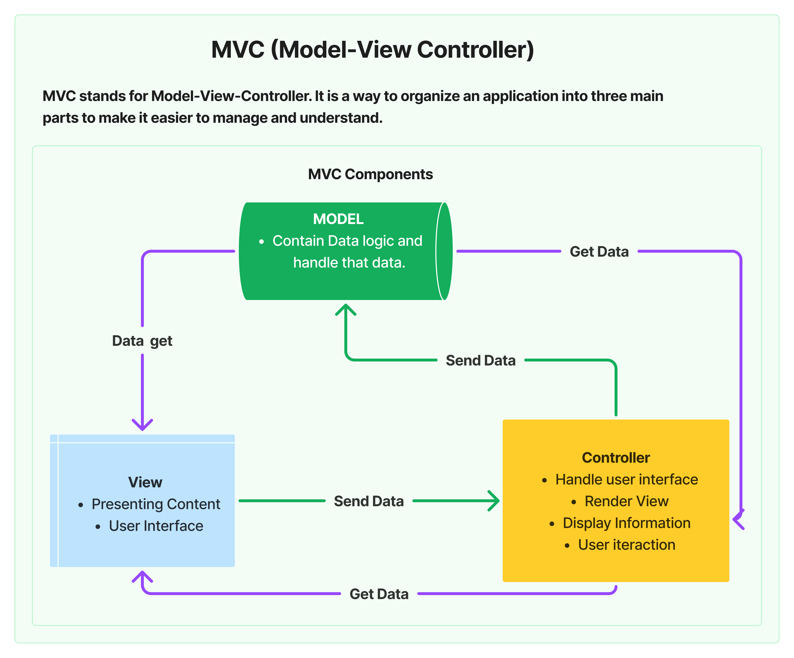
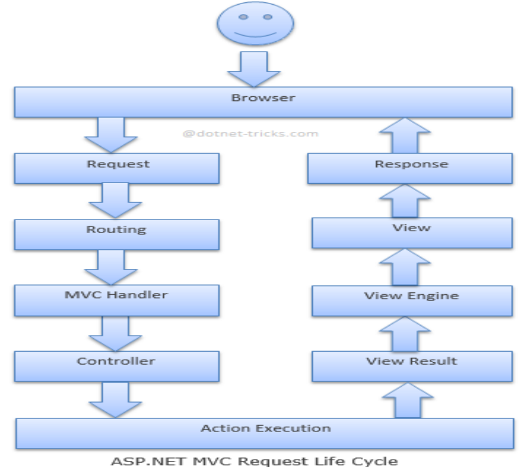
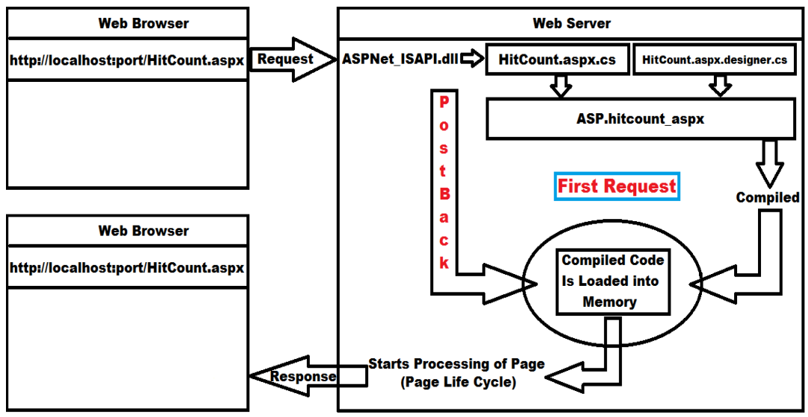
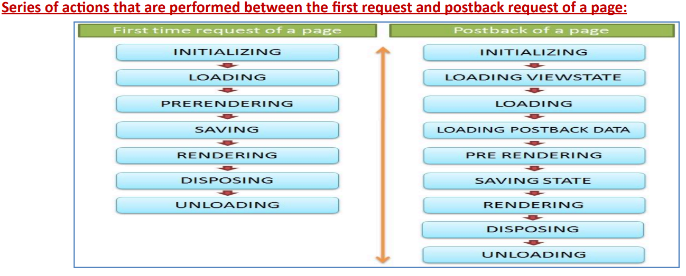
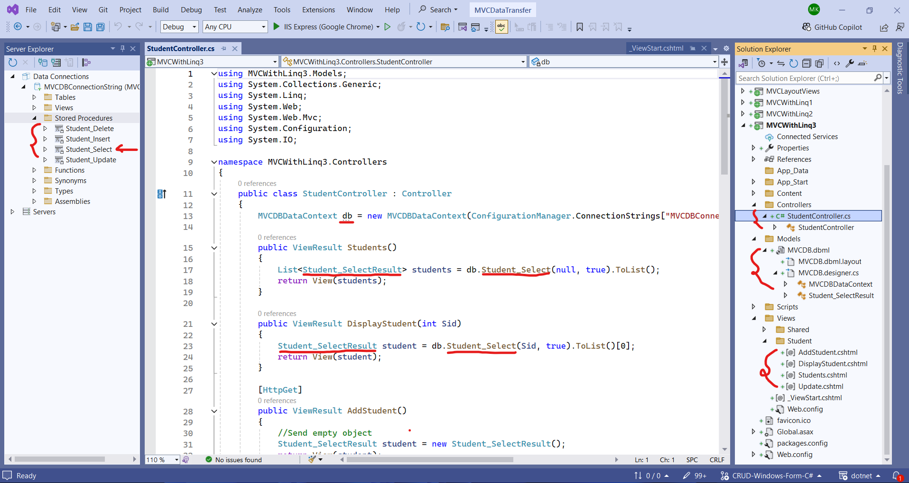
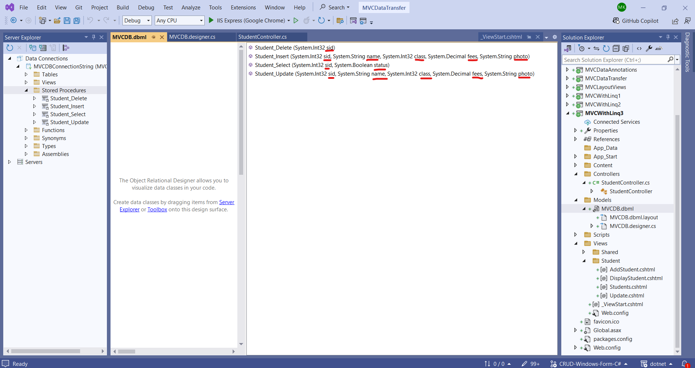
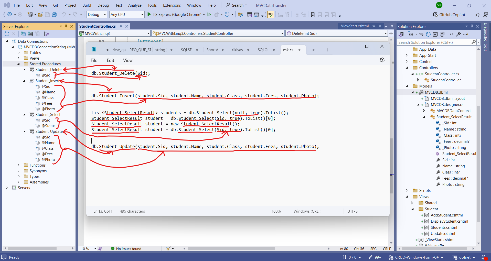

# MVC Question:

## **`History`**

### Q. What are Design Patterns?

---

- Design patterns are best practices for solving common software design problems.
- They are solutions that experienced developers have found effective over time.- These patterns help in designing object-oriented software that is reusable, flexible, and easy to maintain.

---

### Q. Why are Design Patterns Important?

---

- Design patterns provide tried and tested solutions to recurring design problems.
- They help inexperienced developers learn good software design practices quickly and make the design of software more standardized and consistent.

---

### Q. Who are the "Gang of Four" (GOF)?

---

- The "Gang of Four" refers to four authors — Erich Gamma, Richard Helm, Ralph Johnson, and John Vlissides — who published the influential book “Design Patterns: Elements of Reusable Object-Oriented Software” in 1994.
- This book introduced the concept of design patterns in software development and described 23 foundational design patterns.

---

### Q. What are the Types of Design Patterns?

---

- According to the GOF book, design patterns are classified into three categories:
- **Creational Patterns**: Deal with object creation mechanisms, trying to create objects in a manner suitable to the situation.
- **Structural Patterns**: These design patterns focus on how classes and objects can be combined and structured to form larger, more complex systems. They use concepts like inheritance and composition to create new functionalities by combining existing interfaces and objects.
- **Behavioral Patterns**: Focused on the communication between objects, defining the patterns of interaction.

---

### Q. Give some example of Design Patterns?

---

- **Singleton** A class of which only a single instance can exist.
- **Proxy** An object representing another object.

---

### Q. What is MVC

---

## 

<!-- ##  -->

### Q. What is the history of the MVC pattern?

---

- The MVC architecture pattern was first introduced by Trygve Reenskaug in the 1970s while working on Smalltalk-76 at Xerox Palo Alto Research Center. In the 1980s, Jim Althoff and others implemented a version of MVC for the Smalltalk-80 class library.

- Starting MVC developed for Desktop GUI's.
- Later MVC popular for desining web Applications, Mobile & other clients.
- Currently being used in Web Application development.

---

## **`ASP.NET MVC 5`**

### Q. What is the last version of ASP.NET MVC on the .NET Framework, and what version came after it?

---

- The last version of ASP.NET MVC on the .NET Framework is ASP.NET MVC 5. The next version was initially named MVC 6, but it was later renamed to ASP.NET Core MVC and was built to run on the .NET Core platform, which is cross-platform and offers improved performance and modularity.

- **ASP.Net MVC**: December 2007 (ASP.NET MVC CTP) to June 2022 (ASP.Net MVC 5.2.9) last version.
- **ASP.Net Core MVC**: August 2016 (ASP.NET Cpre MVC 1.0) to November 2023 (ASP.Net Core MVC 8.0) last version.

- No Seperate version for ASP.Net core. it same as .Net Core version.

---

### Q. How do you create an MVC project in Visual Studio 2022?

---

**Open Visual Studio 2022:** Start by launching Visual Studio 2022 on your computer.

**Create a New Project:** Click on "Create a new project" on the right-hand side of the window.

**Select Project Type:**

- In the new window, under the “All Languages” dropdown, select “C#”.
- Under the “All Platforms” dropdown, choose “Windows”.
- Under the “All Project Types” dropdown, select “Web”.

**Choose Project Template:** From the list below, select “ASP.NET Web Application (.NET Framework)” and click on the “Next” button.

**Configure Project Details:**

- New window appears, enter the “Project Name”.
- Enter the desired location for your project in the “Location” textbox.
- Choose the latest version of “.NET Framework” (i.e., “.NET Framework 4.8”) from the “Framework” dropdown list.
- Click on the “Create” button.

**Select Project Template Options:**

- In the “Create a new ASP.NET Web Application” window, select the “Empty” or "MVC" project template.
- Check the “MVC” checkbox under “Add folders & core references”, if you will selectd the "Empty" project.
- Uncheck all other checkboxes.

**Create the Project:** Click on the “Create” button to generate your MVC project.

---

### Q. What is the MVC Project Structure?

---

MVC and Empty Project Structure

| **Type**   | **MVC Project**    | **Empty Project**  |
| ---------- | ------------------ | ------------------ |
| **Folder** | Connected Services | Connected Services |
| **Folder** | App_Data           |                    |
| **Folder** | App_Start          | App_Start          |
| **Folder** | Content            |                    |
| **Folder** | Controllers        | Controllers        |
| **Folder** | Models             | Models             |
| **Folder** | Scripts            |                    |
| **Folder** | Views              | Views              |
| **File**   | Global.asax        | Global.asax        |
| **File**   | Packages.config    | Packages.config    |
| **File**   | Web.config         | Web.config         |

## In an **Empty Project**, the structure is usually more minimal:

### Q. What is the use of "Connected Services" file?

---

- This is used for integrating Microsoft Azure Service into Visual Studio, so that we can easily host and manage our application to Azure Portal from Visual Studio it-self.

---

### Q. What is the use of "App_Data" folder?

---

- this folder contains local Data Source files like “.mdf” files, “.xml” files, “Excel” files, etc.

---

### Q. What is the use of "App_Start" folder?

---

- this folder contains a set of files which contains classes, and these classes get executed when the application starts execution. App_Start folder can contain following files in it:

    <ul>
    <li><b>BundleConfig.cs: </b>Contains BundleConfig Class</li>
    <li><b>FilterConfig.cs: </b> Contains FilterConfig Class</li>
    <li><b>IdentityConfig.cs: </b> Contains IdentityConfig Class</li>
    <li><b>RouteConfig.cs: </b>Contains RouteConfig Class</li>
    <li><b>:Startup.Auth.cs </b>Contains Startup Class</li>
    </ul>

- In an Empty Project Template, the "App_Start" folder contains only the "RouteConfig.cs" file. In an MVC Project Template, the "App_Start" folder includes `BundleConfig.cs`, `FilterConfig.cs`, and `RouteConfig.cs` files.

---

### Q. What is the use of "Content" folder?

---

- This folder contains static files like “.css” files, “image”, files, etc.

---

### Q. What is the use of "Controllers" folder?

---

- This folder contains Controller classes where each Controller should be defined in a separate file.

    <br/>

- In an Empty Project Template, the "Controllers" folder is empty. In an MVC Project Template, the "Controllers" folder includes a default "HomeController" with a file named "HomeController.cs".

---

### Q. What is the use of "Models" folder?

---

- This folder contains Model classes i.e., classes representing the Entities and Properties representing the attributes of Entities as well as all the Methods to manipulate the data.

---

### Q. What is the use of "Scripts" folder?

---

- This folder contains Java Script or jQuery files that are used for development of the application.

---

### Q. What is the use of "Views" folder?

---

- The Views folder contains all the user interface (UI) files for the application. These files use the .cshtml extension if you are working with C#, or .vbhtml if you are using VB. These files, known as "Razor Pages," include both C# or VB code and HTML.

    <ul>
    <li>In an Empty Project Template, the Views folder initially contains only a web.config file.</li>
    <li>In an MVC Project Template, the Views folder includes two subfolders: Home and Shared. These subfolders contain .cshtml files, and the Views folder also includes _ViewStart.cshtml and web.config files.</li>
    </ul>

- Each Controller will have its own folder under Views to store its associated Views. For instance, a HomeController will have a Home folder within Views to keep all its related Views. The Shared folder within Views contains Views that are common across all Controllers, such as layout or error views.

---

### Q. What is the use of "Global.asax" file?

---

- Global.asax is a file that contains the Global class for application-level configuration. It includes methods such as:

   <ol>
   <li><b>Application_Start: </b>Runs when the application starts.</li>
   <li><b>Application_End: </b>Runs when the application ends.</li>
   <li><b>Application_Error: </b>Handles application-level errors.</li>
   <li><b>Session_Start: </b>Runs when a session starts.</li>
   <li><b>Session_End: </b>Runs when a session ends.</li>
   </ol>

---

### Q. What is the use of "Packages.config" file?

---

- This contains information of packages that are used under this project, so that anyone can easily understand if there are any 3rd party packages consumed for the development of this application.

---

### Q. What is the use of "Web.config" file?

---

- This is a configuration file for the whole application which contains configuration settings like “App Settings”, “Connection Strings”, “Network Settings”, “Compiler Settings”, etc.

---

## **`Controller`**

### Q. What is the role of a controller in an MVC application?

---

A controller is responsible for handling all incoming user requests in an MVC application. It processes user input, interacts with the model, and returns a view to the user.

---

### Q. What should be the parent class of all controllers in an MVC application?

---

- The parent class for all controllers should be the Controller class, which itself is a child of the ControllerBase class. Both these classes are defined in the System.Web.Mvc namespace.

---

### Q. How should a controller class be named in an MVC application?

---

- A controller class name should always end with the word "Controller." For example, if you want to create a controller named "Home," it should be named "HomeController."

---

### Q. Why should a controller name end with "Controller"?

---

- In ASP.NET MVC, the framework uses a naming convention to identify controller classes. The name must end with "Controller" so that the framework recognizes it as a controller and can handle routing correctly.

---

### Q. How do you create a new ASP.NET Web Application project?

---

- To create a new ASP.NET Web Application project, name it "MVCTestProject3", select the "Empty" project template, check the "MVC" checkbox, uncheck all other checkboxes, and click the "Create" button.

---

### Q. What are the two ways to add a controller to an MVC project?

---

You can add a controller to an MVC project in two ways:

- Manually defining a controller class.

- Using scaffolding to define a controller class.

---

### Q. How do you manually add a controller class to an MVC project?

---

    To manually add a controller:

- Open Solution Explorer.<br/>Right-click on the Controllers folder.<br/>Select Add > New Item or Class.<br/>In the Add New Item window, select Class, name it "TestController.cs", and click Add.

---

### Q. Which namespace should you import when defining a controller manually?

---

- You should import the "System.Web.Mvc" namespace when defining a controller manually.

---

### Q. How should you define a controller class in ASP.NET MVC?

---

- A controller class should inherit from the Controller class.

  ```C#
  public class TestController : Controller
  {
      // Action methods go here
  }
  ```

---

### Q. What is the access modifier of action method in an ASP.NET MVC controller?

---

- An action method is a public method in a controller class that handles incoming requests and returns a response. Each controller must have at least one action method.

---

### Q. Is it necessary for an action method to be public in a controller class?

---

- Yes, an action method must be public because only public methods can be accessed by the ASP.NET MVC framework to handle incoming HTTP requests. Private or protected methods cannot be access by HTTP requests.

---

### Q. How do you define a simple action method in a controller?

---

```C#
public string Index()
{
    return "Hello from Test Controller- Index Action Method.";
}
```

---

### Q. How do you access the Index action method of the TestController class in the browser?

---

- To access the Index action method, add /Test/Index to the default URL in the browser. For example: http://localhost:port/Test/Index

---

### Q. What do Test and Index represent in the URL http://localhost:port/Test/Index?

---

- "Test" is the name of the controller class "TestController"<br/>"Index" is the name of the action method in the "TestController" class.

---

### Q. What happens when you access the Index action method of TestController?

---

- When you access the Index action method by navigating to http://localhost:port/Test/Index, it will return the string "Hello from Test Controller- Index Action Method."

---

### Q. How do you define a second action method in the TestController class?

---

```C#
public string Show()
{
  return "Hello from Test Controller- Show Action Method.";
}
```

---

Code

```C#
using System.Web.Mvc;
namespace MyController.Controllers
{
  public class TestController : Controller
  {
    public string Index()
    {
    return "Hello index page";
    }
    public string Show()
    {
    return "Hello index page";
    }
  }
}
```

### Q. How do you access the Show action method of the TestController class in the browser?

---

- To access the Show action method, add /Test/Show to the default URL in the browser. For example: http://localhost:port/Test/Show

---

### Q. Why is it important to have at least one action method in a controller class?

---

- It is important because a controller without any action methods cannot handle any requests, making it ineffective in responding to user interactions.

---

### Q. Why is required to run a web application under Visual Studio?

---

- A web server is required to run a web application. Visual Studio provides a built-in web server called "IIS Express" to run and test web applications during development.

---

### Q. What is IIS Express in Visual Studio?

---

- IIS Express is a built-in development web server in Visual Studio. It starts automatically when you run a web application, allowing you to test the application locally.

---

### Q. How does IIS Express assign addresses to web applications?

---

- IIS Express assigns a unique numeric logical address called a "Port" to each web application for identification. This port number varies between projects and machines.

---

### Q. How many ports are available for web applications, and what range do they cover?

---

- There are 65,536 available ports, ranging from 0 to 65,535, and IIS Express allocates one of these ports randomly to each web application.

---

### Q. What is the difference between IIS Express and IIS in production environments?

---

- IIS Express is used for local development and only allows access from the local computer, while IIS (Internet Information Services) is used in staging and production environments for remote access and runs independently, providing 24/7 availability.

---

### Q. How do you check if IIS is installed on your computer?

---

- To check if IIS (Internet Information Services) is installed, go to the Windows search bar and type "inetmgr." If "Internet Information Services (IIS) Manager" appears, then IIS is installed on your computer.

---

### Q. How can you install IIS on your computer?

---

- To install IIS, go to Control Panel → Programs and Features → Turn Windows features on or off. In the Windows Features window, check the box for Internet Information Services and select all the sub-options under it, then click OK to install.

---

### Q. Why do you need to select all sub-options when installing IIS?

---

- Selecting all sub-options ensures that all necessary components and features of IIS are installed, providing full functionality for running and managing web applications.

---

### Q. How can you host a web application in IIS from Visual Studio?

---

- To host a web application in IIS from Visual Studio, open Solution Explorer, right-click on the project, and select Properties. In the Project Property Window, select Web from the left-hand side (LHS). Under the Servers section, change the dropdown value from IIS Express to Local IIS. Click on the Create Virtual Directory button to deploy the application in IIS, then save the changes.

---

### Q. What does the "Create Virtual Directory" button do?

---

- The Create Virtual Directory button deploys or hosts the web application in IIS, creating a virtual directory on the local server that maps to the application's folder.

---

### Q. How do you run the application after hosting it in IIS?

---

- After hosting the application in IIS, press F5 to run the project. This will launch the browser with the URL like <i><b>http://localhost/ProjectName</b></i> (ex: <i><b>http://localhost/MVCTestProject3</i></b>). To run specific action methods, add paths like /Test/Index or /Test/Show to the URL <i><b>http://localhost/ProjectName/ControllerName/ViewName</i></b> (ex: <i><b>http://localhost/MVCTestProject3/Test/Index</i></b>).

---

### Q. What is the role of IIS in running the web application after deployment?

---

- IIS (Internet Information Services) acts as a web server that hosts the deployed application, handling incoming HTTP requests and serving the appropriate responses, allowing the application to be accessed from the local machine or network.

---

### Q. Why do you need to change the server option from "IIS Express" to "Local IIS" in Visual Studio?

---

- Changing the server option from IIS Express to Local IIS configures Visual Studio to use the full version of IIS for hosting the application, providing additional features and allowing access from remote computers in a network, unlike the development-only IIS Express server.

---

### Q. What is the default action method in an MVC application?

---

- The default action method for all controllers in an MVC application is the Index action method. If an action method name is not specified in the URL, the Index action method is executed by default.

---

### Q. What is the default controller in an MVC application?

---

- The default controller in an MVC application is the HomeController. When a specific controller is not mentioned in the URL, the HomeController is invoked by default.

---

### Q. How can you access the Index action method using a URL without specifying the action method name?

---

- You can access the Index action method without specifying it in the URL, like so:
    <ul>
    <li>IIS Express: http://localhost:port/Test</li>
    <li>Local IIS: http://localhost/MVCTestProject3/Test</li>
    </ul>
    This will invoke the Index action method of the TestController.

---

### Q. How does the application determine which controller and action method to invoke based on the URL?

---

- The application uses the URL pattern to determine the controller and action method to invoke. For example:

- http://localhost:port or http://localhost/MVCTestProject3 :- will invoke HomeController's Index action method by default.
- http://localhost:port/Home or http://localhost/MVCTestProject3/Home :- will invoke HomeController's Index action method.
- http://localhost:port/Test or http://localhost/MVCTestProject3/Test :- will invoke TestController's Index action method.

---

### Q. Provide examples of URLs and their corresponding action methods for both IIS Express and Local IIS.

---

IIS Express:

<li>http://localhost:port → Invokes HomeController's Index</li>
<li>http://localhost:port/Home → Invokes HomeController's Index</li>
<li>http://localhost:port/Home/Index → Invokes HomeController'sIndex</li>
<li>http://localhost:port/Home/Show → Invokes HomeController'sShow</li>
<li>http://localhost:port/Test → Invokes TestController's Index</li>
<li>http://localhost:port/Test/Index → Invokes TestController'sIndex</li>
<li>http://localhost:port/Test/Show → Invokes TestController'sShow</li>
Local IIS:
<li>http://localhost/MVCTestProject3 → Invokes HomeController'sIndex</li>
<li>http://localhost/MVCTestProject3/Home → InvokesHomeController's Index</li>
<li>http://localhost/MVCTestProject3/Home/Index → InvokesHomeController's Index</li>
<li>http://localhost/MVCTestProject3/Home/Show → InvokesHomeController's Show</li>
<li>http://localhost/MVCTestProject3/Test → InvokesTestController's Index</li>
<li>http://localhost/MVCTestProject3/Test/Index → InvokesTestController's Index</li>
<li>http://localhost/MVCTestProject3/Test/Show → InvokesTestController's Show</li>

---

### Q. What is ASP.NET Scaffolding?

---

- ASP.NET Scaffolding is a code generation framework used in ASP.NET web applications to quickly create code that interacts with data models. It reduces development time by automatically generating standard operations.

---

### Q. How can you add a controller using scaffolding in Visual Studio?

---

- To add a controller using scaffolding:

    <ul>
    <li>Open Solution Explorer.</li>
    <li>Right-click on the Controllers folder.</li>
    <li>Select Add > Controller.</li>
    <li>In the Add New Scaffolded Item window, select MVC 5 Controller – Empty.</li>
    <li>Click the Add button and enter the name (e.g., "DemoController") and click Add again.</li>
    </ul>

---

### Q. What does the default controller class look like when added using scaffolding?

---

- When added using scaffolding, the default controller class will look like this:

  ```C#
    public class DemoController : Controller
    {
        // GET: Product
        public ActionResult Index()
        {
            return View();
        }
    }
  ```

  This class inherits from the Controller class whic is the parent class of all controller class and imports the System.Web.Mvc namespace by default.

---

### Q. How do you modify a scaffolded controller to create custom action methods?

---

- To modify a scaffolded controller, delete the existing code and add custom action methods like this:

  ```C#
  public string Index()
  {
      return "Hello from Demo Controller- Index Action Method.";
  }

  public string Show()
  {
      return "Hello from Demo Controller- Show Action Method.";
  }

  ```

---

### Q. How do you access the action methods of the DemoController in IIS Express and Local IIS?

---

IIS Express:

<li>http://localhost:port/Demo → Invokes Demo Controller's Indexmethod.</li>
<li>http://localhost:port/Demo/Index → Invokes Demo Controller'sIndex method.</li>
<li>http://localhost:port/Demo/Show → Invokes Demo Controller'sShow method.</li>

Local IIS:

<li>http://localhost/MVCTestProject3/Demo → Invokes DemoController's Index method.</li>
<li>http://localhost/MVCTestProject3/Demo/Index → Invokes DemoController's Index method.</li>
<li>http://localhost/MVCTestProject3/Demo/Show → Invokes DemoController's Show method.</li>

---

### Q. Where is the information for the default controller “Home” and the default action method “Index” specified?

---

- The details for the default controller ("Home") and the default action method ("Index") are specified in the RouteConfig.cs file located in the App_Start folder. The configuration looks like this:

  ```C#
  public class RouteConfig
  {
      public static void RegisterRoutes(RouteCollection routes)
      {
          routes.IgnoreRoute("{resource}.axd/{*pathInfo}");
          routes.MapRoute(
              name: "Default",
              url: "{controller}/{action}/{id}",
              defaults: new { controller = "Home", action = "Index", id = UrlParameter.Optional }
          );
      }
  }

  ```

---

### Q. What is Routing in ASP.NET?

---

- Routing is a mechanism that enables you to use URLs that are descriptive and do not have to map directly to specific physical files in a website. This allows URLs to be more user-friendly and meaningful, such as http://localhost:port/Products/Show/4, instead of http://localhost:port/Products.aspx?id=4.

---

### Q. How does Routing work in ASP.NET?

---

- Routing works by defining URL patterns that map to request-handler files. It allows the use of placeholders in a URL pattern so that variable data can be passed to the request handler without requiring a query string. For example, with the route {controller}/{action}/{id}, the URL http://localhost:port/Products/Show/4 would parse Products as the controller, Show as the action, and 4 as the id.

---

### Q. What is a Route in ASP.NET?

---

- A route is a URL pattern that is mapped to a handler, which can be a class that processes the request, such as a controller in an MVC application. Routes are defined by creating an instance of the Route class, specifying the URL pattern, the handler, and optionally a name for the route. Routes are stored in the RouteCollection object, which is accessed through the static Routes property of the RouteTable class.

---

### Q. How are routes typically defined in an MVC application?

---

- In an MVC application, routes are usually pre-configured and defined in the RouteConfig class, located in the RouteConfig.cs file. These routes are registered in the Application_Start method of the MVCApplication class, defined in the Global.asax file, by calling the RouteConfig.RegisterRoutes method.

---

### Q. What are URL Patterns, and how do they work with Routing

---

- URL patterns consist of literal values and variable placeholders (URL parameters) separated by the slash (/) character. Placeholders are enclosed in curly braces {} and are used to pass variable values to the request handler. For example, in the URL pattern {controller}/{action}/{id}, the placeholders controller, action, and id will be replaced by actual values from the URL during request handling.

---

### Q. Can multiple placeholders be used in a single segment of a URL pattern?

---

- Yes, multiple placeholders can be used in a single segment of a URL pattern, but they must be separated by a literal value. For example, {language}-{country}/{action} is a valid pattern, while {language}{country}/{action} is not because there is no literal value or delimiter between language and country.

---

### Q. Can we define multiple routes in the RouteConfig class?

---

- Yes, we can define multiple routes in the RouteConfig class. The MVC framework evaluates each route in the order they are defined. If the incoming URL does not match the pattern of the first route, it moves on to the next route, and so on.

---

### Q. How do we define multiple routes in the RouteConfig class?

---

- To define multiple routes, you add them to the RouteConfig.cs file before the default route. For example:

```C#
routes.MapRoute(
name: "Student",
url: "NIT/Students",
defaults: new { controller = "Student", action = "Index" }
);

routes.MapRoute(
    name: "Default",
    url: "{controller}/{action}/{id}",
    defaults: new { controller = "Home", action = "Index", id =    UrlParameter.Optional }
);

```

- In this case, the Student route will be evaluated first. If the request does not match this route, it will move to the Default route. But use default route in last.

---

### Q. What happens if we define the default route before other custom routes?

---

- If the default route is defined first, it will handle all incoming requests that match its pattern ({controller}/{action}/{id}), making it impossible for other custom routes to be evaluated. To prevent this, always define the default route last.

---

### Q. How can we pass parameters to a Controller’s action method?

---

- Parameters can be passed to action methods using Route Parameters or Query Strings.

---

### Q. How can we pass parameters to a Controller’s action method?

---

- Parameters can be passed to action methods using several methods:

    <ol>
    <li>Route Parameters: <br/>
    The default route pattern ({controller}/{action}/{id}) allows you to pass parameters directly in the URL. The id parameter is optional by default. For example: http://localhost:port/Params/Index1/100 passes 100 as the id parameter to the Index1 action method.</li>
    <li>Query Strings: <br/>Parameters can be appended to the URL using query strings. The values are provided as key-value pairs after a ?. For example: http://localhost:port/Params/Index1?id=100 passes 100 as the id parameter.</li>
    <li>Form Data (HTTP POST):<br>Parameters can also be sent to the action method through an HTTP POST request using form data. The values are sent as part of the request body, not the URL. For example:A form in HTML that uses the POST method can submit data to an action method like this:

  ```C#
  <form action="/Params/Index1" method="post">
  <input type="text" name="id" />
  <input type="submit" value="Submit" />
  </form>
  ```

  The id parameter will be passed to the Index1 action method.
    </li>
    <li>Model Binding: <br/>You can pass complex data types (like objects) to an action method by binding form data or query strings to a model object. For example:

  ```C#
  public ActionResult Index(Person person)
  {
      // 'person' object will be populated with form/query data
      return View();
  }

  ```

  The person object will automatically bind to form fields or query parameters like person.Name and person.Age.
    </li>
    <li>Request Body (JSON/XML Data): discus latter</li>
    </ol>

---

### Q. Can the parameter name in the action method differ from the route parameter name?

---

- No, the parameter name in the action method must match the name defined in the route configuration (like id in {controller}/{action}/{id}). If the parameter name does not match, the value passed through the route will not be mapped to the action method parameter. For example:

    <li>public string Index4(int x) will not map the id value from the URL correctly because the parameter name x does not match id.</li>

---

### Q. Is the id parameter type restricted in action methods?

---

- The id parameter is not restricted to a specific type. You can define it as any type in the action method. For example:

    <li>public string Index6(string Id) allows Id to be a string.
    You can then pass different types of values (Hello, 600, true) to this action method.</li>
    <li>If action method need parameter as a integer then action method will not be invoked, and you'll typically get a 404 Not Found or an error page.</li>

---

### Q. How can we pass multiple parameters to an action method?

---

- To pass multiple parameters, modify the route URL pattern in the RouteConfig class to include additional placeholders. For example:

  ```C#

  url: "{controller}/{action}/{id}/{name}"
  ```

  This allows you to pass two parameters (id and name) to an action method.

---

---

```C#
//Passing value to id is mandatory
public string Index1(int id)
{
return "The value of id is: " + id;
}

//Passing value to id is optional and if not passed value will be "0"
public string Index2(int id = 0)
{
return "The value of id is: " + id;
}

//Passing value to id is optional and if not passed value will be   "null"
public string Index3(int? id)
{
return "The value of id is: " + id;
}

//Passing value to Id is option because it is defined as type string & strings are by default Nullable (reference types)
public string Index6(string name)
{
return "Name is: " + name;
}

//Passing value to Id is mandatory and Name is optional
public string Index7(int Id, string Name)
{
return $"Value of Id is: {Id} and value of Name is: {Name}";
}
//Passing values to Id and Name are optional
public string Index8(int? Id, string Name)
{
return $"Value of Id is: {Id} and value of Name is: {Name}";
}

```

Execute the 2 above multiple parameter methods as following:

**IIS Express:**

- http://localhost:port/params/Index7 //Invalid because Id is mandatory parameter
- http://localhost:port/params/Index7/700 //Valid, in this case Name will be null value
- http://localhost:port/params/Index7/700/Raju //Valid
- http://localhost:port/Params/Index7/Raju/700 //Invalid because parameter values not in order
- http://localhost:port/Params/Index7?Id=700&Name=Raju //Valid, as we are passing values by specifying names
- http://localhost:port/Params/Index7?Name=Raju&Id=700 //Valid, as we are passing values by specifying names

**Local IIS:**

- http://localhost/MVCTestProject3/params/Index7 //Invalid because Id is mandatory parameter
- http://localhost/MVCTestProject3/params/Index7/700 //Valid, in this case Name will be null value
- http://localhost/MVCTestProject3/params/Index7/700/Raju //Valid
- http://localhost/MVCTestProject3/Params/Index7/Raju/700 //Invalid because parameter values not in order
- http://localhost/MVCTestProject3/Params/Index7?Id=700&Name=Raju//Valid
- http://localhost/MVCTestProject3/Params/Index7?Name=Raju&Id=700 //Valid

**IIS Express:**

- http://localhost:port/params/Index8 //Valid, in this case Id & Name will be null value
- http://localhost:port/params/Index8/800 //Valid, in this case Name will be null value
- http://localhost:port/params/Index8/800/Raju //Valid
- http://localhost:port/Params/Index8/Raju/800 //Valid, in this case id will be null value
- http://localhost:port/Params/Index8?Name=Raju //Valid, in this case id will be null value
- http://localhost:port/Params/Index8?Id=800&Name=Raju //Valid, as we are passing values by specifying names
- http://localhost:port/Params/Index8?Name=Raju&Id=800 //Valid, as we are passing values by specifying names

**Local IIS:**

- http://localhost/MVCTestProject3/params/Index8 //Valid
- http://localhost/MVCTestProject3/params/Index8/800 //Valid
- http://localhost/MVCTestProject3/params/Index8/800/Raju //Valid
- http://localhost/MVCTestProject3/Params/Index8/Raju/800 //Valid
- http://localhost/MVCTestProject3/Params/Index8?Name=Raju //Valid
- http://localhost/MVCTestProject3t/Params/Index8?Id=800&Name=Raju //Valid
- http://localhost/MVCTestProject3/Params/Index8?Name=Raju&Id=800 //Valid

---

### Q. How to pass value in method using Query string?

---

```c#
public string Index9(int Pid, string Pname, double Price)
{
  return $"Pid: {Pid}; Pname: {Pname}; Price: {Price}";
}
```

Now run the application by using the following URL:

**IIS Express:**

- http://localhost:port/Params/Index9/101/Shoes/3500 //Invalid
- http://localhost:port/Params/Index9?Pid=101&Pname=Shoes&Price=3500 //Valid
- http://localhost:port/Params/Index9?Pname=Shoes&Price=3500&Pid=101 //Valid
- http://localhost:port/Params/Index9?Price=3500&Pid=101&Pname=Shoes //Valid

**Local IIS:**

- http://localhost/MVCTestProject3/Params/Index9/101/Shoes/3500 //Invalid
- http://localhost/MVCTestProject3/Params/Index9?Pid=101&Pname=Shoes&Price=3500 //Valid
- http://localhost/MVCTestProject3/Params/Index9?Pname=Shoes&Price=3500&Pid=101 //Valid
- http://localhost/MVCTestProject3/Params/Index9?Price=3500&Pid=101&Pname=Shoes //Valid

---

### Q. Is that posible to pass pass value without defining the parameters to an action method wusing querystring? If yes then How?

---

```C#
public string Index10()
{
  int Pid = int.Parse(Request.QueryString["Pid"]);
  string Pname = Request.QueryString["Pname"];
  double Price = double.Parse(Request.QueryString["Price"]);
  return $"Pid: {Pid}; Pname: {Pname}; Price: {Price}";
}
```

In this case, this type of example is not related to `RouteConfig`, not mendatry to write parameter name or define parameter.

Now run the application by using the following URL:

**IIS Express:**

- http://localhost:port/Params/Index10 //Invalid
- http://localhost:port/Params/Index10/101/Shoes/3500 //Invalid
- http://localhost:port/Params/Index10?Pid=101&Pname=Shoes&Price=3500 //Valid
- http://localhost:port/Params/Index10?Pname=Shoes&Price=3500&Pid=101 //Valid
- http://localhost:port/Params/Index10?Price=3500&Pid=101&Pname=Shoes //Valid

**Local IIS:**

- http://localhost/MVCTestProject3/Params/Index10 //Invalid
- http://localhost/MVCTestProject3/Params/Index10/101/Shoes/3500 //Invalid
- http://localhost/MVCTestProject3/Params/Index10?Pid=101&Pname=Shoes&Price=3500 //Valid
- http://localhost/MVCTestProject3/Params/Index10?Pname=Shoes&Price=3500&Pid=101 //Valid
- http://localhost/MVCTestProject3/Params/Index10?Price=3500&Pid=101&Pname=Shoes //Valid

---

### Q. What is the diffrence bitween this three method?

```C#
public string Index10()
{
  int Pid = int.Parse(Request.QueryString["Pid"]);
  string Pname = Request.QueryString["Pname"];
  double Price = double.Parse(Request.QueryString["Price"]);
  return $"Pid: {Pid}; Pname: {Pname}; Price: {Price}";
}
```

```c#
public string Validate1()
{
  string Name = Request["Name"];
  string Pwd = Request["Pwd"];
  if (Name == "Raju" && Pwd == "Admin")
    return "Valid User";
  else
    return "Invalid User";
}

IIS Express:
http://localhost:port/Params/Validate1?Name=Raju&Pwd=Admin //Valid
http://localhost:port/Params/Validate1?Pwd=Admin&Name=Raju //Valid

Local IIS:
http://localhost/MVCTestProject3/Params/Validate1?Name=Raju&Pwd=Admin //Valid
http://localhost/MVCTestProject3/Params/Validate1?Pwd=Admin&Name=Raju //Valid
```

```c#
public string Validate2(string Name, string Pwd)
{
  if (Name == "Raju" && Pwd == "Admin")
    return "Valid User";
  else
    return "Invalid User";
}

IIS Express:
http://localhost:port/Params/Validate2?Name=Raju&Pwd=Admin //Valid
http://localhost:port/Params/Validate2?Pwd=Admin&Name=Raju //Valid

Local IIS:
http://localhost/MVCTestProject3/Params/Validate2?Name=Raju&Pwd=Admin //Valid
http://localhost/MVCTestProject3/Params/Validate2?Pwd=Admin&Name=Raju //Valid
```

---

**Index10() Method:**

- Uses Request.QueryString to fetch parameters (Pid, Pname, Price) exclusively from the URL `query string` (e.g., ?Pid=101&Pname=Shoes&Price=3500).
- Do not rely depend on the `RouteConfig` file since they extract data directly from the Request object. It's not depend for parameter on the `RouteConfig` file.

**Validate1() Method:**

- Uses Request["Name"] and Request["Pwd"] to `get data from either the query string or form data`.
- This is more flexible in terms of input sources since it can handle both URL query strings and form submissions.
- No parameters are passed directly to the method; it relies on Request to retrieve data.
- Do not rely depend on the `RouteConfig` file since they extract data directly from the Request object. It's not depend for parameter on the `RouteConfig` file.

**Validate2() Method:**

- Takes parameters directly (Name, Pwd) as method arguments, making it more explicit.
- Relies on Model Binding in ASP.NET MVC to pass parameters to the method.
- It is a cleaner way to handle input since it does not access Request directly.
- Fully Depends on the RouteConfig file for defining how URL segments map to its method parameters. It's fully depend for parameter on the `RouteConfig` file.

---

### Q. What happens if a route parameter is not provided for an action method that requires it?

---

- If a route parameter is not provided and the action method requires it, the behavior depends on how the parameter is defined:

- **Mandatory Parameter:** If the parameter is required (e.g., public string Index1(int id)), it will result in an error if not provided (e.g., http://localhost:port/Params/Index1).

- **Optional Parameter with Default Value:** If the parameter is optional with a default value (e.g., public string Index2(int id = 0)), it will use the default value when not provided (e.g., http://localhost:port/Params/Index2).

- **Nullable Parameter:** If the parameter is nullable (e.g., public string Index3(int? id)), it will be null if not provided (e.g., http://localhost:port/Params/Index3).

---

### Q. Why do some URLs result in an "Invalid" response while others are "Valid"?

---

- URLs result in "Invalid" responses when the action method expects a parameter that is not provided or does not match the expected type. URLs are "Valid" when the provided parameters match the action method's requirements or default values.

---

### Q. What ia Action method?

---

The methods that we defined under the Controller class for performing user interactions are known as Action methods i.e., users will directly call these methods for performing actions.

---

### Q. What should you do if you encounter an error when accessing a URL with missing parameters?

---

- Check if the action method requires parameters and if they are provided in the URL. If a parameter is missing but required, you'll get an error. Make sure your action methods handle missing or optional parameters correctly. You can set default values or make parameters optional to avoid errors.

---

## **`Views`**

### Q. What are the rules follow for defining the action method?

---

1. Action methods must be public, so every public method in a Controller class is an Action method only.
2. Action methods cannot be static because behind the screen instance of the Controller class is used for calling
   the Action methods.
3. It is not suggested to overload Action methods, but if required we can still do that by decorating the method with “ActionName” attribute.

```C#
[ActionName("SayHello1")]
public string SayHello()
{
  return "Hello how are you?";
}
[ActionName("SayHello2")]
public string SayHello(string Name)
{
  return "Hello " + Name + " how are you?";
}

//Note: In the above case, we must call the method using the custom "ActionName" defined, not the original method name. To test this, define the methods inside the `ParamsController` class, and call them using the custom names provided.

//We can execute the above methods following:
http://localhost/MVCTestProject3/Params/SayHello1
http://localhost/MVCTestProject3/Params/SayHello2?Name=Raju

```

4. If we want to define any non-action methods in a controller class, make sure they are not public or else decorate them with “NonAction” attribute and in this case when we try to access those methods from browser we get “404 Not Found” error.

```c#
<private or internal or protected or private protected or protected internal> string Display()
{
  return "Non-Action Method";
}
//Or
[NonAction]
public string Display()
{
  return "Non-Action Method";
}
```

5. Action methods are generally value returning and very importantly in an MVC Application - Action Methods return type is an “ActionResult”, where “ActionResult” is a class type and under this class there are a set of child classes and we call all those classes as Action Result’s only, and we can use any of those child classes as a
   return type of our Action method.

**List of ActionResult child classes is:**

<ul>
<li>ActionResult
<ol>
<li>FileResult
  <ul>
    <li>FilePathResult</li>
    <li>FileStreamResult</li>
    <li>FileContentResult</li>
  </ul>
</li>
<li>JsonResult</li>
<li>ViewResult</li>
<li>EmptyResult</li>
<li>ContentResult</li>
<li>RedirectResult</li>
<li>JavaScriptResult</li>
<li>PartialViewResult</li>
<li>HttpStatusCodeResult</li>
<li>RedirectToRouteResult</li>
</ol>
</li>
</ul>

**General signature of an Action method will be as following:**

```C#
 public <ActionResult> <Name>( [<Parameter List>] )
 {
   -Implement all the required logic here
   -return an ActionResult
 }
 //Note: The main ActionResult of an action method is ViewResult. A  View in an MVC application is the UI containing the presentation  logic. Its file extension is .cshtml for C# and .vbhtml for VB.NET.

```

6. An Action method to return an “ActionResult”, we are provided with a set of methods known as “HelperMethods” and these helper methods are defined under Controller class, which is the parent or base class for
   all the controllers we define.

| **Helper Method**                  | **Action Result**     | **Description**                                                                                                          |
| ---------------------------------- | --------------------- | ------------------------------------------------------------------------------------------------------------------------ |
| File                               | FileResult            | Represents a class that is used to send file content as response.                                                        |
| Json                               | JsonResult            | Represents a class that is used to send JSON-Formatted content as response                                               |
| View                               | ViewResult            | Sends a view as response                                                                                                 |
| ---                                | EmptyResult           | Represents a result that does nothing, such as controller action method which returns void.                              |
| Content                            | ContentResult         | Represents a user-defined content type, which is sent as a response                                                      |
| Redirect                           | RedirectResult        | Controls the processing of application’s action method by redirecting to a specified URI.                                |
| JavaScript                         | JavaScriptResult      | Sends JavaScript content as a response (currently this is not supported by the modern browsers and removed in MVC Core). |
| PartialView                        | PartialViewResult     | Sends a partial view as response.                                                                                        |
| HttpNotFound                       | HttpStatusCodeResult  | Provides a way to return an action result with a specific HTTP Status Code and Description.                              |
| RedirectToRoute / RedirectToAction | RedirectToRouteResult | Represents a result that performs a redirection to an action method by using the specified route values dictionary       |

**Note:** The helper methods are defined in the under the Controller class (ie: `ParamsController.cs`). To view the pre-defined Controller class and its metadata, right-click on the Controller class in ParamsController.cs and select "Go to Definition."

---

### Q. What is the role of the "Views" folder in an MVC application?

---

- The View Folder contain Ui components for presenting data to users and accepting user input. Each controller has its own folder under "Views" to store its related views. For example, an EmployeeController will have a corresponding Employee folder under "Views" for its views.

- If a controller is added using scaffolding, the associated folder for its views is created automatically. For manually added controllers, you must create the folder yourself. Additionally, a "Shared" folder can be used for views that are common to multiple controllers.

---

### Q. What does a View contain in an ASP.NET MVC application?

---

A View contains presentation code that combines C# or VB with HTML, and can also include CSS and JavaScript. The View's logic is processed and converted into HTML through a process called "Rendering."

---

### Q. What is rendering in ASP.NET MVC?

---

Rendering is the process where the server-side logic is converted into HTML text, which is then sent to the client. This allows for consistent display of content across different devices and browsers.

---

### Q. What are the two View Engines available in ASP.NET MVC?

---

**The two View Engines are:**

1. **Web Forms Engine :**

- Introduced with MVC 2008.
- Uses .aspx.cs or .aspx.vb extensions.
- Coding style similar to ASP.NET Web Forms.
- Sample Web Form page with for loop:

```C#
<%
  for(int i=1;i<=10;i++)
  {%>
    <h3>Hello World</h3>
  <%
  }
%>
```

2. **Razor Engine**

- Introduced in MVC 3.0.
- Uses .cshtml or .vbhtml extensions.
- Recommended for its advanced features and easier syntax.
- Supports embedding HTML with C# or VB code.
- Sample Razor page with for loop:

```c#
@{
  for(int i=1;i<=10;i++)
  {
    <h3>Hello World</h3>
  }
}
```

Apart from the above 2 View Engines, ASP.NET MVC also supports many other third-party View Engines also like “NHaml”, “Brail”, “NDjango”, “Spark”, “Hasic”, etc.

---

### Q. How do you create and use Action methods and Views in an ASP.NET MVC application?

---

1. Creating Action Methods:

**Define:** Add controller class (ie: `HomeController.cs`) in controller folder. Define method and return type is `ViewResult`.

```C#
public ViewResult Index()
{
    return View();
}
public ViewResult Register()
{
    return View();
}

public ViewResult Login()
{
    return View();
}
```

- HomeController is bydefault controll wich run first according to you requirement you can change.

2. Adding Views:
   **Folder Structure:** Views are placed under the Views folder, with a subfolder for each Controller (e.g., Views/Home for HomeController).
   **Creating Views:** Right click on method name select Add View select MVC 5 View click on Add then Select Empty(without model) Template and uncheak all checkbox and click on Add. Or another way to create view Go to Home folder whic is in View folder write click > click Add > click view then create view. Use normal html to create view.

- `Index View`: Create `Index.cshtml` with links to other views =.
- `Register View`: Create `Register.cshtml` with a registration form.
- `Login View`: Create `Login.cshtml` with a login form.

Write this code inside the div:
`Index View`

```html
<h1 style="text-align:center;color:red;text-decoration:underline">
  Naresh I Technologies
</h1>
<h2>Click on the links below to navigate:</h2>
<h3>
  <a href="/Home/Register">Register</a> <br />
  <a href="/Home/Login">Login</a> <br />
  <a href="/Home/ForgotPassword">Forgot Password</a><br />
  <a href="/Home/ResetPassword">Reset Password</a><br />
  <a href="/Home/Contact">Contact Us</a><br />
  <a href="/Home/Mission">Mission</a><br />
  <a href="/Home/About">About Us</a><br />
</h3>
```

`Register View`

```html
<h1 style="text-align:center;color:red;text-decoration:underline">
  Naresh I Technologies
</h1>
<h3 style="text-align:center;text-decoration:underline">Registration Page</h3>
<table align="center">
  <tr>
    <td>Name:</td>
    <td><input type="text" id="txtName" name="txtName" /></td>
  </tr>
  <tr>
    <td>User Id:</td>
    <td><input type="text" id="txtUid" name="txtUid" /></td>
  </tr>
  <tr>
    <td>Password:</td>
    <td><input type="password" id="txtPwd" name="txtPwd" /></td>
  </tr>
  <tr>
    <td>Confirm Password:</td>
    <td><input type="password" id="txtCPwd" name="txtCPwd" /></td>
  </tr>
  <tr>
    <td>Mobile:</td>
    <td><input type="tel" id="txtMobile" name="txtMobile" /></td>
  </tr>
  <tr>
    <td>Email Id:</td>
    <td><input type="email" id="txtEmail" name="txtEmail" /></td>
  </tr>
  <tr>
    <td colspan="2" align="center">
      <input type="submit" id="btnRegister" value="Register" />
      <input type="reset" id="btnReset" value="Reset" />
    </td>
  </tr>
</table>
<h4 style="text-align:center;color:red">
  Click here to go to <a href="/Home/Index">Home Page.</a>
</h4>
```

`Login View`

```html
<h1 style="text-align:center;color:red;text-decoration:underline">
  Naresh I Technologies
</h1>
<h3 style="text-align:center;text-decoration:underline">Login Page</h3>
<table align="center">
  <tr>
    <td>User Id:</td>
    <td><input type="text" id="txtUid" name="txtUid" /></td>
  </tr>
  <tr>
    <td>Password:</td>
    <td><input type="password" id="txtPwd" name="txtPwd" /></td>
  </tr>
  <tr>
    <td colspan="2" align="center">
      <input type="submit" id="btnLogin" value="Login" />
      <input type="reset" id="btnReset" value="Reset" />
    </td>
  </tr>
</table>
<h4 style="text-align:center;color:red">
  Click here to go to <a href="/Home/Index">Home Page.</a>
</h4>
```

**Note:** While launching a View the Action method name and View name match, simply calling View() is sufficient. When they differ, specify the view name or path.

---

### Q. Can the Action method name and View name be different?

---

Yes, Action method name and View name can be different, and if they are different, we need to explicitly pass View name or path of that View as a parameter to the Helper method. To test this, add 2 new Views naming them as “ForgotPwd” and “ResetPwd”.

**Example:**

Create 2 View:
`ForgotPwd.cshtml`

```html
<h1 style="text-align:center;color:red;text-decoration:underline">
  Naresh I Technologies
</h1>
<div style="text-align:center;background-color:cyan">
  Forgot your password? Enter your registered Email Id, to receive a reset
  password link.
  <br />
  Email Id:
  <input type="email" id="txtEmail" name="txtEmail" />
  <input type="submit" id="btnSubmit" value="Submit" />
</div>
<h4 style="text-align:center;color:red">
  Click here to go to <a href="/Home/Index">Home Page.</a>
</h4>
```

`ResetPwd.cshtml`

```html
<h1 style="text-align:center;color:red;text-decoration:underline">
  Naresh I Technologies
</h1>
<div style="text-align:center;background-color:cyan">
  <h4>Reset Password</h4>
  <table align="center">
    <tr>
      <td>New Password:</td>
      <td><input type="password" id="txtPwd" name="txtPwd" /></td>
    </tr>
    <tr>
      <td>Confirm Password:</td>
      <td><input type="password" id="txtCPwd" name="txtCPwd" /></td>
    </tr>
    <tr>
      <td colspan="2" align="center">
        <input type="submit" id="btnSubmit" value="Submit" />
        <input type="reset" id="btnReset" value="Reset" />
      </td>
    </tr>
  </table>
</div>
<h4 style="text-align:center;color:red">
  Click here to go to <a href="/Home/Index">Home Page.</a>
</h4>
```

Create controller for this View:

```c#
public ViewResult ForgotPassword()
{
  return View("ForgotPwd");//Use direct name when View present in Share or representing controller view folder. Another wise not work you got error.
}
public ViewResult ResetPassword()
{
  return View("~/Views/Home/ResetPwd.cshtml");//Targert the view when view is any place.
}
```

**Note:** in the above case Action method names are not matching with View names so we are explicitly passing View name as parameter to the Action method and that can be done in any of the above 2 ways.

---

### Q. Is it mandatory to place the View exactly under the folder representing the Controller?

---

No, it is not mandatory. Views can also be placed in the "Shared" folder or representing Controller folder under the Views folder, which is a common folder for storing views that are shared across multiple controllers.
**Example:**

- Create a Contact.cshtml view in the Shared folder.
- The View Engine will first search for the view in the controller-specific folder (e.g., Views/Home), and if not found, it will look in the Shared folder.

```c#
public ViewResult Contact()
{
    return View();  // Will load Contact.cshtml from Shared folder if not found in Home folder
}
```

- If the view is placed in another folder (like Views/Test), you will need to explicitly specify the path in the Action method.

```c#
public ViewResult Mission()
{
    return View("~/Views/Test/Mission.cshtml");  // View path is explicitly given
}
```

This flexibility allows for better organization and sharing of views across controllers.

---

### Q: What is the default View Engine in an MVC 5 Application?

---

The default View Engine in an MVC5 Application is **Web Form Engine**. This means if a View page exists with both `.aspx` (Web Form) and `.cshtml` (Razor) extensions, the first preference is given to the `.aspx` View.

- **Testing this**: Add two Views into the `Home` folder named `About.aspx` and `About.cshtml`. By default, MVC will load the `.aspx` view first.
- **Important Note**: Starting from MVC5, Visual Studio removed direct support for adding "Web Form Views." To add one, you must manually add an **ASP.NET Web Form** and adjust it to function as a Web Form View Page.

Example of adding a Web Form (`About.aspx`):

1. **Create About.aspx**:

- Right-click on the `Home` folder under `Views`. Select **Add => New Item**, choose **Web Form**, and name it `About.aspx`. Write the following HTML inside the `<div>` tag:

```html
<h3 style="text-align: center">
  About page created using Web Form View Engine.
</h3>
```

2. **Change Inheritance**:

- Open `About.aspx.cs` (right-click `About.aspx` and select **View Code**).
- Change the class inheritance from `System.Web.UI.Page` to `System.Web.Mvc.ViewPage`.

3. **Create About.cshtml**:(Razor view)

- Add another view named `About.cshtml` in the same `Home` folder.Write the following HTML inside the `<div>` tag:

```html
<h3 style="text-align: center">About page created using Razor View Engine.</h3>
```

- Now go to HomeController class and add a new Action Methods in the class as following:

```c#
public ViewResult About()
{
    return View();
}
```

Now launch Index View and click on the “About Page” hyper link and this will launch “About.aspx” page because by default it will search for “.aspx” pages first, whereas if we want “About.cshtml” page to be launched we need to pass the path of “About.cshtml” file as parameter to Helper method and to test that re-write code in
“About” action method as following:

```c#
public ViewResult About()
{
    return View("~/Views/Home/About.cshtml");
}
```

---

### Q. How to remove `Web form engion` and use only `Razor View Engine`?

---

To do this, you need to either clear all View Engines and re-add the Razor View Engine or remove the Web Form View Engine. This ensures the Razor View Engine is the default.

Here’s how to configure it:

1. **Option 1: Clear all View Engines and add Razor View Engine**: In the Global.asax file, inside the Application_Start method, add this code:

```c#
ViewEngines.Engines.Clear();
ViewEngines.Engines.Add(new RazorViewEngine());
```

2. **Option 2: Remove only the Web Form View Engine**: Alternatively, if you just want to remove the Web Form View Engine (but keep any others), you can do this:

```c#
ViewEngines.Engines.Remove(ViewEngines.Engines.OfType<WebFormViewEngine>().FirstOrDefault());
```

This option need `using System.Web.Mvc;` namespace.

**Note:** After applying these configurations:

- Action method returns View();, it will launch the .cshtml view (e.g., About.cshtml).
- If you try to access a .aspx view explicitly by its path, it will result in an error because WebFormViewEngine has been removed.

---

### Q. What is MVC Action Selectors?

---

These are attributes that can be applied on an Action method, and they help the View Engine to select the correct Action Method to handle the request.

There are 3 Action Selectors:

1. ActionName
2. NonAction
3. ActionVerbs

---

### Q: What is the use of the `ActionName` attribute?

---

The `ActionName` attribute allows you to call an action method using a different name than its method name. It’s often used when you want to overload action methods or call them using a custom name.  
**Example:**

```csharp
[ActionName("Launch")]
public ViewResult LaunchViewPageLoadingDataFromDatabase()
```

---

### Q: What does the `NonAction` attribute do?

---

The `NonAction` attribute specifies that a public method in the controller is not an action method. It cannot be invoked via a URL.

**Example:**

```csharp
[NonAction]
public string SayHello()
```

---

### Q: What is the purpose of the `ActionVerbs` attribute?

---

The `ActionVerbs` attribute is used to handle different types of HTTP requests like `HttpGet`, `HttpPost`, `HttpPut`, etc. By default, methods handle `HttpGet` if no action verb is specified.

**Example:**

```csharp
[HttpGet]
public ViewResult Login()  // Handles GET requests

[HttpPost]
public ViewResult Login(string Name, string Password)  // Handles POST requests
```

---

## **`Razor Programming`**

### Q: What is Razor Engine, and when was it introduced?

---

Razor Engine is a view engine introduced by Microsoft from MVC 3.0 to create View Pages without using Web Forms. Razor View Pages are saved with the **“.cshtml”** extension, whereas Web Form View Pages are saved with the **“.aspx”** extension.

---

### Q: What is the major difference between Razor Pages and Web Form Pages?

---

Razor Pages provide only a **Source View** where HTML, JavaScript, CSS, and C# logic can be implemented directly. In contrast, Web Form Pages have **Design View, Source View, and Code View** and use ASP.NET server controls. Razor Pages are lightweight as they use only HTML controls and don’t maintain View State.

---

### Q: How do you write C# code in Razor Pages compared to Web Form Pages?

---

In Razor Pages, C# code is written using **`@{ ... }`** for blocks of code, whereas in Web Form Pages, C# code is written inside **`<% ... %>`** tags.

---

### Q: What are the three ways to write code in Razor?

---

The three ways to write code in Razor Pages are:

1. **Single Line Statements** – For declarations and initializations.

   ```csharp
   @{ int Count = 0; }
   ```

2. **In-Line Statements** – For printing or accessing member values.

   ```html
   <h3>Value of Count is: @Count</h3>
   ```

3. **Multi-Line Statements** – For writing multiple lines of C# or HTML code.
   ```csharp
   @{
      string Date = DateTime.Now.ToShortDateString();
      <h3>Today's Date is: @Date</h3>
   }
   ```

---

### Q: How do you include HTML code in a multi-line Razor block?

---

HTML code can be written directly inside the Razor block without quotes, but for static text, you must either prefix it with **`@:`** or enclose it in **`<text></text>`** tags.

```csharp
@{
   string Date = DateTime.Now.ToShortDateString();
   @:Today's Date is: @Date
   <text>Current Time is:</text> @Time
}
```

---

### Q: How do you write comments in Razor?

---

Razor comments are enclosed between **`@* Comment *@`**. C#-style single-line comments **`//`** can also be used in multi-line blocks.

---

### Q: How are single line statements written in Razor programming?

---

Single line statements in Razor are used for simple declarations or initializations of variables. They are written inside **`@{ ... }`** blocks.
Example:

```csharp
@{ int Count = 0; }
@{ Count += 100; }
```

---

### Q: How are in-line statements used in Razor?

---

In-line statements are used to print the values of variables or expressions directly within the HTML. They are preceded by an **`@`** symbol.
Example:

```html
Value of count is: @Count Value of str is: @str Obj is of type: @Obj.GetType()
```

---

### Q: How do you write multi-line statements in Razor?

---

Multi-line statements allow for multiple lines of C# or HTML code and are enclosed in **`@{ ... }`**. HTML can be written directly in the block, but static text must be either prefixed by **`@:`** or enclosed in **`<text></text>`**.
Example:

```csharp
@{
string Date = DateTime.Now.ToShortDateString();
string Time = DateTime.Now.ToShortTimeString();
<span>Today's Date is: @Date</span> <br>
@:Current Time is: @Time <br>
<text>Current Time is: @Time</text>
}
```

---

### Q: How do you implement conditions (if-else) in Razor?

---

```csharp
@{
int x = 131;
if (x % 2 == 0)
{
<span>@x is an even number.</span>
}
else
{
<span>@x is an odd number.</span>
}
}
```

---

### Q: How do you implement a `for` loop in Razor?

---

```html
<ol>
  @for (int i = 0; i < Colors.Length; i++) {
  <li>@Colors[i]</li>
  }
</ol>
```

Or:

```html
<ol>
  @{ for (int i = 0; i < Colors.Length; i++) {
  <li>@Colors[i]</li>
  } }
</ol>
```

---

### Q: How do you implement a `foreach` loop in Razor?

---

```html
<ul>
  @foreach (string color in Colors) {
  <li>@color</li>
  }
</ul>
```

Or:

```html
<ol>
  @{ foreach (string color in Colors) {
  <li>@color</li>
  } }
</ol>
```

---

## **`Passing values from Controller Action Methods to Views`**

### Q. What are the options for passing values from controller action methods to view?

---

- To pass values from a Controller’s Action method to a View we are provided with various options like:

1. ViewData:
2. ViewBag
3. TempData
4. Cookies
5. Session
6. Application
7. Anonymous Types
8. Models

- ViewData, ViewBag, TempData under the ControllerBase class which is granparent of all controller class.

---

### Q. How to modify the URL structure?

---

- **Old URL:** `{controller}/{action}/{id}`
- **New URL:** `{controller}/{action}/{id}/{name}/{price}`
- Now change the defaults also as following:

```c#
defaults: new
{
  controller = "Home", //If you change this then default controller load in browser change
  action = "Index", //If you change this then default controller action method load in browser change
  id = UrlParameter.Optional, name = UrlParameter.Optional, price =   UrlParameter.Optional //If you change this then Parameter of URL  change
}

```

- `UrlParameter.Optional`: Means paremeter is optional in URL

---

### Q. What is ViewData and how to use it?

---

ViewData is a dictionary object used to pass data from the Controller to the View. It stores data as key-value pairs and is accessible using string keys. Data persists for a single request (from Controller to View). Once the View is rendered, the data is discarded.

```c#
// Controller
public ActionResult Index()
{
    ViewData["Message"] = "Welcome to MVC!";
    return View();
}

// View (Index.cshtml)
<h2>@ViewData["Message"]</h2>
```

```c#
// Controller
public ActionResult Index()
{
    List<string> Colors = new List<string>() { "Red", "Blue", "Pink", "Black", "White", "Green", "Brown", "Purple" };
    ViewData["Colors"] = Colors;
    return View();
}

// View (Index.cshtml)
@foreach (string color in (List<String>)ViewData["Colors"])
{
  <li>@color</li>
}
```

---

### Q. What is ViewBag and how to use it?

---

ViewBag is a dynamic object that provides a more flexible way to pass data from the Controller to the View. It uses the dynamic keyword to store data. Data persists for a single request (Controller to View).

```c#
// Controller
public ActionResult Index()
{
    ViewBag.Message = "Welcome to MVC using ViewBag!";
    return View();
}

// View (Index.cshtml)
<h2>@ViewBag.Message</h2>
```

```c#
// Controller
public ActionResult Index()
{
  List<string> Colors = new List<string>() { "Red", "Blue", "Pink", "Black", "White", "Green", "Purple", "Yellow" };
  ViewBag.Colors = Colors;
  return View();
}

// View (Index.cshtml)
@foreach (string color in ViewBag.Colors)
{
  <li>@color</li>
}
```

---

### Q. What is the diffrence bitween ViewData & Viewbag?

---

- ViewData vs ViewBag
  | **Feature** | **ViewData** | **ViewBag** |
  |-------------|--------------|--------------|
  | **Type** | `Dictionary` (internally stored in ViewDataDictionary) | `Dynamic object` |
  | **Data Access** | String keys (e.g., ViewData["Key"]) | Properties (e.g., ViewBag.Key) |
  | **Compile-time checking** | No, because it's based on strings | No, because it's dynamic |
  | **Null checking** | Must handle potential null values | Must handle potential null values |
  | **Type Casting** | Need Un-boxing (e.g: `double Price = Convert.ToDouble(ViewData["Price"]);`) | No need Un-boxing because it's type safe |

**Key Difference:** ViewBag is easier to use because of dynamic properties, while ViewData uses a dictionary-style approach. Both are available only for a single request (Controller to View).

---

### Q. What is TempData and how to use it?

---

TempData is a dictionary used to pass data from one request to another (e.g., from one action to another or across redirects). It is stored in session until it's read or cleared. Data persists for the duration of a single subsequent request. TempData type safe.

- Both ViewData Dictionary & TempData Dictionary are child classes of `IDictionary` interface which is designed for storing data in [key-value] or [name-value] combination.

```c#
// Controller
public ActionResult Index()
{
    TempData["Message"] = "This is TempData!";
    return RedirectToAction("AnotherAction");//using this
}

public ActionResult AnotherAction()
{
    string message = TempData["Message"] as string;
    return View();
}

// View (AnotherAction.cshtml)
<h2>@TempData["Message"]</h2>
//Or
<h2>@TempData.Message</h2>

```

---

### Q. How to redirect to another controller action method from another controller action method?

---

```c#
public RedirectToRouteResult Index5(int? id, string name, double? price)
{
  TempData["Id"] = id;
  TempData["Name"] = name;
  TempData["Price"] = price;
  return RedirectToAction("Index1", "Test");//Action name, Controller name
}
```

- **RedirectToAction(string actionName)**: For same controller action method
- **RedirectToAction(string actionName, string controllerName)**: For diffrent controller action method

---

### Q. What is the difference between ViewData and TempData?

---

Both ViewData and TempData are used to pass data between controllers and views. However:

**ViewData** is used for transferring data between the controller and the current view during a single request.

**TempData** maintains data between multiple requests, but the data is cleared after it's accessed once.

---

### Q. What is the drawback of TempData?

---

Once data is accessed from TempData, it is immediately deleted and cannot be accessed in future requests. If you need to use the data across multiple requests, this can be problematic.

---

### Q. How can we retain TempData values across multiple requests?

---

**Use eithe:**

- Peek Method: Retains specific values after accessing.
  - Example: @TempData.Peek("Id")
- Keep Method: Retains all values in TempData after access.
  - Example: @{ TempData.Keep(); }

Use in View on top.

---

### Q. When to use Peek vs. Keep?

---

**Use eithe:**

- Peek: Use when you need to retain specific values.
- Keep: Use when you need to retain all values.

---

### Q. What is the diffrence bitween ViewData/ViewBag & TempData?

---

| Feature        | ViewBag/ViewData                            | TempData                                                        |
| -------------- | ------------------------------------------- | --------------------------------------------------------------- |
| Scope          | Single request (Controller to View)         | Data persists across multiple requests (e.g., across redirects) |
| Type           | ViewData: Dictionary, ViewBag: Dynamic      | Dictionary (TempDataDictionary)                                 |
| Data Retention | Lost after the View is rendered             | Retained until read in subsequent request                       |
| Usage Scenario | Temporary data used within the same request | Temporary data needed across requests (e.g., redirects)         |

**Key Difference:** TempData persists across multiple requests, making it suitable for passing data during redirects, while ViewBag and ViewData are for single-request scenarios.

---

### Q. What is a Cookie?

---

A cookie is a small piece of text stored by the browser on a user's device. It holds user-specific information, which can be read by a web application when the user revisits the site.

---

### Q. How does a web server send cookies to the client?

---

When a user requests a webpage, the web server can send a cookie along with the page. The browser stores the cookie and sends it back to the server with subsequent requests to the same site.

---

### Q. Where are cookies stored?

---

Cookies are stored in the browser's memory or a folder on the user's hard disk. Each website or web application has its own set of cookies stored separately by the browser.

**Location of Persistant Cookies:**

**Microsoft Edge:** C:\Users\&ltUser&gt\AppData\Local\Microsoft\Edge\User Data\Default

**Google Chrome:** C:\Users\&ltUser&gt\AppData\Local\Google\Chrome\User Data\Default

---

### Q. How do you write & Read a cookie on the client machine?

---

Use the HttpCookie class to create a cookie and add values to it like a dictionary. Then, add the cookie to the client's machine using the Response object:

```c#
HttpCookie cookie = new HttpCookie("LoginCookie");
cookie["User"] = "Raju";
cookie["Pwd"] = "Admin@123";
Response.Cookies.Add(cookie);

```

Use the Request object to access the cookie from the client machine:

```c#
HttpCookie cookie = Request.Cookies["LoginCookie"];
string User = cookie["User"];
string Pwd = cookie["Pwd"];

```

---

### Q. What are the two types of cookies?

---

1. In-Memory Cookies: These cookies are stored in the browser's memory and are deleted when the browser is closed. And by default every cookie is In-Memory only.

2. Persistent Cookies: These cookies are saved on the user's hard drive and have an expiration date, meaning they remain even after the browser is closed. And can be accessed next time we visit the site.

---

### Q. How do you make cookie as persistent?

---

To make a cookie as persistent we need to set “Expires” property of Cookie with a “DateTime” value. `cookie.Expires = <DateTime>;`

**Setting expires property of Cookie:**

```c#
public ViewResult Index6(int? Id, string Name, double? Price)
{
  HttpCookie cookie = new HttpCookie("ProductCookie");//cookie name is 'ProductCookie'
  cookie["Id"] = Id.ToString();
  cookie["Name"] = Name;
  cookie["Price"] = Price.ToString();
  cookie.Expires = DateTime.Now.AddDays(3);//Provide expiry time
  Response.Cookies.Add(cookie);
  return View();
}

```

Read the cookie:-

```c#
@{
HttpCookie cookie = Request.Cookies["ProductCookie"];
int Id = int.Parse(cookie["Id"]);
string Name = cookie["Name"];
double Price = double.Parse(cookie["Price"]);
}
```

---

### Q. What are the drawbacks of cookies?

---

1. We can create only 50 cookies for each website, so every new cookie from the site will override the old cookie once after reaching the limit.
2. A cookie can store only 4 K.B. of data that too of type string only.
3. Cookies are not secured because they are stored on client machines.
4. Because cookies are stored on client machines there is a problem like clients can either delete the cookies or even disable cookies.

---

### Q. How do you disable cookies in a browser?

---

1. Browser > Select Settings.
2. On the left-hand side (LHS), select Cookies and site permissions.
3. On the right-hand side (RHS), click on Manage and delete cookies and site data.
4. Switch off the toggle button Allow sites to save and read cookie data (recommended).

---

### Q. How do you delete cookies in a browser?

---

1. Press Ctrl + Shift + Delete to open the Clear browsing data window.
2. Select the checkbox for Cookies and other site data.
3. Click Clear now to delete all cookies.

You can also delete individual cookies by using the Manage and delete cookies and site data option.

---

### Q. What is a session in ASP.NET MVC?

---

A session in ASP.NET is a property that stores user-specific data across multiple requests. Each user has their own session that is not shared with other users. The data in a session can be accessed across actions, controllers, and views during a session's lifetime.

---

### Q. How do you store values in a session?

---

Use the Session property to store values as key-value pairs:

```c#
Session["Name"] = "Raju";
```

---

### Q. How do you retrieve values from a session?

---

You can access the session values using the key:

```c#
string Name = Session["Name"].ToString();
```

---

### Q. What is a session's scope?

---

Session data is specific to a single user and is accessible across all pages, controllers, and views in an application during the user's session lifetime. This makes session data "Single-User Global Data."

---

### Q. How is a session identified to which user it belongs to?

---

Each session is assigned a unique SessionId, which is stored in the client’s browser as an In-Memory Cookie. When the user makes subsequent requests, the server reads this SessionId from the cookie to associate the user with the correct session. This allows the same session to be accessed across different tabs of the same browser instance, but not in a new browser instance.

---

### Q. What happens to sessions if the client closes the browser?

---

Sessions have a default timeout of 20 minutes (sliding expiration), which means if the session is not accessed within 20 minutes, the server destroys it. This default can be changed in the Web.config file by setting the timeout attribute in the &ltsessionState&gt element:

```c#
<sessionState timeout="1" />
```

---

### Q. Can a session be explicitly destroyed?

---

Yes, a session can be explicitly destroyed by calling the Session.Abandon() method. This is commonly done during Sign Out or Log Out operations in web applications.

---

### Q. Where does the web server store session values?

---

The server can store session values in three locations:

1. **In-Proc:** Session data is stored in the memory of the web server.
2. **State Server:** A separate server manages session data.
3. **SQL Server:** Session data is stored in a SQL Server database, allowing for persistence across web server restarts or across multiple web servers.

---

### Q. What is In-Proc?

---

In-Proc: this is the default option used for storing Session values and in this case Session values are stored under the memory of “IIS Worker Process”. To understand about these, first host your application on “Local IIS”.

---

### Q. What is an IIS Worker Process?

---

The IIS Worker Process is a Windows process (named w3wp.exe) that runs web applications in IIS and handles incoming requests. It is tied to an Application Pool, which is a container for one or more web applications. The worker process is responsible for processing the requests and sending back responses to the client. All ASP.NET functionalities, such as session handling, run within the scope of this worker process.

---

### Q. What is an Application Pool?

---

An Application Pool is a container in IIS for one or more web applications. It isolates the applications for better security, reliability, and availability. By default, all applications run under the DefaultAppPool, but you can create separate application pools for each web app. This prevents issues in one application from affecting others.

---

### Q. What happens to sessions in In-Proc mode when IIS Worker Process recycles or stops?

---

In In-Proc mode, session data is stored in the memory of the IIS Worker Process. If the worker process recycles or is stopped (e.g., via Task Manager), all session data is lost. This means any session information (like user authentication) will be destroyed.

---

### Q. How do you change the Application Pool for a web application in IIS?

---

To change the Application Pool for a web app:

1. Open IIS Manager.
2. Under Sites, right-click on your web application.
3. Select Manage Applications → Advanced Settings.
4. In the window that opens, under Application Pool, click the dropdown and select the desired Application Pool (e.g., “MyPool”).
5. Click OK to apply the change.

---

### Q. How do you create a new Application Pool in IIS?

---

To create a new Application Pool:

1. In IIS Manager, under the Connections Panel, right-click on Application Pools.
2. Select Add Application Pool.
3. Enter a name for the new Application Pool (e.g., "MyPool") and click OK.
4. The new Application Pool will be created and can be assigned to any web application.

---

### Q. How can you view the IIS Worker Process for a specific Application Pool?

---

You can view the IIS Worker Process in the Task Manager:

1. Open Task Manager and go to the Details tab.
2. Look for the process named w3wp.exe.
3. In the Details section, it will show the Application Pool associated with that worker process, allowing you to identify which worker process is handling which web application.

---

### Q. What is the risk of using In-Proc session mode in IIS?

---

In In-Proc session mode, session data is stored in the IIS Worker Process memory. If the process recycles or is terminated, all session data is lost, which could result in users being logged out or losing other session-specific data. This makes In-Proc less suitable for high-availability environments or scenarios where session persistence is critical.

---

### Q. What is a State Server in ASP.NET?

---

State Server: this is separate software for storing “Session Values” which is installed when we install .NET Runtime on any machine, and it can be found in the “Services Window”.

To see that go to Control Panel => Administrative
Tools => Services and in that we find “ASP.NET State Service”.

---

### Q. How can I configure my application to use State Server for session management?

---

To configure State Server, follow these steps:

1. Start the State Service:

- Open Control Panel → Administrative Tools → Services.
- Find ASP.NET State Service, right-click, and select Start.

2. Update the Web.config file:

- Add the <sessionState> element with mode="StateServer" and the connection string to the service:

```c#
Copy code
<sessionState mode="StateServer"  stateConnectionString="tcpip=localhost:42424" />
```

- Replace "localhost" with the machine name if the service runs on a remote machine. The default port is 42424.

---

### Q. What does the stateConnectionString attribute represent in the Web.config file?

---

The stateConnectionString specifies the server and port where the ASP.NET State Service is running.

- tcpip=localhost:42424: "localhost" refers to the machine running the service (can be replaced with a remote server name), and 42424 is the default port number for communication with the State Server.

---

### Q. What are the advantages of using State Server over In-Proc session storage?

---

State Server offers several advantages:

1. **Session Persistence:** Since session data is stored outside the IIS Worker Process, the data remains intact even if IIS recycles or crashes.
2. **Scalability:** It allows the session state to be shared across multiple servers (a Web Farm) by using a centralized state server.
3. **Isolation:** Session data is isolated from the web application memory, improving reliability.

---

### Q. Can the State Server run on a remote machine?

---

Yes, the State Server can run on a remote machine. To use a remote State Server, replace "localhost" in the stateConnectionString with the name of the remote machine, while ensuring the ASP.NET State Service is running on that machine and is accessible via the specified port.

---

### Q. What happens if the State Server service is stopped while the application is running?

---

If the State Server service is stopped, the application will no longer be able to store or retrieve session data from the service. This will result in session values being lost for active sessions, and users may encounter errors or be logged out of their sessions.

---

### Q. How do use SQL Server to store session data in an ASP.NET application?

---

If “Session Mode” is set as SQL Server then Session values are stored under SQL Server Database and to use that we need to create a Database, a set of Tables and Stored Procedures. Without creating all these objects manually, we are provided with a command line tool called as “aspnet_regsql” that should be used from “Visual
Studio Developer Command Prompt” as below:

1. Run the “aspnet_regsql” tool at “VS Developer Command Prompt”, so that the required Database, Tables and Stored Procedure for maintaining Sessions will be created under SQL Server.

**-S:** to specify SQL Server name.
**-U:** to specify User Id in case of SQL Authentication.
**-P:** to specify password in case of SQL Authentication.
**-E:** this must be used in case of Windows Authentication and in such case don't use -U and -P option again.
**-ssadd:** is to enable support for SQL Server Session State and this will create a Database on the server.

**Note:** If we want to remove the support for session state we need to use -ssremove in place -ssadd.

**-sstype:** is to specify the type of tables we want to use where “t” indicates temporary tables, “p” indicates
persisted tables and “c” indicates custom - but in this case we need to create our own Database to store Session
data, and to specify that Database name we need to use “-d <Database Name>” option in the last.

2. Run the command based on your authentication:

- For SQL Server Authentication:

```c#
aspnet_regsql -S <Server Name> -U <User Id> -P <Password> -ssadd -sstype t|p|c
//example: aspnet_regsql -S Server -U Sa -P 123 -ssadd -sstype t
```

- For Windows Authentication:

```c#
aspnet_regsql -S <Server Name> -E -ssadd -sstype t|p|c
//example: aspnet_regsql -S Server -E -ssadd -sstype t
```

- Here, "t" stands for temporary tables, "p" for persisted tables, and "c" for custom database storage.

**Note:** in the above case we are using temporary tables for storing Session State values, so a new Database is created on the Server with the name “ASPState” and under this Database it creates a set of Stored Procedures for managing the data and because we have asked for temporary tables, all the required tables gets created on “TempDB - System Database” and this Database will be re-created every time we re-start SQL Server, whereas if we ask for persisted tables then all the required tables also gets created on “ASPState” Database only, so even if we re-start SQL Server, then also tables and their values will be persisting.

3. Now open Web.config file and re-write the <sessionState> tag as below:

- Sql Server Authentication:

```C#
<sessionState mode="SQLServer" sqlConnectionString="Data Source=Server;User Id=Sa;Password=123" />
```

- Windows Authentication:

```c#
<sessionState mode="SQLServer" sqlConnectionString="Data Source=Server;Integrated Security=SSPI" />
```

**Testing the processes of using “aspnet_regsql” with permenant table support:**

- **For SQL Server Authentication:** aspnet_regsql -S Server -U Sa -P 123 -ssadd -sstype p
- **For Windows Authentication:** aspnet_regsql -S Server -E -ssadd -sstype p
  **Testing the processes of using “aspnet_regsql” with custom Database and permenant table support:**
- For SQL Server Authentication: aspnet_regsql -S Server -U Sa -P 123 -ssadd -sstype c -d MySessions
- For Windows Authentication: aspnet_regsql -S Server -E -ssadd -sstype c -d MySessions

In this case we are using Custom Database then we need to specify the Database name in our sqlConnectionString and also we need to use allowCustomSqlDatabase attribute with the value as true as below:

**Sql Server Authentication:**

```C#
<sessionState mode="SQLServer" allowCustomSqlDatabase="true"
sqlConnectionString="Data Source=Server;User Id=Sa;Password=123;Database=MySessions" />
```

**Windows Authentication:**

```C#
<sessionState mode="SQLServer" allowCustomSqlDatabase="true"
sqlConnectionString="Data Source=Server; Integrated Security=SSPI;Database=MySessions" />
```

---

### Q. How do you remove SQL Server session state support?

---

Run the following aspnet_regsql command to remove SQL Server session state support:

```C#
//For SQL Server Authentication:
aspnet_regsql -S Server -U sa -P 123 -ssremove
//For Windows Authentication:
aspnet_regsql -S Server -E -ssremove
```

---

### Q. When should you use State Server or SQL Server session modes over In-Proc?

---

Use State Server or SQL Server session modes in the following cases:

1. **Web Farm:** In this architecture, a Load Balancer distributes requests across multiple servers. In-Proc session storage cannot be used because each server holds its own session data. State Server or SQL Server provides centralized session storage accessible by all servers.
2. **Web Garden:** In this architecture, multiple worker processes run within the same Application Pool. Since different worker processes can handle requests, In-Proc session data may not persist across requests. State Server or SQL Server ensures that session data is shared across worker processes.

---

### Q. What is a Web Farm and why can't "In-Proc" session mode be used in this architecture?

---

A Web Farm is an approach of hosting a Web Application on multiple Web Servers to distribute the load. Client requests are directed to a Load Balancer, And Load Balancer which forwards the ckient to one of the available servers.
In case of a Web Farm architecture, In-Proc session mode cannot be used because if each request from the same client is re-directed to a different Web Servers, then Session Data of 1 Web Server is not accessible to other Web Servers.
**To overcome this, you can use:**

- **State Server:** Session data is stored on a dedicated server, and all web servers in the farm access the session data from this central server.
- **SQL Server:** Session data is stored in a SQL Server database, which all servers in the farm can access.

---

### Q. What is a Web Garden, and why might "In-Proc" session mode not work well here?

---

A Web Garden is an IIS configuration where a single application pool runs with multiple worker processes. Typically, each application pool runs with one worker process, but in a Web Garden, this number can be increased.
In an In-Proc session mode, session data is stored in the memory of a specific worker process. If a subsequent request is handled by a different worker process in the garden, that process won’t have access to the session data. To ensure session data is accessible across all processes, you can use:

- **State Server:** Session data is stored externally, accessible by all worker processes.
- **SQL Server:** Session data is stored in a central SQL Server database.

---

### Q. how do you configure Web Garden in IIS?

---

To configure a Web Garden:

1. Open IIS Manager.
2. Right-click the Application Pool running your application and select Advanced Settings.
3. Under the Process Model section, locate the Maximum Worker Processes setting.
4. Change its value from 1 (default) to a higher number.
   Click OK to apply the changes.

---

### Q. What is the diffrence bitween TempData & Session?

---

| **Feature**            | **TempData**                                           | **Session**                                          |
| ---------------------- | ------------------------------------------------------ | ---------------------------------------------------- |
| **Scope**              | Persists until the next request                        | Persists throughout the user session                 |
| **Data Storage**       | Stored in session (limited to the next request)        | Stored on the server for the entire session duration |
| **Use Case**           | Passing data between requests (e.g., across redirects) | Storing user-specific data for the entire session    |
| **Performance Impact** | Lower since data is discarded after the next request   | Higher because it persists until the session ends    |

**Key Difference:** TempData is used for short-lived data between requests, while Session is used for long-lived data throughout a user’s session.

---

### Q. What is the diffrence bitween TempData & Cookies?

---

| **Feature**      | **TempData**                                 | **Cookies**                               |
| ---------------- | -------------------------------------------- | ----------------------------------------- |
| **Scope**        | Server-side, persists until the next request | Client-side, persists based on expiration |
| **Security**     | More secure (server-side)                    | Less secure (stored on client-side)       |
| **Data Storage** | Limited to the next request                  | Can persist beyond a single session       |

**Key Difference:** TempData is used for short-lived server-side data, while Cookies can be used to store data on the client-side for longer periods.

---

### Q. What is the diffrence bitween Cookies & Session?

---

| **Feature**          | **Session**                                     | **Cookies**                                                                          |
| -------------------- | ----------------------------------------------- | ------------------------------------------------------------------------------------ |
| **Data Storage**     | Server-side                                     | Client-side (in browser)                                                             |
| **Data Persistence** | Lasts until the session expires                 | Can persist across multiple sessions based on expiration                             |
| **Security**         | More secure (server-side storage)               | Less secure (client-side storage)                                                    |
| **Size Limit**       | No significant limits, depends on server memory | Limited to 4KB                                                                       |
| **Use Case**         | Storing user-specific data across session       | Storing small pieces of user-specific data like preferences or authentication tokens |

**Key Difference**: Session is more secure and suitable for large, server-side data. Cookies store small pieces of data on the client side and can persist beyond the session.

---

### Q. What is Application and how to use it?

---

Application-State is a global storage mechanism in ASP.NET, used to store data shared among all users of a web application. It's faster than using a database since the data is stored in the web server's memory. Unlike Session-State, which is user-specific, Application-State is accessible to all users. Whereas Application is common for all users of the application.

```
                    Web Server
+-------------------------------------------------+
|   User 1   |   User 2   |   User 3   |  User 4  |
+-----|------------|------------|-----------|-----+
+-----V------------V------------V-----------V-----+
|               Application Memeory               |
+-------------------------------------------------+
```

Application data does not expire unless the server restarts or the worker process recycles. Data is stored in name/value pairs, similar to Session, ViewData, or TempData. However, Application-State is not thread-safe, so you must use Lock() and UnLock() methods to ensure safe data handling. It is managed using the Application property of the HttpContext class from the System.Web namespace.

**Storing values into Application:**

```c#
//Syntax
HttpContext.Application[string key] = value (object)
HttpContext.Application["Name"] = "Raju";
//Example
```

**Accessing values from Application:**

```c#
//Syntax
object value = HttpContext.Application[string key]
//Example
object value = HttpContext.Application["Name"];
string Name = value.ToString();
//or
string Name = HttpContext.Application["Name"].ToString();
```

---

### **Note**:

```c#
//1) If class & property is present then assign value(Explixitly create class and define property):-
public class Employee
{
public int Id { get; set; }
public string Name { get; set; }
public string Job { get; set; }
public double Salary { get; set; }
public bool Status { get; set; }
}
//Create instance and assign
Employee emp = new Employee();
emp.Id = 1;
emp.Name = "Mritunjay";
emp.Job = "Manager";
emp.Salary = 100000;
emp.Status = true;
//Or
Employee emp = new Employee{ Id = 1001, Name = "Raju", Job = "Manager", Salary = 50000.00, Status = true };

//2) If class & property are not present then assign value(Implixitly create class and define property by compiler):-
var Emp = new { Id = 1001, Name = "Raju", Job = "Manager", Salary = 50000.00, Status = true };
//Or
dynamic Emp = new { Id = 1001, Name = "Raju", Job = "Manager", Salary = 50000.00, Status = true };
```

### Q. What are anonymous types in C# and how can they be used to pass data between action methods or to views in ASP.NET MVC?

---

introduced in C# 3.0

Anonymous types in C# allow you to create an object without explicitly defining a class. This is useful when you need a temporary data structure with properties but don't want to create a full class.

Internally, the compiler automatically generates the new type for anonymous types. You can check that by
calling GetType() method on an anonymous type of instance which will return the following value: `<>f__AnonymousType05[System.Int32,System.String,System.String,System.Double,System.Boolean]`

Anonymous types are typically used in scenarios where you need to pass data between action methods or to views in an ASP.NET MVC application without defining a specific model. You can create an instance of an anonymous type using the new keyword and store it in a variable with either var or dynamic.

Example:

```C#
var product = new { Id = 105, Name = "Shoes", Price = 3500 };
```

This creates an anonymous type with properties Id, Name, and Price. These values can be passed to a view or another action method. ASP.NET MVC automatically stores the values in ViewData when passing them to the view, making them accessible using the ViewData.Eval method.

To pass data from one action method to another:

```C#
public RedirectToRouteResult Index14(int? id, string name, double? price)
{
    var product = new { Id = id, Name = name, Price = price };
    return RedirectToAction("Index5", "Test", product);
}

```

This passes the anonymous type as route parameters to the Index5 action in another controller.

Add a View to the above Action method and write the below code under its `<div>` tag:

```c#
@{
int? Id = Convert.ToInt32(ViewData.Eval("Id"));
string Name = ViewData.Eval("Name").ToString();
double? Price = ViewData.Eval("Price") as double?;
}
<table border="1" align="center" width="15%">
  <caption>Product Details</caption>
  <tr><td>Id:</td><td>@Id</td></tr>
  <tr><td>Name:</td><td>@Name</td></tr>
  <tr>
    <td>Price:</td>
    <td>
    @{
    Price = Price + (Price * 10 / 100);
    @Price
    }
  </td>
  </tr>
</table>

```

In the above case while accessing values from an anonymous type in the View, we need to first capture those values from ViewData i.e., even if we did not explicitly store the values in ViewData, they are implicitly stored into ViewData and accessible under the View.

While accessing the values from ViewData we require calling “Eval” method on ViewData, because the
values are stored in the form of an “instance or object (Complex type)” and under that instance or object we have
all the 3 values which should be separated first and then consumed.

The key points are:

- Anonymous types are temporary and do not need an explicit class definition.
- They are useful for passing data between controllers or views.
- Data is implicitly stored in ViewData when passed to a view.

---

### Q. What is Models?

---

This is another way how we can transfer data from Controller to the View, which provides “type safety” and “intellisense” support in Views, so by using this also we can transfer values from Action method to corresponding View or Action method to Action method of same Controller or other Controllers.

---

### Q. how to use Models?

---

1. To use Models create Model Objects(model class): To transfer data, you first create a model class that defines the data structure. In this case, you create a Product class:

```c#
public class Product
{
    public int? Id { get; set; }
    public string Name { get; set; }
    public double? Price { get; set; }
}
```

2. Defining the Action Method: In the any one controller (i.e: HomeController), you define an action method that uses the model (i.e: Product) to transfer data to the view:

```c#
public ViewResult Index15(int? id, string name, double? price)
{
    Product product = new Product { Id = id, Name = name, Price = price };
    return View(product);
}
```

This method initializes a Product object with the passed parameters and returns it to the view. You can also write it in more concise ways:

```c#
return View(new Product { Id = id, Name = name, Price = price });
//or
var product = new Product { Id = id, Name = name, Price = price };
return View(product);
//or
dynamic product = new Product { Id = id, Name = name, Price = price };
return View(product);
```

3. Creating the View:

- In the view for Index15, you declare the model at the top:

```C#
@model MVCDataTransfer.Models.Product

```

- Then, you can access its properties using the @Model property:

```html
<table border="1" align="center" width="15%">
  <caption>
    Product Details
  </caption>
  <tr>
    <td>Id:</td>
    <td>@Model.Id</td>
  </tr>
  <tr>
    <td>Name:</td>
    <td>@Model.Name</td>
  </tr>
  <tr>
    <td>Price:</td>
    <td>@{ double? Price = Model.Price + (Model.Price * 10 / 100); @Price }</td>
  </tr>
</table>
```

4. Executing the Action Method

**Or we can also Redirecting with Model Objects:**

- You can also redirect to another action while passing the model. For example, in HomeController, you can define:

```c#
public RedirectToRouteResult Index16(Product product)
{
    return RedirectToAction("Index6", "Test", product);
}
```

**Receiving the Model in Another Controller**
In the TestController, you receive the Product model in another action:

```C#
public ViewResult Index6(Product product)
{
    return View(product);
}
```

The view for this action will be similar to the previous one, accessing the Product model properties.

---

### Q. What is the diffrence bitween Anonymous Types & Model?

---

| **Feature**               | **Anonymous**                                         | **Types Models**                                              |
| ------------------------- | ----------------------------------------------------- | ------------------------------------------------------------- |
| **Type**                  | Anonymous, no strong typing                           | Strongly typed class                                          |
| **Compile-time checking** | No compile-time checking                              | Full compile-time checking and validation                     |
| **Use Case**              | Temporary and quick data passing for simple scenarios | Complex data passing, validation, and business logic handling |

**Key Difference:** Models offer a more structured approach for complex data handling, whereas anonymous types are useful for simple or temporary needs.

---

### Q. What is the diffrence bitween Application & Session?

---

| **Feature**          | **Application**                          | **Session**                          |
| -------------------- | ---------------------------------------- | ------------------------------------ |
| **Scope**            | Global (shared across all users)         | User-specific (one per user session) |
| **Data Persistence** | Persists as long as the application runs | Persists until the user session ends |
| **Data Storage**     | Server-side, global                      | Server-side, user-specific           |
|                      |

**Key Difference:** Application is used for global data shared across all users, while Session is user-specific, storing data separately for each user session.

---

## **`State Management`**

### Q. What is State Management?

---

State Management helps to maintain state between multiple requests in web applications, which are stateless by default. In ASP.NET, several techniques are used to maintain state across requests or sessions. Here’s a breakdown of each technique:

1. **Query String**:

- Query strings are values that are appended to the URL. Used to send small amounts of data from one page to another via the URL.

- Example: By Action Methor `return RedirectToAction("Index", new { id = 123, name = "Product" });` or by Url `http://localhost/Home/Index?id=123&name=Product`.

2. **Hidden Field**:

- Hidden fields are HTML input fields that are not visible to the user but store data for later use. Used to store values that need to be carried between form submissions.

- Example: `<input type="hidden" name="ProductId" value="123" />`.

3. **TempData**:
4. **Cookie**:
5. **Session**:
6. **Application**:

---

## **`UI Designing`**

### Q. What is Ui Designing?

---

We design user interfaces in any application for taking input from end users or displaying the results.

---

### Q. What are the different ways to design a user interface (UI) in ASP.NET MVC?

---

In ASP.NET MVC, we can design user interfaces (called Views) using the following approaches:

1. **Using HTML Controls**: Directly writing HTML controls in the view.
2. **Using HTML Helpers**: Using built-in ASP.NET MVC helper methods to generate HTML.
3. **Using Strongly Typed HTML Helpers**: Using helper methods with strongly typed models to ensure type safety and intellisense support.

---

**`1`**

### Q. How to desine a view using `html controls`?

---

1. Create Controller and three action method two is for get & post another one for display:

`DesineViewUsingHtmlControlsController.cs`

```c#
public ViewResult DisplayEmployee()
{
    return View();
}
[HttpGet]
public ViewResult AddEmployee()
{
    return View();
}
[HttpPost]
public ViewResult AddEmployee(int? id, String name)
{
    ViewData["Id"] = id;
    ViewData["Name"] = name;
    return View("DisplayEmployee");
}
```

2. Create two Views for both action method:
   `AddEmployee.cshtml`

```html
<table border="1" align="center">
  <caption>
    Employee Details
  </caption>
  <tr>
    <td>Employee Id:</td>
    <td>@ViewBag.Id</td>
  </tr>
  <tr>
    <td>Employee Name:</td>
    <td>@ViewBag.Name</td>
  </tr>
  <tr>
    <td colspan="2" align="center">
      <a href="/DesineViewUsingHtmlControls/AddEmployee">Add a new Employee</a>
    </td>
  </tr>
</table>
```

`DisplayEmployee.cshtml`

```html
<table border="1" align="center">
  <caption>
    Employee Details
  </caption>
  <tr>
    <td>Employee Id:</td>
    <td>@ViewBag.Id</td>
  </tr>
  <tr>
    <td>Employee Name:</td>
    <td>@ViewBag.Name</td>
  </tr>
  <tr>
    <td colspan="2" align="center">
      <a href="/DesineViewUsingHtmlControls/AddEmployee">Add a new Employee</a>
    </td>
  </tr>
</table>
```

**Flow of Control**: Call AddEmp ➡️ Invokes Get Action method of EmpController which will launch AddEmp View ➡️ on click of “Save” button it will invoke AddEmp Post Action method(because form send data as a post) and launches DisplayEmp1 View.

---

### Q. What is the drowback of to desine view using html controls and how to solve it?

---

Drobak is the `parameter name of action method` shood exactly `match with the View form input's name`. What happen when 40 of input are there then you nedd to match one by one if `bychance any mistacke` the error rise.

To over come this problom we need to use `FormCollection` in action method parameter to get all form value together.

---

### Q. How to use FormCollection in action method?

---

`DesineViewUsingFormControlsController.cs`

```c#
  public ViewResult DisplayEmployee()
  {
      //To redirecting to another controller action method need two parameter:
      //DesineViewUsingHtmlControls:- Controller name
      //DisplayEmployee:- Action method name
      return View("DesineViewUsingHtmlControl", "DisplayEmployee");
  }
  [HttpGet]
  public ViewResult AddEmployee()
  {
      return View("DesineViewUsingHtmlControls", "AddEmployee");
  }
  [HttpPost]
  public ViewResult AddEmployee(FormCollection fc)FormCollection
  {
      ViewData["Id"] = fc["id"];
      ViewData["Name"] = fc["name"];
      return View("DesineViewUsingHtmlControls", "DisplayEmployee");
  }
```

---

### Q. How is the drowback of FormCollection?

---

Drowback is not code cleaner, not provides type safety, and not supports intellisense in the view.

To overcome the problom we use `Model Binding`.

---

### Q. What is Model Binding?

---

Model Binding allows you to automatically capture all form values into a model object without manually reading each control. This makes the code cleaner, provides type safety, and supports intellisense in the view. It simplifies passing data between views and controllers.

---

### Q. How to use Model Binding?

---

Inyou project one `Model` folder is exist. Right click on Model folder and create a class and define property:

`Employee.cs`

```c#
  public class Employee
  {
    public int? Id { get; set; }
    public string Name { get; set; }
  }
```

Now go to controller create action method:

`DesineViewUsingModelBindingController.cs`

```c#
using System.Web.Mvc;
using UiDesigning.Models;

namespace UiDesigning.Controllers
{
    public class DesineViewUsingModelBindingController : Controller
    {
        public ViewResult DisplayEmployee()
        {
            return View("DesineViewUsingHtmlControls", "DisplayEmployee");
        }
        [HttpGet]
        public ViewResult AddEmployee()
        {
            return View("DesineViewUsingHtmlControls", "AddEmployee");
        }
        [HttpPost]
        public ViewResult AddEmployee(Employee emp)
        {
            return View("DesineViewUsingHtmlControls", "DisplayEmployee", emp);
        }
    }
}
```

`DisplayEmployee.cshtml`

```html
@model UiDesigning.Models.Employee //Import model

<table border="1" align="center">
  <caption>
    Employee Details
  </caption>
  <tr>
    <td>Employee Id:</td>
    <td>@Model.Id</td>
  </tr>
  <tr>
    <td>Employee Name:</td>
    <td>@Model.Name/td></td>
  </tr>
  <tr>
    <td colspan="2" align="center">
      <a href="/DesineViewUsingHtmlControls/AddEmployee">Add a new Employee</a>
    </td>
  </tr>
</table>
```

`AddEmployee.cshtml`

```html
<form method="post">
  Enter Employee Id:
  <input type="text" name="id" />
  <br />
  Enter Employee Name:
  <input type="text" name="name" />
  <br />
  <input type="submit" value="Save" />
</form>
```

**Flow of Control**: Call AddEmployee ➡️ Invokes Get Action method of EmpController which will launch AddEmployee View ➡️ on click of “Save” button it will invoke AddEmployee Post Action method before that Model class invoke and launches DisplayEmployee View.

---

### Q. What is the minning of `int? x` and diffrence bitween `String nmae & string name`?

---

- **int? x**: x shool not null.

- **String nmae**: Explicit class name is String because first character UperCase. This is also user define data type.

- **string name**: It is also class but inplicitly define and predefine data type.

---

**`2`**

### Q. What is `HTML Helpers` in ASP.NET MVC?

---

HTML Helpers are methods in ASP.NET MVC that simplify the creation of HTML elements in views. These methods return HTML as a string, which can be rendered in the browser. They are used to generate form elements, links, and other UI elements more efficiently compared to writing raw HTML.

They automate the generation of common HTML code such as form inputs, reducing the need for repetitive code and providing features like model binding and validation support.

---

### Q. How are HTML Helper methods similar to ASP.NET Web Forms server controls?

---

HTML Helpers in MVC are equivalent to server controls in Web Forms, but while Web Forms controls are more complex and use ViewState, HTML Helpers are lightweight and generate plain HTML. They are also stateless and rely on MVC's model binding for handling form data.

---

### Q. What is the syntax for using an HTML Helper method in MVC?

---

**Syntax**:

```c#
@Html.TextBox(string name)
```

**Example**:

```c#
@Html.TextBox("Id")
```

**Generate**:

```html
<input type="text" id="Id" name="Id" value="" />
```

---

### Q. What are some commonly used HTML Helper methods in ASP.NET MVC?

---

Some of the commonly used HTML Helper methods include:

1. **BeginForm**: Generates a form opening tag.
2. **EndForm**: Generates a form closing tag.
3. **ActionLink**: Creates a hyperlink (`<a> tag`) that links to a specified action.
   ```C#
   //Example:
   @Html.ActionLink("Go to Home", "Index", "Home")
   //Generate the `<a href="/Home/Index">Go to Home</a>`.
   ```
4. **CheckBox**: Renders a checkbox (`<input type="checkbox">`).
5. **DropDownList**: Generates a drop-down list (`<select>`).
   ```C#
   //Example:
   @Html.DropDownList("Colors", new List<SelectListItem>
   {
       new SelectListItem { Text = "Red", Value = "1" },
       new SelectListItem { Text = "Blue", Value = "2" },
       new SelectListItem { Text = "Green", Value = "3" }
   })
   //or
   List<int> li= new List<int>(){1,2,3,4,5,6,7,8,9,10};
   SelectList item = new SelectList(li);
   @Html.DropDownList("Class", item, "-Select class-")
   ```
6. **Hidden**: Creates a hidden input field (`<input type="hidden">`).
7. **ListBox**: Generates a list box (`<select multiple="multiple">`).
8. **Password**: Renders a password input field (`<input type="password">`).
9. **RadioButton**: Creates a radio button input (`<input type="radio">`).
10. **Label**: Generates a label (`<label>`).
11. **TextBox**: Creates a text input (`<input type="text">`).
12. **TextArea**: Renders a multi-line text input (`<textarea>`).
13. **Display**: Displays the value of a model property (Example: `@Html.DisplayFor(m => m.Name)`).
14. **Editor**: Generates the appropriate input for a model property based on its type (Example: `@Html.EditorFor(m => m.Name)`).

---

### Q. How do you create a form using HTML Helper methods in ASP.NET MVC?

---

```C#
@{
  Html.BeginForm();
    -Place all controls here
  Html.EndForm();
}
//Or
@using(Html.BeginForm())
{
  -Place all controls here
}
//Or
//Specify the action name, controller name, and form method:
@using(Html.BeginForm("ActionName", "ControllerName", FormMethod.Post))
{
    // Place your form controls here
}

```

---

### Q. What are the different overloads of the BeginForm() method?

---

1. **BeginForm()**- Opens a form with default action, controller, and method (POST).
2. **BeginForm(string actionname, string controllername)** - Specifies action and controller.
3. **BeginForm(string actionname, string controllername, object routevalues)** - Includes action, controller, and route values.
4. **BeginForm(string actionname, string controllername, FormMethod method)** - Adds the form method (GET or POST).
5. **BeginForm(string actionname, string controllername, object routevalues, FormMethod method)** - Combines all the parameters, including route values and form method.

---

### Q. How do you create a label using HTML Helpers?

---

1. **@Html.Label(string value)** - Creates a label with a specified value.
2. **@Html.Label(string name, string value)** - Creates a label with a for attribute matching the specified name and a label text.
3. **@Html.Label(string name, string value, object HtmlAttributes)** - Additionally allows setting HTML attributes for the label.

---

### Q. How do you create a TextBox using HTML Helpers?

---

1. **@Html.TextBox(string name)** - Creates a basic text box.
2. **@Html.TextBox(string name, object default)** - Adds a default value for the text box.
3. **@Html.TextBox(string name, object default, object HtmlAttributes)** - Additionally allows setting HTML attributes like class, id, style, etc.

---

### Q. How is form data passed from the view to the controller in this example?

---

Form data is passed to the controller through the Request object. The Validate() method retrieves the values of txtName and txtPwd from the form like this:

```c#
string Name = Request["txtName"];
string Password = Request["txtPwd"];
```

---

### Q. What is NuGet?

---

NuGet is a package manager for .NET projects. It allows developers to find, download, install, update, and configure software libraries and assemblies that they want to use in their projects. It simplifies the process of adding external libraries like Bootstrap, jQuery, and others to projects.

---

### Q. What is the NuGet Package Manager?

---

The NuGet Package Manager is a tool in Visual Studio that provides an interface to search for, install, and manage packages within your project. It helps you find libraries like Bootstrap, install them, and automatically configure the necessary files and references in your project. The process to use it involves:

1. Go to Tools Menu.
2. Select NuGet Package Manager.
3. Click on Manage NuGet Packages for Solution.
4. Browse and search for the library (e.g., Bootstrap), and click Install.

---

### Q. What is the Library Manager (LibMan)?

---

Library Manager (LibMan) is another tool introduced in Visual Studio 2017 for managing client-side libraries. Unlike NuGet, which is more general, LibMan is specifically designed for front-end libraries like Bootstrap and jQuery. It downloads the required files from a CDN (Content Delivery Network) and places them in your project. To use LibMan:

1. Right-click on the project in Solution Explorer.
2. Select Add → Client-Side Library.
3. Choose the provider (e.g., cdnjs), specify the library (e.g., Bootstrap), and choose the destination folder.

---

### Q. How do you install Bootstrap using NuGet?

---

To install Bootstrap via NuGet:

1. Open the NuGet Package Manager from the Tools menu.
2. Search for “Bootstrap” in the Browse tab.
3. Select the package provided by The Bootstrap Authors, Twitter Inc..
4. Click Install after selecting the project in the checkbox.
5. This action will add Bootstrap files into your project’s Content and Scripts folders.

---

### Q. How do you install Bootstrap using Library Manager (LibMan)?

---

To install Bootstrap using LibMan:

1. Right-click on the project in Solution Explorer and choose Add → Client-Side Library.
2. In the Provider field, select `cdnjs` (default).
3. In the Library field, enter `twitter-bootstrap@5.3.3`.
4. Set the Target Location (e.g., `Content/Bootstrap`).
5. Click Install. This will create a `libman.json` file that tracks the libraries installed.

---

### Q. How do you use Bootstrap in the view?

---

Once Bootstrap is installed, you can use it by adding a reference to the bootstrap.min.css file in the <head> section of your view:

```html
<link href="~/Content/bootstrap.min.css" rel="stylesheet" />
```

---

### Q. Create Student registration View and use bootstrap and HTML Helpers?

---

`Student.cs`

```C#
namespace UiDesigning.Models
{
    public class Student
    {
        public int? Sid { get; set; }
        public string Name { get; set; }
        public int? Class { get; set; }
        public string Gender { get; set; }
        public double? Fees { get; set; }
        public string Address { get; set; }
    }
}
```

`StudentRegistrationUsingHtmlHelperController.cs`

```c#
using System.Web.Mvc;
using UiDesigning.Models;

namespace UiDesigning.Controllers
{
    public class StudentRegistrationUsingHtmlHelperController : Controller
    {
        [HttpGet]
        public ViewResult AddStudent()
        {
            return View();
        }
        [HttpPost]
        public ViewResult AddStudent(Student st)
        {
            return View("ViewStudent",st);
        }

        public ViewResult ViewStudent()
        {
            return View();
        }
    }
}
```

`AddStudent.cshtml`

```cs
@using (Html.BeginForm())
{
    @Html.Label("Enter student Id")
    @Html.TextBox("Sid")// 'Sid' same as student model class property name
    <br />
    @Html.Label("Enter Name")
    @Html.TextBox("Name")// 'Name' same as student model class property name
    <br />
    @Html.Label("Enter Class")
    List<int> li = new List<int>() { 1, 2, 3, 4, 5, 6, 7, 8, 9, 10 };
    SelectList item = new SelectList(li);
    @Html.DropDownList("Class", item, "-Select class-")// 'Class' same as student model class property name
    <br />
    @Html.Label("Enter Gender")
    @Html.TextBox("Gender")// 'Gender' same as student model class property name
    <br />
    @Html.Label("Enter Fees")
    @Html.TextBox("Fees")// 'Fees' same as student model class property name
    <br />
    @Html.Label("Enter Address")
    @Html.TextBox("Address")// 'Address' same as student model class property name
    <br />
    <br />
    <input type="submit" value="Save" />
}
```

`ViewStudent.cshtml`

```html
@model UiDesigning.Models.Student
<!DOCTYPE html>
<html>
  <head>
    <meta name="viewport" content="width=device-width" />
    <title>ViewStudent</title>
    <link href="~/Content/css/bootstrap.min.css" rel="stylesheet" />
  </head>
  <body>
    <div>
      <ul>
        <li>Student id: @Model.Sid</li>
        <li>Student Name: @Model.Name</li>
        <li>Student Class: @Model.Class</li>
        <li>Student Gender: @Model.Gender</li>
        <li>Student Fees: @Model.Fees</li>
        <li>Student Address: @Model.Address</li>
      </ul>
    </div>
  </body>
</html>
```

---

### Q. What is the advantage of using HTML Helpers over plain HTML controls?

---

HTML Helpers simplify the creation of HTML elements in views and integrate better with the model binding in MVC. They also make code cleaner, provide support for model validation, and help maintain consistency. For example, instead of manually writing a `<input>` element, you can use @Html.TextBoxFor(m => m.Name), which binds directly to the model's Name property.

---

**`3`**

### Q. What problem do `Strongly Typed HTML Helpers` solve?

---

In traditional HTML Helpers, form control names need to exactly match the model’s property names. If there’s a mismatch, you won’t get a compile-time or runtime error, but the control's value won’t bind to the model property, and intellisense doesn’t help identify the property. Strongly Typed HTML Helpers solve this by tying form controls directly to model properties, `ensuring correct bindings and providing intellisense support`.

---

### Q. What is the difference between regular HTML Helpers and Strongly Typed HTML Helpers?

---

The key difference is that Strongly Typed HTML Helpers are suffixed with "For" (e.g., TextBoxFor, LabelFor) and they bind form controls directly to model properties. Regular HTML Helpers require manually naming controls, while Strongly Typed HTML Helpers take care of this by binding to the model.

---

### Q. What are some examples of Strongly Typed HTML Helpers?

---

| **HTML Helper**  | **Strongly Typed HTML Helper** | **Example of Strongly Typed HTML Helper**                       |
| ---------------- | ------------------------------ | --------------------------------------------------------------- |
| **Label**        | LabelFor                       | `@Html.LabelFor(S => S.Name)`                                   |
| **Hidden**       | HiddenFor                      | `@Html.HiddenFor(S => S.Id)`                                    |
| **ListBox**      | ListBoxFor                     | `@Html.ListBoxFor(S => S.SelectedItems, new SelectList(items))` |
| **TextBox**      | TextBoxFor                     | `@Html.TextBoxFor(S => S.Name)`                                 |
| **TextArea**     | TextAreaFor                    | `@Html.TextAreaFor(S => S.Description)`                         |
| **Password**     | PasswordFor                    | `@Html.PasswordFor(S => S.Password)`                            |
| **CheckBox**     | CheckBoxFor                    | `@Html.CheckBoxFor(S => S.IsActive)`                            |
| **RadioButton**  | RadioButtonFor                 | `@Html.RadioButtonFor(S => S.Gender, "Male")`                   |
| **DropDownList** | DropDownListFor                | `@Html.DropDownListFor(S => S.Class, new SelectList(items))`    |
| **Editor**       | EditorFor                      | `@Html.EditorFor(S => S.Details)`                               |
| **Display**      | DisplayFor                     | `@Html.DisplayFor(S => S.Name)`                                 |
| **DisplayName**  | DisplayNameFor                 | `@Html.DisplayNameFor(S => S.Name)`                             |

---

### Q. How do you create a form & display using Strongly Typed HTML Helpers?

---

To create a form using Strongly Typed Helpers, you bind each form control to a model property:

```c#
@model MVCUIDesigning.Models.Student

@using (Html.BeginForm())
{
    @Html.LabelFor(S => S.Sid) <br />
    @Html.TextBoxFor(S => S.Sid) <br />

    @Html.LabelFor(S => S.Name) <br />
    @Html.TextBoxFor(S => S.Name) <br />

    @Html.LabelFor(S => S.Class)
    List<int> li = new List<int>() { 1, 2, 3, 4, 5, 6, 7, 8, 9, 10 };
    SelectList items = new SelectList(li);
    @Html.DropDownListFor(S => S.Class, items, "-Select Class-") <br />

    @Html.LabelFor(S => S.Gender)
    @Html.RadioButtonFor(S => S.Gender, "Male")@:Male
    @Html.RadioButtonFor(S => S.Gender, "Female")@:Female
    @Html.RadioButtonFor(S => S.Gender, "Transgender")@:Transgender <br />

    @Html.LabelFor(S => S.Fees) <br />
    @Html.TextBoxFor(S => S.Fees) <br />

    @Html.LabelFor(S => S.Address) <br />
    @Html.TextAreaFor(S => S.Address, 3, 21) <br /><br />

    <input type="submit" value="Save" />
}

```

After submitting the form, you can display the student details using `DisplayNameFor` and `DisplayFor` helpers in the "ViewStudent" view:

```c#
@model MVCUIDesigning.Models.Student

<h4>Student Details</h4>
<ul>
    <li>@Html.DisplayNameFor(S => S.Sid): @Html.DisplayFor(S => S.Sid)</li>
    <li>@Html.DisplayNameFor(S => S.Name): @Html.DisplayFor(S => S.Name)</li>
    <li>@Html.DisplayNameFor(S => S.Class): @Html.DisplayFor(S => S.Class)</li>
    <li>@Html.DisplayNameFor(S => S.Gender): @Html.DisplayFor(S => S.Gender)</li>
    <li>@Html.DisplayNameFor(S => S.Fees): @Html.DisplayFor(S => S.Fees)</li>
    <li>@Html.DisplayNameFor(S => S.Address): @Html.DisplayFor(S => S.Address)</li>
</ul>

```

---

## **`Partial Views`**

### Q. What is a Partial View in MVC?

---

A Partial View is a reusable View that can be used within other Views. It doesn't contain any HTML tags like `<head> or <body>` by default and is generally stored in the "Shared" folder for easier reuse.

---

### Q. How do we create a Partial View?

---

To create a Partial View, right-click on the "Shared" folder in the "Views" directory, choose Add -> View, and check the “Create as a Partial View” checkbox.

---

### Q. Why should Partial Views be stored in the Shared folder?

---

Partial Views are often stored in the Shared folder so that multiple Views in the application can use them, ensuring reusability.

---

### Q. How do you name a Partial View?

---

It is a best practice (optional) to prefix Partial View names with an underscore (\_) to differentiate them from regular Views.

---

### Q. How can you consume a Partial View in another View?

---

- You can use three methods of the HtmlHelper class:

1. `@Html.Partial(string PartialViewName)`
2. `@{ Html.RenderPartial(string PartialViewName); }`
3. `@{ Html.RenderAction(string ActionMethodName); }`

---

### Q. What is the difference between Html.Partial and Html.RenderPartial?

---

- Html.Partial returns an MvcHtmlString, allowing manipulation of the output.
- Html.RenderPartial returns void and doesn't allow the modification of the Partial View's content.

---

### Q. What is Html.RenderAction?

---

Html.RenderAction doesn't directly call a Partial View. Instead, it calls an Action method that renders the Partial View. It cannot be modified in the calling View.

---

### Q. Example of manipulating a Partial View's content using Html.Partial:

---

```c#
@{
    String strHeader = Html.Partial("_Header").ToString();
    strHeader = strHeader.Replace("150", "200");
    strHeader = strHeader.Replace("azure", "pink");
    MvcHtmlString htmlString = new MvcHtmlString(strHeader);
    @htmlString
}

```

This code modifies the width and background color of the Partial View before rendering it.

---

### Q. Example of using Html.RenderPartial:

---

```c#
@{ Html.RenderPartial("_Header"); }
```

---

### Q. Example of using Html.RenderAction:

---

First, define an Action method in the controller:

```c#
@{ Html.RenderPartial("_Header"); }
```

Then, call this method in your View:

```c#
@{ Html.RenderAction("Header"); }
```

---

### Q. Give me the example of Partial View?

---

Create Model class:
`Customer.cs`

```c#
namespace PartialView_LayoutView.Models
{
  public class Customer
  {
    public int Id { get; set; }
    public string Name { get; set; }
    public string Email { get; set; }
    public double Balance { get; set; }
    public bool Status { get; set; }
    public string Image { get; set; }
  }
}
```

Create image folder and add seven photo in Image folder.
Create action method:
`CustomerForPartialController.cs`

```c#
using PartialView_LayoutView.Models;
using System.Collections.Generic;
using System.Web.Mvc;
namespace PartialView_LayoutView.Controllers
{
    public class CustomerForPartialController : Controller
    {
        public ViewResult DisplayCustomer()
        {
            Customer c1 = new Customer { Id = 1, Name="Jon", Email="abc@gmail.com", Balance= 1000, Image="/Images/1.jpg", Status=true };
            Customer c2 = new Customer { Id = 1, Name="Sunil", Email="abcd@gmail.com", Balance= 10000, Image="/Images/2.jpg", Status=true };
            Customer c3 = new Customer { Id = 1, Name="Dhoni", Email="abce@gmail.com", Balance= 1070, Image="/Images/3.jpg", Status=true };
            Customer c4 = new Customer { Id = 1, Name="Sachin", Email="abcf@gmail.com", Balance= 1500, Image="/Images/4.jpg", Status=true };
            Customer c5 = new Customer { Id = 1, Name="Pk", Email="abgc@gmail.com", Balance= 1600, Image="/Images/5.jpg", Status=true };
            Customer c6 = new Customer { Id = 1, Name="Samir", Email="abhc@gmail.com", Balance= 1200, Image="/Images/6.jpg", Status=true };
            Customer c7 = new Customer { Id = 1, Name="Priya", Email="abci@gmail.com", Balance= 1000, Image="/Images/7.jpg", Status=true };
            List<Customer> list = new List<Customer>() { c1, c2, c3, c4, c5, c6, c7 };
            return View(list);
        }
    }
}
```

Create View:
`DisplayCustomer.cshtml`

```html
@model IEnumerable<PartialView_LayoutView.Models.Customer>
  <!-- or
@model List<PartialView_LayoutView.Models.Customer> -->

  <!DOCTYPE html>
  <html>
    <head>
      <meta name="viewport" content="width=device-width" />
      <title>DisplayCustomer</title>
    </head>
    <body>
      <ul>
        @foreach (PartialView_LayoutView.Models.Customer cus in Model) {
        Html.RenderPartial("_CustomerPartialView", cus); }

        <!-- or you can use
          like that @foreach (var cus in Model) {
          Html.RenderPartial("_CustomerPartialView", cus); } -->
      </ul>
    </body>
  </html></PartialView_LayoutView.Models.Customer
>
```

Create partial view:
`_CustomerPartialView.cs`

```html
@model PartialView_LayoutView.Models.Customer
<li>Id: @Model.Id</li>
<li>Name: @Model.Name</li>
<li>Email: @Model.Email</li>
<li>Balance: @Model.Balance</li>
<li>Image: </li>
<li>Status: @Model.Status</li>
```

---

### Q. What is the difference between using `List<Customer>` and `IEnumerable<Customer>` in the model?

---

`List<Customer>` is a specific collection type that holds customer objects, while `IEnumerable<Customer>` is a more generic interface that can represent any collection of customer data. Using IEnumerable provides flexibility, allowing the code to work with various collection types like arrays, lists, etc.

---

## **`Layout View`**

### Q. What is a Layout View in ASP.NET MVC?

---

A Layout View in ASP.NET MVC is similar to a Master Page in ASP.NET Web Forms. It serves as a template for the entire application, defining a consistent structure such as a Header, Footer, Menu Bar, and Navigation Bar, which is applied to multiple Content Pages (Views).

---

### Q. How is the Layout View different from a regular View?

---

A Layout View provides the structure for multiple Content Pages, while a regular View contains the specific content that is displayed within that structure. The Layout View defines common elements like headers and footers, whereas a View fills in the unique content for each page.

---

### Q. What is the file extension for Layout Views in ASP.NET MVC?

---

The file extension for Layout Views is .cshtml, the same as for regular Views in ASP.NET MVC.

---

### Q. What is the purpose of the `RenderBody` method in a Layout View?

---

The RenderBody method is used to insert the content from the Content Pages into the Layout View. There can only be one RenderBody method in a Layout View, and it defines where the Content Pages will be displayed within the layout.

The RenderBody method is used to place the main content from other pages (Content Pages) into the Layout View. It shows where that content will appear in the layout. You can only have one RenderBody in a Layout View.

---

### Q. What is the `RenderSection` method used for in a Layout View?

---

The RenderSection method is used to include specific sections of content from the Content Pages into designated areas of the Layout View. Unlike RenderBody, which is required to display the main content, RenderSection allows more flexibility, and sections can be marked as mandatory or optional.

The RenderSection method lets you add specific sections of content (like sidebars or banners) from Content Pages into the Layout View. You can make these sections required or optional, giving more flexibility in layout design.

---

### Q. How do you make a section mandatory or optional in a Layout View?

---

You can specify whether a section is mandatory or optional by passing a boolean value to the `RenderSection` method. For example, `RenderSection("sectionName", true)` makes the section mandatory, while `RenderSection("sectionName", false)` makes it optional.

---

### Q. Can a Layout View have multiple RenderSection method calls?

---

Yes, a Layout View can have multiple RenderSection method calls, each with a unique name to define different sections of content that can be included from the Content Pages.

---

### Q. What happens if a Content Page does not provide a required section in the RenderSection call?

---

If a Content Page does not provide content for a required section (where RenderSection is set to true), it will result in an error, because the Layout View expects that section to be populated with content.

---

### Q. How do Layout Views improve code reuse and organization?

---

Layout Views improve code reuse by allowing developers to define a consistent structure (like headers, footers, etc.) in one place, avoiding the need to repeat this structure in every View. This keeps the code more organized, reduces duplication, and simplifies maintenance.

---

### Q. How to create it Layout View?

---

1. Create MVC empty project and install bootstrap.
2. Add new folder `Shared"` in View folder give the same name as it is. Because Partial and Layout view are generally available in `Shared` folder. When You create ant type of Partial and Layout view use prefixed with `_` Underscore character.
3. Add a Layout View and give name (i.e:`_SiteMaster.cshtml`), uncheck the all CheckBox and click on the Add button. This action will add a new View and if we observe the code in this View, we find a statement on the top of the file as following to specify a Layout for this View:

```c#
@{
  Layout = null;
}
```

4. Now under the `<title>` section write the following there:
   `@ViewBag.Title – NIT` so that we can send any value to this “Title” from the “Content Views”. Add `bootstrap.min.css` file from the content folder into the `<head>` section if you need.
5. Add `RenderBody()` and RenderSection (i.e:`RenderSection("S1", false)`)

```html
@{Layout = null;}
<!DOCTYPE html>
<html>
  <head>
    <meta name="viewport" content="width=device-width" />
    <title>@ViewBag.Tiyle</title>
    <link href="~/Content/css/bootstrap.min.css" rel="stylesheet" />
  </head>
  <body>
    <div>
      <nav class="navbar navbar-expand-lg navbar-light bg-light">
        <a class="navbar-brand" href="#">Navbar</a>
        <button
          class="navbar-toggler"
          type="button"
          data-toggle="collapse"
          data-target="#navbarNav"
          aria-controls="navbarNav"
          aria-expanded="false"
          aria-label="Toggle navigation"
        >
          <span class="navbar-toggler-icon"></span>
        </button>
        <div class="collapse navbar-collapse" id="navbarNav">
          <ul class="navbar-nav">
            <li class="nav-item active">
              @Html.ActionLink("Home", "Index", "CustomerForPartial", new {
              @class = "nav-link sr-only" })
            </li>
            <li class="nav-item">
              @Html.ActionLink("Features", "Features", "CustomerForPartial", new
              { @class = "nav-link sr-only" })
            </li>
            <li class="nav-item">
              @Html.ActionLink("Disabled", "DispalayStudent",
              "CustomerForPartial", new { @class = "nav-link disabled" })
            </li>
          </ul>
        </div>
      </nav>
      @RenderBody() @RenderSection("S1", false)
    </div>
  </body>
</html>
```

---

### Q. How to bind view in layout view?

---

If we want to apply any Layout to a View, we can do that in 2 different ways:

1. Page Level Binding,
2. Application-Level Binding,

---

### Q. What is Page Level Binding?

---

We can do this by writing the below code on the top of every View Page:

```c#
@{
Layout = "~/Views/Shared/_SiteMaster.cshtml";
}
```

When adding a new View, you can check the "Use a layout page" checkbox and choose your layout(i.e: `_SiteMaster.cshtml`). This method applies the layout to each View individually, but requires repeating this for every View.

---

### Q. What is Application-Level Binding?

---

You can set a default Layout for all Views by adding the layout code in the `_ViewStart.cshtml` file, because this View will execute before execution of any other View, and this is called implicitly by MVC Framework. This file should be in the root folder of “Views” :

1. Cretae `_ViewStart.cshtml` in directly under the `Views` folder. Let’s add this file in the Views folder and to do that right click on Views folder and select the option => Add => View, name the View as `_ViewStart.cshtml`, choose `Empty (Without model)` template and make sure `all the Checkboxes` are `un-checked` and click on the Add Button. Delete all the content present in the file and write the below code over there:

```c#
@{
    Layout = "~/Views/Shared/_SiteMaster.cshtml";//You Layout View
}
```

This code tells all views to use the layout from `_SiteMaster.cshtml` located in the `Views/Shared` folder.

This method automatically applies the Layout to all Views in the project `unless you override it with Page-Level Binding`. If the `_ViewStart.cshtml` file is placed in a specific Controller’s folder, the layout will only apply to that Controller's Views.

---

### Q. What happen when `_ViewStart.cshtml` created automatically?

---

If you don't create \_ViewStart.cshtml yourself. Then, when whenever you create want to create the new view you check the box that says "Use a layout page" but don't pick a specific layout, the system will automatically: Add a layout file named `_Layout.cshtml`

Default code:

```c#
@{
    Layout = "~/Views/Shared/_Layout.cshtml";
}
```

---

### Q. What happens if you create \_ViewStart.cshtml manually?

---

If you manually add `_ViewStart.cshtml` and specify `_SiteMaster.cshtml` as the layout, then:

- Any new views will automatically use this layout if you check "Use a layout page" but don't choose a specific one.

---

### Q. Wher the first preference goes?

---

- If \_ViewStart.cshtml is located in the root Views folder, it applies to all views in the project.

- If you have \_ViewStart.cshtml in both the root and controller-specific folders then first preference goes to local.

---

### Q. Give me Exampleof Using Layout View?

---

- Add a new Controller in Controllers folder naming it as “NareshITController”, delete the existing Action method in it and write the below code over there:

```c#
public ViewResult Home()
{
return View();
}
public ViewResult Register()
{
return View();
}
public ViewResult Login()
{
return View();
}
public ViewResult Courses()
{
return View();
}
public ViewResult About()
{
return View();
}
```

- Add Views to all the Action methods and while adding them check the CheckBox “Use a layout page”. Or if explicity you define the Application lavel `_ViewStart.cshtml` the specific layout (i.e:`_SiteMaster.cshtml`).

---

## **`Action Results in MVC`**

### Q. What are Action Results in MVC?

---

Action Results are the various types of responses an `Action Method` can return in an MVC application. The `ActionResult` class is the base class for all results, and it has several child classes that represent different types of responses.

---

### Q. What are the Action Results of Acrion method?

---

| **Helper Method**        | **Action Result**        |
| ------------------------ | ------------------------ |
| `File`                   | `FileResult`             |
| `Json`                   | `JsonResult`             |
| `View`                   | `ViewResult`             |
| ---                      | `EmptyResult`            |
| `Content`                | `ContentResult`          |
| `Redirect`               | `RedirectResult`         |
| `JavaScript`             | `JavaScriptResult`       |
| `PartialView`            | `PartialViewResult`      |
| `HttpNotFound`           | `HttpNotFoundResult`     |
| `HttpStatusCodeResult`   | `HttpStatusCodeResult`   |
| `HttpUnauthorizedResult` | `HttpUnauthorizedResult` |
| `RedirectToRoute`        | `RedirectToRouteResult`  |
| `RedirectToAction`       | `RedirectToRouteResult`  |

---

### Q. What is `ViewResult` and Give Example?

---

- **Returns a View** as a response **using View()**.
- ViewResult is used when you want to render and `send a View (HTML page)` as the response to the client.

**Example**:

```c#
public ViewResult AddEmployee(Employee emp)
{
    return View("DesineViewUsingHtmlControls", "DisplayEmployee", emp);
    //or
    return View("DisplayEmployee", emp);
    //or
    return View();
    //or so one
}
```

---

### Q. What is `JsonResult` and Give Example?

---

- **Returns JSON-formatted content** using `Json()`.
- `JsonResult` is used when you want to send a **JSON object** as the response to the client, often used in **AJAX** calls.

**Example**:

```c#
public JsonResult GetEmployeeDetails()
{
    Employee emp = new Employee { Id = 1, Name = "John", Position = "Manager" };
    return Json(emp, JsonRequestBehavior.AllowGet);
    //or one more example
    //Employee is a model
    Employee e1 = new Employee { Id = 101, Name = "Scott", Job = "CEO", Salary = 25000, Status = true };
    Employee e2 = new Employee { Id = 102, Name = "Smith", Job = "President", Salary = 22000, Status = true };
    Employee e3 = new Employee { Id = 103, Name = "Parker", Job = "Manager", Salary = 18000, Status = true };
    Employee e4 = new Employee { Id = 104, Name = "John", Job = "Salesman", Salary = 10000, Status = true };
    Employee e5 = new Employee { Id = 105, Name = "David", Job = "Clerk", Salary = 5000, Status = true };
    Employee e6 = new Employee { Id = 106, Name = "Maria", Job = "Analyst", Salary = 12000, Status = true };

    List<Employee> Emps = new List<Employee> { e1, e2, e3, e4, e5, e6 };

    return Json(Emps, JsonRequestBehavior.AllowGet);
}
```

---

### Q. What is FileResult and Give Example?

---

- **Returns a file as a response** using `File()`.
- `FileResult` is used when you want to send a **file** as the response, like a PDF, image, or any other file type.

**Example**:

```c#
public FileResult DownloadFile()
{
    string filePath = "~/Files/Report.pdf";
    string contentType = "application/pdf";
    return File(filePath, contentType, "Report.pdf");
}
public FileResult DownloadPdf()
{
return File("~/Downloads/Test.pdf", "application/pdf");
}
public FileResult DownloadWord()
{
return File("~/Downloads/Test.doc", "application/msword");
}
//etc
```

---

### Q. What is EmptyResult and Give Example?

---

- **Does nothing and returns no response** using `EmptyResult()`.
- `EmptyResult` is used when you don't want to return any data or response from an action.

**Example**:

```c#
public ActionResult DoNothing()
{
    // Some logic
    return new EmptyResult();
}
```

---

### Q. What is ContentResult and Give Example?

---

- **Returns plain content as a response** using `Content()`.
- `ContentResult` is used when you want to send a **plain text**, **HTML**, or other content types directly as the response.

**Example**:

```c#
//Normale way:-
public string SendDate1()
{
  return "Current Date: " + DateTime.Now;
  //Or
  return "नमस्ते आप कैसे हैं";
}
//Using Action return:-
public ContentResult ShowMessage()
{
  return Content("Hello, this is a simple message!", "text/plain");
  //Or
  return Content("Current Date: " + DateTime.Now.ToString());
  //Or
  return Content("नमस्ते आप कैसे हैं", "text/plain", Encoding.Unicode);
}

```

---

### Q. What is RedirectResult and Give Example?

---

- **Redirects to a specified URL** using `Redirect()`.
- `RedirectResult` is used to **redirect** the client to a different URL.

**Example**:

```c#
public RedirectResult GoToGoogle()
{
    return Redirect("https://www.google.com");
}
```

---

### Q. What is JavaScriptResult and Give Example?

---

- **Returns JavaScript code to be executed** using `JavaScript()`.
- `JavaScriptResult` is used when you want to send a **JavaScript** command as the response. However, this is deprecated in MVC Core.
- Not work this return type only print in screen, not support in my browser. In older versions of MVC, JavaScriptResult was used.
  **Example**:

```c#
public JavaScriptResult ShowAlert()
{
    return JavaScript("alert('This is a JavaScript alert!');");
}
```

---

### Q. What is PartialViewResult and Give Example?

---

- **Returns a partial view** using `PartialView()`.
- `PartialViewResult` is used when you want to **render** a portion of the page, typically for **partial updates**.

**Example**:

```c#
public PartialViewResult LoadEmployeeDetails(int id)
{
    Employee emp = GetEmployeeById(id);
    return PartialView("_EmployeeDetails", emp);
}
```

---

### Q. What is HttpStatusCodeResult and Give Example?

---

- provides a way to return an action result with a specific HTTP Status Code and Description.

---

### Q. What is RedirectToRouteResult and Give Example?

---

- **Redirects to a specified action or route** using `RedirectToRoute()`.
- `RedirectToRouteResult` is used when you want to redirect the user to an **action** or **route** within the application.

**Example**:

```c#
public RedirectToRouteResult RedirectToHome()
{
    return RedirectToRoute(new { controller = "Home", action = "Index" });
}
```

---

## **`Minification and Bundling`**

### Q. What is Minification?

---

Minification is the process of optimizing code (CSS or JavaScript) by removing unnecessary characters like spaces, comments, line breaks, and shortening variable names. This reduces the file size, improving page load times.

---

### Q. What is the purpose of Bundling?

---

By default, a separate request for CSS or JavaScript sends each file of CSS and JavaScript, but bundling, a technique to combine multiple CSS or JavaScript files into a single file, reduces the number of requests made to the server. This helps speed up the loading of web pages by minimizing the number of round-trips to the server.

---

### Q. How does Minification improve performance?

---

By reducing the size of files, minification reduces the amount of data that needs to be downloaded by the browser. This leads to faster page load times and reduces the overall bandwidth usage.

---

### Q. What are the key elements removed in Minification?

---

- White spaces
- Line breaks
- Comments
- Redundant characters
- It may also shorten variable names.

---

### Q. What is the difference between Bundling and Minification?

---

**Bundling groups** multiple files into one, reducing the number of HTTP requests.

**Minification** reduces the file size by removing unnecessary characters and optimizing the code.

---

### Q. Why is Minification important for modern web browsers?

---

Modern browsers limit simultaneous connections to a host (usually around 6). By reducing file sizes and bundling multiple files, Minification helps ensure that fewer requests are queued, improving overall page load performance.

---

### Q. What does the minified version of a JavaScript function look like?

---

- After minification, a JavaScript function:

```c#
function SayHello(name) {
   //This function wishes the user with his given name
   var msg = "Hello " + name;
   alert(msg);
}
```

- Will be transformed into:

```C#
function SayHello(n){var m="Hello "+n;alert(m);}
```

---

### Q. Can minification break code functionality?

---

If not done carefully, minification might break code, especially if variable names or function names are shortened incorrectly. However, modern tools are designed to prevent this, ensuring that the functionality remains intact.

---

### Q. What are the benefits of minification and bundling?

---

- **Reduced file size**: Minified files are much smaller.

- **Fewer HTTP requests**: Bundling combines files into one, reducing the number of requests.

- **Improved page load times**: Smaller file sizes and fewer requests mean quicker load times.

---

### Q. How bundling bundle and minification work with files?

---

Consider you have three separate JavaScript files (script1.js, script2.js, and script3.js). Using bundling, you combine them into one file, bundle.js. Then, minification reduces its size further by removing unnecessary characters.

---

### Q. How to Perform Minification?

---

1. To perform Minification of assets (CSS and JS files) we need to take the help of some tool and there are various tools available in the industry to do this. In our code we are going to use `Portable Smalify` tool which can be download from this location: [Portable-Smalify-Tool-Linq](https://www.softpedia.com/get/PORTABLE-SOFTWARE/System/File-management/Portable-Smalify.shtml)

2. After downloading, unzip the file into a folder and in that folder, we find “Smalify.exe”. Run it, which will open a User Interface, drag, and drop the `folder` in which we have placed the “.css” or “.js” files on the UI, which we want to minify and click on the `Minify now` button on the UI. Then add all those minfy file in the Project at same place.

---

### Q. What is `System.Web.Optimization`?

---

- To perform Bundling we need `Web Optimization Framework` library in our project. To `install`, go to `NuGet Package Manager` and browse and search for **`Web Optimization Framework`** that displays **`Microsoft.AspNet.Web.Optimization`**, select it and install it.

- This library we are provided with a set of classes under `System.Web.Optimization` namespace:

**StyleBundle**: Combines multiple CSS files into one bundle, reducing the number of requests for stylesheets.

**ScriptBundle**: Combines multiple JavaScript files into one bundle, minimizing the number of script requests.

**BundleCollection**: This represents a set of `StyleBundles` and `ScriptBundles`.

**BundleTable**: This is a holder class for the `BundleCollection`.

**Scripts**: This class is used for rendering the Script Bundles in our Web Pages i.e., “.cshtml” files and to do that we need to call a static method under the class i.e., Render to render the script files in ScriptBundles. Helps render the JavaScript bundles in .cshtml files by calling a method like `@Scripts.Render()` to include the script bundle in the webpage.

**Styles**: This class is used for rendering the Style Bundles in our Web Pages i.e., “.cshtml” files and to do that we need to call a static method under the class i.e., Render to render the style files in StyleBundles. Similar to Scripts, this helps render CSS bundles in .cshtml files using `@Styles.Render()`.

---

### Q. How to perform Bundling?

---

1. To perform bundling, add a `Code File` under `App_Start` folder with the name `BundleConfig.cs` and write the below code in the file:

```c#
using System.Web.Optimization;
namespace MinificationAndBundling
{
  public class BundleConfig
  {
    public static void RegisterBundles(BundleCollection bundles)
    {
      //Create a StyleBundle and include all the CSS files into it
      StyleBundle styleBundle = new StyleBundle("~/Content/   MyStyleBundle");
      styleBundle.Include("~/Content/Header.min.css", "~/Content/   Paragraph.min.css");
      bundles.Add(styleBundle);
      //Create a ScriptBundle and include all the Scripts files into  it (Example Code)
      //ScriptBundle scriptBundle = new ScriptBundle("~/Scripts/      MyScriptBundle");
      //scriptBundle.Include("~/Scripts/Test1.min.js", "~/Scripts/  Test2.  min.  js");
      //bundles.Add(scriptBundle); //Example Code
    }
  }
}
```

2. Now open the `Global.asax` file and call `RegisterBundles` method of `BundleConfig` class inside of `Application_Start` method by importing `System.Web.Optimization` namespace:

```c#
BundleConfig.RegisterBundles(BundleTable.Bundles);
```

3. Go to `View (i.e:“Index.cshtml”)` file import the namespace `System.Web.Optimization` as following on top of the file::

```c#
@using System.Web.Optimization;
```

4. Delete the 2 link `Paragraph.css, Header.css` and write `@Styles.Render("~/Content/NITStyleBundle")`.

5. Bundling is not posible in developming mode, bundling is performed only in the `Release or Production` mode but not in `Debug or Development` mode. If we want to test bundling at the time of `Application Development` we can achieve that in 2 different
   ways:

- Open `Web.config` file and under `<system.web>` tag we find `<compilation>` tag with a boolean attribute `debug` and its value will be `true` by default, change in to `false` and run View.
  ```c#
  <compilation debug="false" targetFramework="4.8" />
  ```
- Go to “BundleConfig.cs” and write the below statement in the end of `RegisterBundles` method and run `Index.cshtml` page again.
  ```c#
    BundleTable.EnableOptimizations = true;
  ```

---

### Q. Give me Steps to follow Minification and Bundling with example?

---

**Setup Minification**

1. Create project and add Content folder next add CSS and Javascript files in you project and write some in CSS and Javscript file (i.e: Write now i am creating only two css file `Header.css`,`Paragraph.css`)
2. Then Perform Minification with those foder where CSS and JS file available (When you convert the file name is: `Header.min.css`,`Paragraph.min.css`).
3. Create a action method with view. In View, inside the header drag and drop the min file (`<file_Name>.min.<css/js>`). And Add the code in view folder and use this css class or whatever.

- To see the request in browser: Inspect and go to network tab there are 3 requets `Index.cshtml`,`Header.min.css`,`Paragraph.min.css`.
  **Setup Bundling**

4. Install **`Microsoft.AspNet.Web.Optimization`**, form `NuGet Package Manager`.
5. Add the `BundleConfig.cs` and write the code for bundling.
6. Add `BundleConfig.RegisterBundles(BundleTable.Bundles);` in `GLobal.axpx`.
7. Inport `@using System.Web.Optimization;` and add `@Styles.Render("~/Content/<File_Name_which_is_you_give_in_BundleConfig.cs>")` in Views.
8. Convert in to Developer mode.
9. Run and cheak, inspact > Network tab.

---

## **`Areas`**

### Q. What are Areas in an MVC Application?

---

Areas in MVC are used to divide large applications into smaller, logical units. Each area can contain its own Controllers, Views, and Models, allowing better organization and separation of concerns. This makes it easier to develop, maintain, and manage different modules in an application.

---

### Q. Can you give an example of how Areas can be used in a real-world application?

---

- In a Hospital Management Application, areas can be used to separate different modules such as:

1. Patient Module (with its own Controllers, Views, Models)
2. Doctor Module
3. Billing Module
4. Insurance Module
5. HR Module
6. Medicine Module, etc. Each of these can be developed and maintained independently as separate areas.

---

### Q. How do you create an Area in an MVC application?

---

- To create an Area in an ASP.NET MVC project:

1. Right-click on the project in Solution Explorer.
2. Select Add > New Scaffolded Item.
3. Expand MVC Node and select Area.
4. Click Add, provide a name for the area (e.g., "Patient"), and click Add.
5. This will create an Areas folder in the project with sub-folders for Controllers, Views, and Models for that specific area.

---

### Q. What is the purpose of the AreaRegistration class in an MVC Area?

---

When You create Area (i.e: Patient) then automaticaly one `<Area_Name>AreaRegistration.cs` class created (i.e: `PatientAreaRegistration.cs`) in `Area` folder > `Area_Name` folder(i.e: Patient).

The AreaRegistration class is responsible for registering the routes specific to an area. The RegisterArea method inside this class maps the route for that area, allowing the application to correctly access controllers and actions within the area.

---

### Q. What does the RegisterArea method in an AreaRegistration class do?

---

The RegisterArea method maps the routes for the area. For example:

```c#
public override void RegisterArea(AreaRegistrationContext context)
{
    context.MapRoute(
        "Patient_default",
        "Patient/{controller}/{action}/{id}",
        new { action = "Index", id = UrlParameter.Optional }
    );
}
```

In this case, it defines a default route for accessing actions in the **Patient** area, with optional parameters for action and ID.

---

### Q. Can I create multiple Areas in one MVC project?

---

Yes, an MVC project you can create multiple areas. Each area can have its own set of Controllers, Views, and Models, and they are organized independently under the Areas folder.

---

### Q. What happens if there are Controllers with the same name in different Areas?

---

If two areas have Controllers with the same name, the route definitions in the `AreaRegistration` class ensure that the correct controller from the appropriate area is used based on the route specified in the URL (e.g., `Patient/ControllerName` vs. `Doctor/ControllerName`).

---

### Q. How do Areas affect routing in an MVC application?

---

Each area has its own routing setup defined in its AreaRegistration class, meaning that routes inside an area are independent from the rest of the application. This allows better control over navigation within each module.

---

### Q. What are the benefits of using Areas in a large MVC application?

---

**Modular Development**: Different teams can work on different areas independently.

**Better Organization**: Logical separation of concerns by grouping related Controllers, Views, and Models.

**Scalability**: Easier to manage and maintain larger applications with multiple functional modules.

---

### Q. How do you add multiple areas in an MVC project?

---

- To add more areas in an MVC project, follow these steps:

1. Right-click on the Areas folder in Solution Explorer.
2. Select Add > Area.
3. Choose MVC 5 Area, then name the new area (e.g., Doctor, Staff).
4. This will create a folder for the new area, each containing subfolders for Controllers, Views, Data, and an AreaRegistration class.

---

### Q. What should be done after adding areas like Doctor and Staff?

---

- For each area (e.g., Doctor, Staff, Patient):

1. Add a HomeController in the Controllers folder within each area.
2. Add an `Index.cshtml layout view` for the `Index action` in the Views folder of each area’s HomeController.
3. In the Index.cshtml, define a title and a link to navigate back to the site’s home page.

Example for Doctor's Index.cshtml:

```C#
@{
  ViewBag.Title = "Doctors - Index Page";
}
<h2>This is Home Page of Doctor's Area.</h2>
@Html.ActionLink("Back to site home page", "Index", "Home", new { area = "" }, null)
```

---

### Q. What needs to be done to make the root HomeController work properly?

---

Add a HomeController in the project’s root Controllers folder and create an Index.cshtml view for the Index action. Example for the root HomeController:

```C#
@{
    ViewBag.Title = "Site - Index";
}
<h2>This is the Home Page of Site.</h2>
@Html.ActionLink("Doctor Home Page", "Index", "Home", new { area = "Doctor" }, null)
<br />
@Html.ActionLink("Patient Home Page", "Index", "Home", new { area = "Patient" }, null)
<br />
@Html.ActionLink("Staff Home Page", "Index", "Home", new { area = "Staff" }, null)

```

---

### Q. Why does running the project initially cause an error?

---

The project may initially throw an error because there are multiple HomeControllers (one in the root and others in different areas). The system cannot determine which HomeController to use for the Index action.

---

### Q. How do you resolve the error caused by multiple HomeControllers?

---

- To resolve the error, you need to specify the namespace for the root HomeController in the RouteConfig.cs file:

```C#
routes.MapRoute(
    name: "Default",
    url: "{controller}/{action}/{id}",
    defaults: new { controller = "Home", action = "Index", id = UrlParameter.Optional },
    namespaces: new string[] { "MultipleDepartmentWiseSepretPannelUsingArea.Controllers" } // This is for the root HomeController
);
```

- `MultipleDepartmentWiseSepretPannelUsingArea`: Projct name.
- `namespaces: new string[] { "MultipleDepartmentWiseSepretPannelUsingArea.Controllers" }` specifies the namespace for the controller to use when resolving routes. In this case, it tells the routing system to use the HomeController located in the `MultipleDepartmentWiseSepretPannelUsingArea.Controllers` namespace (the `root controller`), rather than a HomeController from one of the areas. This helps avoid conflicts when multiple controllers with the same name (like HomeController) exist in different areas.

---

### Q. How do the URLs look after fixing the errors?

---

- Once the errors are fixed, the URLs should work as follows:
  - `http://localhost:port/Doctor` will launch the Doctor Home Page.
  - `http://localhost:port/Patient` will launch the Patient Home Page.
  - `http://localhost:port/Staff` will launch the Staff Home Page.
  - `http://localhost:port will` launch the Site Home Page.

---

### Q. What is the purpose of specifying namespaces in the RouteConfig file?

---

Specifying the namespace ensures that the correct HomeController from the root of the project is used when no area is specified in the route. This avoids conflicts when there are multiple HomeControllers in different areas.

---

### Q. How does the AreaRegistration class help in routing for areas?

---

The AreaRegistration class maps routes specific to each area. It helps define the URL structure and ensures the area’s controllers are accessed correctly. By updating the route in the AreaRegistration.cs file, you ensure the correct HomeController is used within each area.

---

## **`Data Annotations`**

### Q. What are Data Annotations?

---

Data Annotations are attributes used in ASP.NET MVC to validate models. They are similar to validation controls in ASP.NET Web Forms and help validate user input both on the client and server. They are applied to model properties and provide an easy way to enforce validation rules.

---

### Q. Where are Data Annotations defined?

---

They are defined in the `System.ComponentModel.DataAnnotations` namespace. Each Data Annotation is a class that inherits from the `Attribute` class.

---

### Q. What types of attributes can Data Annotations provide?

---

- Data Annotations can be divided into three categories:
  1. **Display Attributes**: Control how properties are displayed.
  2. **Validation Attributes**: Perform input validation (e.g., required fields, range checks).
  3. **Modeling Attributes**: Control model relationships and constraints in Entity Framework.

---

### Q. What are the common Data Annotation classes?

---

**Attribute**

- **DisplayAttribute**: Customizes how fields are displayed in the UI.
- **DisplayFormatAttribute**:
- **DisplayColumnAttribute**:
- **ValidationAttribute**:
  - **RequiredAttribute**: Specifies that a field is mandatory.
  - **DataTypeAttribute**: Specifies the type of data (e.g., email, phone number).
  - **CompareAttribute**: Compares two properties for equality (e.g., password confirmation).
  - **RangeAttribute**: Ensures that a value falls within a specified range.
  - **RegularExpressionAttribute**: Enforces a regular expression pattern.
  - **RemoteAttribute**: Validates data by sending an asynchronous request to a server-side action method (found in `System.Web.Mvc`).

---

### Q. How does validation work with Data Annotations?

---

Validation is performed both on the client and the server. First, validation happens on the client side. If the validation fails, the form submission is blocked. If the client disables JavaScript, the validation will also run on the server side, ensuring that validation is enforced regardless of client-side settings.

---

### Q. How do Data Annotations differ from Validation Controls in ASP.NET Web Forms?

---

Data Annotations in MVC are attributes directly applied to the model properties, while Validation Controls in Web Forms are separate controls that are placed in the view. Data Annotations are simpler and more flexible since they validate both on the client and server.

---

### Q. Why is it important to validate on both the client and server?

---

Client-side validation enhances user experience by providing immediate feedback and reducing server load. However, server-side validation is crucial because the client may have disabled JavaScript, or an attacker may bypass client-side validation. Server-side validation ensures that the data is always valid when it reaches the server.

---

### Q. What happens if client-side validation fails?

---

If client-side validation fails, the form submission is prevented, and the user is informed about the validation errors. This prevents the data from being sent to the server unless it passes validation.

---

### Q. What is the purpose of the RemoteAttribute?

---

The RemoteAttribute allows you to perform server-side validation by sending an asynchronous request to an action method in the controller. It's often used for scenarios like checking if a username or email is already taken.

---

### Q. How do Data Annotations integrate with Entity Framework?

---

Data Annotations can be used in Entity Framework to `enforce validation rules` for database models.

---

### Q. How does client-side validation work with Data Annotations?

---

Client-side validation using Data Annotations is automatically performed through jQuery and jQuery Validate libraries. These libraries check the form fields before submitting the data to the server, providing instant feedback if there are validation errors.

---

### Q. Which jQuery libraries are required for client-side validation with Data Annotations?

---

- To enable client-side validation, the following jQuery libraries must be included in your view:
  - `jquery-<version>.min.js`: The core jQuery library.
  - `jquery.validate.min.js`: The library that handles the validation logic.
  - `jquery.validate.unobtrusive.min.js`: This enables unobtrusive validation, allowing validation logic to be handled in the HTML markup without extra JavaScript.

---

### Q. Where do you include these libraries in the view?

---

The libraries are usually included in the layout page (shared by multiple views) or directly in the view pages themselves. The order of including these scripts is important; jQuery must be loaded before the validation libraries.

---

### Q. Example of including these libraries in a view page:

---

```html
<script src="~/Scripts/jquery-3.6.0.min.js"></script>
<script src="~/Scripts/jquery.validate.min.js"></script>
<script src="~/Scripts/jquery.validate.unobtrusive.min.js"></script>
```

---

### Q. Can client-side validation be bypassed?

---

Yes, client-side validation can be bypassed by disabling JavaScript in the browser. That's why it's important to also validate the data on the server side to ensure security.

---

### Q. What are the benefits of client-side validation?

---

Improved user experience, Reduced server load

---

### Q. What if the validation rules are not applying on the client-side?

---

If validation isn't working:

- Ensure the jQuery libraries are included in the correct order.
- Verify that the unobtrusive validation setting is enabled in Web.config:

```html
<appSettings>
  <add key="ClientValidationEnabled" value="true" />
  <add key="UnobtrusiveJavaScriptEnabled" value="true" />
</appSettings>
```

---

### Q. What is the purpose of the Display attribute?

---

The Display attribute allows you to specify a user-friendly name for a property, which will be used in the view, typically in form labels. For example:

```C#
[Display(Name = "First Name:")]
public string FirstName { get; set; }
```

---

### Q. How does the DisplayFormat attribute work?

---

The DisplayFormat attribute controls how data fields are displayed and formatted. It can format dates, numbers, and handle null values. Some examples:

- Currency format

```c#
[DisplayFormat(DataFormatString = "{0:c}")]
public double Salary { get; set; }
```

- Date Format (MM/dd/yyyy):

```C#
[DisplayFormat(DataFormatString = "{0:d}")]
public DateTime DOB { get; set; }
```

- Custom date format:

```C#
[DisplayFormat(DataFormatString = "{0:dd/MM/yyyy}")]
public DateTime DOB { get; set; }
```

- Specified Date & Time format (Time in 24 hour format):

```C#
[DisplayFormat(DataFormatString = "{0:dd/MM/yyyy HH:mm:ss}")]
public DateTime DOB { get; set; }
```

- Specified Date & Time format (Time in 12 hour format with AM/PM):

```C#
[DisplayFormat(DataFormatString = "{0:dd/MM/yyyy hh:mm:ss tt}")]
public DateTime DOB { get; set; }
```

- Handling null values:

```C#
[DisplayFormat(NullDisplayText = "Name not specified.")]
public string Name { get; set; }
```

---

### Q. What does the Required attribute do?

---

The Required attribute makes a property mandatory. It ensures that the user provides a value for the field, otherwise, an error message is shown. For example:

```C#
[Required(ErrorMessage = "Name field can't be left empty.")]
public string Name { get; set; }
```

---

### Q. How is the DataType attribute used?

---

The DataType attribute is used to specify the type of data expected, such as Password, Email, Date, etc. It helps with formatting and validation. For example:

```C#
[DataType(DataType.Password)]
public string Password { get; set; }
```

---

### Q. What is the purpose of the Compare attribute?

---

The Compare attribute is used to compare two properties of a model. It's often used to ensure that fields like password and confirm password match. For example:

```C#
[Compare("Password", ErrorMessage = "Confirm password should match with password.")]
public string ConfirmPassword { get; set; }
```

---

### Q. How is the Range attribute used?

---

The Range attribute ensures that a property’s value falls within a specified range. It's useful for numeric values like age. For example:

```C#
[Range(18, 60, ErrorMessage = "Age should be between 18 to 60 years.")]
public int Age { get; set; }
```

---

### Q. What does the RegularExpression attribute do?

---

The RegularExpression attribute validates a property’s value against a regular expression pattern. For example, to validate a mobile number:

```C#
[RegularExpression(@"[6-9]\d{9}", ErrorMessage = "Invalid mobile number.")]
public string Mobile { get; set; }
```

---

### Q. What is the Remote attribute?

---

The Remote attribute allows for server-side `validation without submitting the form`. It uses an `AJAX call` to validate the data asynchronously. For example:

```C#
[Remote("IsUsernameAvailable", "Account", ErrorMessage = "Username already taken.")]
public string Username { get; set; }
```

This will call the `IsUsernameAvailable method` in the `Account controller` to check if the username is already in use.

---

### Q. Give me example of using DataAnnotations?

---

Creatre mode class, action method, view:
`User.cs`

```c#
using System;
using System.ComponentModel.DataAnnotations;

namespace MVCAnnotations.Models
{
    public class User
    {
        [Display(Name="User name")]
        [Required(ErrorMessage ="User Name Required")]
        [RegularExpression(@"[A-Za-z\s]{3,}", ErrorMessage = "Name can have alphabets & spaces with min size of 3.")]
        public string Name { get; set; }

        [Required(ErrorMessage = "Password Required")]
        [DataType(DataType.Password)]
        [RegularExpression(@"(?=.*[0-9])(?=.*[a-z])(?=.*[A-Z])(?=.*[@#$_-])(?=\S+$).{8,16}", ErrorMessage = "PasswordFormat: <br />-No spaces.<br />-Minimum 1 numeric.<br />-Minimum 1 upper case & lower case alphabet.<br />-Minimum 1, any of these Special characters: -, _, @, #, $.<br />-Should be ranging between 8 - 16 chars.")]
        public string Password { get; set; }

        [Required(ErrorMessage = "Confirm Password Required")]
        [DataType(DataType.Password)]
        [Compare("Password",ErrorMessage ="Bothe password shood not same")]
        public string ConfirmPassword { get; set; }

        [Display(Name="Data of birth")]
        [Required(ErrorMessage = "DOB Required")]
        [DataType(DataType.Date)]
        [System.Web.Mvc.Remote("IsValidate", "Student", ErrorMessage = "User should attain 18 years age to register.")]
        public DateTime DOB { get; set; }

        [Required(ErrorMessage = "Mobile number Required")]
        [DataType(DataType.PhoneNumber)]
        public string Mobile { get; set; }

        [Required(ErrorMessage = "Email Required")]
        [DataType(DataType.EmailAddress)]
        public string Email { get; set; }

        [Required(ErrorMessage = "Address Required")]
        [DataType(DataType.MultilineText)]
        public string Address { get; set; }
    }
}
```

`StudentController.cs`

```c#
using MVCAnnotations.Models;
using System;
using System.Web.Mvc;

namespace MVCAnnotations.Controllers
{
    public class StudentController : Controller
    {
        [HttpGet]
        public ActionResult Index()
        {
            return View();
        }
        [HttpPost]
        public ActionResult Index(User user)
        {
            return View();
        }
        public JsonResult IsValidate(DateTime DOB)
        {
            bool Status;
            if (DOB > DateTime.Now.AddYears(-18))
            {
                Status = false;
            }
            else
            {
                Status = true;
            }
            return Json(Status, JsonRequestBehavior.AllowGet);
        }
    }
}
```

`Index.cs`

```c#
@model MVCAnnotations.Models.User
@{
    Layout = null;
}

<!DOCTYPE html>

<html>
<head>
    <meta name="viewport" content="width=device-width" />
    <title>Index</title>
    <link href="~/Content/bootstrap.min.css" rel="stylesheet" />
    <script src="~/Scripts/bootstrap.min.js"></script>
    <script src="~/Scripts/jquery-3.7.1.min.js"></script>
    <script src="~/Scripts/jquery.validate.min.js"></script>
    <script src="~/Scripts/jquery.validate.unobtrusive.min.js"></script>
</head>

<body>
    <div>
        @using (Html.BeginForm())
        {
            <div>
                @Html.LabelFor(S => S.Name)
                @Html.TextBoxFor(S => S.Name, null, new { @class = "form-control" })
                @Html.ValidationMessageFor(S=>S.Name)
            </div>
            <div>
                @Html.LabelFor(S => S.Password)
                @Html.TextBoxFor(S => S.Password, null, new { @class = "form-control" })
                @Html.ValidationMessageFor(S => S.Password)
            </div>
            <div>
                @Html.LabelFor(S => S.ConfirmPassword)
                @Html.TextBoxFor(S => S.ConfirmPassword, null, new { @class = "form-control" })
                @Html.ValidationMessageFor(S => S.ConfirmPassword)
            </div>
            <div>
                @Html.LabelFor(S => S.DOB)
                @Html.TextBoxFor(S => S.DOB, null, new { @class = "form-control" })
                @Html.ValidationMessageFor(S => S.DOB)
            </div>
            <div>
                @Html.LabelFor(S => S.Mobile)
                @Html.TextBoxFor(S => S.Mobile, null, new { @class = "form-control" })
                @Html.ValidationMessageFor(S => S.Mobile)
            </div>
            <div>
                @Html.LabelFor(S => S.Email)
                @Html.TextBoxFor(S => S.Email, null, new { @class = "form-control" })
                @Html.ValidationMessageFor(S => S.Email)
            </div>
            <div>
                @Html.LabelFor(S => S.Address)
                @Html.TextBoxFor(S => S.Address, null, new { @class = "form-control" })
                @Html.ValidationMessageFor(S => S.Address)
            </div>
            <input type="submit" value="Submit" class="btn btn-primary"/>
        }
    </div>
</body>
</html>
```

- `@Html.ValidationMessageFor()`: Use for print the message.

---

### Q.Is that mandatory to use only json return type in **[System.Web.Mvc.Remote("Action_Name", "Conroller_Name", ErrorMessage = "")]**?

---

- No, it is not mandatory to return only JSON in the Remote attribute validation method. However, when using the Remote attribute in ASP.NET MVC, the standard practice is to return a JSON result because the validation is typically performed asynchronously using AJAX (without a full page reload), and the client expects a JSON response to decide whether the input is valid or not.

You can use any type of return type:

```c#
public ActionResult MyAction(){return View();} // Could also return other types like Json(), Redirect(), etc.

public ViewResult Index(){return View();} // Returns a View to the client.

public RedirectResult RedirectToGoogle(){return Redirect("https://www.google.com");}

public RedirectToRouteResult GoToHome(){return RedirectToRoute(new { controller = "Home", action = "Index" });}

public PartialViewResult GetPartial(){return PartialView("_MyPartialView");}

public FileResult DownloadFile()
{
  byte[] fileBytes = System.IO.File.ReadAllBytes(@"path-to-file");
    return File(fileBytes, System.Net.Mime.MediaTypeNames.Application.Octet, "downloadedFile.pdf");
}

public ContentResult GetContent(){return Content("This is some plain text content.");}

public EmptyResult DoNothing(){return new EmptyResult();}

public HttpStatusCodeResult NotFound(){return new HttpStatusCodeResult(404, "Page not found");}

public FileContentResult DownloadImage()
{
    byte[] imageBytes = System.IO.File.ReadAllBytes(@"path-to-image");
    return new FileContentResult(imageBytes, "image/jpeg");
}

public FileStreamResult DownloadFileStream()
{
    var fileStream = new FileStream("path-to-file", FileMode.Open);
    return new FileStreamResult(fileStream, "application/pdf");
}

public FilePathResult DownloadFromPath(){return File("path-to-file", "application/pdf");}
```

---

### Q. How do Data Annotations work in ASP.NET MVC?

---

Data Annotations are used to apply validation rules to model properties. They work with strongly-typed HTML helpers like LabelFor, TextBoxFor, and EditorFor in views. If a user enters invalid data, the validation attributes trigger error messages, and the page will not be submitted to the server.

---

### Q. What happens if JavaScript is disabled on the client's browser?

---

If JavaScript is disabled, client-side validation will not work, and the form may still submit even with invalid data. To handle this, you can use server-side validation by checking the `ModelState.IsValid` property in the controller's action method. If the model is invalid, you can return the view with the entered data and validation messages.

```c#
if (ModelState.IsValid)
{
    return View(obj);
}
else
{
    return View("AddUser", obj);
}
```

---

### Q. What is the role of ValidationSummary?

---

ValidationSummary collects all error messages in one place and displays them at the top of the form. This is helpful when you want to show all validation errors in a single area instead of displaying them next to each form field.

```c#
<div>@Html.ValidationSummary("", new { @class = "alert alert-danger" })</div>
```

---

### Q. What is "Scaffolding" in ASP.NET MVC?

---

Scaffolding is a feature in ASP.NET MVC that automatically generates code for views based on the model class. For example, when you scaffold a view for the DisplayUser action, ASP.NET generates a form that displays user data. It uses HTML helpers like DisplayNameFor to show field names and DisplayFor to show field values in a `<dl>` (description list) format.

---

### Q. How do you generate automaticaly a view for an action method like DisplayUser?

---

To generate a view for an action method like DisplayUser, right-click on the method name, select Add View, choose Details from the Template dropdown, and select the model class (User). This will generate a view displaying the model's details.

---

### Q. What happens if ModelState.IsValid is false in server-side validation?

---

If ModelState.IsValid returns false, it means that one or more validation rules were violated. In that case, the view is re-rendered, and the validation messages will appear beside the fields with invalid input or in the ValidationSummary (if used).

---

## **`ASP.NET MVC Request Life Cycle`**

### Q. What is the ASP.NET MVC Request Life Cycle?

---



1. **Routing**:

- Routing is the first step in the MVC request cycle. When a user makes a request, ASP.NET MVC `matches the URL` against the `patterns registered` in the `Route Table`.
- When a `match` is found, the `request is forwarded` to the `IRouteHandler`, which `calls` the `MvcHandler`.
- If no match is found, a 404 HTTP status code is returned.
- `Route patterns` are `registered` in the `Global.asax` file when the application starts.

2. **MvcHandler**:

- The `MvcHandler` is `responsible` for starting the actual MVC processing.
- The `MvcHandler implements the IHttpHandler interface`.
- `MvcHandler use the ProcessRequest method to process the request`.
- The `request` is then `passed` to the `appropriate Controller by using a controller factory`.

3. **Controller**:

- The `controller` handles the request logic and is created by the `IControllerFactory` and it's `creates an instance of the controller class`.

- Once the controller is created, its Execute method is called to handle the request.

```C#
public class HomeController : Controller{}
```

4. **Action Execution**:

- The `controller's ActionInvoker` determines which action to `invoke based on the URL and parameters`.
- The action method is chosen by matching the method name to the action name in the URL.
- The ActionNameSelectorAttribute is used to select the correct action based on its name.
- The ActionMethodSelectorAttribute helps if multiple methods match the action name (e.g., for different HTTP verbs like GET or POST).

5. **Action Result**:

- After the action method is executed, it `returns an ActionResult that defines what happens next` (e.g., rendering a view or redirecting or any aother return by Action meyhod).

6. **View Engine**:

- The View Engine` is responsible for locating and rendering the correct view.
- `ASP.NET MVC uses IViewEngine` to `select` the `appropriate view engine`.
- By default, MVC supports Razor and Web Forms view engines and priority go to Web Forms view engines. You can also create and register custom view engines.

7. **View Rendering**:

- After selecting the appropriate view engine, the ViewResult renders the final HTML response and sends it to the user's browser.
- The view engine takes the model data passed from the controller and uses the view template to generate the HTML.
- The `rendered HTML is sent back to the browser`.

**Summary**:-

- `Routing`: Matches the URL to a route and forwards the request to MvcHandler.
- `MvcHandler`: Initializes the request and creates the controller.
- `Controller`: Handles the logic, calls the appropriate action method.
- `Action Execution`: The action method is executed based on the URL and parameters.
- `Action Result`: The action returns a result like a view, JSON, or a redirect.
- `View Engine`: Chooses the view engine (Razor or Web Forms) to render the view.
- `View Rendering`: Renders the HTML and sends the response back to the browser.

---

## **`handle Request by the Web Server`**

### Q. How to handle Request by the Web Server?

---



**Request Handling by the Web Server:**

- When a client sends a request for the first time to a page, the ASPNET_ISAPI.dll on the Web Server takes the request.

- The server generates a new class like ASP.hitcount_aspx that inherits from the class HitCount defined in the HitCount.aspx.cs and HitCount.aspx.designer.cs files.

- The server compiles this class and loads the compiled code into memory.

- For subsequent requests (postbacks), the compiled code in memory is used without recompiling the page, starting the page life cycle directly.

---

## **`Page Life Cycle of ASP.Net Web form`**

### Q. What is the Page Life Cycle of ASP.Net Web form?

---



2. **Page Life Cycle**:
   The page life cycle describes how a web page is processed on the server after a request from a browser.

   **Stages of the Page Life Cycle**:

   **Stage 1: Start**

   - **Page Properties Creation**: The request and response properties of the page are set.
   - **IsPostBack Check**: Determines if the request is a postback (returns `true`) or a new request (returns `false`).

   **Stage 2: Initialization**

   - **Control Creation**: All the controls on the page are created.
   - **Unique ID Assignment**: The `UniqueID` property of each control is assigned.

   **Stage 3: Load**

   - **Control Property Loading**: If the request is a postback, the control properties are loaded from the ViewState (or ControlState).

   **Stage 4: Validation**

   - **Server-Side Validation**: Server-side validations are performed, and the `IsValid` property of validator controls (and the page) is set.

   **Stage 5: Event Handling**

   - **Event Handlers Execution**: If it is a postback, the relevant event handlers for the controls and cached events are triggered.
     - In the first request (GET), only page events fire.
     - In a postback (POST), both page and control events fire.

   **Stage 6: Rendering**

   - **HTML Conversion**: The page is converted to HTML.
   - **ViewState Saving**: ViewState and ControlState are saved.
   - **Rendering Process**: Each control's `RenderControl` method is called, and its output is written to the output stream (`Response` property of the page).

   **Stage 7: Unload**

   - **Cleanup**: After rendering, the page is ready to discard. The `Unload` event is raised, and the request and response properties are destroyed, along with cleanup operations.

---

### Q. How to Handling Page Events with `AutoEventWireup` in Web form?

---

- **AutoEventWireup Attribute**: If this attribute in the `@Page` directive is set to `true` (default), ASP.NET automatically binds page events to their event handlers.
  - **Naming Convention**: Event handler names must follow a convention, such as `Page_Load` for the `Load` event.
  - **Manual Event Binding**: If `AutoEventWireup` is set to `false` or naming conventions are not followed, event handlers must be explicitly bound in the page’s constructor. For example:
    ```csharp
    public PageEvents()
    {
        this.Load += Page_Load;
    }
    ```

---

## **`Differences between ASP.Net WebForms and ASP.Net MVC`**

### Q. What are the differences between ASP.Net WebForms and ASP.Net MVC?

---

| **Aspect**                   | **ASP.NET WebForms**                                             | **ASP.NET MVC**                                       |
| ---------------------------- | ---------------------------------------------------------------- | ----------------------------------------------------- |
| **Controller Approach**      | Page Controller (code-behind for each page)                      | Front Controller (common controller for all requests) |
| **Postbacks**                | Lots of server-side interactions and postbacks                   | Minimal postbacks and server interactions             |
| **URL Structure**            | File-based URLs (requires physical existence)                    | Route-based URLs (based on controllers and actions)   |
| **Separation of Concerns**   | No clear separation (tight coupling between view and controller) | Clear separation between View, Model, and Controller  |
| **Testability**              | Difficult to test (due to tight coupling)                        | Easier to test (supports Test-Driven Development)     |
| **State Management**         | Uses ViewState (stateful behavior)                               | Stateless (no ViewState)                              |
| **ViewState Size**           | Large ViewState can increase page size                           | Clean output, no ViewState concept                    |
| **Syntax**                   | WebForms syntax                                                  | Supports both WebForms and Razor syntax               |
| **Page Life Cycle**          | Complex Page Life Cycle                                          | Simple request cycle                                  |
| **HTML & CSS Knowledge**     | Minimal knowledge required (uses server controls)                | Detailed knowledge of HTML and CSS required           |
| **Control Over HTML/JS/CSS** | Limited control                                                  | Full control over HTML, JavaScript, and CSS           |
| **Development Approach**     | RAD (Rapid Application Development)                              | Slower for beginners but better for large-scale apps  |
| **Best Suited For**          | Small applications, smaller teams                                | Large applications, with multiple teams               |
| **Response Type**            | HTML only (complex code needed for other types)                  | Supports multiple response types                      |

---

## **`Language Integrated Query`**

### Q. What is LINQ?

---

LINQ stands for Language Integrated Query. It is a querying syntax introduced in C# 3.0 that allows you to query various data sources (like objects, databases, and XML) in a manner similar to SQL.

---

### Q. What are the types of data sources LINQ can query?

---

**LINQ can query data from:**

- **`LINQ to Object`**: In-memory data, like arrays or collections.
- **`Relational Databases`**:
  - `LINQ to DataSets`: ADO.NET Data Tables.
  - `LINQ to SQL`: Microsoft SQL Server.
  - `LINQ to Entities`: Any relational database like SQL Server, Oracle, etc.
- **`LINQ to XML`**: XML sources.

---

### Q. What are some key advantages of LINQ?

---

- Provides a unified way to query over data, whether it’s from databases, XML, or collections.
- Compile-time syntax checking.
- Allows querying in the application’s native language (C#, VB, etc.).

---

### Q. What is the difference between LINQ to SQL and LINQ to Entities?

---

- LINQ to SQL is specific to querying Microsoft SQL Server databases.
- LINQ to Entities is more general and can be used to query any relational database (like SQL Server, Oracle, etc.).

---

### Q. How is LINQ similar to SQL?

---

LINQ uses a SQL-like syntax, making it familiar to developers who work with SQL. It provides similar query capabilities but is integrated into .NET languages like C#.

---

## **`LINQ to SQL`**

### Q. What is LINQ, and why is it important?

---

## LINQ (Language Integrated Query) is a feature of the .NET Framework that provides a way to integrate data queries directly into C# and other .NET languages. It offers a strongly-typed interface to data, allowing developers to work with data in a more natural way within their programming environment. LINQ makes data manipulation easier, allowing developers to query data from different sources like memory, databases, XML files, etc., without leaving the C# environment. This integration helps reduce errors and makes the code easier to debug and maintain.

### Q. What problems does LINQ solve for developers?

---

LINQ addresses several issues that developers face when dealing with data:

- It removes the complexity of transitioning between the strongly-typed, object-oriented world of C# and the less structured data tier.
- It allows developers to write queries in a way that is fully integrated into their .NET language, using familiar syntax and tools.
- It improves type safety and reduces runtime errors because queries are checked at compile-time.
- It simplifies debugging, as LINQ queries are part of the code and can be debugged using Visual Studio’s debugging tools.

---

### Q. What is LINQ to SQL?

---

- LINQ to SQL is a specific implementation of LINQ that provides a strongly-typed interface for interacting with SQL Server databases. It allows developers to query, insert, update, and delete data using LINQ queries in C# or another .NET language. LINQ to SQL maps the SQL database structure (tables, views, stored procedures) to C# classes, making database operations more intuitive and easier to perform within the .NET environment.

---

### Q. How does LINQ to SQL integrate with Visual Studio?

---

Visual Studio provides a feature called the Object-Relational **Designer (OR Designer)** to facilitate working with LINQ to SQL. **`The OR Designer allows developers to create LINQ to SQL classes by visually mapping database tables, views, and stored procedures to C# objects.`** When you add a LINQ to SQL class to your project (e.g., MVCDB.dbml), Visual Studio automatically generates the necessary code (like DataContext classes) that connects to the database and enables CRUD (Create, Read, Update, Delete) operations.

---

### Q. What is Object Relational Mapping (ORM)?

---

**Object Relational Mapping (ORM)** is the process of converting data between relational databases and object-oriented programming languages. In LINQ to SQL, ORM is handled by the Object-Relational Designer (OR Designer), which automatically generates C# classes that map to database tables, columns, and relationships. This makes it easier to work with data as objects in the application.

---

### Q. How do you add a LINQ to SQL class in Visual Studio?

---

To add a LINQ to SQL class in Visual Studio:

- Create a new ASP.NET Web Application project.
- In the Solution Explorer, right-click on the "Models" folder and select "Add New Item".
- In the left-hand side (LHS) of the window, select "Data".
- In the right-hand side (RHS), choose "LINQ to SQL Classes" and name the item (e.g., MVCDB.dbml).
- Click the "Add" button. Visual Studio will:

  - Add a reference to System.Data.Linq.
  - Create a .dbml file along with related files (MVCDB.dbml.layout and MVCDB.Designer.cs), which contain the code that maps database objects to C# objects.

---

### Q. What is the purpose of the DataContext class in LINQ to SQL?

---

The DataContext class is a key component in LINQ to SQL that acts as a bridge between the application and the SQL Server database. It is responsible for:

- Managing the connection to the database using a connection string.
- Executing queries and commands against the database.
- Tracking changes to the objects (e.g., inserts, updates, deletes) so that the database can be updated accordingly.
- Providing methods like CreateDatabase, DeleteDatabase, GetTable, ExecuteQuery, and SubmitChanges to perform various database operations.

---

### Q. What are some common methods provided by the DataContext class in LINQ to SQL?

---

The DataContext class includes several methods for interacting with the database:

- `CreateDatabase()`: Creates a new database.
- `DeleteDatabase()`: Deletes the existing database.
- `GetTable&ltT&gt()`: Retrieves a table from the database.
- `ExecuteQuery<T>()`: Executes a raw SQL query.
- `SubmitChanges()`: Submits all the changes made to the DataContext back to the database.

---

### Q. What does the MVCDB.designer.cs file contain when using LINQ to SQL?

---

The `MVCDB.designer.cs` file is an auto-generated file created by the OR Designer. It contains:

- The MVCDBDataContext class, which inherits from the DataContext class.
- ORM code that maps the relational database objects (like tables and views) to C# classes.
- Constructors and methods to perform database operations, such as CreateDatabase, DeleteDatabase, and SubmitChanges.

---

### Q. How do you perform CRUD operations using LINQ to SQL?

---

CRUD operations (Create, Read, Update, Delete) using LINQ to SQL are performed using the DataContext class:

- **Create**: Add new objects to the database by creating instances of the mapped classes and calling SubmitChanges().
- **Read**: Query data using LINQ syntax to retrieve objects from the database.
- **Update**: Modify the properties of the retrieved objects and call SubmitChanges() to save the changes.
- **Delete**: Remove objects from the database by calling the DeleteOnSubmit() method and then SubmitChanges().

---

### Q. How do you create the Student entity class for the Student table in LINQ to SQL?

---

To create the Student entity class:

- Open the "Server Explorer" in Visual Studio from the "View" menu.
- Right-click on "Data Connections" and select "Add Connection".
- Configure the connection to your SQL Server database (MVCDB) by entering the server name, selecting the authentication mode, and choosing the database.
- Once the database is connected, drag and drop the "Student" table onto the Object-Relational (O/R) Designer surface.
- This action automatically creates a Student class in the MVCDB.designer.cs file, with properties corresponding to the columns in the "Student" table (e.g., Sid, Name, Class, Fees, Photo, Status).

---

### Q. What happens when you drag and drop a table onto the O/R Designer in Visual Studio?

---

When you drag and drop a table onto the O/R Designer:

- A connection string is added to the Web.config file, targeting the database configured in the "Server Explorer".
- A default constructor is defined in the MVCDBDataContext class to connect to the database using the connection string from the Web.config file.
- A new class representing the table entity is created (e.g., Student for the Student table).
- Properties are defined in this entity class corresponding to the columns in the table.
- A property of type Table&ltEntity&gt is defined in the MVCDBDataContext class, referring to the table (Table&ltStudent&gt for the "Student" entity).

---

### Q. What is the purpose of the Table&ltEntity&gt property in the MVCDBDataContext class?

---

The Table&ltEntity&gt property represents a table in the database and provides a strongly typed interface to perform CRUD operations on the entity. For example, Table&ltStudent&gt represents the "Student" table, allowing you to perform operations like InsertOnSubmit, DeleteOnSubmit, SingleOrDefault, FirstOrDefault, etc., directly on the Student table.

---

### Q. What is the process to perform an Insert operation using LINQ to SQL?

---

The steps to perform an Insert operation are:

- Create an instance of the Student class, representing a record in the "Student" table.

  ```C#
  Student newStudent = new Student();
  ```

- Assign values to its properties (e.g., Sid, Name, Class, etc.).

  ```C#
  newStudent.Sid = 1;             // Example ID
  newStudent.Name = "John Doe";   // Example Name
  newStudent.Class = 10;          // Example Class
  newStudent.Fees = 1500.00m;     // Example Fees
  newStudent.Photo = "john.jpg";  // Example Photo
  newStudent.Status = true;       // Example Status
  ```

- Call the InsertOnSubmit method on the Students table to add the record in a pending state (Use the InsertOnSubmit method of the Table&ltStudent&gt class (defined in DataContext) to add the new Student object in a pending state:).

  ```C#
  //Call the InsertOnSubmit Method:
  MVCDBDataContext dbContext = new MVCDBDataContext(
  ConfigurationManager.ConnectionStrings["Connection string"].ConnectionString); //Create

  dbContext.Students.InsertOnSubmit(newStudent);// Add new student to Students table
  ```

- Call the SubmitChanges method on the DataContext object to save the changes to the SQL Server database.(Save the changes to the database by calling SubmitChanges on the DataContext object:)
  ```C#
  //Call the SubmitChanges Method:
  dbContext.SubmitChanges();
  ```

---

### Q. How do you perform an Update operation using LINQ to SQL?

---

The steps to perform an Update operation are:

- Retrieve the record to be updated by calling First, FirstOrDefault, SingleOrDefault, or Single method on the Students table.

**First():** The First method returns the first record that matches the specified condition. It throws an exception if no matching record is found.

```c#
// Step 1: Retrieve the record using the First method
Student studentToUpdate = dbContext.Students.First(s => s.Sid == 1); // Replace '1' with the actual ID to find

// Step 2: Modify the values of the properties
studentToUpdate.Name = "Jane Doe";   // New Name
studentToUpdate.Class = 11;          // Updated Class

// Step 3: Submit the changes to the database
dbContext.SubmitChanges();
```

**FirstOrDefault():** The FirstOrDefault method returns the first record that matches the specified condition or null if no record is found.

```c#
// Step 1: Retrieve the record using the FirstOrDefault method
Student studentToUpdate = dbContext.Students.FirstOrDefault(s => s.Sid == 1); // Replace '1' with the actual ID to find

if (studentToUpdate != null) // Check if a record was found
{
  // Step 2: Modify the values of the properties
  studentToUpdate.Name = "Jane Doe";   // New Name
  studentToUpdate.Class = 11;          // Updated Class

  // Step 3: Submit the changes to the database
  dbContext.SubmitChanges();
}
```

**Single():** The Single method returns the only record that matches the specified condition. It throws an exception if no records or more than one record is found.

```c#
// Step 1: Retrieve the record using the Single method
Student studentToUpdate = dbContext.Students.Single(s => s.Sid == 1); // Replace '1' with the actual ID to find

// Step 2: Modify the values of the properties
studentToUpdate.Name = "Jane Doe";   // New Name
studentToUpdate.Class = 11;          // Updated Class

// Step 3: Submit the changes to the database
dbContext.SubmitChanges();
```

**SingleOrDefault():** The SingleOrDefault method returns the only record that matches the specified condition or null if no record is found. It throws an exception if more than one record is found.

```c#
// Step 1: Retrieve the record using the SingleOrDefault method
Student studentToUpdate = dbContext.Students.SingleOrDefault(s => s.Sid == 1); // Replace '1' with the actual ID to find

if (studentToUpdate != null) // Check if a record was found
{
  // Step 2: Modify the values of the properties
  studentToUpdate.Name = "Jane Doe";   // New Name
  studentToUpdate.Class = 11;          // Updated Class

  // Step 3: Submit the changes to the database
  dbContext.SubmitChanges();
}
```

- Modify the values of the properties of the retrieved Student instance.
- Call the SubmitChanges method on the DataContext object to save the updated data to the SQL Server database.
- Use First or FirstOrDefault when you expect multiple records but want the first one.
- Use Single or SingleOrDefault when you expect exactly one matching record.
- SubmitChanges: Saves the modified data back to the SQL Server database.

  ```C#
  using System;
  using System.Configuration;
  using System.Data.Linq;  // Namespace for LINQ to SQL

  public class Program
  {
      public static void Main()
      {
          // Step 1: Create the DataContext
          MVCDBDatadbContext context = new MVCDBDataContext(
  ConfigurationManager.ConnectionStrings["Connection string"].ConnectionString); //Create


          // Step 1: Retrieve the record using the FirstOrDefault method
          Student studentToUpdate = dbContext.Students.FirstOrDefault(s => s.Sid == 1); // Replace '1' with the actual ID to find

          if (studentToUpdate != null) // Check if a record was found
          {
              // Step 2: Modify the values of the properties
              studentToUpdate.Name = "Jane Doe";   // New Name
              studentToUpdate.Class = 11;          // Updated Class

              // Step 3: Submit the changes to the database
              dbContext.SubmitChanges();
              Console.WriteLine("Student record updated successfully!");
          }
          else
          {
              Console.WriteLine("Student record not found.");
          }
      }
  }
  ```

---

### Q. What are the steps to perform a Delete operation using LINQ to SQL?

---

The steps to perform a Delete operation are:

- Retrieve the record to be deleted by calling First, FirstOrDefault, SingleOrDefault, or Single method on the Students table.
- Call the DeleteOnSubmit method on the Students table to mark the record for deletion.
- Call the SubmitChanges method on the DataContext object to remove the record from the SQL Server database.

  ```c#
  using System;
  using System.Configuration;
  using System.Data.Linq;  // Namespace for LINQ to SQL

  public class Program
  {
      public static void Main()
      {
          // Step 1: Create the DataContext
          MVCDBDatadbContext context = new MVCDBDataContext(
  ConfigurationManager.ConnectionStrings["Connection string"].ConnectionString); //Create


          // Step 1: Retrieve the record using the FirstOrDefault method
          Student studentToDelete = dbContext.Students.FirstOrDefault(s => s.Sid == 1); // Replace '1' with the actual ID to find

          if (studentToDelete != null) // Check if a record was found
          {
              // Step 2: Mark the record for deletion
              dbContext.Students.DeleteOnSubmit(studentToDelete);

              // Step 3: Submit the changes to the database
              dbContext.SubmitChanges();
              Console.WriteLine("Student record deleted successfully!");
          }
          else
          {
              Console.WriteLine("Student record not found.");
          }
      }
  }
  ```

---

### Q. What is the DataContext class, and how is it used in LINQ to SQL?

---

The `DataContext` class in LINQ to SQL is the main class that manages the connection to the database. It facilitates all CRUD operations on the entities. It contains methods like `InsertOnSubmit`, `DeleteOnSubmit`, `SubmitChanges`, etc., to manage database transactions and interact with the SQL Server database.

---

### Q. Why is it important to call SubmitChanges in LINQ to SQL?

---

The `SubmitChanges` method is important because it commits all pending changes (inserts, updates, deletes) to the database. Until `SubmitChanges` is called, no actual changes are made in the database. It ensures that all operations are executed in a single transaction, maintaining data consistency.

---

### Q. How can i Read all data from the Student model in this ASP.NET MVC application, ensuring the use of LINQ to interact with the database effectively?

---

**Step 1**: Configure LINQ to SQL

1. Open Visual Studio;
2. Create project name it `MVCWithLinq1` use MVC;
3. Select `Models` > `Add` > click on `New Item` > `Data` (LHS side) > `LINK to SQL Classes` > Name it and press `ok`.
4. Open `MVCDB.dbml` next Open `Server Explorer` Add new connection and select table and drag and drop the table into left side of `MVCDB.dbml`.
5. Create the Controllers name is `StudentController.cs`.

**Step 2**: Read all data from database

1. Create the `StudentDAL` class in Models class:

`StudentDAL.cs`:

```c#
using System.Collections.Generic;
using System.Linq;
using System.Configuration; //For MVCDBDataContext > ConfigurationManager

namespace MVCWithLinq1.Models
{
    public class StudentDAL
    {
        MVCDBDataContext db = new MVCDBDataContext(ConfigurationManager.ConnectionStrings["MVCDBConnectionString"].ConnectionString); //By using this instance of MVCDBDataContext class use to connect the database (ORM-> LINK to SQL)

        public List<Student> GetStudents(bool? status)
        {
            List<Student> students;

            if (status != null)
                students = (from s in db.Students where s.Status == status select s).ToList();
            else
                students = (from s in db.Students select s).ToList();
            return students;
        }
    }
}
```

2. Create `Student` controller with `ShowStudent` action method with View:

`StudentController.cs`:

```c#
using MVCWithLinq1.Models;
using System.Web.Mvc;

namespace MVCWithLinq1.Controllers
{
    public class StudentController : Controller
    {
        StudentDAL obj = new StudentDAL();
        public ViewResult ShowStudents()
        {
            return View(obj.GetStudents(true));
        }
    }
}
```

`ShowStudents.cshtml`:

```html
@model IEnumerable<MVCWithLinq1.Models.Student>
  @{ ViewBag.Title = "ShowStudents"; }

  <h2>ShowStudents</h2>

  <table class="table">
    <thead>
      <tr>
        <th>@Html.DisplayNameFor(S => S.Sid)</th>
        <th>@Html.DisplayNameFor(S => S.Name)</th>
        <th>@Html.DisplayNameFor(S => S.Fees)</th>
        <th>@Html.DisplayNameFor(S => S.Class)</th>
        <th>@Html.DisplayNameFor(S => S.Photo)</th>
        <th>Action's'</th>
      </tr>
    </thead>
    <tbody>
      @foreach(MVCWithLinq1.Models.Student student in Model) {
      <tr>
        <td>@Html.DisplayFor(S => student.Sid)</td>
        <td>@Html.DisplayFor(S => student.Name)</td>
        <td>@Html.DisplayFor(S => student.Fees)</td>
        <td>@Html.DisplayFor(S => student.Class)</td>
        <td>@Html.DisplayFor(S => student.Photo)</td>
        <td>
          @Html.ActionLink("View", "ShowStudent", new { Sid = student.Sid })
          <!-- Sid = student.Sid: Sid name same as parameter of method -->
        </td>
      </tr>
      }
    </tbody>
  </table></MVCWithLinq1.Models.Student
>
```

**Explain to Get data**:

1. `MVCDBDataContext db = new MVCDBDataContext(ConfigurationManager.ConnectionStrings["MVCDBConnectionString"].ConnectionString);`
   This line initializes a new instance of the `MVCDBDataContext` class, which represents the database context for connecting to the database.

- **`MVCDBDataContext`**: This is a class generated by LINQ to SQL or Entity Framework that handles the connection to the database and allows you to query and manage the data.
- **`ConfigurationManager.ConnectionStrings["MVCDBConnectionString"].ConnectionString`**: This retrieves the connection string named "MVCDBConnectionString" from the application's configuration file (`web.config`). The connection string contains the information needed to connect to the database, such as the server name, database name, and authentication details.

2. `List<Student> students;`
   This line declares a list of `Student` objects.

- **`List<Student>`**: This is a generic list that will hold objects of type `Student`. `List` is a collection type in C# that allows you to store and manage a list of objects.
- **`students`**: This is the variable name for the list. Later in the code, this list is populated with student records retrieved from the database.

3. `StudentDAL obj = new StudentDAL();`
   This line creates an instance of the `StudentDAL` class.

- **`StudentDAL`**: This is a Data Access Layer class that is used to interact with the database and fetch data related to the `Student` entity.
- **`obj`**: This is the variable name for the `StudentDAL` instance. It allows the controller to call methods from the `StudentDAL` class, like `GetStudents`.

4. `@model IEnumerable<MVCWithLinq1.Models.Student>`
   This line at the top of the Razor view specifies the model type that the view expects.

- **`@model`**: A directive used in ASP.NET MVC Razor views to define the type of the data (model) that the view will use.
- **`IEnumerable<MVCWithLinq1.Models.Student>`**: This means the view will work with a collection of `Student` objects (from the namespace `MVCWithLinq1.Models`). `IEnumerable` is a base interface for collections in .NET that allows simple iteration over a collection.

5. `@{ ViewBag.Title = "ShowStudents"; }`
   This line sets the title of the webpage.

- **`ViewBag.Title`**: `ViewBag` is a dynamic object in ASP.NET MVC used to pass data from the controller to the view. Here, it sets the page's title to "ShowStudents".

6. `@Html.DisplayNameFor(S => S.Sid)` (and similar lines for other fields)
   These lines are used to display the column headers in the HTML table.

- **`@Html.DisplayNameFor`**: A helper method in ASP.NET MVC that generates the display name (label) for a model property. It uses metadata or property names to generate the label.
- **`S => S.Sid`**: A lambda expression that specifies the property (`Sid`, `Name`, `Fees`, `Class`, `Photo`) of the `Student` model for which the display name should be generated.

7. `@foreach(MVCWithLinq1.Models.Student student in Model) { ... }`
   This loop iterates through the collection of `Student` objects passed to the view.

- **`@foreach`**: A Razor syntax to loop over each item in a collection.
- **`MVCWithLinq1.Models.Student student`**: This defines the loop variable `student` of type `Student` for each iteration. The `Model` keyword refers to the collection of `Student` objects passed to the view.

8. `MVCWithLinq1.Models.Student student in Model`
   This part of the `foreach` loop statement specifies the type and variable name for each item being iterated over.

- **`MVCWithLinq1.Models.Student`**: Specifies that each item in the collection (`Model`) is of type `Student` (from the namespace `MVCWithLinq1.Models`).
- **`student`**: The loop variable that represents the current `Student` object in each iteration.

9. `MVCWithLinq1.Models.Student student`
   This is a declaration of a variable named `student` of type `Student`.

- **`MVCWithLinq1.Models.Student`**: Indicates the type of the `student` variable, which is a `Student` object from the namespace `MVCWithLinq1.Models`.
- **`student`**: The variable name used to reference each individual student object in the loop.

**Summary**
The provided code defines a basic MVC structure that uses a Data Access Layer (`StudentDAL`) to fetch student data from a database, a controller (`StudentController`) to handle the logic, and a Razor view to display the student data in an HTML table.

---

### Q. What does `MVCDBDataContext db = new MVCDBDataContext(ConfigurationManager.ConnectionStrings["MVCDBConnectionString"].ConnectionString)`; do?

---

- `MVCDBDataContext db = new MVCDBDataContext()`: This is the object of MVCDBDataContext class whic is in LINQ to SQL (ORM).

- This line creates an instance of `MVCDBDataContext`, which is a class used to interact with the database. It uses a connection string named "MVCDBConnectionString" from the configuration file (web.config) to establish a connection to the database.

---

### Q. What is List&ltStudent&gt students;?

---

This line declares a list named students that will store objects of type Student. List&ltStudent&gt is a collection that will hold multiple Student objects.

---

### Q. What does StudentDAL obj = new StudentDAL(); mean?

---

- This line creates an instance of the StudentDAL class, named obj. The `StudentDAL` class is responsible for accessing the database and retrieving student data.

---

### Q. What is @model IEnumerable&ltMVCWithLinq1.Models.Student&gt?

---

- This line in the Razor view specifies that the view expects a model of type `IEnumerable<Student>`, which is a collection of Student objects from the MVCWithLinq1.Models namespace. It tells the view that it will be working with a list of Student objects.

---

### Q. What does @{ ViewBag.Title = "ShowStudents"; } do?

---

- This line sets the title of the webpage to "ShowStudents". ViewBag is a dynamic object used to pass data from the controller to the view.

---

### Q. What do @Html.DisplayNameFor(S => S.Sid), @Html.DisplayNameFor(S => S.Name), etc., do?

---

- These lines use the DisplayNameFor helper method to generate the display names (column headers) for each property (Sid, Name, Fees, Class, Photo) of the Student model in the HTML table.

---

### Q. What does @foreach(MVCWithLinq1.Models.Student student in Model) { ... } mean?

---

- This line starts a loop that goes through each Student object in the Model, which is the collection of students passed to the view. For each student in the collection, it generates a row in the HTML table.

---

### Q. What does MVCWithLinq1.Models.Student student in Model signify?

---

- This part of the foreach loop specifies that each item being looped over is a Student object from the MVCWithLinq1.Models namespace, and student is the name of the variable that represents the current student in each iteration.

---

### Q. What is MVCWithLinq1.Models.Student student?

---

- This declares a variable named student of type Student, which is used to reference each individual Student object while looping through the collection.

---

### Q. How can I Read single data from the Student model in this ASP.NET MVC application, ensuring the use of LINQ to interact with the database effectively?

---

`StudentDAL.cs`:

```c#
using System.Collections.Generic;
using System.Linq;
using System.Configuration; //For MVCDBDataContext > ConfigurationManager

namespace MVCWithLinq1.Models
{
    public class StudentDAL
    {
        MVCDBDataContext db = new MVCDBDataContext(ConfigurationManager.ConnectionStrings["MVCDBConnectionString"].ConnectionString); //By using this instance of MVCDBDataContext class use to connect the database (ORM-> LINK to SQL)

        public Student GetStudent(int id, bool? status)
        {
            Student student;
            if (status == null)
                student = (from s in db.Students where s.Sid == id select s).Single();
            else
                student = (from s in db.Students where s.Sid == id && s.Status == status select s).Single();
            return student;
        }
    }
}
```

`StudentController.cs`:

```c#
using MVCWithLinq1.Models;
using System.Web.Mvc;

namespace MVCWithLinq1.Controllers
{
    public class StudentController : Controller
    {
        StudentDAL obj = new StudentDAL();
        public ViewResult ShowStudent(int Sid, bool? Status)
        {
            return View(obj.GetStudent(Sid, true));
        }
    }
}

```

`ShowStudent.cshtml`:

```html
@model MVCWithLinq1.Models.Student @{ ViewBag.Title = "ShowStudent"; }

<h2>ShowStudent</h2>

@Html.DisplayNameFor(S => S.Sid) @Html.DisplayFor(S => S.Sid)
<br />

@Html.DisplayNameFor(S => S.Name) @Html.DisplayFor(S => S.Name)
<br />

@Html.DisplayNameFor(S => S.Class) @Html.DisplayFor(S => S.Class)
<br />

@Html.DisplayNameFor(S => S.Fees) @Html.DisplayFor(S => S.Fees)
<br />

@Html.DisplayNameFor(S => S.Photo)

```

---

### Q. How can i Add data in Student model in this ASP.NET MVC application, ensuring the use of LINQ to interact with the database effectively

---

`StudentDAL.cs`:

```c#
using System.Collections.Generic;
using System.Linq;
using System.Configuration; //For MVCDBDataContext > ConfigurationManager

namespace MVCWithLinq1.Models
{
    public class StudentDAL
    {
        MVCDBDataContext db = new MVCDBDataContext(ConfigurationManager.ConnectionStrings["MVCDBConnectionString"].ConnectionString); //By using this instance of MVCDBDataContext class use to connect the database (ORM-> LINK to SQL)

        public void AddStudent(Student student)
        {
            db.Students.InsertOnSubmit(student);
            db.SubmitChanges();
        }
    }
}
```

`StudentController.cs`:

```c#
using MVCWithLinq1.Models;
using System.Web.Mvc;

namespace MVCWithLinq1.Controllers
{
    public class StudentController : Controller
    {
        StudentDAL obj = new StudentDAL();

        [HttpGet]
        public ViewResult AddStudent()
        {
            return View();
        }

        [HttpPost]
        public RedirectToRouteResult AddStudent(Student student, HttpPostedFileBase selectedFile)
        {
            if (selectedFile != null)
            {
                //Checking whether the folder "Uploads" is exists or not and creating it if not exists
                string PhysicalPath = Server.MapPath("~/Uploads/");
                if (!Directory.Exists(PhysicalPath))
                {
                    Directory.CreateDirectory(PhysicalPath);
                }
                selectedFile.SaveAs(PhysicalPath + selectedFile.FileName);
                student.Photo = selectedFile.FileName;
            }
            student.Status = true;
            obj.AddStudent(student);
            return RedirectToAction("ShowStudents");
        }
    }
}

```

`AddStudent.cshtml`:

```html
@model MVCWithLinq1.Models.Student @{ ViewBag.Title = "AddStudent"; }

<h2>AddStudent</h2>

@using (Html.BeginForm("AddStudent", "Student", FormMethod.Post, new { enctype =
"multipart/form-data" })) {
<div>@Html.LabelFor(S => S.Sid)<br />@Html.TextBoxFor(S => S.Sid)</div>
<div>@Html.LabelFor(S => S.Name)<br />@Html.TextBoxFor(S => S.Name)</div>
<div>@Html.LabelFor(S => S.Class)<br />@Html.TextBoxFor(S => S.Class)</div>
<div>@Html.LabelFor(S => S.Fees)<br />@Html.TextBoxFor(S => S.Fees)</div>
<div>
  @Html.LabelFor(S => S.Photo)<br /><input type="file" name="selectedFile" />
</div>
<div>
  <input type="submit" value="Save" />
</div>
} @Html.ActionLink("Back to Student Details", "DisplayStudents")
```

**Explain to add data**:

1. ``

- This is an HTML tag that displays an image.
- `src` specifies the source of the image file, which is located in the "Uploads" folder.
- `@student.Photo` dynamically inserts the filename stored in the `Photo` property of the `student` object.
- `width` and `height` set the dimensions of the displayed image.
- `alt` provides alternate text ("No Image") to be shown if the image cannot be loaded.

2. `@foreach (MVCWithLinq1.Models.Student student in Model)`

- This is a loop in Razor syntax (used in ASP.NET MVC views).
- `@foreach` iterates over each `Student` object in the `Model` collection.
- `Model` is expected to be an `IEnumerable<Student>` type, containing a list of students.
- For every iteration, it assigns a `Student` object to the variable `student`.

3. `Student student, HttpPostedFileBase selectedFile`

- These are parameters of the `[HttpPost]` method `AddStudent`.
- `Student student` is an object representing a student's details (like Name, Fees, Class, etc.).
- `HttpPostedFileBase selectedFile` represents the file uploaded by the user, such as an image or document.
- `HttpPostedFileBase` is used to handle file uploads in ASP.NET MVC.

4. `string PhysicalPath = Server.MapPath("~/Uploads/");`

- This line converts a relative virtual path (like `~/Uploads/`) to a physical file system path on the server.
- `Server.MapPath("~/Uploads/")` gets the absolute path to the "Uploads" directory on the server where the uploaded files will be stored.
- `PhysicalPath` stores this converted path.

5. `Directory.CreateDirectory(PhysicalPath);`

- This line checks if the directory specified by `PhysicalPath` exists.
- If the directory does not exist, it creates it.
- Ensures that the "Uploads" folder exists before trying to save a file into it.

6. `selectedFile.SaveAs(PhysicalPath + selectedFile.FileName);`

- This line saves the uploaded file to the "Uploads" folder on the server.
- `selectedFile.FileName` is the name of the uploaded file.
- `PhysicalPath + selectedFile.FileName` concatenates the directory path with the file name to get the full path where the file will be saved.

7. `student.Photo = selectedFile.FileName;`

- This assigns the file name of the uploaded image to the `Photo` property of the `student` object.
- This allows you to store just the file name in the database, rather than the full path.
- Later, this file name is used to display the image on the web page.

8. `student.Status = true;`

- Sets the `Status` property of the `student` object to `true`.
- This might indicate that the student record is active or valid.
- It's a flag to determine the student's status in the system.

9. `db.Students.InsertOnSubmit(student);`

- This line prepares the `student` object to be inserted into the `Students` table in the database.
- `InsertOnSubmit` is a method used in LINQ to SQL to mark the object for insertion when `SubmitChanges()` is called.

10. `db.SubmitChanges();`

- This method executes all pending changes to the database.
- In this case, it inserts the new `student` record into the `Students` table.
- `SubmitChanges()` is required to save the changes made by `InsertOnSubmit`.

**Summary of Workflow**:

- `Form Submission`: The user submits the form with student details and optionally uploads a file.
- `Folder Check and File Save`: The server checks if the "Uploads" folder exists and saves the uploaded file.
- `Student Object Update`: The `student` object is updated with the uploaded file name and status.
- `Database Insert`: The new `student` object is added to the database and changes are saved.
- `View Update`: The user is redirected to the "ShowStudents" view where the updated list of students, including the new one, is displayed.

---

### Q. What does `` do?

---

- This HTML tag displays an image from the "Uploads" folder.
- The src attribute points to the location of the image file, where `@student.Photo` dynamically includes the file name stored in the Photo property of the student object.
- width and height set the size of the displayed image.
- alt provides alternate text ("No Image") if the image cannot be loaded.

---

### Q. What is @foreach (MVCWithLinq1.Models.Student student in Model)?

---

- This is a loop in Razor syntax used in ASP.NET MVC views.
- @foreach iterates over each Student object in the Model, which is a collection of students.
- For each iteration, it assigns the current Student object to the variable student to be used in the loop body.

---

### Q. What do Student student, HttpPostedFileBase selectedFile represent in the [HttpPost] method?

---

- Student student is an object containing the details of a student (like Name, Fees, Class, etc.).
- HttpPostedFileBase selectedFile represents a file uploaded by the user, such as an image or document.
- It handles file uploads in ASP.NET MVC.

---

### Q. What does string PhysicalPath = Server.MapPath("~/Uploads/"); do?

---

- This line converts a relative virtual path (~/Uploads/) to a physical file system path on the server.
- Server.MapPath gets the full path where the "Uploads" folder is located on the server.
- PhysicalPath stores this absolute path for later use.

---

### Q. What is the purpose of Directory.CreateDirectory(PhysicalPath);?

---

- It checks if the "Uploads" directory exists on the server.
- If the directory does not exist, it creates it.
- This ensures there is a folder to save uploaded files into.

---

### Q. What does selectedFile.SaveAs(PhysicalPath + selectedFile.FileName); do?

---

- This line saves the uploaded file to the "Uploads" folder on the server.
- selectedFile.FileName is the name of the file being uploaded.
- PhysicalPath + selectedFile.FileName creates the full path where the file will be stored.

---

### Q. Why is student.Photo = selectedFile.FileName; used?

---

- This assigns the name of the uploaded file to the Photo property of the student object.
- The file name is saved in the database to reference the image later.
- The image can then be displayed using this file name.

---

### Q. What does student.Status = true; mean?

---

- It sets the Status property of the student object to true.
- This might indicate that the student is active or valid in the system.

---

### Q. How does db.Students.InsertOnSubmit(student); work?

---

- This line marks the student object to be inserted into the Students table in the database.
- InsertOnSubmit prepares the object for insertion when `SubmitChanges()` is called.

---

### Q. What are the workflow of this Adding student data?

---

- **User Submits Form**: The form is submitted with student details and an optional file upload.
- **Folder Handling**: The server checks for the "Uploads" folder and saves the uploaded file.
- **Student Object Updated**: The student object is updated with the uploaded file name and status.
- **Database Update**: The new student is added to the database and changes are saved.
- **View Refresh**: The user is redirected to the "ShowStudents" view with the updated list of students.

---

### Q. How can i `delete data in Student model` in this ASP.NET MVC application, ensuring the use of LINQ to interact with the database effectively?

---

`StudentDAL.cs`:

```c#
using System.Collections.Generic;
using System.Linq;
using System.Configuration; //For MVCDBDataContext > ConfigurationManager

namespace MVCWithLinq1.Models
{
    public class StudentDAL
    {
        MVCDBDataContext db = new MVCDBDataContext(ConfigurationManager.ConnectionStrings["MVCDBConnectionString"].ConnectionString); //By using this instance of MVCDBDataContext class use to connect the database (ORM-> LINK to SQL)

        public void DeleteStudent(int Sid, bool del)
        {
            Student oldValues = db.Students.First(S=>S.Sid == Sid);
            if (del == true)
                db.Students.DeleteOnSubmit(oldValues);
            else
                oldValues.Status = false;
            db.SubmitChanges();
        }
    }
}
```

`StudentController.cs`:

```c#
using MVCWithLinq1.Models;
using System.Web.Mvc;

namespace MVCWithLinq1.Controllers
{
    public class StudentController : Controller
    {
        StudentDAL obj = new StudentDAL();

        public RedirectToRouteResult RemoveStudent(int Sid, bool del)
        {
            obj.DeleteStudent(Sid, del);
            return RedirectToAction("ShowStudents");
        }
    }
}

```

`ShowStudents.cshtml`:

```html
@model IEnumerable<MVCWithLinq1.Models.Student>
  @{ ViewBag.Title = "ShowStudents"; }

  <h2>ShowStudents</h2>

  <table class="table">
    <thead>
      <tr>
        <th>@Html.DisplayNameFor(S => S.Sid)</th>
        <th>@Html.DisplayNameFor(S => S.Name)</th>
        <th>@Html.DisplayNameFor(S => S.Fees)</th>
        <th>@Html.DisplayNameFor(S => S.Class)</th>
        <th>@Html.DisplayNameFor(S => S.Photo)</th>
        <th>Action's'</th>
      </tr>
    </thead>
    <tbody>
      @foreach (MVCWithLinq1.Models.Student student in Model) {
      <tr>
        <td>@Html.DisplayFor(S => student.Sid)</td>
        <td>@Html.DisplayFor(S => student.Name)</td>
        <td>@Html.DisplayFor(S => student.Fees)</td>
        <td>@Html.DisplayFor(S => student.Class)</td>
        <th>
          
        </th>
        <td>
          @Html.ActionLink("View", "ShowStudent", new { Sid = student.Sid })
          @*Sid = student.Sid: Sid name same as parameter of method*@
          @Html.ActionLink("Temporary delete", "RemoveStudent", new { Sid =
          student.Sid, del = false }, new {onclick= "return confirm('Do you
          realy want to delete this student temporary?')" })
          @Html.ActionLink("Permanently delete", "RemoveStudent", new { Sid =
          student.Sid, del = true }, new { onclick = "return confirm('Do you
          realy want to delete this student permenantly?')" })
        </td>
      </tr>
      }
    </tbody>
  </table>
  @Html.ActionLink("Add Student's", "AddStudent")
</MVCWithLinq1.Models.Student>
```

**`Explain to Delete data`**:

1. **StudentDAL.cs** (Data Access Layer)

- **`Student oldValues = db.Students.First(S => S.Sid == Sid);`**

  - This line retrieves the first `Student` object from the `db.Students` collection where the `Sid` (Student ID) matches the `Sid` passed as a parameter to the `DeleteStudent` method.
  - The `First` method is a LINQ (Language Integrated Query) method that returns the first element that satisfies the given condition. If no student matches the ID, it will throw an exception.

- **`if (del == true) db.Students.DeleteOnSubmit(oldValues);`**

  - This `if` statement checks whether the `del` parameter is `true`.
  - If `del` is `true`, it calls `DeleteOnSubmit` on the `db.Students` table with `oldValues` (the `Student` object found earlier) as an argument.
  - This means the student will be **permanently removed** from the database when `SubmitChanges` is called.

- **`else oldValues.Status = false;`**
  - If `del` is `false`, instead of deleting the student, it sets the `Status` property of the `Student` object (`oldValues`) to `false`.
  - This is a way to **temporarily delete** or deactivate the student without removing their record from the database.
- **`db.SubmitChanges();`**
  - This line saves all the changes made to the database.
  - Whether the student is permanently deleted or just deactivated, this line is necessary to commit those changes to the database.

2. **`StudentController.cs`** (Controller)

- **`public RedirectToRouteResult RemoveStudent(int Sid, bool del)`**

  - This method is in the `StudentController` class and it handles the request to remove a student.
  - It takes two parameters: `Sid` (the student ID) and `del` (a boolean indicating whether the deletion is permanent).
  - Inside, it calls the `DeleteStudent` method from the `StudentDAL` class with these parameters.

- **`return RedirectToAction("ShowStudents");`**
  - After performing the delete or deactivate operation, this line redirects the user to the "ShowStudents" action, which displays the list of students.

3. **`ShowStudents.cshtml`** (View)

- **`@Html.ActionLink("Temporary delete", "RemoveStudent", new { Sid = student.Sid, del = false }, new { onclick = "return confirm('Do you really want to delete this student temporarily?')" })`**

  - This line creates an HTML link that allows the user to **temporarily delete** (deactivate) a student.
  - `@Html.ActionLink` is a helper method that generates a link to a specific action method in the controller.
  - `"Temporary delete"` is the text shown on the link.
  - `"RemoveStudent"` is the name of the action method in the `StudentController`.
  - `new { Sid = student.Sid, del = false }` creates a set of parameters to pass to the `RemoveStudent` action; `Sid` is the ID of the student, and `del` is set to `false` to indicate a temporary deletion.
  - `new { onclick = "return confirm('Do you really want to delete this student temporarily?')" }` adds an `onclick` event to the link that displays a confirmation dialog before proceeding with the action.

- `@Html.ActionLink("Permanently delete", "RemoveStudent", new { Sid = student.Sid, del = true }, new { onclick = "return confirm('Do you really want to delete this student permanently?')" })`
  - Similar to the "Temporary delete" link, this line creates an HTML link for **permanently deleting** a student.
  - `"Permanently delete"` is the text shown on the link.
  - `"RemoveStudent"` is the action method in the controller.
  - `new { Sid = student.Sid, del = true }` passes the parameters to the `RemoveStudent` action; `Sid` is the student's ID, and `del` is set to `true` for permanent deletion.
  - The `onclick` attribute adds a confirmation dialog to ensure the user wants to proceed with the permanent deletion.

4. **`Additional Important Points`**:

- **Data Access Layer (DAL):** The `StudentDAL` class acts as a bridge between the database and the controller, encapsulating all the logic required to interact with the `Students` table. It uses LINQ to SQL (`MVCDBDataContext`) for querying and modifying data.

- **Confirmation Messages in Views:** Using `onclick` for confirmation prompts in the view helps prevent accidental deletions by asking the user to confirm their actions before proceeding.

- **Using Redirect in Controller:** The `RedirectToAction("ShowStudents")` method call in the `RemoveStudent` action ensures that after any action is taken (temporary or permanent deletion), the user is redirected back to the list of students. This keeps the user experience consistent and provides immediate feedback on the action taken.

---

### Q. What does the line `Student oldValues = db.Students.First(S => S.Sid == Sid);` do?

---

This line retrieves the first Student object from the db.Students collection where the Sid (Student ID) matches the given Sid parameter. The First method is a LINQ query that returns the first student with the matching ID. If no student is found, it will throw an exception.

---

### Q. What happens when `if (del == true) db.Students.DeleteOnSubmit(oldValues);` is executed?

---

If the del parameter is true, this line calls the DeleteOnSubmit method on the db.Students table to permanently delete the Student object (oldValues) from the database when SubmitChanges is called.

---

### Q. What is the purpose of the else `oldValues.Status = false`; line?

---

If del is false, this line sets the Status property of the Student object (oldValues) to false. This is a way to temporarily delete or deactivate the student without removing the record from the database.

---

### Q. Why is `db.SubmitChanges()`; necessary in the DeleteStudent method?

---

The db.SubmitChanges(); line saves all changes made to the database. It is required to commit the deletion (permanent or temporary) to the database.

---

### Q. What does `@Html.ActionLink("Temporary delete", "RemoveStudent", new { Sid = student.Sid, del = false }, new {onclick= "return confirm('Do you really want to delete this student temporarily?')" })` do?

---

This line creates an HTML link labeled "Temporary delete" that allows the user to temporarily delete a student. It links to the RemoveStudent action in the StudentController with the student's ID (Sid) and a del parameter set to false for temporary deletion. The onclick attribute shows a confirmation dialog asking if the user really wants to temporarily delete the student.

---

### Q. What does `@Html.ActionLink("Permanently delete", "RemoveStudent", new { Sid = student.Sid, del = true }, new { onclick = "return confirm('Do you really want to delete this student permanently?')" })` do?

---

This line creates an HTML link labeled "Permanently delete" that allows the user to permanently delete a student. It links to the RemoveStudent action in the StudentController with the student's ID (Sid) and a del parameter set to true for permanent deletion. The onclick attribute shows a confirmation dialog asking if the user really wants to permanently delete the student.

---

### Q. What is the role of the StudentDAL class in the application?

---

The StudentDAL class serves as the Data Access Layer (DAL), acting as a bridge between the database and the controller. It encapsulates all the logic required to interact with the Students table using LINQ to SQL (MVCDBDataContext).

---

### Q. Why is `RedirectToAction("ShowStudents")` used in the RemoveStudent method?

---

The RedirectToAction("ShowStudents") method is used to redirect the user to the "ShowStudents" action after performing a delete or deactivate operation. This ensures that the user is redirected back to the list of students to provide immediate feedback on the action taken.

---

### Q. How can i edit or update data in Student model in this ASP.NET MVC application, ensuring the use of LINQ to interact with the database effectively?

---

`StudentDAL.cs`:

```c#
using System.Collections.Generic;
using System.Linq;
using System.Configuration; //For MVCDBDataContext > ConfigurationManager

namespace MVCWithLinq1.Models
{
    public class StudentDAL
    {
        MVCDBDataContext db = new MVCDBDataContext(ConfigurationManager.ConnectionStrings["MVCDBConnectionString"].ConnectionString); //By using this instance of MVCDBDataContext class use to connect the database (ORM-> LINK to SQL)

        public void EditStudent(Student student)
        {
            Student oldValues = db.Students.First(S => S.Sid == student.Sid);
            oldValues.Name = student.Name;
            oldValues.Fees = student.Fees;
            oldValues.Class = student.Class;
            oldValues.Photo = student.Photo;
            db.SubmitChanges();
        }
    }
}
```

`StudentController.cs`:

```c#
using MVCWithLinq1.Models;
using System.Web.Mvc;

namespace MVCWithLinq1.Controllers
{
    public class StudentController : Controller
    {
        StudentDAL obj = new StudentDAL();

        [HttpGet]
        public ViewResult UpdateStudent(int Sid)
        {
            Student student = obj.GetStudent(Sid, true);
            return View(student);
        }

        [HttpPost]
        public RedirectToRouteResult UpdateStudent(Student student, HttpPostedFileBase selectedFile)
        {
            if (selectedFile != null)
            {
                string PhysicalPath = Server.MapPath("~/Uploads/");

                if (!Directory.Exists(PhysicalPath))
                    Directory.CreateDirectory(PhysicalPath);

                selectedFile.SaveAs(PhysicalPath + selectedFile.FileName);
                student.Photo = selectedFile.FileName;
            }

            obj.EditStudent(student);
            return RedirectToAction("ShowStudents");
        }
    }
}

```

`UpdateStudent.cshtml`:

```html
@model MVCWithLinq1.Models.Student @{ ViewBag.Title = "UpdateStudent"; }

<h2>UpdateStudent</h2>

@using (Html.BeginForm("UpdateStudent", "Student", FormMethod.Post, new {
enctype ="multipart/form-data"})) {
<div>
  @Html.LabelFor(S => S.Sid)<br />@Html.TextBoxFor(S => S.Sid, new { @readOnly =
  true })
</div>
<div>@Html.LabelFor(S => S.Name)<br />@Html.TextBoxFor(S => S.Name)</div>
<div>@Html.LabelFor(S => S.Class)<br />@Html.TextBoxFor(S => S.Class)</div>
<div>@Html.LabelFor(S => S.Fees)<br />@Html.TextBoxFor(S => S.Fees)</div>
<div>
  @Html.LabelFor(S => S.Photo)<br />
  
  <input type="file" name="selectedFile" />
</div>
<div>
  <input type="submit" value="Update" />
</div>
} @Html.ActionLink("Back to Student Details", "DisplayStudents")
```

**Explain to Delete data**:

- `Student student = obj.GetStudent(Sid, true);`

  - Retrieves the Student object with the given Sid using the GetStudent method of the StudentDAL class.
  - The true parameter might indicate whether to include related data or perform additional operations, but it depends on the implementation of GetStudent (not provided in your code).

- `return View(student);`
  - Returns the UpdateStudent view with the Student object passed as the model.
  - This model will be used to populate the form fields with the existing data for the student.

---

### Q. How can I implement CRUD (Create, Read, Update, Delete) operations for the Student model in this ASP.NET MVC application, ensuring the use of LINQ to interact with the database effectively?

---

1. Create MVC Project in Visual Studio name it `MVCWithLinq1`.
2. Add MVCDB database and Student table in SQL.
3. In MVC Projectand add LINQ to SQL and name it `MVCDB`.
4. Create `Uploads` folder in `MVCWithLinq1` project.
5. Next create `StudentDAL.cs` in `Models` folder.

`StudentDAL.cs` :-

```C#
using System.Collections.Generic;
using System.Linq;
using System.Configuration;
using System.Data.OleDb;
using System.Security.Cryptography;

namespace MVCWithLinq1.Models
{
    public class StudentDAL
    {
        MVCDBDataContext db = new MVCDBDataContext(ConfigurationManager.ConnectionStrings["MVCDBConnectionString"].ConnectionString);

        public List<Student> GetStudents(bool? status)
        {
            List<Student> students;

            if (status != null)
                students = (from s in db.Students where s.Status == status select s).ToList();
            else
                students = (from s in db.Students select s).ToList();
            return students;
        }

        public Student GetStudent(int id, bool? status)
        {
            Student student;
            if (status == null)
                student = (from s in db.Students where s.Sid == id select s).Single();
            else
                student = (from s in db.Students where s.Sid == id && s.Status == status select s).Single();
            return student;
        }

        public void AddStudent(Student student)
        {
            db.Students.InsertOnSubmit(student);
            db.SubmitChanges();
        }

        public void DeleteStudent(int Sid, bool del)
        {
            Student oldValues = db.Students.First(S=>S.Sid == Sid);
            if (del == true)
                db.Students.DeleteOnSubmit(oldValues);
            else
                oldValues.Status = false;
            db.SubmitChanges();
        }

        public void EditStudent(Student student)
        {
            Student oldValues = db.Students.First(S => S.Sid == student.Sid);
            oldValues.Name = student.Name;
            oldValues.Fees = student.Fees;
            oldValues.Class = student.Class;
            oldValues.Photo = student.Photo;
            db.SubmitChanges();
        }
    }
}
```

6. And create the `StudentController.cs` in Controller folder and create all controller all code is below:

StudentController.cs :-

```C#
using MVCWithLinq1.Models;
using System.IO;
using System.Web;
using System.Web.Mvc;

namespace MVCWithLinq1.Controllers
{
    public class StudentController : Controller
    {
        StudentDAL obj = new StudentDAL();
        public ViewResult ShowStudents()
        {
            return View(obj.GetStudents(true));
        }

        public ViewResult ShowStudent(int Sid, bool? Status)
        {
            return View(obj.GetStudent(Sid, true));
        }

        [HttpGet]
        public ViewResult AddStudent()
        {
            return View();
        }

        [HttpPost]
        public RedirectToRouteResult AddStudent(Student student, HttpPostedFileBase selectedFile)
        {
            if (selectedFile != null)
            {
                string PhysicalPath = Server.MapPath("~/Uploads/");
                if (!Directory.Exists(PhysicalPath))
                {
                    Directory.CreateDirectory(PhysicalPath);
                }
                selectedFile.SaveAs(PhysicalPath + selectedFile.FileName);
                student.Photo = selectedFile.FileName;
            }

            student.Status = true;
            obj.AddStudent(student);
            return RedirectToAction("ShowStudents");
        }

        public RedirectToRouteResult RemoveStudent(int Sid, bool del)
        {
            obj.DeleteStudent(Sid, del);
            return RedirectToAction("ShowStudents");
        }

        [HttpGet]
        public ViewResult UpdateStudent(int Sid)
        {
            Student student = obj.GetStudent(Sid, true);
            return View(student);
        }

        [HttpPost]
        public RedirectToRouteResult UpdateStudent(Student student, HttpPostedFileBase selectedFile)
        {
            if (selectedFile != null)
            {
                string PhysicalPath = Server.MapPath("~/Uploads/");

                if (!Directory.Exists(PhysicalPath))
                    Directory.CreateDirectory(PhysicalPath);

                selectedFile.SaveAs(PhysicalPath + selectedFile.FileName);
                student.Photo = selectedFile.FileName;
            }

            obj.EditStudent(student);
            return RedirectToAction("ShowStudents");
        }
    }
}

```

7. Create `Layout page Views` :-

AddStudent.cshtml :-

```html
@model MVCWithLinq1.Models.Student @{ ViewBag.Title = "AddStudent"; }

<h2>AddStudent</h2>

@using (Html.BeginForm("AddStudent", "Student", FormMethod.Post, new { enctype =
"multipart/form-data" })) {
<div>@Html.LabelFor(S => S.Sid)<br />@Html.TextBoxFor(S => S.Sid)</div>
<div>@Html.LabelFor(S => S.Name)<br />@Html.TextBoxFor(S => S.Name)</div>
<div>@Html.LabelFor(S => S.Class)<br />@Html.TextBoxFor(S => S.Class)</div>
<div>@Html.LabelFor(S => S.Fees)<br />@Html.TextBoxFor(S => S.Fees)</div>
<div>
  @Html.LabelFor(S => S.Photo)<br /><input type="file" name="selectedFile" />
</div>
<div>
  <input type="submit" value="Save" />
</div>
} @Html.ActionLink("Back to Student Details", "DisplayStudents")
```

ShowStudent.cshtml:-

```html
@model MVCWithLinq1.Models.Student @{ ViewBag.Title = "ShowStudent"; }

<h2>ShowStudent</h2>

@Html.DisplayNameFor(S => S.Sid) @Html.DisplayFor(S => S.Sid)
<br />

@Html.DisplayNameFor(S => S.Name) @Html.DisplayFor(S => S.Name)
<br />

@Html.DisplayNameFor(S => S.Class) @Html.DisplayFor(S => S.Class)
<br />

@Html.DisplayNameFor(S => S.Fees) @Html.DisplayFor(S => S.Fees)
<br />

@Html.DisplayNameFor(S => S.Photo)

```

`ShowStudents.cshtml` :-

```sql
@model IEnumerable<MVCWithLinq1.Models.Student>

@{
    ViewBag.Title = "ShowStudents";
}

<h2>ShowStudents</h2>

<table class="table">
    <thead>
        <tr>
            <th>@Html.DisplayNameFor(S => S.Sid)</th>
            <th>@Html.DisplayNameFor(S => S.Name)</th>
            <th>@Html.DisplayNameFor(S => S.Fees)</th>
            <th>@Html.DisplayNameFor(S => S.Class)</th>
            <th>@Html.DisplayNameFor(S => S.Photo)</th>
            <th>Action's'</th>
        </tr>
    </thead>
    <tbody>
        @foreach (MVCWithLinq1.Models.Student student in Model)
        {
            <tr>
                <td>@Html.DisplayFor(S => student.Sid)</td>
                <td>@Html.DisplayFor(S => student.Name)</td>
                <td>@Html.DisplayFor(S => student.Fees)</td>
                <td>@Html.DisplayFor(S => student.Class)</td>
                <th></th>
                <td>
                    @Html.ActionLink("View", "ShowStudent", new { Sid = student.Sid }) @*Sid = student.Sid: Sid name same as parameter of method*@ |
                    @Html.ActionLink("Update", "UpdateStudent", new { Sid = student.Sid }) |
                    @Html.ActionLink("Temporary delete", "RemoveStudent", new { Sid = student.Sid, del = false }, new { onclick = "return confirm('Do you realy want to delete this student temporary?')" })  |
                    @Html.ActionLink("Permanently delete", "RemoveStudent", new { Sid = student.Sid, del = true }, new { onclick = "return confirm('Do you realy want to delete this student permenantly?')" })
                </td>
            </tr>
         }
    </tbody>
</table>
@Html.ActionLink("Add Student's", "AddStudent")

```

`UpdateStudents.cshtml`:-

```html
@model MVCWithLinq1.Models.Student @{ ViewBag.Title = "UpdateStudent"; }

<h2>UpdateStudent</h2>

@using (Html.BeginForm("UpdateStudent", "Student", FormMethod.Post, new {
enctype ="multipart/form-data"})) {
<div>
  @Html.LabelFor(S => S.Sid)<br />@Html.TextBoxFor(S => S.Sid, new { @readOnly =
  true })
</div>
<div>@Html.LabelFor(S => S.Name)<br />@Html.TextBoxFor(S => S.Name)</div>
<div>@Html.LabelFor(S => S.Class)<br />@Html.TextBoxFor(S => S.Class)</div>
<div>@Html.LabelFor(S => S.Fees)<br />@Html.TextBoxFor(S => S.Fees)</div>
<div>
  @Html.LabelFor(S => S.Photo)<br />
  
  <input type="file" name="selectedFile" />
</div>
<div>
  <input type="submit" value="Update" />
</div>
} @Html.ActionLink("Back to Student Details", "DisplayStudents")
```

## **`Calling Stored Procedures using LINQ`**

---

### Q. How can we call stored procedures using LINQ in an ASP.NET MVC application?

---

To call stored procedures using LINQ, you need to drag and drop the stored procedures from the "Server Explorer" onto the right-hand side (RHS) panel of the Object Relational Designer (OR-Designer). This converts them into methods under your DataContext class (e.g., MVCDBDataContext) with the same name as the stored procedures.

---

### Q. What happens to the parameters of a stored procedure when it is converted into a method in LINQ?

---

When a stored procedure is converted into a method:
**Input parameters** of the stored procedure become input parameters of the method.
**Output parameters** of the stored procedure become ref parameters of the method.

For example, if the stored procedure is defined as Create Procedure Add(@x int, @y int, @z int output), the generated method will be:

```C#
public int Add(int? x, int? y, ref int? z)
```

- In this example `x` & `y` is a `input`. And `z` i-s a output of this method.

---

### Q. What will be the return type of the method if the stored procedure performs a non-query operation (like INSERT, UPDATE, or DELETE)?

---

If the stored procedure performs a non-query operation, the return type of the method will be int. This integer represents the number of rows affected by the operation.

---

### Q. What will be the return type of the method if the stored procedure performs a query operation (like SELECT)?

---

If the stored procedure performs a query operation, the return type of the method will be `ISingleResult&ltT&gt`, where `T` is a `class` that represents the `result` of the `query`. This class is automatically generated when the stored procedure is dragged and dropped onto the OR-Designer, and its name is the name of the stored procedure suffixed with "Result". For example, if the stored procedure is named Student_Select, the generated class will be Student_SelectResult.

---

### Q. How can you test calling stored procedures in an ASP.NET MVC application?

---

To test calling stored procedures:

- Create a new "ASP.NET Web Application" project named "MVCWithLinq2".
- Choose the "MVC Project Template" and click on the "Create" button.
- Open the "Solution Explorer", and under the Models folder, add an "OR Designer" by selecting "Add New Item".
- Choose "Linq to SQL Classes", name it "MVCDB.dbml", and click the "Add" button.
- Open the "Server Explorer" and configure the "MVCDB" database.
- Create the required stored procedures for performing CRUD operations on the "Student" table.

  - To create a procedure, right-click on the "Stored Procedures" node under the database and select "Add New Stored Procedure".
  - Write the procedure code in the opened window, then right-click on the document window and select "Execute" to create the procedure in the database.

---

### Q. What are the steps to create and configure an Object Relational Designer (OR Designer) for LINQ to SQL?

---

- Go to "Solution Explorer".
- Right-click on the "Models" folder and select "Add New Item".
- Choose "Linq to SQL Classes" from the list.
- Name the file (e.g., MVCDB.dbml) and click "Add".
- Use the "Server Explorer" to connect to the desired database.
- Drag and drop the tables, views, and stored procedures you want to use onto the OR-Designer.

---

### Q. How do you create a new stored procedure in SQL Server using Visual Studio's Server Explorer?

---

- Open "Server Explorer".
- Expand the desired database.
- Right-click on the "Stored Procedures" node.
- Select "Add New Stored Procedure".
- Write the procedure code in the opened editor window.
- Right-click on the editor window and select "Execute" to create the stored procedure in the database.

---

### Q. What is the purpose of the Student_Select stored procedure?

---

The Student_Select stored procedure is designed to retrieve student records from the Student table based on different filtering criteria:

If both @Sid and @Status are NULL, it fetches all records.

    ```SQL
      CREATE Procedure Student_Select(@Sid Int=Null, @Status Bit=Null)
      As
      Begin
        If @Sid Is Null And @Status Is Null --Fetches all the records of table
          Select Sid, Name, Class, Fees, Photo From Student Order By Sid;
        Else If @Sid Is Null And @Status Is Not Null --Fetches records based on Status
          Select Sid, Name, Class, Fees, Photo From Student Where Status=@Status Order By Sid;
        Else If @Sid Is Not Null And @Status Is Null --Fetches a single record based on Sid
          Select Sid, Name, Class, Fees, Photo From Student Where Sid=@Sid;
        Else If @Sid Is Not Null And @Status Is Not Null --Fetches a single record based on Sid & Status
          Select Sid, Name, Class, Fees, Photo From Student Where Sid=@Sid And Status=@Status;
      End;
    ```

If @Sid is NULL and @Status is not NULL, it fetches records filtered by Status.

```sql
  Create Procedure Student_Insert(@Sid int, @Name varchar(50), @Class int, @Fees money, @Photo varchar(100)=null)
  As
   Insert Into Student (Sid, Name, Class, Fees,Photo) Values (@Sid, @Name, @Class, @Fees, @Photo)
```

If @Sid is not NULL and @Status is NULL, it fetches a single record based on the Sid.

```sql
  Create Procedure Student_Update(@Sid int, @Name varchar(50), @Class int, @Fees money, @Photo varchar(100)=Null)
  As
  Update Student Set Name=@Name, Class=@Class, Fees=@Fees, Photo=@Photo Where Sid=@Sid;
```

If both @Sid and @Status are not NULL, it fetches a single record that matches both the Sid and Status.

```sql
Create Procedure Student_Delete(@Sid Int)
As
Update Student Set Status=0 Where Sid=@Sid;
```

---

### Q. How does the Student_Select procedure work when no parameters are passed?

---

When no parameters are passed (i.e., both @Sid and @Status are NULL), the procedure executes the following query to fetch all records from the Student table:

```sql
SELECT Sid, Name, Class, Fees, Photo FROM Student ORDER BY Sid;
```

This query retrieves all student records ordered by Sid.

---

### Q. What does the Student_Insert stored procedure do?

---

The Student_Insert stored procedure inserts a new record into the Student table. It takes the following parameters:

- @Sid (int): The student's ID.
- @Name (varchar(50)): The student's name.
- @Class (int): The class of the student.
- @Fees (money): The fees for the student.
- @Photo (varchar(100), optional): The student's photo.

The procedure inserts these values into the corresponding columns in the Student table.

---

### Q. What happens if the @Photo parameter is not provided when calling Student_Insert?

---

If the @Photo parameter is not provided, it defaults to NULL. The insertion will still proceed, but the Photo column for that record will be set to NULL.

---

### Q. What is the purpose of the Student_Update stored procedure?

---

The Student_Update stored procedure updates an existing record in the Student table. It takes the following parameters:

- @Sid (int): The student's ID (used to identify which record to update).
- @Name (varchar(50)): The updated name of the student.
- @Class (int): The updated class of the student.
- @Fees (money): The updated fees for the student.
- @Photo (varchar(100), optional): The updated photo of the student.

The procedure updates the student's record with the new values provided for these fields.

---

### Q. What happens if the @Photo parameter is not provided when calling Student_Update?

---

If the @Photo parameter is not provided, it defaults to NULL. In this case, the Photo field in the Student table will be set to NULL for the specified student record.

---

### Q. What does the Student_Delete stored procedure do?

---

The Student_Delete stored procedure is designed to perform a logical deletion of a student's record. It takes the @Sid parameter (the student's ID) and sets the Status column to 0 for that student, effectively marking the record as "deleted" without actually removing it from the database.

---

### Q. Why does the Student_Delete procedure not remove the record from the database?

---

The Student_Delete procedure does not remove the record physically but performs a "soft delete" by setting the Status column to 0. This approach is often used to keep historical data for auditing, recovery, or reporting purposes, while the record is excluded from active or regular queries.

---

### Q. How do the different stored procedures (Select, Insert, Update, Delete) work together to perform CRUD operations?

---

These stored procedures collectively enable CRUD (Create, Read, Update, Delete) operations on the Student table:

- **Create**: The Student_Insert procedure adds new records.
- **Read**: The Student_Select procedure retrieves records based on various criteria.
- **Update**: The Student_Update procedure modifies existing records.
- **Delete**: The Student_Delete procedure marks records as deleted (soft delete).

Each procedure is tailored to handle a specific type of database operation, ensuring that all necessary data manipulations are covered.

---

### Q. What is the purpose of the StudentController in ASP.NET MVC?

---

The StudentController is responsible for handling requests related to student data. It performs CRUD (Create, Read, Update, Delete) operations by calling stored procedures in the database. It retrieves data from the database, passes it to the views for display, and processes user input to update the database.

---

### Q. How do we connect to the database in the StudentController?

---

The connection to the database is made through an instance of MVCDBDataContext, which is created using a connection string defined in the web.config file. This connection string specifies the details needed to connect to the SQL Server database:

```c#
MVCDBDataContext context = new MVCDBDataContext(
ConfigurationManager.ConnectionStrings["MVCDBConnectionString"].ConnectionString);
```

---

### Q. How does the DisplayStudents method work?

---

The DisplayStudents method fetches all student records from the database by calling the Student_Select stored procedure. It converts the result into a list and passes it to the DisplayStudents view for rendering:

```c#
public ViewResult DisplayStudents()
{
    List<Student_SelectResult> students = context.Student_Select(null, true).ToList();
    return View(students);
}
```

---

### Q. What is the purpose of the AddStudent method?

---

- **[HttpGet] AddStudent()**: Displays an empty form for the user to fill in student details.
- **[HttpPost] AddStudent()**: Processes the form submission. It saves the uploaded photo (if provided) to the server, then calls the Student_Insert stored procedure to add the new student record to the database.

---

### Q. How does the EditStudent method function?

---

The EditStudent method is used to modify the details of an existing student:

- **[HttpGet] EditStudent(int Sid)**: Fetches the student's existing details based on their Sid and passes them to the EditStudent view.
- **[HttpPost] UpdateStudent()**: Handles the form submission for updates. It saves a new photo if provided, or retains the existing photo, and then calls the Student_Update stored procedure to update the student record in the database.

---

### Q. What happens when the DeleteStudent method is called?

---

The DeleteStudent method removes a student from the database. It calls the Student_Delete stored procedure, which sets the status of the student to inactive (0) instead of actually deleting the record:

```c#
public RedirectToRouteResult DeleteStudent(int Sid)
{
    context.Student_Delete(Sid);
    return RedirectToAction("DisplayStudents");
}
```

---

### Q. What is the function of the `DisplayStudents.cshtml` view?

---

The `DisplayStudents.cshtml` view displays a list of all students in a table format. Each row contains the student details and action links (View, Edit, Delete) for managing each student:

```c#
@model IEnumerable<MVCWithLinq2.Models.Student_SelectResult>
<h2 style="text-align:center;background-color:yellowgreen;color:orangered">Students Details</h2>
<table border="1" align="center" class="table-condensed">
  <tr>
      <th>@Html.DisplayNameFor(S => S.Sid)</th>
      <th>@Html.DisplayNameFor(S => S.Name)</th>
      <th>@Html.DisplayNameFor(S => S.Class)</th>
      <th>@Html.DisplayNameFor(S => S.Fees)</th>
      <th>@Html.DisplayNameFor(S => S.Photo)</th>
      <th>Actions</th>
  </tr>
  @foreach (MVCWithLinq2.Models.Student_SelectResult student in Model)
  {
    <tr>
        <td>@Html.DisplayFor(S => student.Sid)</td>
        <td>@Html.DisplayFor(S => student.Name)</td>
        <td>@Html.DisplayFor(S => student.Class)</td>
        <td>@Html.DisplayFor(S => student.Fees)</td>
        <td></td>

        <td>
            @Html.ActionLink("View", "DisplayStudent", new { Sid = student.Sid })
            @Html.ActionLink("Edit", "EditStudent", new { Sid = student.Sid })
            @Html.ActionLink("Delete", "DeleteStudent", new { Sid = student.Sid },
            new { onclick = "return confirm('Are you sure of deleting the record?')" })
        </td>
    </tr>
  }
  <tr><td colspan="6" align="center">@Html.ActionLink("Add New Student", "AddStudent")</td></tr>
</table>
```

---

### Q. How does the `AddStudent.cshtml` view function?

---

The AddStudent.cshtml view provides a form for adding a new student. It uses the Html.BeginForm helper to create a form that posts data to the AddStudent method in the StudentController. The user can fill in student details and upload a photo.

---

### Q. What is the role of `HttpPostedFileBase` in the controller?

---

`HttpPostedFileBase` is used to handle file uploads in ASP.NET MVC. In the AddStudent and UpdateStudent methods, it captures the uploaded file from the form, checks if a file is uploaded, and saves it to the server's Uploads directory.

---

### Q. Why use TempData for EditStudent method?

---

`TempData` is used to store temporary data that is needed only for the next request. In the `EditStudent` method, it temporarily holds the existing photo's filename so that if a new photo is not uploaded, the existing photo can be retained during the update.

---

### Q. How to create store procedure in SQL Server?

---

- Create Database in SQL Server (i.e: MVCDB).
- Create table in MVCDB database (i.e: Sid int, Name varchar(50), Class int, Fees money, Photo Nvarchar(MAX), Status bit).
- Create store procedure:-

  - **`For fetches record`**:

    ```sql
    CREATE Procedure Student_Select(@Sid Int=Null, @Status Bit=Null) As
    Begin
      If @Sid Is Null And @Status Is Null --Fetches all the records of table
        Select Sid, Name, Class, Fees, Photo From Student Order By Sid;
      Else If @Sid Is Null And @Status Is Not Null --Fetches records based on Status
        Select Sid, Name, Class, Fees, Photo From Student Where Status=@Status Order By Sid;
      Else If @Sid Is Not Null And @Status Is Null --Fetches a single record based on Sid
        Select Sid, Name, Class, Fees, Photo From Student Where Sid=@Sid;
      Else If @Sid Is Not Null And @Status Is Not Null --Fetches a single record based on Sid & Status
        Select Sid, Name, Class, Fees, Photo From Student Where Sid=@Sid And Status=@Status;
    End;
    ```

  - **`For insert record`**:

    ```sql
    Create Procedure Student_Insert(@Sid int, @Name varchar(50), @Class int, @Fees money, @Photo varchar(100)=null) As Insert Into Student (Sid, Name, Class, Fees,Photo) Values (@Sid, @Name, @Class, @Fees, @Photo)
    ```

  - **`For update record`**:

    ```sql
    Create Procedure Student_Update(@Sid int, @Name varchar(50), @Class int, @Fees money, @Photo varchar(100)=Null) As Update Student Set Name=@Name, Class=@Class, Fees=@Fees, Photo=@Photo Where Sid=@Sid;
    ```

  - **`For delete temperory record`**:

    ```sql
    Create Procedure Student_Delete(@Sid Int) As Update Student Set Status=0 Where Sid=@Sid;
    ```

---

### Q. Create CRUD Operation Using Store Procedures?

---

`Project_Formate`




`StudentController.cs`

```c#
using MVCWithLinq3.Models;
using System.Collections.Generic;
using System.Linq;
using System.Web;
using System.Web.Mvc;
using System.Configuration;
using System.IO;

namespace MVCWithLinq3.Controllers
{
    public class StudentController : Controller
    {
        MVCDBDataContext db = new MVCDBDataContext(ConfigurationManager.ConnectionStrings["MVCDBConnectionString"].ConnectionString);

        public ViewResult Students()
        {
            List<Student_SelectResult> students = db.Student_Select(null, true).ToList();
            return View(students);
        }

        public ViewResult DisplayStudent(int Sid)
        {
            Student_SelectResult student = db.Student_Select(Sid, true).ToList()[0];
            return View(student);
        }

        [HttpGet]
        public ViewResult AddStudent()
        {
            //Send empty object
            Student_SelectResult student = new Student_SelectResult();
            return View(student);
        }

        [HttpPost]
        public RedirectToRouteResult AddStudent(Student_SelectResult student, HttpPostedFileBase selectedFile)
        {
            if (selectedFile != null)
            {
                string folderPath = Server.MapPath("~/Uploads/");
                if (!Directory.Exists(folderPath))
                    Directory.CreateDirectory(folderPath);

                selectedFile.SaveAs(folderPath + selectedFile.FileName);
                student.Photo = selectedFile.FileName;
            }
            db.Student_Insert(student.Sid, student.Name, student.Class, student.Fees, student.Photo);
            return RedirectToAction("Students");
        }

        [HttpGet]
        public ViewResult Update(int Sid)
        {
            Student_SelectResult student = db.Student_Select(Sid, true).ToList()[0];
            TempData["Photo"] = student.Photo;
            return View(student);
        }

        [HttpPost]
        public RedirectToRouteResult Update(Student_SelectResult student, HttpPostedFileBase selectedFile)
        {
            if (selectedFile != null)
            {
                string folderPath = Server.MapPath("~/Uploads/");
                if (!Directory.Exists(folderPath))
                    Directory.CreateDirectory(folderPath);

                selectedFile.SaveAs(folderPath + selectedFile.FileName);
                student.Photo = selectedFile.FileName;
            }
            else if (TempData["Photo"] != null)
                student.Photo = TempData["Photo"].ToString();

            db.Student_Update(student.Sid, student.Name, student.Class, student.Fees, student.Photo);
            return RedirectToAction("Students");
        }

        public RedirectToRouteResult Delete(int Sid)
        {
            db.Student_Delete(Sid);
            return RedirectToAction("Students");
        }
    }
}
```

`AddStudent.cshtml`

```c#
@model MVCWithLinq3.Models.Student_SelectResult
@{
    ViewBag.Title = "AddStudent";
}

<h2>AddStudent</h2>

<h2 style="text-align:center;background-color:yellowgreen;color:orangered">Add New Student</h2>
@using (Html.BeginForm("AddStudent", "Student", FormMethod.Post, new { enctype = "multipart/form-data" }))
{
    <div>@Html.LabelFor(S => S.Sid)<br />@Html.TextBoxFor(S => S.Sid)</div>
    <div>@Html.LabelFor(S => S.Name)<br />@Html.TextBoxFor(S => S.Name)</div>
    <div>@Html.LabelFor(S => S.Class)<br />@Html.TextBoxFor(S => S.Class)</div>
    <div>@Html.LabelFor(S => S.Fees)<br />@Html.TextBoxFor(S => S.Fees)</div>
    <div>@Html.LabelFor(S => S.Photo)<br /><input type="file" name="selectedFile" /></div>
    <div>
        <input type="submit" value="Save" name="btnSave" />
        <input type="reset" value="Reset" name="btnReset" />
    </div>
}
@Html.ActionLink("Back to Student Details", "Students")

```

`Students.cshtml`

```c#
@model IEnumerable<MVCWithLinq3.Models.Student_SelectResult>
@{
    ViewBag.Title = "Students";
}

<h2>Students</h2>

<h2 style="text-align:center;background-color:yellowgreen;color:orangered">Students Details</h2>
<table border="1" align="center" class="table-condensed">
    <tr>
        <th>@Html.DisplayNameFor(S => S.Sid)</th>
        <th>@Html.DisplayNameFor(S => S.Name)</th>
        <th>@Html.DisplayNameFor(S => S.Class)</th>
        <th>@Html.DisplayNameFor(S => S.Fees)</th>
        <th>@Html.DisplayNameFor(S => S.Photo)</th>
        <th>Actions</th>
    </tr>
    @foreach (MVCWithLinq3.Models.Student_SelectResult student in Model)
    {
        <tr>
            <td>@Html.DisplayFor(S => student.Sid)</td>
            <td>@Html.DisplayFor(S => student.Name)</td>
            <td>@Html.DisplayFor(S => student.Class)</td>
            <td>@Html.DisplayFor(S => student.Fees)</td>
            <td></td>
            <td>
                @Html.ActionLink("View", "DisplayStudent", new { Sid = student.Sid })
                @Html.ActionLink("Edit", "Update", new { Sid = student.Sid })
                @Html.ActionLink("Delete", "Delete", new { Sid = student.Sid },
                new { onclick = "return confirm('Are you sure of deleting the record?')" })
            </td>
        </tr>
    }
    <tr><td colspan="6" align="center">@Html.ActionLink("Add New Student", "AddStudent")</td></tr>
</table>
```

`DisplayStudent.cshtml`

```c#
@model MVCWithLinq3.Models.Student_SelectResult
@{
    ViewBag.Title = "DisplayStudent";
}

<h2>DisplayStudent</h2>

<h2 style="text-align:center;background-color:yellowgreen;color:orangered">Student Details</h2>
<table border="1" align="center">
    <tr>
        <td rowspan=4></td>
        <td>Sid: @Model.Sid</td>
    </tr>
    <tr><td>Name: @Model.Name</td></tr>
    <tr><td>Class: @Model.Class</td></tr>
    <tr><td>Fees: @Model.Fees</td></tr>
    <tr><td colspan="2" align="center">@Html.ActionLink("Back to Student Details", "Students")</td></tr>
</table>
```

`Update.cshtml`

```c#
@model MVCWithLinq3.Models.Student_SelectResult
@{
    ViewBag.Title = "Update";
}

<h2>Update</h2>

<h2 style="text-align:center;background-color:yellowgreen;color:orangered">Edit Student Details</h2>
@using (Html.BeginForm("Update", "Student", FormMethod.Post, new { enctype = "multipart/form-data" }))
{
    <div>@Html.LabelFor(S => S.Sid)<br />@Html.TextBoxFor(S => S.Sid, new { @readonly = "true" })</div>
    <div>@Html.LabelFor(S => S.Name)<br />@Html.TextBoxFor(S => S.Name)</div>
    <div>@Html.LabelFor(S => S.Class)<br />@Html.TextBoxFor(S => S.Class)</div>
    <div>@Html.LabelFor(S => S.Fees)<br />@Html.TextBoxFor(S => S.Fees)</div>
    <div>
        @Html.LabelFor(S => S.Photo)
        <br />
        
        <input type="file" name="selectedFile" />
    </div>
    <div>
        <input type="submit" value="Update" name="btnUpdate" />
        @Html.ActionLink("Cancel", "Students")
    </div>
}
```

---

## **`Working with multiple tables using Linq to SQL`**

### Q. How can we work with multiple related tables in LINQ to SQL?

---

To work with multiple related tables in LINQ to SQL, we first define model classes representing the attributes of both entities. We create a new `.dbml` (LINQ to SQL Classes) file using the Object-Relational (OR) Designer in the Visual Studio, which allows us to visualize and define relationships between tables. We then drag and drop the related tables (like Department and Employee) from the database into the OR Designer, creating entity classes automatically. We also create a combined model class (e.g., EmpDept.cs) to represent the combined data from both tables.

---

### Q. Give me Example to Show two model class data?

---

1. Create MVC project `ShowMultipleTableDataInView`.
2. SQL Work:

```sql
  --Create database
  Create database MVCDB

  --Use this database
  use MVCDB

  -- Creating Department Table
  Create Table Department (
      Did Int Constraint Did_PK Primary Key Identity(10, 10),
      Dname Varchar(50),
      Location Varchar(50)
  );

  -- Inserting Records into Department Table
  Insert Into Department Values
  ('Marketing', 'Mumbai'),('Sales', 'Chennai'),
  ('Accounting', 'Hyderabad'),('Finance', 'Delhi');

  -- Creating Employee Table
  Create Table Employee (
      Eid Int Constraint Eid_PK Primary Key Identity(1001, 1),
      Ename Varchar(50),
      Job Varchar(50),
      Salary Money,
      Did Int Constraint Did_FK References Department(Did),
      Status Bit Not Null Default 1
  );
```

3. Setup Linq to SQL (Drag and drop the Department and student table).
4. Create combo model class of both Database table `DepEmp.cs`

```C#
using System.Collections.Generic;

namespace ShowMultipleTableDataInView.Models
{
  public class DepEmp
  {
    public int Eid { get; set; }
    public string Ename { get; set; }
    public string Job { get; set; }
    public decimal? Salary { get; set; }
    public int Did { get; set; }
    public string Dname { get; set; }
    public string Location { get; set; }
    public List<System.Web.Mvc.SelectListItem> Departments { get; set; } //A list of departments (List<SelectListItem>) used to populate dropdowns in views for selecting departments.
  }
}
```

5. Add model Class(`EmployeeDAL.cs`) where you place all type of database comunication function. In that class, Create instance of `<DatabaseName>DataContext`(i.e: MVCDBDataContext) using the connection string defined in your configuration file, allowing you to interact with the database throughout Linq to Sql in your MVC application.

```c#
using System.Collections.Generic;
using System.Linq;

namespace ShowMultipleTableDataInView.Models
{
    public class EmployeeDAL
    {
        MVCDBDataContext db = new MVCDBDataContext(System.Configuration.ConfigurationManager.ConnectionStrings["MVCDBConnectionString"].ConnectionString);
    }
}
```

6. Write Code in model Class(`EmployeeDAL.cs`) for preform CRUD operation and Get all departments:-

```c#
//1) Get Generic list of all department name & value for show in dropdown
public List<System.Web.Mvc.SelectListItem> GetDepartment()
{
    List<System.Web.Mvc.SelectListItem> DepList = new List<System.Web.Mvc.SelectListItem>();//list of department
    foreach (var item in db.Departments)
    {
        System.Web.Mvc.SelectListItem d = new System.Web.Mvc.SelectListItem { Text = item.Dname, Value = item.Did.ToString() };
        DepList.Add(d);
    }
    return DepList;
}


//2) Return the employee on the basis of id and status then (filter data and inslize data in DepEmp and return the DepEmp).
//(bool? status:- status can be true, false, or null)
public DepEmp GetDepEmp(int Eid, bool? status)
{
    dynamic Record;
    if (status == null)
        Record = (from e in db.Employees join d in db.Departments on e.Did equals d.Did where e.Eid == Eid select new {e.Eid, e.Ename, e.Job, e.Salary, e.Did, d.Dname, d.Location}).Single();//based on id only
    else
        Record = (from e in db.Employees join d in db.Departments on e.Did equals d.Did where e.Eid == Eid && e.Status == status select new { e.Eid, e.Ename, e.Job, e.Salary, e.Did, d.Dname, d.Location }).Single(); //based on id & status
    //Instance of DepEmp
    DepEmp emp = new DepEmp{ Eid=Record.Eid, Ename = Record.Ename, Job = Record.Job, Salary = Record.Salary, Did = Record.Did, Dname = Record.Dname, Location = Record.Location };
    //return this instance
    return emp;
}

//3) return multiple in the form of list of employee
public List<DepEmp> GetDepEmps(bool? status)
{
    List<DepEmp> depEmps = new List<DepEmp>();
    dynamic Record;
    if (status != null)
        Record = (from e in db.Employees join d in db.Departments on e.Did equals d.Did where e.Status == status select new { e.Eid, e.Ename, e.Job, e.Salary, e.Did, d.Dname, d.Location }).ToList();
    else
        Record = (from e in db.Employees join d in db.Departments on e.Did equals d.Did select new { e.Eid, e.Ename, e.Job, e.Salary, e.Did, d.Dname, d.Location }).ToList();
    foreach (var item in Record)
    {
        DepEmp emp = new DepEmp { Eid = item.Eid, Ename = item.Ename, Job = item.Job, Salary = item.Salary, Did = item.Did, Dname = item.Dname, Location =  item.Location };
        depEmps.Add(emp);
    }
    return depEmps;
}

//4) Add Employee
public void AddEmp(DepEmp emp)
{
    Employee e = new Employee
    {
        Ename = emp.Ename,
        Job = emp.Job,
        Salary = emp.Salary,
        Did = emp.Did,
        Status = true,
    };
    db.Employees.InsertOnSubmit(e);
    db.SubmitChanges();
}

//5) Update Employee
public void UpdateEmp(DepEmp e)
{
    Employee emp =  db.Employees.Single(E=>E.Eid== e.Eid);
    emp.Ename = e.Ename;
    emp.Job = e.Job;
    emp.Salary = e.Salary;
    emp.Did = e.Did;
    db.SubmitChanges();
}

//6) Delete Employee(Only change status)
public void DeleteEmp(int Eid)
{
    Employee emp = db.Employees.Single(E => E.Eid == Eid);
    emp.Status = false;
    db.SubmitChanges();
}
```

7. Create controller for show to intract with mode and view(user):

```c#
using ShowMultipleTableDataInView.Models;
using System.Web.Mvc;

namespace ShowMultipleTableDataInView.Controllers
{
    public class HomeController : Controller
    {
        EmployeeDAL obj = new EmployeeDAL();//Create object

        //Display all employees:-
        public ActionResult Index()
        {
            return View(obj.GetDepEmps(true));
        }

        //Display Employee:-
        public ActionResult Employee(int id)
        {
            return View(obj.GetDepEmp(id, true));
        }

        //Add Employee:-
        [HttpGet]
        public ViewResult AddEmployee()
        {
            //Create instance of DepEmp and inslize all department name and value
            DepEmp emp = new DepEmp();
            emp.Departments = obj.GetDepartment();
            //Return it
            return View(emp);
        }

        [HttpPost]
        public RedirectToRouteResult AddEmployee(DepEmp de)
        {
            obj.AddEmp(de);
            return RedirectToAction("Index");
        }

        //Edit Employee:-
        public ViewResult EditEmployee(int id)
        {
            DepEmp emp = obj.GetDepEmp(id, true);
            emp.Departments = obj.GetDepartment();
            return View(emp);
        }
        [HttpPost]
        public RedirectToRouteResult EditEmployee(DepEmp de)
        {
            obj.UpdateEmp(de);
            return RedirectToAction("Index");
        }

        //Delete Employee:-
        public RedirectToRouteResult DeleteEmployee(int id)
        {
            obj.DeleteEmp(id);
            return RedirectToAction("Index");
        }
    }
}
```

8. Create view for all this action methods:-

```html
<!-- Index.cshtml -->
@model IEnumerable<ShowMultipleTableDataInView.Models.DepEmp>
  <p>@Html.ActionLink("Create New", "AddEmployee")</p>
  <table class="table">
    <tr>
      <th>@Html.DisplayNameFor(model => model.Eid)</th>
      <th>@Html.DisplayNameFor(model => model.Ename)</th>
      <th>@Html.DisplayNameFor(model => model.Job)</th>
      <th>@Html.DisplayNameFor(model => model.Salary)</th>
      <th>@Html.DisplayNameFor(model => model.Did)</th>
      <th>@Html.DisplayNameFor(model => model.Dname)</th>
      <th>@Html.DisplayNameFor(model => model.Location)</th>
      <th></th>
    </tr>
    @foreach (var item in Model) {
    <tr>
      <td>@Html.DisplayFor(modelItem => item.Eid)</td>
      <td>@Html.DisplayFor(modelItem => item.Ename)</td>
      <td>@Html.DisplayFor(modelItem => item.Job)</td>
      <td>@Html.DisplayFor(modelItem => item.Salary)</td>
      <td>@Html.DisplayFor(modelItem => item.Did)</td>
      <td>@Html.DisplayFor(modelItem => item.Dname)</td>
      <td>@Html.DisplayFor(modelItem => item.Location)</td>
      <td>
        @Html.ActionLink("View", "Employee", new { id = item.Eid }) |
        @Html.ActionLink("Edit", "EditEmployee", new { id = item.Eid }) |
        @Html.ActionLink("Delete", "DeleteEmployee", new { id = item.Eid })
      </td>
    </tr>
    }
  </table>
  <!-- EditEmployee.cshtml -->
  @model ShowMultipleTableDataInView.Models.DepEmp @using (Html.BeginForm()) {
  <div class="form-group">
    @Html.LabelFor(model => model.Eid, htmlAttributes: new { @class =
    "control-label col-md-2", @readOnly=true }) @Html.EditorFor(model =>
    model.Eid, new { htmlAttributes = new { @class = "form-control" } })
  </div>
  <div class="form-group">
    @Html.LabelFor(model => model.Ename, htmlAttributes: new { @class =
    "control-label col-md-2" }) @Html.EditorFor(model => model.Ename, new {
    htmlAttributes = new { @class = "form-control" } })
  </div>
  <div class="form-group">
    @Html.LabelFor(model => model.Job, htmlAttributes: new { @class =
    "control-label col-md-2" }) @Html.EditorFor(model => model.Job, new {
    htmlAttributes = new { @class = "form-control" } })
  </div>
  <div class="form-group">
    @Html.LabelFor(model => model.Salary, htmlAttributes: new { @class =
    "control-label col-md-2" }) @Html.EditorFor(model => model.Salary, new {
    htmlAttributes = new { @class = "form-control" } })
  </div>
  <div class="form-group">
    @Html.LabelFor(model => model.Did, htmlAttributes: new { @class =
    "control-label col-md-2" }) @Html.EditorFor(model => model.Did, new {
    htmlAttributes = new { @class = "form-control" } })
  </div>
  <div class="form-group">
    @Html.LabelFor(model => model.Dname, htmlAttributes: new { @class =
    "control-label col-md-2" }) @Html.EditorFor(model => model.Dname, new {
    htmlAttributes = new { @class = "form-control" } })
  </div>
  <div class="form-group">
    @Html.LabelFor(model => model.Location, htmlAttributes: new { @class =
    "control-label col-md-2" }) @Html.EditorFor(model => model.Location, new {
    htmlAttributes = new { @class = "form-control" } })
  </div>
  <input type="submit" value="Save" class="btn btn-default" />
  }
  <!-- AddEmployee.cshtml -->
  @model ShowMultipleTableDataInView.Models.DepEmp
  <div>
    @using (Html.BeginForm()) {
    <div>@Html.LabelFor(S => S.Ename) @Html.TextBoxFor(S => S.Ename)</div>
    <div>@Html.LabelFor(S => S.Job) @Html.TextBoxFor(S => S.Job)</div>
    <div>@Html.LabelFor(S => S.Salary) @Html.TextBoxFor(S => S.Salary)</div>
    <div>
      @Html.LabelFor(S => S.Did) @Html.DropDownListFor(S=>S.Did,
      Model.Departments, "-Select Department-")
    </div>
    <input type="submit" value="Submit" />
    }
  </div>
  <!-- Employee.cshtml -->
  @model ShowMultipleTableDataInView.Models.DepEmp
  <dl class="dl-horizontal">
    <dt>@Html.DisplayNameFor(model => model.Eid)</dt>
    <dd>@Html.DisplayFor(model => model.Eid)</dd>
    <dt>@Html.DisplayNameFor(model => model.Ename)</dt>
    <dd>@Html.DisplayFor(model => model.Ename)</dd>
    <dt>@Html.DisplayNameFor(model => model.Job)</dt>
    <dd>@Html.DisplayFor(model => model.Job)</dd>
    <dt>@Html.DisplayNameFor(model => model.Salary)</dt>
    <dd>@Html.DisplayFor(model => model.Salary)</dd>
    <dt>@Html.DisplayNameFor(model => model.Did)</dt>
    <dd>@Html.DisplayFor(model => model.Did)</dd>
    <dt>@Html.DisplayNameFor(model => model.Dname)</dt>
    <dd>@Html.DisplayFor(model => model.Dname)</dd>
    <dt>@Html.DisplayNameFor(model => model.Location)</dt>
    <dd>@Html.DisplayFor(model => model.Location)</dd>
  </dl>
  <p>
    @Html.ActionLink("Back to List", "Index")
  </p></ShowMultipleTableDataInView.Models.DepEmp
>
```

**Department and Employee how are they related**: The Department and Employee tables represent two entities in the database with a relationship:

- `Department Table`: Contains information about departments, such as Did (Department ID), Dname (Department Name), and Location.
- `Employee Table`: Contains information about employees, such as Eid (Employee ID), Ename (Employee Name), Job, Salary, and Did (Foreign Key referencing the Department).

The two tables are related by the Did column in the Employee table, which acts as a foreign key referencing the Did column in the Department table.

---

### Q. How are the Employee and Department tables related?

---

They are related by the Did column in the Employee table, which is a foreign key referencing the Did column in the Department table.

---

### Q. What is a foreign key?

---

A foreign key is a column or a set of columns in one table that refers to the primary key of another table, establishing a relationship between the two.

---

### Q. What role does the Did column play in the Employee table?

---

The Did column in the Employee table links each employee to their corresponding department in the Department table.

---

### Q. Why is the foreign key relationship important?

---

It ensures referential integrity, meaning each employee is assigned to a valid department, preventing orphan records.

---

### Q. What is the purpose of Model binding class like(i.e:`EmpDept.cs`)?

---

The EmpDept.cs class is a combined model that brings together the properties of both Employee and Department entities. It helps in creating a unified representation of data from both tables, making it easier to work with and display combined data in views

---

### Q. What are SelectListItem and Departments in the EmpDept class?

---

SelectListItem is a class in ASP.NET MVC used to represent an item in a dropdown list. The Departments property is a list of SelectListItem objects that can be used in the view to create a dropdown for selecting a department:

```c#
public List<SelectListItem> Departments { get; set; }
```

This property is typically populated in the controller and passed to the view to allow users to select a department when adding or editing an employee.

---

### Q. How do we display data from multiple tables in a view?

---

To display data from multiple tables, we create a view that uses a model combining the properties of both entities (like the EmpDept class). In the controller, we populate the model with data from both tables using LINQ to SQL queries and pass it to the view. The view then uses this model to display the combined data.

---

### Q. What is List&ltSelectListItem&gt Depts = new List&ltSelectListItem&gt();?

---

The line `List<SelectListItem> Depts = new List<SelectListItem>();` is creating a new list to store `SelectListItem` objects. Here's a breakdown of what each part does:

1. `List<SelectListItem>`: This defines a list that will hold multiple `SelectListItem` objects.

- `SelectListItem`: A class in ASP.NET MVC that represents an item in a dropdown list (or any other list-based HTML element). Each `SelectListItem` has properties like:
- `Text`: The text displayed to the user (e.g., "Marketing").
- `Value`: The value associated with the option (e.g., the department ID).
- `Selected`: Indicates if this item should be selected by default.

2. `Depts`: The name of the list being created. It will store the collection of `SelectListItem` objects that represent different departments.

3. `new List<SelectListItem>()`: This part is instantiating (creating) a new empty list of `SelectListItem` objects.

**Purpose**:

This line initializes an empty list that can be populated with `SelectListItem` objects. Later in the code, you might populate this list with department names and IDs so that it can be used to display a dropdown list in an ASP.NET MVC view.

**Example Usage**:

Here’s how this list might be used in context:

```csharp
List<SelectListItem> Depts = new List<SelectListItem>();

foreach (var item in context.Departments)
{
  SelectListItem li = new SelectListItem
  {
    Text = item.Dname,     // Department name
    Value = item.Did.ToString() // Department ID
  };
  Depts.Add(li); // Adding each department to the list
}

return Depts;
```

In this example, the `Depts` list is populated with `SelectListItem` objects, each representing a department. This list can then be passed to a view to render a dropdown menu for selecting a department.

---

### Q. What is the diffence bitween `==` and `equals` in this code `var Record = (from E in dc.Employees join D in dc.Departments on E.Did equals D.Did where E.Eid == Eid select new { E.Eid, E.Ename, E.Job, E.Salary, D.Did, D.Dname, D.Location }).Single();`?

---

In the context of LINQ queries, `==` and `equals` are used to compare values, but they are applied in slightly different situations:

1. `==` Operator:

- The `==` operator is a standard comparison operator in C# used to compare primitive types (like integers, strings) or objects that override the `==` operator.
- In LINQ, you use `==` to create conditions in the `where` clause.
- **Example in your code**:
  ```csharp
  where E.Eid == Eid
  ```
  - This is checking if the `Eid` property of an `Employee` object (`E.Eid`) matches the value of `Eid` (likely passed into the method as a parameter).
  - It compares values directly, so it is used for straightforward comparisons.

2. `equals` Keyword:

- `equals` is a special keyword used in LINQ's `join` clause to specify how two sequences (tables, collections) should be joined.
- When using `join`, `equals` is required to match elements from the two collections based on a specific condition.
- **Example in your code**:
  ```csharp
  join D in db.Departments on E.Did equals D.Did
  ```
  - Here, `equals` specifies that the `join` operation should match `Employee.Did` with `Department.Did`. This tells LINQ to combine elements from `Employees` and `Departments` where their `Did` values are the same.

**Difference from `==`**: - The `equals` keyword is specific to the `join` clause in LINQ and defines the key to match elements between two collections. It is used only within the `join` clause. - `==` is a general-purpose operator that can be used anywhere, including the `where` clause of LINQ queries, for comparisons.

**Summary**

- **`==`**: General-purpose comparison operator used for evaluating equality in conditional statements, like in the `where` clause of a LINQ query.
- **`equals`**: Used specifically within a `join` clause in LINQ to specify how elements in two collections should be matched based on a condition.

---

## **`Entity Framework`**

189
### Q.

---

---

### Q.

---

---

### Q.

---

---

### Q.

---

---

### Q.

---

---

### Q.

---

---

### Q.

---

---

### Q.

---

---

### Q.

---

---

### Q.

---

---

### Q.

---

---

### Q.

---

---

### Q.

---

---

### Q.

---

---

### Q.

---

---

### Q.

---

---

### Q.

---

---

### Q.

---

---

### Q.

---

---

### Q.

---

---

### Q.

---

---

### Q.

---

---

### Q.

---

---

### Q.

---

---

### Q.

---

---

### Q.

---

---

### Q.

---

---

### Q.

---

---

### Q.

---

---

### Q.

---

---

### Q.

---

---

### Q.

---

---

### Q.

---

---

### Q.

---

---

### Q.

---

---

### Q.

---

---

### Q.

---

---

### Q.

---

---

### Q.

---

---

### Q.

---

---

### Q.

---

---

### Q.

---

---

### Q.

---

---

### Q.

---

---

### Q.

---

---

### Q.

---

---

### Q.

---

---

### Q.

---

---

### Q.

---

---

### Q.

---

---

### Q.

---

---

### Q.

---

---

### Q.

---

---

### Q.

---

---

### Q.

---

---

### Q.

---

---

### Q.

---

---

### Q.

---

---

### Q.

---

---

### Q.

---

---

### Q.

---

---

### Q.

---

---

### Q.

---

---

### Q.

---

---

### Q.

---

---

### Q.

---

---

### Q.

---

---

### Q.

---

---

### Q.

---

---

### Q.

---

---

### Q.

---

---

### Q.

---

---

### Q.

---

---

### Q.

---

---

### Q.

---

---

### Q.

---

---

### Q.

---

---

### Q.

---

---

### Q.

---

---

### Q.

---

---

### Q.

---

---

### Q.

---

---
288

### Q.

---

---

### Q.

---

---

### Q.

---

---

### Q.

---

---

### Q.

---

---

### Q.

---

---

### Q.

---

---

### Q.

---

---

### Q.

---

---

### Q.

---

---

### Q.

---

---

### Q.

---

---

### Q.

---

---

### Q.

---

---

### Q.

---

---

### Q.

---

---

### Q.

---

---

### Q.

---

---

### Q.

---

---

### Q.

---

---

### Q.

---

---

### Q.

---

---

### Q.

---

---

### Q.

---

---

### Q.

---

---

### Q.

---

---

### Q.

---

---

### Q.

---

---

### Q.

---

---

### Q.

---

---

### Q.

---

---

### Q.

---

---

### Q.

---

---

### Q.

---

---

### Q.

---

---

### Q.

---

---

### Q.

---

---

### Q.

---

---

### Q.

---

---

### Q.

---

---

### Q.

---

---

### Q.

---

---

### Q.

---

---

### Q.

---

---

### Q.

---

---

### Q.

---

---

### Q.

---

---

### Q.

---

---

### Q.

---

---

### Q.

---

---

### Q.

---

---

### Q.

---

---

### Q.

---

---

### Q.

---

---

### Q.

---

---

### Q.

---

---

### Q.

---

---

### Q.

---

---

### Q.

---

---

### Q.

---

---

### Q.

---

---

### Q.

---

---

### Q.

---

---

### Q.

---

---

### Q.

---

---

### Q.

---

---

### Q.

---

---

### Q.

---

---

### Q.

---

---

### Q.

---

---

### Q.

---

---

### Q.

---

---

### Q.

---

---

### Q.

---

---

### Q.

---

---

### Q.

---

---

### Q.

---

---

### Q.

---

---

### Q.

---

---

### Q.

---

---

### Q.

---

---

### Q.

---