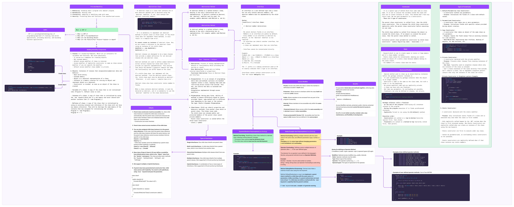

# **`.Net`**


- <details>
    <summary>How to execute C language code?⭐</summary>
    <hr/>
    <p>The program we write in C is called source code.</p>
    <p>The C compiler compiles the source code and generates native code. Usually, this native code can only run on the machine where it was generated, and the operating system executes the code.</p>
    <p>C language Source code > C compiler > Native code > Execute the code</p>
    <p>When a language compiler compiles the source code, it considers two factors:<br/>
      1. Operating System (OS) Architecture<br/>
      2. Processor Architecture
    </p>
    <p>Native code is created so it can be understood by the current processor and the operating system where the code is compiled.</p>
    <hr/>
  </details>
- <details>
    <summary>How did .NET expand to support operating systems other than Windows?⭐</summary>
    <hr/>
    <p>When .NET was first launched by Microsoft in 2002, the .NET Runtime was only available for Windows. However, Microsoft made the specifications for developing the runtime open, <mark><b>allowing third-party companies to create runtimes for other operating systems</b></mark>. This led to the development of the ".NET Framework," starting with version 1.0 and ending with version 4.8.
    </p>
    <hr/>
  </details>
- <details>
    <summary>What is Application Software?⭐</summary>
    <hr/>
    <p><mark><b> Application software refers to programs designed for end-users to perform specific tasks. </b></mark> This includes individual applications like Notepad, Microsoft Word, Excel, or web browsers. Essentially, any program you use on a computer, <mark><b>other than the operating system, is considered application software.</b></mark> Over time, the term has expanded to include mobile apps and complex software environments, highlighting the role of these programs in modern computing.</p>
    <hr/>
  </details>
- <details>
    <summary>Why there are only 3 Generations maintained?⭐</summary>
    <hr/>
    <ul>
    <li>It has been absorbed that in total application lifetime 95% (or) more collections will perform with generation - 0 only</li>
    <li>4 to 5% of collections will be performed with Generation - 0 & Generation - 1</li>
    <li>0 to 1% of collections will be performed with Generation - 0, Generation - 1 & Generation - 2</li>
    </ul>
    <p>Three generations are enough to efficiently manage memory for most applications.</p>
    <hr/>
  </details>
- <details>
    <summary>What is the architecture of .NET Core and what are the two main components of .NET Core?⭐</summary>
    <hr/>
    .NET Core architecture is designed to be cross-platform, enabling applications to build once and run anywhere (Windows, macOS, Linux). It utilizes a modular approach with a component-based architecture, making it suitable for both monolithic and microservices applications.

    <p>The two main components of .NET Core are CoreCLR and CoreFX. CoreCLR is comparable to the Common Language Runtime (CLR) in the .NET Framework, while CoreFX is comparable to the Framework Class Library (FCL).</p>
    <hr/>
  </details>
- <details>
    <summary>What is CoreFX?⭐</summary>
    <hr/>
    
    CoreFX is the set of basic class libraries in .NET Core. It includes types for collections, file systems, console, JSON, XML, and other common functions. It is known as the **Unified Base Class Library** and **includes the `System.namespaces`** (and some Microsoft.namespaces).

    <hr/>
  </details>
- <details>
    <summary>What is Roslyn in the context of .NET development?⭐</summary>
    <hr/>
    <p>
    
    **`Roslyn is the open-source compiler platform for C# and Visual Basic.NET.`** It is `cross-platform and provides rich code analysis APIs, enabling developers to write powerful code analysis and refactoring tools`.
    
    </p>

    Roslyn `provides` a `compiler-as-a-service API for C# and VB.NET`, offering capabilities such as `syntax analysis, semantic analysis, code generation, and refactoring.` It `allows developers to access and manipulate code in a more powerful way than traditional compilers`.

    <hr/>
  </details>
- <details>
    <summary>What are the characteristics of .NET Core?⭐</summary>
    <hr/>
    The key characteristics of .NET Core are:
    <ul>
    <li>Cross-Platform: Runs on Windows, macOS, and Linux.</li>
    <li>Open Source: Available under MIT and Apache 2 licenses.</li>
    <li>Modern: Supports asynchronous programming, no-copy patterns using structs, and resource governance.</li>
    <li>Performance: High performance with features like hardware intrinsics and tiered compilation.</li>
    <li>Consistent Across Environments: Uniform behavior across different OS and architectures.</li>
    <li>Command-Line Tools: Provides easy-to-use CLI tools for development and CI/CD.
    </li>
    <li>Flexible Deployment: Can be installed side-by-side or embedded in apps; compatible with Docker.
    </li>
    </ul>
    <hr/>
  </details>
- <details>
    <summary>Why is .NET Core considered modern?⭐</summary>
    <hr/>
    <p>.NET Core is considered modern because it uses current software development practices like asynchronous programming, no-copy patterns with structs, and resource management for container environments. It also aims for high performance and works across different platforms.</p>
    <hr/>
  </details>
- <details>
    <summary>What is the .NET Core SDK?⭐</summary>
    <hr/>
    <p>The .NET Core SDK (Software Development Kit) includes all the tools and libraries needed to build and run .NET Core applications. It provides:</p>
    <ul>
    <li><b>The .NET Core CLI: </b>Command-line tools for managing and running .NET Core applications.</li>
    <li><b>.NET Core Libraries and Runtime: </b>Essential libraries and the runtime required to execute .NET Core applications.</li>
    <li><b>The dotnet Command: </b>A driver for executing .NET Core commands and managing applications.</li>
    </ul>
    <hr/>
  </details>
- <details>
    <summary>What's the difference between the SDK and Runtime in .NET Core?⭐</summary>
    <hr/>
    <p>The SDK provides all the tools required for development, including the CLI and compilers. <br/>The Runtime is the environment where the application runs, handling the execution of the code and abstracting interaction with the base operating system.</p>
    <hr/>
  </details>
- <details>
    <summary>What is the difference between .NET Core and .NET Framework?⭐</summary>
    <hr/>
    <p>The key differences between .NET Core and .NET Framework are:</p>
    <ul>
    <li><b>Cross-Platform: </b>.NET Core runs on Windows, macOS, and Linux, while .NET Framework is Windows-only.</li>
    <li><b>Open Source: </b>.NET Core is open source with community contributions; .NET Framework is not open to direct community contributions.</li>
    <li><b>Innovation: </b>Most .NET innovation happens in .NET Core.</li>
    <li><b>Deployment: </b>.NET Framework is included in Windows and updated via Windows Update; .NET Core is shipped independently.</li>
    </ul>
    <hr/>
  </details>
- <details>
    <summary>What is the difference between .NET Core and Mono?⭐</summary>
    <hr/>
    <p>Mono is a third-party implementation of the .NET Framework designed to run on Linux, Android, and iOS. .NET Core is Microsoft's own implementation designed to be cross-platform, running on Windows, macOS, and Linux.</p>
    <hr/>
  </details>
- <details>
    <summary>What's the difference between .NET Core, .NET Framework, and Xamarin?⭐</summary>
    <hr/>
    <ul>
    <li><b>.NET Framework: </b>The traditional .NET implementation for Windows, used for desktop and UWP apps, and older ASP.NET applications.</li>
    <li><b>.NET Core: </b>A cross-platform version of .NET for building applications that run on Windows, macOS, and Linux, including Docker containers.</li>
    <li><b>Xamarin: </b>A framework for building mobile apps that run on iOS, Android, and Windows Phone devices.</li>
    </ul>
    <hr/>
  </details>
- <details>
    <summary>What is .NET 5, and why is it significant?⭐</summary>
    <hr/>
    <p>.NET 5 is the next major version of the .NET platform, unifying .NET Core, .NET Framework, Xamarin, and Mono into a single platform. It provides a consistent runtime, API, and language capabilities across all types of applications, simplifying development and improving compatibility. The release marks a significant step towards having a single .NET runtime and framework for all types of development.</p>
    <hr/>
  </details>
- <details>
    <summary>Why did Microsoft skip the version number 4 for .NET 5?⭐</summary>
    <hr/>
    <p>Microsoft skipped version 4 to avoid confusion with the existing .NET Framework, which has been using the 4.x series for a long time. They also wanted to communicate clearly that .NET 5 represents the future of the .NET platform and to simplify the naming by dropping “Core” from the name.</p>
    <hr/>
  </details>
- <details>
    <summary>What benefits does .NET 5 offer to developers?⭐</summary>
    <hr/>
    <p>.NET 5 offers a unified platform that ensures consistency across different types of applications. It provides a single runtime, consistent API, and language capabilities, simplifying the development process. Developers benefit from uniform behaviors, improved performance, and the ability to leverage a single code base for different platforms.</p>
    <hr/>
  </details>
- <details>
    <summary>What does it mean that .NET 5 is built out of a single code base?⭐</summary>
    <hr/>
    <p>Building .NET 5 from a single code base means that both Microsoft and the community can contribute to the development of the platform, enhancing all scenarios and use cases. This approach promotes collaboration and ensures that improvements benefit the entire .NET ecosystem.</p>
    <hr/>
  </details>
- <details>
    <summary>What is Mono, and what is its primary purpose in the .NET ecosystem?⭐</summary>
    <hr/>
    <p>Mono is the original cross-platform implementation of .NET, initially developed as an open-source alternative to the .NET Framework. Over time, it evolved to target mobile devices, particularly iOS and Android, as part of the Xamarin platform. Mono allows developers to build cross-platform applications for mobile and other non-Windows platforms.</p>
    <hr/>
  </details>
- <details>
    <summary>How are Mono and Core CLR similar, and what is the future goal for these runtimes?⭐</summary>
    <hr/>
    <p>Mono and Core CLR are both .NET runtimes, and they share many similarities, such as supporting managed code execution and various .NET libraries. However, each runtime has unique capabilities tailored to different platforms and use cases (e.g., Mono for mobile and Core CLR for cloud and desktop). The future goal is to make Mono and Core CLR interchangeable, allowing developers to easily switch between them using a build option, depending on the specific needs of their applications.</p>
    <hr/>
  </details>
- <details>
    <summary>What is the main difference between Mono and Core CLR?⭐</summary>
    <hr/>
    <p>While both are .NET runtimes, Mono was originally designed for cross-platform compatibility and mobile devices, while Core CLR was designed for cloud applications and has expanded to other uses like desktop and IoT. Mono is part of Xamarin, while Core CLR is the default runtime for .NET Core.</p>
    <hr/>
  </details>
- <details>
    <summary>What is the difference between Procedural Programming and Object-Oriented Programming?⭐</summary>
    <hr/>
    <p>Procedural Programming focuses on functions and procedures, with the main program being the entry point. Object-Oriented Programming uses classes and objects to encapsulate data and methods, providing better security and reusability.</p>
    <hr/>
  </details>
- <details>
    <summary>How does a class differ from a structure in programming?⭐</summary>
    <hr/>
    <p>A class is a user-defined type that can contain both variables and methods, whereas a structure (in C) can only contain variables. Classes support object-oriented features like inheritance and polymorphism, while structures are simpler and generally used for lightweight data.</p>
    <hr/>
  </details>
- <details>
    <summary>What is a class in Object-Oriented Programming?⭐</summary>
    <hr/>
    <p>A class is a blueprint for creating objects. It defines a type that can contain both data (variables) and methods to operate on that data.</p>
    <hr/>
  </details>
- <details>
    <summary>What is the main purpose of the static keyword in Java and C#?⭐</summary>
    <hr/>
    <p>The static keyword is used to define class-level members that can be accessed without creating an instance of the class. For example, the Main method in Java and C# is declared static so that it can be executed without needing to instantiate the class.</p>
    <hr/>
  </details>
- <details>
    <summary>What is a web application & desktop application?⭐</summary>
    <hr/>
    The data which is changing in one system but the modification is done in all other system is called web application.
    <hr/>
    The data which is changing in one system but not affected in other system is called desktop application.
    <hr/>
  </details>
- <details>
    <summary>What are the features that are not available in Java but available in C#?⭐</summary>
    <hr/>
    <ul>The feature that are available in C# but not available in java are: <li>Language Interoperablity</li><li>Pointer,</li><li> Structures,</li><li> Indexes,</li><li> Auto Implemented properties,</li><li> Code access security,</li><li> Explicit interface implementation,</li><li> Multiple Inheritance in C# is more efficient then Java </li><li> Access Modifier are only 4 in jave but in C# 7 access modifiers are avaliable</li></ul>
    <hr/>
  </details>
- <details>
    <summary>What are the standards followed when writing programs by using C# Language?⭐</summary>
    <hr/>
    <ol>
      <li>
      It's a case sensitive language so we need to follow the below rules and conventions:
      <ul>
      <li>All keywords in the language must be in lower case (rule)</li>
      <li>While consuming the libraries, names will be in Pascal Case (rule). E.g.: WriteLine, ReadLine</li>
      <li>While defining our own classes and members to name them we can follow any casing pattern, but Pascal case is suggested (convention)</li>
      </ul>
      </li>
      <li>A C# program should be saved with “.cs” extension</li>
      <li>We can use any name as a file name under which we write the program, but class name is suggested to be used as file name also</li>
      <li>To write programs in C# we use an IDE (Integrated Development Environment) known as Visual Studio but we can also write them by using any text editor like Notepad also.</li>
    </ol>
    <hr/>
  </details>
- <details>
    <summary>What is an Assembly?⭐</summary>
    <hr/>
    An assembly is the output file generated after compiling a project. It contains the Common Intermediate Language (CIL) code of the types defined in the project. An assembly is also a unit of deployment.

  - It’s an output file that is generated after compilation of a project which contains CIL Code in it.
  - Assembly file contains the CIL Code of each type that is defined under the project.
  - An Assembly is a unit of deployment, because when we need to install an application on client machines what we install is these Assemblies only and all the .NET Libraries are installed on our machines in the form of Assemblies when we install Visual Studio.
  - The name of an assembly file is the same name of the project and can’t be changed.
  - In .NET Framework the assembly files of a project will be present under the project folder’s “bin\debug” folder. In .NET Core, assembly file of a project will be present under `bin\debug\netcoreapp<Version>` folder and here version represents the Core Runtime version. From .NET 5, assembly file of a project will be present under `bin\debug\net<Version>` folder and here also version represents the Runtime version.
  - In .NET Framework the extension of an assembly file can either be a “.exe” or “.dll” which is based on the type of project we open, for example if the project is an “Application Project” then it will generate “.exe” assembly whereas if it is a “Library Project” then it will generate “.dll” assembly. From .NET Core every project will generate “.dll” assembly and apart from that “Application Project’s” will generate an additional “.exe” assembly also i.e., “Library Projects” will be generating “.dll” only now also where as “Application Project’s” will generate both “.exe” and “.dll” also.
    <hr/>
  </details>
- <details>
    <summary>What types of assembly files are generated in .NET Framework and .NET Core?⭐</summary>
    <hr/>
    **.NET Framework**:
      - Application projects generate `.exe` assemblies.
      - Library projects generate `.dll` assemblies.
    **.NET Core and above**:
      - Application projects generate both `.exe` and `.dll` assemblies.
      - Library projects generate `.dll` assemblies only.
    <hr/>
  </details>
- <details>
    <summary>Can you consume classes from one project in another project?⭐</summary>
    <hr/>
    Yes, but you need to add a reference to the assembly of the project that contains the class. This is done by right-clicking on the project, selecting "Add" -> "Project Reference", and then browsing to the required assembly.
    <hr/>
  </details>
- <details>
    <summary>What is `ildasm`?⭐</summary>
    <hr/>
    Intermediate Language Dis-Assembler. We use it to dis-assemble an Assembly file and view the contents of it. To check it out, open Visual Studio Developer Command Prompt, go to the location where the assembly files of the project are present and use it as following: `ildasm <name of the .dll assembly file>`.

  **Note**: in .NET Framework we can dis-assemble both “.exe” and “.dll” assemblies also whereas from .NET Core we can dis-assemble only “.dll” assemblies.

  **E.g.**: Open Visual Studio Developer Command Prompt, go to the below location and try the following:

  ```bash
  <drive>:\<our_folder>\OOPSProject\OOPSProject\bin\Debug\net8.0> ildasm OOPSProject.dll
  <drive>:\<our_folder>\OOPSProject\SecondProject\bin\Debug\net8.0> ildasm SecondProject.dll
  ```

    <hr/>
  </details>
- <details>
    <summary>How do you add a reference to an assembly in a project?⭐</summary>
    <hr/>

  To add reference of an assembly to a project open solution explorer, right click on the project to whom reference must be added, select “Add => Project Reference” option, which opens a window “Reference Manager” and in that window select “Browse” option in LHS, then click on “Browse” button below, select the assembly we want to consume from its physical location and click ok. Now we can consume types of that assembly by prefixing with their namespace or importing the namespace.

  **Note**: In .NET Framework we can add reference to “.exe” or “.dll” assemblies also and consume them in other projects, whereas from .NET Core onwards we can’t add reference to “.exe” assemblies i.e., we can add reference only to “.dll” assemblies.

  **Example**:To test this, go to “OOPSProject” Solution, right click on the “SecondProject” we have newly added, select add reference and add the reference of “OOPSProject.dll” assembly from its physical location (`<drive>:\<our_folder>\OOPSProject\OOPSProject\bin\Debug\net8.0>`). Now add a new class under the `“SecondProject”` naming it as “`Class1.cs`” and write the below code in it:

  ```c#
  using OOPSProject;
  internal class Class1
  {
    static void Main()
    {
      Cone cone = new Cone(18.92, 34.12);
      Console.WriteLine($"Area of Cone is: {cone.GetArea()}\n");
      Circle circ = new Circle(45.36);
      Console.WriteLine($"Area of Circle is: {circ.GetArea()}\n");
      Triangle trin = new Triangle(34.98, 27.87);
      Console.WriteLine($"Area of Triangle is: {trin.GetArea()}\n");
      Rectangle rect = new Rectangle(45.29, 76.12);
      Console.WriteLine($"Area of Rectangle is: {rect.GetArea()}\n");
    }
  }
  ```

    <hr/>
  </details>

# **`C-Sharp`**

- <details>
     <summary>What is the diffrence bitween value type and refrence type?⭐</summary>
     <hr/>

  | **Serial Number** | **Value Type**                                                                                       | **Reference Type**                                                                                              |
  | ----------------- | ---------------------------------------------------------------------------------------------------- | --------------------------------------------------------------------------------------------------------------- |
  | 1                 | Data store directly into their memory location.                                                      | Data do not store directly; instead, they refer to another memory location where data is stored.                |
  | 2                 | Memory is allocated at compile time.                                                                 | Memory is allocated at runtime.                                                                                 |
  | 3                 | Memory is allocated done by stack memory allocation.                                                 | Memory is allocated done by dynamic memory allocation.                                                          |
  | 4                 | Placed in stack memory.                                                                              | Placed in heap memory.                                                                                          |
  | 4                 | Memory allocation for value types occurs in `contiguous memory locations in the stack `              | Memory allocation for reference types, it occurs in `non-contiguous (random) memory locations in the heap`.     |
  | 5                 | The CLR does not provide automatic memory management for value types                                 | CLR provides automatic memory management ( such as garbage collection ) for reference types.                    |
  | 6                 | Occupies less memory.                                                                                | Occupies more memory; a single reference type variable can occupy a maximum of up to 2GB.                       |
  | 7                 | If a value type variable is not initialized, it stores a default value (e.g., int a; defaults to 0). | If a reference type variable is not initialized, it stores a null reference (e.g., string s; defaults to null). |
  | 8                 | Examples of value types: `int`, `double`, `enum`, etc.                                               | Examples of reference types: `string`, `object`, `class`, etc.                                                  |

    <hr/>
  </details>

- <details>
    <summary>What is C# and why was it named so?⭐</summary>
    <hr/>
    <p>C# is a general-purpose programming language developed by Microsoft as part of its .NET initiative. The name "C#" was inspired by the musical notation sharp (♯), indicating that the language is an increment or improvement over C++.</p>
    <hr/>
  </details>
- <details>
    <summary>Can you explain the history and evolution of C#?⭐</summary>
    <hr/>
    <p>C# was developed around 2000 by Microsoft, with Anders Hejlsberg as the principal designer. It was initially known as "COOL" before being renamed to C#. It has evolved through several versions, with the most recent being C# 12.</p>
    <hr/>
  </details>
- <details>
    <summary>How do setup, compile & run program in notpaid?⭐</summary>
    <hr/>

    <hr/>
  </details>

- <details>
    <summary>What is the use of the using directive in C#?⭐</summary>
    <hr/>
    The using directive allows you to import a namespace so that you don’t need to prefix the namespace every time you use a type. For example: `using System;`.<br/>
    After importing, you can directly use Console.WriteLine instead of System.Console.WriteLine.
    <hr/>
  </details>
- <details>
    <summary>Why do we declare the Main method as static?⭐</summary>
    <hr/>
    The Main method is declared as static so that it can be called without creating an instance of the class. This is necessary because Main serves as the program's entry point.
    <hr/>
  </details>
- <details>
    <summary>What are the advantages of using namespaces in C#?⭐</summary>
    <hr/>
    <ul>
    <li><b>Grouping related types</b>: Similar types (classes, structures, interfaces) are grouped under a namespace for easier access and identification.</li>
    <li><b>Avoiding naming conflicts</b>: Namespaces help avoid name collisions by allowing similar names to coexist in separate namespaces.</li>
    </ul>
    <hr/>
  </details>
- <details>
    <summary>What is a directive in C#?⭐</summary>
    <hr/>
    A directive is an instruction given to the compiler that it must follow. For example, importing a namespace `using` the using directive tells the compiler where the types used in the program come from.
    <hr/>
  </details>
- <details>
    <summary>What does the using directive do?⭐</summary>
    <hr/>

    The `using` directive imports a namespace, allowing the program to use the types defined in that namespace without needing to prefix them with the namespace name every time.

    <hr/>
  </details>
- <details>
    <summary>What is the using static directive, and why is it used?⭐</summary>
    <hr/>

    The using static directive allows you to import a type and use all of its static members without needing to prefix them with the type name. This was introduced in C# 6.0.

    <br/><br/>

    Use the using static directive when you want to access static members of a class frequently in your code, which can make your code cleaner and easier to read.

    <br/>
    
    Example of the using static directive:
    ```C#
    using static System.Console;
    class Example
    {
        static void Main()
        {
            WriteLine("Using static directive.");
        }
    }
    ```
    In this example, we imported System.Console using the using static directive, allowing us to call WriteLine directly without prefixing it with Console.

    <hr/>
  </details>

- <details>
    <summary>What is the purpose of the semicolon (;) in C#?⭐</summary>
    <hr/>
    <p>It indicates the end of a statement in C#.</p>
    <hr/>
  </details>
- <details>
    <summary>What are the steps for the compilation of a program in Visual Studio?⭐</summary>
    <hr/>
    <ol>
    <li>Click on Build from the top menu.</li>
    <li>Click on Build Solution (Shortcut key: Ctrl + Shift + B).
    <ul>
    <li>At this step, the solution code will be compiled by the C# compiler, and Microsoft Intermediate Language (MSIL) code will be generated.</li>
    </ul>
    </li>
    </ol>
    <hr/>
  </details>
- <details>
    <summary>What is the difference between Read() and ReadLine() in C#?⭐</summary>
    <hr/>

  | Feature         | `Read()    `                                    | `ReadLine()   `                                   |
  | --------------- | ----------------------------------------------- | ------------------------------------------------- |
  | **Function**    | Reads a single character from the input stream. | Reads a line of characters from the input stream. |
  | **Returns**     | ASCII value of the character.                   | The input as a string.                            |
  | **Return Type** | `int`                                           | `string`                                          |
  | **Example**     | int x; x = Console.Read();                      | string inp; inp = Console.ReadLine();             |

    <hr/>
  </details>

- <details>
    <summary>What is the Difference Between Console.Write() and Console.WriteLine() ?⭐</summary>
    <hr/>

    - **`Console.Write()`** : Which is used to print the output & in console window after printing the line the cursor will remain in the same line.
    - **`Console.WriteLine()`** : Which is used to print the output & in console window after printing the line the cursor will move to next line.

    <hr/>
  </details>
- <details>
    <summary>What is the Difference Between Console.Read() and Console.ReadLine() and Console.ReadKey()?⭐</summary>
    <hr/>

    - **`Console.Read()`** : Reads the character from the input stream and returns its ASCII value as an integer. Which is used to read the single character from the console window in the form of character.
    - **`Console.ReadLine()`** : Reads a line of characters from the input stream and returns it as a string. Which is used to read the multiple character from the console window in the form of string.
    - **`Console.ReadKey()`** : Captures and displays a single key press. Which is used to stop console window / Output window until press the any key from the keyboard.

    <hr/>
  </details>
- <details>
    <summary>What is output stream arguments?⭐</summary>
    <hr/>
    
    They are called output stream arguments. They are used in string formatting to insert values into a formatted string. Ex: 
    
    ```C#
    Console.WriteLine("The values of a and b are after swapping = {0}, {1}", a, b)
    ```
    
    </p>
    <hr/>
  </details>
- <details>
    <summary>What data types can output stream arguments be used with?⭐</summary>
    <hr/>
    <p>Output stream arguments can be used with numeric data types (e.g., int, float, double).</p>
    <hr/>
  </details>
- <details>
      <summary>What are the benefits of using output stream arguments in C#?⭐</summary>
      <hr/>

      - **`Memory Efficiency`**: Using output stream arguments can save space in memory.
      - **`Reduced Memory Cost`**: This method reduces the cost of memory by avoiding the need to create multiple string concatenations.

      <hr/>
  </details>
- <details>
    <summary>Datatype?⭐</summary>
    <hr/>

  

    <hr/>
  </details>

- <details>
    <summary>What are the equivalent data types of C# to CTS (Common Type System)?⭐</summary>
    <hr/>
    <ol>
      <li>Integer:
      <ul>
      <li>byte → Byte</li>
      <li>sbyte → SByte</li>
      <li>short → Int16</li>
      <li>int → Int32</li>
      <li>long → Int64</li>
      <li>ushort → UInt16</li>
      <li>uint → UInt32</li>
      <li>ulong → UInt64</li>
      </ul>
      </li>
      <li>Floating Point:
      <ul>
      <li>float → Single</li>
      <li>double → Double</li>
      <li>decimal → Decimal</li>
      </ul>
      </li>
      <li>Logical:
      <ul>
      <li>bool → Boolean</li>
      </ul>
      </li>
      <li>Other:
      <ul>
      <li>char → Char</li>
      <li>IntPtr → IntPtr</li>
      <li>UIntPtr → UIntPtr</li>
      </ul>
      </li>
      <li>Class Objects::
      <ul>
      <li>object → Object</li>
      <li>string → String</li>
      </ul>
      </li>
    </ol>
    <hr/>
  </details>
- <details>
    <summary>What are the ranges and sizes of different C# data types?⭐</summary>
    <hr/>
    <ul>
    <li>sbyte: -128 to 127, Signed 8-bit integer</li>
    <li>byte: 0 to 255, Unsigned 8-bit integer</li>
    <li>char: 0 to 65,535, Unicode 16-bit character</li>
    <li>short: -32,768 to 32,767, Signed 16-bit integer</li>
    <li>ushort: 0 to 65,535, Unsigned 16-bit integer</li>
    <li>int: -2,147,483,648 to 2,147,483,647, Signed 32-bit integer</li>
    <li>uint: 0 to 4,294,967,295, Unsigned 32-bit integer</li>
    <li>long: -9,223,372,036,854,775,808 to 9,223,372,036,854,775,807, Signed 64-bit integer</li>
    <li>ulong: 0 to 18,446,744,073,709,551,615, Unsigned 64-bit integer</li>
    <li>float: ±1.5 × 10^−45 to ±3.4 × 10^38, 32-bit, 7-digit precision</li>
    <li>double: ±5.0 × 10^−324 to ±1.7 × 10^308, 64-bit, 15-digit precision</li>
    <li>decimal: ±1.0 × 10^−28 to ±7.9 × 10^28, 128-bit, 28-digit precision</li>
    </ul>
    <hr/>
  </details>
- <details>
    <summary>What are the different types of operators in C#?⭐</summary>
    <hr/>
    <b>Arithmetic Operators: </b> `+`, `-`, `*`, `/` , `%` <br/>
    <b>Comparison Operators: </b> `<`, `>`, `<=`, `>=`, `==`, `!=`, Type comparison: `is` <br/>
    <b>Assignment Operators: </b> `=`, `+=`, `-=`, `*=`, `/=`, `/=`, `%=` <br/>
    <b>Unary Operators: </b> `++`, `--` <br/>
    <b>Logical Operators: </b> AND: `&&`, OR: `||`, NOT: `!`<br/>
    <hr/>
  </details>
- <details>
    <summary>Which is faster: a = a + 5;, a += 5;, or a++;?⭐</summary>
    <hr/>
    <ul>
    <li>a = a + 5; → Slow, because it involves 5 push & 5 pop operations internally.</li>
    <li>a += 5; → Faster, because it involves 3 push & 3 pop operations internally.</li>
    <li>a++; → Fastest, because it directly increments the value with minimal operations.</li>
    </ul>
    <hr/>
  </details>
- <details>
    <summary>What are the common programming constructs in C#?⭐</summary>
    <hr/>

    **Note**: Constructs refer to basic programming elements or building blocks used to write a program.

    <li><b>Operators: </b>`Operators`</li>
    <li><b>Selections: </b>`if`, `if-else`, `Nested if`, `Multiple ifs`, `if-else ladder` and `switch case`</li>
    <li><b>Iterations: </b>`for loop`, `while loop`,`do-while loop` and `foreach loop`,</li>
    <hr/>
  </details>
- <details>
    <summary>What are functions in programming?⭐</summary>
    <hr/>
    <p>Functions are reusable blocks of code that perform specific tasks. They allow you to write code once and call it whenever needed, promoting code reuse and organization.</p>
    <hr/>
  </details>

### **`Array & Loops`**
- <details>
    <summary>What are the Condition statement?Gice syntax and exaample⭐</summary>
    <hr/>

    - if, if-else, and switch

    ```c#
    //if ,else if & if-else
    int number = 10;
    if (number > 5){
        Console.WriteLine("Number is greater than 5.");
    }
    else if(number > 8){
        Console.WriteLine("Number is greater than 8.");
    }
    else{
        Console.WriteLine("Number is 5 or less.");
    }
    
    // switch example
    char grade = 'B';
    switch (grade) 
    {
        case 'A':
            Console.WriteLine("Excellent!");
            break;
        case 'B':
            Console.WriteLine("Good!");
            break;
        default:
            Console.WriteLine("Grade not found.");
            break;
    }
    ```

    <hr/>
  </details>
- <details>
    <summary>What are the Controller or Jump statement?⭐</summary>
    <hr/>

    `break`, `continue`, and `return`

    <hr/>
  </details>
- <details>
    <summary>What are the iteration or looping statements ?⭐</summary>
    <hr/>

    `for`, `while`, `do-while`, and `foreach`

    <hr/>
  </details>

- <details>
    <summary>What is an array in C#?⭐</summary>
    <hr/>
    
    An array is a user-defined data type used to store same type of multiple values under a single name. It makes it easier for developers to write code, as each element in the array can be accessed using an index. Arrays in C# start with an index of 0 (the lower bound) and end with Size-1 (the upper bound).

    <hr/>
  </details>
- <details>
    <summary>What are the types of arrays in C#?⭐</summary>
    <hr/>
    There are three types of arrays available in C#:
    <ol>
    <li>Single Dimensional Array:
    <ul>
    <li>Stores data in a linear form, like a list.</li>
    <li>Example: int[] numbers = new int[5];</li>
    </ul>
    </li>
    <li>Multi-Dimensional Array:
    <ul>
    <li>Stores data in a table-like format with rows and columns (2D) or even more dimensions.</li>
    <li>Example: int[,] matrix = new int[3, 3]; (2D array with 3 rows and 3 columns).</li>
    </ul>
    </li>
    <li>Jagged Arrays:
    <ul>
    <li>An array of arrays, where each inner array can have a different size.</li>
    <li>Example: int[][] jaggedArray = new int[3][]; (Each sub-array can have different lengths).</li>
    </ul>
    </li>
    </ol>
    <hr/>
  </details>
- <details>
    <summary>What is a single-dimensional array in C#?⭐</summary>
    <hr/>
    <p>A single-dimensional array is an array that contains either a single row or a single column of elements. It is a linear structure where all elements are stored in a contiguous block of memory.</p>
    <hr/>
  </details>
- <details>
    <summary> What are the three methods to declare a single-dimensional array in C#?⭐</summary>
    <hr/>
    <ol>
    <li>Method 1:

    ```C#
    DataType[] ArrayName = new DataType[size];
    ```

    Example:

    ```C#
    int[] A = new int[6];
    A[0] = 40; A[1] = 80; A[2] = 60; A[3] = 10; A[4] = 90; A[5] = 30;
    ```

    </li>
    <li>Method 2:

    ```C#
    DataType[] ArrayName = new DataType[size] {Initialising elements};
    ```

    Example:

    ```C#
    int[] A = new int[6] { 40, 80, 60, 10, 90, 30 };
    ```

    </li>
    <li>Method 3:

    ```C#
    DataType[] ArrayName = new DataType[] {Initialising elements};
    ```

    Example:

    ```C#
    int[] A = new int[] { 40, 80, 60, 10, 90, 30 };
    ```

    </li>
    <li>Method 4:

    **Syntax**:

    ```C#
    <type>[] <array_name> = new <type>[length|size]
    ```
    **Example**:

    ```C#
    int[] arr = new int[5]; //Declaration and Initialization with default values
    //Or
    int[] arr; //Declaration
    arr = new int[5]; //Initialization with default values
    //Or
    int[] arr = { <list of values> }; //Declaration and Initialization with given set of values
    ```

    </li>
    </ol>
    <hr/>
  </details>

- <details>
    <summary>What is a foreach loop in C#?⭐</summary>
    <hr/>
    <p>A foreach loop in C# is used to iterate over the elements of a collection or an array. It is especially useful when the number of elements is not known, or when we want to refer directly to each element without using an index.</p>
    <hr/>
  </details>
- <details>
    <summary>What are the limitations of a foreach loop in C#?⭐</summary>
    <hr/>
    <ul>
    <li>It cannot be used to input elements into the data source.</li>
    <li>It cannot be used to access a specific element by index.</li>
    <li>It cannot iterate through the elements in reverse order.</li>
    </ul>
    <hr/>
  </details>
- <details>
    <summary>D/F for and foreach?⭐</summary>
    <hr/>

  | **Feature**              | **`for` Loop**                                                                                 | **`foreach` Loop**                                                |
  | ------------------------ | ---------------------------------------------------------------------------------------------- | ----------------------------------------------------------------- |
  | **Syntax**               | `for (initialization; condition;    iteration{ ... }`                                          | `foreach (DataType variable in    collection) { ... }`            |
  | **Use Case**             | Used when i know the number index or do complex actions.                                       | Used to iterate over all elements of a collection or array.       |
  | **Index Access**         | Provides access to the index of elements.                                                      | Does not provide access to the index directly.                    |
  | **Modifying Collection** | Allows modification of the elementin the collection.                                           | Modifying the collection while iterating is not recommended.      |
  | **Performance**          | Slightly faster if the size of the collection is known and indexing is needed.                 | Generally slowethan `for` when indexing is required.              |
  | **Flexibility**          | More flexible as it can iterate in any order or direction (forward, backward, specific steps). | Less flexible, only iterates from start to end in order.          |
  | **Ease of Use**          | More complex syntax, especially with nesteloops.                                               | Easier to read and write for simple iterations.                   |
  | **Error-Prone**          | Higher risk of errors such as off-by-onerrors or infinite loops.                               | Lower risk of such errors, as ihandles iteration automatically.   |
  | **Ideal Scenario**       | When you need to know the index or perform complex operations based on the index.              | When you jusneed to iterate through all elements in a collection. |
  | **Fast**                 | Faster                                                                                         | Slow                                                              |

    <hr/>
  </details>

- <details>
    <summary>What is an Array Object in C#?⭐</summary>
    <hr/>
    <p> An Array Object is a variable that holds a collection of values. It is created using a specific data type and size. For example, int[] A = new int[6]; creates an array of integers with 6 elements.</p>
    <hr/>
  </details>
- <details>
    <summary>What are some methods available for an Array Object?⭐</summary>
    <hr/>
    <ol>
    <li><b>CopyTo(ArrayName, int Index)</b>:<br/> Copy elements from one array to another array. <br/>Example:"A.CopyTo(B, 0);` copies elements from A to B starting at index 0."</li>
    <li><b>GetLength(int Dimension)</b>:<br/> Finde the length of array in a given dimension.<br/>Example:"A.GetLength(0); returns the number of elements in array A."</li>
    <li><b>GetValue(int Index)</b>:<br/> Retrieves the value at a specified index in the array<br/>Example:"A.GetValue(2); returns the value at index 2 of array A."</li>
    </ol>
    <hr/>
  </details>
- <details>
    <summary>What are some properties available for an Array Object?⭐</summary>
    <hr/>
    <p><b>Length:</b> Returns the total number of elements in the array.<br/>Example: "A.Length; returns the size of array A".</p>
    <p><b>Rank:</b> Returns the number of dimensions in the array.<br/>Example: "Example: A.Rank; returns the number of dimensions of array A.".</p>
    <hr/>
  </details>
- <details>
    <summary>What is the Array Class in C#?⭐</summary>
    <hr/>
    <p>The Array Class provides static methods for manipulating arrays, such as copying, sorting, and searching.</p>
    <hr/>
  </details>
- <details>
    <summary>What are some methods available in the Array Class?⭐</summary>
    <hr/>
    <ul>
    <li>Copy(Source_array, int Source_Index, Destination_array, int Destination_Index, int length)</li>
    <li>BinarySearch(Array, int Index, int Length, Object_value)</li>
    <li>Clear(Array, int Index, int Length)</li>
    <li>IndexOf(Array, Object_value)</li>
    <li>LastIndexOf(Array, Object_value)</li>
    <li>Reverse(array)</li>
    </ul>
    <hr/>
  </details>
- <details>
    <summary>What is the use of Copy() method which is availabe in the Array Class? Give me syntax, example, use?⭐</summary>
    <hr/>
    <ul>
    <li>Copies a specified number of elements from one array to another.</li>
    <li>Syntax: Copy(Source_array, int Source_Index, Destination_array, int Destination_Index, int length)</li>
    <li>Example: Array.Copy(A, 0, B, 4, 7); copies 7 elements from array A to array B starting at index 4.</li>
    </ul>

  ```C#
    int[] A = new int[7] { 40, 90, 60, 20, 10, 30, 50 };
    int[] B = new int[13];
    A.CopyTo(B, 0);
  ```

    <hr/>
  </details>

- <details>
    <summary>What is the use of Clear() method which is availabe in the Array Class? Give me example, use?⭐</summary>
    <hr/>
    <ul>
    <li>Clears a range of elements in an array by setting them to their default values.</li>
    <li>Syntax: Clear(Array, int Index, int Length)</li>
    <li>Example: Array.Clear(B, 4, 7); clears elements from index 4 to 10 in array B.</li>
    </ul>

    ```C#
      Array.Clear(B, 4, 7);
    ```

    <hr/>
  </details>

- <details>
    <summary>What diffrence bitween Copy() & Clone() method?⭐</summary>
    <hr/>

  1. **Purpose**:

     - **Copy**: `Copies elements from one array to another`. It can be used to `copy all` or a `portion` of the `array` to `another array`.
     - **Clone**: Creates a `shallow copy` of the array. It `returns a new array` with the `same elements and size as the original`.

  2. **Shallow vs. Deep Copy**:

     - **Copy**: Does not automatically perform a deep copy. If you're using reference types (e.g., objects), `Copy` only copies references, not the actual objects.
     - **Clone**: Performs a shallow copy. The new array created will have the same references as the original. For value types (like integers), it copies the values.

  3. **Usage**:
     - **Copy**: `Array.Copy(sourceArray, destinationArray, length);` — You specify the source array, destination array, and the number of elements to copy.
     - **Clone**: `array.Clone();` — Creates a new array that’s a copy of the original.

  **Summary**:

  - **Copy** lets you copy elements to another array, either partially or fully.
  - **Clone** creates a new array with the same size and elements as the original, but it does not create independent copies for reference types.

  **Example**:

  ```csharp
  int[] originalArray = { 1, 2, 3, 4, 5 };

  // Using Clone method
  int[] clonedArray = (int[])originalArray.Clone();
  // clonedArray is a separate array with the same elements {1, 2, 3, 4, 5}

  // Using Copy method
  int[] copiedArray = new int[3];
  Array.Copy(originalArray, copiedArray, 3);
  // copiedArray now contains {1, 2, 3} (only the first 3 elements are copied)
  ```

  **Key points**:

  - `Clone` creates a new array with all elements.
  - `Copy` copies specified elements to an existing array.

    <hr/>
  </details>

- <details>
    <summary>What is the use of IndexOf() method which is availabe in the Array Class? Give me example, use?⭐</summary>
    <hr/>
    <ul>
    <li>Returns the index of the first occurrence of a specified value in the array.</li>
    <li>Syntax: IndexOf(Array, Object_value)</li>
    <li>Example: Array.IndexOf(A, 30); finds the first index of the value 30 in array A.</li>
    </ul>
    <hr/>
  </details>
- <details>
    <summary>What is the use of LastIndexOf() method which is availabe in the Array Class? Give me example, use?⭐</summary>
    <hr/>
    <ul>
    <li>Returns the index of the last occurrence of a specified value in the array.</li>
    <li>Syntax: LastIndexOf(Array, Object_value)</li>
    <li>Example: Array.LastIndexOf(A, 30); finds the last index of the value 30 in array A.</li>
    </ul>
    <hr/>
  </details>
- <details>
    <summary>What is the use of Reverse() method which is availabe in the Array Class? Give me example, use?⭐</summary>
    <hr/>
    <ul>
    <li>Reverses the order of elements in an array.</li>
    <li>Syntax: Reverse(array)</li>
    <li>Example: Array.Reverse(A); reverses the elements in array A.</li>
    </ul>

  ```C#
    Array.Reverse(A);
  ```

    <hr/>
  </details>

- <details>
    <summary>What is the use of Short() method which is availabe in the Array Class? Give me example, use?⭐</summary>
    <hr/>
    <ul>
    <li>Sorts the elements of an array in ascending order.</li>
    <li>Syntax: Sort(Array)</li>
    <li>Example: Array.Sort(A); sorts the elements of array A.</li>
    </ul>

    ```C#
      Array.Sort(A);
    ```

    <hr/>
  </details>
- <details>
    <summary>How to use CopyTo, GetLength() & GetValue()?⭐</summary>
    <hr/>

  ```C#
  static void Main()
  {
    int[] A = new int[7] { 40, 90, 60, 20, 10, 30, 50 };
    int[] B = new int[13];
    Console.Write("Elements of A = ");
    foreach(int i in A)
    {
        Console.Write(i + " ");
    }

    // Copy elements of A to B
    A.CopyTo(B, 0);
    Console.Write("\nElements of B = ");
    foreach (int i in B)
    {
        Console.Write(i + " ");
    }
    // Display Array properties
    Console.Write("\nLength of array A = " + A.GetLength(0));
    Console.Write("\nValue at 2nd index = " + A.GetValue(2));
  }
  ```

    <hr/>
  </details>

- <details>
    <summary>What is the difference between Length and GetLength in an array?⭐</summary>
    <hr/>

  1. **Length**:

     - **Definition**: Returns the total number of elements in all dimensions of an array.
     - **Usage**: It is used when you want to know the total count of elements.
     - **Example**:
       ```csharp
       int[,] numbers = { { 1, 2 }, { 3, 4 }, { 5, 6 } };
       int totalElements = numbers.Length; // totalElements = 6
       ```

  2. **GetLength(int dimension)**:
     - **Definition**: Returns the number of elements in a specified dimension of an array.
     - **Usage**: It is used when you want to know the size of a particular dimension.
     - **Example**:
       ```csharp
       int[,] numbers = { { 1, 2 }, { 3, 4 }, { 5, 6 } };
       int rows = numbers.GetLength(0); // rows = 3 (1st dimension)
       int columns = numbers.GetLength(1); // columns = 2 (2nd dimension)
       ```

  **Summary**:

  - `Length` gives the total count of elements.
  - `GetLength` gives the count of elements in a specific dimension of the array.

    <hr/>
  </details>

- <details>
    <summary>What is 2 dimension Arrays?⭐</summary>
    <hr/>

    -  These arrays will store data in the form of rows & columns, and are declared as following:

  **Syntax**:

  ```c#
    <type>[,] <array_name> = new <type>[rows, columns]
  ```

  **Example**:

  ```c#
  int[,] arr = new int[4,5]; //Declaration and Initialization with default values

  //or

  int[,] arr; //Declaration
  arr = new int[4,5]; //Initialization with default values

  //or

  int[,] arr = { <list of values> }; //Declaration and Initialization with given set of values
  ```

  **Example**:

  ```c#
  using System;
  class TDArray
  {
    static void Main()
    {
      int x = 0; int[,] arr = new int[4, 5];

      //Accessing values of TD Array by using foreach loop
      foreach(int i in arr)
      Console.Write(i + " ");
      Console.WriteLine();

      //Assigning values to TD Array by using nested for loop
      for(int i=0;i<arr.GetLength(0);i++) {
        for(int j=0;j<arr.GetLength(1);j++) {
          x += 5; arr[i,j] = x;
        }
      }
      //Accessing values of TD Array by using nested for loop
      for(int i=0;i<arr.GetLength(0);i++) {
        for(int j=0;j<arr.GetLength(1);j++)
          Console.Write(arr[i,j] + " ");
        Console.WriteLine();
      }
    }
  }

  //Out:-
  int[,] arr = {
    { 11, 12, 13, 14, 15 },
    { 21, 22, 23, 24, 25 },
    { 31, 32, 33, 34, 35 },
    { 41, 42, 43, 44, 45 }
  };

  ```

    <hr/>
  </details>

- <details>
    <summary>How many ways to inslize value in 2 dimension array?⭐</summary>
    <hr/>
    <ol>
    <li><b>Method 1:- </b>
    
    ```c#
    //Syntax Declare array:
    DataType[ , ] ArrayName = new DataType [RowSize, ColumnSize];

  //Example:
  Int[ , ] A = new int[3, 4];
  A[0, 0] = 60; A[0, 1] = 35; A[0, 2] = 90; A[0, 3] = 15;
  A[1, 0] = 50; A[1, 1] = 80; A[1, 2] = 25; A[1, 3] = 70;
  A[2, 0] = 40; A[2, 1] = 65; A[2, 2] = 20; A[2, 3] = 10;

  ```

  

  </li>
  <li><b>Method 2:- </b>

  ```c#
  //Syntax Declare array:
  DataType[ , ] ArrayName = new DataType [RowSize, ColumnSize]{{Row1_elements},{Row2_elements},............};

  //Example:
  Int[ , ] A = new int[3, 4] { { 60, 35, 90, 15 },{ 50, 80, 25, 70 },{ 40, 65, 20, 10 } }
  ```

  

    </li>
    <li><b>Method 3:- </b>

  ```c#
  //Syntax Declare:
  DataType[ , ] ArrayName = new DataType [ , ]{{Row1_elements},{Row2_elements},............};

  //Example:
  Int[ , ] A = new int[ , ] { { 60, 35, 90, 15 },{ 50, 80, 25, 70 },{ 40, 65, 20, 10 } };
  ```

  

    </li>
    
    </ol>
    <hr/>
  </details>

- <details>
    <summary>How many way to inslize Jagged array?⭐</summary>
    <hr/>
    <ol>
    <li><b>Method-1</b><br/>

    Syntax: DataType[Main Array Notation][Inner Array Notation]<br/>Example: ArrayName = new DataType[Main Array Size][inner Array Notation];

    

    ```c#
    int[][] A = new int[3][];
    A[0] = new int[6];
    A[1] = new int[5];
    A[2] = new int[8];

    A[0][0] = 60; A[0][1] = 15; A[0][2] = 30; A[0][3] = 80; A[0][4] = 20; A[0][5] = 70;
    A[1][0] = 25; A[1][1] = 45; A[1][2] = 15; A[1][3] = 85; A[1][4] = 55;
    A[2][0] = 20; A[2][1] = 80; A[2][2] = 65; A[2][3] = 75; A[2][4] = 35; A[2][5] = 30;
    A[2][6] = 80; A[2][7] = 10;
    ```

    </li>
    <li><b>Method-2</b><br/>

    **Syntax**: DataType[Main Array Notation][Inner Array Notation]<br/>
    ArrayName = new DataType[Main Array Size][inner Array Notation];

  

    ```C#
    int[][] A = new int[3][];
    A[0] = new int[6] { 60, 15, 30, 80, 20, 70 };
    A[1] = new int[5] { 25, 45, 15, 85, 55 };
    A[2] = new int[8] { 20, 80, 65, 75, 35, 30, 80, 10 };
  ```

    </li>
    <li><b>Method-3</b><br/>

    **Syntax**: DataType[Main Array Notation][Inner Array Notation]<br/>
    ArrayName = new DataType[Main Array Size][inner Array Notation];

    

    ```C#
    int[][] A = new int[][]
    {
        new int[] { 60, 15, 30, 80, 20, 70 },
        new int[] { 25, 45, 15, 85, 55 },
        new int[] { 20, 80, 65, 75, 35, 30, 80, 10 }
    };

    ```

    → In Real time Jagged array used in Card games & Maximally used in Gaming application.<br/>
    → When Inner array size is changing then we use Jagged array

    </li>
    </ol>
    <hr/>
  </details>

- <details>
    <summary>Give me example of using Jagger array?⭐</summary>
    <hr/>
    
    ```C#
    using System;
    using System.Collections.Generic;
    using System.Linq;
    using System.Text;
    using System.Threading.Tasks;
    namespace Class_Programs
    {
      class Program_48
      {
        static void Main()
        {
          int[][] A = new int[3][];
          A[0] = new int[6] { 60, 15, 30, 80, 20, 70 };
          A[1] = new int[5] { 25, 45, 15, 85, 55 };
          A[2] = new int[8] { 20, 80, 65, 75, 35, 30, 80, 10 };
          for(int R = 0; R < A.Length; R++)
          {
            for(int C = 0; C < A[R].Length; C++)
            {
              Console.Write(A[R][C] + " ");
            }
            Console.WriteLine();
          }
          Console.ReadKey();
        }
      }
    }
    ```

    <hr/>
  </details>

### **`Type casting`**

- <details>
    <summary>What are the two types of type casting supported in C#?⭐</summary>
    <hr/>
    C# supports:
    <li>Data Type Widening</li>
    <li>Data Type Shortening</li>
    <hr/>
  </details>
- <details>
    <summary>What is data type widening?⭐</summary>
    <hr/>
    <p>Data type widening is converting a variable from a lower type to a higher type. In this process:</p>
    <ol>
    <li>The memory size of the variable increases.</li>
    <li>The value range that the variable can store also increases.</li>
    </ol>

  **Example**:

  ```c#
  short a = 20;
  int b = a;        // Implicit Conversion
  int c = (int)a;   // Explicit Conversion
  ```

  In type widening, both implicit and explicit conversions are possible.
    <hr/>
  </details>

- <details>
    <summary>What is data type shortening?⭐</summary>
    <hr/>
    Data type shortening is converting a variable from a higher type to a lower type. In this process:
    <ol>
    <li>The memory size of the variable decreases.</li>
    <li>The value range that the variable can store also decreases.</li>
    <ol>

  **Example**:

  ```c#
  int a = 20;
  short b = a;         // Implicit Conversion not possible
  short c = (short)a;  // Explicit Conversion is possible
  ```

  In type shortening, only explicit conversion is possible.
    <hr/>
  </details>

- <details>
    <summary>Why is implicit conversion not possible in type shortening?⭐</summary>
    <hr/>

    Implicit conversion is not possible in type shortening because the runtime must know how much memory and value size should be reduced. The `developer` must `specify` this `explicitly` using `explicit casting to ensure safe conversion`.

    <hr/>
  </details>
- <details>
    <summary>What is the object type in C#?⭐</summary>
    <hr/>

    In C#, object is a reference type that can store any kind of data—whether it's an integer, a float, a string, or a boolean. Every data type in C# derives from the object class.

    Examples of different data stored in an object:

    ```C#
    object a = 10;         // Storing an integer
    object b = 20.5;       // Storing a double
    object c = "Welcome";  // Storing a string
    object d = true;       // Storing a boolean
    ```

    <hr/>
  </details>

- <details>
    <summary>What is the difference between storing data in an "object" vs "specific type (e.g., int)"?⭐</summary>
    <hr/>
    <p>When you store data in an object type:</p>
    <li>The actual data type is not known until runtime.</li>
    <li>You need to explicitly convert it back to its original data type if you want to perform operations on it.</li><br/>
    When you store data in a specific type like int, you can directly perform arithmetic or other operations without needing any conversion.
    <hr/>
  </details>
- <details>
    <summary>Can you perform operations directly on data stored in an object type?⭐</summary>
    <hr/>
    <p>No, you cannot directly perform operations on data stored in an object type. To do so, you must first convert it to its original data type using type conversion.</p>
    <hr/>
  </details>
- <details>
    <summary>How do you perform operations on data stored in an object?⭐</summary>
    <hr/>

    You need to convert the object data to its actual type before performing operations. Here's an example:

    ```c#
    object x = 10, y = 20;
    object z = Convert.ToSingle(x) + Convert.ToSingle(y);
    Console.WriteLine(z);
    ```

    In this example, we use Convert.ToSingle() to convert the object variables x and y to float before adding them.

    <hr/>
  </details>

- <details>
    <summary>Why is type conversion necessary for object types when performing operations?⭐</summary>
    <hr/>

    Type conversion is necessary because the object type can store any kind of data, and the compiler does not know the actual data type at compile time. To ensure safe operations, you must explicitly convert it to the correct type at runtime.

    <hr/>
  </details>
- <details>
    <summary>What is Boxing in C#?⭐</summary>
    <hr/>

    Boxing is the process of converting a "value type" (e.g., int, float, char) to a "reference type" (specifically, an object). For example:

    ```c#
    int a = 10;
    object O = a;    // Implicit Boxing
    object X = (object)a;    //Explicit Boxing
    ```

    <hr/>
  </details>

- <details>
    <summary>What is Unboxing in C#?⭐</summary>
    <hr/>

    Unboxing is the process of converting a "boxed variable (stored as an object)" back to its "original value type". For example:

    ```c#
    object O = 10;
    int b = (int)O;  // Explicit Unboxing
    ```

    <hr/>
  </details>

- <details>
    <summary>What is the difference between Implicit and Explicit Boxing?⭐</summary>
    <hr/>

    Implicit Boxing happens automatically when you assign a value type to an object. Example:

    ```c#
    int a = 10;
    object O = a;  // Implicit Boxing
    ```

    Explicit Boxing is when you manually cast a value type to an object. Example:

    ```c#
    int a = 10;
    object O = (object)a;  // Explicit Boxing
    ```

    <hr/>
  </details>

- <details>
    <summary>What type of conversion is supported by Unboxing?⭐</summary>
    <hr/>

    Unboxing supports only explicit conversion. You need to explicitly cast the object to the desired value type:

    ```c#
    object O = 10;
    int b = (int)O;  // Explicit Unboxing
    ```

    <hr/>
  </details>

- <details>
    <summary>What are the internal steps performed during Boxing?⭐</summary>
    <hr/>
    <ol>
    <li>The value type data is searched in the stack.</li>
    <li>A copy of this data is made in the heap.</li>
    <li>The address of this copied data is stored in the reference type (object variable).</li>
    </ol>
    <hr/>
  </details>
- <details>
    <summary>What happens internally during Unboxing?⭐</summary>
    <hr/>
    <ol>
    <li>The reference type data is searched in the heap.</li>
    <li>A copy of this data is made in the stack.</li>
    </ol>
    <hr/>
  </details>
- <details>
    <summary>Why is Boxing & Unboxing considered more costly than normal initialization?⭐</summary>
    <hr/>

    Boxing is costly because it involves copying the value from the stack to the heap, which takes more time and memory. It is said to be 20 times costlier than normal initialization.<br/><br/>
    Unboxing is 4 times costlier than normal initialization because it involves copying the value from the heap back to the stack.

    <hr/>
  </details>
- <details>
    <summary>When should you use Boxing and Unboxing?⭐</summary>
    <hr/>

    Use Boxing and Unboxing only when necessary. They might be suitable in scenarios where other operations (like fetching data from a database or over a network) are even costlier. In general, avoid boxing and unboxing to maintain performance.

    <hr/>
  </details>
- <details>
    <summary>What is the key difference between Boxing and Unboxing?⭐</summary>
    <hr/>
    
    | **Boxing** | **Unboxing** |
    |------------|--------------|
    | Converts a value type to a reference type. | Converts a reference type (boxed variable) back to a value type. |
    | Supports both implicit and explicit boxing. | Supports only explicit unboxing. |
    | 20 times costlier than normal initialization.	| 4 times costlier than normal initialization.|

    <hr/>
  </details>

- <details>
    <summary>What is the nullable data type?⭐</summary>
    <hr/>

    - Nullable types allow value types to store `null`.
    - Declared by adding ? to the data type (e.g., `int?`, `double?`).
    - Useful for representing missing or undefined values.
      For example if we want to store the null value in `int` then it will raise the compilation error, so to avoid the compilation error we use `?` postfix with data type (ex: int? a = null;).

    ```c#
    int? age = null;   // Nullable int
    double? salary = null;   // Nullable double
    bool? isAvailable = null;   // Nullable bool
    ```

  <br/><br/>

  If you use `?` it means this us nullable.

    <hr/>
  </details>

- <details>
    <summary>What are the ways of Type Casting ?⭐</summary>
    <hr/>

  **Four main ways** to perform type casting (also known as type conversion):

  1. **Implicit Casting (Automatic Conversion)**

     - Automatically converts a smaller type to a larger type, like `int` to `double`.
     - No data is lost, so no additional code is needed.
     - Example:
       ```csharp
       int num = 10;
       double result = num; // Implicit casting from int to double
       ```

  2. **Explicit Casting (Manual Conversion)**

     - Required when converting from a larger type to a smaller type or between incompatible types.
     - Uses a cast operator `(Type)` and may lose data.
     - Example:
       ```csharp
       double num = 10.5;
       int result = (int)num; // Explicit casting from double to int
       ```

  3. **Conversion with Helper Classes (Using Convert Class)**

     - Converts different types using helper methods in the `Convert` class, which is safer and helps prevent errors.
     - Example:
       ```csharp
       string str = "123";
       int result = Convert.ToInt32(str); // Convert string to int
       ```

  4. **Using `as` and `is` Operators (for Reference Types)**
     - **`as`**: Casts an object to a specific type, returning `null` if it fails (no exception thrown).
       ```csharp
       object obj = "hello";
       string str = obj as string; // Works since obj is a string
       ```
     - **`is`**: Checks if an object is of a certain type, returning `true` or `false`.
       ```csharp
       object obj = "hello";
       if (obj is string)
       {
           string str = (string)obj; // Safe to cast
       }
       ```

    <hr/>
  </details>

### **`OOPs`**



- <details>
    <summary> What are the two main programming approaches used in the industry?⭐</summary>
    <hr/>
    <p>Procedural Programming Approach</p>
    <p>Object-Oriented Programming (OOP) Approach</p>
    <hr/>
  </details>
- <details>
    <summary>What is Instance variable? ⭐</summary>
    <hr/>
    Non static variable or Field area called Instance variable.
    
    ```c#
      public class Car
      {
          // Instance variables (fields)
          public string Make;
          public string Model;
          public int Year;
          public void CallMethods(){}
      }
    ```

    <hr/>
  </details>

- <details>
    <summary>What is instance and Refrence "Car car1 = new Car();"?⭐</summary>
    <hr/>
    <ul>
      <li><b>Reference Variable: </b>`car1` is a reference variable of type `Car`. It holds the address of the `Car` instance.
      </li>
      <li>
        <b>Instance: </b>The object created by `new Car()` is the instance. This instance has its own state and behavior defined by the `Car` class.
      </li>
    <ul>

    ```c#
    Car car1 = new Car();
    //or
    new Car().CallMethods(); // Un-named instance calling CallMethods
    ```

    <hr/>
  </details>
- <details>
    <summary>Is it posible to contain  `non-static` member in a static class?⭐</summary>
    <hr/>

    - A `static` class cannot have `non-static` members.

    - You `cannot create` an `instance` of a `static class`.

    `Static class only contains static members`.

    <hr/>
  </details>
- <details>
    <summary>What is `this` keyword?⭐</summary>
    <hr/>

    - Refers to the current `instance` of the class.  It `acts as a reference` to the current object, allowing access to the object's members (fields, properties, methods) and constructors.<br/><br/>

    - It is used to differentiate between instance variables and parameters or local variables with the same name.<br/><br/>

    - `this` used to return the current object from a method.

    <br/>
    <br/>
    
    - **Scope**: The this keyword can only be used within non-static methods and constructors, as it refers to an instance of the class.

    - Static methods do not have an instance context and therefore cannot use this.

    - **Contextual Clarity**: Using this is not mandatory when referring to instance members unless there is a naming conflict with parameters or local variables.

    - However, some developers prefer using this consistently for clarity.

    <br/>
    
    More Explanation: [Link](https://codecomponents.hashnode.dev/advance-c-sharp-proggramming-language?t=1721797919621#heading-this-keyword)
    <hr/>
  </details>
- <details>
    <summary>What is constructor chaining?⭐</summary>
    <hr/>

    Using the 'this' keyword, you can call another constructor within the same class by matching the number and types of parameters are called constructor chaining.

    ```c#
    class A
    {
       public A() : this("mritunjay"){ }
       public A(string nam)
       {
           Console.WriteLine(nam);
       }
    }
    ```

    <hr/>
  </details>
- <details>
    <summary>What happens when an object to the class is created?⭐</summary>
    <hr/>
    
    When an object of a class is created, the following tasks happen internally:

      1. **Memory Allocation**: Memory is allocated for the class’s data fields (variables) on the heap.

      2. **Default Values Assigned**: Each field is initialized with default values:

        - int, float, double: 0

        - bool: false

        - string and reference types: null

      3. **Constructor Invocation**: If a constructor is defined, it gets called to initialize the object.

      4. **Object Reference**: A reference (or pointer) to the newly created object is returned and stored in the variable representing the object.

    <hr/>
  </details>

- <details>
    <summary>What is Clear methods?⭐</summary>
    <hr/>

  - **Clear**: `System.Console.Clear()`

    - Clears the console screen, removing all previous outputs.

    - Bu using This method we can preform `Input output (IO)` operations on the standard `IO` devices.

        <hr/>

  </details>

- <details>
    <summary>What is Literals?⭐</summary>
    <hr/>
    
    - **Literals** are the fixed values in a program.

  - Types of literals include **integer, floating-point, character, string, boolean, and null**.

  - You can use various **suffixes** to specify the type of a literal (e.g., f for float, m for decimal).

  - **Verbatim string literals** (using `@`) allow easy formatting of strings with escape characters.

    <hr/>
  </details>

- <details>
    <summary>What is Nullable value type?⭐</summary>
    <hr/>

    - **Nullable value types** were introduced in C# 2.0 to allow value types to store null values.

    - By default, **value types** (like `int`, `decimal`) cannot store `null` values, whereas **reference types** (like `string`, `object`) can store `null`.

    Example:

    ```c#
    string str = null;  // Valid
    object obj = null;  // Valid
    int i = null;       // Invalid (for regular int)
    decimal d = null;   // Invalid (for regular decimal)
    ```

    - To make a value type nullable, suffix the type with a `?` symbol:

    ```c#
    int? i = null;     // Valid
    decimal? d = null; // Valid
    ```

    <hr/>
  </details>

- <details>
    <summary>What is the diffrence bitween Var and Dunamic type?⭐</summary>
    <hr/>
    
    | **Feature**                              | **var**                                                                                         | **dynamic**                                                                                       |
    |------------------------------------------|-------------------------------------------------------------------------------------------------|---------------------------------------------------------------------------------------------------|
    | **Type identification**                  | Performed at **compilation time**.                                                              | Performed at **runtime**.                                                                          |
    | **Type flexibility**                     | Once the type is identified, it **cannot be changed** to a new type.                             | The type can be **changed** to a new type with every statement.                                    |
    | **Example of type change**               | `var v = 100;  // v is of type int`                           | ` dynamic d = 100;  // d is of type int `      |
    |                                          | `v = 34.56; // Invalid`                                       | `d = 34.56; // d is of type double (Valid)`    |
    | **Initialization requirement**           | Must be initialized at the time of declaration.                                                 | Initialization at declaration is **optional**.                                                     |
    | **Example of initialization**            | ` var v;  // Invalid`                                                                           | ` dynamic d;  // Valid `                                     |
    |                                          |                                                                                                 | ` d = 100; // d is of type int`                                     |
    | **Type flexibility (Multiple changes)**  | The type cannot change once assigned.                                                           | Can change to a different type with each new value.                                                |
    | **Use cases**                            | Can only be used for **variables**.                                                             | Can be used for **variables** and **fields**.                                                      |
    | **Example of multiple type changes**     | N/A                                                                                             | `d = false; // d is of type bool                                                                 ` |
    |                                          |                                                                                                 | `d = "Hello"; // d is of type string` |
    |                                          |                                                                                                 | `d = 34.56; // double` |

    <hr/>
  </details>

- <details>
    <summary>What is the Parse() method used for?⭐</summary>
    <hr/>

  - The `Parse()` method is used to convert the string representation of a value to its equivalent **data type.**

  - Example conversions:

          ```c#
          string s1 = "100";
          int i = int.Parse(s1);   // Converts to int

          string s2 = "34.56";
          double d = double.Parse(s2);   // Converts to double

          string s3 = "true";
          bool b = bool.Parse(s3);   // Converts to bool

          ```

        <hr/>

  </details>

- <details>
    <summary>What are the different ways to format strings in C#?⭐</summary>
    <hr/>
    
    1. **Concatenation**:

  ```c#
  Console.WriteLine("Sum of " + d1 + " & " + d2 + " is: " + d3);
  ```

  2. **String composite formatting**:

  ```c#
  Console.WriteLine("Sum of {0} & {1} is: {2}", d1, d2, d3);
  ```

  3. **String interpolation (introduced in C# 6.0)**:

  ```c#
  Console.WriteLine($"Sum of {d1} & {d2} is: {d3}");
  ```

    <hr/>
  </details>
- <details>
    <summary>What are the different types of operators in C#?⭐</summary>
    <hr/>

  - C# provides a rich set of built-in operators, such as:

    1. **Arithmetic Operators**: `+`, `-`, `*`, `/`, `%`
    2. **Assignment Operators**: `=`, `+=`, `-=`, `*=`, `/=`, `%=`
    3. **Relational Operators**: `==`, `!=`, `<`, `<=`, `>`, `>=`
    4. **Logical Operators**: `&&`, `||`, `!`
    5. **Unary Operators**: `++`, `--`
    6. **Miscellaneous Operators**: `sizeof()`(returns the size of a data type in bytes), `typeof()`(returns the type of a class or a data type), `is`, `as`, `?: (Ternary)`, `?? (Coalesce)`


        <hr/>

  </details>
- <details>
    <summary>What does the `is` operator do?⭐</summary>
    <hr/>
    The `is` operator checks if an object is of a specified type.
    ```c#
    object obj1 = 34.56;
    if (obj1 is double)
        Console.WriteLine("d is of type System.Double");  // Output: d is of type System.Double
    ```
    <hr/>
  </details>
- <details>
    <summary>What is the as operator?⭐</summary>
    <hr/>
    The `as` operator attempts to **cast** an object to a specific **type** and returns `null` if the cast is not valid, instead of throwing an exception.

  ```c#
  object obj2 = "Hello World";
  string str3 = obj2 as string;  // Output: str3 is "Hello World"
  ```

    <hr/>
  </details>

- <details>
    <summary>What are the different ways of converting an object to a string?⭐</summary>
    <hr/>
    
    There are three common ways:

  1. Explicit cast: `string str2 = (string)obj2;`
  2. Using the as operator:: `string str3 = obj2 as string;`
  3. Using ToString() method: `string str4 = obj2.ToString();`
    <hr/>
  </details>

- <details>
    <summary>What is the null-coalescing (??) operator?⭐</summary>
    <hr/>
    The null-coalescing operator (??) returns the left-hand operand if it's not null; otherwise, it returns the right-hand operand.

  ```c#
  string Country1 = null;
  string Country2 = null;
  Console.WriteLine(Country1 ?? Country2);  // Output: null

  Country2 = "India";
  Console.WriteLine(Country1 ?? Country2);  // Output: India

  Country1 = "America";
  Console.WriteLine(Country1 ?? Country2);  // Output: America

  ```

    <hr/>
  </details>

- <details>
    <summary>What are the some Arry Class and Properties?⭐</summary>
    <hr/>

  This is a pre-defined class under the “System” namespace which provides with a set of members in it to perform actions on an array, those are:

  ```c#
  // Initialize a one-dimensional array
  int[] numbers = { 5, 3, 8, 2, 6 };

  // Display the original array
  Console.WriteLine("Original Array: " + string.Join(", ", numbers)); // Original Array: 5, 3, 8, 2, 6
  ```

  1. **`Sort(Array arr)`** => void

     - This method is used to sort the elements in a one-dimensional array.

     ```c#
     // Sort the array
     Array.Sort(numbers);
     Console.WriteLine("Sorted Array: " + string.Join(", ", numbers)); //Sorted Array: 2, 3, 5, 6, 8
     ```

  2. **`Reverse(Array arr)`** => void

     - This method is used to reverse the sequence of elements in a one-dimensional array.

     ```c#
     // Reverse the array
     Array.Reverse(numbers);
     Console.WriteLine("Reversed Array: " + string.Join(", ", numbers)); //Reversed Array: 8, 6, 5, 3, 2
     ```

  3. **`Copy(Array source, Array target, int n)`** => void

     - This method is used to `copy the first` `n` `elements` from the `source array` to the `target array`.

     ```c#
     // Copy the first 3 elements into a new array
     int[] copiedArray = new int[3];
     Array.Copy(numbers, copiedArray, 3);
     Console.WriteLine("Copied Array (First 3 elements): " + string.Join(", ", copiedArray)); // Copied Array: 8, 6, 5
     ```

  4. **`Clone()`** => Object

     - This method is used to create a shallow copy of the array.

     ```c#
     // Clone the array
     int[] clonedArray = (int[])numbers.Clone();
     Console.WriteLine("Cloned Array: " + string.Join(", ", clonedArray)); // Cloned Array: 8, 6, 5, 3, 2

     ```

  5. **`GetLength(int dimension)`** => int

     - This method is used to get the number of elements in the specified dimension of the array.

     ```c#
     // Get the length of the array
     Console.WriteLine("Array Length: " + numbers.GetLength(0)); // Array Length: 5
     ```

  6. **`Length`** => int

     - This property returns the total number of elements in all dimensions of the array.

     ```c#
     // Get the total length of the array
     Console.WriteLine("Total Array Length: " + numbers.Length); // Total Array Length: 5
     ```

  7. **`IndexOf(Array array, Object value)`** => int

     - This method is used to search for an object and returns the index of its first occurrence in a one-dimensional array.

     ```c#
     // Find the index of an element
     int index = Array.IndexOf(numbers, 8);
     Console.WriteLine("Index of 8: " + index); // Index of 8: 0
     ```

    <hr/>
  </details>

- <details>
    <summary>How to convert string to character array and char array to string?⭐</summary>
    <hr/>

  ```c#
    string str = "Mritunjay Kumar";

    //convert string into char arrat
    char[] c = str.ToCharArray();//{'M','r','i','t','u','n','j',}

    //Convert char array into string
    string newStr = new string(c);
  ```

    <hr/>
  </details>

- <details>
    <summary>What are command line arguments in C#?⭐</summary>
    <hr/>
    Command line arguments are values passed by the user or programmer to the Main method of a C# program when it is executed. These values are provided via the command prompt and can be used within the program.
    <hr/>
  </details>
- <details>
    <summary> How does the Main method accept command line arguments?⭐</summary>
    <hr/>
    The Main method accepts an array of strings as command line arguments, which is defined as string[] args. Each argument passed to the program is stored as an element of this array.

  ```c#
  static void Main(string[] args)
  ```

    <hr/>
  </details>

- <details>
    <summary>Can you give an example of passing command line arguments to a program?⭐</summary>
    <hr/>
    
    - Suppose you have the following program:

  ```c#
  using System;
  class Params
  {
      static void Main(string[] args)
      {
          foreach (string str in args)
          {
              Console.WriteLine(str);
          }
      }
  }
  ```

  - If the program is executed in the command prompt as:

  ```cmd
  <drive>:\CSharp> Params 100 Hello 34.56 A true ⏎
  ```

  - The arguments `100`, `Hello`, `34.56`, `A`, and true are captured in the args array and printed on the console.
    <hr/>
  </details>

- <details>
    <summary>Can we pass different types of values (int, double, string) as command line arguments?⭐</summary>
    <hr/>
    
    - Yes, you can pass any type of values (e.g., int, double, string, bool) as arguments, but they will be stored in the program as strings. You'll need to convert them into their respective types inside the program.

    <hr/>
  </details>

- <details>
    <summary>Can we pass multiple command line arguments?⭐</summary>
    <hr/>
    Yes, you can pass multiple arguments, separated by spaces, when running the program. The number of arguments is stored in args.Length.
    <hr/>
  </details>
- <details>
    <summary>What is the issue if multiple classes have Main methods in a C# project?⭐</summary>
    <hr/>
    When there are multiple Main methods in different classes within a project, the compiler does not know which one to use as the `entry point`, leading to an error that there are multiple entry points.
    <hr/>
  </details>

- <details>
    <summary>What is the difference between variables and objects?⭐</summary>
    <hr/>
    Variables are copies of scalar types (like int, float, char, and bool), while objects are copies of complex types that you define, such as Student and Employee. For example:

  - `int i`; is a copy of the predefined type int (variable).
  - `Student ss`; is a copy of the user-defined type Student (object).
    <hr/>
  </details>
- <details>
    <summary>What are the user-defined type "members" in a "class" in C#?⭐</summary>
    <hr/>

  - Fields

  - Methods

  - Constructors

  - Finalizers

  - Properties

  - Indexers

  - Events( Means Call the function)

  - De-constructors (Introduced in C# 7.0)

    <hr/>
  </details>

- <details>
    <summary>Give me the example of a user-defined return type in a method?⭐</summary>
    <hr/>
     The return type of a method is not necessary have to be a predefined type. It can also be a user-defined type, which represents a complex data structure.

  ```c#
  namespace OOPSProject
   {
       class Emp // User-defined class
       {
           public int? Id; // Nullable int
           public string? Name; // Nullable string
           public string? Job; // Nullable string
           public double? Salary; // Nullable double
           public bool? Status; // Nullable bool
       }

       class UserDefinedTypes
       {
           public Emp GetEmpDetails(int Id) // Method returning a user-defined type
           {
               Emp emp = new Emp(); // Creating an instance of Emp
               emp.Id = Id;
               emp.Name = "Raju";
               emp.Job = "Manager";
               emp.Salary = 50000.00;
               emp.Status = true;
               return emp; // Returning the user-defined type
           }

           static void Main()
           {
               UserDefinedTypes udt = new UserDefinedTypes(); // Creating an instance of UserDefinedTypes

               Emp obj = udt.GetEmpDetails(1001); // Calling GetEmpDetails
               Console.WriteLine(obj.Id + " " + obj.Name + " " + obj.Job       + " " + obj.Salary + " " + obj.Status);
               Console.ReadLine();
           }
       }
   }

  ```

  - **Emp** is a user-defined class that encapsulates employee details.

  - The `GetEmpDetails` method returns an instance of the Emp class, demonstrating the use of a user-defined return type.
    <hr/>
  </details>

- <details>
    <summary>What are the classifications of method parameters?⭐</summary>
    <hr/>
    Method parameters are classified into three types:

      1. **Input Parameters**: Bring values into the method for execution.

      2. **Output Parameters**: Carry results out of the method after execution.

      3. **InOut Parameters**: Combine both input and output; they bring a value in for execution and return a result out.

    <hr/>
  </details>

- <details>
    <summary>How are input, output, and InOut parameters declared?⭐</summary>
    <hr/>
    
    - By default, every parameter is an input parameter.

  - To declare an output parameter, prefix it with the out keyword.

  - To declare an InOut parameter, prefix it with the ref keyword.

  ```c#
    public void Test(int a, out int b, ref int c)
  ```

    <hr/>
  </details>

- <details>
    <summary>What is `ref` Parameters? Give example.⭐</summary>
    <hr/>
    ```c#
    using System;

  namespace Practice
  {
  internal class Program
  {
  //Create method:-
  static void CallByValueRefrence(ref int x)
  {
  x = 100;
  Console.WriteLine("InSide methof value of x is:-"+x); //100
  }
  static void Main(string[] args)
  {
  int a = 10;
  Console.WriteLine("value a before calling method: "+a);//10
  CallByValueRefrence(ref a);
  //Affact the `a` value in hear.
  Console.WriteLine("value a after calling method: "+a);//100
  }
  }
  }

  ```

  - When we use the `ref` keyword in an argument and parameter, it affects the original value. This is because `ref` passes a reference to the value, so any changes to x in `CallByValueReference` will affect the original value.

  <hr/>
  </details>

- <details>
    <summary>What is `out` Parameters? Give example.⭐</summary>
    <hr/>
    By using out, you can effectively return multiple values from a method, leveraging both the method's return value and the out parameters.

  ```c#
  internal class OutPutParameters
  {
      public void Math1(int a, int b, out int c, out int d)
      {
          c = a + b; // Output parameter for sum
          d = a * b; // Output parameter for product
      }

      // Introduced in C# 7.0: Tuples
      public (int, int) Math2(int a, int b)
      {
          int c = a + b;
          int d = a * b;
          return (c, d);
      }

      static void Main()
      {
          OutPutParameters p = new OutPutParameters();
          int Sum1, Product1;

          p.Math1(100, 25, out Sum1, out Product1);
          Console.WriteLine("Sum of the given numbers is: " + Sum1);
          Console.WriteLine("Product of the given numbers is: " + Product1 + "\n");

          p.Math1(100, 25, out int Sum2, out int Product2); // C# 7.0 feature
          Console.WriteLine("Sum of the given numbers is: " + Sum2);
          Console.WriteLine("Product of the given numbers is: " + Product2 + "\n");

          (int Sum3, int Product3) = p.Math2(100, 25);
          Console.WriteLine("Sum of the given numbers is: " + Sum3);
          Console.WriteLine("Product of the given numbers is: " + Product3 + "\n");

          var (Sum4, Product4) = p.Math2(100, 25);
          Console.WriteLine("Sum of the given numbers is: " + Sum4);
          Console.WriteLine("Product of the given numbers is: " + Product4 + "\n");
          Console.ReadLine();
      }
  }

  ```

  The out keyword is used to pass a reference to a variable and wait for the method to assign a value to it. If you want to use out, you must use the out keyword in both the argument and the parameter. Additionally, the out parameter must be assigned a value before the method returns.

    <hr/>
  </details>

- <details>
    <summary>What are tuples in C#?⭐</summary>
    <hr/>
    A tuple is a data structure used to return multiple values from a method. It was introduced in C# 7.0 and can hold a set of values.

    ```c#
    public (int, string) GetPersonInfo()
    {
        return (25, "Alice");  // Returns multiple values as a tuple
    }

    public void DisplayInfo()
    {
        var info = GetPersonInfo();
        Console.WriteLine($"Age: {info.Item1}, Name: {info.Item2}");
    }

    ```

    **GetPersonInfo** returns a tuple with an int and a string value.
    **DisplayInfo** retrieves and displays these values using info.Item1 and info.Item2.

    <hr/>
  </details>
- <details>
    <summary>Can you provide an example of `InOut` parameters?⭐</summary>
    <hr/>
    ```c#
    internal class InOutParameters
    {
        public void Factorial(ref uint a)
        {
            if (a == 0 || a == 1)
            {
                a = 1;
            }
            else
            {
                uint result = 1;
                for (uint i = 2; i <= a; i++)
                {
                    result *= i;
                }
                a = result; // Set a to the calculated factorial
            }
        }

        static void Main()
        {
            InOutParameters obj = new InOutParameters();
            uint f = 5;
            Console.WriteLine("Value of f before execution of the method: " + f);
            obj.Factorial(ref f);
            Console.WriteLine("Value of f after execution of the method: " + f);
            Console.ReadLine();
        }

  }

  ```
  <hr/>
  </details>

- <details>
    <summary>What does the `params` keyword do in a method?⭐</summary>
    <hr/>
    The `params` keyword allows a method to accept a variable number of arguments. You can call the method without explicitly creating an array and pass a comma-separated list of values.

  The params keyword lets a method take a variable number of arguments. You can pass a list of arguments to the method, and they will be treated as an array inside the method. This is helpful when you don't know in advance how many arguments you will pass.

  **Example**:

  ```c#
  public void AddParams(params double[] args)
  ```

  **Usage of `WriteLine` method**:

  ```c#
  Console.WriteLine("{0} * {1} = {2}", x, i, x * i);
  ```

  - A method can have only one params parameter, and it must be the last parameter in the method signature.

  ```c#
  using System;

  namespace Practice
  {
      internal class Program
      {
          // Create method using `params` keyword
          static void PrintNumbers(params int[] numbers)
          {
              Console.WriteLine("Inside method, printing numbers:");
              foreach (int number in numbers)
              {
                  Console.WriteLine(number);
              }
          }

          static void Main(string[] args)
          {
              // Calling the method with a variable number of arguments
              PrintNumbers(1, 2, 3, 4); // Output: 1, 2, 3, 4
              PrintNumbers(10, 20); // Output: 10, 20
              PrintNumbers(); // No output as no arguments were passed
          }
      }
  }

  ```

  **Note**: When using the `params` keyword:

  1. It can only be used on one parameter of the method.
  2. It must be the last parameter of that method.
    <hr/>
  </details>

- <details>
    <summary>In method signature which position use params?⭐</summary>
    <hr/>
    When we use the params keyword in a method parameter, it allows the method to accept a variable number of arguments. This means you can pass multiple arguments to the method, and they will be treated as an array inside the method. If you want to use params, it must be the last parameter in the method signature, and you can only have one params parameter per method.

  In params parameter, when you pass the argument and you want to send diffrent type of.

  ```c#
  // 01: Example: Correct way to use
  static void PrintNumbers(string s2, params int[] numbers)
  {}
  static void Main(string[] args)
  {
      PrintNumbers("string",1, 2, 3, 4);
  }
  // 02: Example: Correct way to use
  static void PrintNumbers(int i, params int[] numbers)
  {}
  static void Main(string[] args)
  {
      PrintNumbers(100, 1, 2, 3, 4);
  }

  // 02: Example: Wrong way to use
  static void PrintNumbers(params int[] numbers, string s2,)
  {}
  static void Main(string[] args)
  {
      PrintNumbers(1, 2, 3, 4,"string");
  }
  // 03: Example: Wrong way to use
  static void PrintNumbers(params int[] numbers, int i,)
  {}
  static void Main(string[] args)
  {
      PrintNumbers(1, 2, 3, 4, 100);
  }

  ```

    <hr/>
  </details>

- <details>
    <summary>What is the diffrence bitween ref and out parameter?⭐</summary>
    <hr/>
    Here is the difference between `ref` and `out` parameters in a table format:

  | **Feature**                    | **ref Parameter**                                                                           | **out Parameter**                                                                       |
  | ------------------------------ | ------------------------------------------------------------------------------------------- | --------------------------------------------------------------------------------------- |
  | **Initialization before call** | The variable **must** be initialized before being passed.                                   | The variable **does not need** to be initialized before being passed.                   |
  | **Reading initial value**      | The method **can read** the initial value of the parameter.                                 | The method **cannot read** the initial value because it is assumed to be uninitialized. |
  | **Assigning a value**          | The method **can modify** the existing value, but it is not required to assign a new value. | The method **must assign** a value to the parameter before returning.                   |
  | **Typical Use**                | Used when the method needs to read and modify the value passed in.                          | Used when the method is expected to return a value, without needing an initial value.   |

  **Example: `ref`**

  ```csharp
  static void Main()
  {
      int number = 10; // Must be initialized
      Console.WriteLine("Before calling ModifyRef: " + number); // Outputs 10
      ModifyRef(ref number);
      Console.WriteLine("After calling ModifyRef: " + number); // Outputs 20
  }

  static void ModifyRef(ref int x)
  {
      x = x + 10; // Modifies the original value
  }
  ```

  **Example: `out`**

  ```csharp
  static void Main()
  {
      int number; // No need to initialize
      Console.WriteLine("Before calling AssignOut: uninitialized");
      AssignOut(out number);
      Console.WriteLine("After calling AssignOut: " + number); // Outputs 30
  }

  static void AssignOut(out int x)
  {
      x = 30; // Must assign a value before returning
  }
  ```

    <hr/>
  </details>

- <details>
    <summary>Can it is also possible to send arguments with the "key: value" formate?⭐</summary>
    <hr/>
    It is also possible to send arguments with the key: value syntax. That way, the order of the arguments does not matter:

  **Example**:

  ```c#
  static void MyMethod(string child1, string child2, string child3)
  {
    Console.WriteLine("The youngest child is: " + child3);
  }

  static void Main(string[] args)
  {
    MyMethod(child3: "John", child1: "Liam", child2: "Liam");
  }

  // The youngest child is: John
  ```

    <hr/>
  </details>

- <details>
    <summary>How to passing an array to a method & Return an array from a method?⭐</summary>
    <hr/>
    **`Pass an array to a method`**: you provide the method with the array reference. The method can then access and modify the elements of the array.

  **syntex**:-`ReturnType MethodName(DataType[] arrayParameter) { // Method body }`
  **Example**:

  ```c#
  class Program
  {
      // Method that takes an array as a parameter and prints its elements
      static void PrintArray(int[] array)
      {
          foreach (int item in array)
          {
              Console.WriteLine(item);
          }
      }

      static void Main()
      {
          int[] numbers = { 1, 2, 3, 4, 5 };
          PrintArray(numbers);
      }
  }
  ```

  **`Returning an Array from a Method`**: The return type of the method should be the array type.

  **syntex**:-`DataType[] MethodName() { // Method body that creates and returns an array }`
  **Example**:

  ```c#
  class Program
  {
      // Method that returns an array of integers
      static int[] GenerateArray(int size)
      {
          int[] array = new int[size];
          for (int i = 0; i < size; i++)
          {
              array[i] = i * 2; // Just an example of initialization
          }
          return array;
      }

      static void Main()
      {
          int[] generatedArray = GenerateArray(5);

          // Print the returned array
          foreach (int item in generatedArray)
          {
              Console.WriteLine(item);
          }
      }
  }
  ```

    <hr/>
  </details>

- <details>
    <summary>What is de-referencing an instance?⭐</summary>
    <hr/>
    De-referencing occurs when you assign `null` to an instance. After de-referencing, the instance cannot be used to access class members. For example:

  ```c#
  First f = new First();
  f = null;  // De-referencing the instance
  ```

    <hr/>
  </details>

- <details>
    <summary>What happens when null is assigned to a reference?⭐</summary>
    <hr/>
    When `null` is assigned to a reference, it loses access to the memory it was pointing to. However, if the instance still exists, it can be accessed using other references. For example:

  ```c#
  First f1 = new First();
  First f2 = f1;
  f1 = null;  // f1 is now null, but f2 still accesses the instance
  Console.WriteLine(f2.x);  // Valid, prints the value of x
  ```

    <hr/>
  </details>

- <details>
    <summary>What is the diffrence bitween Variable of class, Instance of class and Reference of a class?⭐</summary>
    <hr/>

  Difference between a **variable**, **instance**, and **reference** of a class in table format:

  | **Aspect**            | **Variable of a Class**                                   | **Instance of a Class**                                                | **Reference of a Class**                                                                      |
  | --------------------- | --------------------------------------------------------- | ---------------------------------------------------------------------- | --------------------------------------------------------------------------------------------- |
  | **Definition**        | A copy of the class that is declared but not initialized. | A copy of the class that is initialized using `new`.                   | A pointer to an existing instance of a class.                                                 |
  | **Memory Allocation** | No memory is allocated.                                   | Memory is allocated when the instance is created.                      | Does not allocate memory, uses the instance's memory.                                         |
  | **Usage**             | Cannot be used to access class members.                   | Can be used to access and modify class members.                        | Can be used to access and modify class members.                                               |
  | **Initialization**    | Declared, but not initialized. Example: `First f;`        | Initialized using `new`. Example: `First f = new First();`             | Initialized by pointing to an instance. Example: `First f2 = f1;`                             |
  | **Effect on Members** | Cannot affect members since it's uninitialized.           | Each instance has its own memory, changes in one do not affect others. | Changes made through a reference affect the original instance, and vice versa.                |
  | **De-referencing**    | Not applicable (no memory to de-reference).               | Can be de-referenced by assigning `null`, making it unusable.          | If `null` is assigned, the reference can't be used, but the original instance remains intact. |
  | **Example**           | `First f;`                                                | `First f = new First();`                                               | `First f2 = f1;`                                                                              |

    <hr/>
  </details>
#### **`Constructor`**
- <details>
    <summary>What are the two categories of class members?⭐</summary>
    <hr/>
    Class members are divided into two categories:

  1. **Non-Static or Instance Members**: These members require an instance of the class for initialization and execution.

  2. **Static Members**: These members do not require an instance of the class for initialization and execution; they belong to the class itself.

    <hr/>
  </details>
- <details>
    <summary>Can static fields be initialized through a constructor?⭐</summary>
    <hr/>

    Yes, `static` fields `can` be initialized through a constructor, but this is generally avoided. Static fields are shared among all instances of the class, and each new instance would overwrite the old value if initialized through the constructor.

    <hr/>
  </details>

- <details>
    <summary>What is a readonly field, and how is it different from a constant field?⭐</summary>
    <hr/>

    A **readonly field** is declared using the `readonly` keyword and can be initialized either at the time of declaration or within a constructor. `Once initialized, it cannot be modified`. Unlike constants, readonly fields can have different values for each instance of a class. In contrast, constant fields hold a fixed value for the entire class.

  Example:

  ```c#
  readonly bool flag; // Declaration
  public Fields(int x, bool flag)
  {
      this.flag = flag; // Initialized in constructor
  }
  ```

    <hr/>
  </details>

- <details>
    <summary>What is the Difference bitween Constant & Readonly fields?⭐</summary>
    <hr/>

    - **Constant fields**: Single fixed value for the whole class.

    - **Readonly fields**: Value can vary each instance but cannot be changed after initialization.

    The difference between constant and readonly fields is constant is a single fixed value for the whole class whereas readonly is a fixed value specific to each instance of the class.

    <hr/>
  </details>

- <details>
    <summary>When are static, constant, non-static, and readonly fields initialized?⭐</summary>
    <hr/>
    
    - **Static fields**: Initialized once when the class is first loaded, and they maintain a **single copy** throughout the class's **lifecycle**. They are **modifiable**. 
    
    - **Constant fields**: Initialized once when the class is first loaded, but they are not modifiable.
    
    - **Non-static fields**: Initialized each time an instance of the class is created, and they are modifiable.
    
    - **Readonly fields**: Initialized either at declaration or in a constructor, and they maintain a separate copy for each instance but cannot be modified after initialization.

    **Note**: While accessing fields of a class from other classes use class name for accessing static and constant fields whereas use instance of class for accessing non-static and readonly fields

    <hr/>
  </details>

- <details>
    <summary>How can you access static, constant, and non-static fields in or outside of the class?⭐</summary>
    <hr/>

    - **Static fields**: Accessed using the class name directly (inside or outside the class).

    - **Constant fields**: Accessed using the class name directly (inside or outside the class).

    - **Non-static fields**: Accessed using an instance of the class (inside or outside the class).

    <hr/>
  </details>

- <details>
    <summary>What is the diffrence bitwee static & non-static Constructor?⭐</summary>
    <hr/>
    - **Static constructor**: Called once when the class is loaded; cannot have parameters.

    - **Non-static constructor**: Called each time an instance is created; can have parameters.

    | **Feature**                                       | **Non-Static Constructor**                        | **Static Constructor**                                    |
    | ------------------------------------------------- | ------------------------------------------------- | --------------------------------------------------------- |
    | **Declaration**                                   | Regular constructor, no `static` keyword          | Declared with the `static` keyword                        |
    | **Call Type**                                     | Called explicitly when creating an instance       | Called implicitly, no need to create an instance          |
    | **Purpose**                                       | Initializes non-static and readonly fields        | Initializes static and constant fields                    |
    | **Execution Timing**                              | Executed when an instance of the class is created | Executed once when the class is first accessed            |
    | **Execution Frequency**                           | Called every time a new instance is created       | Called only once during the class's lifecycle             |
    | **Parameterized**                                 | Can have parameters                               | Cannot be parameterized                                   |
    | **Execution Order**                               | Executed after the static constructor (if any)    | First block of code to execute in the class               |
    | **Presence in Class with No Constructor Defined** | Automatically added by the compiler unless static | Only added by the compiler if the class has static fields |
    | **Use Case Example**                              | `Constructors()`                                  | `static Constructors()`                                   |

    **`Example Scenarios`**:

    1. **Case 1: No Fields**

       ```csharp
       class Test {}
       ```

       _After compilation_: A non-static constructor will be added.

    2. **Case 2: Non-Static Field**

       ```csharp
       class Test { int i = 10; }
       ```

       _After compilation_: A non-static constructor will be added.

    3. **Case 3: Static Field**

       ```csharp
       class Test { static int i = 100; }
       ```

       _After compilation_: Both static and non-static constructors will be added.

    4. **Case 4: Static Class with No Fields**

       ```csharp
       static class Test {}
       ```

       _After compilation_: No constructor will be added.

    5. **Case 5: Static Class with Static Field**
       ```csharp
       static class Test { static int i = 100; }
       ```
       _After compilation_: A static constructor will be added.

    <hr/>
  </details>

- <details>
    <summary>What is a static class in C#, and how does it work?⭐</summary>
    <hr/>
    A static class is a class `declared` with the `static` keyword. It can only `contain static members`, and you `cannot create an instance` of a static class. Static classes are `not required to have instances because all their members belong to the class itself`. The `Console` class is a well-known example of a `static class`.

    Example:

    ```c#
    static class Class1
    {
        // Static members only
    }
    ```

    **Note**: `Console` is a static class in our `Libraries` so every member of `Console` class is a `static` member only and to check that, right click on `Console` class in `Visual Studio` and choose the option “`Go to definition`” which will open `“Metadata”` or `“Source Code”` of that class.

    <hr/>
  </details>

- <details>
    <summary>What is an entity in the context of application development?⭐</summary>
    <hr/>
    An entity is any living or non-living object that has a set of attributes associated with it. Entities are fundamental components in application development, and they represent real-world objects in the application. Each entity can be a student, teacher, customer, employee, etc., depending on the application. Entities are managed and handled during application development.

    **Example**:

    - In a **School Application**, entities could include: `Student`, `Teacher`, and `Book`.
    - In a **Retail Business Application**, entities could include: `Customer`, `Employee`, `Product`, and `Supplier`.

    <hr/>
  </details>

- <details>
    <summary>How do you identify the attributes of an entity?⭐</summary>
    <hr/>
    The attributes of an entity are the characteristics or properties associated with that entity. For each identified entity, you list out the specific attributes. These attributes become the fields (columns) in a database table.

    Example:-

    - **Student** entity attributes: `Id`, `Name`, `Address`, `Phone`, `Class`, `Section`, `Fees`, `Marks`, `Grade`.
    - **Teacher** entity attributes: `Id`, `Name`, `Address`, `Phone`, `Qualification`, `Subject`, `Salary`, `Designation`.
    - **Customer** entity attributes: `Id`, `Name`, `Address`, `Phone`, `Balance`, `Account Type`, `EmailId`, `PanCard`, `Aadhar`.

    <hr/>
  </details>
- <details>
    <summary>How do you design an application to manage entities and their attributes?⭐</summary>
    <hr/>
    To design an application that manages entities and attributes, follow these steps:

    1. **Define a class** for each entity.
    2. Each **property** in the class should represent an attribute of the entity.
    3. Each **instance** of the class should represent a unique instance of the entity.

    **Example**: For the `Student` entity, you would define a class like this:

    ```c#
    class Student
    {
        public int Id { get; set; }
        public string Name { get; set; }
        public string Address { get; set; }
        public string Phone { get; set; }
        public string Class { get; set; }
        public string Section { get; set; }
        public decimal Fees { get; set; }
        public int Marks { get; set; }
        public string Grade { get; set; }
    }
    ```

    <hr/>
  </details>

#### **`Inheritance`**

- <details>
    <summary>How do you define and test inheritance in C#?⭐</summary>
    <hr/>

    To define inheritance, you create a child class that extends the parent class using the colon **`:`** symbol. The child class can then consume the public or protected members of the parent class.

    Example:

    ```c#
    internal class Class1
    {
        public Class1()
        {
            Console.WriteLine("Class1 constructor is called.");
        }

        public void Test1()
        {
            Console.WriteLine("Method 1");
        }

        public void Test2()
        {
            Console.WriteLine("Method 2");
        }
    }

    internal class Class2 : Class1
    {
        public Class2()
        {
            Console.WriteLine("Class2 constructor is called.");
        }

        public void Test3()
        {
            Console.WriteLine("Method 3");
        }

        public void Test4()
        {
            Console.WriteLine("Method 4");
        }

        static void Main()
        {
            Class2 c = new Class2();
            c.Test1(); // Inherited from Class1
            c.Test2(); // Inherited from Class1
            c.Test3(); // Defined in Class2
            c.Test4(); // Defined in Class2
            Console.ReadLine();
        }
    }

    /*Output:
    Class1 constructor is called.
    Class2 constructor is called.
    Method 1
    Method 2
    Method 3
    Method 4
    */
    ```

    <hr/>
  </details>

#### **`Polymorphism`**

- <details>
    <summary>Diffrence bitween Method Overloading vs Method Overriding⭐</summary>
    <hr/>

    | **Aspect**              | **Method Overloading**                                         | **Method Overriding**                                                                 |
    | ----------------------- | -------------------------------------------------------------- | ------------------------------------------------------------------------------------- |
    | **Definition**          | Multiple methods with the same name but different parameters   | A child class re-implements a parent class's method with the same name and parameters |
    | **Where performed**     | Can be performed within a class or across parent-child classes | Only between parent-child classes                                                     |
    | **Permission required** | No permission from parent class needed                         | Parent class must declare the method as `virtual` for overriding                      |
    | **Behavior**            | Provides multiple behaviors for a method                       | Changes the behavior of a method defined in the parent class                          |

    <hr/>
  </details>
- <details>
    <summary>Can we re-implement any parent classes methods under the child classes without declaring them as virtual?⭐</summary>
    <hr/>

    Yes, this can be done through:

  - **Overriding** (requires the method to be virtual)

  - **Hiding/Shadowing** (works even if the parent method is not virtual)

    <hr/>
  </details>
- <details>
    <summary>What approaches are available to call parent class methods from the child class after re-implementing them?⭐</summary>
    <hr/>

    **There are two ways**:
      1. `Create a parent class instance`:
        You can call parent methods directly.
        ```c#
        LoadParent p = new LoadParent();
        p.Show();    // Calls parent class Show method
        p.Display(); // Calls parent class Display method
        ```
      
      2. **Use the base keyword**:
        The `base` keyword allows the child class to call methods from the parent class.
        ```c#
        public void PShow()
        {
            base.Show(); // Calls parent class Show method
        }
        
        public void PDisplay()
        {
            base.Display(); // Calls parent class Display method
        }
        ```

    **Note**: - **LoadParent** - `public void Test()` - `public virtual void Show()` - `public void Display()`

      - **LoadChild : LoadParent**
        - `public void Test(int i)` => Overloading
        - `public override void Show()` => Overriding
        - `public new void Display()` => Hiding/Shadowing

      - Earlier in the 3rd rule of inheritance we have learnt that parent class reference even if created by using child class instance can’t access any members of the child class which are purely defined under child class but we have an exemption for that rule, that is, parent’s reference can call or access overridden members of the child class because overridden members are not considered as pure child class members because they have been re-implemented with permission from the parent class.

    <hr/>
  </details>
- <details>
    <summary>What are the differences between Static and Dynamic Polymorphism?⭐</summary>
    <hr/>

    | **Static Polymorphism**             | **Dynamic Polymorphism**                               |
    | ----------------------------------- | ------------------------------------------------------ |
    | Occurs at compile-time              | Occurs at runtime                                      |
    | Achieved through method overloading | Achieved through method overriding                     |
    | Inheritance is not required         | Inheritance is required                                |
    | Happens within the same class       | Happens between parent-child classes                   |
    | Does not require reference creation | Requires parent class reference through child instance |

    <hr/>
  </details>

#### **`Sealed Class & Method`**

- <details>
    <summary>What is a Sealed Class?⭐</summary>
    <hr/>

    A Sealed Class is a class that is declared using the `sealed` modifier, which `prevents` it from being inherited by other classes. For example:

    ```c#
    sealed class Class1
    {
       // Members
    }
    ```

    In this example, Class1 is a sealed class, meaning it cannot be used as a base class for inheritance.
    
    <hr/>
  </details>
- <details>
    <summary>Can a Sealed Class be inherited?⭐</summary>
    <hr/>

    No, a Sealed Class cannot be inherited by any other class. Attempting to inherit from a sealed class results in a compile-time error. For example:`class Class2 : Class1 => Invalid`.

    Here, `Class2` attempting to inherit `Class1` will be invalid since `Class1` is sealed.

    <hr/>
  </details>

- <details>
    <summary>Can the members of a Sealed Class be used in other classes?⭐</summary>
    <hr/>

    Yes, the members of a Sealed Class can still be used in other classes by creating an instance of the sealed class. For example:`String str = new String("example");`

    ```c#
    // Define a sealed class
    public sealed class Logger
    {
        public void LogMessage(string message)
        {
            Console.WriteLine($"Log: {message}");
        }
    }

    // Another class that uses the sealed class
    public class Application
    {
        public void Start()
        {
            // Create an instance of the sealed class
            Logger logger = new Logger();

            // Use the member of the sealed class
            logger.LogMessage("Application has started.");
        }
    }
    ```
    
    Here, `String` is a sealed class, **`but you can still create an instance of it and use its members`**.

    <hr/>
  </details>
- <details>
    <summary>What is a Sealed Method?⭐</summary>
    <hr/>

    A Sealed Method is a method that, `once declared`, `cannot be overridden` in `any derived class`. **`By default, methods in a class are sealed`** `unless they are explicitly declared` **`virtual`**. A sealed method is used to stop further overrides of a method in a derived class.

    <hr/>
  </details>
- <details>
    <summary>Can any method of a class be overridden by a child class?⭐</summary>
    <hr/>

    No, only methods that are explicitly marked as `virtual` in the parent class can be overridden by a child class. Methods that are not `virtual` cannot be overridden. For example:

    ```c#
    public virtual void Show() { /* ... */ }
    ```

    This `Show` method can be overridden in any child class.

    <hr/>
  </details>
- <details>
    <summary>Can a child class seal an overridden method?⭐</summary>
    <hr/>

    Yes, a child class can seal an overridden method using the sealed modifier to prevent further overriding by any classes derived from it. For example:

    ```c#
    class Class2 : Class1
    {
       public sealed override void Show() { /* Child Implementation */ }
    }
    ```

    In this case, any further derived class (like `Class3`) cannot override the `Show` method.

    <hr/>
  </details>

- <details>
    <summary>Can a method be sealed without being overridden first?⭐</summary>
    <hr/>

    No, a method must first be declared as `virtual` and then overridden in a child class before it can be sealed. The `sealed` modifier can only be applied to methods that override a `virtual` or `abstract` method.

    <hr/>
  </details>
- <details>
    <summary>When to apply sealed modifier?⭐</summary>
    <hr/>
    
    The sealed modifier can only be applied to methods that already override a virtual or abstract method from a base class. This means you can only "seal" a method that was initially meant to be overridden, preventing further overrides in any derived classes.

    **Example**:

    ```c#
    class Parent
    {
        public virtual void Show() { /* can be overridden */ }
    }

    class Child : Parent
    {
        public sealed override void Show() { /* cannot be overridden further */ }
    }
    ```

    In this case, `Child` can override `Show`, but any class inheriting from `Child` cannot override `Show` again because it’s sealed.

    <hr/>
  </details>

- <details>
    <summary>Can a method sealed in one class be overridden in a class further down the hierarchy?⭐</summary>
    <hr/>

    No, once a method is sealed in a class, it cannot be overridden in any class further down the inheritance hierarchy. For example:

    ```c#
    class Class2 : Class1
    {
       public sealed override void Show() { /* Implementation */ }
    }

    class Class3 : Class2
    {
       public override void Show() => Invalid // This will cause a compile-time error.
    }
    ```

    Here, `Class3` cannot override the `Show` method because it has been sealed in `Class2`.

    <hr/>
  </details>
- <details>
    <summary>Why would you use a Sealed Class or a Sealed Method?⭐</summary>
    <hr/>

  - **Sealed Class**: You use a sealed class when you want to prevent other developers from extending or modifying its behavior through inheritance. This is often used for security, stability, or optimization reasons.

  - **Sealed Method**: You use a sealed method when you want to allow a method to be overridden once (in a child class), but prevent further overriding by future subclasses.

    <hr/>
  </details>

#### **`Abstract Method`**

- <details>
    <summary>What is the difference between abstract methods and virtual methods?⭐</summary>
    <hr/>

    - **Abstract methods**: Must be implemented by the child class and have no implementation in the parent class.
    - **Virtual methods**: Have an implementation in the parent class, but the child class can override it if needed.

    <hr/>
  </details>
- <details>
    <summary>Give me example of Abstract class & method?⭐</summary>
    <hr/>

    ```c#
      public abstract class Figure
      {
        public const float Pi = 3.14f;
        public double Width, Height, Radius;
        public abstract double GetArea();
      }

      public class Cone : Figure
      {
        public Cone(double Height, double Radius)
        {
          this.Height = Height;
          base.Radius = Radius; //Here this and base are same
        }

        public override double GetArea()
        {
          return Pi * Radius * (Radius + Math.Sqrt((Height * Height) + (Radius * Radius)));
        }
      }
      public class Circle : Figure
      {
        public Circle(double Radius)
        {
          this.Radius = Radius;
        }

        public override double GetArea()
        {
          return Pi * Radius * Radius;
        }
      }
      public class Triangle : Figure
      {
        public Triangle(double Base, double Height)
        {
          this.Width = Base;
          this.Height = Height;
        }

        public override double GetArea()
        {
          return 0.5 * Width * Height;
        }
      }
      public class Rectangle : Figure
      {
        public Rectangle(double Length, double Breadth)
        {
          this.Width = Length;
          this.Height = Breadth;
        }
        public override double GetArea()
        {
          return Width * Height;
        }
      }
      internal class TestFigures
      {
        static void Main()
        {
          Cone cone = new Cone(18.92, 34.12);
          Console.WriteLine($"Area of Cone is: {cone.GetArea()}\n");

          Circle circ = new Circle(45.36);
          Console.WriteLine($"Area of Circle is: {circ.GetArea()}\n");

          Triangle trin = new Triangle(34.98, 27.87);
          Console.WriteLine($"Area of Triangle is: {trin.GetArea()}\n");

          Rectangle rect = new Rectangle(45.29, 76.12);
          Console.WriteLine($"Area of Rectangle is: {rect.GetArea()}\n");
        }
      }
  ```

  <hr/>
  </details>

#### **`Interface`**
- <details>
    <summary>How is an interface different from a non-abstract class and an abstract class?⭐</summary>
    <hr/>

  - **Non-Abstract Class**: Contains only non-abstract (concrete) members.

  - **Abstract Class**: Contains both abstract and non-abstract members.

  - **Interface**: Contains only abstract members.

    <hr/>
  </details>
- <details>
    <summary>Why does .NET not support multiple inheritance through classes, but supports it through interfaces?⭐</summary>
    <hr/>

     .NET does not support multiple inheritance via classes due to **ambiguity issues**(Compiler confusion). However, multiple inheritance is supported through interfaces because a child class only implements the abstract members of the interfaces without consuming them.

    <hr/>
  </details>
- <details>
    <summary>What are the key points about interfaces? ⭐</summary>
    <hr/>

  - We cannot declare fields in an interface.
  - Members in an interface are public by default.
  - Every member in an interface is abstract by default, so the "abstract" modifier is not required.
  - An interface can inherit another interface, but not a class.
  - A class can implement more than one interface.

  ```c#
  // Defining two interfaces
  public interface IShape
  {
      // By default, all members are public and abstract
      void Draw(); // No need to use 'public' or 'abstract' keyword
  }

  public interface IColor
  {
      // Abstract method in interface (no 'abstract' keyword needed)
      void Fill();
  }

  // Interface inheritance: One interface can inherit from another
  public interface IColoredShape : IShape, IColor
  {
      // No new members, but this interface combines both IShape and IColor
  }

  //Interface inherit class that is wrong
  public interface ColoredShape : "<InheritClass>"{} // Error ❎

  // A class can implement more than one interface
  public class Circle : IColoredShape
  {
      // Implementing the Draw method from IShape
      public void Draw()
      {
          Console.WriteLine("Drawing a Circle.");
      }

      // Implementing the Fill method from IColor
      public void Fill()
      {
          Console.WriteLine("Filling the Circle with color.");
      }
  }

  class Program
  {
      static void Main()
      {
          // Creating an instance of Circle class
          Circle circle = new Circle();

          // Calling the methods defined in interfaces
          circle.Draw();  // From IShape
          circle.Fill();  // From IColor

          // Using interface references to access members
          IShape shape = circle;
          shape.Draw();   // Calls IShape's method using interface    reference

          IColor color = circle;
          color.Fill();   // Calls IColor's method using interface reference
      }
  }
  ```

    <hr/>
  </details>

- <details>
    <summary>Can an interface be instantiated?⭐</summary>
    <hr/>

    **No, an interface cannot be instantiated directly**. However, you can create a reference of an interface and assign it to an instance of a class that implements the interface. This allows you to use the interface's methods as defined by the implementing class. 
    ```c#
    public interface IShape
    {
        void Draw();
    } 

    public class Circle : IShape
    {
        public void Draw()
        {
            Console.WriteLine("Drawing a circle.");
        }
    } 

    class Program
    {
        static void Main()
        {
            // Cannot do: IShape shape = new IShape(); // Error: cannot instantiate an interface  

            // Correct usage
            IShape shape = new Circle();  // Interface reference pointing to a Circle instance
            shape.Draw();  // Calls the Draw method of Circle
        }
    }

    ```
    <hr/>
  </details>
- <details>
    <summary>Provide an example of implementing multiple interfaces in .NET. ⭐</summary>
    <hr/>

    ```c#
    internal interface Interface1  
    {  
        void Test();  
        void Show();  
    }

    internal interface Interface2  
     {  
     void Test();  
     void Show();  
     }

    internal class ImplClass : Interface1, Interface2  
     {  
     // Shared implementation for both interfaces  
     public void Test()  
     {  
     Console.WriteLine("Method declared under 2 interfaces.");  
     }

          // Explicit implementation for Interface1
          void Interface1.Show()
          {
              Console.WriteLine("Method declared under Interface1.");
          }

          // Explicit implementation for Interface2
          void Interface2.Show()
          {
              Console.WriteLine("Method declared under Interface2.");
          }

          static void Main()
          {
              ImplClass c = new ImplClass();
              c.Test();  // Shared implementation

              Interface1 i1 = c;
              Interface2 i2 = c;

              i1.Show();  // Interface1's Show method
              i2.Show();  // Interface2's Show method
          }

    }

    ```

   <hr/>
  </details>

- <details>
    <summary>How can a class inherit from an interface and a base class at the same time in C#?⭐</summary>
    <hr/>

     In C#, a class can inherit from one base class and implement one or more interfaces simultaneously. This is achieved by specifying the base class first, followed by the interfaces in the class declaration. For example:

  ```c#
  internal class BaseClass{/*Base class members*/}

  internal interface IExample{void ExampleMethod();}

  internal class DerivedClass : BaseClass, IExample
  {
     public void ExampleMethod(){/* Implementation of the interface method*/}
  }
  ```

  In this example, DerivedClass inherits from BaseClass and implements the IExample interface.

    <hr/>
  </details>
#### **`Structure`**
- <details>
    <summary>What is Structure?⭐</summary>
    <hr/>

    Structure is also a user-defined type like a class and interface which can contain only non-abstract members. A structure can contain all the members what a class can contain like constructor, static constructor, constants, fields, methods, properties, indexers, operators, and events.

    <hr/>
  </details>
- <details>
    <summary>What are the differences in Class and Structure?⭐</summary>
    <hr/>

  | **Feature**                      | **Class**                                                                                                               | **Structure**                                                                                          |
  | -------------------------------- | ----------------------------------------------------------------------------------------------------------------------- | ------------------------------------------------------------------------------------------------------ |
  | **Type**                         | Reference type                                                                                                          | Value type                                                                                             |
  | **Memory Allocation**            | Instances allocated on the Managed Heap                                                                                 | Instances allocated on the Stack                                                                       |
  | **Memory Management**            | Automatic memory management through Garbage Collector                                                                   | No automatic memory management, but faster access                                                      |
  | **Data Volume**                  | Recommended for larger volumes of data                                                                                  | Recommended for smaller volumes of data                                                                |
  | **Pre-defined Types**            | Pre-defined reference types like `string` and `object`                                                                  | Pre-defined value types like `int`, `float`, `bool`, etc.                                              |
  | **Instance Creation**            | `new` keyword is mandatory for creating instances                                                                       | `new` keyword is optional; default constructor is called implicitly                                    |
  | **Default Constructor**          | Contains an implicit default constructor if no constructor is defined                                                   | Contains a default constructor which can be implicit or explicit                                       |
  | **Field Initialization**         | Fields can be declared and initialized at the time of declaration                                                       | Fields can be declared but cannot be initialized at declaration unless there’s an explicit constructor |
  | **Field Initialization Methods** | Fields can be initialized through a constructor or instance                                                             | Fields can only be initialized through a constructor or instance                                       |
  | **Constructor Requirement**      | Constructors (default or parameterized) are mandatory for instance creation                                             | Default constructor is mandatory for instance creation without `new`                                   |
  | **Constructor Definition**       | Developers can define any type of constructor                                                                           | Developers can define parameterized constructors; C# 10.0 allows default constructors                  |
  | **Constructor Compilation**      | After compilation, if defined with `0` constructors, there will be `1` constructor; if `n` constructors, `n` will exist | After compilation, if defined with `0` constructors, there will be `1`; if `n`, `n + 1` will exist     |
  | **Inheritance**                  | Supports both implementation and interface inheritance                                                                  | Supports only interface inheritance (cannot inherit from another structure)                            |

  **Syntax of Structure**:

  ```c#
  [<modifiers>] struct <Name>  
  {  
      // Define only non-abstract members  
  }
  ```

  **Example of Structure**:

  ```c#
  // Define a structure
  public struct Point
  {
      // Field declaration
      public int X { get; set; }
      public int Y { get; set; }

      // Constructor (default constructor is implicit)
      public Point(int x, int y)
      {
          X = x;
          Y = y;
      }

      // Method
      public void DisplayCoordinates()
      {
          Console.WriteLine($"Point coordinates: X = {X}, Y = {Y}");
      }
  }

  // Example of a structure implementing an interface
  public interface IShape
  {
      double Area();
  }

  public struct Rectangle : IShape
  {
      public double Width { get; set; }
      public double Height { get; set; }

      public Rectangle(double width, double height)
      {
          Width = width;
          Height = height;
      }

      public double Area()
      {
          return Width * Height;
      }
  }

  class Program
  {
      static void Main()
      {
          // Create an instance of Point structure
          Point p = new Point(5, 10);
          p.DisplayCoordinates(); // Outputs: Point coordinates: X = 5, Y = 10

          // Create an instance of Rectangle structure
          Rectangle rect = new Rectangle(4.5, 3.2);
          Console.WriteLine($"Rectangle Area: {rect.Area()}"); // Outputs: Rectangle Area: 14.4
      }
  }

  ```

    <hr/>
  </details>
- <details>
    <summary>Provide an example of a simple structure definition in C#.⭐</summary>
    <hr/>

    ```c#
    internal struct MyStruct  
    {
        int x;
        public MyStruct(int x)
        {
            this.x = x;
        }
        public void Display()
        {
            Console.WriteLine("Method defined under a structure: " + x);
        }
        static void Main()
        {
            MyStruct m1 = new MyStruct();
            m1.Display();
            MyStruct m2;
            m2.x = 10;
            m2.Display();
            MyStruct m3 = new MyStruct(20);
            m3.Display();
            Console.ReadLine();
        }
    }
  ```

  <hr/>
  </details>

- <details>
    <summary>How can a structure be consumed in C#?⭐</summary>
    <hr/>

    A structure and its members can be consumed from another structure or a class by creating an instance of the structure because structures do not support inheritance. This means that you cannot create a new structure based on an existing one.

    <hr/>
  </details>
- <details>
    <summary>What happens if you do not initialize the fields of a structure?⭐</summary>
    <hr/>

    If you do not explicitly initialize the fields of a structure in C#, they will automatically have default values when you create an instance of that structure. Here are the default values for common data types:
      - Integer types (int, short, long): 0
      - Floating-point types (float, double): 0.0
      - Boolean (bool): false
      - Character (char): '\0' (the null character)
      - Reference types (like strings or objects): null

  However, if you try to access a field of a structure without initializing it first, you will get a compile-time error. This is because structures in C# do not allow uninitialized fields to be accessed.

  **Example**:

  ```c#
  namespace OOPSProject
  {
      internal struct MyStruct
      {
          public int number;      // Will default to 0
          public bool isActive;   // Will default to false
          public string name;     // Will default to null
          // Method to display the values of the fields
          public void Display()
          {
              Console.WriteLine($"Number: {number}, IsActive: {isActive}, Name: {name}");
          }
      }
      internal class Program
      {
          static void Main()
          {
              MyStruct myStruct; // Declare a structure variable
              // Display method can be called directly, fields will have default values
              myStruct.Display(); // Output: Number: 0, IsActive: False, Name:
              // Uncommenting the line below will cause a compile-time error
              // Console.WriteLine(myStruct.name.Length); // Error: Use of unassigned local variable 'myStruct'
              // Explicitly initializing fields
              myStruct.number = 10;
              myStruct.isActive = true;
              myStruct.name = "Test";
              // Now displaying the initialized values
              myStruct.Display(); // Output: Number: 10, IsActive: True, Name: Test
              Console.ReadLine();
          }
      }
  }
  ```

  **Explanation**

  1. **Structure Declaration**: The MyStruct structure has three fields: number, isActive, and name. They have not been explicitly initialized.

  2. **Default Values**: When an instance of MyStruct is declared (i.e., MyStruct myStruct;), its fields are automatically assigned default values:


      - number will be 0
      - isActive will be false
      - name will be null

  3. **Display Method**: When the Display() method is called, it outputs the default values of the fields.

  4. **Compile-time Error**: If you try to access an uninitialized field directly (like calling myStruct.name.Length), it will result in a compile-time error. This is because you cannot access the Length property of name since it is null.

  5. **Explicit Initialization**: After assigning values to the fields (number, isActive, name), calling the Display() method again shows the updated values.

  Structures in C# automatically assign default values to their fields if not initialized, but trying to access these fields before assignment can lead to compile-time errors. Always ensure to initialize fields before accessing them to avoid errors.

    <hr/>
  </details>

- <details>
    <summary>Can you create a default constructor in a structure?⭐</summary>
    <hr/>

    No, a structure cannot have a default constructor explicitly defined. The compiler provides a default constructor that initializes all fields to their default values. However, you can create a parameterized constructor.

    <hr/>
  </details>

#### **`Access Specifiers`**

- <details>
    <summary>What are Access Specifiers in C#?⭐</summary>
    <hr/>
    
    Access specifiers define the scope of types and their members, determining who can access them and who cannot. They are used to control the visibility of classes and members within the code.

    <hr/>
  </details>
- <details>
    <summary>How many Access Specifiers are supported in C#?⭐</summary>
    <hr/>

    1. **`Private`**: accessible only to the current class.
    2. **`Internal`**: to all the classes in the current assembly(with-in the project) only.
    3. **`Protected`**: to the current class and to it’s child classes.
    4. **`Public`**: accessible to all the classes in all the assemblies (`global`).
    5. **`Protected internal`**: if protected or internal access (`dual scope`), access to whole project and out-side the project.
    6. **`Private protected`**: if private or internal access.
    7. **`File`**: within the file scope.

  **Note**: members that are defined in a type with any scope or specifier are always accessible with in the type, restrictions come into picture only when we try to access them outside of the type.

    <hr/>
  </details>

- <details>
    <summary>What is the default access modifier of inside the namespace?⭐</summary>
    <hr/>

    Internal (first level) 

    <hr/>
  </details>
- <details>
    <summary>What is the default access specifier for members in a class or structure?⭐</summary>
    <hr/>

    The default scope for members inside a class or structure is Private unless explicitly specified otherwise.

    <hr/>
  </details>
- <details>
    <summary>What is the default access modifier of constructor?⭐</summary>
    <hr/>

    Default access modifier of constructor is same access modifier of class. By default Internal. It means if class access modifire is private or internal or etc same as access modifier is constructor, it is connected to class.

    <hr/>
  </details>
- <details>
    <summary>What is the default access specifier for a type?⭐</summary>
    <hr/>

    The default scope for a type (such as a class or struct) is Internal in C#.

    <hr/>
  </details>
- <details>
    <summary>Whic access modifier where accessable?⭐</summary>
    <hr/>

  | **Case**                             | **Private** | **Internal** | **Protected** | **Private Protected** | **Protected Internal** | **Public** |
  |--------------------------------------|-------------|--------------|---------------|-----------------------|------------------------|------------|
  | Same Class, Same Project             | Yes         | Yes          | Yes           | Yes                   | Yes                     | Yes       |
  | Child Class, Same Project            | No          | Yes          | Yes           | Yes                   | Yes                     | Yes       |
  | Non-Child Class, Same Project        | No          | Yes          | No            | No                    | Yes                     | Yes       |
  | Child Class, Another Project         | No          | No           | Yes           | No                    | Yes                     | Yes       |
  | Non-Child Class, Another Project     | No          | No           | No            | No                    | No                      | Yes       |

    <hr/>
  </details>

- <details>
    <summary>Give me example of using all access modifier?⭐</summary>
    <hr/>

  1. Create console project name it(i.e:`AccessDemo1`) and name the solution(i.e:`MySolution`).

  2. `Progeam.cs` (By creating object)

  ```c#
  namespace AccessDemo1
  {
  	public class Program //use Public access modifier
  	{
  		private void Test1_Private()
  		{
  			Console.WriteLine("Private Method");
  		}
  		internal void Test2_Internal()
  		{
  			Console.WriteLine("Internal Method");
  		}
  		protected void Test3_Protected()
  		{
  			Console.WriteLine("Protected Method");
  		}
  		protected internal void Test4_ProtecedInternal()
  		{
  			Console.WriteLine("Protected Internal Method");
  		}
  		public void Test5_Public()
  		{
  			Console.WriteLine("Public Method");
  		}
  		private protected void Test6_PrivateProtected()
  		{
  			Console.WriteLine("Private Protected Method");
  		}

  		static void Main(string[] args)
  		{
  			Program p = new Program();
  			p.Test1_Private();
  			p.Test2_Internal();
  			p.Test3_Protected();
  			p.Test4_ProtecedInternal();
  			p.Test5_Public();
  			p.Test6_PrivateProtected();
  		}
  	}
  }

  /*Output:

  Private Method
  Internal Method
  Protected Method
  Protected Internal Method
  Public Method
  Private Protected Method

  */
  ```

  - All type of access modifier accessable in same class.

  3. Create one more class name it(i.e: `Two.cs`) & consume it by Inheritance

  - `Two.cs` (By Inheriting).

  - **Right-click on the project** in Solution Explorer and select **Properties**.

  - In the **Application** tab, look for the **Startup object dropdown**. This dropdown lists all the classes that contain a `Main` method.

  - Select the class(i.e:`Two.cs`) that has the `Main` method you want to execute

  - Save the changes and run the project.

  ```c#
  namespace AccessDemo1
  {
  	class Two:Program
  	{
  		static void Main(string[] args)
  		{
  			Two t = new Two();
        //t.Test1_Private();//Give error
  			t.Test2_Internal();
  			t.Test3_Protected();
  			t.Test4_ProtecedInternal();
  			t.Test5_Public();
  			t.Test6_PrivateProtected();
  		}
  	}
  }

  /*Output:

  Internal Method
  Protected Method
  Protected Internal Method
  Public Method
  Private Protected Method
  */
  ```

  - Except private method all are acceble in child class

  4. Create another class name it(i.e:`Three.cs`) & consume using object:

  ```c#
  namespace AccessDemo1
  {
  	class Three
  	{
  		static void Main(string[] args)
  		{
  			Program p = new Program();
  			//p.Test1_Private();//Error
  			p.Test2_Internal();
  			//p.Test3_Protected();//Error
  			p.Test4_ProtecedInternal();
  			p.Test5_Public();
  			//p.Test6_PrivateProtected();//Error
  		}
  	}
  }
  ```

  5. Add a new `Console App` project under `MySolution`, name it as `AccessDemo2`, rename the default file `Program.cs` as `Four.cs` so that class name also changes to Four, add a reference to `AccessDemo1` assembly from its physical location to the new project and write the below code in the class Four:

  - Rrite click on `Add` > Click `Refrence Manager` > New windows open > Right hand side Click `Browse` > Browser(`AccessDemo1\bin\Debug\net8.0\AccessDemo1.dll`) the Project(`AccessDemo1`) accembly `AccessDemo1.dll`.

    ```c#
    namespace AccessDemo2
    {
    	internal class Four : AccessDemo1.Program
    	{
    		static void Main(string[] args)
    		{
    			Four p = new Four();
    			//p.Test1_Private(); //Error
    			//p.Test2_Internal(); //Error
    			p.Test3_Protected();
    			p.Test4_ProtecedInternal();
    			p.Test5_Public();
    			//p.Test6_PrivateProtected(); //Error
    		}
    	}
    }
    ```

    <hr/>
  </details>
- <details>
    <summary>How to restrict a class not to be accessible for any other class to consume by creating its instance?⭐</summary>
    <hr/>

    This can be done by declaring all the class constructors as protected.

    <hr/>
  </details>

#### **`If you have free time`**

- <details>
    <summary>What are the two types of assemblies in .NET?</summary>
    <hr/>

    The two types of assemblies in .NET are:

  1. Private Assembly
  2. Shared Assembly
    <hr/>
  </details>

- <details>
    <summary>What is a private assembly?</summary>
    <hr/>

    A private assembly is the default type of assembly. When the reference of a private assembly is added to any project, a copy of the assembly is created for that project. Each project maintains its own private copy of the assembly.

    <hr/>
  </details>
- <details>
    <summary>How do you create a private assembly?</summary>
    <hr/>

    To create a private assembly:
    1. Create a new project of type **Class Library**.
    2. Name the project, for example, "**PAssembly**".

  A default class (e.g., `Class1`) will be created. Write the following code in the class:

  ```c#
  public string SayHello() {
  return "Hello from private assembly.";
  }
  ```

  Compile the project by right-clicking on the project in **Solution Explorer** and selecting "Build". This will generate the private assembly `PAssembly.dll`.

    <hr/>
  </details>

- <details>
    <summary>How can you check the location of the generated assembly?</summary>
    <hr/>

    The path of the generated assembly can be found in the Output window at the bottom of Visual Studio after building the project.

  **Example**: `1>PAssembly -> D:\dotnet\CSharpCode\PAssembly\PAssembly\bin\Debug\net8.0\PAssembly.dll`

    <hr/>
  </details>

- <details>
    <summary>How do you consume a private assembly in multiple projects?</summary>
    <hr/>

    To consume a private assembly in multiple projects:

  1. Create two new projects of type **Console App**, for example, "TestPAssembly1" and "TestPAssembly2".

  2. Add a reference to the `PAssembly.dll` file from its physical location to both projects.

  3. In each project's `Main` method, write the following code:

  ```c#
  PAssembly.Class1 obj = new PAssembly.Class1();
  Console.WriteLine(obj.SayHello());
  Console.ReadLine();
  ```

  4. Run both projects to test them.

    <hr/>
  </details>

- <details>
    <summary>How can you verify that multiple copies of the private assembly were created?</summary>
    <hr/>

    After running both projects, navigate to the **bin/debug/net8.0** folder of both projects. You will find a copy of `PAssembly.dll` in each project's folder, proving that each project maintains its own private copy of the assembly.

    <hr/>
  </details>
- <details>
    <summary>What is the advantage of a private assembly?</summary>
    <hr/>

    The advantage of a private assembly is **faster execution** because it resides in the local folder of the consumer project.

    <hr/>
  </details>
- <details>
    <summary>What is the drawback of a private assembly?</summary>
    <hr/>

    The drawback is that **multiple copies** of the assembly are created when multiple projects add a reference to it, resulting in redundancy.

    <hr/>
  </details>
- <details>
    <summary>What is a shared assembly?</summary>
    <hr/>

    If we want to use an assembly in multiple applications, private assemblies are not the best option. In this case, we can install the assembly into a central location called the **Global Assembly Cache (GAC)**. Every computer that has the ".NET Runtime" installed has this system-wide cache.

  The **Global Assembly Cache** is where assemblies (like ".dll" files) are stored when they need to be shared by several applications on the same computer. For example, all .NET Libraries are shared assemblies, and they are stored in the GAC.

  The key benefit of a shared assembly is that it doesn't create multiple copies, even if several projects use it. Only **one copy** of the assembly is kept in the GAC, and it serves all the projects that reference it.

    <hr/>
  </details>

- <details>
    <summary>What is the Global Assembly Cache (GAC)?</summary>
    <hr/>
    
    The GAC is a centralized location on a computer where shared assemblies are stored. It allows multiple applications to use the same assembly without creating multiple copies. The GAC is located at: `<OS Drive>:\Windows\Microsoft.NET\assembly\GAC_MSIL`

    <hr/>
  </details>
- <details>
    <summary> Why are multiple copies of a shared assembly not created?</summary>
    <hr/>

    In shared assemblies, only a single copy of the assembly is placed in the GAC, and all projects reference this single copy, avoiding redundancy.

    <hr/>
  </details>
- <details>
    <summary>Who can add or delete files from the GAC?</summary>
    <hr/>

    Only users with **Administrator privileges** can add or delete files from the GAC, as the GAC inherits the access control list (ACL) from the Windows directory.

    <hr/>
  </details>
- <details>
    <summary>How can you make an assembly shared?</summary>
    <hr/>

    To make an assembly shared, it needs to be installed into the GAC using a tool called Gacutil.exe.

    <hr/>
  </details>
- <details>
    <summary>How do you install an assembly into the GAC?</summary>
    <hr/>

    To install an assembly into the GAC, use the **Gacutil.exe** tool from the **Visual Studio Command Prompt**. The syntax to manage assemblies is:

    ```css
    gacutil -i | -u | -l [<assembly name>]
    or
    gacutil /i | /u | /l [<assembly name>]

    Example: Install an Assembly into GAC
    gacutil /i MyAssembly.dll

    Example: Uninstall an Assembly from GAC
    gacutil /u MyAssembly
    (Note: You don't need to include .dll for uninstalling.)

    Example: List All Assemblies in GAC:
    gacutil /l
    ```

    **Where**:

    - `-i` is for installing the assembly.
    - `-u` is for uninstalling the assembly.
    - `-l` is for listing assemblies.

    <hr/>
  </details>

- <details>
    <summary>How to open Visual/Developer Studio Command Prompt?</summary>
    <hr/>

  1. **Open Visual Studio**.

  2. Go to **Tools** in the top menu.

  3. Select **Command Line**.

  4. Click on **Developer Command Prompt** from the submenu.

    <hr/>
  </details>

- <details>
    <summary>What type of assembly can be installed into the GAC?</summary>
    <hr/>

    Only **Strong-Named Assemblies** can be installed into the GAC.

    <hr/>
  </details>
- <details>
    <summary>What is a strong-named assembly?</summary>
    <hr/>

  Assemblies deployed in the global assembly cache must have a strong name. When an assembly is added to the global assembly cache, integrity checks are performed on all files that make up the assembly.

  A strong-named assembly is an assembly with a strong name that ensures integrity and uniqueness. Assemblies in the GAC must have a strong name. The strong name consists of the assembly's `name`, `version number`, and `public key`.

    <hr/>
  </details>

- <details>
    <summary>What are the components of a strong name?</summary>
    <hr/>

  The components of a strong name are:

  1. **Name**: The assembly's identifier.
  2. **Version**: The version number of the assembly (default is `1.0.0.0`).
  3. **Public Key**: A unique identifier for the assembly, generated and associated with the assembly to ensure global uniqueness.

    <hr/>
  </details>

- <details>
    <summary>Why is a public key required for a strong name?</summary>
    <hr/>

    A public key is used to ensure the **uniqueness** of the assembly in the GAC. It also provides integrity by ensuring that the assembly has not been modified since it was created.

    <hr/>
  </details>
- <details>
    <summary>What are the benefits of a strong name?</summary>
    <hr/>

  The benefits of a strong name are:

  - Guarantees **name uniqueness** using unique key pairs.

  - Protects the **version lineage** of the assembly.

  - Ensures that only the original publisher can release new versions of the assembly.

  - Provides a **strong integrity check** to ensure that the assembly's contents have not been altered.

    <hr/>
  </details>

- <details>
    <summary>How do you generate a public key for a strong name?</summary>
    <hr/>

  To sign an assembly with a strong name, you must have a public `key pair`. This public cryptographic key pair is used during compilation to create a strong-named assembly. You can create a key pair using the Strong Name tool (`Sn.exe`) from visual studio command prompt as following:

  To generate a public key pair for a **strong name**, use the Strong Name tool (**Sn.exe**) in the Visual Studio Command Prompt with the following syntax:

  ```c#
  sn -k <file name>
  ```

  For example, to create a key file:

  ```c#
  sn -k Key.snk
  ```

  This generates a key-value pair and stores it in a file with a `.snk` (strong name key) extension.

  **Note**: the above statement generates a key-value and writes it into the file “**`Key.snk. Key/Value`**" pair files usually have the extension of “**`.snk`**” (strong name key).

  **Note**: to open Developer command prompt in VS (" ctr + ` ") press.

    <hr/>
  </details>

- <details>
    <summary>How do you generate a public key for a shared assembly?</summary>
    <hr/>
    To generate a public key, open the Visual Studio Command Prompt, navigate to your personal folder, and run the following command:

  ```c#
  <drive>:\<CSharp> sn -k Key.snk //Run it
  ```

  This generates a strong name key file named `Key.snk`.

    <hr/>
  </details>

- <details>
    <summary>How do you create a shared assembly?</summary>
    <hr/>
    To create a shared assembly:

  1. Create a new project of type **Class Library** and name it **SAssembly**.
  2. Add the public key (`Key.snk`) to the project to make the assembly strong-named:


      - Open **Solution Explorer**.
      - Right-click on the project and select **Properties**.
      - In the **Build** tab, check the option **Sign the output assembly**.
      - Browse and select the **Key.snk** file you generated.

  3. Write the following code under Class1:

  ```c#
  public string SayHello1()
  {
     return "Hello from shared assembly => 1.0.0.0";
  }
  ```

  4. Compile the project using the Build option to generate SAssembly.dll.

    <hr/>
  </details>

- <details>
    <summary>How do you install the assembly into GAC?</summary>
    <hr/>
    To install the shared assembly into GAC:

  1. Open the **Visual Studio - Developer Command Prompt in Administrator Mode**.
  2. Navigate to the location where `SAssembly.dll` is located (e.g., `bin\Debug\net8.0`).
  3. Run the following command to install the assembly:

  ```c#
  <drive>:\<folder\SAssembly\SAssembly\bin\Debug\net8.0> gacutil -i SAssembly.dll
  ```

    <hr/>
  </details>

- <details>
    <summary>How do you test the shared assembly?</summary>
    <hr/>
    To test the shared assembly:

  1. Create a new `Console App` project named `TestSAssembly1`.
  2. Add a reference to `SAssembly.dll` from its physical location.
  3. Write the following code under the `Main` method.

  ```c#
  SAssembly.Class1 obj = new SAssembly.Class1();
  MessageBox.Show(obj.SayHello1());
  ```

  4. Run the project. The `TestSAssembly1` project will use the `SAssembly.dll` from the **GAC**, and no local copy of `SAssembly.dll` is required in the project folder.

    <hr/>
  </details>

- <details>
    <summary>What is versioning in assemblies?</summary>
    <hr/>
    Every assembly has attributes that describe its general information, such as **Title, Company**, and **Version**. These attributes can be found in the `.csproj` file of the project.
    <hr/>
  </details>
- <details>
    <summary>How can you view and edit assembly attributes in the .csproj file?</summary>
    <hr/>
    To view and edit assembly attributes in the `.csproj` file:

  1. Right-click on the project in **Solution Explorer**.
  2. Select **Edit Project File**.
  3. The .csproj file is an XML file where you can find the default information. You can add or edit attributes like **Company** or **Version** inside the `<PropertyGroup>` tag, e.g.:

  ```xml
  <Company>NIT</Company>
  ```

    <hr/>
  </details>

- <details>
    <summary>Where do you find the key file information in the .csproj file?</summary>
    <hr/>
    The key file information is found under the `<AssemblyOriginatorKeyFile>` tag in the .csproj file:
    ```xml
    <AssemblyOriginatorKeyFile>Key.snk</AssemblyOriginatorKeyFile>
    ```
    <hr/>
  </details>

  Why do we maintain version numbers to an assembly?
  128

- <details>
    <summary>Why do we maintain version numbers for an assembly?</summary>
    <hr/>
    Version numbers are maintained to distinguish the changes made over time. If any modifications or enhancements are made to the assembly code, the version number changes to reflect the updates. The default version of every assembly is 1.0.0.0. The version number is a combination of four values:

  1. Major Version
  2. Minor Version
  3. Build Number
  4. Revision

    <hr/>
  </details>

- <details>
    <summary>What are the criteria for changing the version number of an assembly?</summary>
    <hr/>
    The version number of an assembly changes based on the following criteria:

  1. Major Version: Change when new types are added to the assembly.
  2. Minor Version: Change when existing types are modified.
  3. Build Number: Change when new members are added to the types.
  4. Revision: Change when existing members are modified.
    <hr/>
  </details>

- <details>
    <summary>Where do you change the version number of an assembly?</summary>
    <hr/>
    To change the version number of an assembly, you need to modify the project’s property file:

  1. Open Solution **Explorer**.
  2. Right-click the project and select **Edit Project File**.
  3. Inside the `<PropertyGroup>` tag, add the following statements:

  ```xml
    <AssemblyVersion>1.0.1.0</AssemblyVersion>
    <FileVersion>1.0.1.0</FileVersion>
  ```

    <hr/>
  </details>

- <details>
    <summary>How do you test the process of changing the version number of an assembly?</summary>
    <hr/>
    To test the versioning:

  1. Open the **SAssembly** project.
  2. Add a new method to **Class1**:

  ```c#
  public string SayHello2()
  {
    return "Hello from shared assembly => 1.0.1.0";
  }
  ```

  3. Update the project property file with the following attributes:

  ```xml
    <Company>NIT</Company>
    <Description>This is a shared assembly developed by Naresh I Technologies.</Description>
    <AssemblyVersion>1.0.1.0</AssemblyVersion>
    <FileVersion>1.0.1.0</FileVersion>
  ```

  4. Rebuild the project and add the new version of SAssembly.dll (version 1.0.1.0) to the GAC using the Gacutil Tool.
    <hr/>
  </details>

- <details>
    <summary>Can the Global Assembly Cache (GAC) store multiple versions of the same assembly?</summary>
    <hr/>
    Yes, GAC supports side-by-side execution, allowing multiple versions of the same assembly to be stored and used simultaneously. For example, after adding SAssembly.dll versions 1.0.0.0 and 1.0.1.0 to the GAC, different applications can use different versions.
    <hr/>
  </details>
- <details>
    <summary>How do you test side-by-side execution(run both version) of assemblies?</summary>
    <hr/>
    1. Create a new **Console App** project named **TestSAssembly2**.
    2. Add a reference to `SAssembly.dll` from its physical location.
    3. Write the following code in the Main method:
      ```c#
        Copy code
        SAssembly.Class1 obj = new SAssembly.Class1();
        MessageBox.Show(obj.SayHello2());
      ```
    4. Run the **TestSAssembly1** and **TestSAssembly2** projects simultaneously. Each project will use a different version of the `SAssembly.dll` from the GAC.
    <hr/>
  </details>
- <details>
    <summary>What are the four sections of an assembly?</summary>
    <hr/>
    An assembly consists of four sections:
    1. **Assembly Manifest**: Contains assembly metadata like name, version, file list, and strong name information.
    2. **Type Metadata**: Describes every type and member in a language-neutral manner.
    3. **Microsoft Intermediate Language (MSIL) Code**: The actual code implementing the types.
    4. **Resources**: Other resources like images or data that are part of the assembly.
    <hr/>
  </details>
- <details>
    <summary>What information does the Assembly Manifest contain?</summary>
    <hr/>
    The Assembly Manifest contains:

  - Assembly Name
  - Assembly Version
  - File Version
  - Company Information
  - Strong Name Information
  - List of files in the assembly
    <hr/>
  </details>

- <details>
    <summary>What information does Type Metadata provide?</summary>
    <hr/>
    Type Metadata describes every type and member defined in your code in a language-neutral manner. Metadata stores the following information:

  - Description of the assembly.
    - Identity (name, version, culture, public key).
    - Other assemblies that this assembly depends on.
    - Security permissions needed to run.
  - Description of types. - Name, visibility, base class, and interfaces implemented. - Members (methods, fields, properties, events, nested types)
    <hr/>
  </details>

- <details>
    <summary>What are the benefits of metadata in assemblies?</summary>
    <hr/>
    Metadata provides the following benefits:

  1. Self-describing files: Assemblies are self-describing, containing all the necessary information.

  2. Language interoperability: Metadata enables seamless interaction between different programming languages.
    <hr/>
  </details>
  
#### **`Destructor/Finalizer`**
- <details>
    <summary>Should you force the garbage collector to run using `GC.Collect()`?⭐</summary>
    <hr/>

    Generally, **no**. Forcing the garbage collector to run can cause **performance issues**, as it suspends program execution while reclaiming memory.

    <hr/>
  </details>
- <details>
    <summary>How does the garbage collector handle instances marked as unused?⭐</summary>
    <hr/>

     When instances are marked as unused (e.g., by assigning them to `null`), the garbage collector can reclaim their memory and call the finalizer to destroy them.

    <hr/>
  </details>
- <details>
    <summary>What is the execution order of constructors and finalizers in an inheritance chain?⭐</summary>
    <hr/>

    - **Constructors** are called in a **top-to-bottom hierarchy** (parent first, then child).

    - **Finalizers** are called in a **bottom-to-top** hierarchy (child first, then parent).

    <hr/>
  </details>

- <details>
    <summary>How does memory management differ in C# compared to languages like C++?⭐</summary>
    <hr/>

     In C#, **memory management** is handled by the **.NET Garbage** Collector, which automatically manages memory allocation and release. In contrast, languages like C++ require manual memory management. Finalizers are primarily used in C# to handle **unmanaged resources** (e.g., files, databases, network connections).

    <hr/>
  </details>
- <details>
    <summary>Can you give an example program that demonstrates how a finalizer works?⭐</summary>
    <hr/>
    
    ```c#
    internal class DestDemo1
    {
        public DestDemo1() => Console.WriteLine("Instance1 is created.");
        
        ~DestDemo1() => Console.WriteLine("Instance1 is destroyed.");
    
        static void Main(string[] args)
        {
            DestDemo1 d1 = new DestDemo1();
            DestDemo1 d2 = new DestDemo1();
            DestDemo1 d3 = new DestDemo1();
            // d1 = null; d3 = null; GC.Collect();
            Console.ReadLine();
        }
    }
    
    ```

  Output (before ReadLine): 3 constructors called.
  Output (after ReadLine): 3 finalizers called as program ends.

    <hr/>
  </details>

- <details>
    <summary>What happens when you explicitly call the garbage collector (GC.Collect())?⭐</summary>
    <hr/>

    If you uncomment `d1 = null; d3 = null; GC.Collect();` in the example code, the garbage collector will immediately destroy the first and third instances **before** the program ends, while the second instance is destroyed at the end of the program.

    <hr/>
  </details>
- <details>
    <summary>Why are finalizers important when dealing with unmanaged resources?⭐</summary>
    <hr/>

    Finalizers are necessary for cleaning up **unmanaged resources** (files, database connections, etc.) that are not automatically managed by the .NET garbage collector.

    <hr/>
  </details>

#### **`Property & Enumerated`**

- <details>
    <summary>What is a property in C#?⭐</summary>
    <hr/>

    A **property** is a member of a class that provides a **flexible mechanism** to read, write, or compute the value of a **private field**. It works like a public field but uses special methods called **accessors** (get and set).

    <hr/>
  </details>
- <details>
    <summary>What is the syntax to define a property in C#?⭐</summary>
    <hr/>
    
    ```c#
    [<modifiers>] <type> Name
    {
        [ get { /* statements */ } ]  // Get Accessor
        [ set { /* statements */ } ]  // Set Accessor
    }
    ```

  - The get accessor is used to read a value.
  - The set accessor is used to assign a value.

    <hr/>
  </details>

- <details>
    <summary>What is the purpose of the get and set accessors?⭐</summary>
    <hr/>

    - The `get` accessor **returns the value** of a private field. It behaves like a value-returning method.

  - The `set` accessor **assigns a new value** to a private field. It has an implicit parameter called `value`, which refers to the value being assigned.
    <hr/>
  </details>

- <details>
    <summary>What are the different types of properties in terms of accessors?⭐</summary>
    <hr/>
    
    1. Read-only property: Only has a get accessor.

    ```c#
    public int Custid
    {
        get { return _Custid; }
    }
    ```

    2. Write-only property: Only has a set accessor.
    3. Read/Write property: Has both get and set accessors.

    <hr/>
  </details>

- <details>
    <summary>Can a property have different access modifiers for the get and set accessors?⭐</summary>
    <hr/>

    Yes, the `get` and `set` accessors of a property can have **different access modifiers**. For example, `get` can be public, and `set` can be private or protected, controlling how the property can be accessed outside the class.

    ```c#
    public string State
    {
        get { return _State; }
        protected set { if (_Status) _State = value; }
    }
    ```
    <hr/>
  </details>
- <details>
    <summary>Can a property be virtual or abstract & declared as static?⭐</summary>
    <hr/>
    Yes
    <hr/>
  </details>
- <details>
    <summary>What is an auto-implemented property?⭐</summary>
    <hr/>

    An auto-implemented property (introduced in C# 3.0) allows you to declare a property without writing explicit code for the field, `get`, or `set` accessors:

    ```c#
    public string Country { get; private set; }
    ```
    <hr/>
  </details>
- <details>
    <summary>What is an auto property initializer?⭐</summary>
    <hr/>

    An **auto property initializer** (introduced in C# 6.0) allows a property to be initialized with a value at declaration:

  ```c#
  public string Continent { get; } = "Asia";
  ```

  This initializes the `Continent` property to "Asia" and makes it read-only.
    <hr/>
  </details>

- <details>
    <summary>What does the value keyword do in the set accessor?⭐</summary>
    <hr/>

    The `value` keyword represents the value assigned to the property in the `set` accessor. It acts like an input parameter of a method, referencing the value that client code is trying to assign to the property.

    The keyword `value` is used in the set accessor of a property to represent the value being assigned. It works like an input parameter of a method, allowing you to set the value for the property.
    ```c#
    public bool Status
    {
        get { return _Status; }
        set { _Status = value; }
    }
    ```

    <hr/>
  </details>
- <details>
    <summary>Can properties be used with enumerations?⭐</summary>
    <hr/>

    Yes, properties can be used with enumerations. For example, you can define a property of an enumerated type like Cities:

  ```c#
  public enum Cities
  {
  Bengaluru, Chennai, Delhi, Hyderabad, Kolkata, Mumbai
  }
  public Cities City { get; set; }
  ```

  Or

  ```c#
  public enum Cities
  {
  Bengaluru, Chennai, Delhi, Hyderabad, Kolkata, Mumbai
  }

  private string _city;

  public Cities City
  {
    get { return _City; }
    set
    {
      if(_Status)
      {
        _City = value;
      }
    }
  }
  ```

    <hr/>
  </details>
- <details>
    <summary>Can the accessors of a property have conditions?⭐</summary>
    <hr/>

     **Yes**, both `get` and `set` accessors can have conditions. For example, restricting access based on a status:

  ```c#
  public string Name
  {
      get { return _Name; }
      set { if (_Status) _Name = value; }
  }
  ```

    <hr/>
  </details>
- <details>
    <summary>Give me example using property with condition, access level, enumerations and etc?⭐</summary>
    <hr/>

    ```c#
    public class Customer
    {
        int _Custid;
        bool _Status;
        string _Name, _State;
        double _Balance;
        Cities _City;

        public Customer(int Custid)
        {
            _Custid = Custid;
            _Status = false;
            _Name = "John";
            _Balance = 5000.00;
            _City = 0;
            _State = "Karnataka";
            Country = "India";
        }

        // Read-Only Property
        public int Custid
        {
            get { return _Custid; }
        }

        // Read-Write Property
        public bool Status
        {
            get { return _Status; }
            set { _Status = value; }
        }

        // Read-Write Property with a condition in Set
        public string Name
        {
            get { return _Name; }
            set { if (_Status) _Name = value; }
        }

        // Read-Write Property with conditions in Get & Set
        public double Balance
        {
            get { return _Status ? _Balance : 0; }
            set { if (_Status && value >= 500) _Balance = value; }
        }

        ///Read-Write Property (Enumerated Property)
        public Cities City
        {
            get { return _City; }
            set { if (_Status) _City = value; }
        }

        // Read-Write Property with different access modifiers for Get/Set  (With a different scope to each property accessor (C# 2.0))
        public string State
        {
            get { return _State; }
            protected set { if (_Status) _State = value; }
        }

        // Auto-Implemented Property (Automatic or Auto-Implemented property (C# 3.0))
        public string Country { get; private set; }

        // Read-Only Property with initializer (Auto property initializer (C# 6.0))
        public string Continent { get; } = "Asia";

  }

  ```

  **Note**: The contextual keyword value is used in the set accessor in ordinary property declarations. It is like an input parameter of a method. The word value references the value that client code is attempting to assign to the property.

  <hr/>
  </details>
- <details>
    <summary>What is an Enumerated Property?⭐</summary>
    <hr/>
    An Enumerated Property is a property that allows a **set of predefined constants to be chosen**. For example, you can set the `BackgroundColor` property of the `Console` class with one of the values from the `ConsoleColor` enumeration like `ConsoleColor.Blue`.
    <hr/>
  </details>
- <details>
    <summary>What is an Enum in C#?⭐</summary>
    <hr/>

    An Enum is a **distinct** type containing a set of named constants called an enumerator list. It provides an easy way to work with a group of related constants, typically with integer values.

    <hr/>
  </details>
- <details>
    <summary>How is an Enum defined in C#?⭐</summary>
    <hr/>
    The syntax to define an Enum is as follows:
    ```c#
    public enum Days
    {
        Monday, Tuesday, Wednesday, Thursday, Friday
    }
    ```
    Here, each item starts at index `0` by default, so `Monday` = 0, Tu`esday = 1, and so on.
    <hr/>
  </details>
- <details>
    <summary>How do you define an Enumerated Property?⭐</summary>
    <hr/>
    Follow these steps:
    1. `Define an Enum`:
      ```C#
      public enum Days { Monday, Tuesday, Wednesday, Thursday, Friday }
      ```
    2. `Declare a field of type Enum`:
      ```c#
      private Days _Day = Days.Monday;
      ```
    3. `Define a property for the Enum field`:
      ```c#
      public Days Day
      {
          get { return _Day; }
          set { _Day = value; }
      }
      ```
    <hr/>
  </details>
- <details>
    <summary>How do you test and consume properties in a class(i.e:`TestCustomer` class)?⭐</summary>
    <hr/>
    In a class named TestCustomer, you can create an instance of the Customer class and use it to demonstrate different property usages. Here is the provided code:

  ```c#
  internal class TestCustomer
  {
      static void Main()
      {
          Customer obj = new Customer(1001);
          Console.WriteLine("Custid: " + obj.Custid + "\n");

          if (obj.Status)
              Console.WriteLine("Customer Status: Active");
          else
              Console.WriteLine("Customer Status: In-Active");

          Console.WriteLine("Customer Name: " + obj.Name);
          obj.Name += " Smith"; //Update fails because status is in-active
          Console.WriteLine("Name when update failed: " + obj.Name);
          Console.WriteLine("Balance when status is in-active: " + obj.Balance + "\n");


          obj.Status = true; //Activating the status
          if (obj.Status)
            Console.WriteLine("Customer Status: Active");
          else
            Console.WriteLine("Customer Status: In-Active");

          Console.WriteLine("Customer Name: " + obj.Name);
          obj.Name += " Smith"; //Update succeds because status is in-active
          Console.WriteLine("Name when update succeded: " + obj.Name);
          Console.WriteLine("Balance when status is active: " + obj.Balance + "\n");
          obj.Balance -= 4600; //Transaction failed
          Console.WriteLine("Balance when transaction failed: " + obj.Balance);
          obj.Balance -= 4500; //Transaction succeds
          Console.WriteLine("Balance when transaction succeded: " + obj.Balance + "\n");
          Console.WriteLine($"Customer City: {obj.City}");
          obj.City = Cities.Hyderabad;
          Console.WriteLine($"Modified City: {obj.City}");
          Console.WriteLine("Customer State: " + obj.State);
          //obj.State = "Telangana"; //Invalid because set accessor is accessible only to child classes
          Console.WriteLine("Customer Country: " + obj.Country);
          Console.WriteLine("Customer Continent: " + obj.Continent);

          // Testing property usage with valid and invalid cases
          // For example:
          // - Updating name based on status
          // - Activating status
          // - Validating balance transactions
          // - Modifying city, and checking readonly properties like State, Country, etc.

          // Additional implementation for each check provided in the initial code.
      }
  }
  ```

    <hr/>
  </details>
- <details>
    <summary>What are the key differences between traditional and auto-implemented properties?⭐</summary>
    <hr/>
    Traditional properties require explicit backing fields, whereas auto-implemented properties create backing fields automatically and offer a more concise syntax.
    <hr/>
  </details>
- <details>
    <summary>Why is initializing properties at the declaration time useful in C# 6.0+?⭐</summary>
    <hr/>
    It simplifies code by allowing default values to be set directly within the property declaration, eliminating the need for separate constructors or explicit backing fields.
    <hr/>
  </details>
#### **`Object Initializers`**
- <details>
    <summary>Give me the example of obect initializers?⭐</summary>
    <hr/>
     To test these, add a new Code File naming it as “`TestStudent.cs`” and write the following code in it:
     ```c#
      namespace OOPSProject
      {
        public class Student
        {
          int? _Id, _Class;
          string? _Name;
          float? _Marks, _Fees;

          public int? Id
          {
          get { return _Id; }
          set { _Id = value; }
          }

          public int? Class
          {
            get { return _Class; }
            set { _Class = value; }
          }

          public string? Name
          {
            get { return _Name; }
            set { _Name = value; }
          }

          public float? Marks
          {
            get { return _Marks; }
            set { _Marks = value; }
          }

          public float? Fees
          {
            get { return _Fees; }
            set { _Fees = value; }
          }

          public override string ToString()
          {
            return "Id: " + _Id + "\nName: " + _Name + "\nClass: " + _Class + "\nMarks: " + _Marks + "\nFees: " + _Fees;
          }
        }
        internal class TestStudent {
          static void Main()
          {
            Student s1 = new Student { Id = 101, Name = "Raju", Class = 10, Marks = 575.00f, Fees = 5000.00f };
            Student s2 = new Student { Id = 102, Name = "Vijay", Class = 10 };
            Student s3 = new Student { Id = 103, Marks = 560.00f, Fees = 5000.00f };
            Student s4 = new Student { Id = 104, Class = 10, Fees = 5000.00f };
            Student s5 = new Student { Id = 105, Name = "Raju", Marks = 575.00f };
            Student s6 = new Student { Id = 106, Class = 10, Marks = 575.00f };
            Console.WriteLine(s1); Console.WriteLine(s2); Console.WriteLine(s3);
            Console.WriteLine(s4); Console.WriteLine(s5); Console.WriteLine(s6);
            Console.ReadLine();
          }
        }
      }

  ```
  <hr/>
  </details>
- <details>
    <summary>How many way to initialize an object?⭐</summary>
    <hr/>
    1. **`Using a Constructor`**: You can initialize an object using a `parameterized` or `default` `constructor`.
      ```C#
      Student s1 = new Student(101, "Raju", 10, 575.00f, 5000.00f);
      ```
    2. **`Using Object Initializers`**: Introduced in C# 3.0, object initializers allow you to set properties without explicitly invoking a constructor.
      ```c#
      Student s2 = new Student { Id = 101, Name = "Raju", Class = 10, Marks = 575.00f, Fees = 5000.00f };
      ```
    3. **`Using Collection Initializers`**: If you're working with collections, you can initialize the collection and its elements simultaneously.
      ```c#
      List<Student> students = new List<Student> {
        new Student { Id = 101, Name = "Raju", Class = 10 },
        new Student { Id = 102, Name = "Vijay", Class = 12 }
      };
      ```
    4. **`Using new Keyword with Properties`**: You can set properties directly after creating an instance using the `new` keyword.
      ```c#
      Student s3 = new Student();
      s3.Id = 103;
      s3.Name = "Rahul";
      ```
    5. **`Using Anonymous Types`**: For read-only objects with a specific set of properties, you can use anonymous types.
      ```c#
      var student = new { Id = 101, Name = "Raju", Class = 10 };
      ```
    <hr/>
  </details>
#### **`Indexers`**
- <details>
    <summary>What are Indexers in C#?⭐</summary>
    <hr/>
     Indexers allow instances of a class or struct to be accessed using an array-like syntax. They are like properties but have parameters. This provides syntactic convenience, making it possible to treat classes and structs as "virtual arrays."
    <hr/>
  </details>
- <details>
    <summary>How do Indexers work in C#?⭐</summary>
    <hr/>
    Indexers use the `this` keyword to allow the class or struct to be indexed with `[]`. The indexers can have `get` and `set` accessors, where:
    - The `get` accessor returns a value.
    - The `set` accessor assigns a value using the `value` keyword.
    <hr/>
  </details>
- <details>
    <summary>What is the syntax to define an Indexer in C#?⭐</summary>
    <hr/>
    ```C#
    [<modifiers>] <type> this[<Parameter List>]
    {
        get { /* statements */ }
        set { /* statements */ }
    }
    ```
    <hr/>
  </details>
- <details>
    <summary>Can you list the main points of Indexers?⭐</summary>
    <hr/>
    - Uses the `this` keyword for defining the indexers.
    - Parameters cannot be `out` or `ref`. The `out` and `ref` keyword are not allowed on parameters.
    - `get` accessor returns a value.
    - `set` accessor assigns a value using the `value` keyword.
    - The `value` keyword is only used to define the value being assigned by the set indexer.
    - Indexers do not have to be `indexed` by an `integer` value; it is up to you how to define the `look-up` mechanism..
    - Indexers can be `overloaded`.
    - Indexers cannot be defined as `static`.
    - Indexers can have multiple parameters (for multi-dimensional indexing).
    <hr/>
  </details>
- <details>
    <summary>How do you test an Indexer in C#?⭐</summary>
    <hr/>
    Create an `Employee` class with an indexer, and in the `TestEmployee` class, demonstrate how to access and modify the `Employee` properties using indexers. Here is the example code:

    **`Employee` Class**:

    ```c#
    namespace OOPSProject
    {
        public class Employee
        {
            int? _Id;
            string? _Name, _Job;
            double? _Salary;
            bool? _Status;

            public Employee(int Id)
            {
                _Id = Id;
                _Name = "Nicholas";
                _Job = "Manager";
                _Salary = 50000.00;
                _Status = true;
            }

            public object? this[int Index]
            {
                get
                {
                    if (Index == 1) return _Id;
                    else if (Index == 2) return _Name;
                    else if (Index == 3) return _Job;
                    else if (Index == 4) return _Salary;
                    else if (Index == 5) return _Status;
                    else return null;
                }
                set
                {
                    if (Index == 2) _Name = (string?)value;
                    else if (Index == 3) _Job = (string?)value;
                    else if (Index == 4) _Salary = (double?)value;
                    else if (Index == 5) _Status = (bool?)value;
                }
            }

            public object? this[string Key]
            {
                get
                {
                    if (Key.ToUpper() == "ID") return _Id;
                    else if (Key.ToUpper() == "NAME") return _Name;
                    else if (Key.ToUpper() == "JOB") return _Job;
                    else if (Key.ToUpper() == "SALARY") return _Salary;
                    else if (Key.ToUpper() == "STATUS") return _Status;
                    else return null;
                }
                set
                {
                    if (Key.ToLower() == "name") _Name = (string?)value;
                    else if (Key.ToLower() == "job") _Job = (string?)value;
                    else if (Key.ToLower() == "salary") _Salary = (double?)value;
                    else if (Key.ToLower() == "status") _Status = (bool?)value;
                }
            }
        }
    }
    ```

    **`TestEmployee` Class**:

    ```c#
    internal class TestEmployee
    {
        static void Main()
        {
            Employee Emp = new Employee(1005);
            Console.WriteLine("Employee ID: " + Emp[1]);
            Console.WriteLine("Employee Name: " + Emp[2]);
            Console.WriteLine("Employee Job: " + Emp[3]);
            Console.WriteLine("Employee Salary: " + Emp[4]);
            Console.WriteLine("Employee Status: " + Emp[5]);
            Console.WriteLine();

            Emp[3] = "Sr. Manager";
            Emp["Salary"] = 75000.00;

            Console.WriteLine("Employee ID: " + Emp["Id"]);
            Console.WriteLine("Employee Name: " + Emp["name"]);
            Console.WriteLine("Employee Job: " + Emp["JOB"]);
            Console.WriteLine("Employee Salary: " + Emp["SaLaRy"]);
            Console.WriteLine("Employee Status: " + Emp["Status"]);
        }
    }
    ```

    <hr/>
  </details>
- <details>
    <summary>What is the purpose of using Indexers in C#?⭐</summary>
    <hr/>
    Indexers allow classes or structs to be accessed like arrays. This makes them convenient for classes that act like collections or arrays, making them easier to use and improving code readability.
    <hr/>
  </details>
#### **`Deconstructor`**

- <details>
    <summary>What are Deconstructors in C#?⭐</summary>
    <hr/>
    Deconstructors were introduced in C# 7.0 to provide read-only access to the values (attributes) of a class. They allow you to expose values outside a class using a special method named `Deconstruct`. Deconstructors are `useful for breaking down an object into multiple components without exposing its internal state directly`.

    “`Deconstruct`” (name cannot be changed)

    These are newly introduced in `C# 7.0` which can also be used to provide access to the values or expose the values associated with a class to the outside environment, apart from `public fields`, `properties`, and `indexers`. `Deconstructor` is a special method with the name “`Deconstruct`” that is defined under the class to expose (`Read Only`) the attributes of a class and this will be defined with a code that is `reverse` to a `constructor`.
    <hr/>
  </details>

- <details>
    <summary>How is a Deconstructor defined?⭐</summary>
    <hr/>
    A Deconstructor is defined as a special method named `Deconstruct` inside a class. It uses the `out` keyword to pass values back to the caller. Here's an example of the syntax:

    ```c#
    public void Deconstruct(out int? Id, out string? Name, out string? Subject, out string? Designation, out double? Salary)
    {
        Id = this.Id;
        Name = this.Name;
        Subject = this.Subject;
        Designation = this.Designation;
        Salary = this.Salary;
    }
    ```

    Use tuple deconstruction syntax to capture the values exposed by a Deconstructor. For example:

    ```c#
    (int? Id1, string? Name1, string? Subject1, string? Designation1, double? Salary1) = obj;
    ```

    Use `var` to capture values from a Deconstructor, which simplifies the code:

    ```c#
    var (Id2, Name2, Subject2, Designation2, Salary2) = obj;
    ```

    use an **underscore** `_` to skip attributes that you don't want to capture. For example:

    ```c#
    var (Id4, _, Subject4, _, Salary4) = obj;
    ```

    To skip multiple values, use _ at the corresponding position:

    ```c#
    var (Id5, _, _, Designation5, Salary5) = obj;
    ```

    <hr/>
  </details>

#### **`Exceptions and Exception Handling`**

- <details>
    <summary>What are the two types of errors in C#?⭐</summary>
    <hr/>
    In C#, there are two types of errors:

  1. **Compile-time errors**: Occur due to syntactical mistakes at the time of program compilation and are not considered dangerous. Not dangerous and can be fixed during development.
  2. **Runtime errors**: Occur while the program is running and can be due to wrong logic, wrong input, or missing resources. Runtime errors are dangerous because they cause abnormal program termination.

    <hr/>
  </details>

- <details>
    <summary>What happens when a "runtime error occurs" in a program?⭐</summary>
    <hr/>
    When a runtime error occurs, the **`program terminates`** and the program gets **`abnormally terminated`** without executing the next line of code when the error happened.

    `Whenever any error occurs in the program, the exception class is triggered, and it abnormally terminates the program.`
    <hr/>
  </details>

- <details>
    <summary>What is an Exception in C#?⭐</summary>
    <hr/>
    An Exception is a mechanism in C# to handle errors that occur during runtime. Exceptions are classes derived from the `Exception` class of the `System` namespace. They are thrown by the .NET CLR or by code in the program using the `throw` keyword.
    <hr/>
  </details>
- <details>
    <summary>What is responsible for the abnormal termination of a program?⭐</summary>
    <hr/>
    The exception is responsible for a program's abnormal termination. An exception is a class that gets triggered when a runtime error occurs. This class abnormally terminates the program by creating and throwing an instance of the specific exception class.
    <hr/>
  </details>
- <details>
    <summary>Can you give an example of an exception class and its related error?⭐</summary>
    <hr/>
     For example, `IndexOutOfRangeException` is an exception class that occurs when you try to access an index outside the bounds of an array. Because of the `IndexOutOfRangeException` class, your program terminates abnormally.
    Example: `IndexOutOfBoundsException` is a run-time error and the name of a class. This error occurs when you try to add more values than the size of the array. Because of the `IndexOutOfBoundsException` class, your program abnormally terminates. 
    <hr/>
  </details>
- <details>
    <summary>What are some other predefined exception classes?⭐</summary>
    <hr/>
    Some predefined exception classes include `DivideByZeroException`, `OverflowException`, `FormatException`, and more. All these classes come under the base `Exception` class.
    For program abnormally terminates lot's of predefine class are available like `DivideByZeroException`, `OverflowException`, `FormatException` and etc. And all this class present in Exception class.
    <hr/>
  </details>
- <details>
    <summary>How are predefined exception classes implemented in C#?⭐</summary>
    <hr/>
    There is a class named `Exception` which contains the logic for abnormal termination. It includes a `Message` property (declared as `virtual`) to display error messages. Child classes can override this property to customize error messages.
    <hr/>
  </details>
- <details>
    <summary>How are exceptions categorized in C#?⭐</summary>
    <hr/>

    Exceptions are categorized into:

    1. **`SystemExceptions`**: Pre-defined exceptions that occur on specific error conditions, like `DivideByZeroException`, `FormatException`, `NullReferenceException`, etc.
      - The base class for exceptions thrown by the .NET runtime. It includes common errors such as memory access violations or arithmetic overflows, like `NullReferenceException` or `IndexOutOfRangeException`.

    2. **`ApplicationExceptions`**: Non-fatal errors that are explicitly caused by the program.


      - The base class for exceptions that are defined specifically by your application. Custom exception classes can be derived from `ApplicationException` to handle errors unique to the application.

    <hr/>
  </details>

- <details>
    <summary>What is the exception class hierarchy in C#?⭐</summary>
    <hr/>
    The hierarchy of exception classes is as follows:
    - Exception
      1. SystemException
        - FormatException
        - NullReferenceException
        - IndexOutOfRangeException
        - ArithmeticException
          - DivideByZeroException
          - OverflowException
      2. ApplicationException
    <hr/>
  </details>
- <details>
    <summary>What is Exception Handling in C#?⭐</summary>
    <hr/>
     Exception Handling is a process to stop the abnormal termination of a program whenever a runtime error occurs. It provides the following benefits:
     1. Allows the execution of unaffected statements even after an error occurs.
     2. Enables taking corrective actions to resolve errors.
     3. Provides user-friendly error messages instead of pre-defined error messages.
    <hr/>
  </details>
- <details>
    <summary>What is the difference between "ApplicationException" and "SystemException"?⭐</summary>
    <hr/>
    `ApplicationException` is used to handle custom errors specific to your code, while `SystemException` is used for general errors that are handled by the .NET runtime.
    <hr/>
  </details>
- <details>
    <summary>How does an exception arise during program execution?⭐</summary>
    <hr/>
    All .NET applications run under the supervision of the **CLR (Common Language Runtime)**, which monitors the application during execution. When the CLR detects an error (e.g., division by zero), it stops the program and checks the mistake. Then, the CLR selects the associated exception class (like `DivideByZeroException`) and creates an instance of that class. The CLR throws this instance (object), causing the program to terminate abnormally.
    <hr/>
  </details>
- <details>
    <summary>How do you handle abnormal termination caused by exceptions?⭐</summary>
    <hr/>
    We use `exception handling` to prevent the abnormal termination of a program by enclosing the error-prone code in `try` and `catch` blocks.
    ```c#
    try
    {
        // Statements that may cause runtime errors.
    }
    catch(ExceptionType ex)
    {
        // Statements to execute when the error occurs.
    }
    ```
    <hr/>
  </details>
- <details>
    <summary>Can you provide an example code for handling exceptions using try-catch blocks?⭐</summary>
    <hr/>
     Below is the code in TryCatchDemo.cs for handling exceptions:
     ```c#
     internal class TryCatchDemo
     {
         static void Main()
         {
             try
             {
                 Console.Write("Enter 1st number: ");
                 int x = int.Parse(Console.ReadLine());
                 Console.Write("Enter 2nd number: ");
                 int y = int.Parse(Console.ReadLine());
                 int z = x / y;
                 Console.WriteLine("The result of division is: " + z);
             }
             catch (DivideByZeroException)
             {
                 Console.ForegroundColor = ConsoleColor.Red;
                 Console.WriteLine("Value of divisor can't be zero.");
                 Console.ForegroundColor = ConsoleColor.White;
             }
             catch (FormatException)
             {
                 Console.ForegroundColor = ConsoleColor.Red;
                 Console.WriteLine("Input values must be integers.");
                 Console.ForegroundColor = ConsoleColor.White;
             }
             catch (Exception ex)
             {
                 Console.ForegroundColor = ConsoleColor.Red;
                 Console.WriteLine(ex.Message);
                 Console.ForegroundColor = ConsoleColor.White;
             }
         }
     }
     ```

    In the example, the program prompts the user for two numbers. If:
    - The user enters `0` as the second number, a `DivideByZeroException` is caught.
    - The user enters a non-integer value, a `FormatException` is caught.
    - Any other error is caught by the general `Exception` block.

    **`Note`**:
     - Only one catch bolock run.
     - `catch(Exception ex)`Mendatory to use in last, if you use any catch block after this you got error.
     - in last finaly block.
    <hr/>
  </details>
- <details>
    <summary>What happens if code is enclosed in try and catch blocks?⭐</summary>
    <hr/>If all the statements inside the try block are successfully executed without any error, then control jumps directly to the first statement after all the catch blocks. If an error occurs, control immediately jumps to the catch block capable of handling that specific exception. If a catch block is found, the code inside that catch block is executed, and then control jumps to the statement after all catch blocks. If no matching catch block is found, abnormal termination occurs.<p></p>
    <hr/>
  </details>
- <details>
    <summary>What are the different combinations of try, catch, and finally blocks?⭐</summary>
    <hr/>
    - try and catch: The exceptions that occur in the program are caught by the catch block, preventing abnormal termination.
    - try, catch, and finally: Works like above but with the addition that the finally block always executes.
    - try and finally: If no catch block is present, the exceptions are not caught, causing abnormal termination, but the finally block still executes.
    <hr/>
  </details>
- <details>
    <summary>What are application exceptions?⭐</summary>
    <hr/>
    Application exceptions are non-fatal errors explicitly `caused by the programmer` based on custom error conditions. They are `raised explicitly` using the **`throw`** statement.
    <hr/>
  </details>
- <details>
    <summary>How do you throw an exception explicitly?⭐</summary>
    <hr/>
    To throw an exception explicitly, you need to:
    1. Create an instance of any exception class.
    2. Throw that instance using the `throw` keyword. Example:
      ```c#
      throw new ApplicationException("Error message");
      ```
    <hr/>
  </details>
- <details>
    <summary>What are the different options when throwing an exception?⭐</summary>
    <hr/>
    - Use a predefined exception class if it matches the error condition.
    - Create an instance of ApplicationException and pass an error message.
    - Define a custom exception class by inheriting from a predefined exception class (like ApplicationException) and override the Message property.
    <hr/>
  </details>
- <details>
    <summary>How do you define a custom exception class?⭐</summary>
    <hr/>
    Define a new class inheriting from `ApplicationException` or any other predefined exception class. Override the `Message` property to provide a custom error message. Example:
    ```C#
    public class DivideByOddNoException : ApplicationException
    {
        public override string Message
        {
            get { return "Attempted to divide by odd number."; }
        }
    }
    ```

    Call exception: `throw new DivideByOddNoException();  // Custom exception`
    <hr/>
  </details>
- <details>
    <summary>What if there is an unknown exception?⭐</summary>
    <hr/>
    You can use a generic catch block that catches the base Exception class at the end:
    ```c#
    catch (Exception ex2)
    {
        Console.WriteLine(ex2.Message);
    }
    ```
    <hr/>
  </details>
- <details>
    <summary>What happen if parent class of all exceptions use first catch block then child exception catch block?⭐</summary>
    <hr/>

  - compilation error

  ```c#
  try
  {
      // DivideByZeroException error occurs
  }
  catch (Exception ex)
  {
      // Handles any exception including DivideByZeroException
  }
  catch (DivideByZeroException ex)
  {
      // This catch block will never execute
  }
  ```

  - In your code, catch (Exception ex) handles all exceptions, including DivideByZeroException.
  - Because Exception is the base class of all exceptions, any catch block for a more specific exception type (like DivideByZeroException) after the base class catch will be unreachable.
  - The C# compiler identifies that the second catch block for DivideByZeroException will never be executed, leading to a compilation error.
    <hr/>
  </details>

#### **`Delegate`**
- <details>
    <summary>What is a delegate in C#?⭐</summary>
    <hr/>
    A delegate is a **`type`** that `holds references of methods`. It acts as a `type-safe` and `secure function pointer`, which can encapsulate both `static` and `non-static` methods for execution.
    <hr/>
  </details>
- <details>
    <summary>How can methods be called in C#?⭐</summary>
    <hr/>
    Methods can be called in two ways:
    1. By creating an instance of a class (for non-static methods) or directly using the class name (for static methods).
    2. Using a delegate, which can encapsulate both static and non-static methods.
    <hr/>
  </details>
- <details>
    <summary>What are the three steps to call a method using a delegate?⭐</summary>
    <hr/>
    The three steps are:

  1. **`Define a delegate`**.


      - **Syntax to define a delegate**:
      ```c#
      [<modifiers>] delegate void|<type> DelegateName([<Parameter List>]);
      ```
      - The delegate's parameters and return type must match the method's signature.

      - **Example definitions**:
      ```c#
      public delegate void AddDel(int x, int y);
      public delegate string SayDel(string name);
      ```

  2. Instantiate the delegate & bind with method.


      - Create an instance of a delegate and bind it to a method. Example:
      ```c#
      AddDel ad = new AddDel(AddNums); // Or simply: AddDel ad = AddNums;
      SayDel sd = new SayDel(SayHello); // Or simply: SayDel sd = SayHello;
      ```

  3. Call the delegate with the required parameters.


      ```c#
      ad(10, 20); // Executes AddNums method with parameters 10 and 20
      string result = sd("Raju"); // Executes SayHello method with "Raju"
      ```

    <hr/>
  </details>
- <details>
    <summary>Where can you define a delegate?⭐</summary>
    <hr/>
    Delegates can be defined within a `class`, `structure`, or `namespace`, just like `any other type`.
    <hr/>
  </details>
- <details>
    <summary>Give me an example of defining and using delegates?⭐</summary>
    <hr/>
    1. **Defining Delegates in a Namespace**:
      ```c#
      namespace OOPSProject
      {
        public delegate void MathDelegate(int x, int y);
        public delegate string WishDelegate(string str);
        public delegate void CalculatorDelegate(int a, int b, int c);
      }
      ```
    
    2. **Class Definition with Delegates**:
      ```c#
      internal class DelDemo1
      {
          public void AddNums(int x, int y, int z)
          {
              Console.WriteLine($"Sum of given 3 no's is: {x + y + z}");
          }

          public static string SayHello(string name)
          {
              return $"Hello {name}, have a nice day!";
          }

          static void Main()
          {
              DelDemo1 obj = new DelDemo1();
              CalculatorDelegate cd = obj.AddNums;
              cd(10, 20, 30); // Output: Sum of given 3 no's is: 60
              cd(40, 50, 60); // Output: Sum of given 3 no's is: 150

              WishDelegate wd = DelDemo1.SayHello;
              Console.WriteLine(wd("Raju"));  // Output: Hello Raju, have a nice day!
              Console.WriteLine(wd("Vijay")); // Output: Hello Vijay, have a nice day!
          }
      }
      ```

    <hr/>
  </details>
- <details>
    <summary>What is a multicast delegate in C#?⭐</summary>
    <hr/>
    A multicast delegate holds references to multiple methods, allowing them to be called sequentially. All methods must have the **`same parameter types`** and return type (**`which must be void`**).
    <hr/>
  </details>
- <details>
    <summary>How do you add methods to a multicast delegate?⭐</summary>
    <hr/>
    Use the `+=` operator to `add methods` and the `-=` operator to `remove methods`.
    <hr/>
  </details>
- <details>
    <summary>Provide an example of a multicast delegate in C#.⭐</summary>
    <hr/>
    ```c#
    // Define the delegate that matches the signature of the methods
    public delegate void MathDelegate(int x, int y);

  internal class DelDemo2
  {
  public void Add(int x, int y)
  {
  Console.WriteLine($"Add: {x + y}");
  }

        public void Sub(int x, int y)
        {
            Console.WriteLine($"Sub: {x - y}");
        }

        public void Mul(int x, int y)
        {
            Console.WriteLine($"Mul: {x * y}");
        }

        public void Div(int x, int y)
        {
            Console.WriteLine($"Div: {x / y}");
        }

        static void Main()
        {
            DelDemo2 obj = new DelDemo2();
            MathDelegate md = obj.Add;
            md += obj.Sub;
            md += obj.Mul;
            md += obj.Div;

            md(100, 25); // Calls Add, Sub, Mul, and Div
            Console.WriteLine();

            md(760, 20); // Calls Add, Sub, Mul, and Div again
            Console.WriteLine();

            md -= obj.Mul; // Removes Mul from the delegate
            md(930, 15); // Calls Add, Sub, and Div
            Console.ReadLine();
        }

  }

  ```
  <hr/>
  </details>
- <details>
    <summary>What are the predefine delegate? How to use it?⭐</summary>
    <hr/>
    C# provides three predefined generic delegates in the base class library: `Func`, `Action`, and `Predicate`. These delegates simplify the usage of methods as parameters, especially when working with collections and LINQ.

  1. **`Func Delegate`**: Used when the method has a return value. It can have up to 16 input parameters, with the last type parameter representing the return type.


      - **Syntax**:
        ```c#
        Func<in T1, in T2, in T3, in T4, in T5, in T6, in T7, in T8, in T9, in T10, in T11, in T12, in T13, in T4, in T5, in T6, out TResult> obj1 = <MethodName>;
        ```
        - How much you want to use use it because all are optional
      - **Example**:
      ```c#
      Func<int, float, double, double> funcDelegate = AddNums1;
      double result1 = funcDelegate.Invoke(100, 34.5f, 193.465);//Call the AddNums1 by delegate
      ```
        - `int`, `float`, `double`, are **input parameter** and `double` is **output parameter**

  2. **`Action Delegate`**: Used when the method does `not return a value` (i.e., it returns void). It can take up to 16 input parameters.


      - **Example**:
        ```c#
         Action<int, float, double> actionDelegate = AddNums2;
         actionDelegate.Invoke(100, 34.5f, 193.465);
        ```

  3. **`Predicate Delegate`**: Specifically used for methods that `return a bool`. It is often used in scenarios where a condition needs to be checked. - **Example**:
  `c#
      Predicate<string> predicateDelegate = CheckLength;
      bool result2 = predicateDelegate.Invoke("Hello World");
      `
    <hr/>
  </details>
#### **`Anonymous methods`**
- <details>
    <summary>What are anonymous methods?⭐</summary>
    <hr/>
    Anonymous methods allow writing code in **`in-line`** & **`unnamed methods`** in code using the `delegate` keyword. `They do not require modifiers, names, or explicit return types`.
    <hr/>
  </details>
- <details>
    <summary>Provide an example of using anonymous methods in C#.⭐</summary>
    <hr/>
    ```c#
    internal class DelDemo3
    {
        static void Main()
        {
            //Define delegate without defining using name function
            CalculatorDelegate cd = delegate (int a, int b, int c)
            {
                Console.WriteLine($"Product of given numbers: {a * b * c}");
            };

            cd(10, 20, 30); // Output: Product of given numbers: 6000
            cd(40, 50, 60); // Output: Product of given numbers: 120000
            cd(70, 80, 90); // Output: Product of given numbers: 504000

            //Define delegate without defining using name function
            WishDelegate wd = delegate (string user)
            {
                return $"Hello {user}, welcome to the application.";
            };

            Console.WriteLine(wd("Raju"));    // Output: Hello Raju, welcome to the application.
            Console.WriteLine(wd("Pooja"));   // Output: Hello Pooja, welcome to the application.
            Console.WriteLine(wd("Praveen")); // Output: Hello Praveen, welcome to the application.
            Console.ReadLine();
        }

  }

  ```
  <hr/>
  </details>
#### **`Lambda expressions`**
- <details>
    <summary>What are lambda expressions in C#?⭐</summary>
    <hr/>
     - Introduced in CSharp 3.0
     - `Lambda expressions` provide a `concise syntax` for anonymous methods using the `=>` operator, which replaces the `delegate` keyword.
     - Lambda Operator “`=>`” was introduced so that there is no longer a need to use the `delegate` keyword or provide the type of the parameters. The types can usually be `inferred` by `compiler` from usage based on the `delegate`.
    <hr/>
  </details>
- <details>
    <summary>Provide an example of using lambda expressions in C#.⭐</summary>
    <hr/>
    ```c#
    internal class DelDemo4
    {
        static void Main()
        {
            CalculatorDelegate cd = (a, b, c) =>
            {
                Console.WriteLine($"Product of given numbers: {a * b * c}");
            };

            cd(10, 20, 30); // Output: Product of given numbers: 6000
            cd(40, 50, 60); // Output: Product of given numbers: 120000
            cd(70, 80, 90); // Output: Product of given numbers: 504000

            WishDelegate wd = user =>
            {
                return $"Hello {user}, welcome to the application.";
            };

            Console.WriteLine(wd("Raju"));    // Output: Hello Raju, welcome to the application.
            Console.WriteLine(wd("Pooja"));   // Output: Hello Pooja, welcome to the application.
            Console.WriteLine(wd("Praveen")); // Output: Hello Praveen, welcome to the application.
            Console.ReadLine();
        }

  }

  ```
  <hr/>
  </details>

#### **`Expression-bodied`**

- <details>
    <summary>What are expression-bodied members in C#?⭐</summary>
    <hr/>
    - Introduced in C# 6.0 & 7.0
    - Expression-bodied members allow you to implement members in a concise and readable way using a `single` expression instead of a full method body.

    - General syntax for an expression-bodied member:
    ```c#
    member => expression;
    ```
    <hr/>
  </details>
- <details>
    <summary>What are the benefits of using expression-bodied members?⭐</summary>
    <hr/>
    - **`Convenience`**: Allows writing methods inline, making the code shorter and easier to read.
    - **`Reduced Typing`**: No need to specify the method name, return type, or access modifier.
    - **`Code Clarity`**: Keeps related code together, reducing the need to look elsewhere for method definitions.
    - **`Ideal for Short Methods`**: Suitable for methods that are only used once and have simple logic.
    <hr/>
  </details>
- <details>
    <summary>Which type members support expression-bodied definitions?⭐</summary>
    <hr/>
    - `Methods`: Supported since C# 6.0
    - `Read-only Properties`: Supported since C# 6.0
    - `Properties`: Supported since C# 7.0
    - `Constructors`: Supported since C# 7.0
    - `Finalizers`: Supported since C# 7.0
    - `Indexers`: Supported since C# 7.0
    - `Deconstructors`: Supported since C# 7.0
    <hr/>
  </details>
- <details>
    <summary>Provide an example of using expression-bodied members with a calculator.⭐</summary>
    <hr/>
    ```c#
    internal class DelDemo5
    {
      static void Main()
      {
        CalculatorDelegate cd = (a, b, c) => Console.WriteLine($"Product of given numbers: {a * b * c}");
        cd(10, 20, 30);
        cd(40, 50, 60);
        cd(70, 80, 90);

        WishDelegate wd = user => $"Hello {user}, welcome to the application.";
        Console.WriteLine(wd("Raju"));
        Console.WriteLine(wd("Pooja"));
        Console.WriteLine(wd("Praveen"));
      }

  }

  ```
  <hr/>
  </details>
- <details>
    <summary>Provide an Class Definition Without and With Expression Bodied Members.⭐</summary>
    <hr/>

    Example of a class defined without expression-bodied members:

    ```c#
    internal class Circle1
    {
        double _Radius;
        const float _Pi = 3.14f;

        public Circle1(double Radius)
        {
            _Radius = Radius;
        }

        public void Deconstruct(out double Radius)
        {
            Radius = _Radius;
        }

        ~Circle1()
        {
            Console.WriteLine("Instance is destroyed.");
        }

        public float Pi
        {
            get { return _Pi; }
        }

        public double Radius
        {
            get { return _Radius; }
            set { _Radius = value; }
        }

        public double GetRadius()
        {
            return _Pi * _Radius * _Radius;
        }

        public double GetPerimeter()
        {
            return 2 * _Pi * _Radius;
        }

  }

  ```

  Same class definition using expression-bodied members:

  ```c#
  internal class Circle2
  {
      const float _Pi = 3.14f;
      double _Radius;

      public Circle2(double Radius) => _Radius = Radius; // C# 7.0
      public void Deconstruct(out double Radius) => Radius = _Radius; // C# 7.0
      ~Circle2() => Console.WriteLine("Instance is destroyed."); // C# 7.0
      public float Pi => _Pi; // C# 6.0
      public double Radius // C# 7.0
      {
          get => _Radius;
          set => _Radius = value;
      }
      public double GetRadius() => _Pi * _Radius * _Radius; // C# 6.0
      public double GetPerimeter() => 2 * _Pi * _Radius; // C# 6.0
  }
  ```

    <hr/>
  </details>
#### **`Anonymous types`**
- <details>
    <summary>What are anonymous types in C#?⭐</summary>
    <hr/>
    Anonymous types allow you to create an instance of a type without explicitly defining its class. It is created using the `new` keyword along with object initializer syntax.
    <hr/>
  </details>
- <details>
    <summary>How can you define an anonymous type?⭐</summary>
    <hr/>
    ```c#
    var Emp = new { Id = 1001, Name = "Raju", Job = "Manager", Salary = 25000.00, Status = true };
    ```
    <hr/>
  </details>
- <details>
    <summary>Which keywords can be used to hold an anonymous type?⭐</summary>
    <hr/>
    You can use either `var` or `dynamic` to hold an anonymous type.
    <hr/>
  </details>
- <details>
    <summary>Are the properties of anonymous types read-only?⭐</summary>
    <hr/>
   Yes, the properties of anonymous types are read-only. You cannot modify their values after the anonymous type is created.
    <hr/>
  </details>
- <details>
    <summary>How does the compiler handle the types of properties in anonymous types?⭐</summary>
    <hr/>
    The compiler infers the type of each property based on the assigned values. For example, `Id` is inferred as `int`, `Name` as `string`, `Salary` as `double`, and `Status` as `bool`.
    <hr/>
  </details>
- <details>
    <summary>Are anonymous types derived from the Object class?⭐</summary>
    <hr/>
    Yes, anonymous types are derived from the `Object` class and are sealed classes.
    <hr/>
  </details>
- <details>
    <summary>What is the scope of an anonymous type?⭐</summary>
    <hr/>
    The scope of an anonymous type is local to the method where it is defined.
    <hr/>
  </details>
- <details>
    <summary>Can you pass an anonymous type to another method?⭐</summary>
    <hr/>
     You usually cannot pass it directly, but you can pass it to methods that accept parameters of `dynamic` type.
    <hr/>
  </details>
- <details>
    <summary>Can anonymous types be nested?⭐</summary>
    <hr/>
    Yes, an anonymous type can have another anonymous type as a property.
    <hr/>
  </details>
- <details>
    <summary>Could you provide me an example for Testing Anonymous Types?⭐</summary>
    <hr/>
    ```c#
    namespace OOPSProject
    {
        internal class TestAnonymousTypes
        {
            static void Main()
            {
                var Emp = new { Id = 1001, Name = "Raju", Job = "Manager", Salary = 50000.00, Status = true,
                                Dept = new { Id = 10, Name = "Sales", Location = "Hyderabad" } };

                Console.WriteLine(Emp.GetType() + "\n");
                Printer.Print(Emp);
                Console.ReadLine();
            }
        }

        internal class Printer
        {
            public static void Print(dynamic d)
            {
                Console.WriteLine($"Employee Id: {d.Id}");
                Console.WriteLine($"Employee Name: {d.Name}");
                Console.WriteLine($"Employee Job: {d.Job}");
                Console.WriteLine($"Employee Salary: {d.Salary}");
                Console.WriteLine($"Employee Status: {d.Status}");
                Console.WriteLine($"Department Id: {d.Dept.Id}");
                Console.WriteLine($"Department Name: {d.Dept.Name}");
                Console.WriteLine($"Department Location: {d.Dept.Location}");
            }
        }

  }

  ```
  <hr/>
  </details>
#### **`Partial types`**
- <details>
    <summary>What are partial types in C#?⭐</summary>
    <hr/>
    Partial types allow you to split the definition of a class, struct, or interface over multiple source files.
    <hr/>
  </details>
- <details>
    <summary>Why would you want to use partial classes?⭐</summary>
    <hr/>
    - It enables multiple developers to work on different parts of the same class in large projects.
    - It is used by Visual Studio for auto-generated code in Windows Forms Apps, WPF Apps, Web Forms Apps, etc.
    <hr/>
  </details>
- <details>
    <summary> What does the partial keyword indicate?⭐</summary>
    <hr/>
    It indicates that other parts of the class, struct, or interface can be defined elsewhere in the same namespace.
    <hr/>
  </details>
- <details>
    <summary>What are some important points to remember about partial types?⭐</summary>
    <hr/>
    - All parts must use the partial keyword.
    - All parts must be present at compile time to form the final type.
    - All parts must have the same accessibility level.
    - If any part is declared as abstract, the whole type is considered abstract.
    - If any part is declared as sealed, the whole type is considered sealed.
    - If any part declares a base type, the whole type inherits that base type.
    - Different parts can specify different base interfaces, and the final type will implement all of them.
    - Members declared in one partial definition are accessible in all other parts.
    - The final type is the combination of all the parts at compile time.
    - The partial modifier cannot be applied to delegate or enumeration declarations.
    <hr/>
  </details>
- <details>
    <summary>Could me provide me an exampleto shoe the Partial class?⭐</summary>
    <hr/>
    `Part1.cs`
    ```c#
    namespace OOPSProject
    {
        partial class Parts
        {
            public void Method1()
            {
                Console.WriteLine("Part1 - Method1");
            }

            public void Method2()
            {
                Console.WriteLine("Part1 - Method2");
            }
        }

  }

  ```
  `Part2.cs`
  ```c#
  namespace OOPSProject
  {
      partial class Parts
      {
          public void Method3()
          {
              Console.WriteLine("Part2 - Method3");
          }

          public void Method4()
          {
              Console.WriteLine("Part2 - Method4");
          }
      }
  }
  ```

  `TestParts.cs`

  ```c#
  internal class TestParts
  {
      static void Main()
      {
          Parts p = new Parts();
          p.Method1();
          p.Method2();
          p.Method3();
          p.Method4();
          Console.ReadLine();
      }
  }
  ```

    <hr/>
  </details>

#### **`Extension Methods`**
- <details>
    <summary>What does the partial keyword indicate?⭐</summary>
    <hr/>
    Add new methods to existing types without changing the original source code or creating a new derived type. They help extend classes, structures, or interfaces that you can’t modify directly.
    <hr/>
  </details>
- <details>
    <summary>How do Extension Methods enhance existing types?⭐</summary>
    <hr/>
    They allow you to add extra functionality to existing types, such as classes or structures, without needing their source code. This is useful for extending types defined in third-party libraries or system assemblies, where you don’t have direct access to modify the code.
    <hr/>
  </details>
- <details>
    <summary>Can Extension Methods be used with sealed classes and structures?⭐</summary>
    <hr/>
    Yes
    <hr/>
  </details>
- <details>
    <summary>Do Extension Methods require recompiling the original type?⭐</summary>
    <hr/>
    No
    <hr/>
  </details>
- <details>
    <summary>How do you create an Extension Method?⭐</summary>
    <hr/>

    To create an extension method:
    1. Define a static method in a static class.
    2. The first parameter of the method should start with the `this` keyword, followed by the type you want to extend.

    `Example`:

    ```c#
    using System;

    namespace ModifiersTest1
    {
        // Original class with a basic method
        class Calculator
        {
            // Method to perform addition
            public void Sum()
            {
                Console.WriteLine("22 + 5 => 27");
            }
        }

        // Static class to define extension methods
        static class Calculator2 
        {
            // Extension method to perform subtraction
            // 'this Calculator c' binds this method to the Calculator class
            public static void Sub(this Calculator c)
            {
                Console.WriteLine("22 - 5 => 17");
            }
        }

        // Main program to demonstrate the use of the extension method
        class Program2
        {
            static void Main(string[] args)
            {
                // Create an instance of the Calculator class
                Calculator cal = new Calculator();

                // Call the original Sum method
                cal.Sum();

                // Call the Sub method (extension method), which is now available as if it were part of Calculator
                cal.Sub();  // Calling the extension method
            }
        }
    }
    ```

    **Note**:

    Even though `extension methods` are `defined as static`, they are `called` like `instance methods`. This is because the `this` keyword in the `first parameter binds the method to the type`, making it appear as an `instance method` on that type.
    <hr/>
  </details>
- <details>
    <summary>What happens if an extension method has the same name and signature as an existing method in the class?⭐</summary>
    <hr/>

    If an extension method and an existing method have the same name and signature, the existing method in the class takes precedence. The extension method won’t be called in this case.

    <hr/>
  </details>
- <details>
    <summary>Does the `this` parameter need to be passed explicitly?⭐</summary>
    <hr/>

    No, the parameter prefixed with `this` (like `this Calculator c`) is for binding purposes and does not need to be passed explicitly. All other parameters in the method are required to be passed as arguments.

    **Example with additional parameters**:

    ```c#
    public static void Sub(this Calculator c, int x, string s)
    {
        Console.WriteLine($"{s}: {x}");
    }
    ```

    <hr/>
  </details>
- <details>
    <summary>Can Extension Methods be used with `struct` types?⭐</summary>
    <hr/>

    Yes, extension methods can be added to structures. For example, `Int32` is a structure in C#. Here’s how you can add an extension method to calculate the factorial of an integer:

    ```c#
    using System;
    namespace ModifiersTest1
    {
        static class Calculator2 
        {
            public static int Fact(this Int32 x)
            {
                if (x == 1) return 1;
                if (x == 2) return 2;
                else return x * Fact(x - 1);
            }
        }
        class Program2
        {
            static void Main(string[] args)
            {
                int i = 5;
                Console.WriteLine(i.Fact());  // Output: 120
            }
        }
    }
    ```

    <hr/>
  </details>
- <details>
    <summary>Can Extension Methods be used with sealed classes like `string`?⭐</summary>
    <hr/>

    Yes, extension methods can be added to sealed classes, such as string, which is a sealed class in C#.

    ```c#
    using System;
    namespace ModifiersTest1
    {
        static class Calculator2 
        {
            public static int Len(this String s)
            {
                return s.Length;
            }
        }
        class Program2
        {
            static void Main(string[] args)
            {
                string name = "Mritunjay";
                Console.WriteLine(name.Len());  // Output: 9
            }
        }
    }
    ```

    <hr/>
  </details>
#### **`Diffrence bitwwen String & StringBuilder`**
- <details>
    <summary>What is the main difference between String and StringBuilder?⭐</summary>
    <hr/>

    - **`String`**: 
      1. Strings are **immutable**. Once created, they cannot be modified. Any operation that seems to change a string (e.g., concatenation) actually creates a new string object in memory.

      2. When you modify a `String` (e.g., `s = s + " world";`), a new string object is created to hold the new value. The original string remains unchanged, and memory is allocated for the new string. This leads to increased memory usage with repeated modifications.

    - **`StringBuilder`**: 
      1. StringBuilder is **mutable**, meaning its value can be modified without creating new objects and stored in memory. This makes it more memory-efficient for frequent string manipulations.

      2. `StringBuilder` is mutable and does not create a new object with each modification. It manages memory dynamically, making it faster and more memory-efficient for situations with frequent changes.

      3. When you initialize a `StringBuilder`, it allocates an initial memory space (e.g., 16 characters by default). If more space is needed, `StringBuilder` automatically increases its capacity in chunks. For example, if more than 16 characters are needed, it allocates additional memory, doubling to 32 characters.

      4. Syntax or Example:- **`StringBuilder sb = new StringBuilder("Hello");`**

      5. Since `StringBuilder` doesn’t create new instances with each modification, it saves memory and improves performance, making it ideal for situations where strings are modified frequently.

    <hr/>
  </details>
- <details>
    <summary>What namespaces are String and StringBuilder in?⭐</summary>
    <hr/>

    - **String**: `System` namespace.
    - **StringBuilder**: `System.Text` namespace.

    <hr/>
  </details>
- <details>
    <summary>How can you compare the performance difference between `String` and `StringBuilder`?⭐</summary>
    <hr/>

    ```c#
    using System;
    using System.Text;
    using System.Diagnostics;

    namespace ModifiersTest1
    {
        class Program2
        {
            static void Main(string[] args)
            {
                string str1 = "Mritunjay";
                Stopwatch sw1 = new Stopwatch();
                sw1.Start();
                for (int i = 0; i < 100000; i++)
                {
                    str1 = str1 + i;
                }
                sw1.Stop();

                StringBuilder str2 = new StringBuilder("Hello");
                Stopwatch sw2 = new Stopwatch();
                sw2.Start();
                for (int i = 0; i < 100000; i++)
                {
                    str2.Append(i);
                }
                sw2.Stop();

                Console.WriteLine("Time taken by String: " + sw1.   ElapsedMilliseconds);
                Console.WriteLine("Time taken by StringBuilder: " + sw2.    ElapsedMilliseconds);
            }
        }
    }

    //Output:
    //Time taken by String: 42313 milliseconds
    //Time taken by StringBuilder: 11 milliseconds

    ```

    <hr/>
  </details>

#### **`Multitherading`**

[Multitherading](https://codecomponents.hashnode.dev/advance-c-sharp-proggramming-language#heading-multitherading)

#### **`Constructor of the Thread Class`**

[Constructor of the Thread Class](https://codecomponents.hashnode.dev/advance-c-sharp-proggramming-language#heading-constructor-of-the-thread-class)

### **`Collections, Generic & Generic Collection`**

#### **`Collections`**


- <details>
    <summary>What are the different constructors available for Collection classes?⭐</summary>
    <hr/>
    The `capacity` of a collection increases dynamically i.e., when we add new `elements` to a Collection the size keeps on `incrementing` automatically. Every `collection` class has 3 `constructors` to it and the behavior of `collections` will be as following when the instance is created using different `constructor`:

    1. **`Default Constructor`**: Initializes an `empty instance` with `default capacity`. The `initial capacity is zero`, `which becomes 4 after adding the first element`. Then, it `doubles as needed.`
    2. **`Collection(int Capacity)`**: Initializes an `empty instance` with the `specified initial capacity`. If `more capacity is required`, `it doubles`.
    3. **`Collection(Collection c)`**: A `copy constructor` that `initializes` a `new instance with elements copied from an old collection`. The `initial capacity` is the `same as the number of elements copied` and `doubles if required`.
    <hr/>
  </details>
- <details>
    <summary>Diffrence bitween Array & ArrayList?⭐</summary>
    <hr/>

  **`Arrays`**:

  - Arrays have a fixed size. Once declared, their size cannot be changed.
  - You can resize an array using `Array.Resize`, but this creates a new array with the new size and destroys the old one.

  `Example`: Resizing an Array

  ```c#
  internal class Program
  {
      static void Main(string[] args)
      {
          int[] arr = new int[10];
          Array.Resize(ref arr, 12); // This uses an output parameter (ref)
      }
  }
  ```

  In this example, the old array is destroyed, and a new array with a size of 12 is created.

  **`Limitations of Arrays`**: - The size of an array cannot be increased directly. - You cannot add a value in the middle of an array if it already contains values. - To add a new value, you need to increase the array's size, which involves creating a new array. - Similarly, you cannot delete a value in the middle of an array directly.

  **`Collections`**:

  - Automatically increase its size when new values are added.
  - Insert and delete values in the middle of the collection.

  | **Array**                    | **ArrayList**                       |
  | ---------------------------- | ----------------------------------- |
  | Fixed Length                 | Variable Length                     |
  | Not possible to insert items | We can insert item into the middle  |
  | Not posible to delete items  | We can delete items from the middle |

    <hr/>
  </details>

#### **`Generics`**


## **`Generic Collections`**


- <details>
    <summary>What is the difference between "Collection classes" and "Generic Collections"?⭐</summary>
    <hr/>
    - In `non-generic collections`, elements are stored as `objects`, which means any type of value can be stored. This requires `boxing and unboxing` when working with value types.
    - In `generic collections`, you must `explicitly specify the type` of elements, providing `type safety` and avoiding unnecessary casting.

  | **Feature**              | **Collection Classes**                     | **Generic Collections**                                |
  | ------------------------ | ------------------------------------------ | ------------------------------------------------------ |
  | Namespace                | System.Collections                         | System.Collections.Generic                             |
  | Type Safety              | Not type-safe (stores elements as object). | Type-safe (elements are strongly typed).               |
  | Performance              | Lower performance due to boxing/unboxing.  | Higher performance due to type safety.                 |
  | Usage of Boxing/Unboxing | Boxing/unboxing occurs for value types.    | No boxing/unboxing required.                           |
  | Flexibility              | Can store mixed types of elements.         | Stores elements of a specified type only.              |
  | Examples                 | ArrayList, Hashtable, Stack, Queue.        | List<T>, Dictionary<TKey, TValue>, Stack<T>, Queue<T>. |
  | Type Checking            | Done at runtime.                           | Done at compile-time.                                  |
  | Introduced in            | .NET Framework 1.0 (2002).                 | .NET Framework 2.0 (2005).                             |

    <hr/>
  </details>
- <details>
    <summary>How would filtering values work using an Array instead of a List?⭐</summary>
    <hr/>
    Here’s how you would filter values greater than 40 from an array:

    ```c#
    internal class Class7
    {
        static void Main()
        {
            // Copying values > 40 from one array to another array and arranging them in descending order
            int[] arr = { 13, 56, 29, 98, 24, 54, 79, 39, 8, 42, 22, 93, 6, 73, 35, 67, 48, 18, 61, 32, 86, 15, 21, 81, 2 };
            int Count = 0, Index = 0;
    
            foreach (int i in arr) 
            {
                if (i > 40) 
                {
                    Count += 1; // Counting items greater than 40
                }
            }
    
            int[] brr = new int[Count]; // Creating a new array
            foreach (int i in arr) 
            {
                if (i > 40) 
                {
                    brr[Index] = i; // Storing values greater than 40
                    Index += 1;
                }
            }
    
            Array.Sort(brr); // Sorting brr in ascending order
            Array.Reverse(brr); // Reversing for descending order
            Console.WriteLine(String.Join(", ", brr));
    
            Console.ReadLine();
        }
    }
    
    ```

  **Explanation**: This code counts the number of items greater than 40, creates a new array, stores the qualifying values, sorts, and reverses them to show in descending order.
    <hr/>
  </details>

- <details>
    <summary>Why are Collections and Collection Initializers beneficial compared to traditional arrays?⭐</summary>
    <hr/>
    - **`Less Code`**: Using collections like `List<T>` reduces the amount of code needed for operations like filtering and sorting.
    - **`Type Safety`**: Generics allow for type-specific collections that prevent runtime errors related to type casting.
    - **`Flexibility`**: Collections provide dynamic resizing and easier manipulation compared to fixed-size arrays.
    <hr/>
  </details>

#### **`There are two interfaces generally used in collections`**

- <details>
    <summary>What are the two main interfaces for sorting in C# collections?⭐</summary>
    <hr/>
     In C#, the two main interfaces used for sorting collections are:

     1. **IComparable** - For defining a natural or default sort order directly in the class.
    
     2. **IComparer** - For creating custom sort orders externally, which can be applied as needed.

    <hr/>
  </details>
- <details>
    <summary>What is the purpose of the IComparable interface?⭐</summary>
    <hr/>
      The `IComparable` interface allows a class to define its own default sort order. Implementing `IComparable<T>` in a class enables objects of that class to be compared based on a specific property. It requires implementing the `CompareTo` method, which contains the sorting logic.
    <hr/>
  </details>
- <details>
    <summary>How does the CompareTo method work in IComparable?⭐</summary>
    <hr/>
     The `CompareTo` method compares the current instance with another object of the same type. It returns:

     - `1` if the current instance is greater than the other,
     - `-1` if it's less,
     - `0` if they're equal.

     This helps determine the default sort order. For example, if sorting by `Balance` in the `Customer` class, `CompareTo` will return values based on comparing `Balance` properties.
    <hr/>
  </details>
- <details>
    <summary> What is the purpose of the IComparer interface?⭐</summary>
    <hr/>
     The `IComparer` interface is used to define custom sort orders without modifying the original class. This is useful when:

    - You cannot modify the class directly.
    - You want to sort by different properties than the default sort order.
    
    `IComparer<T>` requires implementing the `Compare` method, where custom sorting logic is defined.
    <hr/>
  </details>
- <details>
    <summary>How does the Compare method work in IComparer?⭐</summary>
    <hr/>
     The `Compare` method compares two objects of the same type and returns:

    - 1 if the first object is greater,
    - -1 if it’s less,
    - 0 if they’re equal.
    
    For example, you can create a custom comparer to sort `Customer` objects by `Balance` instead of `CustId`.

    <hr/>
  </details>
- <details>
    <summary>When should we use IComparable vs. IComparer?⭐</summary>
    <hr/>
     
     - Use `IComparable` when you want a default sort order directly in the class.
    
     - Use `IComparer` when you need a custom sorting logic that might vary depending on the situation or when you cannot modify the original class.

    <hr/>
  </details>
- <details>
    <summary> Can you give an example of sorting by Balance using IComparable?⭐</summary>
    <hr/>
     
     ```c#
      public class Customer : IComparable<Customer>
      {
          public int CustId { get; set; }
          public string Name { get; set; }
          public string City { get; set; }
          public double Balance { get; set; }

          public int CompareTo(Customer other)
          {
              // Sort based on Balance
              if (this.Balance > other.Balance) return 1;
              else if (this.Balance < other.Balance) return -1;
              else return 0;
          }
      }
     ```

      In this example, the `Customer` class implements `IComparable<Customer>` to sort by `Balance` by default. If you create a list of `Customer` objects and call `Sort()`, it will order them by their `Balance` values.
    <hr/>
  </details>
- <details>
    <summary>Can you give an example of sorting by Balance using IComparer?⭐</summary>
    <hr/>
     
      ```c#
      class BalanceComparer : IComparer<Customer>
      {
          public int Compare(Customer x, Customer y)
          {
              // Sort based on Balance
              if (x.Balance > y.Balance) return 1;
              else if (x.Balance < y.Balance) return -1;
              else return 0;
          }
      }
      ```

      To use this custom comparer, pass it to `Sort()`:

      ```c#
      List<Customer> customers = new List<Customer> { /* Add Customers */ };
      BalanceComparer balanceComparer = new BalanceComparer();
      customers.Sort(balanceComparer); // Sorts by Balance
      ```
    <hr/>
  </details>
- <details>
    <summary>What happens if we use Sort() on List&gtCustomer&lt without any parameters?⭐</summary>
    <hr/>

       If you call `Sort()` without parameters, it uses the default sort order defined by `IComparable`. In the `Customer` example, it will sort by `CustId` (or whichever property `IComparable` sorts by). If `IComparable` is not implemented, an error will occur because `Sort()` won’t know how to order `Customer` objects.

    <hr/>
  </details>
#### **`Sort() Method Overloads`**

[Sort() Method Overloads](https://codecomponents.hashnode.dev/advance-c-sharp-proggramming-language#heading-sort-method-overloads)

#### **`IEnumerable Interface`**

- <details>
    <summary>What is the IEnumerable Interface?⭐</summary>
    <hr/>

    - **IEnumerable**:is the base interface for all non-generic collections in .NET.
    - **IEnumerable**: The base interface for collections. It enables itteration of `foreach` by defining **GetEnumerator()**.

    - It defines a single method: **GetEnumerator()**, which returns an **IEnumerator**. This allows a collection to be iterated using a `foreach` loop.
    - **IEnumerator** provides methods like **MoveNext()**, **Reset()**, and a **Current** property, which are used to navigate through a collection.
    - All collection types in .NET implement **IEnumerable** (either directly or indirectly), which makes them iterable in a `foreach` loop. This is why you can use `foreach` with any collection that implements **IEnumerable**.

    ```txt
    IEnumerable
     ├── ICollection
     │   ├── IList
     │   │   └── ArrayList
     │   └── IDictionary
     │       ├── Hashtable
     │       └── Dictionary
    ```

    <hr/>
  </details>
- <details>
    <summary>What is the ICollection Interface?⭐</summary>
    <hr/>

    - **ICollection** inherits from **IEnumerable** and adds methods for managing the size of the collection, enumerators, and synchronization.
    - It is the base interface for collections that represent a group of objects (e.g., `List`, `ArrayList`, etc.).
    <hr/>
  </details>
- <details>
    <summary>What is the Role of GetEnumerator() Method in IEnumerable?⭐</summary>
    <hr/>

    - **GetEnumerator()**: Enables `foreach` by providing an enumerator that lets us iterate over the collection.
    - **GetEnumerator()** is a method in the **IEnumerable** interface that returns an **IEnumerator**.
    - The **IEnumerator** provides the functionality to iterate over a collection with methods like `MoveNext()`, `Reset()`, and a `Current` property.
    - The `foreach` loop internally calls **GetEnumerator()** to get an enumerator for iterating through the collection.

    <hr/>
  </details>
- <details>
    <summary>Why do we need MoveNext(), Reset(), and Current?⭐</summary>
    <hr/>

     These methods are required by the `IEnumerator` interface:

    - **MoveNext()**: Advances to the next element.
    - **Reset()**: Resets the enumerator to the start position.
    - **Current**: Returns the current element.

    <hr/>
  </details>

## **`LINQ`**

- <details>
    <summary>What is LINQ?⭐</summary>
    <hr/>
    LINQ stands for **Language Integrated Query**. It is a querying methodology introduced in C# 3.0 that `allows developers to write query expressions similar to SQL to retrieve information from various data sources`, *`including objects`*, `databases`, and `XML`.

    LINQ can work with multiple data sources, including:
     - **`Collections and Arrays`**: Using `LINQ to Objects`.
     - **`XML`**: Using `LINQ to XML`.
     - **`Databases`**: Using `LINQ to SQL` and `LINQ to Entities`.

    <hr/>
  </details>
- <details>
    <summary>What are the different types of LINQ?⭐</summary>
    <hr/>
     LINQ is divided into three main types based on the data source:
     1. **LINQ to Objects**:
      - Used for performing queries on `in-memory data such as collections and arrays`.
     2. **LINQ to XML (XLinq)**:
      - Used for performing queries on `XML data sources`.
     3. **LINQ to Databases:**
      - *`LINQ to SQL`*: Used to perform queries specifically against Microsoft `SQL Server`.
      - *`LINQ to Entities`*: Used to perform queries on relational `databases` like `SQL Server, Oracle, etc`.
    <hr/>
  </details>
- <details>
    <summary>What are the advantages of LINQ?⭐</summary>
    <hr/>
    - **`Object-based, Language-integrated Querying`**: LINQ allows querying across data sources like databases, XML, and collections using the same syntax.

  - **`Compile-time Syntax Checking`**: LINQ queries are checked at compile time, reducing the chances of runtime errors.

  - **`Native Language Support`**: LINQ allows querying data sources in the application’s native language, such as C# or VB, making code easier to understand and maintain.
    <hr/>
  </details>

## **`LINQ to Objects`**

- <details>
    <summary>What is LINQ to Objects?⭐</summary>
    <hr/>
    INQ to Objects is a feature in LINQ that allows writing queries against in-memory data, such as arrays and collections, to filter or sort the information.

    To use LINQ, you need to import the **`System.Linq`** namespace.

    **Syntax** for a LINQ query is as follows:
    ```c#
    from <alias> in <array name | collection name> [<clauses>] select <alias> | new {<Column List>}
    ```
    - Starts with `from` and ends with `select`.
    - Clauses include where, `group by`, and `order by`.

    <hr/>
  </details>
- <details>
    <summary>What are the key elements of a LINQ query?⭐</summary>
    <hr/>
    The key elements are:

  - **from**: Specifies the source of data and declares an alias.
  - **clauses**: Includes conditions such as `where`, `group by`, and `order by`.
  - **select**: Specifies the data to retrieve, which can be the alias or a set of columns.
    <hr/>
  </details>

- <details>
    <summary>What are the clauses in LINQ?⭐</summary>
    <hr/>
    - **where**: Specifies a filter condition.
    - **group by**: Groups data based on a key.
    - **order by**: Sorts the data in ascending or descending order.
    <hr/>
  </details>
- <details>
    <summary>How does LINQ handle collections and arrays?⭐</summary>
    <hr/>
    LINQ can query collections and arrays using a straightforward syntax, filtering, sorting, and retrieving data based on specified conditions without manually iterating over elements.
    <hr/>
  </details>
- <details>
    <summary>What are LINQ Providers?⭐</summary>
    <hr/>
    LINQ providers are a set of classes that implement LINQ operations to allow interaction with different data sources. The `System.Linq` namespace is the LINQ provider or library required for writing LINQ queries in your code.
    <hr/>
  </details>
- <details>
    <summary>Can you give an example of a LINQ query on a collection?⭐</summary>
    <hr/>
    Example using a string array:
    ```c#
    internal class Class9
    {
        static void Main()
        {
            string[] colors = { "Red", "Blue", "Green", "Black", "White", "Brown", "Orange", "Purple", "Yellow", "Aqua" };

            //Gets the list of all colors as is
            var coll1 = from s in colors select s;
            Console.WriteLine(String.Join(" ", coll1) + "\n");

            //Gets the list of all colors in ascending order
            var coll2 = from s in colors orderby s select s;
            Console.WriteLine(String.Join(" ", coll2) + "\n");

            //Gets the list of all colors in descending order
            var coll3 = from s in colors orderby s descending select s;
            Console.WriteLine(String.Join(" ", coll3) + "\n");

            //Gets the list of colors whose length is 5 characters
            var coll4 = from s in colors where s.Length == 5 select s;
            Console.WriteLine(String.Join(" ", coll4) + "\n");

            //Getting the list of colors whose name starts with character "B":
            var coll5 = from s in colors where s[0] == 'B' select s;
            Console.WriteLine(String.Join(" ", coll5));
            var coll6 = from s in colors where s.IndexOf("B") == 0 select s;
            Console.WriteLine(String.Join(" ", coll6));
            var coll7 = from s in colors where s.StartsWith("B") select s;
            Console.WriteLine(String.Join(" ", coll7));
            var coll8 = from s in colors where s.Substring(0, 1) == "B" select s;
            Console.WriteLine(String.Join(" ", coll8) + "\n");

            //Getting the list of colors whose name ends with character "e":
            var coll9 = from s in colors where s[s.Length - 1] == 'e' select s;
            Console.WriteLine(String.Join(" ", coll9));
            var coll10 = from s in colors where s.IndexOf("e") == s.Length - 1 select s;
            Console.WriteLine(String.Join(" ", coll10));
            var coll11 = from s in colors where s.EndsWith("e") select s;
            Console.WriteLine(String.Join(" ", coll11));
            var coll12 = from s in colors where s.Substring(s.Length - 1) == "e" select s;
            Console.WriteLine(String.Join(" ", coll12) + "\n");

            //Getting the list of colors whose name contains character "a" at 3rd place:
            var coll13 = from s in colors where s[2] == 'a' select s;
            Console.WriteLine(String.Join(" ", coll13));
            var coll14 = from s in colors where s.IndexOf("a") == 2 select s;
            Console.WriteLine(String.Join(" ", coll14));
            var coll15 = from s in colors where s.Substring(2, 1) == "a" select s;
            Console.WriteLine(String.Join(" ", coll15) + "\n");

            //Getting the list of colors whose name contains character "O or o" in it:
            var coll16 = from s in colors where s.Contains('O') || s.Contains('o') select s;
            Console.WriteLine(String.Join(" ", coll16));
            var coll17 = from s in colors where s.IndexOf('O') >= 0 || s.IndexOf('o') >= 0 select s;
            Console.WriteLine(String.Join(" ", coll17));
            var coll18 = from s in colors where s.ToUpper().Contains('O') select s;
            Console.WriteLine(String.Join(" ", coll18));
            var coll19 = from s in colors where s.ToLower().IndexOf('o') >= 0 select s;
            Console.WriteLine(String.Join(" ", coll19) + "\n");

            //Getting the list of colors whose name doesn’t contains character "O or o" in it:
            var coll20 = from s in colors where s.Contains('O') == false && s.Contains('o') == false select s;
            Console.WriteLine(String.Join(" ", coll20));
            var coll21 = from s in colors where s.IndexOf('O') == -1 && s.IndexOf('o') == -1 select s;
            Console.WriteLine(String.Join(" ", coll21));
            var coll22 = from s in colors where s.ToUpper().Contains('O') == false select s;
            Console.WriteLine(String.Join(" ", coll22));
            var coll23 = from s in colors where s.ToLower().IndexOf('o') == -1 select s;
            Console.WriteLine(String.Join(" ", coll23) + "\n");
        }

  }

  ```
  <hr/>
  </details>

- <details>
    <summary>Can generic collections store user-defined types in LINQ?⭐</summary>
    <hr/>
    Yes, the values stored in a generic collection can include user-defined types such as classes or structures. 
    The type of values being stored in a generic collection can be of user-defined type values also like a class type or structure type that is defined to represent an entity as following:
    `List<Customer> Customers = new List<Customer>();`
    <hr/>
  </details>
- <details>
    <summary>Can you show an example of LINQ with in-memory data like List and Array?⭐</summary>
    <hr/>

  ```c#
  List<int> coll1 = new List<int>() { 13, 56, 29, 98, 24, 54, 79 };
  var coll2 = from i in coll1 where i > 40 orderby i descending select i;
  Console.WriteLine(String.Join(", ", coll2));
  ```

  This example filters `coll1` to include only elements greater than 40, and sorts them in descending order.
    <hr/>
  </details>

- <details>
    <summary>How does LINQ simplify filtering data compared to traditional methods?⭐</summary>
    <hr/>
    In traditional methods, we often write repetitive loops to filter and sort data. LINQ focuses on what the result should look like by specifying `conditions` rather than describing `how` to achieve it, making it a `simpler` and `declarative` approach.
    <hr/>
  </details>
- <details>
    <summary>Can LINQ queries work with user-defined types like classes?⭐</summary>
    <hr/>
    Yes, LINQ can query collections of custom objects, like a list of `Customer` objects. Here’s an example:

  1. Customer user-defined types:

  ```c#
  public class Customer {
      public int Id { get; set; }
      public string? Name { get; set; }
      public string? City { get; set; }
      public double Balance { get; set; }
      public bool Status { get; set; }
      public override string ToString() => $"Id: {Id}; Name: {Name}; City: {City}; Balance: {Balance}; Status: {Status}";
  }
  ```

  2. Create a list of "Customer" objects and query them:

  ```c#
  List<Customer> Customers = new List<Customer> {
    new Customer { Id = 101, Name = "Scott", City = "Delhi", Balance = 15000.00, Status = true },
    new Customer { Id = 102, Name = "Dave", City = "Mumbai", Balance = 10000.00, Status = true }
    // Add more customers as needed
  };

  //Or
  Customer c1 = new Customer { Id = 101, Name = "Scott", City = "Delhi", Balance = 15000.00, Status = true };
  Customer c2 = new Customer { Id = 102, Name = "Dave", City = "Mumbai", Balance = 10000.00, Status = true };
  Customer c3 = new Customer { Id = 103, Name = "Sunitha", City = "Chennai", Balance = 15600.00, Status = false };
  Customer c4 = new Customer { Id = 104, Name = "David", City = "Delhi", Balance = 22000.00, Status = true };
  Customer c5 = new Customer { Id = 105, Name = "John", City = "Kolkata", Balance = 34000.00, Status = true };
  Customer c6 = new Customer { Id = 106, Name = "Jane", City = "Hyderabad", Balance = 19000.00, Status = true };
  Customer c7 = new Customer { Id = 107, Name = "Kavitha", City = "Mumbai", Balance = 16500.00, Status = true };
  Customer c8 = new Customer { Id = 108, Name = "Steve", City = "Bengaluru", Balance = 34600.00, Status = false };
  Customer c9 = new Customer { Id = 109, Name = "Sophia", City = "Chennai", Balance = 6300.00, Status = true };
  Customer c10 = new Customer { Id = 110, Name = "Rehman", City = "Delhi", Balance = 9500.00, Status = true };
  Customer c11 = new Customer { Id = 111, Name = "Raj", City = "Hyderabad", Balance = 9800.00, Status = false };
  Customer c12 = new Customer { Id = 112, Name = "Rupa", City = "Kolkata", Balance = 13200.00, Status = true };
  Customer c13 = new Customer { Id = 113, Name = "Ram", City = "Bengaluru", Balance = 47700.00, Status = true };
  Customer c14 = new Customer { Id = 114, Name = "Joe", City = "Hyderabad", Balance = 26900.00, Status = false };
  Customer c15 = new Customer { Id = 115, Name = "Peter", City = "Delhi", Balance = 17400.00, Status = true }

  //Created a List of Customers and added all the Customer instances into the List
  List<Customer> Customers = new List<Customer>()
  {
    c1, c2, c3, c4, c5, c6, c7, c8, c9, c10, c11, c12, c13, c14, c15
  };

  ```

  3. Perform queries on the list of Customer objects using LINQ

  ```c#
  //Fetching all customers:
  var Coll = from c in Customers select c;

  //Selecting specific columns with alias names to columns:
  var Coll = from c in Customers select new { c.Id, c.Name, IsActive = c.Status };

  //Sorting customers by Name(Order By Clause):
  var Coll = from c in Customers orderby c.Name select c;

  //Filtering customers based on Balance
  var Coll = from c in Customers orderby c.Balance descending select c;
  var Coll = from c in Customers where c.Balance > 25000 select c;

  //Grouping customers by City and counting them(Where Clause):
  var Coll = from c in Customers where c.City == "Hyderabad" select c;
  var Coll = from c in Customers where c.City == "Bengaluru" && c.Balance > 40000 select c;
  var Coll = from c in Customers where c.City == "Chennai" || c.Balance > 30000 select c;

  //Group By Clause:
  var Coll = from c in Customers group c by c.City into G select new { City = G.Key, Customers = G.Count() };
  var Coll = from c in Customers group c by c.City into G select new { City = G.Key, MaxBalance = G.Max(c => c.Balance) };
  var Coll = from c in Customers group c by c.City into G select new { City = G.Key, MinBalance = G.Min(c => c.Balance) };
  var Coll = from c in Customers group c by c.City into G select new { City = G.Key, AvgBalance = G.Average(c => c.Balance) };
  var Coll = from c in Customers group c by c.City into G select new { City = G.Key, TotalBalance = G.Sum(c => c.Balance) };

  //Use LINQ to filter groups like the SQL HAVING (Where) clause:
  var Coll = from c in Customers group c by c.City into G where G.Count() > 2 select new { City = G.Key, Customers = G.Count() };
  var Coll = from c in Customers group c by c.City into G where G.Max(c => c.Balance) > 25000 select new { City = G.Key, MaxBalance = G.Max(c => c.Balance) };
  var Coll = from c in Customers group c by c.City into G where G.Min(c => c.Balance) < 10000 select new { City = G.Key, MinBalance = G.Min(c => c.Balance) };

  foreach (var customer in Coll) {
  Console.WriteLine(customer);
  }

  ```

    <hr/>
  </details>
- <details>
    <summary>If i need having clause funcanality, then what we do?⭐</summary>
    <hr/>
    Wherever you need the functionality of “`having`”, use “`where`” overthere, because both are used for filtering only. LINQ has not given us 2 separate clauses i.e., if we use “`where`” before “`group by`” it works like “`where`” clause whereas if we use “`where`” after “`group by`” it works like “`having`”.
    <hr/>
  </details>

## **`Task Parallel Library (TPL)`**
- **`See and short it because i just copy nad pest most of the definaltion are repate and unwanted code is ther pleae remove is and short is as per you entriview.`**
- <details>
    <summary>What is the Task Parallel Library (TPL)?⭐</summary>
    <hr/>
    The Task Parallel Library (TPL) is a set of public types in the `System.Threading` and `System.Threading.Tasks` namespaces that simplifies adding multitasking and handling multiple operations at the same time to applications.

    Means, The Task Parallel Library (TPL) is a set of public types “System.Threading” and “System.Threading.Tasks” namespaces. The purpose of TPL is to make developers more productive by simplifying the process of adding parallelism and concurrency to applications. The TPL scales the degree of concurrency dynamically to most efficiently use all the processors that are available. In addition, the TPL handles the partitioning of the work, the scheduling of Threads on the Thread Pool, cancellation support, state management, and other low-level details. By using TPL, you can maximize the performance of your code while focusing on the work that your program is designed to accomplish.

    <hr/>
  </details>

- <details>
    <summary>What is the purpose of the TPL?⭐</summary>
    <hr/>
    The purpose of TPL is to make developers more productive by making it easier to write code that executes in parallel, utilizing all available processors effectively.
    <hr/>
  </details>
- <details>
    <summary>How does TPL help in maximizing performance?⭐</summary>
    <hr/>
    TPL scales concurrency dynamically, efficiently utilizing all available processors. It handles work partitioning, thread scheduling, cancellation support, state management, and other low-level details automatically.
    <hr/>
  </details>
- <details>
    <summary>When did TPL become the preferred method for writing multithreaded code?⭐</summary>
    <hr/>
    Starting with .NET Framework 4, the TPL became the preferred way to write multithreaded and parallel code.

  Means, Starting with .NET Framework 4, the TPL is the preferred way to write multithreaded and parallel code. However, not all code is suitable for parallelization. For example, if a loop performs only a small amount of work on each iteration, or it doesn't run for many iterations, then the overhead of parallelization can cause the code to run more slowly. Furthermore, parallelization like any multithreaded code adds complexity to your program execution. Although the TPL simplifies multithreaded scenarios, it is recommended that you have a basic understanding of threading concepts, for example, locks, deadlocks, and race conditions, so that you can use the TPL effectively.

    <hr/>
  </details>

- <details>
    <summary>Is all code suitable for parallelization using TPL?⭐</summary>
    <hr/>
    No, not all code is suitable for parallelization. For example, if a loop does very little work in each step or has only a few steps, using parallelization might make it slower because of the extra overhead.
    <hr/>
  </details>
- <details>
    <summary>Does TPL handle low-level threading complexities?⭐</summary>
    <hr/>
      Yes, TPL takes care of splitting tasks, managing thread pool scheduling, handling cancellation, and other low-level details automatically, so developers can focus on the main logic.
    <hr/>
  </details>
- <details>
    <summary>What are some basic threading concepts that developers should understand before using TPL?⭐</summary>
    <hr/>
    However, developers should know basic threading concepts like locks, deadlocks, and race conditions because parallel processing can make programs more complex.
    <hr/>
  </details>
- <details>
    <summary>Give me the summary of TPL.</summary>
    <hr/>
    - TPL simplifies parallelism and concurrency by handling low-level details.
    - It dynamically scales concurrency to efficiently utilize processors.
    - It became the preferred way for parallel code with .NET Framework 4.
    <hr/>
  </details>
- <details>
      <summary>Example of demonstrate the threaded?⭐</summary>
      <hr/>
      We are demonstrating how to execute three methods sequentially (single-threaded), using multiple threads (multi-threaded), and finally using the Task Parallel Library (TPL) for parallelism in a console application.

      **`Single-Threaded Example`**:How does the single-threaded version of the program work.

      The single-threaded program runs all three methods (`Print1`, `Print2`, and `Print3`) sequentially, one after the other, using the main thread. It prints the thread ID of the main thread executing each method.

      Code demonstrates this single-threaded execution:
      `single-threaded` execution in `Program.cs`:
      ```c#
      internal class Program
      {
          static void Print1()
          {
              for (int i = 1; i <= 100; i++)
              {
                  Console.WriteLine($"Thread Id: {Thread.CurrentThread.ManagedThreadId}; Print1 Method: {i}");
              }
          }
          static void Print2()
          {
              for (int i = 1; i <= 100; i++)
              {
                  Console.WriteLine($"Thread Id: {Thread.CurrentThread.ManagedThreadId}; Print2 Method: {i}");
              }
          }
          static void Print3()
          {
              for (int i = 1; i <= 100; i++)
              {
                  Console.WriteLine($"Thread Id: {Thread.CurrentThread.ManagedThreadId}; Print3 Method: {i}");
              }
          }
          static void Main(string[] args)
          {
              Print1(); Print2(); Print3();
          }
      }

      ```

      **`Multi-Threaded Example:`**: How does the multi-threaded version of the program work.

      In the multi-threaded version, we create three separate threads to execute each of the three methods concurrently. This creates four threads in total (including the main thread). The `Join()` method ensures that the main thread waits until all other threads complete.

      Code demonstrates this multi-threaded execution:
      `multi-threaded` execution in `Class1.cs`:
      ```c#
      internal class Class1
      {
          static void Print1()
          {
              for (int i = 1; i <= 100; i++) {
                  Console.WriteLine($"Thread Id: {Thread.CurrentThread.ManagedThreadId}; Print1 Method: {i}");
              }
          }
          static void Print2()
          {
              for (int i = 1; i <= 100; i++) {
                  Console.WriteLine($"Thread Id: {Thread.CurrentThread.ManagedThreadId}; Print2 Method: {i}");
              }
          }
          static void Print3()
          {
              for (int i = 1; i <= 100; i++) {
                  Console.WriteLine($"Thread Id: {Thread.CurrentThread.ManagedThreadId}; Print3 Method: {i}");
              }
          }
          static void Main()
          {
              Thread t1 = new Thread(Print1);
              Thread t2 = new Thread(Print2);
              Thread t3 = new Thread(Print3);
              t1.Start(); t2.Start(); t3.Start();
              t1.Join(); t2.Join(); t3.Join();
              Console.WriteLine($"Main thread with Id: {Thread.CurrentThread.ManagedThreadId} is exiting.");
          }
      }

      ```
    **`Task Parallel Library (TPL) Example:`**: How does the TPL version of the program work.

    The TPL version uses tasks to execute the three methods concurrently. It creates three tasks using `new Task()`, starts them using `Start()`, and waits for them to complete using `Wait()`. This approach uses threads internally but manages them automatically.
    
    Code demonstrates this TPL execution using basic tasks:
    `Using basic` tasks in `Class2.cs`:
    ```c#
    internal class Class2
    {
        static void Print1()
        {
            for (int i = 1; i <= 100; i++) {
                Console.WriteLine($"Thread Id: {Thread.CurrentThread.ManagedThreadId}; Print1 Method: {i}");
            }
        }
        static void Print2()
        {
            for (int i = 1; i <= 100; i++) {
                Console.WriteLine($"Thread Id: {Thread.CurrentThread.ManagedThreadId}; Print2 Method: {i}");
            }
        }
        static void Print3()
        {
            for (int i = 1; i <= 100; i++) {
                Console.WriteLine($"Thread Id: {Thread.CurrentThread.ManagedThreadId}; Print3 Method: {i}");
            }
        }
        static void Main()
        {
            Task t1 = new Task(Print1);
            Task t2 = new Task(Print2);
            Task t3 = new Task(Print3);
            t1.Start(); t2.Start(); t3.Start();
            t1.Wait(); t2.Wait(); t3.Wait();
            Console.WriteLine($"Main thread with Id: {Thread.CurrentThread.ManagedThreadId} is exiting.");
        }
    }
    ```
    **Note**: in the above code also, we have defined 3 `methods` and called them by using 3 `separate` tasks, so each `task` will execute 1 `method` concurrently. In this program also we will be having 4 `threads` along with the `Main thread` and we can see the `Id` of those `Threads` in the output.
    <hr/>
  </details>
- <details>
    <summary>How can we simplify task creation and execution using Task Factory?⭐</summary>
    <hr/>
    The simplified version uses `Task.Factory.StartNew()` to create and start tasks in a single line. We then call `Task.WaitAll()` to wait for all tasks to complete.

  Code demonstrates this simplified TPL execution using Task Factory:

  ```c#
  Task t1 = Task.Factory.StartNew(Print1);
  Task t2 = Task.Factory.StartNew(Print2);
  Task t3 = Task.Factory.StartNew(Print3);
  Task.WaitAll(t1, t2, t3);
  Console.WriteLine($"Main thread with Id: {Thread.CurrentThread.ManagedThreadId} is exiting.");
  ```

  In the above code Factory is a static property of the Task class which will refer to TaskFactory class and the StartNew method of TaskFactory class will create a new Thread, starts it, and returns the reference of it.
    <hr/>
  </details>

- <details>
    <summary>In all the above TPL example which calling method by using `Task` are value returing or non-value returing? Can they take parameter.⭐</summary>
    <hr/>
    In the above programs the methods that we called by using `Tasks` are all non-value returning as well as they do not take any parameters also.
    <hr/>
  </details>
- <details>
    <summary>How does TPL internally manage threads compared to manual thread creation?⭐</summary>
    <hr/>
     TPL internally uses the thread pool and manages thread scheduling, avoiding the need to manually create and start threads. It reduces the complexity of handling concurrency and enhances performance by optimizing thread usage.
    <hr/>
  </details>
- <details>
    <summary>How to call value-returing method using `Task`?⭐</summary>
    <hr/>
    We use the `Task<int>` and `Task<string>` classes to call `value-returning methods` (GetLength and ToUpper). These methods do `not take any parameters` and `return results of types int and string`, respectively.

  In the above programs the methods that we called by using `Tasks` are all `non-value returning` as well as they do `not take any parameters` also.

  `Now` let’s learn how to call `value returning methods` by using `Task` and to do that add a new class in the project naming it as “Class3.cs” and write the below code in it:

  ```c#
  internal class Class3
  {
      static int GetLength()
      {
          string str = "";
          for (int i = 1; i <= 100000; i++) {
              str += i;
          }
          return str.Length;
      }
      static string ToUpper()
      {
          string str = "Hello World";
          return str.ToUpper();
      }
      static void Main()
      {
          // Creating and starting tasks
          Task<int> t1 = new Task<int>(GetLength);
          Task<string> t2 = new Task<string>(ToUpper);
          t1.Start(); t2.Start();

          // Alternative using Task.Factory
          // Task<int> t1 = Task.Factory.StartNew(GetLength);
          // Task<string> t2 = Task.Factory.StartNew(ToUpper);

          // Capturing results
          int Result1 = t1.Result;
          string Result2 = t2.Result;

          // Displaying results
          Console.WriteLine($"Value of Result1 is: {Result1}");
          Console.WriteLine($"Value of Result2 is: {Result2}");
      }
  }

  ```

  - `Task<int> t1` and `Task<string> t2` are created to run the value-returning methods.
  - The results are captured using the `Result` property of each task after completion.
    <hr/>
  </details>

- <details>
    <summary>How to call value-returing method using `Task` with Parameters?⭐</summary>
    <hr/>
    In this case, we use the `Task<int>` and `Task<string>` classes, but the methods (`GetLength` and `ToUpper`) take parameters. We pass these parameters using lambda expressions in the task creation.
    ```c#
    internal class Class4
    {
        static int GetLength(int ub)
        {
            string str = "";
            for (int i = 1; i <= ub; i++)
                str += i;
            return str.Length;
        }
        static string ToUpper(string str)
        {
            return str.ToUpper();
        }
        static void Main()
        {
            // Creating and starting tasks with parameters using lambda expressions
            Task<int> t1 = new Task<int>(() => GetLength(50000));
            Task<string> t2 = new Task<string>(() => ToUpper("Hello India"));
            t1.Start(); t2.Start();

            // Alternative using Task.Factory
            // Task<int> t1 = Task.Factory.StartNew(() => GetLength(50000));
            // Task<string> t2 = Task.Factory.StartNew(() => ToUpper("Hello India"));

            // Capturing results
            int Result1 = t1.Result;
            string Result2 = t2.Result;

            // Displaying results
            Console.WriteLine($"Value of Result1 is: {Result1}");
            Console.WriteLine($"Value of Result2 is: {Result2}");
        }

  }

  ```

  - `Task<int>` t1 and `Task<string>` t2 are created using lambda expressions to pass parameters to the methods.
  - We capture the results using the `Result` property of each task after completion.
  <hr/>
  </details>
  ```

- <details>
      <summary>Why do we use delegates or lambda expressions in "value-returing method using `Task` with Parameters" examples?</summary>
      <hr/>
      We use delegates or lambda expressions to pass parameters to the tasks while creating them. This allows the methods to receive values dynamically when the tasks are executed.
      <hr/>
  </details>
####  **`Thread synchronization`**
- <details>
    <summary>What is thread synchronization in C#?⭐</summary>
    <hr/>
    Thread synchronization is a technique that allows only one thread to access a shared resource at a time. It ensures that no other thread can interrupt until the assigned thread finishes its task. This helps avoid conflicts or system halts due to simultaneous access to shared resources.
    -  It is mainly used in case of transactions like `deposit`, `withdraw` etc
    - Accessing shared resources (data) is critical task that sometimes may halt the system. We deal with it by making threads synchronized.
    -  In multithreading program, threads are allowed to access any resource for the required execution time. Threads share resources and executes asynchronously
    -  No other thread can interrupt until the assigned thread finishes its task.
    <hr/>
  </details>
- <details>
    <summary>How is thread synchronization achieved using the lock keyword in C#?⭐</summary>
    <hr/>
    In C#, the `lock` keyword is used to synchronize access to shared resources. It locks the resource for the current thread, executes the task, and then releases the lock. This prevents other threads from interrupting until the task is completed.

  `Example`:

  ```c#
  class Class5
  {
      public static void Print()
      {
          lock (typeof(Class5))  // Locking to synchronize threads
          {
              Console.Write("[CSharp Is ");
              Thread.Sleep(5000);  // Simulate work
              Console.WriteLine("Object Oriented]");
          }
      }

      static void Main()
      {
          Thread t1 = new Thread(Print);
          Thread t2 = new Thread(Print);
          Thread t3 = new Thread(Print);

          // Starting threads
          t1.Start();
          t2.Start();
          t3.Start();

          // Wait for threads to complete
          t1.Join();
          t2.Join();
          t3.Join();
      }
  }

  ```

  - `lock (typeof(Class5))` ensures only one thread can execute the code inside the `lock` block at a time.

    <hr/>
  </details>

- <details>
      <summary>How can synchronization be performed using tasks?⭐</summary>
      <hr/>
      We can achieve synchronization using the `lock` keyword with tasks, similar to how it is done with threads. This ensures that only one task executes the critical section at a time.

      `Example`:
      ```c#
        class Class6
        {
            public static void Print()
            {
                lock (typeof(Class6))// Locking to synchronize tasks
                {
                    Console.Write("[CSharp Is ");
                    Task.Delay(5000).Wait();  // Simulate work
                    Console.WriteLine("Object Oriented]");
                }
            }

            static void Main()
            {
                // Creating and starting tasks
                Task t1 = new Task(Print);
                Task t2 = new Task(Print);
                Task t3 = new Task(Print);

                t1.Start();
                t2.Start();
                t3.Start();

                // Alternative using Task.Factory
                // Task t1 = Task.Factory.StartNew(Print);
                // Task t2 = Task.Factory.StartNew(Print);
                // Task t3 = Task.Factory.StartNew(Print);

                // Waiting for all tasks to complete
                Task.WaitAll(t1, t2, t3);
            }
        }

      ```

      - `lock (typeof(Class6))` ensures only one task can execute the critical section at a time.
      - `Task.Delay(5000).Wait()` simulates a delay in execution.
      <hr/>

  </details>
####  **`Data Parallelism`**

- <details>
    <summary>What is data parallelism?⭐</summary>
    <hr/>

  - Data parallelism refers to performing the same operation concurrently on elements in a source like an array or collection. In this approach, the source is partitioned so that multiple threads can operate on different segments simultaneously.
  - The `Task Parallel Library (TPL)` supports data parallelism through “`Parallel`” class which is present under `System.Threading.Tasks` namespace.
  - This class provides method-based parallel implementations of for and foreach loops. You write the loop logic for a “Parallel.For” or “Parallel.ForEach” loops much as you would write a sequential loop. You do not have to create threads or queue the work items i.e., TPL handles all the low-level work for you.

    <hr/>
  </details>

- <details>
    <summary>How does the Parallel class in TPL support data parallelism?⭐</summary>
    <hr/>
    The `Parallel` class in TPL provides method-based parallel implementations of `for` and `foreach` loops. This allows you to perform data parallelism easily without manually creating threads.
    <hr/>
  </details>
- <details>
    <summary>What code demonstrates the difference between "sequential" and "parallel" for loops?⭐</summary>
    <hr/>
    ```c#
    using System.Diagnostics;

  class Class7
  {
  static void Main()
  {
  // Sequential for loop
  Stopwatch sw1 = new Stopwatch();
  sw1.Start();
  string str1 = "";
  for (int i = 1; i < 200000; i++)
  {
  str1 += i;
  }
  sw1.Stop();
  Console.WriteLine("Time taken to execute the code by using sequential for loop: " + sw1.ElapsedMilliseconds);

            // Parallel for loop
            Stopwatch sw2 = new Stopwatch();
            sw2.Start();
            string str2 = "";
            Parallel.For(1, 200000, i =>
            {
                str2 += i;
            });
            sw2.Stop();
            Console.WriteLine("Time taken to execute the code by using parallel for loop: " + sw2.ElapsedMilliseconds);
        }

  }

  ```

  - Sequential for loop: Each iteration is executed one by one.

  - Parallel for loop: Iterations are executed concurrently on different threads.
  <hr/>
  </details>
  ```

- <details>
    <summary>What code demonstrates the difference between sequential and parallel foreach loops?⭐</summary>
    <hr/>
    ```c#
    using System.Diagnostics;

  class Class8
  {
  static void Main()
  {
  int[] arr = { 1, 2, 3, 4, 5, ..., 50 };

            // Sequential foreach loop
            Stopwatch sw1 = new Stopwatch();
            sw1.Start();
            foreach (int i in arr)
            {
                Console.WriteLine($"Thread Id: {Thread.CurrentThread.ManagedThreadId}; i value: {i}");
            }
            sw1.Stop();
            Console.WriteLine();

            // Parallel foreach loop
            Stopwatch sw2 = new Stopwatch();
            sw2.Start();
            Parallel.ForEach(arr, i => {
                Console.WriteLine($"Thread Id: {Thread.CurrentThread.ManagedThreadId}; i value: {i}");
            });
            sw2.Stop();

            Console.WriteLine("Time taken to execute code by using sequential foreach loop: " + sw1.ElapsedMilliseconds);
            Console.WriteLine("Time taken to execute code by using parallel foreach loop: " + sw2.ElapsedMilliseconds);
        }

  }

  ```

  - `Sequential foreach loop`: Executes each iteration one after another on the same thread.
  - `Parallel foreach loop`: Executes multiple iterations concurrently on different threads.
  <hr/>
  </details>
  ```

- <details>
      <summary>When Parallel loops faster and may not faster?⭐</summary>
      <hr/>
      Parallel loops are generally faster for bulk tasks but may not always be faster for small or light operations.
      <hr/>
  </details>
####  *`continuation task`*:
- <details>
    <summary>What is a continuation task?⭐</summary>
    <hr/>

  A continuation task is an asynchronous task that is invoked by another task (called an antecedent) when it finishes. Continuations allow a second operation to run once the first one is complete. This is useful when you want one task to depend on the result or completion of another task.

  In asynchronous programming, it's common for one asynchronous operation, on completion, to invoke a second operation. Continuations allow descendant operations to consume the results of the first operation. A continuation task (also known just as a continuation) is an asynchronous task that's invoked by another task, known as the antecedent, when the antecedent finishes. To test this, add a new class in the project naming it as “Class9.cs” and write the below code in it:
    <hr/>
  </details>

- <details>
      <summary>How can you chain tasks in C# using continuation tasks?⭐</summary>
      <hr/>
      You can chain tasks using the `ContinueWith` method. This method allows a task to be executed as a continuation of a previously completed task.

      Demonstrates chaining tasks using continuation tasks:
      ```c#
      class Class9
      {
          static void Method1(int x, int ub)
          {
              // Prints multiplication table from 1 to ub
              for (int i = 1; i <= ub; i++)
                  Console.WriteLine($"{x} * {i} = {x * i}");
          }

          static void Method2(int x, int ub)
          {
              // Prints multiplication table from ub to 1
              for (int i = ub; i > 0; i--)
                  Console.WriteLine($"{x} * {i} = {x * i}");
          }

          static void Main()
          {
              // Create a task and chain continuation tasks
              Task t = Task.Factory.StartNew(() => Method1(5, 12))
                                   .ContinueWith((antecedent) => Console.WriteLine()) // Add a blank line
                                   .ContinueWith((antecedent) => Method2(5, 12));

              // Wait for the task to complete
              t.Wait();
              Console.ReadLine();
          }
      }
      ```

      - Method1 prints a multiplication table from 1 to a specified upper bound (ub).
      - ContinueWith is used to chain tasks so that Method2 runs after Method1 completes.
      - The t.Wait() ensures that the program waits for all tasks to complete before exiting.
      <hr/>

  </details>
####  *`Asynchronous Programming with async and await`*:

- <details>
    <summary>What are async and await in C#?⭐</summary>
    <hr/>
    - `async` and `await` are code markers used in C# to handle asynchronous programming. They allow for non-blocking execution, which prevents an application from getting blocked while waiting for a long-running operation to complete.

  - async and await in C# are the code markers, which marks code positions from where the control should resume after a task completes. When we are dealing with UI, and on a button click we called a long-running method like reading a large file or something else which will take a long time and, in that case, the entire application must wait to complete the task. In other words, if a process is blocked in a synchronous application, the whole application gets blocked and stops responding until the whole task completes.
    <hr/>
  </details>

- <details>
    <summary> How do async and await work together?⭐</summary>
    <hr/>

  - `async` marks a method as asynchronous and allows the use of the `await` keyword inside it.
  - `await` pauses the execution of the method until the awaited task is complete, allowing other tasks or code to run in the meantime.

  ```c#
  class Class10
  {
      static async void Test1()
      {
          // Simulates reading values from a database
          Console.WriteLine("Started reading values from DB.....");
          await Task.Delay(10000); // Simulate a 10-second delay for a long-running operation
          Console.WriteLine("Completed reading values from DB.....");
      }

      static void Test2()
      {
          // Accepts user input
          Console.Write("Please enter your name: ");
          string Name = Console.ReadLine();
          Console.WriteLine($"Name you entered is: {Name}");
      }

      static void Main()
      {
          // Start both methods
          Test1(); // Asynchronous call
          Test2(); // Synchronous call

          // Wait for user input before closing
          Console.ReadLine();
      }
  }
  ```

  - `Test1` is an asynchronous method that simulates reading from a database using await `Task.Delay(10000)`.
  - `Test2` is a synchronous method that takes user input.
  - In `Main()`, `Test1` runs asynchronously without blocking the execution of `Test2`.
    <hr/>
  </details>

- <details>
    <summary>What is the benefit of using async and await in UI applications?⭐</summary>
    <hr/>
    When dealing with UI applications, using `async` and `await` prevents the entire application from being blocked. For instance, if a long-running task like reading from a database is called, the UI remains responsive and doesn't freeze.
    <hr/>
  </details>
- <details>
    <summary>What happens if a synchronous long-running task is called without "async" and "await"?⭐</summary>
    <hr/>
    If a synchronous long-running task is called, the entire application may get blocked or become unresponsive until the task completes, leading to a poor user experience.
    <hr/>
  </details>

# **`SQL Server`**

# **`ADO`**

- <details>
    <summary> What is ADO.Net?⭐</summary>
    <hr/>

    - ADO.net Stands for ActiveX Data Object.

    - It is a database access technology created by Microsoft as part of its .Net Framework that can access any kinds of data source.

    - ADO.Net is a Medium which is use to communicate the .Net application to Data Source(like: XML, SQL Server, MS Access, Oracal and etc) by the help of data provider which work like a briz, And this data provider are provide by ADO.Net.

    ```bas
    Dot.Net Application<--->ADO.Net(Data Provider)<--->Data Source
    ```

    And this data provider is a set of classes in the .NET Framework used to connect, retrieve, manipulate, and update data from data source.

    - ADO.Net Provides a bridge bitween frontend controls and the backend database.

    - ADO.Net is a Module of .Net Framework which is use to establish the connection bitween application and data source.

    - All ADO.Net class are located into `System.Data.dll` and XML class are located into `System.Xml.dll`.

    - It's a set of OOP class that provides a rich set of data components to create high-preformance, reliable and scalable database applications.

  </details>

- <details>
    <summary> What are the data provider?⭐</summary>
    <hr/>

    We have multiple data provider because of mutiple type of data souce is there.

    | **Data Provider** | **Database(data provider)** | **NameSpace**             |
    | ----------------- | --------------------------- | ------------------------- |
    | SQLClient         | SQL Server                  | System.Data.SQLClient.    |
    | OracleClient      | Oracle                      | System.Data.OracleClient. |
    | OleDb             | MS Access                   | System.Data.OleDb.        |
    | Odbc              | Configured Database         | System.Data.Odbc.         |
    
    This Data provide is provie by ADO.Net.

  </details>

- <details>
    <summary> What is the ADO.Net Components?⭐</summary>
    <hr/> And What is that?⭐</summary>
    <hr/>

    - Components are designed for data manipulation and fast data access.
    
    - conection, Command, DataReader, DataAdaptor, DataSet and DataView are the components of ADO.Net that are used to perform database operations.
    
    - ADO.net has two main components that are used for accessing and manipulating data. Ther are as follow:
    - Data Provider
    - DataSet

  <hr/>
  </details>

- <details>
    <summary> What are the comman class in all data provider?⭐</summary>
    <hr/>

    1. **Connection**: Connect to the data base
       - `SQLConnection` for SQLClient.
       - `OracleConnection` for OracleClient.
       - `OleDbConnection` for OleDb.
       - `OdbcConnection` for Odbc.
    2. **Command**: Prepare an SQL Command
       - `SQLCommand` for SQLClient.
       - `OracleCommand` for OracleClient.
       - `OleDbCommand` for OleDb.
       - `OdbcCommand` for Odbc.
    3. **DataReader**:
       - `SQLDataReader` for SQLClient.
       - `OracleDataReader` for OracleClient.
       - `OleDbDataReader` for OleDb.
       - `OdbcDataReader` for Odbc.
    4. **DataAdaptor**:

  <hr/>
  </details>

- <details>
    <summary> What are the work for Preforming CRUD Operation with DataBase fro .Net Applications?⭐</summary>
    <hr/>

    To Preform DataBase operations We need some Work

    1. Connect to the database.
    2. Prepare an SQL Command.
    3. Execurte the Command.
    4. Retrive the results and display them in the application.

  <hr/>
  </details>

- <details>
    <summary> What is the use of SQLConnection class?⭐</summary>
    <hr/>

    - It is uded to establish an open only one connection to the SQL Server database.

    - A SQLConnection object represent a unique session to a SQL Server data source.

    - ADO.Net connection is an object that provides database connectio and this is the entry point to a database.

    - It ia a Sealed class so that cannot be inherited.

    - SQLConnection present in inside the `System.Data.SqlClient` and this namepace present in inside the `System.Data.SqlClient.dll`.

    - Defination of SQLConnection class:`public sealed SqlConnection: System.Data.Command.DbConnection, ICloneable`.

    - SqlConnection inherit from System.Data.Command.DbConnection and it's have interface `ICloneable`.

    - Inheritane: Object -> DBConnection -> SqlConnection. All C# class have one parents class name is `Object` class.

    - Implements: ICloneable.

    **Note**:

    - SqlConection class uses `SqlDataAdapter` and `SqlCommand` class together to `increase performance` when connecting to a Microsoft SQl Server database.

    - Connection does not close implictly it's necessary to close Explictly by using Close() method but when you use using block not require to close the connection implictly close by using block.

  <hr/>
  </details>

- <details>
    <summary> How to create object of SQLConnection Class of ADO.Net?⭐</summary>
    <hr/>

    ```C#
    SqlConnetion con = new SqlConnection(cs);
    ```

    - `SqlConnection(cs)`: this is a Constructor which connection string.

  <hr/>
  </details>

- <details>
    <summary> What is connection string?⭐</summary>
    <hr/>

    The string that includes the source, database name, and other parameters needed to establish the initia connection.

    If you not pass any things then `SqlConnection(cs)` automaticly inslize with empty string.

    **Connection string have**:

    1. `Data Source (Database Server Name)`: This identifies the server name, whic could be the Local machine, machine domain name or IP address.
    2. `Initial Catalog (Database Name)`: This identifies the database name.
    3. `Integrated Security = True` :For windows auth use true and not write Username and Password another wise use false. If you want to use Sql auth then it's not mendatry to write this directly write Username and password.
    4. `User Id`: When use SQL Auth.
    5. Password: When use SQL Auth.

    **Example**:`Data Source=MyServrName; Initial Catalog=MyDatabaseName; Integrated Security=true;`
    or
    `Data Source=MyServrName; Initial Catalog=MyDatabaseName; Integrated Security=false; User Id=MyUserName; Password=MyPassword`
    or
    `Data Source=MyServrName; Initial Catalog=MyDatabaseName; User Id=MyUserName; Password=MyPassword`

    **Example with SQConnection**:

    ```C#
    string sc= "Data Source=MyServrName; Initial Catalog=MyDatabaseName; Integrated Security=true;";

    SqlConnetion con = new SqlConnetion(cs);
    con.Open();
    //Preform task database queries
    con.Close();
    ```

    - When you open the connection you need state property of connection class.

  <hr/>
  </details>

- <details>
    <summary> What is .Open() and .Close()?⭐</summary>
    <hr/> And why we need to close?⭐</summary>
    <hr/>

    - `.Open()`: Use to Open the connection of databse.
    - `.Close()`: Use to Close the connection of databse. If you not close the SqlConnetion object then system resources are using continuously mins memory consule continuously.

  <hr/>
  </details>

- <details>
    <summary> What is state property?⭐</summary>
    <hr/>

    - When you open the connection you need state property of connection class.
    - When you use the `.Open()` and connection is open then state property show open if connection is not open for some reason then it show close.

  <hr/>
  </details>

- <details>
    <summary> Give me example to establish connection with SQL Server?⭐</summary>
    <hr/>

    ```C#
    using System.Data.SqlClient;

    static void Connection()
    {
        string cs = "Data Source=DESKTOP-HOOMVQE\\MSSQLSERVER02; Initial Catalog=ADO_Crud; User Id=mk; Password=123";
        SqlConnection db = new SqlConnection(cs);
        try
        {
            db.Open();
            if (db.State == System.Data.ConnectionState.Open)
            {
                Console.WriteLine("Connection open");
            }
        }
        catch (SqlException ex)
        {
            Console.WriteLine(ex.Message);
        }
        finally
        {
            db.Close();
        }
    }
    ```

  <hr/>
  </details>

- <details>
    <summary> When we use Using block?⭐</summary>
    <hr/>

    - To ensure that connection are automaticlly close when code exits the block, then use using block.

    - Using block is used to close the connection automatically. We don't need to call close() method explicitly, using block do this for ours implicitly when the code exits the code.

    Example:

    ```c#
    using System.Data.SqlClient;
    using System.Data;
    static void Connection()
    {
        string cs = "Data Source=DESKTOP-HOOMVQE\\MSSQLSERVER02; Initial Catalog=ADO_Crud; User Id=mk; Password=123";

        SqlConnection db = null;
        try
        {
            using (db = new SqlConnection(cs))//connection automatic close
            {
                db.Open();
                if (db.State == ConnectionState.Open)
                {
                    Console.WriteLine("Connection open");
                }
            }
        }
        catch (SqlException ex)
        {
            Console.WriteLine(ex.Message);
        }
        finally//if connection not close by using in middle any exception come the finally run
        {
            db.Close();
        }
    }
    ```

  <hr/>
  </details>

- <details>
    <summary> What are the two use of Using Keyword?⭐</summary>
    <hr/>

    1. Using is used for adding namespace in a file(i.e: Example: Using System.Data.SqlClient).
    2. Using is uded for automatically closing of the connection.

  <hr/>
  </details>

- <details>
    <summary> Constructors of SQLConnection class of ADO.Net?⭐</summary>
    <hr/>

    1. **SqlConnection()**: Insitalize a new instance of the SqlConnection class.
    2. **SqlConnection(String)**: Initialize a new instance of the SqlConnection class when give a string that connection string.
    3. **SqlConnection(String, SqlCredential)**: Insitalize a new instance of the SqlConnection class given a connection string, that `does not use "Integrated Security = true"(not support windows auth")` and a SqlConnection object that contains the user ID and Password.

  <hr/>
  </details>

- <details>
    <summary> Usually where we store the connection string?⭐</summary>
    <hr/>

    A Connection string is usually stored in the `Web.Config` file or `app.config` file of an applicATION.

    - If you use the Web from then use `Web.Config` file.
    - If you use the anothe like console then use `app.Config` file.

    - Use inside the `configuration`.
      **Syntax**:

    ```xml
    <connectionString>
        <add name="" connectionString="" providerName=""/>
    </connectionString>
    ```

    **Syntax**:

    ```xml
    <connectionStrings>
        <add name="dbCon"
             connectionString="Data Source=DESKTOP-HOOMVQE\MSSQLSERVER02; Initial Catalog=ADO_Crud; User Id=mk; Password=123;"
             providerName="System.Data.SqlClient"/>
    </connectionStrings>

    ```

  <hr/>
  </details>

- <details>
    <summary> How to get the Connection String Value?⭐</summary>
    <hr/>

    - To get the connection string value we need one Refrences `System.Configuration;` first install this in you project.
    - To install this refrence write click on Refrences > Add Refrences > Assemblies > select System.Configuration > Ok.

    **Syntax**: `string cs = ConfigurationManager.ConnectionStrings["<Name of add tag>"].ConnectionString;`

    **Example**:

    ```c#
    using System;
    using System.Data;
    using System.Configuration;//Add refrence
    using System.Data.SqlClient;

    static void Main(string[] args)
    {
        string cs = ConfigurationManager.ConnectionStrings["dbCon"].ConnectionString;//get connection string other are same.
        SqlConnection db = null;
        try
        {
            using (db = new SqlConnection(cs))
            {
                db.Open();
                if (db.State == ConnectionState.Open)
                    Console.WriteLine("Connection open");
            }
        }
        catch (SqlException ex)
        {
            Console.WriteLine(ex.Message);
        }
        finally
        {
            db.Close();
        }
        Console.ReadLine();
    }

    ```

  <hr/>
  </details>

- <details>
    <summary> What are the namespace/provider used for connection class & how to use class with this provider?⭐</summary>
    <hr/>

    ADO.Net provides connection to multiple providers. Each provider has a functionality to connect with diffrent database. Hear is a list of data provider in ADO.Net and this purpose.

    - Data Provider for SQL Server (System.Data.SqlClient). Connection object for SQL Server (SqlConnection).
    - Data Provider for MS ACCESS ( System.Data.OleDb). Connection object for MS ACCESS (OleDbConnection).
    - Data Provider for MYSQL ( System.Data.Odbc). Connection object for MYSQL (OdbcConnection).
    - Data Provider for ORACLE ( System.Data.OracleClient). Connection object for ORACLE (OracalConnection).

  <hr/>
  </details>

- <details>
    <summary> What is SqlCommand and why we Use?⭐</summary>
    <hr/>

    The ADO.Net SqlCommand class is uded to store and execute the SQL statement against the SQL database.

    SqlCommand class is uded to prepare an SQL statement or StoredProcedure that we want to execute on a SQL Server database.

  <hr/>
  </details>

- <details>
    <summary> What is the SqlCommand Signature?⭐</summary>
    <hr/>

    - It is a seald class means it cannot be inherited.
    - Syntax:

    ```c#
    public sealed class SqlCommand:System.Data.Command.DbCommand, ICloneable,IDisposable
    ```

    - `ICloneable`: I represent the Interface alwase.

  <hr/>
  </details>

- <details>
    <summary> What are the step follow by ADO.Net for manuplating Database?⭐</summary>
    <hr/>

    1. Connect to the database.
    2. Opent the connection.
    3. Prepare an SQL Command.
    4. Execute the Command.
    5. Retrive the results and display in the aplication.
    6. Close the connection.

    This flow are normal flow which is use in all .Net application to preforme any type of operations with database.

  <hr/>
  </details>

- <details>
    <summary> How many Overloaded constructors method in SqlCommand class & Explain it?⭐</summary>
    <hr/>

    1. **public SqlCommand();**
    2. **public SqlCommand(string cmdText);**
    3. **public SqlCommand(string cmdText, SqlConection);**
    4. **public SqlCommand(string cmdText, SqlConection, SqlTransaction);**
    5. **public SqlCommand(string cmdText, SqlConection, SqlTransaction, SqlCommandColumnEncryptionSetting ColumnEncrypted Setting);**

    **Explanation**:

    - **`All constructor`** is used to initializes a new instance of the `System.Data.SqlClient` class.
    - **`cmdText`** means text of the query. Here, the cmdText is the text of the query that we want to execute.
    - **`SqlConection`** Take connection object `System.Data.SqlClient.SqlConnection`. Connection of an instance of SQL Server.
    - **`SqlTransaction`** is a instance, use when you want to SqlTransaction. It provide the feature of rolback or commit. If you use 3 parameter SqlTransaction.
    - **`SqlCommandColumnEncryptionSetting`**: is provide the encription feature of column.

  <hr/>
  </details>

- <details>
    <summary> What are the most commanly method of SqlCommand class?⭐</summary>
    <hr/>

    1. ExecuteReader()
    2. ExecuteNonQuery()
    3. ExecuteScalar()

  <hr/>
  </details>

- <details>
    <summary> What are the ExecuteReader() method, SqlDataReader, and Read()?⭐</summary>
    <hr/>
    
    Provide an example using the SqlCommand with a simple query and a stored procedure. Demonstrate both the empty constructor and the 2-parameter constructor of SqlCommand.

    - By the help of this method we can execute the sql select query (T-SQL) and read the data and return the SQLDataReader object and display in .Net aplication.
    - The ExecuteReader() method is used to execute a SQL SELECT query and retrieve the results. It returns a SqlDataReader object, which is used to read the data row-by-row from the result set. This method is commonly used for reading data from a database in .NET applications.

    **Example**:

    ```c#
    using System;
    using System.Data;
    using System.Configuration;
    using System.Data.SqlClient;

    namespace ADO
    {
        internal class Program
        {
            static void Main(string[] args)
            {
                // Get the connection string from the config file
                string cs = ConfigurationManager.ConnectionStrings["dbCon"].ConnectionString;

                try
                {
                    using (SqlConnection db = new SqlConnection(cs))
                    {
                        db.Open(); //Mendatry to open after SqlCommand

                        if (db.State == ConnectionState.Open)
                        {
                            // Example 1: Using 2-parameter constructor 'SqlCommand(string cmdText, SqlConnection)'
                            SqlCommand cmd = new SqlCommand("SELECT * FROM Student", db);

                            // Example 2: Using empty constructor 'SqlCommand()' and setting CommandText and Connection separately
                            SqlCommand cmdEmpty = new SqlCommand();
                            cmdEmpty.CommandText = "SELECT * FROM Student";
                            cmdEmpty.Connection = db;

                            // Example 3: Using Stored Procedure with 2-parameter constructor
                            SqlCommand cmdStoredProcedure = new SqlCommand("spGetData", db);
                            cmdStoredProcedure.CommandType = CommandType.StoredProcedure;  // Indicating it's a stored procedure

                            // Execute the command and read the data using SqlDataReader
                            SqlDataReader dr = cmdStoredProcedure.ExecuteReader();

                            // Read data until the reader has rows
                            while (dr.Read())
                            {
                                Console.WriteLine(
                                    "ID = " + dr["ID"] +
                                    ", FName = " + dr["FName"] +
                                    ", LName = " + dr["LName"] +
                                    ", Age = " + dr["Age"] +
                                    ", Status = " + dr["Status"]
                                );
                            }
                        }
                    }
                }
                catch (SqlException ex)
                {
                    Console.WriteLine("SQL Error: " + ex.Message);
                }
                catch (Exception ex)
                {
                    Console.WriteLine("Error: " + ex.Message);
                }

                Console.ReadLine();
            }
        }
    }

    ```

  <hr/>
  </details>

- <details>
    <summary> What are the ExecuteNonQuery() method and AddWithValue() in ADO.NET?⭐</summary>
    <hr/> Provide an example where a user inserts values into a database.

    ---

    - `ExecuteNonQuery() Method`: This method is used to execute SQL statements such as INSERT, UPDATE, and DELETE that do not return data but affect the rows in the database. It returns an integer value, which indicates the number of rows affected by the query. If no rows are affected, it returns 0.
    - It return 0 and 1, 2 ,3 ... because it return the on the basis of affected rows.

    **Example**:

    ```c#
    using System;
    using System.Data;
    using System.Configuration;
    using System.Data.SqlClient;

    string cs = ConfigurationManager.ConnectionStrings["dbCon"].ConnectionString;
    SqlConnection db = null;
    try
    {
        using (db = new SqlConnection(cs))
        {
            //Get the value from  user
            Console.Write("Enter ID: ");
            int iD = Convert.ToInt16(Console.ReadLine());
            Console.Write("Enter FName: ");
            string fName = Console.ReadLine();
            Console.Write("Enter LName: ");
            string lName = Console.ReadLine();
            Console.Write("Enter Age: ");
            int age = Convert.ToInt16(Console.ReadLine());
            Console.Write("Enter Gender: ");
            char gender = Convert.ToChar(Console.ReadLine());

            //Initializes SqlCommand instance
            string query = "Insert into student(ID, FName, LName, Age, Gender) values (@Id, @FName, @LName , @Age, @Gender)";
            SqlCommand cmd = new SqlCommand(query, db);

            //Add value in query which get by user
            cmd.Parameters.AddWithValue("@Id", iD);
            cmd.Parameters.AddWithValue("@FName", fName);
            cmd.Parameters.AddWithValue("@LName", lName);
            cmd.Parameters.AddWithValue("@Age", age);
            cmd.Parameters.AddWithValue("@Gender", gender);

            db.Open(); //Mendatry to open after SqlCommand
            if (db.State == ConnectionState.Open)
            {
                //Execute the command:-
                int result = cmd.ExecuteNonQuery(); //Its return integer value

                //Validate data is inserted of not
                if(result != 0)
                    Console.WriteLine("Data inserted Successfully!");
                else
                    Console.WriteLine("Come Error at the time of data inserted!.");
            }
        }
    }
    catch (SqlException ex)
    {
        Console.WriteLine(ex.Message);
    }
    finally
    {
        db.Close();
    }
    Console.ReadLine();

    ```

    - `AddWithValue() Method`: This method is used to add parameters to the SQL query. It binds the parameter to the SQL statement by assigning a value to it, allowing for dynamic data to be passed into queries securely, which helps prevent SQL injection.
    - You can also preform Update(`Update Student set FName = @FName where Id = @Id;`) and Delete(`Delete from student where id = @Id;`) operations. You need to replace the query string and insert the value in query string using `cmd.Parameters.AddWithValue("<Variable>", <Value>);` and etc according to recquirement.

  <hr/>
  </details>

- <details>
    <summary> What are the ExecuteScalar() method in ADO.NET?⭐</summary>
    <hr/> Provide an example where a user find Max Age values into a database.

    ---

    - By the help of `ExecuteScalar()` you can use select query for Aggregate function (like:Count(), Min(), Max(), Avg(), Sum()) but `ExecuteScalar()` return single value.

    ```c#
    using System;
    using System.Data;
    using System.Configuration;
    using System.Data.SqlClient;

    string cs = ConfigurationManager.ConnectionStrings["dbCon"].ConnectionString;
    SqlConnection db = null;
    try
    {
        using (db = new SqlConnection(cs))
        {
            //Initializes SqlCommand instance
            string query = "Select Max(Age) from student"; //You can use Count() and etc Aggrigation function
            SqlCommand cmd = new SqlCommand(query, db);

            db.Open();//Mendatry to open after SqlCommand
            if (db.State == ConnectionState.Open)
            {
                //Execute the command:-
                int result = Convert.ToInt32(cmd.ExecuteScalar());//Return sing int value

                Console.WriteLine(result); //Output
            }
        }
    }
    catch (SqlException ex)
    {
        Console.WriteLine(ex.Message);
    }
    finally
    {
        db.Close();
    }
    Console.ReadLine();

    ```

  <hr/>
  </details>

- <details>
    <summary> What is SQLDataReader class?⭐</summary>
    <hr/>

    - ADO.NET DataReader object is used for accessing data from a data source in a read-only(you can only read the data) and forward-only manner (you can only move to the next record; you cannot move backward to previous records).
    - Syntax: `SqlDataReader dr = cmd.ExecuteReader();`.
    - `ExecuteReader()` is executes the Sql query and return an object, which is an instance of SqlDatReader. The Sql Command can be a Select query or Store procudure.

    - Each data provide has its own DataReader class:
      | **Data Provider** | **DataReader Class** |
      |-------------------|----------------------|
      | SQlClient | SqlDataReader |
      | OracalClient | OracalDataReader |
      | OleDb | OleDbDataReader |
      | Odbc | OdbcDataReader |

    - Signuture:

    ```C#
    public class SqlDatReader:DbDataReader, IDataReader, IDisposable, IDataRecord{}
    ```

    - IDataReader, IDisposable, IDataRecord this are interface because prefix with `I` and SqlDatReader Implement this interface.
    - `DbDataReader` is the base class, and `SqlDataReader` inherits from it.
    - This means that while you can read and display data with `SqlDataReader`, you cannot update or delete the data. If you need to modify the data, you should use a `DataAdapter` instead of a `DataReader`.
    - The connection to the database must be open when using `SqlDataReader`. You must explicitly close the connection after reading the data or you can use using block to close it.
    - You also need to open and close the `SqlDataReader`. You must explicitly close the `SqlDataReader` or you can use using block to close it.
    - You don't use the `new` keyword when creating an instance of `SqlDataReader`. Instead, you call the `ExecuteReader()` method on the `SqlCommand` object.
      ```c#
      SqlDataReader dr = cmd.ExecuteReader();//Correct
      //SqlDataReader dr = new SqlDataReader();// Wrong: You don't instantiate it directly.
      ```
    - ExecuteReader() is execute the SqlCommand and return an object of SqlDataeader to read data..
    - The retrieved data is `stored` in the client network buffer memory `and then` the clent can read date using Read method whic is an method of `SqlDataReader`. because of data stored in client network buffer memory the performance get increase. No need to call database to read data again and again.
    - Read method read one row data at a time.

  <hr/>
  </details>

- <details>
    <summary> GIve me the Exampp=le of SqlDataReader?⭐</summary>
    <hr/>

    ```c#
    using System;
    using System.Data;
    using System.Configuration;
    using System.Data.SqlClient;


    string cs = ConfigurationManager.ConnectionStrings["dbCon"].ConnectionString;
    SqlConnection db = null;
    using (db = new SqlConnection(cs))
    {
        string query = "Select * from student";
        SqlCommand cmd = new SqlCommand(query, db);

        db.Open();//Mendatry to open
        if (db.State == ConnectionState.Open)
        {
            //Execute the command:-
            using(SqlDataReader dr = cmd.ExecuteReader()) //Open & close the SqlDataReader
            {
                while (dr.Read())
                {
                    Console.WriteLine(dr[0] +" "+ dr[1] + " " + dr[2] + " " + dr[3] + " " + dr[4]);
                    //or
                    Console.WriteLine(
                      "ID = " + dr["ID"] +
                      ", FName = " + dr["FName"] +
                      ", LName = " + dr["LName"] +
                      ", Age = " + dr["Age"] +
                      ", Status = " + dr["Status"]
                    );

                }
            }
        }
    }
    Console.ReadLine();
    ```

  <hr/>
  </details>

- <details>
    <summary> What are the properties of SqlDataReader class?⭐</summary>
    <hr/>

    - **`FieldCount`**(return int): It give the number of columns in the current row.
      ```c#
      using(SqlDataReader dr = cmd.ExecuteReader())
      {
          Console.WriteLine(dr.FieldCount);
      }
      ```
    - **`HasRows`**(return boolean): If any row available in table then return true another wize false.
      ```c#
      using(SqlDataReader dr = cmd.ExecuteReader())
      {
          Console.WriteLine(dr.HasRows);
      }
      ```
    - **`IsClosed`**: It retrieves a Boolean value whether the instance has been closed or not `Console.WriteLine(dr.IsClosed);`.
    - **`Item[strint]`**: Get the particulr value of row by passing column name `dr["ID"]`.

    ---

- <details>
    <summary> What are the method of SqlDataReader class?⭐</summary>
    <hr/>

    - **`Read()`**: If next record is available then it's return true another wise return false.
    - **`Getname(int i)`**: It get the name of the specified column. Hear, parameter `int i` is the column number.

    ```c#
    Console.WriteLine(Getname(2))//Return the position of column name
    ```

    - **`NextResult()`**: If you want to execute multiple Sql query then it's important. Return multiple results like at one time if you want to two table data using seperat seperat sql query.

    ```C#
    string cs = ConfigurationManager.ConnectionStrings["dbCon"].ConnectionString;
    SqlConnection db = null;
    using (db = new SqlConnection(cs))
    {
        //I have two table one is student and another one is students.
        string query = "Select * from student; select * from students;";
        SqlCommand cmd = new SqlCommand(query, db);

        db.Open();
        if (db.State == ConnectionState.Open)
        {
            using(SqlDataReader dr = cmd.ExecuteReader())
            {
                while (dr.Read())
                {
                    Console.WriteLine($"{dr[0]} | {dr[1]} | {dr[2]} | {dr[3]}");
                }
                Console.WriteLine("---------------------------------------------");
                if (dr.NextResult()) //If you not use this line then only one while loop work and only one first query execut by default.
                {
                    while (dr.Read())
                    {
                        Console.WriteLine($"{dr[0]} | {dr[1]} | {dr[2]}");
                    }
                }
            }
        }
    }
    ```

  <hr/>
  </details>

- <details>
    <summary> What are the two articture when we accessing the data in ADO.Net?⭐</summary>
    <hr/>

    1. **Connected Data Access** in this we articture `SqlDataReader`. In Connected Data Access it's mendatory to open the database connection and close.
    2. **Dis-Connected Data Access** in this we articture `SqlDataAdaptor`. `In Dis-Connected Data Access` we not need to open and close the database connection, it's happen automaticlly.

  <hr/>
  </details>

- <details>
    <summary> What is SqlDataAdaptor class?⭐</summary>
    <hr/>

    - No need to open and close the database connection, it's happen automatacly. It Store table and Relationship.

    - The `SqlDataAdaptor` class is belongs to `System.Data.SqlClient` namespace.

    - In `SqlDataAdaptor` we need to use two class with SqlDataAdaptor first one is `DataSet` another one is `DataTable`.

    - When `SqlDataAdaptor` read the data we have two option to store the data `DataSet` and `DataTable`.

    - It work as a bridge between DataSet and Database(geting the data from database using SqlDataAdaptor and stored in DataSet).

    - **Fill method** is used to open and cloase the database, execute the query and store the data in dataset or datatable.

    - `SqlDataAdaptor` we can reprent sql query and db connection.

    - It can be used to fill the dataSet and Update the data source.

  <hr/>
  </details>

- <details>
    <summary> What is DataSet and DataTable?⭐</summary>
    <hr/>

    - Both `DataSet` and `DataTable` use to store the data just like database.

    - Normaly database tables are stored in Hardisk. But DataSet tables are stored in Web Server, That way we call the DataSet as a `In-Memory Representation` of the databse.`In-Memory Representation` means table store in web server.

    - If you working with multiple tabe then you need use `DataSet`.

    - If you working with single tabe then you need use `DataTable`.

    - It is indepewndent data provider means it is **not available in any other data provider class** like SqlDataReader, OracalDataReader, OleDbDataReader, OdbcDataReader , it is in indepewndent class.

    - It is not in the any dataprovider namespaces like System.Data.SqlClient and etc . **It available in seperate namespace `System.Data`**.

    - `System.Data` is indepewndent, **it is common to all dataprovider**.

    - Both DataSet can store the multiple table. And to access the table we use index like for first table `Table[0]` and for `n`th table `Table[n]`.

    - A **DataRow** is an object that represents a single row of data from a table from a DataTable and DataSet, allowing you to access and work with the data in each column of that row.

  <hr/>
  </details>

- <details>
    <summary> What we pass in SqlDataAdapter constructor?⭐</summary>
    <hr/>

    We pass as same as SqlCommand like in SqlCommand constructor we pass sql command and Connection object same as SqlDataAdapter constructor we pass two parameter sql command and Connection object.

  <hr/>
  </details>

- <details>
    <summary> Give me the example, using DataSet?⭐</summary>
    <hr/>

    ```c#
    using System;
    using System.Data;
    using System.Configuration;
    using System.Data.SqlClient;

    string cs = ConfigurationManager.ConnectionStrings["dbCon"].ConnectionString;
    SqlConnection db = null;
    using (db = new SqlConnection(cs))
    {
        SqlDataAdapter cmd = new SqlDataAdapter("Select * from student", db);
        DataSet ds = new DataSet();
        cmd.Fill(ds);// Data get data from SqlDataAdapter and stored in ds(dataSet).

        foreach (DataRow row in ds.Tables[0].Rows)//or Tables[""<TabelName>]
        {
            Console.WriteLine($"{row[0]} | {row[1]} | {row[2]} | {row[3]} | {row[4]}");
        }

    }

    ```

    - **ds.Tables[0].Rows**: We get the data from `ds` which is an object of DataSet, from ds we target the `Tables[0]`(first table) and from first table we get all Rows.

  <hr/>
  </details>

- <details>
    <summary> Give me the example using DataTable?⭐</summary>
    <hr/>

    ```c#
    using System;
    using System.Data;
    using System.Configuration;
    using System.Data.SqlClient;

    string cs = ConfigurationManager.ConnectionStrings["dbCon"].ConnectionString;
    SqlConnection db = null;
    using (db = new SqlConnection(cs))
    {
        SqlDataAdapter cmd = new SqlDataAdapter("Select * from student", db);
        DataTable dt = new DataTable();
        cmd.Fill(dt);// Data get data from SqlDataAdapter and stored in ds(datatable).

        foreach (DataRow row in dt.Rows)//Get all rows from student table
        {
            Console.WriteLine($"{row[0]} | {row[1]} | {row[2]} | {row[3]} | {row[4]}");
        }
    }
    ```

    - **ds.Tables[0].Rows**: We get the data from `ds` which is an object of DataSet, from ds we target the `Tables[0]`(first table) and from first table we get all Rows.

  <hr/>
  </details>

- <details>
    <summary> What if Fill method?⭐</summary>
    <hr/>

    Fill method belongs to SqlDataAdapter. It have multiple word:

    - Open the connection.
    - Execute the sql command.
    - Fill the data in DataSet or DataTable.
    - close the Connection automaticlly.

    Because of Fill method SqlDataAdapter called as a Dis-Connected Data Access.

    The connection is kept open only as long as it is needed. That means once the fill method completets it's execution, then the connection close automatically.

    Use DataRow to loop through each record and print the data on the console.

    Once the DataSet or DataTable is filled, then no active connection is required to read the data.

  <hr/>
  </details>

- <details>
    <summary> What is the signature of SqlDataAdaptor?⭐</summary>
    <hr/>

    ```c#
    public sealed class SqlDataAdapter : DbDataAdapter, IDbDataAdapter, IDataAdapter, ICloneable{}
    ```

    - SqlDataAdapter inherit DbDataAdapter class and 3 interface IDbDataAdapter, IDataAdapter, ICloneable.

  <hr/>
  </details>

- <details>
    <summary> How to call Store procedure using SqlDataAdapter?⭐</summary>
    <hr/>

    - In order to execute a stored procedure using SqlDataAdapter we need just specify the name of the stored procedure instead of the in-line SQL statement like `SqlDataAdapter cmd = new SqlDataAdapter("spGetData", db);` then we have to specify the command type as stored procedure using the command type property of the SqlDataAdapter object`cmd.SelectCommand.CommandType = CommandType.StoredProcedure;` for bect practice it's not mendatary to use without using this we also get same output.

    ```c#
    string cs = ConfigurationManager.ConnectionStrings["dbCon"].ConnectionString;
    SqlConnection db = null;
    using (db = new SqlConnection(cs))
    {
        SqlDataAdapter cmd = new SqlDataAdapter("spGetData", db);//Pass Store procedure directly but it's not best practice.

        //For Best practice told him this is a store procedure but it's not mendatory.
        cmd.SelectCommand.CommandType = CommandType.StoredProcedure;//StoredProcedure is a enum

        DataTable dt = new DataTable();
        cmd.Fill(dt);

        foreach (DataRow row in dt.Rows)
        {
            Console.WriteLine($"{row[0]} | {row[1]} | {row[2]} | {row[3]} | {row[4]}");
        }
    }

    ```

    **OR use SqlCommand with SqlDataAdapter**

    ```c#
    string cs = ConfigurationManager.ConnectionStrings["dbCon"].ConnectionString;
    SqlConnection db = null;
    using (db = new SqlConnection(cs))
    {
        SqlDataAdapter cmd = new SqlDataAdapter();//Pass Store procedure
        cmd.SelectCommand = new SqlCommand("spGetData", db); //use SqlCommand

        cmd.SelectCommand.CommandType = CommandType.StoredProcedure;//Not mendatory

        DataTable dt = new DataTable();
        cmd.Fill(dt);

        foreach (DataRow row in dt.Rows)
        {
            Console.WriteLine($"{row[0]} | {row[1]} | {row[2]} | {row[3]} | {row[4]}");
        }
    }
    ```

  <hr/>
  </details>

- <details>
    <summary> How to call Stored Procedure by geting input parameters?⭐</summary>
    <hr/>

    - Use `cmd.SelectCommand.Parameters.AddWithValue("@id", id);`:-
      **Example**

    ```C#
    Console.WriteLine("Enter id:");
    int id = Convert.ToInt32(Console.ReadLine());

    string cs = ConfigurationManager.ConnectionStrings["dbCon"].ConnectionString;
    SqlConnection db = null;
    using (db = new SqlConnection(cs))
    {
        SqlDataAdapter cmd = new SqlDataAdapter();
        cmd.SelectCommand = new SqlCommand("spGetData", db);
        cmd.SelectCommand.Parameters.AddWithValue("@id", id);//id available in stored procedure

        cmd.SelectCommand.CommandType = CommandType.StoredProcedure;//StoredProcedure is a enum

        DataTable dt = new DataTable();
        cmd.Fill(dt);

        foreach (DataRow row in dt.Rows)
        {
            Console.WriteLine($"{row[0]} | {row[1]} | {row[2]} | {row[3]} | {row[4]}");
        }
    }

    ```

    ```sql
    --Update the Stored procedure
    alter procedure spGetData @id int
    as
    begin
    select * from Student where ID = @id
    end

    --Get the row(Execute)
    execute spGetData 3
    ```

  <hr/>
  </details>

- <details>
    <summary> What is DataTable?⭐</summary>
    <hr/>

    - DataTable represents relation data into Tabular form.

    - DataTable is similar to the Tables in SQL.

    - "ADO.Net provides a DataTable class to create and use data table independently" or "we can get data from database table in DataTable", in both case DataTable create by independently or database we can preform every type of operations like CRUD.

    - DataTable can also be use with DataSet. Both comes under Dis-Connected articture.

    - In Starting, when we creat DataTable, it does not have table schema(table structure). We need to explicitly define the Schema like columns, datatype etc.

    - We can create table schema by adding columns and constraints(rools like primary, not null, default value and etc) to the table.

    - After defining the table schema, we can add rows to the table.

    - DataTable is a combination of DataColumn and DataRow.

    - We must include `System.Data` namespace before creating DataTable.

    - DataTable Represent single table.

  <hr/>
  </details>

- <details>
    <summary> Give me 2 exampele add data in DataTable using Database and Without using Database?⭐</summary>
    <hr/>

    - Without using Database

    ```c#
    using System;
    using System.Data;

    try
    {
        DataTable dt = new DataTable("Employees");//Employees is an DataTable name(table name).

        //Add Columns
        //ID Columns create
        DataColumn id = new DataColumn("id");//Create Columns name
        id.Caption = "ID";//define Columns name
        id.DataType = typeof(int);//define data type
        id.AllowDBNull = false;//ID Never null
        //Make id is an a Autoincrements(take two property `AutoIcrementSeed`(starting value) and `AutoIcrementStep`(increment vale mins gap between two id value))
        id.AutoIncrement = true;
        id.AutoIncrementSeed = 101;
        id.AutoIncrementStep = 100;
        dt.Columns.Add(id);

        //Or you can directly do like that
        //Name Columns create
        DataColumn name = new DataColumn("name")
        {
            Caption = "Name",//define Columns name
            DataType = typeof(string),//define data type
            AllowDBNull = false,//name Never null
            MaxLength = 50,//Maximum length of string
            DefaultValue = "Anonymous",
            Unique = true,
        };
        dt.Columns.Add(name);

        //Gender Columns create
        DataColumn gender = new DataColumn("gender")
        {
            Caption = "Gender",//define Columns name
            DataType = typeof(char),//define data type
            AllowDBNull = false,//name Never null
        };
        dt.Columns.Add(gender);

        //Make id is as a primary key
        dt.PrimaryKey = new DataColumn[] { id };


        //Add Rows
        DataRow r1 = dt.NewRow();
        //r1["id"] = 101;
        r1["Name"] = "Mritunay";
        r1["gender"] = 'M';
        dt.Rows.Add(r1);

        DataRow r2 = dt.NewRow();
        r2["gender"] = 'M';
        dt.Rows.Add(r2);

        //Or you can add rows like that:
        dt.Rows.Add(null, "Ankit", 'M');
        dt.Rows.Add(null, "Awnish", 'M');
        dt.Rows.Add(null, "Puja", 'F');
        //dt.Rows.Add(null, null, 'F'); //Unique

        //Remove rows:
        dt.Rows.Remove(r2 as DataRow);

        //Update Fields:
        dt.Rows[2]["Name"] = "Basanti";

        // Find the row
        DataRow[] foundRows = dt.Select("Name = 'Puja'");
        if (foundRows.Length > 0)// Check if a row is found and access it
        {
            DataRow row = foundRows[0];
            Console.WriteLine($"{row["id"]} | {row["Name"]} | {row["gender"]}");
        }

        //Get the data
        foreach (DataRow r in dt.Rows)
        {
            Console.WriteLine($"{r[0]} | {r[1]} | {r[2]}");
        }
    }
    catch (Exception ex)
    {
        Console.WriteLine(ex.Message);
    }

    ```

    - Using Database

    [Using Database](#q-give-me-the-example-using-datatable)

  <hr/>
  </details>

- <details>
    <summary> What is Copy() and Clone() method use with DataTable?⭐</summary>
    <hr/>

    - `DataTable.Copy()` return a DataTable with the structure and data of the DataTable.   

    - **Example**:  

      ```c#
      using System;
      using System.Data;
      using System.Configuration;
      using System.Data.SqlClient;  

      string cs = ConfigurationManager.ConnectionStrings["dbCon"].    ConnectionString;
      SqlConnection db = new SqlConnection(cs);
      string sqlQuery = "Select * from student";
      SqlDataAdapter sda = new SqlDataAdapter(sqlQuery, db);
      DataTable std = new DataTable();
      sda.Fill(std);    

      //Printing Original Data
      Console.WriteLine("Original Data Table:");
      foreach (DataRow r in std.Rows)
      {
        Console.WriteLine($"{r[0]} | {r[1]} | {r[2]}");
      } 

      DataTable copyDT = std.Copy();//Creating copy 

      //Printing Copy Data
      Console.WriteLine("Copy Data Table:");
      foreach (DataRow r in copyDT.Rows)
      {
        Console.WriteLine($"{r[0]} | {r[1]} | {r[2]}");
      } 

      //both data Printing data  is same
      ```   

    - `DataTable.clone()` only return the structure of the DataTable, not the rows or data of the DataTable.    

    - **Example**:  

      ```C#
      using System;
      using System.Data;
      using System.Configuration;
      using System.Data.SqlClient;  

      string cs = ConfigurationManager.ConnectionStrings["dbCon"].    ConnectionString;
      SqlConnection db = new SqlConnection(cs);
      string sqlQuery = "Select * from student";
      SqlDataAdapter sda = new SqlDataAdapter(sqlQuery, db);
      DataTable std = new DataTable();
      sda.Fill(std);    

      //Printing Original Data
      Console.WriteLine("Original Data Table:");
      foreach (DataRow r in std.Rows)
      {
        Console.WriteLine($"{r[0]} | {r[1]} | {r[2]} | {r[3]}");
      } 

      //Creating Clone
      DataTable cloneDT = std.Clone();  

      //Add Rows:
      cloneDT.Rows.Add(1, "Mritunjay","Kumar", 25);
      cloneDT.Rows.Add(2, "Amit","Kumar", 24);  

      //Printing Clone Data
      Console.WriteLine("Copy Data Table:");
      if(cloneDT.Rows.Count > 0)
      {
        foreach (DataRow r in cloneDT.Rows)
        {
            Console.WriteLine($"{r[0]} | {r[1]} | {r[2]} | {r[3]}");
        }
      }
      else
      {
          Console.WriteLine("Rows not found!");
      } 

      ```

  <hr/>
  </details>

- <details>
    <summary> What is DataSet?⭐</summary>
    <hr/>

    - It is collection of DataTable. DataSet belongs to `System.Data` namespace.

    - DataTable represent single table, But DataSet represent multiple table means we can stor multiple table in DataSet.

    - DataSet represent multiple table & each table is represent DataTable object means DataSet treat each table is an DataTable Object.

    - DataSet is tabular representation of data.

    - Tabular representation means table arrang in row & coloum formate.

    - We can use Dataset, combination with DataAdaptor class.

    - The DataSet contain the copy of the data we requested measn inside DataSet copy of data is stored, whic we requested the database.

    - Contain multiple table at a time.

    - DataSet is a local copy of your Database Table that gets populated in client PC means data come in C# memory from Database.

    - It is independent of Data Source and because it exists in the local system, it makes application faster and reliable. Not necessary data come only from Database data come from any data source.

    - DataSet can retrive those table which having Relations between tables like foreign key.

    - DataAdapter object allows us to populate (store) DataTable in a DataSet. You can use fill method of the DataAdapter for populating data in a DataSet.

    - DataSet is an in-memory representation of a collection of database object including related table, constraints and relationship among the tables. Means `DataSet and DataTable table stored in client memory(application memory area)` which is `small database`.

- <details>
    <summary> How to get two table using DataSet with Store procuder?⭐</summary>
    <hr/>

    - Create Store procudere:

    ```sql
    create procedure spGetStd
    as
    begin
    select * from Student
    select * from Students
    end

    execute spGetStd
    ```

    - Code to get two table using DataSet

    ```c#
    using System;
    using System.Data;
    using System.Configuration;
    using System.Data.SqlClient;

    try
    {
        string cs = ConfigurationManager.ConnectionStrings["dbCon"].ConnectionString;
        SqlConnection db = new SqlConnection(cs);

        string query = "spGetStd";
        SqlDataAdapter sda = new SqlDataAdapter(query, db);
        sda.SelectCommand.CommandType = CommandType.StoredProcedure;
        DataSet ds = new DataSet();
        sda.Fill(ds);

        foreach (DataRow r in ds.Tables[0].Rows) //get data from 1st table
        {
            Console.WriteLine($"{r[0]} | {r[1]} | {r[2]} | {r[3]}");
        }

        Console.WriteLine("--------------------------------------------");

        foreach (DataRow r in ds.Tables[1].Rows) //get data from 2nd table
        {
            Console.WriteLine($"{r[0]} | {r[1]} | {r[2]} | {r[3]}");
        }
    }
    catch (Exception ex)
    {
        Console.Write(ex.Message);
    }

    ```

    - Why not we use like theat `foreach (DataRow r in ds.Tables["Student"].Rows)`

  <hr/>
  </details>

- <details>
    <summary> What happen when we try to access the table like that `foreach (DataRow r in ds.Tables["Student"].Rows)`⭐</summary>

    - Not work in Console app directly, it give's you error "Null refrence error". But you still nedd to access like that hear is all code:

    ```C#
    string cs = ConfigurationManager.ConnectionStrings["dbCon"].ConnectionString;
    SqlConnection db = new SqlConnection(cs);

    string query = "spGetStd";
    SqlDataAdapter sda = new SqlDataAdapter(query, db);
    sda.SelectCommand.CommandType = CommandType.StoredProcedure;
    DataSet ds = new DataSet();
    sda.Fill(ds);

    ds.Tables[0].TableName = "Student"; //Use this line
    ds.Tables[1].TableName = "Students"; //Use this line
    foreach (DataRow r in ds.Tables["Student"].Rows)
    {
        Console.WriteLine($"{r[0]} | {r[1]} | {r[2]} | {r[3]}");
    }

    Console.WriteLine("-----------------------------------------------");

    foreach (DataRow r in ds.Tables["Students"].Rows)
    {
        Console.WriteLine($"{r[0]} | {r[1]} | {r[2]} | {r[3]}");
    }

    ```

    - But `foreach (DataRow r in ds.Tables["Student"].Rows)` work on another .Net application like `Web form` and etc.

  <hr/>
  </details>

- <details>
    <summary> How to work DataSet and DataTable together, without store procedure use seperate seperate query?⭐</summary>
    <hr/>

    - Hear is the code:

    ```c#
    using System;
    using System.Data;
    using System.Configuration;
    using System.Data.SqlClient;


    string cs = ConfigurationManager.ConnectionStrings["dbCon"].ConnectionString;
    SqlConnection db = new SqlConnection(cs);

    //Write both table query
    string query1 = "Select * from Student";
    string query2 = "Select * from Students";

    //Object of both Data Adapter
    SqlDataAdapter sda1 = new SqlDataAdapter(query1, db);
    SqlDataAdapter sda2 = new SqlDataAdapter(query2, db);

    //Object of both Data Table
    DataTable std1 = new DataTable();
    DataTable std2 = new DataTable();

    //Fill the both Data Adapter in Data Table
    sda1.Fill(std1);
    sda2.Fill(std2);

    //Create DataSet table object
    DataSet ds = new DataSet();

    //Store table in Data set (Add Data Table in Data set ) because DataSet store only table.
    ds.Tables.Add(std1);
    ds.Tables.Add(std2);

    //Show the table data
    foreach (DataRow r in ds.Tables[0].Rows)
    {
        Console.WriteLine($"{r[0]} | {r[1]} | {r[2]} | {r[3]}");
    }

    Console.WriteLine("-----------------------------------------------");

    foreach (DataRow r in ds.Tables[1].Rows)
    {
        Console.WriteLine($"{r[0]} | {r[1]} | {r[2]} | {r[3]}");
    }
    ```

    ---

    Here’s the corrected comparison table between **DataSet** and **DataReader** with grammar and spelling improvements:

    ---

    | **DataSet**                                                                                                                                          | **DataReader**                                                                                                                    |
    | ---------------------------------------------------------------------------------------------------------------------------------------------------- | --------------------------------------------------------------------------------------------------------------------------------- |
    | DataSet operates in a **disconnected** manner (automatically handles opening and closing the database connection).                                   | DataReader is **connection-oriented** (requires manual opening and closing of the database connection).                           |
    | DataSet is a collection of **in-memory tables** (tables are stored in client memory).                                                                | DataReader retrieves **read-only** and **forward-only** data from a database (cannot update or move backward in the data).        |
    | DataSet loads and holds all the data in the application memory after fetching it from the database.                                                  | DataReader fetches records **one by one** from the database and stores them in a network buffer, providing the data as requested. |
    | Fetches **all rows at once**, storing all data from the data source in the application memory.                                                       | Fetches **one row at a time**, minimizing network traffic and reducing memory usage compared to DataSet.                          |
    | Heavier compared to DataReader, as it loads all data into memory at once.                                                                            | Lighter than DataSet, as it processes data row by row.                                                                            |
    | Allows **forward and backward** navigation, and random access to the records.                                                                        | Only supports **forward-only** navigation, meaning you cannot fetch records in reverse or randomly.                               |
    | Can fetch data from **multiple tables**.                                                                                                             | Can only fetch data from **a single table** at a time.                                                                            |
    | Can maintain **relationships** between multiple tables.                                                                                              | No relationship management, as it works with a single table or data source.                                                       |
    | Supports **transactions**.                                                                                                                           | Does **not** support transactions.                                                                                                |
    | Works in a disconnected environment, automatically opening, fetching, and closing the connection when done.                                          | Works in a connected environment, requiring the connection to stay open while reading data.                                       |
    | Requires **more memory** as it stores all data in memory.                                                                                            | Requires **less memory** since it stores data row by row.                                                                         |
    | Can be **serialized** and represented in XML, allowing it to be passed between different application layers (e.g., from one application to another). | Cannot be serialized.                                                                                                             |
    | Suitable for **data manipulation**, including updates, inserts, and deletes.                                                                         | Suitable for **data display** (read-only usage).                                                                                  |
    | Can be used in **Web** and **WCF services** because it can be serialized.                                                                            | Cannot be used in Web and WCF services, as it is not serializable.                                                                |
    | Best choice when you need to **navigate through data multiple times** or for operations like binding data to multiple controls.                      | Can only be **read once**, so it is suitable for binding to a single control and fetching data only once per read.                |

  </details>

#### **`ADO.Net Using MVC`**

- <details>
    <summary> How to preform CRUD operation from database using ADO.Net in MVC?⭐</summary>
    <hr/>

    1. Create Database & Table in SQL Server Database.
    2. Create MVC Web Application project, Empty & MVC, add connection string in Web.Config file.

    ```sql
    <connectionStrings>
        <add name="dbCon"
             connectionString="Data Source=DESKTOP-HOOMVQE\MSSQLSERVER02; Initial Catalog=ADO_Crud; User Id=mk; Password=123;"
             providerName="System.Data.SqlClient"/>
    </connectionStrings>
    ```

    3. Create model class(i.e:Student.cs) in side the model folder, which math the fields with Database table for create the object. According to your database tabe create property inside the class i.e:

       ```c#
       using System;

       namespace CRUDAppUsingADOWithWebApplication.Models
       {
           public class Student
           {
               public int ID { get; set; }
               public string FName { get; set; }
               public string LName { get; set; }
               public int Age { get; set; }
               public string Gender { get; set; }
               public DateTime JoinDate { get; set; }
               public string UserName { get; set; }
               public string Password { get; set; }
               public bool Status { get; set; }
           }
       }
       ```

    4. Create new model(context) class(i.e:StudentDbContext.cs) in side the model folder, which preform operation(CRUD) with Database i.e:

    ```c#
    using System;
    using System.Collections.Generic;
    using System.Data.SqlClient;
    using System.Configuration;


    namespace CRUDAppUsingADOWithWebApplication.Models
    {
        public class StudentDbContext
        {
            string cs = ConfigurationManager.ConnectionStrings["dbCon"].ConnectionString;

            #region All Student
            public List<Student> GetStudents()
            {
                List<Student> students = new List<Student>();
                SqlConnection conn = new SqlConnection(cs);
                SqlCommand cmd = new SqlCommand("Select * from Student", conn);
                conn.Open();
                SqlDataReader dr = cmd.ExecuteReader();
                while (dr.Read())
                {
                    Student s = new Student();
                    s.ID = (int)dr.GetValue(0);
                    s.FName = dr.GetValue(1).ToString();
                    s.LName = dr.GetValue(2).ToString();
                    s.Age = (int)dr.GetValue(3);
                    s.Gender = dr.GetValue(4).ToString();
                    s.JoinDate = Convert.ToString(dr.GetValue(5));
                    s.UserName = dr.GetValue(6).ToString();
                    s.Password = dr.GetValue(7).ToString();
                    s.Status = dr.GetValue(8).ToString();
                    students.Add(s);
                }
                conn.Close();
                return students;
            }
            #endregion

            #region Single Student
            public Student GetStudents(int id)
            {
                Student s = null;
                SqlConnection conn = new SqlConnection(cs);
                SqlCommand cmd = new SqlCommand("Select * from Student where Id = @id", conn);
                cmd.Parameters.AddWithValue("id", id);
                conn.Open();
                SqlDataReader dr = cmd.ExecuteReader();
                if (dr.Read())
                {
                    //s = new Student
                    //{
                    //    ID = Convert.ToInt32(dr["Id"]),
                    //    FName = dr["FName"].ToString(),
                    //    LName = dr["LName"].ToString(),
                    //    Age = Convert.ToInt32(dr["Age"]),
                    //    Gender = dr["Gender"].ToString(),
                    //    JoinDate = dr["JoinDate"].ToString(),
                    //    UserName = dr["UserName"].ToString(),
                    //    Password = dr["Password"].ToString(),
                    //    Status = dr["Status"].ToString()
                    //};

                    //OR

                    //s = new Student
                    //{
                    //    ID = Convert.ToInt32(dr.GetValue(0)),
                    //    FName = dr.GetValue(1).ToString(),
                    //    LName = dr.GetValue(2).ToString(),
                    //    Age = Convert.ToInt32(dr.GetValue(3)),
                    //    Gender = dr.GetValue(4).ToString(),
                    //    JoinDate = Convert.ToString(dr.GetValue(5)),
                    //    UserName = dr.GetValue(6).ToString(),
                    //    Password = dr.GetValue(7).ToString(),
                    //    Status = dr.GetValue(8).ToString()
                    //};

                    //OR

                    s = new Student()
                    {
                        ID = Convert.ToInt32(dr.GetValue(0)),
                        FName = dr.GetValue(1).ToString(),
                        LName = dr.GetValue(2).ToString(),
                        Age = Convert.ToInt32(dr.GetValue(3)),
                        Gender = dr.GetValue(4).ToString(),
                        JoinDate = Convert.ToString(dr.GetValue(5)),
                        UserName = dr.GetValue(6).ToString(),
                        Password = dr.GetValue(7).ToString(),
                        Status = dr.GetValue(8).ToString()
                    };
                }
                return s;
            }
            #endregion

            #region Add Student
            public void AddStudent(Student s)
            {
                SqlConnection con = new SqlConnection(cs);
                //string que = "Insert into Student (ID, FName, LName, Age, Gender, JoinDate, UserName, Password, Status) Values(@ID, @FName, @LName, @Age, @Gender, @JoinDate, @UserName, @Password, @Status)";
                string que = "Insert into Student (ID, FName, LName, Age, Gender, UserName, Password, Status) Values(@ID, @FName, @LName, @Age, @Gender, @UserName, @Password, @Status)";
                SqlCommand cmd = new SqlCommand(que,con);
                cmd.Parameters.AddWithValue("@ID", s.ID);
                cmd.Parameters.AddWithValue("@FName", s.FName);
                cmd.Parameters.AddWithValue("@LName", s.LName);
                cmd.Parameters.AddWithValue("@Age", s.Age);
                cmd.Parameters.AddWithValue("@Gender", s.Gender);
                //cmd.Parameters.AddWithValue("@JoinDate", s.JoinDate);
                cmd.Parameters.AddWithValue("@UserName", s.UserName);
                cmd.Parameters.AddWithValue("@Password", s.Password);
                cmd.Parameters.AddWithValue("@Status", s.Status);
                con.Open();
                int rowsAffected = cmd.ExecuteNonQuery();
                if (rowsAffected == 0)
                {
                    throw new Exception("Insert failed, no rows affected.");
                }
                con.Close();
            }
            #endregion

            #region Update Student
            public void UpdateStudent(Student s)
            {
                using(SqlConnection con = new SqlConnection(cs))
                {
                    con.Open();
                    string que = "Update Student set FName = @FName, LName = @LName, Age = @Age, Gender = @Gender, " +
                         "UserName = @UserName, Password = @Password, Status = @Status where ID = @ID";
                    SqlCommand cmd = new SqlCommand(que, con);
                    cmd.Parameters.AddWithValue("@FName", s.FName);
                    cmd.Parameters.AddWithValue("@LName", s.LName);
                    cmd.Parameters.AddWithValue("@Age", s.Age);
                    cmd.Parameters.AddWithValue("@Gender", s.Gender);
                    cmd.Parameters.AddWithValue("@UserName", s.UserName);
                    cmd.Parameters.AddWithValue("@Password", s.Password);
                    cmd.Parameters.AddWithValue("@Status", s.Status);
                    cmd.Parameters.AddWithValue("@ID", s.ID);
                    int result = cmd.ExecuteNonQuery();
                    if (result == 0)
                        throw new Exception("Update cant not preform");
                }
            }
            #endregion

            #region Delete Student
            public void RemoveStudent(int id)
            {
                using(SqlConnection con = new SqlConnection(cs))
                {
                    con.Open();
                    string que = "Delete from Student where ID=@Id";
                    SqlCommand cmd = new SqlCommand(que, con);
                    cmd.Parameters.AddWithValue("@Id", id);
                    int result = cmd.ExecuteNonQuery();
                    if (result == 0) throw new Exception("Not Remove");
                }
            }
            #endregion
        }
    }
    ```

    5. Create controller(i.e:HomeController.cs) & create action method & create object of context class and use it.

    ```c#
    using CRUDAppUsingADOWithWebApplication.Models;
    using System.Collections.Generic;
    using System.Web.Mvc;

    namespace CRUDAppUsingADOWithWebApplication.Controllers
    {
        public class HomeController : Controller
        {
            StudentDbContext dbContext = new StudentDbContext();
            public ActionResult Index()
            {
                List<Student> obj = dbContext.GetStudents();
                return View(obj);
            }
            public ActionResult GetStudent(int id)
            {
                Student student = dbContext.GetStudents(id);
                return View(student);
            }
            [HttpGet]
            public ActionResult AddStudent()
            {
                return View();
            }
            [HttpPost]
            public RedirectToRouteResult AddStudent(Student student)
            {
                dbContext.AddStudent(student);
                return RedirectToAction("Index");
            }

            [HttpGet]
            public ActionResult EditStudent(int id)
            {
                Student student = dbContext.GetStudents(id);
                return View(student);
            }

            [HttpPost]
            public RedirectToRouteResult EditStudent(Student student)
            {
                dbContext.UpdateStudent(student);
                return RedirectToAction("Index");
            }

            public RedirectToRouteResult DeleteStudent(int id)
            {
                dbContext.RemoveStudent(id);
                return RedirectToAction("Index");
            }

        }
    }
    ```

  <hr/>
  </details>

- <details>
    <summary> How to get connection string from Visual Studio?⭐</summary>
    <hr/>

    Open any project in VS > View > Server Explorer > Right click on Data Connection > Add Connection > Fill Server Name & Other information > Ok > Go to you connection > right click select property > Rith hand side connection string is ther copp it.

  <hr/>
  </details>

# **`ASP.Net`**

## **`WebForm`**

#### ASP.NET Page Life Cycle

- Page Events
- Understanding Page Life Cycle Stages
  - Page Request,
  - Start,
  - Initialization,
  - Load,
  - PostBack,
  - Render,
  - Unload

#### Controls

- Standard controls
  - TextBox
  - Label
  - Button
  - DropDownList
  - ListBox
  - RadioButton
  - CheckBox
- Data Controls
  - GridView
  - Repeater
  - DataList
  - ListView
  - DetailsView
  - FormView
- Validation Controls
  - Required Field Validation
  - Compare Validation
  - Range Validation
  - RegularExpression Validation
  - Custome Validation
  - Validation Summary
- Rich Controls
  - Calender
  - FileUpload

#### Event Handling

- Events and Event Handlers
- PostBack
- ViewState
- Server-side Event
- Client-side Event
- IsPostback

#### State Management

- Client-Side State Management
  - ViewState
  - Cookies
  - Hidden Fields
  - Query Strings
- Server-Side State Management
  - Session State
  - Application State
  - Cache

#### Master Pages

- Creating and Implementing Master Pages
- Applying Themes and Skins
- Dynamic Master Pages

#### Data Binding and Data Access

- Binding Data to Controls (GridView, Repeater, ListView, etc.)
- DataSource Controls: SqlDataSource, ObjectDataSource, XmlDataSource, EntityDataSource
- Connecting to Databases using ADO.NET (SQLConnection, SQLCommand, SQLDataReader, DataSet)

#### User Controls and Custom Controls

- Creating and Using User Controls
- Creating and Using Custom Controls
- Registering and Referencing Controls

#### Web.Config

#### Global.axpx

#### Handling Application and Session Events

#### Cashing

- Output Caching
- Data Caching
- Cache Dependency

#### Machine.config

#### Client & server side Scripting

## **`MVC 5`**

## **`Web Api`**

#### Design Patterns

# **`ASP.Net Core`**

## **`MVC Core`**

## **`Web Api Core`**

## **`Razor Pages (Web Apps)`**
